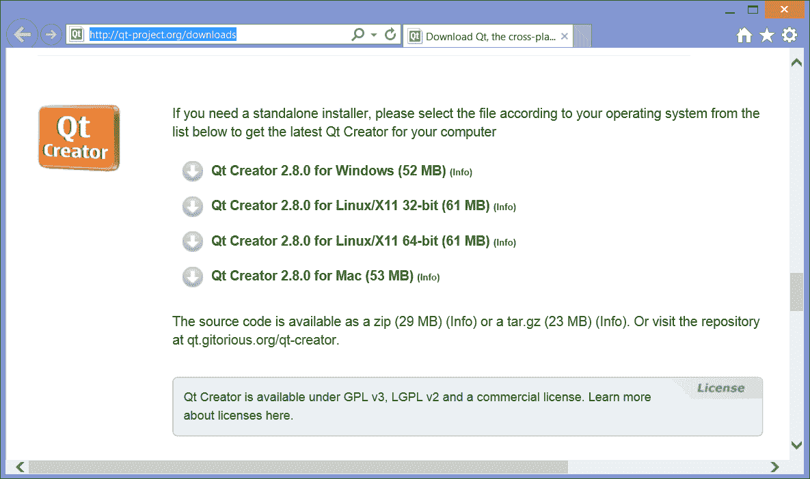
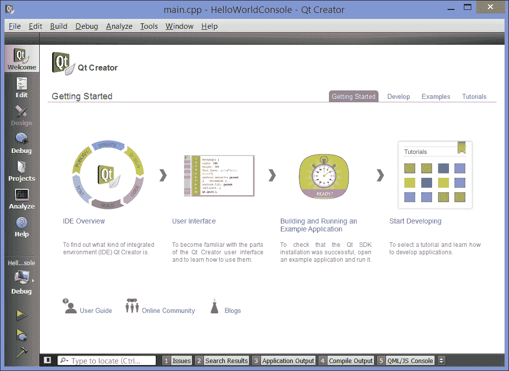
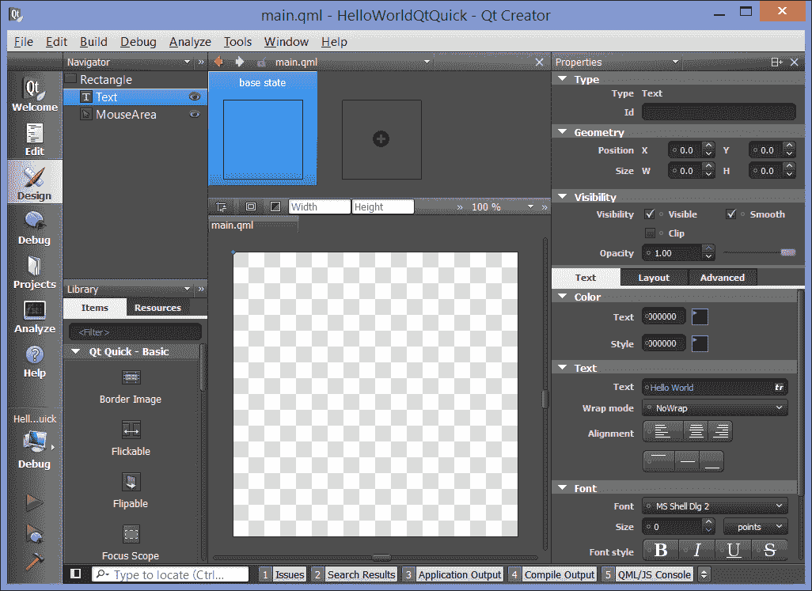

# 第一章：使用 Qt Creator 入门

Qt Creator 是集成的软件开发环境，支持传统的 C++应用程序开发，以及使用 Qt 项目的库进行开发（统称为“Qt”，发音为“cute”）。在本章中，我们将看到开始使用 Qt Creator 所需的一切：

+   在哪里下载 Linux、Mac OS X 或 Windows 的 Qt Creator

+   如何确保您的基本配置正在运行

+   快速查看简单的 Qt GUI 应用程序，以及 Qt Quick 应用程序

# 下载 Qt Creator

Qt Creator 背后的跨平台工具包 Qt 有着悠久而辉煌的历史。目前，作为 Digia 的一个项目，它在[qt-project.org](http://qt-project.org)上有自己的 URL，并提供商业和非商业许可证。

要免费开始使用非商业版本，请访问[`bit.ly/13G4Jfr`](http://bit.ly/13G4Jfr)查看类似以下截图的内容：



下载 Qt Creator

### 提示

用 Qt 进行应用程序开发的最受欢迎的平台之一是 Linux。在许多 Linux 变体中，特别是 Ubuntu，您可以使用软件包管理器获取 Qt Creator。在我的 Ubuntu 系统上，只需执行`sudo apt-get install qtcreator`命令即可获得 Qt Creator。您将获得与您的 Linux 版本匹配的 Qt 版本，尽管它可能不是 Digia 发布的最新版本。

我们还可以下载 Qt 的一部分，比如只有运行时库，或者从源代码构建 Qt Creator。这通常需要您已经安装了编译器和基本的开发工具，并且对`qmake`和 Qt 的构建配置管理系统有基本的了解。

有些下载包括您开发所需的 C++编译器和链接器；有些则不包括。例如，在 Windows 上有一个包括 MinGW 工具链的变体，因此您拥有构建应用程序所需的一切。但是，您也可以下载使用 Microsoft Visual Studio 编译器的 Windows 版 Qt Creator，因此，如果您更喜欢使用 Visual Studio 进行编译并将 Qt Creator 作为您的 IDE，这也是一个选择。在 Mac OS X 上，您需要先安装 Xcode 和命令行开发工具；您可以从 Mac OS X 应用商店下载 Xcode，然后使用 Xcode 下载命令行开发工具。

下载安装程序后，以通常的方式运行它。它将为您的平台启动一个安装向导，通常安装大约需要三到四分钟。您需要有足够的磁盘空间。Qt Creator 并不占用太多磁盘空间，但软件开发通常会占用很多空间；至少为工具和库预留 500 兆字节，为源代码、中间目标文件、调试符号以及编译的应用程序在主驱动器上预留几个千兆字节的空间。 （如果您在虚拟机上运行 Qt Creator，特别需要计划这一点；确保虚拟机镜像的虚拟硬盘有足够的磁盘空间。）您还应确保您的开发机有足够的 RAM；越多越好。Qt Creator 在 2GB 的 RAM 中运行得很好，但 Qt Creator 使用的编译器和链接器如果有更多的可用 RAM，将运行得更快。

# 熟悉 Qt Creator

以下截图显示了您第一次启动 Qt Creator 时看到的内容。让我们仔细看看屏幕的每个部分：



Qt Creator 的首页

主窗口当前显示了**IDE 概述**、**用户界面**、**构建和运行示例应用程序**和**开始开发**的图标，这是您的工作区。在正常情况下，这将是您看到应用程序源代码的地方。左侧是一系列图标，让您选择进入应用程序的各种视图。它们是：

+   **欢迎**视图显示了关于 Qt Creator 的基本信息

+   **编辑**视图允许您编辑构成应用程序的文件

+   **设计**视图允许您使用 Qt Designer 为应用程序设计用户界面

+   **调试**视图允许您在应用程序运行时调试，包括查看内存和变量、设置断点和逐步执行应用程序等操作

+   **项目**视图允许您调整项目的构建和链接设置

+   **分析**视图允许您分析应用程序的运行时性能

+   **帮助**视图提供了关于 Qt Creator 和 Qt Framework 的文档

在上一张截图中**帮助**视图按钮下方，您可以看到活动项目；当我拍摄这张截图时，我已经创建了我们的第一个应用程序。现在让我们来做吧。

# 你的第一个应用程序-你好世界

在 Qt Creator 中，从**文件**菜单中选择**新建文件或项目...**。Qt Creator 将呈现给您**新建**项目向导，让您选择要创建的项目类型，给它命名等等。要创建我们的第一个应用程序：

1.  如果您还没有选择，选择**新建文件或项目...**

1.  Qt Creator 会向您呈现一个对话框，其中有许多项目选择。选择**应用程序**，然后选择**Qt 控制台应用程序**，然后点击**选择...**

1.  Qt Creator 会要求您为项目文件存储的目录输入名称和路径。对于名称，输入`HelloWorldConsole`，选择一个对您来说有意义的路径（或接受默认值）。然后，点击**下一步**。

1.  Qt Creator 可以支持针对构建应用程序的各种工具包和库。选择默认安装的桌面 Qt 工具包，保持**发布**和**调试**选项都被选中。然后，点击**下一步**。

1.  在下一步中，Qt Creator 会提示您关于项目的版本控制。Qt Creator 可以使用您安装的版本控制客户端来执行项目的更改跟踪。现在，跳过这一步，将**添加到版本控制**设置为**无**，然后点击**完成**。

Qt Creator 创建您的项目并切换到**编辑**视图。在文件`main.cpp`的源代码编辑器中，输入以下代码：

```cpp
#include <QCoreApplication>
#include <iostream>

using namespace std;

int main(int argc, char *argv[])
{
    QCoreApplication a(argc, argv);

    cout << "Hello world!";

    return a.exec();
}
```

`QCoreApplication`任务处理应用程序的系统启动，并且每个 Qt 控制台应用程序都需要创建一个并调用其`exec`方法，作为`main`方法的一部分。它设置了 Qt 的事件处理程序，并提供了一堆移植助手，用于确定诸如应用程序目录、库路径和其他细节的事情。

对于控制台应用程序，这就是您所需要的：您可以自由地混合和匹配 Qt 类与 C++标准库和**标准模板库**（尽管一旦掌握了 Qt 的基础类，许多 STL 构造会感觉有些限制）。

接下来，让我们编译和运行应用程序。您可以使用以下任一选项：

+   按下*F5*在调试器中构建和运行您的应用程序

+   从**调试**菜单中选择**开始调试...**

+   单击左侧**帮助**视图按钮下方的绿色**运行**箭头以运行应用程序

+   单击带有错误标志的绿色**运行**箭头以调试应用程序

### 提示

如果您只想构建应用程序，可以单击**运行**和**调试**图标下方的锤子图标。

当您选择这些选项之一时，Qt Creator 会调用编译器和链接器来构建您的应用程序。如果您选择了调试选项，Qt Creator 会切换到**调试**视图（我将在下一章中详细讨论），因为它启动您的应用程序。

应用程序启动后，您将在控制台视图中看到`Hello world!`消息。

### 提示

**下载示例代码**

您可以从[`www.packtpub.com`](http://www.packtpub.com)的帐户中下载您购买的所有 Packt 图书的示例代码文件。如果您在其他地方购买了本书，您可以访问[`www.packtpub.com/support`](http://www.packtpub.com/support)并注册，以便直接通过电子邮件接收文件。

## 使用 Qt GUI 库的 Hello World

Qt 的一个优势是其丰富的 GUI 元素集合，您可以使用它们来创建窗口应用程序。制作 GUI 应用程序在原则上与制作控制台应用程序类似；只需选择**Qt Gui 应用程序**而不是**Qt 控制台应用程序**，当您选择**新文件或项目…**时，从向导的**新**对话框中选择**Qt Gui 应用程序**。现在试试看：

1.  首先，通过选择**文件**菜单中的**关闭所有项目和编辑器**关闭当前文件和项目。

1.  接下来，再次选择**新文件或项目…**，并从向导的第一步中选择**Qt Gui 应用程序**。

1.  再次通过向导，命名您的项目为`HelloWorldGui`。

1.  **新**项目向导将提示您输入实现主窗口的类的名称。保持给定的默认值：将子类保留为`QMainWindow`，名称保留为`MainWindow`。

Qt Creator 在`mainform.h`和`mainform.cpp`文件中创建类的默认子类，提供平台的基本窗口处理，并创建一个将包含应用程序窗口小部件的表单。如果此时运行应用程序，您将看到一个空窗口。而是双击 Qt Creator 第二窗格中的**Forms**文件夹，然后双击文件`mainwindow.ui`。Qt Creator 切换到**设计**视图，您将看到类似于以下屏幕截图的内容：


Qt Creator 的设计视图

左侧是您可以选择以组织小部件的布局列表，例如间隔器、视图、容器、按钮和其他小部件。中间是您的应用程序主窗口布局的视图，右侧是包含主窗口中对象层次结构和单击主窗口中任何项目的属性的窗格。

虽然我在第三章中更多地探索 Qt Designer，*使用 Qt Designer 设计您的应用程序*，您可以尝试使用它来构建一个简单的 UI：

1.  在**Type Here**处右键单击并选择**删除菜单栏**。

1.  拖动标签（在左侧窗格中的**显示小部件**下）并将其放在中央窗格中的窗口预览上。

1.  双击出现的标签，然后键入`Hello world!`。

1.  抓住标签的一个角落并调整大小，以便显示整个文本。您也可以在窗口中移动它。

1.  请注意，当您单击标签时，右下角的属性字段会更新，显示新标签的属性。

1.  在左侧窗格中的**按钮**下拖动按钮，并将其放在中央窗格中的窗口预览上。

1.  双击按钮并将其文本更改为`Exit`。

1.  选择新按钮后，在属性浏览器中将**objectName**字段更改为`exitButton`。

1.  右键单击按钮并选择**转到槽…**。一个窗口将显示一个槽的列表（目前，您可以将槽视为在动作上触发的内容）。

1.  从出现的列表中选择**clicked()**。

1.  Qt Creator 返回到`mainindow.cpp`文件的**编辑**视图。将其更改为：

```cpp
#include "mainwindow.h"
#include "ui_mainwindow.h"
#include <QApplication>
MainWindow::MainWindow(QWidget *parent) :
    QMainWindow(parent),
    ui(new Ui::MainWindow)
{
    ui->setupUi(this);
}

MainWindow::~MainWindow()
{
    delete ui;
}

void MainWindow::on_pushButton_clicked()
{
    QApplication::exit();
}
```

在运行应用程序之前，让我们确保我们了解`MainWindow`类的实现。`MainWindow`类的构造函数加载了主窗口用户界面的描述，并使用 Qt Creator 生成的`Ui::MainWindow`类进行设置。析构函数删除了代码布局的实现，`on_pushButton_clicked`方法通过调用`QApplication`类实现的静态方法`exit`简单地终止了应用程序。

最后，我们必须将`on_pushButton_clicked`方法的声明添加到`MainWindow.h`中。在左侧的浏览器中双击该文件，并确保它读取为：

```cpp
#ifndef MAINWINDOW_H
#define MAINWINDOW_H

#include <QMainWindow>

namespace Ui {
class MainWindow;
}

class MainWindow : public QMainWindow
{
    Q_OBJECT

public:
    explicit MainWindow(QWidget *parent = 0);
    ~MainWindow();

private slots:
    void on_pushButton_clicked();

private:
    Ui::MainWindow *ui;
};

#endif // MAINWINDOW_H
```

你需要添加的关键行是：

```cpp
private slots:
    void on_pushButton_clicked();
```

我们将在下一章更多地了解信号和槽；现在，知道当你点击按钮时，你正在声明一个私有函数来触发。

运行应用程序。它应该打开一个带有文本**Hello World**的单个窗口；点击窗口中的**退出**按钮（或右上角的关闭框）应该关闭应用程序。此时，如果你想了解更多关于 Qt GUI 小部件应用程序的知识，可以尝试将其他 GUI 项目拖到窗口中，或者切换到**帮助**视图并从帮助项目列表中选择**Qt Gui**来探索 Qt GUI 应用程序的帮助。

# 使用 Qt Quick 的 Hello World

Qt Quick 是 Qt 的较新的声明性用户界面框架，使用它可以非常容易地创建具有动画过渡和流畅用户界面的流畅应用程序。使用 Qt Quick，你可以使用 QML 来描述用户界面，这是一种类似于 JavaScript 的语言，让你声明用户界面元素及其关系；Qt Quick 运行时会在应用程序的实现中大部分繁重的工作。

到目前为止，你可以猜到如何创建一个 Qt Quick 项目：从**文件**菜单中选择**新建文件或项目...**，然后点击**Qt Quick 2 应用程序（内置类型）**，并按照向导进行操作。

向导不会询问任何额外的问题，如果你只是按照向导进行操作，最终会得到一个简单的应用程序，实际上在自己的窗口中显示了`Hello World`。以下是它提供的代码：

```cpp
import QtQuick 2.0

Rectangle {
    width: 360
    height: 360
    Text {
        text: qsTr("Hello World")
        anchors.centerIn: parent
    }
    MouseArea {
        anchors.fill: parent
        onClicked: {
            Qt.quit();
        }
    }
}
```

如果你了解 JavaScript，这个语法可能看起来有点熟悉，但仍然有所不同。第一行是一个导入语句；它告诉 QML 运行时应该有哪些类可用。至少，你所有的 Qt Quick 应用程序都必须导入 QtQuick 版本 2.0，就像这个例子一样。

接下来是 QML 本身。它声明了一个 360×360 像素的父矩形，确定了应用程序窗口的大小。矩形内有两个对象：**Text**和**MouseArea**。**Text**对象只是一个带有文本`Hello World`的标签，放置在矩形的中心。请注意，文本属性的值实际上是一个函数调用的结果，调用了函数`qsTr`，这是 Qt 内置的本地化函数，它查看应用程序资源以返回`Hello World`的本地化版本（如果已提供）。

**MouseArea**对象接受用户输入，并根据输入执行函数；它的大小适应父对象（`anchors.fill`设置为`parent`），并在点击时响应执行分配给`onClicked`属性的函数。这个`onClicked`函数只是通过调用 Qt 类的`quit`函数来退出应用程序。

此时，你可以以通常的方式运行应用程序，你会看到一个窗口，其中心是文本**Hello World**。

虽然原理类似，但 Qt Quick 设计师与 Qt GUI 设计师非常不同；看一下下面的截图：



Qt Quick 设计师

有一些明显的相似之处。两个设计师都显示了可以添加到视图中的事物列表，以及视图中对象的层次结构和单个对象的属性。然而，Qt Quick 小部件比 Qt GUI 小部件要少得多，而且 Qt Quick 中的小部件与本地平台的外观和感觉几乎没有匹配。按设计，Qt GUI 用于构建与本地平台匹配的传统应用程序，而 Qt Quick 用于创建具有自己外观和感觉的与设备无关的应用程序。例如，您可能会使用 Qt GUI 编写企业数据收集应用程序，而使用 Qt Quick 创建媒体中心应用程序。

然而，在这两种情况下，使用设计师是相同的。让我们在主视图中添加另一个**MouseArea**，并让它做一些事情：

1.  在 Qt Creator 的文件列表中选择`main.qml`，然后单击**设计**以查看**设计**视图。

1.  在**库**窗格上，选择项目并向下滚动，直到看到**矩形**。将矩形拖到中心窗格并将其放置在`Hello World`标签的上方某处。您可能需要调整矩形的大小，以便标签仍然可见。

1.  在窗格中选择矩形，在**颜色**下，输入矩形的颜色。

1.  现在从**库**窗格中拖出一个**MouseArea**对象，并将其放在新的矩形上。

1.  选择**MouseArea**后，选择**布局**，并将鼠标悬停在布局上，直到看到**填充到父级**。然后单击它。

1.  返回**编辑**视图并修改`main.qml`，使其看起来像下面这样：

```cpp
import QtQuick 2.0

Rectangle {
    width: 360
    height: 360
    Text {
 id: text
        text: qsTr("Hello World")
        anchors.centerIn: parent
    }
    MouseArea {
        anchors.fill: parent
        onClicked: {
            Qt.quit();
        }

        Rectangle {
            id: rectangle1
            x: 80
            y: 7
            width: 200
            height: 124
            color: "#777777"

            MouseArea {
                id: mousearea1
                anchors.fill: parent
 onClicked: text.text = qsTr("Hi there!")
            }
        }
    }
}
```

您应该看到大部分更改是由**设计**视图进行的；它在原始**MouseArea**对象内添加了一个矩形，以及另一个**MouseArea**。您应该需要添加一行，将`text`元素的 ID 设置为 text，并将`onClicked`处理程序添加到您在**设计**视图中拖出的新**MouseArea**对象。`id`属性允许其他 QML 通过名称访问文本字段（在本例中，它的名称只是 text），而`onClicked`处理程序将文本项的`text`属性的内容更改为文本`Hi there!`。

这里值得观察一下`qsTr`：您不必向应用程序资源添加任何文本即可使基本本地化工作。这与大多数其他平台不同，其他平台的本地化是通过为具有未本地化字符串的默认值提供本地文件中的键值来实现的。

运行应用程序。您将看到矩形在文本**Hello World**上方，单击矩形会将文本更改为**Hi there!**。

# 概要

获取 Qt Creator 很容易；它只是一个网页下载，或者在大多数 Linux 平台上，它是通过本机软件包管理器的可选安装（尽管软件包管理器提供的版本可能比您从 Qt 项目网站获得的版本稍微旧一些）。

Qt Creator 为您在项目中组织源代码；当您首次启动它时，您可以创建一个默认项目，或者创建一个新项目来包含应用程序的源代码和资源。Qt Creator 中包含了编译和调试应用程序所需的所有选项。此外，它支持用于开发 Qt GUI 和 Qt Quick 应用程序的设计工具。

在下一章中，我们将深入了解如何配置 Qt Creator 以编译和编辑您的代码，包括如何向项目添加源文件，配置编译器和链接器选项，添加第三方库的依赖项等。
