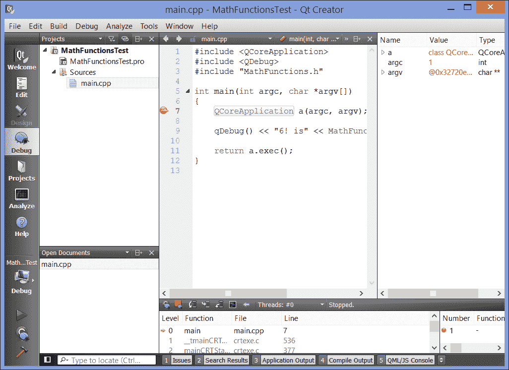
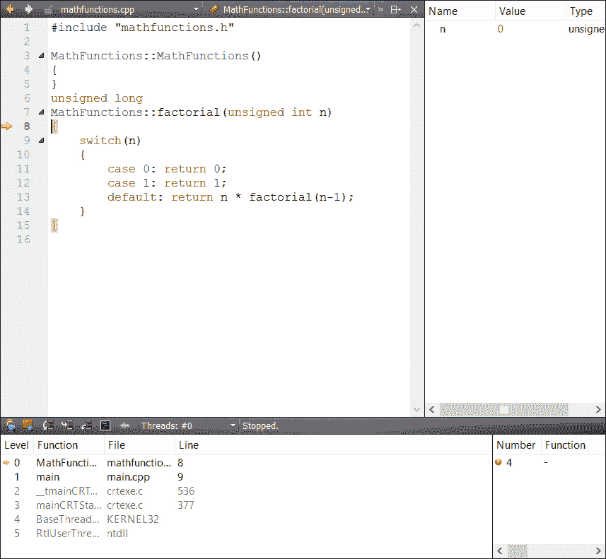
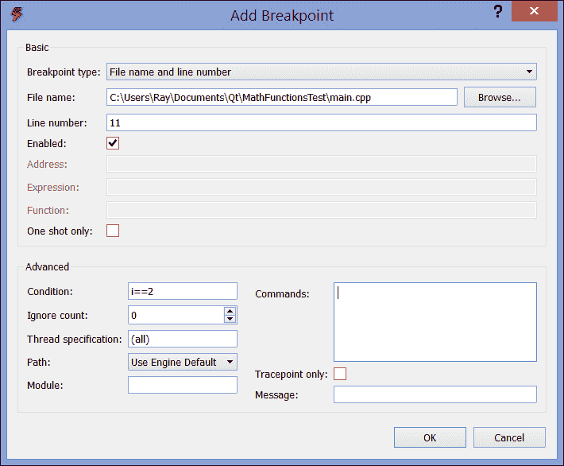
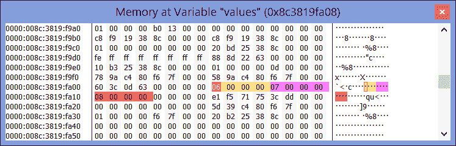
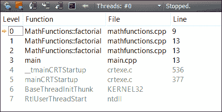

# 第二章。使用 Qt Creator 构建应用程序

你要做的第一件事是弄清楚如何向 Qt Creator 添加源文件并构建（或调试）你的项目。本章就是关于这个的-我们将讨论如何向项目添加文件，如何创建库以及如何使用调试器和控制台记录器。在本章结束时，你将能够驾驭 Qt Creator 来开发你的控制台应用程序。

# 入门-我们的示例库

本章的示例代码有两个部分：定义公共函数的库和调用该函数的控制台应用程序。库是拆分应用程序的好方法，虽然这个例子很简单，但也让我向你展示如何创建一个库并将其包含在你的应用程序中。

我要稍微拉伸一下你的想象力：假设你负责设置一个数学函数库。在这个例子中，我们只会编写一个函数，`factorial`。你应该记得从入门编程中的`factorial`函数；它用*a!*表示，并定义为：

+   0！是 0

+   1！是 1

+   *n!*是*n × (n-1)!*

这是一个递归定义，我们可以这样编码：

```cpp
unsigned long factorial(unsigned int n)
{
    switch(n) 
    {
        case 0: return 0;
        case 1: return 1;
        default: return n * factorial(n-1);
    }
}
```

### 提示

一个避免函数调用成本的替代定义是：

```cpp
unsigned long factorial(unsigned int n)
{
    unsigned long result = 1;
    for(unsigned int i = n; i > 1; i--)
    {
        result *= i;
    }
}
```

为什么我选择了递归定义？有三个原因：我认为这更清晰，函数调用的性能开销在这个例子中并不重要，并且本书的许多读者可能会将这本书作为入门计算机科学课程的一部分，递归是教授和应该加强的。

让我们开始创建实现我们的`factorial`函数的库。要做到这一点：

1.  在 Qt Creator 中，从**文件**菜单中选择**新建文件或项目…**。

1.  在对话框的左侧窗格中选择**库**，并从中央窗格中选择**C++库**。

1.  Qt Creator 可以创建动态库（在 Windows 中称为 DLL）、静态库或可以在应用程序之间共享的插件。我们将创建一个静态库，所以在下一个屏幕上选择**静态链接库**，并将其命名为`MathFunctions`。选择一个合理的项目路径。

1.  在向导的下一步中，保持 Qt 版本、**调试**和**发布**项目选中。

1.  Qt Creator 构建的库可以依赖于 Qt 库本身。让我们允许这个库依赖于 QtCore，Qt 的核心数据结构；在**选择所需模块**窗口中，保持**QtCore**选中，然后点击**下一步**。

1.  在下一个窗口中，你将命名 Qt Creator 将添加到你的项目中的骨架文件。点击**下一步**。

1.  在**项目管理**窗口中，选择版本控制选择**<无>**（我们不会为这个项目使用版本控制），然后点击**完成**。

1.  编辑`mathfunctions.h`以包括我们的`factorial`函数的静态方法声明：

```cpp
#ifndef MATHFUNCTIONS_H
#define MATHFUNCTIONS_H

class MathFunctions
{
public:
    MathFunctions();

    static unsigned long int factorial(unsigned int n);
};

#endif // MATHFUNCTIONS_H 
```

1.  打开`mathfunctions.cpp`。有两种方法可以做到这一点，一种是在**项目**窗格中双击它，另一种是右键单击`factorial`函数，然后选择**切换头/源**。编写你的`factorial`函数；`mathfunctions.cpp`应该是这样的：

```cpp
#include "mathfunctions.h"

MathFunctions::MathFunctions()
{
}

unsigned long
MathFunctions::factorial(unsigned int n)
{
    switch(n)
    {
        case 0: return 0;
        case 1: return 1;
        default: return n * factorial(n-1);
    }
}
```

1.  点击左侧的**项目**按钮，并更改**发布**和**调试**构建的输出路径，通过编辑**常规**下的**构建目录**行，首先是**发布**，然后是**调试**构建配置。为了做到这一点，从**构建目录**路径中删除`release`和`debug`部分。这样，当你构建你的库时，Qt Creator 会将你的库的发布和调试版本放在一个单独的文件夹中，而不是分别命名为`release`和`debug`的文件夹。

在编写代码时，请注意 Qt Creator 在各个阶段会提示您从头文件中推断出的内容，并提供自动建议（称为**自动建议**）。例如，一旦您键入`MathFunc`，它会提供自动完成类名或 C 预处理器保护；您可以使用鼠标选择其中一个，或者只需按*Enter*获取类名。同样，键入双冒号告诉 Qt Creator 您正在尝试输入`MathFunctions`类，并提示您`MathFunctions`类成员；您可以使用箭头选择`factorial`并按*Enter*，它会自动输入。最后，键入开括号提示 Qt Creator 您正在定义一个函数，并提示您在头文件中定义的该函数的参数。当您输入代码时，您会经常看到这种自动完成；这也是学习 Qt 的好方法，因为您可以键入类名或部分函数名，Qt Creator 会在途中提示您有用的提示。

在继续之前，请确保您已经在发布和调试配置中构建了您的库。这样做的最简单方法是单击左下角的构建选择器，然后选择**发布**或**调试**，然后单击锤子图标进行构建。

# 学习景观——构建菜单和.pro 文件

在上一章中，您学会了如何通过点击 Qt Creator 主窗口角落的锤子按钮或启动调试器来构建应用程序。要构建您的库或任何应用程序，您可以使用锤子图标或**构建**菜单中的各种选项。明显的选择是**构建所有**或**重新构建所有**；选择**构建所有**只重新编译 Qt Creator 识别为需要重新构建的文件；**重新构建所有**清理项目的所有对象文件，并从头开始重新构建整个项目。在大多数情况下，选择**构建所有**就足够了，这也是您想要做的，因为它更快。有时，当 Qt 的`make`系统无法协调所有依赖关系时（或者您已经对依赖关系进行了更改），您确实需要重新构建整个项目。现在选择**构建所有**，并等待它构建，同时我们讨论其他选项。

**构建**菜单允许您构建单个文件——如果您只想检查正在编写的代码的语法并确保没有错误，或者整个项目。它还允许您在调试器之外运行项目，在某些情况下可能需要这样做，比如进行演示。您还可以通过选择**清除所有**来清理项目（删除所有对象文件和其他自动生成的产品）。**发布**选项适用于一些附加工具包，这些工具包允许您将编译的应用程序和库发布到应用商店和存储库；您可以在任何 Qt Creator 插件的文档中找到有关此内容的更多详细信息，例如用于 Maemo 开发的 SDK（诺基亚旧版 Linux 变体，用于手持设备）。

每个 Qt Creator 项目背后都有一个`.pro`文件；这个文件的作用与`make`文件相同，并且实际上是由一个名为`qmake`的 Qt 工具命令处理的。（Make 文件是由`make`命令处理的文件，指示应以何种顺序编译文件以生成可执行文件。）这些文件是声明性的，您在其中声明了构成应用程序的文件之间的关系，`qmake`会从中找出如何构建您的应用程序。在大多数情况下，您可能需要对`.pro`文件进行很少或没有更改，但了解它们的工作原理也无妨。双击`MathFunctions.pro`，您会发现：

```cpp
#-------------------------------------------------
#
# Project created by QtCreator 2013-07-23T19:50:46
#
#-------------------------------------------------

QT       -= gui

TARGET = MathFunctions
TEMPLATE = lib
CONFIG += staticlib

SOURCES += mathfunctions.cpp

HEADERS += mathfunctions.h
unix:!symbian {
    maemo5 {
        target.path = /opt/usr/lib
    } else {
        target.path = /usr/lib
    }
    INSTALLS += target
}
```

`.pro`文件的基本语法是变量赋值；Qt Creator 为我们生成的这个文件分配了以下变量：

+   `QT`变量指示您的项目将链接的 Qt 模块。默认情况下，所有项目都包括 QtCore 和 QtGui；还有大量其他可用的模块，其中包括关键功能，如 WebKit 网络浏览引擎（`QtWebkit`）和多媒体库（`Phonon`）。我们在这里的任务是指出我们使用默认的 Qt 模块，但不链接`QtGui`。

+   `TARGET`变量是编译库或可执行文件的名称。

+   `TEMPLATE`变量指示`qmake`应该使用哪种模板来生成二进制文件；在我们的情况下，我们说它应该使用模板来创建一个`lib`文件-一个库。

+   `CONFIG`变量将额外的配置传递给`qmake`的模板；在这里，我们说我们想要一个静态链接的库。

+   `SOURCES`和`HEADERS`变量包含构成项目的源文件和头文件的列表。

+   `INSTALLS`变量指示应该安装生成的构建产品的位置。在这里，它设置在一个范围内。范围允许您在`qmake`中指定条件选项；范围的条件是一个变量或表达式，可以是`true`或`false`，如果变量为`true`，则执行后面的代码。文件末尾的范围表示：“如果我们正在构建`unix`变体，并且变体不是`symbian`，则将`target.path`变量设置为`/opt/usr/lib`，如果`unix`变体是`maemo`，否则将其设置为`/usr/lib`，对于其他`unix`变体，并且在任何情况下，将`INSTALLS`变量设置为`target`”。

这些是您几乎可以在任何`.pro`文件中找到的基本变量；有关您可以使用的`qmake`范围的详细讨论，可以参见[`bit.ly/163tAIh`](http://bit.ly/163tAIh)。您可能还想了解的两个附加变量是`DEFINES`和`LIBS`；`DEFINES`允许您指定在整个构建过程中应设置的预处理器定义，而`LIBS`指示 Qt Creator 链接项目的附加库。

请注意变量的管理方式：使用`=`进行赋值，使用`+=`向列表中添加项目，使用`-=`从列表中删除项目。

# 链接到我们的示例库

现在，让我们制作一个依赖于我们的库的应用程序。我们的应用程序将调用库中的`factorial`函数，静态链接到库以访问`factorial`函数。为了实现这一点，您需要：

1.  从**文件**菜单中选择**关闭所有项目和编辑器**。

1.  从**文件**菜单中选择**新文件或项目…**，并使用向导创建一个名为`MathFunctionsTest`的新 Qt 控制台应用程序。

1.  右键单击**MathFunctionsTest**，然后选择**添加库**。然后可以选择构建树中的库，构建树之外的库，或者系统上的外部库，如 Unix 数学库、`ffmpeg`或其他您创建的库。选择**外部库**，然后单击**下一步**。

1.  通过单击**浏览**旁边标有**库文件**的行来浏览上一节中构建的库文件。它将在项目文件夹中的名为`build-MathFunctions-Desktop_Qt_5_0_2_MSVC2012_64bit`的文件夹中。在`release`或`debug`文件夹中选择`MathFunctions`库，无论选择哪个都可以。

1.  通过单击**浏览**旁边的**包含路径**来浏览库的包含文件；这是您放置库头文件的目录。

1.  选择静态链接；如果您链接的是动态链接库，当然您会选择**动态**。

1.  将其他值保持为默认值，然后单击**下一步**，然后单击**完成**。

Qt Creator 将使用您的.pro 文件进行魔术操作，添加一个包含您的库构建输出的`LIBS`变量，并包含您的库头文件的包含路径。

现在我们可以调用我们的`factorial`函数。编辑`main.cpp`以读取：

```cpp
#include <QCoreApplication>
#include "MathFunctions.h"

int main(int argc, char *argv[])
{
    QCoreApplication a(argc, argv);

    qDebug("6! is %d", MathFunctions::factorial(6));

    return a.exec();
}
```

这段代码首先包含了我们的库头文件。请注意，如果你在添加了`#include`声明后编译应用程序，你将为`MathFunctions`库的每个元素获得自动建议帮助。这段代码使用`qDebug`而不是 C 标准库来执行控制台输出。

### 提示

`qDebug()`函数实际上也有一个流智能的实现。我本可以将`qDebug`行写成

```cpp
qDebug() << "6! is" << MathFunctions::factorial(6);
```

代码将生成相同的输出。

现在，在调试模式下构建和运行应用程序；你应该看到一个带有文本`6! is 720`的控制台窗口。尝试在发布模式下构建和运行库；等等，为什么`qDebug`的调试输出还在那里？

`qDebug`实际上不是一个调试日志，它是一个用于调试信息的输出流，不受构建级别限制。如果你想在发布构建中关闭它的输出，你需要编辑`.pro`文件。双击你的`.pro`文件，并添加以下行：

```cpp
CONFIG(release, debug|release): DEFINES += QT_NO_DEBUG_OUTPUT
```

这是另一个范围：它表示如果你的构建配置是发布，将`QT_NO_DEBUG_OUTPUT`预处理器定义添加到项目的预处理器定义列表中。

现在，如果你重新构建（不只是选择构建，而是选择重新构建，因为你希望整个系统进行一次干净的构建）并在发布模式下运行，你将看不到任何输出。

### 提示

Qt 实际上定义了四个输出流，一个用于调试消息，一个用于真正的警告。使用`qDebug`进行常规日志记录，使用`qWarning`输出优先级更高的消息。还有`qCritical`和`qFatal`用于指示关键失败或导致应用程序终止的更高优先级日志消息。你也可以以相同的方式在发布构建中关闭警告；只需将以下内容添加到你的`.pro`文件中：

```cpp
CONFIG(release, debug|release): DEFINES += QT_NO_WARNING_OUTPUT
```

如果你想向项目添加文件怎么办？你可以通过手动编辑`.pro`文件来做，如果你是一个熟练的打字员，这可能更快，但也容易出错，如果搞砸了会导致奇怪的构建问题，或者右键单击你的项目，然后选择**添加新建…**或**添加现有文件…**。**添加新建…**选项打开一个简短的向导，提供了这样的选择：

+   C++头文件和源文件

+   我们将在下一章讨论的 Qt Designer 表单

+   我们将在下一章讨论的 Qt 资源文件

+   Qt Quick 标记（QML）文件

+   JavaScript 文件（可以包含实现 Qt Quick 应用程序逻辑的代码）

+   用于完整 OpenGL 或 OpenGL/ES 中片段或顶点的 OpenGL 着色器

+   文本文件（比如项目的`Readme`文件）或一个用作临时剪贴板项目存放处的草稿文件，直到你完成编辑会话

在我们继续讨论调试的重要主题之前，让我们再看一个应用程序的`.pro`文件：

```cpp
#-------------------------------------------------
#
# Project created by QtCreator 2013-07-23T20:43:19
#
#-------------------------------------------------

QT       += core

QT       -= gui

CONFIG(release, debug|release): DEFINES += QT_NO_DEBUG_OUTPUT

TARGET = MathFunctionsTest
CONFIG   += console
CONFIG   -= app_bundle

TEMPLATE = app

SOURCES += main.cpp

win32:CONFIG(release, debug|release): LIBS += -L$$PWD/../build-MathFunctions-Desktop_Qt_5_0_2_MSVC2012_64bit/release/ -lMathFunctions
else:win32:CONFIG(debug, debug|release): LIBS += -L$$PWD/../build-MathFunctions-Desktop_Qt_5_0_2_MSVC2012_64bit/debug/ -lMathFunctions
else:unix: LIBS += -L$$PWD/../build-MathFunctions-Desktop_Qt_5_0_2_MSVC2012_64bit/ -lMathFunctions

INCLUDEPATH += $$PWD/../MathFunctions
DEPENDPATH += $$PWD/../MathFunctions

win32:CONFIG(release, debug|release): PRE_TARGETDEPS += $$PWD/../build-MathFunctions-Desktop_Qt_5_0_2_MSVC2012_64bit/release/MathFunctions.lib
else:win32:CONFIG(debug, debug|release): PRE_TARGETDEPS += $$PWD/../build-MathFunctions-Desktop_Qt_5_0_2_MSVC2012_64bit/debug/MathFunctions.lib
else:unix: PRE_TARGETDEPS += $$PWD/../build-MathFunctions-Desktop_Qt_5_0_2_MSVC2012_64bit-Debug/libMathFunctions.a
```

哦！这相当密集。让我们看看我们能不能解开它。它首先告诉构建系统我们使用 QtCore，但不使用 QtGui。接下来的指令是在发布构建中禁用`qDebug`消息，这不会默认发生。`TARGET`、`CONFIG`和`TEMPLATE`选项一起表示我们正在构建一个名为`MathFunctionsTest`的控制台应用程序。下一行指示我们有一个源文件`main.cpp`。

下一组范围指示了我们库的路径，并处理了我们的库在 Windows 上的`release`和`debug`目录不同的情况——这与 Unix 系统不同，在 Unix 系统中库只有一个`build`变体。之后是`INCLUDEPATH`和`DEPENDPATH`变量，指示`MathFunctions`目录中有库头文件，并且应用程序依赖于这些头文件。因此，如果头文件的时间戳发生变化，二进制文件应该重新构建。最后一个范围指定了对输出库本身的相同依赖；如果库发生变化，应用程序可执行文件必须重新构建。这一点尤为重要，因为这样我们可以运行多个 Qt Creator 的副本，分别编辑我们的库和应用程序文件，在它们发生变化后构建我们需要的部分。当我们这样做时，所有的依赖关系都会被解决，库和应用程序的正确部分会自动构建。

# 迷失和重新找到——调试

Qt Creator 拥有一流的 GUI，可以连接到 GNU 调试器 GDB，或者如果你使用 Microsoft 工具，还可以连接到 Microsoft 的命令行调试器 CDB。

如果你在 Mac OS 或 Linux 上安装了 Qt Creator，或者在 Windows 上安装了 MinGW 版本的 Qt Creator，你已经拥有了开始调试应用程序所需的一切。如果你已经安装了 Microsoft Visual Studio 并安装了使用 Microsoft 编译器的 Qt Creator 版本，你还需要安装 Microsoft 命令行调试器以使用 Qt Creator 的调试功能。以下是安装命令行调试器的方法：

1.  下载 Windows 的调试工具，如果你使用 32 位版本的编译器和 Qt Creator，请访问[`bit.ly/1dWoqi0`](http://bit.ly/1dWoqi0)，如果你使用 64 位版本的编译器和 Qt Creator，请访问[`bit.ly/12kEtGt`](http://bit.ly/12kEtGt)。

1.  通过转到**工具**菜单下的**选项**，选择左侧的**调试器**项目，选择**CDB**选项卡，然后点击**符号路径**行旁边的**编辑**来配置调试符号服务器。

### 提示

通常情况下，Qt Creator 可以直接使用调试器，除非你使用的是 Microsoft 的工具链。但是，如果你遇到问题，请参考 Qt 文档中有关设置调试器的部分，网址是[`bit.ly/19jgycQ`](http://bit.ly/19jgycQ)。

下面的截图显示了调试器在我们的测试项目中的运行情况，停在一个断点上：



Qt Creator 的调试视图运行中

让我们仔细看一下截图以便定位：

+   左侧是 Qt Creator 中选择视图的通常按钮行

+   按钮旁边是项目文件的视图和打开文档的列表

+   在主编辑窗格中，每个源代码行都有一个可点击的指示器，让你设置和清除断点。

+   在编辑器窗格下面的窗格中显示了调用堆栈，指示程序如何到达执行停止的行

+   右上角是变量检查器，你可以在当前堆栈帧中看到变量的值，以及任何全局变量。

+   在变量检查器下面是一个待处理断点的列表，这样你就可以在不需要在代码中搜索的情况下打开和关闭断点。

为了生成上面的截图，我点击了第 7 行的左侧，设置了一个断点，然后在构建选择器中确保我指定了一个调试构建，然后点击了左侧的**调试**按钮。Qt Creator 以调试模式构建了应用程序，启动了应用程序，并让它运行到第 7 行的断点处。

## 设置断点和逐行调试程序

断点，如果您以前没有遇到过这个概念，就是这样——执行中断的点，您可以检查程序的状态。一旦在断点处停止，您可以进入函数，或者跳过一行，逐行执行程序，以查看其行为。在**调试**视图中，单击行号左侧可以设置或清除断点。在断点处停止时，编辑窗格边缘的黄色箭头指示处理器即将执行的代码行。

在断点处停止时，调用堆栈窗格上方会出现几个按钮，让您控制程序流程。它们是：

+   绿色继续按钮，继续执行由箭头指示的行。您也可以通过按下*F5*功能键来继续。

+   红色停止按钮，完全停止调试。

+   跳过按钮，执行当前行并在再次停止之前前进到下一行。您可以通过按下*F10*来跳过一行。

+   进入按钮，输入下一个要调用的函数并再次停止。您可以通过按下*F11*来进入函数。

+   跳出按钮，在当前调用上下文中运行函数的其余部分，然后再次停止。您可以通过按下*F11*来跳出当前函数。

+   逐条指令按钮（看起来像一个小屏幕），可以在源代码行和汇编代码行之间切换调试器。

+   还有一个线程菜单，因此您可以看到哪个线程正在运行或停止。

如果（在上一张屏幕截图中）从第**7**行跳过第**8**行（按下*F10*），然后按下*F11*，我们将进入我们的`factorial`函数，就像您在下一张屏幕截图中看到的那样。我已经裁剪了屏幕截图，所以您只能看到调试器中已更改的相关窗格，并且稍微调整了窗口大小，以便您可以看到整个调用堆栈。



调试器即将进入函数

此时，如果我们再次步进一行（*F10*），我们将看到右侧列中**n**的值发生变化，并且箭头将前进指向第**9**行（再次，如屏幕截图中编号的那样）。从这里，我们可以以几种方式调试我的函数：

+   通过查看右侧窗格中的变量来检查变量的内容。如果它在当前调用帧的上方的堆栈帧中，我们可以更改调用帧并查看不同调用帧中的变量。

+   我们可以通过单击其值并输入新值来修改变量。

+   使用一些调试器，我们可以将箭头移动到调用函数中的不同行，以跳过一个或多个代码行，或者倒带执行以重新运行代码段。

这个最后的功能——不幸的是，它与 CDB 不兼容——特别强大，因为我们可以逐步执行程序，观察错误，修改变量以解决错误的过程，并继续测试我们的代码，而无需重新编译代码和重新运行可执行文件。或者，我们可以通过替换相关变量的新状态并从当前调用帧的新位置继续，跳过我们知道需要花费很长时间运行的一部分代码。

还有许多其他事情可以做，从调试应用程序的方式到在应用程序运行时查看应用程序状态的各种方式。在主**调试**菜单上，我们可以：

+   通过从**调试**菜单中选择**分离**来从运行中的进程中分离调试器（如果调试器减慢了速度，而我们知道我们的代码的一部分不需要调试，这很方便）。

+   通过从**调试**菜单中选择**中断**来中断程序执行，停止执行并检查当前状态（如果我们的应用程序似乎陷入了一个我们没有预料到的长循环并且似乎挂起，这很有用）。

+   在停止时，我们可以通过选择**运行到行**或按下*Ctrl* + *F10*来运行光标所在的行。

+   停止时，我们可以通过选择**跳转到行**来跳转到光标所在的行。

## 断点的精细控制

如果您在断点窗格中右键单击，可以添加、编辑或删除断点。点击**添加断点…**或**编辑断点…**会弹出断点编辑器，这是一个令人生畏的对话框，鉴于它只是一个简单的断点。以下截图显示了断点编辑器：



断点编辑器窗口

从编辑器中，您可以微调断点设置：

+   断点的类型。大多数断点是按文件名和行号进行的——代码的特定行——但您还有其他几种选择，包括：

+   按名称的函数入口点

+   当内存地址被执行到

+   当抛出或捕获 C++异常时

+   当发生 JavaScript 异常时

+   当您的主函数开始时

+   当一个新进程被分叉时

+   当系统调用发生时

+   当在固定位置访问数据，或者在运行时涉及指针变量的表达式指示的地址时

+   断点的位置（例如源行号和文件名，或函数），取决于您在上一个列表中的选择。

+   无论断点是否启用。

+   断点是否是一次性的，也就是说，触发一次后将被禁用。

+   断点的条件，例如涉及程序变量值的表达式，忽略断点的次数以及断点适用于哪些线程。

## 检查变量和内存

变量窗格显示当前堆栈帧中所有变量的值。结构显示其成员的值，因此您也可以遍历复杂的数据结构。从变量窗格中，您还可以将变量名称和值复制到剪贴板，或者只复制变量值。

从变量窗格中，有一个非常有用的功能称为**表达式求值器**，它允许您构建关于代码中变量的代数表达式并查看结果。例如，如果我停在`factorial`函数的开头，就像您在*调试器即将进入函数*截图中看到的那样，**n**设置为`6`，我可以右键单击变量窗格，选择**插入新表达式求值器**，然后在出现的对话框中输入一个公式`n*(n-1)`，然后窗格中会出现一个新行，显示表达式和值**30**。虽然这是一个相当牵强的例子，但我也可以查看指针值和指针解引用。

当变量发生变化时，我还可以有条件地中断执行；这称为条件断点或数据断点。例如，让我们在主函数中放一个循环，并在执行循环时中断。要做到这一点，首先更改`main`如下：

```cpp
#include <QCoreApplication>
#include <QDebug>
#include "MathFunctions.h"

int main(int argc, char *argv[])
{
    QCoreApplication a(argc, argv);

    int values[] = { 6, 7, 8 };

    for(int i = 0; i < sizeof(values)/sizeof(int); i++)
    {
        qDebug() << values[i]
                 << "! = "
                 << MathFunctions::factorial(values[i]);
    }

    return a.exec();
}
```

这将遍历整数数组值中存储的值，并打印每个值的计算阶乘。重新开始调试，然后让我们在`i`上添加一个数据断点。要做到这一点：

1.  在`main`的第一行上设置一个断点，该行初始化`QCoreApplication`。

1.  在左窗格中右键单击`i`，然后从**添加数据断点**子菜单中选择**在对象地址处添加数据断点**。

1.  按下*F5*或**继续**按钮继续。

当`i`设置为`0`时，执行将在第**11**行停止，即`for`循环的开始。每次我按下*F5*继续，应用程序都会运行，直到`i`的值因`for`循环末尾的`i++`语句而发生变化。

您还可以通过单击变量检查器窗格中数组名称旁边的展开箭头来检查和更改数组的单个值。

除了查看和更改变量值，您还可以查看和更改单个内存位置。例如，如果您需要查看内存中的特定位置，例如调试二进制格式的解码器或编码器，您可能需要这样做。从变量窗格中，您有几个选择：

+   您可以右键单击给定变量并在该变量地址处打开内存窗口

+   您可以右键单击给定变量并在变量指向的值处打开内存窗口（换句话说，解引用指向内存位置的指针）

+   您可以右键单击变量窗格，并在当前堆栈帧的开头打开内存浏览器

+   您可以右键单击变量窗格，并在内存中的任意位置打开内存浏览器

以下屏幕截图显示了内存查看器显示包含数组值的内存：



内存查看器窗口

窗口显示左侧的内存地址，每行十六个字节的内存值（先是十六进制，然后是 ASCII），并且突出显示你选择打开窗口的实际变量。您可以选择一系列值，然后右键单击执行以下操作：

+   以 ASCII 或十六进制形式复制值

+   在您选择的内存位置上设置数据断点

+   将执行转移到您单击的地址（如果您正在查看数据，这可能不是您想要做的）

## 检查调用堆栈

**调用堆栈**是应用程序执行在某一时间点的函数调用层次结构。虽然实际流程各不相同，但通常在您的代码中，它始于`main`，尽管调用`main`的内容因平台而异。调用堆栈的一个明显用途是在按下**中断**按钮时提供上下文；如果您的程序在某个地方的循环中只是在思考问题，点击**中断**并查看调用堆栈可以给您一些线索。

还记得我如何定义`factorial`函数吗？如果您在`factorial`中设置断点，调用它，并在查看调用堆栈之前继续通过断点几次，您将看到类似以下屏幕截图的内容：



递归函数的调用堆栈在中间计算时

从左到右，调用堆栈窗口的字段是堆栈级别（从堆栈顶部向下编号），正在调用的函数，定义函数的文件，以及当前正在执行的函数的行号。因此，这个堆栈帧表示我们在`mathfunctions.cpp`的`MathFunctions::factorial`的第**9**行，由`MathFunctions::factorial`的第**13**行调用，依此类推，直到在我们的`main`函数中结束，并在此之前是操作系统用来设置应用程序进程的系统启动代码。

如果您右键单击调用堆栈窗格的一行，您可以：

+   重新加载堆栈，以防显示出现损坏。

+   将调用堆栈的内容复制到剪贴板；这对于错误报告非常有用。如果您的应用程序在调试器中抛出异常或崩溃，您可以复制调用堆栈并将其发送给负责该部分代码的开发人员（或者留作纪念品）。

+   在调用堆栈中函数调用所指示的代码行的指令地址处打开内存编辑器。

+   在调用堆栈中函数调用所指示的代码行的指令地址处打开反汇编器。

+   反汇编内存区域或当前函数。

+   在调试时在调用堆栈窗口中显示程序计数器地址。

# 项目窗格和构建项目

您已经看到了`.pro`文件如何影响项目的编译，但它的作用远不止于此。如果您在 Qt Creator 左侧点击**项目**按钮，您将看到项目选项，包括**构建和运行**选项，**编辑器**选项，**代码样式**选项和**依赖项**，每个选项都有自己的面板。

在大多数情况下，您不需要调整这些设置。但是，您可能需要调整**构建和运行**设置，特别是如果您要针对多个平台进行目标设置，例如使用交叉编译器在 Windows 和 Linux 上，或者在 Digia 完成对这些平台的支持后，在 Android 和 iOS 上。 （我稍后会在本书的后面更多地介绍这一激动人心的 Qt 发展。）

您应该知道的最后一件事是构建和运行工具包选择器。Qt 是当今最好的跨平台工具包之一，您很容易发现自己在支持多个平台的系统上工作，例如 Linux 和 Android，或者 Qt 的多个版本。为了支持这一点，Qt 有一个构建工具包的概念，它只是支持特定平台的头文件、库和相关内容。您可以安装多个构建工具包，并通过选择**打开构建**和**运行工具包选择器…**来选择您要编译的构建工具包。默认情况下，如果您按照上一章中的步骤安装了 Qt Creator，您将安装一个构建工具包；从 Digia 网站上，您可以选择其他工具包。在后面的章节中，我们将为 Android 上的 Qt 构建一个示例应用程序。为此，您需要下载并安装 Qt on Android 构建工具包，然后告诉 Qt Creator 有关新工具包。添加工具包很容易，您只需要在 Qt Creator 中安装工具包，然后按照以下步骤操作：

1.  点击左侧的**项目**。

1.  单击出现的面板左上角的**管理工具包…**。**构建和运行**选项窗口将出现。

1.  Qt 可能会自动检测到您的新工具包，或者您可能需要通过单击**添加**来添加它。单击**添加**后，您需要指定目标平台（例如 Android 设备）、要使用的编译器等。

对于构建设置，有发布和调试构建的配置选项。在**构建设置**编辑器中，您可以控制构建产品是否放置在它们自己的目录中（默认情况下，所谓的影子构建，其中您的构建输出与源代码混合），构建的`qmake`配置（实际上看到 Qt Creator 将如何调用`qmake`），Qt Creator 如何清理您的项目，以及您需要为构建设置的任何环境变量。

运行设置让您控制应用程序是在本地运行还是部署到远程主机（不一定始终支持，但通常适用于诸如 Android 之类的平台），您想要传递给应用程序的任何命令行参数，以及性能分析工具的设置，我将在第四章中更多地谈到*使用 Qt Linguist 本地化您的应用程序*。

在**编辑器**面板中，您可以为此项目设置特定的编辑器选项。这些选项会覆盖全局 Qt Creator 默认设置，您可以通过选择**工具**菜单中的**选项**并选择**文本编辑器**选项来设置这些选项。这些选项包括诸如在格式化代码时是否使用制表符或空格（我强烈建议您使用空格；它与任何编辑器兼容）、每个制表位的空格数、是否自动缩进、源文件应该如何编码等细节。

**代码风格**面板是 Qt Creator 全局设置的另一个覆盖（这次是 C++和 Qt Quick 面板，可以从**选项**菜单中的**选项**对话框中找到）。在这里，您可以选择默认样式，或编辑样式。

### 提示

我强烈建议您选择与您正在编辑的现有源代码相匹配的样式；如果您是从空白页面开始的，Qt 默认样式非常易读，也是我最喜欢的。

**依赖项**面板允许您设置构建顺序，如果您的项目文件包含多个子项目，以便以正确的顺序构建事物。例如，我们可以选择同时打开我们的库项目和测试项目；如果我们这样做，我们将在依赖项中看到`MathFunctions`库，并且我们可以选择在构建测试应用程序之前构建该项目。

# 回顾-运行和调试您的应用程序

在 Qt Creator 中，您将花费大量时间编辑、编译和调试代码，因此，记住以下基础知识是明智的：

+   箭头键在不使用调试器的情况下运行您的应用程序；要调试您的应用程序，请选择带有错误图标的箭头键。

+   您可以通过单击左侧的**编辑**或**调试**视图选择在编辑器视图和调试视图之间切换您的应用程序；如果调试您的应用程序，Qt Creator 将自动进入调试视图。

+   断点比仅仅在代码行停止更有用！使用数据断点来帮助确定只有在某些时候发生的奇怪错误，或者快速跳过大循环的前几个项目。

+   变量窗格让您不仅可以查看变量的内容；您还可以添加由多个变量和算术组成的表达式，或查看任意内存位置。

+   想要在调试会话期间解决错误？您可以在变量窗格中更改变量的值并继续运行，随着程序的进行改变程序状态。

# 总结

Qt Creator 集成开发环境包含编辑器和工具，用于启动编译器、链接器和调试器以构建和调试您的应用程序。使用它，您可以启动和停止应用程序，在应用程序停止时设置断点，或检查应用程序的变量或逻辑流程。

虽然 Qt Creator 为您管理大部分项目，但有时您必须亲自动手处理`.pro`文件。您可以使用作用域来处理条件编译（例如在为特定平台构建时，或者文件是否应包含在发布或调试模式中）。`.pro`文件由作用域、变量及其值组成；通过设置`.pro`文件提供给`qmake`的变量，`qmake`了解项目中的依赖关系，并神奇地创建一个 Make 文件来构建您的应用程序。

在下一章中，我们将从制作项目构建的机制转向 Qt Creator 的 UI 设计师，并为您简要介绍 Qt Widgets 和 Qt Quick 的世界。
