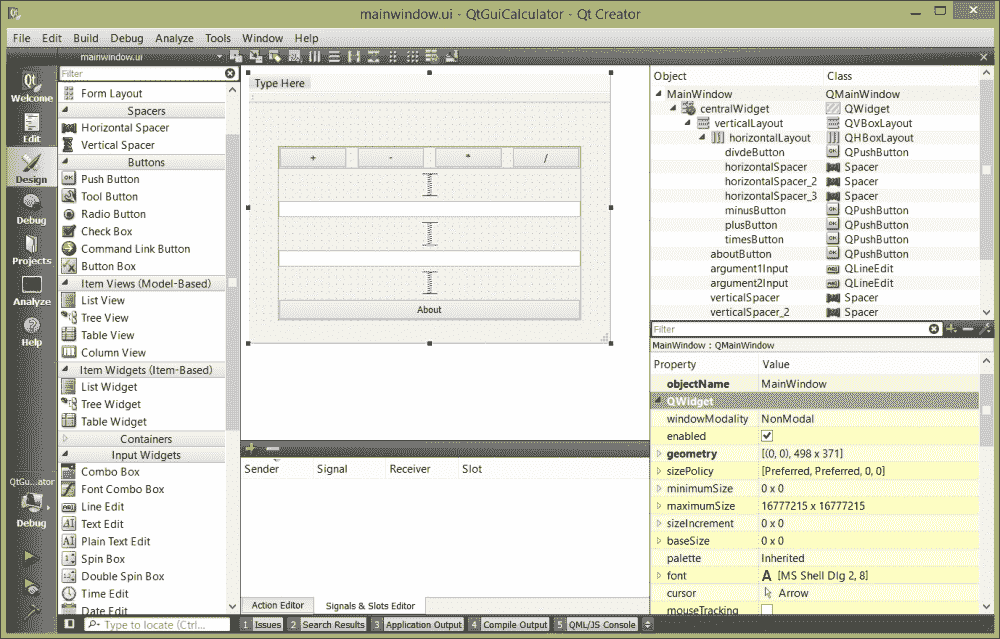
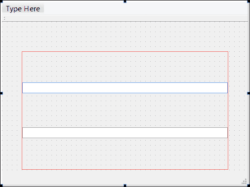
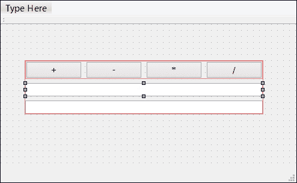
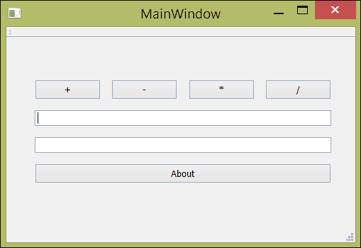
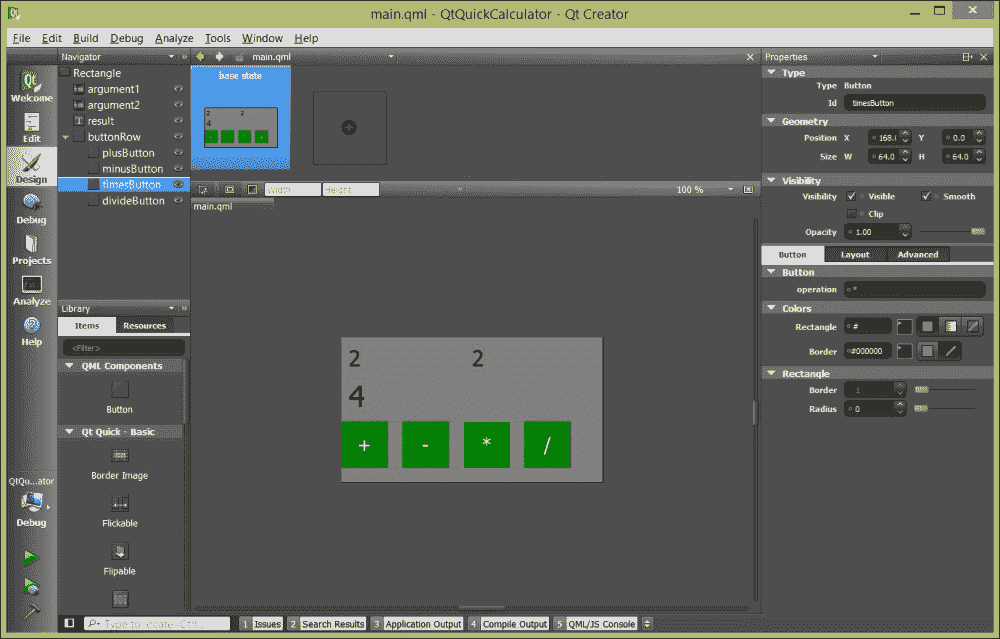
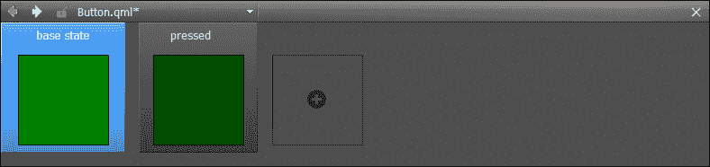
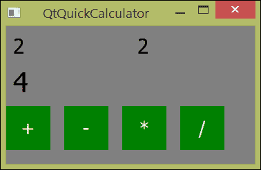

# 第三章。使用 Qt Designer 设计您的应用程序

Qt 可能最为人所知的是一个跨平台用户界面工具包，直到最近几年，Qt Creator 才真正发展成为一个完整的软件开发环境。然而，即使在早期版本中，Qt 也具有了一个优秀的用于使用 Qt Designer 构建用户界面的工具，现在已经成为 Qt Creator 的一部分。最近，构建 Qt 的开发人员添加了 Qt Quick 作为用户界面开发的第二个选项。Qt Quick 扩展了 Qt 库和 Qt Creator 的 Qt Designer 功能，用于构建触摸屏和机顶盒的流畅界面，并促进了 Qt Quick 和**Qt 元对象语言**（**QML**）的声明性特性。

在本章中，我们将学习如何使用 Qt Designer 创建用户界面，Qt Designer 是 Qt Creator 中的用户界面构建器。我们首先介绍了理解 Qt 框架的关键概念：**信号**和**槽**。接下来，我们重新使用 Qt Designer 创建应用程序表单，这是在使用 Qt Widgets 时用户界面的基础。我们还介绍了如何添加资源并在应用程序中访问它们，这是用户界面设计的重要方面。然后，我们回到代码中，构建了你在第一章 *使用 Qt Creator 入门*中学到的 QML 基础知识。在本章结束时，你将能够决定你的应用程序应该使用 Qt GUI 还是 Qt Quick，并且能够借助 Qt Creator 附带的文档构建你的应用程序。

# 代码插曲 - 信号和槽

在软件系统中，通常需要耦合不同的对象。理想情况下，这种耦合应该是松散的，即不依赖于系统的编译时配置。当考虑用户界面时，这一点尤为明显；例如，按钮按下可能会调整文本窗口的内容，或者导致某些东西出现或消失。许多系统使用事件来实现这一目的；提供数据的组件将数据封装在事件中，事件循环（或者最近更常见的事件监听器）捕获事件并执行某些操作。

Qt 提供了更好的方法：信号和槽。就像事件一样，发送组件生成一个信号—在 Qt 术语中，对象发出一个信号—接收对象可以在槽中接收这个信号以进行处理。Qt 对象可以发出多个信号，信号可以携带参数；此外，多个 Qt 对象可以连接到相同的信号上的槽，这样可以轻松地安排一对多的通知。同样重要的是，如果没有对象对信号感兴趣，它可以被安全地忽略，没有连接到信号的槽。任何继承自`QObject`的对象，Qt 的对象基类，都可以发出信号或提供用于连接到信号的槽。在底层，Qt 为声明信号和槽提供了对 C++语法的扩展。

一个简单的例子将有助于澄清这一点。在 Qt 文档中找到的经典例子是一个很好的例子，我们将在这里再次使用它，并进行一些扩展。想象一下你需要一个计数器，即一个包含整数的容器。在 C++中，你可能会这样写：

```cpp
class Counter
{
public:
  Counter() { m_value = 0; }
  int value() const { return m_value; }
  void setValue(int value);

private:
  int m_value;
 };
```

`Counter`类有一个私有成员`m_value`，存储它的值。客户端可以调用`value`来获取计数器的值，或者通过调用`setValue`来设置它的值为新值。

在 Qt 中，使用信号和槽，我们这样写这个类：

```cpp
#include <QObject>

class Counter : public QObject
{
  Q_OBJECT

public:
  Counter() { m_value = 0; }

  int value() const { return m_value; }

   public slots:
  void setValue(int value);
  void increment();
  void decrement();

signals:
  void valueChanged(int newValue);

private:
  int m_value;
};
```

这个`Counter`类继承自`QObject`，这是所有 Qt 对象的基类。所有`QObject`子类必须在其定义的第一个元素中包含声明`Q_OBJECT`；这个宏会扩展为 Qt 代码，实现了特定于子类的粘合剂，这是 Qt 对象和信号槽机制所必需的。构造函数保持不变，将我们的私有成员初始化为零。同样，访问器方法`value`保持不变，返回计数器的当前值。

对象的槽必须是公共的，并且使用 Qt 对 C++的扩展公共槽进行声明。这段代码定义了三个槽：一个`setValue`槽，它接受计数器的新值，以及`increment`和`decrement`槽，它们增加和减少计数器的值。槽可以接受参数，但不返回参数；信号和槽之间的通信是单向的，由信号发起并以连接到信号的槽终止。

计数器提供了一个单一的信号。与槽一样，信号也是使用 Qt 对 C++的扩展`signals`声明的。在上面的示例中，一个`Counter`对象发出带有单个参数的信号`valueChanged`，这个参数是计数器的新值。信号是一个函数签名，而不是一个方法；Qt 对 C++的扩展使用信号和槽的类型签名来确保信号-槽连接之间的类型安全，这是信号和槽相对于其他解耦的消息传递方案的一个关键优势。

作为开发人员，我们有责任使用适当的应用逻辑在我们的类中实现每个槽。`Counter`类的槽看起来像这样：

```cpp
void Counter::setValue(int newValue)
{
  if (newValue != m_value) {
      m_value = newValue;
      emit valueChanged(newValue);
  }
}

void Counter::increment()
{
  setValue(value() + 1);
}

void Counter::decrement()
{
  setValue(value() – 1);
}
```

我们使用`setValue`槽的实现作为一个方法，这就是所有槽在本质上都是什么。`setValue`槽接受一个新值，并将新值赋给`Counter`类的私有成员变量，如果它们不相同的话。然后，信号发出`valueChanged`信号，使用 Qt 扩展`emit`，这会触发对连接到信号的槽的调用。

### 提示

这是处理对象属性的信号的常见模式：测试要设置的属性是否与新值相等，只有在值不相等时才分配和发出信号。

如果我们有一个按钮，比如`QPushButton`，我们可以将它的 clicked 信号连接到`increment`或`decrement`槽，这样点击按钮就会增加或减少计数器。我会使用`QObject::connect`方法来做到这一点，就像这样：

```cpp
QPushButton* button = new QPushButton(tr("Increment"), this);
Counter* counter = new Counter(this);
QObject::connect(button, SIGNAL(clicked(void)),
                 Counter, SLOT(increment(void));
```

我们首先创建`QPushButton`和`Counter`对象。`QPushButton`构造函数接受一个字符串，按钮的标签，我们将其表示为字符串`Increment`或其本地化对应物。

为什么我们要将 this 传递给每个构造函数？Qt 在 QObjects 和它们的后代之间提供了父子内存管理，简化了在使用对象时的清理工作。当您释放一个对象时，Qt 也会释放父对象的任何子对象，因此您不必这样做。父子关系在构造时设置；我在构造函数中发出信号，当调用此代码的对象被释放时，按钮和计数器也可能被释放。（当然，调用方法也必须是`QObject`的子类才能起作用。）

接下来，我调用`QObject::connect`，首先传递源对象和要连接的信号，然后传递接收对象和应该发送信号的槽。信号和槽的类型必须匹配，并且信号和槽必须分别包装在`SIGNAL`和`SLOT`宏中。

信号也可以连接到信号，当这种情况发生时，信号被链接在一起，并触发连接到下游信号的任何槽。例如，我可以这样写：

```cpp
Counter a, b;
QObject::connect(&a, SIGNAL(valueChanged(int)),
                 &b, SLOT(setValue(int)));
```

这将计数器`b`与计数器`a`连接起来，这样对计数器`a`值的任何更改也会改变计数器`b`的值。

信号和槽在 Qt 中被广泛使用，用于用户界面元素以及处理异步操作，比如网络套接字上的数据存在和 HTTP 事务结果。在底层，信号和槽非常高效，归结为函数调度操作，因此您不应该犹豫在自己的设计中使用这种抽象。Qt 提供了一个特殊的构建工具，元对象编译器，它编译了信号和槽所需的 C++扩展，并生成了实现机制所需的额外代码。

# 在 Qt Designer 中创建表单

让我们使用 Qt Designer 和两个表单创建一个简单的计算器应用程序：一个表单用于获取算术运算的参数，另一个对话框表单用于呈现结果。我将在本章中进行两次演示，首先向您展示如何使用 Qt GUI 进行此操作，然后再使用 Qt Quick。这个例子是刻意构造的，但将向您展示如何在两种环境中创建多个用户界面表单，并让您练习处理信号和插槽。

## 创建主表单

在第一章中，*使用 Qt Creator 入门*，您学习了 Qt GUI Designer 的基本元素，包括可以使用的小部件调色板，中央编辑窗格，对象树和属性视图。以下屏幕截图再次显示了 Qt Designer：



Qt Creator 的 Qt GUI 应用程序设计器

从左到右，您看到的屏幕部分依次是：

+   视图选择器，目前指示 Qt Designer 视图处于活动状态

+   您可以在表单上布局的可能小部件的调色板

+   表单编辑器，在连接编辑器上方，可让您在小部件之间连接信号和插槽

+   对象树，指示已在表单上布置的所有对象，并通过使用嵌套列表显示它们的父子关系

+   在对象树下方是属性编辑器，您可以在表单编辑器上选择的任何项目的编译时属性

让我们从创建一个新的 Qt GUI 项目开始（从**新文件或项目...**对话框中选择**Qt Gui Application**），将项目命名为`QtGuiCalculator`，然后按照以下步骤操作：

1.  在项目的**Forms**文件夹中，双击`mainwindow.ui`文件。设计器将打开。

1.  从调色板中拖出**垂直布局**。

1.  右键单击布局，选择**布局**，然后选择**调整大小**。布局将缩小到一个点。

1.  拖动两个**行编辑**小部件并将它们放在对象查看器中的垂直布局上（最右边的窗格）。您将看到垂直布局会扩展以接受每个行编辑器。您现在应该有类似以下屏幕截图的东西：

第一个两个文本字段后的布局

1.  拖动**水平布局**并将其放在对象查看器中的垂直布局上。

1.  在您刚刚添加的水平布局上拖放四个**Push Button**小部件。

1.  调整包含窗口的大小，以便整个布局显示在窗口中。

1.  使用右下角的属性浏览器将按钮重命名为`plusButton`，`minusButton`，`timesButton`和`divideButton`。在这样做时，向下滚动到**text**属性（在**QAbstractButton**下）并为每个按钮赋予类似`+`，`-`，`*`和`/`的逻辑标签。

1.  选择顶部输入行并将其命名为`argument1Input`。

1.  选择底部输入行并将其命名为`argument2Input`。

下一个屏幕截图显示了到目前为止在 Qt Designer 表单编辑器窗格中应该看到的内容。您还可以通过打破布局并使用鼠标定位按钮来手动排列按钮，但这通常会使您的布局对窗口调整大小的鲁棒性降低，并且通常不是一个好主意：



我们的计算器用户界面

到目前为止，这很简单。我们使用了垂直布局和水平布局来布置各种控件；这充分利用了 Qt 对小部件布局和大小的动态约束。所有小部件都有最小和最大尺寸，布局使用这些尺寸来确定小部件实际占用的大小。一些小部件是弹性的；也就是说，它们会拉伸以填充其内容。在指定小部件的实际大小时，您可以指定它在 x 和 y 轴上的以下值之一：

+   小部件的最小尺寸

+   小部件的最大尺寸

+   在其最小和最大之间的固定大小

+   一个扩展大小，扩展以适应小部件内容的大小

Qt 提供了四种布局，您可以像我们刚刚做的那样混合和匹配。您已经遇到了垂直和水平布局；还有一个网格布局，它可以让您在*m*×*n*网格中组织事物，还有一个表单布局，它可以以类似于本机平台枚举表单字段的方式组织小部件。

现在，我们的布局有点拥挤。让我们添加一些间隔符，以更好地填充窗口中的空间，并添加一个关于框的按钮：

1.  拖动**垂直间隔符**，并将其放置在输入行之间，然后在包含按钮行的水平布局和输入行之间再添加一个垂直间隔符。

1.  将一个**工具按钮**小部件拖到垂直布局中，并在底部行和按钮之间添加一个间隔符。

1.  将最后一个按钮命名为`aboutButton`，并给它文本`关于`。稍后我们将添加一个图标。

如果按下**运行**按钮，下面的屏幕截图显示了我们在设计师中构建的应用程序：



我们应用程序的主窗口

现在，让我们制作我们的结果对话框。右键单击项目，选择**添加新内容…**，然后：

1.  在出现的对话框中，选择左侧的**Qt**，然后在中间选择**Qt 设计师表单**。点击**选择**。

1.  为您的对话框选择对话框样式；选择**底部带按钮的对话框**，然后点击**下一步**。

1.  将文件命名为`resultdialog.ui`，然后点击**下一步**。

1.  点击**完成**。

1.  在出现的对话框中，拖出**表单布局**。右键单击它，选择**布局**和**调整大小**。

1.  将一个**标签**小部件添加到表单布局中。将其文本更改为`结果`。

1.  拖出另一个标签，并将其命名为`结果`。

现在可能是您尝试布局和间隔符，并以您希望的任何方式样式化对话框的好时机。

## 使用应用程序资源

现在，让我们为**关于**按钮向应用程序添加一个图标。您可以绘制一个，或者去 The *Noun Project*（[`bit.ly/16n9bOk`](http://bit.ly/16n9bOk)）等网站寻找合适的图标。图标可以是 PNG、JPEG 或其他格式；一个不错的选择是 SVG，因为 SVG 图像是基于矢量的，可以正确缩放到不同的大小。将资源文件放在您的项目目录中，然后：

1.  在 Qt Creator 中选择**编辑**视图。

1.  右键单击解决方案，然后点击**添加新内容…**；然后，选择**Qt**和**Qt 资源文件**。

1.  将文件命名为`资源`。

1.  将其添加到当前项目中。

1.  如果`resources.qrc`尚未在编辑器中打开，请在解决方案窗格中双击它。资源文件编辑器将出现。

1.  点击**添加**，选择**添加前缀**，并添加前缀`/`。

1.  再次点击**添加**，选择**添加文件**，然后选择您的图标。

图标是通过 Qt 资源编译器加载到应用程序的只读段中的。您可以通过在资源的路径和名称前加上冒号来在任何地方访问它们，就像访问文件一样。例如，我们可以将一个文本文件放在我们的应用程序资源中，然后像这样打开文件进行读取：

```cpp
QFile file(":/data/myfile.txt");
file.open(QIODevice::ReadOnly | QIODevice::Text);

while (!file.atEnd()) {
  QByteArray line = file.readLine();
  process_line(line);
}
```

应用程序资源适用于文本和小媒体文件，如图标或图像。但是，您应该避免将它们用于像电影和大型声音这样的较大项目，因为它们会不必要地膨胀应用程序二进制文件的大小。对于这些目的，最好将媒体文件与应用程序打包在一起，并直接从磁盘加载它们。

在下一节中，当我们向应用程序添加关于框时，我们将使用您添加的资源。

# 在您的应用程序中实例化表单、消息框和对话框

Qt Designer 为您在设计器中创建的每个表单生成基于 XML 的布局文件（以 `.ui` 结尾）。在编译时，Qt Creator 将布局编译为一个头文件，用于构建用户界面布局的组件。Qt 应用程序通常使用的模式是构建一个私有布局类，该类由主窗口或对话框的构造函数实例化，然后实例化用户界面。以下是主窗口的工作原理：

```cpp
#ifndef MAINWINDOW_H
#define MAINWINDOW_H

#include <QMainWindow>

namespace Ui {
  class MainWindow;
}

class ResultDialog;

class MainWindow : public QMainWindow
{
    Q_OBJECT

public:
    explicit MainWindow(QWidget *parent = 0);
    ~MainWindow();

private:
    Ui::MainWindow *ui;
};

#endif // MAINWINDOW_H

// In mainwindow.cpp:
#include "mainwindow.h"

// mainwindow.cpp
#include "ui_mainwindow.h"

MainWindow::MainWindow(QWidget *parent) :
    QMainWindow(parent),
    ui(new Ui::MainWindow),
{
    ui->setupUi(this);
}
```

`Ui::MainWindow` 类是由 Qt Designer 自动构建的；通过在 `mainwindow.cpp` 中包含它的声明，我们创建了一个实例并将该实例分配给 `ui` 字段。一旦初始化，我们调用它的 `setupUi` 函数，该函数创建了您在 Qt Designer 中勾画出的整个用户界面。

我们在 Qt Designer 中布置的控件可以作为字段名访问。例如，我们可以修改 `mainwindow.cpp`，通过在 `mainwindow.h` 中添加一个槽来处理单击 **About** 按钮时的情况，并在槽的实现中添加代码来调用关于框。要做到这一点，请按照以下步骤进行：

1.  在 `mainwindow.h` 中添加一个 `public slots` 声明，以及一个名为 `aboutClicked` 的槽。现在应该是这样的：

```cpp
class MainWindow : public QMainWindow
{
    Q_OBJECT

public:
    explicit MainWindow(QWidget *parent = 0);
    ~MainWindow();

public slots:
    void aboutClicked();

private:
    Ui::MainWindow *ui;
};
```

1.  将 `aboutClicked` 槽的实现添加到 `mainwindow.cpp`。此代码在堆栈上构造了一个 `QMessageBox` 对象，并将其图标设置为您之前添加的图标，对话框的文本设置为 `"Lorem ipsum"`，消息框的标题设置为 `"About"`。`QMessageBox` 调用的 `exec` 方法打开消息框并阻塞应用程序流，直到您关闭消息框。它应该是这样的：

```cpp
void MainWindow::aboutClicked()
{
    QMessageBox messageBox;
    messageBox.setIconPixmap(QPixmap(":/icon.png"));
    messageBox.setText("Lorem ipsum.");
    messageBox.setWindowTitle("About");
    messageBox.exec();
}
```

1.  在 `mainwindow.cpp` 的顶部，为 `QMessageBox` 类添加一个 `include` 语句：

```cpp
#include <QMessageBox>
```

1.  在 `MainWindow` 构造函数中，将关于按钮的信号连接到刚刚创建的槽。您的构造函数现在应该是这样的：

```cpp
MainWindow::MainWindow(QWidget *parent) :
    QMainWindow(parent),
    ui(new Ui::MainWindow),
    results(0)
{
    ui->setupUi(this);
    QObject::connect(ui->aboutButton, SIGNAL(clicked()),
                     this, SLOT(aboutClicked()));
}
```

如果我们构建应用程序，现在我们有一个完全功能的关于框，包括您选择的应用程序图标。`connect` 调用就像我们之前看到的信号槽连接一样；它将 `aboutButton` 的 `clicked` 信号连接到主窗口 UI 中的 `aboutClicked` 槽。

在继续之前，我们先来谈谈命名信号和槽：信号通常以动词的过去时命名，表示刚刚发生的事件的语义，它试图发出信号。槽应该以某种方式匹配这些语义，最好包括有关如何处理信号的更多细节。因此，Qt 逻辑上将按钮的 `clicked` 信号命名，我通过给槽命名为 `aboutClicked` 来扩展这一点。当然，您可以根据自己的喜好命名信号和槽，但这是一个很好的实践方法。

在我们连接其他按钮并实现计算器逻辑之前，我们需要为我们的 `results` 对话框设置类。我们将遵循 `MainWindow` 类的模式，创建一个包含编译时生成的构建结果对话框 UI 的对象实例的私有 `ui` 成员。您可以通过右键单击项目并选择 **Qt Designer Form Class** 来使用 **New File** 向导创建 `ResultDialog` 类，并将其命名为 `ResultDialog`。该类本身应该继承自 `QDialog`。头文件应该如下所示：

```cpp
#ifndef RESULTDIALOG_H
#define RESULTDIALOG_H

#include <QDialog>

namespace Ui {
    class Dialog;
}

class ResultDialog : public QDialog
{
    Q_OBJECT
public:
    explicit ResultDialog(QWidget *parent = 0);
    ~ResultDialog();
private:
    Ui::Dialog *ui;

};

#endif // RESULTDIALOG_H
```

我们需要做的第一件事是在 `Ui` 命名空间中前向声明由 Qt Designer 创建的 `Dialog` 类；然后，我们需要将该类的实例的指针声明为私有成员变量；我们将这个指针命名为 `ui`，就像对 `MainWindow` 类所做的那样。

您可以猜到我们的 `ResultDialog` 实现是什么样的：

```cpp
#include "resultdialog.h"
#include "ui_resultdialog.h"

ResultDialog::ResultDialog(QWidget *parent) :
    QDialog(parent),
    ui(new Ui::Dialog)
{
    ui->setupUi(this);

}

ResultDialog::~ResultDialog()
{
    delete ui;
}
```

在构造时，它创建了我们的 `Ui:Dialog` 类的一个实例，然后调用其 `setupUi` 方法，在运行时创建用户界面的实例。

# 连接 Qt GUI 应用程序逻辑

计算器的应用逻辑很简单：我们在`ResultDialog`实现中添加了一个属性设置器，它让我们设置对话框的`result`字段，然后在`MainWindow`中连接一些算术、信号和槽，以进行实际计算并显示对话框。

首先，更改`ResultDialog`：

```cpp
void ResultDialog::setResult(float r)
{
    ui->result->setText(QString::number(r));
}
```

这种方法接受一个浮点数，显示在对话框中，并使用 Qt 的默认格式将结果格式化为字符串。Qt 是完全国际化的；如果在使用英语的区域中进行此操作，它将使用小数点，而如果在区域设置为使用逗号作为小数分隔符的地区中进行此操作，它将使用逗号。`number`方法是一个方便的方法，它有多个重载，接受双精度和浮点数，以及整数，并带有参数来指示返回字符串的精度和指数。

现在，修改后的`MainWindow`类。首先，修改后的类声明：

```cpp
#ifndef MAINWINDOW_H
#define MAINWINDOW_H

#include <QMainWindow>
#include <QPair>

namespace Ui {
    class MainWindow;
}

class ResultDialog;

class MainWindow : public QMainWindow
{
    Q_OBJECT

    typedef QPair<float, float> Arguments;

public:
    explicit MainWindow(QWidget *parent = 0);
    ~MainWindow();

    Arguments arguments();

signals:
    void computed(float f);

public slots:
    void aboutClicked();
    void plusClicked();
    void minusClicked();
    void timesClicked();
    void divideClicked();

    void showResult(float r);
private:
    Ui::MainWindow *ui;
    ResultDialog* results;
};

#endif // MAINWINDOW_H
```

除了基类`QMainWindow`之外，我现在还包括`QPair`，这是一个简单的 Qt 模板，让我们可以传递一对值。我们将使用`QPair`模板，类型定义为`Arguments`，来传递算术操作的一对参数。

我添加了一个信号`computed`，这个类在执行算术操作时触发任何时间。我还为每个算术按钮点击添加了槽：`plusClicked`、`minusClicked`、`timesClicked`和`dividedClicked`。最后，我添加了一个`showResult`信号，当发生计算时显示结果。

`MainWindow`的构造函数现在需要为所有按钮、信号和槽进行一堆信号-槽连接：

```cpp
MainWindow::MainWindow(QWidget *parent) :
    QMainWindow(parent),
    ui(new Ui::MainWindow),
    results(0)
{
    ui->setupUi(this);
    QObject::connect(ui->aboutButton, SIGNAL(clicked()),
                     this, SLOT(aboutClicked()));
    QObject::connect(this, SIGNAL(computed(float)),
                     this, SLOT(showResult(float)));
    QObject::connect(ui->plusButton, SIGNAL(clicked()),
                     this, SLOT(plusClicked()));
    QObject::connect(ui->minusButton, SIGNAL(clicked()),
                     this, SLOT(minusClicked()));
    QObject::connect(ui->timesButton, SIGNAL(clicked()),
                     this, SLOT(timesClicked()));
    QObject::connect(ui->divdeButton, SIGNAL(clicked()),
                     this, SLOT(divideClicked()));
}
```

将关于按钮连接到显示关于对话框的槽之后，我接下来将`MainWindow`的计算信号连接到其`showResult`槽。请注意，此信号/槽携带一个参数，要显示的值。剩下的四个连接将每个操作按钮与执行特定算术操作的代码连接起来。

`showResult`槽如果我们还没有一个，就创建一个新的`ResultDialog`对象，将其结果设置为传入的值，并调用对话框：

```cpp
void MainWindow::showResult(float r)
{
    if (!results)
    {
        results = new ResultDialog();
    }
    results->setResult(r);
    results->exec();
}
```

`arguments`方法是一个辅助方法，每个算术函数都使用它，它从每个输入行中获取值，将它们从字符串转换为浮点数，并进行一些错误检查，以确保条目是有效的浮点数。

```cpp
MainWindow::Arguments MainWindow::arguments()
{
    bool ok1, ok2;
    float a1 = ui->argument1Input->text().toFloat(&ok1);
    float a2 = ui->argument2Input->text().toFloat(&ok2);
    if (!ok1 || !ok2)
    {
        QMessageBox messageBox;
        messageBox.setIconPixmap(QPixmap(":/icon.png"));
        messageBox.setText("One of your entries is not a validnumber.");
        messageBox.setWindowTitle("Error");
        messageBox.exec();
    }
    return Arguments(a1, a2);
}
```

`QString`方法`toFloat`就是这样做的：它将一个字符串转换为浮点数，返回该数字，并且如果转换成功，则将传入的布尔值设置为`true`，否则设置为`false`。代码对两个参数输入行都这样做，然后检查生成的布尔值，并在任一参数格式错误时报告错误，然后将参数的 QPair 返回给调用者。

剩下的代码实际上执行算术运算，在操作完成时发出计算已完成的信号。例如，考虑`plusClicked`槽：

```cpp
void MainWindow::plusClicked()
{
    Arguments a = arguments();
    emit computed(a.first + a.second);
}
```

使用`arguments`函数从输入行获取参数，计算总和，然后发出带有总和值的计算信号。因为我们将计算信号连接到`showResults`槽，这将触发对`showResults`的调用，如果需要，它将创建`ResultDialog`对象，并显示带有计算结果的对话框。`minusClicked`、`timesClicked`和`divideClicked`方法都是类似的。

## 学习更多关于 Qt GUI 小部件

有关使用 Qt GUI 小部件集进行编程的整本书：这是一个非常丰富的小部件集，包括构建普通 Macintosh、Windows 或 Linux 应用程序所需的几乎所有内容，并且具有 UI 控件对大多数计算机用户来说都很熟悉的优势。要进一步探索，请参阅[`bit.ly/17stfw3`](http://bit.ly/17stfw3)上的 Qt 文档。

# 代码插曲-Qt Quick 和 QML 语法

你在最低级别的大部分编程都是命令式的：你描述算法应该如何工作（“取这个值并平方”，“搜索这个字符串的第一个出现并替换它”，“以这种方式格式化这个数据”等）。在 Qt Quick 中，你的编程主要是声明式的：你不是说“如何”，而是说“什么”。例如，在 C++中使用 Qt，我们可能会写出这样的代码来绘制一个矩形：

```cpp
QRect r(0, 0, 16, 16);
QPainter p;
p.setBrush(QBrush(Qt::blue));
p.drawRect(r);
```

这段代码创建了一个 16 x 16 像素的矩形，分配了一个进行绘制的`QPainter`对象，告诉绘图者它的画笔应该是蓝色的，然后告诉绘图者绘制矩形。在 QML 中，我只需写下矩形：

```cpp
import QtQuick 2.0
Rectangle {
    width: 16
    height: 16
    color: "blue"
}
```

区别是显而易见的：我只是说有一个蓝色的 16 x 16 像素的矩形。由 Qt Quick 运行时决定如何绘制矩形。

Qt Quick 的基础语言是 QML。它在很大程度上基于 JavaScript，事实上，大多数你可以用 JavaScript 编写的东西也可以用 QML 表达。表达式语法基本上没有改变：赋值、算术等都是一样的，名称-值系统在功能上也是一样的，尽管对象框可能会在类型声明之前（就像我刚刚向你展示的`Rectangle`示例一样）。

### 注意

“在 JavaScript 中有效的在 QML 中也有效”规则的一个关键例外是缺乏文档对象模型（DOM）和像文档根这样的全局变量，因为没有根上下文或 DOM，其他东西都挂在上面。如果你要将 Web 应用程序移植到 QML，请准备好重构应用程序架构的这些部分。

QML 中的对象必须以树的方式进行父子关系；每个 QML 文件必须包含一个封装对象，然后可以有具有子对象的子对象。但是，在文件的顶部必须有一个单一的层次结构根。通常，这个根是一个矩形，它绘制一个基本矩形，其子对象被呈现在上面，或者是一个项目，它是一个更复杂的用户界面元素的容器，实际上并不绘制任何东西。每个项目可能有一个名称，存储在其`id`属性中。

大多数可见的 QML 项目都可以有状态；也就是说，当特定状态处于活动状态时，一组属性将应用。这使你可以声明按钮的静止和按下状态之间的差异；按下按钮只是在状态之间切换，按钮的颜色、阴影等都可以随之改变，而不需要更改每个单独的属性。

在 QML 中一个关键概念是**绑定**：如果两个 QML 对象属性共享相同的值，改变一个会改变另一个。绑定将值与关于值的通知耦合在一起，类似于 C++中引用的工作方式，或者其他语言中的按引用传递的方式，但在 QML 中，这发生在被引用的变量名的级别上。这在编写诸如动画之类的东西时非常方便，因为你可以使用一个对象的值作为另一个对象的值，当底层值在一个地方发生变化时，两个对象都会更新。

QML 文件可以相互依赖，或者包含 JavaScript 文件以进行业务逻辑。你已经在每个 QML 文件的顶部看到了一个例子：`import`指令指示运行时包含指定的文件和版本，所以当我写`import QtQuick 2.0`时，运行时会找到 QtQuick 模块版本 2.0 的声明，并在解析文件时包含其符号。这就是你可以封装功能的方式。项目中的 QML 文件默认包含，同时你也可以包含 JavaScript 文件并将其分配给特定的 JavaScript 变量。例如，我们可以有一个名为`calculatorLogic.js`的 JavaScript 文件，它实现了我的计算器的所有功能，在 QML 中写入：

```cpp
import QtQuick 2.0
import "calculatorLogic.js" as CalculatorLogic
Item {
  // someplace in code
  CalculatorLogic.add(argument1, argument2);
}
```

初始导入加载 JavaScript 并将其值分配给 QML 对象`CalculatorLogic`；然后我可以像处理其他 QML 对象一样调度方法和访问该对象的属性。

Qt Quick 声明了许多基本数据类型；这些与您在编写 C++代码时在 Qt 中找到的数据类型非常相似，尽管语法可能有所不同。您将遇到的一些最重要的类型包括：

+   具有`x`和`y`属性的点

+   具有`x`、`y`、`宽度`和`高度`属性的矩形

+   具有`宽度`和`高度`属性的大小

+   颜色，这是 HTML RGB 表示法中的带引号的字符串或 Qt 颜色词典中的命名颜色（您可以想到的大多数颜色在 QML 中都有名称）

+   一个 2D、3D 或 4D 向量

+   包括布尔值、字符串、整数和浮点数在内的基本类型

还有许多用于用户界面构建的可见类型；在本章中，只有少数类型可以提及。有关所有 QML 类型的详细列表以及有关这些类型的文档，请参见[`bit.ly/17stfw3`](http://bit.ly/17stfw3)。

# 在 Qt Designer 中创建 Qt Quick 应用程序

在第一章中，*使用 Qt Creator 入门*，您已经对 Qt Designer 进行了基本了解，用于 Qt Quick 应用程序。在我们重新在 QML 中创建计算器应用程序之前，让我们再看一遍。下一张截图显示了 Qt Designer 用于 Qt Quick 窗口：



Qt Designer 用于 Qt Quick

再次从左边开始，我们有以下组件：

+   视图选择器，显示 Qt Designer 视图处于活动状态

+   正在编辑的文件的对象层次结构，显示了该文件中可见项目之间的父子关系

+   在对象层次结构下方是可以拖动到 QML 编辑器窗格上的项目的调色板

+   对象状态的摘要

+   在状态摘要下方是 QML 文件的对象编辑器

+   最后，有一个属性编辑器，可以调整当前选定的 QML 项目的属性

### 提示

坦率地说，我觉得写 QML 比使用设计师更容易。语法需要一点时间来适应，但设计师擅长的是通过手写的 QML 预览你所写的 QML，并对其布局进行微小调整。

说到布局，在我们详细查看示例代码之前，值得注意的是 QML 具有丰富的动态布局系统。可见项目具有`anchor`属性，您可以将项目的边缘锚定在其邻居或父视图的边缘上。您在第一章中简要看到了这一点，我们将`MouseArea`设置为与其父级一样大。我们还将使用它来控制计算器参数输入行和操作按钮的布局。

现在通过从**文件**菜单中选择**新文件或项目…**开始制作我们的示例代码，并通过向导创建一个 Qt Quick 2.0 应用程序。将应用程序命名为`QtQuickCalculator`。

## 创建可重用按钮

我们的计算器为每个操作都有一个按钮。虽然我们可以将每个按钮制作成单独的矩形和`MouseArea`，但更容易的方法是制作一个封装按钮行为的单个 QML 按钮，包括按下时外观的变化、按钮标签的放置等。

通过右键单击项目并选择**添加新内容…**，然后从 Qt 项目中选择**QML 文件（Qt Quick 2）**来创建一个新的 QML 文件。该按钮是一个包含第二个矩形、按钮的`Text`标签和处理按钮点击的`MouseArea`区域的矩形。将文件命名为`Button.qml`，并编辑它，使其内容如下：

```cpp
import QtQuick 2.0

Rectangle {
    id: button
    width: 64
    height: 64

    property alias operation: buttonText.text
    signal clicked

    color: "green"

    Rectangle {
        id: shade
        anchors.fill: button;
        color: "black"; opacity: 0
    }

    Text {
        id: buttonText
        anchors.centerIn: parent;
        color: "white"
        font.pointSize: 16
    }

    MouseArea {
        id: mouseArea
        anchors.fill: parent
        onClicked: {
            button.clicked();
        }
    }

    states: State {
        name: "pressed"; when: mouseArea.pressed == true
        PropertyChanges { target: shade; opacity: .4 }
    }
}
```

从文件代码的顶部开始：

+   在此文件的范围内，按钮的 ID 只是`button`。

+   宽度和高度都是 64 像素。

+   按钮有一个由其客户端配置的属性，即`operation`属性。该属性实际上是一个别名，这意味着它自动设置`buttonText.text`属性的值，而不是作为一个单独的字段。

+   按钮发出一个信号，即`clicked`信号。

+   按钮的颜色是绿色。

+   有一个填充按钮的矩形，颜色为黑色，但不透明度为零，意味着在正常使用中它是不可见的，是透明的。当按下按钮时，我调整这个矩形的不透明度，使按钮在被按下时变暗。

+   按钮的`text`标签大小为`16`点，颜色为白色，并居中在按钮本身。

+   接受按钮点击的`MouseArea`区域与按钮大小相同，并发出`clicked`信号。

+   按钮有两个状态：默认状态和第二个状态 pressed，当`mouseArea.pressed`属性为`true`时（因为您正在按下鼠标区域中的鼠标按钮）发生。当状态为 pressed 时，我请求一个单一的`PropertyChange`事件，稍微改变矩形的不透明度，给按钮投上一层阴影，使其变暗。

实际上，您可以在进入 Qt Designer 时看到按钮的两个状态（请参见以下屏幕截图）。状态只是一个名称，一个指示状态何时处于活动状态的`when`子句，以及一组`PropertyChanges`，指示状态处于活动状态时应更改哪些属性。所有可见的 QML 项都有一个`state`属性，它只是当前活动状态的名称。



按钮的状态

请注意，QML 使用类似于 C++中的 Qt 的信号和槽，但没有`emit`关键字。相反，您可以直接使用`signal`关键字和信号的名称来声明信号，然后像调用函数一样调用信号。对于每个 QML 项的信号，槽的名称为`on`后跟信号名称；例如，`onClicked`，`onPressed`等。因此，当我们使用按钮时，我们为`clicked`信号编写一个`onClicked`处理程序。

## 计算器的主视图

返回编辑器，直接编辑`main.qml`。我们将在代码中直接声明我们的输入行、结果行和四个操作按钮；如果您愿意，您也可以在设计师中做类似的操作，然后编辑代码以匹配以下内容：

```cpp
import QtQuick 2.0

Rectangle {
    width: 360
    height: 200
    color: "grey"

    TextInput {
        id: argument1
        anchors.left: parent.left
        width: 160
        anchors.top: parent.top
        anchors.topMargin: 10
        anchors.leftMargin: 10
        anchors.rightMargin: 10
        text: "2"
        font.pointSize: 18
    }

    TextInput {
        id: argument2
        anchors.right: parent.right
        width: 160
        anchors.top: parent.top
        anchors.topMargin: 10
        anchors.leftMargin: 10
        anchors.rightMargin: 10
        text: "2"
        font.pointSize: 18
    }

    Text {
        id: result
        anchors.left: parent.left
        anchors.right: parent.right
        anchors.top: argument2.bottom
        anchors.topMargin: 10
        anchors.leftMargin: 10
        anchors.rightMargin: 10
        text: "4"
        font.pointSize: 24
    }

    Row {
        id: buttonRow
        anchors.bottom: parent.bottom
        anchors.horizontalCenter: parent
        anchors.bottomMargin: 20
        spacing: 20
        Button {
            id: plusButton
            operation: "+"
            onClicked: result.text =
              parseFloat(argument1.text) + parseFloat(argument2.text)
        }

        Button {
            id: minusButton
            operation: "-"
            onClicked: result.text =
              parseFloat(argument1.text) - parseFloat(argument2.text)
        }

        Button {
            id: timesButton
            operation: "*"
            onClicked: result.text =
              parseFloat(argument1.text) * parseFloat(argument2.text)
        }

        Button {
            id: divideButton
            operation: "/"
            onClicked: result.text =
              parseFloat(argument1.text) / parseFloat(argument2.text)
        }
    }
}
```

视图有两个`TextInput`行，一个只读的`text`结果行，然后是`operation`按钮，包裹在`Row`项中，以给它们一个水平布局。计算器的基本视图是`grey`，位于 360×200 像素的窗口中。控件的位置如下：

+   第一个输入行锚定在父窗口的左上角，各有 10 像素的边距。它也是 160 像素长，是 18 点`TextInput`字段的默认高度。

+   第二个输入行锚定在父级的右侧，顶部和右侧各有 10 像素的边距。它也是 160 像素长，是 18 点`TextInput`字段的默认高度。

+   结果输入行的顶部锚定在输入行的底部，并且锚定在父矩形的左侧。两侧也各有 10 像素的边距。

+   按钮在一个`Row`项中间隔 20 像素，该项锚定在父级的底部。

这些锚点可以让视图在调整应用程序窗口大小时重新流动；输入行横跨窗口的宽度，底部的按钮栏随着窗口的放大而向下移动。

每个按钮都有一个`click`槽，用于获取每个输入行的浮点解释并执行适当的算术操作。它们都是我在上一节中向您展示的 QML 类`Button`的实例。请注意，在`onClicked`处理程序中使用了 JavaScript 函数`parseFloat`：正如我之前提到的，QML 中的 JavaScript 运行时支持这些函数，因此我们可以直接调用 JavaScript 函数。

以下屏幕截图显示了完成的计算器应用程序。请注意，运行应用程序时，如果您将鼠标悬停在按钮上并按下，您会看到阴影变暗（这在屏幕截图中没有显示）。这反映了我在上一节中向您展示的按钮的两种状态：



完成的 Qt Quick 计算器应用程序

## 学习更多关于 Qt Quick 和 QML

Qt Quick 旨在创建流畅的应用程序，不需要太多深层次的小部件复杂性。媒体中心、照片查看器、电话拨号器、网页浏览器等不需要与主机平台外观和感觉匹配（或者在主机平台完全使用 Qt Quick 编写）的应用程序是 Qt Quick 范例的好例子。有关 Qt Quick 的更多信息以及展示平台广度和功能的大量示例，请参阅[`bit.ly/16ULQ4V`](http://bit.ly/16ULQ4V)。

# 总结

Qt 提供了不止一个 GUI 工具包：Qt GUI 采用传统的基于小部件的 GUI 开发方法，而 Qt Quick 提供了一种声明性方法，更适合于媒体盒子、一些手机应用程序、汽车仪表板和其他嵌入式环境的跨平台用户界面。对于这两种方法，Qt 都提供了 Qt Designer，一个拖放环境，让您在构建应用程序时构建、配置和预览用户界面。

Qt 的核心是信号和槽的概念，是 Qt 对于处理当今 GUI 应用程序所需的延迟绑定的回调和事件的解决方案。Qt 对象可以发出信号，这些信号是类型安全的函数声明，其他对象可以连接到这些信号，触发方法调用当信号被发出时。

在下一章中，您将暂停学习 Qt Creator 和图形用户界面开发，专注于应用程序开发的一个关键方面：本地化。我将向您展示如何使用 Qt Linguist 和 Qt 的本地化功能来本地化您的应用程序。
