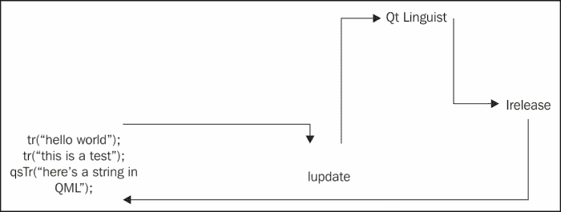
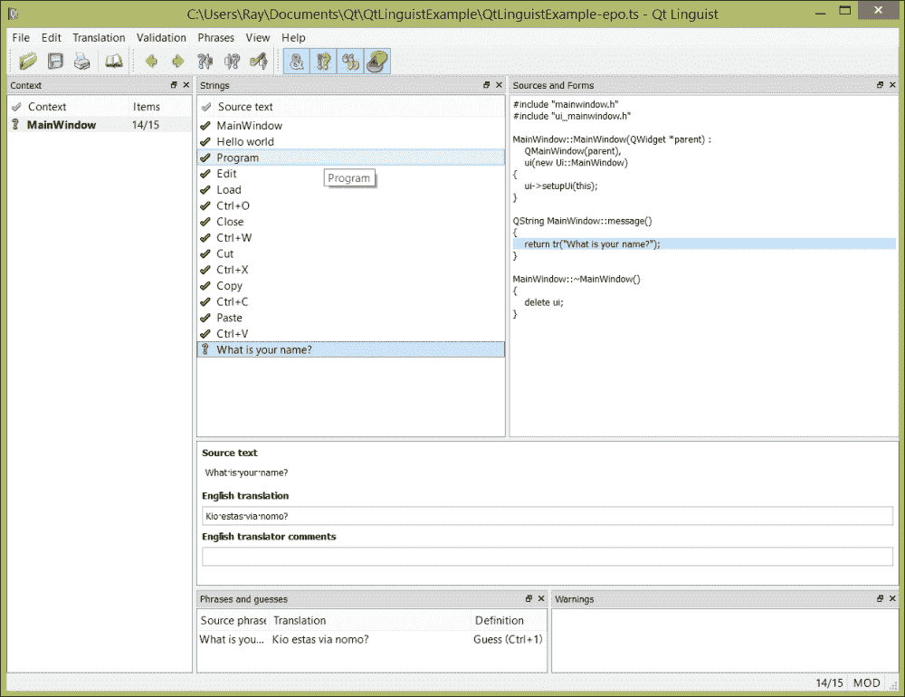

# 第四章。使用 Qt Linguist 本地化您的应用程序

本地化是当今软件开发中重要但常被忽视的部分。大多数应用程序的作者，无论这些应用程序是商业应用程序还是开源应用程序，都希望为其应用程序吸引大量用户。越来越多地意味着在多个语言和多个区域设置中支持多种语言；通常需要在一个区域设置中支持多种语言（想想加拿大同时存在法语和英语）。

Qt 长期以来一直有一个框架，用于使应用程序易于本地化。借助这些工具，您可以避免在应用程序中硬编码字符串，并使用名为 Qt Linguist 的 GUI 来帮助管理翻译，从而减轻 Qt 在整个应用程序开发周期中的本地化负担。在本章中，我们将研究 Qt 的本地化策略，讨论 Qt 提供的三种工具（**lupdate**、**lrelease**和**Qt Linguist**）以及如何使用它们，以及在编写应用程序时如何利用 Qt 的本地化框架。

# 理解本地化任务

本地化您的应用程序有几个阶段，通常在整个项目中重叠。这些阶段包括：

1.  在编写应用程序时，您以特定方式放置字符串以本地化您的应用程序，以便 Qt 可以识别需要本地化的字符串。

1.  定期提取应用程序中的所有字符串并交给翻译人员进行翻译。

1.  翻译人员为您的应用程序提供字符串的翻译。

1.  您使用翻译后的字符串编译翻译文件，以支持每种语言。

Qt 提供了四种工具来促进这些阶段：

+   C++和 QML 的`tr`和`qsTr`函数让您识别应用程序中需要本地化的字符串

+   `lupdate`命令会生成需要在您的应用程序中本地化的字符串列表

+   翻译人员使用 Qt Linguist 为您的应用程序提供字符串的翻译

+   `lrelease`命令会将 Qt Creator 中的翻译字符串打包成应用程序可使用的格式

以下图显示了这些阶段是如何相互作用的：



lupdate/Linguist/lrelease 循环

软件开发是迭代的，本地化也不例外。小型项目可能更喜欢只进行一次或两次本地化，等到应用程序几乎完成后再提交应用程序字符串进行本地化。较大的应用程序或拥有专门的翻译人员团队的较大公司可能更喜欢更迭代的方法，在应用程序开发过程中多次进行本地化循环。Qt 支持这两种模式。

# 标记字符串以进行本地化

在第一章*使用 Qt Creator 入门*中，我告诉您始终要使用`tr`和`qsTr`函数标记您的字符串以进行本地化：C++使用`tr`，QML 字符串使用`qsTr`。这样做对您有两个关键优势。首先，它使 Qt 能够找到每个需要本地化的字符串。其次，如果您在应用程序中安装了 Qt 翻译器对象并提供了翻译文件，那么您使用这些函数包装的字符串将自动替换为其本地化等效字符串。

让我们更详细地研究`tr`的使用。在其声明中包含`Q_OBJECT`宏的所有 Qt 对象都包括`tr`函数。您已经看到它带有一个参数，如下面的代码行所示：

```cpp
button = new QPushButton(tr("&Quit"), this);
```

字符串中的前导`&`不是给`tr`函数用的，而是给键盘加速器用的；您可以用`&`前缀一个字母，它就会得到默认的系统（Windows 为*Alt*，Apple 为*command*，Linux 为*Control*）。如果在应用程序的当前翻译表中没有字符串的翻译版本，`tr`函数将使用您传递的字符串作为用户界面中的字符串，或者如果当前翻译表中存在该字符串，则使用当前翻译表中的字符串。

`tr`函数可以接受第二个参数，一个消歧义上下文，`tr`用于可能需要不同翻译的相同字符串。它还可以处理带有复数的字符串，如下面的代码行所示：

```cpp
tr("%n item(s) replaced", "", count);
```

根据计数和区域设置的值，返回不同的字符串。因此，本地化的英文翻译可能返回"0 items replaced"，"1 item replaced"，"2 items replaced"等，而法语翻译可能返回"0 item remplacé"，"1 item remplacé"，"2 items remplacés"等。

QML 中的`qsTr`函数工作原理类似，但它没有`tr`方法对于消除歧义或处理复数的灵活性。

# 使用 Qt Linguist 本地化您的应用程序

一旦您使用`tr`或`qsTr`标记了您的字符串，您需要为 Qt Linguist 生成这些字符串的表格以进行本地化。您可以使用`lupdate`命令来实现这一点，该命令会获取您的`.pro`文件并遍历您的源代码以查找需要本地化的字符串，并为 Qt Linguist 创建一个 XML 文件，其中包含您需要翻译的字符串。您需要为每种想要支持的语言执行此操作。在执行此操作时，最好以系统化的方式命名生成的文件；一种方法是使用项目文件的名称，后跟 ISO-639-2 语言代码。

需要举一个具体的例子。本章有一个`QtLinguistExample`；我可以使用如下命令运行`lupdate`来创建一个我将翻译成世界语（ISO-639-2 语言代码 EPO）的字符串列表：

```cpp
% lupdate -pro .\QtLinguistExample.pro –ts .\QtLinguistExample-epo.ts
```

其中`–pro`文件指示包含要扫描以进行翻译的源文件列表的`.pro`文件，`–ts`参数指示要写入的翻译文件的名称。

### 提示

当然，您需要在路径中添加`lupdate`。您如何设置路径将取决于您是在 Windows、Mac OS X 还是 Linux 上工作，以及您在哪里安装了 Qt。有些 Qt 的安装可能会自动更新您的路径，而其他可能不会。例如，在我的 Windows 机器上，我发现`lupdate`在`C:\qt\5.1.0\msvc2012_64\bin\lupdate.exe`。

`.ts`文件是一个带有标签的 XML 文件，用于指示需要翻译的字符串、它们在应用程序源代码中的上下文等。Qt Linguist 也会将翻译保存到 QM 文件中，但不用担心，`lupdate`足够智能，如果您在提供一些翻译后再次运行它，它不会覆盖现有的翻译。

Qt Linguist 是一个 GUI 应用程序；当您启动它时，您将看到一个与下一个截图非常相似的屏幕：



Qt Linguist 应用程序编辑一个 QM 文件

首先，您需要打开一个通过导航到**文件** | **打开**生成的`.ts`文件，并选择一个翻译文件。然后会提示您选择目标语言，然后会显示它找到的字符串列表。您或者您的翻译人员只需要逐个查看每个字符串，并输入相应的翻译语言的字符串。在这样做的同时，您可以在最右侧的窗格中看到字符串在源代码中的上下文；捕获该字符串的源代码行会被突出显示。

Qt Linguist 可以让您跟踪您已经翻译和仍需要翻译的字符串。每个字符串左侧的图标可以是：

+   一个黑色的问号表示一个字符串尚未被翻译

+   一个黄色的问号表示该字符串未通过 Qt Linguist 的所有验证测试，但您忽略了这些失败

+   感叹号表示您提供的字符串未通过 Qt Linguist 的验证测试

+   黄色复选框表示您已提供翻译，但 Qt Creator 可能发现了问题

+   绿色复选框表示该字符串已被翻译并准备就绪

Qt Linguist 提供了一些简单的验证测试，例如确保带有`printf`等参数的字符串在每个翻译中具有相同数量的参数。

Qt Linguist 还支持短语书；您可以下载一个已经本地化为您目标语言的常见字符串的短语书。

在任何时候，您都可以通过运行`lrelease`为您的应用程序生成一个翻译文件以供包含。例如，要为我的世界语字符串创建一个翻译文件，我将使用以下方式使用`lrelease`：

```cpp
% lrelease .\QtLinguistExample-epo.ts .\QtLinguistExample-epo.qm
```

这将获取传入的`.ts`文件，并生成一个带有字符串的`.qm`文件。`.qm`文件是高度压缩的二进制文件，由 Qt 直接在渲染应用程序的过程中使用。

# 在应用程序中包含本地化字符串

为了向应用程序的`tr`和`qsTr`函数提供翻译的字符串，您的应用程序需要包含一个`QTranslator`对象来读取`.ts`文件，并用其翻译后的字符串替换`tr`和`qsTr`提供的字符串。我们在您的主入口点函数中执行此操作，如下面的代码块所示：

```cpp
QApplication a(argc, argv);
QTranslator translator;
bool result = translator.load("QtLinguistExample-epo.qm");
a.installTranslator(&translator);

    // Other window setup stuff goes here

return a.exec();
```

此代码分配了一个`QTranslator`对象，并在将其安装到`QApplication`之前将指定的翻译文件加载到翻译器中。在这个例子中，我们将语言硬编码为世界语。

请注意，如果您希望支持系统选择的区域设置，我们可能会选择以这种方式执行：

```cpp
QString locale = QLocale::system().name();
QTranslator translator;
translator.load(QString("QtLinguistExample-") + locale);
```

这确定系统区域设置，并尝试加载系统当前区域设置的本地化字符串文件。

为了使这个工作，应用程序的`.qm`文件需要被应用程序找到。它们应该在输出目录中；在开发过程中执行此操作的一种方法是在 Qt Creator 的**项目**窗格中的**构建设置**下关闭阴影构建。当您构建应用程序的安装程序时——这是本书范围之外的特定于平台的任务——您需要将您的`.qm`文件与应用程序二进制文件一起包含。

# 本地化特殊内容——使用`QLocale`本地化货币和日期

您可能需要做的一件常见事情是本地化货币和日期。Qt 使这变得容易，尽管在您仔细考虑之前解决方案并不明显。

首先，您应该了解`QString`的`arg`方法。它将转义的数字替换为其参数的格式化版本；如果我们写：

```cpp
QString s = new QString("%1 %2").arg("a").arg("b");
```

然后`s`包含字符串`a b`。其次，您应该了解`QLocale`的`toString`方法，它以特定于区域设置的方式格式化其参数。

因此，我们可以写：

```cpp
QString currencyValue = QString("%1 %2")
    .arg(tr("$")).arg(QLocale::toString(value, 'g', 2)
```

这使用`tr`来本地化货币符号，并使用`QLocale`类的静态方法`toString`将值转换为带有特定区域设置的十进制分隔符的字符串（在美国和加拿大为句点，在欧洲为逗号）。

日期格式化类似：`QLocale`的`toString`方法有适用于`QDateTime`、`QDate`和`QTime`参数的重载，因此您可以简单地写：

```cpp
QDateTime whenDateTime = QDateTime::currentDateTime();
QString when = QLocale::toString(whenDate);
```

这将获取当前日期和时间并将其存储在`whenDateTime`中，然后使用区域设置的默认格式将其转换为字符串。`toString`方法可以接受第二个参数，用于确定输出格式。它可以是以下之一：

+   `QLocale::LongFormat`，它使用月份和日期名称的长版本

+   `QLocale::ShortFormat`，它使用日期和月份名称的短版本

+   `QLocale::NarrowFormat`，它为日期和时间提供最窄的格式

# 总结

使用 Qt 本地化应用程序很容易，可以使用 Qt Linguist 和 Qt 中的本地化框架。但是，要使用该框架，您必须在源代码中使用`tr`或`qsTr`标记要本地化的字符串。一旦这样做，您就可以使用 Qt 的`lupdate`命令创建要翻译的字符串的源文件，并为每个字符串提供翻译。提供了翻译后，您可以使用`lrelease`编译它们，然后通过在应用程序的`main`函数中安装`QTranslator`对象并加载`lrelease`生成的翻译表来将它们包含在应用程序中。

在下一章中，我们将看到 Qt Creator 支持的软件开发的另一个重要方面，即使用 QML Profiler 和 Valgrind 进行性能分析。
