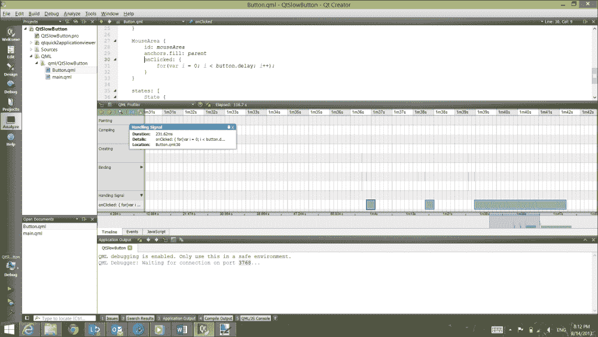
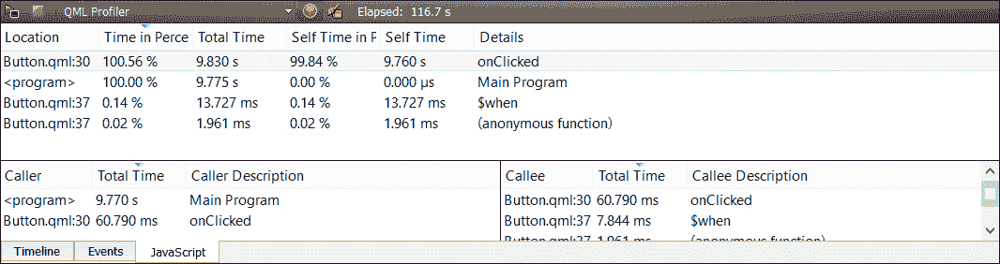
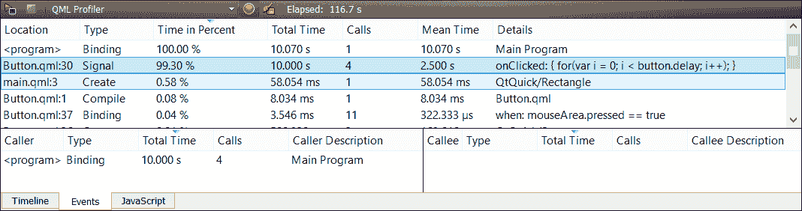

# 第五章。使用 Qt Creator 进行性能优化

我们并不是每天都使用性能分析工具，但当我们需要时，我们很高兴它们存在。商业工具，如与 Microsoft Visual Studio 一起提供的工具或 IBM 的 Rational Rose Purify 等独立工具，可能会花费大量资金，幸运的是，Qt Creator 大部分所需的功能都内置了，或者支持使用开源工具来帮助您分析应用程序的运行时和内存性能。

在本章中，我们将看到如何使用 QML 性能分析器对 QML 应用程序进行运行时分析，并学习如何阅读其生成的报告。然后，我们将关注使用 Qt Creator 进行内存性能分析，使用 Valgrind 在 Linux 平台上查找内存泄漏和堆损坏的免费选项。

# QML 性能分析器

Qt Quick 应用程序应该快速，具有流畅的用户界面。在许多情况下，使用 QML 可以轻松实现这一点；QML 和 Qt Quick 运行时的贡献者们在创建一个在各种情况下表现良好的环境方面付出了大量努力。然而，有时，尽最大努力，您可能会发现无法使应用程序的性能达到您想要的水平。有些错误是显而易见的，比如：

+   在状态更改或触发绘图操作的操作之间执行大量计算密集型任务

+   过于复杂的视图层次结构，一次显示数千个元素

+   在非常有限的硬件上运行（通常与前两个问题结合使用）

Knuth 曾经说过，“过早优化是万恶之源”，他绝对是对的。但是，也许会有一段时间，您需要测量应用程序的性能，Qt Creator 包含了一个专门用于此目的的性能分析器。使用它，您可以看到应用程序在每个 QML 方法中花费了多少时间，以及测量应用程序的关键方面，这些方面可能超出您的控制，比如创建应用程序的视图层次结构需要多长时间。

让我们仔细看看。

## QtSlowButton-需要性能调优的 Qt Quick 应用程序

让我们分析`QtSlowButton`的性能，这是我在本章为您准备的性能不佳的示例程序。 `QtSlowButton`有两个 QML 组件：一个基于第三章中的计算器按钮的按钮，*使用 Qt Designer 设计您的应用程序*，以及一个带有可按的按钮的视图。这是按钮的实现：

```cpp
import QtQuick 2.0

Rectangle {
    id: button

    width: 128
    height: 64

    property alias label: buttonText.text
    property int delay: 0

    color: "green"

    Rectangle {
        id: shade
        anchors.fill: button;
        color: "black"; opacity: 0
    }

    Text {
        id: buttonText
        anchors.centerIn: parent;
        color: "white"
        font.pointSize: 16
    }

    MouseArea {
        id: mouseArea
        anchors.fill: parent
        onClicked: {
            for(var i = 0; i < button.delay; i++);
        }
    }

    states: [
        State {
            name: "pressed"; when: mouseArea.pressed == true
            PropertyChanges { target: shade; opacity: .4 }
        }
    ]
}
```

每个按钮在按下时都简单地运行一个`for`循环；其`delay`属性控制循环运行的次数。此外，每个按钮都有一个标签，按钮会在可点击区域的中心绘制该标签。

主用户界面由三个按钮组成，位于“列区域”，标有“快速”、“中等”和“慢速”，延迟逐渐增加：

```cpp
import QtQuick 2.0

Rectangle {
    width: 180
    height: 360

    Column
    {
        spacing: 20
        Button
        {
            delay: 10000;
            label: "fast";
        }
        Button
        {
            delay: 100000;
            label: "medium";
        }
        Button
        {
            delay: 300000;
            label: "slow";
        }
    }
}
```

您可以加载本书附带的源项目，也可以创建一个新的 Qt Quick 项目，并使用此代码创建一个按钮和主视图。

分析应用程序的性能：

1.  构建应用程序。

1.  从**分析**菜单中选择**QML Profiler**。应用程序将启动，Qt Creator 将切换到**分析**视图。

1.  在应用程序本身中，单击每个应用程序按钮几次。单击每个按钮后，您将需要等待。

1.  退出应用程序。

### 提示

QML Profiler 使用 TCP/IP 在默认端口 3768 上运行的应用程序和分析器之间建立连接。您可能需要调整主机防火墙设置以确保正确运行。在 Windows 上，请务必允许**Windows 防火墙**对话框中的连接。

下一张截图显示了运行应用程序后的**分析**视图。QML Profiler 有三个标签，默认显示第一个：

+   第一个标签是时间轴，指示应用程序中的事情发生在什么时候，以及它们花费了多长时间

+   第二个标签列出了 QML 应用程序处理的事件，以及每个事件花费了多少时间

+   第三个标签列出了程序在运行时遇到的 JavaScript 函数，以及应用程序总共花费多长时间来运行每个函数

在下一张截图中，我点击了**处理信号**行以展开应用程序处理的信号。你可以看到它处理了一个名为`onClicked`的信号，共三次，并且每次花费的时间都显示在图表上。显然，如果应用程序正在执行可以优化的操作，那么在这里就有性能改进的机会：



时间轴视图，显示了在我的 onClicked 方法中花费的时间

下一张截图显示了这些信息的不同视图，表明在数值精度的限制下，应用程序在按钮的`onClicked`处理程序中花费了所有测量时间：显然，这是性能上的“热点”。有趣的是，这里测量了我 JavaScript 的每一个事件，包括按下按钮时将不透明滤镜放在按钮前面的`$when`子句。从**JavaScript**视图中查看可以帮助你在广义上了解应用程序中发生的事情：



在 QtSlowButton 中运行不同 JavaScript 部分所花费的总时间

下一张截图可能是性能极客最感兴趣的，因为它显示了 QML 在运行应用程序时处理的每一个事件所花费的时间。同样，我们看到`onClicked`处理程序占用了大部分处理器资源，但还显示了其他一些事情，比如为视图创建矩形和按钮状态的变量绑定。通常，我们会使用**JavaScript**视图来了解应用程序中的问题所在，而使用**Events**视图来专注于特定问题：



QML Profiler 的 Events 视图，显示了 QtSlowButton 中的每一个事件

# 使用 Valgrind 查找内存泄漏

正如我们在第三章中讨论的那样，*使用 Qt Designer 设计您的应用程序*，在管理应用程序中的`QObject`类的内存时，您应该养成使用 Qt 的父子关系的习惯，以避免内存泄漏。在我编写 Qt 应用程序的时候，唯一遇到内存泄漏的情况是当我没有这样做的时候。此外，对于不基于`QObject`的指针，也应该使用`QSharedPointer`等类。

然而，有时候您可能会引入一个自己找不到的内存泄漏。在这种情况下，像 Valgrind 这样的工具可能会拯救你；它会跟踪应用程序中的每个内存分配和释放操作，在程序终止时提醒您，如果它没有释放所有分配的内存。

不幸的是，Valgrind 是一个仅适用于 Linux 的工具。如果您编写纯 Qt 代码，即使在 Windows 或 Mac OS X 上开发，这对您来说也不是一个严重的问题，因为您可以将应用程序移植到 Linux 并在那里运行 Valgrind。为此，您需要使用诸如 VMware Fusion、VMware Player、Microsoft HyperV 或 Parallels 之类的应用程序来设置运行 Linux 的虚拟机（我喜欢使用 Ubuntu），安装 Qt Creator，并在那里运行您的代码。（不幸的是，如果您的应用程序中有特定于 Windows 的代码或库，这不是一个选择。）

### 提示

如果您为 Windows 构建应用程序，商业泄漏检测器如 Rational Purify 可能是一个选择。

在继续之前，您应该确保您的 Qt Creator 在 Linux 发行版下运行，并从[`bit.ly/14QwiQZ`](http://bit.ly/14QwiQZ)安装 Valgrind，或者使用您的软件包管理器。例如，在 Ubuntu 上，我可以使用以下命令安装 Valgrind：

```cpp
sudo apt-get install valgrind

```

当您使用 Valgrind 时，实际上是在 Valgrind 内运行您的应用程序；而不是启动您的应用程序，您启动 Valgrind，然后启动您的应用程序。

## QtLeakyButton-一个需要内存帮助的 Qt C++应用程序

`QtLeakyButton`应用程序只做一件事：它呈现一个按钮，当点击时，会分配 512KB 的 RAM。以下是代码（您可以运行本书附带的示例，或者创建一个带有单个按钮和标签的 Qt GUI 应用程序，并将此代码用于您的`MainWindow`类）：

```cpp
// mainwindow.h
#ifndef MAINWINDOW_H
#define MAINWINDOW_H

#include <QMainWindow>

namespace Ui {
    class MainWindow;
}

class MainWindow : public QMainWindow
{
    Q_OBJECT

public:
    explicit MainWindow(QWidget *parent = 0);
    ~MainWindow();

public slots:
    void leakPressed();

private:
    Ui::MainWindow *ui;
    int m_count;
};

#endif // MAINWINDOW_H

// mainwindow.cpp

#include "mainwindow.h"
#include "ui_mainwindow.h"

MainWindow::MainWindow(QWidget *parent) :
    QMainWindow(parent),
    ui(new Ui::MainWindow),
    m_count(0)
{
    ui->setupUi(this);
    connect(ui->leakButton, SIGNAL(clicked()),
            this, SLOT(leakPressed()));
}

MainWindow::~MainWindow()
{
    delete ui;
}

void MainWindow::leakPressed()
{
    void *p = new char[512 * 1024];
    m_count++;
    ui->leakCount->setText(QString::number(m_count));
}
```

`MainWindow`类有一个整数计数器和一个用于实例化表单的`ui`插槽。`MainWindow`构造函数实例化此表单，然后将`leakButton`的`clicked`信号连接到`MainWnidow::leakPressed`。`leakPressed`方法只是分配内存并增加计数器，更新计数器以显示您按下按钮的次数。

要使用 Valgrind，我们需要为您的应用程序添加一个新的运行目标。为此，请执行以下操作：

1.  在左侧点击**项目**，然后点击**运行**。

1.  点击**添加**。

1.  对于**名称**，输入`valgrind`。

1.  对于**可执行文件**，添加 Valgrind 的路径（通常为`/usr/bin/valgrind`）。

1.  对于参数，输入以下内容：

```cpp
    -q --tool=memcheck --leak-check=full --leak-resolution=low ./<your-app-target-name>

    ```

1.  对于**工作目录**，输入`$BUILDDIR`。

现在我们可以为您的应用程序选择 Valgrind 运行目标。我们需要使用调试构建，因为 Valgrind 需要我们应用程序中的调试符号来生成有意义的报告。要使用 Valgrind，启动应用程序并点击按钮几次。Valgrind 进程会持续输出信息，但大部分输出是在我们退出应用程序后才出现的。

Valgrind 会产生大量输出，需要一些时间来整理。我们正在寻找泄漏摘要，其中指示了明确丢失和间接丢失的字节数。明确丢失的块是您分配但未释放的内存；间接丢失的内存是因为它被另一个指针引用而泄漏，而引用指针未被释放。输出将看起来像：

```cpp
X bytes in 1 blocks are definitely lost in loss record n of m
 at 0x........: function_name (filename:line number)

```

在这里，`X`表示泄漏的字节数，并且泄漏块的地址显示在第二行上。记录号表示应用程序内存分配器使用的内部记录号，可能对您没有太大帮助。

我们应该真正关注我们的应用程序中的内存泄漏，因为 Qt 可能会有自己的内存泄漏。Valgrind 支持抑制文件，指示应忽略哪些泄漏；如果您可以找到并下载一个适用于您构建的 Qt 版本的抑制文件，您可以通过修改参数行来包含对抑制文件的引用：

```cpp
-q --tool=memcheck --leak-check=full --leak-resolution=low --suppressions=suppresion.txt ./[your-app-target-name]

```

在您的应用程序中查找内存泄漏是一部分艺术和一部分科学。这是一个很好的练习，在应用程序开发过程中定期进行，以确保您可能引入的泄漏在您最熟悉运行的新代码时能够快速发现。

# 摘要

Qt Creator 提供了 QML 分析器，让您可以对 Qt 应用程序进行运行时分析。您可以看到应用程序运行的时间图表，以及深入了解应用程序如何花费时间进行绘制、绑定变量和执行 JavaScript。

Qt Creator 还与 Linux 上的 Valgrind 很好地集成，让您可以查找应用程序中的内存泄漏。在 Linux 上使用 Valgrind，您可以看到已分配但未释放的内存块，更重要的是，它们有多大以及在代码中的分配位置，让您可以提前确定为什么它们没有被释放。

在下一章中，我们将从 Qt Creator 的特定部分转向其最激动人心的一般方面之一：使用 Qt Creator 编译和测试 Google Android 等移动平台的应用程序的能力。
