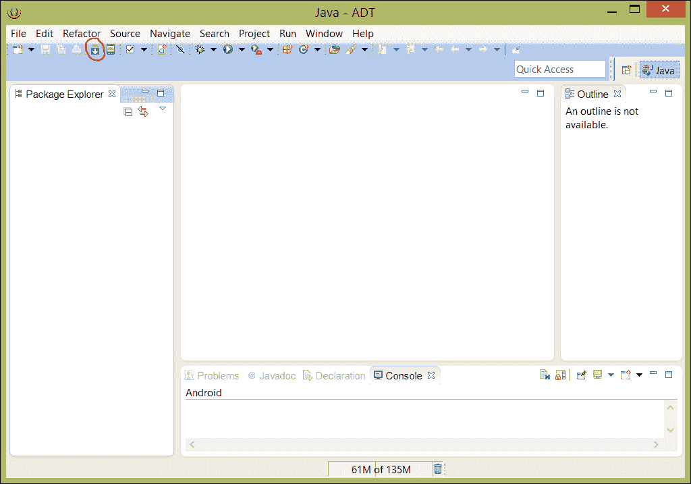
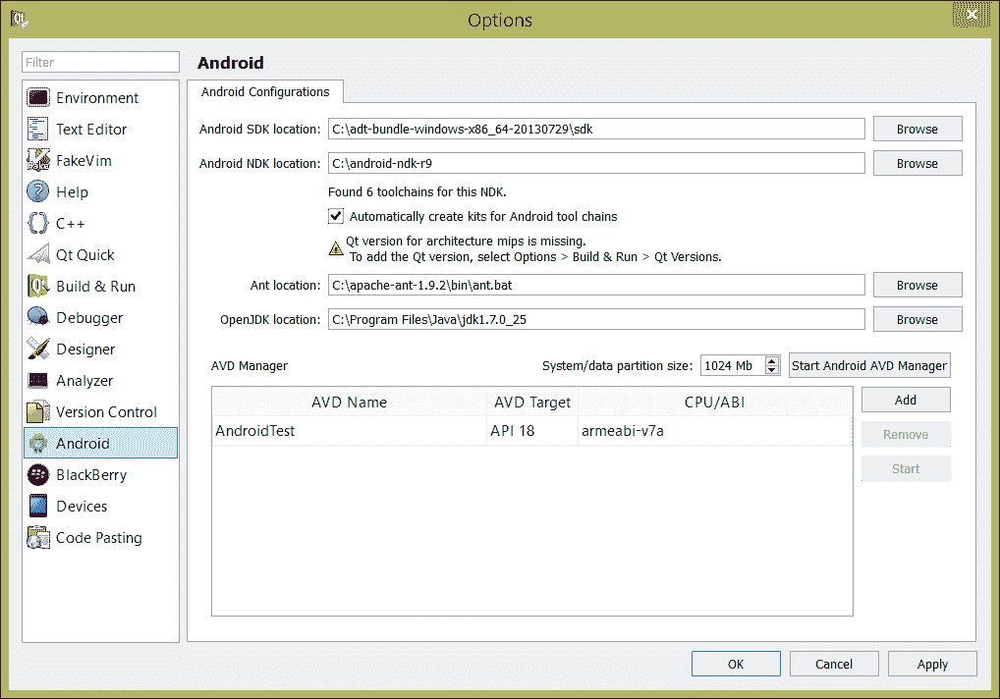
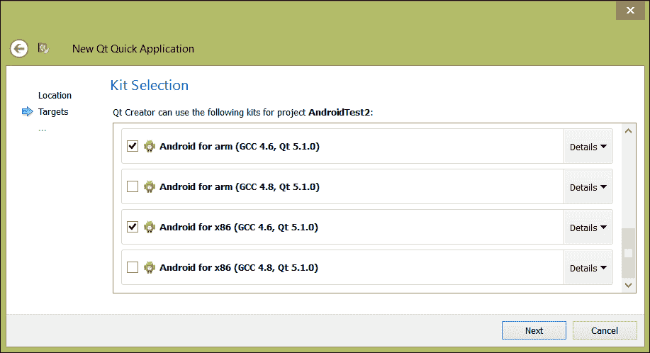

# 第六章：使用 Qt Creator 开发移动应用程序

Qt 和移动开发有着悠久的历史。Qt 的起步包括在九十年代末和本世纪初在 Linux 个人数字助理上的早期发布。从那时起，它已经移植到了许多移动环境，包括诺基亚出货的移动 Linux 变体，如 MeeGo，以及 Symbian。尽管 Symbian 和 MeeGo 已经消失，Qt 对移动平台的接受仍然存在，最近还支持 Android。

在本章中，我们会简要讨论编写移动应用程序，然后学习如何设置 Qt Creator 来编写 Android 应用程序。值得一提的是，尽管我们将利用您在 Qt 开发中学到的一切来开发移动应用程序，但我们还需要了解移动软件运行的环境与传统的桌面和笔记本电脑环境有何不同，以及如何设计以适应这些限制。一旦我们了解了这些差异，使用 Qt 为 Android 编写软件就会变得轻而易举！

# 移动软件开发入门

在为任何移动平台（如手机或平板电脑）开发软件时要记住的关键区别是，每一种资源都是宝贵的。设备更小，这意味着：

+   您的用户将对您的应用程序付出更少的关注，并且使用时间更短

+   屏幕更小，因此您可以在显示器上显示更少的信息（不要被今天显示器的高点密度所迷惑：在 4 英寸的显示器上阅读 6 号字体是很不方便的，无论像素密度有多高）

+   处理器和图形处理单元速度较慢

+   RAM 和图形内存较少

+   应用程序数据的持久存储较少

+   网络速度较慢，甚至慢了三个数量级

让我们更详细地看看这些。

## 用户的注意力是宝贵的

你能一边走路一边嚼口香糖吗？我不能——但很多人可以一边走路，一边嚼口香糖，一边使用他们的移动设备。 （更糟糕的是，一些人甚至在开车时使用他们的设备！）手机或平板上的应用程序很少能够吸引用户超过几分钟的百分之百的注意力。一个很好的经验法则是，设备越小，用户越有可能把它当作一种拿起来看一眼或者在做其他事情时使用的东西。

用户对您的应用程序的有限关注有三个关键后果：

+   您的应用程序必须快速。移动设备不适合额外的进度条、旋转光标或冗长的启动画面。

+   您的应用程序必须简洁。最好的移动应用程序只在一页或两页上显示数据，具有非常扁平的导航层次结构。一个常见的结构是有一个屏幕上的信息，和一个屏幕上的偏好设置，让您配置应该显示什么信息（比如您获取信息的位置）。如果您不能绘制清晰的图标，那就找一个可以的人，或者从*The Noun Project*（[`bit.ly/1fvBsnu`](http://bit.ly/1fvBsnu)）这样的网站购买图标。

+   您的应用程序必须易于访问。按钮应该足够大（一个很好的指导原则是，应用程序中的点击目标不应该小于手指的垫，大约是一平方厘米），文本应该尽可能大。

因此，Qt Quick 是您将编写的大多数移动应用程序的更好选择。您可以创建流畅且响应迅速的应用程序，视觉上令人愉悦，并且不会让用户感到不知所措。

## 计算资源是宝贵的

移动设备必须携带它们的电源来源：也就是电池。虽然电池在过去二十年里有所改进，但它们并没有跟上摩尔定律的步伐；大部分的改进都是在处理器方面，因为处理器变得更小，在正常操作过程中散发的热量也更少。

尽管如此，移动设备不像台式机或笔记本那样快速——一个好的思路是，上一代的处理器设计可能对今天的移动设备有很好的适应性。这并不是说移动设备很慢，只是它们比较慢。同样重要的是，你不能让处理器或图形处理器全速运行而不严重影响电池寿命。

Qt——特别是 Qt Quick——被优化为低功耗，但仍然有一些事情可以帮助你挤出移动应用程序的最佳性能：

+   **不要轮询**：这可能是最重要的一点。尽可能使用 Qt 的异步信号-槽机制，并考虑使用`QThread`进行多线程，如果需要在后台执行某些操作。你的应用程序休眠得越多，电池寿命就会延长得越久。

+   **避免不必要的动画**：一些动画在当今的应用程序中是习惯的和重要的；深思熟虑的动画可以帮助用户了解他们在应用程序用户界面中来自哪里，以及他们要去哪里。但不要闪烁、闪烁或以其他方式进行动画，只是为了看到像素移动；在幕后，要移动这些像素需要发生很多事情，这会消耗电池寿命。

+   **谨慎使用网络**：大多数移动设备至少有两个无线电（蜂窝和 Wi-Fi）；有些设备有更多。访问网络应该被视为一种必要的恶，因为在传输和接收数据时，无线电会消耗电力。而且不要忘记数据解析：如果你解析了大量数据，你可能会让 CPU 全速运行来完成繁重的工作，这意味着电池寿命会降低。

## 网络资源是稀缺的

我已经警告过你使用网络对电池的高成本。更令人伤感的是，大多数移动设备运行的网络速度可能比台式机慢三个数量级：你的办公桌面可能有千兆以太网，但在世界上许多地方，每秒一兆比特被认为是快速的。这种情况正在迅速改善，因为网络运营商部署了诸如**长期演进**（**LTE**）和 Wi-Fi 热点等蜂窝无线网络，但这并不是普遍可用的。最近在加利福尼亚的一次旅行中，在八个小时内，我的蜂窝网络连接吞吐量从比我的电缆调制解调器更快（运行在每秒 25 兆比特）到可怕的每秒一兆比特，这可能使一个大网页加载得很慢。

对于大多数应用程序，你应该可以使用**超文本传输协议**（**HTTP**）；Qt 的`QNetworkAccessManager`类实现了 HTTP 和 HTTPS，使用 HTTP 意味着你可以以标准方式构建支持后端的网络服务。

如果你正在开发游戏或非常定制的应用程序，你可能需要构建一个自定义协议。考虑使用`QTcpSocket`或`QUdpSocket`来进行网络协议，当然要记住 TCP 是一种可靠的协议，而 UDP 则不能保证数据到达目的地；可靠性取决于你自己。

## 存储资源是稀缺的

移动设备通常使用全固态存储器。尽管在过去几年里，固态存储器的价格已经大幅下降，但它仍然不像大多数台式机和许多笔记本电脑中的磁盘驱动器所组成的旋转磁性存储器那样便宜。因此，移动设备的持久存储可能只有 8GB 的闪存，或者如果你很幸运的话，可能是 16GB 或 32GB。这些存储空间是系统和所有应用程序共享的；你的应用程序不应该使用超过几 GB 的存储空间，而且只有在用户期望的情况下才能使用这么多，比如播客应用程序。这应该是你的应用程序、其静态资源（如音频和视频）以及它可能从网络上下载和缓存的任何东西的总大小。

同样重要的是，应用程序的运行时大小需要更小。大多数移动设备可用的动态 RAM 介于半 GB 和 2GB 之间；系统会在所有运行的应用程序之间共享这些内存，因此重要的是在需要时分配所需的内存，并在完成后释放。Qt 的内存管理系统在这里非常有用，我在第三章和第五章中已经解释过。

最后，不要忘记你的图形纹理也会占用宝贵的 GPU 内存。虽然 Qt 为你管理 GPU，无论你使用 Qt 还是 Qt Quick，你都可以编写一个消耗设备所有纹理内存的应用程序，这会使原生操作系统难以渲染所需的内容，如果需要中断你的应用程序，甚至可能是不可能的。

## 移植还是不移植？

用 Qt 在众多平台上具有令人难以抗拒的灵活性，诱惑力很大，尤其是在垂直市场上，你可能已经用 Qt 为桌面编写了一款定制软件，而客户希望为他们的移动工作者提供最新移动设备上的“同样的东西”。总的来说，我能提供的最好建议是避免移植 UI，只有在应用程序对移动设备表现良好时才移植业务逻辑。

从桌面或笔记本环境移植的 UI 很少在移动设备上表现良好。用户的操作模式完全不同：一个人在桌面或笔记本前所想做的事情与站立、走动或在会议室、餐厅或咖啡厅短暂停留时所想做或能做的事情完全不同。如果你从一个移动设备移植到另一个移动设备，情况可能不会那么糟糕；例如，一个在 MeeGo 上使用 Qt 应用程序的开发人员，可能不会在将他们的应用程序移植到 Android 上遇到太多问题。

移植业务逻辑可能是一个更安全的选择，假设它不会过度使用 CPU、网络或动态或静态存储。Qt 通过 QtSQL 提供了 SQLite 的封装，许多企业应用程序都使用它进行本地存储。这是数据存储的一个合理选择，大多数基于 HTTP 的网络应用程序在网络层上不应该太过苛刻，只要它们有合理的缓存策略，不会太频繁地请求数据。但如果应用程序使用了大量存储空间或有持续的网络连接，那么就是重新设计和重写的时候了。

## 关于测试

测试任何应用程序都很重要，但移动应用程序需要额外的测试工作，尤其是 Android 应用程序。市场上有各种各样的设备，用户希望你的应用程序在任何可能拥有的设备上都能表现良好。

你能做的最重要的事情就是在真实设备上测试你的应用程序，尽可能多地使用它们，如果你有意商业发布你的应用程序。正如你将看到的，Qt Creator 使用的 Android SDK 带有一个模拟器，可以在桌面或笔记本电脑上运行你的 Android 应用程序，但在模拟器上运行不能替代在设备上运行。很多东西都不一样，从硬件大小到触摸屏，当然还有网络连接和原始处理能力。

幸运的是，Android 设备并不是非常昂贵，而且市面上有很多。如果你刚开始，eBay 或 Google Play 商店可能是购买廉价二手或新设备的好地方。如果你是学生或初创企业家，不要忘记许多家庭成员可能有你可以借用的 Android 设备，或者你已经拥有的 Android 手机。

什么时候应该测试什么？什么都要测试，而且要经常测试！在一个跨几周的项目中，您不应该离设备运行构建的时间超过几天。您在设备上没有测试的代码写得越多，您对设备性能的假设就越多。

一定不要只在良好的情况下测试您的应用，也要在不好的情况下测试。网络连接就是一个典型的例子；您应该在没有网络覆盖的情况下测试错误处理。如果您所在的地方有良好的网络覆盖，一个小技巧是将设备放在金属饼干罐或油漆罐中；金属会减弱信号，具有与在现实世界中信号丢失的相同效果（比如在隧道或地铁中）。

# 为 Android 设置 Qt Creator

Android 的功能在 API 级别中被限定；Qt for Android 支持 Android 10 及以上的级别：这是 Android 2.3.3，是 Gingerbread 的一个变种。幸运的是，今天市场上大多数设备至少都是 Gingerbread，这使得 Qt for Android 成为了数百万设备的可行开发平台。

## 下载所有的组件

要开始使用 Qt Creator for Android，您需要下载很多东西。让我们开始吧：

+   首先是 Qt for Android 的一个版本，它可能是您在第一章中下载的 Qt 安装的一部分，或者您需要返回并从[`bit.ly/13G4Jfr`](http://bit.ly/13G4Jfr)下载它

+   Android 开发工具需要当前版本的**Java Development Kit** (**JDK**)（不仅仅是运行时，Java Runtime Environment，而是整个工具包）；您可以从[`bit.ly/14HAaj4`](http://bit.ly/14HAaj4)下载，或者您也可以尝试使用 OpenJDK 在 Linux 上运行，下载地址是[`bit.ly/1deNuTX`](http://bit.ly/1deNuTX)

+   您需要最新的 Android **Software Development Kit** (**SDK**)，您可以从[`bit.ly/146nsPl`](http://bit.ly/146nsPl)下载，适用于 Mac OS X、Linux 或 Windows

+   您需要最新的 Android **Native Development Kit** (**NDK**)，您可以从[`bit.ly/16UYK50`](http://bit.ly/16UYK50)下载

+   您需要当前版本的 Ant，即 Java 构建工具，您可以从[`bit.ly/18AVIlF`](http://bit.ly/18AVIlF)下载

按照这个顺序下载、解压并安装所有这些。在 Windows 上，我将 Android SDK 和 NDK 解压到我的硬盘根目录，并将 JDK 安装在我被提供的默认位置。

## 设置环境变量

安装 JDK 后，您需要确保已经设置了`JAVA_HOME`环境变量，指向安装 JDK 的目录。如何设置这一点因平台而异；在 Mac OS X 或 Linux 上，您需要编辑`.bashrc`、`.tcshrc`或其他文件；在 Windows 上，您需要进入系统属性，点击**环境变量...**，并添加`JAVA_HOME`变量。路径应该是 JDK 目录的基础：对我来说，是`C:\Program Files\Java\jdk1.7.0_25\`，但对您来说，路径将取决于您安装 JDK 的位置和安装的版本。（确保设置路径时带有尾部目录分隔符；Android SDK 对这类事情非常挑剔。）

接下来，您需要更新`PATH`变量，指向刚刚安装的所有内容。同样，这是一个环境变量，您需要添加以下内容：

+   您的 JDK 的`bin`目录

+   `android\sdk\tools`目录

+   `android\sdk\platform-tools`目录

对我来说，在我的 Windows 8 电脑上，我的`PATH`变量现在包括以下内容：

```cpp
...C:\Program Files\Java\jdk1.7.0_25\bin;C:\adt-bundle-windows-x86_64-20130729\sdk\tools;;C:\adt-bundle-windows-x86_64-20130729\sdk\platform-tools;...

```

不要忘记分隔符：在 Windows 上是分号（`;`），在 Mac OS X 和 Linux 上是冒号（`:`）。

在这一点上，重新启动计算机（如果您使用 Windows），或注销并重新登录以确保所有这些设置生效。如果您使用的是 Mac OS X 或 Linux 系统，您可能可以启动一个新的终端并产生相同的效果（或重新加载您的 shell 配置文件），但我喜欢在这一点上重新启动以确保下次启动时一切都能正常工作。

## 完成 Android SDK 安装

现在，我们需要使用 Android SDK 工具来确保您至少安装了一个 Android API 级别的完整版本的 SDK。我们需要启动 Eclipse，Android SDK 的开发环境，并运行 Android SDK 管理器。要做到这一点，请按照以下步骤：

1.  找到 Eclipse。它可能在您安装 Android SDK 的目录的 Eclipse 目录中。如果 Eclipse 无法启动，请检查您的`JAVA_HOME`和`PATH`变量；很可能 Eclipse 找不到运行所需的 Java 环境。

1.  当 Eclipse 提示您选择工作区时，单击**OK**。这并不重要；除了下载 Android SDK 组件外，您不会使用 Eclipse。

1.  单击 Eclipse 工具栏中的 Android SDK Manager 按钮（在下一个截图中圈出）：

Eclipse SDK，带有圈出的 Android SDK Manager 按钮

1.  确保您至少安装了一个 Android API 级别高于 API 级别 10，以及 Google USB 驱动程序（您需要它来在硬件上进行调试）。

1.  退出 Eclipse。

接下来，让我们看看 Android 调试桥（将可执行文件传输到 Android 设备并支持设备上调试的软件组件）是否正常工作。启动 shell 提示符，然后键入`adb`。如果您看到大量输出且没有错误，则桥已正确安装。如果没有，请返回并检查您的`PATH`变量以确保它是正确的。

在此期间，您还应该启用 Android 设备的开发者功能，以便它可以与 ADB 一起使用。请按照[`bit.ly/1a29sal`](http://bit.ly/1a29sal)中给出的步骤进行操作。

## 配置 Qt Creator

现在，是时候告诉 Qt Creator 您刚刚安装的所有内容了：

1.  启动 Qt Creator，但不要创建新项目。

1.  在**工具**菜单下，选择**选项...**然后选择**Android**。

1.  填写空白，如下一个截图所示。它们应该是：

1.  SDK 目录的路径，在您安装 Android SDK 的目录中。

1.  您安装 Android NDK 的路径。

1.  检查**自动为 Android 工具链创建套件**。

1.  Ant 的路径；在 Mac OS X 和 Linux 平台上是 Ant 可执行文件本身，或者在解压 Ant 的目录的 bin 目录中的`ant.bat`。

1.  您安装 JDK 的目录（这可能会自动从您的`JAVA_HOME`目录中获取）。

Qt Creator Android 配置，设置了我安装各种 Android 组件的路径

1.  单击**OK**关闭**选项**窗口。

现在，您应该能够为 Android 创建新的 Qt GUI 或 Qt Quick 应用程序！这样做，并确保 Android 是向导中的目标选项，如下一个截图所示；确保至少选择一个 ARM 目标，一个 x86 目标，以及一个桌面环境的目标：



新 Qt Quick 应用程序向导中的 Android 目标

## 构建和运行您的应用程序

正常编写和构建您的应用程序。一个好主意是先为 Android 构建 Qt Quick“Hello World”应用程序，然后再进行大量更改，并通过为设备编译来测试环境。当您准备好在设备上运行时：

1.  导航到**项目**（左侧），然后选择**Android for arm**套件的**运行设置**。

1.  在**包配置**下，确保 Android SDK 级别设置为您安装的 SDK 级别。

1.  确保**包名称**类似于`org.qtproject.example`，然后跟上你的项目名称。

1.  使用 USB 线将你的 Android 设备连接到计算机上。

1.  选择**Android for arm**运行目标，然后点击**调试**或**运行**来在设备上调试或运行你的应用程序。

# 总结

Qt for Android 为移动开发提供了极大的帮助，但并非万能药。如果你计划面向移动设备开发，你应该确保对应用程序用户的使用模式有很好的理解，以及移动应用程序必须在 CPU、GPU、内存和网络方面的限制下运行。

一旦我们理解了这些，我们所有在 Qt Creator 和 Qt 上的技能都可以应用到移动领域。首先安装 JDK、Android SDK、Android NDK 和 Ant，然后像平常一样开发应用程序，经常在设备上编译和运行，以解决途中出现的任何意外问题。

在我们的最后一章中，我们学习了一些关于 Qt Creator 和 Qt 的杂项知识，这将使软件开发变得更加容易。敬请关注！
