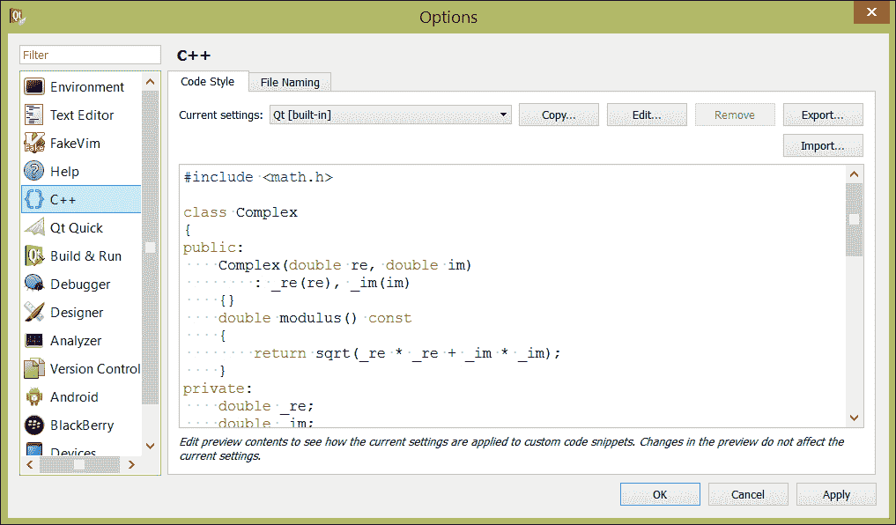
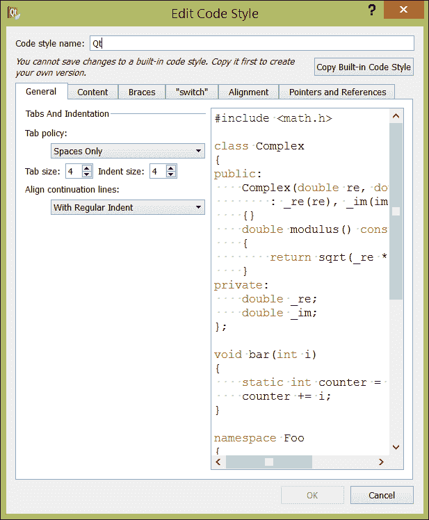
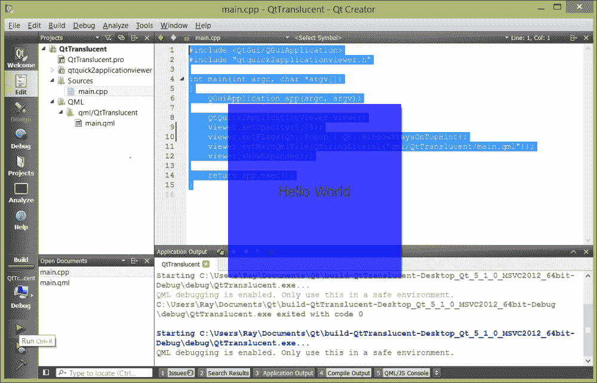
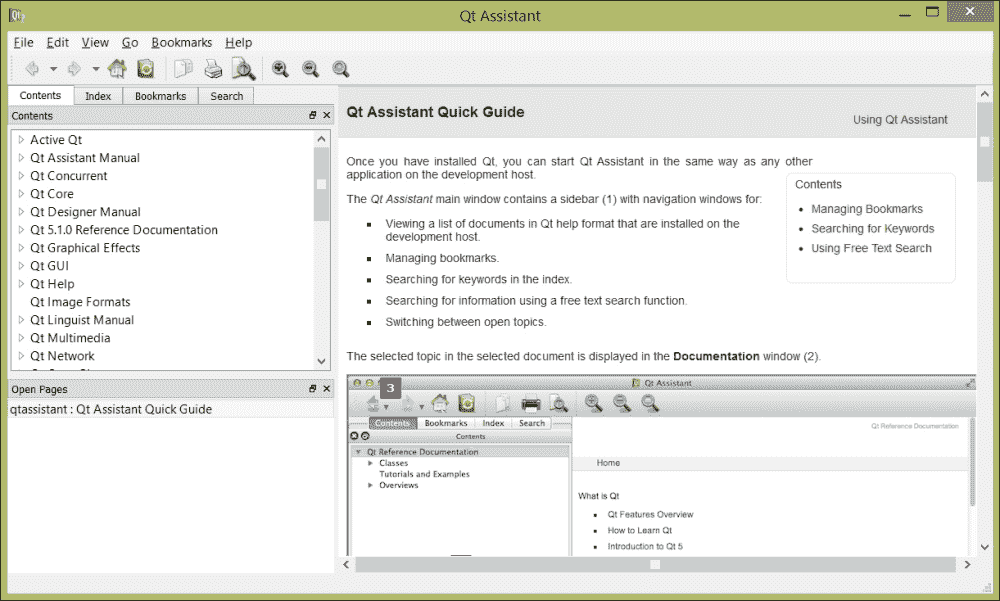

# 第七章。Qt 提示和技巧

在前几章中，我们讨论了 Qt Creator 作为软件开发工具包的优点：如何编辑、编译和调试应用程序；如何对其执行和内存性能进行分析；如何将其本地化为世界各地的不同地区；甚至如何制作在 Android 手机和平板电脑上运行的移动应用程序。在本章中，我们将讨论在使用 Qt Creator 和 Qt 时应该了解的一些提示和技巧的集合，这将使您像专业人士一样编写软件。

# 使用 Qt Creator 编写控制台应用程序

还记得第一章中的“Hello World”应用程序，*开始使用 Qt Creator*吗？那是一个控制台应用程序，是您可以编写的最简单的一个。回顾代码，我们创建了一个新的 Qt 控制台应用程序，在`main.cpp`中编写了：

```cpp
#include <QCoreApplication>
#include <iostream>

using namespace std;

int main(int argc, char *argv[])
{
    QCoreApplication a(argc, argv);

    cout << "Hello world!";

    return a.exec();
}
```

在 Qt 应用程序中，任何有效的 C++都是有效的，包括标准模板库（STL）代码。如果您需要用 C++编写一个小工具，但还没有学习很多关于 Qt：您在 Qt Creator 中可以访问您所了解的关于 C++（甚至 C，如果您喜欢）的一切。

尽管 Qt 最广为人知的是作为 GUI 工具包，但值得一提的是`QtCore`库，它是每个 Qt 应用程序的一部分，包括 Qt 控制台应用程序，其中包括大量的实用程序和模板类，例如：

+   集合类，包括`QList`、`QVector`、`QStack`和`QQueue`，用于保持列表和向量，以及后进先出和先进先出的数据存储

+   字典类（也称为哈希表），包括`QMap`和`QDict`

+   使用`QFile`和`QDirectory`进行跨平台文件 I/O

+   使用`QString`进行 Unicode 字符串支持

为什么会选择 Qt 的类而不是直接使用 C++提供的内容？有几个原因：

+   **内存** **性能**：与 STL 集合不同，Qt 集合是基于引用的，并使用写时复制来节省内存。Qt 集合通常比其 STL 对应物占用更少的内存。

+   **迭代**：使用 Qt 集合进行迭代是安全的，具有受保护的访问，以防止超出集合的末端。

+   **可读性**：在整个应用程序中使用 Qt 代码和库提供了统一的外观和感觉，可以使代码更易于维护。

+   **可移植性**：在一些嵌入式平台上，Qt 可用，但 STL 可能不可用。（然而，这与 Qt 最初编写时的问题相比已经不是问题了。）

值得注意的是，Qt 的集合通常比其 STL 对应物稍慢：当使用 Qt 类处理数据时，通常会以内存性能换取速度。然而，在实践中，这很少是问题。

`QFile`和`QDirectory`类值得特别一提，因为有一点：**可移植性**。甚至目录分隔符也以可移植的方式处理；无论您在 Mac OS X、Linux 还是 Windows 上运行，目录始终由单个`/`标记，这样可以轻松地以与平台无关的方式编写代码，并确保其在所有平台上运行。在底层，Qt 在访问文件时会将目录字符串转换为使用特定于平台的目录分隔符。

# 与版本控制系统的集成

几乎所有大型项目都需要某种版本控制来协调不同用户对同一文件所做的更改，并确保对源代码库的更改和谐地进行。即使是单个开发人员也可以通过使用版本控制来受益，因为版本控制提供了开发人员对每个已更改文件的更改记录，并提供了项目随时间变化的宝贵历史记录。Qt Creator 支持以下版本控制系统：

+   Bazaar（在 Qt Creator 2.2 及更高版本中支持）

+   CVS

+   Git

+   Mercurial（在 Qt Creator 2.0 及更高版本中支持）

+   Perforce（支持 Perforce 服务器版本 2006.1 及更高版本）

+   Subversion

您需要做的第一件事是为项目设置版本控制软件。如何做取决于您选择的版本控制系统（例如，可能由您的组织规定，或者您可能有从过去项目中工作中的个人偏好），以及如何执行此操作因系统而异，因此我们不会在这里详细介绍。但是，您需要有一个存储源代码版本的存储库，并且在您的工作站上安装适当的版本控制软件，并且在系统的`PATH`环境变量中包含包含版本控制二进制文件的适当目录，以便 Qt Creator 可以找到它们。重要的是，您需要从系统的 shell（例如 PowerShell 或本地终端提示符）访问版本控制命令，因为 Qt Creator 以相同的方式访问它们。

完成此操作后，我们可以通过选择**工具**|**选项...**|**版本控制**来配置 Qt Creator 与版本控制的交互方式。有适用于您正在使用的任何版本控制系统的一般配置选项，以及 Qt 支持的每种版本控制的特定选项。一般选项包括：

+   可以在任何提交消息上运行的脚本，以确保您的消息格式正确或包含正确的信息

+   源代码控制系统的名称和别名列表

+   包括在每个提交消息中的字段列表

+   SSH 提示命令用于在使用 SSH 访问版本控制系统时提示您输入 SSH 密码

一些版本控制系统，如 Git 和 Mercurial，支持本地版本控制存储库。如果您在开发项目中独自操作并且只需要一个地方来备份您的更改，这将非常方便（当然，也要记得备份源代码存储库目录！）。如果您使用其中一个系统，可以使用 Qt 直接创建本地存储库目录，方法是导航到**工具**|**创建存储库**，或者导航到**文件**|**新文件或项目**向导的最后一页。

如果安装和配置版本控制系统，则该系统提供的各种命令将添加到 Qt Creator 的**工具**菜单的子菜单中。从那里，您可以：

+   通过导航到**窗口**|**输出窗格**|**版本控制**来查看版本控制命令输出

+   查看版本控制系统的不同输出，让您看到您正在编辑的文件与存储库中的文件有何不同

+   通过选择**日志**或**文件日志**查看文件的变更日志

+   通过选择**提交**或**提交**将文件的更改提交到系统

+   通过选择**还原**来撤消对文件的更改

+   通过选择**更新**，使用当前版本控制系统的内容更新您的工作目录

+   访问支持分支、存储和远程存储库的其他每个版本控制命令可能也可用

如果您刚开始并需要选择版本控制系统，也许最好的方法是查看维基百科上各种系统的比较，并熟悉其中一个。

### 提示

就我个人而言，我更喜欢 Git，无论是使用本地存储库还是在 GitHub 等托管存储库中。它是免费的，速度快，对分支有很好的支持，并且得到了 Qt Creator 的良好支持。

# 配置编码风格和编码格式选项

可读的代码至关重要，Qt Creator 的默认编码风格是大多数人都认为非常易读的。但是，您可能在一个遵循不同编码准则的项目中，或者您可能发现无法忍受 Qt Creator 编辑器处理代码格式的某个特定方面：也许是大括号的位置，或者`switch`语句的格式。幸运的是，Qt Creator 是非常可配置的。通过导航到**工具** | **选项…** | **C++**，您可以配置 Qt Creator 如何格式化您的代码，如下面的屏幕截图所示：



在 Qt Creator 中调整代码格式

基本对话框允许您选择流行的格式样式，例如 Qt 的默认格式，或大多数 GNU 代码使用的格式。您还可以单击**编辑…**，这将打开**编辑代码样式**窗口，如下一个屏幕截图所示：



在 Qt Creator 中微调代码格式

您将首先复制一个内置样式，并编辑以适应您的口味；从**编辑代码样式**对话框中，您可以选择选项卡是表示为制表符字符还是空格或选项卡和每个选项卡停止的空格数，以及如何处理行连续。每个窗格都允许您调整代码格式的特定方面：

+   **内容**窗格允许您调整类主体的格式，包括公共、受保护和私有声明的间距

+   **大括号**窗格允许您控制与大括号相关的格式

+   “switch”窗格允许您控制 switch 和 case 语句的格式

+   **对齐**窗格允许您控制代码在连续行之间的对齐方式

+   **指针和引用**窗格允许您控制指针声明周围的间距

使用所有这些选项很容易变得疯狂，但我劝您不要这样做：乍一看好的东西在日复一日看到时通常是无法阅读的混乱。如果您刚开始使用 Qt，请坚持使用默认格式，并记住古老的格言*不要伤害别人*。在编辑现有代码时，要匹配已有的格式。

# 从命令行构建

有时，您需要从命令行构建项目。也许您正在使用 Linux，并且您更喜欢在那里工作，或者您在开会时远程连接到桌面。或者，您想要在构建服务器上自动构建，并且需要知道 Qt 如何为您的构建执行其编译魔法。

诀窍在于`qmake`：Qt 的元构建系统，负责为您已经安装的编译器工具链生成 Make 文件。`qmake`命令接受`.pro`文件，您在第二章中首次看到了这些文件，*使用 Qt Creator 构建应用程序*，并生成您的工具链构建应用程序所需的 Make 或 Nmake 文件。

首先确保您的编译器和`make`实用程序在系统路径中：如何执行此操作因开发环境而异。接下来，请确保您的路径中包含 Qt 的构建系统命令——如果您在 Linux 上使用软件包管理器安装了 Qt，则默认情况下是这样，如果您在 Mac OS X 或 Windows 上安装了 Qt 工具，则可以通过编辑路径以包括适当的`bin`目录来轻松完成。

接下来，打开命令窗口并切换到包含您的项目的目录：您的`.pro`文件应该位于该目录的根目录。键入`qmake`，然后进行构建（如果您的构建系统使用`make`），或者进行`nmake`（如果您使用 Microsoft Windows 工具链）。就是这样！

# 设置 Qt Quick 窗口显示选项

Qt Quick 非常适合构建非传统计算环境的应用程序，比如机顶盒或汽车电脑。在使用 Qt Quick 时，通常您会希望应用程序在这些设置中不具有所有通常的窗口外观（比如关闭框），因为您试图基于您的 Qt Quick 应用程序而不是主机平台上的窗口工具包来呈现统一的用户界面。

您可以通过编辑 Qt Quick 项目中的`main.cpp`文件轻松设置不透明度和窗口选项（比如是否显示关闭框）。默认情况下，它看起来是这样的：

```cpp
#include <QtGui/QGuiApplication>
#include "qtquick2applicationviewer.h"

int main(int argc, char *argv[])
{
    QGuiApplication app(argc, argv);

    QtQuick2ApplicationViewer viewer;
    viewer.setMainQmlFile(QStringLiteral("qml/QtTranslucent/main.qml"));
    viewer.showExpanded();

    return app.exec();
}
```

这段代码创建了一个 Qt Quick 应用程序查看器，将其主 QML 文件（要加载的第一个文件）设置为指定的文件，然后在启动应用程序的事件循环之前显示它。幸运的是，`QtQuick2ApplicationViewer`对象有一个`setFlags`方法，让您可以传递`Qt::Window`标志给它初始化的窗口，以显示您的 Qt Quick 应用程序。这些标志包括：

+   `Qt::FramelessWindowHint`：这表示窗口应该没有边框（在 Linux 系统上有效，在 Windows 上无效）

+   `Qt::Popup`：这表示一个弹出窗口（您可以在 Windows 上使用这个选项来获得一个几乎没有边框但有轻微阴影的窗口）

+   `Qt::WindowStaysOnTopHint`：这表示窗口应该始终位于所有其他窗口之上

+   `Qt::WindowStaysOnBottomHint`：这表示窗口应该位于所有其他窗口下方

+   `Qt::Desktop`：这表示窗口应该在桌面上运行

Qt 文档中可以找到所有标志的完整列表，网址是[`bit.ly/17NT0sm`](http://bit.ly/17NT0sm)。

您还可以通过使用`QtQuick2ApplicationViewer`的`setOpacity`方法来调整窗口的不透明度。

比如，我们想要一个蓝色窗口，没有边框，但是有一个轻微的 75%不透明度的阴影，悬浮在所有其他窗口上，用于我的 Qt Quick 应用程序。我们会修改 QML 以便读取：

```cpp
import QtQuick 2.0

Rectangle {
    width: 360
    height: 360
    color: "blue"
    Text {
        text: qsTr("Hello World")
        anchors.centerIn: parent
        font.pointSize: 18
    }
    MouseArea {
        anchors.fill: parent
        onClicked: {
            Qt.quit();
        }
    }
}
```

请注意我们顶层矩形的`color: blue`声明。接下来，我们将修改`main.cpp`以便读取：

```cpp
#include <QtGui/QGuiApplication>
#include "qtquick2applicationviewer.h"

int main(int argc, char *argv[])
{
    QGuiApplication app(argc, argv);

    QtQuick2ApplicationViewer viewer;
    viewer.setOpacity(0.75);
    viewer.setFlags(Qt::Popup | Qt::WindowStaysOnTopHint);
    viewer.setMainQmlFile(QStringLiteral("qml/QtTranslucent/main.qml"));
    viewer.showExpanded();

    return app.exec();
}
```

关键的行在`viewer.setMainQmlFile`之前：`setOpacity`方法设置主窗口的不透明度，`setFlags`方法设置主窗口的标志为一个弹出窗口，将位于所有其他窗口之上。通过运行应用程序，我们可以看到类似以下的屏幕截图：



一个半透明的 Qt Quick 窗口位于其他窗口之上

您可以使用这个技巧来产生各种效果，来显示您的 Qt Quick 应用程序。

# 了解更多关于 Qt

在早期的章节中，我指向了 Qt Creator 的**帮助**面板，以及编辑代码时自动补全类成员的功能。Qt Creator 的**帮助**视图实际上是 Qt 助手的一个子视图，包含了 Qt 的完整文档。这些文档的大部分也在网上，但在本地访问速度更快。我们从 Qt SDK 启动 Qt 助手（可以通过命令行使用`qtassistant`，也可以在已安装的应用程序列表中找到它），我们可以看到类似以下的屏幕截图：



Qt 助手

Qt 助手是学习 Qt 的终极地方。在左侧列中，您会看到一个目录；最好的开始位置是 Qt Core，然后根据您想要编写 GUI 还是 Qt Quick 应用程序选择 Qt GUI 或 Qt Quick。右侧的主视图就像一个浏览器窗口，包括到相关部分的超链接。

在 Qt 助手中，您还可以将常访问的页面添加到书签中，查看文档中所有术语的索引，并通过左侧列的搜索选项卡快速搜索术语。这是一个非常宝贵的资源，使用起来就像使用电子书一样简单。

最后，如果您喜欢通过网络了解事物，请不要忘记 Qt 的广泛在线文档，可在[`bit.ly/15F11Ok`](http://bit.ly/15F11Ok)上找到。

# 总结

Qt 和 Qt Creator 为您的应用程序开发提供了一个很好的环境，无论您是编写控制台、GUI 还是 Qt Quick 应用程序。您可以将标准 C++代码与 Qt 混合使用，从而充分利用您现有的技能。在这样做时，您可以添加诸如版本控制和命令行构建等工具，使您能够在大型团队中工作，并使用 Qt 执行大型项目的无人值守构建。Qt 还有一个很好的文档，既包含在 Qt Creator 中，也可以在网络上找到。通过本书学到的知识和可用的资源，您的应用程序开发目标将不受限制！
