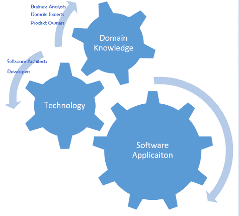
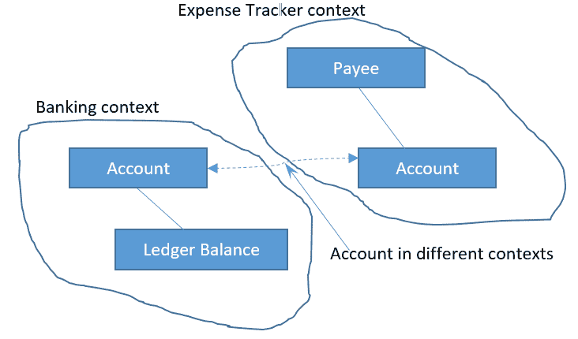
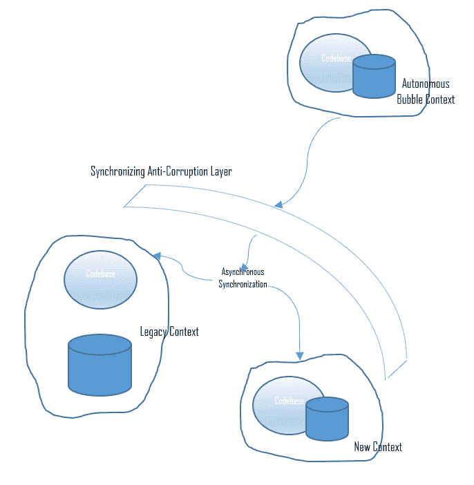
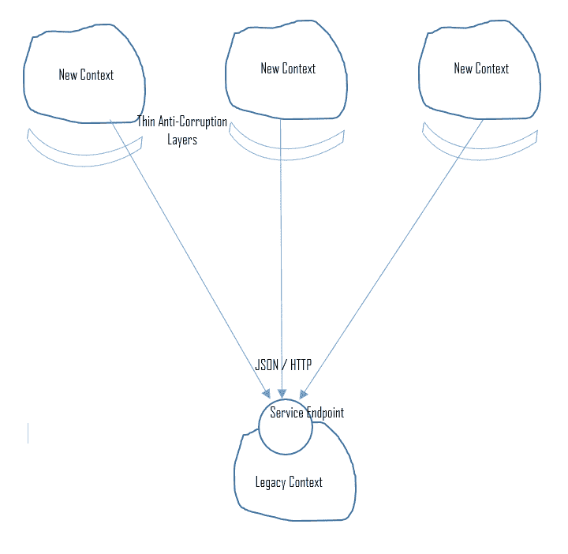
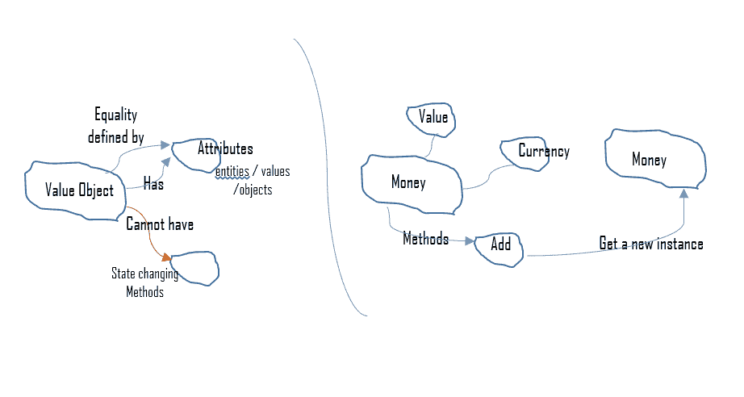
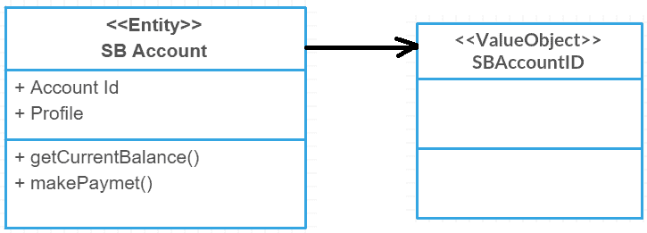
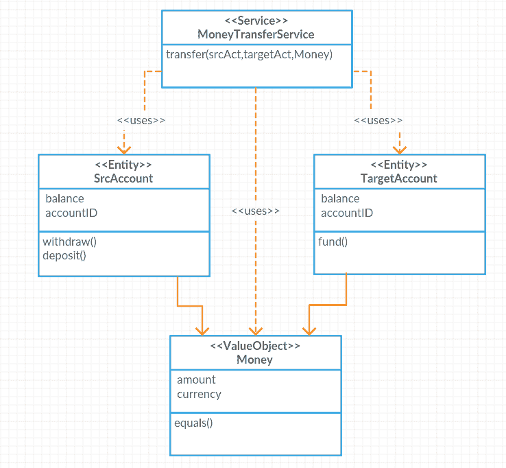
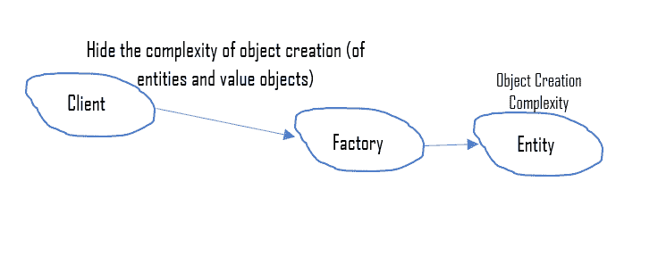
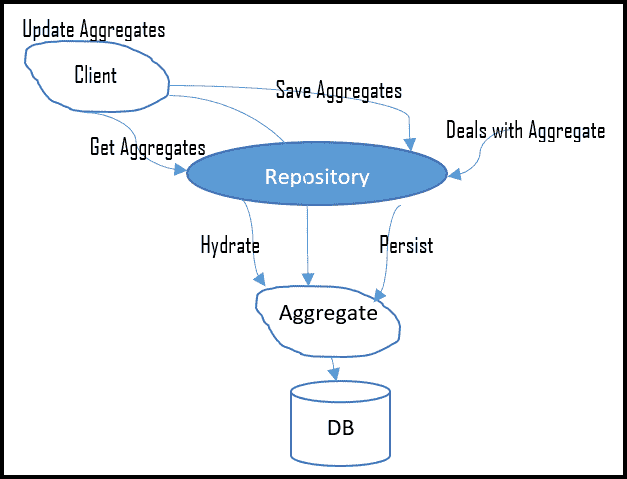
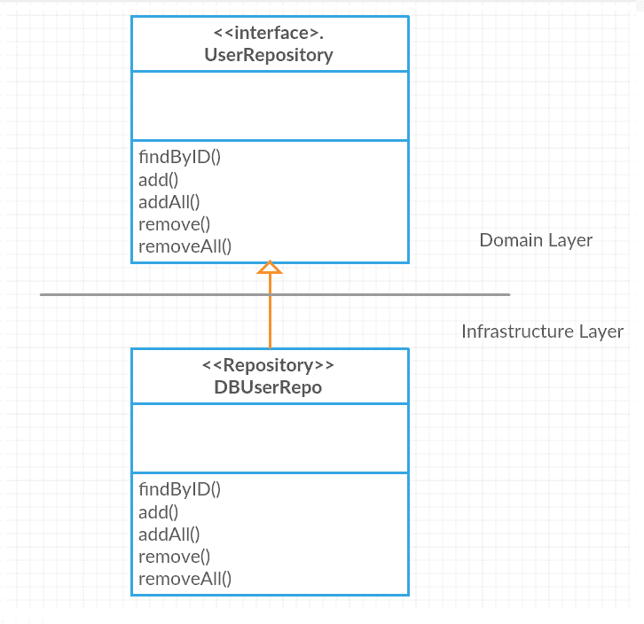

# 第五章：领域驱动设计（DDD）原则和模式

大多数商业软件应用都是通过一组复杂业务需求创建的，以解决特定的业务问题或需求。然而，期望所有软件开发者/架构师都是业务领域的专家，并期望他们了解整个业务功能也是不切实际的。另一方面，我们如何创建具有价值的软件，并让具有自动化业务需求的消费者使用该软件？软件应用不能只是技术卓越的展示品，但在大多数情况下，它们也必须具有真正的自动化业务卓越的便利性。领域驱动设计和模型是我们问题的答案。

本节将涵盖大多数 DDD 方面和模式，这些模式有助于成功实施基于 DDD 的软件。

上述图表是尝试通过领域和技术专家的协作努力来可视化由领域驱动软件模型。

DDD 的概念、原则和模式将技术和商业卓越结合到任何复杂的软件应用中，这些应用可以创建和管理。DDD 是由 Evan 提出的，本章的大部分内容受到了他的书籍《领域驱动设计 - 软件核心的复杂性处理》的影响，同时也受到了 Scott Millett 和 Nick Tune 的书籍《模式-原则-实践》的影响。

本节旨在涵盖 DDD 的一些基本方面，并详细讨论一些常见的领域驱动设计模式。

# DDD 的原则、特性和实践

在我们深入各种设计模式之前，让我们先谈谈 DDD 的基本原则，然后是一些主要特性组成部分，以及一些最佳实践，这些实践有助于团队采用和遵循 DDD。

# 原则

DDD 的基本原则在以下章节中描述。

# 专注于核心领域

这一原则建议产品开发团队更多地关注核心领域，即对业务最重要的部分，这些部分比其他部分需要更多的关注。因此，我们需要通过提炼和分解一个大问题领域到子领域来识别核心领域。例如，在设计零售银行软件时，我们应该关注信贷和借记会计，而不是信用卡和借记卡的制造和分销，因为它们是支持功能，也可以外包。

# 协作和学习

正如我们在引言部分提到的，软件专家可能不了解领域，而领域分析师可能不了解技术和软件实现。因此，对于领域驱动设计（DDD）方面，相互协作和学习是不可避免的，没有这种协作，软件开发或开发根本不会发生。例如，为了开发一家投资银行的后台软件应用程序，风险管理专家和软件专家需要一起工作，学习系统、适用性、可用性、银行客户的意图等等。

在最近的日子里，传统银行正在与金融科技公司（fintech）合作，因为他们看到数据分析、人工智能（AI）和机器学习在核心银行系统中的显著益处，这将使他们能够做出准确的决策，更快地进行创新，并解决银行业日常问题。

# 建模领域

正如我们从上一节中理解到的协作和学习原则，协作、深入学习和获取核心领域的洞察力，以及基本功能，这是不可避免的。模型领域原则的预期输出是一个领域模型，它是在核心领域空间中组织良好和结构化的知识，包括基本概念、词汇、问题以及涉及实体的关系。你可以从不同的利益相关者那里寻求贡献，如分析师、领域专家、商业伙伴、技术熟练的用户和核心开发者，并构建这些领域模型，这样团队中的每个人都能理解功能概念和定义，以及当前问题是如何被解决和处理的。

# 演进

领域模型的关键方面之一是演进。领域模型需要通过迭代和反馈随着时间的推移而演进。设计团队从一个重要问题开始，随着生成模型的增量变化，迭代地穿越核心领域的不同范围。这至关重要，因为模型需要调整以适应领域专家的反馈，同时处理复杂性。

# 使用通用语言进行交流

协作、学习和定义模型会在软件专家和领域专家之间带来许多初始的沟通障碍。因此，通过在特定上下文中实践相同类型的沟通（讨论、写作和图表）来演进领域模型对于成功的实施至关重要，这种对话被称为通用语言。它是围绕领域模型构建的，并在有限上下文中被所有团队成员广泛使用。它应该是连接团队在软件开发过程中所有活动的媒介或方式。

设计团队可以建立深入的理解，并通过通用语言将领域术语和软件实体联系起来，以持续发现和演进他们的领域模型。

# 特征

以下特征是主要组成部分，可能作为我们将在此章节中讨论的项目词汇表。您将看到其中许多都被纳入了我们在此部分中提出的模式中：

+   **领域模型**：与特定问题相关的组织化和结构化知识。

+   **边界上下文**：一个系统满足现实世界复杂业务问题的基本目标，提供对什么是可以一致的以及什么是可以独立的清晰和共享的理解。

+   **实体**：这些是可以改变其属性而不改变其身份的可变对象（例如，即使员工的电子邮件 ID、地址和姓名发生变化，员工的 ID 也不会改变）。

+   **值对象**：这些是不可变对象（与实体不同），只能通过其属性的状态来区分。值对象的等价性不是基于其身份的。（两个位置对象可以通过其经纬度值相同。）

+   **封装**：对象的字段仅公开供私有访问，换句话说，只能通过访问器方法（设置器和获取器）检测到。

+   **聚合**：这是实体（例如，计算机是软件和硬件等实体的聚合）。聚合可能在没有这些对象的情况下无法工作。

+   **聚合根**：这是聚合的入口点，也是任何外部对象的已知引用。这有助于为聚合创建精确的边界。

# 最佳实践

我们列出了一些针对打算在软件开发产品开发中采用 DDD 的团队的最佳实践：

+   收集需求并捕获所需的行为

+   关注利益相关者想要什么、何时以及为什么

+   提炼问题空间

+   首先成为一个问题解决者，其次才是技术专家

+   使用抽象和创建子域来管理复杂性

+   使用上下文映射和边界上下文来理解现实世界的景观

+   建模解决方案，解决歧义，并划出安全区域

+   将隐含的概念明确化

# DDD 模式

在本节中，我们将浏览一系列模式，从领域模型构建企业应用程序。将这些设计模式与面向对象概念结合应用于系统，有助于满足业务需求。

本节涵盖了 DDD 设计模式的重大方面，分为战略设计模式和战术设计模式。

# 战略模式

该小组的主要目标是促进业务和软件开发团队之间的理解和共识，更侧重于业务利益和目标。战略模式帮助软件开发团队成员通过识别核心领域来关注对业务更重要和关键的事情。核心领域是公司的一个特定领域，甚至是一个关键的特定部分。

战略模式的主要组成部分包括通用语言、领域、子领域、核心领域、边界上下文和上下文映射。我们将看到如何通过本章讨论的战略设计模式，如边界上下文、消息传递和 REST，将这些组成部分整合到不同的系统中。

# 通用语言

一个模型充当通用语言，以管理软件开发者和领域专家之间的沟通。以下表格展示了通用语言及其等效伪代码的示例：

| **通用语言** | **等效伪代码** | **注释** |
| --- | --- | --- |
| 我们注射疫苗 | `AdministerVaccines {}` | 不是核心领域——需要更多具体细节 |
| 我们向患者注射流感疫苗 | `patientNeedAFluShot()` | 更好，可能缺少一些领域概念 |
| 护士以标准剂量向患者注射流感疫苗 | `Nurse->administer vaccine(patient, Vaccine.getStandardDose())` | 更好，可能是一个好的开始 |

# 领域、子领域和核心领域

领域指的是软件团队试图为其创建解决方案的问题空间，并代表实际业务的工作方式。表中的疫苗示例可以被视为领域，具有端到端流程，管理疫苗接种、预防性药物、剂量、副作用等。核心领域是组织不希望外包的核心业务。因此，在这个上下文中，核心领域是疫苗接种，而其他如患者管理、疫苗成本、疫苗接种活动等职能是子领域，并且位于核心领域之外。核心领域与子领域相互作用。

# 边界上下文

边界上下文是独特的概念线条，定义了边界并将上下文与其他系统部分区分开来。边界上下文代表了精细的业务能力，并且是领域驱动设计（DDD）的焦点。它通过将它们划分为不同的边界上下文并明确它们的相互关系来处理大型分布式模型和团队。

在我们深入探讨模式之前，让我们先回顾一下边界上下文的概念。前面的图示显示了两个上下文中的账户；尽管账户没有差异，但上下文是有区别的。以下几节将讨论有助于整合任何 DDD 解决方案的边界上下文的模式。

# 集成边界上下文

边界上下文有助于识别子系统之间的关系，因此可以选择子系统之间的通信方法。选择适当的通信并建立与现有通信的关系是设计者的责任，这也有助于他们确保不会影响项目交付的时间表和效率。一个集成和建立通信的例子可能是将支付系统与电子商务销售系统集成。选择通信方法至关重要，我们将在以下章节中看到更多关于集成边界上下文的内容。

# 自主边界上下文

为了确保原子性，设计松散耦合的系统，减少依赖；解决方案也可以独立开发。

# 无共享架构

在保证边界上下文自给自足的同时，保持边界上下文的完整性也是至关重要的。无共享模式建议每个边界上下文都有自己的数据存储、代码库和开发者，如下面的图所示：

由于每个边界上下文在物理上是隔离的，它可以独立于内部原因进行演变，从而产生无妥协的领域模型，以及超级高效和更快的业务价值交付。

# 单一职责代码

按照业务能力对软件系统进行分区是一种最佳实践，即通过将不同的业务能力隔离到不同的边界上下文中。例如，业务中的运输代码不会受到添加到销售的新运输提供商的影响。

# 多个边界上下文（在解决方案内）

根据代码（语言）、部署和基础设施，存在不同边界上下文位于同一代码仓库或具有组合上下文的解决方案中，以描绘完整业务用例的整体图景的情况。

为了维护解决方案内的不同上下文，此模式建议保持命名空间区分或建议项目将边界上下文分开。

# 采用 SOA 原则

使用 DDD 和 SOA 概念和模式构建高度可扩展的系统。将边界上下文作为 SOA 服务构建，以解决边界上下文集成中的技术和社交挑战（集成团队和高速开发）。请参阅第七章，*面向服务的架构 (SOA)*，以了解更多关于 SOA 原则和实践的细节。

# 与遗留系统集成

遗留系统在现实世界中总是存在，当我们试图将最新的行业改进融入其中时，它们会带来令人兴奋的挑战。在 DDD 中，这个问题更有趣，因为有许多实用的模式可以帮助限制遗留系统对系统其他部分的影响，管理复杂性，并帮助设计师避免在将新代码集成到遗留模块或组件时降低其显式性（违反 DDD 哲学）。

在本节中，我们将讨论气泡上下文、自主气泡上下文，并将遗留系统作为服务进行展示。

# 气泡上下文

如果一个团队想要开始将领域驱动设计（DDD）应用于遗留系统，但尚未熟悉 DDD 实践，那么可以考虑气泡上下文模式。由于遗留系统中的边界上下文可能是一个独立的代码库，气泡上下文模式提供了清晰的方向，帮助团队创建领域模型并不断演进。气泡上下文反映了 DDD 迭代哲学的最好方面，并通过完全控制领域模型来推进。

它被认为是最适合促进频繁迭代并在涉及遗留代码的情况下获得洞察力的。

当你需要与遗留代码集成，但又不想像气泡上下文那样创建任何依赖或紧密耦合时，这种模式建议使用一个名为**自主气泡上下文**的匿名气泡。气泡上下文从遗留系统中获取所有数据，而自主气泡上下文有自己的数据存储，并且能够在与遗留代码或其他边界上下文隔离的情况下运行。

上述图示展示了自主气泡上下文，你可能注意到气泡上下文与遗留上下文存在依赖关系。然而，自主气泡上下文有自己的存储，因此它可以独立运行。

# 反腐层

隔离层通过其现有的接口与其它系统进行通信，几乎不需要（对其他系统）进行修改，并为客户端提供其自身领域的功能。这一层负责在两个模型之间按需进行双向通信的转换。

# 作为服务公开

将遗留系统作为服务公开可能是一个好主意，特别是当遗留上下文需要被多个新的上下文消费时。这种模式也被称为**开放主机模式**。

每个新的上下文仍然需要将遗留系统的响应转换为内部表示；然而，通过简化的开放主机 API，可以减轻转换复杂性。

使用这种模式，需要对遗留上下文（与气泡上下文不同）进行一些修改；此外，由于有多个消费者，标准化可消费 API SLA 可能具有挑战性。

我们可以清楚地证明，现实世界中许多遗留系统都希望采用领域驱动设计（DDD）；然而，由于缺乏合适的模式和考虑到成本和影响，有真正的理由和犹豫不决去转向 DDD。识别和利用这些模型应该会缓解情况，并鼓励组织为他们的遗留系统采用 DDD，并朝着更快交付的方向发展。

# 分布式边界上下文集成策略

在现代世界中，由于各种原因，分布是不可避免的，主要是为了系统能力，如可用性、可伸缩性、可靠性和容错性。本节简要介绍了分布式边界上下文的一些集成策略，例如数据库集成、平面文件集成、消息传递和 REST。我们将探讨这些模式如何帮助集成分布式边界上下文。此外，我们还将简要了解反应式解决方案如何帮助集成策略。

# 数据库集成

数据库集成模式是使用单个数据源的传统方法之一，允许一个应用程序写入特定的数据库位置，并允许另一个应用程序从中读取。另一个应用程序的访问可以通过一定频率的轮询来实现。这种模式对于原型或甚至对于**最具可行性的产品**（**MVP**）的交付可能很有用。

上述图示展示了数据库集成的一个示例，其中销售团队插入记录，计费上下文轮询相同的数据源。如果它找到销售记录，它将处理并更新同一行。

虽然此模式具有松耦合的优点，但也存在一些缺点，例如单点故障，需要有效的故障处理机制等。数据库宕机场景是一个单点故障的例子，为了缓解，可能需要采用集群数据库，购买更多硬件以进行扩展，或者考虑云基础设施等。

# 平面文件集成

平面文件集成模式类似于数据库集成；然而，它不是使用数据库来集成两个组件，而是建议使用平面文件。更新、插入和轮询的需求就像在其他模式中一样，但这一点更为灵活。然而，这也带来了一些缺点，如管理文件格式、并发性和锁定等问题，需要更多的参与和努力，从而导致可伸缩性和可靠性问题。

此图是平面文件集成的示例实现，涉及轮询、更新和删除。

# 事件驱动架构和消息传递

消息和事件驱动架构模式将分布式系统中边界上下文之间的建模发挥到极致。在本节中，DDD 旨在确保您理解 EDA 和消息模式在 DDD 上下文中的重要性。同时，强调在上下文之间实现异步消息和 EDA 模式的好处。这些好处包括即使在子系统失败的情况下也能提高可靠性。我们在第八章事件驱动架构模式和第九章微服务架构模式中已经很好地覆盖了 EDA 和消息模式，并鼓励您参考这些章节，以获得关于事件驱动和消息模式的见解。

# 战术模式

战术模式有助于管理复杂性，并在域模型的行为中提供清晰性。这些模式的主要重点是保护模型免受损坏，通过提供保护层来实现。

在本节中，我们将简要介绍一些有助于创建面向对象域模型的常见模式。

在本节的结尾，我们还将简要介绍事件源和域事件的兴起模式。

# 用于建模域的模式

本节将讨论一些战术模式，并解释它们如何表示问题域内的策略和逻辑。它们在代码中表达模型元素，对象与模型规则之间的关系，并将分析细节绑定到代码实现。

我们将详细讨论以下模式：

+   实体

+   值对象

+   域服务

+   模块

+   聚合

+   工厂

+   仓库

下图展示了各种战术模式及其逻辑流程：

# 实体

如介绍部分所述，实体是一个可变对象。它可以改变其属性而不会改变其身份。例如，产品是一个实体，它是唯一的，一旦设置，就不会改变其 ID（独特性）。

然而，其价格、描述等可以根据需要更改多次。

前面的图展示了实体及其示例。员工 ID 是唯一的，永远不会改变。然而，有一个可以通过访问器方法修改的联系方式。

实体具有以下属性：

+   它们由其标识符定义

+   标识符在其整个生命周期中保持不变

+   它们负责进行等式检查

# 值对象

与实体不同，值对象是不可变的，用作模型元素的描述符。它们只通过其特征为系统所知，并且不需要有唯一的标识符。它们始终与其它对象相关联（例如，销售订单中的交货地址可以是值对象），并且始终与销售订单上下文相关联；否则，它们没有任何意义。

上述图示展示了值对象的基本概念和示例，以下图示是实体和值对象的示例类表示：

以下列表描述了值对象的特征：

+   它们描述了问题域内的属性和特征

+   它们没有标识符

+   它们是不可变的，也就是说，对象的内容不能被更改；相反，作为值对象建模的属性必须被替换

# 领域服务

在通用语言中，存在某些操作无法归因于任何特定实体或值对象的情况，这些操作可以称为**领域服务**（不是应用服务）。

领域服务封装了可能无法建模为实体或值对象的领域逻辑和概念，并负责使用实体和值对象编排业务逻辑。以下是一些领域服务的特征/功能：

+   领域服务既没有标识符也没有状态

+   领域服务执行的任何操作都不属于任何现有实体

+   领域服务中的任何领域操作都携带特定领域模型的对象

以下类图展示了从一个账户到另一个账户的示例货币转账操作。由于我们不知道在哪个对象中可以存储转账操作，我们选择领域服务进行此操作：

# 模块

模块用于分解领域模型。命名模块是通用语言的一部分，它们代表领域模型的一个独立部分，并在独立时提供清晰性。模块帮助开发者快速阅读和理解代码中的领域模型，在深入进行类开发之前。请注意，分解领域模型与子域分解领域和边界上下文不同。

上述图示展示了示例模块名称和遵循的示例模板。

# 聚合

在 DDD 中，聚合的概念是一个边界，有助于将较大的模块分解为较小的领域对象集群，从而可以将技术复杂性作为高级抽象来管理。聚合有助于以下方面：

+   减缓和约束领域对象之间的关系

+   将具有相同业务用例的对象分组，并将它们视为一个统一模型

每个聚合体都有一个特定的根和边界，并且在这个特定的边界内，所有可能的不变量都应该得到满足。域不变量是始终需要遵守的陈述或规则，有助于保持一致性（也称为**原子事务一致性**）。

以下图表示了一个聚合体示例实现以及每个类及其与聚合体上下文相关的简要信息如下：

+   **CreditReport**：这包括用户信息和链接，并通过**Customer ID**（标识符）保存和存储外部链接。

+   **CustomerID**：这是一个独立的聚合体，用于保留用户信息

+   **CreditScore**：这包含信用评分估算规则并作为不变量。这个不变量根据信用修改历史进行修改/影响。

+   **CreditHistoryEntry**：这有助于在修改时实现事务一致性。

+   **Inquiry**：这可以处理第三方组织特定的信用评分请求。

# 工厂

工厂是一种模式，用于将对象的使用（对象）与构建（对象）分离。聚合体、实体和值对象在域模型中创建了一定程度的复杂性，尤其是在较大的域模型中。工厂有助于以更好的方式表达（创建和使用）复杂对象。

以下图可能有助于从领域驱动设计（DDD）的角度快速了解工厂创建的细节。以下是一些我们希望刷新的工厂特性：

+   将使用与构建分离

+   封装内部（并避免暴露聚合体的内部）

+   隐藏在创建类型域层工厂中的决策，以抽象要创建的类的类型

+   清理复杂的域模型

以下类图旨在给出创建汽车模型的工厂实现的示例视图；创建复杂性被抽象为域。

# 仓库

仓库是管理聚合体持久化和检索的模型，同时确保数据模型和域模型之间的清晰分离。仓库是充当存储和持久化门面的中介。

以下图描述了一个仓库模型的示例结构。它显示了客户端的保存和更新（持久化）操作，通过仓库与聚合体进行，同时存在对仓库的单独访问（上图中的**处理聚合体**）；域和数据模型之间的清晰分离。

仓库在以下三个方面与传统数据访问策略不同：

+   它们通过允许检索和持久化聚合根来限制对领域对象的访问，同时确保所有更改和不变性都由聚合处理

+   它们隐藏了用于从外观中持久化和检索聚合的底层技术

+   它们定义了领域模型和数据模型之间的边界

我们有以下两种类型的存储库：

+   存储库作为集合

+   存储库作为永久数据存储

上述类图描述了存储库类及其底层层的示例结构。存储库位于基础设施层，并扩展了领域层接口（限制访问）。

# 新兴模式

在本节中，我们将介绍以下两种新兴模式：

+   **领域事件**：它们强制执行同一领域内多个聚合之间的致性

+   **事件源**：这是一种通过遍历保存状态的历史来持久化应用程序状态并找到当前状态的方法

# 领域事件

领域事件模式是触发同一领域内多个聚合的副作用的首选方式。领域事件是在特定领域发生的事件，该领域的其他部分（子领域）也应该了解并可能需要对其做出反应。

领域事件模式有助于以下操作：

+   明确表达事件的副作用

+   维护副作用的致性（要么执行与业务任务相关的所有操作，要么一个都不执行）

+   在同一领域内的类之间实现更好的关注点分离

# 事件源

事件源简化了各种事件，它是一种通过遍历保存状态的历史来持久化应用程序状态并找到当前状态的方法。一个例子可以是座位预订系统，它扫描完成的预订，并在新的预订请求到达时找出还有多少座位可用。

座位分配取决于各种事件（预订、取消、修改等），并且可以使用事件源模式以不同的方式处理。这在某些领域非常有帮助，在这些领域，审计跟踪是一个关键要求（会计、金融交易、航班预订等），并且该模式有助于实现更好的性能，因为事件是不可变的，并支持仅追加操作。

以下要求可能暗示我们需要在哪里使用事件源作为模式：

+   一个简单的独立对象，用于访问复杂的关联存储模块

+   审计跟踪（这是一个关键要求）

+   与其他子系统的集成

+   生产故障排除（通过存储事件并回放）

我们需要意识到关于事件源的一些一般性关注点，如下所述，以便我们可以进行权衡和缓解计划：

+   **版本控制**：由于事件源系统是只读模型，它们面临着独特的版本控制挑战。想象一下，我们需要将几年前创建/写入的事件读入事件源系统。因此，版本控制是必要的，以便在未来的某个时刻更改特定事件类型或聚合的定义，并且需要制定清晰和明确的计划与策略来管理事件源模型的多版本。

+   **查询**：这有点昂贵，因为它越深。它取决于要检索的状态的级别和时期。

+   **超时**：这是通过查询事件存储来加载聚合状态所需的时间，查询所有与聚合状态相关的事件。

# 其他模式

在结束本章之前，请查看以下列表，这些模式是作为 DDD 的一部分重要的，但本章没有涵盖。我们鼓励您查看我们的参考文献部分，以深入了解以下主题：

+   分层架构

+   服务层

+   应用服务

+   向更深入的洞察力重构

+   灵活的设计

+   将行为可视化（意图揭示界面）

+   无副作用的函数

+   **表示状态转移**（**REST**）

# 摘要

有时，软件设计专家会陷入困惑，不知道何时以及何时不使用领域模型。以下要点可能有助于您深入了解 DDD，以便进行有效的决策并决定是否实施 DDD：

+   业务案例和需求是特定的，特定于领域，与技术实现无关

+   作为一支独立的团队，他们希望在以下情况下转向 DDD：

    +   团队从未做过那种类型的业务案例

    +   团队需要来自主题专家的帮助

    +   业务案例更加复杂

    +   团队需要从零开始，并且没有先前的模型存在

+   当给定的设计问题对你的业务很重要时

+   技能、动机和热情的团队来执行

+   能够更容易地接触到与产品愿景一致的主题专家

+   愿意遵循迭代方法

+   对业务至关重要的非平凡问题域

+   对愿景有深刻的理解

+   业务目标、价值观、成功和失败因素，以及它将如何与早期实施不同

总结来说，本章简要介绍了团队为了提前采用 DDD 而需要了解的核心原则、特性和最佳实践。然后，我们详细介绍了战略模式，如通用语言、领域、子领域、核心领域和边界上下文。我们还涵盖了 DDD 的最基本方面，如自治边界上下文、无共享架构、单一职责代码、多个边界上下文，以及关于 DDD 方面的 SOA 原则的一些思考过程，作为集成边界上下文的一部分。我们还看到了泡沫上下文、自治泡沫上下文以及将服务公开作为与遗留系统集成的重要现实问题的部分。我们介绍了数据库集成、平面文件集成和事件驱动消息作为分布式边界上下文集成策略的一部分。

作为战术模式的一部分，本章涵盖了实体、值对象、领域服务、模块、聚合、工厂和存储库，并讨论了两种新兴模式：领域事件和事件溯源。

# 参考文献和进一步阅读材料

如需更多信息，您可以参考以下书籍：

+   *领域驱动设计 - 软件核心的复杂性处理* - Eric Evans 著（Pearson）

+   *领域驱动设计的模式、原则和实践* - Scott Millet 与 Nick Tune 著（Wrox）

您还可以参考以下在线资源：

+   DDD 快速入门：[`www.infoq.com/minibooks/domain-driven-design-quickly`](https://www.infoq.com/minibooks/domain-driven-design-quickly)

+   框架和工具：[`isis.apache.org/documentation.html`](https://isis.apache.org/documentation.html)

+   三个指导原则：[`techbeacon.com/get-your-feet-wet-domain-driven-design-3-guiding-principles`](https://techbeacon.com/get-your-feet-wet-domain-driven-design-3-guiding-principles)

+   DDD 入门：[`dzone.com/storage/assets/1216461-dzone-rc-domain-driven-design.pdf`](https://dzone.com/storage/assets/1216461-dzone-rc-domain-driven-design.pdf)

+   模型评估和管理：[`arxiv.org/ftp/arxiv/papers/1409/1409.2361.pdf`](https://arxiv.org/ftp/arxiv/papers/1409/1409.2361.pdf)

+   [`www.infoq.com/articles/ddd-in-practice`](https://www.infoq.com/articles/ddd-in-practice) (DDD 的特性)

+   [`www.codeproject.com/Articles/1158628/Domain-Driven-Design-What-You-Need-to-Know-About-S`](https://www.codeproject.com/Articles/1158628/Domain-Driven-Design-What-You-Need-to-Know-About-S)

+   [`www.codeproject.com/Articles/1164363/Domain-Driven-Design-Tactical-Design-Patterns-Part`](https://www.codeproject.com/Articles/1164363/Domain-Driven-Design-Tactical-Design-Patterns-Part)

+   [`www.slideshare.net/SpringCentral/ddd-rest-domain-driven-apis-for-the-web`](https://www.slideshare.net/SpringCentral/ddd-rest-domain-driven-apis-for-the-web)

+   [`www.infoq.com/presentations/ddd-rest`](https://www.infoq.com/presentations/ddd-rest)

+   [`ordina-jworks.github.io/conference/2016/07/10/SpringIO16-DDD-Rest.html`](https://ordina-jworks.github.io/conference/2016/07/10/SpringIO16-DDD-Rest.html)

+   [`www.slideshare.net/canpekdemir/domain-driven-design-71055163`](https://www.slideshare.net/canpekdemir/domain-driven-design-71055163)

+   [`msdn.microsoft.com/magazine/dn342868.aspx`](https://msdn.microsoft.com/magazine/dn342868.aspx)

+   [`mkuthan.github.io/blog/2013/11/04/ddd-architecture-summary/`](http://mkuthan.github.io/blog/2013/11/04/ddd-architecture-summary/)
