# 第七章：服务导向架构（SOA）

你可能想知道许多网站有不同类型的仪表板，显示不同但相关的内容，以及在这个世界上如何将天气预报和股市报价结合在一个显示中。

天气预报和股票报价在功能上是不同的系统；一个是气象领域，另一个是国家证券交易所，但它们可以结合并在单个仪表板上显示。

因此，如果我们需要定义什么是网络服务，那么任何可重用、定制开发的软件代码，它能让异构应用程序相互通信，并使不同的系统以经济有效的方式集成，都可以是我们的定义。

通过在每个服务设计中采用基本的 SOA 原则和特性，我们可以设计一个软件系统，该系统可以整合不同的数据源和不同的生态系统，这些系统可以在时间上更好地发展和成熟，并且成本效益更高。

在本章中，我们将作为 SOA 的一部分介绍以下主题：

+   网络服务和 SOA

+   SOA 简介

+   SOA 生命周期

+   SOA 的主要特性

+   SOA 原则

+   SOA 设计模式

# 网络服务和 SOA

任何网络服务设计的第一步是从严格遵守 SOA 特性和原则开始。任何网络服务设计的基本构建块和垫脚石是 SOA 架构模式。

SOA（服务导向架构）是最受欢迎且经过验证的架构设计风格，它有助于高效地解决现代软件系统在处理不断变化用户期望时的一些关键问题。

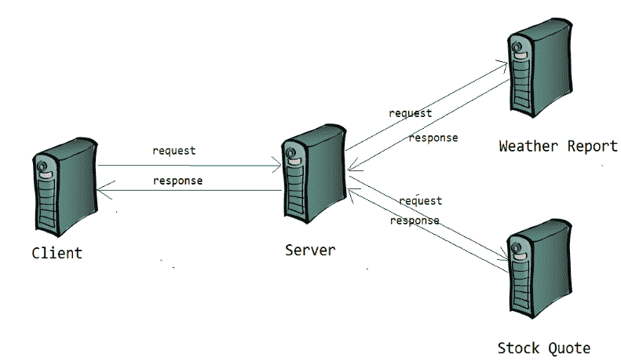

最近，在许多实时云应用中，SOA 已成为云努力的基础，并且与私有云和公共云有很多融合。当然，SOA 在现实世界的应用中，在虚拟化、事件处理、业务流程管理等方面发挥着重要作用。

# SOA 简介

SOA 是一种服务架构风格，而不是一种技术或任何编程语言。它定义了设计和开发服务的标准和方式。

服务是具有特定结果的重复性业务活动的逻辑表示。它是自包含的，为将服务与其他服务结合提供指导。它也是消费者消费它的一个抽象或黑盒。

*以下是一些具有特定结果的业务活动示例：

+   获取城市的天气预报

+   获取指定股票代码的股票报价

+   通过预订 ID 获取酒店预订详情

+   获取指定用户 ID 的用户配置信息

简而言之，SOA 本质上是一组服务，这些服务相互通信，而一个服务是一个定义良好、自包含且独立于其他服务上下文和状态的操作或功能。

# SOA 生命周期

在我们讨论 SOA 的特征之前，让我们首先简要谈谈 SOA 的生命周期，并简要讨论生命周期中的每个阶段。

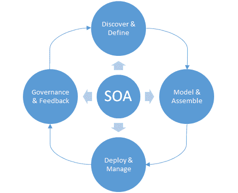

任何服务都可以通过具有清晰通信标准（如 WSDL、SOAP、REST 等）的方式被发现，因此它们被选中用于消费。

服务设计是我们接下来需要找到合适模式并按模型驱动、特定业务功能、可独立测试等方式提供服务的下一个关键项目，本章后面将详细讨论最常见的模式。

对于任何企业或组织，在功能设计阶段之后，拥有开发、部署和消费的服务非常重要。然而，与瀑布方法（客户等待所有组件开发完成）不同，如果服务开发和部署以迭代和敏捷的方式进行，那么客户可以更快地实现投资回报率。

对于任何不断发展的服务，治理和反馈至关重要，因为它们在服务采用中扮演着关键角色，并帮助企业在尽可能短的时间内实现投资回报率。

# SOA 的主要特征

任何基于 SOA 的功能系统或组件都有其独特的特征。然而，在本节中，我们将涵盖在基于 SOA 的设计中不容妥协的基本元素。

# 具有明确定义接口的服务互连性

两个涉及系统之间的互操作性或互连性是 SOA 的一个关键方面。为了实现互操作性，架构师应该更深入地分析系统，并提出更详细的方案，以便他们可以定义明确定义的接口。SOA 中的这些接口体现了系统及其边界之间的交互点，这些点应该是标准化的、明确的、行为可预测的、可扩展的和可持续的。

# 标准接口和服务水平协议

接口应该经过深思熟虑并标准化。即使客户端请求（有效载荷）没有变化，天气预报的响应也可以更快地演变。在天气预报网络服务中，城市名称可以是一个关键元素；然而，城市内部可能存在不同的气候条件，为了获得精确的天气状况，接口需要经度和纬度以及城市名称。

# 事件驱动和消息传递

松散耦合是 SOA 的基本首要特性之一，可以通过将事件驱动和消息作为服务设计的一部分来轻松实现。我们设计的应该代表一个业务功能或领域，并考虑一个需要在用户预订酒店后立即发送电子邮件的应用程序。假设我们有一个可以预订酒店并向用户发送确认电子邮件的酒店预订服务。根据业务功能，我们可以有两个不同的服务；一个负责酒店预订，另一个负责预订后的过程，如电子邮件、手机确认等。电子邮件服务可以接收预订服务的事件，或者根据其事件驱动设计或消息驱动设计来监听来自其他系统的任何消息。

# 灵活

可重复和可重用是 SOA 的另一个基本特性，因此服务应该具有较少的政策约束，以实现可重用性和可重复性，同时不对已经使用服务的客户端产生影响。在这些情况下，设计者可能会对服务优化和性能改进表示担忧。然而，灵活性应该比优化更受重视。

让我们了解一下灵活性的见解。考虑一个客户端（消费者）通过城市名称访问给定城市的天气预报，给定城市可能响应多个结果（城市的机场、市中心等），因此潜在的结果可能不止一个。在这种情况下，我们如何设计有效载荷以只响应一行，也许请求有效载荷应该有一个占位符来接受经纬度，如以下 XML 片段所示，因此服务的响应只显示一个结果，而不是多个？

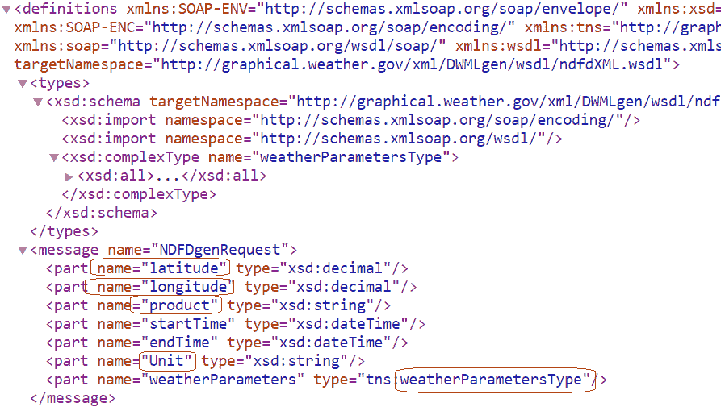

在另一个场景中，假设消费者想要搜索名为多佛的城市的天气条件，多佛是一个在世界各地重复的城市名称（世界上有超过 50 个城市的名称是多佛），因此为了找到独特的多佛，有效载荷也应该具有灵活性，可以提及州和国家或邮编。

要实现灵活性，不应在客户端有效载荷中硬编码任何容易变化的元素，还应评估产生优势并提高服务和其集中式功能的灵活性的替代方法。

我们如何证明在服务优化上的灵活性是合理的？如果我们考虑服务需要响应城市名称多佛的天气条件，可能涉及多个调用；一个用于查找名为多佛的城市列表，第二个用于调用具有特定州、国家或邮编的具体多佛。因此，对于消费者来说，预期的结果比减少对服务的调用次数更为重要。所以在这种情况下，考虑灵活性而非优化是一种更好的方法。

# 进化

软件产品开发的美丽之处在于，*任何软件产品都可以在达到实际可行的最低阶段后迅速投入使用，而产品开发持续引入更多和更多的功能*。

这种无缝的功能使用在其他主要行业中可能不可行。例如，在汽车行业，我们可能无法在所有方面完成产品后再发布产品。因为我们不能制造轮子或引擎并开始使用它们，我们必须等到它作为一个汽车出来并且经过质量认证。

在软件开发中，它非常美丽，我们可以为顾客创建仅包含几个功能的财务系统，同时我们继续开发和部署新功能到生产中，以便客户可以无缝地消费更多和更多的功能。SOA 设计可以创建软件和系统演变的完美示例。

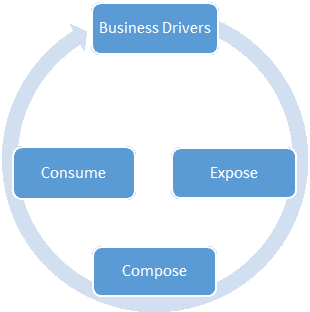

让我们以相同的天气预报为例；服务可以从接受城市名称和邮政编码开始，后来增强为经纬度，然后是 IP 地址，然后是搜索的位置，不仅包括当前的天气详情，还包括每小时、每天和每周的预报。在我们介绍部分，我们提到，为了非常有效地*处理不断变化和用户期望的高需求*，服务应该具有演变和灵活性，以便管理需求，而不是强迫客户改变他们使用服务的方式。

进化的其他常见特征如下：

+   服务是传输无关的

+   服务是软件平台无关的

+   服务的编排与编排

+   显式调用

+   服务代表一个业务功能或领域

+   服务的位置是透明的、可发现的，并支持自省

然而，我们并没有详细涵盖所有这些内容，我们鼓励读者参考其他关于所有这些设计原则的材料，以获得更详细的讨论。

许多作者和参考资料指出，服务导向可以与关注点分离原则相关联，这是正确的，只要它不共享实体之间的状态并保持服务的原子性。

一个人必须面临实施这些实践时的挑战，特别是与遗留的、非服务基础的单一系统。它们可能仍然可消费并赚钱。然而，它们不可扩展且维护成本高。那么我们如何将这些遗留系统转变为独立、可扩展、高性能的服务呢？可以通过遵循 SOA 原则、实践和合适的 SOA 模式来实现。因此，让我们在接下来的章节中深入学习并深入了解 SOA 原则和模式。

# SOA 原则

虽然没有全面涵盖 SOA 原则的规范或标准，但我们可以定义一些原则作为 SOA 的核心原则，这些原则有助于实现 SOA 的所有特性。遵守这些原则是建立任何服务和其消费的基础。

我们将在本节中简要介绍这些原则，并且在本章末尾还有一个实用的矩阵，展示了 SOA 生命周期、特性和原则之间的关系。

# 标准化服务合同

标准化是任何 SOA 的基本原则。服务通过服务合同展示其功能和能力，迫使 SOA 设计者关注服务粒度、要公开的数据类型、服务目的、服务优化、要公开的服务版本、服务端点以及所有服务标准化的各个方面。任何服务的**服务级别协议**（**SLA**）都是基于这一原则建立的，以提供清晰的消费、治理、安全、版本、请求和响应的视野和方向。标准化确保服务合同定义良好，并为其他原则的路径铺平道路，从而促进越来越多的服务消费。

# 服务互操作性

互操作性是 SOA 的另一个重要原则。服务之间共享信息的能力是互操作性，它有助于应用程序在分布式服务之间实现高效的通信，这些服务位于各种软件平台上。互操作性适用于不同的层面，如操作（业务流程）、信息和技术架构阶段，这些阶段决定了系统如何在每个层面上相互通信。

# 服务抽象

通过隐藏内部细节（复杂性）来提供服务的简化视图有助于更好地解释服务的功能和操作，帮助消费者关注服务的核心业务逻辑，并保护内部实现免受意外变更的影响。抽象可以在从语言实现到服务级别的每个层面应用。在本章的早期部分，股票报价服务仅讨论了获取给定股票 ID 的报价，没有提及它如何与客户请求的公司细节互动，也没有提及它如何连接到证券交易所的动态数据，以及如何将新的业务细节添加到系统中。作为服务的消费者，他们需要知道的是服务是否能够选择他们喜欢的公司的报价，而不是如何获取它。

# 服务自治

自主性是一种将服务的执行与其共享资源隔离的方式，并且发布服务时不对已使用服务早期版本的客户端造成影响。服务可以被开发、版本化、测试和部署，同时消费者可以继续使用之前版本的服务或无缝的服务变更，这对客户带来了巨大的好处。

# 服务可组合性

无论是组合的大小和复杂性如何，服务都是有用的组合参与者。服务可以是其他不同服务的编排者，而这个编排服务遵循所有 SOA 特性。

服务组合通常应用于遗留软件应用中，以避免返工的风险；通过保留现有的软件解决方案，应用定制化解决方案和持续的生产运营。

如果你遵循这一原则，就需要进行关注点的分离。在服务的生命周期中，我们清楚地认识到服务会随着更多功能的增加而演进。应用松耦合以及服务重用性，我们不可避免地需要为顾客提供越来越多的附加要求或解决越来越多的问题。回顾我们的演进特性，这一原则与演进相关。

# 服务可发现性

如果服务没有向内部或外部实体公开或发布，那么它们就失去了其目的。无论外部或内部客户是否消费，服务都是根据其使用情况和使用该服务的客户数量来评估的。即使在内部团队中找到可用的服务也存在挑战，但通过极大的关注和努力，我们可以引入最佳实践以实现可发现性。服务的标准化也有助于实现更好的可发现性。

如果服务没有向内部或外部实体公开或发布，那么它们就失去了其目的。根据使用情况和使用该服务的客户数量评估的服务可以是内部的或外部的。即使在内部团队中，找到可消费的服务仍然存在挑战，但通过极大的关注和努力，我们可以引入最佳实践以确保遵循这一原则，从而使服务演进，组织持续获得其投资回报。

# 服务松耦合

松耦合是帮助服务实现自动化、独立测试以及服务功能不受影响而演进的核心设计原则之一。这一原则旨在在不同层面上应用松耦合的各个方面，并且根据应用环境的不同可能会有所变化。

让我们以我们的电子邮件服务为例。预订服务在完成酒店预订后向电子邮件服务发送通知，无论电子邮件服务器状态如何（它甚至可能已经关闭，但预订服务不需要等待电子邮件服务器启动）。因此，电子邮件服务可以决定何时发送电子邮件；它可能是在非高峰时段，可能有不同的预定时间，也许是在电子邮件服务器完成其预定维护后开始运行，可能是重新发送失败的投递，等等。

因此，电子邮件服务的架构处理了松耦合原则，在这种情境下，这是最优雅且最可取的。我们大多数人都会同意，并不是在所有设计和所有层面上我们都能应用这一原则，因为它可能不会帮助业务功能。例如，在电子邮件服务和预订服务中，预订和电子邮件服务可以是独立的且松耦合的；电子邮件服务依赖于电子邮件服务器，应用松耦合原则是不可行的。我们提供的其他服务，如天气报告服务，依赖于位置服务，在这种情况下，耦合可能是一个可接受的设计。

# 服务可重用性

服务可重用性是核心原则之一，实现了面向服务的架构的灵活性和进化特性。设计方面应考虑一组业务功能或逻辑，可以在不复制代码到多个内部或外部客户端的情况下提供。

重用是强类型的面向对象原则，在服务级别也是必不可少的。具有无知的函数上下文，服务是资源，因此可以在最大程度上重用；重用越多，回报率越高。

在我们的例子中，位置服务、电子邮件服务、天气报告服务和股票报价服务都是可重用和业务功能的逻辑分离。

# 服务无状态

服务应该尽可能地无状态。无状态是另一个重要的原则，有助于服务降低资源消耗、独立测试和可重用性。为了在电子邮件服务中实现无状态，它需要发送电子邮件所需的所有必要信息，因此它不需要从数据库或其他资源中获取额外信息，因为它的重点是设置发送电子邮件的调度业务逻辑。模式可以包含更多详细信息（消息、电子邮件 ID、主题），而不是仅仅预订 ID，并让电子邮件服务为该预订 ID 从数据库中获取额外信息。

# SOA 设计模式

在当前的软件设计世界中，我们已经有了针对特定重复问题的经过时间考验的软件解决方案。最佳实践以及软件设计以快速且经济有效的方式解决可重复问题，随着时间的推移形成了可重用的模式，这是一个经验法则，我们应该能够挑选并使用适合我们设计问题的正确模式。

SOA 处理许多设计模式，许多材料都深入讨论了每一个。我们想简要提及一些实时软件解决方案通常需要的重要模式。

在本章中，我们将处理以下模式：

+   服务消息传递

+   消息筛选

+   不可知服务

+   原子服务事务

+   认证代理

+   消息来源认证

+   服务外观

+   多个服务合约

+   服务回调

+   事件驱动消息传递

+   服务重构

+   元数据集中化

# 服务消息传递

服务消息传递提供了一个通信平台，通过该平台，消息作为独立的单元进行传输和路由。它带来了松散耦合的服务交互和数据交换的高效执行。

现成的、**面向消息的中间件**（**MOM**）队列是服务消息传递的最佳例子。MOM 队列可以有一个发送者或接收者，或者多个发送者和接收者，某些应用程序甚至需要使用多个队列来帮助解耦系统的离散和不同的组件。

大多数 SOA 实现使用 MOM 队列，很难找到一个没有消息系统的 SOA 兼容系统。

服务消息传递的好处如下：

+   在你的设计中采用服务消息传递模式，使你的设计解决方案最适合任何希望异步与服务通信的客户端

+   这是一种松耦合的实现，也是 SOA 的核心原则之一

+   通过服务消息传递，以下内容变得简单且优雅：

    +   服务的容错和回环

    +   服务版本控制

    +   记录、延迟和重放

    +   复用消息

+   最适合并发模型，因为不可变消息是线程安全的

服务消息传递的影响如下：

+   与立即接收客户端响应的服务不同，异步通信在某些情况下会导致可靠性问题

+   由于服务消息涉及与其他系统的异步通信，可能需要进一步参与管理和支持服务过程和执行的系统（需要操作和维护更多的系统）。

+   需要更多地依赖消息系统（对消息系统的依赖）

# 消息筛选

服务容易受到注入攻击：将恶意数据注入服务中，导致不希望的行为。服务可以在服务器端接收到数据时，甚至在服务使用之前，通过筛选数据来防止任何有害的消息内容。

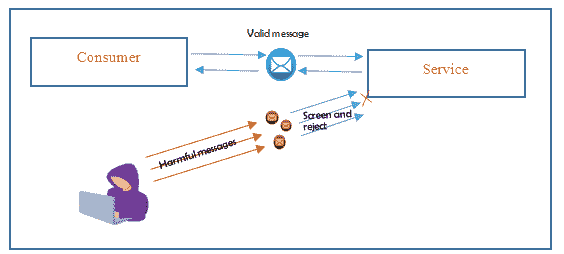

服务应假定它接收到的所有输入消息都是有害的，因此所有这些消息都应该经过各种检查，以发现任何恶意内容的迹象，并保护服务免受任何有害内容的影响。

消息筛选的好处如下：

+   消除不同类型的注入攻击

+   防止注入攻击导致的资源耗尽

+   服务在消费之前就受到恶意内容的保护

+   无论客户端是否验证，服务都会验证消息

消息筛选的影响如下：

+   为每条消息的筛选逻辑会带来额外的运行时开销

+   处理二进制消息或二进制附件需要专门的逻辑进行筛选

+   通过消息筛选找到并限制所有潜在的有害内容很困难，甚至不可能

# 不可知服务

考虑金融银行的各种功能，如账户管理、人寿保险、贷款或贷款管理、财富管理等。每个服务可能需要共享其他服务的功能，而不是重复使用它们。

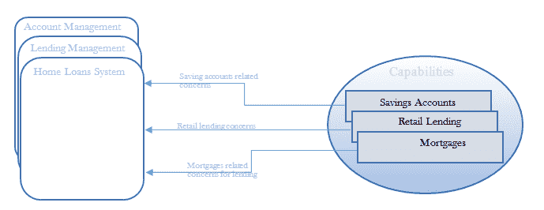

考虑一个需要了解借款人储蓄账户详情、其他零售贷款信息用于信用报告以及物业管理抵押信息的住房贷款管理服务。因此，这些能力是任何贷款服务共同关心的问题，不仅可以由住房贷款系统定义和使用，还可以由任何其他主要系统，如信用卡、人寿保险产品、账户管理服务、投资管理服务等定义和使用。

为一组定义良好且解决主要共同问题的能力实现业务逻辑，这些能力不仅不特定于一个问题，而是多个业务问题的共同点，被称为不可知服务。

将不可知业务逻辑或能力分离成独立的服务有助于企业实现服务重用和可组合性。

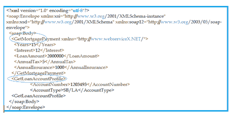

如前例所示，服务明确声明它们是不可知的，有助于未来的消费者和设计人员重用现有的不可知服务。

不可知服务的好处如下：

+   练习服务的重用性和可组合性

+   消费者从服务能力的迭代改进中受益，这些能力超出了初始服务定义

+   允许多用途功能，这些将是首选的传统功能

不可知服务的影响如下：

+   通过初步分析的优势提高服务能力需要大量的时间和考虑，并且需要更多的迭代来开发

+   在服务功能上达成普遍共识可能具有挑战性，因为服务的业务功能可能过于模糊或过于通用。

+   需要更多的设计规划和考虑，因为无差别服务设计迫使我们考虑许多设计部分，这些部分在短期或中期交付中不一定需要仔细考虑，因此可能会导致我们最终无法履行交付承诺。

# 原子服务事务

在分布式环境中，操作的回滚非常重要。当跨越多个服务的任何运行时活动失败时，迄今为止发生的所有事务都应该回滚，否则分布式服务可能会损害软件解决方案的完整性。

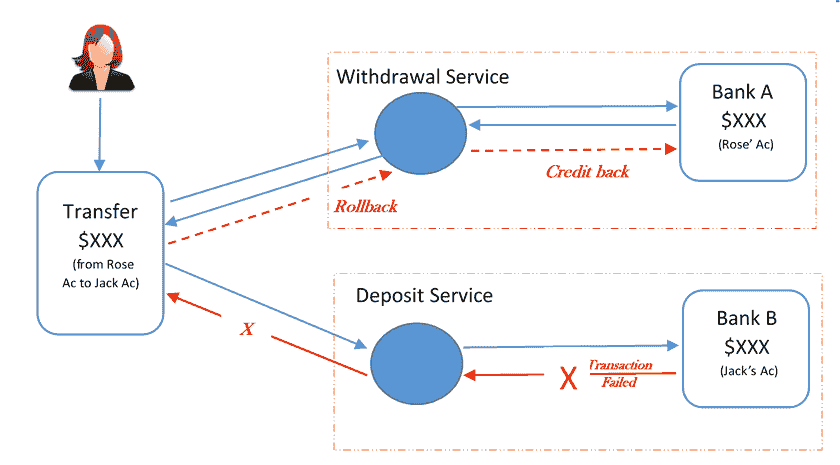

在典型的在线储蓄账户交易中，银行系统会有取款和存款服务，如果任一服务调用因任何原因失败，无论服务调用的顺序（先取款或存款，或反之），银行系统最终都会处于不一致的状态。

上述图示显示了对目标账户的信用交易失败，这导致从源账户的借记交易回滚。

因此，作为实现，运行时服务活动被包裹在一个具有显式反转逻辑的事务中，确保在当前操作失败的情况下，所有操作和更改都会回滚。

原子服务事务的好处如下：

+   帮助在基于消息的业务服务中传播回滚机制。

+   有效地实施无状态原则

原子服务事务的影响是，它可能需要更多的内存资源，这取决于要保留其原始状态直到提交或回滚通知的事务数量。

# 身份验证代理

服务消费者使用一种机制来验证调用资源的身份，调用者的身份基于该调用者提供的凭证进行验证。凭证可以是密码、证书授权机构提供的数字证书、生物识别、ATM PIN 码，或这些类型的任何组合。

在大多数情况下，身份验证是确定访问 Web 服务的资格的第一步，第二步是验证用户是否有权访问 Web 服务。

对于基于身份的授权，可以验证经过身份验证的用户凭证中包含的声明。根据提供给客户端的权限，服务可以授予或拒绝对底层资源的访问。令牌身份验证机制是细粒度授权的有用模型。

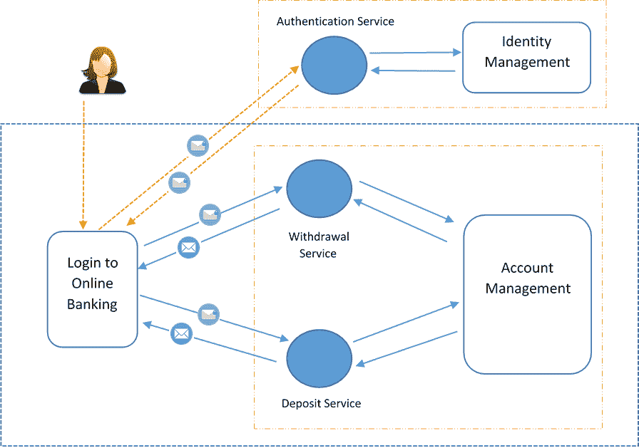

上述图示展示了一个在线银行用户通过联系身份验证服务来获取在线银行借记交易权限，该服务通过中央身份存储进行身份验证。然后，服务响应以令牌，以便用户可以消费取款服务和存款服务。

认证代理模式有助于通过集中身份存储实现认证和授权。认证服务承担全部责任并提供一个令牌，消费者可以使用该令牌访问服务。

以下示例展示了用于认证和授权其内容的数字签名和 x509 信息以及要验证的消息。认证服务使用该信息并验证消息是否被篡改，然后认证服务将不会生成有效的令牌，因此应用程序将拒绝访问该功能：

认证代理的好处如下：

+   集中管理的信任（认证）因此有助于消除每个客户端和服务独立管理其认证的需求

+   容易完成协议和更新发生在一个地方，而不会影响任何客户端

+   经纪认证的参与者不需要相互了解就可以进行通信

+   安全令牌可以在组织边界之间使用，并提供自主安全域

认证的影响是，它有时会创建一个单点故障，任何安全漏洞都可能影响整个服务的库存。

# 消息来源认证

想象一下，Rose 正在从她的银行账户向 Jack 的账户进行在线转账。然而，Jack 没有收到转账金额，但 Rose 的账户显示金额已被扣除。那么 Rose 转出的钱会发生什么？

有可能 Jack 的账户号码在中间层被入侵者的账户号码修改或篡改，因此所有钱都存入了不同的账户。

服务消费者发送的消息会由一个或多个中间层处理，例如路由器、消息队列等。攻击者可以在任何中间层操纵消息并影响服务行为以达到恶意目的。

消息来源认证（或数据来源认证）建议使用数字签名机制来传输敏感消息，因此服务可以验证签名以确保接收到的消息是由发送者发起的，并且在传输过程中没有被篡改。

将数字签名算法应用于有效载荷作为来源证明，提供防篡改的消息。接收此信息的服务通过使用算法验证签名，并且应该匹配。如果不匹配，则服务拒绝消息。

因此，消息来源认证验证了安全性的两个重要方面：

+   **数据完整性**：消息在到达服务的过程中没有被修改或篡改

+   **已认证**：服务端接收到的消息来自预期的发送者，而不是其他人

消息来源认证的好处如下：

+   检测接收到的消息的篡改

+   跟踪消息的来源到可识别的源头

消息来源认证的影响如下：

+   由于加密实现导致的性能问题

+   数字签名算法的选择以及密钥数量和类型的差异将增加额外的开销

+   数字签名算法的选择会影响达到的安全级别，因为它根据应用程序所需的安全程度而变化

# 服务外观

想象一个需要维护的建筑。建筑的外墙是可更换的，不会影响内部结构，这被称为外观。外部墙壁一次拆除并更换建筑的一翼，而另一翼仍在使用中。

大概来说，我们可以将相同的概念与 SOA 中的服务外观联系起来。虽然一些客户端使用现有的服务，但服务的任何增强都可以无缝迁移，不会影响消费者合约，因为它们继续使用较旧的服务版本。

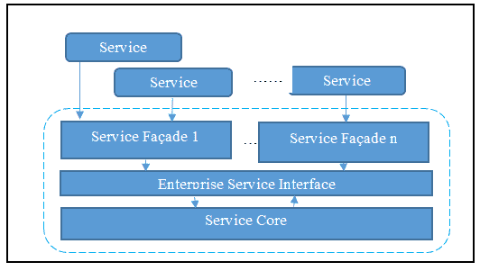

将服务核心逻辑与服务合约分离的模式称为服务外观。服务外观促进了客户端合约之间的松散耦合，因此，在服务有任何变更的情况下，它不会影响其客户，并且他们不需要修改他们的代码。

在设计服务时，架构师需要留意任何负面耦合，例如合约到逻辑的耦合，它依赖于合约，因此每当服务发生变化时，合约也可能会发生变化，从而影响所有不期望有任何影响的服务的消费者。

服务外观通过在核心服务逻辑与服务合约之间建立接口来消除这种耦合。服务外观逻辑允许合约与底层逻辑保持解耦，并进一步保护其核心业务逻辑。它适用于功能和行为变更，因此有助于服务的演进。

服务外观位于服务和合约之间。服务外观可以支持多个合约。请注意，多个服务合约与同一个服务外观通信，只有服务外观与合约耦合，而不是实际的服务，因此服务是独立且松散耦合的。如果合约发生变化，它将最小化对服务的影响。

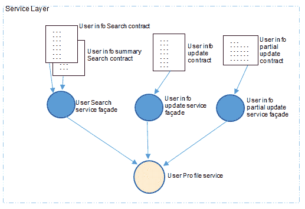

上述图示描述了一个为不同业务功能提供多个合约的服务。*用户信息摘要搜索*和*用户信息部分更新*是具有特定业务逻辑的合约特定服务外观的良例，这些服务外观在服务客户端时不会对其或服务产生任何影响。

服务外观的好处如下：

+   Façade 保护服务和消费者的服务免受规范模型变化的影响

+   Façade 隐藏了规范模型的复杂性

+   Façade 返回消费者同意的数据表示

+   Façade 使你的设计变得优雅

服务外观的影响如下：

+   由于服务外观具有非常用户特定的业务逻辑，它会产生额外的开发和维护成本

+   Façade 倾向于创建额外的物理服务分布，导致更多的复杂性和额外的处理开销

# 多个服务合约

一个标准合约可能不适合或适用于所有潜在的服务消费者。例如，一个服务合约应该允许更新完整的个人资料信息，而另一个合约则不应允许完全更新，只允许部分更新。尽管个人资料更新是一个单一的服务，但两个不同的消费者需要两个不同的合约。多服务合约模式有助于实现上述选项。服务外观和多服务合约是相关的，服务外观帮助系统实现多个或并发合约。

多个合约或并发合约有两个目的。一个是支持服务的向后兼容性，另一个是为不同的用途提供服务的不同视图。

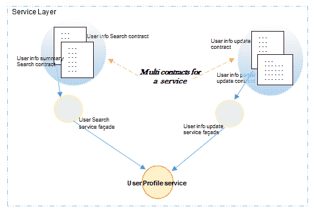

前图中的圆形矩形表示多服务合约，它们都连接到相同的服务，但出于两个不同的目的。在前面的例子中，一个服务合约只允许更新个人资料的一些字段，而另一个合约可以更新个人资料的所有字段。因此，同一服务的多个合约有助于不同的消费者为不同的目的使用服务。

多服务合约的好处如下：

+   支持向前和向后兼容

+   多版本管理确保客户端不受服务任何新更改的影响

多服务合约的影响是这样的：尽管这个模式考虑了许多合约，但每个新的合约最终都会导致新的服务端点被库存，这可能会妨碍服务治理和高维护。

# 服务回调

假设你从电话中拨打客户服务中心。一旦接通，你会听到一个自动消息说所有的客户服务代表都很忙，因此要求你等待。你可能就是许多等待同一服务代表的人之一（并发和多线程）。现在，你有两个选择可供选择；一个是等待有人接听，另一个是在一段时间后挂断并再次尝试。然而，过一段时间再次尝试可能会让你陷入同样的情况。

那如果客户服务代表回拨给你呢？你拨打号码，系统接听你的电话，并说明当客户服务代表有空时将自动回拨，这样你就不需要等待。

想象一个需要较长时间才能完成任务的网络服务，但调用者或服务的消费者不想等待所有任务完成，同时消费者还需要知道所有过程/任务何时完成。这与我们之前的例子中客户调用客户服务代表但不希望等待排队类似。

服务回调模式实现是满足此类要求的最优方法。

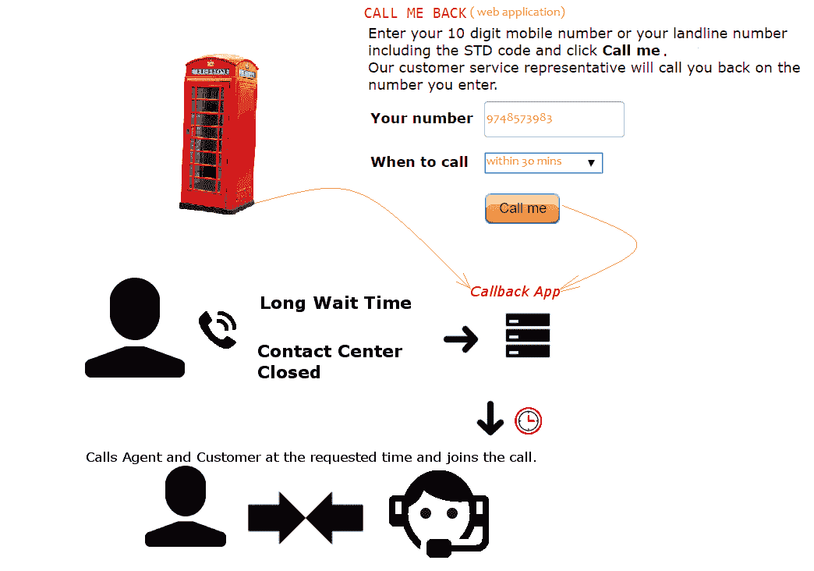

上述图表描述了使用回调应用程序执行服务回调模式的多种调用系统（网页、电话和联系中心应用程序）。

服务回调模式建议服务的消费者与服务异步通信，并确保在消息中提供回调地址，服务可以使用相同的回调地址与客户端进行通信。

上述图表描述了一个消费者通过消息异步调用服务的场景。消息包含回调地址，因此一旦服务完成其处理，它将使用回调地址进行通信并做出响应。服务回调地址可以是电话号码、电子邮件地址，或者它可以是另一个可以进行进一步业务逻辑处理并响应消费者的服务端点。

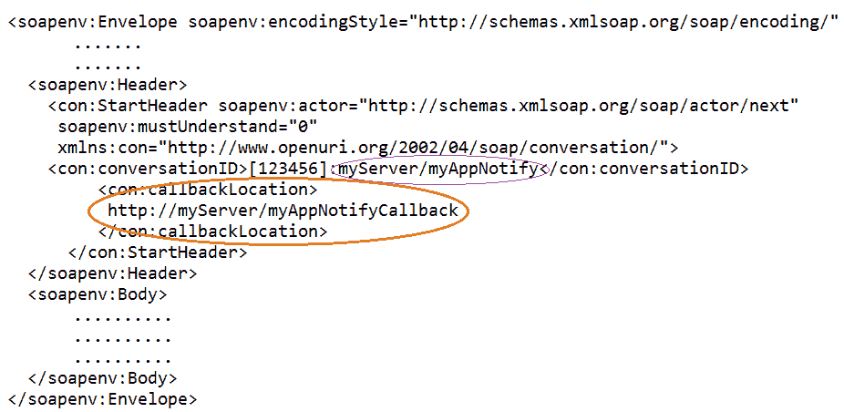

在我们的第一个例子中，回调地址是客户的电话号码，服务将拨打该号码。第二个例子可能包含电子邮件地址或回调 URL（相同或甚至另一个服务）以及上传状态作为响应。

服务回调的好处如下：

+   在请求需要等待较长时间响应的情况下非常有用。

+   服务解耦的最佳实现。

+   满足消息广播需求的最佳选择。

服务回调的影响如下：

+   由于此模式主要处理异步通信，可能会引入可靠性问题。

+   可能需要更多基础设施升级以支持必要的回调关联。

+   处理请求和响应错误通常更具挑战性。

具有服务回调模式设计的消息的更多示例如下：

+   一个需要服务加载大文件并逐行读取其内容，然后（在验证每一行之后）可能上传到数据库的软件系统。由于它通常规模庞大，系统调用者不能等待较长的过程完成，同时，一旦上传完成，就会向调用者发送通知。

+   股票交易系统和股票报价行情服务。

+   预订完成状态、电子邮件通知等。

# 事件驱动消息

事件驱动架构的核心模式之一是事件驱动消息；当事件发生时，服务（发布者）会通过相关事件通知其消费者（订阅者），而消费者并不一定在等待或意识到该事件。

想象一个股票交易服务在特定股价上涨时通知其用户：

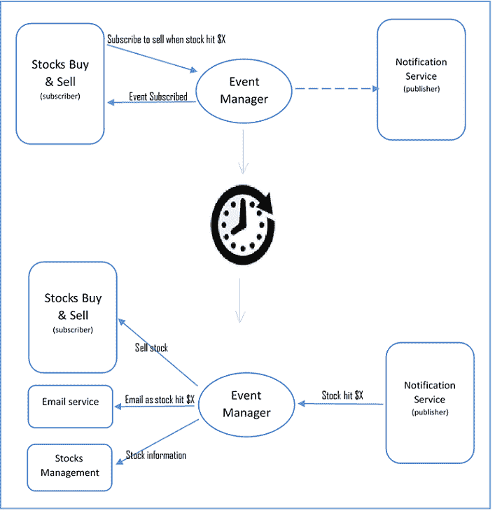

上一张图展示了当股价达到特定阈值时，通知流程的周期启动；订阅者告知事件管理员的意图，当事件发生时，发布者发布（通知）。$X 是预定义的限制或销售价格，在这里它是事件。下一张图展示了相同的样本负载。

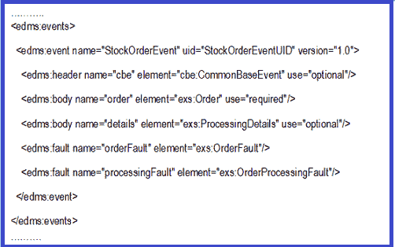

事件驱动消息的好处如下：

+   跨职能边界和服务之间集成意图的最佳模式

+   以更少的复杂性实现流程的更高自动化程度

事件驱动消息的影响如下：

+   在将消息交换作为原子服务的一部分进行整合时，会创建额外的复杂性

+   取决于发布者和订阅者服务的可用性

+   需要通过结合事件驱动消息设计中的其他相关模式来解决可靠性问题的涟漪效应

# 服务重构

在许多情况下，服务经历了很多变化，但不会影响服务合同。这可能是一个简单的软件更新，提高了系统的性能，数据库更新，编程版本升级等。

服务重构通过改变内部结构而不改变其行为，有助于提高服务，并且不会对服务合同产生影响。

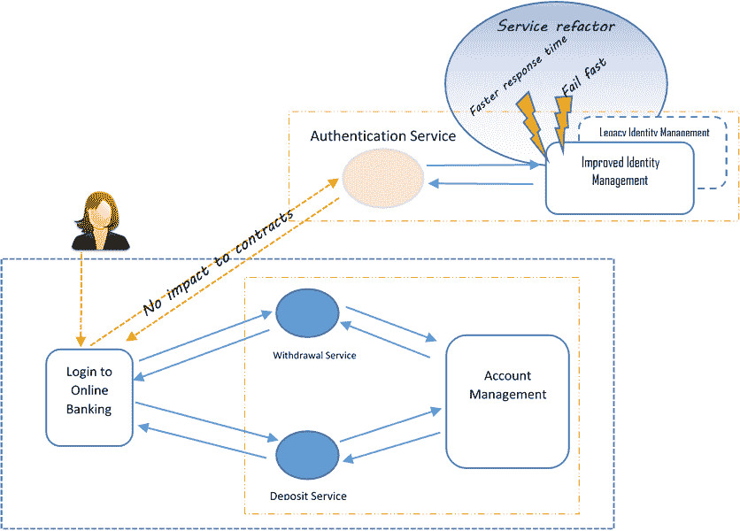

在上一张图（右上角圈出作为服务重构）中，身份管理系统已经经过重构以提高其响应时间性能，并已升级为快速失败功能。对银行客户端没有影响，它继续使用相同的身份验证服务，但具有改进的服务能力。

服务重构的好处如下：

+   在不影响任何消费者的情况下轻松更新高度依赖的服务

+   升级后功能行为无变化

+   在有限范围内最小化对服务消费者的不利影响

服务重构的影响如下：

+   可能会导致需要更多的治理努力

+   可能会引入潜在的负面影响（性能提升但处理并发请求可能导致可用性降低）

# 元数据集中化

对于任何组织来说，拥有集中的服务目录并提供正式的服务注册和发现流程是不可避免的，这样可以限制构建已存在或正在开发中的服务或功能的风险。

以下图展示了包含已发布服务信息的注册表，因此服务消费者将查找并绑定这些已注册的服务以进行运行时绑定和调用：

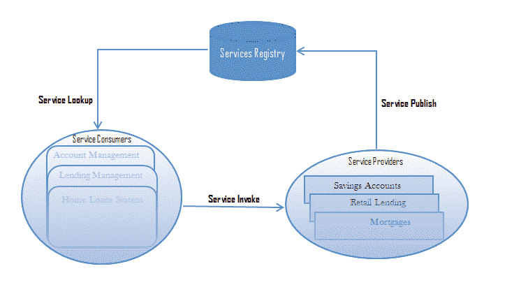

服务及其功能的信息可供企业受益

+   服务可发现性

+   库存标准化

+   服务重用性标准化

+   提供最小化冗余风险的方法。

+   发布具有功能和 QoS 元数据的服务。

此模式适用于单域服务目录，甚至适用于多个目录。

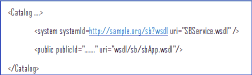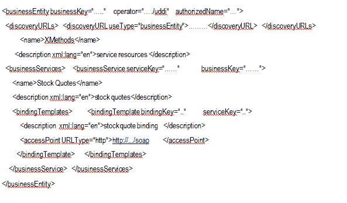

样本目录的好处如下：

+   最小化构建已存在功能的风险

+   有助于服务标准化

+   有助于强制发现和解释

+   运行时发现和绑定

+   确保元数据标准化

样本目录的影响如下：

+   由于元数据标准化，文档和注册需要成为服务交付生命周期的一部分（额外的治理）

+   服务注册需要足够成熟和可靠，以便进行严格的治理和维护

# 原则和模式交叉引用

以下表格列出了每个原则的 SOA 原则和相关 SOA 模式。当您想要参考一个常见的设计模式及其相关的 SOA 设计原则时，这个矩阵可能很有用：

| **原则** | **模式** |
| --- | --- |
| 标准化服务合同/服务互操作性 |

+   服务消息传递

+   消息筛选

+   不可知服务

+   多个合同

+   事件驱动消息传递

+   服务回调

+   服务外观

+   服务重构

|

| 服务抽象 |
| --- |

+   服务重构

|

| 服务自治 |
| --- |

+   事件驱动消息传递

+   服务消息传递

|

| 服务可组合性 |
| --- |

+   不可知服务

+   消息来源认证

+   服务回调

+   认证代理

|

| 服务可发现性 |
| --- |

+   元数据集中化

|

| 服务松耦合 |
| --- |

+   服务消息传递

+   事件驱动消息传递

+   服务回调

+   服务外观

+   多个合同

|

| 服务可重用性 |
| --- |

+   不可知服务

+   多个合同

|

| 服务无状态 |
| --- |

+   原子服务事务

|

# 摘要

在本章中，我们学习了什么是*SOA*以及其基本特征，如服务互连性、事件驱动和消息传递、灵活性、服务演进，以及一些其他常见特征。在后续章节中，我们详细介绍了 SOA 原则，如服务契约标准、互操作性抽象、服务自治、服务可组合性、可重用性和无状态性。

我们还学习了最常见的 SOA 设计模式及其应用场景，以便构建符合 SOA 规范的服务。我们讨论的模式包括服务消息传递、消息筛选、无状态服务、原子服务事务、认证代理、消息源认证、服务外观、多重服务契约、服务回调、事件驱动消息传递、服务重构和元数据集中化。
