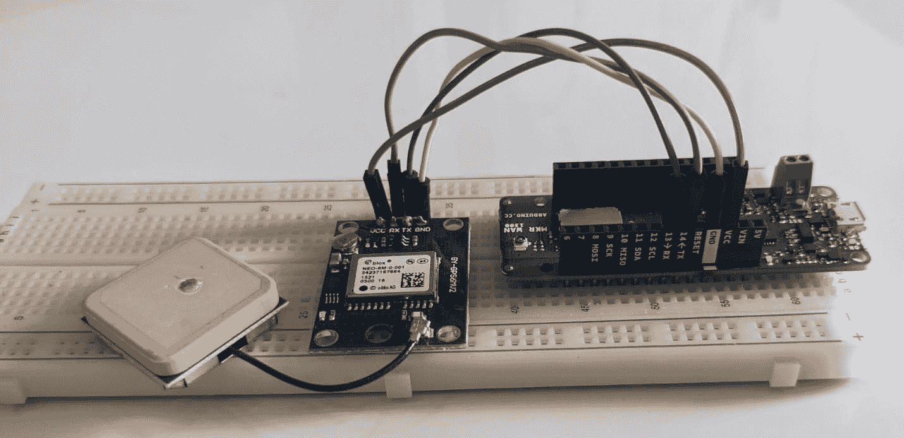

# 第六章：项目 #3 – 基于 LoRaWAN 的远程资产跟踪应用

本章致力于**智能交通**和**智能远程监控**，使用低功耗和长距离通信技术。本章中的项目将引导您实现和部署一个基于**长距离广域网络**（**LoRaWAN**）的远程报警应用，连接到公共、全球和去中心化的 The Things 网络。本章中的项目通过使用 GPS 模块提供定位功能。**Arduino IoT Cloud**将用于数据可视化和设备的远程配置。该应用将用于实际案例，展示 LoRaWAN 技术相较于其他无线技术提供的优势。

在这里，我们将实际探索 LoRaWAN 技术，这些技术在远程监控和控制中非常有用，无论是**资产跟踪**还是**远程操作监控**。本项目使用**Arduino MKR WAN 1300**开发板，该板配备了最新的通信频率，433/868/915 MHz US/EU。它专门为**物联网**（**IoT**）和**工业 4.0**用例设计。本项目解释了您如何实际开发基于 LoRaWAN 通信的跟踪解决方案，适用于不同的用例。

在本章中，我们将涵盖以下主要主题：

+   理解 LoRaWAN 及其物联网应用

+   LoRaWAN 与其他通信技术的比较

+   LoRaWAN 物联网应用组件

+   必备硬件 – 传感器和开发板

+   设计项目架构

+   设置 Thing，添加设备，云变量和代码

+   配置 The Things 室内网关

+   创建网页和移动仪表板

# 技术要求

完成本章练习所需的以下硬件组件：

+   MKR WAN 1300 或 MKR WAN 1310

+   The Things 室内网关

+   NEO-6M u-blox GPS 模块

+   面包板

+   跳线

编码时，我们将使用**Arduino Web Editor**，它包含大量开发板和传感器库，以及用于 Thing 和仪表板设置的**Arduino IoT Cloud**。为了开发硬件和传感器设计，我们需要**Fritzing**桌面软件，以及用于 GPS 模块测试的**Arduino IDE**。

在本章中，我们将使用**The Things 室内网关**进行 LoRaWAN 通信。本章中使用的代码可在本书的官方 GitHub 仓库中找到，通过以下链接：[`github.com/PacktPublishing/Arduino-IoT-Cloud-for-Developers`](https://github.com/PacktPublishing/Arduino-IoT-Cloud-for-Developers)。

# 理解 LoRaWAN 及其物联网应用

LoRaWAN 是一种专为**低功耗广域网（LPWANs**）设计的无线通信协议和网络架构，它使得在物联网环境中设备之间能够进行长距离通信。LoRaWAN 技术针对需要低数据速率、长电池寿命和长通信范围的应用进行了优化，使其非常适合各种物联网用例。

## 在物联网中的应用

由于其独特的特性，LoRaWAN 已被广泛应用于各种物联网应用。以下是一些常见的用例：

+   **智能农业**：LoRaWAN 可用于土壤湿度监测、作物健康监测、牲畜追踪和精准农业，帮助农民优化他们的操作并提高产量

+   **智能城市**：LoRaWAN 可以启用智能街灯、废物管理、停车管理和环境监测，帮助城市变得更加高效和可持续

+   **工业监控**：LoRaWAN 可在工业环境中监测设备健康、追踪资产并改善供应链管理，从而提高维护实践并减少停机时间

+   **公用事业**：LoRaWAN 可用于智能电表，并远程监控公用事业基础设施，如水和燃气表，提高计费准确性和资源管理

+   **环境监测**：LoRaWAN 可以支持空气质量监测、水质监测和野生动物追踪等应用，帮助研究人员和组织收集有价值的环保数据

+   **资产追踪**：LoRaWAN 能够实时追踪资产，如货运集装箱、车辆和贵重设备，确保其安全和高效利用

总体而言，LoRaWAN 的长通信范围、低功耗和可扩展性使其成为构建覆盖大面积并连接各种应用的物联网网络的强大技术。

在本节中，我们讨论了 LoRaWAN 在物联网领域的不同应用案例，在下一节中，我们将讨论为什么选择 LoRaWAN 而非其他通信技术。

# LoRaWAN 与其他通信技术的比较

LoRaWAN 相较于其他通信技术具有多项优势，使其成为某些物联网应用的优先选择。以下是选择 LoRaWAN 而非其他替代方案的一些原因：

+   **长距离**：LoRaWAN 提供了卓越的长距离通信能力，使得设备能够在开阔地区进行数公里的通信。这对于需要在大距离范围内连接的应用尤其有用，如农业、环境监测和资产追踪。

+   **低功耗**：使用 LoRaWAN 的设备可以在非常低的功耗下运行，延长电池寿命数年。这对于偏远或难以到达的地方至关重要，在这些地方更换或充电电池不切实际或成本高昂。

+   **深度室内穿透**：LoRaWAN 能够有效地穿透建筑物和其他障碍物，确保即使在具有挑战性的环境中也能保持连接。这使得它适用于智能楼宇管理和室内资产跟踪等应用。

+   **成本效益**：实施和维护 LoRaWAN 网络通常比部署传统蜂窝网络更具成本效益。这使得 LoRaWAN 成为寻求在大规模部署物联网解决方案的企业和组织的一个可行的选择。

+   **可扩展性**：LoRaWAN 网络能够在单个网络中处理大量的设备。这种可扩展性对于涉及高密度设备的物联网应用至关重要，例如智能城市部署。

+   **低数据速率应用**：LoRaWAN 针对传输少量数据且数据速率较低的应用进行了优化。对于涉及传感器数据、仪表读数和定期更新的物联网用例，LoRaWAN 提供了一个合适且高效的通信解决方案。

+   **网络灵活性**：LoRaWAN 支持公共和私有网络的部署。组织可以选择建立自己的私有 LoRaWAN 网络或使用现有的公共网络，这为他们提供了在所有权和控制方面的灵活性。

+   **自适应数据速率**：LoRaWAN 设备可以根据信号强度和干扰调整其数据速率，优化当前条件下的通信。这种自适应功能提高了可靠性并确保了可用资源的有效利用。

+   **全球标准**：LoRaWAN 是一个全球标准，与其兼容的设备可以在不同地区和国家无缝运行。这种标准化简化了国际项目的设备开发和部署。

+   **多样化的应用**：LoRaWAN 的通用性使其能够在各种应用领域中使用，从农业和工业监控到智能城市和环境传感。

虽然 LoRaWAN 提供了这些优势，但重要的是要注意，没有一种通信技术是普遍优越的。在 LoRaWAN 和其他技术（如蜂窝、Wi-Fi、蓝牙或 Zigbee）之间的选择取决于物联网应用的具体要求，包括范围、功耗、数据速率、成本和可扩展性等因素。每种技术都有其优势和劣势，选择应基于对项目需求的仔细分析。

在本节中，我们讨论了使用 LoRaWAN 的好处。在下一节中，我们将探讨 LoRaWAN 的重要组件。

# LoRaWAN 物联网应用组件

LoRaWAN 是一种无线通信协议和网络架构，旨在实现物联网设备之间的长距离、低功耗通信。它专门针对需要延长电池寿命、可靠的长距离通信和高效无线频谱使用的设备进行设计。LoRaWAN 是 LPWAN 领域的关键技术之一。*图 6.1*展示了 LoRaWAN 解决方案的整体架构，包括终端节点、网关、网络服务器和应用服务器。


图 6.1 – LoRaWAN 网络的组件

LoRaWAN 架构由四个主要组件组成：

+   **终端节点/设备**：这些是物联网设备，从传感器收集数据或执行特定任务。它们使用 LoRa 调制技术与网关通信，以低数据速率发送数据包。

+   **网关**：网关作为中间点，接收来自终端设备的数据包并将它们传输到集中式网络服务器。它们通常通过有线或无线连接连接到互联网。

+   **网络服务器**：网络服务器负责管理网关和终端设备之间的通信。它处理诸如身份验证、加密以及将数据包路由到相应的应用服务器等功能。

+   **应用服务器**：应用服务器负责处理从网络服务器接收到的数据，并根据数据执行特定操作。它与终端用户的客户端或后端系统接口，以展示数据、触发警报、执行分析或控制设备。应用服务器可以托管在云端或本地。

在本节中，我们详细讨论了 LoRaWAN 组件，在下一节中，我们将探讨执行本章实际练习所需的硬件和传感器。

# 必要硬件 – 传感器和开发板

Arduino 系列拥有多种开发板，尺寸、引脚和通信技术各不相同。在本章中，我们将使用 Arduino MKR WAN 1300 开发板，因为它体积紧凑、支持电池供电，并提供支持全球不同地区的不同频率，包括 433/868/915 MHz。*图 6.2*展示了 MKR WAN 1300 的引脚图。


图 6.2 – Arduino MKR WAN 1300

Arduino MKR WAN 1300 提供七个模拟引脚，以**A**开头（**A0**、**A1**等），以及八个数字输入/输出引脚，以**D**开头（**D0**、**D1**等），内置电池充电和**锂聚合物**(**LiPo**)电池连接器用于备用电源，这有助于开发者构建远程监控/操作的原型和解决方案，无需担心电源备份。有关进一步更新和最新产品开发新闻，请访问官方网站[`store.arduino.cc/products/arduino-mkr-wan-1300-lora-connectivity`](https://store.arduino.cc/products/arduino-mkr-wan-1300-lora-connectivity)。

Arduino 最新的开发板是 MKR WAN 1310，它包含与 MKR WAN 1300 相同的 LoRa 通信处理器和模块。然而，MKR WAN 1310 具有更新的内置电池充电器、2 MB 的**串行外设接口**(**SPI**)闪存和增强的功耗。该板专门为物联网设备设计，并在不同地区迅速增长。有关其完整详情和规格，请访问[`store.arduino.cc/products/arduino-mkr-wan-1310`](https://store.arduino.cc/products/arduino-mkr-wan-1310)。

在本章中，我们将通过 GPS 坐标追踪设备。为了获取 GPS 坐标，我们将使用基于 NEO-6M u-blox 芯片的 GY-GPS6MV2 GPS 模块。该 GPS 模块可以在软件串行和硬件串行上运行，但 MKR WAN 1300 提供了内置的硬件串行，因此我们将使用*ins 13*和*14*与*图 6**.3*中所示的 GPS 模块进行通信。

GPS 模块提供纬度、经度、卫星数量、海拔英尺和每英里速度属性。这些属性将在仪表板上显示，以便进行适当的资产追踪。该模块是在中国开发的，价格实惠，但许多其他组织也在开发基于 NEO-6M u-blox 芯片的 GPS 模块，例如 SparkFun、Seeed Studio 和 Adafruit。*图 6**.3*显示了 NEO-6M u-blox GPS 模块及其引脚图：


图 6.3 – GY-GPS6MV2 NEO6MV2 GPS 模块和引脚图

上述图示描述了 GPS 模块的引脚布局。*引脚#1*是**GND**引脚，它与 MKR WAN 1300 板上的 GND 引脚相连。*引脚#2*和*引脚#3*分别是**TX**和**RX**，将分别连接到 MKR WAN 1300 的*引脚#13*和*引脚#14*。*引脚#4*，**VCC**，与板上的 VCC 和 MKR WAN 1300 的 5V 引脚兼容。您可以使用带有 GPS 模块的雄性引脚或直接焊接电缆而不使用任何引脚。

重要提示

GPS 模块在户外环境中表现最佳。确保在测试和部署期间没有屋顶阻挡，以便正确接收来自卫星的信号。

如果你是在实验室中使用该模块，那么 GPS 模块可能无法正常工作。请记住，GPS 模块上有一个内置的灯，当你从卫星接收到信号时，它会开始闪烁。

在本节中，我们详细讨论了开发板和 GPS 模块，包括它们的引脚图。在下一节中，我们将开始探索如何将 GPS 模块与 MKR WAN 1300 连接起来。

# 设计项目架构

在前面的章节中，我们详细讨论了模块和开发板。现在，是时候准备食谱了。在硬件开发中，在开始使用传感器和开发板之前，我们需要开发设计概念，以便更好地了解事物如何连接。有许多软件可用于设计电子项目的概念，但在此情况下，我们将使用 Fritzing。

在接下来的两个子节中，我们将讨论电路图和项目设计，同时解释如何使用开发板连接引脚并进行焊接。然后，我们将进行一些测试以获取 GPS 坐标，这在将数据发送到 Arduino IoT Cloud 之前非常重要。

## 电路图设计和组装

你的电路图设计目的是为了清楚地了解传感器如何与开发板连接。这有助于工程师在面包板或 Veroboard 上开发原型，如图*图 6**.4*所示。设计的主要好处之一是 Fritzing 可以根据你的设计在后台构建硬件电路图和 PCB 设计，这可以根据系统要求进行调整。*图 6**.4*显示了如何连接 MKR WAN 1300 与 NEO-6M u-blox GPS 模块的电路图：


图 6.4 – MKR WAN 1300 和 GPS 模块电路图

虽然*图 6**.4*说明了 MKR WAN 1300 和 GPS 模块的设计，但我们创建了*表 6.1*以方便理解，它以行格式说明了如何连接引脚。

| **MKR** **WAN 1300** | **NEO-6M u-blox** **GPS 模块** |
| --- | --- |
| 14 (TX) | RX |
| 13 (RX) | TX |
| VCC | VCC |
| GND | GND |

表 6.1 – MKR WAN 1300 到 GPS 模块引脚分配

上述设计提供了如何将模块连接到开发板的全面概述。根据我们的设计，我们从开发板到 GPS 模块有 5V 和 GND 引脚。GPS 模块的**TX**引脚连接到开发板的**RX**引脚（*引脚编号 13*），GPS 模块的**RX**引脚连接到开发板的**TX**引脚（*引脚编号 14*）。最后，我们使用面包板构建了我们的原型，如图*图 6**.5*所示：



图 6.5 – 最终原型 MKR WAN 1300 和 GPS 模块

在将公排针焊接至 GPS 模块后，根据原理图连接引脚。由于只有一个传感器，因此不需要 Veroboard。接下来，我们将使用 Arduino 的**串行监视器**工具测试 GPS 模块，以验证我们的 GPS 模块是否正常工作并从 GPS 卫星获取值。

## 测试 GPS 模块数据

在转向 Arduino IoT Cloud 之前，首先，我们需要验证我们的 GPS 模块是否工作。因此，在本节中，我们将使用 Arduino IDE 及其串行监视器工具测试 GPS 模块，以观察 GPS 模块的读数。以下步骤将指导我们如何设置测试环境：

1.  对于模块测试，我们需要串行监视器工具来验证 GPS 模块是否正常工作。点击**工具**菜单并选择**串行监视器**。在 Arduino IDE 中，从**工具** | **板** | **Arduino SAMD** | **Arduino MKR WAN 1300**选择 Arduino MKR WAN 1300 板。

1.  选择 MKR WAN 1300 的端口。

1.  接下来，我们需要在 Arduino IDE 中安装 GPS 模块的库。在搜索栏中导航到`tinygps`。


图 6.6 – TinyGPSPlus 库

1.  搜索后，库管理器会显示许多库。选择**TinyGPSPlus**库并安装其最新版本。该库附带许多示例，所有这些示例都是基于软件串行的。然而，Arduino SAMD 板提供硬件串行。因此，我已经修改了代码以使用硬件串行与 GPS 模块通信。

1.  从书籍的官方 GitHub 仓库下载代码，然后在`chapter#6`文件夹下，打开`MKR-WAN-1300-NEO-6M-GPS-Module` ZIP 文件夹，解压它，并将代码上传到开发板：

    ```cpp
    while(Serial1.available()>0)//While there are characters to come from the GPS
      {
        gps.encode(Serial1.read());//This feeds the serial NMEA data into the library one char at a time
      }
      if(gps.location.isUpdated())//This will pretty much be fired all the time anyway but will at least reduce it to only after a package of NMEA data comes in
      {
        //Get the latest info from the gps object which it derived from the data sent by the GPS unit
        Serial.println("Satellite Count:");
        Serial.println(gps.satellites.value());
        Serial.println("Latitude:");
        Serial.println(gps.location.lat(), 6);
        Serial.println("Longitude:");
        Serial.println(gps.location.lng(), 6);
        Serial.println("Speed MPH:");
        Serial.println(gps.speed.mph());
        Serial.println("Altitude Feet:");
        Serial.println(gps.altitude.feet());
        Serial.println("");
      }
    ```

在设置中，我们已初始化`Serial`和`Serial1`。`Serial`用于在屏幕上显示内容到串行监视器（Arduino IDE 右上角的放大镜图标），而`Serial1`是用于与 GPS 模块通信的硬件串行。前面的代码属于`loop()`方法。

首先，GPS 模块将使用`Serial1.read()`方法从卫星读取数据，并通过`gps.encode()`方法进行编码。`Serial1`一次只读取一个字符，因此更新值将需要一点时间。然后，我们将使用`gps.location.isUpdated()`方法验证`纬度`和`经度`坐标是否有任何更新。如果有变化，则数据将在串行监视器上打印出来。

重要提示

确保您的 GPS 模块放置在一个开阔的环境中，您有清晰的视野，没有任何障碍物，如屋顶或任何阻止您接收卫星正确信号的东西。

GPS 模块有一个板载内置 LED，当它开始接收来自 GPS 卫星的数据时，LED 开始闪烁。

同样的代码无需修改即可在 MKR WAN 1310 上运行。

*图 6.7*显示了带有 GPS 值的串行监视器，包括`纬度`、`经度`和其他参数：


图 6.7 – 串行监视器上的 GPS 模块数据

前面的图显示了 GPS 模块从 GPS 卫星接收的数据，并在串行监视器上打印出来。数据包括卫星数量、代表位置坐标的纬度和经度、基于当前和先前 GPS 坐标的速度（英里/小时），以及高度（英尺）。

在本节中，我们在 Arduino IDE 中测试了 NEO-6M u-blox GPS 模块。首先，我们为该模块安装了`TinyGPSPlus`库，然后我们使用了上述代码进行开发板开发，该代码在串行监视器上显示了读数。在下一节中，我们将从 Arduino IoT 云中的“物”设置开始。

# 设置“物”、设备关联、云变量和代码

在设置好硬件之后，现在是时候在 Arduino IoT 云中设置“物”了。对于这个项目，我们需要四个云变量来从设备获取不同的属性。由于 LoRa 系列板，设备关联设置将有所不同。此外，当我们上传代码/草图到 MKR WAN 1300 时，网络配置将自动完成。*图 6.8*显示了“物”的完整概述：


图 6.8 – 使用 LoRaWAN“物”设置的远程资产跟踪

以**使用 LoRaWAN 进行远程资产跟踪**的名称设置一个新的“物”，然后按照以下步骤进行，这将带您进入下一小节以创建变量、关联设备网络配置，最后是代码。我们根据以下步骤在先前的图中用红色方框和数字进行了标记。

首先，我们需要设置四个云变量——`Location`、`AltitudeFeet`、`SatelliteCount`和`Speed`。有关云变量的完整细节可在以下小节中找到。

之后，我们需要将设备与“物”关联。在当前项目中，我们将使用 MKR WAN 1300，因此过程将与 Arduino 板上的过程相同，但在这里，我们将看到一些由于 LoRaWAN 而不同的选项。完整细节可在*关联设备*部分找到。

## 云变量

下表解释了我们需要创建的所有变量的属性。对于位置，我们需要两个不同的变量来存储纬度和经度，但多亏了 Arduino IoT 云扩展变量组，我们有一个`Location`类型的变量。然后，确保每个变量与表中的声明相匹配；否则，您需要根据您的命名修改示例代码。

如*表 6.2*所示，在创建云变量时，我们将权限设置为**只读**。尽管我们有**读/写**选项，但在本项目中，我们只想从设备接收数据，而不是通过仪表板修改数据。这就是为什么使用**只读**模式的原因——以避免数据一致性问题。**更新策略**设置为**有变化时**，因为当 GPS 模块从卫星接收到新数据时，设备将发送数据。

| **S#** | **变量名** | **变量类型** | **声明** | **权限** | **更新策略** |
| --- | --- | --- | --- | --- | --- |
| 1 | `AltitudeFeet` | `Float` | `altitudeFeet` | 只读 | 有变化时 |
| 2 | `Location` | `CloudLocation` | `location` | 只读 | 有变化时 |
| 3 | `SatelliteCount` | `Int` | `satelliteCount` | 只读 | 有变化时 |
| 4 | `Speed` | `Float` | `speed` | 只读 | 有变化时 |

表 6.2 – 设备的云变量列表

在本节中，我们讨论了本项目所需的云变量类型。在这里，我们列出了四种不同类型的云变量，但都设置为**只读**模式，因为我们只想从设备提取值。在下一个小节中，我们将关联 MKR WAN 1300 与设备。

## 关联设备

创建变量后，现在是时候添加设备并将其与设备关联了：

1.  在添加设备之前，请将开发板连接到计算机并打开**Arduino Create Agent**应用程序。*图 6.9*显示了弹出窗口，其中我们有两个选项：选择现有设备进行关联或设置不在列表上的新设备。


图 6.9 – 关联设备 – 选择设备

在我们的情况下，我们已经在门户中有了不同的设备，但我们要添加一个新的，即 MKR WAN 1300，因此只需点击**设置新设备**来在账户中配置新设备。

1.  然后，您将在弹出窗口中看到三个选项。第一个选项是**Arduino 板**，第二个选项是**第三方设备**，第三个选项是**任何设备**，这是用于非兼容设备的。这意味着您现在可以使用所有类型的 Arduino 设备以及第三方设备，Arduino IoT Cloud 支持 Python、MicroPython 和 JavaScript。


图 6.10 – 选择开发设备

1.  点击**Arduino 板**（如图 6.10 中的红色方框所示）并自动检测我们本章使用的 MKR WAN 1300 板。在添加设备之前，请确保**Arduino Create Agent**正在您的机器上运行。*图 6.11*显示 Arduino IoT Cloud 已检测到 MKR WAN 1300。


图 6.11 – 找到的设备

当弹出窗口找到设备时，点击**配置**按钮，这将带您进入下一个屏幕。

1.  *图 6**.12* 展示了一个屏幕，提供了有关 **The Things Stack** 站点链接的一些详细信息。您还将看到一个消息，说明您需要一个活跃的 LoRaWAN 网关，以便 MKR WAN 1300 与 Arduino IoT Cloud 进行通信。


图 6.12 – 活跃的 LoRaWAN 网关

如果您已经设置了网关，那么就没有问题；否则，在 *配置 The Things 室内网关* 部分中，了解如何设置 The Things 室内网关，这将提供与 MKR WAN 1300 开发板的连接。

此消息还通知您，Arduino IoT Cloud 将自动在 The Things Stack 站点中配置您的设备。

1.  将设备关联后，您将收到一封电子邮件，其中包含用户名和密码，以及 The Things Stack 站点登录的 URL，其中包含有关 LoRaWAN 节点的所有信息。在这里，Arduino IoT Cloud 将在最终步骤完成后自动将 MKR WAN 1300 添加到 The Things Stack 站点。接下来，*图 6**.13* 显示我们需要为我们的设备选择一个频率。


图 6.13 – MKR WAN 1300 频率选择

如我们之前讨论的，LoRaWAN 根据地区使用不同的频率。因此，从下拉菜单中选择您所在地区的特定频率。根据我的 LoRaWAN 网关，我选择了 **欧洲 863-870 MHz (RX2 的 SF9 - 推荐)**。从下拉菜单中选择频率后，单击 **下一步** 按钮。

1.  现在，我们需要为设备提供一个名称，如图 *图 6**.14* 所示。


图 6.14 – 为 MKR WAN 1300 分配名称

在这里，我已将名称 `LoRaWanGPSTracker` 分配给设备，但您可以使用与您的项目结构相关的任何名称。分配名称后，单击 **下一步** 按钮。

1.  然后，将出现另一个弹出窗口，如图 *图 6**.15* 所示，这将准备您的设备用于 Arduino IoT Cloud。


图 6.15 – MKR WAN 1300 配置

在这里，Arduino IoT Cloud 通过 **Arduino Create Agent** 配置 MKR WAN 1300。设置开发板并完成必要的配置可能需要一到两分钟。

1.  当设备配置成功后，您将看到以下弹出窗口。只需单击 **完成** 按钮即可，您的设备将与您的项目关联。


图 6.16 – 设备设置成功

在本节中，我们将 MKR WAN 1300 与我们的项目关联。我们还看到了许多关于 LoRaWAN 的新选项，例如频率、网关等。在接下来的章节中，我们将讨论网络和代码。

## 网络

在前面的章节中，在将设备与实体关联后，我们配置了设备通信的网络设置。然而，这次我们不需要配置任何网络设置，因为当我们将草图上传到 MKR WAN 1300 开发板时，设备将自动配置。最初，你会在**网络**配置中看到一个空白区域，如图 6.8 所示，但在草图上传后，你会看到 LoRaWAN 网络配置参数。

## 编程

本章的代码可在本书的官方 GitHub 仓库中找到。下载`A_remote_asset_tracking_using_LoRaWAN_aug30a.zip`文件并将其导入到你的 Arduino Web Editor 中。

你可以通过导航到`setup()`方法下载代码并将其放入你的实体中。记住，永远不要尝试使用`delay()`方法，因为它会阻塞`ArduinoCloud.update()`方法：

```cpp
TinyGPSPlus gps;
unsigned long previousMillis = 0;
const long interval = 30000; //milliseconds
```

在前面的代码片段中，我们声明了`gps`实例和两个变量，这些变量在读取下一次数据之前会等待`30000`毫秒（30 秒），而不会阻塞代码。

现在，我们将探索`loop()`方法。在这里，我们每 30 分钟调用一次`FetchGPS()`方法，这将通过比较`currentMillis`和`previousMillis`而不使用`delay()`来实现：

```cpp
  unsigned long currentMillis = millis();
  if (currentMillis - previousMillis >= interval) {
    //speed=currentMillis;
    FetchGPS();
    previousMillis = currentMillis;
  }
```

在下面的代码片段中，我仅从`FetchGPS()`方法中选取了一小部分代码。在这里，我将 GPS 模块的最新值分配给 Arduino 云端变量，这些变量将被用于向云端发送数据以及在串行监视器上打印：

```cpp
if (gps.location.isUpdated())
  {
    altitudeFeet = gps.altitude.feet();
    satelliteCount = gps.satellites.value();
    speed = gps.speed.mph();
    location = Location(gps.location.lat(), gps.location.lng());
    Location cordinates = location.getValue();
 .
 .
 .
}
```

将代码上传到设备，并打开 Arduino Web Editor 串行监视器以验证值。在成功将数据上传到云端后，是时候为最终用户设置一个漂亮的网页和移动端仪表板了。

重要提示

如果你声明变量时使用了不同的**命名**，请根据你的命名方案更新代码。然而，建议首先遵循书中的所有步骤，然后在稍后更改云端变量名称，分别修改你的代码。

永远不要尝试使用`delay()`方法，这将会阻塞`ArduinoCloud.update()`方法。

Arduino IoT Cloud 仅在变量值发生变化时才更新其仪表板上的值。例如，如果经过一段时间后 GPS 位置保持不变，那么这意味着资产没有从其原始位置移动。然后，Arduino IoT Cloud 将不会记录该值，所以如果地图上的值没有变化，请不要感到困惑。这个功能的另一个好处是，当你导出内容时，你不会得到重复的数据。

同样的代码在 MKR WAN 1310 上无需修改即可使用。然而，在这个例子中，你需要将 MKR WAN 1310 设备与实体关联，而不是与 MKR WAN 1300 关联。

在本节中，我们逐步分析了我们的代码，以了解其工作原理。在下一节中，我们将设置 The Things 室内网关。如果你在你的地区/区域已经有了网关，那么你可以跳过这一部分，但如果你在附近没有网关，那么你需要设置网关；否则，你的 MKR WAN 1300 将无法与 Arduino IoT 云通信。

# 配置 The Things 室内网关

在本节中，我们将设置 The Things 室内网关。它适用于不同的频率，但我有一个 EU868 MHz 频率的网关。如果你在你的地区已经有了 LoRaWAN 网关并想跳过这一节，那么你可以继续前进，但如果你在你的地区没有网关，那么这一节对于 MKR WAN 1300 通信是强制性的。没有网关，你的模块将无法与 Arduino IoT 云通信。要设置网关，请按照以下步骤操作：

1.  打开你的网关盒子，用电源线设置好，并打开网关。如果你使用的是全新的网关，那么它将处于设置模式；否则，你可以通过在橙色和绿色灯光开始闪烁时按住**设置**按钮几秒钟来将网关置于设置模式。这意味着网关已进入设置模式。

1.  选择 The Things 室内网关的 Wi-Fi 网络，并连接到它。Wi-Fi 密码写在设备的背面。*图 6.17*显示了 The Things 室内网关的**设置**页面。


图 6.17 – The Things 室内网关设置页面

连接到室内网关后，打开你的浏览器并输入`http://192.168.4.1`。这将打开**MiniHub 设置**页面，如图所示。点击加号图标（**+**）选择连接到互联网的 Wi-Fi 网络，并提供其 Wi-Fi 密码。然后，点击**保存并重启**按钮。它将需要几秒钟来重启，最终，你的 LoRaWAN 室内网关将通过你选择的 Wi-Fi 网络连接到互联网。

1.  现在，是时候在**The Things Stack**门户中配置 LoRaWAN 网关了，如图*图 6.18*所示。


图 6.18 – LoRaWAN 网关注册 – 第 1 步

当你将 MKR WAN 1300 与 Arduino IoT 云中的事物关联时，你将收到来自 The Things Stack 云的电子邮件，其中包含门户 URL 以及你的用户名和密码详情。登录到门户，在那里你将获得一个集群列表，以便将你的网关添加到推荐的集群。在**关联设备**部分，我选择了 MKR WAN 1300 的**欧洲 863-870 MHz（RX2 的 SF9 推荐）**频率，因此在这里，我将选择**欧洲 1**作为我的网关。这样，我的网关和 MKR WAN 1300 开发板都位于同一个集群下。

1.  选择集群后，您将被重定向到门户的主页。从这里，我们将开始添加网关，如图 *图 6**.19* 所示。


图 6.19 – LoRaWAN 网关注册 – 步骤 2

在主页上，我们有几个菜单和两个大图标，如图中所示。从那里，点击 **转到** **网关** 图标。

1.  然后，我们将进入显示网关完整列表以及注册新网关选项的页面，如图 *图 6**.20* 所示。


图 6.20 – LoRaWAN 网关注册 – 步骤 3

点击蓝色 **+ 注册** **网关** 按钮。

1.  这将带我们到一个新页面，我们可以向 The Things Stack 网络添加网关，如图 *图 6**.21* 所示。


图 6.21 – LoRaWAN 网关注册 – 步骤 4

首先，我们需要从 **所有者** 下拉菜单中选择所有者。在这里，您将看到两个名字。一个是您的个人用户名，另一个是 **arduino-iot-cloud-user**。只需选择您的个人用户名，因为您是添加网关的主要人员。在下一个字段中，输入 **网关 EUI** 详细信息。EUI 将写在网关背面。之后，点击 **确认** 按钮。

1.  现在，我们将验证我们的网关并选择频率计划，如图 *图 6**.22* 所示。


图 6.22 – LoRaWAN 网关注册 – 步骤 5

您将在顶部看到 **声明认证码** 字段。在这里，我们需要为网关提供一个用于认证的 Wi-Fi 密码。您可以从网关背面获取网关 Wi-Fi 密码，您之前就是从那里将其取下来连接到设备的 Wi-Fi 网络。

现在，我们需要为我们的网关选择频率计划。在 MKR WAN 1300 关联期间，我们已经选择了 **欧洲 863-870 MHz (RX2 的 SF9 - 推荐)**，因此我们将从下拉菜单中选择相同的频率。选择频率后，点击 **声明** **网关** 按钮。

1.  网关成功注册后，我们将看到以下图所示的页面，它提供了网关连接状态、**实时数据**、**创建于**、**最后更新于**以及大量其他信息。


图 6.23 – LoRaWAN 网关成功注册在 The Things Network 上

在本节中，我们逐步探讨了如何设置 The Things Indoor 网关。在下一节中，我们将为我们的设备在移动和网页上创建仪表板以跟踪我们的资产。

# 创建网页和移动仪表板

在将代码上传到设备后，是时候设置一个用于网页和移动端的仪表板，使用不同的小部件来可视化数据了。*图 6.24*展示了使用不同小部件进行读数可视化的示例。


图 6.24 – The Thing 仪表板

我们从 GPS 模块中获取了四个读数以进行可视化。在这里，我使用了四个小部件：一个仪表盘，两个值和一个地图。仪表盘小部件显示`位置`变量。目前，地图小部件只能根据坐标显示资产设备的地理位置；如果您要跟踪多个资产，则需要根据跟踪设备的数量设置多个地图小部件。

好吧，这是我们章节的最后一部分。在这里，我们为 GPS 跟踪创建了一个令人惊叹的仪表板，它使用仪表板上的地图小部件显示**位置**，**每英里速度**，以及其他一些参数。

# 接下来是什么？

我们还有很多选项可供探索，但现在轮到您使用不同的传感器和开发板进行更多实验并从中学习。在本章中，我们只使用了一个 GPS 模块，它只提供了四个参数，但市场上有很多 GPS 模块提供广泛的性能，例如在屋顶下工作以及精度功能。

在监控资产位置的同时，在各个行业中，一些其他参数也非常重要，例如温度和湿度，这在食品和医疗产品中非常重要。在燃料运输期间，CO2 和**液化石油气**（LPG）气体也非常重要需要监控。尝试使用 GPS 模块与不同传感器一起设置不同行业的不同跟踪原型。

# 摘要

在本章中，我们探讨了如何使用 LoRaWAN 和 GPS 模块开发资产跟踪系统。我们设置了 The Thing，包括云变量创建、设备关联、The Things 室内网关，以及编写开发板代码。然后，我们创建了一个仪表板，使用不同类型的小部件来可视化 The Thing 读数。本章最重要的部件是地图小部件，它对于绘制设备的当前位置非常有趣且重要。

GPS 跟踪是一个非常重要的主题，它帮助我们开发用于我们资产的设备，协助我们在资产跟踪和监控方面。我们可以在特定区域使用 LoRaWAN，因为它有更长的范围，但这个范围仅在特定区域内工作，与其他无线技术不同。本章展示了我们如何在仪表板上显示设备的地理位置，这使你更有信心构建更多的资产跟踪解决方案。

在下一章中，*“启用不同设备之间的通信”*，我们将探讨 Arduino IoT Cloud 如何使设备之间发送数据变得容易。使用这种方法，我们将同步物联网节点以实现无缝操作。

# 第三部分：节点和云应用之间的数据交换

本书第三部分描述了如何在 Arduino IoT Cloud 上配置的物联网节点之间以及 Arduino IoT Cloud 和外部云应用之间交换数据。

在许多实际案例中，这些功能是构建分布式和可靠网络、在物联网应用中实现一些相互依赖的可视化和逻辑，以及通过外部工具扩展 Arduino IoT Cloud 功能所必需的。

本部分包含以下章节：

+   *第七章*, *启用不同设备之间的通信*

+   *第八章*, *使用 Arduino IoT Cloud SDK 和 JavaScript 进行操作*

+   *第九章*, *项目#4 – 为智能农业收集土壤和环境数据*

+   *第十章*, *项目#5 – 使用语音助手使您的家庭更智能*
