# 第九章：项目 4 – 为智能农业收集土壤和环境数据

本章专门介绍**智能农业**。我们的人口正在迅速增长，食物消耗与人口直接相关。幸运的是，我们有最新的工具和技术，帮助我们通过使用更少的自然资源来提高作物产量。在智能农业中，有多个参数需要监控，但我们将只关注土壤湿度和土壤温度，因为它们都与水资源消耗有关；随着工业和人口的快速增长，清洁水的获取也是一个问题。

在本章中，我们将通过监测土壤湿度、土壤温度和室外温度湿度来实际探索智能农业，这将帮助我们了解土壤如何对外部环境的变化做出反应，以及灌溉作物后土壤保持水分的天数。我们的智能农业设备将把所有数据发送到 Arduino IoT Cloud，在那里我们将实时监控并做出有助于我们使用控制灌溉来节约用水并提高土壤质量的决策。

在本章中，我们将使用开源且成本效益高的传感器在实验室和田间进行实验。对于开发板，我们使用**ESP32**和**ADS1115**模拟数字转换器（ADC）模块，结合四个电容式土壤湿度和四个**DS18B20**传感器进行土壤温度监测，以及一个**DHT22**模块进行室外温度和湿度监测。这个项目将帮助你通过精准农业、温室农业和滴灌来优化你的作物，同时对于家庭园艺也非常有用。

在本章中，我们将涵盖以下主题：

+   基于物联网的智能农业

+   你的农业技术项目必备硬件

+   构建你的农业物联网系统

+   完善传感器校准

+   设置事物、网络和云变量

+   创建网页和移动仪表板

# 技术要求

完成本章所需的以下硬件组件：

+   ESP32 开发板

+   ADS1115 ADC 模块

+   DHT22 模块

+   土壤湿度传感器 x4

+   DS18B20 x4

+   PCB（在*PCB 设计和硬件组件组装*部分可找到链接）

+   2.54 毫米三针连接器

+   女性端子

+   跳线电缆

对于编码，我们将使用 Arduino Web Editor，它包含大量开发板和传感器库，我们将使用 Arduino IoT Cloud 进行设备和仪表板的设置。为了开发硬件和传感器设计，我们需要 Fritzing 桌面软件。

本章的代码可在本书的官方 GitHub 仓库中找到，或者您可以直接在[`github.com/PacktPublishing/Arduino-IoT-Cloud-for-Developers`](https://github.com/PacktPublishing/Arduino-IoT-Cloud-for-Developers)下载代码。

# 基于物联网的智能农业

**物联网**（**IoT**）技术在智能农业中用于优化农场运营，提高作物产量，减少浪费，并增加利润。以下是一些物联网在智能农业中应用的例子：

+   **自动灌溉**：物联网传感器可以用来监测土壤湿度水平和天气条件，以确定何时灌溉作物。然后可以触发自动灌溉系统，为作物提供适量的水，这可以减少水浪费并提高作物产量。

+   **畜牧业管理**：物联网传感器可以用来监测牲畜的健康和行为，如它们的移动、进食习惯和睡眠模式。这些数据可以用来检测疾病的早期迹象，追踪繁殖周期，并确保牲畜的最佳条件。

+   **作物监测**：物联网传感器可以用来监测作物生长，检测害虫和疾病，并确定需要关注的区域。这些数据可以用来进行及时干预并提高作物产量。

+   **精准农业**：物联网传感器可以用来收集有关单个植物或作物的数据，使农民能够优化其资源的使用，如水、肥料和杀虫剂。这有助于减少浪费，提高产量并节省金钱。

+   **智能收获**：物联网传感器可以用来监测作物成熟度并确定收获的最佳时间。这有助于减少浪费并提高收获作物的质量。

+   **天气监测**：物联网传感器可以用来监测天气条件，如温度、湿度和降雨量。这些数据可以用来做出关于种植、收获和其他农业操作的明智决策。

总体而言，物联网技术正在改变农业的实践方式。通过使用实时数据和数据分析，农民可以做出更好的决策，实现更好的结果，最终导致世界粮食供应的更加可持续。

在本节中，我们讨论了智能农业以及智能农业中常见的不同术语和技术。在下一节中，我们将讨论本章项目中将要使用的硬件组件。

# 您农业技术项目的必备硬件

在这个项目中，我们选择了开源且易于获得的硬件组件。为了展示 Arduino IoT Cloud 如何与 ESP32 系列开发板协同工作，我们选择了以下硬件。在 ESP32 系列中，我们有多种尺寸和引脚数量的开发板可供选择。在本章中，我们使用**ESP32-DevKit V1**，因为它与其他板相比非常紧凑，尺寸更小。当然，它也更便宜，并提供一个 5V 引脚，也称为 VIN，同时还有一个 3.3V 引脚。以下图显示了 ESP32 V1 的**引脚布局**（**引脚图**）。

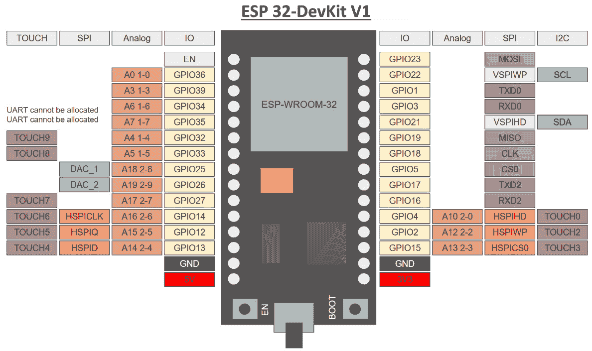

图 9.1：ESP32-DevKit V1

ESP32 提供了多个数字和模拟输入/输出引脚。如果你想使用多个模拟传感器，那么 ADCs 是可用的。最著名的 ADC 之一是 ADS1115/ADS1015 模块，它提供四个模拟引脚，当你需要为你的项目添加额外的模拟引脚时，它是个不错的选择。在这个项目中，需要四个模拟引脚来获取土壤湿度传感器的值；这个板子有足够的模拟引脚，但我使用 ADS1115 来演示我们如何使用 ADC 模块为我们的项目添加额外的模拟引脚。

在当前项目中，我们需要五个数字引脚用于 DHT22 模块和 DS18B20 温度探头，以及四个模拟引脚用于电容式土壤湿度传感器。这个开发板的一个优点是它提供了一个 5V 电源引脚，这在大多数 ESP32 系列开发板上是不提供的。

接下来，我们使用 DHT22 模块来感应室外温度和湿度，但根据你的需求，你也可以使用 DHT11 传感器。如果具体谈到特性，那么 DHT22 相比 DHT11 提供了更广泛的传感器范围，但它的成本更高。以下图示展示了 DHT22 模块，我们已为引脚标注以供更好地理解。

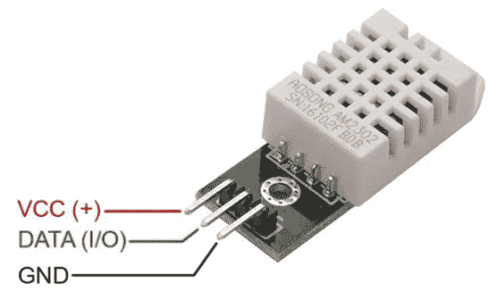

图 9.2：DHT22 和 DHT11 模块引脚排列

前面的图示展示了 DHT22/DHT11 传感器模块的引脚排列；完整的引脚连接配置可以在*表 9.3*中查看。第一个引脚（**VCC**）可以与 3.3V 和 5V 同时工作。第二个引脚是**数据**引脚，它连接到 ESP32-DevKit V1 的任何数字引脚。第三个引脚是**地**引脚，它连接到开发板的地引脚。

在继续之前，以下表格解释了 DHT22 和 DHT11 之间的所有规格差异。最值得注意的是测量范围和测量周期：

| **特性** | **DHT22** | **DHT11** |
| --- | --- | --- |
| 电源 | 3.3 至 5V |
| 输出信号 | 通过单总线传递的数字信号 |
| 测量元件 | 聚合物电容器 |
| 测量范围 | 湿度 0-100% 相对湿度（RH）温度 40-0°C | 湿度 20-90% RHT 温度 0-50°C |
| 精度 | 湿度：+-2% RH（最大+-5% RH）温度：<+-0.5°C | 湿度：1% RH（最大 5% RH）温度：<2°C |
| 测量周期 | 平均 2 秒 | 平均 1 秒 |

表 9.1：DHT22 和 DHT11 传感器规格

项目的主要传感器是一个电容式土壤湿度传感器，用于监测特定区域的土壤湿度。它是一种低成本土壤湿度监测传感器，由于其使用 PCB（PCB 板使用塑料和油漆，使其防锈）而具有防锈性。它通过向土壤湿度传感器中通入少量电流来感应土壤湿度，如图 *图 9**.3* 所示，并根据返回的电流确定土壤湿度。如果传感器接收到的电流较高，则表示湿度较高；如果接收到的电流较低，则表示土壤中水分含量很少或没有。


图 9.3：电容式土壤湿度传感器引脚图

土壤湿度传感器由三个引脚组成：在 `FetchSoilMoisture()` 方法下的 `map()` 方法。完整的代码可在 GitHub 的本章文件夹中找到。该传感器既可以用 5V 电源也可以用 3.3V 电源运行，但推荐使用 5V。

本项目的另一个主要传感器是 DS18B20 防水温度传感器探头，用于监测特定区域的土壤温度以及土壤湿度。它是一种低成本防水温度监测传感器，由于其钢制外壳而具有防锈性。以下图显示了 DS18B20 防水温度探头及其引脚图和与 ESP32-DevKit V1 的连接图。

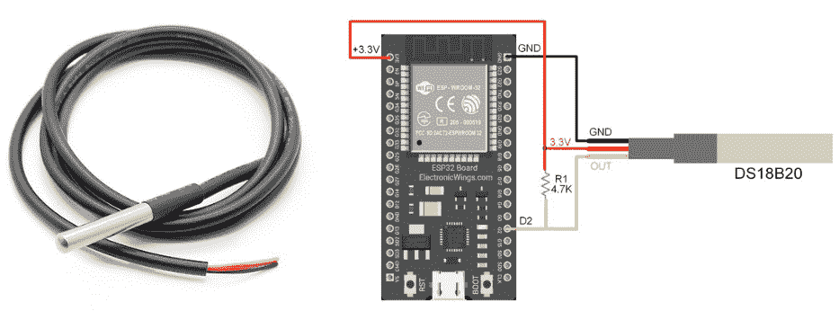

图 9.4：DS18B20 防水温度探头

前面的图显示了传感器及其引脚图。DS18B20 包含三根彩色线：黑色线用于 GND，红色线用于连接 VCC，可以是 3.3V 或 5V，黄色线用于连接任何数字引脚，但需要串联一个 4.7k 拉电阻，如图所示。如果我们谈论传感器的规格，那么其温度感测范围很好——它能够测量从 -55 到 125°C 的温度。所有其他详细信息都在以下表格中提供，以供进一步探索：

| **特性** | **DS18B20** |
| --- | --- |
| 电源 | 3.3 至 5V |
| 输出信号 | 数字信号/单线 |
| 温度感测范围 | -55~125°C |
| 温度精度 | 温度 ± 0.5°C |
| 感测周期 | <750 毫秒 |

表 9.2 – DS18B20 规格表

在本节中，我们详细讨论了开发板和传感器，包括完整的规格和引脚图。在下一节中，我们将讨论这些传感器如何连接到 ESP32-DevKit V1 以及项目的 PCB 设计。

# 构建你的农业物联网系统

在前面的章节中，我们详细讨论了传感器和开发板。现在，是时候将理论付诸实践了。在硬件开发中，在开始与传感器和开发板一起工作之前，我们需要开发设计概念，以便更好地理解事物如何连接。有许多软件可用于设计电子项目的概念和开发，但我们将使用 **Fritzing**。

在接下来的两个小节中，我们将首先讨论项目的电路图和设计，并解释如何将引脚与开发板连接。然后，我们将讨论 PCB 设计和其实施，以便产品可以部署到现场。

## 电路图和设计

设计的目的是清楚地了解传感器如何与开发板连接。它帮助工程师基于这些设计文件在面包板或 Veroboard 上开发原型。使用 Fritzing 进行设计的重大优势是它会在后台根据您的设计构建硬件电路图和 PCB 设计，设计师可以根据系统要求进行调整。以下图显示了整个项目图，说明了传感器和 ADS1115 模块如何连接到 ESP32-DevKit V1 板。

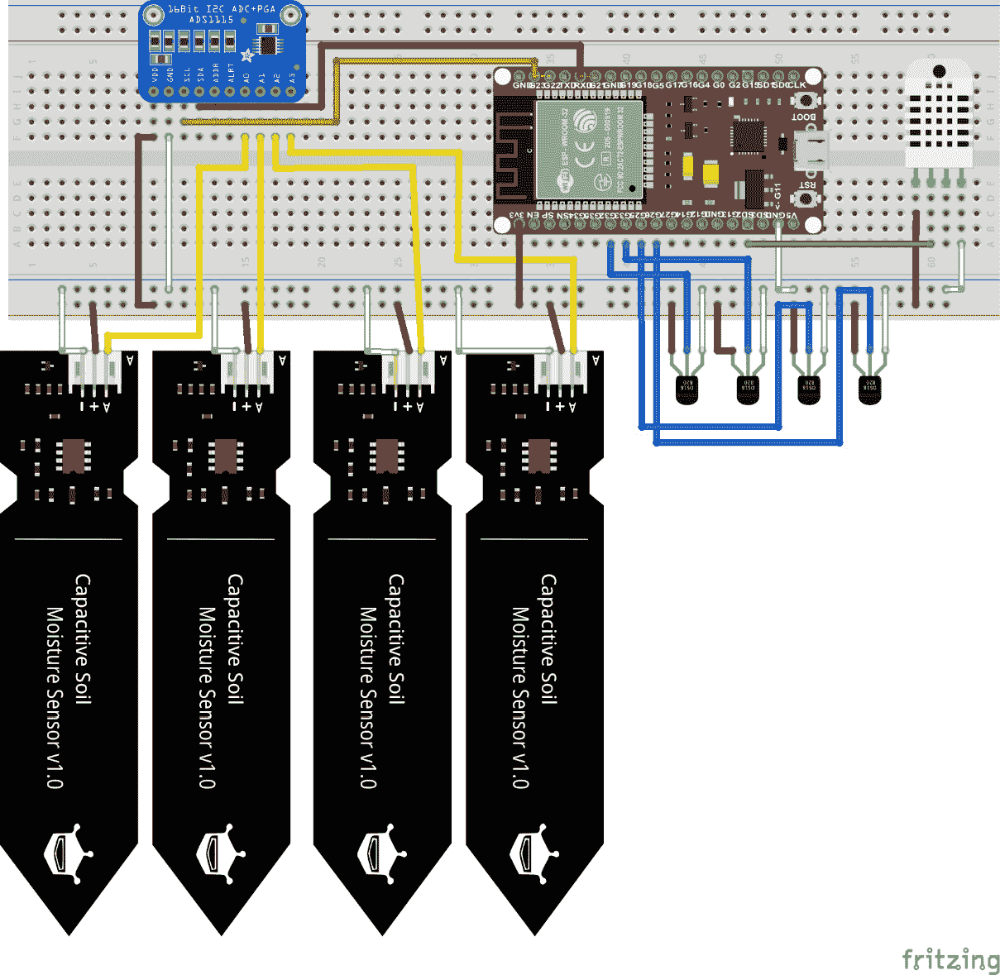

图 9.5：智能农业系统设计

*图 9.5* 展示了整个项目的电路图，其中也包括了引脚号。但为了使您更容易理解，我们提供了以下表格，其中包含了所有引脚号。*表 9.3* 包含了 ESP32 与 DHT22 的引脚配置：

| **ESP32** | **DHT22** |
| --- | --- |
| D13 | 数据（I/O） |
| GND | GND |
| 3.3V | VCC |

表 9.3：ESP32 和 DHT22 引脚分配表

*表 9.4* 包含了 ESP32 与 DS18B20 温度探头的引脚配置。在这里，我们使用了四个 DS18B20 温度探头，在每个传感器的列中，我们都提到了将连接到 DS18B20 数据引脚的 ESP32 引脚号。ESP32 开发板的 GND 和 VCC 引脚将适用于所有传感器：

| **土壤温度** **传感器 #1** | **土壤温度** **传感器 #2** | **土壤温度** **传感器 #3** | **土壤温度** **传感器 #4** |
| --- | --- | --- | --- |
| 与 ESP32（D32）的数据引脚 | 与 ESP32（D33）的数据引脚 | 与 ESP32（D25）的数据引脚 | 与 ESP32（D26）的数据引脚 |
| ESP32 GND 到 GND | ESP32 GND 到 GND | ESP32 GND 到 GND | ESP32 GND 到 GND |
| ESP32 3.3V 到 VCC | ESP32 3.3V 到 VCC | ESP32 3.3V 到 VCC | ESP32 3.3V 到 VCC |

表 9.4：ESP32 和 DS18B20 温度探头引脚分配表

*表 9.5* 展示了 ESP32 到 ADS1115 的引脚配置。其余的土壤湿度传感器将通过 ADS1115 模拟引脚连接到系统，这些引脚在 *表 9.6* 中有详细说明：

| **ESP32** | **ADS1115** |
| --- | --- |
| D22 | SCL |
| D21 | SDA |
| 3.3V | VCC |
| GND | GND |

表 9.5：ESP32 和 ADS1115 引脚分配表

在*表 9.6*中，您将看到我们如何使用 ADS1115 将土壤湿度传感器连接到系统中。表格的第二行说明了 ADS1115 的哪个引脚将被用于将土壤湿度传感器连接到系统中：

| **土壤湿度** **传感器 #1** | **土壤湿度** **传感器 #2** | **土壤湿度** **传感器 #3** | **土壤湿度** **传感器 #4** |
| --- | --- | --- | --- |
| 土壤湿度模拟引脚到 ADS1115（A0） | 土壤湿度模拟引脚到 ADS1115（A1） | 土壤湿度模拟引脚到 ADS1115（A2） | 土壤湿度模拟引脚到 ADS1115（A3） |
| ESP32 GND 到 GND | ESP32 GND 到 GND | ESP32 GND 到 GND | ESP32 GND 到 GND |
| ESP32 VCC 到 VCC | ESP32 VCC 到 VCC | ESP32 VCC 到 VCC | ESP32 VCC 到 VCC |

表 9.6：ADS1115 和土壤湿度传感器引脚表

上述设计提供了一个全面概述，展示了您如何将传感器连接到开发板上。根据设计，我们从开发板中只取了一个 5V 和一个 GND，这些将被用于所有传感器。土壤湿度传感器是模拟传感器，因此我们将所有传感器通过 ADS1115 模块的引脚从 AO 引脚连接到 A4 引脚，如图*图 9.5*和*表 9.6*所示，而 DHT22 模块和 DS18B20 是数字传感器，它们连接到 ESP32 的 D12、D32、D33、D25 和 D26 引脚，如图*图 9.5*以及分别如图*表 9.3*和*表 9.4*所示。ESP32 到 ADS1115 的引脚分配如图*表 9.5*以及*图 9.5*所示。

## PCB 设计和硬件组件的组装

在上一节中，我们看到了一个适合使用面包板或 Veroboard 创建原型的好设计，但如果我们想在野外部署该解决方案怎么办？Fritzing 是一个很好的工具，它提供了设计 PCB 的选项，当您开发设计时，它会在后台自动创建 PCB 设计，这可以通过 Fritzing 软件中的**PCB 设计**选项卡访问。自动 PCB 设计只是一个基本功能，并不适合直接生产，因此必须根据专业实践审查和重新排列设计。以下图显示了当前项目的 PCB 设计。

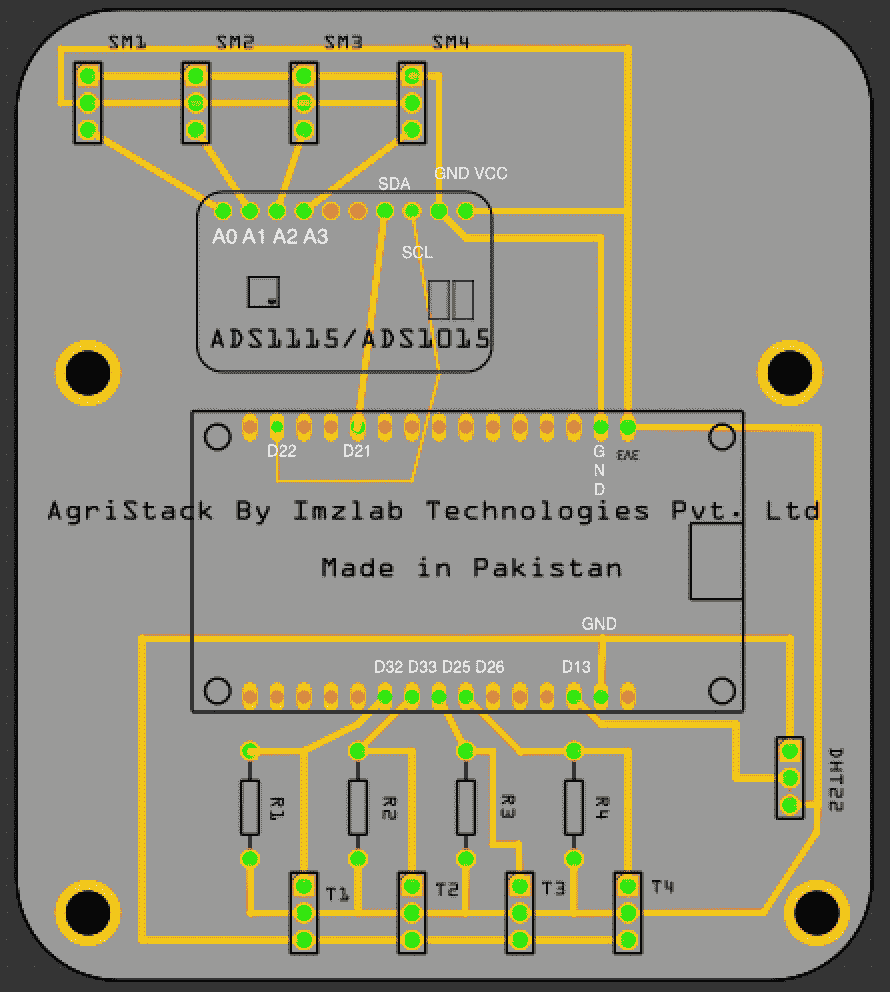

图 9.6：智能农业系统 PCB 设计

上述图显示了项目的最终 PCB 设计。（我能够轻松创建这个设计得益于 Fritzing。）有许多不同的工具可用于 PCB 设计，例如**EasyEDA**、**Circuit Maker**和**Altium**。开发 PCB 很容易；只需确保 PCB 上的连接线不要与其他连接线交叉。

PCB 设计完成后，你有两种选择：要么自己使用 DIY 方法开发 PCB（这对于学习目的很好，但不适合大规模产品），要么选择一个专业机构来专业制造 PCB。中国有许多组织提供 PCB 制造和加工服务，例如 Seeed Studio、JLCPCB 和 PCBWay。我们尝试了 PCBWay，并对他们的工作和交货时间印象深刻。我们已经将 PCB 设计上传到 PCBWay 项目仓库，您可以从那里选择 PCB 设计并轻松订购：[`www.pcbway.com/project/shareproject/ESP32_Based_Smart_Agriculture_Node_11223e5a.html`](https://www.pcbway.com/project/shareproject/ESP32_Based_Smart_Agriculture_Node_11223e5a.html)。

在获得 PCB 板后，是时候焊接用于开发板和传感器的母头和 2.54 毫米三针连接器了。切勿直接在 PCB 板上焊接开发板和传感器，这样如果任何东西停止工作，那么很容易拆卸和更换。以下图显示了 PCB 板的最终面，其中包含白色 2.5 毫米三针连接器，用于土壤湿度传感器、DS18B20 和 DHT22，而黑色母头用于插入 ESP32-DevKit V1 和 ADS1115 模块。

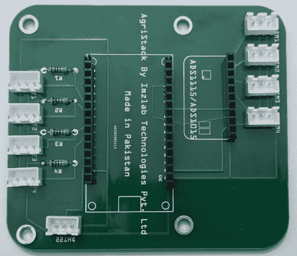

图 9.7：智能农业系统 PCB

上述图显示了焊接了三针 2.54 毫米连接器和母头后的 PCB 板外观。土壤湿度连接器标记为**SM**，DS18B20 连接器标记为**T**，电阻标记为**R**，如*图 9.7*所示。现在，是时候将所有连接器插入，以便将我们的智能农业节点准备好进行后续步骤。但是等等——默认情况下，土壤湿度传感器附带非常短的电线，这不够用，所以你需要通过在两端放置 2.54 毫米母头来延长电缆长度，因为土壤湿度传感器也使用相同的连接器进行连接。DS18B20 也附带裸端子，但我们插入了 2.54 毫米母头，以便于清洁的连接。以下图显示了包含所有传感器和电缆布线的完整设置。

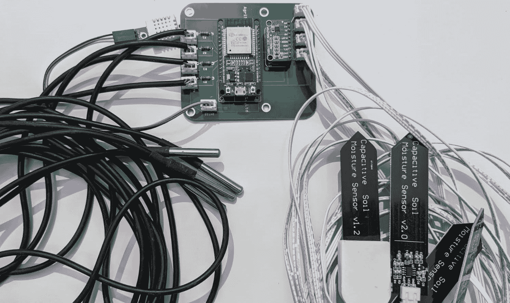

图 9.8：包含所有传感器和模块的智能农业系统

上述图显示了所有组件堆叠在 PCB 板上。我们可以看到土壤湿度传感器通过连接器使用定制电缆进行扩展，而 DS18B20 裸端子连接到母头，DHT22 模块也是如此。硬件组装完成后，在将节点部署到现场之前，我们需要校准土壤湿度和 DS18B20 温度。

# 完善传感器校准

传感器校准是产品开发中非常重要的一个方面，尤其是在你计划将产品部署到实时环境中的时候。因此，在继续之前，我们首先需要校准电容式土壤湿度和 DS18B20 传感器。由于空气湿度和水位不同，土壤湿度传感器的操作因地区而异。

因此，首先，我们将通过在空气中取传感器的值，然后将传感器放入水中来校准土壤湿度传感器。这些值将用于绑定最终读数，最后，我们将通过 map 方法将土壤湿度传感器的值从 0 转换为 100%。土壤湿度传感器是一个模拟传感器，因此除了**ADS 模块库**外，不需要额外的辅助库，该库如图所示，名称为**Adafruit ADS1X15**。

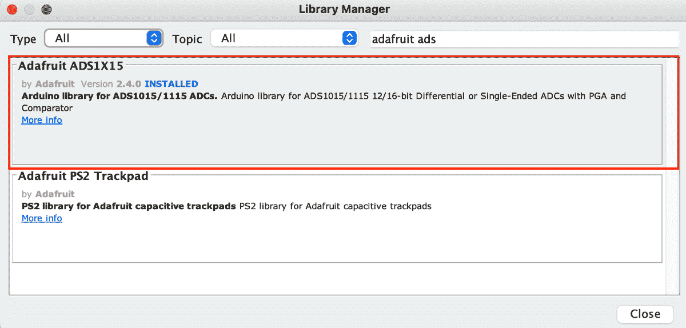

图 9.9 – ADS1115 库

在这里，我们需要在 Arduino IDE 中安装 ADS1115/ADS1015 库，以便我们可以使用 ADS 模块。导航到`Adafruit ADS1X15`，并安装最新版本，如图所示。安装库后，从官方 GitHub 书库下载代码，并从`Soil-Moisture-Calibration`文件夹打开代码：

```cpp
int AirValue[]={0,0,0,0};
int WaterValue[]={0,0,0,0};
```

前面的代码片段包含两个数组：一个用于空气值，一个用于传感器浸入水中的值。对于土壤传感器校准，我们只需要通过一次获取`AirValue`和`WaterValue`值。将代码上传到开发板，并确保你的土壤湿度传感器是干燥的。打开串行监视器，并记下每个传感器的`AirValue`值。之后，将传感器浸入一盆水中，并记下传感器的`WaterValue`值。

让我们看看*图 9.10*中 AIN0、AIN1、AIN2 和 AIN3 的`AirValue`。**AIN**是**模拟输入**的缩写，而前面的 0、1、2 和 3 是连接土壤湿度传感器的 ADC1115 模块的引脚号：

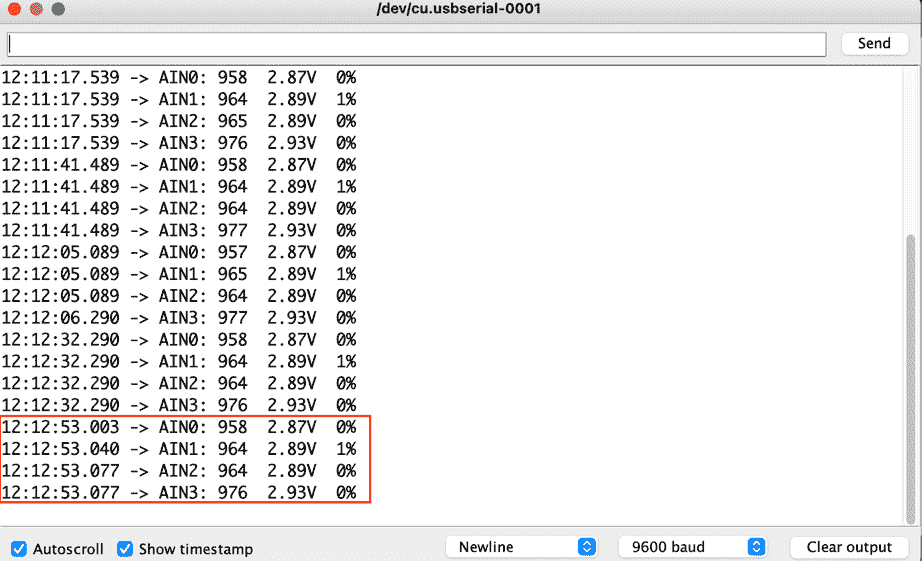

图 9.10：土壤湿度传感器的空气值

现在，让我们看看将土壤湿度传感器放入水中后的`WaterValue`：

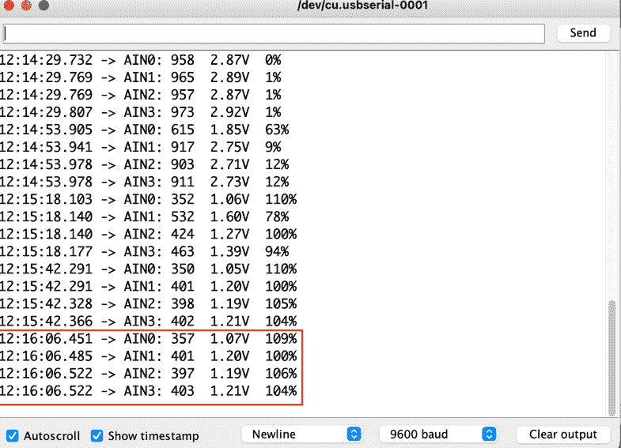

图 9.11：土壤湿度传感器的水值

等待一段时间，当值稳定时记下。在获取`Air`和`Water`值后，将这些值放入前面的数组中，并将代码再次上传到开发板。通过将传感器放入水中并清洁它们来验证土壤湿度百分比级别的值。在这里，当传感器完全浸入水中时，你会得到 100%，而当它们干燥时，你会得到 0%。

在土壤湿度水平之后，是时候验证 DS18B20 温度探头传感器的读数了。首先，我们需要为 DS18B20 温度传感器安装一个库。导航到“Miles Burton 的 Dallas 温度”，并安装最新版本。安装库后，从官方 GitHub 书库下载代码，并从`DS18B20-Calibration`文件夹打开代码：

```cpp
OneWire ds18x20[] = {32,33,25,26};
```

在前面的代码中，我们提到了数字引脚号，这些引脚在 PCB 上预留用于连接 DS18B20 传感器。如果你在面包板上使用不同的引脚，那么根据你的选择更新引脚号。将代码上传到开发板，然后上传后，打开串行监视器，查看你是否从传感器获得了值。以下图显示了用于校准目的的 DS18B20 温度探头在串行监视器上的读数。

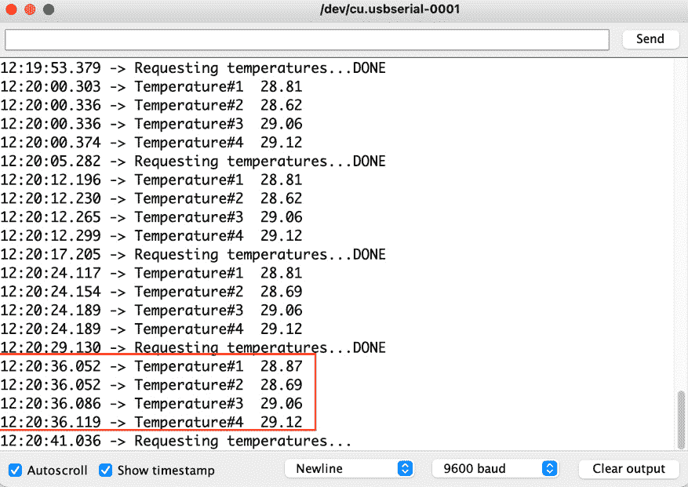

图 9.12：DS18B20 温度传感器在串行监视器上的值

前面的图显示了 DS18B20 温度传感器工作正常，值已稳定。现在，我们可以继续进行实验室校准。

重要提示

对于 DS18B20，必须使用 4.7k**上拉电阻**。没有上拉电阻，你将无法获得值。

在土壤湿度传感器用“空气”和“水”值测试之后，是时候在实验室中对两个传感器进行校准了。对于湿度测试，我们使用了热空气烤箱方法来验证土壤湿度传感器的准确性。我们在土壤、沙子和盐中添加了不同水平的水，并用传感器进行测量。然后，我们将这些样品放入热空气烤箱中，比较两种方法之间的传感器读数；结果令人难以置信：只有±0.5 的差异。对于 DS18B20，我们使用校准过的模拟温度计，观察到的差异也只有±0.5。以下图显示了我们在实验室中对土壤湿度传感器和 DS18B20 传感器进行行业标准校准的照片。

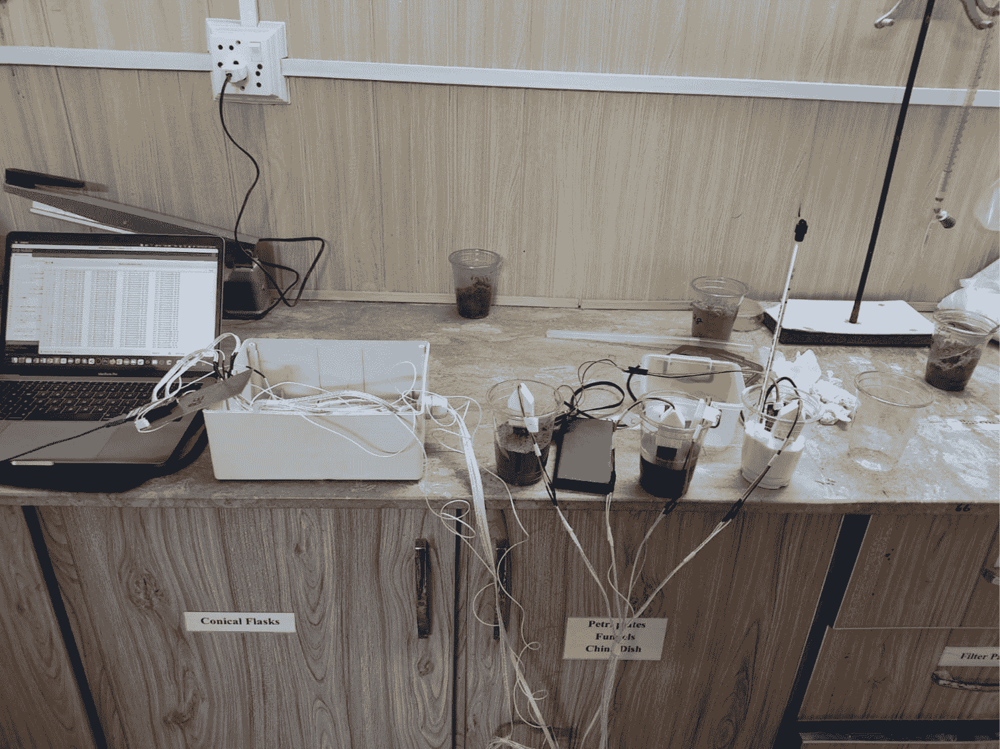

图 9.13：实验室中的湿度传感器和温度传感器校准

前面的图显示了实验室中传感器的校准。在这里，我们用土壤、沙子和盐测试了传感器。

在本节中，我们通过原理图讨论了传感器及其与 ES32-DevKit V1 的连接，以及 PCB 设计和其实施。之后，我们讨论了土壤湿度和 DS18B20 传感器的校准。在下一节中，我们将设置事物、网络凭据和云变量，并查看代码。

# 设置事物、网络和云变量

在设置好硬件后，是时候在 Arduino IoT Cloud 中设置事物了。对于本项目，我们需要 10 个云变量来从设备获取监控参数；由于 ESP 系列板，网络设置将不同。以下图提供了我们将要设置的 **AgriStack** 事物的完整概述。

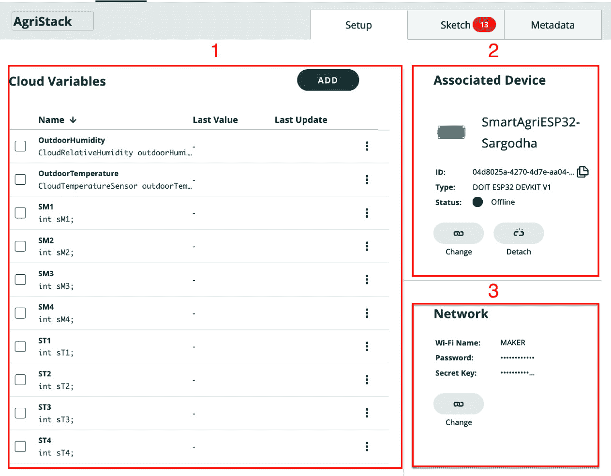

图 9.14：智能农业系统事物设置

使用名称 `AgriStack` 创建一个新事物。按照以下步骤创建变量、相关设备、网络配置，最后是代码。我们已在先前的图中用不同的红色方框标记并分配了数字。这些数字对应以下步骤，将帮助您设置事物：

1.  首先，我们需要设置 10 个云变量，如图 *图 9**.14* 所示。有两个云变量用于户外温度和湿度；这些值将从 DHT22 中获取。有四个云变量用于土壤湿度，四个变量用于土壤温度。前四个将使用土壤湿度传感器，后四个将使用 DS18B20 温度探头。更多关于云变量的详细信息将在下一小节中提供。

1.  之后，我们需要将设备与事物关联起来。在当前项目中，我们将使用 ESP32-DevKit V1，因此向导将与 Arduino 板不同。完整详情请参阅 *关联设备* 部分。

1.  最后，我们需要为设备设置网络配置，但这次，我们需要为 ESP 系列板提供安全密钥以使连接安全，而 Arduino 兼容板将在设备设置向导期间自动由 Arduino IoT Cloud 配置。

在这里，我们讨论了帮助我们设置事物的不同步骤。在下文中，我们将开始探讨云变量。

## 云变量

下表解释了我们在创建云变量时需要使用的所有变量属性。整数（`int`）是一个非常著名的数据类型，但在这里您将观察到两种关于湿度和温度的新变量类型，它们分别以百分比和摄氏度取值。同时，确保您有与表格相同的变量声明；否则，您需要根据您的命名修改示例代码。

我们已将所有云变量的权限设置为**只读**，但我们也有**读写**选项。在本项目中，我们只想从设备接收数据，而不是从仪表板发送数据，这就是为什么使用**只读**模式，以避免数据一致性问题。**更新策略**设置为**有变化时**，因为设备将在五分钟后发送数据，所以这个选项比**定期更新**更合适：

| **序列号** | **变量名称** | **变量类型** | **声明** | **权限** | **更新策略** |
| --- | --- | --- | --- | --- | --- |
| 1 | `Humidity` | `CloudRelativeHumidity` | `humidity` | **只读** | **变更时** |
| 2 | `Temperature` | `CloudTemperatureSensor` | `temperature` | **只读** | **变更时** |
| 3 | `SM1` | `int` | `sM1` | **只读** | **变更时** |
| 4 | `SM2` | `int` | `sM2` | **只读** | **变更时** |
| 5 | `SM3` | `int` | `sM3` | **只读** | **变更时** |
| 6 | `SM4` | `int` | `sM4` | **只读** | **变更时** |
| 7 | `ST1` | `int` | `sT1` | **只读** | **变更时** |
| 8 | `ST2` | `int` | `sT2` | **只读** | **变更时** |
| 9 | `ST3` | `int` | `sT3` | **只读** | **变更时** |
| 10 | `ST4` | `int` | `sT4` | **只读** | **变更时** |

表 9.7：带有完整参数的云变量列表

在成功创建云变量之后，我们将继续进行设备关联步骤，在这里我们将添加并将 ESP32-DevKit V1 与我们的设备关联。

### 关联设备

变量创建完成后，是时候添加一个设备并将其与设备关联了。在添加设备之前，请将开发板连接到计算机，并打开**Arduino Create Agent**应用程序。我们已经在*第二章*的*什么是 Arduino Create 代理？*部分讨论了 Arduino Create 代理。

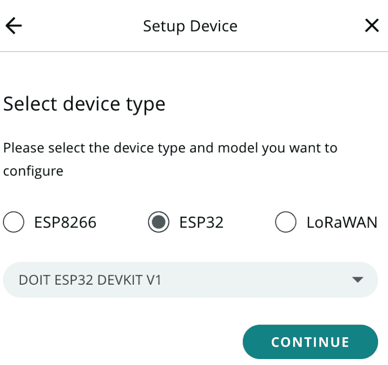

图 9.15：设备选择向导

在设备页面下**关联设备**部分点击**选择设备**按钮。将弹出一个窗口，其中你可以看到所有已可用的设备。如果你已经添加了 WeMos D1 mini，请选择它。如果没有，点击**设置新设备**。接下来，点击**设置第三方设备**选项。从下拉菜单中选择**ESP32**和**DOIT ESP32 DEVKIT V1**，然后点击**继续**按钮。提供设备名称并点击**下一步**按钮。在最后的向导中，将显示**设备 ID**和**密钥**详细信息。将密钥复制到安全的地方，因为它将在网络配置中使用。

## 网络配置

在将设备与设备关联后，是时候配置设备通信的 Wi-Fi 设置了，如图 9.14 中标记的*3*区域所示。在**网络**下，你可以找到填写表单以输入 Wi-Fi 名称和密码的选项。在最后一个字段中，你将找到一个用于密钥的新字段。粘贴我们在设备创建期间从系统中接收到的密钥。

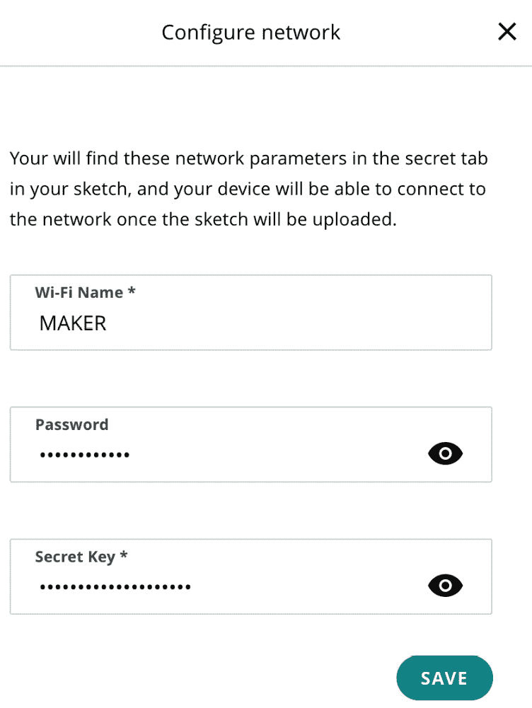

图 9.16：设备网络配置

在网络配置完成后，我们的主要任务就完成了；现在，编码任务仍然存在，在下一节中，我们将对其进行介绍。

## 编码

项目代码以名为`AgriStack_mar05a`的 ZIP 文件形式存储在书籍的官方 GitHub 仓库中。下载它并将其导入到 Arduino Web 编辑器中。

您可以通过导航到`setup`方法下载代码并将其放入您的设备中；记住，永远不要尝试使用`delay`方法，因为它将阻塞`ArduinoCloud.update()`方法。然后，每五分钟调用一次名为`SmartAgri()`的方法。以下是完全的`SmartAgri()`方法。在此之后，我们将探讨此方法执行的操作：

```cpp
bool SmartAgri(void *){
  //Fetch Soil Moisture
  FetchSoilMoisture();
  //Fetch Soil Temperature
  FetchTemperature();
  //Fetch DHT Temp & Humiditiy
  FetchDHTTempHum();
  //Send Data To Arduino IoT Cloud
  SendToArduinoIoTCloud();
  //Print The Readings on Serial Port
  PrintTheReadingsSerialPort();
  return true;
}
```

在这个项目中，我们将所有操作都分成了不同的方法，以便于使用。因此，首先我们调用`FetchSoilMoisture()`方法，它负责从传感器获取土壤湿度读数并将它们存储在数组中。在将数据存储在数组之前，它将百分比值进行映射。接下来，我们有`FetchTemperature()`方法，它负责从所有 DS18B20 传感器获取温度并将它们保存到土壤温度数组中，以供进一步使用。最后，我们调用`FetchDHTTempHum()`来从 DHT22 模块获取户外温度和湿度值，这些值将存储在两个变量中。现在，我们将探讨如何在以下方法中获取土壤湿度传感器的值：

```cpp
float getSoilMoisture(int Pin){
  float SoilMoisture=0;
    //loop 10 times for averaging
  for(int j = 0; j < 5; j++){
    delay(1000);
    SoilMoisture+= ads.readADC_SingleEnded(Pin);
  }
  //divide by 5 to get the average
  SoilMoisture /= 5;
  return SoilMoisture;
 }
```

之前的技术在`FetchSoilMoisture()`方法中使用，用于获取土壤湿度的读数。在这里，您将看到该方法以一秒的延迟从传感器读取值五次，并将它们添加到变量中；然后稍后，它将传感器读数除以 5 以获得平均值。这种技术的优点是您将获得土壤传感器可能获得的最佳值。

前三种方法已经被用来从不同的传感器中获取值并将它们存储在全局变量和数组中。现在，是时候将这些值发送到 Arduino 物联网云平台了；因此，我们有了`SendToArduinoIoTCloud()`方法，它将所有传感器的值分配给云变量，并且这些值将在`ArduinoCloud.update()`方法的帮助下在云上更新。最后，我们有`PrintTheReadingsSerialPort()`方法，这是一个在运行时可选使用的方法，用于在串行监视器上显示所有传感器值。

将代码上传到设备并验证连接性和读数。如果您想更改读数时间，只需修改`timer.every(600000, SmartAgri);`的值。确保您提供的时间是以毫秒为单位的，其中 1 秒等于 1,000 毫秒。

重要提示

如果您在变量声明中使用了不同的命名方案，那么请根据您的命名方案更新代码。但首先，您应该按照书中的所有步骤进行操作，然后您可以稍后更改云变量名称并修改您的代码。

永远不要尝试使用`delay`方法，因为它将阻塞`ArduinoCloud.update()`方法。始终使用毫秒来计算等待时间。回顾`loop()`方法，在五分钟后调用其他方法。

Arduino 物联网云平台仅在变量值更改时更新仪表板上的值。例如，如果温度是 30°C，五分钟之后仍然是这个值，那么 Arduino 物联网云平台将不会记录这个值，所以如果图表上的值没有变化，请不要感到困惑。这个功能的另一个好处是，当你导出内容时，你不会得到重复的数据。

在成功讨论了代码中的不同方法并将代码上传到 ESP32-DevKit V1 之后，现在是时候探索如何使用出色的 Arduino 物联网云平台仪表板小部件来可视化所有数据了。

# 创建网页和移动仪表板

在将代码上传到设备后，现在是时候设置一个网页和移动仪表板，使用不同的仪表板小部件可视化数据了。以下图显示了使用不同小部件的读数可视化：

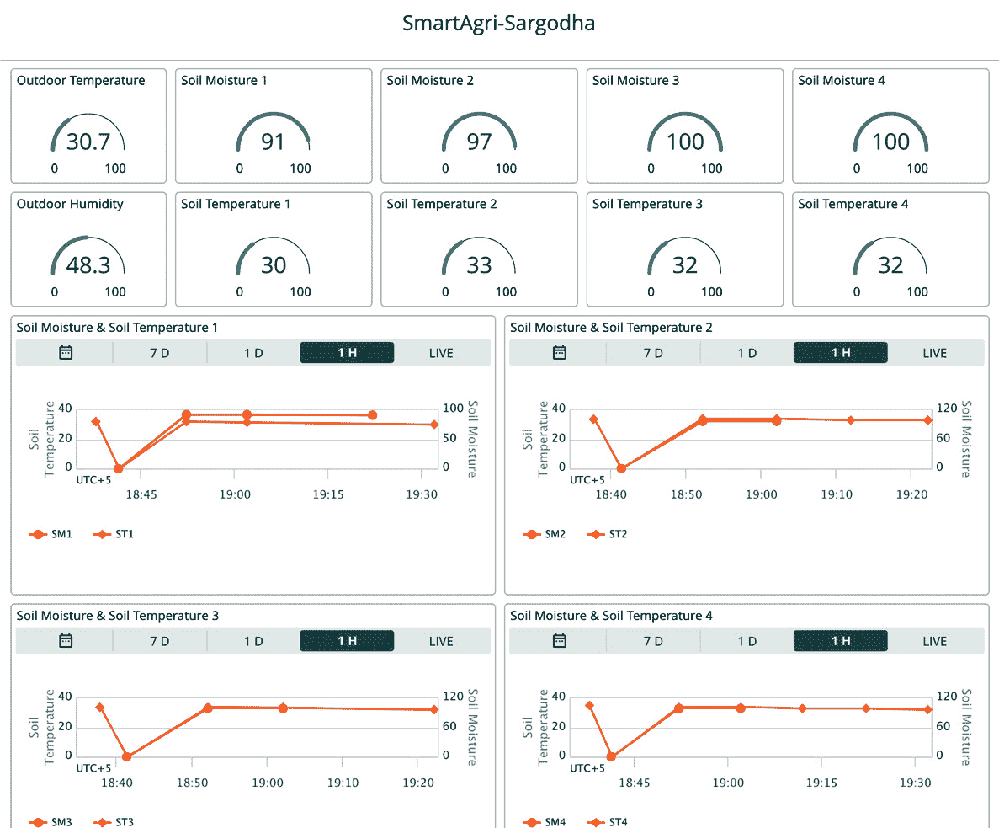

图 9.17：物事物仪表板

我们有 10 种不同的读数：**户外温度**、**户外湿度**、四个**土壤湿度**读数和四个**土壤温度**读数。对于每个读数，我们使用仪表小部件控件，并使用了高级图表来比较**土壤湿度**和**土壤温度**，以可视化这两个属性之间的适当相关性。但我们还希望监控历史数据；图表是显示实时数据以及旧数据的最佳小部件。在此，如图 9.17 所示，我们使用了四个图表，每个图表都连接到一个特定的云变量。

在本节中，我们成功地为智能农业事物创建了一个仪表板，以文本格式显示所有传感器读数，并使用图表进行比较。

# 接下来是什么？

我们还有很多选项可供探索，但现在轮到您使用不同的传感器和开发板进行更多实验并从中学习。在本章中，我们使用了 10 个传感器，但只有 3 种不同类型，即湿度、温度和户外温度和湿度。然而，在市场上，有许多传感器为土壤提供广泛的多种功能，例如**NPK**（代表**氮、磷和钾**），**EC**（代表**电导率**），以及 pH 传感器和用于户外测量的不同气体传感器。

尝试以下传感器以增强您的实践知识，并从功能、范围和成本方面与其他传感器进行比较：

+   NPK 传感器

+   土壤 EC 传感器

+   土壤 pH 传感器

+   MQ 系列传感器，专为检测特定气体而设计，包括 MQ-2、MQ-3、MQ-4、MQ-5、MQ-7、MQ-8 和 MQ-9，以找到气体及其对土壤和作物的影响之间的相关性

+   Seeed Studio SCD30（温度、湿度和 CO2）用于户外监测

# 摘要

在本章中，我们探讨了如何使用 DHT22、电容式土壤湿度传感器、用于土壤温度的 DS18B20 探头以及 ESP32 开发板和 ADS1115 ADC 模块来开发智能农业监控系统。我们在将它们用于田野之前，在实验室中对土壤湿度和温度传感器进行了校准。我们还设置了一个事物，包括创建云变量、设备关联、网络配置和开发板的编码。然后，我们创建了一个仪表板，使用不同类型的仪表盘来可视化事物的传感器读数，显示当前读数以及借助图表显示的历史数据。

这个项目将帮助你并给你信心，与农业研究人员和土壤科学家合作，在更高级别上工作。它将帮助你将物联网系统添加到实际田野和隧道农场，同时也有助于你在家庭园艺中。

在下一章中，我们将着手一个智能家居项目，我们将开发一个智能 RGB LED 灯，该灯将连接到亚马逊 Alexa 语音助手，帮助你理解和开发智能家居解决方案。
