# 第十三章：使用 Cloud CLI 编写 Arduino IoT Cloud 脚本

Arduino Cloud **命令行界面**（**CLI**）是一个自动化工具，对于脚本编写和创建设备、事物和仪表板非常有用。它还提供了执行大量上传（**OTA**）的选项，从而能够管理已部署的 IoT 节点。本章将探讨该工具的高级功能，并提出一些使用场景。

Arduino Cloud CLI 是一个跨平台工具，它允许你通过命令行执行批量管理和操作，这有助于提高你的生产力，并提供通过命令行脚本自动事物选项。在本章中，我们将探讨所有命令并观察它们的上下文。

在本章结束时，你将了解如何通过 CLI 与 Arduino IoT Cloud 平台交互，以创建、删除或从设备、事物和仪表板中提取模板，并通过命令行向设备发送 OTA 更新。本章将展示如何通过命令行执行所有操作以提高你的生产力。你将学习的命令将帮助你编写用于大量部署和批量管理操作的定制脚本。

在本章中，我们将涵盖以下主要主题：

+   什么是 Arduino Cloud CLI？

+   保护访问权限 – 揭示 API 密钥和身份验证

+   安装 Arduino Cloud CLI

+   与设备交互

+   与事物互动

+   构建仪表板 – 通过命令行释放潜力

+   OTA 管理

+   接下来是什么？

# 技术要求

本章没有特定的硬件要求，因为我们将会专注于 Arduino Cloud CLI，并通过不同的命令练习来执行在 Arduino IoT Cloud 平台上使用 CLI 的操作。然而，在继续之前，我们需要以下软件来完成本章的不同练习：

+   Arduino Cloud CLI

+   Arduino IDE

+   Arduino IoT Cloud 账户

对于命令，我们需要 Arduino Cloud CLI 和一个活跃的 Arduino IoT Cloud 账户。本章只包含命令，因此在 GitHub 上没有为其创建文件夹。

# 什么是 Arduino Cloud CLI？

Arduino Cloud CLI 是一个强大的工具，可以管理和与云端的 Arduino 项目进行交互。它允许你执行各种操作，例如部署和管理设备，以及生成仪表板和事物模板以进行批量创建，所有这些都可以在你的命令行中完成。

使用 Arduino Cloud CLI 的好处有很多。首先，它提供了一种方便且高效的方式来管理你的项目，无需图形用户界面。如果你更喜欢使用命令行工具，或者将 Arduino 集成到自动化工作流程中，这尤其有用。

Arduino Cloud CLI 是一个命令行工具，它使你能够通过终端与 Arduino IoT Cloud 的关键功能进行交互。它提供了以下任务的能力：

+   通过提取模板来复制现有的事物和仪表板

+   执行大量 OTA 上传

+   通过 CLI 直接生成设备、事物和仪表板

下面是使用 Arduino Cloud CLI 的一些好处：

+   **自动化**：Arduino Cloud CLI 可以用来自动化您否则必须手动完成的任务。例如，您可以使用它创建一个脚本，克隆一个事物，然后对该事物关联的所有设备执行大量 OTA 上传。

+   **高效设备管理**：Arduino Cloud CLI 可以帮助您更高效地管理大量设备。例如，您可以使用它列出与特定标签关联的所有设备，或获取特定设备的状态。

+   **访问高级功能**：Arduino Cloud CLI 可以用来访问在网页界面中不可用的 Arduino IoT Cloud 功能。例如，您可以使用它创建一个脚本，每分钟检查设备状态，如果状态发生变化，则发送电子邮件警报。

+   **定制**：作为开源工具，用户可以根据自己的特定需求定制 Arduino Cloud CLI，并将其集成到他们的工作流程中。

+   **积极开发和社区支持**：该工具正在积极开发中，这意味着它持续接收更新、新功能和错误修复。此外，庞大社区的存在可以为用户提供帮助和支持。

+   **节省时间和精力**：Arduino Cloud CLI 可以在管理物联网项目中节省时间和精力，对于使用 Arduino 设备的开发者来说是一个宝贵的资源。

总体而言，Arduino Cloud CLI 是一个强大的工具，可以用来自动化任务、管理大量设备，以及访问在网页界面中不可用的 Arduino IoT Cloud 功能。

在本节中，我们讨论了 Arduino Cloud CLI 是什么以及 Arduino Cloud CLI 的好处。在下一节中，我们将探讨如何设置 API 密钥以及如何使用 API 密钥通过 Arduino IoT Cloud 对 Arduino Cloud CLI 进行身份验证。

# 保护访问权限 – 揭示 API 密钥和身份验证

在进入本章的主要内容之前，我们首先需要讨论平台的身份验证机制。Arduino IoT Cloud 使用**令牌身份验证机制**来验证 Arduino Cloud CLI 请求。

在我们开始安装和测试 Arduino Cloud CLI 之前，我们需要在 Arduino Cloud 中设置 API 密钥，这将为我们提供客户端 ID 和密钥。在旧版本的界面中，API 选项位于**集成**标签下，但现在它们已移动到 Arduino Cloud，可在[`cloud.arduino.cc/home/`](https://cloud.arduino.cc/home/)找到。

访问**集成**页面后，点击**API 密钥**，然后您将被带到 API 页面。点击**创建 API 密钥**。将弹出一个窗口；为 API 提供一个名称，然后点击**继续**按钮。出现的向导将花费几秒钟生成密钥，然后会弹出一个新的窗口显示密钥，如图*图 13.1*所示。

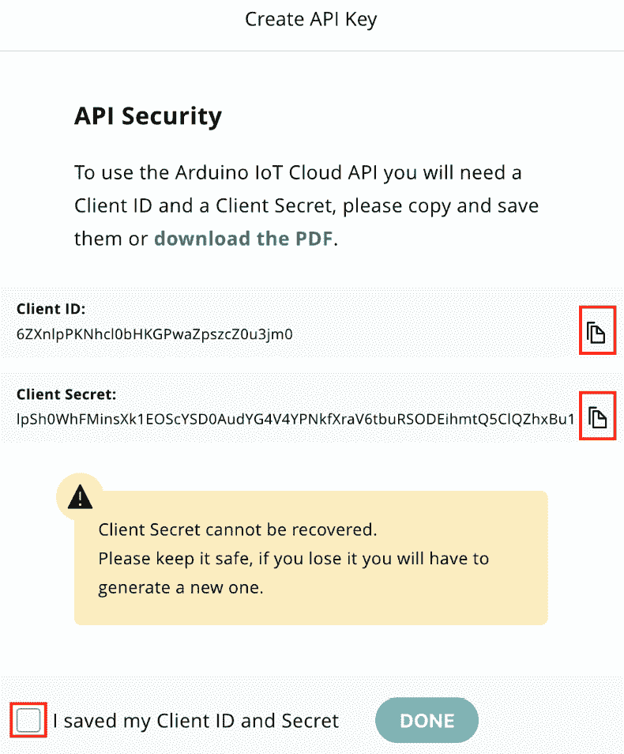

图 13.1 – API 密钥

通过点击复制图标复制**客户端 ID**和**客户端密钥**的值 – 永远不要尝试手动选择复制，因为客户端密钥非常长，所以点击复制图标是最好的选择。将**客户端 ID**和**客户端密钥**的值保存在安全的位置，然后点击复选框，确认您已保存您的密钥。最后，点击**完成**，您将在面板中看到您的 API 密钥 – 现在它已准备好使用。

重要提示

单个 API 密钥用于访问所有事物及其变量。仅使用一个 API 密钥即可访问所有基础设施，这很方便，而不是为每个事物创建单独的 API 密钥，但您必须小心保管您的密钥！这是一个很大的安全风险，因为如果您丢失了密钥，黑客可能会获得对您整个账户的访问权限。

在本节中，我们创建了 API 认证密钥，这些密钥由客户端 ID 和客户端密钥组成。本节非常重要，因为没有这些密钥，我们无法通过 Arduino Cloud CLI 执行任何命令。在下一节中，我们将安装 Arduino Cloud CLI。

# 安装 Arduino Cloud CLI

在本节中，我们将安装 Arduino Cloud CLI 工具。Arduino 团队为所有三个主要操作系统：macOS、Windows 和 Linux 开发了 CLI 工具。您可以从[`github.com/arduino/arduino-cloud-cli/releases`](https://github.com/arduino/arduino-cloud-cli/releases)下载适用于您的操作系统的 Arduino Cloud CLI 工具。官方 Arduino Cloud CLI 页面可在[`docs.arduino.cc/arduino-cloud/getting-started/arduino-cloud-cli`](https://docs.arduino.cc/arduino-cloud/getting-started/arduino-cloud-cli)找到；在这里，您可以获取有关命令及其使用的更新信息。

总是尝试下载 Arduino Cloud CLI 的最新和最稳定的版本。根据您的操作系统下载 ZIP 文件后，从中提取文件。您将找到一个名为`arduino-cloud-cli`的可执行文件，另一个名为`LICENSE.txt`，您可以在操作系统中为`arduino-cloud-cli`可执行文件设置环境变量，这将帮助您在终端中执行`arduino-cloud-cli`而无需指定`arduino-cloud-cli`文件夹的位置。

只需打开终端并输入以下命令：

```cpp
arduino-cloud-cli
```

然后，您将在终端上看到以下输出（*图 13.2*）。

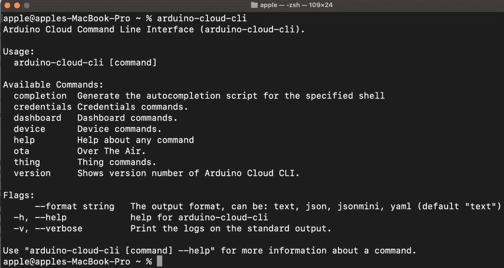

图 13.2 – Arduino Cloud CLI 终端

这只是简单地展示了如何使用 Arduino Cloud CLI 与不同的参数一起使用，因为我们没有在命令执行期间指定任何参数。

现在，是时候使用我们在上一节中生成的 API 密钥，通过 Arduino Cloud CLI 来初始化 Arduino Cloud 的认证了。请在终端中输入以下命令：

```cpp
arduino-cloud-cli credentials init
```

执行上述命令后，您将被要求输入您的客户端 ID 和客户端密钥，最后您将被要求输入您的组织 ID，这不是强制性的，您可以将其留空，如图 13.3 所示。

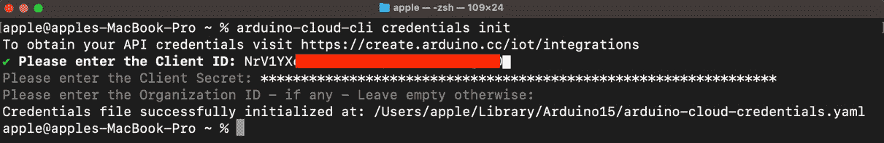

图 13.3 – 使用 Arduino Cloud CLI 与 Arduino Cloud 的认证过程

成功认证后，您将在终端看到成功消息，如图 13.3 所示。恭喜！您现在可以执行终端上的命令，并通过命令在 Arduino IoT Cloud 上执行操作。

在本节中，我们下载了`arduino-cloud-cli`文件并在我们的操作系统上安装了它，我们还使用 Arduino IoT Cloud 初始化了`arduino-cloud-cli`工具的认证过程。在下一节中，我们将开始使用命令行来玩设备。

# 与设备交互

在本节中，我们将通过设备进行实际操作。我们将对设备执行创建、列出、删除、标记和取消标记操作，以及列出所有设备并显示特定设备的所有参数。打开命令终端，然后我们将执行以下章节中的命令。

## 创建设备

首先，我们将创建一个设备。有关设备创建的文档可以在[`docs.arduino.cc/arduino-cloud/getting-started/arduino-cloud-cli#device`](https://docs.arduino.cc/arduino-cloud/getting-started/arduino-cloud-cli#device)找到。在您执行命令之前，请将您的开发板连接到您的电脑，并从文档页面中找出您的设备的端口号和 FQBN。以下为`device` `create`命令的语法：

```cpp
arduino-cloud-cli device create --name <deviceName> --port <port> --fqbn <deviceFqbn>
```

我将 MKR Wi-Fi 1010 连接到我的电脑，该电脑在端口`/dev/cu.usbmodem101`上可用，其 FQBN 为`arduino:samd:mkrwifi1010`。因此，以下是我的命令：

```cpp
arduino-cloud-cli device create -n ArduinoDevBoardByCLI  -p /dev/cu.usbmodem101 -b arduino:samd:mkrwifi1010
```

执行上述命令后，您将看到以下输出，显示设备已成功创建（*图 13**.4*）。

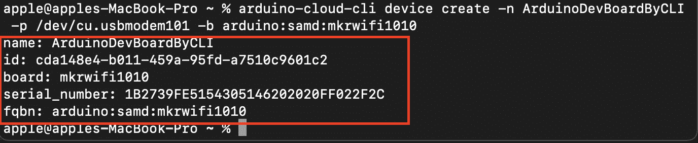

图 13.4 – 使用 arduino-cloud-cli 创建设备

创建设备后，终端将显示设备名称、ID、板、序列号和 FQBN。想象一下，与图形用户界面相比，使用命令行将数十个开发板连接到 Arduino IoT Cloud 是多么容易。Arduino Cloud CLI 还能够通过 CLI 创建**LoRaWAN**设备和 ESP32/ESP8266 设备。

在本小节中，我们使用命令行在 Arduino IoT 云平台上创建了一个设备。在下一小节中，我们将探讨如何列出设备。

## 列出设备

在本节中，我们将列出所有设备。*列出*设备意味着显示所有设备及其属性。列出设备的文档可在[`docs.arduino.cc/arduino-cloud/getting-started/arduino-cloud-cli#list-devices`](https://docs.arduino.cc/arduino-cloud/getting-started/arduino-cloud-cli#list-devices)找到。以下为列出所有设备的简单命令：

```cpp
arduino-cloud-cli device list
```

执行上述命令后，我们将看到设备列表的完整列表，如下图所示。

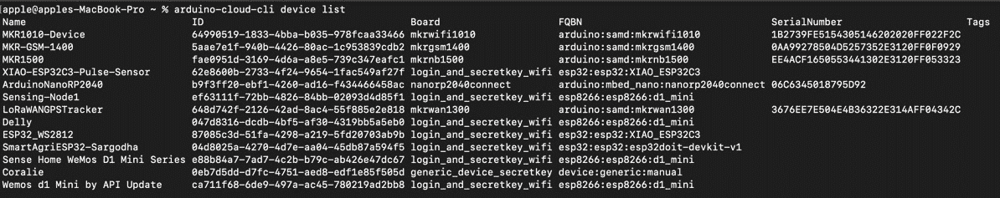

图 13.5 – 设备列表命令

在输出中，我们可以看到设备名称、ID、板、FQBN、序列号和标签。在这里，ID 非常重要，因为它将在后续的设备删除、标签创建和删除命令中使用。在本小节中，我们已看到如何列出设备，在下一小节中，我们将探讨如何使用设备 ID 删除设备。

## 删除设备

在本节中，我们将探讨如何使用设备 ID 删除设备。删除设备的文档可在[`docs.arduino.cc/arduino-cloud/getting-started/arduino-cloud-cli#delete-a-device`](https://docs.arduino.cc/arduino-cloud/getting-started/arduino-cloud-cli#delete-a-device)找到。以下为设备删除的命令语法：

```cpp
arduino-cloud-cli device delete --id <deviceID>
```

根据上述命令语法，我们需要一个设备 ID 来进行删除。您可以通过使用`device` `list`命令来检索设备 ID：

```cpp
arduino-cloud-cli device delete -i ca711f68-6de9-497a-ac45-780219ad2bb8
```

在成功删除设备后，您将不会看到任何错误信息；否则，您将在屏幕上看到`401 错误`。

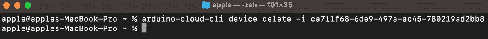

图 13.6 – 设备删除命令

*图 13**.6* 展示了设备删除的完整命令，屏幕上没有错误信息，这意味着设备已成功删除。在本小节中，我们讨论了`delete`命令。在接下来的小节中，我们将对设备进行标记和取消标记。

## 标记和取消标记设备

在本节中，我们将探讨如何使用设备 ID 对设备进行标记和取消标记。设备标记的文档可在[`docs.arduino.cc/arduino-cloud/getting-started/arduino-cloud-cli#tag-device`](https://docs.arduino.cc/arduino-cloud/getting-started/arduino-cloud-cli#tag-device)找到，设备取消标记的文档可在[`docs.arduino.cc/arduino-cloud/getting-started/arduino-cloud-cli#untag-device`](https://docs.arduino.cc/arduino-cloud/getting-started/arduino-cloud-cli#untag-device)找到。以下为标记设备的命令语法：

```cpp
arduino-cloud-cli device create-tags --id <deviceID> --tags <key0>=<value0>,<key1>=<value1>
```

以下为取消标记设备的命令语法：

```cpp
arduino-cloud-cli device delete-tags --id <deviceID> --keys <key0>,<key1>
```

你可能会问，为什么需要一个标签来表示设备？假设你有一个通用的仓库监控产品，并且你在不同的组织和不同的房间中部署了该产品。现在的问题是，在**设备名称**字段中分配组织名称和位置非常困难。因此，一个最佳解决方案是使用标签。你可以根据需要多次使用标签。标签有两个选项——一个是键，另一个是值。

在以下示例中，我们将附加两个标签——一个用于组织名称，另一个用于位置。使用`device list`命令选择设备 ID 以附加标签。以下是将标签附加到设备的命令：

```cpp
arduino-cloud-cli device create-tags -i cda148e4-b011-459a-95fd-a7510c9601c2  --tags Org=ASNAGroup,Location=Warehouse1
```

根据以下命令语法，我们需要设备 ID 来从设备中删除标签。你可以使用`device list`命令获取设备 ID。以下是从设备中删除标签的命令：

```cpp
arduino-cloud-cli device delete-tags -i cda148e4-b011-459a-95fd-a7510c9601c2 -k Location
```

在这里，命令略有不同，因为我们使用了`delete-tags`和`-k`来指定标签键。如果你想删除多个标签，那么使用逗号来分隔键。

在本节和前面的子节中，我们使用命令对设备执行了各种操作，包括设备创建、列出设备、设备删除、标签和取消标签。在下一节中，我们将探讨如何实际地对事物执行操作。

与事物互动

事物是 Arduino IoT Cloud 中最重要元素之一，它作为一个独立的容器，包含所有组成部分，如云变量、设备、设备的草图以及设备的网络配置。在本节中，我们将通过命令尝试一系列不同的操作，例如从事物中提取模板、从模板创建事物、克隆事物以及删除事物。

## 从事物中提取模板

在 Arduino Cloud CLI 中，我们处理命令并提供不同的参数来执行不同类型的操作。因此，通过命令行创建新的事物会更复杂，因为它将使传递不同参数（如云变量和网络配置）变得更加复杂。

为了解决这个问题，Arduino 团队引入了从实体中提取模板的概念。例如，假设你想部署数百个环境监测节点。通过 Arduino 图形用户界面创建数百个实体并创建一个包含有关实体的所有信息的长命令是困难的。因此，Arduino 引入了模板提取技术。首先，我们将通过 Arduino 图形用户界面创建一个实体，然后我们将通过命令行提取其模板。然后，使用模板，我们将在 Arduino IoT Cloud 中通过命令行创建实体，因为 Arduino Cloud CLI 不允许你从头创建实体。你可以在官方文档中了解更多关于实体模板提取的信息，文档地址为[`docs.arduino.cc/arduino-cloud/getting-started/arduino-cloud-cli#extract-thing-template`](https://docs.arduino.cc/arduino-cloud/getting-started/arduino-cloud-cli#extract-thing-template)。

以下为模板提取的命令语法。使用此命令，我们需要提供一个实体 ID，该命令将获取实体的模板。然后，我们需要提供模板文件的格式——要么是 JSON，要么是 YAML：

```cpp
arduino-cloud-cli thing extract --id <thingID> --format <json|yaml>
```

对于实体 ID，你可以访问 Arduino IoT Cloud 以找到它，或者参考即将到来的小节，其中我们将向你展示如何列出实体，这提供了实体名称、ID 等信息，因此你也可以从输出中检索实体 ID。现在，我们将指定格式；我们希望模板输出为 JSON 格式，所以我这里使用了 JSON：

```cpp
arduino-cloud-cli thing  extract -i 91c90962-56b6-4094-abe0-1b5ad4828721 --format json
```

执行命令后，我们将在屏幕上以 JSON 格式获得模板输出，如图*图 13.7*所示。

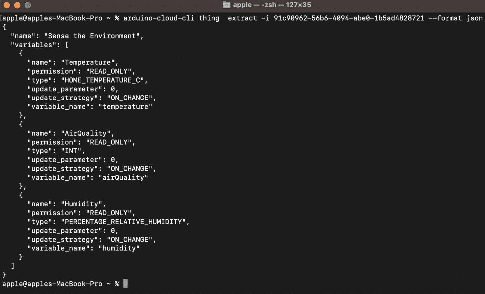

图 13.7 – 提取实体模板

我们的实体模板显示了有关云变量的所有信息。复制文本并将其保存到文件中，该文件将在下一节用于实体创建。

## 创建实体

在提取了实体模板之后，我们现在将开始创建实体。有关实体创建的文档可以在[`docs.arduino.cc/arduino-cloud/getting-started/arduino-cloud-cli#create-things`](https://docs.arduino.cc/arduino-cloud/getting-started/arduino-cloud-cli#create-things)找到。以下为实体创建命令的语法，该命令接受两个参数。首先，它将接受名称，其次，它将接受用于实体创建的模板文件名，该文件名包含我们在上一节中保存的 JSON 格式的实体模板：

```cpp
arduino-cloud-cli thing create --name <thingName> --template <template.(json|yaml)>
```

在这里，我已提供了一个实体名称，`EnvSense101`，在上一节中，我将 JSON 模板保存到了名为`EnvSenseTemplate.json`的文件中。然后，我们使用`-n`参数提供名称，使用`-t`参数提供模板文件：

```cpp
arduino-cloud-cli thing create -n EnvSense101 -t EnvSenseTemplate.json
```

执行前面的命令后，你将获得以下成功创建实体的输出（*图 13.8*）。

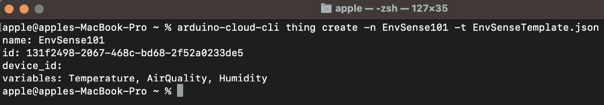

图 13.8 – 使用 arduino-cloud-cli 创建设备

创建设备后，终端将显示设备名称、ID、设备 ID（目前为空，但在接下来的章节中，我们将将与该设备关联的设备与该设备关联），以及变量名称。

在本小节中，我们使用命令行在 Arduino IoT 云中创建了一个设备。在下一节中，我们将探讨如何克隆设备以进行批量创建。

## 克隆设备

从模板创建设备后，我们现在将探讨如何使用克隆操作进行大规模部署。有关设备克隆的文档可在[`docs.arduino.cc/arduino-cloud/getting-started/arduino-cloud-cli#clone-things`](https://docs.arduino.cc/arduino-cloud/getting-started/arduino-cloud-cli#clone-things)找到。以下为`thing clone`命令的语法，它将接受两个参数。首先，它将接受一个名称，其次，它将接受一个设备 ID：

```cpp
arduino-cloud-cli thing clone --name <thingName> --clone-id <thingToCloneID>
```

在这里，我提供了一个设备名称，`EnvSense102`，在上一节中，我们创建了该设备，因此我可以从终端获取其 ID，如图*图 13.8*所示（在命令行中使用您自己的设备 ID）。然后，使用`-n`参数提供名称，使用`-c`参数提供设备 ID：

```cpp
arduino-cloud-cli thing clone -n EnvSense102 -c 131f2498-2067-468c-bd68-2f52a0233de5
```

执行上述命令后，您将获得以下输出以成功克隆设备（*图 13.9*）。


图 13.9 – 使用 arduino-cloud-cli 进行设备克隆

这是 Arduino Cloud CLI 成功克隆设备后的输出。克隆设备后，终端将显示设备名称、ID、设备 ID（目前为空，但在接下来的章节中，我们将将与该设备关联的设备与该设备关联），以及变量名称。您可以看到，仅使用`clone`命令就可以轻松创建数百个设备。在这里，您只需创建一个批处理脚本，通过使用`for`循环只更改设备名称，就可以在几分钟内创建数百个设备。

在本小节中，我们学习了如何使用命令行在 Arduino IoT 云中克隆设备。在下一节中，我们将探讨如何列出设备。

## 列出设备

在本节中，我们将列出所有设备。有关列出设备的文档可在[`docs.arduino.cc/arduino-cloud/getting-started/arduino-cloud-cli#list-things`](https://docs.arduino.cc/arduino-cloud/getting-started/arduino-cloud-cli#list-things)找到。以下是一个列出所有设备的非常简单的命令：

```cpp
arduino-cloud-cli thing list
```

执行上述命令后，我们将看到设备的完整列表，如图下所示。

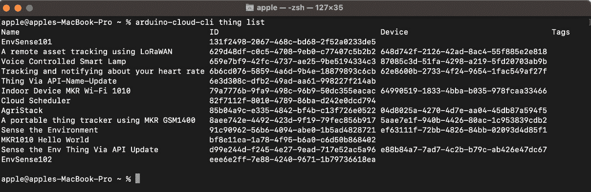

图 13.10 – 设备列表命令

在输出中，我们可以看到 Thing 名称、ID、设备和标签。再次强调，ID 非常重要，因为它将在以下命令中用于 Thing 删除，以及标签创建和删除。在前面的章节中，我们也使用了 ID 进行 Thing 模板提取和创建，以及 Thing 克隆。

Arduino Cloud CLI 还提供了不同的参数，以便在终端上获取更详细的输出，例如变量列表以及 Thing 列表。我们可以将 `-s` 参数附加到 Thing 上，也可以通过提供设备 ID 来列出 Thing，还可以通过提供 Thing ID 来列出一系列的 Thing。在这里，我想探讨如何获取变量列表以及 Thing。以下是一个列出云变量的简单命令：

```cpp
arduino-cloud-cli thing list -s
```

执行前面的命令后，你将看到 *图 13.11* 中所示的输出。

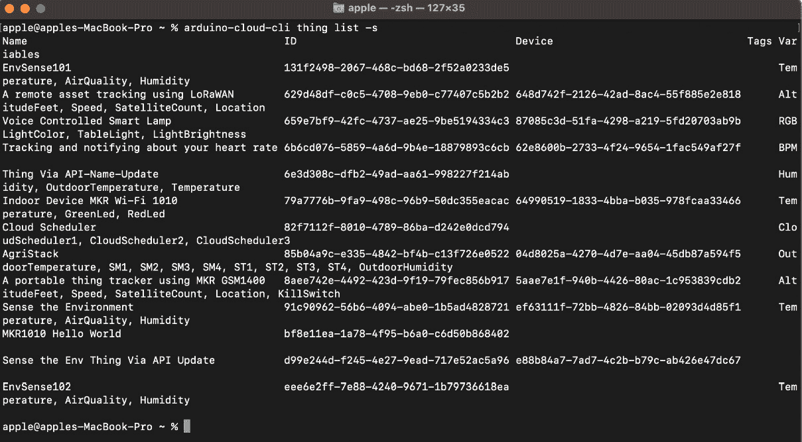

图 13.11 – 带变量的 thing 列表命令

在这里，你可以看到所有云变量以及 Thing 名称，但看起来有点复杂。现在，我们将尝试列出带有云变量的单个 Thing。以下为列出带有云变量的 Thing 的命令语法。它将接受两个参数作为输入 – 一个 Thing ID 和一个 `-s` 参数：

```cpp
arduino-cloud-cli thing list -i eee6e2ff-7e88-4240-9671-1b79736618ea -s
```

执行前面的命令，你将看到 *图 13.12* 中所示的完整且可读的输出。

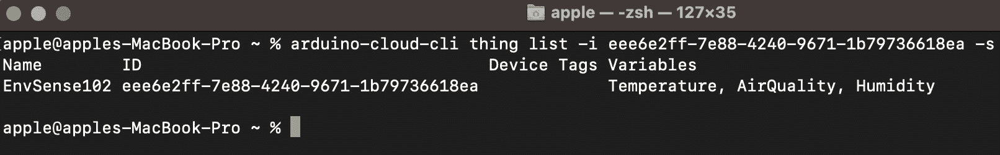

图 13.12 – 使用云变量显示单个 Thing

现在，是时候探索如何使用设备 ID 来查找一个 Thing。以下是一个简单的命令，用于根据设备 ID 获取一个 Thing：

```cpp
arduino-cloud-cli thing list -d ef63111f-72bb-4826-84bb-02093d4d85f1 -s
```

执行前面的命令后，我们将使用设备 ID 获取特定的 Thing 数据，以及其云变量，正如我们在命令中使用了 `-s` 参数（如 *图 13.13* 所示）。

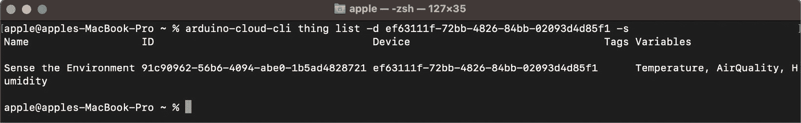

图 13.13 – 基于设备 ID 显示单个 Thing，包含云变量

在本小节中，我们探讨了如何使用不同的参数来列出 Thing。在下一个小节中，我们将探讨如何删除一个 Thing。

## 删除一个 Thing

在本节中，我们将探讨如何使用 Thing ID 删除一个 Thing。有关删除 Thing 的文档可在 [`docs.arduino.cc/arduino-cloud/getting-started/arduino-cloud-cli#delete-things`](https://docs.arduino.cc/arduino-cloud/getting-started/arduino-cloud-cli#delete-things) 查找。以下为删除 Thing 的命令语法：

```cpp
arduino-cloud-cli device delete --id <deviceID>
```

根据命令语法，我们需要一个 Thing ID 用于删除。你可以通过使用 `thing list` 命令来获取 Thing ID：

```cpp
arduino-cloud-cli thing delete -i eee6e2ff-7e88-4240-9671-1b79736618ea
```

在设备成功删除后，你将不会看到错误消息；否则，你将在屏幕上得到一个 `401` 错误消息。

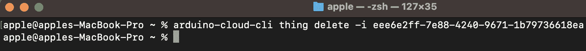

图 13.14 – Thing 删除命令

*图 13.14* 展示了 Thing 删除的完整命令，屏幕上没有错误，这意味着 Thing 已成功删除。在本小节中，我们讨论了 `delete` 命令，在接下来的小节中，我们将探讨如何将设备与 Thing 关联。

## 将设备与 Thing 关联

在前面的 Thing 小节中，我们提取了 Thing 模板，从该模板创建了 Thing，并也执行了 Thing 克隆操作。然而，在整个过程中，我们没有将设备与 Thing 关联，没有设备，Thing 只是一个空 JAR 文件，无法执行任何操作。

在本小节中，我们将探讨如何通过使用设备 ID 和 Thing ID 来将设备与 Thing 相关联。有关将设备与 Thing 关联的文档可在 [`docs.arduino.cc/arduino-cloud/getting-started/arduino-cloud-cli#bind-thing-to-device`](https://docs.arduino.cc/arduino-cloud/getting-started/arduino-cloud-cli#bind-thing-to-device) 查找。以下是在 Arduino IoT Cloud 中将设备与 Thing 关联的简单命令语法：

```cpp
arduino-cloud-cli thing bind --id <thingID> --device-id <deviceID>
```

这里，你可以使用 `arduino-cloud-cli device list` 命令获取特定的设备 ID，以及使用 `arduino-cloud-cli` `thing list` 获取 Thing ID：

```cpp
arduino-cloud-cli thing bind -i 131f2498-2067-468c-bd68-2f52a0233de5 -d cda148e4-b011-459a-95fd-a7510c9601c2
```

在前面的命令中，我们通过 `-i` 参数分配了一个 Thing ID，并通过 `-d` 参数分配了一个设备 ID。执行前面的命令，你将看到 *图 13.15* 中所示的输出。

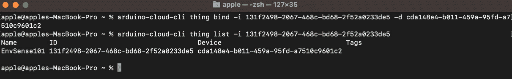

图 13.15 – 使用 Thing 进行设备绑定

*图 13.15* 展示了一个设备成功与 Thing 绑定的情况。为了确认，我们使用了带有 `-i` 参数的 `thing list` 命令来验证设备 ID。在命令以及 `thing list` 输出中，设备 ID 是相同的。

在本小节中，我们探讨了如何将/关联设备与 Thing。在下一小节中，我们将讨论如何为 Thing 分配和移除标签。

## 标记和取消标记 Thing

在本节中，我们将探讨如何使用 Thing ID 来标记和取消标记 Thing。有关标记 Thing 的文档可在 [`docs.arduino.cc/arduino-cloud/getting-started/arduino-cloud-cli#tag-a-thing`](https://docs.arduino.cc/arduino-cloud/getting-started/arduino-cloud-cli#tag-a-thing) 查找，而对于取消标记 Thing，文档可在 [`docs.arduino.cc/arduino-cloud/getting-started/arduino-cloud-cli#untag-a-thing`](https://docs.arduino.cc/arduino-cloud/getting-started/arduino-cloud-cli#untag-a-thing) 查找。以下是为 Thing 标记的命令语法：

```cpp
arduino-cloud-cli thing create-tags --id <thingID> --tags <key0>=<value0>,<key1>=<value1>
```

以下是不标记 Thing 的命令语法：

```cpp
arduino-cloud-cli thing delete-tags --id <thingID> --keys <key0>,<key1>
```

你可能会质疑给一个事物分配标签的必要性。考虑以下场景。你有一个适用于仓库监控的多功能产品，并且已经在多个组织和这些组织内的不同房间中部署了该产品。当尝试将组织的名称和位置直接输入到**设备名称**字段时，会遇到挑战，这可能会相当繁琐。在这种情况下，通过使用标签，可以提供一个更有效的解决方案。标签可以无限制地应用，就像我们之前为设备建立标签时一样。每个标签由两个部分组成：一个键和一个相应的值。

因此，在以下示例中，我们将附加两个标签——一个用于组织名称，另一个用于位置。使用`thing list`命令选择事物 ID 来附加标签。以下是将标签附加到事物的命令：

```cpp
arduino-cloud-cli thing create-tags -i 131f2498-2067-468c-bd68-2f52a0233de5 --tags Org=ASNAGroup,Location=MainUnit
```

执行前面的命令后，你可以使用`thing list`命令来验证标签，如图*图 13.16*所示。

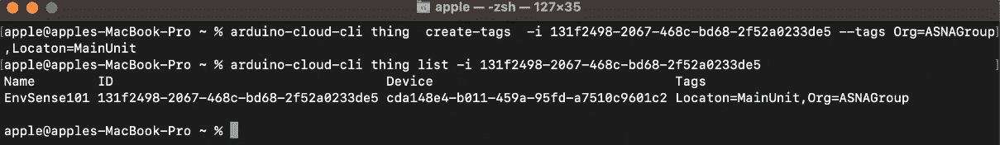

图 13.16 – 为事物分配标签

*图 13.16*显示了用于为事物分配标签的完整命令，并且它还清楚地显示了用于验证标签的`thing list`命令。

现在，我们来探讨如何从事物中移除标签。之前，我们看到了从事物中取消标签的语法。以下是将位置标签从特定事物中移除的完整命令：

```cpp
arduino-cloud-cli thing delete-tags -i 131f2498-2067-468c-bd68-2f52a0233de5 -k Location
```

执行前面的命令后，你可以使用`thing list`命令来验证标签，如图*图 13.16*所示。

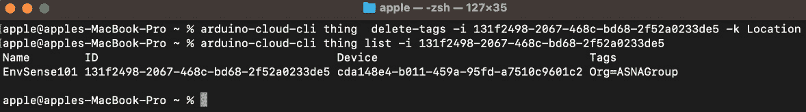

图 13.17 – 从事物中删除标签

*图 13.17*显示了用于从事物中删除标签的完整命令，并且它还清楚地显示了用于验证标签的`thing list`命令。

在这里，命令略有不同，因为我们使用了`delete-tags`和`-k`来指定标签键。如果你想删除多个标签，那么使用逗号来分隔键。在下一节中，我们将探讨如何使用 Arduino Cloud CLI 与仪表板一起工作。

# 构建仪表板 – 通过命令行释放潜力

仪表板是 Arduino IoT Cloud 中与**数据可视化**最重要的组成部分。在 Arduino Cloud CLI 中，我们有针对仪表板的特定命令来执行操作，例如从现有仪表板中提取模板、查看仪表板列表、删除仪表板以及从提取的模板中创建仪表板。首先，我们将从仪表板模板提取开始。

## 从仪表板中提取模板

在 Arduino Cloud CLI 中，我们处理命令并提供不同的参数以执行各种操作。因此，通过命令行创建新的仪表盘是困难的，因为它会使指导 Arduino IoT Cloud 关于小部件以及通过命令将这些小部件与云变量关联变得更加复杂。

为了解决这个问题，Arduino 团队引入了从仪表盘中提取模板的概念。例如，如果您想部署数百个环境监测节点，通过 Arduino 图形用户界面创建数百个仪表盘是困难的。创建包含有关仪表盘所有信息的长命令也很困难。因此，Arduino 引入了模板提取技术。首先，我们将通过 Arduino 图形用户界面创建仪表盘，然后我们将通过命令行提取其模板。然后，使用模板，我们将在 Arduino IoT Cloud 中通过命令行创建仪表盘，因为 Arduino Cloud CLI 不允许您从头创建仪表盘。仪表盘模板提取的官方文档可在 [`docs.arduino.cc/arduino-cloud/getting-started/arduino-cloud-cli#extract-dashboard-template`](https://docs.arduino.cc/arduino-cloud/getting-started/arduino-cloud-cli#extract-dashboard-template) 查找。

下面的示例显示了模板提取的命令语法。使用此命令，我们需要提供一个仪表盘 ID，该命令将获取仪表盘的模板。然后，我们需要提供模板文件的格式 – 要么是 JSON，要么是 YAML：

```cpp
arduino-cloud-cli dashboard extract --id <dashboardID> --format <json|yaml>
```

对于仪表盘 ID，您可以访问 Arduino IoT Cloud 以找到它，或者参考即将到来的小节，我们将向您展示如何列出仪表盘，这将提供它们的名称、ID 等信息。现在，我们将指定格式；我们希望模板输出为 JSON 格式，所以我在这里使用了 JSON：

```cpp
arduino-cloud-cli dashboard  extract -i f00aaaab-7faa-4ba6-bdd7-814377f296ba --format json
```

执行命令后，我们将在屏幕上以 JSON 格式获得模板输出，如图 *图 13**.18* 所示。

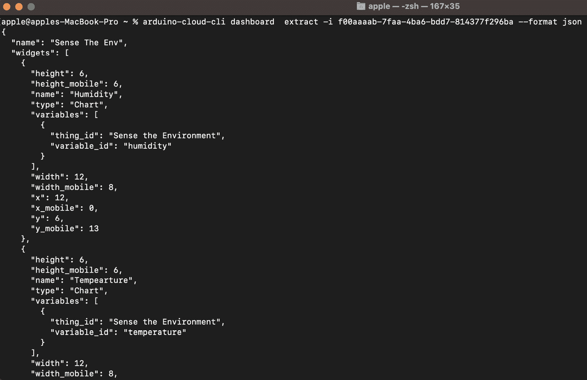

图 13.18 – 提取仪表盘模板

*图 13**.18* 展示了屏幕上的部分输出。我们有一个 JSON 格式的仪表盘模板，它显示了有关小部件及其配置的所有信息，包括 `thing_id` 和 `variable_id`。复制 JSON 格式的输出并将其保存到文件中，该文件将在下一节中用于仪表盘创建。

重要提示

在 Arduino Cloud CLI 中提取仪表盘时存在一个错误，因为它在 `thing_id` 值中显示的是事物名称而不是事物 ID。因此，您需要用事物 ID 替换文本；否则，在执行仪表盘创建命令时将发生错误。

在本小节中，我们探讨了如何从现有仪表盘中提取模板。在下一小节中，我们将探讨如何列出仪表盘。

## 列出仪表盘

在本节中，我们将列出所有仪表板。有关列出仪表板的文档可在[`docs.arduino.cc/arduino-cloud/getting-started/arduino-cloud-cli#list-dashboards`](https://docs.arduino.cc/arduino-cloud/getting-started/arduino-cloud-cli#list-dashboards)找到。以下是一个列出所有仪表板的非常简单的命令：

```cpp
arduino-cloud-cli dashboard list
```

执行上述命令后，我们将看到仪表板的完整列表，如图下所示。

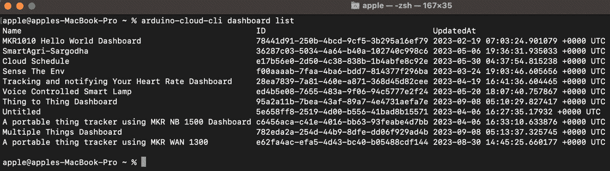

图 13.19 – 仪表板列表命令

在*图 13.19*所示的输出中，我们可以看到仪表板的**名称**、**ID**和**更新时间**详情。在这里，**ID**非常重要，因为它将在以下命令中用于删除仪表板。它还有助于仪表板模板提取，因为我们使用仪表板 ID 在上一个小节中提取了模板。

在本小节中，我们探讨了如何使用一个非常简单的命令列出仪表板。在下一小节中，我们将探讨如何使用仪表板 ID 删除仪表板。

## 删除仪表板

在本小节中，我们将探讨如何使用仪表板 ID 删除仪表板。有关删除仪表板的文档可在[`docs.arduino.cc/arduino-cloud/getting-started/arduino-cloud-cli#delete-dashboards`](https://docs.arduino.cc/arduino-cloud/getting-started/arduino-cloud-cli#delete-dashboards)找到。以下为删除仪表板的命令语法：

```cpp
arduino-cloud-cli dashboard delete --id <dashboardID>
```

根据上述命令语法，我们需要提供一个仪表板 ID 进行删除。您可以通过使用`dashboard` `list`命令来获取仪表板 ID：

```cpp
arduino-cloud-cli dashboard delete -i 5e658ff8-2519-4d00-b556-41bad8b15571
```

在成功删除设备后，您将不会看到错误消息；否则，您将在屏幕上收到一个`401 错误`消息。

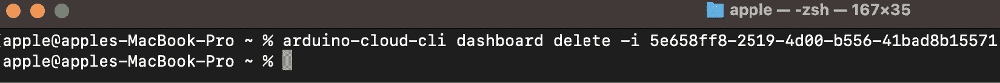

图 13.20 – 仪表板删除命令

*图 13.20*显示了删除仪表板的完整命令，屏幕上没有错误，这意味着仪表板已成功删除。在本小节中，我们讨论了`delete`命令。在下一小节中，我们将探讨如何使用模板创建仪表板，该模板我们在本节的第一小节中提取。

## 创建仪表板

在提取仪表板模板后，我们可以开始创建仪表板。有关创建仪表板的文档可在[`docs.arduino.cc/arduino-cloud/getting-started/arduino-cloud-cli#create-dashboard`](https://docs.arduino.cc/arduino-cloud/getting-started/arduino-cloud-cli#create-dashboard)找到。以下为创建仪表板命令的语法，该命令接受两个参数。首先，它接受仪表板的名称，其次，它接受用于创建仪表板的模板文件名，该文件名包含我们在上一节中保存的 JSON 格式的仪表板模板：

```cpp
arduino-cloud-cli dashboard create --name <dashboardName> --template <template.(json|yaml)> --override <thing-0>=<actualThingID>,<thing-1>=<otherActualThingID>
```

在这里，我提供了设备名称 `EnvSense101`，并在上一节中，我将 JSON 模板保存为名为 `EnvSenseTemplate.json` 的文件。然后，我们使用 `-n` 参数提供名称，并使用 `-t` 参数提供模板文件：

```cpp
arduino-cloud-cli dashboard create -n EnvSensedashboard101 -t EnvSensedashboard.json
```

执行前面的命令后，您将获得以下输出以成功创建仪表板 (*图 13*.21*)：

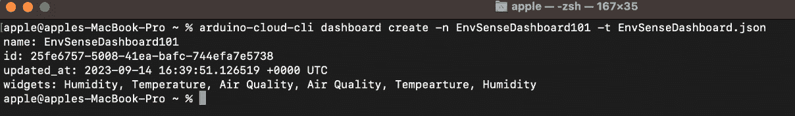

图 13.21 – 使用 arduino-cloud-cli 创建仪表板

*图 13*.21* 显示了 Arduino Cloud CLI 成功创建仪表板的命令和输出。创建仪表板后，终端显示了仪表板的 **名称**、**ID**、**更新时间**和 **小部件**详细信息。

重要提示

Arduino Cloud CLI 在仪表板提取中存在一个错误，因为它在 `thing_id` 值中显示的是设备名称而不是设备 ID。因此，您需要将文本替换为设备 ID；否则，在创建仪表板命令执行过程中将发生错误。

在本小节中，我们使用命令行在 Arduino IoT Cloud 中创建了一个仪表板。在下一节中，我们将探讨如何通过 CLI 进行 OTA 更新。

# OTA 管理

在 *第十一章* 中，我们探讨了 OTA 是什么以及我们如何轻松使用此功能向远程设备发送更新。在第十一章中，我们使用了图形用户界面，这对于单个设备来说是一个不错的选择。然而，当我们有大量设备需要发送 OTA 时，情况就变得复杂了，因为我们需要逐个处理不同的设备来发送 OTA 更新，这非常耗时，在企业层面也是一个困难的操作。

正因如此，Arduino 团队为 Arduino Cloud CLI 创建了命令，以自动向单个或多个设备发送 OTA 更新，以最大限度地减少复杂性和操作时间。因此，首先，我们将探讨如何使用 Arduino IDE 导出编译后的二进制文件，然后我们将使用设备的 ID 向其发送 OTA 更新。有关官方文档和更新，请访问 [`docs.arduino.cc/arduino-cloud/getting-started/arduino-cloud-cli#ota-over-the-air`](https://docs.arduino.cc/arduino-cloud/getting-started/arduino-cloud-cli#ota-over-the-air)。

## 使用 Arduino IDE 导出二进制文件

在本节中，我们将使用 Arduino IDE 生成程序的编译后的二进制文件，用于设备的 OTA。首先，从 Arduino IoT Cloud 下载您的设备代码。然后，提取下载的代码并在 Arduino IDE 中打开它。在 Arduino IDE 中选择开发板，然后点击 **草图** | **导出编译后的二进制文件**，如图 *图 13*.22* 所示。

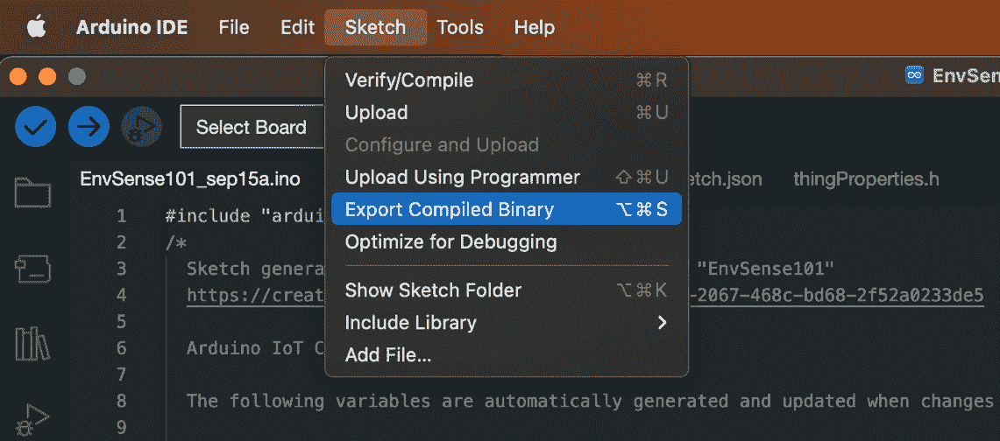

图 13.22 – 在 Arduino IDE 中导出编译后的二进制文件

在您的 `sketch` 目录下的 `build` 目录中点击，您会找到由 Arduino 编译器生成的许多文件。您需要选择以 `ino.bin` 扩展名结尾的文件，如图 *图 13.23* 所示。

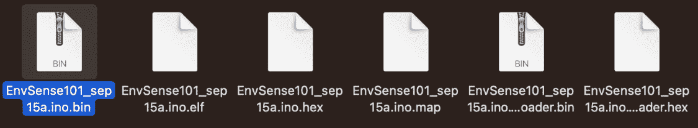

图 13.23 – 草图构建文件

在本节中，我们探讨了如何使用 Arduino IDE 生成草图的构建文件。在下一个小节中，我们将通过命令行将这个构建文件发送到设备进行 OTA 上传。

## 将草图上传到设备

Arduino Cloud CLI 提供了一个单独的上传选项以及一个大规模部署选项。这是官方文档链接：[`docs.arduino.cc/arduino-cloud/getting-started/arduino-cloud-cli#upload`](https://docs.arduino.cc/arduino-cloud/getting-started/arduino-cloud-cli#upload)。您可以访问页面获取最新更新和新闻。首先，我们将探讨如何向单个设备发送更新。以下是一个单设备 OTA 操作的简单命令语法：

```cpp
arduino-cloud-cli ota upload --device-id <deviceID> --file <sketch-file.ino.bin>
```

在这里，我们需要指定设备 ID 和文件名，包括其路径，这可以通过以下命令完成：

```cpp
arduino-cloud-cli ota upload -d cda148e4-b011-459a-95fd-a7510c9601c2  --file EnvSense101_sep15a.ino.bin
```

命令成功执行后，您将看到一个没有错误且为空的终端，如图 *图 13.24* 所示。然而，如果设备不可用或出现任何其他问题，则详细信息将打印在终端上。

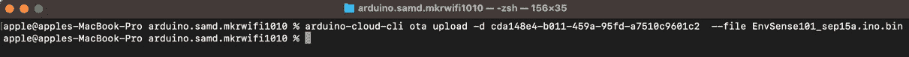

图 13.24 – OTA 上传命令执行成功

*图 13.24* 显示我们的上传已经成功完成，没有任何错误。上传文件需要一些时间，取决于您的网络速度以及您的草图大小，但您需要等待直到最终输出。永远不要中断上传过程。

然后，在 OTA 中我们有大规模部署选项，您可以通过使用 FQBN 以及标签来上传固件到多个设备。以下是一个使用 FQBN 的大规模部署简单命令，您也可以分配特定的设备 ID：

```cpp
arduino-cloud-cli ota mass-upload --fqbn <deviceFQBN> --device-ids <deviceIDs> --file <sketch-file.ino.bin>
```

然而，使用这个特定的命令，我将只使用 `fqbn` 将更新发送到所有相同的设备类型：

```cpp
arduino-cloud-cli ota mass-upload -b arduino:samd:mkrwifi1010 --file EnvSense101_sep15a.ino.bin
```

您还可以通过添加标签来探索 OTA 大规模上传，以将更新发送到特定的设备组。在本节中，我们探讨了如何使用 Arduino IDE 构建草图的二进制文件，以及如何使用 OTA 命令上传更新。

# 接下来是什么？

在玩了一些命令之后，现在是时候进行更多实验，以便您可以将所学知识应用到新的场景中，并学习新知识。我们探讨了 Arduino 云 CLI 上可用的完整命令列表。然而，您可以查看 Arduino 的官方网站以获取最新更新和新闻，保持对最新功能的了解。现在，轮到您使用 Arduino 云 CLI 创建批处理脚本来自动化您的操作了，例如在 Arduino 物联网云中批量添加设备，使用模板批量创建事物，将设备与事物绑定，以及从仪表盘模板为每个事物创建仪表盘。

# 摘要

在这一章中，我们涵盖了在 Arduino 云 CLI 上官方提供的所有命令类型。首先，我们探讨了与设备相关的命令，包括设备创建、列出设备、删除、标记和取消标记。然后，我们探讨了如何与事物一起工作；在该部分，我们从模板提取开始，然后使用模板创建了一个事物。我们还探讨了如何克隆一个事物，如何将设备与事物绑定，等等。在倒数第二个部分，我们玩了一些仪表盘命令，在最后一部分，我们探讨了如何通过命令行以不同方式发送更新到设备，从而利用 OTA 命令为我们带来好处。

这一章特别设计为面向希望使用 Arduino 云 CLI 来优化日常任务的后端开发人员和管理员，通过使用终端命令而不是图形用户界面。这一章将帮助他们使用 CLI 与 Arduino 物联网云进行交互。它还将帮助他们创建自定义脚本，自动化他们的日常任务。

以下章节是本书的最后一章，在这一章中，我们将探讨针对教育和企业组织的不同 Arduino 物联网云计划。我们还将探讨工业物联网硬件设备和针对企业组织特别提供的不同类型的 Arduino 物联网云服务。这一章将为您提供一个全面概述，说明如何将您的产品从小规模扩展到企业级。
