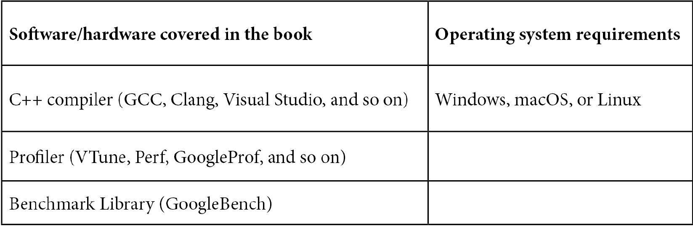

# 前言

高性能编程艺术正在复苏。我开始编程的时候，程序员必须知道每一位数据的去向（有时确实如此——通过前面板上的开关）。现在，计算机已经具有足够的能力来完成日常任务。当然，总是有一些领域永远不够计算能力。但大多数程序员可以写出效率低下的代码。顺便说一句，这并不是一件坏事：摆脱了性能约束，程序员可以专注于以其他方式改进代码。

因此，这本书首先解释的是为什么越来越多的程序员被迫再次关注性能和效率。这将为整本书设定基调，因为它定义了我们在后续章节中将使用的方法论：关于性能的知识最终必须来自测量，并且每个与性能相关的声明都必须有数据支持。

有五个组成部分，五个元素共同决定了程序的性能。首先，我们深入探讨细节，探索一切性能的低级基础：我们的计算硬件（没有开关——承诺，那些日子已经过去了）。从个别组件——处理器和内存——我们逐步过渡到多处理器计算系统。在这一过程中，我们了解了内存模型、数据共享的成本，甚至无锁编程。

高性能编程的第二个组成部分是对编程语言的有效使用。在这一点上，本书变得更加具体于 C++（其他语言有它们自己的*喜爱*的低效性）。紧随其后的是第三个元素，即帮助编译器改进程序性能的技能。

第四个组成部分是设计。可以说，这应该是第一个：如果设计没有将性能作为明确目标之一，几乎不可能事后再添加良好的性能。然而，我们最后学习设计性能，因为这是一个高层概念，它汇集了我们之前所学到的所有知识。

高性能编程的最终第五要素是你，读者。你的知识和技能最终将决定结果。为了帮助你学习，本书包含许多示例，可用于实践探索和自学。学习在你翻过最后一页后并不需要停止。

# 这本书是为谁而写的？

这本书适用于有经验的开发人员和程序员，他们在性能关键项目上工作，并希望学习改进其代码性能的不同技术。属于计算机建模、算法交易、游戏、生物信息学、基于物理的模拟、计算机辅助设计、计算基因组学或计算流体动力学社区的程序员可以从本书中学习各种技术，并将其应用于他们的工作领域。

尽管本书使用 C++语言，但书中演示的概念可以轻松转移或应用于其他编译语言，如 C、C#、Java、Rust、Go 等。

# 这本书涵盖了什么

*第一章*，*性能和并发性简介*，讨论了我们关心程序性能的原因，特别是关于为什么良好性能不是*自然而然*发生的原因。我们了解到，为了实现最佳性能，甚至是足够的性能，重要的是了解影响性能的不同因素以及程序特定行为的原因，无论是快速还是慢速执行。

第二章《性能测量》是关于测量的。性能通常是非直观的，所有涉及效率的决策，从设计选择到优化，都应该由可靠的数据来指导。本章描述了不同类型的性能测量，解释了它们的区别以及何时应该使用它们，并教授了如何在不同情况下正确地测量性能。

第三章《CPU 架构、资源和性能影响》帮助我们开始研究硬件以及如何有效地使用它以实现最佳性能。本章致力于学习 CPU 资源和能力，以及最佳的使用方式，未能充分利用 CPU 资源的更常见原因，以及如何解决这些问题。

第四章《内存架构和性能》帮助我们了解现代内存架构，它们固有的弱点以及对抗或至少隐藏这些弱点的方法。对于许多程序来说，性能完全取决于程序员是否利用了旨在提高内存性能的硬件功能，本章教授了必要的技能来做到这一点。

第五章《线程、内存和并发》帮助我们继续研究内存系统及其对性能的影响，但现在我们将研究扩展到多核系统和多线程程序的领域。事实证明，内存，已经是性能的“长杆”，在添加并发时会更加成为问题。虽然硬件施加的基本限制无法克服，但大多数程序甚至远未达到这些限制，熟练的程序员有很大的空间来提高他们代码的效率；本章为读者提供了必要的知识和工具来做到这一点。

第六章《并发和性能》帮助您了解开发高性能并发算法和数据结构以用于线程安全程序。一方面，为了充分利用并发，我们必须对问题和解决方案策略进行高层次的考虑：数据组织、工作分区，有时甚至解决方案的定义都会对程序的性能产生重大影响。另一方面，正如我们在上一章中所看到的，性能受到低级因素的极大影响，比如数据在缓存中的排列，甚至最佳设计也可能被糟糕的实现所破坏。

第七章《并发数据结构》解释了并发程序中数据结构的性质，以及当数据结构在多线程上下文中使用时，“栈”和“队列”等熟悉的数据结构的含义会有所不同。

第八章《C++中的并发》描述了最近在 C++17 和 C++20 标准中添加的并发编程功能。虽然现在谈论使用这些功能实现最佳性能的最佳实践还为时过早，但我们可以描述它们的功能，以及当前编译器支持的情况。

第九章《高性能 C++》将我们的注意力从硬件资源的最佳利用转移到了特定编程语言的最佳应用。虽然我们迄今为止学到的一切都可以应用于任何语言的任何程序，通常都很简单明了，但本章涉及了 C++的特性和怪癖。读者将了解 C++语言的哪些特性可能会导致性能问题，以及如何避免这些问题。本章还将涵盖非常重要的编译器优化问题，以及程序员如何帮助编译器生成更高效的代码。

第十章《C++编译器优化》涵盖了编译器优化以及程序员如何帮助编译器生成更高效的代码。

第十一章《未定义行为和性能》有双重重点。一方面，它解释了程序员在试图从其代码中挤取最大性能时经常忽视的未定义行为的危险。另一方面，它解释了我们如何利用未定义行为来提高性能，以及如何正确指定和记录这种情况。总的来说，与通常的“任何事情都可能发生”相比，本章提供了一种更为常见但更相关的理解未定义行为的方式。

第十二章《性能设计》回顾了本书中学到的所有与性能相关的因素和特性，并探讨了我们所获得的知识和理解应该如何影响我们在开发新软件系统或重新架构现有系统时所做的设计决策。

# 要充分利用本书

除了特定于 C++效率的章节外，本书不依赖于任何神秘的 C++知识。所有示例都是用 C++编写的，但关于硬件性能、高效数据结构和性能设计的教训适用于任何编程语言。要跟随这些示例，您至少需要具备中级的 C++知识。



每一章都提到了编译和执行示例所需的额外软件（如果有的话）。在大多数情况下，任何现代 C++编译器都可以与这些示例一起使用，除了第八章《C++并发》，它需要最新版本才能通过协程部分工作。

**如果您使用的是本书的数字版本，我们建议您自己输入代码，或者从书的 GitHub 存储库中访问代码（下一节中提供了链接）。这样做将帮助您避免与复制和粘贴代码相关的任何潜在错误。**

# 下载示例代码文件

您可以从 GitHub 上下载本书的示例代码文件，链接为[`github.com/PacktPublishing/The-Art-of-Writing-Efficient-Programs`](https://github.com/PacktPublishing/The-Art-of-Writing-Efficient-Programs)。如果代码有更新，将在 GitHub 存储库中进行更新。

我们还提供了来自我们丰富书籍和视频目录的其他代码包，可在[`github.com/PacktPublishing/`](https://github.com/PacktPublishing/)上找到。快去看看吧！

# 下载彩色图像

我们还提供了一个 PDF 文件，其中包含本书中使用的屏幕截图和图表的彩色图像。您可以在这里下载：`static.packt-cdn.com/downloads/9781800208117_ColorImages.pdf`。

# 使用的约定

本书中使用了许多文本约定。

`文本中的代码`：表示文本中的代码词、数据库表名、文件夹名、文件名、文件扩展名、路径名、虚拟 URL、用户输入和 Twitter 用户名。例如："值得注意的是一个新功能，允许可移植地确定 L1 缓存的缓存行大小，`std::hardware_destructive_interference_size` 和 `std::hardware_constructive_interference_size`。"

代码块设置如下：

```cpp
std::vector<double> v;
… add data to v … 
std::for_each(v.begin(), v.end(),[](double& x){ ++x; });
```

任何命令行输入或输出都是这样写的：

```cpp
Main thread: 140003570591552
Coroutine started on thread: 140003570591552
Main thread done: 140003570591552
Coroutine resumed on thread: 140003570587392
Coroutine done on thread: 140003570587392
```

**粗体**：表示一个新术语、一个重要词或者屏幕上看到的词。例如，菜单或对话框中的词以**粗体**显示。例如："当**CPU1**看到由**CPU0**执行的带释放内存顺序的原子写操作的结果时，可以保证**CPU1**看到的内存状态已经反映了在这个原子操作之前由**CPU0**执行的所有操作。"

提示或重要说明

像这样出现。

