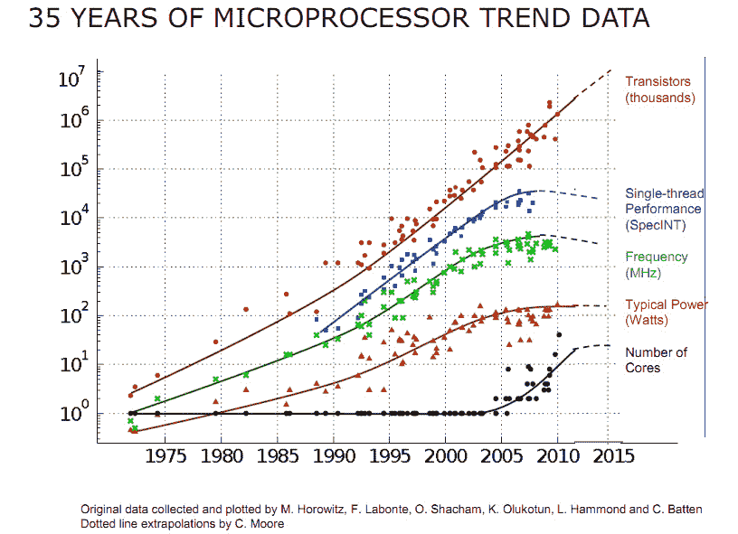
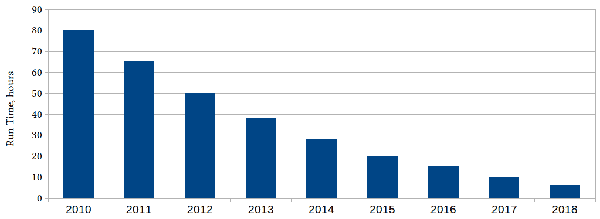
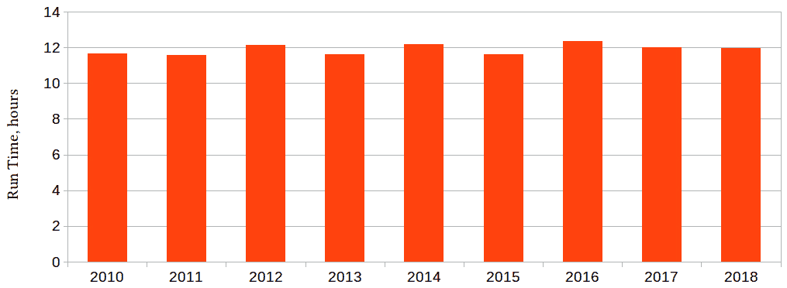
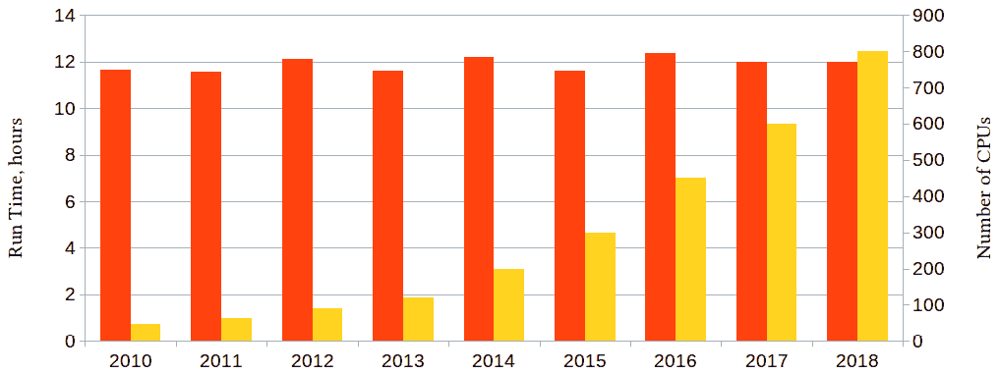
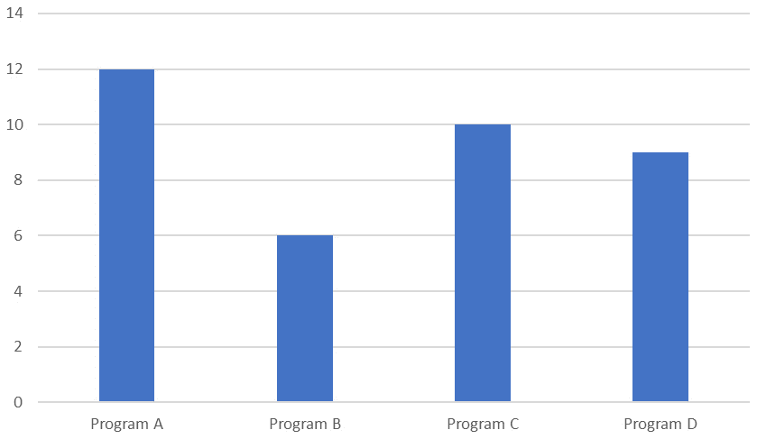
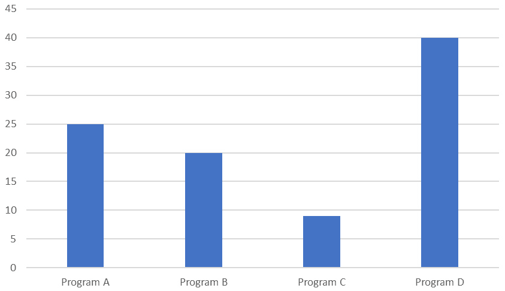
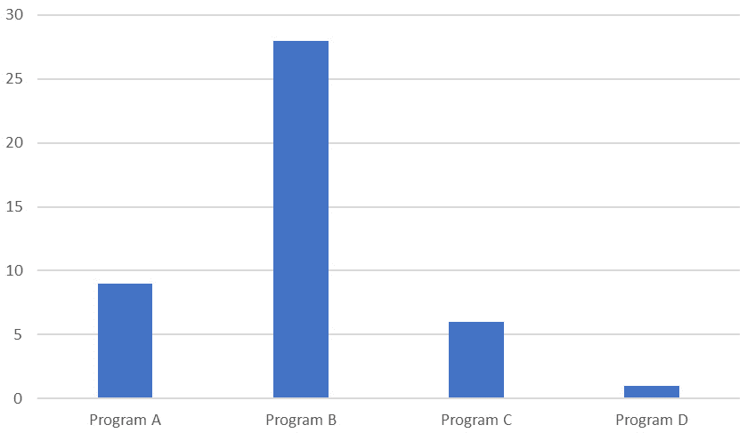

# 第一章：性能和并发简介

动机是学习的关键因素；因此，您必须了解为什么在计算机技术取得了所有进步的情况下，程序员仍然必须努力使其代码获得足够的性能，以及成功需要深刻理解计算硬件、编程语言和编译器能力。本章的目的是解释为什么今天仍然需要这种理解。

本章讨论了我们关心程序性能的原因，特别是关于良好性能并非“自然而然”发生的原因。我们将了解为什么为了实现最佳性能，有时甚至是足够的性能，重要的是要了解影响性能的不同因素，以及程序特定行为的原因，无论是快速执行还是缓慢执行。

在本章中，我们将涵盖以下主要主题：

+   性能为什么重要

+   为什么性能需要程序员的注意？

+   性能是什么意思？

+   如何评估性能

+   学习高性能

# 为什么要关注性能？

在计算机早期，编程是困难的。处理器速度慢，内存有限，编译器原始，没有付出重大努力就无法取得任何成就。程序员必须了解 CPU 的架构，内存的布局，当编译器无法胜任时，关键代码必须用汇编语言编写。

然后情况变得好转。处理器每年都在变得更快，曾经是巨大硬盘容量的数字变成了普通 PC 主存储器的大小，编译器编写者学会了一些技巧来加快程序速度。程序员可以花更多时间解决问题。这反映在编程语言和设计风格上：在更高级的语言和不断发展的设计和编程实践之间，程序员的关注重点从代码中想要表达的内容转移到了如何表达这些内容。

以前的常识，比如 CPU 有多少寄存器以及它们的名称是什么，变得神秘而深奥。曾经，“大型代码库”是指需要用双手才能搬动的卡片组；现在，“大型代码库”是指超出版本控制系统容量的代码库。以前几乎不需要为特定处理器或内存系统编写专门的代码，可移植代码成为了常态。

至于汇编语言，实际上很难超越编译器生成的代码，这对大多数程序员来说是难以企及的任务。对于许多应用程序及其编写者来说，已经有了“足够的性能”，程序员职业的其他方面变得更加重要（明确地说，程序员可以专注于代码的可读性，而不必担心添加一个有意义名称的函数是否会使程序变得无法接受地慢）。

然后，突然间，“性能自行解决”的免费午餐结束了。看似不可阻挡的计算能力不断增长的进展突然停止了。

图 1.1 - 绘制 35 年微处理器演变历程（参见 https://github.com/karlrupp/microprocessor-trend-data 和 https://github.com/karlrupp/microprocessor-trend-data/blob/master/LICENSE.txt）

大约在 2005 年左右，单个 CPU 的计算能力达到了饱和。在很大程度上，这与 CPU 频率直接相关，而 CPU 频率也停止增长。而频率受到多种因素的限制，其中之一是功耗（如果频率趋势保持不变，今天的 CPU 每平方毫米的功率将比将火箭送入太空的大型喷气发动机还要高）。

从前面的图表可以明显看出，不是所有的进展措施在 2005 年停滞不前：单芯片上的晶体管数量不断增加。那么，如果不是让芯片变得更快，他们在做什么呢？答案是双重的，其中一部分由底部曲线揭示：设计师不是让单个处理器变得更大，而是不得不将多个处理器核心放在同一块芯片上。当然，所有这些核心的计算能力随着核心数量的增加而增加，但前提是程序员知道如何使用它们。"伟大的晶体管之谜"的第二部分（所有的晶体管都去哪了？）是它们进入了处理器能力的各种非常先进的增强功能，这些增强功能可以用来提高性能，但同样，只有程序员努力利用它们。

我们刚刚看到的处理器进展的变化通常被认为是并发编程进入主流的原因。但这种变化甚至更加深刻。在本书中，您将了解到，为了获得最佳性能，程序员再次需要了解处理器和内存架构及其相互作用的复杂性。出色的性能不再是“自然而然”发生的。与此同时，我们在编写清晰表达需要完成的任务而不是如何完成的代码方面取得的进展不应该被撤销。我们仍然希望编写可读性强、易于维护的代码，而且（*而且*不是*但是*）我们也希望它高效。

可以肯定的是，对于许多应用程序来说，现代 CPU 仍然具有*足够的性能*，但性能比以前更受关注，这在很大程度上是因为我们刚刚讨论的 CPU 发展的变化，以及因为我们希望在更多的应用程序中进行更多的计算，这些应用程序并不一定能够获得最佳的计算资源（例如，今天的便携式医疗设备可能会内置完整的神经网络）。

幸运的是，我们不必通过在黑暗的存储室里翻阅腐烂的穿孔卡片堆来重新发现一些*失落的性能艺术*。任何时候，仍然存在着困难的问题，短语*计算能力永远不够*对许多程序员来说是真实的。随着计算能力的指数增长，对它的需求也在增加。*极限性能*的艺术在那些需要它的领域中得以保持。在这一点上，一个这样的领域的例子可能是有启发性和有启发性的。

# 为什么性能很重要

要找到一个关于性能关注从未真正减弱的领域的例子，让我们来研究使计算本身成为可能的计算的演变，即用于设计计算机本身的**电子设计自动化**（**EDA**）工具。

如果我们将 2010 年用于设计、模拟或验证特定微芯片的计算，并自那时起每年运行相同的工作负载，我们会看到类似于这样的情况：

图 1.2 - 某个 EDA 计算的处理时间（以小时为单位），随着年份的变化

2010 年需要 80 小时计算的工作，在 2018 年只需要不到 10 小时（甚至今天更少）。这种改进是从哪里来的？有几个来源：部分是计算机变得更快，但也有软件变得更有效率，发明了更好的算法，优化编译器变得更加有效。

不幸的是，我们在 2021 年并没有制造 2010 年版本的微芯片：可以说，随着计算机变得更加强大，制造更新和更好的微芯片变得更加困难。因此，更有趣的问题是，每年制造当年的新微芯片需要多长时间来完成相同的工作：

图 1.3 - 每年最新微芯片的特定设计步骤的运行时间（以小时为单位）

每年实际完成的计算并不相同，但它们都为同一个目的服务，例如*验证芯片是否按预期运行*，对于我们每年制造的最新和最好的芯片。从这张图表中我们可以看到，当前一代最强大的处理器，运行最好的可用工具，每年都需要大致相同的时间来设计和建模下一代处理器。我们保持着自己的位置，但并没有取得任何进展。

但事实甚至比这更糟，上面的图表并没有显示一切。从 2010 年到 2018 年，当年制造的最大处理器可以在一夜之间（大约 12 小时）得到验证，使用的是去年制造的最大处理器的计算机。但我们忘了问*有多少这样的处理器？*好吧，现在是完整的真相：

图 1.4 - 前一图表，标注了每次计算的 CPU 数量

每年，配备着不断增长数量的最新、最强大处理器的最强大计算机，运行着最新的软件版本（经过优化以利用越来越多的处理器并更有效地使用每一个处理器），完成了建造下一年最强大计算机所需的工作，而每年，这项任务都处于几乎不可能的边缘。我们没有掉下这个边缘，这在很大程度上是硬件和软件工程师的成就，前者提供了不断增长的计算能力，后者以最大效率使用它。本书将帮助您学习后者的技能。

我们现在理解了本书的主题的重要性。在我们深入细节之前，进行高层次的概述会有所帮助；可以说是对勘探活动将展开的领域的地图的审查。

# 性能是什么？

我们已经谈论了程序的性能；我们提到了高性能软件。但是当我们说这个词时，我们是什么意思呢？直观地，我们理解高性能程序比性能差的程序更快，但这并不意味着更快的程序总是具有*好*的性能（两个程序可能都性能差）。

我们也提到了高效的程序，但效率和高性能是一回事吗？虽然效率与性能*相关*，但并不完全相同。效率涉及最佳地使用资源而不浪费它们。高效的程序充分利用计算硬件。

一方面，高效的程序不会让可用资源空闲：如果有一个需要完成的计算和一个空闲的处理器，那么该处理器应该执行等待执行的代码。这个想法更深入：处理器内部有许多计算资源，高效的程序试图尽可能同时利用这些资源。另一方面，高效的程序不会浪费资源做不必要的工作：它不会执行不需要完成的计算，不会浪费内存来存储永远不会被使用的数据，不会发送不需要的数据到网络等等。简而言之，高效的程序不会让可用的硬件空闲，也不会做任何不必要的工作。

另一方面，性能总是与某些指标相关。最常见的是“速度”，或者程序有多快。更严格定义这个指标的方式是吞吐量，即程序在给定时间内执行的计算量。通常用于相同目的的反向指标是周转时间，或者计算特定结果需要多长时间。然而，这并不是性能的唯一可能定义。

## 作为吞吐量的性能

让我们考虑四个使用不同实现来计算相同结果的程序。这是所有四个程序的运行时间（单位是相对的；实际数字并不重要，因为我们关心的是相对性能）：

图 1.5 - 相同算法的四种不同实现的运行时间（相对单位）

显然，程序 B 具有最高的性能：它在其他三个程序之前完成了，用了一半的时间来计算与最慢程序相同的结果。在许多情况下，这将是我们选择最佳实现所需的所有数据。

但问题的上下文很重要，我们忽略了该程序是在手机等电池供电设备上运行，功耗也很重要。

## 性能作为功耗

这是四个程序在计算过程中消耗的功率：

图 1.6 - 相同算法的四种不同实现的功耗（相对单位）

尽管花费更长时间来获得结果，程序 C 总体上消耗的功率更少。那么，哪个程序性能最好呢？

同样，这是一个诡计问题，如果不知道完整的上下文。该程序不仅在移动设备上运行，而且执行实时计算：它用于音频处理。这应该更注重实时更快地获得结果，对吗？并不完全是这样。

## 实时应用的性能

实时程序必须始终跟上它正在处理的事件。音频处理器必须特别跟上语音。如果程序可以比人说话的速度快十倍处理音频，那对我们毫无用处，我们可能还不如把注意力转向功耗。

另一方面，如果程序偶尔落后，一些声音甚至单词将被丢弃。这表明实时或速度在一定程度上很重要，但必须以可预测的方式交付。

当然，这也有一个性能指标：延迟尾部。延迟是在我们的情况下数据准备好（录音）和处理完成之间的延迟。我们之前看到的吞吐量指标反映了处理声音的平均时间：如果我们在手机上说话一个小时，音频处理器需要多长时间来完成所有需要做的计算？但在这种情况下真正重要的是，每个声音的每个小计算都按时完成。

在低级别上，计算速度会波动：有时计算会更快完成，有时会花费更长时间。只要平均速度可接受，重要的是罕见的长时间延迟。

延迟尾部指标是计算作为延迟的特定百分位数的，例如，在 95th 百分位数：如果*t*是 95th 百分位数的延迟，那么 95%的所有计算所花费的时间都比*t*少。指标本身是 95th 百分位时间*t*与平均计算时间*t*0 的比率（通常也以百分比表示，因此 95th 百分位数的 30%延迟意味着*t*比*t*0 大 30%）：

图 1.7 - 相同算法的四种不同实现的 95%延迟（百分比）

我们现在看到，**程序 B**比任何其他实现平均计算结果更快，但也提供了最不可预测的运行时间结果，而**程序 D**以前从未突出，却像钟表一样计算，并且每次执行给定的计算几乎需要相同的时间。正如我们已经观察到的，程序 D 还具有最糟糕的功耗。不幸的是，这并不罕见，因为使程序在平均情况下更节能的技术通常具有概率性质：它们大多数时候加快计算速度，但并非每次都是如此。

那么，哪个程序最好？当然，答案取决于应用，甚至在这种情况下可能并不明显。

## 性能取决于上下文

如果这是在大型数据中心运行并需要数天来计算的仿真软件，吞吐量将是关键。在电池供电设备上，功耗通常是最重要的。在更复杂的环境中，比如我们的实时音频处理器，它是多个因素的组合。平均运行时间当然很重要，但只有在变得“足够快”之前才重要。如果听众察觉不到延迟，那么使其更快也没有奖励。延迟尾部很重要：用户讨厌每隔一段时间会有一个词从对话中丢失。一旦延迟足够好，通话质量受到其他因素的限制，进一步改善将带来很少的好处；在这一点上，我们最好节约功耗。

我们现在明白，与效率不同，性能总是针对特定的度量标准定义的，这些度量标准取决于我们正在解决的应用和问题，对于某些度量标准来说，存在“足够好”的概念，当其他度量标准成为前景时。效率，反映了计算资源的利用，是实现良好性能的方式之一，也许是最常见的方式，但不是唯一的方式。

# 评估、估计和预测性能

正如我们刚刚看到的，度量的概念对性能概念至关重要。有了度量，总是隐含着测量的可能性和必要性：如果我们说“我们有一个度量”，那就意味着我们有一种量化和测量某事的方法，而了解度量的值的唯一方法就是测量它。

测量性能的重要性不言而喻。人们常说，性能的第一定律是永远不要猜测性能。本书的下一章专门讨论性能测量、测量工具、如何使用它们以及如何解释结果。

不幸的是，对性能的猜测太过普遍。像“避免在 C++中使用虚函数，它们很慢”这样过于笼统的陈述也是如此。这类陈述的问题不在于它们不精确，即它们没有提及虚函数相对于非虚函数慢多少的度量标准。作为读者的练习，这里有几个可供选择的量化答案：

+   虚函数慢 100%

+   虚函数大约慢 15-20%

+   虚函数几乎没有慢

+   虚函数快 10-20%

+   虚函数慢 100 倍

哪个答案是正确的？如果您选择了其中任何一个答案，恭喜您：您选择了正确答案。没错，每个答案在特定情况和特定上下文中都是正确的（要了解原因，您将不得不等到*第九章*，*高性能 C++*）。

不幸的是，通过接受几乎不可能直觉或猜测性能的真相，我们面临着另一个陷阱：将其作为写出效率低下的代码的借口“以后进行优化”的借口，因为*我们不猜测性能*。虽然这是真的，但后一种最大化可能会走得太远，就像流行的格言*不要过早优化*一样。

性能不能后期添加到程序中，因此在初始设计和开发过程中不应该被忽视。性能考虑和目标在设计阶段有其位置，就像其他设计目标一样。早期与性能相关的目标与永远不要猜测性能之间存在明显的紧张关系。我们必须找到正确的折衷方案，描述我们在设计阶段真正想要实现的关于性能的目标的一个好方法是：虽然几乎不可能预测最佳的优化，但可以确定会使后续优化非常困难甚至不可行的设计决策。

同样的情况也适用于程序开发过程中：在优化一个每天只调用一次且只需要一秒钟的函数上花费很长时间是愚蠢的。另一方面，最好一开始就将这段代码封装成一个函数，这样如果程序发展时使用模式发生变化，它*可以*在不重写程序的情况下进行优化。

描述“不要过早优化”的规则的限制的另一种方法是通过说“是的，但也不要故意使性能变差”。识别两者之间的区别需要对良好设计实践的了解，以及对高性能编程的不同方面的理解。

那么，作为开发人员/程序员，为了精通开发高性能应用程序，您需要学习和了解什么？在下一节中，我们将从一个简略的目标列表开始，然后详细讨论每个目标。

# 学习高性能

什么使程序高性能？我们可以说“效率”，但首先，这并不总是正确的（尽管通常是），其次，这只是在回避问题，因为下一个明显的问题是，好吧，什么使程序高效？我们需要学习什么才能编写高效或高性能的程序？让我们列出所需的技能和知识：

+   选择正确的算法

+   有效地利用 CPU 资源

+   有效地使用内存

+   避免不必要的计算

+   有效地使用并发和多线程

+   有效地使用编程语言，避免低效率

+   衡量性能和解释结果

实现高性能最重要的因素是选择一个好的算法。不能通过优化实现来“修复”一个糟糕的算法。然而，这也是本书范围之外的因素。算法是特定于问题的，这不是一本关于算法的书。您将不得不进行自己的研究，以找到最适合您所面临问题的最佳算法。

另一方面，实现高性能的方法和技术在很大程度上与问题无关。当然，它们确实取决于性能指标：例如，实时系统的优化是一个具有许多特殊问题的高度特定领域。在本书中，我们主要关注高性能计算意义上的性能指标：尽快进行大量计算。

为了在这个探索中取得成功，我们必须尽可能多地利用可用的计算硬件。这个目标有一个空间和时间的组成部分：在空间方面，我们谈论的是利用处理器中如此庞大数量的晶体管。处理器变得更大，如果不是更快。额外的区域用于什么？可能是增加了一些新的计算能力，我们可以利用。在时间方面，我们的意思是我们应该尽可能多地利用每个时间的硬件。无论如何，如果计算资源处于空闲状态，对我们来说是没有用的，所以目标是避免这种情况。与此同时，繁重的工作并不划算，我们希望避免做任何我们绝对不需要做的事情。这并不像听起来那么明显；你的程序可能以很多微妙的方式进行计算，而这些计算是你不需要的。

在这本书中，我们将从单个处理器开始，学会高效地利用其计算资源。然后，我们将扩大视野，不仅包括处理器，还包括其内存。然后，自然地，我们将研究如何同时使用多个处理器。

但是，高性能程序的必要品质之一是高效地使用硬件：高效地完成本来可以避免的工作对我们没有好处。不创造不必要的工作的关键是有效地使用编程语言，对我们来说是 C++（我们学到的大部分关于硬件的知识都可以应用到任何语言，但一些语言优化技术非常特定于 C++）。此外，编译器位于我们编写的语言和我们使用的硬件之间，因此我们必须学会如何使用编译器来生成最有效的代码。

最后，衡量我们刚才列出的任何目标的成功程度的唯一方法是对其进行测量：我们使用了多少 CPU 资源？我们花了多少时间等待内存？增加另一个线程带来了多少性能提升？等等。获得良好的定量性能数据并不容易；这需要对测量工具有深入的了解。解释结果通常更加困难。

你可以从这本书中学到这些技能。我们将学习硬件架构，以及一些编程语言特性背后的隐藏内容，以及如何像编译器一样看待我们的代码。这些技能很重要，但更重要的是理解为什么事情会以这样的方式运作。计算硬件经常发生变化，语言不断发展，编译器的新优化算法也在不断发明。因此，任何这些领域的具体知识都有相当短的保质期。然而，如果你不仅理解了使用特定处理器或编译器的最佳方法，还理解了我们得出这些知识的方式，你将能够很好地准备重复这个发现过程，因此继续学习。

# 总结

在这个介绍性的章节中，我们讨论了为什么尽管现代计算机的原始计算能力迅速增长，但对软件性能和效率的兴趣却在上升。具体来说，我们了解了为什么为了理解限制性能的因素以及如何克服它们，我们需要回到计算的基本元素，并了解计算机和程序在低级别上的工作方式：理解硬件并高效地使用它，理解并发性，理解 C++语言特性和编译器优化，以及它们对性能的影响。

这种低级知识必然非常详细和具体，但我们有一个处理这个问题的计划：当我们学习处理器或编译器的具体事实时，我们也会学习到我们得出这些结论的过程。因此，从最深层次来看，这本书是关于学习如何学习的。

我们进一步了解到，如果不定义衡量绩效的指标，绩效的概念就毫无意义。对特定指标评估绩效的需要意味着任何绩效工作都是由数据和测量驱动的。事实上，下一章将专门讨论绩效的测量。

# 问题

1.  尽管处理能力有所提高，为什么程序绩效仍然重要？

1.  为什么理解软件绩效需要对计算硬件和编程语言有低层次的了解？

1.  绩效和效率之间有什么区别？

1.  为什么绩效必须根据特定指标来定义？

1.  我们如何判断特定指标的绩效目标是否已经实现？
