# 第二章：性能测量

无论是编写新的高性能程序还是优化现有程序，您面临的第一个任务之一将是定义代码在当前状态下的性能。您的成功将取决于您能够提高其性能的程度。这两种陈述都意味着性能指标的存在，即可以进行测量和量化的东西。上一章最有趣的结果之一是发现甚至没有一个适用于所有需求的性能定义：在您想要量化性能时，您所测量的内容取决于您正在处理的问题的性质。

但测量远不止于简单地定义目标和确认成功。您性能优化的每一步，无论是现有代码还是您刚刚编写的新代码，都应该受到测量的指导和启发。

性能的第一条规则是*永远不要猜测性能*，并且值得在本章的第一部分致力于说服您牢记这条规则，不容置疑。在摧毁您对直觉的信任之后，我们必须给您提供其他东西来依靠：用于测量和了解性能的工具和方法。

在本章中，我们将涵盖以下主要主题：

+   为什么性能测量是必不可少的

+   为什么所有与性能相关的决策都必须由测量和数据驱动

+   如何测量真实程序的性能

+   什么是程序的基准测试、分析和微基准测试，以及如何使用它们来测量性能

# 技术要求

首先，您将需要一个 C++编译器。本章中的所有示例都是在 Linux 系统上使用 GCC 或 Clang 编译器编译的。所有主要的 Linux 发行版都将 GCC 作为常规安装的一部分；更新版本可能可以在发行版的存储库中找到。Clang 编译器可以通过 LLVM 项目[`llvm.org/`](http://llvm.org/)获得，尽管一些 Linux 发行版也维护自己的存储库。在 Windows 上，Microsoft Visual Studio 是最常见的编译器，但 GCC 和 Clang 也可用。

其次，您将需要一个程序分析工具。在本章中，我们将使用 Linux 的"perf"分析器。同样，它已经安装（或可供安装）在大多数 Linux 发行版上。文档可以在[`perf.wiki.kernel.org/index.php/Main_Page`](https://perf.wiki.kernel.org/index.php/Main_Page)找到。

我们还将演示另一个分析器的使用，即来自 Google 性能工具集（GperfTools）的 CPU 分析器，可以在[`github.com/gperftools/gperftools`](https://github.com/gperftools/gperftools)找到（同样，您的 Linux 发行版可能可以通过其存储库进行安装）。

还有许多其他可用的性能分析工具，包括免费和商业工具。它们都基本上提供相同的信息，但以不同的方式呈现，并具有许多不同的分析选项。通过本章的示例，您可以了解性能分析工具的预期和可能的限制；您使用的每个工具的具体情况都需要自己掌握。

最后，我们将使用一个微基准测试工具。在本章中，我们使用了在[`github.com/google/benchmark`](https://github.com/google/benchmark)找到的 Google Benchmark 库。您很可能需要自己下载和安装它：即使它已经与您的 Linux 发行版一起安装，也可能已经过时。请按照网页上的安装说明进行操作。

安装了所有必要的工具后，我们准备进行我们的第一个性能测量实验。

本章的代码可以在此处找到：[`github.com/PacktPublishing/The-Art-of-Writing-Efficient-Programs/tree/master/Chapter02`](https://github.com/PacktPublishing/The-Art-of-Writing-Efficient-Programs/tree/master/Chapter02)

# 通过示例进行性能测量

在本章的其余部分，我们将有时间更详细地了解每个性能分析工具，但在本节中，我们将进行一个快速的端到端示例，并分析一个简单程序的性能。这将向您展示典型的性能分析流程是什么样子，以及如何使用不同的工具。

还有一个隐藏的目的：在本节结束时，您将相信您不应该猜测性能。

您可能需要分析和优化的任何真实程序可能足够大，以至于在本书中需要很多页，因此我们将使用一个简化的例子。这个程序对一个非常长的字符串中的子字符串进行排序：假设我们有一个字符串`S`，比如`"abcdcba"`（这并不算很长；我们实际的字符串将有数百万个字符）。我们可以从这个字符串的任何字符开始得到一个子字符串，例如，子字符串`S0`从偏移 0 开始，因此其值为`"abcdcba"`。子字符串`S2`从偏移 2 开始，其值为`"cdcba"`，而子字符串`S5`的值为`"ba"`。如果我们使用常规的字符串比较对这些子字符串按降序排序，子字符串的顺序将是`S2`，然后是`S5`，最后是`S0`（按照第一个字符`'c'`，`'b'`和`'a'`的顺序）。

我们可以使用 STL 排序算法`std::sort`对子字符串进行排序，如果我们用字符指针表示它们：现在交换两个子字符串只涉及交换指针，而基础字符串保持不变。以下是我们的示例程序：

```cpp
bool compare(const char* s1, const char* s2, unsigned int l);
int main() {
  constexpr unsigned int L = …, N = …;
  unique_ptr<char[]> s(new char[L]);
  vector<const char*> vs(N);
    … prepare the string … 
  size_t count = 0;
  system_clock::time_point t1 = system_clock::now();
  std::sort(vs.begin(), vs.end(), 
     & {
        ++count;
        return compare(a, b, L);
     });
  system_clock::time_point t2 = system_clock::now();
  cout << "Sort time: " << 
     duration_cast<milliseconds>(t2 - t1).count() << 
     "ms (" << count << " comparisons)" << endl;
}
```

请注意，为了使此示例编译，我们需要包含适当的头文件，并为我们缩短的名称编写`using`声明。

```cpp
#include <algorithm>
#include <chrono>
#include <cstdlib>
#include <cstring>
#include <iostream>
#include <memory>
#include <random>
#include <vector>
using std::chrono::duration_cast;
using std::chrono::milliseconds;
using std::chrono::system_clock;
using std::cout;
using std::endl;
using std::minstd_rand;
using std::unique_ptr;
using std::vector;
```

在随后的示例中，我们将省略常见的头文件和对常见名称（如`cout`或`vector`）的`using`声明。

该示例定义了一个字符串，用作要排序的子字符串的基础数据，以及子字符串的向量（字符指针），但我们还没有展示数据本身是如何创建的。然后，使用带有自定义比较函数的`std::sort`对子字符串进行排序：一个 lambda 表达式调用比较函数本身`compare()`。我们使用 lambda 表达式来适应`compare()`函数的接口，该函数接受两个指针和最大字符串长度，以符合`std::sort`期望的接口（只有两个指针）。这被称为适配器模式。

在我们的例子中，lambda 表达式有第二个作用：除了调用比较函数外，它还计算比较调用的次数。由于我们对排序的性能感兴趣，如果我们想比较不同的排序算法，这些信息可能会有用（我们现在不打算这样做，但这是一种技术，您可能会在自己的性能优化工作中发现有用）。

在这个例子中，比较函数本身只是声明了，但没有定义。它的定义在一个单独的文件中，内容如下：

```cpp
bool compare(const char* s1, const char* s2, unsigned int l) {
  if (s1 == s2) return false;
  for (unsigned int i1 = 0, i2 = 0; i1 < l; ++i1, ++i2) {
     if (s1[i1] != s2[i2]) return s1[i1] > s2[i2];
  }
  return false;
}
```

这是两个字符串的直接比较：如果第一个字符串大于第二个字符串，则返回 true，否则返回 false。我们可以很容易地在与代码本身相同的文件中定义函数，并避免额外文件的需要，但即使在这个小例子中，我们也试图复制一个可能调用许多函数的真实程序的行为，这些函数分散在许多不同的文件中。因此，我们将比较函数放在自己的文件中，在本章中我们称之为`compare.C`，而示例的其余部分在一个文件中，名为`example.C`。

最后，我们使用`chrono`库中的 C++高分辨率计时器来测量排序子字符串所需的时间。

我们示例中唯一缺少的是字符串的实际数据。子字符串排序在许多实际应用程序中是一个相当常见的任务，每个应用程序都有自己获取数据的方式。在我们的人工示例中，数据将不得不同样人工。例如，我们可以生成一个随机字符串。另一方面，在许多实际应用程序中，子字符串排序中有一个字符出现的频率比其他任何字符都要高。

我们也可以模拟这种类型的数据，方法是用一个字符填充字符串，然后随机更改其中的一些字符：

```cpp
  constexpr unsigned int L = 1 << 18, N = 1 << 14; 
  unique_ptr<char[]> s(new char[L]);
  vector<const char*> vs(N);
  minstd_rand rgen;
  ::memset(s.get(), 'a', N*sizeof(char));
  for (unsigned int i = 0; i < L/1024; ++i) {
     s[rgen() % (L - 1)] = 'a' + (rgen() % ('z' - 'a' + 1));
  }
  s[L-1] = 0;
  for (unsigned int i = 0; i < N; ++i) {
     vs[i] = &s[rgen() % (L - 1)];
  }
```

字符串`L`的大小和子字符串`N`的数量被选择为在用于运行这些测试的计算机上具有合理的运行时间（如果你想重复这些示例，你可能需要根据你的处理器的速度调整数字）。

现在我们的示例已经准备好编译和执行了：

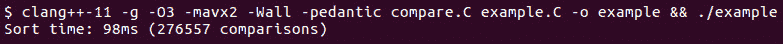

图 2.1

你得到的结果取决于你使用的编译器、运行的计算机，当然还取决于数据语料库。

现在我们已经有了第一个性能测量，你可能会问的第一个问题是，我们该如何优化它？然而，这并不是你应该问的第一个问题。真正的第一个问题应该是，“我们需要优化吗？”要回答这个问题，你需要有性能的目标和目标，以及关于程序其他部分相对性能的数据；例如，如果实际字符串是从需要十个小时的模拟生成的，那么排序它需要的一百秒几乎不值得注意。当然，我们仍然在处理人工示例，除非我们假设是的，否则在本章中我们不会有太大进展，我们必须改善性能。

现在，我们准备好讨论如何优化了吗？再次，不要那么着急：现在应该问的问题是，“我们要优化什么？”或者更一般地说，程序花费最多时间的地方是哪里？即使在这个简单的示例中，可能是排序本身或比较函数。我们无法访问排序的源代码（除非我们想要黑掉标准库），但我们可以在比较函数中插入计时器调用。

不幸的是，这不太可能产生良好的结果：每次比较都非常快，计时器调用本身需要时间，每次调用函数时调用计时器将显著改变我们试图测量的结果。在现实世界的程序中，使用计时器进行这样的仪器测量通常也不切实际。如果你不知道时间花在哪里（没有任何测量，你怎么知道呢？），你将不得不在数百个函数中插入计时器。这就是性能分析工具发挥作用的地方。

我们将在下一节中更多地了解性能分析工具。现在，可以说以下命令行将编译和执行程序，并使用 GperfTools 包中的 Google 分析器收集其运行时配置文件：

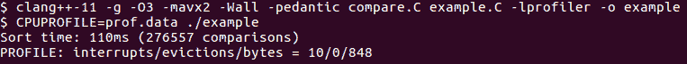

图 2.2

配置文件数据存储在文件`prof.data`中，由`CPUPROFILE`环境变量给出。你可能已经注意到，这次程序运行时间更长了。这几乎是性能分析的一个不可避免的副作用。我们将在下一节回到这个问题。假设性能分析工具本身正常工作，程序的不同部分的相对性能应该仍然是正确的。

输出的最后一行告诉我们，分析器已经为我们收集了一些数据，现在我们需要以可读的格式显示它。对于 Google 分析器收集的数据，用户界面工具是`google-pprof`（通常安装为`pprof`），最简单的调用方式只是列出程序中的每个函数，以及在该函数中花费的时间的比例（第二列）：

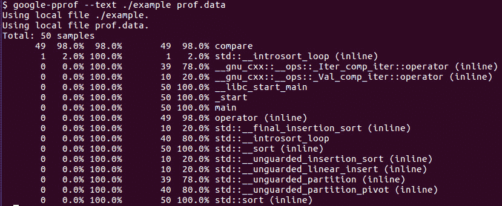

图 2.3

分析器显示几乎所有的时间都花在了比较函数`compare()`上，而排序几乎没有花费任何时间（第二行是`std::sort`调用的函数之一，应该被视为在排序中花费的时间的一部分，但不包括在比较中）。请注意，对于任何实际的分析，我们需要收集更多的样本，这取决于程序运行的时间，为了获得可靠的数据，您需要在每个要测量的函数中积累至少几十个样本。在我们的情况下，结果是如此明显，我们可以继续使用我们收集的样本。

由于子字符串比较函数占总运行时间的 98%，我们只有两种方法可以提高性能：我们可以使这个函数更快，或者我们可以减少调用它的次数（许多人忘记了第二种可能性，直接选择第一种）。第二种方法需要使用不同的排序算法，因此超出了本书的范围。在这里，我们将专注于第一种选择。让我们再次审查一下比较函数的代码：

```cpp
bool compare(const char* s1, const char* s2, unsigned int l) {
  if (s1 == s2) return false;
  for (unsigned int i1 = 0, i2 = 0; i1 < l; ++i1, ++i2) {
     if (s1[i1] != s2[i2]) return s1[i1] > s2[i2];
  }
  return false;
}
```

这只是几行代码，我们应该能够理解和预测它的行为。这里有一个检查，用于比较子字符串是否相同，这肯定比逐个字符进行比较要快，因此，除非我们确定该函数从不使用相同的指针值调用，否则这一行保留。

然后是一个循环（循环体逐个比较字符），我们必须这样做是因为我们不知道哪个字符可能不同。循环本身运行直到我们找到一个不同之处，或者直到我们比较了最大可能数量的字符。很容易看出后一种情况不可能发生：字符串以空字符结尾，因此，即使两个子字符串中的所有字符都相同，迟早我们会到达较短子字符串的末尾，将其末尾的空字符与另一个子字符串中的非空字符进行比较，较短的子字符串将被认为是两者中较小的。

唯一可能读取字符串末尾之外的情况是当两个子字符串从同一位置开始，但我们在函数的开头就检查了这一点。这很好：我们发现了一些不必要的工作，因此我们可以优化代码，摆脱每次循环迭代中的一个比较操作。考虑到循环体中没有太多其他操作，这应该是显著的。

代码的改变很简单：我们可以只删除比较（我们也不再需要将长度传递给比较函数）：

```cpp
bool compare(const char* s1, const char* s2) {
  if (s1 == s2) return false;
  for (unsigned int i1 = 0, i2 = 0;; ++i1, ++i2) {
     if (s1[i1] != s2[i2]) return s1[i1] > s2[i2];
  }
  return false;
}
```

更少的参数，更少的操作，代码量也更少。让我们运行程序，看看这种优化节省了我们多少运行时间：


图 2.4

说这并不是按计划进行的将是一个严重的低估。原始代码花了 98 毫秒来解决同样的问题（*图 2.1*）。尽管“优化”代码做的工作更少，但花了 210 毫秒（请注意，并非所有编译器在这个例子上都表现出这种性能异常，但我们使用的是真正的生产编译器；这里没有任何诡计，这也可能发生在你身上）。

为了总结这个例子，实际上是一个大大简化的真实程序的例子，我要告诉您，当我们试图优化代码片段时，另一位程序员正在代码的另一个部分工作，也需要一个子字符串比较函数。当分别开发的代码片段放在一起时，只保留了这个函数的一个版本，而这恰好是我们没有编写的版本；另一位程序员几乎写了完全相同的代码：

```cpp
 bool compare(const char* s1, const char* s2) {
  if (s1 == s2) return false;
  for (int i1 = 0, i2 = 0;; ++i1, ++i2) {
     if (s1[i1] != s2[i2]) return s1[i1] > s2[i2];
  }
  return false;
}
```

检查这段代码片段和前面的代码片段，看看你能否发现其中的区别。

唯一的区别是循环变量的类型：之前，我们使用了`unsigned int`，这并没有错：索引从 0 开始并递增；我们不期望出现任何负数。最后的代码片段使用了`int`，不必要地放弃了可能的索引值范围的一半。

在这次代码整合之后，我们可以再次运行我们的基准测试，这次使用新的比较函数。结果又是意想不到的：


图 2.5

最新版本花费了 74 毫秒，比我们原始版本快（98 毫秒，图 2.1），比几乎相同的第二个版本快得多（210 毫秒，图 2.2）。

关于这个特定的谜团的解释，您将不得不等到下一章。本节的目标是说服您永远不要猜测性能：所谓的“显而易见”的优化——用更少的代码进行完全相同的计算——出乎意料地失败了，而本来根本不应该有任何影响的微不足道的改变——在一个所有值都是非负的函数中使用有符号整数而不是无符号整数——竟然成为了一种有效的优化。

如果性能结果在这个非常简单的例子中都如此反直觉，那么做出关于性能的良好决策的唯一方法必须是基于测量的方法。在本章的其余部分，我们将看到一些用于收集性能测量的最常用工具，学习如何使用它们以及如何解释它们的结果。

# 性能基准测试

程序收集性能信息的最简单方法是运行它并测量所需的时间。当然，我们需要比这更多的数据才能进行任何有用的优化：知道程序的哪些部分使其花费那么长时间会很好，这样我们就不会浪费时间优化可能非常低效但花费时间很少且对最终结果没有贡献的代码。

我们在添加计时器到示例程序时已经看到了一个简单的例子：现在我们知道排序本身需要多长时间。简而言之，这就是基准测试的整个理念。其余的工作是费力的，用计时器对代码进行仪器化，收集信息，并以有用的格式报告。让我们看看我们有哪些工具，从语言本身提供的计时器开始。

## C++ chrono 计时器

C++有一些设施可以用于收集时间信息，它们在其 chrono 库中。您可以测量程序中任意两点之间经过的时间：

```cpp
#include <chrono>
using std::chrono::duration_cast;
using std::chrono::milliseconds;
using std::chrono::system_clock; 
  … 
auto t0 = system_clock::now();
  … do some work …
auto t1 = system_clock::now();
auto delta_t = duration_cast<milliseconds>(t1 – t0);
cout << "Time: " << delta_t.count() << endl;
```

我们应该指出，C++ chrono 时钟测量实际时间（通常称为挂钟时间）。通常，这是您想要测量的。但是，更详细的分析通常需要测量 CPU 时间，这是 CPU 工作时经过的时间，当 CPU 空闲时停止。在单线程程序中，CPU 时间不能大于实际时间；如果程序计算密集型，那么两个时间理想情况下应该是相同的，这意味着 CPU 已经完全加载。另一方面，用户界面程序大部分时间都在等待用户和空闲 CPU；在这种情况下，我们希望 CPU 时间尽可能低：这表明程序高效，并尽可能少地使用 CPU 资源来服务用户的请求。为此，我们必须超越 C++17 提供的内容。

## 高分辨率计时器

要测量 CPU 时间，我们必须使用特定于操作系统的系统调用；在 Linux 和其他符合 POSIX 标准的系统上，我们可以使用`clock_gettime()`调用来访问硬件高分辨率计时器：

```cpp
timespec t0, t1;
clockid_t clock_id = …; // Specific clock
clock_gettime(clock_id, &t0);
   … do some work …  
clock_gettime(clock_id, &t1);
double delta_t = t1.tv_sec – t0.tv_sec +
     1e-9*(t1.tv_nsec – t0.tv_nsec);
```

该函数将当前时间返回到其第二个参数中；`tv_sec`是自过去某个时间点以来的秒数，`tv_nsec`是自上一整秒以来的纳秒数。时间的起点实际上并不重要，因为我们总是测量时间间隔；但是，要小心先减去秒数，然后再加上纳秒数，否则，通过减去两个大数，您将丢失结果的有效数字。

在前面的代码中，我们可以使用几个硬件计时器，其中一个是由`clock_id`变量的值选择的。我们已经使用过的是相同的系统或实时时钟。它的 ID 是`CLOCK_REALTIME`。我们感兴趣的另外两个计时器是两个 CPU 计时器：`CLOCK_PROCESS_CPUTIME_ID`是一个测量当前程序使用的 CPU 时间的计时器，`CLOCK_THREAD_CPUTIME_ID`是一个类似的计时器，但它只测量调用线程使用的时间。

在对代码进行基准测试时，通常有助于从多个计时器中报告测量结果。在最简单的情况下，即单线程程序进行不间断计算时，所有三个计时器应该返回相同的结果：

```cpp
double duration(timespec a, timespec b) {
  return a.tv_sec - b.tv_sec + 1e-9*(a.tv_nsec - b.tv_nsec);
}
   …
{
  timespec rt0, ct0, tt0;
  clock_gettime(CLOCK_REALTIME, &rt0);
  clock_gettime(CLOCK_PROCESS_CPUTIME_ID, &ct0);
  clock_gettime(CLOCK_THREAD_CPUTIME_ID, &tt0);
  constexpr double X = 1e6;
  double s = 0;
  for (double x = 0; x < X; x += 0.1) s += sin(x);
  timespec rt1, ct1, tt1;
  clock_gettime(CLOCK_REALTIME, &rt1);
  clock_gettime(CLOCK_PROCESS_CPUTIME_ID, &ct1);
  clock_gettime(CLOCK_THREAD_CPUTIME_ID, &tt1);
  cout << "Real time: " << duration(rt1, rt0) << "s, "
            "CPU time: " << duration(ct1, ct0) << "s, "
            "Thread time: " << duration(tt1, tt0) << "s" <<
              endl;
}
```

这里的“CPU 密集型工作”是某种计算，所有三个时间应该几乎相同。您可以通过任何类型的计算的简单实验来观察到这一点。时间的值将取决于计算机的速度，但是除此之外，结果应该看起来像这样：

```cpp
Real time: 0.3717s, CPU time: 0.3716s, Thread time: 0.3716s
```

如果报告的 CPU 时间与实际时间不匹配，很可能是机器负载过重（许多其他进程正在竞争 CPU 资源），或者程序内存不足（如果程序使用的内存超过了机器上的物理内存，它将不得不使用速度慢得多的磁盘交换，而 CPU 在程序等待内存从磁盘中分页时无法执行任何工作）。

另一方面，如果程序没有进行太多计算，而是等待用户输入，或者从网络接收数据，或者进行其他不需要太多 CPU 资源的工作，我们将看到非常不同的结果。观察这种行为的最简单方法是调用`sleep()`函数而不是我们之前使用的计算：

```cpp
{
  timespec rt0, ct0, tt0;
  clock_gettime(CLOCK_REALTIME, &rt0);
  clock_gettime(CLOCK_PROCESS_CPUTIME_ID, &ct0);
  clock_gettime(CLOCK_THREAD_CPUTIME_ID, &tt0);
  sleep(1);
  timespec rt1, ct1, tt1;
  clock_gettime(CLOCK_REALTIME, &rt1);
  clock_gettime(CLOCK_PROCESS_CPUTIME_ID, &ct1);
  clock_gettime(CLOCK_THREAD_CPUTIME_ID, &tt1);
  cout << "Real time: " << duration(rt1, rt0) << "s, "
          "CPU time: " << duration(ct1, ct0) << "s, "
          "Thread time: " << duration(tt1, tt0) << "s" <<
              endl;
}
```

现在我们将希望看到一个休眠程序使用非常少的 CPU：

```cpp
Real time: 1.000s, CPU time: 3.23e-05s, Thread time: 3.32e-05s
```

对于在套接字或文件上被阻塞或等待用户操作的程序，情况也应该是如此。

到目前为止，我们还没有看到两个 CPU 计时器之间的任何差异，除非您的程序使用线程，否则您也不会看到任何差异。我们可以让我们的计算密集型程序执行相同的工作，但使用单独的线程：

```cpp
{
  timespec rt0, ct0, tt0;
  clock_gettime(CLOCK_REALTIME, &rt0);
  clock_gettime(CLOCK_PROCESS_CPUTIME_ID, &ct0);
  clock_gettime(CLOCK_THREAD_CPUTIME_ID, &tt0);
  constexpr double X = 1e6;
  double s = 0;
  auto f = std::async(std::launch::async, 
     [&]{ for (double x = 0; x < X; x += 0.1) s += sin(x); 
      });
  f.wait();
  timespec rt1, ct1, tt1;
  clock_gettime(CLOCK_REALTIME, &rt1);
  clock_gettime(CLOCK_PROCESS_CPUTIME_ID, &ct1);
  clock_gettime(CLOCK_THREAD_CPUTIME_ID, &tt1);
  cout << "Real time: " << duration(rt1, rt0) << "s, "
          "CPU time: " << duration(ct1, ct0) << "s, "
          "Thread time: " << duration(tt1, tt0) << "s" <<
              endl;
}
```

计算的总量保持不变，仍然只有一个线程在工作，因此我们不希望实时或整个进程的 CPU 时间发生任何变化。然而，调用定时器的线程现在处于空闲状态；它所做的就是等待`std::async`返回的未来，直到工作完成。这种等待与前面例子中的`sleep()`函数非常相似，我们可以从结果中看到：

```cpp
Real time: 0.3774s, CPU time: 0.377s, Thread time: 7.77e-05s
```

现在实时和整个进程的 CPU 时间看起来像“重型计算”示例中的那样，但特定线程的 CPU 时间很低，就像“睡眠”示例中的那样。这是因为整体程序正在进行大量计算，但调用定时器的线程确实大部分时间都在睡眠。

大多数情况下，如果我们要使用线程进行计算，目标是更快地进行更多的计算，因此我们将使用多个线程并在它们之间分配工作。让我们修改前面的例子，也在主线程上进行计算：

```cpp
{
  timespec rt0, ct0, tt0;
  clock_gettime(CLOCK_REALTIME, &rt0);
  clock_gettime(CLOCK_PROCESS_CPUTIME_ID, &ct0);
  clock_gettime(CLOCK_THREAD_CPUTIME_ID, &tt0);
  constexpr double X = 1e6;
  double s1 = 0, s2 = 0;
  auto f = std::async(std::launch::async, 
     [&]{ for (double x = 0; x < X; x += 0.1) s1 += sin(x);
       });
  for (double x = 0; x < X; x += 0.1) s2 += sin(x);
  f.wait();
  timespec rt1, ct1, tt1;
  clock_gettime(CLOCK_REALTIME, &rt1);
  clock_gettime(CLOCK_PROCESS_CPUTIME_ID, &ct1);
  clock_gettime(CLOCK_THREAD_CPUTIME_ID, &tt1);
  cout << "Real time: " << duration(rt1, rt0) << "s, "
          "CPU time: " << duration(ct1, ct0) << "s, "
          "Thread time: " << duration(tt1, tt0) << "s" <<
              endl;
}
```

现在两个线程都在进行计算，因此程序使用的 CPU 时间以双倍速率流逝，与实际时间相比。

```cpp
Real time: 0.5327s, CPU time: 1.01s, Thread time: 0.5092s
```

这很不错：我们在只有 0.53 秒的实际时间内完成了 1 秒的计算。理想情况下，这应该是 0.5 秒，但实际上，启动线程和等待它们会有一些开销。此外，两个线程中的一个可能需要更长的时间来完成工作，然后另一个线程有时会处于空闲状态。

对程序进行基准测试是收集性能数据的一种强大方式。仅通过观察执行函数或处理事件所需的时间，我们就可以了解代码的性能。对于计算密集型代码，我们可以看到程序是否确实在不停地进行计算，还是在等待某些东西。对于多线程程序，我们可以测量并发性有多有效以及开销是多少。但我们不仅仅局限于收集执行时间：我们还可以报告任何我们认为相关的计数和值：函数被调用的次数，我们排序的平均字符串长度，任何我们需要帮助解释测量的东西。

然而，这种灵活性是有代价的：通过基准测试，我们几乎可以回答关于程序性能的任何问题。但我们必须首先提出问题：我们只报告我们决定测量的内容。如果我们想知道某个函数需要多长时间，我们必须为其添加定时器；如果没有，我们将无法得知任何信息，直到重写代码并重新运行基准测试。另一方面，在代码中到处添加定时器也不可取：这些函数调用相当昂贵，因此使用太多可能会减慢程序速度并扭曲性能测量。通过经验和良好的编码纪律，你可以学会提前为自己编写的代码进行仪器化，这样至少它的主要部分可以轻松进行基准测试。

但是，如果你不知道从哪里开始怎么办？如果你继承了一个没有为任何基准测试进行仪器化的代码库怎么办？或者，也许你将性能瓶颈隔离到了一个大段代码中，但里面没有更多的定时器了怎么办？一种方法是继续对代码进行仪器化，直到你有足够的数据来分析问题。但这种蛮力方法很慢，所以你会希望得到一些关于在哪里集中努力的指导。这就是性能分析的作用：它让你可以为一个没有手动进行简单基准测试的程序收集性能数据。我们将在下一节学习有关性能分析的知识。

# 性能分析

我们将要学习的下一组性能分析工具是分析工具，或分析器。我们已经看到了一个分析器的使用：在上一节中，我们使用它来识别占用大部分计算时间的函数。这正是分析器的用途，用于找到“热点”函数和代码片段，也就是程序花费大部分时间的代码行。

有许多不同的分析工具可用，包括商业和开源的。在本节中，我们将研究两种在 Linux 系统上流行的分析器。我们的目标不是让你成为某个特定工具的专家，而是让你了解你选择使用的分析器可以期望什么以及如何解释其结果。

首先，让我们指出有几种不同类型的分析器：

+   一些分析器执行解释器或虚拟机下的代码，并观察它花费时间的地方。这些分析器的主要缺点是，它们使程序运行速度比直接编译成机器指令的代码慢得多，至少对于像 C++这样被编译而不通常在虚拟机下运行的语言来说是这样。

+   其他分析器要求在编译或链接期间使用特殊指令对代码进行仪器化。这些指令为分析器提供额外的信息，例如，当函数被调用或循环开始和结束时，它们可以通知数据收集引擎。这些分析器比前一种类型的分析器更快，但仍然比本地执行慢。它们还需要对代码进行特殊编译，并依赖于一个假设，即仪器化的代码与原始代码具有相同的性能，至少是相对的，如果不是绝对的。

+   大多数现代分析器使用现代 CPU 上存在的硬件事件计数器。这些是可以用来跟踪特定硬件事件的特殊硬件寄存器。一个硬件事件的例子是执行一条指令。你可以看到这对于分析是如何有用的：处理器将为我们计算指令而无需任何额外的仪器或开销。我们所需要做的就是读取计数器寄存器的值。

不幸的是，有用的分析比简单地计算指令要复杂一些。我们需要知道每个函数甚至每行代码花费了多少时间。如果分析器在执行每个函数（或每个循环、每行代码等）之前和之后读取指令计数，就可以做到这一点。这就是为什么一些分析器使用混合方法：它们对代码进行仪器化以标记感兴趣的点，但使用硬件性能计数器进行实际测量。

其他分析器依赖于基于时间的采样：它们在一定的间隔内中断程序，比如每 10 毫秒一次，并记录性能计数器的值以及程序的当前位置（即将执行的指令）。如果，比如，所有样本中有 90%是在调用`compare()`函数时进行的，我们可以假设程序花费了 90%的时间进行字符串比较。这种方法的准确性取决于采样数量和采样之间的间隔。

我们对程序执行的采样越频繁，我们收集的数据就越多，但开销也越大。基于硬件的分析器在某些情况下可能对程序的运行时没有任何不利影响，如果采样不是太频繁的话。

## 性能分析器

我们将在本节中学习的第一个分析器工具是 Linux 的`perf`分析器。这是 Linux 上最流行的分析器之一，因为它几乎安装在大多数发行版中。这个分析器使用硬件性能计数器和基于时间的采样；它不需要对代码进行任何仪器化。

运行这个性能分析器的最简单方法是收集整个程序的计数器值；这是使用`perf stat`命令完成的：

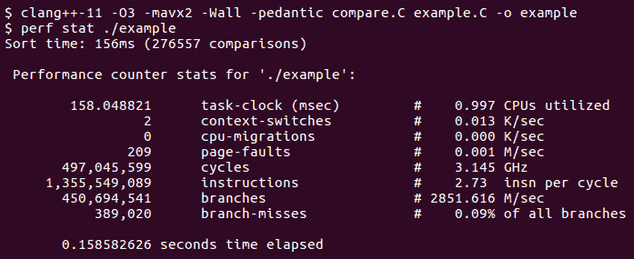

图 2.6

正如您在*图 2.6*中所看到的，编译不需要任何特殊选项或工具。程序由性能分析器执行，`stat`选项告诉性能分析器在整个程序运行期间显示硬件性能计数器中累积的计数。在这种情况下，我们的程序运行了 158 毫秒（与程序本身打印的时间一致），执行了超过 13 亿条指令。还显示了其他几个计数器，如“页面错误”和“分支”。这些计数器是什么，还有哪些计数器可以看到？

事实证明，现代 CPU 可以收集许多不同类型的事件的统计信息，但一次只能收集少数类型；在前面的例子中，报告了八个计数器，因此我们可以假设这个 CPU 有八个独立的计数器。然而，这些计数器中的每一个都可以被分配来计算许多事件类型中的一个。性能分析器本身可以列出所有已知的事件，并且可以对其进行计数：

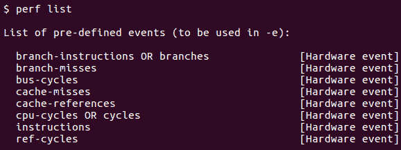

图 2.7

*图 2.7*中的列表是不完整的（打印输出会继续很多行），并且可用的确切计数器会因 CPU 而异（如果您使用虚拟机，则还会受到 hypervisor 的类型和配置的影响）。我们在*图 2.6*中收集的性能分析运行结果只是默认的计数器集，但我们可以选择其他计数器进行性能分析：

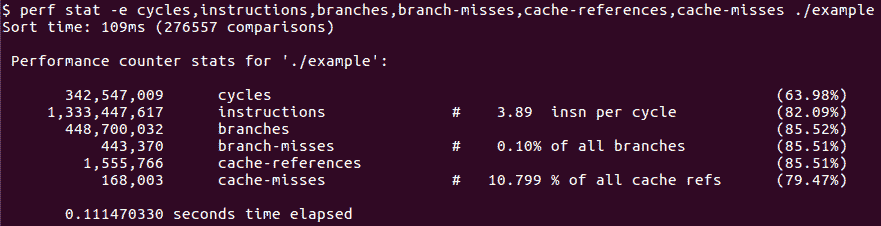

图 2.8

在*图 2.8*中，我们测量 CPU 周期和指令，以及分支、分支丢失、缓存引用和缓存丢失。这些计数器及其监视的事件的详细解释将在下一章中介绍。

简而言之，周期时间是 CPU 频率的倒数，因此 3GHz 的 CPU 可以每秒运行 30 亿个周期。顺便说一句，大多数 CPU 可以以可变速度运行，这会使测量变得复杂。因此，为了进行准确的性能分析和基准测试，建议禁用节能模式和其他可能导致 CPU 时钟变化的功能。指令计数器测量执行的处理器指令数量；正如您所看到的，CPU 平均每个周期执行了近四条指令。

"分支"是条件指令：每个`if`语句和每个带有条件的`for`循环至少生成一个这样的指令。分支丢失将在下一章中详细解释；现在我们只能说，从性能角度来看，这是一个昂贵且不希望发生的事件。

"缓存引用"计算 CPU 需要从内存中获取数据的次数。大多数情况下，“数据”是一段数据，比如字符串中的一个字符。根据处理器和内存的状态，这种获取可能非常快或非常慢；后者被计为“缓存丢失”（“慢”是一个相对概念；相对于 3GHz 的处理器速度，1 微秒是一个非常长的时间）。内存层次结构将在后面的章节中解释；同样，缓存丢失是一个昂贵的事件。

掌握了 CPU 和内存的工作原理，您将能够利用这些测量来评估程序的整体效率，并确定限制其性能的因素类型。

到目前为止，我们只看到了整个程序的测量。*图 2.8*中的测量可能告诉我们是什么在阻碍我们代码的性能：例如，如果我们暂时接受“缓存未命中”对性能不利，我们可以推断出这段代码的主要问题是其低效的内存访问（十次内存访问中有一次是慢的）。然而，这种类型的数据并不告诉我们代码的哪些部分负责性能不佳。为此，我们需要收集数据不仅在程序执行之前和之后，还在程序执行期间。让我们看看如何使用`perf`来做到这一点。

## 使用 perf 进行详细分析

`perf`分析器将硬件计数器与基于时间间隔的采样相结合，记录运行程序的性能概况。对于每个样本，它记录程序计数器的位置（要执行的指令的地址）和我们正在监视的性能计数器的值。运行后，数据将被分析；具有最多样本的函数和代码行负责大部分执行时间。

分析器的数据收集运行并不比整体测量运行更困难。请注意，在运行时，指令地址被收集；要将这些转换为原始源代码中的行号，程序必须使用调试信息进行编译。如果您习惯于两种编译模式，“优化”和“非优化调试”，那么编译器选项的这种组合可能会让您感到惊讶：调试和优化都已启用。后者的原因是我们需要对将在生产中运行的相同代码进行分析，否则数据大多是无意义的。考虑到这一点，我们可以为分析编译代码并使用`perf record`命令运行分析器：

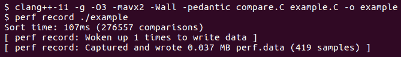

图 2.9

就像`perf stat`一样，我们可以指定一个计数器或一组计数器来监视，但是这次，我们接受默认计数器。我们没有指定采样的频率；同样，也有一个默认值，但我们也可以明确指定：例如，`perf record -c 1000`每秒记录 1000 个样本。

程序运行，产生常规输出，以及来自分析器的消息。最后一个告诉我们，分析样本已经捕获在名为`perf.data`的文件中（同样，这是可以更改的默认值）。要可视化来自此文件的数据，我们需要使用分析工具，它也是同一 perftools 套件的一部分，具体来说是`perf report`命令。运行此命令将启动此屏幕：

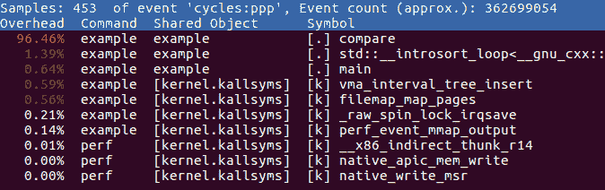

图 2.10

这是分析摘要，按功能的执行时间分解。从这里，我们可以深入研究任何功能，并查看哪些行对执行时间贡献最大：

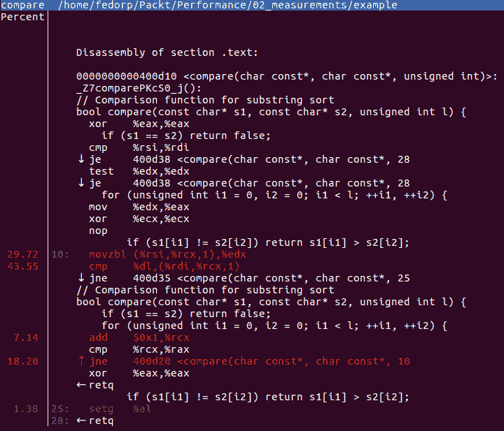

图 2.11

*图 2.11*左侧的数字是每行所花费的执行时间的百分比。那么，“行”到底告诉我们什么？*图 2.11*说明了分析此类概要的更频繁的困难之一。它显示了源代码和由此产生的汇编指令；执行时间计数器自然与每个硬件指令相关联（这是 CPU 执行的内容，因此是唯一可以计数的内容）。编译代码和源代码之间的对应关系是由编译器嵌入的调试信息由分析器建立的。不幸的是，这种对应关系并不精确，原因是优化。编译器执行各种优化，所有这些优化最终都会重新排列代码并改变计算方式。即使在这个非常简单的例子中，您也可以看到结果：为什么源代码行

```cpp
if (s1 == s2) return false;
```

为什么出现两次？原始源代码中只有一行。原因是从这一行生成的指令不都在同一个地方；优化器将它们与来自其他行的指令重新排序。因此，分析器在这条线附近显示了两次机器指令。

即使不看汇编代码，我们也可以看到时间花在比较字符上，以及运行循环本身；这两行源代码占据了大部分时间：

```cpp
for (unsigned int i1 = 0, i2 = 0; i1 < l; ++i1, ++i2) {
  if (s1[i1] != s2[i2]) return s1[i1] > s2[i2];
```

为了充分利用分析，有助于了解我们正在工作的平台的汇编语言的基础知识（在我们的情况下是 X86 CPU）。分析器还有一些有用的工具，可以方便分析。例如，将光标放在`jne`（如果不相等则跳转）指令上，我们可以看到跳转会带我们去哪里，以及与跳转相关的条件：

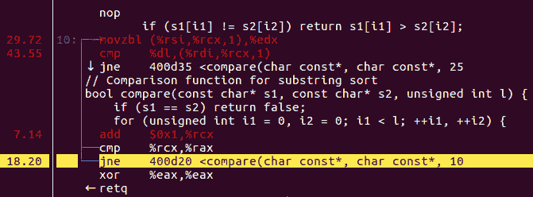

图 2.12

这看起来像是跳回重复最后几行代码，所以跳转上面的`cmp`（比较）指令必须是循环的比较，`i1 < l`。总的来说，跳转和比较占据了 18%的执行时间，所以我们之前对看似不必要的比较操作的关注似乎是合理的。

perf 分析器有更多的选项和功能来分析、过滤和聚合结果，所有这些都可以从其文档中学习。此外，还有几个 GUI 前端用于这个分析器。接下来，我们将快速看一下另一个分析器，来自 Google 性能工具的分析器。

## Google 性能分析器

Google CPU 分析器也使用硬件性能计数器。它还需要对代码进行链接时插装（但不需要编译时插装）。为了准备代码进行分析，你必须将其与分析器库链接：

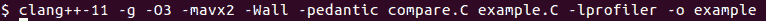

图 2.13

在*图 2.13*中，库由命令行选项`-lprofiler`指定。与 perf 不同，这个分析器不需要任何特殊的工具来调用程序；必要的代码已经链接到可执行文件中。插装的可执行文件不会自动开始分析自身。我们必须通过设置环境变量`CPUPROFILE`为我们想要存储结果的文件名来激活分析。其他选项也是通过环境变量而不是命令行选项来控制的，例如，变量`CPUPROFILE_FREQUENCY`设置每秒的样本数：

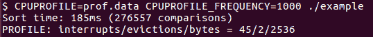

图 2.14

再次，我们看到了程序本身和分析器的输出，并且得到了我们必须分析的配置文件。分析器有交互模式和批处理模式；交互模式是一个简单的文本用户界面：

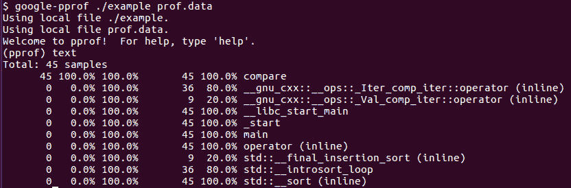

图 2.15

只需运行`google-pprof`（通常安装为`pprof`）并将可执行文件和配置文件的名称作为参数，就会弹出命令提示符。从这里，我们可以，例如，获取所有函数的摘要，其中包含执行时间的百分比。我们还可以在源代码级别进一步分析程序性能：

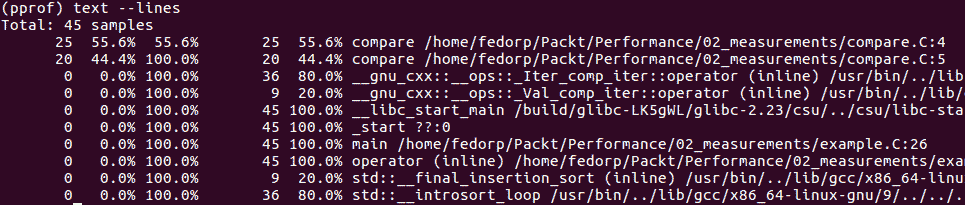

图 2.16

正如你所看到的，这个分析器采用了稍微不同的方法，并没有立即将我们深入到机器代码中（尽管也可以生成带注释的汇编代码）。然而，这种表面上的简单有些欺骗性：我们之前描述的注意事项仍然适用，优化编译器仍然对代码进行转换。

不同的性能分析工具由于作者采取的不同方法而具有不同的优势和劣势。我们不想把本章变成性能分析工具的手册，因此在本节的其余部分，我们将展示在收集和分析性能分析结果时可能遇到的一些常见问题。

## 使用调用图进行分析

到目前为止，我们简单的例子已经避开了一个实际上在每个程序中都会发生的问题。当我们发现比较函数占据了大部分执行时间时，我们立刻知道程序的哪一部分是有问题的：只有一行调用了这个函数。

大多数现实生活中的程序都不会那么简单：毕竟，我们编写函数的主要原因之一就是为了促进代码重用。很显然，许多函数将会从多个位置被调用，有些会被调用多次，而有些则只会被调用几次，通常使用非常不同的参数。仅仅知道哪个函数花费了很多时间是不够的：我们还需要知道它发生在什么上下文中（毕竟，最有效的优化可能是更少地调用昂贵的函数）。

我们需要的是一个不仅告诉我们每个函数和每行代码花费了多少时间，还告诉我们每个调用链花费了多少时间的分析结果。这些性能分析工具通常使用调用图来呈现这些信息：图中调用者和被调用者是节点，调用是边。

首先，我们必须修改我们的例子，以便我们可以从多个位置调用某个函数。让我们首先进行两次`sort`调用：

```cpp
std::sort(vs.begin(), vs.end(), 
  & {
      ++count; return compare1(a, b, L); });
std::sort(vs.begin(), vs.end(), 
  & {
      ++count; return compare2(a, b, L); });
```

这些调用只在比较函数上有所不同；在我们的例子中，第一个比较函数和之前一样，而第二个则产生了相反的顺序。这两个函数都和我们旧的比较函数一样，在子字符串字符上有相同的循环：

```cpp
bool compare1(const char* s1, const char* s2, unsigned int l) {
     if (s1 == s2) return false;
     for (unsigned int i1 = 0, i2 = 0; i1 < l; ++i1, ++i2) {
           int res = compare(s1[i1], s2[i2]);
           if (res != 0) return res > 0;
     }
     return false;
}
bool compare2(const char* s1, const char* s2, unsigned int l) {
     if (s1 == s2) return false;
     for (unsigned int i1 = 0, i2 = 0; i1 < l; ++i1, ++i2) {
           int res = compare(s1[i1], s2[i2]);
           if (res != 0) return res < 0;
     }
     return false;
}
```

这两个函数都使用相同的通用函数来比较每个字符：

```cpp
int compare(char c1, char c2) {
     if (c1 > c2) return 1;
     if (c1 < c2) return -1;
     return 0;
}
```

当然，这并不是你在真正的程序中会这样做的方式：如果你真的想避免由于重复循环而导致的代码重复，你会编写一个由字符比较运算符参数化的单个函数。然而，我们不想偏离我们开始的例子太远，我们希望保持代码简单，这样我们可以一次解释一个复杂性。

现在我们准备生成一个调用图，它将显示字符比较的成本是如何在两次对 sort 的调用之间分配的。我们使用的两个性能分析工具都可以生成调用图；在本节中，我们将使用 Google 性能分析工具。对于这个性能分析工具，数据收集已经包括了调用链信息；我们只是到目前为止还没有尝试去可视化它。

我们编译代码并运行性能分析器，就像我们之前做的那样（为了简单起见，我们将每个函数放在自己的源文件中）：

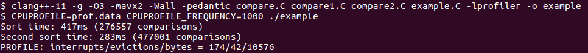

Figure 2.17

性能分析工具可以以几种不同的格式显示调用图（Postscript、GIF、PDF 等）。例如，要生成 PDF 输出，我们将运行以下命令：

```cpp
google-pprof --pdf ./example prof.data > prof.pdf
```

我们现在感兴趣的信息在调用图的底部：

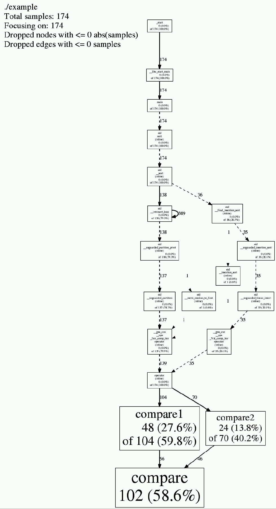

图 2.18

正如你在*图 2.18*中所看到的，`compare()`函数占据了总执行时间的 58.6%，有两个调用者。在这两个调用者中，`compare1()`函数比`compare2()`函数稍微多一些调用；前者占据了 27.6%的执行时间（如果包括其对`compare()`的调用所花费的时间，则为 59.8%），而后者单独占据了 13.8%的时间，或者总共占据了 40.2%的时间。

基本的调用图通常足以识别问题调用链并选择程序的进一步探索区域。性能分析工具还具有更高级的报告功能，如函数名称的过滤、结果的聚合等。掌握所选择工具的功能差异可能是知识和猜测之间的区别：解释性能分析可能会很棘手和令人沮丧，原因有很多：有些是由于工具的限制，但其他一些则更为根本。在下一节中，我们将讨论后者的一个原因：为了使测量结果相关，必须在完全优化的代码上进行。

## 优化和内联

我们已经看到编译器优化在解释性能分析时会使情况变得复杂：所有的性能分析最终都是在编译后的机器代码上进行的，而我们看到的程序是以源代码形式呈现的。编译器优化使这两种形式之间的关系变得模糊。在重新排列源代码方面，最具侵略性的优化之一是编译时函数调用的内联。

内联要求函数的源代码在调用点可见，因此，为了向您展示这是什么样子，我们必须将整个源代码合并到一个文件中：

```cpp
bool compare(const char* s1, const char* s2, unsigned int l) {
  if (s1 == s2) return false;
  for (unsigned int i1 = 0, i2 = 0; i1 < l; ++i1, ++i2) {
     if (s1[i1] != s2[i2]) return s1[i1] > s2[i2];
  }
  return false;
}
int main() {
  … 
  size_t count = 0;
  std::sort(vs.begin(), vs.end(), 
     & {
         ++count; return compare(a, b, L); });
}
```

现在编译器可以并且可能会在使用排序的地方直接生成机器代码，而不是调用外部函数。这种内联是一种强大的优化工具；它经常发生，不仅仅是在同一文件中的函数。更常见的是，内联会影响头文件中的函数（整个实现都在头文件中的函数）。例如，在前面的代码中，对`std::sort`的调用看起来像是一个函数调用，但几乎可以肯定会被内联，因为`std::sort`是一个模板函数：它的整个主体都在头文件中。

让我们看看我们之前使用的性能分析工具如何处理内联代码。运行 Google 性能分析器对带注释的源代码行产生了这份报告：

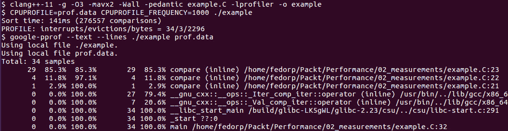

图 2.19

正如您所见，性能分析器知道`compare()`函数被内联，但仍显示其原始名称。源代码中的行对应于函数的代码编写位置，而不是调用位置，例如，第 23 行是这样的：

```cpp
if (s1[i1] != s2[i2]) return s1[i1] > s2[i2];
```

另一方面，perf 性能分析器并不容易显示内联函数：

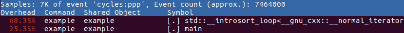

图 2.20

在这里，我们可以看到时间似乎花在了排序代码和主程序本身上。然而，检查带注释的源代码，我们发现从`compare()`函数源代码生成的代码仍然占绝大多数执行时间：

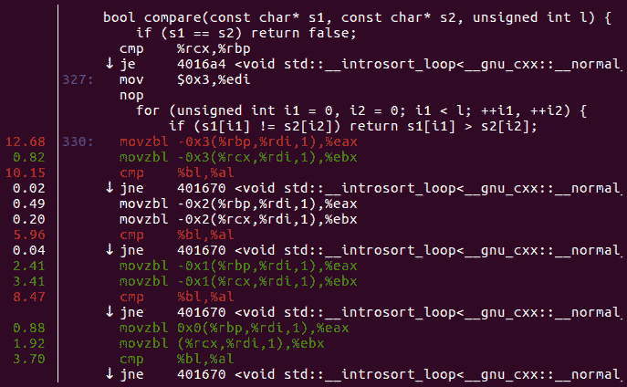

图 2.21

不幸的是，没有简单的方法来消除优化对性能分析的影响。内联、代码重排和其他转换将详细的性能分析变成了一个随着实践而发展的技能。因此，现在需要一些关于有效使用性能分析的实际建议。

## 实际的性能分析

也许会有诱惑力认为性能分析是解决所有性能测量需求的终极解决方案：在性能分析器下运行整个程序，收集所有数据，并获得对代码中发生的一切情况的完整分析。不幸的是，情况很少会如此顺利。有时，工具的限制会成为阻碍。通常，大量数据中包含的信息复杂性太过压倒性。那么，你应该如何有效地使用性能分析呢？

建议的方法是首先收集高级信息，然后进行细化。将执行时间分解为大型模块之间的粗略概要可能是一个很好的起点。另一方面，如果模块已经为基准测试进行了仪器化，并且在所有主要执行步骤中都有计时器，那么你可能已经有了这些信息。如果你没有这样的仪器化，初始概要提供了这些步骤的很好建议，因此考虑现在添加基准测试仪器，这样下次就有了：你真的不指望一劳永逸地解决所有性能问题，对吧？

通过基准测试结果和粗略的概要，你可能会遇到以下几种情况之一。如果你很幸运，概要会指向一些低挂果实，比如一个函数占用了 99%的时间来对列表进行排序。是的，这种情况确实会发生：当代码最初编写时，没有人预料到列表会比十个元素更长，所以一段时间内确实如此，然后每个人都忘记了该代码，直到它在概要中显示为长杆。

更有可能的是，概要会引导你到一些大型函数或模块。现在你必须迭代，创建专注于程序有趣部分的测试，并更详细地对代码的一小部分进行概要。一些基准测试数据在解释概要时也可能非常有帮助：虽然概要会告诉你在给定函数或循环中花费了多少时间，但它不会计算循环迭代或跟踪 if-else 条件。请注意，大多数性能分析工具可以计算函数调用次数，因此良好的模块化代码比庞大的单片混乱代码更容易进行概要。

当你收集和完善概要时，数据将引导你关注代码的性能关键区域。这也是你可能会犯的一个常见错误的时候：当你专注于太慢的代码时，你可能会跳过考虑更大的画面而进行优化。例如，概要显示一个特定循环在内存分配上花费了大部分时间。在决定是否需要更高效的内存分配器之前，考虑一下你是否真的需要在每次循环迭代中分配和释放内存。使慢速代码变快的最佳方法通常是减少调用次数。这可能需要不同的算法或更高效的实现。

同样频繁的是，你会发现有一个计算是必须要做的，它是代码的性能关键部分，而加快程序的唯一方法就是让这段代码更快。现在你必须尝试不同的优化方法，看看哪种效果最好。你可以在程序本身中实时进行，但这通常是一种浪费时间的方法，会显著降低你的生产力。理想情况下，你希望快速尝试不同的实现方法，甚至针对特定问题尝试不同的算法。在这里，你可以利用第三种收集性能数据的方法，微基准测试。

# 微基准测试

在上一节结束时，我们弄清楚了程序在执行过程中花费大部分时间的地方。当我们的“显而易见”和“万无一失”的优化反而使程序运行得更慢时，我们也感到惊讶。现在很明显，我们必须更详细地调查性能关键函数。

我们已经有了这样的工具：整个程序正在执行这段代码，并且我们有方法来衡量它的性能。但我们现在真的对程序的其余部分不感兴趣了，至少在我们解决了已经确定的性能问题之前是这样。

为了优化程序中的几行代码而使用大型程序有以下两个主要缺点：

首先，即使少数行被确定为性能关键，也并不意味着整个程序根本不需要时间（在我们的演示示例中确实如此，但请记住，这个示例应该代表您正在处理的整个大型程序）。在整个工作或性能关键函数仅在特定条件下调用时，您可能需要等待几个小时，比如特定请求通过网络传输。

其次，处理大型程序需要更多时间：编译和链接时间更长，您的工作可能正在与其他程序员所做的代码更改进行交互，甚至编辑时间更长，因为所有额外的代码会分散注意力。总之，在这一点上，我们只对一个函数感兴趣，所以我们希望能够调用这个函数并测量结果。这就是微基准测试的用武之地。

## 微基准测试的基础知识

简而言之，微基准测试只是我们刚才说我们想要做的事情的一种方式：运行一小段代码并测量其性能。在我们的情况下，只是一个函数，但也可以是一个更复杂的代码片段。重要的是，这个代码片段可以在正确的起始条件下轻松调用：对于一个函数，只是参数，但对于一个更大的片段，可能需要重新创建一个更复杂的内部状态。

在我们的情况下，我们知道我们需要使用哪些参数调用字符串比较函数 - 我们自己构造了参数。我们需要的第二件事是测量执行时间；我们已经看到可以用于此目的的定时器。考虑到这一点，我们可以编写一个非常简单的基准测试，调用我们的字符串比较函数的几个变体并报告结果：

```cpp
bool compare1(const char* s1, const char* s2) {
  int i1 = 0, i2 = 0;
  char c1, c2;
  while (1) {
     c1 = s1[i1]; c2 = s2[i2];
     if (c1 != c2) return c1 > c2;
     ++i1; ++i2;
  }
}
bool compare2(const char* s1, const char* s2) {
  unsigned int i1 = 0, i2 = 0;
  char c1, c2;
  while (1) {
     c1 = s1[i1]; c2 = s2[i2];
     if (c1 != c2) return c1 > c2;
     ++i1; ++i2;
  }
}
int main() {
  constexpr unsigned int N = 1 << 20;
  unique_ptr<char[]> s(new char[2*N]);
  ::memset(s.get(), 'a', 2*N*sizeof(char));
  s[2*N-1] = 0;
  system_clock::time_point t0 = system_clock::now();
  compare1(s.get(), s.get() + N);
  system_clock::time_point t1 = system_clock::now();
  compare2(s.get(), s.get() + N);
  system_clock::time_point t2 = system_clock::now();
  cout << duration_cast<microseconds>(t1 - t0).count() <<
   "us " << duration_cast<microseconds>(t2 - t1).count() <<
      "us" << endl;
}
```

在这个程序中，我们只测试了两个比较函数，都没有循环结束条件，一个使用`int`索引，另一个使用`unsigned int`索引。此外，我们不会在后续列表中重复`#include`和`using`语句。输入数据只是一个从头到尾填满相同字符的长字符串，因此子字符串比较将一直运行到字符串的末尾。当然，我们可以在任何需要的数据上进行基准测试，但让我们从最简单的情况开始。

该程序看起来将完全符合我们的需求...至少直到我们运行它为止：

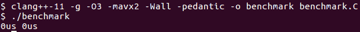

图 2.22

零时间，无论如何。出了什么问题？也许，单个函数调用的执行时间太快，无法测量？这不是一个坏猜测，我们可以很容易地解决这个问题：如果一个调用时间太短，我们只需要进行更多的调用：

```cpp
int main() {
  constexpr unsigned int N = 1 << 20;
  constexpr int NI = 1 << 11;
  unique_ptr<char[]> s(new char[2*N]);
  ::memset(s.get(), 'a', 2*N*sizeof(char));
  s[2*N-1] = 0;
  system_clock::time_point t0 = system_clock::now();
  for (int i = 0; i < NI; ++i) {
        compare1(s.get(), s.get() + N);
  }
  system_clock::time_point t1 = system_clock::now();
  for (int i = 0; i < NI; ++i) {
        compare2(s.get(), s.get() + N);
  }
  system_clock::time_point t2 = system_clock::now();
  cout << duration_cast<microseconds>(t1 - t0).count() <<
   "us " << duration_cast<microseconds>(t2 - t1).count() <<
     "us" << endl;
}
```

我们可以增加迭代次数`NI`直到获得一些结果，对吗？不要那么快：

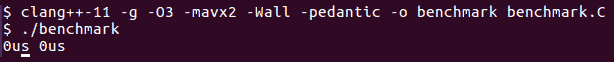

图 2.23

实际上太快了，但为什么？让我们在调试器中逐步执行程序，看看它实际上做了什么：

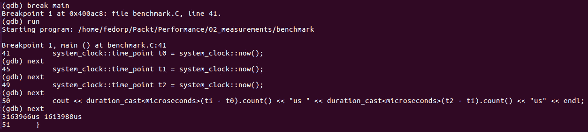

图 2.24

我们在`main`中设置断点，因此程序一启动就会暂停，然后我们逐行执行程序...除了我们编写的所有行之外！其他代码在哪里？我们可以猜想是编译器的问题，但为什么？我们需要更多了解编译器优化。

## 微基准测试和编译器优化

要理解这个缺失代码的奥秘，我们必须重新审视缺失代码实际上做了什么。它创建了一些字符串，调用了比较函数，然后……没有“然后”。除了在调试器中观察代码滚动之外，通过运行这个程序，你怎么知道这段代码是否被执行？你无法知道。编译器已经比我们提前到达了同样的结论。由于程序员无法区分执行和不执行代码的差异，编译器对其进行了优化。但是等等，你说，程序员*可以*区分：什么都不做比做一些事情要花费更少的时间。在这里，我们来到了 C++标准中非常重要的一个概念，这对于理解编译器优化至关重要：可观察行为。

标准规定，只要这些更改的效果不会改变可观察行为，编译器可以对程序进行任何更改。标准还非常明确地规定了什么构成了可观察行为：

1.  对 volatile 对象的访问（读取和写入）严格按照它们出现的表达式的语义进行。特别是，它们不会与同一线程上的其他 volatile 访问重新排序。

1.  在程序终止时，写入文件的数据与按原样执行程序时完全相同。

1.  发送到交互设备的提示文本将在程序等待输入之前显示。更一般地说，输入和输出操作不能被省略或重新排列。

前面的规则有一些例外情况，但都不适用于我们的程序。编译器必须遵循“as-if”规则：优化后的程序应该表现出与按行执行完全相同的可观察行为。现在注意一下前面的列表中没有包括的内容：在调试器下运行程序并不构成可观察行为。执行时间也不构成可观察行为，否则，没有程序可以被优化以使其更快。

有了这种新的理解，让我们再来看一下基准代码：字符串比较的结果以任何方式都不会影响可观察行为，因此整个计算可以由编译器自行决定是否执行或省略。这一观察还给了我们解决这个问题的方法：我们必须确保计算的结果影响可观察行为。其中一种方法是利用先前描述的 volatile 语义：

```cpp
int main() {
  constexpr unsigned int N = 1 << 20;
  constexpr int NI = 1 << 11;
  unique_ptr<char[]> s(new char[2*N]);
  ::memset(s.get(), 'a', 2*N*sizeof(char));
  s[2*N-1] = 0;
  volatile bool sink;
  system_clock::time_point t0 = system_clock::now();
  for (int i = 0; i < NI; ++i) {
     sink = compare1(s.get(), s.get() + N);
  }
  system_clock::time_point t1 = system_clock::now();
  for (int i = 0; i < NI; ++i) {
     sink = compare2(s.get(), s.get() + N);
  }
  system_clock::time_point t2 = system_clock::now();
  cout << duration_cast<microseconds>(t1 - t0).count() <<
   "us " << duration_cast<microseconds>(t2 - t1).count() <<
     "us" << endl;
}
```

现在，每次调用比较函数的结果都被写入一个 volatile 变量中，并且根据标准，这些值必须是正确的并按正确的顺序写入。编译器现在别无选择，只能调用我们的比较函数并获取结果。只要结果本身不改变，这些结果的计算方式仍然可以被优化。这正是我们想要的：我们希望编译器为比较函数生成最佳代码，希望它生成的代码与实际程序中生成的代码相同。我们只是不希望它完全删除这些函数。运行这个基准测试表明我们终于实现了我们的目标，代码肯定在运行：

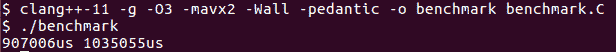

图 2.25

第一个值是`compare1()`函数的运行时间，它使用`int`索引，并且确实比`unsigned int`版本稍快（但不要对这些结果过于信任）。

将我们的计算与一些可观察行为纠缠在一起的第二个选项是简单地打印出结果。然而，这可能会有点棘手。考虑直接的尝试：

```cpp
int main() {
  constexpr unsigned int N = 1 << 20;
  constexpr int NI = 1 << 11;
  unique_ptr<char[]> s(new char[2*N]);
  ::memset(s.get(), 'a', 2*N*sizeof(char));
  s[2*N-1] = 0;
  bool sink;
  system_clock::time_point t0 = system_clock::now();
  for (int i = 0; i < NI; ++i) {
     sink = compare1(s.get(), s.get() + N);
  }
  system_clock::time_point t1 = system_clock::now();
  for (int i = 0; i < NI; ++i) {
     sink = compare2(s.get(), s.get() + N);
  }
  system_clock::time_point t2 = system_clock::now();
  cout << duration_cast<microseconds>(t1 - t0).count() <<
   "us " << duration_cast<microseconds>(t2 - t1).count() <<
     "us" << sink << endl;
}
```

请注意，变量`sink`不再是 volatile，而是我们写出它的最终值。这并不像你期望的那样有效：

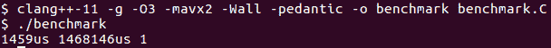

图 2.26

函数`compare2()`的执行时间与以前差不多，但`compare1()`现在似乎快得多。当然，到现在为止，我们已经知道足够多，以理解这种“改进”是虚幻的：编译器只是简单地发现第一次调用的结果被第二次调用覆盖，因此不会影响可观察的行为。

这带来了一个有趣的问题：为什么编译器没有发现循环的第二次迭代给出了与第一次相同的结果，并优化掉了除第一次之外的每次对比函数调用？如果优化器足够先进，它本来可以这样做，然后我们将不得不做更多工作来解决这个问题：通常，将函数编译为单独的编译单元足以防止任何此类优化，尽管一些编译器能够进行整个程序的优化，因此在运行微基准测试时可能需要关闭它们。

还要注意，我们的两次基准运行即使对于未被优化的函数的执行时间也产生了略有不同的值。如果再次运行程序，您将得到另一个值，也在同一范围内，但略有不同。这还不够好：我们需要的不仅仅是大致的数字。我们可以多次运行基准测试，找出我们需要多少次重复，并计算平均时间，但我们不必手动执行。我们也不必编写代码来执行此操作，因为这样的代码已经被编写并作为几种微基准测试工具之一可用。我们现在将学习其中一种工具。

## 谷歌基准测试

编写微基准测试涉及大量样板代码，主要用于测量时间和累积结果。此外，此代码对于测量的准确性至关重要。有几个高质量的微基准库可用。在本书中，我们使用谷歌基准库。有关下载和安装库的说明可以在*技术要求*部分找到。在本节中，我们将描述如何使用该库并解释结果。

要使用谷歌基准库，我们必须编写一个小程序，准备输入并执行我们想要进行基准测试的代码。这是一个用于测量我们的字符串比较函数性能的基本谷歌基准程序：

```cpp
#include "benchmark/benchmark.h"
using std::unique_ptr;
bool compare_int(const char* s1, const char* s2) {
  char c1, c2;
  for (int i1 = 0, i2 = 0; ; ++i1, ++i2) {
     c1 = s1[i1]; c2 = s2[i2];
     if (c1 != c2) return c1 > c2;
  }
}
void BM_loop_int(benchmark::State& state) {
  const unsigned int N = state.range(0);
  unique_ptr<char[]> s(new char[2*N]);
  ::memset(s.get(), 'a', 2*N*sizeof(char));
  s[2*N-1] = 0;
  const char* s1 = s.get(), *s2 = s1 + N;
  for (auto _ : state) {
     benchmark::DoNotOptimize(compare_int(s1, s2));
  }
  state.SetItemsProcessed(N*state.iterations());
}
BENCHMARK(BM_loop_int)->Arg(1<<20);
BENCHMARK_MAIN();
```

每个谷歌基准程序必须包括库的头文件`benchmark/benchmark.h`，当然，还有任何其他编译所需的头文件（它们在前面的清单中被省略了）。程序本身由许多基准“固定装置”组成，每个都只是一个具有特定签名的函数：它通过引用接受一个参数`benchmark::State`，并且不返回任何东西。该参数是由谷歌基准库提供的一个对象，用于与库本身进行交互。

我们需要为每个代码片段（例如我们想要进行基准测试的函数）创建一个固定装置。在每个基准装置中，我们要做的第一件事是设置我们需要用作代码输入的数据。更一般地说，我们可以说我们需要重新创建此代码的初始状态，以表示在真实程序中的情况。在我们的情况下，输入是字符串，因此我们需要分配和初始化字符串。我们可以将字符串的大小硬编码到基准测试中，但也有一种方法可以将参数传递给基准测试装置。我们的装置使用一个参数，即字符串长度，它是一个整数，通过`state.range(0)`访问。可以传递其他类型的参数，请参阅谷歌基准库的文档了解详情。

整个设置在基准测试测量方面是自由的：我们不测量准备数据所需的时间。被测量执行时间的代码放入基准测试循环的主体中，`for (auto _ : state) { … }`。在旧的例子中，您可以找到这个循环写成`while (state.KeepRunning()) { … }`，它做的事情是一样的，但效率稍低。该库测量每次迭代所需的时间，并决定要做多少次迭代以积累足够的测量结果，以减少在测量代码片段的运行时间时不可避免的随机噪音。只有基准测试循环内部的代码的运行时间被测量。

当测量足够准确时（或达到一定的时间限制）循环退出。循环之后，我们通常有一些代码来清理之前初始化的数据，尽管在我们的情况下，这个清理是由`std::unique_ptr`对象的析构函数处理的。我们还可以调用状态对象来影响基准测试报告的结果。该库总是报告运行循环的一次迭代所需的平均时间，但有时以其他方式表达程序速度更方便。对于我们的字符串比较，一种选择是报告代码每秒处理的字符数。我们可以通过调用`state.SetItemsProcessed()`来实现，其中包括我们在整个运行过程中处理的字符数，每次迭代处理`N`个字符（或者如果要计算两个子字符串，则为`2*N`；*items*可以计算您定义为处理单位的任何内容）。

仅仅定义了一个基准测试装置并不会有任何作用，我们需要在库中注册它。这是使用`BENCHMARK`宏完成的；宏的参数是函数的名称。顺便说一下，该名称并没有什么特别之处，它可以是任何有效的 C++标识符；我们的名称以`BM_`开头只是我们在本书中遵循的命名约定。`BENCHMARK`宏也是您将指定要传递给基准测试装置的任何参数的地方。使用重载的箭头运算符传递基准测试的参数和其他选项，例如：

```cpp
BENCHMARK(BM_loop_int)->Arg(1<<20);
```

这行代码使用一个参数`1<<20`注册了基准测试装置`BM_loop_int`，可以通过调用`state.range(0)`在装置内检索到。在本书中，我们将看到更多不同参数的示例，甚至可以在库文档中找到更多。

您还会注意到在前面的代码清单中没有`main()`；相反，有另一个宏，`BENCHMARK_MAIN()`。`main()`不是我们编写的，而是由 Google Benchmark 库提供的，它完成了设置基准测试环境、注册基准测试和执行基准测试的所有必要工作。

让我们回到我们想要测量的代码并更仔细地检查一下：

```cpp
  for (auto _ : state) {
     benchmark::DoNotOptimize(compare_int(s1, s2));
  }
```

`benchmark::DoNotOptimize(…)`包装函数的作用类似于我们之前使用的`volatile` sink：它确保编译器不会优化掉对`compare_int()`的整个调用。请注意，它实际上并没有关闭任何优化；特别是括号内的代码通常会像我们想要的那样进行优化。它所做的只是告诉编译器，表达式的结果，在我们的情况下是比较函数的返回值，应该被视为“已使用”，就像它被打印出来一样，不能简单地被丢弃。

现在我们准备编译和运行我们的第一个微基准测试：

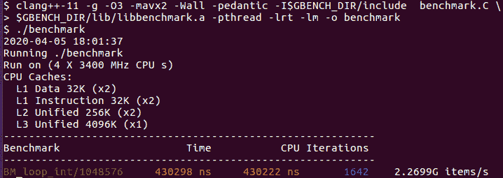

图 2.27

现在编译行必须列出 Google 基准`include`文件和库的路径；Google 基准库`libbenchmark.a`需要几个额外的库。一旦调用，基准程序会打印一些关于我们正在运行的系统的信息，然后执行所有已注册的 fixture 及其所有参数。对于每个基准 fixture 和一组参数，我们会得到一行输出；报告包括每次基准循环体的平均实际时间和平均 CPU 时间，循环执行的次数，以及我们附加到报告的任何其他统计信息（在我们的情况下，每秒处理的字符数，超过 2G 字符每秒）。

这些数字每次运行时有多大的变化？如果我们使用正确的命令行参数启用统计信息收集，基准库可以为我们计算出来。例如，要重复进行基准测试十次并报告结果，我们会这样运行基准测试：

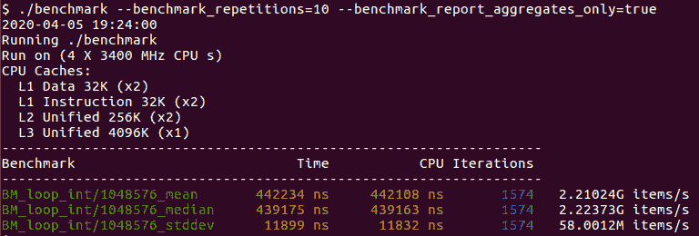

图 2.28

看起来测量结果相当准确；标准偏差相当小。现在我们可以对比不同变体的子字符串比较函数，并找出哪一个是最快的。但在我们这样做之前，我必须告诉你一个大秘密。

## 微基准测试是谎言

当你开始运行越来越多的微基准测试时，你很快就会发现这一点。起初，结果是合理的，你进行了良好的优化，一切看起来都很好。然后你做了一些小改变，得到了一个完全不同的结果。你回去调查，现在你已经运行过的相同测试给出了完全不同的数字。最终，你找到了两个几乎相同的测试，结果完全相反，你意识到你不能相信微基准测试。它会摧毁你对微基准测试的信心，我现在唯一能做的就是以一种可控的方式摧毁它，这样我们还能从废墟中挽救一些东西。

微基准测试和任何其他详细的性能测量的根本问题是它们强烈依赖于上下文。当你阅读本书的其余部分时，你会越来越明白现代计算机的性能行为是非常复杂的。结果不仅仅取决于代码在做什么，还取决于系统的其余部分在同一时间在做什么，以及之前它在做什么，以及执行路径在到达感兴趣点之前经过的情况。这些事情在微基准测试中都没有被复制。

相反，基准测试有它自己的上下文。基准测试库的作者并不对这个问题一无所知，并且他们尽力去对抗它。例如，你看不到的是，Google 基准库对每个测试进行了*烧入*：最初的几次迭代可能具有与运行的其余部分非常不同的性能特征，因此库会忽略初始测量，直到结果"稳定"。但这也定义了一个特定的上下文，可能与每次调用函数只重复一次的真实程序不同（另一方面，有时我们确实会在程序运行中多次使用相同的参数调用相同的函数，所以这可能是一个不同的上下文）。

在运行基准测试之前，没有什么可以忠实地复制大型程序的真实环境的每一个细节。但是有些细节比其他细节更重要。特别是，上下文差异的最大来源远远是编译器，或者更具体地说，是编译器在真实程序与微基准测试上所做的优化。我们已经看到编译器如何顽固地试图弄清楚整个微基准测试基本上是一种非常缓慢的无用操作（或者至少是不可观察的无用操作），并用更快的方式替换它。我们之前使用的`DoNotOptimize`包装器可以解决一些由编译器优化引起的问题。

然而，仍然存在这样的可能性，即编译器可能会发现每次调用函数都返回相同的结果。此外，由于函数定义与调用点在同一个文件中，编译器可以内联整个函数，并使用它可以收集到的关于参数的任何信息来优化函数代码。当函数从另一个编译单元调用时，在一般情况下这样的优化是不可用的。

为了更准确地在我们的微基准测试中表示真实情况，我们可以将比较函数移动到它自己的文件中，并将其单独编译。现在我们有一个文件（编译单元），其中只有基准测试的固定装置：

```cpp
#include "benchmark/benchmark.h"
extern bool compare_int(const char* s1, const char* s2);
extern bool compare_uint(const char* s1, const char* s2);
extern bool compare_uint_l(const char* s1, const char* s2,
  unsigned int l);
void BM_loop_int(benchmark::State& state) {
  const unsigned int N = state.range(0);
  unique_ptr<char[]> s(new char[2*N]);
  ::memset(s.get(), 'a', 2*N*sizeof(char));
  s[2*N-1] = 0;
  const char* s1 = s.get(), *s2 = s1 + N;
  for (auto _ : state) {
     benchmark::DoNotOptimize(compare_int(s1, s2));
  }
  state.SetItemsProcessed(N*state.iterations());
}
void BM_loop_uint(benchmark::State& state) {
  … compare_uint(s1, s2) …
}
void BM_loop_uint_l(benchmark::State& state) {
  … compare_uint_l(s1, s2, 2*N) …
}
BENCHMARK(BM_loop_int)->Arg(1<<20);
BENCHMARK(BM_loop_uint)->Arg(1<<20);
BENCHMARK(BM_loop_uint_l)->Arg(1<<20);
```

我们可以分别编译文件，然后将它们链接在一起（任何完整程序的优化都必须关闭）。现在我们有一个合理的期望，即编译器没有生成某种特殊的减少版本的子字符串比较，因为它根据我们在基准测试中使用的参数所得出的结论。仅凭这个简单的预防措施，结果就更加符合我们在对整个程序进行性能分析时观察到的情况：

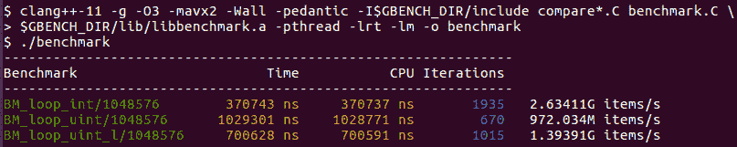

图 2.29

代码的初始版本使用了`unsigned int`索引和循环中的边界条件（最后一行）；简单地删除那个完全不必要的边界条件检查导致了令人惊讶的性能下降（中间行）；最后，将索引更改为`signed int`恢复了丢失的性能，甚至提高了性能（第一行）。

通常，将代码片段分别编译就足以避免任何不需要的优化。不太常见的是，您可能会发现编译器对同一文件中的特定代码块进行不同的优化，这取决于文件中还有什么其他内容。这可能只是编译器中的一个错误，但也可能是某种启发式的结果，在编译器编写者的经验中，这种启发式更常常是正确的。如果您观察到结果取决于根本没有执行的某些代码，只是编译了的代码，这可能就是原因。一个解决方案是使用真实程序中的编译单元，然后只调用您想要进行基准测试的函数。当然，您将不得不满足编译和链接的依赖关系，这就是编写模块化代码和最小化依赖关系的另一个原因。

另一个上下文的来源是计算机本身的状态。显然，如果整个程序耗尽了内存并且正在在交换区中循环页面，您的小内存基准测试将无法代表真实问题；另一方面，问题现在不在于“慢”代码，问题在于其他地方消耗了太多内存。然而，这种上下文依赖的更微妙的版本存在，并可能影响基准测试。通常这种情况的一个显著迹象是：结果取决于测试执行的顺序（在微基准测试中，是`BENCHMARK`宏的顺序）。如果重新排序测试或仅运行一部分测试会产生不同的结果，那么它们之间存在某种依赖关系。这可能是代码依赖，通常是一些全局数据结构中的数据累积。或者它可能是对硬件状态的微妙依赖。这些更难以弄清楚，但您将在本书的后面学习到一些导致这种依赖的情况。

最后，有一个主要的上下文依赖来源完全掌握在您手中（这并不一定意味着容易避免，但至少是可能的）。这是对程序状态的依赖。我们已经不得不处理这种依赖的最明显方面：我们想要对代码进行基准测试的输入。有时，输入是已知的或可以重建的。通常，性能问题只发生在某些类型的输入下，我们不知道它们有何特殊之处，直到我们分析具有这些特定输入的代码的性能，这正是我们一开始尝试用微基准测试来做的。在这种情况下，通常最容易的方法是从真实程序的真实运行中捕获输入，将它们存储在文件中，并使用它们来重新创建我们正在测量的代码的状态。这个输入可能是简单的数据集合，也可能是需要记录和“回放”到事件处理程序以重现所需行为的事件序列。

我们需要重建的状态越复杂，就越难在部分基准测试中重现真实程序的性能行为。请注意，这个问题在某种程度上类似于编写单元测试的问题：如果程序无法分解为具有简单状态的较小单元，编写单元测试也会更加困难。再次看到了良好设计的软件系统的优势：具有良好单元测试覆盖率的代码库通常更容易进行微基准测试，逐步进行测试。

当我们开始本节时，您已经被警告，这部分内容旨在部分恢复您对微基准测试的信心。它们可以是一个有用的工具，正如我们在本书中多次看到的那样。它们也可能误导您，有时甚至误导得很远。现在您了解了一些原因，更有准备去尝试从结果中恢复有用的信息，而不是完全放弃小规模基准测试。

本章介绍的工具都不是解决所有问题的解决方案；它们也不是用来解决所有问题的。通过使用这些工具以各种方式收集信息，它们可以相互补充，从而实现最佳结果。

# 摘要

在本章中，您学到了整本书中可能最重要的一课：谈论性能而不参考具体的测量是没有意义的，甚至是不切实际的。其余的内容主要是技艺：我们介绍了几种测量性能的方法，从整个程序开始，逐渐深入到单行代码。

一个大型高性能项目将会看到本章中学到的每种工具和方法被使用不止一次。粗略的测量 - 对整个程序或其大部分进行基准测试和分析 - 指向了需要进一步调查的代码区域。通常会跟随额外的基准测试轮次或更详细的分析。最终，你会确定需要优化的代码部分，问题变成了，“我该如何更快地做到这一点？”在这一点上，你可以使用微基准测试或其他小规模基准测试来尝试优化的代码。你甚至可能会发现你对这段代码的理解并不如你想象的那么多，需要对其性能进行更详细的分析；不要忘记你可以对微基准进行分析！

最终，你将拥有一个在小型基准测试中看起来有利的性能关键代码的新版本。但是，不要假设任何事情：现在你必须测量你的优化或增强对整个程序的性能。有时，这些测量将确认你对问题的理解并验证其解决方案。在其他时候，你会发现问题并不是你所想象的那样，而优化虽然本身有益，但对整个程序的效果并不如预期（甚至可能使情况变得更糟）。现在你有了一个新的数据点，你可以比较旧解决方案和新解决方案的分析，并在这种比较中揭示的差异中寻找答案。

高性能程序的开发和优化几乎从来都不是一个线性的、一步一步的过程。相反，它经历了许多从高层概述到低层详细工作再返回的迭代。在这个过程中，你的直觉起着一定的作用；只是确保始终测试和确认你的期望，因为在性能方面，没有什么是真正明显的。

在下一章中，我们将看到我们之前遇到的谜团的解决方案：删除不必要的代码会使程序变慢。为了做到这一点，我们必须了解如何有效地利用 CPU 以获得最佳性能，整个下一章都致力于此。

# 问题

1.  为什么性能测量是必要的？

1.  为什么我们需要这么多不同的性能测量方法？

1.  手动基准测试的优势和局限性是什么？

1.  分析如何用于性能测量？

1.  小规模基准测试，包括微基准测试的用途是什么？
