# 第三章：CPU 架构、资源和性能

通过本章，我们开始探索计算硬件：我们想知道如何最佳地使用它，并从中挤出最佳性能。我们首先要了解的硬件组件是中央处理器。CPU 执行所有计算，如果我们没有有效地使用它，那么没有什么能拯救我们慢速、性能不佳的程序。本章致力于学习 CPU 资源和能力，最佳使用它们的方式，未能充分利用 CPU 资源的更常见原因，以及如何解决它们。

在本章中，我们将涵盖以下主要主题：

+   现代 CPU 的架构

+   利用 CPU 的内部并发以获得最佳性能

+   CPU 流水线和推测执行

+   分支优化和无分支计算

+   如何评估程序是否有效地使用 CPU 资源

# 技术要求

再次，您将需要一个 C++编译器和一个微基准测试工具，比如我们在上一章中使用的 Google Benchmark 库（位于[`github.com/google/benchmark`](https://github.com/google/benchmark)）。我们还将使用**LLVM 机器码分析器**（**LLVM-MCA**），位于[`llvm.org/docs/CommandGuide/llvm-mca.html`](https://llvm.org/docs/CommandGuide/llvm-mca.html)。如果您想使用 MCA，您的编译器选择将更有限：您需要一个基于 LLVM 的编译器，比如 Clang。

本章的代码可以在[`github.com/PacktPublishing/The-Art-of-Writing-Efficient-Programs/tree/master/Chapter03`](https://github.com/PacktPublishing/The-Art-of-Writing-Efficient-Programs/tree/master/Chapter03)找到。

# 性能始于 CPU

正如我们在前几章中观察到的，一个高效的程序是充分利用可用硬件资源并不浪费它们在不需要的任务上的程序。一个高性能的程序不能如此简单地描述，因为性能只能针对特定目标来定义。尽管如此，在本书中，特别是在本章中，我们主要关注计算性能或吞吐量：*我们能用现有的硬件资源多快地解决一个给定的问题？*这种性能类型与效率密切相关：如果我们的程序执行的每个计算都让我们更接近结果，并且在每一刻都尽可能多地进行计算，那么我们的程序将更快地提供结果。

这带我们来到下一个问题：*比如说，一秒钟内可以做多少计算？*答案当然取决于你拥有什么硬件，有多少硬件，以及你的程序能够有效地使用多少。任何程序都需要多个硬件组件：处理器和内存，显然，但对于任何分布式程序还需要网络，对于操纵大量外部数据的任何程序还需要存储和其他 I/O 通道，可能还需要其他硬件，具体取决于程序的功能。但一切都始于处理器，因此，我们的高性能编程探索也必然从这里开始。此外，在本章中，我们将限制自己在单个执行线程上；并发将在后面讨论。

在这个更狭窄的焦点下，我们可以定义本章的主题：*如何使用单个线程最佳地利用 CPU 资源*。要理解这一点，我们首先需要探索 CPU 具有哪些资源。当然，不同世代和不同型号的处理器将具有不同的硬件能力组合，但本书的目标是双重的：首先，给你一个对主题的一般理解，其次，为你提供获取更详细和具体知识所需的工具。任何现代 CPU 上可用的计算资源的一般概述可概括为*它很复杂*。为了说明这一点，考虑一下英特尔 CPU 的芯片图像：

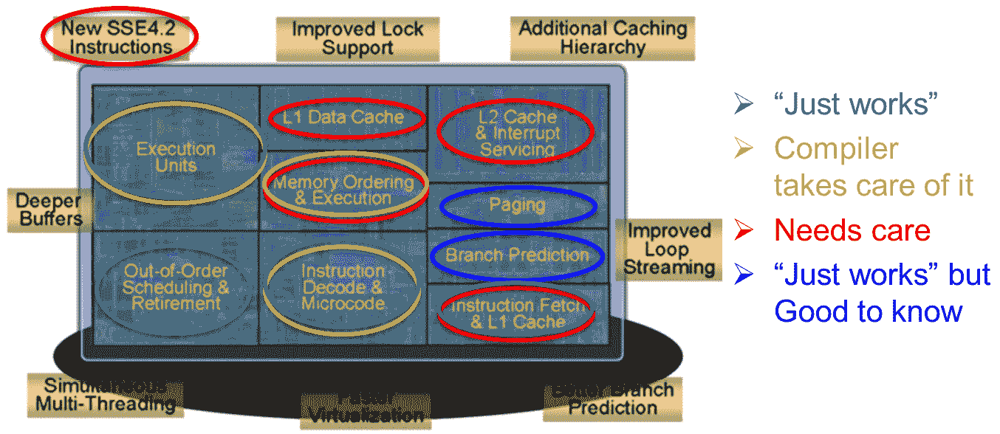

图 3.1 - 带有功能区域标记的奔腾 CPU 芯片图像（来源：英特尔）

在图像的顶部叠加了主要功能区域的描述。如果这是你第一次看到这样的图像，最令人震惊的细节可能是执行单元，也就是实际进行加法、乘法和其他我们认为是 CPU 主要功能的操作的部分，实际上并没有占据整个硅片的四分之一。其余部分是*其他东西*，其基本目的是使加法和乘法能够有效地工作。第二个更实际相关的观察是：处理器有许多具有不同功能的组件。其中一些组件基本上可以自行工作，程序员几乎不需要做什么来充分利用它们。有些需要仔细安排机器代码，幸运的是，这大部分是由编译器完成的。但是超过一半的硅片面积都专门用于那些不仅仅是*自我优化*的组件：为了使处理器发挥最大性能，程序员需要了解它们的工作原理，它们能做什么，不能做什么，以及什么影响了它们操作的效率（无论是积极的还是消极的）。即使是那些自行工作良好的部分，如果真的需要异常的性能，也可以从程序员的关注中受益。

有许多关于处理器架构的书籍，包括设计者用来提高其作品性能的所有硬件技术。这些书籍可以成为宝贵的知识和理解的来源。这本书不会是又一本这样的书。它所具有的硬件描述和解释，服务于不同的目标：在这里，我们将专注于您可以探索硬件性能的实际方法，从 CPU 开始。我们将在下一节中立即开始这项探索。

# 用微基准测试探索性能

前一节的结果可能让你有些畏缩：处理器非常复杂，显然需要程序员大量辅助才能达到最高效率。让我们从小处着手，看看处理器可以多快地执行一些基本操作。为此，我们将使用上一章中使用过的**Google Benchmark**工具。这是一个用于简单数组相加的基准测试：

```cpp
#include "benchmark/benchmark.h"
void BM_add(benchmark::State& state) {
     srand(1);
     const unsigned int N = state.range(0);
     std::vector<unsigned long> v1(N), v2(N);
     for (size_t i = 0; i < N; ++i) {
           v1[i] = rand();
           v2[i] = rand();
     }
     unsigned long* p1 = v1.data();
     unsigned long* p2 = v2.data();
     for (auto _ : state) {
           unsigned long a1 = 0;
           for (size_t i = 0; i < N; ++i) {
                 a1 += p1[i] + p2[i];
           }
           benchmark::DoNotOptimize(a1);
           benchmark::ClobberMemory();
     }
     state.SetItemsProcessed(N*state.iterations());
}
BENCHMARK(BM_add)->Arg(1<<22);
BENCHMARK_MAIN();
```

在这个第一个例子中，我们展示了所有细节的基准测试，包括输入生成。虽然大多数操作的速度不取决于操作数的值，但我们将使用随机输入值，这样当我们进行对输入值敏感的操作时就不必担心了。还要注意的是，虽然我们将值存储在向量中，但我们不想对向量索引的速度进行基准测试：编译器几乎肯定会优化表达式`v1[i]`以产生与`p1[i]`完全相同的代码，但为什么要冒险呢？我们排除尽可能多的非必要细节，直到我们只剩下最基本的问题：我们在内存中有两个数组的值，我们想对这些数组的每个元素进行一些计算。

另一方面，我们必须关注不希望的编译器优化的可能性：编译器可能会发现整个程序只是一种非常长的无用操作（至少就 C++标准而言），并通过优化掉代码的大部分来找到更快的方法。编译器指示不要优化计算结果，并假设内存状态在基准测试迭代之间可以改变，应该防止这种优化。同样重要的是不要走向另一个极端：例如，将变量`a1`声明为`volatile`肯定会阻止大多数不希望的优化。不幸的是，它也会阻止编译器优化循环本身，这并不是我们想要的：我们想要看到 CPU 如何高效地对两个数组进行加法，这意味着生成最有效的代码。我们只是不希望编译器发现基准测试循环的第一次迭代与第二次迭代完全相同。

请注意，这是微基准的一个不太常见的应用：通常情况下，我们有一小段代码，我们想知道它有多快，以及如何使它更快。在这里，我们使用微基准来了解处理器的性能，通过调整代码的方式来获得一些见解。

基准测试应该在打开优化的情况下进行编译。运行此基准测试将产生类似以下的结果（确切的数字当然取决于您的 CPU）：

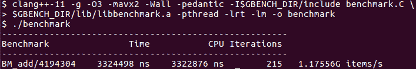

图 3.2

到目前为止，除了现代 CPU 速度很快之外，我们无法从这个实验中得出太多结论：它们可以在不到一纳秒的时间内添加两个数字。如果你感兴趣，你可以在这一点上探索其他操作：减法和乘法所花费的时间与加法完全相同，而整数除法则相当昂贵（比加法慢三到四倍）。

为了分析我们的代码的性能，我们必须以处理器看到的方式来看待它，这里发生的事情远不止简单的加法。两个输入数组存储在内存中，但加法或乘法操作是在寄存器中的值之间执行的（或者可能是在寄存器和内存位置之间执行，对于某些操作）。这就是处理器逐步看到我们循环的一次迭代。在迭代开始时，索引变量`i`在一个 CPU 寄存器中，两个对应的数组元素`v1[i]`和`v2[i]`在内存中：

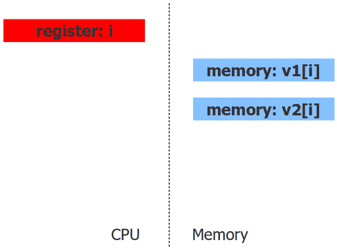

图 3.3 - 第 i 次循环迭代开始时的处理器状态

在我们做任何事情之前，我们必须将输入值移入寄存器。必须为每个输入分配一个寄存器，再加上一个寄存器用于结果。在给定的循环迭代中，第一条指令将一个输入加载到寄存器中：

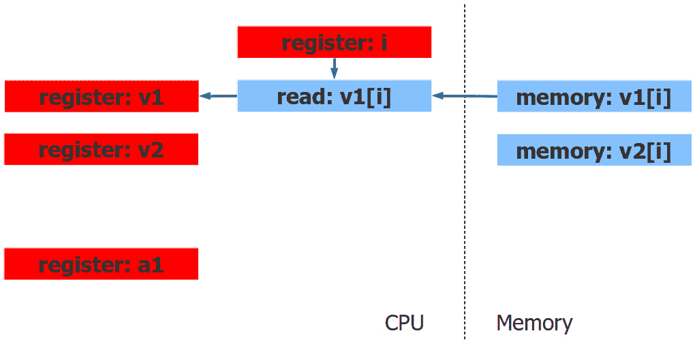

图 3.4 - 第 i 次迭代的第一条指令后的处理器状态

读取（或加载）指令使用包含索引`i`和数组`v1`位置的寄存器来访问值`v1[i]`并将其复制到寄存器中。下一条指令类似地加载第二个输入：

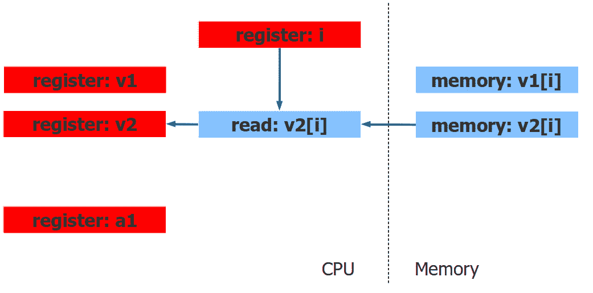

图 3.5 - 第 i 次迭代的第二条指令后的处理器状态

现在我们终于准备好执行加法或乘法等操作了：

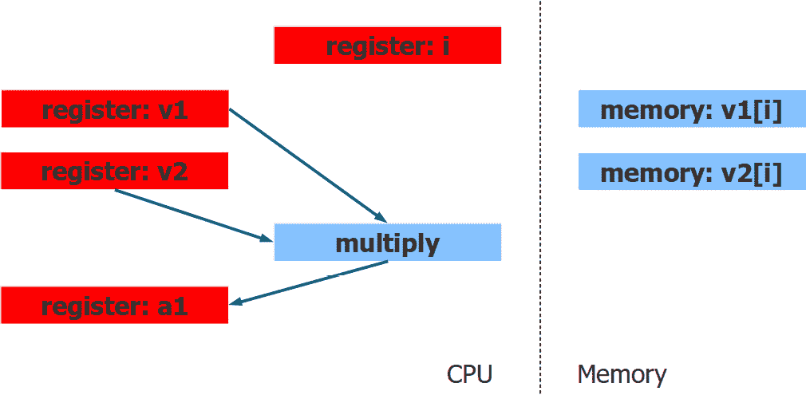

图 3.6 - 第 i 次循环迭代结束时的处理器状态

这行简单的代码在转换为硬件指令后产生了所有这些步骤（以及推进到循环的下一个迭代所需的操作）：

```cpp
a1 += p1[i] + p2[i];
```

从效率的角度来看，我们希望关注最后一步：我们的 CPU 可以在不到一纳秒的时间内对两个数字进行加法或乘法运算，这还不错，但它还能做更多吗？许多晶体管专门用于处理和执行指令，因此它们必须还能做更多。让我们尝试在相同的值上执行两个操作，而不仅仅是一个：

```cpp
void BM_add_multiply(benchmark::State& state) {
     … prepare data …
     for (auto _ : state) {
           unsigned long a1 = 0, a2 = 0;
           for (size_t i = 0; i < N; ++i) {
                 a1 += p1[i] + p2[i];
                 a2 += p1[i] * p2[i];
           }
           benchmark::DoNotOptimize(a1);
           benchmark::DoNotOptimize(a2);
           benchmark::ClobberMemory();
     }
     state.SetItemsProcessed(N*state.iterations());
}
```

如果加法需要一纳秒，乘法需要一纳秒，那么两者需要多长时间？基准测试给出了答案：

图 3.7 – 单条指令和两条指令的基准测试

](img/Figure_3.7_B16229.jpg)

图 3.7 – 单条指令和两条指令的基准测试

令人惊讶的是，这里的一加一等于一。我们可以在一个迭代中添加更多的指令：

```cpp
           for (size_t i = 0; i < N; ++i) {
                 a1 += p1[i] + p2[i];
                 a2 += p1[i] * p2[i];
                 a3 += p1[i] << 2;
                 a4 += p2[i] – p1[i];
           }
```

每次迭代的时间仍然相同（轻微差异在基准测试测量的精度范围内）：

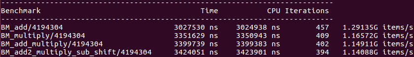

图 3.8 – 每次迭代最多四条指令的循环基准测试

似乎我们对处理器一次执行一条指令的观点需要修订：

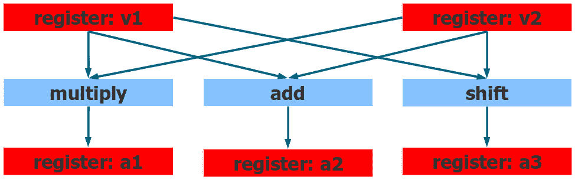

图 3.9 – 处理器在单个步骤中执行多个操作

只要操作数已经在寄存器中，处理器就可以同时执行多个操作。这被称为**指令级并行性**（**ILP**）。当然，可以执行的操作数量是有限的：处理器只有那么多能够进行整数计算的执行单元。尽管如此，通过在一个迭代中添加越来越多的指令来尝试推动 CPU 的极限是很有教育意义的：

```cpp
           for (size_t i = 0; i < N; ++i) {
                 a1 += p1[i] + p2[i];
                 a2 += p1[i] * p2[i];
                 a3 += p1[i] << 2;
                 a4 += p2[i] – p1[i];
                 a5 += (p2[i] << 1)*p2[i];
                 a6 += (p2[i] - 3)*p1[i];
           }
```

处理器可以执行的确切指令数量取决于 CPU 和指令，但是与单个乘法相比，上一个循环显示出明显的减速，至少在我使用的机器上是这样的：

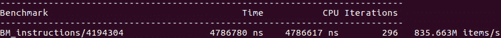

图 3.10 – 每次迭代八条指令的基准测试

现在您可以欣赏到我们原始代码在硬件利用方面是多么低效：CPU 显然可以在每次迭代中执行五到七个不同的操作，因此我们的单个乘法甚至没有占用其四分之一的能力。事实上，现代处理器的能力更加令人印象深刻：除了我们一直在进行实验的整数计算单元之外，它们还具有专门用于执行`double`或`float`值的指令的独立浮点硬件，以及同时执行 MMX、SSE、AVX 和其他专门指令的矢量处理单元！

## 可视化指令级并行性

到目前为止，我们对 CPU 能够并行执行多条指令的能力的结论是基于强有力但间接的证据。从**机器码分析器**（**MCA**）可以得到直接证实，这是确实发生的。分析器是 LLVM 工具链的一部分。分析器以汇编代码作为输入，并报告有关指令执行方式、延迟和瓶颈等方面的大量信息。我们不打算在这里学习这个高级工具的所有功能（有关详细信息，请参阅项目主页[`llvm.org/docs/CommandGuide/llvm-mca.html`](https://llvm.org/docs/CommandGuide/llvm-mca.html)）。但是，我们现在可以使用它来查看 CPU 如何执行我们的操作。

第一步是使用分析器标记代码，以选择要分析的代码部分：

```cpp
#define MCA_START __asm volatile("# LLVM-MCA-BEGIN");
#define MCA_END __asm volatile("# LLVM-MCA-END");
           …
         for (size_t i = 0; i < N; ++i) {
MCA_START
                 a1 += p1[i] + p2[i];
MCA_END
           }
```

您不必为分析器标记使用`#define`，但我发现记住这些命令比记住确切的汇编语法更容易（您可以将`#define`行保存在头文件中，并根据需要包含它）。为什么我们只标记了循环体而不是整个循环进行分析？分析器实际上假设所选的代码片段在循环中运行，并重复了一些迭代次数（默认为十次）。您可以尝试标记整个循环进行分析，但是根据编译器的优化，这可能会使分析器混淆（这是一个强大的工具，但在撰写本文时并不容易使用或特别健壮）。

我们现在可以运行分析器了：

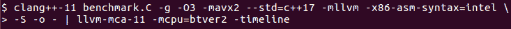

图 3.11

请注意，我们没有将代码编译成可执行文件，而是生成了 Intel 语法的汇编输出（`-S`）。输出被导入分析器；分析器可以以许多方式报告结果，我们选择了时间表输出。时间表视图显示每条指令在执行过程中的移动。让我们分析两个代码片段，一个只有一个操作（加法或乘法），另一个有两个操作。这是只有一个乘法的迭代的时间表（我们已经删除了时间表中间的所有行）：

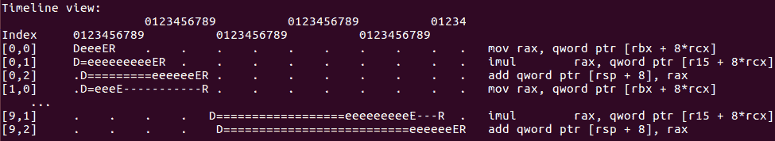

图 3.12

水平轴是周期时间。分析器模拟运行所选代码片段进行十次迭代；每条指令都用代码中的顺序号和迭代索引来标识，因此第一次迭代的第一条指令的索引是`[0,0]`，最后一条指令的索引是`[9,2]`。这最后一条指令也是第十次迭代的第三条指令（每次迭代只有三条指令）。整个序列根据时间轴花费了 55 个周期。

现在让我们添加另一个使用已经从内存中读取的值`p1[i]`和`p2[i]`的操作：

```cpp
#define MCA_START __asm volatile("# LLVM-MCA-BEGIN");
#define MCA_END __asm volatile("# LLVM-MCA-END");
           …
         for (size_t i = 0; i < N; ++i) {
MCA_START
                 a1 += p1[i] + p2[i];
                 a2 += p1[i] * p2[i];
MCA_END
           }
```

让我们看一下每次迭代有两个操作的代码的时间表，一个是加法，一个是乘法：

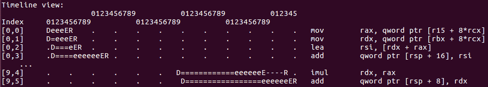

图 3.13

现在执行的指令数量增加了很多，每次迭代有六条指令（最后一条指令的索引是`[9,5]`）。然而，时间表的持续时间只增加了一个周期：在*图 3.12*中，时间表在第 54 个周期结束，而在*图 3.13*中，它在第 55 个周期结束。正如我们所怀疑的那样，处理器设法在相同的时间内执行了两倍的指令。

您可能还注意到，到目前为止，我们所有的基准测试都增加了对相同输入值的操作次数（加法、减法、乘法等）。我们得出结论，这些额外的操作在运行时来说是*免费*的（在一定程度上）。这是一个重要的一般性教训：一旦您在寄存器中有了一些值，对相同的值进行计算可能不会给您带来任何性能损失，除非您的程序已经非常高效，并且已经极限地利用了硬件。不幸的是，这个实验和结论的实际价值有限。有多少次您的所有计算都只是在少数几个输入上进行，下一次迭代使用自己的输入，并且您可以找到更多有用的计算来处理相同的输入？并不是从来没有，但很少。任何试图扩展我们对 CPU 计算能力的简单演示的尝试都将遇到一个或多个复杂性。第一个是数据依赖：循环的顺序迭代通常不是独立的；相反，每次迭代都需要来自前几次迭代的一些数据。我们将在下一节中探讨这种情况。

# 数据依赖和流水线

到目前为止，我们对 CPU 功能的分析表明，只要操作数已经在寄存器中，处理器就可以同时执行多个操作：我们可以评估一个相当复杂的表达式，只要花费与这些值相加的时间一样多。*只取决于两个值*的限定词，不幸的是，这是一个非常严重的限制。现在我们考虑一个更现实的代码示例，我们不需要对我们的代码进行太多更改：

```cpp
for (size_t i = 0; i < N; ++i) {
     a1 += (p1[i] + p2[i])*(p1[i] - p2[i]);
}
```

回想一下，旧代码中有相同的循环，但主体更简单：`a1 += (p1[i] + p2[i]);`。此外，`p1[i]`只是向量元素`v1[i]`的别名，`p2`和`v2`也是如此。为什么这段代码更复杂？我们已经看到处理器可以在一个周期内进行加法、减法和乘法，而表达式仍然只取决于两个值，`v1[i]`和`v2[i]`。然而，这个表达式不能在一个周期内评估。为了澄清这一点，我们引入了两个临时变量，它们实际上只是在表达式评估过程中的中间结果的名称：

```cpp
for (size_t i = 0; i < N; ++i) {
     s[i] = (p1[i] + p2[i]);
     d[i] = (p1[i] - p2[i]);
     a1[i] += s[i]*d[i];
}
```

加法和减法的结果`s[i]`和`d[i]`可以在同一时间进行评估，就像我们之前看到的那样。然而，最后一行直到我们有了`s[i]`和`d[i]`的值才能执行。无论 CPU 可以同时执行多少次加法和乘法：你不能计算输入未知的操作的结果；因此，CPU 必须等待乘法的输入准备就绪。第 i 次迭代必须分两步执行：首先，我们必须加法和减法（我们可以同时进行），其次，我们必须乘以结果。现在迭代需要两个周期而不是一个，因为计算的第二步取决于第一步产生的**数据**：

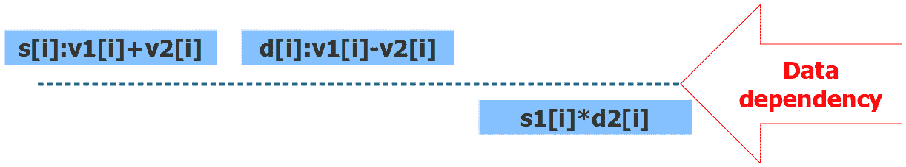

图 3.14 - 循环评估中的数据依赖

即使 CPU 有资源可以同时执行所有三个操作，由于我们计算中固有的数据依赖性，我们无法利用这种能力。当然，这严重限制了我们如何有效地使用处理器。数据依赖在程序中非常常见，但幸运的是，硬件设计者提出了一个有效的解决方法。仔细考虑*图 3.14*。我们有乘法硬件单元在我们计算`s[i]`和`d[i]`的值时闲置着。我们不能提前开始计算它们的乘积，但我们可以做另一件事：我们可以同时计算上一次迭代中`s[i-1]`和`d[i-1]`的值。现在循环的两次迭代在时间上交错进行：

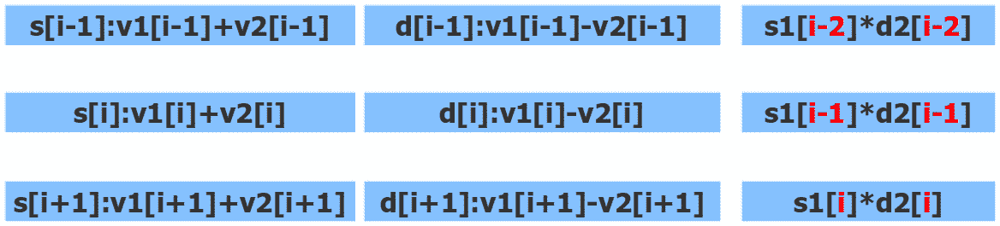

图 3.15 - 流水线：行对应于连续的迭代；同一行中的所有操作同时执行

这种代码的转换被称为**流水线**：一个复杂的表达式被分解成阶段，并在流水线中执行，前一个表达式的第二阶段与下一个表达式的第一阶段同时运行（更复杂的表达式会有更多的阶段，需要更深的流水线）。如果我们的期望是正确的，只要有很多次迭代，CPU 就能够像单个乘法一样快速计算我们的两阶段加减乘表达式：第一次迭代将需要两个周期（先加减，然后乘），这是无法避免的。同样地，最后一次迭代将以单个乘法结束，我们无法同时做其他事情。然而，在中间的所有迭代中，将同时执行三个操作。我们已经知道我们的 CPU 可以同时进行加法、减法和乘法。乘法属于循环的不同迭代这个事实并不重要。

我们可以通过直接的基准测试来确认我们的期望，比较每次循环迭代执行一次乘法所需的时间和执行我们的两步迭代所需的时间：

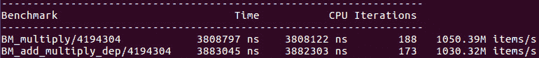

图 3.16

如预期的那样，两个循环的运行速度基本相同。我们可以得出结论，流水线完全抵消了数据依赖造成的性能损失。请注意，流水线并没有消除数据依赖；每个循环迭代仍然需要在两个阶段中执行，第二阶段依赖于第一阶段的结果。然而，通过交错计算不同阶段的计算，流水线确实消除了由此依赖引起的低效（至少在理想情况下，这是我们目前的情况）。通过机器代码分析器的结果，我们可以更直接地确认这一点：

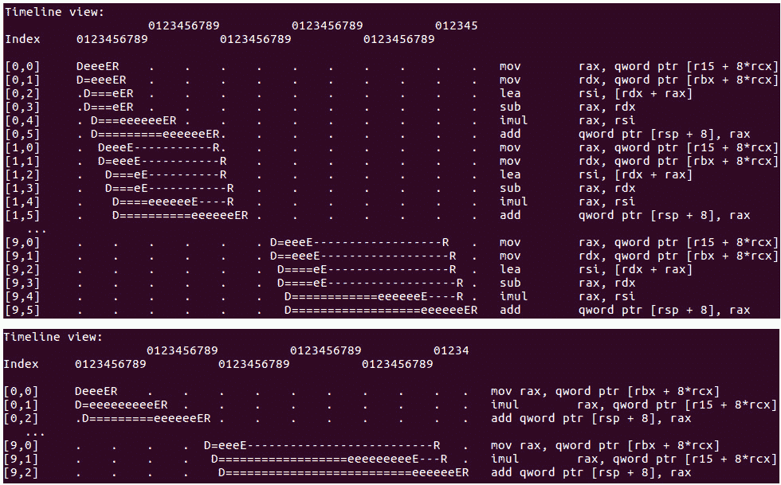

图 3.17 – 流水线加减乘循环的时间轴视图（顶部）与单个乘法循环的时间轴视图（底部）

正如你所看到的，执行任何一个循环的十次迭代都需要 56 个周期。时间轴上的关键步骤是指令执行时：`e`标记执行的开始，`E`标记执行的结束。流水线的效果在时间轴上清晰可见：循环的第一次迭代在第二个周期开始执行，使用指令`[0,0]`；第一次迭代的最后一条指令在第 18 个周期执行完成（水平轴是周期数）。第二次迭代在第 4 个周期开始执行，也就是说，两次迭代有显著的重叠。这就是流水线的作用，你可以看到它如何提高了程序的效率：几乎每个周期，CPU 都在使用多个计算单元执行多个迭代的指令。执行一个简单循环和执行一个更复杂的循环所需的周期数是一样的，所以额外的机器操作不需要额外的时间。

本章不是 Machine Code Analyzer 的使用手册：要更好地理解它产生的时间线和其他信息，您应该研究它的文档。然而，有一个问题我们必须指出。我们循环的每次迭代不仅具有相同的 C++代码，而且还具有完全相同的机器代码。这是有道理的：流水线是由硬件完成的，而不是由编译器完成；编译器只是为一次迭代生成代码以及推进到下一次迭代（或在完成时退出循环所需的操作）。处理器并行执行多条指令；我们可以在时间线上看到这一点。但是仔细观察后会发现有些地方不合理：例如，看一下*图 3.17*中的指令`[0,4]`。它在 6 到 12 周期内执行，并使用寄存器 CPU`rax`和`rsi`。现在看一下在 8 和 9 周期内执行的指令`[1,2]`：它也使用相同的寄存器，实际上写入了寄存器`rsi`，而这个寄存器在同一时间仍然被其他指令使用。这是不可能的：虽然 CPU 可以使用其许多独立的计算单元同时执行多个操作，但它不能同时在同一个寄存器中存储两个不同的值。这个矛盾实际上一直存在，尽管在*图 3.15*中已经很好地隐藏了起来：假设编译器只为所有迭代生成一份代码副本，我们将用来存储`s[i]`值的寄存器恰好与我们需要读取`s[i-1]`值的寄存器相同，并且两个操作同时发生。

重要的是要明白，我们并不是寄存器用尽了：CPU 的寄存器比我们目前看到的要多得多。问题在于，每次迭代的代码看起来都和下一次迭代的代码一模一样，包括寄存器的名称，但是在每次迭代中，不同的值必须存储在寄存器中。看起来我们假设和观察到的流水线似乎是不可能的：下一次迭代必须等待前一次迭代停止使用它所需的寄存器。这并不是真正发生的情况，这个明显的矛盾的解决方案是硬件技术称为`rsi`，不是*真正*的寄存器名称，它们由 CPU 映射到实际的物理寄存器。相同的名称`rsi`可以映射到不同的寄存器，它们都具有相同的大小和功能。

当处理器在流水线中执行代码时，第一次迭代中引用`rsi`的指令实际上将使用一个我们称之为`rsi1`的内部寄存器（这不是它的真实名称，但是寄存器的实际硬件名称不是你会遇到的，除非你是在设计处理器）。第二次迭代也有引用`rsi`的指令，但需要在那里存储不同的值，因此处理器将使用另一个寄存器`rsi2`。除非第一次迭代不再需要存储在`rsi`中的值，否则第三次迭代将不得不使用另一个寄存器，依此类推。这种寄存器重命名是由硬件完成的，与编译器完成的寄存器分配非常不同（特别是对于分析目标代码的任何工具，如 LLVM-MCA 或分析器，它是完全不可见的）。最终的效果是循环的多个迭代现在被执行为代码的线性序列，就好像`s[i]`和`s[i+1]`确实是指向不同的寄存器一样。

将循环转换为线性代码称为**循环展开**；这是一种流行的编译器优化技术，但这次是在硬件中完成的，对于能够有效处理数据依赖是至关重要的。编译器的观点更接近源代码的编写方式：单次迭代，一组机器指令，通过跳回到代码片段开始的地方进行重复执行。处理器的观点更像是你在时间线上看到的，一系列线性指令，其中每次迭代都有自己的代码副本并且可以使用不同的寄存器。

我们可以做出另一个重要的观察：CPU 执行我们的代码的顺序实际上并不是指令编写的顺序。这被称为乱序执行，并对多线程程序有重要影响。

我们已经看到处理器如何避免数据依赖所施加的执行效率限制：对数据依赖的解药就是流水线。然而，故事并不会在那里结束，到目前为止我们已经设计的非常简单的循环的执行方案缺少了一些重要的东西：循环必须在某个时刻结束。在下一节中，我们将看到这会使事情变得更加复杂，以及解决方案是什么。

# 流水线和分支

到目前为止，我们对处理器的高效使用的理解是：首先，CPU 可以同时执行多个操作，比如同时进行加法和乘法。不充分利用这种能力就像把免费的计算能力留在桌子上一样。其次，限制我们最大化效率的因素是我们能够产生数据以供这些操作的速度有多快。具体来说，我们受到数据依赖的限制：如果一个操作计算出下一个操作用作输入的值，那么这两个操作必须按顺序执行。解决这种依赖的方法是流水线：在执行循环或长序列的代码时，处理器会交错进行单独的计算，比如循环迭代，只要它们至少有一些可以独立执行的操作。

然而，流水线也有一个重要的前提。流水线`if(condition)`语句，我们将执行`true`分支或`false`分支，但在评估`condition`之前我们不知道哪个分支会执行。就像数据依赖是指令级并行性的祸根一样，条件执行或分支是流水线的祸根。

流水线被打断后，我们可以预期程序的效率会显著降低。修改我们之前的基准测试以观察条件语句的有害影响应该是非常容易的。例如，不是写：

```cpp
a1 += p1[i] + p2[i];
```

我们可以这样写：

```cpp
a1 += (p1[i]>p2[i]) ? p1[i] : p2[i];
```

现在我们已经将数据依赖重新引入为代码依赖：

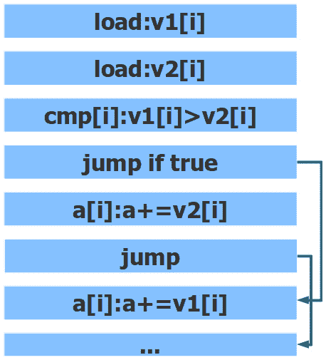

图 3.18 - 分支指令对流水线的影响

没有明显的方法将这段代码转换为线性指令流来执行，条件跳转无法避免。

现实情况要复杂一些：像我们刚刚建议的基准测试可能会或可能不会显示出性能的显著下降。原因是许多处理器都有某种条件移动甚至条件加法指令，编译器可能会决定使用它们。如果发生这种情况，我们的代码就变成了完全顺序的，没有跳转或分支，可以完美地进行流水线处理：

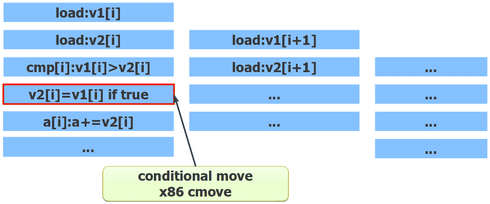

图 3.19 - 有条件代码与 cmove 进行流水线处理

x86 CPU 具有条件移动指令`cmove`（尽管并非所有编译器都会使用它来实现前面图中的`?:`运算符）。具有 AVX 或 AVX2 指令集的处理器具有一组强大的*掩码*加法和乘法指令，可以用来实现一些条件代码。因此，在对带有分支的代码进行基准测试和优化时，非常重要的是要检查生成的目标代码，并确认代码确实包含分支，并且它们确实影响了性能。还有一些性能分析工具可以用于此目的，我们马上就会看到其中一个。

虽然分支和条件在大多数实际程序中随处可见，但当程序被简化为用于基准测试的几行代码时，它们可能会消失。一个原因是编译器可能决定使用我们之前提到的条件指令之一。另一个常见的原因是在构建不良的基准测试时，编译器可能能够在编译时弄清楚条件的评估结果。例如，大多数编译器将完全优化掉任何类似`if (true)`或`if (false)`的代码：在生成的代码中没有这个语句的痕迹，任何永远不会被执行的代码也被消除了。为了观察分支对循环流水线的不利影响，我们必须构建一个测试，使编译器无法预测条件检查的结果。在您的实际基准测试中，您可能会从实际程序中提取数据集。对于下一个演示，我们将使用随机值：

```cpp
     std::vector<unsigned long> v1(N), v2(N);
     std::vector<int> c1(N);
     for (size_t i = 0; i < N; ++i) {
           v1[i] = rand();
           v2[i] = rand();
           c1[i] = rand() & 1;
     }
     unsigned long* p1 = v1.data();
     unsigned long* p2 = v2.data();
     int* b1 = c1.data();
     for (auto _ : state) {
           unsigned long a1 = 0, a2 = 0;
           for (size_t i = 0; i < N; ++i) {
                 if (b1[i]) {
                       a1 += p1[i];
                 } else {
                       a1 *= p2[i];
                 }
           }
           benchmark::DoNotOptimize(a1);
           benchmark::DoNotOptimize(a2);
           benchmark::ClobberMemory();
     }
```

同样，我们有两个输入向量`v1`和`v2`，以及一个控制向量`c1`，其中包含随机的零和一的值（在这里避免使用`vector<bool>`，因为它不是字节的数组，而是位的打包数组，因此访问它的成本要高得多，而我们目前不感兴趣基准测试位操作指令）。编译器无法预测下一个随机数是奇数还是偶数，因此无法进行任何优化。此外，我们已经检查了生成的机器代码，并确认我们的编译器（x86 上的 Clang-11）使用简单的条件跳转来实现这个循环。为了有一个基准，我们将比较这个循环的性能与每次迭代都进行无条件加法和乘法的循环：`a1 += p1[i]*p2[i]`。这个更简单的循环在每次迭代中都进行加法和乘法；然而，由于流水线处理，我们可以*免费*得到加法：它与下一次迭代的乘法同时执行。另一方面，条件分支则完全不是免费的。

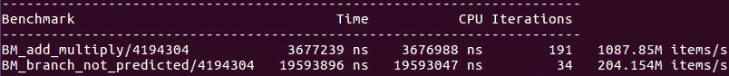

图 3.20

如您所见，条件代码比顺序代码慢大约五倍。这证实了我们的预测，即当下一条指令依赖于前一条指令的结果时，代码无法有效地进行流水线处理。

## 分支预测

然而，一个敏锐的读者可能会指出，我们刚刚描述的情况不可能是完整的，甚至不是真实的：让我们回到刚才的线性代码，比如我们在上一节中广泛使用的循环：

```cpp
for (size_t i = 0; i < N; ++i) {
     a1 += v1[i] + v2[i]; // s[i] = v1[i] + v2[i]
}
```

从处理器的角度来看，这个循环的主体是这样的：

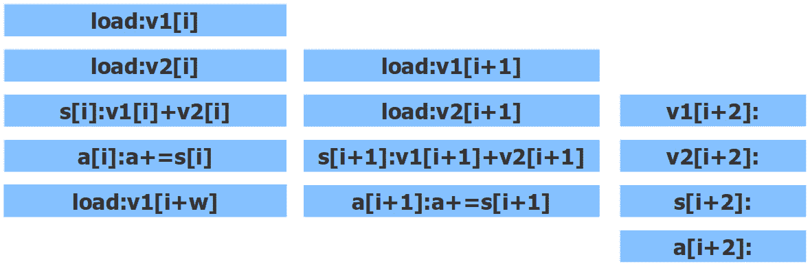

图 3.21 – 在宽度为 w 的流水线中执行的循环

在*图 3.21*中，我们展示了三个交错的迭代，但可能会有更多，流水线的总宽度是`w`，理想情况下，`w`足够大，以至于在每个周期，CPU 正好执行与其同时执行的指令一样多（在实践中很少可能达到这种峰值效率）。然而，可能无法在计算和存储和`p1[i] + p2[i]`的同时访问`v[i+2]`：没有保证循环还有两次迭代，如果没有，元素`v[i+2]`就不存在，访问它会导致未定义的行为。在前面的代码中有一个隐藏的条件：在每次迭代中，我们必须检查`i`是否小于`N`，只有在这种情况下才能执行第 i 次迭代的指令。

因此，我们在*图 3.20*中的比较是错误的：我们并没有比较流水线顺序执行和不可预测的条件执行。事实上，这两个基准都是条件代码的例子，它们都有分支。

完整的真相在其中。要理解这一点，我们必须了解条件执行的解药，它会破坏流水线，并且本身是数据依赖的解药。在分支存在的情况下保持流水线的方法是尝试将条件代码转换为顺序代码。如果我们事先知道分支将采取的路径，就可以进行这种转换：我们只需消除分支并继续执行下一个要执行的指令。当然，如果我们事先知道条件是什么，甚至不需要编写这样的代码。但是，考虑循环终止条件。假设循环执行多次，很可能条件`i < N`评估为`true`（我们只有`N`次中的一次会输掉这个赌注）。

处理器使用称为**分支预测**的技术进行同样的赌博。它分析代码中每个分支的历史，并假设行为在未来不会改变。对于循环结束条件，处理器将很快学会，大多数情况下，它必须继续下一次迭代。因此，正确的做法是流水线下一次迭代，就好像我们确定它会发生一样。当然，我们必须推迟将结果写入内存，直到我们评估条件并确认迭代确实发生；处理器有一定数量的写缓冲区来保存这些未经确认的结果，在提交到内存之前。

因此，仅进行加法的循环的流水线看起来确实如*图 3.21*所示。唯一的问题是，在完成第 i 次迭代之前开始执行第`i+2`次迭代时，处理器是基于其对条件分支是否被执行的预测而进行的一种赌博。在我们确定这段代码是否真的存在之前执行代码的这种方式被称为**推测执行**。如果赌赢了，我们在弄清楚我们需要计算时已经有了结果，一切都很好。如果处理器输了，它必须放弃一些计算以避免产生不正确的结果：例如，写入内存会覆盖之前的内容，并且在大多数硬件平台上无法撤消，而计算结果并将其存储在寄存器中是完全可逆的，当然除了我们浪费的时间。

现在我们对流水线的工作原理有了更全面的了解：为了在并行执行更多指令，处理器查看循环的下一次迭代的代码，并开始与当前迭代同时执行。如果代码包括条件分支，使得不可能确定将执行哪个指令，处理器会根据过去检查相同条件的结果做出合理的猜测，并继续推测性地执行代码。如果预测被证明是正确的，流水线的效果可以和无条件代码一样好。如果预测是错误的，处理器必须丢弃不应该被评估的每条指令的结果，获取先前假定不需要的指令，并代替评估它们。这个事件被称为**流水线刷新**，这确实是一个昂贵的事件。

现在我们对*图 3.20*中的先前基准有了更好的理解：两个循环都有一个用于检查循环结束的条件。但是，它几乎完美地预测。 *条件*基准还具有基于随机数的分支：`if(b1[i])`，其中`b1[i]` 50%的时间是 true，随机的。处理器无法预测结果，管道一半的时间被破坏（或者更糟，如果我们设法混淆 CPU 以实际进行错误预测）。

我们应该能够通过直接实验来验证我们的理解：我们只需要将*随机*条件更改为始终为 true 的条件。唯一的问题是我们必须以编译器无法理解的方式来做到这一点。一种常见的方法是将条件向量的初始化更改为以下内容：

```cpp
c1[i] = rand() >= 0;
```

编译器不知道函数`rand()`总是返回非负随机数，并且不会消除条件。 CPU 的分支预测电路将很快学习到条件`if(b1[i])`总是评估为 true，并将推测性地执行相应的代码。我们可以将预测良好的分支的性能与不可预测的分支进行比较：

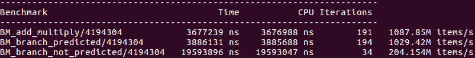

图 3.22

在这里，我们可以看到预测良好的分支的成本是最小的，比预测不佳的分支快得多，即使是完全相同的代码。

## 分支错误预测的分析

现在，您已经看到单个错误预测的分支会如何影响代码的性能，您可能会想知道，您如何找到这样的代码以便进行优化？当然，包含此代码的函数将花费比您预期的时间更长，但是您如何知道这是因为错误预测的分支还是由于其他一些低效性？到目前为止，您应该已经了解足够多，以避免对性能进行一般性的猜测；但是，对分支预测器的有效性进行推测尤其是徒劳的。幸运的是，大多数分析器不仅可以分析执行时间，还可以分析决定效率的各种因素，包括分支预测失败。

在本章中，我们将再次使用`perf`分析器。作为第一步，我们可以运行此分析器以收集整个基准程序的整体性能指标：

```cpp
$ perf stat ./benchmark
```

这是仅运行`BM_branch_not_predicted`基准的程序的`perf`结果（其他基准已在此测试中注释掉）：

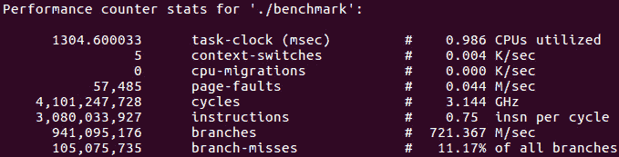

图 3.23 - 具有预测不佳分支的基准的概要

如您所见，所有分支中有 11%被错误预测（报告的最后一行）。请注意，此数字是所有分支的累积值，包括循环条件的完全可预测结尾，因此总共 11%相当糟糕。我们应该将其与我们的其他基准`BM_branch_predicted`进行比较，该基准与此基准相同，只是条件始终为真：

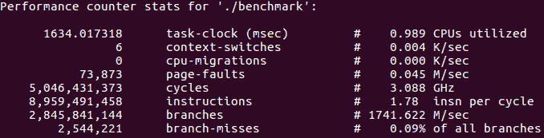

图 3.24 - 具有良好预测分支的基准的配置文件

这一次，不到 0.1%的分支没有被正确预测。

整体性能报告非常有用，不要忽视其潜力：它可以快速突出或排除一些可能导致性能不佳的原因。在我们的情况下，我们可以立即得出结论，即我们的程序受到一个或多个错误预测分支的影响。现在我们只需要找出是哪一个，分析器也可以帮助解决这个问题。就像在上一章中，我们已经使用分析器找出程序在代码中花费最多时间的地方一样，我们可以生成分支预测的详细逐行分析。我们只需要向分析器指定正确的性能计数器：

```cpp
$ perf record -e branches,branch-misses ./benchmark
```

在我们的情况下，我们可以从`perf stat`的输出中复制计数器的名称，因为它恰好是默认情况下测量的计数器之一，但是完整列表可以通过运行`perf --list`来获取。

分析器运行程序并收集指标。我们可以通过生成配置文件来查看它们：

```cpp
$ perf report
```

报告分析器是交互式的，让我们可以导航到每个函数的分支错误预测计数器：

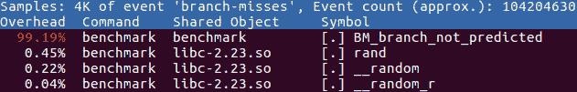

图 3.25 - 针对错误预测分支的详细配置文件

超过 99%的错误预测分支发生在一个函数中。由于该函数很小，找到负责的条件操作不应该很难。在较大的函数中，我们需要查看逐行分析。

现代处理器的分支预测硬件相当复杂。例如，如果从两个不同的位置调用一个函数，并且当从第一个位置调用时，条件通常为真，而当从第二个位置调用时，相同的条件为假，那么预测器将学习该模式，并根据函数调用的来源正确预测分支。类似地，预测器可以检测数据中相当复杂的模式。例如，我们可以初始化我们的*random*条件变量，使值始终交替，第一个是随机的，但下一个是第一个的相反，依此类推：

```cpp
     for (size_t i = 0; i < N; ++i) {
           if (i == 0) c1[i] = rand() >= 0; 
           else c1[i] = !c1[i - 1];
     }
```

分析器确认该数据的分支预测率非常好：

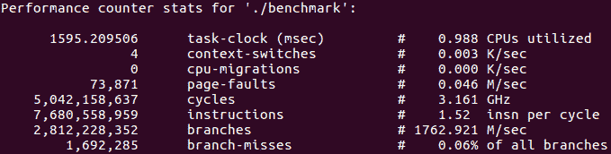

图 3.26 - “真-假”模式的分支预测率

我们几乎准备好了应用我们如何有效使用处理器的知识。但首先，我必须承认我们忽视了一个重大的潜在问题。

# 推测执行

我们现在了解了流水线如何使 CPU 保持忙碌，以及通过预测条件分支的结果并在我们确定必须执行之前就进行预期代码的执行，我们允许条件代码进行流水线处理。*图 3.21*说明了这种方法：假设循环条件在当前迭代之后不会发生，我们可以将下一次迭代的指令与当前迭代的指令交错，因此我们可以并行执行更多指令。

迟早，我们的预测会是错误的，但我们所要做的就是丢弃一些本来不应该被计算的结果，并且让它看起来好像它们确实从未被计算过。这会花费我们一些时间，但当分支预测正确时，我们通过加速流水线来弥补这一点。但是，这真的是我们必须做的一切来掩盖我们试图执行一些实际上并不存在的代码的事实吗？

再次考虑*图 3.21*：如果第 i 次迭代是循环中的最后一次迭代，那么下一次迭代就不应该发生。当然，我们可以丢弃值`a[i+1]`并且不将其写入内存。但是，为了进行任何流水线处理，我们必须读取`v1[i+1]`的值。我们无法*丢弃*我们读取它的事实：我们在检查迭代`i`是否是最后一次迭代之前就访问了`v1[i+1]`，并且无法否认我们确实访问了它。但是元素`v1[i+1]`在为向量分配的有效内存区域之外；即使读取它也会导致未定义的行为。

隐藏在“推测执行”无辜标签背后的危险的更有说服力的例子是这个非常常见的代码：

```cpp
int f(int* p) {
     if (p) {
           return *p;
     } else {
           return 0;
     }
}
```

让我们假设指针`p`很少是`NULL`，所以分支预测器学习到`if(p)`语句的`true`分支通常被执行。当函数最终以`p == NULL`被调用时会发生什么？分支预测器会像往常一样假设相反，并且`true`分支会被推测执行。它首先会对`NULL`指针进行解引用。我们都知道接下来会发生什么：程序会崩溃。后来，我们会发现糟糕，非常抱歉，我们一开始不应该选择那个分支，但是如何撤销一个崩溃呢？

从像我们的函数`f()`这样的代码非常常见且不会遭受意外随机崩溃的事实，我们可以得出结论，要么推测执行实际上并不存在，要么有一种方法可以撤销崩溃，或者类似的。我们已经看到一些证据表明推测执行确实发生并且对提高性能非常有效。我们将在下一章中看到更多直接证据。那么，当我们试图推测执行一些不可能的事情时，比如对`NULL`指针进行解引用，它是如何处理的呢？答案是，对于这种潜在灾难的灾难性响应必须被暂时保留，既不被丢弃也不被允许成为现实，直到分支条件实际被评估，并且处理器知道推测执行是否应该被视为真正的执行。在这方面，故障和其他无效条件与普通的内存写入没有什么不同：只要导致该操作的指令仍然是推测的，任何无法撤销的操作都被视为潜在操作。CPU 必须有特殊的硬件电路，比如缓冲区，来暂时存储这些事件。最终结果是，处理器确实对`NULL`指针进行解引用或者在推测执行期间读取不存在的向量元素`v[i+1]`，然后假装这从未发生过。

现在我们了解了分支预测和推测执行如何使处理器能够在数据和代码依赖性造成的不确定性的情况下高效运行，我们可以把注意力转向优化我们的程序。

# 复杂条件的优化

对于有许多条件语句的程序，通常是`if()`语句，分支预测的有效性通常决定了整体性能。如果分支预测准确，几乎没有成本。如果分支一半时间被错误预测，它可能会像十个或更多常规算术指令一样昂贵。

非常重要的是要理解，硬件分支预测是基于处理器执行的条件指令。因此，处理器对于*条件*的理解可能与我们的理解不同。以下示例有力地证明了这一点：

```cpp
     std::vector<unsigned long> v1(N), v2(N);
     std::vector<int> c1(N), c2(N);
     for (size_t i = 0; i < N; ++i) {
           v1[i] = rand();
           v2[i] = rand();
           c1[i] = rand() & 0x1;
           c2[i] = !c1[i];
     }
     unsigned long* p1 = v1.data();
     unsigned long* p2 = v2.data();
     int* b1 = c1.data();
     int* b2 = c2.data();
     for (auto _ : state) {
           unsigned long a1 = 0, a2 = 0;
           for (size_t i = 0; i < N; ++i) {
                 if (b1[i] || b2[i]) { // !!!
                       a1 += p1[i];
                 } else {
                       a1 *= p2[i];
                 }
           }
           benchmark::DoNotOptimize(a1);
           benchmark::DoNotOptimize(a2);
           benchmark::ClobberMemory();
     }
```

这里感兴趣的是条件`if (b1[i] || b2[i])`：按构造，它总是评估为`true`，因此我们可以期望处理器的完美预测率。当然，如果事情真的那么简单，我就不会向您展示这个例子了。对于我们来说逻辑上是一个条件的东西，在 CPU 看来是两个单独的条件分支：一半的时间，整体结果是由第一个分支决定的，另一半的时间，是第二个分支使其为真。整体结果总是为真，但无法预测哪个分支使其为真。结果非常不幸：

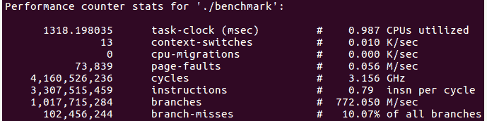

图 3.27 - “假”分支的分支预测概况

分析器显示的分支预测率与真正随机分支一样糟糕。性能基准证实了我们的期望：

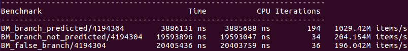

图 3.28

*假*分支（实际上根本不是分支）的性能与真正随机、不可预测的分支一样糟糕，远远不如预测良好的分支。

在真实的程序中，不应该遇到这种不必要的条件语句。然而，非常常见的是一个复杂的条件表达式，几乎总是基于不同的原因评估为相同的值。例如，我们可能有一个很少为假的条件：

```cpp
if ((c1 && c2) || c3) {
     … true branch … 
} else {
     … false branch …
}
```

然而，将近一半的时间，`c3`为真。当`c3`为假时，`c1`和`c2`通常都为真。整体条件应该很容易预测，并且会执行真分支。然而，从处理器的角度来看，这不是一个单一的条件，而是三个单独的条件跳转：如果`c1`为真，则必须检查`c2`。如果`c2`也为真，则执行跳转到真分支的第一条指令。如果`c1`或`c2`中的一个为假，则检查`c3`，如果为真，则再次执行跳转到真分支。

必须按特定顺序逐步进行这种评估的原因是，C++标准（以及之前的 C 标准）规定逻辑操作（如`&&`和`||`）是*短路*的：一旦整个表达式的结果已知，评估剩下的表达式应该停止。当条件具有副作用时，这一点尤为重要：

```cpp
if (f1() || f2()) {
     … true branch … 
} else {
     … false branch …
}
```

现在，只有在`f1()`返回`false`时才会调用函数`f2()`。在前面的示例中，条件只是布尔变量`c1`、`c2`和`c3`。编译器可以检测到没有副作用，并且评估整个表达式到最后不会改变可观察的行为。一些编译器会进行这种优化；如果我们的*假分支*基准是用这样的编译器编译的，它将显示出预测良好分支的性能。不幸的是，大多数编译器不会将这视为潜在问题（实际上，编译器无法知道整个表达式通常评估为真，即使它的部分不是）。因此，这是程序员通常必须手动进行的优化。

假设程序员知道`if()`语句的两个分支中的一个经常被执行。例如，`else`分支可能对应于错误情况或其他异常情况，必须正确处理，但在正常操作下不应该出现。让我们还假设我们做对了事情，并且使用分析器验证了组成复杂布尔表达式的各个条件指令的预测不准确。我们如何优化代码呢？

第一个冲动可能是将条件评估移出`if()`语句：

```cpp
const bool c = c1 && c2) || c3;
if (c) { … } else { … }
```

然而，这几乎肯定不会起作用，原因有两个。首先，条件表达式仍在使用逻辑`&&`和`||`操作，因此评估仍必须被短路，并且需要单独且不可预测的分支。其次，编译器可能通过删除不必要的临时变量`c`来优化此代码，因此生成的目标代码可能根本不会改变。

在循环遍历条件变量数组的情况下，类似的转换可能是有效的。例如，这段代码可能会受到较差的分支预测的影响：

```cpp
for (size_i i = 0; i < N; ++i) {
     if ((c1[i] && c2[i]) || c3[i]) { … } else { … }
}
```

然而，如果我们预先评估所有条件表达式并将它们存储在一个新数组中，大多数编译器不会消除该临时数组：

```cpp
for (size_i i = 0; i < N; ++i) {
     c[i] = (c1[i] && c2[i]) || c3[i];
}
…
for (size_i i = 0; i < N; ++i) {
     if (c[i]) { … } else { … }
}
```

当然，用于初始化`c[i]`的布尔表达式现在受到分支错误预测的影响，因此这种转换只有在第二个循环执行的次数比初始化循环多得多时才有效。

通常有效的另一个优化是用加法和乘法或位`&`和`|`操作替换逻辑`&&`和`||`操作。在执行此操作之前，必须确保`&&`和`||`操作的参数是布尔值（值为零或一），而不是整数：即使`2`的值被解释为 true，表达式`2 & 1`的结果与`bool(2) & bool(1)`的结果不同。前者评估为 0（false），而后者给出了预期和正确的答案 1（或 true）。

我们可以在基准测试中比较所有这些优化的性能：

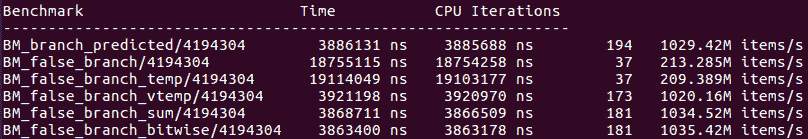

图 3.29

正如你所看到的，通过引入临时变量`BM_false_branch_temp`来优化*false branch*的天真尝试是完全无效的。使用临时向量给出了预期的完全预测分支的性能，因为临时向量的所有元素都等于 true，这是分支预测器学到的内容(`BM_false_branch_vtemp`)。用算术加法(`+`)或位`|`替换逻辑`||`产生类似的结果。

您应该记住，最后两种转换，即使用算术或位操作代替逻辑操作，会改变代码的含义：特别是，表达式中操作的所有参数都会被评估，包括它们的副作用。由您决定这种改变是否会影响程序的正确性。如果这些副作用也很昂贵，那么整体性能变化可能最终不利于您。例如，如果评估`f1()`和`f2()`非常耗时，将表达式`f1() || f2()`中的逻辑`||`替换为等效的算术加法(`f1() + f2()`)可能会降低性能，即使它改善了分支预测。

总的来说，在*false branches*中优化分支预测没有标准方法，这也是为什么编译器很难进行有效的优化。程序员必须使用特定于问题的知识，例如特定条件是否可能发生，并结合分析测量结果得出最佳解决方案。

在本章中，我们已经学习了 CPU 操作如何影响性能，然后进展到一个具体且实际相关的例子，应用这些知识来进行代码优化。在结束之前，我们将学习另一种优化方法。

# 无分支计算

到目前为止，我们已经学到了：为了有效地使用处理器，我们必须提供足够的代码，以便并行执行多条指令。我们之所以没有足够的指令来让 CPU 忙碌的主要原因是数据依赖性：我们有代码，但我们无法运行它，因为输入还没有准备好。我们通过流水线处理代码来解决这个问题，但为了这样做，我们必须提前知道哪些指令将被执行。如果我们不提前知道执行的路径，我们就无法做到这一点。我们处理这个问题的方式是根据评估这个条件的历史来做出一个合理的猜测，即猜测条件分支是否会被执行，猜测越可靠，性能就越好。有时，没有可靠的猜测方式，性能就会受到影响。

所有这些性能问题的根源是条件分支，即在运行时无法知道要执行的下一条指令。解决问题的一个激进方法是重写我们的代码，不使用分支，或者至少减少分支的数量。这就是所谓的**无分支计算**。

## 循环展开

事实上，这个想法并不是特别新颖。现在你已经了解了分支如何影响性能的机制，你可以认识到循环展开这一众所周知的技术，作为减少分支数量的早期代码转换的一个例子。让我们回到我们的原始代码示例：

```cpp
           for (size_t i = 0; i < N; ++i) {
                 a1 += p1[i] + p2[i];
           }
```

现在我们明白了，虽然循环的主体是完全流水线化的，但这段代码中隐藏了一个分支：循环结束的检查。这个检查每次循环迭代都会执行一次。如果我们事先知道，比如说，迭代次数`N`总是偶数，那么我们就不需要在奇数迭代后执行检查。我们可以明确地省略这个检查，如下所示：

```cpp
           for (size_t i = 0; i < N; i += 2) {
                 a1 += p1[i] + p2[i]
                     +  p1[i+1] + p2[i+1];
           }
```

我们已经展开了这个循环，将两次迭代转换为一次更大的迭代。在这个和其他类似的例子中，手动展开循环不太可能提高性能，原因有几个：首先，如果`N`很大，循环的末尾分支几乎可以完美预测。其次，编译器可能会将循环展开为优化；更有可能的是，矢量化编译器将使用 SSE 或 AVX 指令来实现这个循环，实际上展开了它的主体，因为矢量指令一次处理多个数组元素。所有这些结论都需要通过基准测试或性能分析来确认；如果你发现手动循环展开对性能没有影响，不要感到惊讶：这并不意味着我们对分支的了解是错误的；这意味着我们的原始代码已经受益于循环展开，很可能是由于编译器优化。

## 无分支选择

循环展开是一个非常具体的优化，编译器已经*学会*了这样做。将这个想法概括为无分支计算是一个最近的进展，可以产生惊人的性能提升。我们将从一个非常简单的例子开始：

```cpp
unsigned long* p1 = ...; // Data
bool* b1 = ...; // Unpredictable condition
unsigned long a1 = 0, a2 = 0;
for (size_t i = 0; i < N; ++i) {
     if (b1[i]) {
           a1 += p1[i];
     } else {
           a2 += p1[i];
     }
}
```

假设条件变量`b1[i]`不能被处理器预测。正如我们已经看到的，这段代码的运行速度比具有良好预测分支的循环慢了几倍。然而，我们可以做得更好；我们可以完全消除分支，并用指向两个目标变量的指针数组进行替换：

```cpp
unsigned long* p1 = ...; // Data
bool* b1 = ...; // Unpredictable condition
unsigned long a1 = 0, a2 = 0;
unsigned long* a[2] = { &a2, &a1 };
for (size_t i = 0; i < N; ++i) {
     a[b1[i]] += p1[i];
}
```

在这种转换中，我们利用了一个布尔变量只能有两个值，0（`false`）或 1（`true`）的事实，并且可以隐式转换为整数（如果我们使用`bool`之外的其他类型，我们必须确保所有`true`值确实由 1 表示，因为任何非零值都被认为是`true`，但只有 1 的值适用于我们的无分支代码）。

这种转换将对两种可能指令的条件跳转替换为对两种可能内存位置的条件访问。因为这种条件内存访问可以进行流水线处理，无分支版本提供了显著的性能改进：

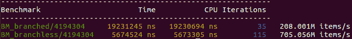

图 3.30

在这个例子中，无分支版本的代码快了 3.5 倍。值得注意的是，一些编译器在可能的情况下使用查找数组来实现`?:`运算符，而不是条件分支。有了这样的编译器，我们可以通过将我们的循环体重写如下来获得相同的性能优势：

```cpp
for (size_t i = 0; i < N; ++i) {
     (b1[i] ? a1 : a2) += p1[i];
}
```

像往常一样，要确定这种优化是否有效以及其有效性如何，唯一的方法就是进行测量。

前面的例子涵盖了无分支计算的所有基本要素：不是有条件地执行这段代码或那段代码，而是将程序转换为在所有情况下都相同的代码，并且条件逻辑由索引操作实现。我们将通过几个更多的例子来强调一些值得注意的考虑和限制。

## 无分支计算示例

大多数时候，取决于条件的代码并不像写入结果那样简单。通常，我们必须根据一些中间值以不同的方式进行计算：

```cpp
unsigned long *p1 = ..., *p2 = ...; // Data
bool* b1 = ...; // Unpredictable condition
unsigned long a1 = 0, a2 = 0;                          
for (size_t i = 0; i < N; ++i) {                          
     if (b1[i]) {                                           
           a1 += p1[i] - p2[i];                  
     } else {                              
           a2 += p1[i] * p2[i];                  
     }                                 
}  
```

在这里，条件影响我们计算的表达式和结果存储的位置。两个分支的共同之处只是输入，而且一般情况下甚至这个也不一定。 

为了在没有分支的情况下计算相同的结果，我们必须从由条件变量索引的内存位置中获取正确表达式的结果。这意味着由于我们决定不基于条件改变执行哪些代码，因此将评估两个表达式。在这种理解下，转换为无分支形式是直接的：

```cpp
unsigned long a1 = 0, a2 = 0;
unsigned long* a[2] = { &a2, &a1 };
for (size_t i = 0; i < N; ++i) {
     unsigned long s[2] = { p1[i] * p2[i], p1[i] - p2[i] };
     a[b1[i]] += s[b1[i]];
}  
```

两个表达式都被评估，并它们的结果被存储在一个数组中。另一个数组用于索引计算的目标，也就是说，哪个变量被增加。总的来说，我们显著增加了循环体必须执行的计算量；另一方面，这都是顺序代码，没有跳转，所以只要 CPU 有资源可以多做一些操作而不需要额外的周期，我们应该会有所收益。基准测试证实了这种无分支转换的有效性：

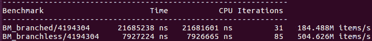

图 3.31

必须强调的是，你可以进行多少额外的计算并且仍然优于条件代码是有限制的。在这里，甚至没有一个好的一般性的*经验法则*可以让你做出明智的猜测（而且你绝对不应该猜测性能）。这种优化的有效性必须进行测量：它高度依赖于代码和数据。例如，如果分支预测非常有效（可预测的条件而不是随机的条件），条件代码将优于无分支版本：

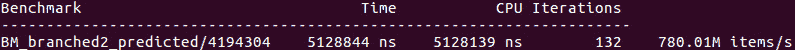

图 3.32

也许我们可以从图 3.31 和图 3.32 中学到的最显著的结论是流水线刷新（错误预测的分支）有多么昂贵，以及 CPU 可以同时进行多少计算。后者可以从完全预测的分支（图 3.32）和无分支实现（图 3.31）之间性能差异相对较小来推断。无分支计算依赖于这种隐藏且大部分未使用的计算能力储备，我们可能在我们的例子中还没有耗尽这个储备。展示同一代码的无分支转换的另一种变体是很有教育意义的，这种变体不是使用数组来选择正确的结果变量，而是如果我们不想实际改变结果，我们总是同时增加两个值：

```cpp
unsigned long a1 = 0, a2 = 0;
for (size_t i = 0; i < N; ++i) {
     unsigned long s1[2] = { 0, p1[i] - p2[i] };
     unsigned long s2[2] = { p1[i] * p2[i], 0 };
     a1 += s1[b1[i]];
     a2 += s2[b1[i]];
}
```

现在我们不再有目的地数组，而是有两个中间值的数组。这个版本即使在无条件下进行更多的计算，但与之前的无分支代码一样提供了相同的性能：

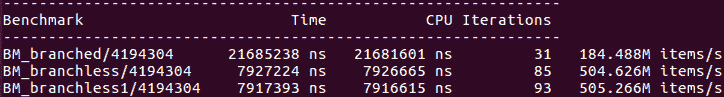

图 3.33 - 图 3.31 的结果，另一种无分支实现被添加为"BM_branchless1"

了解无分支转换的局限性并不要得意忘形是很重要的。我们已经看到了第一个局限性：无分支代码通常执行更多指令；因此，如果分支预测器最终运行良好，少量的流水线刷新可能不足以证明这种优化。

无分支转换不能如预期那样执行的第二个原因与编译器有关：在某些情况下，编译器可以进行等效或者更好的优化。例如，考虑所谓的夹紧循环：

```cpp
unsigned char *c = ...; // Random values from 0 to 255
for (size_t i = 0; i < N; ++i) {
     c[i] = (c[i] < 128) ? c[i] : 128;
}
```

这个循环将数组`c`中的值（无符号字符）夹紧到`128`的限制。假设初始值是随机的，循环体中的条件无法被准确预测，我们可以预期分支错误预测率非常高。另一种无分支的实现方式使用了`256`个元素，每个元素对应无符号字符的可能值。索引为 0 到 127 的表项`LUT[i]`包含索引值本身，而较高索引的表项`LUT[i]`都包含 128：

```cpp
unsigned char *c = ...; // Random values from 0 to 255
unsigned char LUT[256] = { 0, 1, …, 127, 128, 128, … 128 };
for (size_t i = 0; i < N; ++i) {
     c[i] = LUT[c[i]];
}
```

对于大多数现代编译器来说，这根本不是优化：编译器通常会使用 SSE 或 AVX 矢量指令来一次复制和夹紧多个字符，而且完全没有任何分支。如果我们对原始代码进行了剖析，而不是假设分支一定会被错误预测，我们就会发现程序并没有因为分支预测不佳而受到影响。

还有一种情况下无分支转换可能不划算，那就是循环体的开销明显大于分支，即使是错误预测的分支。这种情况很重要，因为它通常描述了进行函数调用的循环：

```cpp
unsigned long f1(unsigned long x, unsigned long y);
unsigned long f2(unsigned long x, unsigned long y);
unsigned long *p1 = ..., *p2 = ...; // Data
bool* b1 = ...; // Unpredictable condition
unsigned long a = 0;                              
for (size_t i = 0; i < N; ++i) {                        
     if (b1[i]) {                                            
           a += f1(p1[i], p2[i]);                          
     } else {                                                
           a += f2(p1[i], p2[i]);                           
     }
} 
```

在这里，我们根据条件`b1`调用`f1()`或`f2()`中的一个函数。`if-else`语句可以被消除，如果我们使用函数指针数组，代码可以变成无分支。

```cpp
decltype(f1)* f[] = { f1, f2 };
for (size_t i = 0; i < N; ++i) {                       
     a += f[b1[i]](p1[i], p2[i]);
}
```

这是一种值得做的优化吗？通常不是。首先，如果函数`f1()`或`f2()`可以内联，函数指针调用将阻止内联。内联通常是一种重要的优化；为了摆脱分支而放弃内联几乎是不合理的。当函数没有内联时，函数调用本身会中断流水线（这也是内联是如此有效的优化的原因之一）。与函数调用的成本相比，即使是错误预测的分支通常也不那么重要。

尽管如此，有时查找表是一种值得优化的方法：对于只有两个选择的情况几乎从不值得，但如果我们必须根据单个条件从许多函数中进行选择，函数指针表比链式`if-else`语句更有效。值得注意的是，这个例子与所有现代编译器用来实现虚函数调用的实现非常相似；这样的调用也是使用函数指针数组而不是一系列比较来分派的。当需要优化根据运行时条件调用多个函数的代码时，您应该考虑是否值得使用多态对象进行重新设计。

您还应该记住无分支转换对代码的可读性的影响：函数指针的查找表不如`switch`或`if-else`语句易读，而且可能比后者更难调试。考虑到最终结果的许多因素（编译器优化、硬件资源可用性、程序操作的数据的性质），任何优化都必须通过基准测试和性能分析来验证，并权衡对程序员在时间、可读性和复杂性方面的额外成本。

# 总结

在本章中，我们学习了主处理器的计算能力以及如何有效地使用它们。高性能的关键是充分利用所有可用的计算资源：同时计算两个结果的程序比稍后计算第二个结果的程序更快（假设计算能力可用）。正如我们所了解的，CPU 具有各种类型计算的许多计算单元，其中大多数在任何给定时刻都是空闲的，除非程序经过高度优化。

我们已经看到，有效利用 CPU 指令级并行性的主要限制通常是数据依赖性：简单地说，没有足够的并行工作来让 CPU 保持忙碌。这个问题的硬件解决方案是流水线：CPU 不仅仅执行程序中当前点的代码，而是从没有未满足数据依赖性的未来中获取一些计算，并并行执行它们。只要未来是已知的，这种方法就有效：如果 CPU 无法确定这些计算是什么，它就无法执行未来的计算。每当 CPU 必须等待确定下一条要执行的机器指令时，流水线就会停顿。为了减少这种停顿的频率，CPU 具有特殊的硬件，可以预测最有可能的未来，通过条件代码的路径，以及推测性地执行该代码。因此，程序的性能关键取决于这种预测的准确性。

我们已经学会了使用特殊工具来帮助衡量代码的效率并识别限制性能的瓶颈。在测量的指导下，我们研究了几种优化技术，可以使程序更充分地利用 CPU 资源，等待时间更少，计算更多，并最终有助于提高性能。

在本章中，我们一直忽略了每个计算最终必须执行的一步：访问内存。任何表达式的输入都驻留在内存中，并且必须在其余计算发生之前被带入寄存器。中间结果可以存储在寄存器中，但最终，某些东西必须被写回内存，否则整个代码就没有持久的效果。事实证明，内存操作（读取和写入）对性能有显著影响，并且在许多程序中是阻止进一步优化的限制因素。下一章将致力于研究 CPU 与内存的交互。

# 问题

1.  如何有效地使用 CPU 资源的关键是什么？

1.  我们如何利用指令级并行性来提高性能？

1.  如果后一个计算需要前一个计算的结果，CPU 如何并行执行计算？

1.  为什么条件分支比简单评估条件表达式的成本要昂贵得多？

1.  什么是推测执行？

1.  有哪些优化技术可用于改善具有条件计算的代码中流水线的效率？
