# 第五章：线程、内存和并发性

到目前为止，我们已经研究了单个 CPU 执行一个程序，一个指令序列的性能。在*第一章*的介绍中，*性能和并发性简介*，我们提到这不再是我们生活的世界，然后再也没有涉及这个主题。相反，我们研究了单线程程序在单个 CPU 上运行的性能的每个方面。现在我们已经学会了关于单个线程性能的所有知识，并准备好研究并发程序的性能。

在本章中，我们将涵盖以下主要主题：

+   线程概述

+   多线程和多核内存访问

+   数据竞争和内存访问同步

+   锁和原子操作

+   内存模型

+   内存顺序和内存屏障

# 技术要求

同样，您将需要一个 C++编译器和一个微基准测试工具，比如我们在上一章中使用的 Google Benchmark 库（在[`github.com/google/benchmark`](https://github.com/google/benchmark)找到）。

本章的代码可以在[`github.com/PacktPublishing/The-Art-of-Writing-Efficient-Programs/tree/master/Chapter05`](https://github.com/PacktPublishing/The-Art-of-Writing-Efficient-Programs/tree/master/Chapter05)找到。

# 理解线程和并发性

今天所有高性能计算机都有多个 CPU 或多个 CPU 核心（单个封装中的独立处理器）。即使大多数笔记本电脑也至少有两个，通常是四个核心。正如我们多次提到的，在性能方面，效率就是不让任何硬件空闲；如果程序只使用了计算能力的一部分，比如多个 CPU 核心中的一个，那么它就不能高效或高性能。程序要同时使用多个处理器的唯一方法是：我们必须运行多个线程或进程。顺便说一句，这并不是利用多个处理器为用户带来好处的唯一方法：例如，很少有笔记本电脑用于高性能计算。相反，它们使用多个 CPU 来更好地同时运行不同和独立的程序。这是一个完全合理的使用模式，只是不是我们在高性能计算的背景下感兴趣的。HPC 系统通常一次在每台计算机上运行一个程序，甚至在分布式计算的情况下，一次在许多计算机上运行一个程序。一个程序如何使用多个 CPU？通常，程序运行多个线程。

## 什么是线程？

**线程**是一系列指令，可以独立于其他线程执行。多个线程在同一个程序中同时运行。所有线程共享同一内存，因此，根据定义，同一进程的线程在同一台机器上运行。我们已经提到 HPC 程序也可以由多个进程组成。分布式程序在多台机器上运行，并利用许多独立的进程。分布式计算的主题超出了本书的范围：我们正在学习如何最大化每个进程的性能。

那么，关于多线程的性能，我们能说些什么呢？首先，只有当系统有足够的资源来同时执行多个指令序列时，同时执行多个指令序列才是有益的。否则，操作系统只是在不同的线程之间切换，以允许每个线程执行一个时间片。

在单个处理器上，一个忙于计算的线程提供了处理器可以处理的工作量。即使线程没有使用所有的计算单元或者在等待内存访问，这也是真实的：处理器一次只能执行一个指令序列 - 它只有一个程序计数器。现在，如果线程在等待某些东西，比如用户输入或网络流量，CPU 是空闲的，可以在不影响第一个线程性能的情况下执行另一个线程。再次强调，操作系统处理线程之间的切换。需要注意的是，在这种情况下，等待内存不算是等待：当线程在等待内存时，执行一个指令需要更长的时间。当线程在等待 I/O 时，它必须进行操作系统调用，然后被操作系统阻塞，直到操作系统唤醒它来处理数据。

所有进行大量计算的线程都需要足够的资源，如果目标是使程序整体更加高效。通常，当我们考虑线程的资源时，我们会想到多个处理器或处理器核心。但通过并发性也有其他增加资源利用率的方法，我们将很快看到。

## 对称多线程

我们在整本书中多次提到，处理器有大量的计算硬件，大多数程序很少（如果有的话）会全部使用：程序中的数据依赖限制了处理器在任何时候可以进行多少计算。如果处理器有多余的计算单元，它不能同时执行另一个线程以提高效率吗？这就是**对称多线程**（**SMT**）的理念，也被称为**超线程**。

支持 SMT 的处理器有一组寄存器和计算单元，但有两个（或更多）程序计数器，以及维护运行线程状态的额外副本的任何其他硬件（具体实现因处理器而异）。最终结果是：单个处理器对操作系统和程序来说看起来像是两个（通常）或更多个独立的处理器，每个都能运行一个线程。实际上，所有在一个 CPU 上运行的线程都竞争共享的内部资源，比如寄存器。如果每个线程没有充分利用这些共享资源，SMT 可以提供显著的性能提升。换句话说，它通过运行多个这样的线程来弥补一个线程的低效率。

实际上，大多数支持 SMT 的处理器可以运行两个线程，性能提升的幅度差异很大。很少见到 100%的加速（两个线程都以全速运行）。通常，实际的加速在 25%到 50%之间（第二个线程实际上以四分之一到半的速度运行），但有些程序根本没有加速。在本书中，我们不会特别对待 SMT 线程：对于程序来说，SMT 处理器看起来就像两个处理器，我们对两个*真实*线程在不同核心上运行的性能所说的任何事情同样适用于在同一个核心上运行的两个线程的性能。最终，你必须测量运行比物理核心更多的线程是否为程序提供了任何加速，并根据这一点决定要运行多少线程。

无论我们是共享整个物理核心还是由 SMT 硬件创建的逻辑核心，并发程序的性能在很大程度上取决于线程能够独立工作的程度。这首先取决于算法和工作在线程之间的分配；这两个问题有数百本专门的书籍来讨论，但超出了本书的范围。相反，我们现在专注于影响线程交互并决定特定实现成功或失败的基本因素。

## 线程和内存

由于在多个计算线程之间进行时间分片对 CPU 没有性能优势，我们可以假设在本章的其余部分中，在每个处理器核心上运行一个 HPC 线程（或者在 SMT 处理器提供的每个*逻辑核心*上运行一个线程）。只要这些线程不竞争任何资源，它们就完全独立运行，并且我们可以享受*完美的加速*：两个线程将在相同的时间内完成两倍于一个线程所能完成的工作。如果工作可以完美地在两个线程之间分配，而不需要它们之间的任何交互，那么两个线程将在一半的时间内解决问题。

这种理想的情况确实会发生，但并不经常；更重要的是，如果发生了，你已经准备好从你的程序中获得最佳性能：你知道如何优化单个线程的性能。

编写高效并发程序的难点在于当不同线程执行的工作不完全独立时，线程开始竞争资源。但如果每个线程都充分利用其 CPU，那么还有什么可以竞争的呢？剩下的就是内存，它在所有线程之间共享，因此是一个共同的资源。这就是为什么对多线程程序性能的探索几乎完全集中在线程之间通过内存交互引起的问题上。

编写高性能并发程序的另一个方面是在组成程序的线程和进程之间分配工作。但要了解这一点，你必须找一本关于并行编程的书。

事实证明，内存，已经是性能的*长杆*，在添加并发性后更加成为问题。虽然硬件施加的基本限制是无法克服的，但大多数程序的性能远未接近这些限制，而且熟练的程序员有很大的空间来提高其代码的效率；本章为读者提供了必要的知识和工具。

让我们首先检查在存在线程的情况下内存系统的性能。我们以与上一章相同的方式进行，通过测量读取或写入内存的速度，只是现在我们使用多个线程同时读取或写入。我们从每个线程都有自己的内存区域来访问的情况开始。我们不在线程之间共享任何数据，但我们在共享硬件资源，比如内存带宽。

内存基准本身与我们之前使用的基本相同。实际上，基准函数本身完全相同。例如，要对顺序读取进行基准测试，我们使用这个函数：

```cpp
template <class Word>
void BM_read_seq(benchmark::State& state) {
     const size_t size = state.range(0);
     void* memory = ::malloc(size);
     void* const end = static_cast<char*>(memory) + size;
     volatile Word* const p0 = static_cast<Word*>(memory);
     Word* const p1 = static_cast<Word*>(end);
     for (auto _ : state) {
           for (volatile Word* p = p0; p != p1; ) {
                 REPEAT(benchmark::DoNotOptimize(*p++);)
           }
           benchmark::ClobberMemory();
     }
     ::free(memory);
     state.SetBytesProcessed(size*state.iterations());
     state.SetItemsProcessed((p1 - p0)*state.iterations());
}
```

请注意，内存是在基准函数内分配的。如果这个函数从多个线程中调用，每个线程都有自己的内存区域进行读取。这正是谷歌基准库在运行多线程基准测试时所做的。要在多个线程上运行基准测试，只需要使用正确的参数：

```cpp
#define ARGS ->RangeMultiplier(2)->Range(1<<10, 1<<30) \
     ->Threads(1)->Threads(2)
BENCHMARK_TEMPLATE1(BM_read_seq, unsigned long) ARGS;
```

您可以为不同的线程计数指定尽可能多的运行次数，或者使用`ThreadRange()`参数生成 1、2、4、8、...线程的范围。您必须决定要使用多少个线程；对于 HPC 基准测试，一般来说，没有理由超过您拥有的 CPU 数量（考虑 SMT）。其他内存访问模式的基准测试，比如随机访问，也是以相同的方式进行的；您已经在上一章中看到了代码。对于写入，我们需要一些内容来写入；任何值都可以：

```cpp
     Word fill; ::memset(&fill, 0xab, sizeof(fill));
     for (auto _ : state) {
           for (volatile Word* p = p0; p != p1; ) {
                 REPEAT(benchmark::DoNotOptimize(*p++ = 
                   fill);)
           }
           benchmark::ClobberMemory();
     }
```

现在是展示结果的时候了。例如，这是顺序写入的内存吞吐量：

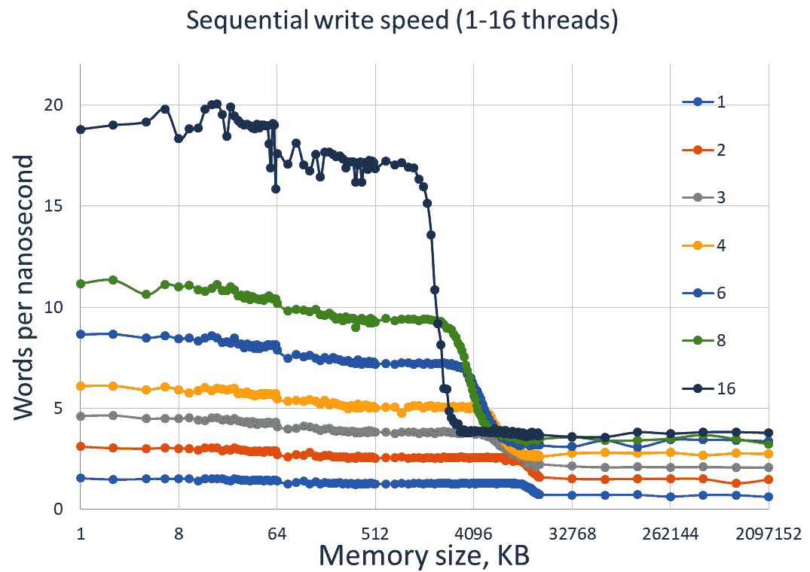

图 5.1-64 位整数的顺序写入的内存吞吐量（每纳秒字数）作为内存范围的函数，为 1 到 16 个线程

总体趋势对我们来说已经很熟悉：我们看到与缓存大小相对应的速度跳跃。现在我们关注不同线程数量的曲线之间的差异。我们有 1 到 16 个线程的结果（用于收集这些测量数据的机器确实至少有 16 个物理 CPU 核心）。让我们从图的左侧开始。在这里，速度受到 L1 缓存（最多 32 KB）的限制，然后是 L2 缓存（256 KB）。这个处理器为每个核心都有单独的 L1 和 L2 缓存，因此只要数据适合 L2 缓存，线程之间就不应该有任何交互，因为它们不共享任何资源：每个线程都有自己的缓存。实际上，这并不完全正确，即使对于小内存范围，仍然有其他共享的 CPU 组件，但几乎是正确的：2 个线程的吞吐量是 1 个线程的两倍，4 个线程的写入速度再次快两倍，16 个线程几乎比 4 个线程快 4 倍。

随着我们超过 L2 缓存的大小并进入 L3 缓存，然后是主内存，图片发生了巨大的变化：在这个系统上，L3 缓存是所有 CPU 核心共享的。主内存也是共享的，尽管不同的内存 bank*更接近*不同的 CPU（非均匀内存架构）。对于 1、2 甚至 4 个线程，吞吐量继续随着线程数量增加而增加：主内存似乎有足够的带宽，可以支持最多 4 个处理器以全速写入。然后情况变得更糟：当我们从 6 个线程增加到 16 个线程时，吞吐量几乎不再增加。我们已经饱和了内存总线：它无法更快地写入数据。

如果这还不够糟糕，请考虑这些结果是在撰写时的最新硬件上获得的（2020 年）。在 2018 年，作者在他的一堂课上呈现的同一张图表如下：

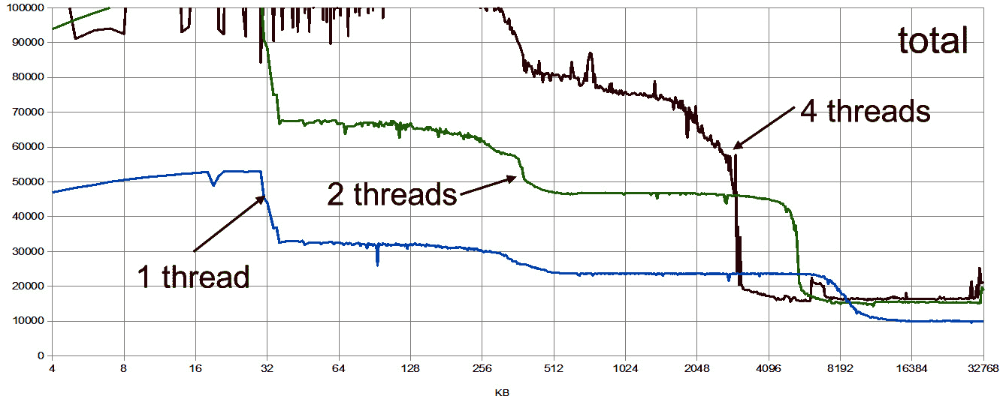

图 5.2-较旧（2018 年）CPU 的内存吞吐量

这个系统有一个内存总线，只需两个线程就可以完全饱和。让我们看看这个事实对并发程序性能的影响。

## 内存绑定程序和并发性

相同的结果可以以不同的方式呈现：通过绘制每个线程的内存速度与相对于一个线程的线程数量的图，我们专注于并发对内存速度的影响。

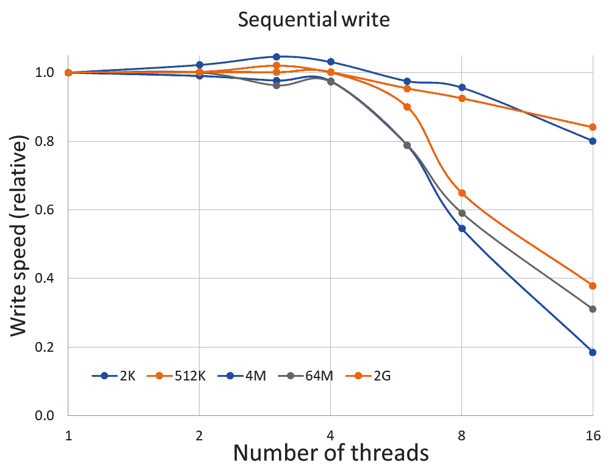

图 5.3-内存吞吐量，相对于单个线程的吞吐量，与线程计数

通过对内存速度进行归一化，使得单个线程的速度始终为 1，我们更容易看到对于适合 L1 或 L2 缓存的小数据集，每个线程的内存速度几乎保持不变，即使对于 16 个线程（每个线程的写入速度为其单线程速度的 80%）。然而，一旦我们跨入 L3 缓存或超过其大小，速度在 4 个线程后下降。从 8 到 16 个线程只提供了极小的改善。系统中没有足够的带宽来快速写入数据到内存。

不同内存访问模式的结果看起来很相似，尽管读取内存的带宽通常比写入内存的带宽略微好一些。

我们可以看到，如果我们的程序在单线程情况下受到内存限制，因此其性能受到将数据移动到和从主内存的速度的限制，那么我们可以期望从并发中获得的性能改进有一个相当严格的限制。如果你认为这不适用于你，因为你没有昂贵的 16 核处理器，那么请记住，更便宜的处理器配备了更便宜的内存总线，因此大多数 4 核系统也没有足够的内存带宽来满足所有核心。

对于多线程程序来说，避免成为内存限制更加重要。在这里有用的实现技术包括分割计算，这样更多的工作可以在适合 L1 或 L2 缓存的较小数据集上完成；重新排列计算，这样更多的工作可以通过更少的内存访问完成，通常会重复一些计算；优化内存访问模式，使内存按顺序访问而不是随机访问（尽管两种访问模式都可以饱和，但顺序访问的总带宽要大得多，因此对于相同数量的数据，如果使用随机访问，程序可能会受到内存限制，而如果使用顺序访问，则根本不受内存速度限制）。如果仅靠实现技术是不够的，无法产生期望的性能改进，下一步就是调整算法以适应并发编程的现实：许多问题有多种算法，它们在内存需求上有所不同。单线程程序的最快算法通常可以被另一个更适合并发性的算法超越：虽然我们在单线程执行速度上失去了一些，但我们通过可扩展执行的蛮力来弥补。

到目前为止，我们假设每个线程都完全独立于所有其他线程地完成自己的工作。线程之间的唯一交互是间接的，由于争夺内存带宽等有限资源。这是最容易编写的程序类型，但大多数现实生活中的程序都不允许这种限制。这带来了一整套全新的性能问题，现在是我们学习它们的时候了。

# 理解内存同步的成本

最后一节讨论了在同一台机器上运行多个线程而这些线程之间没有任何交互。如果你可以以一种使这种实现成为可能的方式来分割程序的工作，那么请务必这样做。你无法击败这种*尴尬并行*程序的性能。

往往，线程必须相互交互，因为它们正在为一个共同的结果做出贡献。这种交互是通过线程通过它们共享的唯一资源——内存——相互通信来实现的。我们现在必须了解这种交互的性能影响。

让我们从一个简单的例子开始。假设我们想要计算许多值的总和。我们有许多数字要相加，但最终只有一个结果。我们有这么多数字要相加，以至于我们想要在几个线程之间分割添加它们的工作。但只有一个结果值，所以线程必须在添加到这个值时相互交互。

我们可以在微基准中重现这个问题：

```cpp
unsigned long x {0};
void BM_incr(benchmark::State& state) {
     for (auto _ : state) {
           benchmark::DoNotOptimize(++x);
     }
}
BENCHMARK(BM_incr)->Threads(2);
```

为简单起见，我们总是将结果增加 1（添加整数的成本不取决于值，我们不想对生成不同值进行基准测试，只是对添加本身进行基准测试）。由于每个线程都调用基准函数，因此在此函数内声明的任何变量都独立存在于每个线程的堆栈上；这些变量根本不共享。为了有一个两个线程都能贡献的共同结果，变量必须在基准函数之外的文件范围内声明（一般来说这是个坏主意，但在微基准的非常有限的上下文中是必要且可以接受的）。

当然，这个程序的问题远不止全局变量：这个程序是错误的，其结果是未定义的。问题在于我们有两个线程增加相同的值。增加一个值是一个 3 步过程：程序从内存中读取值，在寄存器中增加它，然后将新值写回内存。完全有可能两个线程同时读取相同的值（0），在每个处理器上分别增加它（1），然后写回。第二个写入的线程简单地覆盖了第一个线程的结果，经过两次增加，结果是 1 而不是 2。这两个线程竞争写入同一内存位置的情况被称为数据竞争。

现在你明白了为什么这样的无保护并发访问是一个问题，你可能会忘记它；相反，遵循这个一般规则：如果一个程序从多个线程访问相同的内存位置而没有同步，并且其中至少有一个访问是写入的，那么该程序的结果是未定义的。这是非常重要的：你不需要确切地弄清楚为了结果是不正确而必须发生的操作序列。事实上，在这种推理中根本没有任何收获。任何时候你有两个或更多的线程访问相同的内存位置，除非你能保证两件事中的一件：要么所有访问都是只读的，要么所有访问都使用正确的内存同步（我们还要学习）。

我们计算总和的问题要求我们将答案写入结果变量，因此访问肯定不是只读的。内存访问的同步通常由互斥锁提供：每次访问线程之间共享的变量都必须由互斥锁保护（当然，对于所有线程来说，必须是相同的互斥锁）。

```cpp
unsigned long x {0};
std::mutex m;
{ // Concurrent access happens here
     std::lock_guard<std::mutex> guard(m);
     ++x;
}
```

锁卫在其构造函数中锁定互斥锁，并在析构函数中解锁它。一次只有一个线程可以拥有锁，因此增加共享结果变量。其他线程在锁上被阻塞，直到第一个线程释放它。请注意，只要至少有一个线程修改变量，*所有*访问都必须被锁定，*包括*读取和写入。

锁是确保多线程程序正确性的最简单方法，但从性能的角度来看，它们并不是最容易研究的东西。它们是相当复杂的实体，通常涉及系统调用。我们将从一个在这种特定情况下更容易分析的同步选项开始：原子变量。

C++给了我们一个选项，可以声明一个变量为原子变量。这意味着对这个变量的所有支持的操作都作为单个、不可中断的原子事务执行：观察这个变量的任何其他线程都会在原子操作之前或之后看到它的状态，但永远不会在操作中间。例如，在 C++中，所有整数原子变量都支持原子增量操作：如果一个线程正在执行该操作，其他线程就无法访问该变量，直到第一个操作完成。这些操作需要特定的硬件支持：例如，原子增量是一个特殊的硬件指令，它读取旧值，增加它，并将新值作为单个硬件操作写入。

对于我们的例子，原子增量就是我们需要的。必须强调的是，无论我们决定使用什么样的同步机制，所有线程都必须使用相同的机制来并发访问特定的内存位置。如果我们在一个线程上使用原子操作，只要所有线程都使用原子操作，就不会有数据竞争。如果另一个线程使用互斥锁或非原子访问，所有的保证都将失效，结果再次是未定义的。

让我们重写我们的基准测试来使用 C++原子操作：

```cpp
std::atomic<unsigned long> x(0);
void BM_shared(benchmark::State& state) {
     for (auto _ : state) {
           benchmark::DoNotOptimize(++x);
     }
}
```

程序现在是正确的：这里没有数据竞争。这并不一定准确，因为单个增量是一个非常短的时间间隔来测量；我们真的应该手动展开循环或使用宏，并在每个循环迭代中进行多次增量（我们在上一章中已经这样做了，所以你可以在那里看到宏）。让我们看看它的表现如何。如果线程之间没有交互，两个线程计算总和所需的时间将是一个线程所需时间的一半：

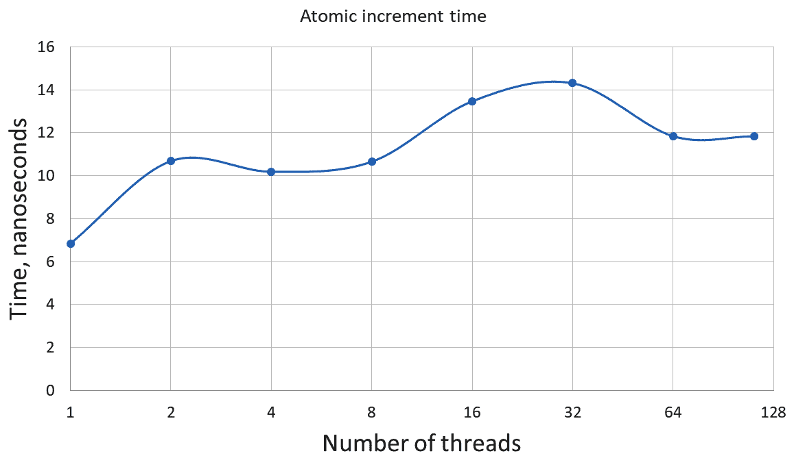

图 5.4 - 多线程程序中的原子增量时间

我们已经对结果进行了归一化，以显示单个增量的平均时间，也就是计算总和所需的时间除以总加法次数。这个程序的性能非常令人失望：不仅没有改进，而且事实上，在两个线程上计算总和所需的时间比一个线程上还要长。

如果我们使用更传统的互斥锁，结果甚至更糟：

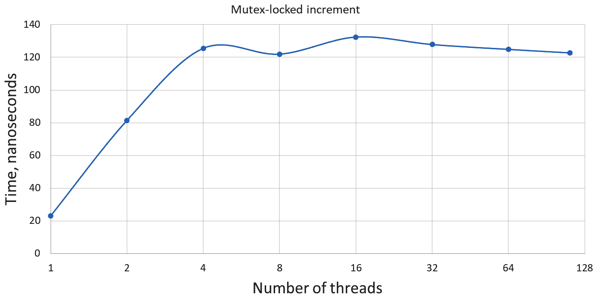

图 5.5 - 使用互斥锁的多线程程序中的增量时间

首先，正如我们预期的那样，即使在一个线程上，锁定互斥锁也是一个相当昂贵的操作：使用互斥锁的增量需要 23 纳秒，而原子增量只需要 7 纳秒。随着线程数量的增加，性能会更快地下降。

从这些实验中可以得出一个非常重要的教训。访问共享数据的程序部分永远不会扩展。访问共享数据的最佳性能是单线程性能。一旦有两个或更多线程同时访问相同的数据，性能只会变得更糟。当然，如果两个线程在不同时间访问相同的数据，它们实际上并不相互交互，因此两次都会获得单线程性能。多线程程序的性能优势来自线程独立进行的计算，无需同步。根据定义，这样的计算是在不共享的数据上进行的（无论如何，如果你希望你的程序是正确的）。但是为什么并发访问共享数据如此昂贵？在下一节中，我们将了解原因。我们还将学到一个非常重要的关于仔细解释测量结果的教训。

# 为什么数据共享如此昂贵

正如我们刚刚看到的，共享数据的并发（同时）访问真的会严重影响性能。直观上讲，这是有道理的：为了避免数据竞争，任何给定时间只有一个线程可以操作共享数据。我们可以通过互斥锁或使用原子操作来实现这一点。无论哪种方式，当一个线程，比如说，增加共享变量时，所有其他线程都必须等待。我们上一节的测量结果证实了这一点。

然而，在基于观察和实验的任何行动之前，准确理解我们测量了什么以及可以得出什么结论至关重要。

很容易描述所观察到的情况：同时从多个线程增加共享变量根本不会扩展，并且实际上比只使用一个线程更慢。这对于原子共享变量和受互斥锁保护的非原子变量都是如此。我们没有尝试测量对非原子变量的无保护访问，因为这样的操作会导致未定义的行为和不正确的结果。我们也知道对于线程特定的（非共享）变量的无保护访问会随着线程数量的增加而扩展得非常好，至少直到我们饱和了总内存带宽（只有在我们写入大量数据时才会发生；对于单个变量来说，这不是问题）。批判性地分析你的实验结果并且没有不合理的先入之见是非常重要的技能，所以让我们再次声明我们所知道的：对共享数据的受保护访问很慢，对非共享数据的无保护访问很快。如果我们从中得出结论，即数据共享使程序变慢，那么我们就是在做一个假设：共享数据是重要的，受保护访问不是。这提出了另一个非常重要的观点，当进行性能测量时，你应该记住：当比较程序的两个版本时，尽量只改变一件事，并测量结果。

我们缺少的测量是这样的：对受保护数据的非共享访问。当然，我们不需要保护只被一个线程访问的数据，但我们试图准确理解共享数据访问为何如此昂贵：是因为它是共享的还是因为它是原子的（或者受锁保护）。我们必须一次只做一个改变，所以让我们保持原子访问并移除数据共享。至少有两种简单的方法可以做到这一点。第一种方法是创建一个原子变量的全局数组，并让每个线程访问自己的数组元素：

```cpp
std::atomic<unsigned long> a[1024];
void BM_false_shared(benchmark::State& state) {
     std::atomic<unsigned long>& x = a[state.thread_index];
     for (auto _ : state) {
           benchmark::DoNotOptimize(++x);
     }
}
```

Google Benchmark 中的线程索引对于每个线程是唯一的，数字从 0 开始并且是紧凑的（0, 1, 2...）。另一种简单的方法是在`benchmark`函数本身中声明变量，如下面的代码所示：

```cpp
void BM_not_shared(benchmark::State& state) {
     std::atomic<unsigned long> x;
     for (auto _ : state) {
           benchmark::DoNotOptimize(++x);
     }
}
```

现在我们正在增加与我们在收集图 5.4 的测量时相同的原子整数，只是它不再在线程之间共享。这将告诉我们是共享还是原子变量使增量变慢。以下是结果：

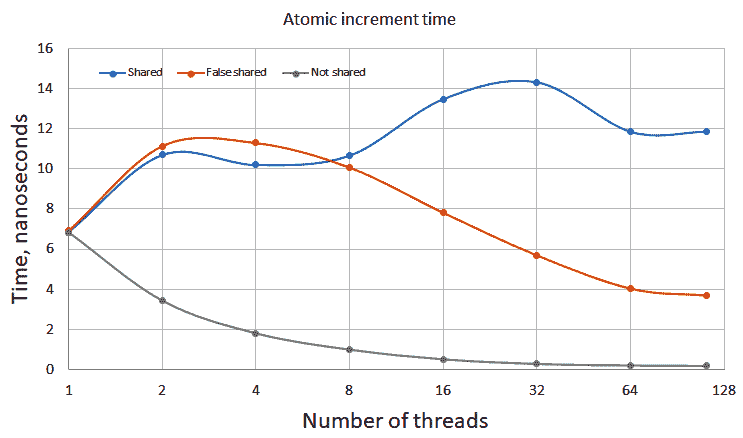

图 5.6 - 共享和非共享变量的原子增量时间

共享曲线是来自图 5.4 的曲线，而另外两个来自没有数据共享的基准测试。每个线程都有一个本地变量的基准测试被标记为“非共享”，并且表现为：两个线程上的计算时间是一个线程的一半，四个线程的时间再次减半，依此类推。请记住，这是一次增量操作的平均时间：我们总共进行了，比如说，100 万次增量，测量总共花费的时间，然后除以 100 万。由于我们增量的变量在线程之间不共享，我们期望两个线程的运行速度是一个线程的两倍，所以“非共享”结果正是我们预期的。另一个基准测试，我们使用原子变量的数组，但每个线程使用自己的数组元素，也没有共享数据。然而，它的表现就好像数据在线程之间是共享的，至少对于少量线程来说，所以我们称之为“伪共享”：实际上没有真正共享，但程序的行为却好像共享了一样。

这一结果表明，数据共享成本高的原因比我们之前假设的更加复杂：在伪共享的情况下，每个数组元素只有一个线程在操作，因此它不必等待任何其他线程完成递增。然而，线程显然彼此等待。要理解这种异常，我们必须更多地了解缓存的工作方式。

多核或多处理器系统中数据在处理器和内存之间的传输方式如*图 5.7*所示。

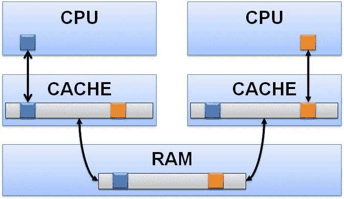

图 5.7 - 多核系统中 CPU 和内存之间的数据传输

处理器操作数据以单个字节或取决于变量类型的单词；在我们的情况下，`unsigned long`是一个 8 字节的单词。原子递增读取指定地址的单个单词，递增它，然后将其写回。但是从哪里读取？CPU 只能直接访问 L1 缓存，因此它从那里获取数据。数据如何从主内存传输到缓存？它通过更宽的内存总线复制。可以从内存复制到缓存和反复制的最小数据量称为**缓存行**。在所有 x86 CPU 上，一个缓存行是 64 字节。当 CPU 需要锁定内存位置进行原子事务（如原子递增）时，它可能只写入一个单词，但必须锁定整个缓存行：如果允许两个 CPU 同时将同一个缓存行写入内存，其中一个将覆盖另一个。请注意，为简单起见，我们在*图 5.7*中只显示了一级缓存层次结构，但这并没有影响：数据以缓存行长度的块通过所有缓存级别传输。

现在我们可以解释我们观察到的伪共享：即使相邻的数组元素实际上并不在线程之间共享，它们确实占据了同一个缓存行。当 CPU 请求对一个数组元素进行原子递增操作的独占访问时，它会锁定整个缓存行，并阻止任何其他 CPU 访问其中的任何数据。顺便说一句，这解释了为什么*图 5.7*中的伪共享对于多达 8 个线程而言等效于真实数据共享，但对于更多的线程而言会更快：我们在写入 8 字节的单词，所以 8 个单词可以放入同一个缓存行中。如果我们只有 8 个线程（或更少），那么在任何给定时间只有一个线程可以递增其值，就像真正的共享一样。但是对于超过 8 个线程，数组至少占据两个缓存行，并且它们可以被两个 CPU 独立地锁定。因此，如果我们有，比如说，16 个线程，那么在任何时候都有两个线程可以前进，一个用于数组的每一半。

另一方面，真正的无共享基准在每个线程的堆栈上分配原子变量。这些是完全独立的内存分配，相隔多个缓存行。通过内存没有任何交互，这些线程完全独立地运行。

我们的分析表明，访问共享数据的高成本的真正原因是必须进行的工作，以保持对缓存行的独占访问，并确保所有 CPU 的缓存中都有一致的数据：在一个 CPU 获得独占访问并更新缓存行中的任何一个位之后，所有其他 CPU 的所有缓存中该行的副本都已过时。在这些其他 CPU 可以访问同一个缓存行中的任何数据之前，它们必须从主内存中获取更新的内容，正如我们所看到的，这需要相对较长的时间。

正如我们所看到的，两个线程是否尝试访问相同的内存位置并不重要，只要它们竞争访问同一个缓存行。这种独占缓存行访问是共享变量高成本的根源。

人们可能会想知道锁昂贵的原因是否也存在于它们包含的共享数据中（所有锁必须包含一定量的共享数据，这是一个线程可以让另一个线程知道锁已被占用的唯一方法）。正如我们在*图 5.4*和*5.5*中所看到的，互斥锁比单个原子访问要昂贵得多，即使在一个线程上也是如此。我们可以正确地假设，锁定互斥锁涉及的工作比只修改一个原子变量要多。但为什么当我们有多个线程时，这项工作需要更多时间呢？这是因为数据是共享的，并且需要对缓存行进行独占访问吗？我们留给读者作为练习来确认这确实是这样。这个实验的关键是设置锁的伪共享：一个锁数组，使得每个线程操作自己的锁，但它们竞争同一个缓存行（当然，这样的每线程锁实际上并不能保护任何东西免受并发访问，但我们只想知道锁定和解锁所需的时间）。这个实验比你想象的要稍微复杂一些：标准的 C++互斥锁`std::mutex`通常相当大，根据操作系统的不同在 40 到 80 字节之间。这意味着你甚至不能将两个互斥锁放入同一个缓存行中。你必须使用一个更小的锁来进行这个实验，比如**自旋锁**或**futex**。

我们现在明白了为什么同时访问共享数据的成本如此之高。这种理解给了我们两个重要的教训。第一个教训是在尝试创建非共享数据时要避免伪共享。伪共享如何潜入我们的程序？考虑我们在本章中一直研究的简单示例：并发累积总和。我们的一些方法比其他方法慢，但它们都非常慢（比单线程程序慢，或者最多也不会更快）。我们明白访问共享数据是昂贵的。那么什么更便宜呢？当然是不访问共享数据！或者至少不那么频繁地访问。我们没有理由每次想要向总和添加东西时都访问共享总和值：我们可以在线程上本地进行所有的加法，然后在最后一次将它们添加到共享累加器值上。代码看起来会像这样：

```cpp
// Global (shared) results
std::atomic<unsigned long> sum;
unsigned long local_sum[…];
// Per-thread work is done here
unsigned long& x = local_sum[thread_index];
for (size_t i = 0; i < N; ++i) ++x;
sum += x;
```

我们有全局结果`sum`，它在所有线程之间共享，并且必须是原子的（或者由锁保护）。但是每个线程在完成所有工作后只访问这个变量一次。每个线程使用另一个变量来保存部分总和，只有在这个线程上添加的值（在我们的简单情况中是增量 1，但无论添加的值如何，性能都是一样的）。我们可以创建一个大数组来存储这些每线程部分总和，并给每个线程一个唯一的数组元素来处理。当然，在这个简单的例子中，我们可以只使用一个本地变量，但在一个真实的程序中，部分结果通常需要在工作线程完成后保留，并且这些结果的最终处理是在其他地方完成的，也许是由另一个线程完成。为了模拟这种实现，我们使用一个每线程变量的数组。请注意，这些变量只是普通的整数，不是原子的：它们没有并发访问。不幸的是，在这个过程中，我们陷入了伪共享的陷阱：数组的相邻元素（通常）在同一个缓存行上，因此不能同时访问。这反映在我们程序的性能上：

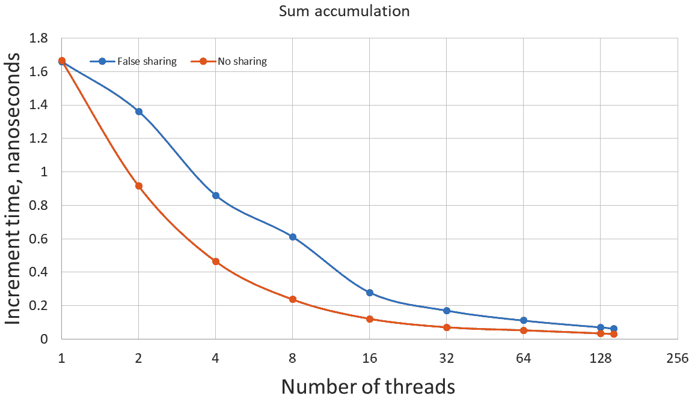

图 5.8 - 带有和不带有伪共享的总和累积

正如您在*图 5.8*中所看到的，我们的程序在线程数量很大时扩展性非常差。另一方面，如果我们通过确保每个线程的部分和至少相隔 64 字节（或者在我们的情况下简单地使用本地变量）来消除虚假共享，那么它的扩展性就完美，正如预期的那样。当我们使用更多线程时，两个程序都变得更快，但没有虚假共享负担的实现大约快两倍。

第二个教训在后面的章节中将变得更加重要：由于并发访问共享变量相对来说非常昂贵，因此使用更少共享变量的算法或实现通常会执行得更快。

这个陈述可能在这一刻令人困惑：由于问题的性质，我们有一些必须共享的数据。我们可以进行像刚刚做的优化，并消除对这些数据的不必要访问。但一旦这样做了，剩下的就是我们需要访问以产生期望结果的数据。那么，共享变量可能会更多，或更少，吗？要理解这一点，我们必须意识到编写并发程序不仅仅是保护对所有共享数据的访问。

# 学习并发和顺序

正如读者在本章前面提醒过的，任何访问任何共享数据的程序，如果没有访问同步（通常是互斥锁或原子访问），都会产生未定义行为，通常称为数据竞争。这在理论上似乎很简单。但我们的激励性例子太简单了：它只有一个在线程之间共享的变量。并发性不仅仅是锁定共享变量，我们将很快看到。

## 顺序的需求

现在考虑一下这个例子，被称为**生产者-消费者队列**。假设我们有两个线程。第一个线程，生产者，通过构造对象来准备一些数据。第二个线程，消费者，处理数据（对每个对象进行操作）。为了简单起见，假设我们有一个大的内存缓冲区，最初未初始化，生产者线程在缓冲区中构造新对象，就好像它们是数组元素一样：

```cpp
size_t N;     // Count of initialized objects
T* buffer; // Only [0]…[N-1] are initialized
```

为了生产（构造）一个对象，生产者线程通过在数组的每个元素上放置`new`运算符来调用构造函数，从`N==0`开始：

```cpp
new (buffer + N) T( … arguments … );
```

现在数组元素`buffer[N]`已初始化，并且可以被消费者线程访问。生产者通过增加计数器`N`来发出信号，然后继续初始化下一个对象：

```cpp
++N;
```

消费者线程在计数器`N`增加到大于`i`之前，不能访问数组元素`buffer[i]`：

```cpp
for (size_t i = 0; keep_consuming(); ++i) {
     while (N <= i) {}; // Wait for the i-th element
     consume(buffer[i]);
}
```

为了简单起见，让我们忽略内存耗尽的问题，并假设缓冲区足够大。此外，我们现在不关心终止条件（消费者如何知道何时继续消费？）。此刻，我们对生产者-消费者握手协议感兴趣：消费者如何在没有任何竞争的情况下访问数据？

一般规则规定，对共享数据的任何访问都必须受到保护。显然，计数器`N`是一个共享变量，因此访问它需要更多的注意：

```cpp
size_t N;     // Count of initialized objects
std::mutex mN;    // Mutex to guard N
… Producer …
{
     std::lock_guard l(mN);
     ++N;
}
… Consumer … 
{
     size_t n;
     do {
           std::lock_guard l(mN);
           n = N;
     } while (n <= i);
}
```

但这足够吗？仔细看：我们的程序中有更多的共享数据。对象数组`T`在两个线程之间是共享的：每个线程都需要访问每个元素。但是，如果我们需要锁定整个数组，我们可能会回到单线程实现：两个线程中的一个始终会被锁定。根据经验，每个编写过任何多线程代码的程序员都知道，在这种情况下，我们不需要锁定数组，只需要锁定计数器。事实上，锁定计数器的整个目的是我们不需要以这种方式锁定数组：数组的任何特定元素都不会被同时访问。首先，它只能在生产者在计数器递增之前访问。然后，它只能在计数器递增后由消费者访问。这是已知的。但是，本书的目标是教会你如何理解事情为什么会发生，因此，为什么锁定计数器足够？是什么保证事件确实按我们想象的顺序发生？

顺便说一句，即使这个平凡的例子也变得不那么平凡了。保护消费者对计数器`N`的访问的天真方法如下：

```cpp
std::lock_guard l(mN);
while (N <= i) {};
```

这是一个保证的死锁：一旦消费者获取锁，它就会等待元素`i`被初始化，然后才会释放锁。生产者无法取得任何进展，因为它正在等待获取锁，然后才能递增计数器`N`。两个线程现在都永远在等待。很容易注意到，如果我们只是使用原子变量来计数，我们的代码将简单得多：

```cpp
std::atomic<size_t> N;     // Count of initialized objects
… Producer …
{
     ++N;    // Atomic, no need for locks
}
… Consumer … 
{
     while (N <= i) {};
}
```

现在，消费者对计数器`N`的每次读取都是原子的，但在两次读取之间，生产者没有被阻塞，可以继续工作。这种并发处理方法被称为`buffer[i]`？

## 内存顺序和内存屏障

正如我们意识到的那样，能够安全地访问共享变量并不足以编写任何非平凡的并发程序。我们还必须能够推断事件发生的顺序。在我们的生产者和消费者示例中，整个程序都建立在一个假设上：我们可以保证第 N 个数组元素的构造，将计数器递增到 N + 1，以及消费者线程访问第 N 个元素的顺序。

但是，一旦我们意识到我们不仅仅是处理多个线程，而且是处理真正同时执行这些线程的多个处理器时，问题实际上更加复杂。我们必须记住的关键概念是**可见性**。一个线程在一个 CPU 上执行，并且在 CPU 分配值给变量时对内存进行更改。实际上，CPU 只是更改其缓存的内容；缓存和内存硬件最终将这些更改传播到主内存或共享的高级缓存，此时这些更改可能对其他 CPU 可见。我们说“*可能*”，因为其他 CPU 的缓存中对相同变量有不同的值，我们不知道这些差异何时会被协调。我们知道，一旦 CPU 开始对原子变量执行操作，其他 CPU 就无法访问相同的变量，直到此操作完成，并且一旦此操作完成，所有其他 CPU 将看到此变量的最新更新值（但仅当所有 CPU 将变量视为原子时）。我们知道，同样适用于由锁保护的变量。但是，这些保证对于我们的生产者-消费者程序来说是不够的：根据我们目前所知，我们无法确定它是否正确。这是因为，到目前为止，我们只关注了访问共享变量的一个方面：这种访问的原子性或事务性。我们希望确保整个操作，无论是简单还是复杂，都作为单个事务执行，而不会被中断。

但访问共享数据还有另一个方面，即**内存顺序**。就像访问本身的原子性一样，它是硬件的一个特性，使用特定的机器指令（通常是原子指令本身的属性或标志）来激活。

内存顺序有几种形式。最不受限制的是松散内存顺序。当使用松散顺序执行原子操作时，我们唯一的保证是操作本身是原子执行的。这是什么意思？让我们首先考虑执行原子操作的 CPU。它运行包含其他操作的线程，既有非原子操作，也有原子操作。其中一些操作修改内存；这些操作的结果可以被其他 CPU 看到。其他操作读取内存；它们观察其他 CPU 执行的操作的结果。运行我们线程的 CPU 按照一定顺序执行这些操作。它可能不是程序中编写的顺序：编译器和硬件都可以重新排序指令，通常是为了提高性能。但这是一个明确定义的顺序。现在让我们从执行不同线程的另一个 CPU 的角度来看。第二个 CPU 可以看到内存内容随着第一个 CPU 的工作而改变。但它不一定以与原子操作相同的顺序看到它们，也不一定以与彼此相同的顺序看到它们：

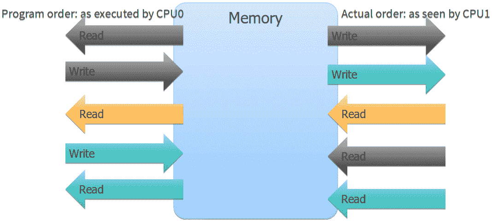

图 5.9 - 使用松散内存顺序的操作的可见性

这就是我们之前谈论的可见性：一个 CPU 按照一定顺序执行操作，但它们的结果以非常不同的顺序对其他 CPU 可见。为了简洁起见，我们通常谈论操作的可见性，并不是每次都提到*结果*。

如果我们对共享计数器`N`的操作使用松散内存顺序执行，我们将陷入深深的麻烦：使程序正确的唯一方法是锁定它，以便只有一个线程，生产者或消费者，可以同时运行，并且我们无法从并发中获得性能改进。

幸运的是，我们可以使用其他内存顺序保证。最重要的是获取-释放内存顺序。当使用此顺序执行原子操作时，我们保证任何访问内存的操作在执行原子操作之前，并在另一个线程执行相同原子变量的原子操作之前变得可见。同样，所有在原子操作之后执行的操作只有在相同变量上的原子操作之后才变得可见。再次强调，当我们谈论操作的可见性时，我们真正意味着它们的结果对其他 CPU 变得可观察。这在*图 5.10*中是显而易见的：在左边，我们有**CPU0**执行的操作。在右边，我们有**CPU1**看到的相同操作。特别要注意的是，右边显示的原子操作是*原子写*。但**CPU1**并没有执行原子写：它执行原子读以查看**CPU0**执行的原子写的结果。其他所有操作也是如此：在左边，顺序是由**CPU0**执行的。在右边，顺序是由**CPU1**看到的。

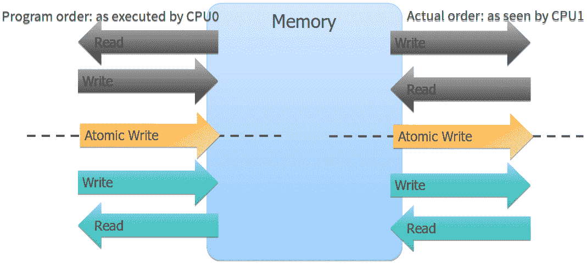

图 5.10 - 使用获取-释放内存顺序的操作的可见性

获取-释放顺序保证是一个简洁的陈述，包含了许多重要信息，让我们详细阐述一些不同的观点。首先，该顺序是相对于两个线程在同一个原子变量上执行的操作而定义的。直到两个线程以原子方式访问相同的变量，它们的“时钟”相对于彼此来说是完全任意的，我们无法推断出某件事情发生在另一件事情之前或之后，这些词语是没有意义的。只有当一个线程观察到另一个线程执行的原子操作的结果时，我们才能谈论“之前”和“之后”。在我们的生产者-消费者示例中，生产者原子地增加计数器`N`。消费者原子地读取相同的计数器。如果计数器没有改变，我们对生产者的状态一无所知。但是，如果消费者看到计数器已经从 N 变为 N+1，并且两个线程都使用获取-释放内存顺序，我们知道生产者在增加计数器之前执行的所有操作现在对消费者可见。这些操作包括构造现在驻留在数组元素`buffer[N]`中的对象所需的所有工作，因此，消费者可以安全地访问它。

第二个显著的观点是，当访问原子变量时，两个线程都必须使用获取-释放内存顺序。如果生产者使用此顺序来增加计数，但消费者以松散的内存顺序读取它，那么对任何操作的可见性就没有任何保证。

最后一点是，所有顺序保证都是以原子变量上的操作“之前”和“之后”来给出的。同样，在我们的生产者-消费者示例中，当消费者看到计数器改变时，我们知道生产者执行的操作结果构造第 N 个对象对消费者是可见的。对这些操作变得可见的顺序没有任何保证。你可以在*图 5.10*中看到这一点。当然，这对我们来说不重要：在对象构造之前我们不能触摸任何部分，一旦构造完成，我们也不关心它是以什么顺序完成的。具有内存顺序保证的原子操作充当着其他操作无法移动的屏障。你可以想象在*图 5.10*中有这样一个屏障，将整个程序分成两个不同的部分：在计数增加之前发生的一切和之后发生的一切。因此，通常方便将这样的原子操作称为内存屏障。

让我们假设一下，在我们的程序中，对计数器`N`的所有原子操作都有获取-释放屏障。这肯定会保证程序的正确性。然而，请注意，获取-释放顺序对我们的需求来说有些过度。对于生产者来说，它给了我们一个保证，即在我们将计数增加到 N+1 之前构造的所有对象`buffer[0]`到`buffer[N]`在消费者看到计数从 N 变为 N+1 时将对其可见。我们需要这个保证。但我们也有保证，为了构造剩余的对象`buffer[N+1]`及更多对象而执行的操作尚未变得可见。我们不关心这一点：消费者在看到下一个计数值之前不会访问这些对象。同样，在消费者方面，我们有保证，消费者看到计数变为 N+1 后执行的所有操作的效果（内存访问）将发生在该原子操作之后。我们需要这个保证：我们不希望 CPU 重新排序我们的消费者操作，并在准备好之前执行一些访问对象`buffer[N]`的指令。但我们也有保证，消费者处理之前的对象如`buffer[N-1]`的工作已经完成并对所有线程可见，然后消费者才会移动到下一个对象。同样，我们不需要这个保证：没有什么依赖它。

拥有比严格必要的更强保证有什么害处？在正确性方面，没有。但这是一本关于编写快速程序的书（也是正确的）。为什么首先需要顺序保证？因为在自己的设备上，编译器和处理器几乎可以任意重新排序我们的程序指令。为什么他们会这样做？通常是为了提高性能。因此，可以推断出，我们对执行重新排序的能力施加的限制越多，对性能的不利影响就越大。因此，一般来说，我们希望使用足够严格以确保程序正确性的内存顺序，但不要更严格。

对于我们的生产者-消费者程序，给我们提供了确切所需的内存顺序如下。在生产者方面，我们需要获取-释放内存屏障提供的保证的一半：在具有屏障的原子操作之前执行的所有操作必须在执行相应的原子操作之前对其他线程可见。这被称为释放内存顺序：

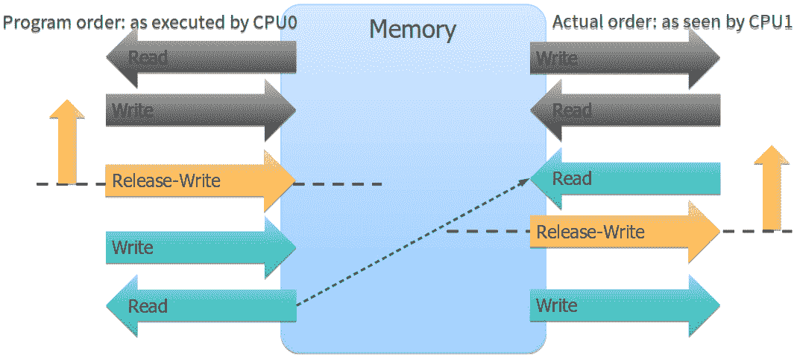

图 5.11 – 释放内存顺序

当**CPU1**看到由**CPU0**执行的具有释放内存顺序的原子写操作的结果时，可以保证，根据**CPU1**看到的内存状态，已经反映了在这个原子操作之前由**CPU0**执行的所有操作。请注意，我们没有提到原子操作之后由**CPU0**执行的操作。正如我们在*图 5.11*中看到的，这些操作可能以任何顺序变得可见。原子操作创建的内存屏障只在一个方向上有效：在屏障之前执行的任何操作都不能越过它，并在屏障之后被看到。但是屏障在另一个方向上是可渗透的。因此，释放内存屏障和相应的获取内存屏障有时被称为**半屏障**。

获取内存顺序是我们在消费者方面需要使用的。它保证了屏障后执行的所有操作在屏障后对其他线程可见，如*图 5.12*所示：

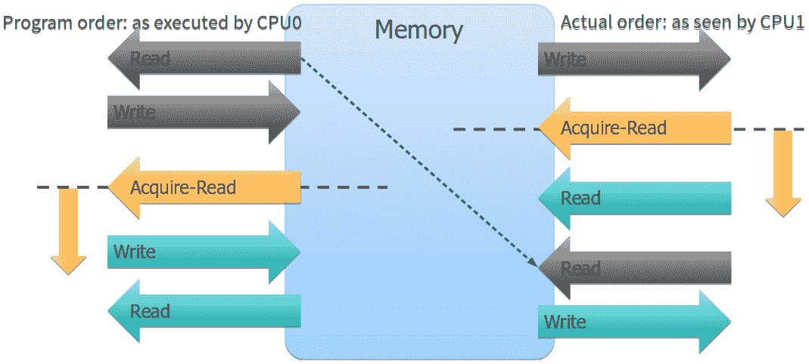

图 5.12 – 获取内存顺序

获取和释放内存屏障总是成对使用的：如果一个线程（在我们的情况下是生产者）使用原子操作的释放内存顺序，另一个线程（消费者）必须在同一个原子变量上使用获取内存顺序。为什么我们需要两个屏障？一方面，我们保证生产者在增加计数之前构建新对象的所有操作在消费者看到这个增量时已经可见。但这还不够，另一方面，我们保证消费者执行的操作来处理这个新对象不能被移动到时间上向后，到达屏障之前的时刻，此时它们可能已经看到了一个未完成的对象。

现在我们明白了仅仅在共享数据上进行原子操作是不够的，您可能会问我们的生产者-消费者程序是否实际上有效。事实证明，无论是锁版本还是无锁版本都是正确的，即使我们没有明确说明内存顺序。那么，在 C++中如何控制内存顺序呢？

## C++中的内存顺序

首先，让我们回想一下我们的生产者-消费者程序的无锁版本，即具有原子计数器的版本：

```cpp
std::atomic<size_t> N;     // Count of initialized objects
T* buffer; // Only [0]…[N-1] are initialized
… Producer …
{
     new (buffer + N) T( … arguments … );
     ++N;    // Atomic, no need for locks
}
… Consumer … 
for (size_t i = 0; keep_consuming(); ++i) {
     while (N <= i) {}; // Atomic read
     consume(buffer[i]);
}
```

计数器`N`是一个原子变量，是由模板`std::atomic`生成的类型参数为`size_t`的对象。所有原子类型都支持原子读写操作，即它们可以出现在赋值操作中。此外，整数原子类型具有常规整数操作的定义和实现，因此`++N`是原子增量（并非所有操作都被定义，例如没有`*=`运算符）。这些操作都没有明确指定内存顺序，那么我们有什么保证呢？事实证明，默认情况下，我们获得了最强大的可能保证，即每个原子操作都具有双向内存屏障（实际保证甚至更严格，您将在下一节中看到）。这就是为什么我们的程序是正确的。

如果您认为这太过分了，您可以将保证减少到您需要的部分，但您必须明确说明。原子操作也可以通过调用`std::atomic`类型的成员函数来执行，并且在那里您可以指定内存顺序。消费者线程需要一个带有获取屏障的加载操作：

```cpp
while (N.load(std::memory_order_acquire) <= i);
```

生产者线程需要一个带有释放屏障的增量操作（就像增量运算符一样，成员函数也返回增量之前的值）：

```cpp
N.fetch_add(1, std::memory_order_release);
```

在我们继续之前，我们必须意识到我们在优化中跳过了一个非常重要的步骤。开始上一段的正确方式是，“如果您认为这太过分，您必须通过性能测量来证明，然后才能将保证减少到您需要的部分”。即使在使用锁时编写并发程序也很困难；使用无锁代码，尤其是显式内存顺序，必须得到证明。

说到锁，它们提供了什么内存顺序保证？我们知道由锁保护的任何操作将被稍后获取锁的任何其他线程看到，但其他内存呢？锁的使用强制执行的内存顺序如*图 5.13*所示：

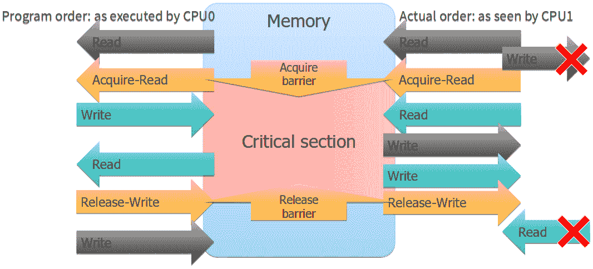

图 5.13 - 互斥锁的内存顺序保证

互斥锁内部至少有两个原子操作。锁定互斥锁相当于使用获取内存顺序的读操作（这解释了名称：这是我们在*获取*锁时使用的内存顺序）。该操作创建了一个半屏障，任何在此之前执行的操作都可以在屏障之后看到，但在获取锁之后执行的任何操作都不能被观察到。当我们解锁互斥锁或*释放*锁时，释放内存顺序是有保证的。在此屏障之前执行的任何操作将在屏障之前变得可见。您可以看到，获取和释放的一对屏障充当了它们之间代码部分的边界。这被称为临界区：在临界区内执行的任何操作，也就是在线程持有锁时执行的操作，将在其他线程进入临界区时变得可见。没有操作可以离开临界区（变得更早或更晚可见），但来自外部的其他操作可以进入临界区。至关重要的是，没有这样的操作可以穿过临界区：如果外部操作进入临界区，它就无法离开。因此，**CPU0**在其临界区之前执行的任何操作都保证在**CPU1**在其临界区之后变得可见。

对于我们的生产者-消费者程序，这转化为以下保证：

```cpp
… Producer …
new (buffer + N) T( … arguments … );
{ // Critical section start – acquire lock
     std::lock_guard l(mN);
     ++N;
} // Critical section end - Release lock
… Consumer … 
{ // Critical section – acquire lock
           std::lock_guard l(mN);
           n = N;
} // Critical section – release lock
consume(buffer[N]);
```

生产者执行的所有操作以构造第 N 个对象为例都在生产者进入临界区之前完成。它们将在消费者离开其临界区并开始消费第 N 个对象之前对消费者可见。因此，程序是正确的。

您刚刚阅读的部分介绍了内存顺序的概念，并用示例进行了说明。但是，当您尝试在代码中使用这些知识时，您会发现结果极不一致。为了更好地理解性能，您应该从不同的方式同步多线程程序以及避免数据竞争中期望什么，我们需要以更少的含糊方式描述内存顺序和相关概念。

# 内存模型

我们需要一种更系统和严格的方式来描述线程通过内存的交互，它们对共享数据的使用以及对并发应用的影响。这种描述被称为内存模型。内存模型描述了线程访问相同内存位置时存在的保证和限制。

在 C++11 标准之前，C++语言根本没有内存模型（标准中没有提到*线程*这个词）。为什么这是个问题？再次考虑我们的生产者-消费者示例（让我们专注于生产者方面）：

```cpp
std::mutex mN;
size_t N = 0;
…
new (buffer + N) T( … arguments … );
{ // Critical section start – acquire lock
     std::lock_guard l(mN);
     ++N;
} // Critical section end - release lock
```

`lock_guard`只是一个围绕互斥锁的 RAII 包装器，所以我们不会忘记解锁它，所以代码可以简化为这样：

```cpp
std::mutex mN;
size_t N = 0;
…
new (buffer + N) T( … arguments … );    // N
mN.lock();                        // mN
++N;                            // N
mN.unlock();                    // mN
```

请注意，此代码的每一行都使用变量`N`或对象`nM`，但它们从不在一次操作中同时使用。从 C++的角度来看，这段代码类似于以下代码：

```cpp
size_t n, m;
++m;
++n;
```

在这段代码中，操作的顺序并不重要，编译器可以自由地重新排序它们，只要可观察的行为不发生变化（可观察的行为是输入和输出，改变内存中的值不是可观察的行为）。回到我们最初的例子，为什么编译器不会重新排序那里的操作呢？

```cpp
mN.lock();                        // mN
mN.unlock();                    // mN
++N;                            // N
```

这将是非常糟糕的，然而，在 C++标准中（直到 C++11 之前）没有任何东西阻止编译器这样做。

当然，早在 2011 年之前，我们就已经在 C++中编写了多线程程序，那么它们是如何工作的呢？显然，编译器并没有进行这样的*优化*，但是为什么呢？答案在于内存模型：编译器提供了一些超出 C++标准的保证，并在标准不要求的情况下提供了某种内存模型。基于 Windows 的编译器遵循 Windows 内存模型，而大多数基于 Unix 和 Linux 的编译器提供了 POSIX 内存模型和相应的保证。

C++11 标准改变了这一点，并为 C++提供了自己的内存模型。我们已经在前一节中利用了它：伴随原子操作的内存顺序保证，以及锁，都是这个内存模型的一部分。C++内存模型现在保证了跨平台的可移植性，以前的平台根据其内存模型提供了不同的一组保证。此外，C++内存模型提供了一些特定于语言的保证。

我们已经在不同的内存顺序规范中看到了这些保证：relaxed、acquire、release 和 acquire-release。C++还有一种更严格的内存顺序，称为`std::memory_order_seq_cst`，这是当你不指定顺序时默认的顺序：不仅每个指定此顺序的原子操作都有一个双向内存屏障，而且整个程序都满足顺序一致性要求。这个要求规定程序的行为就好像所有处理器执行的所有操作都是按照一个全局顺序执行的。此外，这个全局顺序具有一个重要的特性：考虑在一个处理器上执行的任意两个操作 A 和 B，使得 A 在 B 之前执行。这两个操作必须以 A 在前、B 在后的顺序出现在全局顺序中。你可以把一个顺序一致的程序想象成这样：想象每个处理器都有一副牌，牌就是操作。然后我们将这些牌堆在一起，而不混洗它们；一副牌的牌会在另一副牌的牌之间滑动，但是同一副牌的牌的顺序永远不会改变。合并后的一副牌就是程序中操作的明显全局顺序。顺序一致性是一个理想的特性，因为它使得并发程序的正确性更容易推理。然而，它通常会以性能的代价为代价。我们可以在一个非常简单的基准测试中展示这个代价，比较不同的内存顺序：

```cpp
void BM_order(benchmark::State& state) {
     for (auto _ : state) {
           x.store(1, memory_order);
    … unroll the loop 32 times for better accuracy …
           x.store(1, memory_order);
           benchmark::ClobberMemory();
     }
     state.SetItemsProcessed(32*state.iterations());
}
```

我们可以使用不同的内存顺序来运行这个基准测试。结果当然会取决于硬件，但以下结果并不罕见：

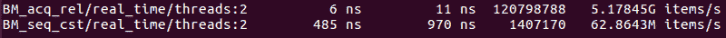

图 5.14 - acquire-release 与顺序一致性内存顺序的性能

C++内存模型还有很多内容，不仅仅是原子操作和内存顺序。例如，当我们之前研究了伪共享时，我们假设从多个线程同时访问数组的相邻元素是安全的。这是有道理的：这些是不同的变量。然而，语言甚至编译器采用的额外限制也不能保证这一点。在大多数硬件平台上，访问整数数组的相邻元素确实是线程安全的。但对于更小的数据类型，比如`bool`数组，情况绝对不是这样。许多处理器使用*掩码*整数写入来写入单个字节：它们加载包含此字节的整个 4 字节字，将字节更改为新值，然后将字写回。显然，如果两个处理器同时对共享相同 4 字节字的两个字节执行此操作，第二个写入将覆盖第一个写入。C++11 内存模型要求，如果没有两个线程访问相同的变量，那么写入任何不同的变量，比如数组元素，都是线程安全的。在 C++11 之前，很容易编写一个程序来证明从两个线程写入两个相邻的`bool`或`char`变量是不安全的。我们之所以在本书中没有这个演示，是因为即使您将标准级别指定为 C++03（这并不是保证，编译器可能会使用掩码写入以在 C++03 模式下写入单个字节，但大多数编译器在 C++11 模式下使用与 C++11 模式相同的指令），今天可用的编译器也不会回退到 C++03 行为的这一方面。

C++内存模型的最后一个例子也包含了一个有价值的观察：语言和编译器并不是定义内存模型的全部。硬件有一个内存模型，操作系统和运行时环境有它们的内存模型，程序运行的硬件/软件系统的每个组件都有一个内存模型。整体内存模型，程序可用的所有保证和限制的总集，是所有这些内存模型的叠加。有时您可以利用这一点，比如在编写特定于处理器的代码时。然而，任何可移植的 C++代码只能依赖于语言本身的内存模型，而且往往其他底层内存模型会带来复杂性。

由于语言和硬件的内存模型差异，会出现两种问题。首先，您的程序可能存在无法在特定硬件上检测到的错误。考虑我们为生产者-消费者程序使用的获取-释放协议。如果我们犯了一个错误，在生产者端使用了释放内存顺序，但在消费者端使用了松散内存顺序（根本没有屏障），我们会期望程序会间歇性地产生错误结果。然而，如果您在 x86 CPU 上运行此程序，它看起来是正确的。这是因为 x86 架构的内存模型是这样的，每个存储都伴随着一个释放屏障，每个加载都有一个隐式获取屏障。我们的程序仍然有一个错误，如果我们将其移植到比如 iPad 中的基于 ARM 的处理器上，它会让我们遇到麻烦。但是在 x86 硬件上找到这个 bug 的唯一方法是使用类似 GCC 和 Clang 中可用的**Thread Sanitizer**（**TSAN**）这样的工具。

第二个问题是第一个问题的反面：降低内存顺序的限制并不总是会带来更好的性能。正如您刚刚所学到的，从释放到松散的内存顺序在 x86 处理器上的写操作上并不会带来任何好处，因为整体内存模型仍然保证释放顺序（理论上，编译器可能会对松散内存顺序进行更多优化，而不是释放内存顺序，但是大多数编译器根本不会跨原子操作优化代码）。

内存模型为讨论程序如何与内存系统交互提供了科学基础和共同语言。内存屏障是程序员在代码中实际使用的工具，用于控制内存模型的特性。通常情况下，通过使用锁隐式地调用这些屏障，但它们总是存在的。合理使用内存屏障可以极大地提高某些高性能并发程序的效率。

# 摘要

在本章中，我们了解了 C++内存模型以及它给程序员的保证。结果是对多个线程通过共享数据进行交互时发生的低级细节有了深入的理解。

在多线程程序中，未同步和无序的内存访问会导致未定义的行为，必须尽一切可能避免。然而，通常情况下代价是性能。虽然我们总是更看重正确的程序而不是快速但不正确的程序，但在内存同步方面，很容易为了正确性而付出过高的代价。我们已经看到了管理并发内存访问的不同方式，它们的优势和权衡。最简单的选择是锁定对共享数据的所有访问。另一方面，最复杂的实现使用原子操作，并尽可能限制内存顺序。

性能的第一准则在这里完全适用：性能必须被测量，而不是猜测。这对于并发程序来说更加重要，因为聪明的优化可能由于多种原因而无法产生可衡量的结果。另一方面，你始终可以保证的是，使用锁的简单程序更容易编写，而且更有可能是正确的。

掌握了影响数据共享性能的基本因素，你可以更好地理解测量结果，以及在何时尝试优化并发内存访问时有一些感觉：受内存顺序限制影响的代码部分越大，放宽这些限制就越有可能提高性能。另外，要记住，一些限制来自硬件本身。

总的来说，这比你在前几章中需要处理的任何内容都要复杂得多（这并不奇怪，总的来说，并发性本身就很难）。下一章将展示一些你可以在程序中管理这种复杂性的方法，而不放弃性能优势。你还将看到你在这里学到的知识的实际应用。

# 问题

1.  什么是内存模型？

1.  为什么理解对共享数据的访问如此重要？

1.  是什么决定了程序的整体内存模型？

1.  什么限制了并发性带来的性能提升？
