# 第七章：并发数据结构

在上一章中，我们详细探讨了可以用来确保并发程序正确性的同步原语。我们还研究了这些程序的最简单但有用的构建块：**线程安全计数器**和**指针**。

在本章中，我们将继续研究并发程序的数据结构。本章的目的是双重的：一方面，你将学习如何设计几种基本数据结构的线程安全变体。另一方面，我们将指出一些对于设计自己的数据结构用于并发程序以及评估组织和存储数据的最佳方法的一般原则和观察是重要的。

在本章中，我们将涵盖以下主要主题：

+   理解线程安全的数据结构，包括顺序容器、栈和队列、基于节点的容器和列表

+   改进并发性能和顺序保证

+   设计线程安全数据结构的建议

# 技术要求

同样，你将需要一个 C++编译器和一个微基准测试工具，比如我们在上一章中使用的 Google 基准库（在[`github.com/google/benchmark`](https://github.com/google/benchmark)找到）。本章的代码可以在[`github.com/PacktPublishing/The-Art-of-Writing-Efficient-Programs/tree/master/Chapter07`](https://github.com/PacktPublishing/The-Art-of-Writing-Efficient-Programs/tree/master/Chapter07)找到。

# 什么是线程安全的数据结构？

在我们开始学习线程安全数据结构之前，我们必须知道它们是什么。如果这似乎是一个简单的问题 – *可以同时被多个线程使用的数据结构* – 你还没有认真思考这个问题。我无法过分强调每次开始设计新的数据结构或用于并发程序中的算法时都要问这个问题有多么重要。如果这句话让你警惕并让你停下来，那是有充分理由的：我刚刚暗示*线程安全数据结构*没有适合每个需求和每个应用的单一定义。这确实是这样，也是一个非常重要的观点。

## 线程安全的最佳类型

让我们从一个显而易见但在实践中经常被忘记的事情开始：高性能设计的一个非常普遍的原则是*不做任何工作总是比做一些工作更快*。对于这个主题，这个一般原则可以缩小到*你是否需要任何形式的线程安全来处理这个数据结构？*确保线程安全，无论采取什么形式，都意味着计算机需要做一定量的工作。问问自己，*我真的需要吗？我能安排计算，让每个线程都有自己的数据集来操作吗？*

一个简单的例子是我们在上一章中使用的线程安全计数器。如果需要所有线程始终看到计数器的当前值，那么这就是正确的解决方案。然而，假设我们只需要计算在多个线程中发生的某个事件，比如在被线程之间分割的大量数据集中搜索某些内容。一个线程不需要知道计数的当前值来进行搜索。当然，它需要知道计数的最新值来递增它，但只有在我们尝试在所有线程上递增单个共享计数时才是如此：

```cpp
std::atomic<unsigned long> count;
  …
for ( … counting loop … ) { // On each thread
  … search … 
  if (… found …)
    count.fetch_add(1, std::memory_order_relaxed));
}
```

计数本身的性能是令人沮丧的，如在一个基准测试中可以看到，我们除了计数什么也不做（没有*搜索*）：

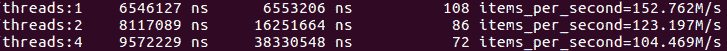

图 7.1 – 如果计数是共享的，则多个线程计数不会扩展

计数的扩展实际上是负的：在两个线程上达到相同的计数值所需的时间比在一个线程上更长，尽管我们尽最大努力使用具有最小内存顺序要求的无等待计数。当然，如果搜索时间相对于计数时间非常长，那么计数的性能就不重要了（但搜索代码本身可能会出现相同的选择，即在全局数据或每个线程副本上进行一些工作，因此请将其视为一个有益的例子）。

假设我们只关心计算结束时的计数值，一个更好的解决方案当然是在每个线程上维护本地计数，并且只增加共享计数一次：

```cpp
unsigned long count;
std::mutex M; // Guards count
  …
// On each thread
unsigned long local_count = 0;
for ( … counting loop … ) {
  … search … 
  if (… found …) ++local_count;
}
std::lock_guard<std::mutex> L(M);
count += local_count;
```

为了突出共享计数增量现在有多不重要，我们将使用基本的互斥锁；通常，锁是一个更安全的选择，因为它更容易理解（因此更难出错），尽管在计数的情况下，原子整数实际上会产生更简单的代码。

如果每个线程在到达结尾之前多次增加本地计数，然后必须增加共享计数，那么扩展几乎是完美的：

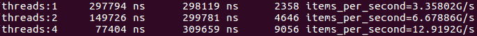

图 7.2 - 多线程计数与每个线程计数完美扩展

因此，最好的线程安全是由于您不从多个线程访问数据结构而得到的保证。通常，这种安排会带来一些开销：例如，每个线程都会维护一个容器或内存分配器，其大小会反复增长和缩小。如果直到程序结束才释放内存给主分配器，您可以完全避免任何锁定。代价是一个线程上未使用的内存不会提供给其他线程，因此总内存使用量将是所有线程的峰值使用量的总和，即使这些峰值使用发生在不同的时间。是否可以接受这一点取决于问题和实现的细节：这是您必须考虑的每个程序。

当涉及到线程安全时，您可以说整个本节都是一种逃避。从某种角度来看，确实如此，但在实践中经常发生的情况是，在不必要的情况下使用共享数据结构，而性能收益可能如此显著，以至于需要强调这一点。现在是时候转向*真正*的线程安全，其中数据结构必须在多个线程之间共享。

## 真正的线程安全

假设我们确实需要同时从多个线程访问特定数据结构。现在我们必须讨论线程安全。但仍然没有足够的信息来确定这个*线程安全*意味着什么。我们已经在上一章中讨论了强和弱线程安全保证。我们将在本章中看到，即使这种划分还不够，但它让我们走上了正确的道路：我们应该描述数据结构提供的一组保证，以便进行并发访问。

正如我们所见，弱（但通常易于提供）保证是多个线程可以读取相同的数据结构，只要它保持不变。最强的保证显然是任何操作都可以由任意数量的线程在任何时间完成，并且数据结构保持在良好定义的状态。这种保证通常既昂贵又不必要。您的程序可能需要从数据结构支持的某些操作中获得这样的保证，但不需要从所有操作中获得。可能还有其他简化，例如同时访问数据结构的线程数量可能是有限的。

通常情况下，您希望提供尽可能少的保证，以使程序正确，而不是更多：即使不使用，额外的线程安全功能通常也会非常昂贵并产生开销。

考虑到这一点，让我们开始探索具体的数据结构，看看提供不同级别的线程安全保证需要做些什么。

# 线程安全的堆栈

从并发性的角度来看，最简单的数据结构之一是**堆栈**。堆栈上的所有操作都涉及顶部元素，因此（至少在概念上）需要针对竞争进行保护的单个位置。

C++标准库为我们提供了`std::stack`容器，因此它是一个很好的起点。所有 C++容器，包括堆栈，都提供了弱线程安全保证：只读容器可以被多个线程安全地访问。换句话说，只要没有线程调用任何非`const`方法，任意数量的线程可以同时调用任何`const`方法。虽然这听起来很容易，几乎是简单的，但这里有一个微妙的地方：在对象的最后修改和被认为是只读的程序部分之间必须有某种同步事件和内存屏障。换句话说，写访问实际上并没有*完成*，直到所有线程执行内存屏障：写入者必须至少执行一个释放，而所有读取者必须获取。任何更强的屏障也可以工作，锁也可以，但每个线程都必须采取这一步。

## 接口设计的线程安全性

现在，如果至少有一个线程正在修改堆栈，我们需要更强的保证怎么办？提供一个最直接的方法是用互斥锁保护类的每个成员函数。这可以在应用程序级别完成，但这样的实现并不强制执行线程安全，因此容易出错。它也很难调试和分析，因为锁与容器没有关联。

更好的选择是用我们自己的类来*包装*堆栈类，就像这样：

```cpp
template <typename T> class mt_stack {
  std::stack<T> s_;
  std::mutex l_;
  public:
  mt_stack() = default;
  void push(const T& v) {
    std::lock_guard g(l_);
    s_.push(v);
  }
  …
};
```

请注意，我们可以使用继承而不是封装。这样做将使得编写`mt_stack`的构造函数更容易：我们只需要一个`using`语句。然而，使用公共继承会暴露基类`std::stack`的每个成员函数，因此如果我们忘记包装其中的一个，代码将编译但会直接调用未受保护的成员函数。私有（或受保护的）继承可以避免这个问题，但会带来其他危险。一些构造函数需要重新实现：例如，移动构造函数需要锁定正在移动的堆栈，因此它需要自定义实现。还有几个构造函数在没有包装的情况下暴露会很危险，因为它们读取或修改它们的参数。总的来说，如果我们想要提供每个构造函数，最好是安全的。这与 C++的一个非常普遍的规则一致；*优先使用组合而不是继承*。

我们的线程安全或多线程堆栈（这就是*mt*的含义）现在具有*push*功能，并且已经准备好接收数据。我们只需要接口的另一半，*pop*。我们当然可以按照前面的例子包装`pop()`方法，但这还不够：STL 堆栈使用三个单独的成员函数来从堆栈中移除元素。`pop()`移除顶部元素但不返回任何内容，所以如果你想知道堆栈顶部是什么，你必须先调用`top()`。如果堆栈为空，调用这两个方法是未定义行为，所以你必须先调用`empty()`并检查结果。好吧，我们可以包装所有三个方法，但这对我们来说毫无意义。在下面的代码中，假设堆栈的所有成员函数都受到锁的保护：

```cpp
mt_stack<int> s;
  … push some data on the stack … 
int x = 0;
if (!s.empty()) {
  x = s.top();
  s.pop();
}
```

每个成员函数在多线程环境中都是完全线程安全的，但在多线程环境中完全无用：堆栈可能在某一时刻非空 - 我们碰巧调用`s.empty()`的时候 - 但在下一时刻变为空，在我们调用`s.top()`之前，因为另一个线程可能在此期间移除了顶部元素。

这很可能是整本书中最重要的一课：*为了提供可用的线程安全功能，接口必须考虑线程安全*。更一般地说，不可能在现有设计的基础上*添加*线程安全。相反，设计必须考虑线程安全。原因是：您可能选择在设计中提供某些保证和不变量，这些保证和不变量在并发程序中是不可能维护的。例如，`std::stack`提供了这样的保证，如果您调用`empty()`并且它返回`false`，则只要在这两次调用之间不对栈进行其他操作，您就可以安全地调用`top()`。在多线程程序中，几乎没有实用的方法来维护这个保证。

幸运的是，由于我们无论如何都要编写自己的包装器类，我们并不受约束，必须逐字使用包装类的接口。那么，我们应该做什么呢？显然，整个*pop*操作应该是一个单一的成员函数：它应该从栈中移除顶部元素并将其返回给调用者。一个复杂之处在于当栈为空时该怎么办。在这里我们有多个选择。我们可以返回值和一个布尔标志的对，指示栈是否为空（在这种情况下，值必须是默认构造的）。我们可以仅返回布尔值，并通过引用传递值（如果栈为空，则值保持不变）。在 C++17 中，自然的解决方案是返回`std::optional`，如下面的代码所示。它非常适合保存可能不存在的值的工作：

```cpp
template <typename T> class mt_stack {
  std::stack<T> s_;
  std::mutex l_;
  public:
  std::optional<T> pop() {
    std::lock_guard g(l_);
    if (s_.empty()) {
      return std::optional<T>(std::nullopt);
    } else {
      std::optional<T> res(std::move(s_.top()));
      s_.pop();
      return res;
    }
  }
};
```

如您所见，从栈中弹出元素的整个操作现在受到锁的保护。这个接口的关键特性是它是事务性的：每个成员函数将对象从一个已知状态转换到另一个已知状态。

如果对象必须经过一些不够定义的中间状态的转换，比如在调用`empty()`之后但在调用`pop()`之前的状态，那么这些状态必须对调用者隐藏。调用者将被呈现一个单一的原子事务：要么返回顶部元素，要么通知调用者没有顶部元素。这确保了程序的正确性；现在，我们可以看看性能。

## 互斥保护数据结构的性能

我们的栈的性能如何？考虑到每个操作从头到尾都被锁定，我们不应该期望栈成员函数的调用会有任何扩展。最好的情况是，所有线程将按顺序执行它们的栈操作，但实际上，我们应该期望锁定会带来一些开销。如果我们将多线程栈的性能与单线程上的`std::stack`的性能进行比较，我们可以在基准测试中测量这种开销。

为了简化基准测试，您可以选择在`std::stack`周围实现一个单线程非阻塞的包装器，它呈现与我们的`mt_stack`相同的接口。请注意，您不能仅通过将元素推送到栈上来进行基准测试：您的基准测试可能会耗尽内存。同样，除非要测量从空栈中弹出的成本，否则您不能可靠地对弹出操作进行基准测试。如果基准测试运行时间足够长，您必须同时进行推送和弹出。最简单的基准测试可能如下所示：

```cpp
mt_stack<int> s;
void BM_stack(benchmark::State& state) {
  const size_t N = state.range(0);
  for (auto _ : state) {
    for (size_t i = 0; i < N; ++i) s.push(i);
    for (size_t i = 0; i < N; ++i) 
      benchmark::DoNotOptimize(s.pop());
  }
  state.SetItemsProcessed(state.iterations()*N);
}
```

在运行多线程时，有可能会发生一些`pop()`操作在栈为空时发生。这可能是您设计栈的应用程序的现实情况。此外，由于基准测试只能给出数据结构在实际应用中性能的近似值，这可能并不重要。要进行更准确的测量，您可能需要模拟应用程序产生的推送和弹出操作的实际序列。无论如何，结果应该看起来像这样：

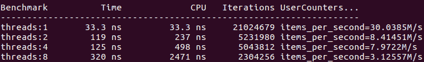

图 7.3 - 互斥保护的堆栈的性能

请注意，“项”在这里是推送后跟弹出，因此“每秒项数”的值显示了我们可以每秒通过堆栈发送多少数据元素。作为比较，同样的堆栈在单个线程上的性能比没有任何锁的情况下快了 10 多倍：

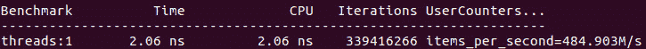

图 7.4 - std::stack 的性能（与图 7.3 进行比较）

正如我们所看到的，使用互斥锁实现的堆栈的性能相当差。然而，你不应该急于寻找或设计一些聪明的线程安全堆栈，至少现在还不是。你应该首先问的问题是，“这重要吗？”应用程序对堆栈上的数据做什么？比如说，每个数据元素是一个需要几秒钟的模拟参数，堆栈的速度可能并不重要。另一方面，如果堆栈是某个实时事务处理系统的核心，它的速度很可能是整个系统性能的关键。

顺便说一句，对于任何其他数据结构，如列表、双端队列、队列和树，其结果可能会类似，其中单个操作比互斥锁的操作快得多。但在我们尝试提高性能之前，我们必须考虑我们的应用程序需要什么样的性能。

## 不同用途的性能要求

在本章的其余部分，让我们假设数据结构的性能对你的应用程序很重要。现在，我们能看到最快的堆栈实现了吗？同样，还没有。我们还需要考虑使用模型；换句话说，我们对堆栈做什么，什么需要快。

例如，正如我们刚刚看到的，互斥保护的堆栈性能不佳的主要原因是其速度基本上受到互斥本身的限制。对堆栈操作进行基准测试几乎与对互斥锁进行基准测试相同。提高性能的一种方法是改进互斥锁的实现或使用另一种同步方案。另一种方法是更少地使用互斥锁；这种方式需要我们重新设计客户端代码。

例如，很多时候，调用者有多个项目必须推送到堆栈上。同样，调用者可能能够一次从堆栈中弹出多个元素并处理它们。在这种情况下，我们可以使用数组或另一个容器实现批量推送或批量弹出，一次复制多个元素到堆栈中或从堆栈中。由于锁的开销很大，我们可以期望使用一个锁/解锁操作将 1,024 个元素推送到堆栈上比分别在单独的锁下推送每个元素更快。事实上，基准测试显示情况是这样的：

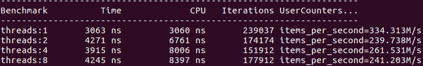

图 7.5 - 批处理堆栈操作的性能（每个锁 1,024 个元素）

我们应该非常清楚这种技术能做什么，以及不能做什么：如果关键部分比锁操作本身快得多，它可以减少锁的开销。它并不能使锁定的操作扩展。此外，通过延长关键部分，我们迫使线程在锁上等待更长时间。如果所有线程大部分时间都在尝试访问堆栈（这就是为什么基准测试变得更快的原因），这是可以接受的。但是，如果在我们的应用程序中，线程大部分时间都在做其他计算，只偶尔访问堆栈，那么更长的等待时间可能会降低整体性能。要明确回答批量推送和批量弹出是否有益，我们需要在更真实的环境中对它们进行分析。

还有其他情景，寻找更有限的、特定于应用程序的解决方案可以获得远高于任何改进的通用解决方案的性能增益。例如，在一些应用程序中，一个单独的线程预先将大量数据推送到堆栈上，然后多个线程从堆栈中移除数据并处理它，可能还会将更多数据推送到堆栈上。在这种情况下，我们可以实现一个未锁定的推送，仅在单线程上下文中使用。虽然责任在于调用者永远不要在多线程上下文中使用这种方法，但未锁定的堆栈比锁定的堆栈快得多，可能值得复杂化。

更复杂的数据结构提供了各种使用模型，但即使堆栈也可以用于更多的简单推送和弹出。我们还可以查看顶部元素而不删除它。`std::stack`提供了`top()`成员函数，但同样，它不是事务性的，所以我们必须创建自己的。它与事务性的`pop()`函数非常相似，只是不删除顶部元素：

```cpp
template <typename T> class mt_stack {
  std::stack<T> s_;
  mutable std::mutex l_;
  public:
  std::optional<T> top() const {
    std::lock_guard g(l_);
    if (s_.empty()) {
      return std::optional<T>(std::nullopt);
    } else {
      std::optional<T> res(s_.top());
      return res;
    }
  }
};
```

请注意，为了允许只查找的函数`top()`被声明为`const`，我们必须将互斥锁声明为`mutable`。这应该谨慎处理：多线程程序的约定是，遵循 STL，只要不调用非`const`成员函数，所有`const`成员函数都可以安全地在多个线程上调用。这通常意味着`const`方法不修改对象，它们确实是只读的。可变数据成员违反了这一假设。至少在修改它们时应该避免任何竞争条件。互斥锁满足这两个要求。

现在我们可以考虑不同的使用模式。在一些应用程序中，数据被推送到堆栈上并从中弹出。在其他情况下，顶部堆栈元素可能需要在每次推送和弹出之间被多次检查。让我们首先关注后一种情况。再次检查`top()`方法的代码。这里显然存在一个低效：由于锁的存在，只有一个线程可以在任何时刻读取堆栈的顶部元素。但是读取顶部元素是一个非修改（只读）操作。如果所有线程都这样做，而且没有线程同时尝试修改堆栈，我们根本不需要锁，`top()`操作将会完美扩展。相反，它的性能与`pop()`方法相似。

我们不能在`top()`中省略锁的原因是我们无法确定另一个线程是否同时调用`push()`或`pop()`。但即使如此，我们也不需要锁定两次对`top()`的调用；它们可以同时进行。只有修改堆栈的操作需要被锁定。有一种锁提供了这样的功能；它通常被称为`top()`方法使用共享锁，因此任意数量的线程可以同时执行它，但`push()`和`pop()`方法需要唯一锁：

```cpp
template <typename T> class rw_stack {
  std::stack<T> s_;
  mutable std::shared_mutex l_;
  public:
  void push(const T& v) {
    std::unique_lock g(l_);
    s_.push(v);
  }
  std::optional<T> pop() {
    std::unique_lock g(l_);
    if (s_.empty()) {
      return std::optional<T>(std::nullopt);
    } else {
      std::optional<T> res(std::move(s_.top()));
      s_.pop();
      return res;
    }
  }
  std::optional<T> top() const {
    std::shared_lock g(l_);
    if (s_.empty()) {
      return std::optional<T>(std::nullopt);
    } else {
      std::optional<T> res(s_.top());
      return res;
    }
  }
};
```

不幸的是，我们的基准测试显示，即使使用读写锁，`top()`的调用性能也无法扩展：

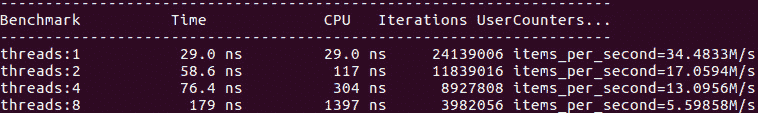

图 7.6 – 使用 std::shared_mutex 的堆栈性能；只读操作

甚至更糟的是，需要唯一锁的操作的性能与常规互斥锁相比会进一步下降：

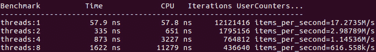

图 7.7 – 使用 std::shared_mutex 的堆栈性能；写操作

通过将*图 7.6*和*7.7*与*图 7.4*中的早期测量进行比较，我们可以看到读写锁根本没有给我们带来任何改进。这个结论远非普遍适用：不同互斥锁的性能取决于实现和硬件。然而，一般来说，更复杂的锁，如共享互斥锁，会比简单的锁有更多的开销。它们的目标应用是不同的：如果临界区本身花费了更长的时间（比如毫秒而不是微秒），并且大多数线程执行只读代码，那么不锁定只读线程之间的互斥将具有很大的价值，几微秒的开销将不太明显。

更长的临界区观察非常重要：如果我们的栈元素更大，并且复制起来非常昂贵，那么锁的性能就不那么重要了，与复制大对象的成本相比，我们会开始看到扩展。然而，假设我们的总体目标是使程序快速，而不是展示可扩展的栈实现，我们将通过完全消除昂贵的复制并使用指针栈来优化整个应用程序。

尽管我们在读写锁方面遭受了挫折，但我们对更高效的实现思路是正确的。但在我们设计之前，我们必须更详细地了解栈操作的确切内容以及在每一步可能发生的数据竞争。

## 栈性能详解

当我们试图改进线程安全栈（或任何其他数据结构）的性能超出简单的锁保护实现时，我们首先必须详细了解每个操作涉及的步骤以及它们如何与在不同线程上执行的其他操作交互。这一部分的主要价值不在于更快的栈，而在于这种分析：事实证明，这些低级步骤对许多数据结构都是共同的。让我们从推送操作开始。大多数栈实现都是建立在某种类似数组的容器之上，因此让我们将栈顶视为连续的内存块：


图 7.8 - 推送操作的栈顶

栈上有`N`个元素，因此元素计数也是下一个元素将放置的第一个空槽的索引。推送操作必须将顶部索引（也是元素计数）从`N`增加到`N+1`来保留其槽，然后在槽`N`中构造新元素。请注意，这个顶部索引是数据结构的唯一部分，其中进行推送的线程可以相互交互：只要索引增量操作是线程安全的，只有一个线程可以看到索引的每个值。执行推送的第一个线程将顶部索引提升到`N+1`并保留第`N`个槽，下一个线程将索引增加到`N+2`并保留第`N+1`个槽，依此类推。关键点在于这里对槽本身没有竞争：只有一个线程可以获得特定的槽，因此它可以在那里构造对象，而不会有其他线程干扰。

这表明推送操作的非常简单的同步方案：我们只需要一个用于顶部索引的原子值：

```cpp
std::atomic<size_t> top_;
```

推送操作会原子地增加这个索引，然后在由索引的旧值索引的数组槽中构造新元素：

```cpp
const size_t top = top_.fetch_add(1);
new (&data[top]) Element(… constructor arguments … );
```

再次强调，没有必要保护构建步骤免受其他线程的影响。原子索引是我们使推送操作线程安全所需要的一切。顺便说一句，如果我们使用数组作为堆栈内存，这也是正确的。如果我们使用`std::deque`这样的容器，我们不能简单地在其内存上构建一个新元素：我们必须调用`push_back`来更新容器的大小，即使 deque 不需要分配更多的内存，这个调用也不是线程安全的。因此，超出基本锁的数据结构实现通常也必须管理自己的内存。说到内存，到目前为止，我们假设数组有空间添加更多的元素，并且我们不会用尽内存。让我们暂时坚持这个假设。

到目前为止，我们已经找到了一种非常高效的方法来在特定情况下实现线程安全的推送操作：多个线程可以将数据推送到堆栈，但在所有推送操作完成之前没有人读取它。

如果我们有一个已经推送元素的堆栈，并且需要弹出它们（并且不再添加新元素），相同的想法也适用。*图 7.8*也适用于这种情况：一个线程原子递减顶部计数，然后将顶部元素返回给调用者。

```cpp
const size_t top = top_.fetch_sub(1);
return std::move(data[top]);
```

原子递减保证只有一个线程可以访问每个数组槽作为顶部元素。当然，这仅在堆栈不为空时才有效。我们可以将顶部元素索引从无符号整数更改为有符号整数；然后，当索引变为负数时，我们就知道堆栈为空了。

这是再次在非常特殊的条件下实现线程安全的弹出操作的非常高效的方法：堆栈已经被填充，并且没有添加新元素。在这种情况下，我们也知道堆栈上有多少元素，因此很容易避免尝试弹出空堆栈。

在某些特定的应用中，这可能具有一定的价值：如果堆栈首先由多个线程填充而没有弹出，并且程序中有一个明确定义的切换点，从添加数据到删除数据，那么我们对问题的每一半都有一个很好的解决方案。但让我们继续讨论更一般的情况。

我们非常高效的推送操作，不幸的是，在从堆栈中读取时没有帮助。让我们再次考虑如何实现弹出顶部元素的操作。我们有顶部索引，但它告诉我们的只是当前正在构建的元素数量；它并没有告诉我们最后一个构建完成的元素的位置（*图 7.9*中的第`N-3`个元素）：

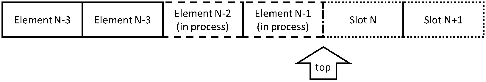

图 7.9 - 推送和弹出操作的堆栈顶部

当然，进行推送和因此构建的线程知道何时完成。也许我们需要另一个计数，显示有多少元素完全构建了。遗憾的是，如果只是那么简单就好了。在*图 7.9*中，假设线程 A 正在构建元素`N-2`，线程 B 正在构建元素`N-1`。显然，线程 A 首先增加了顶部索引。但这并不意味着它也会首先完成推送。线程 B 可能会先完成构建。现在，堆栈上最后构建的元素的索引是`N-1`，所以我们可以将*构建计数*提高到`N-1`（注意我们*跳过*了仍在构建中的元素`N-2`）。现在我们想弹出顶部元素；没问题，元素`N-1`已经准备好了，我们可以将其返回给调用者并从堆栈中删除它；*构建计数*现在减少到`N-2`。接下来应该弹出哪个元素？元素`N-2`仍然没有准备好，但我们的堆栈中没有任何内容告诉我们。我们只有一个用于*完成*元素的计数，它的值是`N-1`。现在我们在构建新元素的线程和尝试弹出它的线程之间存在数据竞争。

即使没有这场竞赛，还有另一个问题：我们刚刚弹出了元素`N-1`，这在当时是正确的。但与此同时，线程 C 请求了一个推送。应该使用哪个槽？如果我们使用槽`N-1`，我们就有可能覆盖线程 A 当前正在访问的相同元素。如果我们使用槽`N`，那么一旦所有操作完成，数组中就会有一个*空洞*：顶部元素是`N`，但下一个元素不是`N-1`：它已经被弹出，我们必须跳过它。这个数据结构中没有任何内容告诉我们我们必须这样做。

我们可以跟踪哪些元素是*真实*的，哪些是*空洞*的，但这变得越来越复杂（以线程安全的方式进行将需要额外的同步，这将降低性能）。此外，留下许多未使用的数组槽会浪费内存。我们可以尝试重用*空洞*来存放推送到堆栈上的新元素，但在这一点上，元素不再按顺序存储，原子顶部计数不再起作用，整个结构开始变得像一个列表。顺便说一句，如果你认为列表是实现线程安全堆栈的好方法，等到你看到本章后面实现线程安全列表需要付出的努力时再说吧。

在我们的设计中，我们必须暂停对实现细节的深入探讨，并再次审视问题的更一般方法。我们必须做两步：从我们对堆栈实现细节的更深入理解中得出结论，并进行一些性能估算，以对可能产生性能改进的解决方案有一个大致的了解。我们将从后者开始。

## 同步方案的性能估算

我们第一次尝试了一个非常简单的堆栈实现，没有锁定，为特殊情况提供了一些有趣的解决方案，但没有一般解决方案。在我们花费更多时间构建复杂设计之前，我们应该尝试估计它比简单基于锁的解决方案更有效的可能性有多大。

当然，这可能看起来像循环推理：为了估计性能，我们必须首先有一些东西来估计。但我们不希望在至少有一些保证努力会有所回报的情况下进行复杂的设计，这些保证需要性能估计。

幸运的是，我们可以回到我们之前学到的一般观察：并发数据结构的性能在很大程度上取决于有多少共享变量同时访问。让我们假设我们可以想出一个巧妙的方法来使用单个原子计数器实现堆栈。假设每次推送和弹出都至少要对这个计数器进行一次原子递增或递减（除非我们正在进行批量操作，但我们已经知道它们更快）。如果我们进行一个基准测试，将单线程堆栈上的推送和弹出与共享原子计数器上的原子操作相结合，我们可以得到一个合理的性能估计。由于没有同步进行，因此我们必须为每个线程使用一个单独的堆栈，以避免竞争条件：

```cpp
std::atomic<size_t> n;
void BM_stack0_inc(benchmark::State& state) {
  st_stack<int> s0;
  const size_t N = state.range(0);
  for (auto _ : state) {
    for (size_t i = 0; i < N; ++i) {
      n.fetch_add(1, std::memory_order_release);
      s0.push(i);
    }
    for (size_t i = 0; i < N; ++i) {
      n.fetch_sub(1, std::memory_order_acquire);
      benchmark::DoNotOptimize(s0.pop());
    }
  }
  state.SetItemsProcessed(state.iterations()*N);
}
```

在这里，`st_stack`是一个堆栈包装器，它提供与我们基于锁的`mt_stack`相同的接口，但没有任何锁。实际实现会稍慢一些，因为堆栈顶部也在线程之间共享，但这将给我们一个从上面估计出来的结果：实际上是线程安全的任何实现都不太可能胜过这个人工基准测试。我们将结果与什么进行比较？*图 7.3*中基于锁的堆栈的基准测试显示，在一个线程上每秒 30M 次推送/弹出操作，8 个线程上为 3.1M 次。我们还知道没有任何锁的堆栈的基准性能约为每秒 485M 次操作（*图 7.4*）。在同一台机器上，我们使用单个原子计数器进行的性能估计得出这些结果：

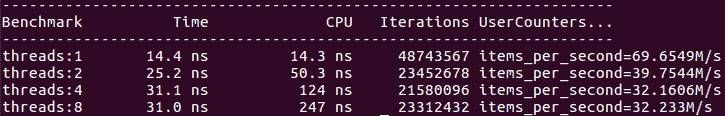

图 7.10 - 具有单个原子计数器的假设堆栈的性能估计

结果看起来有点复杂：即使在最佳条件下，我们的堆栈也无法扩展。这主要是因为我们正在测试一个小元素的堆栈；如果元素很大且复制成本很高，我们会看到扩展，因为多个线程可以同时复制数据。但前面的观察仍然成立：如果复制数据变得如此昂贵，以至于我们需要许多线程来执行它，我们最好使用指针堆栈，根本不复制任何数据。

另一方面，原子计数器比基于互斥体的堆栈快得多。当然，这只是一个从上面估计出来的结果，但它表明无锁堆栈有一些可能性。然而，基于锁的堆栈也有：当我们需要锁定非常短的临界区时，有比`std::mutex`更有效的锁。在*第六章*中我们已经看到了这样一种锁，*并发和性能*，当我们实现了自旋锁。如果我们在基于锁的堆栈中使用这个自旋锁，那么，我们得到的结果不是*图 7.2*，而是这些结果：

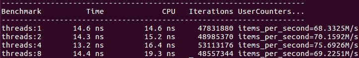

图 7.11 - 基于自旋锁的堆栈的性能

将这个结果与*图 7.10*进行比较，得出一个非常沮丧的结论：我们不可能设计出一个无锁设计，它能胜过一个简单的自旋锁。自旋锁之所以能在某些情况下胜过原子递增，是因为在这个特定硬件上不同原子指令的相对性能；我们不应该对此过分解读。

我们可以尝试使用原子交换或比较和交换来进行相同的估计，而不是原子增量。当您了解更多关于设计线程安全数据结构的知识时，您将对哪种同步协议可能有用以及哪些操作应该包括在估计中有所了解。此外，如果您使用特定的硬件，您应该运行简单的基准测试来确定哪些操作在其上更有效。到目前为止，所有结果都是在基于 X86 的硬件上获得的。如果我们在专门设计用于 HPC 应用的大型 ARM 服务器上运行相同的估计，我们将得到一个非常不同的结果。基于锁的栈的基准测试产生了这些结果：

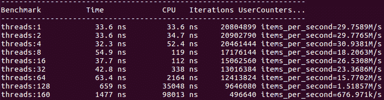

图 7.12 - 在 ARM HPC 系统上基于锁的栈的性能

ARM 系统通常比 X86 系统具有更多的核心，而单个核心的性能较低。这个特定系统有两个物理处理器上的 160 个核心，当程序在两个 CPU 上运行时，锁的性能显著下降。对无锁栈性能的上限估计应该使用比原子增量更有效的比较和交换指令（后者在这些处理器上特别低效）。

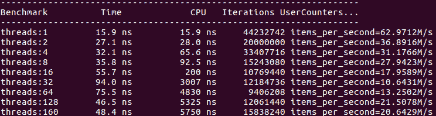

图 7.13 - 具有单个 CAS 操作的假设栈的性能估计（ARM 处理器）

基于*图 7.13*中的估计，对于大量的线程，我们有可能会得到比基于简单锁的栈更好的东西。我们将继续努力开发无锁栈。有两个原因：首先，这一努力最终将在某些硬件上得到回报。其次，这种设计的基本元素将在以后的许多其他数据结构中看到，而栈为我们提供了一个简单的测试案例来学习它们。

## 无锁栈

既然我们决定尝试超越简单的基于锁的实现，我们需要考虑我们从对推入和弹出操作的探索中学到的教训。每个操作本身非常简单，但两者的交互才会产生复杂性。这是一个非常常见的情况：在多个线程上正确同步生产者和消费者操作要比仅处理生产者或仅处理消费者要困难得多。在设计自己的数据结构时请记住这一点：如果您的应用程序允许对您需要支持的操作进行任何形式的限制，比如生产者和消费者在时间上是分开的，或者只有一个生产者（或消费者）线程，那么您几乎可以肯定地为这些有限操作设计一个更快的数据结构。

假设我们需要一个完全通用的堆栈，生产者-消费者交互的问题的本质可以通过一个非常简单的例子来理解。同样，我们假设堆栈是在数组或类似数组的容器之上实现的，并且元素是连续存储的。假设我们当前有`N`个元素在堆栈上。生产者线程 P 正在执行推送操作，消费者线程 C 同时正在执行弹出操作。结果应该是什么？虽然诱人的是尝试设计一个无等待的设计（就像我们为仅消费者或仅生产者所做的那样），但是任何允许两个线程在不等待的情况下继续进行的设计都将破坏我们关于元素存储方式的基本假设：线程 C 必须等待线程 P 完成推送或返回当前顶部元素`N`。同样，线程 P 必须等待线程 C 完成或在槽`N+1`中构造一个新元素。如果两个线程都不等待，结果就是数组中的一个*空洞*：最后一个元素的索引为`N+1`，但在槽`N`中没有存储任何东西，因此我们在从堆栈中弹出数据时必须以某种方式跳过它。

看起来我们必须放弃无等待堆栈实现的想法，并让其中一个线程等待另一个线程完成其操作。当顶部索引为零且消费者线程尝试进一步减少它时，我们还必须处理空堆栈的可能性。当顶部索引指向最后一个元素且生产者线程需要另一个槽时，也会出现类似的问题。

这两个问题都需要有界的原子递增操作：执行递增（或递减），除非值等于指定的边界。在 C++中没有现成的原子操作（或者在当今任何主流硬件上都没有），但我们可以使用**比较和交换**（**CAS**）来实现它，如下所示：

```cpp
std::atomic<int> n_ = 0;
int bounded_fetch_add(int dn, int maxn) {
  int n = n_.load(std::memory_order_relaxed);
  do {
    if (n + dn >= maxn || n + dn < 0) return -1;
  } while (!n_.compare_exchange_weak(n, n + dn,
           std::memory_order_release,
           std::memory_order_relaxed));
  return n;
}
```

这是 CAS 操作用于实现复杂的无锁原子操作的典型示例：

1.  读取变量的当前值。

1.  检查必要的条件。在我们的情况下，我们验证递增不会给我们带来指定边界`0，maxn)`之外的值。如果有界递增失败，我们通过返回`-1`向调用者发出信号（这是一个任意选择；通常，对于超出边界的情况，有特定的操作要执行）。

1.  如果当前值仍然等于我们之前读取的值，则用所需的结果原子替换该值。

1.  如果*步骤 3*失败，当前值已被更新，再次检查它，并重复*步骤 3*和*4*，直到成功。

尽管这可能看起来像是一种锁，但有一个根本的区别：CAS 比较在一个线程上失败的唯一方式是如果它在另一个线程上成功（并且原子变量被递增），所以每当共享资源存在争用时，至少一个线程保证能够取得进展。

还有一个重要的观察结果，通常是实现可扩展性和非常低效实现之间的关键区别。如所写的 CAS 循环对大多数现代操作系统的调度算法非常不友好：循环失败的线程还会消耗更多的 CPU 时间，并且会被赋予更高的优先级。这与我们想要的正好相反：我们希望当前正在执行有用工作的线程运行得更快。解决方案是在几次不成功的 CAS 尝试后让线程让出调度器。这可以通过一个依赖于操作系统的系统调用来实现，但 C++通过调用`std::this_thread::yield()`具有一个与系统无关的 API。在 Linux 上，通常可以通过调用`nanosleep()`函数来睡眠最短可能的时间（1 纳秒）来获得更好的性能，每次循环迭代都这样做：

```cpp
  int i = 0;
  while ( … ) {
    if (++i == 8) {
      static constexpr timespec ns = { 0, 1 };
      i = 0;
      nanosleep(&ns, NULL);
    }
  }
```

相同的方法可以用来实现更复杂的原子事务，比如栈的推送和弹出操作。但首先，我们必须弄清楚需要哪些原子变量。对于生产者线程，我们需要数组中第一个空闲插槽的索引。对于消费者线程，我们需要最后一个完全构造的元素的索引。这是我们关于栈当前状态的所有信息，假设我们不允许数组中的“空洞”：

![图 7.14 – 无锁栈：`c_`是最后一个完全构造的元素的索引，`p_`是数组中第一个空闲插槽的索引


图 7.14 – 无锁栈：`c_`是最后一个完全构造的元素的索引，`p_`是数组中第一个空闲插槽的索引

首先，如果两个索引当前不相等，那么推送和弹出都无法进行：不同的计数意味着要么正在构造新元素，要么正在复制当前顶部元素。在这种状态下对栈进行修改可能导致数组中的*空洞*的创建。

如果两个索引相等，那么我们可以继续。要进行推送，我们需要原子地增加生产者索引`p_`（受数组当前容量的限制）。然后我们可以在刚刚保留的插槽中构造新元素（由旧值`p_`索引）。然后我们增加消费者索引`c_`，表示新元素已经可供消费者线程使用。请注意，另一个生产者线程甚至可以在构造完成之前抢占下一个插槽，但在允许任何消费者线程弹出元素之前，我们必须等待所有新元素都被构造。这样的实现是可能的，但它更加复杂，而且倾向于当前执行的操作：如果推送当前正在进行，弹出必须等待，但另一个推送可以立即进行。结果很可能是一堆推送操作在执行，而所有消费者线程都在等待（如果弹出操作正在进行，效果类似；它会倾向于另一个弹出）。

弹出的实现方式类似，只是我们首先将消费者索引`c_`减少到保留顶部插槽，然后在从栈中复制或移动对象之后再减少`p_`。

我们还需要学习一个技巧，那就是如何原子地操作这两个计数。例如，我们之前说过，线程必须等待两个索引变得相等。这怎么实现呢？如果我们原子地读取一个索引，然后再原子地读取另一个索引，那么第一个索引自从我们读取它以来可能已经发生了变化。我们必须在一个原子操作中读取两个索引。对于索引的其他操作也是如此。C++允许我们声明一个包含两个整数的原子结构；但是，我们必须小心：很少有硬件平台有一个*双 CAS*指令，可以原子地操作两个长整数，即使有，它通常也非常慢。更好的解决方案是将两个值打包到一个 64 位字中（在 64 位处理器上）。硬件原子指令（如加载或比较和交换）实际上并不关心你将如何解释它们读取或写入的数据：它们只是复制和比较 64 位字。你以后可以将这些位视为长整数、双精度浮点数或一对整数（原子增量当然是不同的，这就是为什么你不能在双精度值上使用它）。

现在，我们只需要将前面的算法转换成代码：

```cpp
template <typename T> class mt_stack {
  std::deque<T> s_;
  int cap_ = 0;
  struct counts_t {
    int p_ = 0; // Producer index
    int c_ = 0; // Consumer index
    bool equal(std::atomic<counts_t>& n) {
      if (p_ == c_) return true;
      *this = n.load(std::memory_order_relaxed);
      return false;
    }
  };
  mutable std::atomic<counts_t> n_;
  public:
  mt_stack(size_t n = 100000000) : s_(n), cap_(n) {}
  void push(const T& v);
  std::optional<T> pop();
};
```

这两个索引是打包成 64 位原子值的 32 位整数。`equal()`方法可能看起来很奇怪，但它的目的很快就会变得明显。如果两个索引相等，则返回 true；否则，它会从指定的原子变量中更新存储的索引值。这遵循了我们之前看到的 CAS 模式：如果条件不满足，再次读取原子变量。

请注意，我们不能再在 STL 堆栈的基础上构建我们的线程安全堆栈：容器本身在线程之间是共享的，即使容器不再增长，对其进行`push()`和`pop()`操作也不是线程安全的。为简单起见，在我们的示例中，我们使用了一个 deque，它初始化了足够大数量的默认构造元素。只要我们不调用任何容器成员函数，我们就可以独立地在不同的线程中操作容器的不同元素。请记住，这只是一个快捷方式，可以避免同时处理内存管理和线程安全：在任何实际实现中，您不希望预先默认构造所有元素（而且元素类型甚至可能没有默认构造函数）。通常，高性能的并发软件系统都有自己的自定义内存分配器。否则，您也可以使用一个与堆栈元素类型大小和对齐方式相同的虚拟类型的 STL 容器，但具有简单的构造函数和析构函数（实现足够简单，留给读者作为练习）。

推送操作实现了我们之前讨论的算法：等待索引变得相等，推进生产者索引`p_`，构造新对象，完成后推进消费者索引`c_`：

```cpp
void push(const T& v) {
  counts_t n = n_.load(std::memory_order_relaxed);
  if (n.p_ == cap_) abort();
  while (!n.equal(n_) || 
    !n_.compare_exchange_weak(n, {n.p_ + 1, n.c_},
      std::memory_order_acquire,
      std::memory_order_relaxed)) {
    if (n.p_ == cap_) { … allocate more memory … }
  };
  ++n.p_;
  new (&s_[n.p_]) T(v);
  assert(n_.compare_exchange_strong(n, {n.p_, n.c_ + 1},
    std::memory_order_release, std::memory_order_relaxed);
}
```

除非我们的代码中有错误，否则最后的 CAS 操作不应该失败：一旦调用线程成功推进了`p_`，没有其他线程可以改变任何一个值，直到相同的线程推进了`c_`以匹配（正如我们已经讨论过的，这里存在一个低效性，但修复它会带来更高的复杂性成本）。另外，请注意，为了简洁起见，我们省略了循环内的`nanosleep()`或`yield()`调用，但在任何实际实现中都是必不可少的。

弹出操作类似，只是首先减少消费者索引`c_`，然后在从堆栈中移除顶部元素时，减少`p_`以匹配`c_`：

```cpp
std::optional<T> pop() {
  counts_t n = n_.load(std::memory_order_relaxed);
  if (n.c_ == 0) return std::optional<T>(std::nullopt);
  while (!n.equal(n_) || 
    !n_.compare_exchange_weak(n, {n.p_, n.c_ - 1},
      std::memory_order_acquire,
      std::memory_order_relaxed)) {
    if (n.c_ == 0) return std::optional<T>(std::nullopt);
  };
  --n.cc_;
  std::optional<T> res(std::move(s_[n.p_]));
  s_[n.pc_].~T();
  assert(n_.compare_exchange_strong(n, {n.p_ - 1, n.c_},
    std::memory_order_release, std::memory_order_relaxed)); 
  return res;
}
```

同样，如果程序正确，最后的比较和交换操作不应该失败。

无锁堆栈是可能的最简单的无锁数据结构之一，而且它已经相当复杂。验证我们的实现是否正确所需的测试并不简单：除了所有单线程单元测试之外，我们还必须验证是否存在竞争条件。这项任务得到了最近 GCC 和 CLANG 编译器中可用的**线程检测器**（**TSAN**）等消毒工具的大大简化。这些消毒工具的优势在于它们可以检测潜在的数据竞争，而不仅仅是在测试期间实际发生的数据竞争（在小型测试中，观察到两个线程同时不正确地访问相同内存的机会相当渺茫）。

经过我们所有的努力，无锁堆栈的性能如何？如预期的那样，在 X86 处理器上，它并没有超越基于自旋锁的版本：

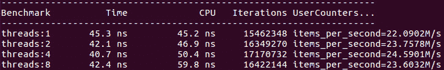

图 7.15 - X86 CPU 上无锁堆栈的性能（与图 7.11 进行比较）

作为比较，受自旋锁保护的堆栈可以在同一台机器上每秒执行约 70M 次操作。这与我们在上一节性能估计后的预期一致。然而，相同的估计表明，无锁堆栈在 ARM 处理器上可能更优秀。基准测试证实了我们的努力没有白费：

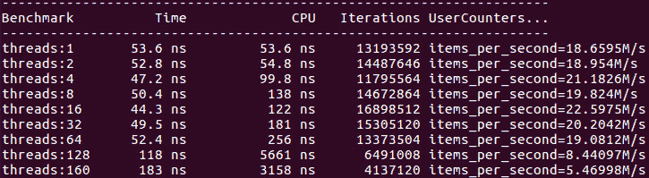

图 7.16 - ARM CPU 上无锁堆栈的性能（与图 7.12 进行比较）

虽然基于锁的栈的单线程性能优越，但是如果线程数量很大，无锁栈的速度要快得多。如果基准测试包括大量的`top()`调用（即许多线程在一个线程弹出之前读取顶部元素）或者生产者和消费者线程是不同的（一些线程只调用`push()`，而其他线程只调用`pop()`），无锁栈的优势甚至更大。

总结这一部分，我们已经探讨了线程安全栈数据结构的不同实现。为了理解线程安全所需的内容，我们必须分析每个操作，以及多个并发操作的交互。以下是我们学到的教训：

+   使用良好的锁实现，锁保护的栈提供了合理的性能，并且比其他选择更简单。

+   关于数据结构使用限制的任何特定应用知识都应该被利用来廉价地获得性能。这不是开发通用解决方案的地方，恰恰相反：尽量实现尽可能少的功能，并尝试从限制中获得性能优势。

+   一个通用的无锁实现是可能的，但即使对于像栈这样简单的数据结构，它也是相当复杂的。有时，这种复杂性甚至是合理的。

到目前为止，我们已经回避了内存管理的问题：当栈的容量用完时，它被隐藏在模糊的*分配更多内存*之后。我们需要稍后回到这个问题。但首先，让我们探索更多不同的数据结构。

# 线程安全队列

接下来我们要考虑的数据结构是队列。它是一个非常简单的数据结构，概念上是一个可以从两端访问的数组：数据被添加到数组的末尾，并从开头移除。在实现方面，队列和栈之间有一些非常重要的区别。也有许多相似之处，我们将经常参考前一节。

就像栈一样，STL 有一个队列容器`std::queue`，在并发性方面存在相同的问题：删除元素的接口不是事务性的，它需要三个单独的成员函数调用。如果我们想要使用带锁的`std::queue`创建线程安全队列，我们将不得不像处理栈一样对其进行包装：

```cpp
template <typename T> class mt_queue {
  std::queue<T> s_;
  mutable spinlock l_;
  public:
  void push(const T& v) {
    std::lock_guard g(l_);
    s_.push(v);
  }
  std::optional<T> pop() {
    std::lock_guard g(l_);
    if (s_.empty()) {
      return std::optional<T>(std::nullopt);
    } else {
      std::optional<T> res(std::move(s_.front()));
      s_.pop();
      return res;
    }
  }
};
```

我们决定立即使用自旋锁（一个简单的基准测试可以证实它再次比互斥锁更快）。如果需要，`front()`方法可以类似于`pop()`方法实现，只是不移除前面的元素。基本基准测试再次测量将元素推送到队列并将其弹出所需的时间。使用与上一节相同的 X86 机器，我们可以得到以下数字：

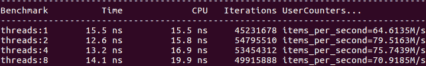

图 7.17 - 自旋锁保护的 std::queue 的性能

作为比较，在相同的硬件上，没有任何锁的`std::queue`每秒可以传递大约 280M 个项目（*项目*是推送和弹出，因此我们测量每秒可以通过队列发送多少元素）。到目前为止，这个情况与我们之前在栈中看到的非常相似。为了比锁保护的版本更好，我们必须尝试提出一个无锁实现。

## 无锁队列

在我们深入设计无锁队列之前，重要的是对每个事务进行详细分析，就像我们为栈所做的那样。同样，我们将假设队列是建立在数组或类似数组的容器之上的（并且我们将推迟关于数组满时会发生什么的问题）。将元素推送到队列看起来就像为栈做的那样：

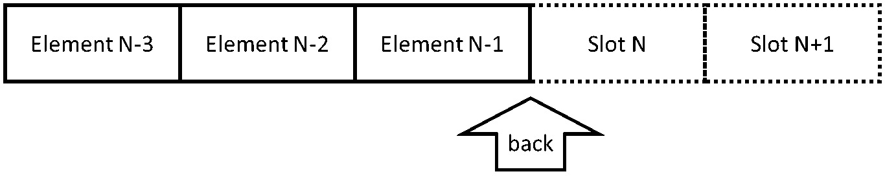

图 7.18 – 向队列后端添加元素（生产者视图）

我们所需要的只是数组中第一个空槽的索引。然而，从队列中移除元素与从栈中进行相同操作是完全不同的。您可以在*图 7.19*中看到这一点（与*图 7.9*进行比较）：

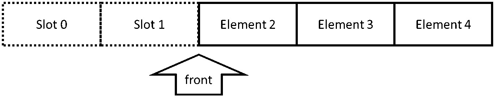

图 7.19 – 从队列前端移除元素（消费者视图）

元素从队列的前端移除，因此我们需要第一个尚未被移除的元素的索引（队列的当前前端），并且该索引也会被增加。

现在我们来到队列和栈之间的关键区别：在栈中，生产者和消费者都在同一位置操作：栈的顶部。我们已经看到了这样做的后果：一旦生产者开始在栈顶构造新元素，消费者就必须等待它完成。弹出操作不能返回最后构造的元素而不在数组中留下*空洞*，也不能在构造完成之前返回正在构造的元素。

对于队列，情况则大不相同。只要队列不为空，生产者和消费者根本不会相互交互。推送操作不需要知道前端索引在哪里，弹出操作也不关心后端索引在哪里，只要它在前端之前的某个位置。生产者和消费者不会竞争访问同一内存位置。

每当我们有多种不同的方式来访问数据结构，并且它们（大多数情况下）不相互交互时，一般建议首先考虑这些角色分配给不同线程的情况。进一步简化可以从每种类型的一个线程开始；在我们的情况下，这意味着一个生产者线程和一个消费者线程。

由于只有生产者需要访问后端索引，并且只有一个生产者线程，因此我们甚至不需要原子整数来表示此索引。同样，前端索引只是一个常规整数。这两个线程相互交互的唯一时间是队列变为空时。为此，我们需要一个原子变量：队列的大小。生产者在第一个空槽中构造新元素并增加后端索引（以任何顺序，只有一个生产者线程）。然后，它增加队列的大小，以反映队列现在有一个更多的元素可以从中取出。

消费者必须以相反的顺序操作：首先，检查大小以确保队列不为空。然后消费者可以从队列中取出第一个元素并增加前端索引。当然，在检查大小和访问前端元素之间大小可能会发生变化，但这不会造成任何问题：只有一个消费者线程，生产者线程只能增加大小。

在探索栈时，我们推迟了向数组添加更多内存的问题，并假设我们以某种方式知道栈的最大容量，并且不会超过它（如果超过了，我们也可以使推送操作失败）。对于队列，同样的假设是不够的：因为元素被添加和移除，前端和后端索引都会前进，并最终到达数组的末尾。当然，在这一点上，数组的第一个元素是未使用的，因此最简单的解决方案是将数组视为循环缓冲区，并对数组索引使用模运算：

```cpp
template <typename T> class pc_queue {
  public:
  explicit pc_queue(size_t capacity) : 
    capacity_(capacity),
    data_(static_cast<T*>(::malloc(sizeof(T)*capacity_))) {}
  ~pc_queue() { ::free(data_); }
  bool push(const T& v) {
    if (size_.load(std::memory_order_relaxed) >= capacity_)
      return false;
    new (data_ + (back_ % capacity_)) T(v);
    ++back_;
    size_.fetch_add(1, std::memory_order_release);
    return true;
  }
  std::optional<T> pop() {
    if (size_.load(std::memory_order_acquire) == 0) {
      return std::optional<T>(std::nullopt);
    } else {
      std::optional<T> res(
        std::move(data_[front_ % capacity_]));
      data_[front_ % capacity_].~T();
      ++front_;
      size_.fetch_sub(1, std::memory_order_relaxed);
      return res;
    }
  }
  private:
  const size_t capacity_;
  T* const data_;
  size_t front_ = 0;
  size_t back_ = 0;
  std::atomic<size_t> size_;
};
```

由于我们在设计上接受了的约束条件，这个队列需要一个特殊的基准：一个生产者线程和一个消费者线程：

```cpp
pc_queue<size_t> q(1UL<<20);
void BM_queue_prod_cons(benchmark::State& state) {
  const bool producer = state.thread_index & 1;
  const size_t N = state.range(0);
  for (auto _ : state) {
    if (producer) {
      for (size_t i = 0; i < N; ++i) q.push(i);
    } else {
      for (size_t i = 0; i < N; ++i) 
        benchmark::DoNotOptimize(q.pop());
    }
  }
  state.SetItemsProcessed(state.iterations()*N);
}
BENCHMARK(BM_queue_prod_cons)->Arg(1)->Threads(2)
  ->UseRealTime();
BENCHMARK_MAIN();
```

为了比较，我们应该在相同条件下对我们的锁保护队列进行基准测试（锁的性能通常对线程之间的竞争情况非常敏感）。在相同的 X86 机器上，两个队列的吞吐量大约为每秒 100M 个整数元素。在 ARM 处理器上，锁的成本通常更高，我们的队列也不例外：

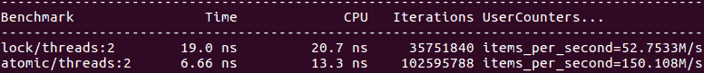

图 7.20 - 在 ARM 上整数的基于锁和无锁队列的性能

然而，即使在 X86 上，我们的分析还没有完成。在前一节中，我们提到如果栈元素很大，复制它们所需的时间相对于线程同步（锁定或原子操作）要长。我们无法充分利用它，因为大多数情况下，一个线程仍然需要等待另一个线程完成复制，因此建议另一种方法：使用指针栈，实际数据存储在其他地方。缺点是我们需要另一个线程安全的容器来存储这些数据（尽管通常，程序无论如何都需要将其存储在某个地方）。这仍然是队列的一个可行建议，但现在我们有另一种选择。正如我们已经提到的，队列中的生产者和消费者线程不会互相等待：它们的交互在大小检查后就结束了。可以推断，如果数据元素很大，无锁队列将具有优势，因为两个线程可以同时复制数据，线程之间的竞争，或者两个线程争夺对同一内存位置的访问（锁或原子值）的时间要短得多。要进行这样的基准测试，我们只需要创建一个大对象的队列，比如一个包含大数组的结构体。正如预期的那样，即使在 X86 硬件上，无锁队列现在也表现得更快：

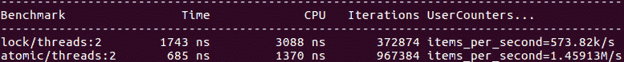

图 7.21 - 在 X86 上大型元素的基于锁和无锁队列的性能

即使在我们施加了限制的情况下，这仍然是一个非常有用的数据结构：当我们知道可以入队的元素数量的上限，或者可以处理生产者在推送更多数据之前必须等待的情况时，这个队列可以用于在生产者和消费者线程之间传输数据。这个队列非常高效；对于一些应用程序来说更重要的是，它具有非常低且可预测的延迟：队列本身不仅是无锁的，而且是无等待的。一个线程永远不必等待另一个线程，除非队列已满。顺便说一句，如果消费者必须对从队列中取出的每个数据元素进行某些处理，并且开始落后直到队列填满，一个常见的方法是让生产者处理它无法入队的元素。这有助于延迟生产者线程，直到消费者赶上（这种方法并不适用于每个应用程序，因为它可能会无序处理数据，但通常情况下是有效的）。

我们的队列在有多个生产者或消费者线程的情况下的泛化将使实现更加复杂。基于原子大小的简单无等待算法即使我们将前后索引设为原子，也不再适用：如果多个消费者线程读取了一个非零大小的值，这对于所有这些线程来说已经不再足够让它们继续进行。对于多个消费者，大小可以在一个线程检查并发现非零值后减小并变为零（这只是意味着其他线程在第一个线程测试大小后，但在它尝试访问队列前弹出了所有剩余元素）。

一个通用的解决方案是使用我们为栈使用的相同技术：将前端和后端索引打包到一个 64 位原子字中，并使用比较和交换原子地访问它们两个。实现类似于栈的实现；在前一节理解了代码的读者已经准备好实现这个队列。在文献中还可以找到其他无锁队列解决方案；本章应该为您提供足够的背景来理解、比较和基准测试这些实现。

实现一个复杂的无锁数据结构是一个耗时的项目，需要技巧和注意力。在实现完成之前，最好能有一些性能估计，这样我们就可以知道努力是否有可能得到回报。我们已经看到了一种基准测试代码的方法，这个代码还不存在：一个模拟基准测试，结合了对非线程安全数据结构（每个线程本地的）的操作和对共享变量（锁或原子数据）的操作。目标是提出一个可以进行基准测试的计算等效代码片段；它永远不会完美，但是如果我们有一个关于一个具有三个原子变量和每个变量上的比较和交换操作的无锁队列的想法，并且我们发现估计的基准测试比自旋锁保护的队列慢几倍，那么实现真正的队列的工作可能不会得到回报。

部分实现代码的第二种基准测试方法是构建基准测试，避免我们尚未实现的某些边缘情况。例如，如果您期望队列大部分时间不为空，并且您的初始实现没有处理空队列的情况，那么您应该对该实现进行基准测试，并限制基准测试，使队列永远不会为空。这个基准测试将告诉您是否走在正确的轨道上：它将展示您在非空队列的典型情况下可以期望的性能。当我们推迟处理栈或队列耗尽内存的情况时，我们实际上已经采取了这种方法。我们简单地假设这种情况不会经常发生，并构建了基准测试来避免这种情况。

还有另一种并发数据结构实现类型，通常可以非常高效。我们接下来要学习这种技术。

## 非顺序一致的数据结构

让我们首先重新审视一个简单的问题，*队列是什么？*当然，我们知道队列是什么：它是一种数据结构，使得首先添加的元素也是首先检索到的。在概念上和许多实现中，这是由元素添加到底层数组的顺序来保证的：我们有一个排队元素的数组，新条目添加到前面，而最老的条目从后面读取。

但是让我们仔细检查一下这个定义是否仍然适用于并发队列。当从队列中读取一个元素时执行的代码看起来像这样：

```cpp
T pop() {
  T return_value;
  return_value = data[back];
  --back;
  return return_value;
}
```

返回值可以用`std::optional`包装或通过引用传递；这并不重要。关键是，从队列中读取值，后面的索引递减，然后控制权返回给调用者。在多线程程序中，线程可以在任何时刻被抢占。完全有可能，如果我们有两个线程 A 和 B，线程 A 从队列中读取最旧的元素，那么线程 B 首先完成`pop()`的执行并将其值返回给调用者。因此，如果我们按顺序将两个元素 X 和 Y 入队，然后有多个线程将它们出队并打印它们的值，程序会先打印 Y 然后是 X。当多个线程将元素推送到队列时，也会发生相同类型的重新排序。最终结果是，即使队列本身保持严格的顺序（如果您暂停程序并检查内存中的数组，元素的顺序是正确的），程序观察到的出队元素的顺序也不能保证与它们入队的顺序完全一致。

当然，顺序也不是完全随机的：即使在并发程序中，栈看起来与队列非常不同。从队列中检索的数据的顺序大致上是添加值的顺序；重大的重新排列是罕见的（当一个线程因某种原因被延迟时会发生）。

我们的队列还保留了另一个非常重要的属性：**顺序一致性**。一个顺序一致的程序产生的输出与一个程序的输出是相同的，其中所有线程的操作都是依次执行的（没有任何并发），并且任何特定线程执行的操作的顺序不会改变。换句话说，等价程序接受所有线程执行的操作序列并将它们交错，但不会重新排列它们。

顺序一致性是一个方便的属性：分析这类程序的行为要容易得多。例如，在队列的情况下，我们保证如果两个元素 X 和 Y 由线程 A 入队，先是 X，然后是 Y，而它们恰好被线程 B 出队，它们将按正确的顺序出来。另一方面，我们可以争论说，实际上这并不重要：两个元素可能被两个不同的线程出队，这种情况下它们可以以任何顺序出现，因此程序必须能够处理它。

如果我们愿意放弃顺序一致性，这将开启一种全新的设计并发数据结构的方法。让我们以队列为例来探讨这个问题。基本思想是：我们可以有几个单线程子队列，而不是一个单一的线程安全队列。每个线程必须原子地获取这些子队列中的一个的独占所有权。实现这一点的最简单方法是使用原子指针数组指向子队列，如*图 7.22*所示。为了获取所有权并同时防止任何其他线程访问队列，我们原子地将子队列指针与空值交换。

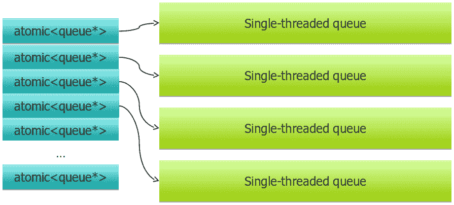

图 7.22 - 基于原子指针访问的数组子队列的非顺序一致队列

需要访问队列的线程必须首先获取一个子队列。我们可以从指针数组的任何元素开始；如果它是空的，那么该子队列当前正在忙，我们尝试下一个元素，依此类推，直到我们保留一个子队列。在这一点上，只有一个线程在操作子队列，因此不需要线程安全（子队列甚至可以是`std::queue`）。操作（推送或弹出）完成后，线程通过将子队列指针原子地写回数组来将子队列的所有权返回给队列。

推送操作必须继续尝试保留子队列，直到找到一个（或者，我们可以允许推送在一定次数尝试后失败，并向调用者发出队列太忙的信号）。弹出操作可能只保留一个子队列，却发现它是空的。在这种情况下，它必须尝试从另一个子队列中弹出（我们可以保持队列中元素的原子计数，以优化如果队列为空则快速返回）。

当然，pop 可能在一个线程上失败，并报告队列为空，而实际上并不是，因为另一个线程已经将新数据推送到队列中。但这可能发生在任何并发队列中：一个线程检查队列大小，发现队列为空，但在控制返回给调用者之前，队列变得非空。再次，顺序一致性对多个线程可以观察到的不一致性类型施加了一些限制，而我们的非顺序一致队列使输出元素的顺序变得不太确定。不过，平均而言，顺序仍然是保持的。

这不是每个问题的正确数据结构，但当*大部分时间都是类似队列*的顺序是可以接受的时候，它可以带来显著的性能改进，特别是在具有许多线程的系统中。观察在运行许多线程的大型 X86 服务器上非顺序一致队列的扩展：

## 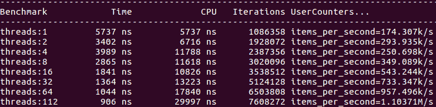

图 7.23 - 非顺序一致队列的性能

在这个基准测试中，所有线程都进行推送和弹出操作，并且元素相当大（复制每个元素需要复制 1KB 的数据）。作为比较，使用自旋锁保护的`std::queue`在单个线程上提供相同的性能（约每秒 170k 个元素），但不会扩展（整个操作被锁定），性能会缓慢下降（由于锁定的开销）到每秒约 130k 个元素的最大线程数。

当然，如果愿意为了性能而接受非顺序一致程序的混乱，许多其他数据结构也可以从这种方法中受益。

当涉及到诸如堆栈和队列之类的并发顺序容器需要更多内存时，我们需要讨论的最后一个主题。

## 并发数据结构的内存管理

到目前为止，我们一直坚持在内存管理问题上进行推迟，并假设数据结构的初始内存分配足够，至少对于不使整个操作单线程化的无锁数据结构来说是如此。我们在本章中看到的受锁保护和非顺序一致的数据结构并没有这个问题：在锁或独占所有权下，只有一个线程在特定的数据结构上操作，因此内存是以通常的方式分配的。

对于无锁数据结构，内存分配是一个重大挑战。这通常是一个相对较长的操作，特别是如果数据必须复制到新位置。即使多个线程可能检测到数据结构的内存用尽，通常也只有一个线程可以添加新的内存（很难使该部分也多线程化），其余线程必须等待。对于这个问题没有很好的一般解决方案，但我们将提出几条建议。

首先，最好的选择是完全避免问题。在许多情况下，当需要无锁数据结构时，可以估计其最大容量并预先分配内存。例如，我们可能知道要入队的数据元素的总数。或者，可能可以将问题推迟给调用者：而不是添加内存，我们可以告诉调用者数据结构已经达到容量上限；在某些问题中，这可能是无锁数据结构的性能的可接受折衷。

如果需要添加内存，非常希望添加内存不需要复制整个现有数据结构。这意味着我们不能简单地分配更多内存并将所有内容复制到新位置。相反，我们必须以固定大小的内存块存储数据，就像`std::deque`所做的那样。当需要更多内存时，将分配另一个块，并且通常有一些指针需要更改，但不会复制数据。

在所有进行内存分配的情况下，这必须是一个不经常发生的事件。如果不是这样，那么我们几乎肯定最好使用由锁或临时独占所有权保护的单线程数据结构。这种罕见事件的性能并不重要，我们可以简单地锁定整个数据结构，并让一个线程进行内存分配和所有必要的更新。关键要求是使常见的执行路径，即我们不需要更多内存的路径，尽可能快。

这个想法非常简单：我们肯定不希望每次都在每个线程上获取内存锁，这会使整个程序串行化。我们也不需要这样做：大多数情况下，我们并不缺内存，也不需要这个锁。因此，我们将检查一个原子标志。只有在内存分配当前正在进行时，标志才会被设置，所有线程都必须等待。

```cpp
std::atomic<int> wait; // 1 if managing memory
if (wait == 1) {  
    … wait for memory allocation to complete …
}
if ( … out of memory … ) {  
    wait = 1;  
    … allocate more memory …  
    wait = 0;
}
… do the operation normally … 
```

问题在于，多个线程可能在一个设置等待标志之前同时检测到内存不足的情况；然后它们都会尝试向数据结构添加更多内存。这通常会产生竞争（重新分配底层存储很少是线程安全的）。然而，有一个简单的解决方案，称为**双重检查锁定**。它使用互斥锁（或另一个锁）和原子标志。如果标志未设置，一切正常，我们可以像往常一样继续。如果标志已设置，我们必须获取锁并再次检查标志：

```cpp
std::atomic<int> wait;  // 1 if managing memorystd::mutex lock;
while (wait == 1) {};  // Memory allocation in progress
if ( … out of memory … ) {  
    std::lock_guard g(lock);  
    if (… out of memory …) { 
        // We got here first!   
        wait = 1;    
        … allocate more memory …   
        wait = 0;  
    }
}
… do the operation normally … 
```

第一次，我们在没有任何锁定的情况下检查内存不足的情况。这很快，而且大多数情况下，我们并不缺内存。第二次，在锁定状态下检查，我们保证只有一个线程在执行。多个线程可能会检测到我们内存不足；然而，第一个获得锁的线程是处理这种情况的线程。所有剩余的线程等待锁；当它们获得锁时，它们进行第二次检查（因此，双重检查锁定），并发现我们不再缺内存。

这种方法可以推广到处理任何特殊情况，这些情况发生得非常少，但是在无锁方式下实现起来比代码的其他部分要困难得多。在某些情况下，甚至可能对空队列等情况有用：正如我们所见，如果两组线程永远不必相互交互，那么处理多个生产者或多个消费者将需要一个简单的原子递增索引。如果在特定应用程序中，我们保证队列很少或几乎不会变为空，那么我们可以偏向于实现对非空队列非常快（无等待），但如果队列可能为空，则退回到全局锁的实现。

我们已经详细介绍了顺序数据结构。现在是时候学习下一个节点数据结构了。

# 线程安全的列表

在我们迄今为止研究的顺序数据结构中，数据存储在数组中（或者至少是由内存块组成的概念数组）。现在我们将考虑一种非常不同的数据结构类型，其中数据由指针连接在一起。最简单的例子是一个列表，其中每个元素都是单独分配的，但我们在这里学到的一切都适用于其他节点容器，如树、图或任何其他数据结构，其中每个元素都是单独分配的，并且数据由指针连接在一起。

为简单起见，我们将考虑一个单链表；在 STL 中，它可以作为`std::forward_list`使用：

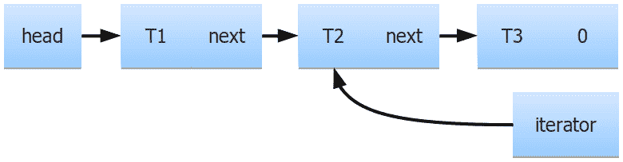

图 7.24 - 带迭代器的单链表

因为每个元素都是单独分配的，所以它也可以单独释放。通常，这些数据结构使用轻量级分配器，其中内存是在大块中分配的，然后被分成节点大小的片段。当一个节点被释放时，内存不会被返回给操作系统，而是被放在一个空闲列表中，以供下一个分配请求使用。对于我们的目的来说，内存是直接从操作系统分配还是由专门的分配器处理（尽管后者通常更有效）在很大程度上并不重要。

列表迭代器在并发程序中提出了额外的挑战。正如我们在*图 7.24*中看到的，这些迭代器可以指向列表中的任何位置。如果从列表中删除一个元素，我们希望它的内存最终可以用于构造和插入另一个元素（如果我们不这样做，并且一直保留所有内存直到整个列表被删除，重复添加和删除几个元素可能会浪费大量内存）。然而，如果有一个迭代器指向它，我们就不能删除列表节点。这在单线程程序中也是如此，但在并发程序中管理起来通常要困难得多。由于可能有多个线程可能使用迭代器，我们通常无法通过操作的执行流来保证没有迭代器指向我们即将删除的元素。在这种情况下，我们需要迭代器来延长它们所指向的列表节点的生命周期。当然，这是引用计数智能指针（如`std::shared_ptr`）的工作。从现在开始，让我们假设列表中的所有指针，无论是将节点链接在一起的指针还是迭代器中的指针，都是智能指针（`std::shared_ptr`或具有更强线程安全性保证的类似指针）。

就像我们在顺序数据结构中所做的那样，我们对于线程安全数据结构的第一次尝试应该是一个带锁的实现。一般来说，除非你知道你需要一个，否则你不应该设计一个无锁的数据结构：开发无锁代码可能很*酷*，但尝试在其中找到错误绝对不是。

就像我们之前做的那样，我们必须重新设计接口的部分，以便所有操作都是事务性的：例如，`pop_front()`应该在列表为空或不为空时都能工作。然后我们可以用锁来保护所有操作。对于`push_front()`和`pop_front()`等操作，我们可以期望与之前观察到的堆栈或队列类似的性能。但是列表提出了我们直到现在都没有不得不面对的额外挑战。

首先，列表支持在任意位置插入；在`std::forward_list`的情况下，可以使用`insert_after()`在迭代器指向的元素之后插入一个新元素。如果我们在两个线程上同时插入两个元素，我们希望插入可以同时进行，除非两个位置靠近并影响同一个列表节点。但是我们无法通过一个单一的锁来保护整个列表来实现这一点。

如果考虑长时间运行的操作，比如搜索列表中具有所需值的元素（或满足其他条件的元素），情况会更糟。我们将不得不为整个搜索操作锁定列表，因此在遍历列表时不能添加或删除元素。当然，如果我们经常搜索，列表就不是正确的数据结构，但是树和其他节点数据结构也有同样的问题：如果我们需要遍历数据结构的大部分部分，锁将在整个操作的持续时间内保持，阻止所有其他线程甚至访问与我们当前操作的节点无关的节点。

当然，如果你从未遇到这些问题，这些问题就不是你的问题：如果你的列表只从前端和后端访问，那么一个带锁的列表可能完全足够。正如我们已经多次看到的，当设计并发数据结构时，不必要的泛化是你的敌人。只构建你需要的东西。

然而，大部分时间，节点数据结构不仅仅是从两端访问，或者在树或图的情况下，并没有真正的“两端”。锁定整个数据结构，以便一次只能由一个线程访问，如果程序大部分时间在操作这个数据结构上，这是不可接受的。你可能考虑的下一个想法是分别锁定每个节点；在列表的情况下，我们可以给每个节点添加自旋锁，并在需要更改时锁定节点。不幸的是，这种方法遇到了所有基于锁的解决方案的问题：死锁。任何需要操作多个节点的线程都必须获取多个锁。假设线程 A 持有节点 1 的锁，现在它需要在节点 2 后插入一个新节点，所以它也试图获取那个锁。与此同时，线程 B 持有节点 2 的锁，并且想要删除节点 1 后的节点，所以它也试图获取那个锁。这两个线程现在将永远等待。除非我们对线程如何访问列表施加非常严格的限制（一次只持有一个锁），否则无法避免这个问题，因为锁可以以任意顺序获取，然后我们会面临活锁的风险，因为许多线程不断释放和重新获取锁。

如果我们真的需要一个可以同时访问的列表或其他节点数据结构，我们必须想出一个无锁实现。正如我们已经看到的，无锁代码不容易编写，甚至更难正确编写。很多时候，更好的选择是想出一个不需要线程安全节点数据结构的不同算法。通常，这可以通过将全局数据结构的部分复制到一个特定于线程的数据结构中，然后由单个线程访问；在计算结束时，来自所有线程的片段再次放在一起。有时，更容易对数据结构进行分区，以便不会同时访问节点（例如，可能可以对图进行分区，并在一个线程上处理每个子图，然后处理边界节点）。但如果你真的需要一个线程安全的节点数据结构，下一节将解释挑战并为你提供一些实现选项。

## 无锁列表

**无锁列表**的基本思想，或者任何其他节点容器，都非常简单，基于使用比较和交换来操作节点的指针。让我们从更简单的操作开始：插入。我们将描述在列表头部的插入，但在任何其他节点之后的插入都是相同的方式进行。

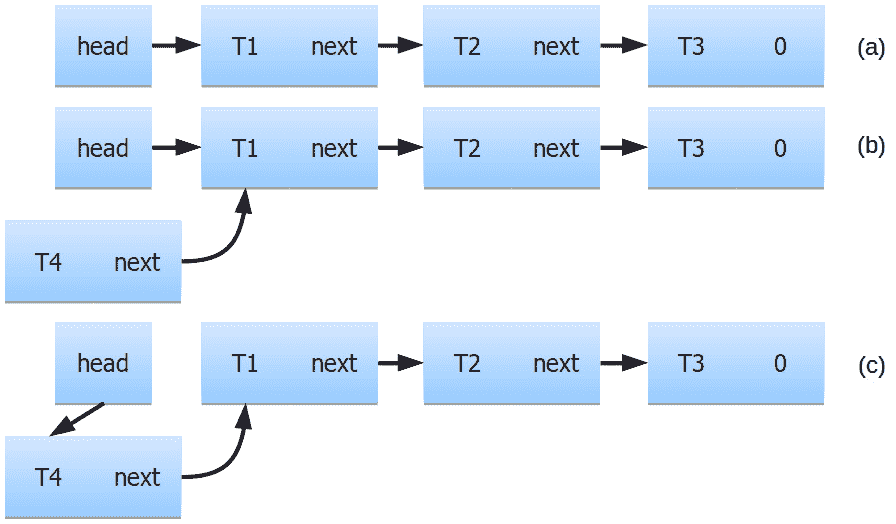

图 7.25 - 在单链表头部插入新节点

假设我们想要在*图 7.25a*所示的列表头部插入一个新节点。第一步是读取当前的头指针，即指向第一个节点的指针。然后我们创建具有所需值的新节点；它的下一个指针与当前头指针相同，因此这个节点在当前第一个节点之前链接到列表中（*图 7.25b*）。此时，新节点还不可访问给其他线程，因此数据结构可以同时访问。最后，我们执行 CAS：如果当前头指针仍然未更改，我们就以原子方式将其替换为指向新节点的指针（*图 7.25c*）。如果头指针不再具有我们最初读取时的值，我们就读取新值，将其写为新节点的下一个指针，并再次尝试原子 CAS。

这是一个简单而可靠的算法。这是我们在上一章中看到的发布协议的泛化：新数据是在一个不关心线程安全的线程上创建的，因为它还不可访问给其他线程。作为最后的动作，线程通过原子方式改变根指针来发布数据，从而可以访问所有数据（在我们的情况下，是列表的头部）。如果我们要在另一个节点之后插入新节点，我们将原子地改变该节点的下一个指针。唯一的区别是多个线程可能同时尝试发布新数据；为了避免数据竞争，我们必须使用比较和交换。

现在，让我们考虑相反的操作，删除列表的前节点。这也是分三步完成的：

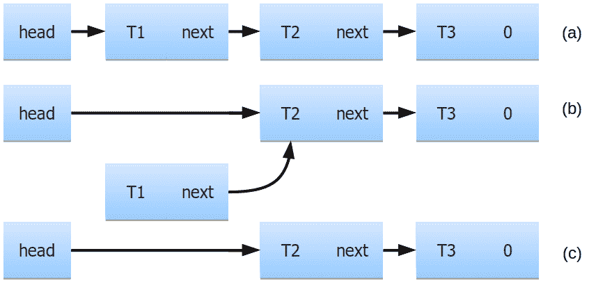

图 7.26 - 单链表头部的无锁移除

首先，我们读取头指针，用它来访问列表的第一个节点，并读取它的下一个指针（*图 7.26a*）。然后我们以原子方式将该下一个指针的值写入头指针（*图 7.26b*），但前提是头指针没有改变（CAS）。此时，原来的第一个节点对其他线程不可访问，但我们的线程仍然具有头指针的原始值，并可以使用它来删除我们已经移除的节点（*图 7.26c*）。这是简单而可靠的。但当我们尝试结合这两个操作时，问题就出现了。

假设两个线程同时在列表上操作。线程 A 正在尝试移除列表的第一个节点。第一步是读取头指针和下一个节点的指针；这个指针即将成为列表的新头部，但比较和交换还没有发生。目前，头部未更改，新头部是一个只存在于线程 A 的某个本地变量中的值 head'。这一刻被捕捉在*图 7.27a*中：

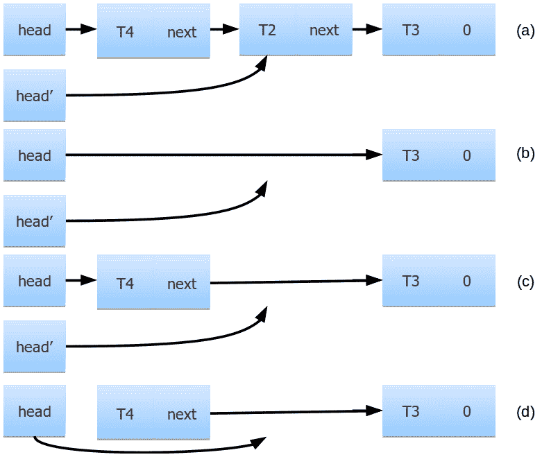

图 7.27 - 单链表头部的无锁插入和移除

就在这时，线程 B 成功地移除了列表的第一个节点。然后它也移除了下一个节点，使列表处于*图 7.27b*所示的状态（线程 A 没有取得任何进展）。然后线程 B 在列表的头部插入一个新节点（*图 7.27c*）；然而，由于两个删除节点的内存已被释放，节点 T4 的新分配重用了旧分配，因此节点 T4 被分配到了原来节点 T1 曾经占据的相同地址。只要删除节点的内存可用于新的分配，这种情况很容易发生；事实上，大多数内存分配器更倾向于返回最近释放的内存，因为它仍然在 CPU 的缓存中是“热点”。

现在，线程 A 终于再次运行，它即将执行的操作是比较和交换：如果头指针自上次线程 A 读取以来没有改变，新的头就变成`head'`。不幸的是，就线程 A 所能看到的情况而言，头指针的值仍然是相同的（它无法观察到所有的变化历史）。CAS 操作成功，新的头指针现在指向了曾经是节点 T2 的未使用内存，而节点 T4 不再可访问（*图 7.27d*）。整个列表已经损坏。

这种失败机制在无锁数据结构中非常常见，它有一个名字：**A-B-A 问题**。这里的**A**和**B**指的是内存位置：问题是数据结构中的某个指针从 A 变为 B，然后再变回 A。另一个线程只观察到初始和最终值，并没有看到任何变化；比较和交换操作成功，执行了程序员假定数据结构未改变的路径。不幸的是，这个假设是不正确的：数据结构几乎可以任意改变，除了观察到的指针的值被恢复到它曾经的值。

问题的根源在于，如果内存被释放和重新分配，指针或内存中的地址不能唯一标识存储在该地址的数据。对于这个问题有多种解决方案，但它们都通过不同的方式实现了同样的目标：确保一旦读取了将被比较和交换使用的指针，该地址的内存在比较和交换完成（成功或不成功）之前不能被释放。如果内存没有被释放，那么另一个分配就不能发生在同一个地址上，您就不会遇到 A-B-A 问题。请注意，*不释放内存*并不等同于*不删除节点*：您当然可以使节点对于数据结构的其余部分不可访问（删除节点），甚至可以调用节点中存储的数据的析构函数；您只是不能释放节点占用的内存。

有许多方法可以通过延迟内存释放来解决 A-B-A 问题。如果可能的话，特定于应用程序的选项通常是最简单的。如果您知道算法在数据结构的生命周期内不会删除许多节点，您可以简单地将所有已删除的节点保留在延迟释放列表中，在整个数据结构被删除时再删除。这种方法的更一般版本可以被描述为应用驱动的垃圾收集：所有释放的内存首先放在*垃圾*列表上。垃圾内存定期返回给主内存分配器，但在此期间，数据结构上的所有操作都被暂停：正在进行的操作必须在收集开始之前完成，所有新操作都被阻塞，直到收集完成。这确保了没有比较和交换操作可以跨越垃圾收集的时间间隔，因此，回收的内存永远不会被任何操作遇到。流行且通常非常高效的**RCU**（**读-复制-更新**）技术也是这种方法的变体。另一种常见的方法是使用危险指针。

在本书中，我们将介绍另一种方法，它使用原子共享指针（`std::shared_ptr`本身不是原子的，但标准包含了对共享指针进行原子操作的必要函数，或者您可以为特定应用程序编写自己的函数并使其更快）。让我们重新审视*图 7.27b*，但现在让所有指针都是原子共享指针。只要有至少一个这样的指针指向一个节点，该节点就不能被释放。在相同的事件序列中，线程 A 仍然拥有指向原始节点 T1 的旧头指针，以及指向节点 T2 的新头指针`head'`。

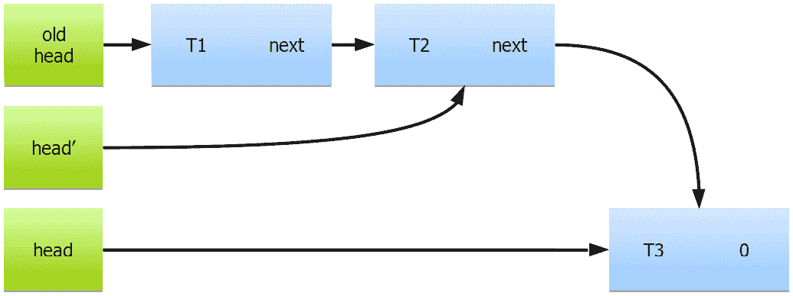

图 7.28 – 具有共享指针的无锁插入和删除的单链表头部

线程 B 已经从列表中删除了两个节点（*图 7.28*），但是内存还没有被释放。新节点 T4 被分配到了另一个地址，与当前分配的所有节点的地址不同。因此，当线程 A 恢复执行时，它会发现新的列表头与旧的头值不同；比较和交换将失败，线程 A 将再次尝试操作。此时，它将重新读取头指针（并获取节点 T3 的地址）。头指针的旧值现在已经消失；因为它是指向节点 T1 的最后一个共享指针，这个节点不再有引用并被删除。同样，一旦共享指针`head'`被重置为其新的预期值（节点 T3 的下一个指针），节点 T2 也会被删除。节点 T1 和 T2 都没有指向它们的共享指针，因此它们最终被删除。

当然，这解决了在前面插入的问题。为了允许在任何地方插入和删除，我们必须将所有节点的指针转换为共享指针。这包括所有节点的*next*指针以及隐藏在列表迭代器中的节点的指针。这样的设计还有另一个重要优势：它解决了与插入和删除同时发生的列表遍历（如搜索操作）的问题。

如果列表节点在有迭代器指向该列表时被移除（*图 7.29*），该节点将保持分配，并且迭代器仍然有效。即使我们移除了下一个节点（T3），它也不会被释放，因为有一个指向它的共享指针（节点 T2 的*next*指针）。迭代器可以遍历整个列表。

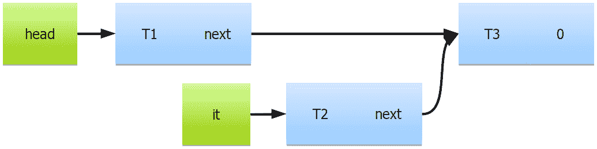

图 7.29 – 具有原子共享指针的无锁列表的线程安全遍历

当然，这种遍历可能包括不再在列表中的节点，也就是说，不再从列表头部可达。这是并发数据结构的特性：没有有意义的方式来谈论*列表的当前内容*：了解列表的内容的唯一方法是从头到最后一个节点进行迭代，但是，当迭代器到达列表末尾时，先前的节点可能已经改变，遍历的结果不再是*当前*的。这种思维方式需要一些时间来适应。

我们不打算展示无锁列表与锁保护列表的任何基准测试，因为这些基准测试必须特定于应用程序。如果只对列表头部进行插入和删除（`push_front()`和`pop_front()`），自旋锁保护的列表将更快（原子共享指针不便宜）。另一方面，如果同时进行插入和搜索的基准测试，你可以使无锁列表更快，速度可以快到你想要的程度：在锁保护的列表上进行 1M 元素的遍历，同时锁定整个时间，而无锁列表可以在每个线程上同时进行迭代、插入和删除。无论原子指针有多慢，如果你只是让它变得足够长，无锁列表就会更快。这不是一个无端的观察：你的应用程序可能需要执行需要长时间锁定列表的操作，除非你可以以某种方式分区列表以避免死锁。如果这是你需要做的，无锁列表是迄今为止最快的。另一方面，如果你只需要遍历几个元素，而且从不在多个不同的位置同时进行遍历，锁保护的列表就可以胜任。

A-B-A 问题和我们列出的解决方案不仅适用于列表，还适用于所有节点数据结构：双向链表、树和图。在由多个指针连接的数据结构中，你可能会遇到额外的问题。首先，即使所有指针都是原子的，连续更改两个原子指针不是一个原子操作。这会导致数据结构中的临时不一致：例如，你可能期望从一个节点到下一个节点，然后返回到上一个节点会让你回到原始节点。在并发情况下，这并不总是正确的：如果在这个位置插入或删除一个节点，其中一个指针可能会在另一个之前更新。第二个问题是特定于共享指针或任何其他使用引用计数的实现：如果数据结构具有指针循环，即使没有外部引用，循环中的节点也不会被删除。最简单的例子是双向链表，其中两个相邻节点总是互相指向。在单线程程序中解决这个问题的方法是使用弱指针（在双向链表中，所有*next*指针可以是共享的，所有*previous*指针则是弱的）。这在并发程序中效果不佳：整个重点是延迟内存的释放，直到没有对它的引用，而弱指针无法做到这一点。对于这些情况，可能需要额外的垃圾回收：在最后一个外部指针指向一个节点被删除后，我们必须遍历链接的节点并检查是否有任何外部指针指向它们（我们可以通过检查引用计数来做到这一点）。没有外部指针的列表片段可以安全地删除。对于这样的数据结构，可能更倾向于使用替代方法，如危险指针或显式垃圾回收。读者应参考专门的关于无锁编程的出版物，以获取有关这些方法的更多信息。

这就结束了我们对并发编程高性能数据结构的探讨。现在让我们总结一下我们学到的东西。

# 总结

本章最重要的教训是*为并发设计数据结构很困难，你应该抓住每一个机会来简化它*。对数据结构使用特定于应用程序的限制可以使它们变得更简单和更快。

你必须做出的第一个决定是你的代码的哪些部分需要线程安全，哪些不需要。通常，最好的解决方案是为每个线程提供自己的数据来处理：单个线程使用的任何数据根本不需要考虑线程安全。当这不是一个选择时，寻找其他特定于应用程序的限制：你是否有多个线程修改特定的数据结构？如果只有一个写入线程，实现通常会更简单。是否有任何应用程序特定的保证可以利用？你是否事先知道数据结构的最大大小？你是否需要同时从数据结构中删除数据和添加数据，还是可以将这些操作分开进行？是否有明确定义的时期，某些数据结构不会发生变化？如果是这样，你就不需要同步来读取它们。这些以及许多其他特定于应用程序的限制可以用来极大地提高数据结构的性能。

第二个重要的决定是：你将支持数据结构上的哪些操作？重新陈述上一段的另一种方式是“实现最小必要的接口”。你实现的任何接口都必须是事务性的：每个操作对于数据结构的任何状态都必须有明确定义的行为。如果某个操作仅在数据结构处于某种状态时有效，除非调用方使用客户端锁定将多个操作组合成单个事务（在这种情况下，这些操作应该从一开始就是一个操作），否则不能在并发程序中安全地调用。

本章还教授了实现不同类型数据结构的几种方法，以及估计和评估它们性能的方法。最终，准确的性能测量只能在实际应用和实际数据的情况下获得。然而，在开发和评估潜在替代方案时，有用的近似基准可以节省大量时间。

本章总结了我们对并发性的探索。接下来，我们将学习 C++语言本身如何影响我们程序的性能。

# 问题

1.  设计用于线程安全的数据结构接口的最关键特性是什么？

1.  为什么具有有限功能的数据结构通常比它们的通用变体更有效？

1.  无锁数据结构是否总是比基于锁的数据结构更快？

1.  在并发应用程序中管理内存的挑战是什么？

1.  A-B-A 问题是什么？
