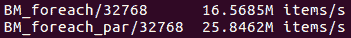
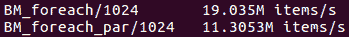
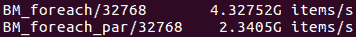
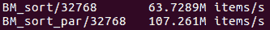
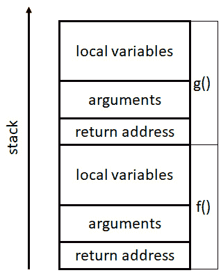
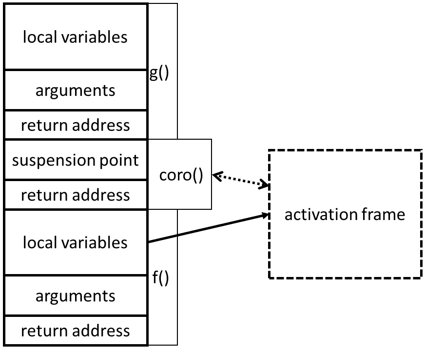
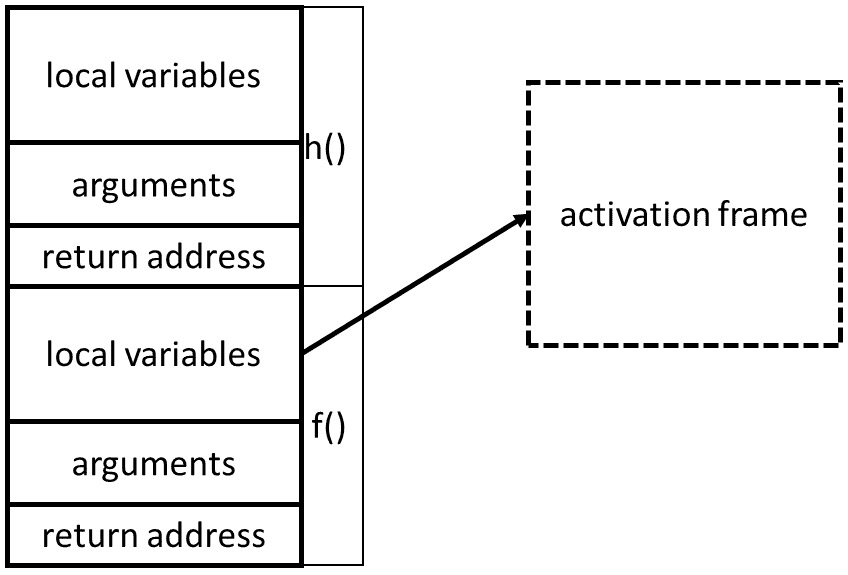
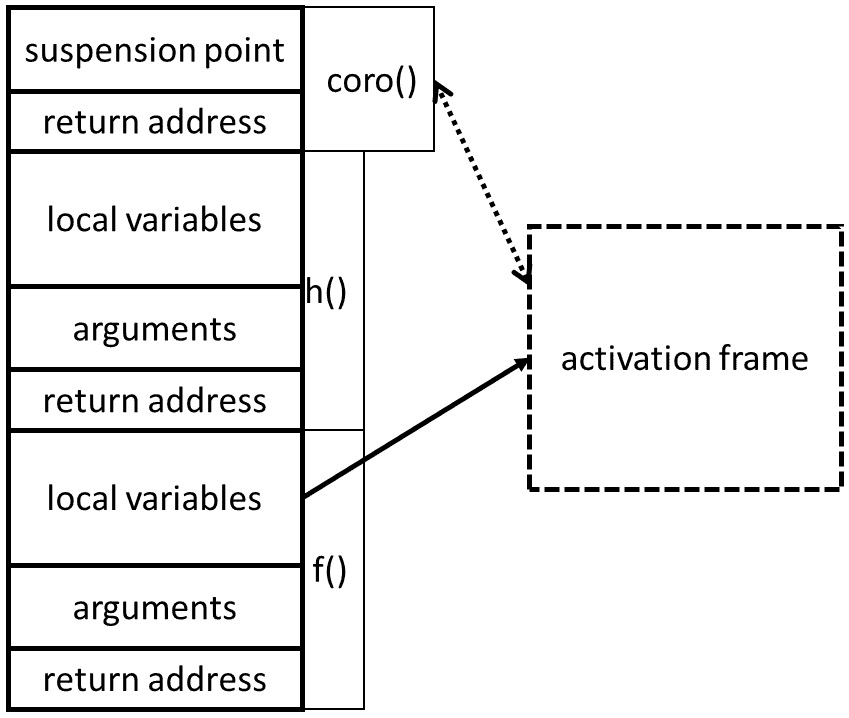

# 第八章：C++中的并发

本章的目的是描述最近添加到语言中的并发编程功能：在 C++17 和 C++20 标准中。虽然现在讨论使用这些功能以获得最佳性能的最佳实践还为时过早，但我们可以描述它们的功能，以及编译器支持的当前状态。

在本章中，我们将涵盖以下主要主题：

+   在 C++11 中将并发引入 C++语言

+   C++17 中的并行 STL 算法

+   C++20 中的协程

阅读完本章后，您将了解 C++提供的功能，以帮助编写并发程序。本章并不意味着是 C++并发功能的全面手册，而是对可用语言设施的概述，作为您进一步探索感兴趣主题的起点。

# 技术要求

如果您想尝试最近 C++版本提供的语言功能，您将需要一个非常现代的编译器。对于某些功能，您可能还需要安装其他工具；当我们描述特定的语言功能时，我们会指出这一点。本章附带的代码可以在[`github.com/PacktPublishing/The-Art-of-Writing-Efficient-Programs/tree/master/Chapter08`](https://github.com/PacktPublishing/The-Art-of-Writing-Efficient-Programs/tree/master/Chapter08)找到。

# C++11 中的并发支持

在 C++11 之前，C++标准没有提及并发。当然，在实践中，程序员在 2011 年之前就已经使用 C++编写了多线程和分布式程序。这是可能的原因是编译器编写者自愿采用了额外的限制和保证，通常是通过遵守 C++标准（用于语言）和其他标准（如 POSIX）来支持并发。

C++11 通过引入**C++内存模型**改变了这一点。内存模型描述了线程如何通过内存进行交互。这是 C++语言首次在并发方面有了坚实的基础。然而，其直接实际影响相当有限，因为新的 C++内存模型与大多数编译器编写者已经支持的内存模型非常相似。这些模型之间存在一些微妙的差异，新标准最终保证了遇到这些黑暗角落的程序的可移植行为。

更直接的实际用途是几种直接支持多线程的语言特性。首先，标准引入了线程的概念。关于线程行为的保证明显很少，但大多数实现通常使用系统线程来支持 C++线程。这在实现的最低级别是可以的，但对于除了最简单的程序之外的任何程序都不够。例如，试图为程序必须执行的每个独立任务创建一个新线程几乎肯定会失败：启动新线程需要时间，很少有操作系统能够有效地处理数百万个线程。另一方面，对于实现其线程调度程序的程序员来说，C++线程接口并不提供足够对线程行为的控制（大多数线程属性是特定于操作系统的）。

接下来，标准引入了几种用于控制并发访问内存的同步原语。语言提供了`std::mutex`，通常使用常规系统互斥量实现：在 POSIX 平台上，这通常是 POSIX 互斥量。标准提供了互斥量的定时和递归变体（再次遵循 POSIX）。为了简化异常处理，应避免直接锁定和解锁互斥量，而应优先使用 RAII 模板`std::lock_guard`。

为了安全地锁定多个互斥锁，而不会出现死锁的风险，标准提供了`std::lock()`函数（虽然它保证不会出现死锁，但它使用的算法是未指定的，特定实现的性能差异很大）。另一个常用的同步原语是条件变量，`std::condition_variable`，以及相应的等待和信号操作。这个功能也非常接近对应的 POSIX 特性。

然后，还有对低级原子操作的支持：`std::atomic`，比如比较和交换，以及内存顺序说明符。我们已经在《第五章》、《线程、内存和并发》、《第六章》、《并发和性能》和《第七章》、《并发数据结构》中介绍了它们的行为和应用。

最后，该语言增加了对异步执行的支持：可以使用`std::async`异步调用函数（可能在另一个线程上）。虽然这可能会实现并发编程，但实际上，这个特性对于高性能应用几乎是完全无用的。大多数实现要么提供非常有限的并行性，要么在自己的线程上执行每个异步函数调用。大多数操作系统创建和加入线程的开销相当高（我见过的唯一一个使并发编程变得像“为每个任务启动一个线程，如果需要的话，可以有数百万个”简单的操作系统是 AIX，在我知道的其他操作系统上，这是一种混乱的做法）。

总的来说，可以说，就并发而言，C++11 在概念上是一个重大的进步，但在实际上提供了适度的即时实际收益。C++14 的改进集中在其他地方，因此在并发方面没有什么值得注意的变化。接下来，我们将看看 C++17 带来了哪些新的发展。

# C++17 中的并发支持

C++17 带来了一个重大进步和几个与并发相关的次要调整。让我们先快速介绍后者。在 C++11 中引入的`std::lock()`函数现在有了相应的 RAII 对象，`std::scoped_lock`。另外，添加了一个共享互斥锁，`std::shared_mutex`，也称为**读-写互斥锁**（再次匹配相应的 POSIX 特性）。这个互斥锁允许多个线程继续进行，只要它们不需要对锁定资源进行独占访问。通常，这些线程执行只读操作，而写线程需要独占访问，因此称为**读-写锁**。这在理论上是一个聪明的想法，但大多数实现的性能都很差。

值得注意的是一个新特性，可以可移植地确定 L1 缓存的缓存行大小，`std::hardware_destructive_interference_size`和`std::hardware_constructive_interference_size`。这些常量有助于创建避免伪共享的缓存最优数据结构。

现在我们来到了 C++17 中的主要新特性——`std::for_each`：

```cpp
std::vector<double> v;
… add data to v … 
std::for_each(v.begin(), v.end(),[](double& x){ ++x; });
```

在 C++17 中，我们可以要求库在所有可用的处理器上并行进行这个计算：

```cpp
std::vector<double> v;
… add data to v … 
std::for_each(std::execution::par,
              v.begin(), v.end(),[](double& x){ ++x; });
```

STL 算法的并行版本有一个新的第一个参数：执行策略。请注意，执行策略不是单一类型，而是一个模板参数。标准提供了几种执行策略；我们之前使用的并行策略`std::execution::par`允许算法在多个线程上执行。线程的数量以及计算在线程内的分区方式是未指定的，取决于实现。顺序策略`std::execution::seq`在单个线程上执行算法，就像没有任何策略（或在 C++17 之前）执行的方式一样。

还有一个并行的无序策略，`std::execution::par_unseq`。两种并行策略之间的区别微妙但很重要。标准规定，无序策略允许计算在单个线程内交错进行，这允许额外的优化，比如矢量化。但是优化编译器可以在生成机器代码时使用矢量指令，比如 AVX，并且这是在没有源 C++代码的帮助下完成的：编译器只是找到矢量化机会，并用矢量指令替换常规的单字指令。那么这里有什么不同呢？

要理解无序策略的性质，我们必须考虑一个更复杂的例子。假设我们不仅仅是对每个元素进行操作，而是要进行一些使用共享数据的计算：

```cpp
double much_computing(double x);
std::vector<double> v;
… add data to v … 
double res = 0;
std::mutex res_lock;
std::for_each(std::execution::par, v.begin(), v.end(),
  &{ 
    double term = much_computing(x);
    std::lock_guard guard(res_lock);
    res += term;
  });
```

在这里，我们对每个向量元素进行一些计算，然后累加结果的总和。计算本身可以并行进行，但累加必须受到锁的保护，因为所有线程都会增加相同的共享变量`res`。并行执行策略是安全的，多亏了锁。然而，我们不能在这里使用无序策略：如果同一个线程同时处理多个向量元素（交错），它可能会尝试多次获取相同的锁。这是一个保证的死锁：如果一个线程持有锁并尝试再次锁定它，第二次尝试将被阻塞，线程无法继续到达解锁锁的点。标准称我们最后一个示例的代码为**不安全的矢量化**，并且规定不应该在无序策略下使用这样的代码。

现在我们已经了解了并行算法在理论上是如何工作的，那么在实践中呢？简短的答案是*相当好，但有一些注意事项*。继续阅读详细版本。

在实践中检查并行算法之前，您必须做一些准备工作来准备您的构建环境。通常，要编译 C++程序，您只需要安装所需的编译器版本，比如 GCC，然后就可以开始了。但是并行算法不是这样。在撰写本书时，安装过程有些繁琐。

足够新的 GCC 和 Clang 版本包括并行 STL 头文件（在某些安装中，Clang 需要安装 GCC，因为它使用由 GCC 提供的并行 STL）。问题出现在更低的层次。这两个编译器使用的运行时线程系统是英特尔**线程构建块**（**TBB**），它作为一个带有自己一套头文件的库提供。两个编译器都没有在其安装中包含 TBB。更复杂的是，每个编译器版本都需要相应版本的 TBB：旧版本和更近版本都不起作用（失败可能会在编译和链接时都表现出来）。要运行与 TBB 链接的程序，您可能需要将 TBB 库添加到库路径中。

一旦你解决了所有这些问题并配置了编译器和必要库的工作安装，使用并行算法就不比使用任何 STL 代码更难。那么，它的扩展性如何？我们可以运行一些基准测试。

让我们从`std::for_each`开始，没有任何锁，并且对每个元素进行了大量的计算（函数`work()`很昂贵，对于我们目前关注的扩展性来说，确切的操作并不重要）：

```cpp
std::vector<double> v(N);
std::for_each(std::execution::par,
              v.begin(), v.end(),[](double& x){ work(x); });
```

以下是在 2 个线程上运行的顺序与并行版本的性能：



图 8.1 - 在 2 个 CPU 上并行 std::foreach 的基准测试

扩展性并不差。请注意，向量大小`N`相当大，有 32K 个元素。对于更大的向量，扩展性确实有所提高。但是，对于相对较小的数据量，并行算法的性能非常差：



图 8.2-并行 std::foreach 进行短序列的基准

对于 1024 个元素的向量，并行版本比顺序版本慢。原因是执行策略在每个并行算法的开始时启动所有线程，并在结束时加入它们。启动新线程需要显着的时间，因此当计算很短时，开销会压倒并行性带来的任何加速。这不是标准强加的要求，而是 GCC 和 Clang 当前实现的并行 STL 与 TBB 系统交互的方式。

当然，并行算法改善性能的大小取决于硬件、编译器及其并行实现，以及每个元素的计算量。例如，我们可以尝试一个非常简单的每个元素计算：

```cpp
std::for_each(std::execution::par,
              v.begin(), v.end(),[](double& x){ ++x; });
```

现在处理相同的 32K 元素向量不显示并行性的好处：



图 8.3-并行 std::foreach 进行廉价的每个元素计算的基准

对于更大的向量大小，除非内存访问速度限制了单线程和多线程版本的性能（这是一个非常受内存限制的计算），并行算法可能会领先。

也许更令人印象深刻的是更难并行化的算法的性能，比如`std::sort`：

```cpp
std::vector<double> v(N);
std::sort(std::execution::par, v.begin(), v.end();
```

这是它的输出：



图 8.4-并行 std::sort 的基准

再次，我们需要足够大量的数据才能使并行算法变得有效（对于 1024 个元素，单线程排序更快）。这是一个非常显著的成就：排序不是最容易并行化的算法，而双精度浮点数的每个元素计算（比较和交换）非常便宜。尽管如此，并行算法显示出非常好的加速，并且如果元素比较更昂贵，它会变得更好。

您可能想知道并行 STL 算法如何与您的线程交互，也就是说，如果同时在两个线程上运行两个并行算法会发生什么？首先，与在多个线程上运行的任何代码一样，您必须确保线程安全（在同一容器上并行运行两个排序无论使用哪种排序都是一个坏主意）。除此之外，您会发现多个并行算法可以很好地共存，但您无法控制作业调度：它们中的每一个都会尝试在所有可用的 CPU 上运行，因此它们会竞争资源。取决于每个算法的扩展性如何，您可能会或可能不会通过并行运行多个算法来获得更高的整体性能。

总的来说，我们可以得出结论，当它们在足够大的数据量上操作时，STL 算法的并行版本提供非常好的性能，尽管“足够大”取决于特定的计算。可能需要额外的库来编译和运行使用并行算法的程序，并且配置这些库可能需要一些努力和实验。此外，并非所有 STL 算法都有其并行等价物（例如，`std::accumulate`没有）。

....

我们现在准备翻动日历上的几页，并跳到 C++20。

# C++20 中的并发支持

C++20 在现有并发支持中增加了一些增强功能，但我们将专注于主要的新添加：协程。协程通常是可以中断和恢复的函数。它们在几个主要应用中非常有用：它们可以极大地简化编写事件驱动程序，对于工作窃取线程池几乎是不可避免的，而且它们使编写异步 I/O 和其他异步代码变得更加容易。

## 协程的基础

有两种风格的协程：**堆栈式**和**无堆栈式**。堆栈式协程有时也被称为**纤程**；它们类似于函数，它们的状态是在堆栈上分配的。无堆栈式协程没有对应的堆栈分配，它们的状态存储在堆上。一般来说，堆栈式协程更强大和灵活，但无堆栈式协程要高效得多。

在本书中，我们将专注于无堆栈式协程，因为这是 C++20 支持的。这是一个足够不寻常的概念，我们需要在展示 C++特定的语法和示例之前进行解释。

一个普通的 C++函数总是有一个对应的堆栈帧。这个堆栈帧存在的时间与函数运行的时间一样长，这就是所有局部变量和其他状态存储的地方。这里有一个简单的函数`f()`：

```cpp
void f() {
  …
}
```

它有一个对应的堆栈帧。函数`f()`可能调用另一个函数`g()`：

```cpp
void g() {
  …
}
void f() {
  …
  g();
  …
}
```

函数`g()`在运行时也有一个堆栈帧。

参考以下图表：



图 8.5 – 普通函数的堆栈帧

当函数`g()`退出时，它的堆栈帧被销毁，只剩下函数`f()`的帧。

相比之下，无堆栈式协程的状态不是存储在堆栈上而是存储在堆上：这种分配被称为**激活帧**。激活帧与协程句柄相关联，它是一个充当智能指针的对象。可以进行函数调用和返回，但只要句柄没有被销毁，激活帧就会持续存在。

协程也需要堆栈空间，例如，如果它调用其他函数。这个空间是在调用者的堆栈上分配的。它是如何工作的（真正的 C++语法不同，所以现在把与协程相关的行当作伪代码来考虑）：

```cpp
void g() {
  …
}
void coro() { // coroutine
  …
  g();
  …
}
void f() {
  …
  std::coroutine_handle<???> H; // Not the real syntax
  coro();
  …
}
```

相应的内存分配如下图所示：



图 8.6 – 协程调用

函数`f()`创建一个协程句柄对象，它拥有激活帧。然后调用协程函数`coro()`。在这一点上有一些堆栈分配，特别是协程在堆栈上存储它如果被挂起时将返回的地址（记住协程是可以自己挂起的函数）。协程可以调用另一个函数`g()`，它在堆栈上分配`g()`的堆栈帧。在这一点上，协程不能再挂起自己：只能从协程函数的顶层挂起。函数`g()`无论是谁调用它都会以相同的方式运行，并最终返回，销毁它的堆栈帧。现在协程可以挂起自己，所以让我们假设它这样做了。

这是堆栈式和无堆栈式协程之间的关键区别：堆栈式协程可以在任何地方挂起，在任意深度的函数调用中恢复。但是这种灵活性在内存和特别是运行时方面代价很高：无堆栈式协程，由于它们有限的状态分配，要高效得多。

当一个协程挂起自己时，为了恢复它所需的状态的一部分被存储在激活帧中。然后协程的堆栈帧被销毁，控制返回给调用者，返回到协程被调用的地方。如果协程运行完成，同样也是这样，但是调用者有办法找出协程是挂起还是完成。

调用者继续执行并可能调用其他函数：

```cpp
void h() {
  …
}
void coro() {…} // coroutine
void f() {
  …
  std::coroutine_handle<???> H; // Not the real syntax
  coro();
  h(); // Called after coro() is suspended
  …
}
```

现在内存分配如下：



图 8.7 – 协程被挂起，执行继续

请注意，协程没有对应于堆栈帧，只有堆分配的激活帧。只要句柄对象存在，协程就可以恢复。不一定是调用和恢复协程的相同函数；例如，如果函数`h()`可以访问句柄，它也可以恢复它：

```cpp
void h(H) {
  H.resume(); // Not the real syntax
}
void coro() {…} // coroutine
void f() {
  …
  std::coroutine_handle<???> H; // Not the real syntax
  coro();
  h(H); // Called after coro() is suspended
  …
}
```

协程从暂停的地方恢复。它的状态从激活帧中恢复，任何必要的堆栈分配都会像往常一样发生：



图 8.8 - 协程从不同的函数中恢复

最终，协程完成，并且句柄被销毁；这会释放与协程相关的所有内存。

以下是关于 C++20 协程的重要知识总结：

+   协程是可以自行暂停的函数。这与操作系统暂停线程不同：协程的暂停是由程序员显式完成的（协作式多任务处理）。

+   与关联堆栈帧的常规函数不同，协程具有句柄对象。只要句柄存在，协程状态就会持续存在。

+   协程暂停后，控制权返回给调用者，继续以与协程完成相同的方式运行。

+   协程可以从任何位置恢复；不一定是调用者本身。此外，协程甚至可以从不同的线程中恢复（我们将在本节后面看到一个示例）。协程从暂停点恢复并继续运行*就好像什么都没发生*（但可能在不同的线程上运行）。

现在让我们看看在真正的 C++中如何完成所有这些。

## C++协程语法

现在让我们看看用于使用协程编程的 C++语言构造。

首要任务是获得支持此功能的编译器。GCC 和 Clang 的最新版本都支持协程，但不幸的是，方式不同。对于 GCC，需要 11 版或更高版本。对于 Clang，部分支持是在 10 版中添加的，并在后续版本中得到改进，尽管仍然是“实验性的”。

首先，为了编译协程代码，您需要在命令行上使用编译器选项（仅使用`--std=c++20`选项启用 C++20 是不够的）。对于 GCC，选项是`-fcoroutines`。对于 Clang，选项是`-stdlib=libc++ -fcoroutines-ts`。对于最新的 Visual Studio，除了`/std:c++20`之外，不需要任何选项。

然后，您需要包含协程头文件。在 GCC 和 Visual Studio 中（以及根据标准），头文件是`#include <coroutine>`，它声明的所有类都在命名空间`std`中。不幸的是，在 Clang 中，头文件是`#include <experimental/coroutine>`，命名空间是`std::experimental`。

声明协程没有特殊的语法：协程在语法上只是常规的 C++函数。使它们成为协程的是使用暂停操作符`co_await`或其变体`co_yield`。然而，在函数体中调用其中一个操作符是不够的：C++中的协程对其返回类型有严格要求。标准库在声明这些返回类型和其他与协程一起工作的类方面没有提供帮助。语言只提供了一个用于使用协程的框架。因此，直接使用 C++20 构造的协程代码非常冗长、重复，并包含大量样板代码。实际上，所有使用协程的人都是使用几种可用的协程库。

对于实际编程，你也应该这样做。然而，在本书中，我们展示的例子是用*纯*的 C++编写的。我们这样做是因为我们不想引导你去使用特定的库，而且这样做会使人们对实际发生的事情的理解变得模糊。协程的支持非常新，库正在快速发展；你选择的库可能不会保持不变。我们希望你能理解 C++级别的协程代码，而不是特定库提供的抽象级别。然后你可以根据自己的需求选择一个库并使用它的抽象。

与协程相关的语法构造的彻底描述将非常不直观：它是一个框架，而不是一个库。因此，我们用例子来完成剩下的演示。如果你真的想知道协程的所有语法要求，你必须查阅最近的出版物（或者阅读标准）。但是例子应该给你足够的理解，让你可以查阅你喜欢的协程库的文档，并在你的程序中使用它。

## 协程示例

第一个例子可能是 C++中协程最常见的用法（也是标准提供了一些明确设计语法的用法）。我们将实现一个惰性生成器。生成器是生成数据序列的函数；每次调用生成器，都会得到序列的一个新元素。惰性生成器是一个按需计算元素的生成器，当调用时会计算元素。

这是一个基于 C++20 协程的惰性生成器：

```cpp
generator<int> coro(){
  for (int i = 0;; ++i) {
    co_yield i;
  }
}
int main() {
  auto h = coro().h_;
  auto& promise = h.promise();
  for (int i = 0; i < 3; ++i) {
    std::cout << "counter: " << promise.value_ << 
      std::endl;
    h();
  }
  h.destroy();
}
```

正如承诺的那样，这是非常低级的 C++，你很少看到这样的代码，但它使我们能够解释所有的步骤。首先，协程`coro()`看起来像任何其他函数，除了`co_yield`操作符。这个操作符暂停协程并将值`i`返回给调用者。因为协程被暂停而不是终止，操作符可以被执行多次。就像任何其他函数一样，当控制流到达闭括号时，协程终止；在这一点上，它不能被恢复。可以通过调用`co_return`操作符（不应该使用常规的`return`操作符）在任何时候退出协程。

其次，协程的返回类型`generator`是一个我们即将定义的特殊类型。它对它有很多要求，这导致了冗长的样板代码（任何协程库都会为你预定义这样的类型）。我们已经可以看到`generator`包含一个嵌套的数据成员`h_`；那就是协程句柄。创建这个句柄也会创建激活帧。句柄与`promise`对象相关联；这与 C++11 的`std::promise`完全无关。事实上，它根本不是标准类型之一：我们必须根据标准中列出的一组规则来定义它。在执行结束时，句柄被销毁，这也会销毁协程状态。因此，句柄类似于指针。

最后，句柄是一个可调用对象。调用它会恢复协程，生成下一个值，并立即再次暂停，因为`co_yield`操作符在循环中。

所有这些都是通过定义协程的适当返回类型神奇地联系在一起的。就像 STL 算法一样，整个系统都受约定束缚：对于这个过程中涉及的所有类型都有期望，如果这些期望没有得到满足，某个地方将无法编译。现在让我们看看`generator`类型：

```cpp
template <typename T> struct generator {
  struct promise_type {
    T value_ = -1;
    generator get_return_object() {
      using handle= std::coroutine_handle<promise_type>;
      return generator{handle::from_promise(*this)};
    }
    std::suspend_never initial_suspend() { return {}; }
    std::suspend_never final_suspend() noexcept { return 
      {}; }
    void unhandled_exception() {}
    std::suspend_always yield_value(T value) {
      value_ = value;
      return {};
    }
  };
  std::coroutine_handle<promise_type> h_;
};
```

首先，`return`类型不必从模板生成。我们可以只声明一个整数的生成器。通常，它是一个模板，参数化为生成序列中元素的类型。其次，名称*generator*在任何方面都不是特殊的：您可以将此类型命名为任何您想要的名称（大多数库提供类似的模板并将其称为`generator`）。另一方面，嵌套类型`generator::promise_type` *必须* 被称为`promise_type`，否则程序将无法编译。通常，嵌套类型本身被称为其他名称，并且使用类型别名：

```cpp
template <typename T> struct generator {
  struct promise { … };
  using promise_type = promise;
};
```

`promise_type`类型必须是`generator`类（或者一般来说，协程返回的任何类型）的嵌套类型。但`promise`类不一定是一个嵌套类：通常是这样，但也可以在外部声明。

强制的是`promise`类型的一组必需成员函数，包括它们的签名。请注意，其中一些成员函数声明为`noexcept`。这也是要求的一部分：如果省略了这个规范，程序将无法编译。当然，如果不需要声明为`noexcept`的任何函数不会抛出异常，也可以声明为这样。

这些必需函数的主体对于不同的生成器可能会更复杂。我们将简要描述每个函数的作用。

第一个非空函数`get_return_object()`是样板代码的一部分，通常看起来与之前的函数完全相同；此函数从一个句柄构造一个新的生成器，而句柄又是从一个 promise 对象构造的。编译器调用它来获取协程的结果。

第二个非空函数`yield_value()`在每次调用`co_yield`操作符时被调用；它的参数是`co_yield`的值。将值存储在 promise 对象中通常是协程将结果传递给调用者的方式。

当编译器第一次遇到`co_yield`时，将调用`initial_suspend()`函数。在协程通过`co_return`产生最后一个结果后，将调用`final_suspend()`函数；之后无法再暂停。如果协程在没有`co_return`的情况下结束，将调用`return_void()`方法。最后，如果协程抛出一个从其主体中逃逸的异常，将调用`unhandled_exception()`方法。您可以自定义这些方法，以便特殊处理每种情况，尽管这很少被使用。

现在我们看到了如何将所有这些联系在一起，为我们提供了一个惰性生成器。首先，创建协程句柄。在我们的示例中，我们没有保留`generator`对象，只保留了句柄。这不是必需的：我们可以保留`generator`对象，并在其析构函数中销毁句柄。协程运行直到遇到`co_yield`并暂停；控制权由调用者返回，而`co_yield`的返回值被捕获在 promise 中。调用程序检索此值，并通过调用句柄恢复协程。协程从被暂停的地方继续运行，直到下一个`co_yield`。

我们的生成器可以永远运行（或者直到在我们的平台上达到最大整数值）：序列永远不会结束。如果我们需要一个有限长度的序列，我们可以执行`co_return`或者在序列结束后退出循环。参考以下代码：

```cpp
generator<int> coro(){
  for (int i = 0; i < 10; ++i) {
    co_yield i;
  }
}
```

现在我们有了一个包含 10 个元素的序列。在尝试恢复协程之前，调用者必须检查句柄成员函数`done()`的结果。

我们之前提到协程可以从代码中的任何位置恢复（当然是在被暂停后）。它甚至可以从不同的线程中恢复。在这种情况下，协程开始在一个线程上执行，被暂停，然后在另一个线程上运行其余的代码。让我们看一个例子：

```cpp
task coro(std::jthread& t) {
  std::cout << "Coroutine started on thread: " <<
    std::this_thread::get_id() << '\n';
  co_await awaitable{t};
  std::cout << "Coroutine resumed on thread: " <<
    std::this_thread::get_id() << '\n';
  std::cout << "Coroutine done on thread: " <<
    std::this_thread::get_id() << '\n';
}
int main() {
  std::cout << "Main thread: " <<
    std::this_thread::get_id() << '\n';
  std::jthread t;
  coro(t);
  std::cout << "Main thread done: " << 
    std::this_thread::get_id() << std::endl;
}
```

首先，让我们解决一个细节：`std::jthread`是 C++20 的一个补充，它只是一个可连接的线程 - 它在对象的析构函数中连接（几乎所有使用线程的人都写过一个类似的东西，但现在我们有了一个标准的）。现在我们可以转向重要的部分 - 协程本身。

首先，让我们看看协程的返回类型：

```cpp
struct task{
  struct promise_type {
    task get_return_object() { return {}; }
    std::suspend_never initial_suspend() { return {}; }
    std::suspend_never final_suspend() noexcept { return 
      {}; }
    void return_void() {}
    void unhandled_exception() {}
  };
};
```

实际上，这是协程的最小可能返回类型：它包含所有必需的样板代码，没有其他内容。具体来说，返回类型是一个定义了嵌套类型`promise_type`的类。该嵌套类型必须定义几个成员函数，如此代码所示。我们在前一个示例中的生成器类型具有所有这些内容以及用于将结果返回给调用者的一些数据。当然，任务也可以根据需要具有内部状态。

前一个示例的第二个变化是任务被挂起的方式：我们使用`co_await`而不是`co_yield`。操作符`co_await`实际上是挂起协程的最通用方式：就像`co_yield`一样，它挂起函数并将控制返回给调用者。不同之处在于参数类型：`co_yield`返回一个结果，而`co_await`的参数是具有非常一般功能的等待对象。再次，对这个对象的类型有特定要求。如果满足要求，该类被称为`awaitable`，并且该类型的对象是有效的等待者（如果不满足要求，某处将无法编译）。这是我们的`awaitable`：

```cpp
struct awaitable {
  std::jthread& t;
  bool await_ready() { return false; }
  void await_suspend(std::coroutine_handle<> h) {
    std::jthread& out = t;
    out = std::jthread([h] { h.resume(); });
  }
  void await_resume() {}
  ~awaitable() {}
  awaitable(std::jthread& t) : t(t) {}
};
```

`awaitable`的必需接口是我们在这里看到的三种方法。第一个是`await_ready()`：在协程挂起后调用它。如果返回`true`，则协程的结果已准备就绪，实际上不需要挂起它。在实践中，它几乎总是返回`false`，这导致协程被挂起：协程的状态（例如局部变量和挂起点）存储在激活帧中，并且控制返回给调用者或恢复者。第二个函数是`await_resume()`，它在协程在恢复后继续执行之前调用。如果它返回结果，那就是整个`co_await`操作符的结果（在我们的示例中没有结果）。最有趣的函数是`await_suspend()`。当此协程被挂起时，它使用当前协程的句柄进行调用，并且可以具有几种不同的返回类型和值。如果它返回`void`，就像我们的示例中一样，协程被挂起，并且控制返回给调用者或恢复者。不要被我们示例中`await_suspend()`的内容所迷惑：它不会恢复协程。相反，它创建一个将执行可调用对象的新线程，而正是这个对象恢复了协程。协程可以在`await_suspend()`完成后或在其仍在运行时恢复：此示例演示了异步操作的协程使用。

将所有这些放在一起，我们得到以下顺序：

1.  主线程调用一个协程。

1.  协程被`co_await`操作符挂起。这个过程涉及对`awaitable`对象的几个成员函数的调用，其中一个创建了一个新线程，其有效负载恢复了协程（通过移动分配线程对象的游戏完成，因此我们在主程序中删除新线程并避免了一些讨厌的竞争条件）。

1.  控制返回给协程的调用者，因此主线程继续从协程调用后的行继续运行。如果在协程完成之前主线程在对象`t`的析构函数中阻塞，它将在那里。

1.  新线程恢复了协程，并从`co_await`后的行继续在该线程上执行。由`co_await`构造的`awaitable`对象被销毁。协程在第二个线程上运行到结束。到达协程的结尾意味着它完成了，就像任何其他函数一样。现在运行协程的线程可以被加入。如果主线程正在等待线程`t`的析构函数完成，现在它将解除阻塞并加入线程（如果主线程尚未达到析构函数，它在达到时不会阻塞）。

我们程序的输出确认了这个顺序：

```cpp
Main thread: 140003570591552
Coroutine started on thread: 140003570591552
Main thread done: 140003570591552
Coroutine resumed on thread: 140003570587392
Coroutine done on thread: 140003570587392
```

如您所见，协程`coro()`首先在一个线程上运行，然后在执行过程中切换到另一个线程。如果有任何局部变量，它们将通过这个转换被保留。

我们提到`co_await`是用于挂起协程的通用操作符。的确，`co_yield x`操作符等同于`co_await`的特定调用，如下所示：

```cpp
co_await promise.yield_value(x);
```

这里`promise`是与当前协程句柄关联的`promise_type`对象。之所以单独使用`co_yield`操作符，是因为在协程内部访问自己的 promise 会导致非常冗长的语法，因此标准添加了一个快捷方式。

这些示例展示了 C++中协程的能力。协程被认为有用的情况包括工作窃取（您已经看到将协程的执行轻松转移到另一个线程有多容易）、惰性生成器和异步操作（I/O 和事件处理）。尽管如此，C++协程还没有存在足够长的时间以形成任何模式，因此社区还没有提出使用协程的最佳实践。同样，现在讨论协程的性能还为时过早；我们必须等待编译器支持成熟和开发更大规模的应用程序。

总的来说，C++标准在多年忽视并发之后，正在迅速赶上，让我们总结一下最近的进展。

# 总结

C++11 是标准中首次承认线程存在的版本。它为记录 C++程序在并发环境中的行为奠定了基础，并在标准库中提供了一些有用的功能。在这些功能中，基本的同步原语和线程本身是最有用的。随后的版本通过相对较小的增强扩展和完善了这些功能。

C++17 带来了一个重大进步，即并行 STL。性能当然取决于实现。只要数据语料库足够大，即使在像搜索和分区这样难以并行化的算法上，观察到的性能也相当不错。然而，如果数据序列太短，并行算法实际上会降低性能。

C++20 增加了对协程的支持。您已经看到了无栈协程的工作原理，在理论上和一些基本示例中。然而，现在讨论 C++20 协程的性能和最佳实践还为时过早。

本章总结了我们对并发性的探索。接下来，我们将学习 C++语言本身如何影响程序的性能。

# 问题

1.  为什么 C++11 中并发编程的基础很重要？

1.  我们如何使用并行 STL 算法？

1.  什么是协程？
