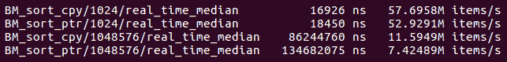
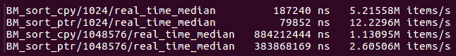
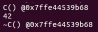
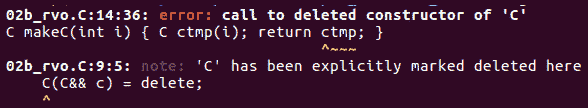
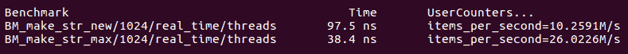
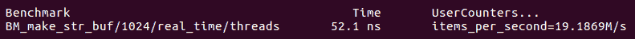
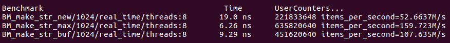
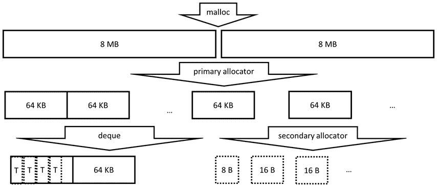
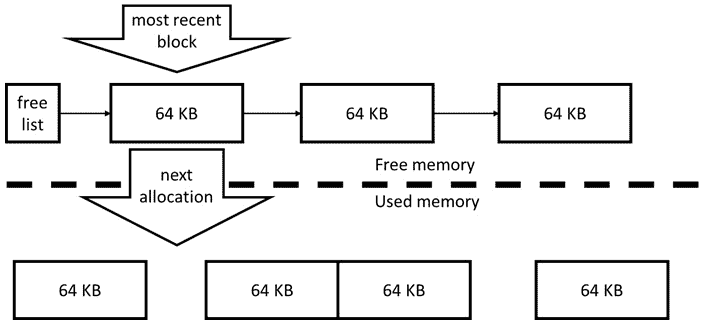

# 第九章：高性能 C++

在本章中，我们将把重点从硬件资源的最佳使用转移到特定编程语言的最佳应用。尽管到目前为止我们学到的一切都可以应用于任何语言的任何程序，但本章涉及 C++的特性和特殊性。你将学会哪些 C++语言特性可能会导致性能问题，以及如何避免它们。

在本章中，我们将涵盖以下主要主题：

+   C++语言的效率和开销

+   学会注意 C++语言结构的可能低效性

+   避免低效的 C++代码

+   优化内存访问和条件操作

# 技术要求

同样，你需要一个 C++编译器和一个微基准测试工具，比如我们在上一章中使用的**Google Benchmark**库（在[`github.com/google/benchmark`](https://github.com/google/benchmark)找到）。

本章的代码可以在[`github.com/PacktPublishing/The-Art-of-Writing-Efficient-Programs/tree/master/Chapter09`](https://github.com/PacktPublishing/The-Art-of-Writing-Efficient-Programs/tree/master/Chapter09)找到。

你还需要一种方法来检查编译器生成的汇编代码：许多开发环境都有显示汇编的选项；GCC 和 Clang 可以将汇编写出来而不是目标代码；调试器和其他工具可以从目标代码生成汇编（反汇编）。你可以根据个人喜好选择使用哪种工具。

# 编程语言的效率是什么？

程序员经常谈论一种语言是否高效。特别是 C++，它的开发明确目标是效率，同时在某些领域却有低效的声誉。这是怎么回事呢？

*效率*在不同的上下文或不同的人看来可能有不同的含义。例如：

+   C++的设计遵循**零开销**的原则：除了少数例外，如果你不使用某个特性，你就不需要为它付出任何运行时成本，即使它存在于语言中。从这个意义上说，它是一种高效的语言。

+   显然，你必须为你使用的语言特性付出一些代价，至少如果它们转化为一些运行时工作的话。C++非常擅长不需要任何运行时代码来执行编译时可以完成的工作（尽管编译器和标准库的实现在效率上有所不同）。一种高效的语言不会给必须生成的代码增加任何开销，而在这方面，C++做得相当不错，但我们将在下面讨论一个主要的警告。

+   如果前面的观点是正确的，那么为什么 C++会被认为是*低效*的？现在我们来看另一个效率的角度：在这种语言中编写高效的代码有多容易？或者，用一种看似自然但实际上是解决问题的非常低效的方式有多容易？一个密切相关的问题是我们在上一段提到的：C++在做你要求它做的事情时非常高效。但是在语言中表达你想要的并不总是容易的，而且，编写代码的自然方式有时会施加额外的要求或约束，程序员可能并不想要，也可能不知道。这些约束会产生运行时成本。

从语言设计师的角度来看，最后一个问题并不是语言的低效性：你让机器做 X 和 Y，做 X 和 Y 需要时间，我们并没有做超出你要求我们做的事情。但从程序员的角度来看，如果程序员只想做 X 而不关心 Y，这就是一种低效的语言。

本章的目标是帮助您编写清晰表达您想让机器执行的代码。目的是双重的：您可能认为您的主要*受众*是编译器：通过精确描述您想要的内容以及编译器可以自由更改的内容，您给予编译器生成更有效代码的自由。但对于您程序的读者也可以这样说：他们只能推断您在代码中表达的内容，而不是您打算表达的内容。如果优化代码会改变其行为的某些方面，这样做是否安全？这种行为是有意的还是实现的意外可以改变的？我们再次被提醒，编程主要是与我们的同行交流的一种方式，然后才是与机器交流。

我们将从看似容易避免的简单低效开始，但即使是掌握了语言的其他方面的程序员的代码中也会出现这些问题。

# 不必要的复制

对象的不必要复制可能是*C++效率问题#1*。主要原因是这样做很容易，很难注意到。考虑以下代码：

```cpp
std::vector<int> v = make_v(… some args …);
do_work(v);
```

在这个程序中，向量`v`被复制了多少次？答案取决于函数`make_v()`和`do_work()`的细节以及编译器的优化。这个小例子涵盖了我们将要讨论的几个语言细微差别。

## 复制和参数传递

我们将从第二个函数`do_work()`开始。这里重要的是声明：如果函数通过引用，`const`或不是，接受参数，那么不会进行复制。

```cpp
void do_work(std::vector<int>& vr) {
  … vr is a reference to v …
}
```

如果函数使用按值传递，那么必须进行复制：

```cpp
void do_work(std::vector<int> vc) {
  … vc is a copy of v …
}
```

如果向量很大，复制向量是一个昂贵的操作：必须复制向量中的所有数据。这是一个昂贵的函数调用。如果工作本身不需要向量的副本，那么它也是极其低效的。例如，如果我们只需要计算向量中所有元素的和（或其他函数），我们不需要复制。虽然乍一看似乎不太理想，调用本身并不告诉我们是否进行了复制，但这就是应该的。是否进行复制的决定属于函数的实现者，并且只有在考虑要求和算法选择之后才能做出。对于前面提到的累加所有元素和的问题，正确的决定显然是通过（const）引用传递向量如下：

```cpp
void do_work(const std::vector<int>& v) {
  int sum = 0;
  for (int x: v) sum += x;
  … use sum … 
}
```

在这种情况下使用按值传递是如此明显的低效，以至于它可能被认为是一个错误，但它发生的频率比你想象的要多。特别是在模板代码中，作者只考虑了小型、轻量级的数据类型，但代码最终被更广泛地使用。

另一方面，如果我们需要创建参数的副本作为满足函数要求的一部分，使用参数传递是一个很好的方式：

```cpp
void do_work(std::vector<int> v) {
  for (int& x : v) x = std::min(x, 255);
  … do computations on the new values …
}
```

在这里，我们需要在进一步处理数据之前应用所谓的夹紧循环。假设我们多次读取夹紧的值，为每次访问调用`std::min()`可能不如创建结果的缓存副本效率高。我们也可以做一个显式的复制，这可能稍微更有效，但这种优化不应该留给猜测；只有通过基准测试才能得到明确的答案。

C++11 引入了**移动语义**作为不必要复制的部分答案。在我们的例子中，我们观察到如果函数参数是一个 r 值，我们可以以任何方式使用它，包括改变它（调用完成后，调用者无法访问对象）。利用移动语义的常规方式是用 r 值引用版本重载函数：

```cpp
void do_work(std::vector<int>&& v) {
  … can alter v data … 
}
```

然而，如果对象本身是可移动的，我们简单的按值传递版本在新的光芒下闪耀。参考以下代码：

```cpp
void do_work(std::vector<int> v) {
  … use v destructively … 
}
std::vector<int> v1(…);
do_work(v1);                 // Local copy is made
do_work(std::vector<int>(…));    // R-value
```

对`do_work()`的第一次调用使用了一个 l-value 参数，因此在函数内部进行了一个本地复制（参数是按值传递的！）。第二次调用使用了一个 r-value 或一个无名临时对象。由于向量具有移动构造函数，函数参数被移动（而不是复制！）到其参数中，移动向量非常快。现在，通过一个函数的单一实现，没有任何重载，我们可以高效地处理 r-value 和 l-value 参数。

现在我们已经看到了两个极端的例子。在第一种情况下，不需要参数的复制，创建一个纯粹是低效的。在第二种情况下，进行复制是一个合理的实现。并不是每种情况都属于这两个极端之一，正如我们将要看到的那样。

## 作为实现技术的复制

还有一种中间地带，选择的实现需要参数的复制，但实现本身并不是最佳的。例如，考虑下面需要按排序顺序打印向量的函数：

```cpp
void print_sorted(std::vector<int> v) {
  std::sort(v.begin(), v.end());
  for (int x: v) std::cout << x << “\n”;
}
```

对于整数向量，这可能是最佳的方式。我们对容器本身进行排序，并按顺序打印它。由于我们不应该修改原始容器，我们需要一个副本，再次利用编译器进行复制也没有问题。

但是，如果向量的元素不是整数，而是一些大对象呢？在这种情况下，复制向量需要大量内存，并且对大对象进行排序需要大量时间。在这种情况下，更好的实现可能是创建并对指针向量进行排序，而不移动原始对象：

```cpp
template <typename T>
void print_sorted(const std::vector<T>& v) {
  std::vector<const T*> vp; vp.reserve(v.size());
  for (const T& x: v) vp.push_back(&x);
  std::sort(vp.begin(), vp.end(), 
     [](const T* a, const T* b) { return *a < *b;});
  for (const T* x: vp) std::cout << *x << “\n”;
}
```

由于我们现在已经学会了永远不要猜测性能，直觉需要通过基准测试来确认。由于对已排序的向量进行排序不需要进行任何复制，我们希望在基准测试的每次迭代中都有一个新的、未排序的向量，如下所示：

```cpp
void BM_sort(benchmark::State& state) {
   const size_t N = state.range(0);
   std::vector<int> v0(N); for (int& x: v0) x = rand();
   std::vector<int> v(N);
   for (auto _ : state) {
         v = v0;
         print_sorted(v);
   }
   state.SetItemsProcessed(state.iterations()*N);
 }
```

当然，我们应该禁用实际的打印，因为我们不关心对 I/O 进行基准测试。另一方面，我们应该对向量进行复制而不进行排序的基准测试，这样我们就知道测量时间的哪一部分用于设置测试。

基准测试证实，对于整数来说，复制整个向量并对副本进行排序更快：



图 9.1 - 对整数向量进行排序的基准测试，复制与指针间接

请注意，如果向量很小且所有数据都适合低级缓存，那么处理速度无论如何都非常快，速度几乎没有差异。如果对象很大且复制成本很高，那么间接引用相对更有效：



图 9.2 - 对大对象向量进行排序的基准测试，复制与指针间接

在实现时，还有另一种特殊情况需要复制对象；我们将在下面考虑这种情况。

## 复制以存储数据

在 C++中，我们可能会遇到另一种数据复制的特殊情况。它最常发生在类构造函数中，其中对象必须存储数据的副本，因此必须创建一个超出构造函数调用寿命的长期复制。考虑以下示例：

```cpp
class C {
  std::vector<int> v_;
  C(std::vector<int> ??? v) { … v_ is a copy of v … }
};
```

这里的意图是进行复制。低效的做法是进行多次中间复制或进行不必要的复制。实现这一点的标准方法是通过`const`引用获取对象，并在类内部进行复制：

```cpp
class C {
  std::vector<int> v_;
  C(const std::vector<int>& v) : v_(v) { … }
};
```

如果构造函数的参数是一个 l-value，这是它可以达到的最高效率。但是，如果参数是一个 r-value（临时对象），我们更希望将其移动到类中，并且根本不进行复制。这需要为构造函数进行重载：

```cpp
class C {
  std::vector<int> v_;
  C(std::vector<int>&& v) : v_(std::move(v)) { … }
};
```

缺点是需要编写两个构造函数，但如果构造函数需要多个参数，并且每个参数都需要被复制或移动，情况会变得更糟。按照这种模式，我们需要 6 个构造函数重载来处理 3 个参数。

另一种方法是通过值传递所有参数并*从参数中*移动，检查以下代码：

```cpp
class C {
  std::vector<int> v_;
  C(std::vector<int> v) : v_(std::move(v)) 
  { … do not use v here!!! … }
};
```

非常重要的是要记住，参数`v`现在是一个 x 值（处于移动状态的对象），不应该在构造函数的主体中使用。如果参数是 l 值，将进行一次复制以构造参数`v`，然后移动到类中。如果参数是 r 值，则将其移动到参数`v`中，然后再移动到类中。如果对象移动起来很便宜，这种模式效果很好。但是，如果对象移动起来很昂贵，或者根本没有移动构造函数（因此会被复制），我们最终会做两次复制而不是一次。

到目前为止，我们已经专注于将数据传递给函数和对象的问题。但是在需要返回结果时，也可能发生复制。这些考虑是完全不同的，需要单独进行检查。

## 返回值的复制

我们在本节开头的示例中包括了两种复制。特别是这一行：

```cpp
std::vector<int> v = make_v(… some args …);
```

这意味着生成的向量`v`是从另一个向量创建的，即函数`make_v`返回的向量：

```cpp
std::vector<int> make_v(… some args …) {
  std::vector<int> vtmp;
  … add data to vtmp …
  return vtmp;
}
```

理论上，这里可能会产生多个副本：局部变量`vtmp`被复制到函数`make_v`的（无名）返回值中，然后又被复制到最终结果`v`中。实际上，这是不会发生的。首先，函数`make_v`的无名临时返回值被移动而不是复制到`v`中。但是，最有可能的是，这也不会发生。如果您尝试使用自己的类而不是`std::vector`来运行此代码，您会发现既没有使用复制构造函数也没有使用移动构造函数：

```cpp
class C {
  int i_ = 0;
  public:
  explicit C(int i) : i_(i) { 
   std::cout << “C() @” << this << std::endl;
  }
  C(const C& c) : i_(c.i_) {
     std::cout << “C(const C&) @” << this << std::endl;
  }
  C(C&& c) : i_(c.i_) {
     std::cout << “C(C&&) @” << this << std::endl;
  }
  ~C() { cout << “~C() @” << this << endl; }
  friend std::ostream& operator<<( std::ostream& out,
                                  const C& c) {
     out << c.i_; return out;
  }
 };  
 C makeC(int i) { C ctmp(i); return ctmp; }
 int main() {
   C c = makeC(42);
   cout << c << endl;
}
```

这个程序打印出类似以下内容的东西（在大多数编译器上，必须打开一定级别的优化）：



图 9.3 - 程序返回对象的输出

正如您所看到的，只构造和销毁了一个对象。这是编译器优化的结果。这里使用的特定优化被称为`ctmp`，无名临时返回值和最终结果`c` - 都是相同类型。此外，我们编写的任何代码都不可能同时观察到这三个变量中的任何两个。因此，在不改变任何可观察行为的情况下，编译器可以使用相同的内存位置来存储所有三个变量。在调用函数之前，编译器需要分配内存，用于构造最终结果`c`的位置。编译器将这个内存地址传递给函数，在函数中用于在相同位置构造局部变量`ctmp`。结果是，当函数`makeC`结束时，根本没有什么需要返回的：结果已经在应该的地方。这就是 RVO 的要点。

尽管 RVO 看起来很简单，但它有几个微妙之处。

首先，要记住这是一种优化。这意味着编译器通常不必这样做（如果你的编译器不这样做，你需要一个更好的编译器）。然而，这是一种非常特殊的优化。一般来说，只要不改变可观察行为，编译器可以对你的程序做任何它想做的事情。可观察行为包括输入和输出以及访问易失性内存。然而，这种优化导致了可观察行为的改变：拷贝构造函数和匹配的析构函数的预期输出都不见了。事实上，这是一个例外，违背了通常的规则：*即使这些函数具有包括可观察行为在内的副作用，编译器也允许消除对拷贝或移动构造函数以及相应析构函数的调用*。这个例外并不局限于 RVO。这意味着，一般来说，你不能指望拷贝和移动构造函数会被调用，只因为你写了一些看起来像是在进行拷贝的代码。这就是所谓的**拷贝省略**（或**移动省略**，对于移动构造函数）。

其次，要记住（再次）这是一种优化。在进行优化之前，代码必须能够编译。如果你的对象没有任何拷贝或移动构造函数，这段代码将无法编译，我们将永远无法进行将删除所有这些构造函数调用的优化步骤。如果我们在示例中删除所有拷贝和移动构造函数，这一点很容易看出：

```cpp
class C {
  …
  C(const C& c) = delete;
  C(C&& c) = delete;
};  
```

编译现在会失败。确切的错误消息取决于编译器和 C++标准级别；在 C++17 中，它会看起来像这样：



图 9.4 - 使用 C++17 或 C++20 的 Clang 编译输出

有一种特殊情况，即使删除了拷贝和移动操作，我们的程序也会编译。让我们对`makeC`函数进行一些微小的更改：

```cpp
C makeC(int i) { return C(i); }
```

C++11 或 C++14 中没有任何变化；然而，在 C++17 及以上版本中，这段代码可以成功编译。请注意与之前版本的细微差别：返回的对象以前是一个 l-value，它有一个名字。现在它是一个 r-value，一个没有名字的临时对象。这造成了很大的不同：虽然**命名返回值优化**（NRVO）仍然是一种优化，但自 C++17 以来，无名的返回值优化是强制性的，不再被视为拷贝省略。相反，标准规定首先不会请求任何拷贝或移动。

最后，你可能会想知道编译器是否必须内联函数，以便在编译函数本身时知道返回值的位置。通过简单的测试，你可以确信这并非如此：即使函数`makeC`在一个单独的编译单元中，RVO 仍然会发生。因此，编译器必须在调用点将结果的地址发送给函数。如果你根本不从函数中返回结果，而是将结果的引用作为额外的参数传递，你也可以自己做类似的事情。当然，该对象必须首先被构造，而编译器生成的优化不需要额外的构造函数调用。

你可能会发现有人建议不要依赖 RVO，而是强制移动返回值：

```cpp
C makeC(int i) { C c(i); return std::move(c); }
```

有人认为，如果 RVO 没有发生，你的程序将承受复制操作的性能损失，而移动操作无论如何都很便宜。然而，这个观点是错误的。要理解为什么，请仔细看*图 9.4*中的错误消息：尽管`ctmp`是一个 l 值并且应该被复制，编译器却抱怨移动构造函数被删除。这不是编译器的错误，而是标准所要求的行为：在返回值优化可能发生的情况下，但编译器决定不这样做时，编译器必须首先尝试找到一个`move`构造函数来返回结果。如果找不到`move`构造函数，就会进行第二次查找；这一次，编译器会寻找一个复制构造函数。在这两种情况下，编译器实际上是在执行重载解析，因为可能有许多复制或`move`构造函数。因此，没有理由写一个显式的移动：编译器会为我们做一个。那么，有什么害处呢？害处在于使用显式移动会禁用 RVO；你要求进行移动，所以你会得到一个。虽然移动可能需要很少的工作，但 RVO 根本不需要工作，没有工作总是比一些工作更快。

如果我们删除`move`构造函数但不删除复制构造函数会发生什么？即使在两个构造函数都被删除的情况下编译仍然失败。这是语言的一个微妙之处：声明一个已删除的成员函数并不等同于不声明任何成员函数。如果编译器执行`move`构造函数的重载解析，它会找到一个，即使这个构造函数被删除了。编译失败是因为重载解析选择了一个已删除的函数作为最佳（或唯一）重载。如果你想强制使用复制构造函数（当然是为了科学），你必须根本不声明任何`move`构造函数。

到目前为止，你一定已经看到了意外复制对象并破坏程序性能的危险隐藏在你的代码的每一个黑暗角落。你能做些什么来避免意外复制？我们马上会有一些建议，但首先，让我们回到我们已经简要使用过的一个方法：使用指针。

## 使用指针来避免复制

在传递对象时避免复制对象的一种方法是传递指针。如果我们不必管理对象的生命周期，这是最容易的。如果一个函数需要访问一个对象但不需要删除它，通过引用或原始指针传递对象是最好的方式（在这种情况下，引用实际上只是一个不能为 null 的指针）。

同样，我们可以使用指针从函数返回对象，但这需要更多的注意。首先，对象必须在堆上分配。你绝对不能返回指向局部变量的指针或引用。参考以下代码：

```cpp
C& makeC(int i) { C c(i); return c; } // Never do this!
```

其次，调用者现在负责删除对象，因此你的函数的每个调用者都必须知道对象是如何构造的（`new`操作符不是构造对象的唯一方式，只是最常见的一种）。这里最好的解决方案是返回一个智能指针：

```cpp
std::unique_ptr<C> makeC(int i) {
  return std::make_unique<C>(i);
}
```

请注意，这样的工厂函数应该返回独特的指针，即使调用者可能使用共享指针来管理对象的生命周期：从独特指针移动到共享指针是简单且便宜的。

说到共享指针，它们经常用于传递由智能指针管理生命周期的对象。除非意图是传递对象的所有权，否则这又是一个不必要和低效的复制的例子。复制共享指针并不便宜。那么，如果我们有一个由共享指针管理的对象和一个需要在不获取所有权的情况下对该对象进行操作的函数，我们使用原始指针：

```cpp
void do_work1(C* c);
void do_work2(const C* c);
std::shared_ptr<C> p { new C(…) };
do_work1(&*p);
do_work2(&*p);
```

函数`do_work1()`和`do_work2()`的声明告诉我们程序员的意图：两个函数都在不删除对象的情况下操作对象。第一个函数修改对象；第二个函数不修改。这两个函数都期望在没有对象的情况下被调用，并将处理这种特殊情况（否则，参数将被按引用传递）。

同样，你可以创建原始指针的容器，只要对象的生命周期在其他地方管理。如果你希望容器管理其元素的生命周期，但又不想将对象存储在容器中，唯一指针的容器就可以胜任。

现在是时候提出一些通用的准则，帮助你避免不必要的拷贝和由此引起的低效率。

## 如何避免不必要的拷贝

要减少意外的、无意的拷贝，你可以做的最重要的事情也许是确保所有的数据类型都是可移动的，如果移动的成本比拷贝更低的话。如果你有容器库或其他可重用的代码，确保它也是可移动的。

下一个建议有些粗糙，但可以节省大量的调试时间：如果你有昂贵的类型需要拷贝，最好一开始就将它们设置为不可拷贝。声明拷贝和赋值操作为删除。如果类支持快速移动，提供移动操作。当然，这将阻止任何拷贝，无论是有意还是无意的。希望有意的拷贝很少，你可以实现一个特殊的成员函数，比如`clone()`，它将创建对象的副本。至少这样，所有的拷贝都是显式的，并且在你的代码中是可见的。如果类既不可拷贝也不可移动，你将无法将其与 STL 容器一起使用；然而，使用唯一指针的容器是一个很好的替代方案。

在向函数传递参数时，尽可能使用引用或指针。如果函数需要对参数进行拷贝，请考虑按值传递并从参数中移动。记住，这仅适用于可移动类型，并参考第一个准则。

我们关于传递函数参数的所有说法也适用于临时局部变量（毕竟，函数参数基本上就是函数范围内的临时局部变量）。除非你需要一个拷贝，否则这些应该是引用。这不适用于像整数或指针这样的内置类型：它们比间接访问更便宜。在模板代码中，你无法知道类型是大还是小，所以使用引用，并依赖于编译器优化来避免对内置类型的不必要的间接访问。

当从函数返回值时，你首选应该依赖于 RVO 和拷贝省略。只有当你发现编译器没有执行这种优化，并且在你的特定情况下这很重要时，你才应该考虑其他选择。这些替代方案包括：使用带有输出参数的函数和使用在动态分配内存中构造结果并返回拥有智能指针（如`std::unique_ptr`）的工厂函数。

最后，审查你的算法和实现，留意不必要的拷贝：记住，恶意的拷贝对性能的影响和无意的拷贝一样糟糕。

我们已经完成了 C++程序中效率的第一个问题，即不必要的对象拷贝。接下来的问题是糟糕的内存管理。

# 低效的内存管理

C++中的内存管理这个主题可能值得一本专门的书。有数十甚至数百篇论文专门讨论 STL 分配器的问题。在本章中，我们将专注于影响性能最大的几个问题。有些问题有简单的解决方案；对于其他问题，我们将描述问题并概述可能的解决方案。

在性能的背景下，你可能会遇到两种与内存相关的问题。第一个是使用过多的内存：你的程序要么耗尽内存，要么不满足内存使用要求。第二个问题是当你的程序变得受限于内存：其性能受到内存访问速度的限制。通常情况下，程序的运行时间与其内存使用量直接相关，减少内存使用也会使程序运行更快。

本节介绍的材料对于处理受限于内存的程序或频繁分配大量内存的程序的程序员来说是有帮助的。我们首先从内存分配本身的性能影响开始。

## 不必要的内存分配

与内存使用相关的最常见的性能问题之一是不必要的内存分配。这里是一个非常常见的问题，用类似 C++的伪代码描述：

```cpp
for ( … many iterations … ) {
  T* buffer = allocate(… size …);
  do_work(buffer); // Computations use memory
  deallocate(buffer);
}
```

一个写得很好的程序会使用 RAII 类来管理释放，但为了清晰起见，我们希望明确地进行分配和释放。分配通常隐藏在管理自己内存的对象内部，比如 STL 容器。这样的程序大部分时间都花在内存分配和释放函数上（比如`malloc()`和`free()`）。

我们可以看到性能对一个非常简单的基准测试的影响：

```cpp
void BM_make_str_new(benchmark::State & state) {
    const size_t NMax = state.range(0);
    for (auto _: state) {
        const size_t N = (random_number() % NMax) + 1;
        char * buf = new char[N];
        memset(buf, 0xab, N);
        delete[] buf;
    }
    state.SetItemsProcessed(state.iterations());
}
```

这里的*工作*是通过初始化一个字符串来表示，`random_number()`函数返回随机整数值（它可以只是`rand()`，但如果我们预先计算并存储随机数以避免对随机数生成器进行基准测试，那么基准测试就会更*干净*）。你可能还需要欺骗编译器，使其不要优化结果：如果通常的`benchmark::DoNotOptimize()`不够用，你可能需要插入一个带有永远不会发生的条件的打印语句（但编译器不知道）比如`rand() < 0`。

我们从基准测试中得到的数字本身是没有意义的：我们需要将它们与某些东西进行比较。在我们的情况下，基准很容易找到：我们必须做同样的工作，但没有任何分配。这可以通过将分配和释放移出循环来实现，因为我们知道最大内存大小：

```cpp
  char * buf = new char[NMax];
  for (auto _: state) {
      …}
  delete[] buf;
```

在这样的基准测试中，你观察到的性能差异在很大程度上取决于操作系统和系统库，但你可能会看到类似这样的情况（我们使用了最多 1KB 的随机大小的字符串）：



图 9.5-分配-释放模式的性能影响

应该注意，在微基准测试中，内存分配通常比在大型程序的上下文中更有效率，因为内存分配模式要复杂得多，因此频繁分配和释放的实际影响可能更大。即使在我们的小基准测试中，每次分配内存的实现速度只有分配最大可能内存量一次版本的 40%。

当然，当我们在计算过程中需要的最大内存量事先知道时，预先分配并在下一次迭代中重复使用是一个简单的解决方案。这个解决方案也适用于许多容器：对于向量或双端队列，我们可以在迭代开始之前预留内存，并利用调整容器大小不会减小其容量的特性。

当我们事先不知道最大内存大小时，解决方案只是稍微复杂一些。这种情况可以用一个只增长不缩小的缓冲区来处理。这是一个简单的缓冲区，可以增长但永远不会缩小：

```cpp
class Buffer {
  size_t size_;
  std::unique_ptr<char[]> buf_;
  public:
  explicit Buffer(size_t N) : size_(N), buf_(
    new char[N]) {}
  void resize(size_t N) { 
     if (N <= size_) return;
     char* new_buf = new char[N];
     memcpy(new_buf, get(), size_);
     buf_.reset(new_buf);
     size_ = N;
  }
  char* get() { return &buf_[0]; }
};
```

再次强调，这段代码对于演示和探索是有用的。在一个真实的程序中，你可能会使用 STL 容器或你自己的库类，但它们都应该有增加内存容量的能力。我们可以通过简单修改我们的基准测试来比较这个仅增长缓冲区与固定大小预分配缓冲区的性能：

```cpp
void BM_make_str_buf(benchmark::State& state) {
  const size_t NMax = state.range(0);
  Buffer buf(1);
  for (auto _ : state) {
     const size_t N = (random_number() % NMax) + 1;     
     buf.resize(N);
     memset(buf.get(), 0xab, N);
  }
  state.SetItemsProcessed(state.iterations());
}
```

再次强调，在一个真实的程序中，通过更智能的内存增长策略（略微超过请求的增长，这样你就不必经常增长内存 - 大多数 STL 容器都采用某种形式的这种策略）你可能会得到更好的结果。但是，对于我们的演示，我们希望尽可能地保持简单。在同一台机器上，基准测试的结果如下：



图 9.6 - 仅增长缓冲区的性能（与图 9.5 进行比较）

增长型缓冲区比固定大小缓冲区慢，但比每次分配和释放内存要快得多。再次强调，更好的增长策略会使这个缓冲区变得更快，接近固定大小缓冲区的速度。

这还不是全部：在多线程程序中，良好的内存管理的重要性更大，因为对系统内存分配器的调用不会很好地扩展，并且可能涉及全局锁。在同一台机器上使用 8 个线程运行我们的基准测试产生了以下结果：



图 9.7 - 多线程程序中分配-释放模式的性能影响

在这里，频繁分配的惩罚更大（仅增长缓冲区显示了剩余分配的成本，并且真的会受益于更智能的增长策略）。

关键是：尽量减少与操作系统的交互。如果你有一个需要在每次迭代中分配和释放内存的循环，那么在循环之前分配一次。如果分配的大小相同，或者你事先知道最大分配大小，那么就分配这个大小并保持它（当然，如果你使用多个缓冲区或容器，你不应该试图把它们塞进一个单一的分配中，而是预先分配每一个）。如果你不知道最大大小，使用一个可以增长但不会缩小或释放内存直到工作完成的数据结构。

避免与操作系统交互的建议在多线程程序中尤为重要，现在我们将对并发程序中内存使用进行一些更一般的评论。

## 并发程序中的内存管理

操作系统提供的内存分配器是一个平衡多种需求的解决方案：在一台给定的机器上，只有一个操作系统，但有许多不同的程序，它们有自己独特的需求和内存使用模式。开发人员非常努力地使它在任何合理的用例中都不会失败；另一方面，它很少是任何用例的最佳解决方案。通常情况下，它足够好，特别是如果你遵循频繁请求内存的建议。

在并发程序中，内存分配变得更加低效。主要原因是任何内存分配器都必须维护一个相当复杂的内部数据结构来跟踪分配和释放的内存。在高性能分配器中，内存被划分为多个区域，以将相似大小的分配组合在一起。这增加了性能，但也增加了复杂性。结果是，如果多个线程同时分配和释放内存，那么这些内部数据的管理必须受到锁的保护。这是一个全局锁，适用于整个程序，如果分配器经常被调用，它可能会限制整个程序的扩展。

这个问题的最常见解决方案是使用具有线程本地缓存的分配器，比如流行的`malloc()`替代库 TCMalloc。这些分配器为每个线程保留一定数量的内存：当一个线程需要分配内存时，首先从线程本地内存区域中取出。这不需要锁，因为只有一个线程与该区域交互。只有当该区域为空时，分配器才必须获取锁，并从所有线程共享的内存中分配。同样，当一个线程释放内存时，它会被添加到特定于线程的区域，而无需任何锁定。

线程本地缓存并非没有问题。

首先，它们往往会使用更多的内存：如果一个线程释放了大量内存，另一个线程分配了大量内存，那么最近释放的内存对于其他线程是不可用的（它是本地的）。因此，分配更多的内存，而未使用的内存对其他线程是可用的。为了限制这种内存浪费，分配器通常不允许每个线程的区域增长超过某个预定义的限制。一旦达到限制，线程本地内存就会返回到所有线程共享的主要区域（这个操作需要一个锁）。

第二个问题是，如果每个分配都由一个线程拥有，也就是说，同一个线程在每个地址分配和释放内存，那么这些分配器就能很好地工作。如果一个线程分配了一些内存，但另一个线程必须释放它，这种*跨线程*的释放是困难的，因为内存必须从一个线程的本地区域转移到另一个线程的本地区域（或共享区域）。简单的基准测试显示，使用标准分配器（如`malloc()`或 TCMalloc）进行跨线程释放的性能至少比线程拥有的内存差一个数量级。这很可能对任何利用线程本地缓存的分配器都是如此，因此应尽量避免线程之间的内存转移。

到目前为止，我们讨论了将内存从一个线程转移到另一个线程以便释放的问题。那么简单地使用另一个线程分配的内存呢？这种内存访问的性能在很大程度上取决于硬件能力。对于一个具有少量 CPU 的简单系统，这可能不是问题。但更大的系统有多个内存银行，CPU 和内存之间的连接不对称：每个内存银行更接近一个 CPU。这被称为**非一致内存架构**（**NUMA**）。NUMA 的性能影响因*不重要*到*快两倍*而变化很大。有方法可以调整 NUMA 内存系统的性能，以及使程序内存管理对 NUMA 细节敏感，但要注意，你可能在调整性能以适应特定的机器：关于 NUMA 系统的性能几乎没有什么可以说的。

现在我们回到了更有效地使用内存的问题，因为这对并发和串行程序的性能都是有益的。

## 避免内存碎片化

一个困扰许多程序的问题是与内存分配系统的低效交互。假设程序需要分配 1 KB 的内存。这块内存是从某个较大的内存区域中划分出来的，由分配器标记为已使用，并将地址返回给调用者。随后进行更多的内存分配，所以我们 1 KB 的内存块之后的内存现在也被使用了。然后程序释放第一个分配的内存，并立即请求 2 KB 的内存。有 1 KB 的空闲块，但不足以满足这个新的请求。可能在其他地方有另一个 1 KB 的块，但只要这两个块不相邻，它们对于 2 KB 的分配就没有用处：


图 9.8 - 内存碎片化：存在 2 KB 的空闲内存，但对于单个 2 KB 的分配是无用的

这种情况被称为`malloc()`，但对于快速消耗内存的程序，可能需要更极端的措施。

其中一种措施是块分配器。其思想是所有内存都以固定大小的块分配，比如 64 KB。你不应该一次从操作系统中分配这么大的单个块，而是应该分配更大的固定大小的块（比如 8 MB），然后将它们细分为更小的块（在我们的例子中是 64 KB）。处理这些请求的内存分配器是程序中的主要分配器，直接与`malloc()`交互。因为它只分配一个大小的块，所以它可以非常简单，我们可以专注于最有效的实现（并发程序的线程本地缓存，实时系统的低延迟等）。当然，你不希望在代码的各个地方都处理这些 64 KB 的块。这是次要分配器的工作，如下图*图 9.9*所示：



图 9.9 - 固定大小块分配

你可以有一个分配器进一步将 64 KB 的块细分为更小的分配。特别高效的是统一分配器（只分配一个大小的分配器）：例如，如果你想为单个 64 位整数分配内存，你可以做到没有任何内存开销（相比之下，`malloc()`通常至少需要 16 字节的开销）。你还可以有容器分配内存在 64 KB 的块中并用它来存储元素。你不会使用向量，因为它们需要单个大的连续分配。你想要的类似数组的容器是 deque，它分配内存在固定大小的块中。当然，你也可以有节点容器。如果 STL 分配器接口满足你的需求，你可以使用 STL 容器；否则，你可能需要编写自己的容器库。

固定大小块分配的关键优势在于它不会受到碎片化的影响：从`malloc()`分配的所有分配都是相同大小的，因此主分配器的所有分配也是如此。每当一个内存块被返回给分配器，它都可以被重用来满足下一个内存请求。参考下图：



图 9.10 - 固定大小分配器中的内存重用

首先进先出的特性也是一个优势：最后的 64 KB 内存块很可能是最近使用的内存，仍然在缓存中。立即重用这个块可以改善内存引用局部性，因此更有效地利用缓存。分配器将返回给它的块管理为一个简单的空闲列表（*图 9.10*）。这些空闲列表可以按线程维护，以避免锁定，尽管它们可能需要定期重新平衡，以避免一个线程积累了许多空闲块，而另一个线程正在分配新的内存。

当然，将我们的 64 KB 块细分为更小尺寸的分配器仍然容易受到碎片化的影响，除非它们也是统一（固定大小）的分配器。然而，如果它必须处理一个小的内存范围（一个块）和少量不同的大小，编写自动整理分配器会更容易。

很可能整个程序都受到使用块内存分配的影响。例如，分配大量小数据结构，使得每个数据结构使用 64 KB 块的一部分并且剩下的部分未使用会变得非常昂贵。另一方面，一个数据结构本身是一组较小的数据结构（一个容器），这样它可以将许多较小的对象打包到一个块中，变得更容易编写。甚至可以编写压缩容器，用于长期保留数据，然后逐块解压缩以进行访问。

块大小本身也不是一成不变的。一些应用程序使用较小的块会更有效，因为如果块部分未使用，则浪费的内存较少。其他应用则可以从需要较少分配的较大块中受益。

应用特定分配器的文献非常丰富。例如，板块分配器是我们刚刚看到的块分配器的一般化；它们有效地管理多种分配大小。还有许多其他类型的自定义内存分配器，其中大多数可以在 C++程序中使用。使用适合特定应用的分配器通常会带来显著的性能改进，通常以严重限制程序员在数据结构实现中的自由为代价。

效率不高的另一个常见原因更微妙，也更难处理。

# 条件执行的优化

在不必要的计算和内存使用效率低下之后，编写未能充分利用可用计算资源大部分的低效代码的*最简单*方法可能是无法进行良好流水线处理的代码。我们已经在*第三章*，*CPU 架构、资源和性能影响*中看到了 CPU 流水线处理的重要性。我们还了解到，最大的流水线破坏者通常是条件操作，特别是硬件分支预测器无法猜测的条件操作。

不幸的是，优化条件代码以获得更好的流水线是最困难的 C++优化之一。只有在分析器显示预测不良的分支时才应该进行优化。但是，请注意，预测不准的分支数量不必很大才能被认为是“不良的”：一个好的程序通常会有不到 0.1%的预测不准的分支。1%的错误预测率是相当大的。而且，要在不检查编译器输出（机器代码）的情况下预测源代码优化的效果也是相当困难的。

如果分析器显示有一个预测不良的条件操作，下一步是确定哪个条件被错误预测。我们已经在*第三章*，*CPU 架构、资源和性能影响*中看到了一些例子。例如，这段代码：

```cpp
if (a[i] || b[i] || c[i]) { … do something … }
```

即使整体结果是可预测的，也可能产生一个或多个预测不良的分支。这与 C++中布尔逻辑的定义有关：操作符`||`和`&&`是*短路*的：表达式从左到右进行评估，直到结果变为已知。例如，如果`a[i]`是`true`，则代码不得访问数组元素`b[i]`和`c[i]`。有时，这是必要的：实现的逻辑可能是这些元素不存在。但通常，布尔表达式会因无故引入不必要的分支。前面的`if()`语句需要 3 个条件操作。另一方面，这个语句：

```cpp
if (a[i] + b[i] + c[i]) { … do something … }
```

相当于最后一个，如果值`a`、`b`和`c`是非负的，但需要进行单个条件操作。同样，这不是您应该预先进行的优化类型，除非您有测量结果证实需要进行优化。

这是另一个例子。考虑这个函数：

```cpp
void f2(bool b, unsigned long x, unsigned long& s) {
  if (b) s += x;
}
```

如果`b`的值是不可预测的，那么效率非常低。只需进行简单的更改，性能就会大大提高：

```cpp
void f2(bool b, unsigned long x, unsigned long& s) {
  s += b*x;
}
```

这种改进可以通过对原始的有条件的实现与无分支实现进行简单的基准测试来确认：

```cpp
BM_conditional   176.304M items/s
BM_branchless     498.89M items/s
```

正如你所看到的，无分支实现几乎快了 3 倍。

不要过度追求这种类型的优化是很重要的。它必须始终受到测量的驱动，有几个原因：

+   分支预测器非常复杂，我们对它们能够处理和不能处理的直觉几乎总是错误的。

+   编译器优化通常会显著改变代码，因此，即使我们对分支的存在有期望，没有测量或检查机器代码，我们的期望也可能是错误的。

+   即使分支被错误预测，性能影响也会有所不同，所以没有测量是不可能确定的。

例如，手动优化这种非常常见的代码几乎从来都不是有用的：

```cpp
int f(int x) { return (x > 0) ? x : 0; }
```

它看起来像是有条件的代码，如果`x`的符号是随机的，那么预测是不可能的。然而，很可能分析器不会显示出大量的错误预测分支。原因是大多数编译器不会使用条件跳转来实现这一行。在 x86 上，一些编译器会使用 CMOVE 指令，它执行*条件移动*：根据条件，它将两个源寄存器中的一个值移动到目的地。这个指令的*条件*性质是良性的：记住有条件的代码的问题在于 CPU 无法提前知道下一条指令要执行什么。有了条件移动的实现，指令序列是完全线性的，它们的顺序是预先确定的，所以没有什么需要猜测的。

另一个常见的例子，不太可能从无分支优化中受益的是有条件的函数调用：

```cpp
if (condition) f1(… args …) else f2(… args …);
```

可以使用函数指针数组实现无分支。

```cpp
using func_ptr = int(*)(… params …);
static const func_ptr f[2] = { &f1, &f2 };
(*f[condition])(… args …);
```

如果函数最初是内联的，用间接函数调用替换它们会导致性能下降。如果它们不是，这种改变可能几乎没有任何作用：跳转到另一个在编译期间不知道地址的函数，其效果与错误预测的分支非常相似，因此这段代码无论如何都会导致 CPU 刷新流水线。

最重要的是，优化分支预测是一个非常高级的步骤。结果可能是显著的改进，也可能是显著的失败（或者只是浪费时间），因此在每一步都要受到性能测量的指导是很重要的。

我们现在已经学到了很多关于 C++程序中许多潜在的低效性以及改进它们的方法。我们总结一些优化代码的整体指导方针。

# 总结

在本章中，我们已经涵盖了 C++效率的两个大领域中的第一个：避免低效的语言构造，这归结为不做不必要的工作。我们学习过的许多优化技术与我们早期学习的材料相契合，比如访问内存的效率以及在并发程序中避免虚假共享。

每个程序员面临的一个大困境是应该投入多少工作来编写高效的代码，以及什么应该留给增量优化。让我们首先说，高性能始于设计阶段：设计架构和接口，不锁定低性能和低效实现是开发高性能软件中最重要的工作。

除此之外，应该区分**过早优化**和**不必要的性能下降**。为了避免别名问题而创建临时变量是过早的，除非你有性能测量数据表明你正在优化的函数对整体执行时间有很大贡献（或者除非它提高了可读性，这是另一回事）。直到分析器告诉你要改变为止，通过值传递大向量只会使你的代码变慢而没有理由，因此应该从一开始就避免。

两者之间的界限并不总是清晰的，因此你必须权衡几个因素。你必须考虑改变对程序的影响：它是否使代码更难阅读，更复杂，或者更难测试？通常情况下，你不想冒着为了性能而增加更多 bug 的风险，除非测量告诉你你必须这样做。另一方面，有时更可读或更直接的代码也是更高效的代码，那么优化就不能被认为是过早的。

C++效率的第二个主要领域与帮助编译器生成更高效的代码有关。我们将在下一章中介绍这个问题。

# 问题

1.  什么时候通过值传递甚至大对象是可以接受的？

1.  在使用资源拥有智能指针时，我们应该如何调用操作对象的函数？

1.  什么是返回值优化，它在哪里使用？

1.  为什么低效的内存管理不仅影响内存消耗，还影响运行时间？

1.  什么是 A-B-A 问题？
