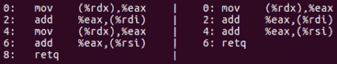
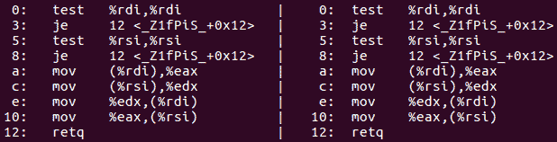

# 第十章：C++中的编译器优化

在上一章中，我们已经了解了 C++程序中效率低下的主要原因。消除这些低效性的责任大部分落在程序员身上。然而，编译器也可以通过许多方式使您的程序运行更快。这就是我们现在要探讨的内容。

本章将涵盖编译器优化的非常重要的问题，以及程序员如何帮助编译器生成更高效的代码。

在本章中，我们将涵盖以下主要主题：

+   编译器优化代码的方法

+   编译器优化的限制

+   如何从编译器获得最佳优化

# 技术要求

同样，您将需要一个 C++编译器和一个微基准测试工具，比如我们在上一章中使用的**Google Benchmark**库（在[`github.com/google/benchmark`](https://github.com/google/benchmark)找到）。本章附带的代码可以在[`github.com/PacktPublishing/The-Art-of-Writing-Efficient-Programs/tree/master/Chapter10`](https://github.com/PacktPublishing/The-Art-of-Writing-Efficient-Programs/tree/master/Chapter10)找到。

您还需要一种方法来检查编译器生成的汇编代码。许多开发环境都有显示汇编代码的选项，GCC 和 Clang 可以写出汇编而不是目标代码，调试器和其他工具可以从目标代码生成汇编（反汇编）。您可以根据个人偏好选择使用哪种工具。

# 编译器优化代码

优化编译器对于实现高性能至关重要。只需尝试运行一个完全没有优化的程序，就能体会到编译器的作用：未经优化的程序（优化级别为零）的运行速度通常比启用所有优化的程序慢一个数量级。

然而，通常情况下，优化器可能需要程序员的一些帮助。这种帮助可能采取非常微妙且常常反直觉的变化形式。在我们查看一些特定的技术来改进代码优化之前，了解编译器如何看待您的程序会有所帮助。

## 编译器优化基础

关于优化，您必须理解的最重要的一点是，任何正确的代码都必须保持正确。*正确*在这里与您对正确的看法无关：程序可能存在错误并给出您认为错误的答案，但编译器必须保留这个答案。唯一的例外是一个程序是不明确的或者调用了未定义的行为：如果程序在标准的眼中是不正确的，编译器可以随意做任何事情。我们将在下一章中探讨这一点的影响。目前，我们将假设程序是明确定义的，并且仅使用有效的 C++。当然，编译器在进行更改时受到限制，要求答案在任何输入组合下都不得改变。后者非常重要：您可能知道某个输入值始终为正，或者某个字符串永远不会超过 16 个字符长，但编译器不知道（除非您找到一种告诉它的方法）。只有在可以证明此转换会导致完全等效的程序时，编译器才能进行优化转换：一个对于任何输入都产生相同输出的程序。实际上，编译器在放弃之前能够管理多复杂的证明也是受限的。

理解*重要的不是你知道什么，而是你能证明什么*是成功与编译器通过代码进行交互以实现更好优化的关键。基本上，本章的其余部分展示了您可以使得更容易证明某些理想的优化不会改变程序结果的不同方法。

编译器在程序方面也受到限制。它必须仅使用**编译时**已知的信息，对任何运行时数据一无所知，并且必须假设在运行时可能出现任何合法状态。

这是一个简单的例子，用来说明这一点。首先，考虑这段代码：

```cpp
std::vector<int> v;
… fill v with data … 
for (int& x : v) ++x;
```

我们关注的重点是最后一行，循环。如果手动展开循环，性能可能会更好：如写的那样，每次增量都有一个分支（循环终止条件）。展开循环可以减少这种开销。在一个简单的情况下，比如一个只有两个元素的向量，甚至最好完全去掉循环，只增加两个元素。然而，向量的大小是运行时信息的一个例子。编译器可能能够生成一个部分展开的循环，带有一些额外的分支来处理所有可能的向量大小，但它无法为特定大小优化代码。

与此代码形成对比：

```cpp
int v[16];
… fill v with data … 
for (int& x : v) ++x;
```

现在编译器确切地知道循环中处理了多少个整数。它可以展开循环，甚至用操作多个数字的向量指令替换单个整数的增量（例如，x86 上的 AVX2 指令集可以一次添加 8 个整数）。

如果您知道向量始终有 16 个元素，可能并不重要。重要的是编译器是否知道这一点，并且能够确定地证明。这比你想象的要困难。例如，考虑这段代码：

```cpp
constexpr size_t N = 16;
std::vector<int> v(N);
… fill v with data … 
for (int& x : v) ++x;
```

程序员费尽心思明确表示向量大小是编译时常量。编译器会优化循环吗？可能。这完全取决于编译器能否证明向量大小不会改变。它会如何改变？问问自己，代码中填充向量的部分可能隐藏了什么？不是你知道的，而是可以从代码本身中学到的。如果所有代码都写在两行之间，构造和增量循环，理论上编译器可以知道一切（实际上，如果这段代码片段太长，编译器会放弃，并假设*任何事情都有可能*，否则编译时间会爆炸）。但如果调用一个函数，而该函数可以访问向量对象，编译器无法知道该函数是否改变了向量的大小，除非该函数被内联。像`fill_vector_without_resizing()`这样的有用函数名称只对程序员有用。

即使没有函数调用以`v`作为参数，我们仍然不能确定。函数如何可能访问向量对象？如果向量`v`是在函数作用域中声明的局部变量，它可能无法。但如果`v`是一个全局变量，那么任何函数都可以访问它。同样，如果`v`是一个类成员变量，任何成员函数或友元函数都可以访问它。因此，如果我们调用一个非内联函数，它没有通过参数列表直接访问`v`，它可能仍然能够通过其他方式访问`v`（至于创建全局指针指向局部变量的真正邪恶的做法，我们最好不要谈）。

从程序员的角度来看，很容易高估编译器的知识，基于程序员对程序实际运行情况的了解。还要记住，*解谜*通常不是编译器的长处。例如，您可以在循环之前添加一个`assert`：

```cpp
constexpr size_t N = 16;
std::vector<int> v(N);
… fill v with data … 
assert(v.size() == N); // if (v.size() != N) abort();
for (int& x : v) ++x;
```

在最高优化级别和简单的上下文中，一些编译器会推断除非向量恰好有 16 个元素，否则执行流程不会到达循环，并且会针对这个大小进行优化。大多数不会。顺便说一句，我们假设断言已启用（`NDEBUG`未定义），或者您使用自己的断言。

我们已经考虑的基本例子已经包含了用于帮助编译器优化代码的关键技术元素：

+   非内联函数会破坏大多数优化，因为编译器必须假设它看不到代码的函数可以做任何它合法允许的事情。

+   全局和共享变量对优化非常不利。

+   编译器更有可能优化短小简单的代码片段，而不是长而复杂的代码片段。

第一个和最后一个概念在某种程度上存在冲突。编译器中的大多数优化都限于所谓的基本代码块：这些是只有一个入口点和一个出口点的代码块。它们在程序的流程控制图中充当节点。基本代码块之所以重要是因为编译器可以看到代码块内部发生的一切，因此可以推断不会改变输出的代码转换。内联的优势在于它增加了基本代码块的大小。编译器不知道非内联函数的具体操作，因此必须做出最坏的假设。但是如果函数被内联，编译器就知道它在做什么（更重要的是，它不在做什么）。内联的缺点也在于它增加了基本代码块的大小：编译器只能分析有限量的代码，否则编译时间会变得不合理。内联对于编译器优化非常重要，我们现在将探讨其中的原因。

## 函数内联

内联是编译器在用函数体的副本替换函数调用时进行的。为了实现这一点，内联必须是可能的：在调用代码的编译过程中，函数的定义必须是可见的，并且在编译时必须知道被调用的函数。第一个要求在一些进行整体程序优化的编译器中有所放宽（仍然不常见）。第二个要求排除了虚函数调用和通过函数指针进行的间接调用。并非每个可以内联的函数最终都会被内联：编译器必须权衡代码膨胀与内联的好处。不同的编译器对内联有不同的启发式。C++的`inline`关键字只是一个建议，编译器可以忽略它。

函数调用内联的最明显好处是消除了函数调用本身的成本。在大多数情况下，这也是最不重要的好处：函数调用并不那么昂贵。主要好处在于编译器在函数调用之间可以做的优化非常有限。考虑这个简单的例子：

```cpp
double f(int& i, double x) {
  double res = g(x);
  ++i;
  res += h(x);
  res += g(x);
  ++i;
  res += h(x);
  return res;
}
```

以下是一个有效的优化吗？

```cpp
double f(int& i, double x) {
  i += 2;
  return 2*(g(x) + h(x));
}
```

如果你回答*是*，那么你仍然是从程序员的角度来看待这个问题，而不是从编译器的角度来看。这种优化可能会破坏代码的方式有很多（对于您可能编写的任何合理程序来说，这些方式可能都不成立，但编译器不能做出的假设是程序员是合理的）。

+   首先，函数`g()`和`h()`可以产生输出，如果消除重复的函数调用会改变可观察的行为。

+   其次，对`g()`的调用可能会锁定某个互斥量，对`h()`的调用可能会解锁它，这种情况下执行的顺序——调用`g()`来锁定，增加`i`，调用`h()`来解锁——非常重要。

+   第三，即使使用相同的参数，`g()`和`h()`的结果可能不同：例如，它们可能在内部使用随机数。

+   最后（这种可能性程序员经常忽视），变量`i`是通过引用传递的，因此我们不知道调用者可能对它做了什么：它可能是一个全局变量，或者某个对象可能存储了对它的引用，因此，`g()`和`h()`函数可能会对`i`进行操作，尽管我们看不到它被传递到这些函数中。

另一方面，如果函数`g()`和`h()`被内联，编译器可以清楚地看到发生了什么，例如：

```cpp
double f(int& i, double x) {
  double res = x + 1; // g(x);
  ++i;
  res += x – 1; // h(x);
  res += x + 1; // g(x)
  ++i;
  res += x – 1; // h(x);
  return res;
}
```

整个函数`f()`现在是一个基本块，编译器只有一个限制：保留返回值。这是一个有效的优化：

```cpp
double f(int& i, double x) {
  i += 2;
  return 4*x;
}
```

内联对优化的影响可以*传递得很远。考虑 STL 容器的析构函数，比如`std::vector<T>`。它必须做的步骤之一是调用容器中所有对象的析构函数：

```cpp
for (auto it = crbegin(); it != crend(); ++it) it->~T();
```

因此，析构函数的执行时间与向量的大小`N`成正比。除非不是：考虑一个整数向量，`std::vector<int>`。在这种情况下，编译器非常清楚析构函数的作用：绝对什么都不做。编译器还可以看到对`crbegin()`和`crend()`的调用不会修改向量（如果您担心通过`const_iterator`销毁对象，请考虑`const`对象是如何被销毁的）。因此，整个循环可以被消除。

现在考虑使用简单聚合的向量：

```cpp
struct S {
  long a;
  double x;
};
std::vector<S> v;
```

这一次，类型`T`有一个析构函数，编译器再次知道它的作用（毕竟编译器生成了它）。再一次，析构函数什么都不做，整个销毁循环被消除。对于`default`析构函数也是一样的：

```cpp
struct S {
  long a;
  double x;
  ~S() = default;
};
```

编译器应该能够对空析构函数进行相同的优化，但只有在内联的情况下才能这样做：

```cpp
struct S {
  long a;
  double x;
  ~S() {}     // Probably optimized away
};
```

另一方面，如果类声明只声明了析构函数如下：

```cpp
struct S {
  long a;
  double x;
  ~S();
};
```

如果定义在单独的编译单元中，那么编译器必须为每个向量元素生成一个函数调用。函数仍然什么都不做，但运行循环和进行`N`个函数调用仍然需要时间。内联允许编译器将这段时间优化为零。

这是内联及其对优化的影响的关键：内联允许编译器看到在否则神秘的函数内部发生了什么*不*。内联还有另一个重要的作用：它创建了内联函数体的唯一克隆，可以根据调用者给定的特定输入进行优化。在这个唯一的克隆中，可能观察到一些对优化友好的条件，这些条件对于这个函数来说通常是不成立的。再次举个例子：

```cpp
bool pred(int i) { return i == 0; }
  … 
std::vector<int> v = … fill vector with data …;
auto it = std::find_if(v.begin(), v.end(), pred);
```

假设函数`pred()`的定义与对`std::find_if()`的调用在同一个编译单元中，那么对`pred()`的调用会被内联吗？答案是*可能*，这在很大程度上取决于对`find_if()`是否首先进行内联。现在，`find_if()`是一个模板，所以编译器总是能看到函数定义。它可能决定不内联该函数。如果`find_if()`没有内联，那么我们就会得到一个从特定类型生成的模板函数。在这个函数内部，第三个参数的类型是已知的：它是`bool (*)(int)`，一个接受`int`并返回`bool`的函数指针。但是这个指针的值在编译时是未知的：同一个`find_if()`函数可以用许多不同的谓词调用，因此它们中的任何一个都不能被内联。只有当编译器为这个特定的调用生成`find_if()`的唯一克隆时，谓词函数才能被内联。编译器有时会这样做；这被称为**克隆**。然而，大多数情况下，内联谓词或作为参数传递的任何其他内部函数的唯一方法是首先内联外部函数。

这个特定的例子在不同的编译器上产生不同的结果：例如，GCC 只会在最高优化设置下内联`find_if()`和`pred()`。其他编译器即使在那时也不会这样做。然而，还有另一种方法可以鼓励编译器内联函数调用，尽管这似乎有些反直觉，因为它会向程序添加更多的代码，并使嵌套函数调用链变得更长：

```cpp
 bool pred(int i) { return i == 0; }
  … 
std::vector<int> v = … fill vector with data …;
auto it = std::find_if(v.begin(), v.end(), 
  & { return pred(i); });
```

这里的悖论是，我们在同一个间接函数调用周围增加了一个额外的间接层，即 lambda 表达式（顺便说一句，我们假设程序员不想直接将谓词的主体简单地复制到 lambda 中有其原因）。这次对`pred()`的调用实际上更容易内联，即使编译器没有内联`find_if()`函数。原因是这次，谓词的类型是唯一的：每个 lambda 表达式都有唯一的类型，因此对于这些特定的类型参数，`find_if()`模板只有一个实例化。编译器更有可能内联只调用一次的函数：毕竟，这样做不会生成任何额外的代码。但即使`find_if()`的调用没有被内联，在该函数内部，第三个参数只有一个可能的值，这个值在编译时已知为`pred()`，因此`pred()`的调用可以被内联。

顺便说一句，我们最终可以澄清我们在*第一章*中提出的问题的答案，即《性能和并发简介》：虚函数调用的成本是多少？首先，编译器通常使用函数指针表来实现虚拟调用，因此调用本身涉及额外的间接层：CPU 必须读取一个额外的指针，并与非虚拟调用相比进行一次跳转。这会在函数调用中添加几个额外的指令，使函数调用的代码大约贵两倍（具体取决于硬件和缓存状态的变化）。然而，我们通常调用函数是为了完成一些工作，因此函数调用的机制只是总函数执行时间的一部分。即使对于简单的函数，虚函数的成本很少超过非虚函数的 10-15%。

然而，在我们花费太多时间计算指令之前，我们应该质疑原始问题的有效性：如果非虚函数调用足够，也就是说，如果我们在编译时知道将调用哪个函数，那么我们为什么要首先使用虚函数呢？相反，如果我们只在运行时找出要调用的函数，那么根本不能使用非虚函数，因此它的速度是无关紧要的。按照这种逻辑，我们应该将虚函数调用与功能上等效的运行时解决方案进行比较：使用一些运行时信息来有条件地调用多个函数中的一个。使用`if-else`或`switch`语句通常会导致较慢的执行，至少如果有两个以上的函数版本要调用的话。最有效的实现是一个函数指针表，这正是编译器用虚函数做的。

当然，原始问题实际上并非毫无意义：如果我们有一个多态类，其中有一个虚函数，但在某些情况下，我们在编译时知道实际类型是什么呢？在这种情况下，比较虚函数调用和非虚函数调用是有意义的。我们还应该提到一个有趣的编译器优化：如果编译器可以在编译时找出对象的真实类型，并因此知道将调用虚函数的哪个重写，它将把调用转换为非虚函数，这就是所谓的**去虚拟化**。

那么，为什么这个讨论发生在一个专门讨论内联的部分呢？因为我们忽略了一个重要因素：虚函数对性能的最大影响是（除非编译器可以去虚拟化调用）它们无法被内联。一个简单的函数，比如`int f() { return x; }`在内联后可能只有一条甚至零条指令，但非内联版本则有常规的函数调用机制，速度慢了几个数量级。现在再加上没有内联的情况下，编译器无法知道虚函数内部发生了什么，并且必须对每个外部可访问的数据做出最坏的假设，你就能看到，在最坏的情况下，虚函数调用可能会昂贵数千倍。

内联的两个效果，暴露函数的内容和创建一个独特的、专门的函数副本，都有助于优化器，因为它们增加了编译器对代码的了解程度。正如我们已经提到的，如果你想帮助编译器更好地优化你的代码，了解编译器真正知道什么是非常重要的。

现在我们将探讨编译器所遵循的不同限制，这样你就可以培养出识别*错误约束*的眼光：你知道是真的，但编译器不知道。

## 编译器真正知道什么？

优化的最大限制可能是在代码执行期间可能发生的变化。为什么这很重要？再举一个例子：

```cpp
int g(int a);
int f(const std::vector<int>& v, bool b) {
  int sum = 0;
  for (int a : v) {
    if (b) sum += g(a);
  }
  return sum;
} 
```

在这种情况下，只有`g()`的声明是可用的。编译器能够优化`if()`语句并消除条件的重复评估吗？在这一章节的所有意外和陷阱之后，你可能在寻找为什么不能的原因。其实没有，这是一个完全有效的优化：

```cpp
int f(const std::vector<int>& v, bool b) {
  if (!b) return 0;
  int sum = 0;
  for (int a : v) {
    sum += g(a);
  }
  return sum;
} 
```

现在让我们稍微修改一下例子：

```cpp
int g(int a);
int f(const std::vector<int>& v, const bool& b) {
  int sum = 0;
  for (int a : v) {
    if (b) sum += g(a);
  }
  return sum;
} 
```

为什么你会通过`const`引用传递`bool`参数？最常见的原因是模板：如果你有一个不需要复制参数的模板函数，它必须将参数声明为`const T&`，假设`T`可以是任何类型。如果`T`被推断为`bool`，那么现在你有了一个`const bool&`参数。这个改变可能很小，但对优化的影响是深远的。如果你认为我们之前做的优化仍然有效，那么考虑一下我们的例子在更大的上下文中。现在你可以看到一切（假设编译器仍然不能）：

```cpp
bool flag = false;
int g(int a) {
  flag = a == 0;
  return –a;
}
int f(const std::vector<int>& v, const bool& b) {
  int sum = 0;
  for (int a : v) {
    if (b) sum += g(a);
  }
  return sum;
} 
int main() {
  f({0, 1, 2, 3, 4}, flag);
}
```

请注意，通过调用`g()`，我们可以改变`b`，因为`b`是一个绑定到全局变量的引用，在`g()`内部也是可访问的。在第一次迭代中，`b`是`false`，但调用`g()`会产生副作用：`b`变为`true`。如果参数是按值传递的，这是不会发生的：值在函数开始时被捕获，不会跟踪调用者的变量。但是通过引用传递，它确实发生了，循环的第二次迭代不再是死代码。在每次迭代中，条件必须被评估，优化是不可能的。我们要再次强调，程序员可能知道的和编译器可以证明的之间的差异：你可能确信你的代码中没有任何全局变量，或者你可能确切地知道函数`g()`做了什么。编译器无法做出这样的猜测，并且必须假设程序（或将来的某个时刻）会做出我们在前面的例子中展示的类似行为，这使得优化潜在地不安全。

同样，如果函数`g()`被内联并且编译器可以看到它不修改任何全局变量，这种情况就不会发生。但你不能期望你的整个代码都被内联，所以在某个时候，你必须考虑如何帮助编译器确定它自己不知道的东西。在当前的例子中，最简单的方法是引入一个临时变量（当然，在这个简单的例子中，你可以手动进行优化，但在更复杂的现实代码中，这是不切实际的）。为了使这个例子稍微更加现实，我们将记住函数`f()`可能来自一个模板实例化。我们不想复制一个未知类型的参数`b`，但我们知道它必须可以转换为`bool`，所以这可以是我们的临时变量。

```cpp
template <typename T>
int f(const std::vector<int>& v, const T& t) {
  const bool b = bool(t);
  int sum = 0;
  for (int a: v) {
    if (b) sum += g(a);
  }
  return sum;
} 
```

编译器仍然必须假设函数`g()`可能会改变`t`的值。但这已经不重要了：条件使用了临时变量`b`，因为它在`f()`函数之外是不可见的，所以肯定不会被更改。当然，如果函数`g()`确实可以访问更改`f()`的第二个参数的全局变量，我们的转换就改变了程序的结果。通过创建这个临时变量，我们告诉编译器这种情况不会发生。这是编译器无法自行想出的额外信息。

这里的教训很简单，理论上是这样的，但在实践中却相当困难：如果你知道关于你的程序的一些信息，而编译器无法知道这些信息是真实的，你必须以编译器可以使用的方式来断言它。这样做之所以难，是因为我们通常不会像编译器那样思考我们的程序，而且很难放弃你确信绝对正确的隐含假设。

顺便说一句，你有没有注意到我们声明临时变量`b`为`const`？这主要是为了我们自己的利益，以防止因意外修改它而产生任何错误。但它也有助于编译器。你可能会想为什么：编译器应该能够看到没有任何东西改变`b`的值。与早期棘手的情况不同，这种情况很简单：编译器看到了对`b`的所有操作。然而，你不能确定编译器知道某些东西只是因为这些知识是可用的：分析程序需要时间，程序员只愿意等待编译器完成工作的时间有限。另一方面，语法检查是强制性的：如果我们声明变量为`const`并尝试更改它，程序将无法编译，我们将永远无法进行优化步骤。因此，优化器可以假设任何`const`变量确实不会改变。还有另一个原因可以尽可能地声明对象为`const`，但我们将在下一章中讨论。

所以这就是第二个教训，紧随第一个教训之后：如果你知道关于你的程序的一些信息，可以轻松地传达给编译器，那就这样做。这个建议确实违反了一个非常常见的建议：不要创建临时变量，除非它们使程序更易读 - 编译器无论如何都会摆脱它们。编译器确实可能会摆脱它们，但它确实保留（并使用）它们的存在所表达的附加信息。

另一个阻止编译器进行优化的非常常见的情况是可能的别名。这是一个初始化两个 C 风格字符串的函数的示例：

```cpp
void init(char* a, char* b, size_t N) {
  for (size_t i = 0; i < N; ++i) {
    a[i] = '0';
    b[i] = '1';
  }
}
```

一次写一个字节的内存是相当低效的。有更好的方法来将所有字符初始化为相同的值。这个版本会快得多：

```cpp
void init(char* a, char* b, size_t N) {
  std::memset(a, '0', N);
  std::memset(b, '1', N);
}
```

您可以手动编写此代码，但编译器永远不会为您执行此优化，了解原因很重要。当您看到此函数时，您期望它被按预期使用，即初始化两个字符数组。但是编译器必须考虑两个指针`a`和`b`指向同一个数组或重叠部分的可能性。对您来说，以这种方式调用`init()`可能毫无意义：两个初始化将互相覆盖。然而，编译器只关心一件事：如何不改变您代码的行为，无论那是什么。

同样的问题可能会发生在任何通过引用或指针接受多个参数的函数中。例如，考虑这个函数：

```cpp
void do_work(int& a, int& b, int& x) {
  if (x < 0) x = -x;
  a += x;
  b += x;
}
```

编译器无法进行任何优化，如果`a`和`b`和`x`绑定到同一个变量，那么这些优化就是无效的。这被称为在递增`a`之后从内存中读取`x`。为什么？因为`a`和`x`可能指向相同的值，编译器无法假设`x`保持不变。

如果您确定别名不会发生，您如何解决这个问题？在 C 中，有一个关键字`restrict`，它通知编译器特定指针是在当前函数范围内访问值的唯一方式：

```cpp
void init(char* restrict a, char* restrict b, size_t N);
```

在`init()`函数内部，编译器可以假定整个数组`a`只能通过这个指针访问。这也适用于标量变量。`restrict`关键字目前还不是 C++标准的一部分。尽管如此，许多编译器支持此功能，尽管使用不同的语法（`restrict`，`__restrict`，`__restrict__`）。对于单个值（特别是引用），创建临时变量通常可以解决问题，如下所示：

```cpp
void do_work(int& a, int& b, int& x) {
  if (x < 0) x = -x;
  const int y = x;
  a += y;
  b += y;
}
```

编译器可能会消除临时变量（不为其分配任何内存），但现在它保证`a`和`b`都增加了相同的量。编译器是否会实际执行这种优化？最简单的方法是比较汇编输出如下：



图 10.1 - x86 汇编输出在别名优化之前（左）和之后（右）

*图 10.1*显示了由 GCC 生成的 x86 汇编，用于增量操作（我们省略了函数调用和分支，这两种情况下是相同的）。使用别名，编译器必须从内存中进行两次读取（`mov`指令）。使用手动优化，只有一次读取。

这些优化有多重要？这取决于许多因素，因此在着手消除代码中的所有别名之前，您不应该进行一些测量。对代码进行分析将告诉您哪些部分是性能关键的；在那里，您必须检查所有优化机会。最终帮助编译器提供额外知识的优化通常是最容易实现的（编译器做了艰苦的工作）。

向编译器提供关于程序的难以发现的信息的建议的反面是：不要担心编译器可以轻松解决的问题。这个问题出现在不同的上下文中，但其中一个更常见的情景是使用验证其输入的函数。在您的库中，您有一个在指针上工作的交换函数：

```cpp
template <typename T>
void my_swap(T* p, T* q) {
    if (p && q) {
        using std::swap;
        swap(*p, *q);
    }
}
```

该函数接受空指针，但不对其进行任何操作。在您自己的代码中，出于某种原因，您仍然必须检查指针，并且只有在两者都非空时才调用`my_swap()`（也许如果它们为空，您需要做其他事情，因此您必须检查）。忽略您可能做的所有其他工作，调用代码如下：

```cpp
void f(int* p, int* q) {
    if (p && q) my_swap(p, q);
}
```

C++程序员花费了大量时间争论多余的检查是否会影响性能。我们应该尝试在调用站点删除检查吗？假设我们不能，我们应该创建另一个不测试其输入的`my_swap()`版本吗？关键观察是`my_swap()`函数是一个模板（和一个小函数），所以几乎肯定会被内联。编译器具有确定第二次对 null 的测试是多余的所有必要信息。它会吗？与其尝试基准测试可能的性能差异（在任何情况下都会非常小），我们将比较两个程序的汇编输出。如果编译器生成具有和不具有多余`if()`语句的相同机器代码，我们可以肯定没有性能差异。这是由 GCC 生成的 x86 汇编输出：



图 10.2 - 带有（左）和不带（右）多余指针测试的汇编输出

在*图 10.2*的左侧是带有两个`if()`语句的程序生成的代码，一个在`my_swap()`内部，一个在外部。右侧是具有特殊的不测试版本`my_swap()`的程序的代码。您可以看到机器代码是完全相同的（如果您能阅读 x86 汇编，您还会注意到两种情况下只有两次比较，而不是四次）。

正如我们已经说过的，内联在这里起着至关重要的作用：如果`my_swap()`没有被内联，那么在函数`f()`中的第一个测试是好的，因为它避免了不必要的函数调用，并允许编译器更好地优化调用代码，以便在其中一个指针为空时更好地进行优化。现在`my_swap()`内部的测试是多余的，但是编译器将生成它，因为它不知道`my_swap()`是否在其他地方被调用，也许没有对输入的任何保证。性能差异仍然极不可能是可测量的，因为硬件对第二次测试是 100%可预测的（我们在*第三章*中讨论过这一点，*CPU 架构、资源和性能影响*）。

顺便说一句，这种情况最常见的例子可能是`delete`运算符：C++允许删除空指针（什么也不会发生）。然而，许多程序员仍然编写这样的代码：

```cpp
if (p) delete p; 
```

即使在理论上，它会影响性能吗？不会：你可以查看汇编输出，并确信，无论是否有额外的检查，只有一次与 null 的比较。

现在您对编译器如何看待您的程序有了更好的理解，让我们看看如何通过另一种有用的技术来获得更好的编译器优化。

## 从运行时到编译时的知识提升

我们将要讨论的方法归结为一件事：通过将运行时信息转换为编译时信息，为编译器提供有关程序的更多信息。在以下示例中，我们需要处理由`Shape`类表示的大量几何对象。它们存储在一个容器中（如果类型是多态的，它将是指针的容器）。处理包括执行两种操作之一：我们要么收缩每个对象，要么增长它。让我们看看：

```cpp
enum op_t { do_shrink, do_grow };
void process(std::vector<Shape>& v, op_t op) {
  for (Shape& s : v) {
    if (op == do_shrink) s.shrink();
    else s.grow();
  }
}
```

总的来说，我们有一个函数，其行为由一个或多个配置变量在运行时控制。通常，这些变量是布尔值（为了可读性，我们选择了一个`enum`）。我们已经看到，如果配置参数`op`是通过引用传递的，编译器必须在循环内保留比较，并为每个形状评估它。即使参数是按值传递的，许多编译器也不会将分支提升出循环：它需要复制循环体（一个用于收缩和一个用于增长），编译器对膨胀代码过多持谨慎态度。

这个问题应该被认真对待：一个更大的可执行文件加载时间更长，而更多的代码会增加指令缓存（i-cache）的压力（i-cache 用于缓存即将被 CPU 使用的指令，就像数据缓存缓存即将被 CPU 使用的数据一样）。然而，在某些情况下，这种优化仍然是正确的选择：通常情况下，您知道很多数据在不改变配置变量的情况下被处理。也许这些变量甚至对整个程序的运行都是常量（您加载配置一次并使用它）。

将分支移出循环对于我们简单的例子来说很容易重写，但如果代码很复杂，重构也是复杂的。如果我们愿意给予编译器帮助，我们可以从编译器那里得到一些帮助。这个想法是将运行时值转换为编译时值：

```cpp
template <op_t op>
void process(std::vector<Shape>& v) {
  for (Shape& s : v) {
    if (op == do_shrink) s.shrink();
    else s.grow();
  }
}
void process(std::vector<Shape>& v, op_t op) {
  if (op == do_shrink) process<do_shrink>(v);
  else process<do_grow>(v);
}
```

整个（可能很大）的旧函数`process()`被转换为一个模板，但除此之外，没有其他改变。具体来说，我们没有将分支移出循环。然而，控制分支的条件现在是一个编译时常量（模板参数）。编译器将消除每个模板实例化中的分支和相应的死代码。在我们程序的其余部分，配置变量仍然是一个运行时值，只是很少（或根本不）改变。因此，我们仍然需要运行时测试，但它只用于决定调用哪个模板实例化。

这种方法可以泛化。想象一下，我们需要为每个形状计算一些属性，比如体积、尺寸、重量等等。这一切都是由一个单一的函数完成的，因为很多计算在不同的属性之间是共享的。但是计算我们不需要的属性会花费时间，所以我们可以实现一个像这样的函数：

```cpp
void measure(const std::vector<Shape>& s,
  double* length, double* width, double* depth,
  double* volume, double* weight);
```

空指针是有效的，并且表示我们不需要该结果。在函数内部，我们为请求的值的特定组合编写了最佳代码：我们只进行一次常见的计算，并且不计算任何我们不需要的东西。然而，这个检查是在形状循环内部进行的，这次是一个相当复杂的条件集。如果我们需要处理大量形状以获取相同的测量集合，那么将条件提升出循环是有意义的，但即使编译器可以做到这一点，它也不太可能这样做。同样，我们可以编写一个具有许多非类型参数的模板：它们将是布尔值，比如`need_length`、`need_width`等等。在该模板内部，编译器将消除所有对于特定测量组合从未执行的分支，因为现在这是编译时信息。在运行时调用的函数必须根据哪些指针是非空来将调用转发到正确的模板实例化。其中一个最有效的实现是查找表：

```cpp
template <bool use_length, bool use_width, …>
void measure(const std::vector<Shape>& v,
         double* length, … );
void measure(const std::vector<Shape>& v,
         double* length, … ) {
  const int key = ((length != nullptr) << 0) |
                  ((width  != nullptr) << 1) |
                  ((depth  != nullptr) << 2) |
                  ((volume != nullptr) << 3) |
                  ((weight != nullptr) << 4);
  switch (key) {
    case 0x01: measure<true , false, … >(v, length, … );
               break;
    case 0x02: measure<false, true , … >(v, length, … );
               break;
    …
    default:; // Programming error, assert
 }
}
```

这将生成大量的代码：每个测量的变体都是一个新的函数。这种重大转变的影响应该始终通过性能分析来验证。然而，在测量相对简单的情况下（比如，许多形状都是立方体），并且对许多（数百万）形状请求相同的测量集合时，这种改变可以带来显著的性能提升。

在使用特定编译器时，了解其功能和优化是很重要的。这种细节超出了本书的范围，而且这是易变的知识——编译器发展迅速。相反，本章为理解编译器优化奠定了基础，并为您读者提供了进一步理解的参考框架。让我们回顾一下我们学到的主要要点。

# 总结

在本章中，我们探讨了 C++效率的主要领域之一：帮助编译器生成更高效的代码。

本书的目标是让你了解代码、计算机和编译器之间的交互，以便你能够凭借良好的判断力和扎实的理解做出这些决定。

帮助编译器优化你的代码最简单的方法是遵循有效优化的一般*经验法则*，其中许多也是良好设计的规则：最小化代码不同部分之间的接口和交互，将代码组织成块、函数和模块，每个模块都有简单的逻辑和明确定义的接口边界，避免全局变量和其他*隐藏*的交互等。这些也是最佳设计实践并非巧合：通常，对程序员易读的代码也易于编译器分析。

更高级的优化通常需要检查编译器生成的代码。如果你注意到编译器没有进行某些优化，考虑一下是否存在某种情况下该优化是无效的：不要考虑你的程序中发生了什么，而是考虑在给定的代码片段中可能发生了什么（例如，你可能知道你从不使用全局变量，但编译器必须假设你可能会使用）。

在下一章中，我们将探讨 C++（以及软件设计一般）中一个非常微妙的领域，它可能与性能研究产生意想不到的重叠。

# 问题

1.  是什么限制了编译器的优化？

1.  为什么函数内联对编译器优化如此重要？

1.  为什么编译器不进行*显而易见*的优化？

1.  为什么内联是一种有效的优化？
