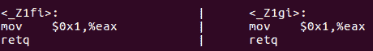
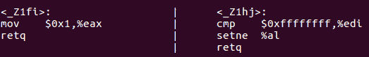
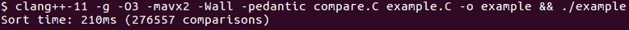
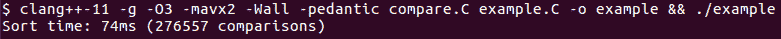
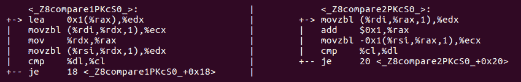
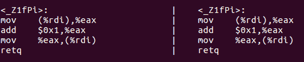
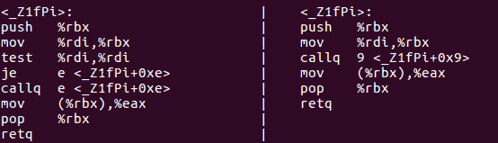
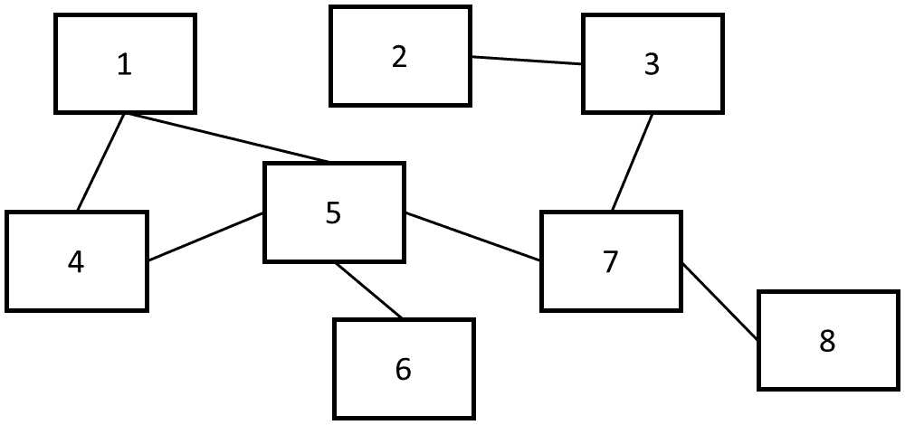
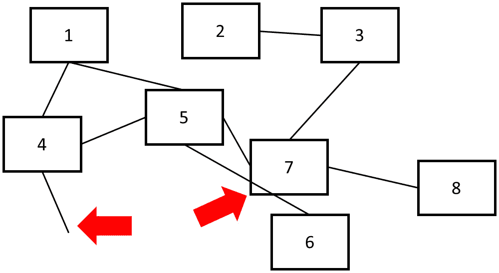

# 第十一章：未定义行为和性能

本章有双重重点。一方面，它解释了程序员在试图从他们的代码中挤取最佳性能时经常忽视的未定义行为的危险。另一方面，它解释了如何利用未定义行为来提高性能，以及如何正确地指定和记录这种情况。总的来说，与通常的“*任何事都可能发生*”相比，本章提供了一种更为不寻常但更相关的理解未定义行为的方式。

在本章中，我们将涵盖以下主题：

+   理解未定义行为及其存在的原因

+   理解未定义行为的真相与神话

+   哪些未定义行为是危险的，必须避免

+   如何利用未定义行为

+   学习未定义行为与效率之间的联系以及如何利用它

您将学会在（别人的）代码中遇到未定义行为时如何识别它，并了解未定义行为与性能的关系。本章还教会您如何通过有意允许未定义行为、记录它并在其周围设置保障措施来利用未定义行为。

# 技术要求

与以前一样，您将需要一个 C++编译器。在本章中，我们使用 GCC 和 Clang，但任何现代编译器都可以。本章附带的代码可以在[`github.com/PacktPublishing/The-Art-of-Writing-Efficient-Programs/tree/master/Chapter11`](https://github.com/PacktPublishing/The-Art-of-Writing-Efficient-Programs/tree/master/Chapter11)找到。您还需要一种方法来检查编译器生成的汇编代码。许多开发环境都有显示汇编代码的选项，GCC 和 Clang 可以将汇编代码写出而不是目标代码，调试器和其他工具可以从目标代码生成汇编代码（反汇编）；您可以根据个人喜好选择使用哪种工具。

# 什么是未定义行为？

`comp.std.c`的概念警告说，“当编译器遇到（未定义的结构）时，它可以合法地让恶魔从你的鼻子里飞出来。”在类似的情境中，还提到了发射核导弹和阉割你的猫（即使你没有猫）。本章的一个旁枝目标是揭开 UB 的神秘面纱：虽然最终目标是解释 UB 与性能之间的关系，并展示如何利用 UB，但在我们能理性地讨论这个概念之前，我们无法做到这一点。

首先，在 C++（或任何其他编程语言）的上下文中，什么是 UB？标准中有特定的地方使用了“行为未定义”或“程序不合法”的词语。标准进一步指出，如果行为未定义，标准对结果“不做要求”。相应的情况被称为 UB。例如，请参考以下代码：

```cpp
int f(int k) {
  return k + 10;
}
```

标准规定，如果加法导致整数溢出（即，如果`k`大于`INT_MAX-10`），则上述代码的结果是未定义的。

当提到 UB 时，讨论往往会朝着两个极端之一发展。我们刚刚看到的第一个。夸大的语言可能是出于对 UB 危险的警告，但它也是对理性解释的障碍。你的鼻子对于编译器的愤怒是相当安全的，你的猫也是如此。编译器最终会从你的程序生成一些代码，你将运行这些代码。它不会给你的计算机带来任何超能力：这个程序做的任何事情，你都可以有意地完成，例如，通过在汇编语言中手动编写相同的指令序列。如果你没有办法执行导致发射核导弹的机器指令，你的编译器也无法做到这一点，无论有没有 UB（当然，如果你正在编写导弹发射控制器，那就是完全不同的游戏了）。最重要的是，当你的程序行为是未定义的时候，根据标准，编译器可以生成你意料不到的代码，但这些代码不能做任何你已经做过的事情。

虽然夸大 UB 的危险是没有帮助的，但另一方面，有一种倾向于*推理*UB，这也是一种不幸的做法。例如，考虑这段代码：

```cpp
int k = 3;
k = k++ + k;
```

虽然 C++标准逐渐收紧了执行这种表达式的规则，但在 C++17 中，这个特定表达式的结果仍然是未定义的。许多程序员低估了这种情况的危险。他们说，“编译器要么首先评估 k++，要么首先评估 k + k。”为了解释为什么这是错误和危险的，我们首先必须在标准中分清一些细微之处。

C++标准有三个相关的并经常混淆的行为类别：`k++ + k`必须发生（这将是未指定的行为，这不是标准所说的）。标准规定整个程序是不良构造的，并且对其结果没有任何限制（但在你惊慌和担心你的鼻子之前，记住结果被限制为一些可执行代码）。

反驳常常是这样的，即使编译器在编译具有未定义行为的代码时会做些什么，它仍然必须以标准规定的方式处理代码的其余部分，所以（论点是）损害仅限于该特定行的可能结果之一。就像重视危险一样重要，理解为什么这个论点是错误的也很重要。编译器是在程序被定义良好的假设下编写的，并且在这种情况下只有在这种情况下才需要产生正确的结果。没有预设如果假设被违反会发生什么。描述这种情况的一种方式是说编译器不需要容忍未定义行为。让我们回到我们的第一个例子：

```cpp
int f(int k) {
  return k + 10;
}
```

由于程序对于足够大的`k`来导致整数溢出是不明确的，编译器允许假设这永远不会发生。如果发生了呢？如果你单独编译这个函数（在一个单独的编译单元中），编译器将生成一些代码，为所有`k <= INT_MAX-10`产生正确的结果。如果你的编译器和链接器没有整个程序的转换，相同的代码将*可能*对更大的`k`执行，并且结果将是在这种情况下你的硬件所做的任何事情。编译器可以插入对`k`的检查，但它可能不会这样做（尽管有一些编译器选项，它可能会这样做）。

如果函数是较大编译单元的一部分呢？这就是事情变得有趣的地方：编译器现在知道`f()`函数的输入参数是受限制的。这种知识可以用于优化。例如，参考以下代码：

```cpp
int g(int k) {
  if (k > INT_MAX-5) cout << "Large k" << endl;
  return f(k);
}
```

如果`f()`函数的定义对编译器可见，编译器可以推断打印永远不会发生：如果`k`足够大，以至于程序打印，那么整个程序就是不合法的，标准不要求它打印任何东西。如果`k`的值在定义行为的范围内，程序将永远不会打印任何东西。无论哪种方式，不打印任何东西都是标准允许的结果。请注意，仅因为您的编译器目前不执行此优化，并不意味着它永远不会：这种类型的优化在较新的编译器中变得更加激进。

那么我们的第二个例子呢？表达式`k++ + k`的结果对于任何`k`的值都是未定义的。编译器能做什么？再次记住：编译器不需要容忍未定义行为。这个程序能保持良好定义的唯一方式是这行代码永远不被执行。编译器可以假设这是情况，并进行推理：包含这段代码的函数从未被调用，任何必要的条件都必须成立，等等，最终可能得出整个程序永远不会被执行的结论。

如果你认为*真正的编译器不会做那种事情*，我有一个惊喜给你：

```cpp
int i = 1;
int main() {
   cout << "Before" << endl;
   while (i) {}
   cout << "After" << endl;
}
```

这个程序的自然期望是打印`Before`并永远挂起。使用 GCC（版本 9，优化 O3）编译时，它确实如此。使用 Clang（版本 13，也是 O3）编译时，它打印`Before`，然后打印`After`，然后立即终止而不会出现任何错误（它不崩溃，只是退出）。这两种结果都是有效的，因为遇到无限循环的程序的结果是未定义的（除非满足某些条件，这里都不适用）。

上面的例子非常有教育意义，可以帮助我们理解为什么我们会有未定义行为。在下一节中，我们将揭开面纱，解释未定义行为的原因。

# 为什么会有未定义行为？

从上一节中产生的明显问题是，为什么标准会有未定义行为？为什么它不为每种情况指定结果？一个稍微微妙的问题是，承认 C++被用于各种硬件，具有非常不同的属性，这是为什么标准不退而使用实现定义的行为，而不是将其留在未定义状态？

上一节的最后一个例子为我们提供了一个完美的演示工具，解释了为什么存在未定义行为。说法是无限循环是未定义的；另一种说法是标准不要求进入无限循环的程序产生特定的结果（标准比这更微妙，某些形式的无限循环会导致程序挂起，但这些细节目前并不重要）。要理解为什么规则存在，考虑以下代码：

```cpp
size_t n1 = 0, n2 = 0;
void f(size_t n) {
  for (size_t j = 0; j != n; j += 2) ++n1; 
  for (size_t j = 0; j != n; j += 2) ++n2;
}
```

这两个循环是相同的，所以我们要支付两次循环的开销（循环变量的增量和比较）。编译器显然应该通过将循环折叠在一起来进行以下优化：

```cpp
void f(size_t n) {
  for (size_t j = 0; j != n; j += 2) ++n1, ++n2;
}
```

但是，请注意，此转换仅在第一个循环终止时才有效；否则，`n2`的计数根本不应该被递增。在编译期间不可能知道循环是否终止 - 这取决于`n`的值。如果`n`是奇数，则循环将永远运行（与有符号整数溢出不同，递增无符号类型`size_t`超过其最大值是良定义的，并且该值将回滚到零）。通常情况下，编译器无法证明特定循环最终会终止（这是一个已知的 NP 完全问题）。决定假设每个循环最终都会终止，并允许否则无效的优化。因为这些优化可能使具有无限循环的程序无效，这样的循环被视为 UB，这意味着编译器不必保留具有无限循环的程序的行为。

为了避免过分简化问题，我们必须提到，并非 C++标准中定义的所有 UB 类型背后都有类似的推理。一些 UB 是因为语言必须在不同类型的硬件上得到支持，其中一些情况今天可以被认为是过时的。由于这是一本关于性能的书，我们将重点关注存在于效率原因或可用于改进某些优化的 UB 示例。

在接下来的部分中，我们将看到更多关于编译器如何利用 UB 来实现优化的示例。

# 未定义行为和 C++优化

在前一节中，我们刚刚看到一个例子，通过假设程序中的每个循环最终都会终止，编译器能够优化某些循环和包含这些循环的代码。优化器使用的基本逻辑始终相同：首先，我们假设程序不会出现 UB。然后，我们推断出必须满足的条件，以使这一假设成立，并假设这些条件确实总是成立。最后，任何在这些假设下有效的优化都可以进行。优化器生成的代码在违反这些假设时会执行*某些操作*，但我们无法知道它将执行什么操作（除了已经提到的限制，即仍然是同一台计算机执行某些指令的情况）。

标准中记录的几乎每种 UB 情况都可以转化为可能优化的示例（特定编译器是否利用这一点是另一回事）。我们现在将看到更多示例。

正如我们已经提到的，有符号整数溢出的结果是未定义的。编译器可以假设这种情况永远不会发生，并且通过正数递增有符号整数总是会得到更大的整数。编译器实际上执行了这种优化吗？让我们来看看。比较这两个函数，`f()`和`g()`：

```cpp
bool f(int i) { return i + 1 > i; }
bool g(int i) { return true; }
```

在良定义的行为范围内，这些函数是相同的。我们可以尝试对它们进行基准测试，以确定编译器是否优化了`f()`中的整个表达式，但是，正如我们在上一章中所看到的，有一种更可靠的方法。如果两个函数生成相同的机器代码，它们肯定是相同的。



图 11.1 - 由 GCC9 生成的 f()（左）和 g()（右）函数的 x86 汇编输出

在*图 11.1*中，我们可以看到，打开优化后，GCC 确实为这两个函数生成了相同的代码（Clang 也是如此）。汇编中出现的函数名称是所谓的 mangled names：由于 C++允许具有不同参数列表的函数具有相同的名称，因此必须为每个这样的函数生成唯一的名称。它通过将所有参数的类型编码到实际在目标代码中使用的名称中来实现。

如果您想验证此代码确实没有任何`?:`运算符的痕迹，最简单的方法是将`f()`函数与使用无符号整数进行相同计算的函数进行比较。参考以下代码：

```cpp
bool f(int i) { return i + 1 > i; }
bool h(unsigned int i) { return i + 1 > i; }
```

无符号整数的溢出是明确定义的，并且通常并非总是`i + 1`始终大于`i`。



图 11.2 - 由 GCC9 生成的 f()（左）和 h()（右）函数的 X86 汇编输出

`h()`函数生成不同的代码，即使您不熟悉 X86 汇编，也可以猜到`cmp`指令进行比较。在左边，函数`f()`将常量值`0x1`的值加载到用于返回结果的寄存器 EAX 中。

这个例子也展示了试图推断未定义行为或将其视为实现定义的危险：如果你说程序将对整数进行*某种加法*，如果溢出，特定的硬件将执行它的操作，那么你将非常错误。编译器可能会生成根本没有递增指令的代码。

现在，我们终于有足够的知识来完全阐明这个谜团，这个谜团的种子从书的一开始就播下了，在*第二章*中，*性能测量*。在那一章中，我们观察到了同一函数的两个几乎相同的实现之间出乎意料的性能差异。该函数的工作是逐个字符比较两个字符串，并在第一个字符串在字典顺序上更大时返回`true`。这是我们最简洁的实现：

```cpp
bool compare1(const char* s1, const char* s2) {
  if (s1 == s2) return false;
  for (unsigned int i1 = 0, i2 = 0;; ++i1, ++i2) {
    if (s1[i1] != s2[i2]) return s1[i1] > s2[i2];
  }
}
```

这个函数用于对字符串进行排序，因此基准测试测量了对特定输入字符串集进行排序所需的时间：



图 11.3 - 使用 compare1()函数进行字符串比较的排序基准

比较实现尽可能紧凑；在这段代码中没有多余的东西。然而，令人惊讶的结果是，这是代码的性能最差的版本之一。性能最佳的版本几乎相同：

```cpp
 bool compare2(const char* s1, const char* s2) {
  if (s1 == s2) return false;
  for (int i1 = 0, i2 = 0;; ++i1, ++i2) {
    if (s1[i1] != s2[i2]) return s1[i1] > s2[i2];
  }
}
```

唯一的区别是循环变量的类型：`compare1()`中是`unsigned int`，而`compare2()`中是`int`。由于索引永远不会是负数，这应该没有任何区别，但实际上有：



图 11.4 - 使用 compare2()函数进行字符串比较的排序基准

这种显著的性能差异的原因再次与未定义行为有关。要理解发生了什么，我们将不得不再次检查汇编代码。*图 11.5*显示了 GCC 为两个函数生成的代码（只显示了最相关的部分，即字符串比较循环）：



图 11.5 - 由 GCC 生成的 compare1()（左）和 compare2()（右）函数的 X86 汇编代码

代码看起来非常相似，只有一个例外：在右边（`compare2()`）可以看到`add`指令，用于将循环索引递增 1（编译器通过用一个循环变量替换两个循环变量来优化代码）。在左边，没有看起来像加法或递增的东西。相反，有`lea`指令，它代表加载和扩展地址，但在这里用于将索引变量递增 1（进行了相同的优化；只有一个循环变量）。

到目前为止，根据你学到的一切，你应该能够猜到编译器为什么必须生成不同的代码：尽管程序员期望索引永远不会溢出，但编译器通常不能做出这种假设。请注意，两个版本都使用 32 位整数，但代码是为 64 位机器生成的。如果 32 位有符号`int`溢出，结果是未定义的，所以在这种情况下，编译器确实假设溢出永远不会发生。如果操作没有溢出，`add`指令会产生正确的结果。对于`unsigned int`，编译器必须考虑溢出的可能性：递增`UINT_MAX`应该得到 0。结果表明，x86-64 上的`add`指令没有这些语义。相反，它扩展结果成为 64 位整数。在 X86 上进行 32 位无符号整数算术的最佳选项是`lea`指令；它可以完成任务，但速度要慢得多。

这个例子演示了通过从程序是良好定义的假设和 UB 永远不会发生的假设逆向推理，编译器可以实现非常有效的优化，最终使整个排序操作的速度提高了数倍。

现在我们了解了我们的代码中发生了什么，我们可以解释代码的其他版本的行为。首先，使用 64 位整数，有符号或无符号，将给我们与 32 位有符号整数相同的快速性能：在所有情况下，编译器都将使用`add`（对于 64 位无符号值，它确实具有正确的溢出语义）。其次，如果使用最大索引或字符串长度，编译器将推断索引不会溢出：

```cpp
bool compare1(const char* s1, const char* s2,
              unsigned int len) {
  if (s1 == s2) return false;
  for (unsigned int i1 = 0, i2 = 0; i1 < len; ++i1, ++i2) {
    if (s1[i1] != s2[i2]) return s1[i1] > s2[i2];
  }
  return false;
}
```

与长度的不必要比较使得这个版本比最佳变体稍慢。避免意外遇到这个问题的最可靠方法是始终使用有符号的循环变量或使用硬件本机的无符号整数（因此，除非确实需要，避免在 64 位处理器上进行`unsigned int`数学运算）。

我们可以使用标准中描述的几乎任何其他未定义行为的情况来构造类似的演示（尽管不能保证特定的编译器会利用可能的优化）。这里是另一个使用指针解引用的例子：

```cpp
int f(int* p) {
    ++(*p);
    return p ? *p : 0; // Optimized to: return *p
}
```

这是一个相当常见的情况的简化，程序员已经编写了指针检查来防止空指针，但并非在所有地方都这样做。如果输入参数是空指针，第二行（递增）就是 UB。这意味着整个程序的行为是未定义的，因此编译器可以假设它永远不会发生。对汇编代码的检查显示，的确，第三行的比较被消除了：



图 11.6 - 生成带有（左）和不带有（右）?:运算符的 f()函数的 X86 汇编

如果我们首先进行指针检查，情况也是一样的：

```cpp
int f(int* p) {
    if (p) ++(*p);
    return *p;
}
```

再次，对汇编代码的检查将显示指针比较被消除了，尽管到目前为止程序的行为是良好定义的。推理是相同的：如果指针`p`不是空的，比较是多余的，可以省略。如果`p`为空，程序的行为是未定义的，这意味着编译器可以做任何它想做的事情，它想要省略比较。最终结果是，无论`p`是否为空，比较都可以被消除。

在上一章中，当我们研究编译器优化时，我们花了大量时间分析了哪些优化是可能的，因为编译器可以证明它们是安全的。我们将重新讨论这个问题，因为首先，这对于理解编译器优化是绝对必要的，其次，它与 UB 有关。我们刚刚看到，当编译器从特定语句（例如从`return`语句推断出`p`不为空）推断出一些信息时，这些知识不仅用于优化后续代码，还用于优化前面的代码。传播这种知识的限制来自编译器能够确定的其他内容。为了证明这一点，让我们稍微修改前面的例子：

```cpp
extern void g();
int f(int* p) {
    if (p) g();
    return *p;
}
```

在这种情况下，编译器不会消除指针检查，这可以从生成的汇编代码中看出：



图 11.7 - 用于 f()函数的 X86 汇编代码（左）和不带指针检查的 X86 汇编代码（右）

`test`指令对空（零）进行比较，然后是条件跳转 - 这就是汇编中`if`语句的样子。

为什么编译器没有优化掉这个检查？要回答这个问题，你必须弄清楚在什么条件下，这种优化会改变程序的*良好定义*行为。

使优化无效需要以下两个条件：

+   首先，`g()`函数必须知道指针`p`是否为空。这是可能的：例如，`p`也可以由`f()`的调用者存储在全局变量中。

+   其次，如果`p`为空，`return`语句就不应该被执行。这也是可能的：如果`p`为空，`g()`可能会抛出异常。

对于我们最后一个与 UB 密切相关的 C++优化示例，我们将看一些非常不同的东西：`const`关键字对优化的影响。同样，这将教会我们为什么编译器不能优化某些代码，就像成功的优化一样。我们将从我们之前看到的代码片段开始：

```cpp
bool f(int x) { return x + 1 > x; }
```

优化编译器将会消除这个函数中的所有代码，并用`return true`替换它。现在我们将让函数做更多的工作：

```cpp
void g(int y);
bool f(int x) {
  int y = x + 1;
  g(y);
  return y > x;
}
```

当然，同样的优化是可能的，因为代码可以重写如下：

```cpp
void g(int y);
bool f(int x) {
  g(x + 1);
  return x + 1 > x;
}
```

调用`g()`必须进行，但函数仍然返回`true`：比较不能产生其他结果，否则会陷入未定义的行为。再次强调，大多数编译器都会进行这种优化。我们可以通过比较从原始代码生成的汇编和从完全手动优化的代码生成的汇编来确认这一点：

```cpp
void g(int y);
bool f(int x) {
  g(x + 1);
  return true;
}
```

优化之所以可能是因为`g()`函数不会改变其参数。在同样的代码中，如果`g()`通过引用获取参数，那么这种优化就不再可能：

```cpp
void g(int& y);
bool f(int x) {
  int y = x + 1;
  g(y);
  return y > x;
}
```

现在`g()`函数可能会改变`y`的值，因此每次都必须进行比较。如果函数`g()`的意图不是改变其参数，当然我们可以通过值传递参数（正如我们已经看到的）。另一个选择是通过`const`引用传递；虽然对于小类型（如整数）没有必要这样做，但模板代码通常会生成这样的函数。在这种情况下，我们的代码如下：

```cpp
void g(const int& y);
bool f(int x) {
    int y = x + 1;
    g(y);
    return y > x;
}
```

快速检查汇编程序显示`return`语句没有被优化：它仍然进行比较。当然，某个特定编译器不执行某个优化并不能证明什么：没有优化器是完美的。但在这种情况下，是有原因的。尽管代码中这样写，但 C++标准并不保证`g()`函数不会改变其参数！以下是一个完全符合标准的实现，阐明了这个问题：

```cpp
void g(const int& y) { ++const_cast<int&>(y); }
bool f(int x) {
    int y = x + 1;
    g(y);
    return y > x;
}
```

是的，函数允许去除`const`。结果是明确定义的，并且在标准中有规定（这并不意味着这是*好*的代码，只是有效的）。然而，有一个例外：从在其创建时被声明为`const`的对象中去除`const`是未定义行为。为了说明，这是明确定义的（但不建议）：

```cpp
int x = 0;
const int& y = x;
const_cast<int&>(y) = 1;
```

这是未定义行为：

```cpp
const int x = 0;
const int& y = x;
const_cast<int&>(y) = 1;
```

我们可以尝试利用这一点，通过将中间变量`y`声明为`const`：

```cpp
void g(const int& y);
bool f(int x) {
    const int y = x + 1;
    g(y);
    return y > x;
}
```

现在编译器可以假定该函数总是返回`true`：改变这一点的唯一方法是调用未定义行为，而编译器并不需要容忍未定义行为。在撰写本书时，我们并不知道有任何编译器实际上进行了这种优化。

有了这个想法，关于使用`const`来促进优化，可以推荐什么？

+   如果一个值不会改变，将其声明为`const`。虽然正确性是主要的好处，但这确实可以实现一些优化，特别是当编译器可以通过在编译时评估表达式来传播`const`时。

+   为了优化，如果值在编译时已知，声明为`constexpr`。

+   通过`const`引用传递参数对于优化几乎没有什么作用，因为编译器必须假设函数可能会去除`const`（如果函数是内联的，编译器知道发生了什么，但参数的声明方式就不重要了）。另一方面，这是您可以将`const`对象传递给函数的唯一方式，因此，尽可能声明引用为`const`（更重要的结果是意图的清晰度）。

+   对于小类型，按值传递可能比按引用传递更有效（这不适用于内联函数）。这很难与模板生成的通用函数协调一致（不要假设模板总是内联的；大型模板函数通常不是）。有办法强制对特定类型进行按值传递，但这会使您的模板代码变得更加繁琐。不要从编写这样的代码开始；只有在测量表明对于特定代码片段来说，这种努力是合理的时候才这样做。

我们已经详细探讨了 C++中未定义行为如何影响 C++代码的优化。现在是时候扭转局面，学习如何利用未定义行为来优化您自己的程序。

# 利用未定义行为进行高效设计

在本节中，我们将讨论未定义行为，不是作为标准规定并适用于 C++，而是作为您，程序员，规定并适用于您的软件。为了达到这个目的，首先从不同的角度考虑未定义行为是有帮助的。

到目前为止，我们所见过的所有未定义行为示例可以分为两种。第一种是诸如`++k + k`之类的代码。这些是错误，因为这样的代码根本没有定义的行为。第二种是诸如`k + 1`之类的代码，其中`k`是有符号整数。这种代码随处可见，大多数情况下都能正常工作。它的行为是明确定义的，除了某些变量值。

换句话说，代码具有隐含的前提条件：只要这些前提条件得到满足，程序就会表现良好。请注意，在程序的更大上下文中，这些前提条件可能是隐含的，也可能不是：程序可能会验证输入或中间结果，并防范会导致未定义行为的值。无论哪种方式，程序员都与用户定义了一个合同：如果输入遵守某些限制，结果就保证是正确的；换句话说，程序的行为是明确定义的。

当违反限制时会发生什么？

有以下两种可能性：

+   首先，程序可能会检测到输入违反了合同并处理错误。这种行为仍然是明确定义的，并且是规范的一部分。

+   其次，程序可能无法检测到合同被违反，并像通常一样继续进行。由于合同对于保证正确结果至关重要，程序现在在未知领域操作，通常情况下无法预测会发生什么。

我们刚刚描述了 UB。

现在我们明白了 UB 只是程序在规定合同之外运行的行为，让我们想想它如何适用于我们的软件。

大多数足够复杂的程序都对其输入有前提条件，与用户有合同。有人可能会认为这些前提条件应该始终被检查并报告任何错误。然而，这可能是一个非常昂贵的要求。再次，让我们考虑一个例子。

我们想编写一个程序，扫描在纸上绘制的图像（或蚀刻在印刷电路板上），并将其转换为图形数据结构。程序的输入可能如下所示：



图 11.8 - 图形绘制是图形构建程序的输入

该程序获取图像，识别矩形，从每个矩形创建图节点，识别线条，对于每条线条找出它连接的两个矩形，并在图中创建相应的边。

假设我们有一个图像获取和分析库，可以为我们提供一组形状（矩形和线条）及其所有坐标。现在我们所要做的就是弄清楚哪些线连接哪些矩形。我们已经有了所有坐标，所以从现在开始就是纯几何。表示这个图形的最简单方法之一是作为边的表格。我们可以使用任何容器（比如说，一个向量）来存储表格，如果我们为每个节点分配一个唯一的数字 ID，那么一条边就是一对数字。我们可以使用任意数量的计算几何算法来检测线条和矩形之间的交点，并构建这个表格（以及图形本身）一条边一条边地。

听起来足够简单，我们有一个自然的数据表示，相当紧凑且易于处理。不幸的是，我们还与用户有一个隐含的合同：我们要求每条线都恰好与两个矩形相交（还有，矩形之间不相交，但一次只处理一个混乱）。



图 11.9 - 图形识别程序的无效输入

在*图 11.9*中，我们看到了一个违反合同的输入示例：一条线连接了三个矩形，而另一条线只接触了一个。正如我们之前讨论的，我们有两个选择：我们可以检测并报告输入错误，或者我们可以忽略它们。第一种选择使我们的程序更加健壮，但带来了显著的性能损失：我们的原始程序在找到第二个连接到给定边的矩形后可能会停止寻找，并且从那时起忽略该边。这种优化的收益是相当可观的：对于一个看起来像*图 11.8*的图形（但规模更大），它可能将运行时间减少一半。强制执行输入验证会浪费大量时间，如果输入最终是正确的，会让用户感到沮丧，因为他们有其他方法来确保输入是有效的。不验证输入会导致 UB：如果我们有一条线连接了三个矩形，算法将在找到前两个矩形后停止（并且这个顺序可能依赖于数据，所以你真正能说的是，边将在涉及的两个节点之间创建）。

如果性能差异微不足道（或者总运行时间如此之短，使其加倍无关紧要），最佳解决方案将是明显的：验证输入。但在这种情况下以及许多其他情况下，验证很容易与找到解决方案一样昂贵。在这种情况下应该怎么办？

首先，我们必须明确用户所承担的契约。我们应该清楚地指定和记录什么构成有效输入。之后，对于性能关键的程序，最佳实践是提供最佳性能。更广泛的契约（对限制较少的那种）总是比较窄的契约更好，因此，如果有一些无效输入，我们可以轻松检测并以最小的开销处理，那就应该这样做。除此之外，我们所能做的就是记录程序行为未定义的条件，就像 C++标准中所做的那样。

我们可以做一些额外的努力：我们可以为用户提供一个输入验证工具，可以作为程序中的可选步骤或作为一个独立的软件。运行它会花费时间，但如果用户从主程序中获得奇怪的结果，他们可以检查确保输入是有效的。这比简单地描述行为何时未定义要好得多（然而，有些情况下，这种验证成本太高而不切实际）。

C++编译器开发人员是否可以为我们程序员做出同样的额外努力，并为我们提供一个可选工具来检测代码中的 UB，这不是很好吗？事实证明，开发人员也这样认为：如今许多编译器都有启用 UB sanitizer（通常称为**UBSan**）的选项。它的工作原理如下。让我们从一些可能导致 UB 的代码开始：

```cpp
int g(int k) {
    return k + 10;
}
```

编写一个调用此函数的程序，参数足够大（大于`INT_MAX-10`），并启用 UBSan 编译。对于 Clang 或 GCC，选项是`-fsanitize=undefined`。以下是一个例子：

```cpp
clang++ --std=c++17 –O3 –fsanitize=undefined ub.C
```

运行程序，你会看到类似以下的内容：

```cpp
ub.C:10:20: runtime error: signed integer overflow: 
        2147483645 + 10 cannot be represented in type 'int'
```

就像我们的图表示例一样，UB 检测需要时间并使程序变慢，因此这是你在测试和调试中应该做的事情。将经过消毒处理的运行作为常规回归测试的一部分，并且要认真对待报告的错误：仅仅因为你的程序今天产生了正确的结果，并不意味着下一个编译器不会生成一些非常不同的代码并改变结果。

我们已经了解了 UB，为什么它有时是一个必要的恶，并且如何利用它来提高性能。在翻页之前，让我们回顾一下我们学到的内容。

# 总结

我们有一个专门讨论 C++中 UB 的整章，为什么呢？因为这个主题与性能密切相关。

首先，要理解当程序接收到超出规定程序行为的契约的输入时，就会发生 UB。此外，规范还表示程序不需要检测此类输入并发出诊断。这适用于 C++标准定义的 UB 以及您自己程序中的 UB。

接下来，规范（或标准）未涵盖所有可能的输入并定义结果的原因主要与性能有关：当需要可靠地产生特定结果时，引入 UB 通常会非常昂贵。对于 C++中的 UB，处理器和内存架构的多样性也导致了难以统一处理的情况。在没有可行的方法来保证特定结果的情况下，标准将结果留空。

最后，程序不需要至少检测，如果不处理无效输入的原因是，这样的检测可能也非常昂贵：有时确认输入有效比计算结果花费的时间更长。

在设计软件时，你应该牢记这些考虑因素：始终希望有一个广泛的合同，为任何或几乎任何输入定义结果。但这样做可能会给只提供典型或“正常”输入的用户带来性能开销。当用户面临更快地执行所需任务和可靠地执行用户根本不想解决的任务之间的选择时，大多数用户会选择性能。作为一种妥协，你可以为用户提供一种验证输入的方式；如果这种验证是昂贵的，它应该是可选的。

当涉及到 C++标准规定的 UB 时，情况就变了，你成了用户。重要的是要理解，如果程序包含具有 UB 的代码，整个程序就是不明确定义的，不仅仅是问题中的一行代码。这是因为编译器可以假设在运行时永远不会发生 UB，并从此进行推理，以对代码进行相应的优化。现代编译器在某种程度上都这样做，未来的编译器只会更加积极地进行推理。

最后，许多编译器开发者还提供可以在运行时检测未定义行为的验证工具 - UB 消毒剂。就像你自己程序的输入验证器一样，这些工具需要时间运行，这就是为什么消毒剂是一个可选工具。你应该在软件测试和开发过程中利用它。

我们几乎到了书的结尾；在下一章，也就是最后一章中，我们将以考虑设计软件的含义和教训的眼光回顾我们所学到的一切。

# 问题

1.  什么是未定义行为？

1.  为什么我们不能为程序可能遇到的任何情况定义结果？

1.  如果我编写了标准标记为 UB 的代码，测试结果，并验证代码有效，我没问题，对吗？

1.  为什么我要故意设计一个具有记录的未定义行为的程序？
