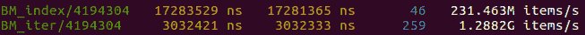
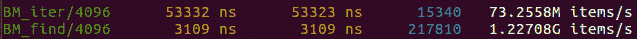

# 第十二章：性能设计

本章回顾了本书中学到的所有与性能相关的因素和特性，并探讨了我们所获得的知识和理解如何影响我们在开发新软件系统或重新架构现有系统时所做的设计决策。我们将看到设计决策如何影响软件系统的性能，学习如何在没有详细数据的情况下做出与性能相关的设计决策，以及审查设计 API、并发数据结构和高性能数据结构的最佳实践，以避免低效。我们将探讨以下主题：

+   设计与性能的相互作用

+   性能设计

+   API 设计考虑

+   针对最佳数据访问进行设计

+   性能权衡

+   做出知情的设计决策

你将学习如何将良好的性能作为设计目标之一，并如何设计高性能软件系统，以确保高效的实现不会成为对程序基本架构的挑战。

# 技术要求

你将需要一个 C++编译器和一个微基准测试工具，比如我们在上一章中使用的 Google Benchmark 库（可在[`github.com/google/benchmark`](https://github.com/google/benchmark)找到）。本章附带的代码可以在[`github.com/PacktPublishing/The-Art-of-Writing-Efficient-Programs/tree/master/Chapter12`](https://github.com/PacktPublishing/The-Art-of-Writing-Efficient-Programs/tree/master/Chapter12)找到。

# 设计与性能的相互作用

良好的设计是否有助于实现良好的性能，还是偶尔需要妥协最佳设计实践以实现最佳性能？这些问题在编程社区中争论不休。通常，设计传道者会认为，如果你认为你需要在良好的设计和良好的性能之间做出选择，那么你的设计还不够好。另一方面，黑客（我们在这里使用这个术语是指传统意义上的，即拼凑解决方案的程序员，与犯罪无关）经常将设计准则视为对最佳优化的限制。

本章的目的是要表明这两种观点在一定程度上都是有效的。但如果将它们视为“全部真相”，那也是错误的。否认许多设计实践在应用于特定软件系统时可能会限制性能是不诚实的。另一方面，许多实现和维护高效代码的指导方针也是可靠的设计建议，可以改善性能和设计质量。

我们对设计和性能之间的紧张关系持更加细致的观点。对于特定系统（你最感兴趣的是*你的*系统，你现在正在*工作*的那个系统），一些设计准则和实践确实可能导致低效和性能不佳。我们很难找到一个设计规则总是与效率相对立的例子，但对于特定系统，也许在某些特定情境下，这些规则和实践是相当普遍的。如果你采用了遵循这些规则的设计，你可能会将低效嵌入到软件系统的核心架构中，而要通过“优化”来纠正将会非常困难，除非对程序的关键部分进行全面重写。任何否认或淡化这种潜在严重性的人都不是为你着想。另一方面，任何声称这正好证明了放弃可靠的设计实践的人都是在提出错误、过于简化的选择。

如果你意识到某种设计方法遵循了良好的实践，提高了清晰度和可维护性，但降低了性能，正确的反应是选择另一种同样良好的设计方法。换句话说，虽然发现一些良好的设计会导致性能不佳是很常见的，但对于给定的软件系统来说，几乎不可能每种良好的设计都会导致低效。你需要做的就是从几种可能的高质量设计中选择一个也能实现良好性能的设计。

当然，这说起来容易做起来难，但希望这本书能够帮助你。在本章的其余部分，我们将专注于问题的两个方面。首先，当性能成为一个问题时，建议采用哪些设计实践？其次，当我们没有可以运行和测量的程序，而只有（可能不完整的）设计时，我们如何评估可能的性能影响？

如果你仔细阅读了最后两段，你会发现性能是一个设计考虑因素：就像我们在设计中考虑到"支持多用户"或"在磁盘上存储几千兆字节的数据"等需求一样，性能目标也是需求的一部分，应该在设计阶段明确考虑。这将引导我们到设计高性能系统的关键概念，即...

# 为性能而设计

正如我们所说，性能是设计目标之一，与其他约束和要求同等重要。因此，对于"这种设计导致性能不佳"的问题，答案与如果问题是"这种设计没有提供我们需要的功能"是一样的。在这两种情况下，我们需要不同的设计，而不是更糟糕的设计。我们只是更习惯于根据设计的功能而不是速度来评估设计。

为了帮助你在第一次尝试时选择促进性能的设计实践，我们现在将介绍几条专门针对良好性能的设计指导原则。它们也是坚实的设计原则，有很好的理由去接受它们：遵循这些指导原则不会使你的设计变得更糟。

前两条指导原则涉及设计中不同组件（函数、类、模块、进程、任何组件）的交互。首先，我们建议这些交互传递的信息尽可能少，整个系统仍然能够正常运行。其次，我们建议不同的组件向彼此提供关于交互预期结果的尽可能多的信息。如果你认为这是一个矛盾，你是完全正确的。设计往往是解决矛盾的艺术，你要做的是：这两种矛盾的陈述都是正确的，只是不是在同一时间或同一地点。接下来的内容将很好地说明了这一（更一般的）管理设计中矛盾的技术。

## 最小信息原则

让我们从第一个指导原则开始：尽可能少地传递信息。这里上下文非常重要：具体来说，我们建议一个组件尽可能少地透露关于如何处理特定请求的信息。组件之间的交互受合同约束。当我们谈论类和函数的接口时，我们习惯于这个想法，但它是一个更广泛的概念。例如，用于两个进程之间通信的协议就是一个合同。

在任何这样的接口或交互中，做出并实现承诺的一方不得主动提供任何额外信息。让我们看一些具体的例子。我们将从实现基本队列的类开始，并问自己，从效率的角度来看，什么样的接口是良好的？

其中一个方法允许我们检查队列是否为空。请注意，调用者并没有询问队列有多少元素，只是询问它是否为空。虽然队列的一些实现可能会缓存大小并将其与零进行比较来解决这个请求，但对于其他实现来说，确定队列是否为空可能比计算元素更有效。合同说，“如果队列为空，我将返回 true。”即使你认为你知道大小，也不要做出任何额外的承诺：不要自愿提供任何未被请求的信息。这样，你就可以自由地更改你的实现。

同样，入队和出队的方法应该只保证一个新元素被添加到队列中或从队列中移除。对于从队列中弹出一个元素，我们必须处理空队列的情况，或者声明这样的尝试的结果是未定义的（STL 选择的方法）。你可能注意到，到目前为止，STL 队列展现出了一个优秀的接口，从效率的角度来看：它满足了队列数据结构的合同，而没有透露任何不必要的细节。特别是，`std::queue`是一个适配器，可以在几种容器之上实现。队列可以作为向量、双端队列或列表实现的事实告诉我们，接口正在很好地隐藏实现的细节。

作为接口泄露太多实现信息的相反例子，考虑另一个 STL 容器，无序集合（或映射）。`std::unordered_set`容器具有一个接口，允许我们插入新元素并检查给定值是否已经在集合中（到目前为止，一切都很好）。根据定义，它缺乏元素的内部顺序，并且标准提供的性能保证清楚地表明数据结构使用了哈希。因此，明确涉及哈希的接口部分不能被视为多余的：特别是需要指定一个用户给定的哈希函数。但接口进一步提供了诸如`bucket_count()`之类的方法，暴露了底层实现*必须*是一个用于解决哈希冲突的分离链接哈希表的桶。因此，不可能使用开放寻址哈希表来创建一个完全符合 STL 的无序集合。这个接口限制了实现，可能会阻止你使用更有效的实现。

在我们用类设计简单示例时，同样的原则可以应用于更大模块的 API、客户端-服务器协议以及系统组件之间的其他交互：*在设计响应请求或提供服务的组件时，提供简洁的合同，只透露请求者所需的信息，而不透露其他信息*。

揭示最少信息或最少承诺的设计准则本质上是类接口的一个流行准则的概括：接口不应该透露实现。此外，要考虑到，纠正这一准则的违反将会非常困难：如果你的设计泄漏了实现细节，客户端将依赖于它们，并且一旦你改变了实现，就会出现问题。因此，到目前为止，为性能而设计与一般的良好设计实践是一致的。在下一个准则中，我们开始暴露不同设计目标之间的紧张关系以及相应的最佳实践。

## 最大信息原则

虽然满足请求的组件应该避免不必要地透露可能限制实现的任何内容，但对于发出请求的组件来说情况正好相反。请求者或调用者应该能够提供关于需要的具体信息。当然，只有在有适当的接口时，调用者才能提供这些信息，因此我们真正要说的是接口应该被设计成允许这样的“完整”请求。

特别是，为了提供最佳性能，了解请求背后的意图通常很重要。再举一个例子应该更容易理解这个概念。

让我们从一个随机访问序列容器开始。随机访问意味着我们可以访问容器的任意第 i 个元素，而不需要访问任何其他元素。通常的做法是使用索引运算符：

```cpp
T& operator[](size_t i) { return … i-th element …; }
```

使用这个运算符，我们可以，例如，遍历容器：

```cpp
container<T> cont;
… add some data to cont …
for (size_t i = 0; i != cont.size(); ++i) {
  T& element_i = cont[i];
  … do some work on the i-th element …
}
```

从效率的角度来看，这并不是最佳方式：我们使用随机访问迭代器进行顺序迭代。通常，当你使用更强大或更有能力的接口，但只利用其能力的一小部分时，你应该关注效率：这个接口的额外灵活性可能是以一些性能为代价的，如果你不使用这些功能，你就在浪费。

我们不必走得太远来举例。让我们考虑`std :: deque`：它是一个支持随机访问的块分配容器。为了访问任意元素`i`，我们必须首先计算包含该元素的块（通常是模运算）和块内元素的索引，然后在辅助数据结构（块指针表）中找到块的地址并索引到块内。即使在大多数情况下，元素将驻留在同一个块中，我们已经知道它的地址，这个过程也必须重复进行下一个元素。这是因为对任意元素的请求没有足够的信息：没有办法表达我们很快会要求下一个元素。因此，deque 无法以最有效的方式处理遍历。

扫描整个容器的另一种方法是使用迭代器接口：

```cpp
for (auto it = cont.begin(); it != cont.end(); ++it) {
  T& element = *it;
  … do some work on the element …
}
```

deque 的实现者可以假设增加（或减少）迭代器是一个经常执行的操作。因此，如果你有一个迭代器`it`并访问相应的元素`*it`，很可能你会要求下一个元素。deque 迭代器可以存储块指针或块指针表中正确条目的索引，这将使得在一个块内访问所有元素更加便宜。通过简单的基准测试，我们可以验证确实使用迭代器遍历 deque 比使用索引要快得多：

```cpp
void BM_index(benchmark::State& state) {
     const unsigned int N = state.range(0);
     std::deque<unsigned long> d(N);
     for (auto _ : state) {
           for (size_t i = 0; i < N; ++i) {
                 benchmark::DoNotOptimize(d[i]);
           }
           benchmark::ClobberMemory();
     }
     state.SetItemsProcessed(N*state.iterations());
}
void BM_iter(benchmark::State& state) {
     const unsigned int N = state.range(0);
     std::deque<unsigned long> d(N);
     for (auto _ : state) {
           for (auto it = d.cbegin(), it0 = d.cend(); 
                  it != it0; ++it) {
                 benchmark::DoNotOptimize(*it);
           }
           benchmark::ClobberMemory();
     }
     state.SetItemsProcessed(N*state.iterations());
}
```

结果显示了非常显著的性能差异：



图 12.1 - 使用索引与迭代器遍历 std :: deque

非常重要的一点是要指出设计性能和优化性能之间的关键区别。不能保证迭代器访问 deque 更快：特定的实现实际上可能使用索引运算符来实现迭代器。这样的保证只能来自优化的实现。在本章中，我们对设计感兴趣。设计实际上不能真正被“优化”，尽管，如果你谈论一个“高效的设计”，其他人可能会理解你的意思。设计可以允许或阻止某些优化，因此更准确地谈论“性能敌意”和“性能友好”设计（后者通常被称为高效设计）。

在我们的 deque 示例中，索引操作符接口对于随机访问来说是尽可能高效的，并且将顺序迭代视为随机访问的一种特殊情况。调用者无法说，“我可能会要求下一个相邻的元素。”相反，从迭代器的存在中，我们可以推断出它可能会被递增或递减。实现可以使这个增量操作更有效。

让我们进一步考虑我们的容器示例。这一次，我们考虑一个自定义容器，它基本上像一棵树一样运作，但与`std::set`不同的是，我们不在树节点中存储值。相反，我们将值存储在序列容器（数据存储）中，而树节点包含对该容器元素的指针。树本质上是数据存储的索引，因此它需要一个自定义比较函数：我们想要比较值，而不是指针。

```cpp
template<typename T> struct compare_ptr {
  bool operator()(const T* a, const T* b) const {
     return *a < *b;
  }
};
template <typename T> class index_tree {
  public:
  void insert(const T& t) { 
     data_.push_back(t);
     idx_.insert(&(data_[data_.size() - 1]));
  }
  private:
  std::set<T*, compare_ptr<T>> idx_;
  std::vector<T> data_;
};
```

当插入新元素时，它被添加到数据存储的末尾，而指针被添加到索引的适当位置，由元素的比较来确定。为什么我们会选择这样的实现而不是`std::set`？在某些情况下，我们可能有要求迫使我们这样做：例如，数据存储可能是磁盘上的内存映射文件。在其他情况下，尽管乍一看，额外的内存使用和通过指针间接访问元素可能会降低性能，但我们可能会选择这种实现以获得性能优势。

为了看到这个索引树容器的性能优势，让我们来检查一下执行搜索满足给定谓词的元素的操作。假设我们的容器提供了迭代器，这样搜索就很容易进行；解引用操作符应该返回索引元素，而不是指针：

```cpp
template <typename T> class index_tree {
  using idx_t = typename std::set<T*, compare_ptr<T>>;
  using idx_iter_t = typename idx_t::const_iterator;
  public:
  class const_iterator {
     idx_iter_t it_;
     public:
     const_iterator(idx_iter_t it) : it_(it) {}
     const_iterator operator++() { ++it_; return *this; }
     const T& operator*() const { return *(*it_); }
     friend bool operator!=(const const_iterator& a,
                            const const_iterator& b) {
        return a.it_ != b.it_;
     }
  };
  const_iterator cbegin() const { return idx_.cbegin(); }
  const_iterator cend() const { return idx_.cend(); }
  …
};
```

为了确定容器中是否存储了满足某些要求的值，我们可以简单地遍历整个容器，并为每个值检查谓词：

```cpp
template <typename C, typename F> bool find(const C& c, F f) {
  for (auto it = c.cbegin(), i0 = c.cend(); it != i0; ++it) {
     if (f(*it)) return true;
  }
  return false;
}
```

当我们使用迭代器访问容器时，我们向容器提供了哪些信息，就像刚才做的那样？和以前一样，我们告诉它我们打算每次访问下一个元素。我们没有告诉它我们这样做的原因。意图重要吗？在这种情况下，非常重要。仔细看看我们真正需要做的事情：我们需要访问容器中的每个元素，直到找到满足给定条件的元素。如果这似乎是在重复同样的事情，那么你还不够迂腐。在这个需求陈述中，我们从未说过我们想要按顺序访问容器元素，只是我们需要遍历所有元素。如果我们有一个 API 调用，告诉容器检查所有元素，但不需要任何特定顺序，那么容器的实现将可以优化访问顺序。对于我们的索引容器，最佳访问顺序是遍历数据存储向量本身：这提供了最佳的内存访问模式（顺序访问）。在我们的情况下，存储中元素的实际顺序是它们被添加的顺序，但这并不重要：我们要求返回的只是一个布尔值；我们甚至不问匹配元素位于何处。换句话说，虽然可能有多个满足条件的元素，但调用者想知道是否至少存在一个这样的元素。我们没有要求元素的值或任何特定的元素：这是“找到任何一个”的请求，而不是“找到第一个”。

以下是允许调用者提供所有相关信息和可能的实现的接口版本：

```cpp
template <typename T> class index_tree {
  …
  template <typename F> bool find(F f) const {
     for (const T& x : data_) {
        if (f(x)) return true;
     }
     return false;
  }
};
```

它更快吗？再次，基准测试可以回答。如果值未找到或很少找到，则差异更加显著：



图 12.2 - 使用迭代器和 find()成员函数在索引数据存储中进行搜索

再次强调，重要的是退一步，重新评估这个例子作为软件设计的教训，而不是特定的优化技术。在这种情况下，在设计阶段重要的不是我们的`find()`成员函数比基于迭代器的搜索快多少。重要的是在适当的实现下它可能会更快。它可能更快的原因是调用者意图的了解。

比较调用者使用非成员和成员`find()`时提供的信息。当非成员`find()`函数调用容器接口时，我们告诉容器，“让我看到所有容器元素的值，一个接一个地，按顺序。”实际上我们并不需要大部分这些信息，但这是我们通过迭代器接口传递的唯一信息。另一方面，成员`find()`允许我们提出以下请求：“以任何顺序检查所有元素，并告诉我是否至少有一个与这个条件匹配。”这个请求施加了更少的限制：这是一个高级请求，将细节留给容器本身。在我们的例子中，实现者利用了这种自由来提供更好的性能。

在设计阶段，您可能不知道这样优化的实现是可能的。成员`find()`的第一个实现可能会运行迭代器循环或调用`std::find_if`。您可能永远也不会优化这个函数，因为在您的应用程序中，它很少被调用，也不是性能瓶颈。但软件系统往往比您预期的寿命更长，基本的重新设计是困难且耗时的。一个良好的系统架构不应该限制系统的演变，有时可能会持续数年，甚至几十年，即使添加了新功能并且性能要求发生变化。

再次，我们看到了友好性能和敌对性能设计之间的差异。同样的原则当然也适用于系统组件之间的交互，并不仅限于类：*在设计响应请求或提供服务的组件时，允许请求者提供所有相关信息，特别是表达请求背后的意图。*

这是一个更有争议的准则，有几个原因。首先，它明确违反了类设计的流行方法：不要为不需要特权访问并且可以完全通过现有公共 API 实现的任务实现（公共）成员函数。我们可以从几个方面来推理。首先，有人可能会说，“可以实现十倍慢”并不真正符合“可以实现”，因此该准则不适用。反驳的观点是，在设计阶段，您甚至可能不知道您需要这种性能。我们可能违反的另一个重要规则是“不要过早优化”，尽管这个规则不应该被简单地理解：特别是，这个规则的合理支持者经常会补充说，“但也不要过早悲观”。在设计的背景下，后者意味着做出削减未来优化机会的设计决策。

因此，使用最大信息原则（或信息丰富接口）是一种平衡和明智判断的问题。请考虑，一般来说，违反这一指导方针并不像不遵循前一条规则那样有害：如果你的接口或合同暴露了不必要的信息，很难从所有依赖它的客户那里收回。另一方面，如果你的接口不允许客户端提供相关意图信息，客户端可能会被迫使用低效的实现。但在以后添加更丰富信息的接口后，没有什么会出错，客户端可以根据需要过渡到这个接口。

关于是否在一开始提供更丰富的信息界面的决定，取决于几个因素：

+   这个组件或组件之间的交互是否可能成为性能关键因素？虽然猜测特定代码的性能是不鼓励的，但通常你知道相关组件的一般要求：每秒访问数百万次的数据库很可能在某个地方成为性能瓶颈，而为每月发放工资的员工地址服务的系统可以保守设计，并在需要时进行优化。

+   这个设计决定的影响有多大？特别是，如果低效的实现蔓延开来，当我们添加新的高级接口时，它会有多根深蒂固？一个只使用一两次的类可以很容易地与其客户端一起更新；一个将成为整个系统标准并将在 restful API 中使用的通信协议，可以在开始时就内置可扩展性，包括未来信息丰富请求的选项。

通常，这些选择并不是明确的，而是依赖于设计师的直觉和知识经验。这本书可以帮助前者，而实践则照顾后者。

正如你在本节中看到的那样，当考虑不同设计决策的性能影响时，我们经常关注接口和数据组织。在接下来的两节中，我们将专门讨论这两个主题，首先是接口设计。

# API 设计考虑

有许多书籍和文章介绍了 API 设计的最佳实践。它们通常侧重于可用性、清晰度和灵活性。常见的指导方针，如“使接口清晰易于正确使用”和“使滥用接口变得困难”，虽然不直接涉及性能，但也不会干扰促进良好性能和效率的实践。在前一节中，我们已经讨论了设计性能接口时应记住的两个重要指导方针。在本节中，我们将探讨一些更具体的指导方针，专门针对性能。许多高性能程序依赖并发执行，因此首先应考虑并发设计。

## 并发 API 设计

设计并发组件及其接口的最重要规则是提供清晰的线程安全保证。注意，“清晰”并不意味着“强大”：事实上，为了获得最佳性能，通常最好在低级接口上提供较弱的保证。STL 选择的方法是一个很好的示范：所有可能改变对象状态的方法都提供弱保证：只要一个线程在任何时候使用容器，程序就是定义良好的。

如果您想要更强的保证，可以在应用程序级别使用锁。一个更好的做法是创建自己的锁定类，为您想要的接口提供强有力的保证。有时，这些类只是锁定装饰器：它们在锁中包装被装饰对象的每个成员函数。更常见的情况是，有多个操作必须由单个锁保护。

为什么？因为允许客户端在“一半”操作完成后看到特定的数据结构是没有意义的。这带我们得出一个更一般的观察：作为规则，线程安全的接口也应该是事务性的。组件（类、服务器、数据库等）的状态在进行 API 调用之前和之后应该是有效的。接口合同承诺的所有不变量都应该得到维护。在执行请求的成员函数（对于类）期间，对象很可能经历了一个或多个状态，这些状态在客户端看来不被视为有效：它不维护指定的不变量。接口应该使另一个线程不可能观察到对象处于这种无效状态。让我们举个例子来说明。

回想一下我们在上一节中的索引树。如果我们想要使这棵树线程安全（这是提供强有力保证的简写），我们应该使插入新元素即使在同时从多个线程调用时也是安全的：

```cpp
template <typename T> class index_tree {
  public:
  void insert(const T& t) {
     std::lock_guard guard(m_);
     data_.push_back(t);
     idx_.insert(&(data_[data_.size() - 1]));
  }
  private:
  std::set<T*, compare_ptr<T>> idx_;
  std::vector<T> data_;
  std::mutex m_;
};
```

当然，其他方法也必须受到保护。显然，我们不希望单独锁定`push_back()`和`insert()`调用：客户端如何处理一个在数据存储中有新元素但在索引中没有的对象？根据我们的接口，甚至不定义这个新元素是否在容器中：如果我们使用迭代器扫描索引，它不在，但如果我们使用`find()`扫描数据存储，那么它在。这种不一致告诉我们，索引树容器的不变量在插入的中间之前和之后得到维护，但在中间没有。因此，非常重要的是，没有其他线程能看到这样一个不明确的状态。我们通过确保接口既是线程安全又是事务性来实现这一点。同时调用多个成员函数是安全的；一些线程将阻塞并等待其他线程完成它们的工作，但不会产生未定义的行为。每个成员函数将对象从一个明确定义的状态移动到另一个明确定义的状态（换句话说，它执行一个事务，比如添加一个新元素）。这两个因素的结合使得对象可以安全使用。

如果您需要一个反例（在设计并发接口时不应该做什么），请回想一下*第七章*中对`std::queue`的讨论，*并发数据结构*。从队列中移除元素的接口不是事务性的：`front()`返回前面的元素但不移除它，而`pop()`移除前面的元素但不返回任何东西，如果队列为空，两者都会产生未定义的行为。单独锁定这些方法对我们没有好处，因此线程安全的 API 必须使用我们在*第七章*中考虑过的方法之一，*并发数据结构*，来构建一个事务并用锁保护它。

现在我们转向效率：正如您所看到的，如果作为容器构建块的个别对象自行进行锁定，对我们没有好处。想象一下如果`std::deque<T>::push_back()`本身由锁保护。这将使 deque 线程安全（当然假设其他相关方法也被锁定）。但这对我们没有好处，因为我们仍然需要用锁保护整个事务。它只是浪费了一些时间来获取和释放我们不需要的锁。

另外，请记住，并非所有数据都在同时访问。在设计良好的程序中，最大程度地减少共享状态的数量，大部分工作是在特定于线程的数据上进行的（对象和其他数据是专门针对一个线程的），对共享数据的更新相对不频繁。专门针对一个线程的对象不应该承担锁定或其他同步的开销。

现在似乎我们有一个矛盾：一方面，我们应该设计我们的类和其他组件具有线程安全的事务性接口。另一方面，我们不应该给这些接口增加锁定或其他同步机制，因为我们可能正在构建自己的锁定的更高级组件。

解决这一矛盾的一般方法是两者兼顾：提供可以用作更高级组件构建块的非锁定接口，并在有意义的地方提供线程安全接口。通常，后者是通过使用锁定保护来实现的。当然，这必须在合理范围内完成。首先，任何非事务性接口都专门用于单线程使用或用于构建更高级别的接口。无论哪种方式，它们都不需要被锁定。其次，有些组件和接口在特定设计中只在狭窄的上下文中使用。也许一个数据结构是专门为在每个线程上分别进行的工作而设计的；同样，没有理由为其添加并发的开销。一些组件可能是设计上仅用于并发使用的，并且是顶层组件-它们应该具有线程安全的事务性接口。这仍然留下许多类和其他组件，它们很可能以两种方式使用，并且需要锁定和非锁定的变体。

基本上有两种方法可以解决这个问题。第一种是设计一个单一组件，如果需要可以使用锁定，例如：

```cpp
template <typename T> class index_tree {
  public:
  explicit index_tree(bool lock) : lock_(lock) {}
  void insert(const T& t) {
     optional_lock_guard guard(lock_ ? &m_ : nullptr);
     …
  }
  private:
  …
  std::mutex m_;
  const bool lock_;
};
```

为了使其工作，我们需要一个条件`lock_guard`。可以使用`std::optional`或`std::unique_ptr`构造一个，但这样做既不优雅又低效。编写类似于`std::lock_guard`的自己的 RAII 类要容易得多：

```cpp
template <typename L> class optional_lock_guard {
  L* lock_;
  public:
  explicit optional_lock_guard(L* lock) : lock_(lock) {
     if (lock_) lock_->lock();
  }
  ~optional_lock_guard() {
     if (lock_) lock_->unlock();
  }
  optional_lock_guard(const optional_lock_guard&) = delete;
  // Handle other copy/move operations.
};
```

除了不可复制，`std::lock_guard`也是不可移动的。您可以遵循相同的设计或使您的类可移动。对于类，您通常可以在编译时处理锁定条件，而不是在运行时。这种方法使用基于策略的设计与锁定策略：

```cpp
template <typename T, typename LP> class index_tree {
  public:
  void insert(const T& t) {
     LP guard;
     …
  }
};
```

我们应该至少有两个版本的锁定策略`LP`：

```cpp
struct locking_policy {
  locking_policy() { m_.lock(); }
  ~locking_policy() { m_.unlock(); }
  std::mutex m_;
};
struct non_locking_policy {};
```

现在我们可以创建具有弱或强线程安全性保证的`index_tree`对象：

```cpp
index_tree<int, locking_policy> strong_ts_tree;
index_tree<int, non_locking_policy> weak_ts_tree;
```

当然，这种编译时方法对于类来说效果很好，但可能不适用于其他类型的组件和接口。例如，当与远程服务器通信时，您可能希望在运行时通知它当前会话是共享的还是独占的。

第二个选项是我们之前讨论过的，即锁定装饰器。在这个版本中，原始类（`index_tree`）只提供弱线程安全性保证。强保证由这个包装类提供：

```cpp
template <typename T> class index_tree_ts :
  private index_tree<T> 
{
  public:
  using index_tree<T>::index_tree;
  void insert(const T& t) {
     std::lock_guard guard(m_);
     index_tree<T>::insert(t);
  }
  private:
  std::mutex m_;
};
```

请注意，尽管封装通常优于继承，但继承的优势在于我们可以避免复制装饰类的所有构造函数。

相同的方法可以应用于其他 API：一个显式参数来控制锁定与装饰器。使用哪种取决于您设计的具体情况-它们都有其优缺点。请注意，即使与特定 API 调用的工作相比，锁定的开销微不足道，也可能有充分的理由避免不必要的锁定：特别是，这种锁定大大增加了应该经过审查可能发生死锁的代码量。

请注意，所有线程安全接口应该是事务性的准则与设计异常安全或更一般地说是错误安全接口的最佳实践之间有很多重叠。后者更为复杂，因为我们不仅要保证在调用接口之前和之后系统处于有效状态，还要保证在检测到错误后系统仍然处于良好定义的状态。

从性能的角度来看，错误处理本质上是额外开销：我们不希望错误发生频繁（否则，它们实际上不是错误，而是我们必须处理的经常发生的情况）。幸运的是，编写错误安全代码的最佳实践，比如使用 RAII 对象进行清理，也非常高效，很少会带来重大开销。然而，一些错误条件很难可靠地检测，正如我们在《第十一章》中所见，*未定义行为和性能*。

在本节中，我们学到了设计高效并发 API 的几个准则：

+   用于并发使用的接口应该是**事务性的**。

+   接口应该提供最低必要的线程安全保证（对于不打算同时使用的接口，提供弱保证）。

+   对于既用作客户可见 API 又用作更高级组件的构建块的接口，这些组件创建自己的更复杂的事务并提供适当的锁定，**通常希望有两个版本：一个具有强线程安全保证，另一个具有弱线程安全保证**（或者，有锁和无锁）。这可以通过条件锁定或使用装饰器来实现。

这些准则在设计健壮和清晰的 API 方面与其他最佳实践基本一致。因此，我们很少需要做设计权衡以实现更好的性能。

现在让我们离开并发问题，转向性能设计的其他领域。

## 复制和发送数据

这个讨论将是我们在《第九章》中涵盖的事项的概括，*高性能 C++*，当我们谈论不必要的复制时。使用任何接口，不仅仅是 C++函数调用，通常涉及发送或接收一些数据。这是一个非常普遍的概念，我们无法提供任何普遍适用的具体准则，除了同样普遍的“注意数据传输的成本”。我们可以为一些常见类型的接口稍作详细说明。

我们已经讨论了在 C++中复制内存的开销以及接口的相关考虑。我们在《第九章》中介绍了实现技术，*高性能 C++*。对于设计，我们可以强调一个通常重要的准则：**拥有明确定义的数据所有权和生命周期管理**。它在性能的背景下出现的原因是，通常过多的复制是混乱所有权的副作用，是一个解决数据在仍在使用时消失的问题的权宜之计，因为复杂系统的许多部分的生命周期并不被充分理解。

在分布式程序、客户端-服务器应用程序或者一般情况下，任何组件之间的接口都需要处理一组非常不同的问题，其中带宽限制很重要。在这些情况下，通常会使用数据压缩：我们用 CPU 时间来换取带宽，因为压缩和解压数据需要处理时间，但传输速度会更快。通常在设计时无法决定是否在特定通道压缩数据：我们根本不知道足够的信息来做出明智的权衡。因此，设计系统以允许压缩的可能性非常重要。这对于设计可能转换为压缩格式的数据结构的接口有一些非常重要的影响。如果您的设计要求压缩整个数据集，传输它，然后将其转换回解压缩格式，那么您用于处理数据的接口不会改变，但内存需求会增加，因为您将在某个时候在内存中存储压缩和未压缩的表示。另一种选择是在内部存储压缩数据的数据结构，在设计其接口时需要一些深思熟虑。

举个例子，假设我们有一个简单的结构用于存储三维位置和一些属性：

```cpp
struct point {
  double x, y, z;
  int color;
  … maybe more data …
};
```

一个非常流行的准则说，我们应该避免只是访问相应数据成员的 getter 和 setter 方法；我们被劝阻这样做：

```cpp
class point {
  double x, y, z;
  int color;
  public:
  double get_x() const { return x; }
  void set_x(double x_in) { x = x_in; } // Same for y etc
};
```

我们将这些对象存储在一个点的集合中：

```cpp
class point_collection {
  point& operator[](size_t i);
};
```

这种设计在一段时间内为我们提供了良好的服务，但需求发生了变化，现在我们必须存储和传输数百万个点。很难想象我们如何在这个接口中引入内部压缩：索引运算符返回一个必须直接访问三个`double`数据成员的对象的引用。如果我们有 getter 和 setter，我们可能能够将点实现为集合内部压缩点的代理：

```cpp
class point {
  point_collection& coll_;
  size_t point_id_;
  public:
  double get_x() const { return coll_[point_id_]; }
  …
};
```

集合存储压缩数据，并且可以动态解压部分数据以访问由`point_id_`标识的点。

当然，一个更加压缩友好的接口将要求我们按顺序迭代整个点的集合。现在你应该意识到，我们刚刚重新审视了指导我们尽可能少地透露关于我们集合内部工作方式的准则。专注于压缩有助于为我们提供一个特定的观点。如果你考虑数据压缩的可能性，或者一般情况下，用于存储和传输的替代数据表示，你也必须考虑限制对这些数据的访问。也许你可以想出算法，可以在不使用对数据的随机访问的情况下执行所有所需的计算？如果你通过设计限制访问，你就保留了压缩数据的可能性（或以其他方式利用有限访问模式的可能性）。

当然，还有其他类型的接口，它们都有与传输大量数据相关的运行时、内存和存储空间成本。在设计性能时，考虑到这些成本可能成为性能关键点，并尝试**限制最大自由度的内部数据表示的接口**。当然，像其他任何事情一样，这应该在合理范围内实践；手写的配置文件几乎不可能成为性能瓶颈（计算机读取速度比你以任何格式写入的速度更快）。

我们已经涉及了数据布局对接口设计的影响。现在让我们直接关注数据组织对性能的影响。

# 为最佳数据访问设计

我们在*第四章*中详细讨论了数据组织对性能的影响，*内存架构和性能*。在那里，我们观察到，每当你没有“热代码”时，通常会找到“热数据”。换句话说，如果运行时间分布在代码的大部分部分，并且没有什么突出的优化机会，那么很可能是程序中正在访问的一些数据（一个或多个数据结构）限制了整体性能。

这可能是一个非常不愉快的情况：分析器没有显示出任何可以优化的低 hanging fruit，你可能会发现一些次优化的代码，但测量结果显示，你最多只能从这些地方节省总运行时间的百分之一或两。除非你知道要寻找什么，否则很难找到改进这种代码性能的方法。

既然你知道需要寻找“热数据”，那么该如何做呢？首先，如果所有数据访问都是通过函数调用而不是直接读写公共数据成员，那么这将更容易得多。即使这些访问器函数本身不需要太多时间，你也可以对它们进行仪器化以计算访问操作的次数，这将直接显示哪些数据是热点。这种方法类似于代码分析，只是不是找到执行次数多的指令，而是找到访问次数多的内存位置（一些分析将为你做这些测量，而无需对代码进行仪器化）。再次回到设计准则，规定清晰定义的接口不暴露内部细节，比如内存中的数据布局 - 轻松监视数据访问的能力是这种方法的另一个好处。

我们应该指出，每个设计都关注代码的组织（组件、接口等）和数据的组织。你可能还没有考虑具体的数据结构，但你绝对必须考虑数据流：每个组件都需要一些信息来完成其工作。系统的哪些部分生成这些信息，谁拥有它，谁负责将其传递给需要它的组件或模块？计算通常会产生一些新的信息。同样，它应该被传递到哪里，谁将拥有它？每个设计都包括这样的数据流分析：如果你认为你没有它，那么你是通过接口文档隐式地进行的。信息流及其所有权可以从 API 合同的总体中推断出来，但这是一个相当复杂的方法。

一旦你明确描述了信息流，你就知道了每一步执行中存在的数据，并且被每个组件访问。你还知道了哪些数据必须在组件之间传输。现在你可以考虑组织这些数据的方法了。

在数据组织的设计阶段，您可以采取两种方法。一种方法是依赖接口提供数据的抽象视图，同时隐藏有关其真实组织的所有细节。这是本章一开始的第一个准则，最少信息原则，被推到了极致。如果有效，您可以根据需要稍后实现优化接口后面的数据结构。但警告是很少可能设计一个不以任何方式限制底层数据组织的接口，这样做通常代价高昂。例如，如果您有一个有序的数据集合，您是否希望允许在集合中间进行插入？如果答案是肯定的，数据将不会存储在类似数组的结构中，该结构需要移动一半的元素以在中间开辟空间（对实现的限制）。另一方面，如果您坚决拒绝允许任何限制实现的接口，您最终会得到一个非常有限的接口，并且可能无法使用最快的算法（不早期承诺特定数据组织的成本）。

第二种方法是将至少部分数据组织视为设计的一部分。这将减少实现的灵活性，但会放宽接口设计的一些限制。例如，您可以决定为了按特定顺序访问数据，将使用指向数据元素存储位置的索引。您将把间接访问的成本嵌入系统架构的基础，但会获得数据访问的灵活性：元素可以被最佳地存储，并且可以为任何类型的随机或有序访问构建正确的索引。我们的`index_tree`就是这种设计的一个简单例子。

请注意，当讨论数据组织如何设计以实现性能时，我们不得不使用一些相当低级的概念。通常像“通过额外指针访问”这样的细节被视为实现问题。但是在设计高性能系统时，您必须关注诸如缓存局部性和间接引用之类的事项。

通常最好的结果是通过结合两种方法：确定最重要的数据并设计出有效的组织方式。当然不是每一个细节，但通常来说，例如，如果您的程序在基本层面上多次搜索许多字符串，您可以决定将所有字符串存储在一个大的连续内存块中，并使用索引进行搜索和其他有针对性的访问。然后您会设计一个高级接口来构建索引并通过迭代器使用它，但这样的索引的确切组织方式留给实现。您的接口会施加一些限制：例如，您可以决定调用者在构建索引时可以请求随机访问或双向迭代器，这反过来会影响实现。

并发系统的设计需要额外关注数据共享。在设计阶段，您应特别注意将数据分类为非共享、只读或用于写入的共享数据。当然，后者应该尽量减少：正如我们在*第六章*中所看到的那样，*并发和性能*，访问共享数据是昂贵的。另一方面，重新设计旨在进行独占单线程访问的组件或数据结构以实现线程安全是困难的，并且通常会导致性能不佳（在基本不安全的设计之上实现线程安全是困难的）。在数据流分析的设计阶段，您应花时间清楚地定义数据所有权和访问限制。由于“数据所有权”一词通常指非常低级的细节，例如“我们是否使用智能指针以及哪个类拥有它？”，可能更好地谈论信息所有权和对信息的访问。识别必须一起可用的信息片段，确定哪个组件产生并拥有信息，哪些组件修改了部分信息，以及是否同时进行。**设计应包括对所有数据的高级分类：单线程（独占）、只读或共享**。请注意，这些角色可能会随时间改变：一些数据可能由单个线程生成，但稍后可以被多个线程同时读取，而不进行修改。这也应在设计中反映出来。

**将数据流或知识流视为设计的一部分**通常被遗忘，但实际上非常简单。更具体的指导方针是**在设计过程中考虑数据组织限制和留有重要实现自由的接口的组合**，通常被视为过早优化。许多程序员会坚持认为在设计阶段没有地方使用“缓存局部性”。这确实是我们在将性能视为设计目标之一时必须做出的妥协之一。在系统设计过程中，我们经常不得不权衡这样的竞争动机，这使我们进入了在设计性能时进行权衡的主题。

# 性能权衡

设计往往是妥协的艺术；有竞争的目标和要求必须平衡。在本节中，我们将具体讨论与性能相关的权衡。在设计高性能系统时，您将做出许多此类决定。以下是一些需要注意的。

## 接口设计

在本章的整个过程中，我们已经见证了尽可能少暴露实现的好处。但是，在获得优化自由与非常抽象接口成本之间存在一种紧张关系。

这种紧张关系需要在优化不同组件之间进行权衡：一个不以任何方式限制实现的接口通常会严重限制客户端。例如，让我们重新审视我们的点集合。在不限制其实现的情况下，我们能做些什么？我们不能允许除了在末尾之外的任何插入（实现可能是一个向量，复制一半的集合是不可接受的）。我们只能追加到末尾，这意味着我们无法保持排序顺序，例如。不能进行随机访问（集合可能存储在列表中）。如果集合被压缩，甚至可能无法提供反向迭代器。几乎不限制实现者自由的点集合只限于前向迭代器（流式访问）和可能的追加操作。甚至后者也是一种限制，一些压缩方案要求在可以读取数据之前对数据进行最终处理，因此集合可以处于只写状态或只读状态。

我们提供这个例子并不是为了证明对实现无关的 API 进行严格追求会对客户端造成不切实际的限制。恰恰相反：这是一个用于处理大量数据的有效设计。集合是通过追加到末尾来写入的；在写入完成之前，数据没有特定的顺序。最终处理可能包括排序和压缩。要读取集合，我们需要在读取时解压缩（如果我们的压缩算法一次处理多个点，我们需要一个缓冲区来保存未压缩的数据）。如果集合必须被编辑，我们可以使用我们在第四章《内存架构和性能》中首次介绍的算法，进行内存高效编辑或字符串：我们总是从头到尾读取整个集合；每个点根据需要进行修改，添加新的点等。我们将结果写入新的集合，最终删除原始集合。这种设计允许非常高效的数据存储，无论是在内存使用方面（高压缩）还是在内存访问方面（只有缓存友好的顺序访问）。它还要求客户端以流式访问和读取-修改-写入操作来实现所有操作。

你也可以从另一个角度得出相同的结论：如果你分析你的数据访问模式，并得出结论说你可以接受流式访问和读取-修改-写入更新，你可以将这部分纳入你的设计。当然不是特定的压缩方案，而是高级数据组织：在任何东西可以被读取之前，写入必须完成，而改变数据的唯一方式是将整个集合复制到一个新的集合中，在复制过程中根据需要修改其内容。

关于这种权衡的一个有趣观察是，我们不仅需要在性能要求与易用性或其他设计考虑之间取得平衡，而且通常需要做出关于性能的哪个方面更重要的决定。通常，应该优先考虑低级组件：它们的架构对整体设计更为基础，比高级组件中算法的选择更为重要。因此，它更难以后期更改，这使得做出明智的设计决策更为重要。请注意，在设计组件时，还有其他权衡需要做出。

## 组件设计

我们刚刚看到，有时为了让一个组件通过设计具有很好的性能，就必须对其他组件施加限制，这就需要仔细选择算法和熟练实施。但这并不是我们必须做出的唯一权衡。

在性能设计中最常见的权衡之一是选择组件和模块的适当粒度级别。通常制作小组件是一个很好的设计实践，特别是在测试驱动设计中（但通常在任何将可测试性作为目标之一的设计中）。另一方面，将系统分割成太多具有受限交互的部分可能对性能不利。通常，将更大的数据和代码单元视为单个组件可以实现更高效的实现。同样，我们的点集合就是一个例子：如果我们不允许无限制地访问集合内的点对象，那么它会更有效率。

最终，这些决定应该通过考虑冲突的要求并利用解决矛盾的机会来做出。最好将一个点作为一个单独的单元，可测试且可重用于其他代码。但我们真的需要将点集合公开为这些点单元的集合吗？也许，我们可以将其视为存储在其中的点所包含的所有信息的集合，而点对象仅用于逐个读取和写入集合中的点。这种方法使我们能够保持良好的模块化并实现高性能。通常，接口是以清晰且可测试的组件实现的，而在内部，较大的组件以完全不同的格式存储数据。

应该避免的是在接口中创建“后门”，这些“后门”是专门用来解决由于遵循良好设计实践而导致性能限制的限制。这通常以一种临时的方式妥协了竞争设计目标。相反，最好重新设计涉及的组件。如果您看不到解决矛盾要求的方法，请擦除组件边界，并将较小的单元转换为内部、实现特定的子组件。

到目前为止，我们还没有考虑的另一个设计方面是错误处理，因此有必要多说几句。

## 错误和未定义行为

错误处理是那些经常被视为事后思考的事情之一，但应该是设计决策中同等重要的因素。特别是，很难为没有考虑特定异常处理方法的程序添加异常安全性（以及由此延伸的错误安全性）。

错误处理始于接口：所有接口本质上都是规范组件之间交互的契约。这些契约应该包括对输入数据的任何限制：如果满足了某些外部条件，组件将按规定的方式运行。但是契约还应该指定如果条件不满足，组件无法履行契约（或者程序员决定这样做是不可取或太困难）会发生什么。

契约也应该覆盖大部分错误响应：如果未满足指定的要求，组件将以某种方式报告错误。这可能是异常、错误代码、状态标志或其他方法的组合。其他书籍中有关于错误处理最佳实践的写作。在这里，我们关注性能。

从性能的角度来看，通常最重要的考虑是在输入和结果正确且没有发生任何问题的常见情况下处理潜在错误的开销。通常简单地表达为“错误处理必须廉价”。

这意味着错误处理在正常情况下必须廉价。相反，当这种罕见事件实际发生时，我们通常不关心处理错误的开销。这究竟意味着什么在不同的设计之间差异很大。

例如，在处理事务的应用程序中，我们通常希望提交或回滚语义：每个事务要么成功，要么根本不执行任何操作。然而，这种设计的性能成本可能很高。通常情况下，即使事务失败，仍然可以影响一些更改，只要这些更改不改变系统的主要不变量。对于基于磁盘的数据库，浪费一些磁盘空间可能是可以接受的；然后，我们总是可以为事务分配空间并写入磁盘，但是，如果发生错误，我们将使这部分部分写入的区域对用户不可访问。

在这种情况下，我们“隐藏”错误的全部后果以提高性能，最好设计一个单独的机制来清理这些错误的后果。对于我们的数据库，这样的清理可以在一个低优先级的单独后台进程中进行，以避免干扰主要访问。同样，这是通过在时间上分离来解决矛盾的一个例子：如果我们必须从错误中恢复，但这样做太昂贵，那就稍后再做昂贵的部分。

最后，我们必须考虑的是，甚至在某些情况下，检测到合同违规本身也是太昂贵的。[*第十一章*]，*未定义行为和性能*，涵盖了这种情况。接口合同应明确规定，如果违反某些限制，结果是未定义的。如果选择这种方法，不要让程序花时间使未定义的结果更加“可接受”。未定义就是未定义；任何事情都可能发生。这不应该轻率地做，你应该考虑一些替代方案，比如轻量级数据收集，将昂贵的工作留给处理真正错误的代码路径。但是明确合同边界和未定义结果要比不确定的替代方案更可取，比如“我们会尽力而为，但不做承诺”。

在设计阶段需要做出许多权衡，本章并不意味着是权衡的完整清单或者实现平衡的全面指南。相反，我们展示了一些常见的矛盾以及解决它们的可能方法。

为了在平衡性能设计目标与其他目标和动机时做出明智的决策，有一些性能估计是很重要的。但是在设计阶段如何获得性能指标呢？这是我们尚未讨论的设计性能中最后、也是某种意义上最困难的部分。

# 做出明智的设计决策

不仅在权衡决策时，我们需要站在良好性能数据的坚实基础上。毕竟，如果我们不知道按照缓存最佳顺序访问数据与按照某种随机顺序访问数据的成本有多大，我们又如何能够做出关于为了高效的内存访问而设计数据结构的决策呢？这又回到了性能的第一法则，你现在应该已经记住了：永远不要猜测性能。如果我们的程序存在于白板上的设计图的零散状态，这就更容易说而难做了。

你不能运行一个设计，那么如何获得测量数据来指导和支持你的设计决策呢？一些知识是通过经验获得的。我指的不是那种说“我们一直都是这样做”的经验。但是你可能设计并实现了类似的组件和新系统的其他部分。如果它们是可重用的，它们就带有可靠的性能信息。但即使你必须修改它们或设计类似的东西，你也有高度相关的性能测量数据，这些数据很可能对新设计有很好的适用性。

那么，如果我们没有可以用来衡量性能的相关程序，我们该怎么办呢？这时，我们必须依赖模型和原型。模型是人工构造的构造，模仿我们未来程序的某些部分的预期工作负载和性能，尽我们所知。例如，如果我们必须就内存中的大量数据进行组织并且我们知道我们将经常处理整个数据语料库，我们在*第四章*中的微基准测试，*内存架构和性能*，是您可能使用的模型：处理组织为列表与数组的相同数据量。这是一个模型，而不是对未来程序性能的精确测量，但它提供了宝贵的见解，并为您提供了支持决策的良好数据。只要记住，模型越近似，预测就越不准确：如果您对两种替代设计进行建模，并得出性能测量相差不到 10％的结果，您可能应该考虑它是一种平局。顺便说一句，这并不是浪费：您获得了重要信息，两种设计选项提供了类似的性能，因此您可以根据其他标准自由选择。

并非所有的模型都是微基准测试。有时候，您可以使用现有的程序来模拟新的行为。比如，您有一个分布式程序，它处理的数据类似于您的下一个程序需要处理的数据。新程序将有更多的数据，而相似性只是表面的（也许两个程序都处理字符串），因此旧程序无法用于对新数据的实际处理进行任何真正的测量。没关系：我们可以修改代码以发送和接收更长的字符串。如果我们现有的程序没有使用它们怎么办？也没关系：我们将编写一些代码以一种较为真实的方式生成和消耗这些字符串，并将其嵌入到程序中。现在，我们可以启动执行分布式计算的部分，并查看发送和接收预期数据量所需的时间。假设它花费的时间足够长，我们正在考虑压缩。不过，我们可以做得更好：将压缩添加到代码中，并比较网络传输速度提升与压缩和解压缩成本。如果您不想花费大量时间为特定数据编写真实的压缩算法，请尝试重用现有的压缩库。比较来自免费可用库的几种压缩算法将为您提供更有价值的数据，以便在以后必须决定多少压缩是最佳时使用。

请注意我们刚刚做了什么：我们使用现有程序作为运行一些近似未来程序行为的新代码的框架。换句话说，我们构建了一个原型。原型是另一种获取性能估计以做出设计决策的方法。当然，为性能构建原型与制作基于特性的原型有所不同。在后一种情况下，我们希望快速组合一个演示所需行为的系统，通常不考虑实现的性能或质量。性能原型应该给我们合理的性能数字，因此低级实现必须高效。我们可以忽略边缘情况和错误处理。只要我们原型的功能能够执行我们想要基准测试的代码，我们也可以跳过许多功能。有时，我们的原型根本没有任何功能：相反，在代码的某个地方，我们将硬编码一个条件，这在真实系统中发生时会触发某些功能。我们在此类原型设计期间必须创建的高性能代码通常构成以后低级库的基础。

应该指出，所有模型都是近似的，即使你对代码的性能有完整和最终的实现，这些模型仍然是近似的。微基准测试通常比较大的框架不够准确，这就产生了“微基准测试是谎言”的吸引人的标题。微基准测试和其他性能模型之所以不总是与最终结果相匹配的主要原因是任何程序的性能都受其环境的影响。例如，你可能对代码进行了最佳内存访问的基准测试，结果发现它通常是在完全饱和内存总线的其他线程旁边运行。

就像了解模型的局限性一样重要，不要过度反应也同样重要。基准测试提供了有用的信息。被测软件越完整和真实，结果就越准确。如果基准测试显示一段代码比另一段快几倍，这种差异在代码最终运行的环境中不太可能完全消失。但是，试图从除了在真实数据上运行的最终版本之外的任何地方获得最后 5%的效率是愚蠢的。

原型——对真实程序的近似，能够以某种程度的准确性复制我们感兴趣的属性——使我们能够得到不同设计决策所带来的性能合理估计。它们可以是微基准测试，也可以是对大型、现有程序的实验，但它们都有一个共同的目标：将性能设计从猜测的领域转移到基于合理测量决策的基础上。

# 总结

我们书的最后一章回顾了我们学到的关于性能以及决定性能的因素，然后利用这些知识提出了高性能软件系统的设计指南。我们提出了几条关于设计接口、数据组织、组件和模块的建议，并描述了在我们有可以测量性能的实现之前如何做出知情的设计决策。

我们必须再次强调，性能设计并不会自动带来良好的性能：它只是为高性能实现提供可能性。另一种选择是敌对性能的设计，它锁定了决策，限制和阻止了高效的代码和数据结构。

这本书是一次旅程：我们从学习单个硬件组件的性能开始，然后研究它们之间的相互作用以及它们如何影响我们对编程语言的使用。最终，这条道路引领我们到了性能设计的概念。这是书中的最后一章，但并非你旅程的最后一步：现在是将你的知识应用于等待你的实际问题的广阔而令人兴奋的领域。

# 问题

1.  什么是性能设计？

1.  我们如何确保接口不会限制最佳实现？

1.  为什么能够传达客户意图的接口可以实现更好的性能？

1.  当我们没有性能测量时，如何做出知情的性能相关设计决策？
