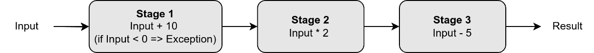
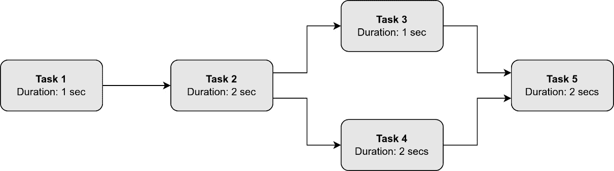

# 第七章：异步函数

在上一章中，我们学习了关于承诺、未来和封装任务的内容。当我们介绍封装任务时，我们提到 **std::async** 提供了一种更简单的方法来实现相同的结果，代码更少，因此更简洁。

**异步函数**（**std::async**）是一个函数模板，它异步运行可调用对象，我们还可以通过传递定义启动策略的标志来选择执行方法。它是处理异步操作的有力工具，但它的自动管理和对执行线程缺乏控制，以及其他方面，也可能使其不适合需要精细控制或取消的任务。

在本章中，我们将涵盖以下主要主题：

+   异步函数是什么，以及我们如何使用它？

+   有哪些不同的启动策略？

+   与之前的方法相比，有哪些不同，尤其是封装任务？

+   使用 **std::async** 的优缺点是什么？

+   实际场景和示例

# 技术要求

异步函数自 C++11 以来一直可用，但一些示例使用了 C++14 的功能，例如 **chrono_literals**，以及 C++20 的功能，例如 **counting_semaphore**，因此本章中显示的代码可以由支持 C++20 的编译器编译。

请查阅 *第三章* 中的 *技术要求* 部分，以获取如何安装 GCC 13 和 Clang 8 编译器的指导。

你可以在以下 GitHub 仓库中找到所有完整的代码：

[`github.com/PacktPublishing/Asynchronous-Programming-with-CPP`](https://github.com/PacktPublishing/Asynchronous-Programming-with-CPP)

本章的示例位于 **Chapter_07** 文件夹下。所有源代码文件都可以使用 CMake 编译，如下所示：

```cpp
cmake . && cmake —build .
```

可执行二进制文件将在 **bin** 目录下生成。

# std::async 是什么？

**std::async** 是 C++ 中由 C++ 标准在 **<future>** 头文件中引入的函数模板，作为 C++11 的线程支持库的一部分。它用于异步运行函数，允许主线程（或其他线程）继续并发运行。

总结来说，**std::async** 是 C++ 中异步编程的强大工具，使并行运行任务和管理其结果更加高效。

## 启动异步任务

要使用 **std::async** 异步执行函数，我们可以使用与在 *第三章* 中启动线程时相同的方法，但使用不同的可调用对象。

一种方法是使用函数指针：

```cpp
void func() {
    std::cout << "Using function pointer\n";
}
auto fut1 = std::async(func);
```

另一种方法是使用 lambda 函数：

```cpp
auto lambda_func = []() {
    std::cout << "Using lambda function\n";
};
auto fut2 = std::async(lambda_func);
```

我们还可以使用内嵌的 lambda 函数：

```cpp
auto fut3 = std::async([]() {
    std::cout << "Using embedded lambda function\n";
});
```

我们可以使用一个重载了 **operator()** 的函数对象：

```cpp
class FuncObjectClass {
   public:
    void operator()() {
        std::cout << "Using function object class\n";
    }
};
auto fut4 = std::async(FuncObjectClass());
```

我们可以通过传递成员函数的地址和对象的地址来调用成员函数的非静态成员函数：

```cpp
class Obj {
  public:
    void func() {
        std::cout << "Using a non-static member function"
                  << std::endl;
    }
};
Obj obj;
auto fut5 = std::async(&Obj::func, &obj);
```

我们也可以使用静态成员函数，其中只需要成员函数的地址，因为方法是静态的：

```cpp
class Obj {
  public:
    static void static_func() {
        std::cout << "Using a static member function"
                  << std::endl;
    }
};
auto fut6 = std::async(&Obj::static_func);
```

当调用**std::async**时，它返回一个 future，其中将存储函数的结果，正如我们在上一章所学到的。

## 传递值

同样，类似于我们在创建线程时传递参数的方式，参数可以通过值、引用或指针传递给线程。

这里，我们可以看到如何通过值传递参数：

```cpp
void funcByValue(const std::string& str, int val) {
    std::cout << «str: « << str << «, val: « << val
              << std::endl;
}
std::string str{"Passing by value"};
auto fut1 = async(funcByValue, str, 1);
```

通过值传递意味着创建一个临时对象并复制参数值到其中。这避免了数据竞争，但成本较高。

下一个例子展示了如何通过引用传递值：

```cpp
void modifyValues(std::string& str) {
    str += " (Thread)";
}
std::string str{"Passing by reference"};
auto fut2 = std::async(modifyValues, std::ref(str));
```

我们还可以将值作为**const 引用**传递：

```cpp
void printVector(const std::vector<int>& v) {
    std::cout << "Vector: ";
    for (int num : v) {
        std::cout << num << " ";
    }
    std::cout << std::endl;
}
std::vector<int> v{1, 2, 3, 4, 5};
auto fut3 = std::async(printVector, std::cref(v));
```

通过引用传递是通过使用**std::ref()**（非常量引用）或**std::cref()**（常量引用）实现的，这两个都在**<functional>**头文件中定义，让定义线程构造函数的变长模板（一个支持任意数量参数的类或函数模板）将参数作为引用处理。在传递参数时缺少这些函数意味着通过值传递参数，如前所述，这会使函数调用成本更高。

你也可以将对象移动到由**std::async**创建的线程中，如下所示：

```cpp
auto fut4 = std::async(printVector, std::move(v));
```

注意，在内容被移动后，向量**v**处于一个有效但为空的状态。

最后，我们还可以通过 lambda 捕获传递值：

```cpp
std::string str5{"Hello"};
auto fut5 = std::async([&]() {
    std::cout << "str: " << str5 << std::endl;
});
```

在这个例子中，**str**变量被**std::async**执行的 lambda 函数通过引用访问。

## 返回值

当调用**std:async**时，它立即返回一个 future，该 future 将包含函数或可调用对象将计算出的值，正如我们在上一章使用 promises 和 futures 时所见。

在之前的例子中，我们没有使用**std::async**返回的对象。让我们重写*包装任务*部分中的最后一个例子，在*第六章*中，我们使用了一个**std::packaged_task**对象来计算两个值的幂。但在这个例子中，我们将使用**std::async**来生成几个异步任务来计算这些值，等待任务完成，存储结果，并最终在控制台显示它们：

```cpp
#include <chrono>
#include <cmath>
#include <future>
#include <iostream>
#include <thread>
#include <vector>
#include <syncstream>
#define sync_cout std::osyncstream(std::cout)
using namespace std::chrono_literals;
int compute(unsigned taskId, int x, int y) {
    std::this_thread::sleep_for(std::chrono::milliseconds(
                               rand() % 200));
    sync_cout << "Running task " << taskId << '\n';
    return std::pow(x, y);
}
int main() {
    std::vector<std::future<int>> futVec;
    for (int i = 0; i <= 10; i++)
        futVec.emplace_back(std::async(compute,
                            i+1, 2, i));
    sync_cout << "Waiting in main thread\n";
    std::this_thread::sleep_for(1s);
    std::vector<int> results;
    for (auto& fut : futVec)
        results.push_back(fut.get());
    for (auto& res : results)
        std::cout << res << ' ';
    std::cout << std::endl;
    return 0;
}
```

**compute()**函数简单地获取两个数字，**x**和**y**，并计算 . 它还获取一个表示任务标识符的数字，并在控制台打印消息并计算结果之前等待最多两秒钟。

在 **main()** 函数中，主线程启动了几个计算 2 的幂次序列值的任务。通过调用 **std::async** 返回的未来存储在 **futVec** 向量中。然后，主线程等待一秒钟，模拟一些工作。最后，我们遍历 **futVec** 向量，并在每个未来元素中调用 **get()** 函数，从而等待该特定任务完成并返回一个值，我们将返回的值存储在另一个名为 **results** 的向量中。然后，在退出程序之前，我们打印 **results** 向量的内容。

这是运行该程序时的输出：

```cpp
Waiting in main thread
Running task 11
Running task 9
Running task 2
Running task 8
Running task 4
Running task 6
Running task 10
Running task 3
Running task 1
Running task 7
Running task 5
1 2 4 8 16 32 64 128 256 512 1024
```

如我们所见，每个任务完成所需的时间不同，因此输出不是按任务标识符排序的。但是，当我们按顺序遍历在获取结果时 **futVec** 向量，这些结果被显示为有序。

现在我们已经看到了如何启动异步任务并传递参数和返回值，让我们学习如何使用启动策略来控制执行方法。

# 启动策略

除了在调用 **std::async** 函数时将函数或可调用对象作为参数外，我们还可以指定 **launch policy**。启动策略控制 **std::async** 如何调度异步任务的执行。这些定义在 **<future>** 库中。

在调用 **std::async** 时，必须将启动策略指定为第一个参数。此参数的类型为 **std::launch**，它是一个位掩码值，其中其位控制允许的执行方法，可以是以下枚举常量之一：

+   **std::launch::async**：任务将在一个单独的线程中执行。

+   **std::launch::deferred**：通过在第一次通过未来 **get()** 或 **wait()** 方法请求结果时在调用线程中执行任务，启用延迟评估。所有对同一 **std::future** 的进一步访问都将立即返回结果。这意味着任务只有在显式请求结果时才会执行，这可能导致意外的延迟。

如果未定义，默认的启动策略将是 **std::launch::async | std::launch::deferred**。此外，实现可以提供额外的启动策略。

因此，默认情况下，C++标准声明 **std::async** 可以在异步或延迟模式下运行。

注意，当指定多个标志时，行为是实现定义的，因此取决于我们使用的编译器。标准建议使用可用的并发性和在指定默认启动策略时延迟任务。

让我们实现以下示例来测试不同的启动策略行为。首先，我们定义 **square()** 函数，它将作为异步任务：

```cpp
#include <chrono>
#include <future>
#include <iostream>
#include <string>
#include <syncstream>
#define sync_cout std::osyncstream(std::cout)
using namespace std::chrono_literals;
int square(const std::string& task_name, int x) {
    sync_cout << "Launching " << task_name
              << « task...\n»;
    return x * x;
}
```

然后，在**main()**函数中，程序首先启动三个不同的异步任务，一个使用**std::launch::async**启动策略，另一个任务使用**std::launch::deferred**启动策略，第三个任务使用默认启动策略：

```cpp
sync_cout << "Starting main thread...\n";
auto fut_async = std::async(std::launch::async,
                           square, «async_policy", 2);
auto fut_deferred = std::async(std::launch::deferred,
                            square, «deferred_policy", 3);
auto fut_default = std::async(square,
                            «default_policy", 4);
```

如前一章所述，**wait_for()**返回一个**std::future_status**对象，指示未来是否就绪、延迟还是超时。因此，我们可以使用该函数来检查返回的任何未来对象是否延迟。我们通过使用返回**true**的 lambda 函数**is_deferred()**来实现这一点。至少有一个未来对象**fut_deferred**预期会返回**true**：

```cpp
auto is_deferred = [](std::future<int>& fut) {
    return (fut.wait_for(0s) ==
            std::future_status::deferred);
};
sync_cout << "Checking if deferred:\n";
sync_cout << "  fut_async: " << std::boolalpha
          << is_deferred(fut_async) << '\n';
sync_cout << "  fut_deferred: " << std::boolalpha
          << is_deferred(fut_deferred) << '\n';
sync_cout << "  fut_default: " << std::boolalpha
          << is_deferred(fut_default) << '\n';
```

然后，主程序等待一秒钟，模拟一些处理，最后从异步任务中检索结果并打印它们的值：

```cpp
sync_cout << "Waiting in main thread...\n";
std::this_thread::sleep_for(1s);
sync_cout << "Wait in main thread finished.\n";
sync_cout << "Getting result from "
          << "async policy task...\n";
int val_async = fut_async.get();
sync_cout << "Result from async policy task: "
          << val_async << '\n';
sync_cout << "Getting result from "
          << "deferred policy task...\n";
int val_deferred = fut_deferred.get();
sync_cout << "Result from deferred policy task: "
          << val_deferred << '\n';
sync_cout << "Getting result from "
          << "default policy task...\n";
int val_default = fut_default.get();
sync_cout << "Result from default policy task: "
          << val_default << '\n';
```

这是运行前面代码的输出：

```cpp
Starting main thread...
Launching async_policy task...
Launching default_policy task...
Checking if deferred:
  fut_async: false
  fut_deferred: true
  fut_default: false
Waiting in main thread...
Wait in main thread finished.
Getting result from async policy task...
Result from async policy task: 4
Getting result from deferred policy task...
Launching deferred_policy task...
Result from deferred policy task: 9
Getting result from default policy task...
Result from default policy task: 16
```

注意，具有默认和**std::launch::async**启动策略的任务在主线程睡眠时执行。因此，任务一旦可以调度就会立即启动。同时注意，使用**std::launch::deferred**启动策略的延迟任务在请求值时开始执行。

接下来，让我们学习如何处理异步任务中发生的异常。

# 处理异常

当使用**std::async**时，不支持从异步任务到主线程的异常传播。为了启用异常传播，我们可能需要一个承诺对象来存储异常，稍后可以通过调用**std::async**时返回的未来来访问该异常。但该承诺对象不是由**std::async**提供的或可访问的。

实现这一点的可行方法之一是使用一个包装异步任务的**std::packaged_task**对象。但如果那样做，我们应该直接使用前一章中描述的包装任务。

我们还可以使用自 C++11 以来可用的嵌套异常，通过使用**std::nested_exception**，这是一个可以捕获和存储当前异常的多态混合类，允许任意类型的嵌套异常。从**std::nested_exception**对象中，我们可以使用**nested_ptr()**方法检索存储的异常或通过调用**rethrow_nested()**重新抛出它。

要创建一个嵌套异常，我们可以使用**std::throw_with_nested()**方法抛出异常。如果我们只想在异常嵌套的情况下重新抛出异常，我们可以使用**std::rethrow_if_nested()**。所有这些函数都在**<exception>**头文件中定义。

使用所有这些函数，我们可以实现以下示例，其中异步任务抛出一个**std::runtime_error**异常，该异常在异步任务的主体中被捕获并作为嵌套异常重新抛出。然后，在主函数中再次捕获该嵌套异常对象，并打印出异常序列，如下面的代码所示：

```cpp
#include <exception>
#include <future>
#include <iostream>
#include <stdexcept>
#include <string>
void print_exceptions(const std::exception& e,
                      int level = 1) {
    auto indent = std::string(2 * level, ‹ ‹);
    std::cerr << indent << e.what() << '\n';
    try {
        std::rethrow_if_nested(e);
    } catch (const std::exception& nestedException) {
        print_exceptions(nestedException, level + 1);
    } catch (...) { }
}
void func_throwing() {
    throw std::runtime_error(
               «Exception in func_throwing");
}
int main() {
    auto fut = std::async([]() {
        try {
            func_throwing();
        } catch (...) {
            std::throw_with_nested(
                 std::runtime_error(
                      "Exception in async task."));
        }
    });
    try {
        fut.get();
    } catch (const std::exception& e) {
        std::cerr << "Caught exceptions:\n";
        print_exceptions(e);
    }
    return 0;
}
```

如示例所示，创建了一个异步任务，该任务在**try-catch**块中执行**func_throwing()**函数。这个函数简单地抛出一个**std::runtime_error**异常，该异常被捕获，然后通过使用**std::throw_with_nested()**函数作为**std::nested_exception**类的一部分重新抛出。稍后，在主线程中，当我们尝试通过调用其**get()**方法从**fut**未来对象检索结果时，嵌套异常被抛出并再次在主**try-catch**块中捕获，其中调用**print_exceptions()**函数，并将捕获的嵌套异常作为参数。

**print_exceptions()**函数打印当前异常的原因（**e.what()**），如果异常嵌套，则重新抛出异常，从而再次捕获它并以缩进的形式递归打印异常原因。

由于每个异步任务都有自己的未来对象，程序可以单独处理多个任务的异常。

## 调用 std::async 时的异常

除了异步任务中发生的异常之外，还有**std::async**可能会抛出异常的情况。这些异常如下：

+   **std::bad_alloc**：如果存储**std::async**所需内部数据结构的内存不足。

+   **std::system_error**：当使用**std::launch::async**作为启动策略时，无法启动新线程。在这种情况下，错误条件将是**std::errc::resource_unavailable_try_again**。根据实现，如果策略是默认的，它可能会回退到延迟调用或实现定义的策略。

大多数情况下，这些异常是由于资源耗尽而抛出的。一种解决方案是在一些异步任务当前正在运行并释放其资源后稍后重试。另一种更可靠的解决方案是限制给定时间内运行的异步任务数量。我们将很快实现这个解决方案，但首先，让我们了解**std::async**返回的未来对象以及如何在使用它们时实现更好的性能。

# 异步未来与性能

当调用其析构函数时，**std::async**返回的未来对象的行为与从承诺中获得的行为不同。当这些未来对象被销毁时，它们的**~future**析构函数被调用，其中执行**wait()**函数，导致在创建时产生的线程加入。

如果**std::async**使用的线程尚未加入，这将通过添加一些开销影响程序性能，因此我们需要了解未来对象何时将超出作用域，从而其析构函数将被调用。

让我们通过几个简短的示例来看看这些未来对象的行为，以及一些关于如何使用它们的建议。

我们首先定义一个任务**func**，该任务简单地将其输入值乘以 2，并等待一段时间，模拟一个昂贵的操作：

```cpp
#include <chrono>
#include <functional>
#include <future>
#include <iostream>
#include <thread>
#define sync_cout std::osyncstream(std::cout)
using namespace std::chrono_literals;
unsigned func(unsigned x) {
    std::this_thread::sleep_for(10ms);
    return 2 * x;
}
```

为了测量代码块的性能，我们将异步运行几个任务（在这个例子中，**NUM_TASKS = 32**），并使用来自 **<chrono>** 库的稳定时钟来测量运行时间。为此，我们只需使用以下命令记录表示任务开始时当前时间点的时刻：

```cpp
auto start = std::chrono::high_resolution_clock::now();
```

我们可以在 **main()** 函数中定义以下 lambda 函数，以便在任务完成时调用以获取以毫秒为单位的时间：

```cpp
auto duration_from = [](auto start) {
    auto dur = std::chrono::high_resolution_clock::now()
               - start;
    return std::chrono::duration_cast
               <std::chrono::milliseconds>(dur).count();
};
```

在放置该代码后，我们可以开始测量如何使用未来的不同方法。

让我们从运行几个异步任务开始，但丢弃由 **std::async** 返回的未来：

```cpp
constexpr unsigned NUM_TASKS = 32;
auto start = std::chrono::high_resolution_clock::now();
for (unsigned i = 0; i < NUM_TASKS; i++) {
    std::async(std::launch::async, func, i);
}
std::cout << "Discarding futures: "
          << duration_from(start) << '\n';
```

这个测试在我的电脑上持续了 334 毫秒，这是一台 4 GHz 的 Pentium i7 4790K，有四个核心和八个线程。

对于下一个测试，让我们存储返回的未来，但不要等待结果准备好。显然，这不是通过产生异步任务来使用计算机功率的正确方式，因为我们消耗资源而不处理结果，但我们这样做是为了测试和学习目的：

```cpp
start = std::chrono::high_resolution_clock::now();
for (unsigned i = 0; i < NUM_TASKS; i++) {
    auto fut = std::async(std::launch::async, func, i);
}
std::cout << "In-place futures: "
          << duration_from(start) << '\n';
```

在这种情况下，持续时间仍然是 334 毫秒。在两种情况下，都会创建一个未来，当每个循环迭代的末尾超出作用域时，它必须等待由 **std::async** 生成的线程完成并加入。

如您所见，我们正在启动 32 个任务，每个任务至少消耗 10 毫秒。总共是 320 毫秒，这是一个与这些测试中获得的 334 毫秒等效的值。剩余的性能成本来自启动线程、检查 **for** 循环变量、使用稳定时钟存储时间点等。

为了避免每次调用 **std::async** 时都创建一个新的未来对象，并等待其析构函数被调用，让我们像以下代码所示重用未来对象。同样，这并不是正确的方式，因为我们正在丢弃对先前任务结果的处理：

```cpp
std::future<unsigned> fut;
start = std::chrono::high_resolution_clock::now();
for (unsigned i = 0; i < NUM_TASKS; i++) {
    fut = std::async(std::launch::async, func, i);
}
std::cout << "Reusing future: "
          << duration_from(start) << '\n';
```

现在的持续时间是 166 毫秒。这种减少是由于我们没有等待每个未来，因为它们没有被销毁。

但这并不理想，因为我们可能对异步任务的结果感兴趣。因此，我们需要将结果存储在一个向量中。让我们通过使用 **res** 向量来存储每个任务的结果来修改之前的示例：

```cpp
std::vector<unsigned> res;
start = std::chrono::high_resolution_clock::now();
for (unsigned i = 0; i < NUM_TASKS; i++) {
    auto fut = std::async(std::launch::async, func, i);
    res.push_back(fut.get());
}
std::cout << "Reused future and storing results: "
          << duration_from(start) << '\n';
```

在这种情况下，持续时间回到了 334 毫秒。这是因为我们再次在启动另一个异步任务之前通过调用 **fut.get()** 等待结果，我们在序列化任务的执行。

一种解决方案是将 **std::async** 返回的未来存储在一个向量中，然后遍历该向量并获取结果。以下代码说明了如何做到这一点：

```cpp
std::vector<unsigned> res;
std::vector<std::future<unsigned>> futsVec;
start = std::chrono::high_resolution_clock::now();
for (unsigned i = 0; i < NUM_TASKS; i++) {
    futsVec.emplace_back(std::async(std::launch::async,
                         func, i));
}
for (unsigned i = 0; i < NUM_TASKS; i++) {
    res.push_back( futsVec[i].get() );
}
std::cout << "Futures vector and storing results: "
          << duration_from(start) << '\n';
```

现在持续时间仅为 22 毫秒！但为什么会这样？

现在所有任务都在真正地异步运行。第一个循环启动所有任务并将未来存储在 **futsVec** 向量中。由于未来析构函数被调用，不再有任何等待期。

第二个循环遍历**futsVec**，检索每个结果，并将它们存储在结果向量**res**中。执行第二个循环的时间将大约等于遍历**res**向量所需的时间加上调度和执行最慢任务所用的时间。

如果测试运行的系统有足够的线程一次性运行所有异步任务，运行时间可以减半。有些系统可以在底层自动管理多个异步任务，让调度器决定运行哪些任务。在其他系统中，当尝试一次性启动许多线程时，它们可能会通过抛出异常来抱怨。在下一节中，我们将通过使用信号量实现线程限制器。

# 限制线程数量

如我们之前所见，如果线程不足以运行多个**std::async**调用，可能会抛出**std::runtime_system**异常，并指示资源耗尽。

我们可以通过创建一个使用计数信号量（**std::counting_semaphore**）的线程限制器来实现一个简单的解决方案，这是一种在*第四章*中解释的多线程同步机制。

策略是使用一个**std::counting_semaphore**对象，将其初始值设置为系统允许的最大并发任务数，这可以通过调用**std::thread::hardware_concurrency()**函数来检索，正如我们在*第二章*中学到的，然后在任务函数中使用该信号量来阻塞，如果总异步任务数超过最大并发任务数。

以下代码片段实现了这个想法：

```cpp
#include <chrono>
#include <future>
#include <iostream>
#include <semaphore>
#include <syncstream>
#include <vector>
#define sync_cout std::osyncstream(std::cout)
using namespace std::chrono_literals;
void task(int id, std::counting_semaphore<>& sem) {
    sem.acquire();
    sync_cout << "Running task " << id << "...\n";
    std::this_thread::sleep_for(1s);
    sem.release();
}
int main() {
    const int total_tasks = 20;
    const int max_concurrent_tasks =
              std::thread::hardware_concurrency();
    std::counting_semaphore<> sem(max_concurrent_tasks);
    sync_cout << "Allowing only "
              << max_concurrent_tasks
              << " concurrent tasks to run "
              << total_tasks << " tasks.\n";
    std::vector<std::future<void>> futures;
    for (int i = 0; i < total_tasks; ++i) {
        futures.push_back(
                std::async(std::launch::async,
                           task, i, std::ref(sem)));
    }
    for (auto& fut : futures) {
        fut.get();
    }
    std::cout << "All tasks completed." << std::endl;
    return 0;
}
```

程序首先设置将要启动的总任务数。然后，它创建一个计数信号量**sem**，将其初始值设置为前面解释的硬件并发值。最后，它只是启动所有任务，并等待它们的未来准备好，就像通常一样。

本例中的关键点是，每个任务在执行其工作之前，都会获取信号量，从而减少内部计数器或阻塞，直到计数器可以减少。当工作完成时，信号量被释放，这会增加内部计数器并解除其他任务在那时尝试获取信号量的阻塞。这意味着，只有在有可用于该任务的空闲硬件线程时，任务才会启动。否则，它将被阻塞，直到另一个任务释放信号量。

在探索一些实际场景之前，让我们首先了解使用**std::async**的一些缺点。

# 不使用 std::async 的情况

正如我们在本章中看到的，**std::async**不提供对线程数量的直接控制或对线程对象的直接访问。我们现在知道如何通过使用计数信号量来限制异步任务的数量，但可能有一些应用程序，这种方法不是最佳解决方案，需要更精细的控制。

此外，线程的自动管理可能会通过引入开销来降低性能，尤其是在启动许多小任务时，会导致过多的上下文切换和资源竞争。

实现对可用的并发线程数施加了一些限制，这可能会降低性能甚至抛出异常。由于 **std::async** 和可用的 **std::launch** 策略是依赖于实现的，因此性能在不同编译器和平台之间并不一致。

最后，在本章中，我们没有提到如何取消由 **std::async** 启动的异步任务，因为在任务完成之前没有标准的方法来做这件事。

# 实际示例

现在是时候实现一些示例，使用 **std::async** 来解决现实生活中的场景了。我们将学习如何做以下事情：

+   执行并行计算和聚合

+   异步搜索不同的容器或大型数据集

+   异步乘以两个矩阵

+   连接异步操作

+   改进上一章的管道示例

## 并行计算和聚合

**数据聚合** 是从多个来源收集原始数据并组织、处理以及提供数据摘要以便于消费的过程。这个过程在许多领域都很有用，例如商业报告、金融服务、医疗保健、社交媒体监控、研究和学术界。

作为一个简单的例子，让我们计算 *1* 到 *n* 之间所有数的平方值并获取它们的平均值。我们知道使用以下公式来计算平方值的总和会更快，并且需要更少的计算机资源。此外，这个任务可能更有意义，但这个示例的目的是理解任务之间的关系，而不是任务本身。

![<math  display="block"><mrow><mrow><mrow><munderover><mo>∑</mo><mrow><mi>i</mi><mo>=</mo><mn>1</mn></mrow><mi>n</mi></munderover><msup><mi>i</mi><mn>2</mn></msup></mrow><mo>=</mo><mfrac><mrow><mi>n</mi><mfenced open="(" close=")"><mrow><mi>n</mi><mo>+</mo><mn>1</mn></mrow></mfenced><mstyle scriptlevel="+1"><mfrac><mrow><mi>n</mi><mfenced open="(" close=")"><mrow><mi>n</mi><mo>+</mo><mn>1</mn></mrow></mfenced><mfenced open="(" close=")"><mrow><mn>2</mn><mi>n</mi><mo>+</mo><mn>1</mn></mrow></mfenced></mrow><mn>6</mn></mfrac></mstyle><mo>(</mo><mn>2</mn><mi>n</mi><mo>+</mo><mn>1</mn><mo>)</mo></mrow><mn>6</mn></mfrac></mrow></mrow></math>](img/6.png)

以下示例中的 **average_squares()** 函数为 *1* 到 *n* 之间的每个值启动一个异步任务来计算平方值。结果的未来对象存储在 **futsVec** 向量中，稍后由 **sum_results()** 函数用来计算平方值的总和。然后将结果除以 **n** 以获得平均值：

```cpp
#include <future>
#include <iomanip>
#include <iostream>
#include <vector>
int square(int x) {
    return x * x;
}
int sum_results(std::vector<std::future<int>>& futsVec) {
    int sum = 0;
    for (auto& fut : futsVec) {
        sum += fut.get();
    }
    return sum;
}
int average_squares(int n) {
    std::vector<std::future<int>> futsVec;
    for (int i = 1; i <= n; ++i) {
        futsVec.push_back(std::async(
                std::launch::async, square, i));
    }
    return double(sum_results(futures)) / n;
}
int main() {
    int N = 100;
    std::cout << std::fixed << std::setprecision(2);
    std::cout << "Sum of squares for N = " << N
              << « is « << average_squares(N) << '\n';
    return 0;
}
```

例如，对于  ，我们可以检查该值将与函数返回值除以 * n * 、* 3,383.50 * 相同。

此示例可以轻松修改以实现使用 **MapReduce** 编程模型来高效处理大数据集的解决方案。MapReduce 通过将数据处理分为两个阶段来工作；Map 阶段，在该阶段独立的数据块被过滤、排序并在多台计算机上并行处理，以及 Reduce 阶段，在该阶段聚合 Map 阶段的结果，总结数据。这就像我们刚刚实现的那样，使用 Map 阶段中的 **square()** 函数，以及 Reduce 阶段中的 **average_squares()** 和 **sum_results()** 函数。

## 异步搜索

加快在大容器中搜索目标值的一种方法是将搜索并行化。接下来，我们将展示两个示例。第一个示例涉及通过每个容器使用一个任务来跨不同容器进行搜索，而第二个示例涉及跨一个大容器进行搜索，将其分割成更小的段，并使用每个段一个任务：

### 在不同的容器中进行搜索

在这个例子中，我们需要在包含动物名称的不同类型容器（**vector**、**list**、**forward_list** 和 **set**）中搜索一个**目标**值：

```cpp
#include <algorithm>
#include <forward_list>
#include <future>
#include <iostream>
#include <list>
#include <set>
#include <string>
#include <vector>
int main() {
    std::vector<std::string> africanAnimals =
              {"elephant", "giraffe", "lion", "zebra"};
    std::list<std::string> americanAnimals =
              {"alligator", "bear", "eagle", "puma"};
    std::forward_list<std::string> asianAnimals =
              {"orangutan", "panda", "tapir", "tiger"};
    std::set<std::string> europeanAnimals =
              {«deer», «hedgehog», «linx", "wolf"};
    std::string target = «elephant»;
    /* .... */
}
```

要搜索目标值，我们为每个容器启动一个异步任务，使用 **search()** 模板函数，该函数简单地在一个容器中调用 **std::find** 函数，如果找到目标值则返回 **true**，否则返回 **false**：

```cpp
template <typename C>
bool search(const C& container, const std::string& target) {
    return std::find(container.begin(), container.end(),
                     target) != container.end();
}
```

这些异步任务使用带有 **std::launch::async** 启动策略的 **std::async** 函数启动：

```cpp
int main() {
    /* .... */
    auto fut1 = std::async(std::launch::async,
                   search<std::vector<std::string>>,
                   africanAnimals, target);
    auto fut2 = std::async(std::launch::async,
                   search<std::list<std::string>>,
                   americanAnimals, target);
    auto fut3 = std::async(std::launch::async,
                   search<std::forward_list<std::string>>,
                   asianAnimals, target);
    auto fut4 = std::async(std::launch::async,
                search<std::set<std::string>>,
                europeanAnimals, target);
    /* .... */
```

最后，我们简单地从使用 **std::async** 创建的 futures 中检索所有返回值，并通过位或操作它们：

```cpp
int main() {
    /* .... */
    bool found = fut1.get() || fut2.get() ||
                 fut3.get() || fut4.get();
    if (found) {
        std::cout << target
                  << " found in one of the containers.\n";
    } else {
        std::cout << target
                  << " not found in any of "
                  << "the containers.\n";
    }
    return 0;
}
```

此示例还展示了 **标准模板库**（**STL**）的强大功能，因为它提供了通用的可重用算法，可以应用于不同的容器和数据类型。

### 在大容器中进行搜索

在下一个示例中，我们将实现一个解决方案，以在包含 500 万个整数值的大型向量中查找目标值。

要生成向量，我们使用具有均匀整数分布的随机数生成器：

```cpp
#include <cmath>
#include <iostream>
#include <vector>
#include <future>
#include <algorithm>
#include <random>
// Generate a large vector of random integers using a uniform distribution
std::vector<int> generate_vector(size_t size) {
    std::vector<int> vec(size);
    std::random_device rd;
    std::mt19937 gen(rd());
    std::uniform_int_distribution<> dist(1, size);
    std::generate(vec.begin(), vec.end(), [&]() {
        return dist(gen);
    });
    return vec;
}
```

要在向量的一个段中搜索目标值，我们可以使用带有指向段限制的 **begin** 和 **end** 迭代器的 **std::find** 函数：

```cpp
bool search_segment(const std::vector<int>& vec, int target, size_t begin, size_t end) {
    auto begin_it = vec.begin() + begin;
    auto end_it = vec.begin() + end;
    return std::find(begin_it, end_it, target) != end_it;
}
```

在 **main()** 函数中，我们首先使用 **generate_vector()** 函数生成大型向量，然后定义要查找的 **目标** 值和向量将被分割进行并行搜索的段数（**num_segments**）：

```cpp
const int target = 100;
std::vector<int> vec = generate_vector(5000000);
auto vec_size = vec.size();
size_t num_segments = 16;
size_t segment_size = vec.size() / num_segments;
```

然后，对于每个段，我们定义其 **begin** 和 **end** 迭代器，并启动一个异步任务在该段中搜索目标值。因此，我们通过使用带有 **std::launch::async** 启动策略的 **std::async** 在单独的线程中异步执行 **search_segment**。为了避免在将大向量作为 **search_segment** 的输入参数传递时复制它，我们使用常量引用，**std::cref**。由 **std::async** 返回的 futures 存储在 **futs** 向量中：

```cpp
std::vector<std::future<bool>> futs;
for (size_t i = 0; i < num_segments; ++i) {
    auto begin = std::min(i * segment_size, vec_size);
    auto end = std::min((i + 1) * segment_size, vec_size);
    futs.push_back( std::async(std::launch::async,
                               search_segment,
                               std::cref(vec),
                               target, begin, end) );
}
```

注意，向量的大小并不总是段大小的倍数，因此最后一个段可能比其他段短。为了处理这种情况并避免在检查最后一个段时访问越界内存的问题，我们需要为每个段适当地设置 **begin** 和 **end** 索引。为此，我们使用 **std::min** 来获取向量大小和当前段中最后一个元素的假设索引之间的最小值。

最后，我们通过在每个 future 上调用 **get()** 来检查所有结果，并在控制台打印一条消息，如果任何段中找到了目标值：

```cpp
bool found = false;
for (auto& fut : futs) {
    if (fut.get()) {
        found = true;
        break;
    }
}
if (found) {
    std::cout << "Target " << target
              << " found in the large vector.\n";
} else {
    std::cout << "Target " << target
              << " not found in the large vector.\n";
}
```

此解决方案可以作为处理分布式系统中大数据集的更高级解决方案的基础，其中每个异步任务都试图在特定的机器或集群中找到目标值。

## 异步矩阵乘法

**矩阵乘法** 是计算机科学中最相关的操作之一，在许多领域中使用，例如计算机图形学、计算机视觉、机器学习和科学计算。

在下面的示例中，我们将通过在多个线程之间分配计算来实现并行计算解决方案。

首先，我们定义一个矩阵类型，**matrix_t**，作为一个包含整数值的向量向量：

```cpp
#include <cmath>
#include <exception>
#include <future>
#include <iostream>
#include <vector>
using matrix_t = std::vector<std::vector<int>>;
```

然后，我们实现 **matrix_multiply** 函数，该函数接受两个矩阵 **A** 和 **B**，将它们作为常量引用传递，并返回它们的乘积。我们知道如果 **A** 是一个矩阵 （其中 *m* 代表行，*n* 代表列）并且 **B** 是一个矩阵 ，当  时，我们可以乘以 **A** 和 **B**，结果矩阵的维度将是 （*m* 行和 *q* 列）。

**matrix_multiply** 函数首先为结果矩阵 **res** 预留一些空间，然后通过从 **B** 中提取列 **j** 并将其与 **A** 中的行 **i** 相乘来遍历矩阵：

```cpp
matrix_t matrix_multiply(const matrix_t& A,
                         const matrix_t& B) {
    if (A[0].size() != B.size()) {
        throw new std::runtime_error(
                  «Wrong matrices dimmensions.");
    }
    size_t rows = A.size();
    size_t cols = B[0].size();
    size_t inner_dim = B.size();
    matrix_t res(rows, std::vector<int>(cols, 0));
    std::vector<std::future<int>> futs;
    for (auto i = 0; i < rows; ++i) {
        for (auto j = 0; j < cols; ++j) {
            std::vector<int> column(inner_dim);
            for (size_t k = 0; k < inner_dim; ++k) {
                column[k] = B[k][j];
            }
            futs.push_back(std::async(std::launch::async,
                                      dot_product,
                                      A[i], column));
        }
    }
    for (auto i = 0; i < rows; ++i) {
        for (auto j = 0; j < cols; ++j) {
            res[i][j] = futs[i * cols + j].get();
        }
    }
    return res;
}
```

乘法是通过使用**std::async**和**std::launch::async**启动策略异步进行的，运行**dot_product**函数。**std::async**返回的每个 future 都存储在**futs**向量中。**dot_product**函数通过逐元素相乘并返回这些乘积的总和来计算向量**a**和**b**的点积，代表**A**中的一行和**B**中的一列：

```cpp
int dot_product(const std::vector<int>& a,
                const std::vector<int>& b) {
    int sum = 0;
    for (size_t i = 0; i < a.size(); ++i) {
        sum += a[i] * b[i];
    }
    return sum;
}
```

由于**dot_product**函数期望两个向量，我们需要在启动每个异步任务之前从**B**中提取每一列。这也提高了整体性能，因为向量可能存储在连续的内存块中，因此在计算时更缓存友好。

在**main()**函数中，我们只定义了两个矩阵**A**和**B**，并使用**matrix_multipy**函数来计算它们的乘积。所有矩阵都使用**show_matrix**lambda 函数打印到控制台：

```cpp
int main() {
    auto show_matrix = [](const std::string& name,
                          matrix_t& mtx) {
        std::cout << name << '\n';
        for (const auto& row : mtx) {
            for (const auto& elem : row) {
                std::cout << elem << " ";
            }
            std::cout << '\n';
        }
        std::cout << std::endl;
    };
    matrix_t A = {{1, 2, 3},
                  {4, 5, 6}};
    matrix_t B = {{7, 8, 9},
                  {10, 11, 12},
                  {13, 14, 15}};
    auto res = matrix_multiply(A, B);
    show_matrix("A", A);
    show_matrix("B", B);
    show_matrix("Result", res);
    return 0;
}
```

这是运行此示例的输出：

```cpp
A
1 2 3
4 5 6
B
7 8 9
10 11 12
13 14 15
Result
66 72 78
156 171 186
```

使用连续内存块在遍历向量时可以提高性能，因为许多元素可以一次读入缓存。使用**std::vector**时，不保证连续内存分配，因此可能最好使用**new**或**malloc**。

## 链接异步操作

在这个例子中，我们将实现一个由三个阶段组成的简单管道，每个阶段都从前一个阶段的结果中获取并计算一个值。



图 7.1 – 简单管道示例

第一阶段仅接受正整数作为输入，否则会抛出异常，并在返回结果之前将 10 加到该值上。第二阶段将其输入乘以 2，第三阶段从其输入中减去 5：

```cpp
#include <future>
#include <iostream>
#include <stdexcept>
int stage1(int x) {
    if (x < 0) throw std::runtime_error(
                        "Negative input not allowed");
    return x + 10;
}
int stage2(int x) {
    return x * 2;
}
int stage3(int x) {
    return x - 5;
}
```

在**main()**函数中，对于中间和最终阶段，我们通过使用前一个阶段生成的 futures 作为输入来定义管道。这些 futures 通过引用传递给运行异步代码的 lambda 表达式，其中使用它们的**get()**函数来获取它们的结果。

要从管道中检索结果，我们只需调用最后阶段返回的 future 的**get()**函数。如果发生异常，例如，当**input_value**为负时，它会被 try-catch 块捕获：

```cpp
int main() {
    int input_value = 5;
    try {
        auto fut1 = std::async(std::launch::async,
                         stage1, input_value);
        auto fut2 = std::async(std::launch::async,
                         [&fut1]() {
                            return stage2(fut1.get()); });
        auto fut3 = std::async(std::launch::async,
                         [&fut2]() {
                            return stage3(fut2.get()); });
        int final_result = fut3.get();
        std::cout << "Final Result: "
                  << final_result << std::endl;
    } catch (const std::exception &ex) {
        std::cerr << "Exception caught: "
                  << ex.what() << std::endl;
    }
    return 0;
}
```

在这个例子中定义的管道是一个简单的管道，其中每个阶段都使用前一个阶段的 future 来获取输入值并产生其结果。在下一个例子中，我们将使用**std:async**和延迟启动策略重写上一章中实现的管道，以仅执行所需的阶段。

## 异步管道

正如承诺的那样，在前一章中，当我们实现管道时，我们提到可以使用具有延迟执行的 futures 来保持不同的任务关闭，直到需要时。正如也提到的，这在计算成本高但结果不一定总是需要的情况下很有用。由于只有使用 **std::async** 才能创建具有延迟状态的 futures，现在我们来看看如何做到这一点。

我们将实现前一章中描述的相同管道，它遵循以下任务图：



图 7.2 – 管道示例

我们首先定义 **Task** 类。这个类类似于前一章示例中实现的类，但使用 **std::async** 函数并存储返回的 future 而不是之前使用的 promise。在这里，我们只将评论与示例中的相关代码更改相关联，因此请查看该示例以获取 **Task** 类的完整解释或检查 GitHub 仓库。

**Task** 构造函数存储任务标识符（**id_**）、要启动的函数（**func_**）以及任务是否有依赖关系（**has_dependency_**）。它还通过使用具有 **std::launch::deferred** 启动策略的 **std::async** 以延迟启动模式启动异步任务。这意味着任务被创建但直到需要时才启动。返回的 future 存储在 **fut_** 变量中：

```cpp
template <typename Func>
class Task {
   public:
    Task(int id, Func& func)
        : id_(id), func_(func), has_dependency_(false) {
        sync_cout << "Task " << id
                 << " constructed without dependencies.\n";
        fut_ = std::async(std::launch::deferred,
                         [this](){ (*this)(); });
    }
    template <typename... Futures>
    Task(int id, Func& func, Futures&&... futures)
        : id_(id), func_(func), has_dependency_(true) {
        sync_cout << "Task " << id
                  << " constructed with dependencies.\n";
        fut_ = std::async(std::launch::deferred,
                         [this](){ (*this)(); });
        add_dependencies(std::forward<Futures>
                                     (futures)...);
    }
   private:
    int id_;
    Func& func_;
    std::future<void> fut_;
    std::vector<std::shared_future<void>> deps_;
    bool has_dependency_;
};
```

由 **std::async** 启动的异步任务调用它们自己的实例（即 **this** 对象）的 **operator()**。当发生这种情况时，会调用 **wait_completion()**，通过调用存储依赖任务的共享 future 向量 **deps_** 的 **valid()** 函数来检查所有 futures 是否有效，如果是，则通过调用 **get()** 函数等待它们完成。当所有依赖任务完成时，会调用 **func_** 函数：

```cpp
public:
void operator()() {
    sync_cout << "Starting task " << id_ << std::endl;
    wait_completion();
    sync_cout << "Running task " << id_ << std::endl;
    func_();
}
private:
void wait_completion() {
    sync_cout << "Waiting completion for task "
              << id_ << std::endl;
    if (!deps_.empty()) {
        for (auto& fut : deps_) {
            if (fut.valid()) {
                sync_cout << "Fut valid so getting "
                          << "value in task " << id_
                          << std::endl;
                fut.get();
            }
        }
    }
}
```

还有一个新的成员函数，**start()**，它在调用 **std::async** 期间任务构造时等待创建的 **fut_** future。这将用于通过请求最后一个任务的结果来触发管道：

```cpp
public:
void start() {
    fut_.get();
}
```

如前一章中的示例所示，我们也定义了一个名为 **get_dependency()** 的成员函数，它返回由 **fut_** 构造的共享 future：

```cpp
std::shared_future<void> get_dependency() {
    sync_cout << "Getting future from task "
              << id_ << std::endl;
    return fut_;
}
```

在 **main()** 函数中，我们通过链式任务对象并设置它们的依赖关系以及要运行的 lambda 函数（**sleep1s** 或 **sleep2s**），根据图 *7.2* 中所示的图来定义管道：

```cpp
int main() {
    auto sleep1s = [](){
        std::this_thread::sleep_for(1s);
    };
    auto sleep2s = [](){
        std::this_thread::sleep_for(2s);
    };
    Task task1(1, sleep1s);
    Task task2(2, sleep2s, task1.get_dependency());
    Task task3(3, sleep1s, task2.get_dependency());
    Task task4(4, sleep2s, task2.get_dependency());
    Task task5(5, sleep2s, task3.get_dependency(),
               task4.get_dependency());
    sync_cout << "Starting the pipeline..." << std::endl;
    task5.start();
    sync_cout << "All done!" << std::endl;
    return 0;
}
```

启动管道就像从最后一个任务的 future 获取结果一样简单。我们可以通过调用 **task5** 的 **start()** 方法来实现这一点。这将递归地通过依赖关系向量调用它们的依赖任务并启动延迟异步任务。

这是执行前述代码的输出：

```cpp
Task 1 constructed without dependencies.
Getting future from task 1
Task 2 constructed with dependencies.
Getting future from task 2
Task 3 constructed with dependencies.
Getting future from task 2
Task 4 constructed with dependencies.
Getting future from task 4
Getting future from task 3
Task 5 constructed with dependencies.
Starting the pipeline...
Starting task 5
Waiting completion for task 5
Fut valid so getting value in task 5
Starting task 3
Waiting completion for task 3
Fut valid so getting value in task 3
Starting task 2
Waiting completion for task 2
Fut valid so getting value in task 2
Starting task 1
Waiting completion for task 1
Running task 1
Running task 2
Running task 3
Fut valid so getting value in task 5
Starting task 4
Waiting completion for task 4
Running task 4
Running task 5
All done!
```

我们可以通过调用每个任务的构造函数并从先前依赖任务获取 futures 来看到管道是如何创建的。

然后，当管道被触发时，**task5** 开始执行，递归地启动 **task3**、**task2** 和 **task1**。由于 **task1** 没有依赖项，它不需要等待其他任何任务运行其工作，因此它完成，允许 **task2** 完成，然后是 **task3**。

接下来，**task5** 继续检查其依赖任务，因此现在是 **task4** 的运行时间。由于 **task4** 的所有依赖任务都已完成，**task4** 只需执行，允许 **task5** 在之后运行，从而完成管道。

此示例可以通过执行实际计算并在任务之间传输结果来改进。此外，我们也可以考虑具有几个并行步骤的阶段，这些步骤可以在单独的线程中计算。请随意将这些改进作为附加练习实现。

# 摘要

在本章中，我们学习了 **std::async**，如何使用此函数执行异步任务，如何通过使用启动策略来定义其行为，以及如何处理异常。

我们现在还了解异步函数返回的未来如何影响性能，以及如何明智地使用它们。我们还看到了如何通过使用计数信号量来限制系统可用线程数来限制异步任务的数量。

我们还提到了一些场景，在这些场景中，**std::async** 可能不是最佳工具。

最后，我们实现了几个涵盖现实场景的示例，这对于并行化许多常见任务很有用。

通过本章获得的所有知识，现在我们知道了何时（以及何时不）使用 **std::async** 函数来并行运行异步任务，从而提高应用程序的整体性能，实现更好的计算机资源使用，并减少资源耗尽。

在下一章中，我们将学习如何通过使用自 C++20 起可用的协程来实现异步执行。

# 进一步阅读

+   *《有效现代 C++》*：*42 种提高您对 C++11 和 C++14 使用的方法*，Scott Meyers 著，O'Reilly 媒体公司，第一版 – 第七章，项目 35 和项目 36

+   **std::async** : [`en.cppreference.com/w/cpp/thread/async`](https://en.cppreference.com/w/cpp/thread/async)

+   **std::launch** : [`en.cppreference.com/w/cpp/thread/launch`](https://en.cppreference.com/w/cpp/thread/launch)

+   Strassen 算法: [`en.wikipedia.org/wiki/Strassen_algorithm`](https://en.wikipedia.org/wiki/Strassen_algorithm)

+   Karatsuba 算法: [`en.wikipedia.org/wiki/Karatsuba_algorithm`](https://en.wikipedia.org/wiki/Karatsuba_algorithm)

+   OpenBLAS: [`www.openblas.net`](https://www.openblas.net)

+   BLIS 库: [`github.com/flame/blis`](https://github.com/flame/blis)

+   MapReduce: [`hadoop.apache.org/docs/r1.2.1/mapred_tutorial.html`](https://hadoop.apache.org/docs/r1.2.1/mapred_tutorial.html)
