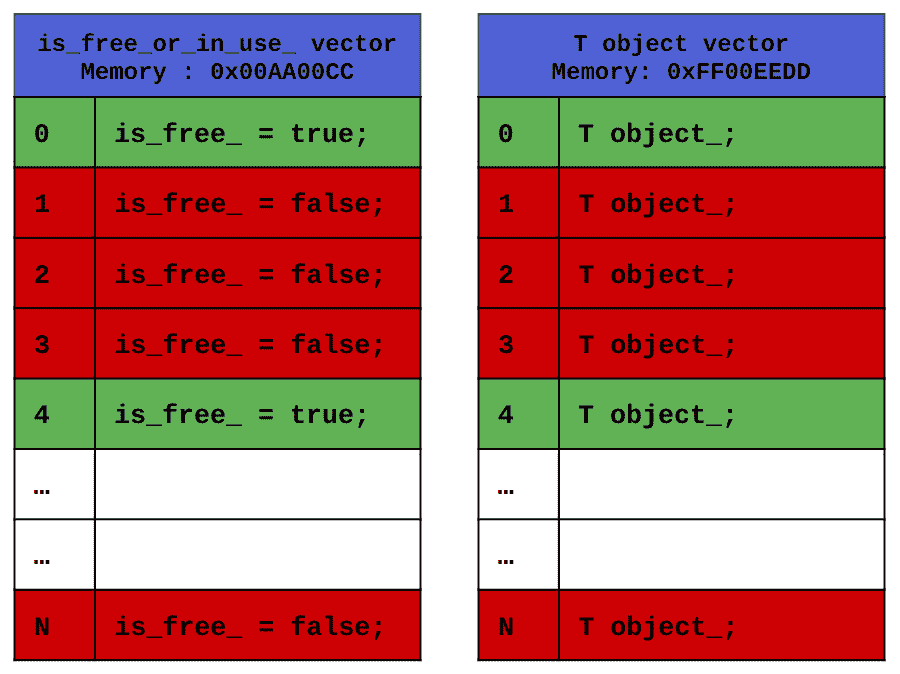
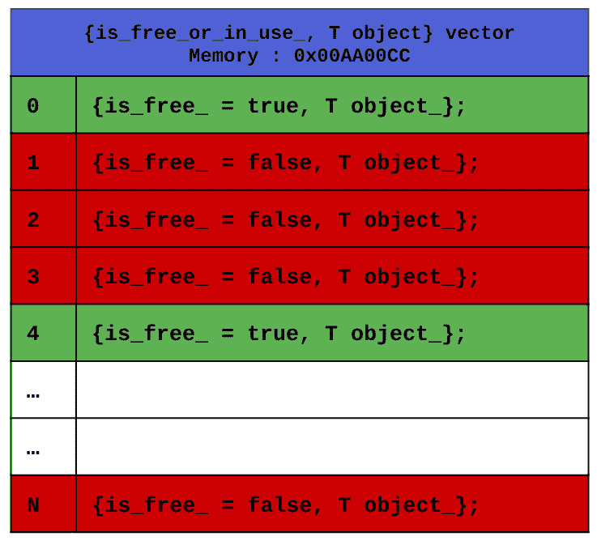

# 第四章：构建低延迟应用程序的 C++构建块

在上一章中，我们详细且技术性地讨论了如何在 C++中开发低延迟应用程序的方法。我们还研究了 C++编程语言的技术细节以及 GCC 编译器。现在，我们将从理论讨论转向自己构建一些实际的低延迟 C++组件。

我们将构建一些相对通用的组件，这些组件可以用于各种不同的低延迟应用程序，例如我们在上一章中讨论的那些。在我们本章构建这些基本构建块时，我们将学习如何有效地使用 C++编写高性能的 C++代码。我们将在本书的其余部分使用这些组件来展示这些组件在我们设计和构建的电子交易生态系统中如何定位。

本章将涵盖以下主题：

+   C++多线程用于低延迟多线程应用程序

+   设计 C++内存池以避免动态内存分配

+   使用无锁队列传输数据

+   构建低延迟日志框架

+   使用套接字进行 C++网络编程

# 技术要求

本书的所有代码都可以在本书的 GitHub 仓库中找到，网址为[`github.com/PacktPublishing/Building-Low-Latency-Applications-with-CPP`](https://github.com/PacktPublishing/Building-Low-Latency-Applications-with-CPP)。本章的源代码位于仓库中的`Chapter4`目录。

我们期望您至少具备中级 C++编程经验，因为我们假设您对广泛使用的 C++编程特性有很好的理解。我们还假设您在 C++网络编程方面有一些经验，因为网络编程是一个庞大的主题，无法在本书中涵盖。对于本书，从本章开始，我们将使用 CMake 和 Ninja 构建系统，因此我们期望您理解 CMake、g++、Ninja、Make 或其他类似的构建系统，以便能够构建本书的代码示例。

本书源代码开发环境的规格在此展示。我们提供此环境的详细信息，因为本书中展示的所有 C++代码不一定可移植，可能需要在您的环境中进行一些小的修改才能工作：

+   `Linux 5.19.0-41-generic #42~22.04.1-Ubuntu SMP PREEMPT_DYNAMIC Tue Apr 18 17:40:00 UTC 2 x86_64 x86_64` `x86_64 GNU/Linux`

+   `g++ (Ubuntu` `11.3.0-1ubuntu1~22.04.1) 11.3.0`

+   `cmake` `版本 3.23.2`

+   `1.10.2`

# C++多线程用于低延迟多线程应用程序

我们将构建的第一个组件非常小，但仍然非常基础。本节将设计和实现创建和运行执行线程的方法。这些将在整个低延迟系统的许多不同部分中使用，具体取决于系统不同子组件的设计。根据系统设计，不同的组件可能作为一个流水线协同工作，以促进并行处理。我们将在我们的电子交易系统中以这种方式使用多线程框架。另一个用例是将非关键任务，如将日志记录到磁盘、计算统计数据等，传递给后台线程。

在我们继续到创建和操作线程的源代码之前，让我们首先快速定义一些有用的宏。我们将在本书中编写的源代码的许多地方使用这些函数，从本章开始。

## 定义一些有用的宏和函数

大多数低延迟应用程序运行在现代流水线处理器上，这些处理器在需要执行之前预先获取指令和数据。我们在上一章讨论过，分支预测错误非常昂贵，会导致流水线停滞，向其中引入气泡。因此，低延迟应用程序的重要开发实践是减少分支的数量。由于分支不可避免，因此也很重要尽可能地使它们尽可能可预测。

我们有两个简单的宏，我们将使用它们向编译器提供分支提示。这些宏使用了`__builtin_expect` GCC 内置函数，该函数重新排序编译器生成的机器指令。实际上，编译器使用开发者提供的分支预测提示来生成机器代码，该代码在假设分支更有可能被采取的情况下进行了优化。

注意，当涉及到分支预测时，指令重排只是完整画面的一部分，因为处理器在运行指令时使用了一个硬件分支预测器。注意，现代硬件分支预测器在预测分支和跳转方面非常出色，尤其是在相同的分支被多次采取的情况下，甚至在至少有容易预测的分支模式的情况下。

这两个宏如下所示：

```cpp
#define LIKELY(x) __builtin_expect(!!(x), 1)
#define UNLIKELY(x) __builtin_expect(!!(x), 0)
```

`LIKELY(x)`宏指定由`x`指定的条件很可能为真，而`UNLIKELY(x)`宏则相反。作为一个使用示例，我们将在下一组函数中很快使用`UNLIKELY`宏。在 C++20 中，这像`[[likely]]`和`[[unlikely]]`属性一样被标准化，以标准且可移植的方式执行相同的功能。

我们接下来将定义两个额外的函数，但它们只是在我们代码库中的断言中使用。这些应该相当直观；`ASSERT` 在条件评估为 `false` 时记录一条消息并退出，而 `FATAL` 则简单地记录一条消息并退出。注意这里使用了 `UNLIKELY` 来指定我们并不期望 `!cond` 条件评估为 `true`。还请注意，在关键代码路径上使用 `ASSERT` 方法并不是免费的，主要是因为 if 检查。这是我们最终将更改以从发布构建中优化出去的事情，但到目前为止，我们将保留它，因为它应该非常便宜：

```cpp
inline auto ASSERT(bool cond, const std::string& msg)
  noexcept {
  if(UNLIKELY(!cond)) {
    std::cerr << msg << std::endl;
    exit(EXIT_FAILURE);
  }
}
inline auto FATAL(const std::string& msg) noexcept {
  std::cerr << msg << std::endl;
  exit(EXIT_FAILURE);
}
```

本节中讨论的代码可以在本书 GitHub 仓库的 `Chapter4/macros.h` 源文件中找到。请注意，`macros.h` 头文件包含了以下两个头文件：

```cpp
#include <cstring>
#include <iostream>
```

现在，让我们跳转到下一节，讨论线程创建和操作功能。

## 创建和启动新线程

下面的代码块中定义的方法创建了一个新的线程对象，在线程上设置线程亲和性（稍后会有更多介绍），并将线程在执行期间将运行的函数和相关参数传递给线程。这是通过将 `thread_body` lambda 传递给 `std::thread` 构造函数来实现的。注意使用了 *可变参数模板* 和 *完美转发* 来允许此方法使用，运行各种函数、任意类型和任意数量的参数。创建线程后，该方法会等待直到线程成功启动或失败，因为未能设置线程亲和性，这就是调用 `t->join()` 的作用。现在忽略对 `setThreadCore(core_id)` 的调用；我们将在下一节中讨论它：

```cpp
#pragma once
#include <iostream>
#include <atomic>
#include <thread>
#include <unistd.h>
#include <sys/syscall.h>
template<typename T, typename... A>
inline auto createAndStartThread(int core_id, const
  std::string &name, T &&func, A &&... args) noexcept {
  std::atomic<bool> running(false), failed(false);
  auto thread_body = [&] {
    if (core_id >= 0 && !setThreadCore(core_id)) {
      std::cerr << "Failed to set core affinity for " <<
        name << " " << pthread_self() << " to " << core_id
          << std::endl;
      failed = true;
      return;
    }
    std::cout << "Set core affinity for " << name << " " <<
      pthread_self() << " to " << core_id << std::endl;
    running = true;
    std::forward<T>(func)((std::forward<A>(args))...);
  };
  auto t = new std::thread(thread_body);
  while (!running && !failed) {
    using namespace std::literals::chrono_literals;
    std::this_thread::sleep_for(1s);
  }
  if (failed) {
    t->join();
    delete t;
    t = nullptr;
  }
  return t;
}
```

本节中讨论的代码可以在本书 GitHub 仓库的 `Chapter4/thread_utils.h` 源文件中找到。现在，让我们跳转到最后一节，在 `setThreadCore(core_id)` 函数中设置线程亲和性。

## 设置线程亲和性

在这里，我们将讨论设置线程亲和性的源代码，这是我们在上一节中看到的线程创建 lambda 表达式的功能。在我们讨论源代码之前，请记住，如果线程之间有大量的上下文切换，这会给线程性能带来很多开销。线程在 CPU 内核之间跳跃也会因为类似的原因损害性能。对于性能关键型线程设置线程亲和性对于低延迟应用来说非常重要，以避免这些问题。

现在，让我们看看如何在`setThreadCore()`方法中设置线程亲和性。首先，我们使用`CPU_ZERO()`方法清除`cpu_set_t`变量，它只是一个标志数组。然后，我们使用`CPU_SET()`方法启用我们想要将其核心固定的`core_id`的入口。最后，我们使用`pthread_setaffinity_np()`函数设置线程亲和性，如果失败则返回`false`。注意这里使用`pthread_self()`来获取要使用的线程 ID，这是有意义的，因为这是在`createAndStartThread()`中从我们创建的`std::thread`实例中调用的：

```cpp
inline auto setThreadCore(int core_id) noexcept {
  cpu_set_t cpuset;
  CPU_ZERO(&cpuset);
  CPU_SET(core_id, &cpuset);
  return (pthread_setaffinity_np(pthread_self(), sizeof
    (cpu_set_t), &cpuset) == 0);
}
```

本节讨论的代码可以在本书 GitHub 仓库的`Chapter4/thread_utils.h`源文件中找到。这些代码块属于`Common`命名空间，当你查看 GitHub 仓库中的`thread_utils.h`源文件时，你会看到这一点。

## 构建示例

在我们结束本节之前，让我们快速看一下一个使用我们刚刚创建的线程工具的简单示例。这个示例可以在本书 GitHub 仓库的`Chapter4/thread_example.cpp`源文件中找到。请注意，本章的库和所有示例都可以使用包含在`Chapter4`目录中的`CMakeLists.txt`构建。我们还提供了两个简单的脚本，`build.sh`和`run_examples.sh`，在设置正确的`cmake`和`ninja`二进制文件路径后，用于构建和运行这些示例。请注意，这里的`cmake`和`ninja`是任意构建系统选择，如果需要，你可以将其更改为任何其他构建系统。

这个示例应该相当直观——我们创建并启动两个线程，执行一个模拟任务，即添加传递给它的两个参数（`a`和`b`）。然后，我们在退出程序之前等待线程完成执行：

```cpp
#include "thread_utils.h"
auto dummyFunction(int a, int b, bool sleep) {
  std::cout << "dummyFunction(" << a << "," << b << ")" <<
    std::endl;
  std::cout << "dummyFunction output=" << a + b <<
    std::endl;
  if(sleep) {
    std::cout << "dummyFunction sleeping..." << std::endl;
    using namespace std::literals::chrono_literals;
    std::this_thread::sleep_for(5s);
  }
  std::cout << "dummyFunction done." << std::endl;
}
int main(int, char **) {
  using namespace Common;
  auto t1 = createAndStartThread(-1, "dummyFunction1",
    dummyFunction, 12, 21, false);
  auto t2 = createAndStartThread(1, "dummyFunction2",
    dummyFunction, 15, 51, true);
  std::cout << "main waiting for threads to be done." <<
    std::endl;
  t1->join();
  t2->join();
  std::cout << "main exiting." << std::endl;
  return 0;
}
```

当程序执行时，将输出类似以下内容：

```cpp
(base) sghosh@sghosh-ThinkPad-X1-Carbon-3rd:~/Building-Low-Latency-Applications-with-CPP/Chapter4$ ./cmake-build-release/thread_example
Set core affinity for dummyFunction1 140124979386112 to -1
dummyFunction(12,21)
dummyFunction output=33
dummyFunction done.
Set core affinity for dummyFunction2 140124970993408 to 1
dummyFunction(15,51)
dummyFunction output=66
dummyFunction sleeping...
main waiting for threads to be done.
dummyFunction done.
main exiting.
```

让我们继续到下一节，我们将讨论在运行时需要创建和丢弃对象时如何避免动态内存分配。

# 设计 C++内存池以避免动态内存分配

我们已经就动态内存分配、操作系统需要执行的步骤以及为什么动态内存分配速度慢进行了多次讨论。实际上，动态内存分配非常慢，以至于低延迟应用程序会尽可能在关键路径上避免它。没有创建和删除许多对象，我们就无法构建有用的应用程序，而动态内存分配对于低延迟应用程序来说太慢了。

## 理解内存池的定义

首先，让我们正式定义什么是内存池以及为什么我们需要它。许多应用程序（包括低延迟应用程序）需要能够处理许多对象以及未知数量的对象。通过未知数量的对象，我们指的是无法提前确定对象的预期数量，也无法确定对象的最大数量。显然，可能的最大对象数量是系统内存能够容纳的数量。处理这些对象的传统方法是在需要时使用动态内存分配。在这种情况下，堆内存被视为内存池——即从其中分配和释放内存的内存池。不幸的是，这些操作很慢，我们将通过使用我们自己的自定义内存池来控制系统中内存的分配和释放。我们定义内存池为任何我们可以从中请求额外内存或对象并将空闲内存或对象返回的地方。通过构建我们自己的自定义内存池，我们可以利用使用模式并控制分配和释放机制以实现最佳性能。

## 理解内存池的使用案例

当提前知道将需要的特定类型对象的确切数量时，你可以决定在需要时创建正好那个数量的对象。在实践中，有许多情况下无法提前知道确切的对象数量。这意味着我们需要在运行时动态地创建对象。如前所述，动态内存分配是一个非常缓慢的过程，对于低延迟应用程序来说是一个问题。我们使用术语*内存池*来描述特定类型的对象池，这就是我们将在本节中构建的内容。我们将在这本书中使用内存池来分配和释放我们无法预测的对象。

我们将使用的解决方案是在启动时预分配大量内存块，并在运行时提供所需数量的内存——即，从这个存储池中自行执行内存分配和释放步骤。这最终在许多不同的原因上表现出显著的优势，例如，我们可以将内存池的使用限制在我们的系统中的某些组件上，而不是服务器上运行的所有进程。我们还可以控制内存存储和分配释放算法，调整它们以针对我们的特定应用程序进行优化。

让我们先为我们的内存池做一些设计决策。我们内存池的所有源代码都存储在这本书的 GitHub 仓库中的`Chapter4/mem_pool.h`源文件中。

## 设计内存池存储

首先，我们需要决定如何在内存池内部存储元素。在这里，我们实际上有两个主要的选择——使用类似旧式数组（`T[N]`）或 `std::array` 在栈上存储它们，或者使用类似旧式指针（`T*`）或类似 `std::vector` 的方式在堆上存储。根据内存池的大小、使用频率、使用模式和应用程序本身，一个选择可能比另一个更好。例如，我们可能预计在内存池中需要大量的内存，要么是因为存储的对象很大，要么是因为有很多这样的对象。在这种情况下，堆分配将是首选，以适应大量的内存需求，同时不影响栈内存。如果我们预计对象很少或对象很小，我们应该考虑使用栈实现。如果我们预计很少访问对象，将它们放在栈上可能会遇到更好的缓存性能，但对于频繁访问，两种实现都应该同样有效。就像很多其他选择一样，这些决策总是通过实际测量性能来做出的。对于我们的内存池，我们将使用 `std::vector` 和堆分配，同时注意它不是线程安全的。

我们还需要一个变量来跟踪哪些块是空闲的或正在使用的。最后，我们还需要一个变量来跟踪下一个空闲块的位置，以便快速处理分配请求。这里需要注意的一个重要事项是我们有两个选择：

+   我们使用两个向量——一个用于跟踪对象，另一个用于跟踪空闲或空标记。这种解决方案在以下图中展示；请注意，在这个例子中，我们假设这两个向量位于非常不同的内存位置。我们试图说明的是，访问空闲或空标记和对象本身可能会引起缓存未命中，因为它们相距很远。



图 4.1 – 使用两个向量跟踪对象并显示哪些索引是空闲或正在使用的内存池实现

+   我们维护一个结构体（一个结构体、一个类或原始对象）的单个向量，每个结构体存储对象和变量来表示空闲或空标志。



图 4.2 – 使用单个向量跟踪对象并查看它是否空闲或正在使用的内存池实现

从缓存性能的角度来看，第二个选择更好，因为访问紧接在对象之后放置的对象和空闲标记，比访问两个可能相距甚远的向量中的不同位置要好。这也是因为在几乎所有使用模式中，如果我们访问对象，我们也会访问空闲标记，反之亦然：

```cpp
#pragma once
#include <cstdint>
#include <vector>
#include <string>
#include "macros.h"
namespace Common {
  template<typename T>
  class MemPool final {
private:
  struct ObjectBlock {
    T object_;
    bool is_free_ = true;
  };
  std::vector<ObjectBlock> store_;
  size_t next_free_index_ = 0;
};
```

接下来，我们需要看看如何在构造函数中初始化这个内存池，以及一些构造和赋值任务的样板代码。

## 初始化内存池

初始化我们的内存池相当简单——我们只需接受一个参数，指定我们的内存池的初始大小，并将向量初始化得足够大，以容纳这么多同时分配的对象。在我们的设计中，我们不会添加功能来调整内存池的大小超过其初始大小，但如果需要，这是一个相对简单的扩展来添加。请注意，这个初始向量初始化是内存池唯一一次动态分配内存的时间，因此内存池应该在关键路径执行开始之前创建。这里有一点需要注意，我们添加了一个断言来确保类型为 `T` 的实际对象是 `ObjectBlock` 结构中的第一个；我们将在 *处理* *释放* 部分看到这个要求的原因：

```cpp
public:
  explicit MemPool(std::size_t num_elems) :
      store_(num_elems, {T(), true}) /* pre-allocation of
        vector storage. */ {
    ASSERT(reinterpret_cast<const ObjectBlock *>
      (&(store_[0].object_)) == &(store_[0]), "T object
        should be first member of ObjectBlock.");
  }
```

现在是一些样板代码——我们将删除默认构造函数、拷贝构造函数和移动构造函数方法。我们也会对拷贝赋值运算符和移动赋值运算符做同样处理。我们这样做是为了防止这些方法在没有我们意识的情况下被意外调用。这也是我们使构造函数显式化的原因——以禁止我们不期望的隐式转换：

```cpp
  MemPool() = delete;
  MemPool(const MemPool&) = delete;
  MemPool(const MemPool&&) = delete;
  MemPool& operator=(const MemPool&) = delete;
  MemPool& operator=(const MemPool&&) = delete;
```

现在，让我们继续编写代码，通过提供 `T`-类型模板参数的空闲对象来处理分配请求。

## 处理新的分配请求

处理分配请求是一个简单的任务，即在我们的内存池存储中找到一个空闲的块，我们可以很容易地使用 `next_free_index_` 跟踪器来完成这个任务。然后，我们更新该块的 `is_free_` 标记，使用 `placement new` 初始化类型为 `T` 的对象块，然后更新 `next_free_index_` 以指向下一个可用的空闲块。

注意两点——第一点是，我们使用 `placement new` 返回类型为 `T` 的对象，而不是与 `T` 大小相同的内存块。这并不是绝对必要的，如果内存池的使用者希望负责从我们返回的内存块中构建对象，则可以将其删除。在大多数编译器的实现中，`placement new` 可能会添加一个额外的 `if` 检查，以确认提供给它的内存块不是空的。

第二件事，这更多的是我们根据应用程序进行的设计选择，那就是我们调用 `updateNextFreeIndex()` 来更新 `next_free_index_` 指向下一个可用的空闲块，这可以通过除了这里提供的方式以外的不同方式实现。要回答哪种实现是最佳的，那就是它 *取决于* 并需要在实践中进行测量。现在，让我们首先看看 `allocate()` 方法，在这里，我们再次使用变长模板参数来允许将任意参数转发到 `T` 的构造函数。请注意，在这里我们使用 `placement new` 操作符从内存块中构造具有给定参数的 `T` 类型的对象。记住，`new` 是一个可以如果需要被覆盖的操作符，而 `placement new` 操作符跳过了分配内存的步骤，而是使用提供的内存块：

```cpp
    template<typename... Args>
    T *allocate(Args... args) noexcept {
      auto obj_block = &(store_[next_free_index_]);
      ASSERT(obj_block->is_free_, "Expected free
        ObjectBlock at index:" + std::to_string
          (next_free_index_));
      T *ret = &(obj_block->object_);
      ret = new(ret) T(args...); // placement new.
      obj_block->is_free_ = false;
      updateNextFreeIndex();
      return ret;
    }
```

让我们来看看 `updateNextFreeIndex()` 方法。这里有两个需要注意的地方——首先，我们有一个分支用于处理索引绕到末尾的情况。虽然这在这里添加了一个 `if` 条件，但有了 `UNLIKELY()` 规范和我们对硬件分支预测器的预期，即总是预测该分支不会被取，这不应该以有意义的方式损害我们的性能。当然，如果我们真的想的话，我们可以将循环分成两个循环并移除那个 `if` 条件——也就是说，第一个循环一直循环到 `next_free_index_ == store_.size()`，第二个循环从 0 开始：

其次，我们添加了一个检查来检测内存池完全满的情况，并在这种情况下失败。显然，在实践中有更好的处理方式，不需要失败，但为了简洁和保持在本书的范围内，我们现在将只在这种情况下失败：

```cpp
  private:
    auto updateNextFreeIndex() noexcept {
      const auto initial_free_index = next_free_index_;
      while (!store_[next_free_index_].is_free_) {
        ++next_free_index_;
        if (UNLIKELY(next_free_index_ == store_.size())) {
          // hardware branch predictor should almost always
              predict this to be false any ways.
          next_free_index_ = 0;
        }
        if (UNLIKELY(initial_free_index ==
          next_free_index_)) {
          ASSERT(initial_free_index != next_free_index_,
            "Memory Pool out of space.");
        }
      }
    }
```

下一节将处理处理释放或返回类型为 `T` 的对象回内存池以回收它们作为空闲资源的情况。

## 处理释放

释放是一个简单的问题，就是找到我们内部 `store_` 中的正确 `ObjectBlock`，它与正在释放的 `T` 对象相对应，并将该块的 `is_free_` 标记设置为 `true`。在这里，我们使用 `reinterpret_cast` 将 `T*` 转换为 `ObjectBlock*`，这是可以做的，因为对象 `T` 是 `ObjectBlock` 的第一个成员。这应该现在解释了我们在 *初始化内存池* 部分中添加的断言。我们也在这里添加了一个断言，以确保用户尝试释放的元素属于这个内存池。当然，可以更优雅地处理这样的错误情况，但为了简洁和保持讨论在本书的范围内，我们将把这个留给你：

```cpp
    auto deallocate(const T *elem) noexcept {
      const auto elem_index = (reinterpret_cast<const
        ObjectBlock *>(elem) - &store_[0]);
      ASSERT(elem_index >= 0 && static_cast<size_t>
        (elem_index) < store_.size(), "Element being
          deallocated does not belong to this Memory
            pool.");
      ASSERT(!store_[elem_index].is_free_, "Expected in-use
        ObjectBlock at index:" + std::to_string
          (elem_index));
      store_[elem_index].is_free_ = true;
    }
```

这就结束了我们对内存池的设计和实现。让我们来看一个简单的例子。

## 使用示例使用内存池

让我们看看我们刚刚创建的内存池的一个简单且易于理解的示例。此代码位于`Chapter4/mem_pool_example.cpp`文件中，可以使用之前提到的`CMake`文件构建。它创建了一个原始`double`类型的内存池和另一个自定义`MyStruct`类型的内存池。然后，它从这个内存池中分配和释放一些元素，并打印出值和内存位置：

```cpp
#include "mem_pool.h"
struct MyStruct {
  int d_[3];
};
int main(int, char **) {
  using namespace Common;
  MemPool<double> prim_pool(50);
  MemPool<MyStruct> struct_pool(50);
  for(auto i = 0; i < 50; ++i) {
    auto p_ret = prim_pool.allocate(i);
    auto s_ret = struct_pool.allocate(MyStruct{i, i+1,
      i+2});
    std::cout << "prim elem:" << *p_ret << " allocated at:"
      << p_ret << std::endl;
    std::cout << "struct elem:" << s_ret->d_[0] << "," <<
      s_ret->d_[1] << "," << s_ret->d_[2] << " allocated
        at:" << s_ret << std::endl;
    if(i % 5 == 0) {
      std::cout << "deallocating prim elem:" << *p_ret << "
        from:" << p_ret << std::endl;
      std::cout << "deallocating struct elem:" << s_ret
        ->d_[0] << "," << s_ret->d_[1] << "," << s_ret->
           d_[2] << " from:" << s_ret << std::endl;
      prim_pool.deallocate(p_ret);
      struct_pool.deallocate(s_ret);
    }
  }
  return 0;
}
```

使用以下命令运行此示例应产生与此处所示类似的输出：

```cpp
(base) sghosh@sghosh-ThinkPad-X1-Carbon-3rd:~/Building-Low-Latency-Applications-with-CPP/Chapter4$ ./cmake-build-release/mem_pool_example
prim elem:0 allocated at:0x5641b4d1beb0
struct elem:0,1,2 allocated at:0x5641b4d1c220
deallocating prim elem:0 from:0x5641b4d1beb0
deallocating struct elem:0,1,2 from:0x5641b4d1c220
prim elem:1 allocated at:0x5641b4d1bec0
struct elem:1,2,3 allocated at:0x5641b4d1c230
prim elem:2 allocated at:0x5641b4d1bed0
...
```

在下一节中，我们将构建一个非常类似的功能——无锁队列。

# 使用无锁队列传输数据

在*多线程低延迟应用的 C++线程*部分，我们暗示了拥有多个线程的一个可能应用是设置一个流水线系统。在这里，一个组件线程执行部分处理并将结果转发到流水线的下一阶段进行进一步处理。我们将在我们的电子交易系统中使用这种设计，但关于这一点，后面还会详细介绍。

## 线程和进程之间的通信

在进程和/或线程之间传输数据时有很多选项。**进程间通信**（**IPC**），例如互斥锁、信号量、信号、内存映射文件和共享内存，可以用于这些目的。当存在对共享数据的并发访问并且重要要求是避免数据损坏时，这也会变得复杂。另一个重要要求是确保读取器和写入者对共享数据有一致的视图。要从一个线程传输信息到另一个线程（或从一个进程传输到另一个进程），最佳方式是通过一个两个线程都可以访问的数据队列。在并发访问环境中构建数据队列并使用锁来同步是一个选项。由于这种设计具有并发访问的性质，因此必须使用锁或互斥锁或类似的东西来防止错误。然而，锁和互斥锁非常低效，会导致上下文切换，这会极大地降低关键线程的性能。因此，我们需要一个无锁队列来促进线程之间的通信，而不需要锁和上下文切换的开销。请注意，我们在这里构建的无锁队列仅用于**单生产者单消费者**（**SPSC**）——也就是说，只有一个线程向队列写入，只有一个线程从队列中消费。更复杂的无锁队列用例将需要额外的复杂性，这超出了本书的范围。

## 设计无锁队列存储

对于无锁队列，我们再次有选择在栈上或堆上分配存储的选项。在这里，我们再次选择`std::vector`并在堆上分配内存。此外，我们创建两个`std::atomic`变量——一个称为`next_write_index_`——来跟踪下一个写入队列的索引。

第二个变量，称为`next_read_index_`，用于跟踪队列中下一个未读元素的位置。由于我们假设只有一个线程向队列写入，只有一个线程从队列读取，因此实现相对简单。现在，让我们首先设计和实现无锁队列数据结构的内部存储。本节讨论的源代码可以在本书 GitHub 仓库的`Chapter4/lf_queue.h`源文件中找到。

关于`std::atomic`的简要说明——它是一种现代 C++构造，允许线程安全的操作。它让我们可以在不使用锁或互斥锁的情况下读取、更新和写入共享变量，并且在保持操作顺序的同时完成这些操作。关于`std::atomic`和内存排序的详细讨论超出了本书的范围，但您可以在我们另一本书《开发高频交易系统》中找到参考资料。

首先，让我们在以下代码片段中定义这个类的数据成员：

```cpp
#pragma once
#include <iostream>
#include <vector>
#include <atomic>
namespace Common {
  template<typename T>
  class LFQueue final {
  private:
    std::vector<T> store_;
    std::atomic<size_t> next_write_index_ = {0};
    std::atomic<size_t> next_read_index_ = {0};
    std::atomic<size_t> num_elements_ = {0};
  };
}
```

这个类包含一个`std::vector`对象`store_`，它是一个`T`模板对象类型的实际数据队列。一个`std::atomic<size_t> next_write_index_`变量跟踪这个向量中的索引，下一个元素将被写入的位置。同样，一个`std::atomic<size_t> next_read_index_`变量跟踪这个向量中的索引，下一个要读取或消费的元素可用的位置。这些变量需要是`std::atomic<>`类型，因为读写操作是从不同的线程执行的。

## 初始化无锁队列

我们的无锁队列构造函数与之前看到的内存池构造函数非常相似。我们在构造函数中动态分配整个向量的内存。我们可以扩展这个设计，允许无锁队列在运行时调整大小，但到目前为止，我们将坚持使用固定大小的队列：

```cpp
template<typename T>
class LFQueue final {
public:
  LFQueue(std::size_t num_elems) :
      store_(num_elems, T()) /* pre-allocation of vector
        storage. */ {
  }
```

我们在这里有关于默认构造函数、拷贝构造函数和移动构造函数以及赋值运算符的类似样板代码。这些代码被删除的原因是我们之前讨论过的：

```cpp
  LFQueue() = delete;
  LFQueue(const LFQueue&) = delete;
  LFQueue(const LFQueue&&) = delete;
  LFQueue& operator=(const LFQueue&) = delete;
  LFQueue& operator=(const LFQueue&&) = delete;
```

接下来，我们将查看添加新元素到队列的代码。

## 向队列中添加元素

向队列中添加新元素的代码分为两部分；第一部分，`getNextToWriteTo()`，返回一个指向下一个要写入新数据的元素的指针。第二部分，`updateWriteIndex()`，在元素被写入提供的槽位后，增加写索引`next_write_index_`。我们设计它是这样的，而不是只有一个`write()`函数，我们提供给用户一个指向元素的指针，如果对象相当大，那么不需要更新或覆盖所有内容。此外，这种设计使得处理竞争条件变得容易得多：

```cpp
  auto getNextToWriteTo() noexcept {
    return &store_[next_write_index_];
  }
  auto updateWriteIndex() noexcept {
      next_write_index_ = (next_write_index_ + 1) %
        store_.size();
      num_elements_++;
  }
```

在下一节中，我们将使用一个非常类似的设计来消费队列中的元素。

## 从队列中消费元素

要从队列中消费元素，我们做的是向队列中添加元素的反操作。就像我们设计的那样，将`write()`分成两部分，我们将消费队列中的元素也分成两部分。我们有一个`getNextToRead()`方法，它返回要消费的下一个元素的指针，但不更新读取索引。如果没有任何元素要消费，此方法将返回`nullptr`。第二部分是`updateReadIndex()`，它在元素被消费后仅更新读取索引：

```cpp
  auto getNextToRead() const noexcept -> const T * {
    return (next_read_index_ == next_write_index_) ?
      nullptr : &store_[next_read_index_];
  }
  auto updateReadIndex() noexcept {
      next_read_index_ = (next_read_index_ + 1) %
        store_.size();
      ASSERT(num_elements_ != 0, "Read an invalid element
        in:" + std::to_string(pthread_self()));
      num_elements_--;
  }
```

我们还定义了另一种简单的方法来返回队列中的元素数量：

```cpp
    auto size() const noexcept {
      return num_elements_.load();
    }
```

这样，我们就完成了针对 SPSC 用例的无锁队列的设计和实现。让我们在下一小节中看看一个使用此组件的示例。

## 使用无锁队列

如何使用无锁数据队列的示例可以在`Chapter4/lf_queue_example.cpp`文件中找到，并按照之前提到的方式进行构建。此示例创建了一个消费者线程，并向它提供了一个无锁队列实例。然后，生产者生成并添加一些元素到该队列中，消费者线程检查队列并消费队列元素，直到队列为空。执行的两个线程——生产者和消费者——在生成一个元素和消费它之间等待很短的时间：

```cpp
#include "thread_utils.h"
#include "lf_queue.h"
struct MyStruct {
  int d_[3];
};
using namespace Common;
auto consumeFunction(LFQueue<MyStruct>* lfq) {
  using namespace std::literals::chrono_literals;
  std::this_thread::sleep_for(5s);
  while(lfq->size()) {
    const auto d = lfq->getNextToRead();
    lfq->updateReadIndex();
    std::cout << "consumeFunction read elem:" << d->d_[0]
      << "," << d->d_[1] << "," << d->d_[2] << " lfq-size:"
        <<lfq->size() << std::endl;
    std::this_thread::sleep_for(1s);
  }
  std::cout << "consumeFunction exiting." << std::endl;
}
int main(int, char **) {
  LFQueue<MyStruct> lfq(20);
  auto ct = createAndStartThread(-1, "", consumeFunction,
    &lfq);
  for(auto i = 0; i < 50; ++i) {
    const MyStruct d{i, i * 10, i * 100};
    *(lfq.getNextToWriteTo()) = d;
    lfq.updateWriteIndex();
    std::cout << "main constructed elem:" << d.d_[0] << ","
      << d.d_[1] << "," << d.d_[2] << " lfq-size:" <<
        lfq.size() << std::endl;
    using namespace std::literals::chrono_literals;
    std::this_thread::sleep_for(1s);
  }
  ct->join();
  std::cout << "main exiting." << std::endl;
  return 0;
}
```

运行此示例程序的输出如下，其中仅包括生产者和消费者对无锁队列的写入和读取操作：

```cpp
(base) sghosh@sghosh-ThinkPad-X1-Carbon-3rd:~/Building-Low-Latency-Applications-with-CPP/Chapter4$ ./cmake-build-release/lf_queue_example
Set core affinity for  139710770276096 to -1
main constructed elem:0,0,0 lfq-size:1
main constructed elem:1,10,100 lfq-size:2
main constructed elem:2,20,200 lfq-size:3
main constructed elem:3,30,300 lfq-size:4
consumeFunction read elem:0,0,0 lfq-size:3
main constructed elem:4,40,400 lfq-size:4
consumeFunction read elem:1,10,100 lfq-size:3
main constructed elem:5,50,500 lfq-size:4
consumeFunction read elem:2,20,200 lfq-size:3
main constructed elem:6,60,600 lfq-size:4
consumeFunction read elem:3,30,300 lfq-size:3
main constructed elem:7,70,700 lfq-size:4
consumeFunction read elem:4,40,400 lfq-size:3
...
```

接下来，我们将使用我们刚刚构建的一些组件——线程和无锁队列——构建一个低延迟日志框架。

# 构建低延迟日志框架

现在，我们将使用之前几节中构建的一些组件构建一个低延迟日志框架。日志是任何应用程序的重要组成部分，无论是记录一般的应用行为、警告、错误，甚至是性能统计信息。然而，许多重要的日志输出实际上来自性能关键组件，这些组件位于关键路径上。

一种简单的日志方法是将输出到屏幕，而一种稍微好一点的方法是将日志保存到一个或多个日志文件中。然而，这里我们有一些问题——磁盘 I/O 非常慢且不可预测，字符串操作和格式化本身也很慢。出于这些原因，在性能关键线程上执行这些操作是一个糟糕的想法，因此在本节中，我们将构建一个解决方案来减轻这些缺点，同时保留按需输出日志的能力。

在我们跳入日志类之前，我们将定义一些实用方法来获取当前系统时间以及将它们转换为字符串以供日志记录使用。

## 设计时间相关的实用方法

我们将定义一个简单的实用函数来获取当前系统时间以及一些常数，以便于不同单位之间的转换。时间实用函数的代码可以在本书 GitHub 仓库的`Chapter4/time_utils.h`中找到：

```cpp
#pragma once
#include <chrono>
#include <ctime>
namespace Common {
  typedef int64_t Nanos;
  constexpr Nanos NANOS_TO_MICROS = 1000;
  constexpr Nanos MICROS_TO_MILLIS = 1000;
  constexpr Nanos MILLIS_TO_SECS = 1000;
  constexpr Nanos NANOS_TO_MILLIS = NANO_TO_MICROS *
    MICROS_TO_MILLIS;
  constexpr Nanos NANOS_TO_SECS = NANOS_TO_MILLIS *
    MILLIS_TO_SECS;
  inline auto getCurrentNanos() noexcept {
    return std::chrono::duration_cast
      <std::chrono::nanoseconds>(std::chrono::
        system_clock::now().time_since_epoch()).count();
  }
  inline auto& getCurrentTimeStr(std::string* time_str) {
    const auto time = std::chrono::system_clock::
      to_time_t(std::chrono::system_clock::now());
    time_str->assign(ctime(&time));
    if(!time_str->empty())
      time_str->at(time_str->length()-1) = '\0';
    return *time_str;
  }
}
```

现在，让我们设计日志类本身，从下一节开始。

## 设计低延迟日志

为了构建这个低延迟日志框架，我们将创建一个后台日志线程，其唯一任务是向磁盘上的日志文件写入日志行。这里的想法是将慢速磁盘 I/O 操作以及字符串格式化操作从主性能关键线程卸载到这个后台线程。有一点需要理解的是，将日志写入磁盘不必是瞬时的——也就是说，大多数系统可以容忍事件发生和相关信息被写入磁盘之间的某些延迟。我们将使用本章第一部分创建的多线程函数来创建这个日志线程，并分配给它的任务是写入日志文件。

为了从主性能关键线程将需要记录的数据发布到这个日志线程，我们将使用我们在上一节中创建的无锁数据队列。日志的工作方式是，性能敏感的线程不会直接将信息写入磁盘，而是简单地将信息推送到这个无锁队列。正如我们之前讨论的，日志线程将从这个队列的另一端消费并写入磁盘。这个组件的源代码可以在本书 GitHub 仓库的`Chapter4`目录下的`logging.h`和`logging.cpp`文件中找到。

## 定义一些日志结构

在我们开始设计日志本身之前，我们将首先定义将跨无锁队列从性能敏感线程传输到日志线程的基本信息块。在这个设计中，我们简单地创建一个能够保存我们将要记录的不同类型的结构。首先，让我们定义一个枚举，它指定了指向的结构所指向的值的类型；我们将把这个枚举称为`LogType`：

```cpp
#pragma once
#include <string>
#include <fstream>
#include <cstdio>
#include "types.h"
#include "macros.h"
#include "lf_queue.h"
#include "thread_utils.h"
#include "time_utils.h"
namespace Common {
constexpr size_t LOG_QUEUE_SIZE = 8 * 1024 * 1024;
enum class LogType : int8_t {
  CHAR = 0,
  INTEGER = 1, LONG_INTEGER = 2, LONG_LONG_INTEGER = 3,
  UNSIGNED_INTEGER = 4, UNSIGNED_LONG_INTEGER = 5,
  UNSIGNED_LONG_LONG_INTEGER = 6,
  FLOAT = 7, DOUBLE = 8
};
}
```

现在，我们可以定义一个`LogElement`结构，它将保存要推送到队列的下一个值，并最终从日志线程将日志写入文件。这个结构包含一个类型为`LogType`的成员，用于指定它持有的值的类型。这个结构中的另一个成员是不同可能的基本类型的联合。这本来是使用`std::variant`的好地方，因为它是现代 C++中内置了`LogType type_`（指定联合包含的内容）的类型安全的联合。然而，`std::variant`的运行时性能较差；因此，我们选择在这里继续使用旧式的联合：

```cpp
struct LogElement {
  LogType type_ = LogType::CHAR;
  union {
    char c;
    int i; long l; long long ll;
    unsigned u; unsigned long ul; unsigned long long ull;
    float f; double d;
  } u_;
};
```

在定义了`LogElement`结构之后，让我们继续定义日志类中的数据。

## 初始化日志数据结构

我们的日志记录器将包含几个重要的对象。首先，一个`std::ofstream`文件对象是数据写入的日志文件。其次，一个`LFQueue<LogElement>`对象是用于从主线程向日志线程传输数据的无锁队列。接下来，`std::atomic<bool>`在需要时停止日志线程的处理，以及一个`std::thread`对象，即日志线程。最后，`std::string`是文件名，我们仅提供此信息：

```cpp
class Logger final {
private:
  const std::string file_name_;
  std::ofstream file_;
  LFQueue<LogElement> queue_;
  std::atomic<bool> running_ = {true};
  std::thread *logger_thread_ = nullptr;
};
```

现在，让我们继续构建我们的日志记录器、日志记录器队列和日志记录器线程。

## 创建日志记录器和启动日志记录线程

在日志记录器构造函数中，我们将使用适当的大小初始化日志记录器队列，保存`file_name_`用于信息目的，打开输出日志文件对象，并创建和启动日志记录线程。请注意，如果我们无法打开输出日志文件或无法创建和启动日志记录线程，我们将退出。正如我们之前提到的，显然有更多宽容和优雅的方式来处理这些失败，但我们将不会在本书中探讨这些方法。请注意，在这里我们将`createAndStartThread()`中的`core_id`参数设置为-1，以当前不设置线程的亲和性。一旦我们理解了整个生态系统的设计，我们将在本书的后面部分重新审视如何将每个线程分配给 CPU 核心的设计，并将对其进行性能调优：

```cpp
  explicit Logger(const std::string &file_name)
      : file_name_(file_name), queue_(LOG_QUEUE_SIZE) {
    file_.open(file_name);
    ASSERT(file_.is_open(), "Could not open log file:" +
      file_name);
    logger_thread_ = createAndStartThread(-1,
      "Common/Logger", [this]() { flushQueue(); });
    ASSERT(logger_thread_ != nullptr, "Failed to start
      Logger thread.");
  }
```

我们传递一个名为`flushQueue()`的方法，这个日志记录线程将运行。正如其名所示，并且与我们之前讨论的一致，这个线程将清空日志数据的队列并将数据写入文件；我们将在下一节中查看。`flushQueue()`的实现很简单。如果原子的`running_`布尔值为`true`，它将在循环中运行，执行以下步骤：它消费任何推送到无锁队列`queue_`的新元素，并将它们写入我们创建的`file_`对象。它解包队列中的`LogElement`对象，并根据类型将联合的正确成员写入文件。当无锁队列为空时，线程将休眠一毫秒，然后再次检查是否有新的元素要写入磁盘：

```cpp
  auto flushQueue() noexcept {
    while (running_) {
      for (auto next = queue_.getNextToRead();
        queue_.size() && next; next = queue_
          .getNextToRead()) {
        switch (next->type_) {
          case LogType::CHAR: file_ << next->u_.c; break;
          case LogType::INTEGER: file_ << next->u_.i; break;
          case LogType::LONG_INTEGER: file_ << next->u_.l; break;
          case LogType::LONG_LONG_INTEGER: file_ << next->
             u_.ll; break;
          case LogType::UNSIGNED_INTEGER: file_ << next->
             u_.u; break;
          case LogType::UNSIGNED_LONG_INTEGER: file_ <<
             next->u_.ul; break;
          case LogType::UNSIGNED_LONG_LONG_INTEGER: file_
              << next->u_.ull; break;
          case LogType::FLOAT: file_ << next->u_.f; break;
          case LogType::DOUBLE: file_ << next->u_.d; break;
        }
        queue_.updateReadIndex();
        next = queue_.getNextToRead();
      }
      using namespace std::literals::chrono_literals;
      std::this_thread::sleep_for(1ms);
    }
  }
```

我们日志记录器类的析构函数很重要，因此让我们看看它需要执行哪些清理任务。首先，析构函数等待日志线程消耗无锁队列，因此它等待直到队列为空。一旦队列为空，它将`running_`标志设置为`false`，以便日志线程可以完成其执行。为了等待日志线程完成执行——即从`flushQueue()`方法返回，它调用日志线程上的`std::thread::join()`方法。最后，它关闭`file_`对象，将任何缓冲数据写入磁盘，然后我们完成：

```cpp
  ~Logger() {
    std::cerr << "Flushing and closing Logger for " <<
      file_name_ << std::endl;
    while (queue_.size()) {
      using namespace std::literals::chrono_literals;
      std::this_thread::sleep_for(1s);
    }
    running_ = false;
    logger_thread_->join();
    file_.close();
  }
```

最后，我们将添加之前多次讨论的关于构造函数和赋值运算符的常规样板代码：

```cpp
  Logger() = delete;
  Logger(const Logger &) = delete;
  Logger(const Logger &&) = delete;
  Logger &operator=(const Logger &) = delete;
  Logger &operator=(const Logger &&) = delete;
```

在本节中，我们看到了组件从队列中读取并写入磁盘的部分。在下一节中，我们将看到数据如何作为性能关键线程的日志过程的一部分添加到无锁队列中。

## 将数据推送到日志队列

要将数据推送到日志队列，我们将定义几个重载的 `pushValue()` 方法来处理不同类型的参数。每个方法都做同样的事情，即逐个将值推送到队列中。这里值得注意的一点是，对于我们将要讨论的内容，存在更有效的实现；然而，它们涉及额外的复杂性，我们为了简洁和限制本书的覆盖范围而省略了它们。当我们讨论它们时，我们将指出潜在的改进区域。

首先，我们创建一个 `pushValue()` 的变体来推送类型为 `LogElement` 的对象，它将从我们即将定义的其他 `pushValue()` 函数中被调用。它基本上写入无锁队列的下一个位置并增加写索引：

```cpp
  auto pushValue(const LogElement &log_element) noexcept {
    *(queue_.getNextToWriteTo()) = log_element;
    queue_.updateWriteIndex();
  }
```

`pushValue()` 的下一个简单变体是针对单个字符值，它基本上只是创建一个类型为 `LogElement` 的对象，调用我们刚才讨论的 `pushValue()` 方法，并将 `LogElement` 对象传递给它：

```cpp
  auto pushValue(const char value) noexcept {
    pushValue(LogElement{LogType::CHAR, {.c = value}});
  }
```

现在，我们为 `const char*` 创建 `pushValue()` 的一个变体——即字符集合。这个实现逐个遍历字符并调用我们之前实现的 `pushValue()`。这是一个潜在的改进区域，我们可以使用单个 `memcpy()` 来复制数组中的所有字符，而不是逐个遍历它们。我们还需要处理队列末尾索引环绕的一些边缘情况，但我们将把它留给您进一步探索：

```cpp
  auto pushValue(const char *value) noexcept {
    while (*value) {
      pushValue(*value);
      ++value;
    }
  }
```

接下来，我们为 `const std::string&` 创建 `pushValue()` 的另一个变体，这相当直接，并使用我们之前创建的 `pushValue()`：

```cpp
  auto pushValue(const std::string &value) noexcept {
    pushValue(value.c_str());
  }
```

最后，我们需要为不同的原始类型添加 `pushValue()` 的变体。它们与我们为单个字符值构建的非常相似，如下所示：

```cpp
  auto pushValue(const int value) noexcept {
    pushValue(LogElement{LogType::INTEGER, {.i = value}});
  }
  auto pushValue(const long value) noexcept {
    pushValue(LogElement{LogType::LONG_INTEGER, {.l =
      value}});
  }
  auto pushValue(const long long value) noexcept {
    pushValue(LogElement{LogType::LONG_LONG_INTEGER, {.ll =
      value}});
  }
  auto pushValue(const unsigned value) noexcept {
    pushValue(LogElement{LogType::UNSIGNED_INTEGER, {.u =
      value}});
  }
  auto pushValue(const unsigned long value) noexcept {
    pushValue(LogElement{LogType::UNSIGNED_LONG_INTEGER,
      {.ul = value}});
  }
  auto pushValue(const unsigned long long value) noexcept {
    pushValue(LogElement{LogType::UNSIGNED_LONG_LONG_INTEGER,
  {.ull = value}});
  }
  auto pushValue(const float value) noexcept {
    pushValue(LogElement{LogType::FLOAT, {.f = value}});
  }
  auto pushValue(const double value) noexcept {
    pushValue(LogElement{LogType::DOUBLE, {.d = value}});
  }
```

到目前为止，我们已经实现了两个目标——将磁盘输出操作移动到后台日志线程，并将将原始值格式化为字符串格式的任务移动到后台线程。接下来，我们将添加性能敏感线程使用 `pushValue()` 方法将数据推送到无锁队列的功能。

## 添加一个有用且通用的日志函数

我们将定义一个`log()`方法，它与`printf()`函数非常相似，但稍微简单一些。它之所以简单，是因为格式说明符只是一个用于替换所有不同原始类型的`%`字符。此方法使用变长模板参数来支持任意数量和类型的参数。它寻找`%`字符，然后在其位置替换下一个值，调用我们在上一节中定义的其中一个重载的`pushValue()`方法。之后，它递归地调用自身，但这次，值指向模板参数包中的第一个参数：

```cpp
  template<typename T, typename... A>
  auto log(const char *s, const T &value, A... args)
  noexcept {
    while (*s) {
      if (*s == '%') {
        if (UNLIKELY(*(s + 1) == '%')) {
          ++s;
        } else {
          pushValue(value);
          log(s + 1, args...);
          return;
        }
      }
      pushValue(*s++);
    }
    FATAL("extra arguments provided to log()");
  }
```

此方法应使用类似以下示例的方式进行调用：

```cpp
int int_val = 10;
std::string str_val = "hello";
double dbl_val = 10.10;
log("Integer:% String:% Double:%",
  int_val, str_val, dbl_val);
```

我们在这里构建的`log()`方法无法处理没有传递参数给它的情况。因此，我们需要一个额外的重载`log()`方法来处理将简单的`const char *`传递给它的情况。我们在这里添加了一个额外的检查，以确保没有将额外的参数传递给此方法或上述`log()`方法：

```cpp
  auto log(const char *s) noexcept {
    while (*s) {
      if (*s == '%') {
        if (UNLIKELY(*(s + 1) == '%')) {
          ++s;
        } else {
          FATAL("missing arguments to log()");
        }
      }
      pushValue(*s++);
    }
  }
```

这完成了我们低延迟日志框架的设计和实现。使用我们的多线程例程和无锁队列，我们创建了一个框架，其中性能关键线程将字符串格式化和磁盘文件写入任务卸载到后台记录器线程。现在，让我们看看如何创建、配置和使用我们刚刚创建的记录器的一个好例子。

## 使用示例学习如何使用记录器

我们将提供一个基本示例，创建一个`Logger`对象，并将其配置为将日志写入`logging_example.log`文件。然后，通过记录器将该文件中记录了几种不同的数据类型。此示例的源代码可以在`Chapter4/logging_example.cpp`文件中找到：

```cpp
#include "logging.h"
int main(int, char **) {
  using namespace Common;
  char c = 'd';
  int i = 3;
  unsigned long ul = 65;
  float f = 3.4;
  double d = 34.56;
  const char* s = "test C-string";
  std::string ss = "test string";
  Logger logger("logging_example.log");
  logger.log("Logging a char:% an int:% and an
    unsigned:%\n", c, i, ul);
  logger.log("Logging a float:% and a double:%\n", f, d);
  logger.log("Logging a C-string:'%'\n", s);
  logger.log("Logging a string:'%'\n", ss);
  return 0;
}
```

运行此代码的输出可以通过查看当前目录下`logging_example.log`文件的 内容来查看，如下所示：

```cpp
(base) sghosh@sghosh-ThinkPad-X1-Carbon-3rd:~/Building-Low-Latency-Applications-with-CPP/Chapter4$ cat logging_example.log
Logging a char:d an int:3 and an unsigned:65
Logging a float:3.4 and a double:34.56
Logging a C-string:'test C-string'
Logging a string:'test string'
```

在此框架中，调用`log()`方法产生的唯一开销是遍历字符串中的字符并将字符和值推送到无锁队列的开销。现在，我们将讨论网络编程和套接字的使用，我们将在以后使用它们来促进不同进程之间的通信。

# 使用套接字进行 C++网络编程

在本节的最后，我们将构建我们基本构建块中的最后一个——一个使用 Unix 套接字进行网络编程的框架。我们将使用这个框架来构建一个监听传入 TCP 连接的服务器和一个能够与这样的服务器建立 TCP 连接的客户端。我们还将使用这个框架来发布 UDP 流量并从多播流中消费。请注意，为了限制讨论的范围，我们只将讨论 Unix 套接字，而不涉及任何内核绕过能力。使用内核绕过并利用支持它的**网络接口卡**（**NICs**）提供的内核绕过 API 超出了本书的范围。另外，我们期望你有一些基本的网络套接字知识或经验，理想情况下，使用 C++编程网络套接字。

## 构建基本的套接字 API

在这里我们的目标是创建一个机制来创建网络套接字，并用正确的参数初始化它。这个方法将被用来创建监听器、接收器和发送器套接字，以通过 UDP 和 TCP 协议进行通信。在我们深入到创建套接字本身的例程之前，让我们首先定义一些我们将要在最终方法中使用到的实用方法。所有基本套接字 API 的代码都位于 GitHub 仓库中这本书的`Chapter4/socket_utils.cpp`文件中。注意，在我们调查功能实现之前，我们将展示`Chapter4/socket_utils.h`头文件，它包含了我们将要实现的全部`include`文件和函数签名：

```cpp
#pragma once
#include <iostream>
#include <string>
#include <unordered_set>
#include <sys/epoll.h>
#include <unistd.h>
#include <sys/types.h>
#include <sys/socket.h>
#include <netdb.h>
#include <netinet/in.h>
#include <netinet/tcp.h>
#include <arpa/inet.h>
#include <ifaddrs.h>
#include <sys/socket.h>
#include <fcntl.h>
#include "macros.h"
#include "logging.h"
namespace Common {
  constexpr int MaxTCPServerBacklog = 1024;
  auto getIfaceIP(const std::string &iface) -> std::string;
  auto setNonBlocking(int fd) -> bool;
  auto setNoDelay(int fd) -> bool;
  auto setSOTimestamp(int fd) -> bool;
  auto wouldBlock() -> bool;
  auto setMcastTTL(int fd, int ttl) -> bool;
  auto setTTL(int fd, int ttl) -> bool;
  auto join(int fd, const std::string &ip, const
    std::string &iface, int port) -> bool;
  auto createSocket(Logger &logger, const std::string
    &t_ip, const std::string &iface, int port, bool is_udp,
       bool is_blocking, bool is_listening, int ttl, bool
         needs_so_timestamp) -> int;
}
```

现在，让我们从这些方法的实现开始，从下一节开始。

### 获取接口信息

我们需要构建的第一个实用方法是转换以字符串形式表示的网络接口，使其能够被我们将要使用的底层套接字例程使用。我们称之为`getIfaceIP()`，当我们指定要监听、连接或通过的网络接口时，我们将需要这个方法。我们使用`getifaddrs()`方法来获取所有接口的信息，它返回一个包含这些信息的链表结构，`ifaddrs`。最后，它使用`getnameinfo()`信息来获取其余方法中要使用的最终名称：

```cpp
#include "socket_utils.h"
namespace Common {
  auto getIfaceIP(const std::string &iface) -> std::string {
    char buf[NI_MAXHOST] = {'\0'};
    ifaddrs *ifaddr = nullptr;
    if (getifaddrs(&ifaddr) != -1) {
      for (ifaddrs *ifa = ifaddr; ifa; ifa = ifa->ifa_next) {
        if (ifa->ifa_addr && ifa->ifa_addr->sa_family ==
          AF_INET && iface == ifa->ifa_name) {
          getnameinfo(ifa->ifa_addr, sizeof(sockaddr_in),
            buf, sizeof(buf), NULL, 0, NI_NUMERICHOST);
          break;
        }
      }
      freeifaddrs(ifaddr);
    }
    return buf;
  }
}
```

例如，在我的系统中，以下网络接口如下所示：

```cpp
lo: flags=73<UP,LOOPBACK,RUNNING>  mtu 65536
        inet 127.0.0.1  netmask 255.0.0.0
wlp4s0: flags=4163<UP,BROADCAST,RUNNING,MULTICAST>  mtu 1500
        inet 192.168.10.104  netmask 255.255.255.0  broadcast 192.168.10.255
```

`getIfaceIP` (`"lo"`) 返回 `127.0.0.1`，而 `getIfaceIP` (`"wlp4s0"`) 返回 `192.168.10.104`。

接下来，我们将继续到下一个重要的实用函数，这个函数会影响需要网络套接字的应用程序的性能。

### 将套接字设置为非阻塞模式

我们将要构建的下一个实用函数是设置套接字为非阻塞的。一个阻塞套接字是指在其上进行的读取调用将无限期地阻塞，直到有数据可用。由于许多原因，这通常不是极低延迟应用的理想设计。主要原因之一是阻塞套接字是通过用户空间和内核空间之间的切换实现的，这非常低效。当套接字需要被*唤醒*或解除阻塞时，需要从内核空间到用户空间进行中断、中断处理程序等操作来处理事件。此外，被阻塞的性能关键线程将产生上下文切换开销，正如已经讨论过的，这对性能有害。

以下`setNonBlocking()`方法使用`fcntl()`例程与`F_GETFL`来首先检查套接字文件描述符，看它是否已经是非阻塞的。如果不是非阻塞的，那么它将再次使用`fcntl()`例程，但这次使用`F_SETFL`来添加非阻塞位，该位设置在文件描述符上。如果套接字文件描述符已经是非阻塞的或者该方法能够成功将其设置为非阻塞，则返回`true`：

```cpp
auto setNonBlocking(int fd) -> bool {
  const auto flags = fcntl(fd, F_GETFL, 0);
  if (flags == -1)
    return false;
  if (flags & O_NONBLOCK)
    return true;
  return (fcntl(fd, F_SETFL, flags | O_NONBLOCK) != -1);
}
```

接下来，我们将通过禁用**Nagle 算法**来启用 TCP 套接字的另一个重要优化。

### 禁用 Nagle 算法

不深入太多细节，Nagle 算法用于改善 TCP 套接字的缓冲区，并防止与在 TCP 套接字上保证可靠性相关的开销。这是通过延迟一些数据包而不是立即发送它们来实现的。对于许多应用来说，这是一个很好的特性，但对于低延迟应用，禁发送数据包的延迟是必不可少的。

幸运的是，禁用 Nagle 算法只需通过设置套接字选项`TCP_NODELAY`，使用`setsockopt()`例程即可，如下所示：

```cpp
auto setNoDelay(int fd) -> bool {
  int one = 1;
  return (setsockopt(fd, IPPROTO_TCP, TCP_NODELAY,
    reinterpret_cast<void *>(&one), sizeof(one)) != -1);
}
```

在我们最终实现创建套接字的功能之前，我们将在下一节定义几个额外的例程来设置可选的和/或附加功能。

### 设置附加参数

首先，我们将定义一个简单的方法来检查套接字操作是否会阻塞。这是一个简单的检查全局`errno`错误变量与两个可能值`EWOULDBLOCK`和`EINPROGRESS`的对比：

```cpp
auto wouldBlock() -> bool {
  return (errno == EWOULDBLOCK || errno == EINPROGRESS);
}
```

接下来，我们定义一个方法来设置非多播套接字的`IP_TTL`套接字选项和多播套接字的`IP_MULTICAST_TTL`，使用`setsockopt()`例程，如下所示：

```cpp
auto setTTL(int fd, int ttl) -> bool {
  return (setsockopt(fd, IPPROTO_IP, IP_TTL,
    reinterpret_cast<void *>(&ttl), sizeof(ttl)) != -1);
}
auto setMcastTTL(int fd, int mcast_ttl) noexcept -> bool {
  return (setsockopt(fd, IPPROTO_IP, IP_MULTICAST_TTL,
    reinterpret_cast<void *>(&mcast_ttl), sizeof
      (mcast_ttl)) != -1);
}
```

最后，我们定义最后一个方法，它将允许我们在网络数据包击中网络套接字时生成软件时间戳。注意，如果我们有支持硬件时间戳的特殊硬件（如 NICs），我们将在这里启用并使用它们。然而，为了限制本书的范围，我们将假设您没有特殊硬件，只能使用`setsockopt()`方法设置`SO_TIMESTAMP`选项来启用软件时间戳：

```cpp
  auto setSOTimestamp(int fd) -> bool {
    int one = 1;
    return (setsockopt(fd, SOL_SOCKET, SO_TIMESTAMP,
      reinterpret_cast<void *>(&one), sizeof(one)) != -1);
  }
```

这完成了我们对套接字相关实用函数的讨论，现在我们可以继续最终实现创建通用 Unix 套接字的功能。

### 创建套接字

在`createSocket()`方法的第一个部分，我们首先检查是否提供了一个非空的`t_ip`，它表示接口 IP，例如`192.168.10.104`，如果没有，我们将使用之前构建的`getIfaceIP()`方法从提供的接口名称中获取一个。我们还需要根据传入的参数填充`addrinfo`结构，因为我们需要将其传递给`getaddrinfo()`例程，该例程将返回一个链表，最终将用于构建实际的套接字。注意，在`createSocket()`方法中，每次我们无法创建套接字或用正确的参数初始化它时，我们返回-1 以表示失败：

```cpp
  auto createSocket(Logger &logger, const std::string
    &t_ip, const std::string &iface, int port,
                    bool is_udp, bool is_blocking, bool
                      is_listening, int ttl, bool
                        needs_so_timestamp) -> int {
    std::string time_str;
    const auto ip = t_ip.empty() ? getIfaceIP(iface) :
      t_ip;
    logger.log("%:% %() % ip:% iface:% port:% is_udp:%
      is_blocking:% is_listening:% ttl:% SO_time:%\n",
        __FILE__, __LINE__, __FUNCTION__,
               Common::getCurrentTimeStr(&time_str), ip,
                 iface, port, is_udp, is_blocking,
                   is_listening, ttl, needs_so_timestamp);
    addrinfo hints{};
    hints.ai_family = AF_INET;
    hints.ai_socktype = is_udp ? SOCK_DGRAM : SOCK_STREAM;
    hints.ai_protocol = is_udp ? IPPROTO_UDP : IPPROTO_TCP;
    hints.ai_flags = is_listening ? AI_PASSIVE : 0;
    if (std::isdigit(ip.c_str()[0]))
      hints.ai_flags |= AI_NUMERICHOST;
    hints.ai_flags |= AI_NUMERICSERV;
    addrinfo *result = nullptr;
    const auto rc = getaddrinfo(ip.c_str(), std::
      to_string(port).c_str(), &hints, &result);
    if (rc) {
      logger.log("getaddrinfo() failed. error:% errno:%\n",
        gai_strerror(rc), strerror(errno));
      return -1;
    }
```

下一节将检查传递给`createSocket()`方法的参数，并使用我们之前构建的所有方法来设置所需的正确套接字参数。注意，我们使用`getaddrinfo()`返回的`addrinfo *`结果对象通过`socket()`例程创建套接字。

首先，我们实际调用创建套接字的功能：

```cpp
  int fd = -1;
  int one = 1;
  for (addrinfo *rp = result; rp; rp = rp->ai_next) {
    fd = socket(rp->ai_family, rp->ai_socktype, rp
      ->ai_protocol);
    if (fd == -1) {
      logger.log("socket() failed. errno:%\n",
         strerror(errno));
      return -1;
    }
```

接下来，我们使用之前定义的方法将其设置为非阻塞模式并禁用 Nagle 算法：

```cpp
    if (!is_blocking) {
      if (!setNonBlocking(fd)) {
        logger.log("setNonBlocking() failed. errno:%\n",
          strerror(errno));
        return -1;
      }
      if (!is_udp && !setNoDelay(fd)) {
        logger.log("setNoDelay() failed. errno:%\n",
          strerror(errno));
        return -1;
      }
    }
```

如果套接字不是监听套接字，接下来我们将套接字连接到目标地址：

```cpp
    if (!is_listening && connect(fd, rp->ai_addr, rp
      ->ai_addrlen) == 1 && !wouldBlock()) {
      logger.log("connect() failed. errno:%\n",
        strerror(errno));
      return -1;
    }
```

然后，如果我们想创建一个监听传入连接的套接字，我们需要设置正确的参数并将套接字绑定到客户端尝试连接的特定地址。我们还需要为这种套接字配置调用`listen()`例程。注意，这里我们引用了一个`MaxTCPServerBacklog`参数，其定义如下：

```cpp
constexpr int MaxTCPServerBacklog = 1024;
```

现在，让我们看看如何将套接字设置为监听套接字：

```cpp
    if (is_listening && setsockopt(fd, SOL_SOCKET,
      SO_REUSEADDR, reinterpret_cast<const char *>(&one),
        sizeof(one)) == -1) {
      logger.log("setsockopt() SO_REUSEADDR failed.
        errno:%\n", strerror(errno));
      return -1;
    }
    if (is_listening && bind(fd, rp->ai_addr, rp->
      ai_addrlen) == -1) {
      logger.log("bind() failed. errno:%\n",
        strerror(errno));
      return -1;
    }
    if (!is_udp && is_listening && listen(fd,
      MaxTCPServerBacklog) == -1) {
      logger.log("listen() failed. errno:%\n",
        strerror(errno));
      return -1;
    }
```

最后，我们为刚刚创建的套接字设置 TTL 值并返回套接字。我们还将使用之前创建的`setSOTimestamp()`方法设置从传入数据包中获取数据接收时间戳的能力：

```cpp
    if (is_udp && ttl) {
      const bool is_multicast = atoi(ip.c_str()) & 0xe0;
      if (is_multicast && !setMcastTTL(fd, ttl)) {
        logger.log("setMcastTTL() failed. errno:%\n",
          strerror(errno));
        return -1;
      }
      if (!is_multicast && !setTTL(fd, ttl)) {
        logger.log("setTTL() failed. errno:%\n",
          strerror(errno));
        return -1;
      }
    }
      if (needs_so_timestamp && !setSOTimestamp(fd)) {
        logger.log("setSOTimestamp() failed. errno:%\n",
          strerror(errno));
        return -1;
      }
  }
  if (result)
    freeaddrinfo(result);
  return fd;
}
```

现在我们已经讨论并实现了我们低级套接字方法的细节，我们可以继续到下一节，构建一个稍微高级一点的抽象，它建立在上述方法之上。

## 实现发送/接收 TCP 套接字

现在我们已经完成了创建套接字和设置它们不同参数的基本方法的设计和实现，我们可以开始使用它们了。首先，我们将实现一个 `TCPSocket` 结构，它建立在上一节中创建的套接字工具之上。`TCPSocket` 可以用于发送和接收数据，因此它将在 TCP 套接字服务器和客户端中都被使用。

### 定义 TCP 套接字的数据成员

让我们跳入我们对 `TCPSocket` 结构的实现，从我们需要的数据成员开始。由于这个套接字将用于发送和接收数据，我们将创建两个缓冲区——一个用于存储要发送的数据，另一个用于存储刚刚读取的数据。我们还将把对应于我们的 TCP 套接字的文件描述符存储在 `fd_` 变量中。我们还将创建两个标志：一个用于跟踪发送套接字是否已连接，另一个用于检查接收套接字是否已连接。我们还将保存一个 `Logger` 对象的引用，纯粹是为了记录目的。最后，我们将存储一个 `std::function` 对象，我们将使用它来将回调分发给想要从该套接字读取数据的组件，当有新数据可供消费时。本节的代码位于本书 GitHub 仓库的 `Chapter4/tcp_socket.h` 和 `Chapter4/tcp_socket.cpp` 中：

```cpp
#pragma once
#include <functional>
#include "socket_utils.h"
#include "logging.h"
namespace Common {
  constexpr size_t TCPBufferSize = 64 * 1024 * 1024;
  struct TCPSocket {
    int fd_ = -1;
    char *send_buffer_ = nullptr;
    size_t next_send_valid_index_ = 0;
    char *rcv_buffer_ = nullptr;
    size_t next_rcv_valid_index_ = 0;
    bool send_disconnected_ = false;
    bool recv_disconnected_ = false;
    struct sockaddr_in inInAddr;
    std::function<void(TCPSocket *s, Nanos rx_time)>
      recv_callback_;
    std::string time_str_;
    Logger &logger_;
  };
}
```

我们定义了一个默认的接收回调，我们将使用它来初始化 `recv_callback_` 数据成员。这个方法只是记录确认回调被调用的信息：

```cpp
    auto defaultRecvCallback(TCPSocket *socket, Nanos
      rx_time) noexcept {
      logger_.log("%:% %() %
        TCPSocket::defaultRecvCallback() socket:% len:%
          rx:%\n", __FILE__, __LINE__, __FUNCTION__,
                  Common::getCurrentTimeStr(&time_str_),
                    socket->fd_, socket->
                      next_rcv_valid_index_, rx_time);
    }
```

接下来，让我们看看 `TCPSocket` 结构的构造函数。

### 构造和销毁 TCP 套接字

对于构造函数，我们将在堆上创建 `send_buffer_` 和 `rcv_buffer_` `char *` 存储空间，并通过 lambda 方法将 `defaultRecvCallback()` 方法分配给 `recv_callback_` 成员变量。请注意，我们将套接字的接收和发送缓冲区的大小设置为 `TCPBufferSize`，如此处定义：

```cpp
constexpr size_t TCPBufferSize = 64 * 1024 * 1024;
    explicit TCPSocket(Logger &logger)
        : logger_(logger) {
      send_buffer_ = new char[TCPBufferSize];
      rcv_buffer_ = new char[TCPBufferSize];
      recv_callback_ = this {
        defaultRecvCallback(socket, rx_time); };
    }
```

然后，我们创建 `destroy()` 和析构函数来执行直接的清理任务。我们将关闭套接字文件描述符，并销毁在构造函数中创建的接收和发送缓冲区：

```cpp
  auto TCPSocket::destroy() noexcept -> void {
    close(fd_);
    fd_ = -1;
  }
  ~TCPSocket() {
    destroy();
    delete[] send_buffer_; send_buffer_ = nullptr;
    delete[] rcv_buffer_; rcv_buffer_ = nullptr;
  }
```

我们定义了之前看到的样板代码，以防止意外的或非故意的构造、复制或赋值：

```cpp
  // Deleted default, copy & move constructors and
    assignment-operators.
  TCPSocket() = delete;
  TCPSocket(const TCPSocket &) = delete;
  TCPSocket(const TCPSocket &&) = delete;
  TCPSocket &operator=(const TCPSocket &) = delete;
  TCPSocket &operator=(const TCPSocket &&) = delete;
```

接下来，让我们尝试对这个套接字执行一个关键操作——建立 TCP 连接。

### 建立 TCP 连接

对于这个结构，我们将定义一个 `connect()` 方法，它基本上是创建、初始化和连接 `TCPSocket` 的过程。我们将使用上一节中创建的 `createSocket()` 方法，并使用正确的参数来实现这一点：

```cpp
  auto TCPSocket::connect(const std::string &ip, const
    std::string &iface, int port, bool is_listening) ->
      int {
    destroy();
    fd_ = createSocket(logger_, ip, iface, port, false,
      false, is_listening, 0, true);
    inInAddr.sin_addr.s_addr = INADDR_ANY;
    inInAddr.sin_port = htons(port);
    inInAddr.sin_family = AF_INET;
    return fd_;
  }
```

接下来，我们将继续到我们套接字中的下一个关键功能——发送和接收数据。

### 发送和接收数据

我们在讨论中提到，当有新数据可用时，感兴趣的监听者将通过`recv_callback_` `std::function`机制得到通知。因此，我们只需要为这个结构的使用者提供一个`send()`方法来发送数据。请注意，这个`send()`方法只是简单地将提供的数据复制到输出缓冲区，而实际的写入操作将在我们即将看到的`sendAndRecv()`方法中完成：

```cpp
  auto TCPSocket::send(const void *data, size_t len)
    noexcept -> void {
    if (len > 0) {
      memcpy(send_buffer_ + next_send_valid_index_, data,
        len);
      next_send_valid_index_ += len;
    }
  }
```

最后，我们拥有了`TCPSocket`结构体最重要的方法，即`sendAndRecv()`方法，它将可用的数据读取到`rcv_buffer_`中，增加计数器，并在读取到一些数据时调度`recv_callback_`。该方法的后半部分执行相反的操作——尝试使用`send()`例程将数据写入`send_buffer_`，并更新索引跟踪变量：

```cpp
  auto TCPSocket::sendAndRecv() noexcept -> bool {
    char ctrl[CMSG_SPACE(sizeof(struct timeval))];
    struct cmsghdr *cmsg = (struct cmsghdr *) &ctrl;
    struct iovec iov;
    iov.iov_base = rcv_buffer_ + next_rcv_valid_index_;
    iov.iov_len = TCPBufferSize - next_rcv_valid_index_;
    msghdr msg;
    msg.msg_control = ctrl;
    msg.msg_controllen = sizeof(ctrl);
    msg.msg_name = &inInAddr;
    msg.msg_namelen = sizeof(inInAddr);
    msg.msg_iov = &iov;
    msg.msg_iovlen = 1;
    const auto n_rcv = recvmsg(fd_, &msg, MSG_DONTWAIT);
    if (n_rcv > 0) {
      next_rcv_valid_index_ += n_rcv;
      Nanos kernel_time = 0;
      struct timeval time_kernel;
      if (cmsg->cmsg_level == SOL_SOCKET &&
          cmsg->cmsg_type == SCM_TIMESTAMP &&
          cmsg->cmsg_len == CMSG_LEN(sizeof(time_kernel))) {
        memcpy(&time_kernel, CMSG_DATA(cmsg),
          sizeof(time_kernel));
        kernel_time = time_kernel.tv_sec * NANOS_TO_SECS +
          time_kernel.tv_usec * NANOS_TO_MICROS;
      }
      const auto user_time = getCurrentNanos();
      logger_.log("%:% %() % read socket:% len:% utime:%
        ktime:% diff:%\n", __FILE__, __LINE__,
          __FUNCTION__,
                  Common::getCurrentTimeStr(&time_str_),
                    fd_, next_rcv_valid_index_, user_time,
                      kernel_time, (user_time -
                        kernel_time));
      recv_callback_(this, kernel_time);
    }
    ssize_t n_send = std::min(TCPBufferSize,
      next_send_valid_index_);
    while (n_send > 0) {
      auto n_send_this_msg = std::min(static_cast<ssize_t>
        (next_send_valid_index_), n_send);
      const int flags = MSG_DONTWAIT | MSG_NOSIGNAL |
         (n_send_this_msg < n_send ? MSG_MORE : 0);
      auto n = ::send(fd_, send_buffer_, n_send_this_msg,
        flags);
      if (UNLIKELY(n < 0)) {
        if (!wouldBlock())
          send_disconnected_ = true;
        break;
      }
      logger_.log("%:% %() % send socket:% len:%\n",
        __FILE__, __LINE__, __FUNCTION__,
          Common::getCurrentTimeStr(&time_str_), fd_, n);
      n_send -= n;
      ASSERT(n == n_send_this_msg, "Don't support partial
        send lengths yet.");
    }
    next_send_valid_index_ = 0;
    return (n_rcv > 0);
  }
```

这就结束了我们对`TCPSocket`类的讨论。接下来，我们将构建一个封装并管理`TCPSocket`对象的类。它将被用于实现充当服务器的组件中的 TCP 服务器功能。

## 构建 TCP 服务器组件

在上一节中，我们构建了一个`TCPSocket`类，它可以被需要连接到 TCP 连接并发送和接收数据的组件使用。在本节中，我们将构建一个`TCPServer`组件，该组件内部管理多个这样的`TCPSocket`对象。它还管理诸如监听、接受和跟踪新传入连接以及在此套接字集合上发送和接收数据等任务。`TCPServer`组件的所有源代码都包含在 GitHub 仓库中本书的`Chapter4/tcp_server.h`和`Chapter4/tcp_server.cpp`文件中。

### 定义 TCP 服务器的数据成员

首先，我们将定义并描述`TCPServer`类将包含的数据成员。它需要一个文件描述符`efd_`和一个相应的`TCPSocket listener_socket_`来表示它将监听新传入客户端连接的套接字。它维护一个`epoll_event events_`数组，该数组将用于监控监听套接字的文件描述符，以及连接客户端的套接字描述符。它将有几个`std::vectors`套接字对象——我们期望从中接收数据的套接字，我们期望在其上发送数据的套接字，以及断开连接的套接字。我们很快就会看到这些是如何被使用的。

这个类有两个 `std::function` 对象 – 一个用于在接收到新数据时分发回调，另一个在当前轮次轮询套接字的所有回调完成后分发。为了更好地解释这一点，我们将首先使用 `epoll` 调用来找到所有有数据要读取的套接字，为每个有数据的套接字分发 `recv_callback_`，最后，当所有套接字都得到通知时，分发 `recv_finished_callback_`。这里还有一个需要注意的事项，即 `recv_callback_` 提供了 `TCPSocket`，这是数据接收的套接字，以及 `Nanos rx_time` 来指定该套接字上数据的软件接收时间。接收时间戳用于按接收的确切顺序处理 TCP 数据包，因为 TCP 服务器监控并从许多不同的客户端 TCP 套接字中读取：

```cpp
#pragma once
#include "tcp_socket.h"
namespace Common {
  struct TCPServer {
  public:
    int efd_ = -1;
    TCPSocket listener_socket_;
    epoll_event events_[1024];
    std::vector<TCPSocket *> sockets_, receive_sockets_,
      send_sockets_, disconnected_sockets_;
    std::function<void(TCPSocket *s, Nanos rx_time)>
      recv_callback_;
    std::function<void()> recv_finished_callback_;
    std::string time_str_;
    Logger &logger_;
  };
}
```

在下一节中，我们将查看初始化这些字段和反初始化 TCP 服务器的代码。

### 初始化和销毁 TCP 服务器

`TCPServer` 的构造函数很简单 – 它初始化 `listener_socket_` 和 `logger_`，并设置默认的回调接收者，就像我们之前对 `TCPSocket` 所做的那样：

```cpp
    explicit TCPServer(Logger &logger)
        : listener_socket_(logger), logger_(logger) {
      recv_callback_ = this {
        defaultRecvCallback(socket, rx_time); };
      recv_finished_callback_ = [this]() {
        defaultRecvFinishedCallback(); };
    }
```

我们在这里定义默认的接收回调方法，这些方法除了记录回调已被接收外不做任何事情。这些方法无论如何都是占位符，因为我们将在实际应用中设置不同的方法：

```cpp
    auto defaultRecvCallback(TCPSocket *socket, Nanos
      rx_time) noexcept {
      logger_.log("%:% %() %
        TCPServer::defaultRecvCallback() socket:% len:%
          rx:%\n", __FILE__, __LINE__, __FUNCTION__,
            Common::getCurrentTimeStr(&time_str_), socket->
              fd_, socket->next_rcv_valid_index_, rx_time);
    }
    auto defaultRecvFinishedCallback() noexcept {
      logger_.log("%:% %() % TCPServer::
       defaultRecvFinishedCallback()\n", __FILE__,
       __LINE__, __FUNCTION__,
        Common::getCurrentTimeStr(&time_str_));
    }
```

销毁套接字的代码同样简单 – 我们关闭文件描述符并销毁 `TCPSocket listener_socket_`：

```cpp
  auto TCPServer::destroy() {
    close(efd_);
    efd_ = -1;
    listener_socket_.destroy();
  }
```

最后，我们展示了之前为这个类看到的样板代码：

```cpp
    TCPServer() = delete;
    TCPServer(const TCPServer &) = delete;
    TCPServer(const TCPServer &&) = delete;
    TCPServer &operator=(const TCPServer &) = delete;
    TCPServer &operator=(const TCPServer &&) = delete;
```

接下来，让我们了解初始化监听套接字的代码。

### 启动并监听新的连接

`TCPServer::listen()` 方法首先创建一个新的 `epoll` 实例，使用 `epoll_create()` Linux 系统调用，并将其保存在 `efd_` 变量中。它使用我们之前构建的 `TCPSocket::connect()` 方法来初始化 `listener_socket_`，但这里，重要的是我们将 `listening` 参数设置为 `true`。最后，我们使用 `epoll_add()` 方法将 `listener_socket_` 添加到要监控的套接字列表中，因为最初，这是唯一需要监控的套接字。我们将在下一节中查看这个 `epoll_add()` 方法：

```cpp
  auto TCPServer::listen(const std::string &iface, int
    port) -> void {
    destroy();
    efd_ = epoll_create(1);
    ASSERT(efd_ >= 0, "epoll_create() failed error:" +
      std::string(std::strerror(errno)));
    ASSERT(listener_socket_.connect("", iface, port, true)
      >= 0,
           "Listener socket failed to connect. iface:" +
             iface + " port:" + std::to_string(port) + "
               error:" + std::string
                 (std::strerror(errno)));
    ASSERT(epoll_add(&listener_socket_), "epoll_ctl()
      failed. error:" + std::string(std::strerror(errno)));
  }
```

现在，让我们看看如何在下一小节中构建 `epoll_add()` 和相应的 `epoll_del()` 方法。

### 添加和删除监控套接字

`epoll_add()` 方法用于将 `TCPSocket` 添加到要监控的套接字列表中。它使用 `epoll_ctl()` 系统调用和 `EPOLL_CTL_ADD` 参数将提供的套接字文件描述符添加到 `efd_` epoll 类成员中。`EPOLLET` 启用了 *边缘触发式 epoll* 选项，简单来说就是当需要读取数据时你只会被通知一次，而不是持续的提醒。在这种模式下，何时读取数据取决于应用程序的开发者。`EPOLLIN` 用于在数据可读时进行通知：

```cpp
  auto TCPServer::epoll_add(TCPSocket *socket) {
    epoll_event ev{};
    ev.events = EPOLLET | EPOLLIN;
    ev.data.ptr = reinterpret_cast<void *>(socket);
    return (epoll_ctl(efd_, EPOLL_CTL_ADD, socket->fd_,
      &ev) != -1);
  }
```

`epoll_del()`与`epoll_add()`相反——仍然使用`epoll_ctl()`，但这次，`EPOLL_CTL_DEL`参数从被监控的套接字列表中移除`TCPSocket`：

```cpp
  auto TCPServer::epoll_del(TCPSocket *socket) {
    return (epoll_ctl(efd_, EPOLL_CTL_DEL, socket->fd_,
      nullptr) != -1);
  }
```

我们在这里构建的`del()`方法将从被监控的套接字列表以及套接字的不同数据成员容器中移除`TCPSocket`：

```cpp
  auto TCPServer::del(TCPSocket *socket) {
    epoll_del(socket);
    sockets_.erase(std::remove(sockets_.begin(),
      sockets_.end(), socket), sockets_.end());
    receive_sockets_.erase(std::remove
      (receive_sockets_.begin(), receive_sockets_.end(),
        socket), receive_sockets_.end());
    send_sockets_.erase(std::remove(send_sockets_.begin(),
      send_sockets_.end(), socket), send_sockets_.end());
  }
```

现在，我们可以看看这个子节中最重要的方法——`TCPServer::poll()`，它将用于执行以下列出的几个任务：

+   调用`epoll_wait()`，检测是否有任何新的传入连接，如果有，就将它们添加到我们的容器中

+   从`epoll_wait()`的调用中检测已从客户端断开的套接字，并将它们从我们的容器中移除

+   从`epoll_wait()`的调用中检查是否有套接字准备好读取数据或有传出数据

让我们将整个方法分解成几个块——首先，是调用`epoll_wait()`方法的块，其中`epoll`实例和最大事件数等于我们容器中套接字的总数，没有超时：

```cpp
  auto TCPServer::poll() noexcept -> void {
    const int max_events = 1 + sockets_.size();
    for (auto socket: disconnected_sockets_) {
      del(socket);
    }
    const int n = epoll_wait(efd_, events_, max_events, 0);
```

接下来，如果`epoll_wait()`返回的值大于 0，我们就遍历由`epoll_wait()`调用填充的`events_`数组。对于`events_`数组中的每个`epoll_event`，我们使用`event.data.ptr`对象并将其强制转换为`TCPSocket*`，因为这是我们如何在`epoll_add()`方法中设置`events_`数组的方式：

```cpp
    bool have_new_connection = false;
    for (int i = 0; i < n; ++i) {
      epoll_event &event = events_[i];
      auto socket = reinterpret_cast<TCPSocket
        *>(event.data.ptr);
```

对于每个`epoll_event`条目，我们检查事件标志上是否设置了`EPOLLIN`标志，这将表示有一个新的套接字可以从中读取数据。如果这个套接字恰好是`listener_socket_`，即我们配置为监听连接的`TCPServer`的主套接字，我们可以看到我们有一个新的连接要添加。如果这是一个不同于`listener_socket_`的套接字，那么如果它尚未存在于列表中，我们就将其添加到`receive_sockets_`向量中：

```cpp
      if (event.events & EPOLLIN) {
        if (socket == &listener_socket_) {
          logger_.log("%:% %() % EPOLLIN
            listener_socket:%\n", __FILE__, __LINE__,
              __FUNCTION__,
               Common::getCurrentTimeStr(&time_str_),
                 socket->fd_);
          have_new_connection = true;
          continue;
        }
        logger_.log("%:% %() % EPOLLIN socket:%\n",
          __FILE__, __LINE__, __FUNCTION__,
            Common::getCurrentTimeStr(&time_str_), socket-
              >fd_);
        if(std::find(receive_sockets_.begin(),
          receive_sockets_.end(), socket) ==
            receive_sockets_.end())
          receive_sockets_.push_back(socket);
      }
```

类似地，我们检查`EPOLLOUT`标志，这表示有一个我们可以向其发送数据的套接字，如果它尚未存在于`send_sockets_`向量中，我们就将其添加进去：

```cpp
      if (event.events & EPOLLOUT) {
        logger_.log("%:% %() % EPOLLOUT socket:%\n",
          __FILE__, __LINE__, __FUNCTION__,
            Common::getCurrentTimeStr(&time_str_), socket-
             >fd_);
        if(std::find(send_sockets_.begin(),
          send_sockets_.end(), socket) ==
            send_sockets_.end())
          send_sockets_.push_back(socket);
      }
```

最后，我们检查是否设置了`EPOLLERR`或`EPOLLHUP`标志，这表示有错误或表示套接字从另一端关闭（挂起信号）。在这种情况下，我们将这个套接字添加到`disconnected_sockets_`向量中以便移除：

```cpp
      if (event.events & (EPOLLERR | EPOLLHUP)) {
        logger_.log("%:% %() % EPOLLERR socket:%\n",
          __FILE__, __LINE__, __FUNCTION__,
            Common::getCurrentTimeStr(&time_str_), socket-
              >fd_);
        if(std::find(disconnected_sockets_.begin(),
          disconnected_sockets_.end(), socket) ==
            disconnected_sockets_.end())
          disconnected_sockets_.push_back(socket);
      }
    }
```

最后，在这个方法中，如果我们之前在代码块中检测到了新的连接，我们需要接受这个新的连接。我们使用带有`listener_socket_`文件描述符的`accept()`系统调用来实现这一点，并获取这个新套接字的文件描述符。我们还使用之前构建的`setNonBlocking()`和`setNoDelay()`方法将套接字设置为非阻塞并禁用 Nagle 算法：

```cpp
    while (have_new_connection) {
      logger_.log("%:% %() % have_new_connection\n",
        __FILE__, __LINE__, __FUNCTION__,
         Common::getCurrentTimeStr(&time_str_));
      sockaddr_storage addr;
      socklen_t addr_len = sizeof(addr);
      int fd = accept(listener_socket_.fd_,
        reinterpret_cast<sockaddr *>(&addr), &addr_len);
      if (fd == -1)
        break;
      ASSERT(setNonBlocking(fd) && setNoDelay(fd), "Failed
        to set non-blocking or no-delay on socket:" + std::
          to_string(fd));
      logger_.log("%:% %() % accepted socket:%\n",
        __FILE__, __LINE__, __FUNCTION__,
          Common::getCurrentTimeStr(&time_str_), fd);
```

最后，我们使用这个文件描述符创建一个新的`TCPSocket`对象，并将`TCPSocket`对象添加到`sockets_`和`receive_sockets_`容器中：

```cpp
      TCPSocket *socket = new TCPSocket(logger_);
      socket->fd_ = fd;
      socket->recv_callback_ = recv_callback_;
      ASSERT(epoll_add(socket), "Unable to add socket.
        error:" + std::string(std::strerror(errno)));
      if(std::find(sockets_.begin(), sockets_.end(),
        socket) == sockets_.end())
        sockets_.push_back(socket);
      if(std::find(receive_sockets_.begin(),
        receive_sockets_.end(), socket) ==
          receive_sockets_.end())
        receive_sockets_.push_back(socket);
    }
  }
```

这标志着我们查找新连接和断开连接的所有功能，以及监控现有连接以查看是否有可读数据的功能的结束。下一个子节通过演示如何从有可读或发送数据的套接字列表中发送和接收数据来结束我们的`TCPServer`类的讨论。

### 发送和接收数据

在以下示例中展示了在具有传入或传出数据的套接字列表上发送和接收数据的代码。实现非常直接——它只是简单地调用`receive_sockets_`和`send_sockets_`中每个套接字的`TCPSocket::sendAndRecv()`方法。对于传入数据，对`TCPSocket::sendAndRecv()`的调用调度`recv_callback_`方法。在这里我们需要做的一件事是检查这次是否读取了任何数据，如果是，则在所有`recv_callback_`调用调度之后调度`recv_finished_callback_`：

```cpp
  auto TCPServer::sendAndRecv() noexcept -> void {
    auto recv = false;
    for (auto socket: receive_sockets_) {
      if(socket->sendAndRecv())
        recv = true;
    }
    if(recv)
      recv_finished_callback_();
    for (auto socket: send_sockets_) {
      socket->sendAndRecv();
    }
  }
```

这标志着我们`TCPServer`类的实现完成，让我们用一个简单的示例来总结本节中构建的所有内容，以结束我们的网络编程讨论。

## 构建 TCP 服务器和客户端的示例

在本节中，我们将构建一个示例，并使用在本节中实现的`TCPSocket`和`TCPServer`类。这个示例可以在`Chapter4/socket_example.cpp`源文件中找到。这个简单的示例创建了一个`TCPServer`，它在`lo`接口上监听进入的连接，回环`127.0.0.1` IP，以及监听端口`12345`。`TCPServer`类通过使用`tcpServerRecvCallback()` lambda 方法连接到它的客户端接收数据，并且`TCPServer`通过一个简单的响应回应对客户端进行响应。然后，我们使用`TCPSocket`类创建了五个客户端，每个客户端都连接到这个`TCPServer`。最后，它们各自向服务器发送一些数据，服务器回送响应，每个客户端反复调用`sendAndRecv()`来发送和接收数据。`TCPServer`通过调用`poll()`和`sendAndRecv()`来查找连接和数据，并读取它。

首先，展示设置回调 lambda 的代码：

```cpp
#include "time_utils.h"
#include "logging.h"
#include "tcp_server.h"
int main(int, char **) {
  using namespace Common;
  std::string time_str_;
  Logger logger_("socket_example.log");
  auto tcpServerRecvCallback = &
  noexcept{
      logger_.log("TCPServer::defaultRecvCallback()
        socket:% len:% rx:%\n",
                  socket->fd_, socket->
                    next_rcv_valid_index_, rx_time);
      const std::string reply = "TCPServer received msg:" +
        std::string(socket->rcv_buffer_, socket->
          next_rcv_valid_index_);
      socket->next_rcv_valid_index_ = 0;
      socket->send(reply.data(), reply.length());
  };
  auto tcpServerRecvFinishedCallback = [&]()
  noexcept{
      logger_.log("TCPServer::defaultRecvFinishedCallback()\n");
  };
  auto tcpClientRecvCallback = &
  noexcept{
      const std::string recv_msg = std::string(socket->
        rcv_buffer_, socket->next_rcv_valid_index_);
      socket->next_rcv_valid_index_ = 0;
      logger_.log("TCPSocket::defaultRecvCallback()
        socket:% len:% rx:% msg:%\n",
      socket->fd_, socket->next_rcv_valid_index_, rx_time,
        recv_msg);
  };
```

然后，我们创建、初始化并连接服务器和客户端，如下所示：

```cpp
  const std::string iface = "lo";
  const std::string ip = "127.0.0.1";
  const int port = 12345;
  logger_.log("Creating TCPServer on iface:% port:%\n",
    iface, port);
  TCPServer server(logger_);
  server.recv_callback_ = tcpServerRecvCallback;
  server.recv_finished_callback_ =
    tcpServerRecvFinishedCallback;
  server.listen(iface, port);
  std::vector < TCPSocket * > clients(5);
  for (size_t i = 0; i < clients.size(); ++i) {
    clients[i] = new TCPSocket(logger_);
    clients[i]->recv_callback_ = tcpClientRecvCallback;
    logger_.log("Connecting TCPClient-[%] on ip:% iface:%
      port:%\n", i, ip, iface, port);
    clients[i]->connect(ip, iface, port, false);
    server.poll();
  }
```

最后，我们有客户端发送数据，并在客户端和服务器上调用适当的轮询和发送/接收方法，如下所示：

```cpp
  using namespace std::literals::chrono_literals;
  for (auto itr = 0; itr < 5; ++itr) {
    for (size_t i = 0; i < clients.size(); ++i) {
      const std::string client_msg = "CLIENT-[" +
        std::to_string(i) + "] : Sending " +
          std::to_string(itr * 100 + i);
      logger_.log("Sending TCPClient-[%] %\n", i,
        client_msg);
      clients[i]->send(client_msg.data(),
        client_msg.length());
      clients[i]->sendAndRecv();
      std::this_thread::sleep_for(500ms);
      server.poll();
      server.sendAndRecv();
    }
  }
  for (auto itr = 0; itr < 5; ++itr) {
    for (auto &client: clients)
      client->sendAndRecv();
    server.poll();
    server.sendAndRecv();
    std::this_thread::sleep_for(500ms);
  }
  return 0;
}
```

运行此示例，如以下所示，将在日志文件中输出类似以下内容：

```cpp
(base) sghosh@sghosh-ThinkPad-X1-Carbon-3rd:~/Building-Low-Latency-Applications-with-CPP/Chapter4$ ./cmake-build-release/socket_example ; cat socket_example.log
Creating TCPServer on iface:lo port:12345
/home/sghosh/Building-Low-Latency-Applications-with-CPP/Chapter4/socket_utils.cpp:68 createSocket() Sat Mar 25 11:32:55 2023 ip:127.0.0.1 iface:lo port:12345 is_udp:0 is_blocking:0 is_listening:1 ttl:0 SO_time:1
Connecting TCPClient-[0] on ip:127.0.0.1 iface:lo port:12345
/home/sghosh/Building-Low-Latency-Applications-with-CPP/Chapter4/tcp_server.cpp:74 poll() Sat Mar 25 11:32:55 2023 EPOLLIN listener_socket:5
/home/sghosh/Building-Low-Latency-Applications-with-CPP/Chapter4/tcp_server.cpp:97 poll() Sat Mar 25 11:32:55 2023 have_new_connection
…
Sending TCPClient-[0] CLIENT-[0] : Sending 0
/home/sghosh/Building-Low-Latency-Applications-with-CPP/Chapter4/tcp_socket.cpp:67 sendAndRecv() Sat Mar 25 11:32:55 2023 send socket:6 len:22
/home/sghosh/Building-Low-Latency-Applications-with-CPP/Chapter4/tcp_server.cpp:78 poll() Sat Mar 25 11:32:55 2023 EPOLLIN socket:7
/home/sghosh/Building-Low-Latency-Applications-with-CPP/Chapter4/tcp_socket.cpp:51 sendAndRecv() Sat Mar 25 11:32:55 2023 read socket:7 len:22 utime:1679761975918407366 ktime:0 diff:1679761975918407366
TCPServer::defaultRecvCallback() socket:7 len:22 rx:0
…
TCPSocket::defaultRecvCallback() socket:12 len:0 rx:1679761987425505000 msg:TCPServer received msg:CLIENT-[3] : Sending 403
/home/sghosh/Building-Low-Latency-Applications-with-CPP/Chapter4/tcp_socket.cpp:51 sendAndRecv() Sat Mar 25 11:33:07 2023 read socket:14 len:47 utime:1679761987925931213 ktime:1679761987925816000 diff:115213
TCPSocket::defaultRecvCallback() socket:14 len:0 rx:1679761987925816000 msg:TCPServer received msg:CLIENT-[4] : Sending 404
```

这标志着我们关于使用套接字的 C++网络编程讨论的结束。我们涵盖了关于套接字编程的基本底层细节的很多内容。我们还从服务器和客户端的角度设计了实现了一些稍微高级的抽象，用于 TCP 和 UDP 通信。

# 概述

在本章中，我们进入了低延迟应用程序 C++开发的领域。我们构建了一些相对基础但极其有用的构建块，可用于各种低延迟应用程序目的。我们将许多与有效使用 C++和计算机架构特性相关的理论讨论付诸实践，以构建低延迟和高性能的应用程序。

第一个组件用于创建新的执行线程，并运行不同组件可能需要的函数。这里的一个重要功能是能够通过设置线程亲和性来控制新创建的线程被固定到的 CPU 核心。

我们构建的第二个组件旨在避免在关键代码路径上进行动态内存分配。我们重申了与动态内存分配相关的低效性，并设计了一个内存池，用于在构建时从堆中预分配内存。然后，我们向组件添加了实用工具，允许在运行时分配和释放对象，而不依赖于动态内存分配。

接下来，我们构建了一个无锁的、**先进先出**（**FIFO**）风格的队列，用于在 SPSC 设置中线程间通信。这里的一个重要要求是，单个读者和单个写者能够无锁或互斥锁地访问队列中的共享数据。锁和互斥锁的缺失意味着上下文切换的缺失，正如讨论的那样，这是多线程应用程序中低效性和延迟的主要来源。

我们列表中的第四个组件是一个框架，旨在为对延迟敏感的应用程序提供高效的日志记录。日志记录对于所有应用程序来说都是非常重要的，如果不是强制性的话，包括低延迟应用程序。然而，由于磁盘 I/O、慢速字符串格式化等问题，传统的日志机制，如将日志写入磁盘上的日志文件，对于低延迟应用程序来说是不切实际的。为了构建这个组件，我们使用了我们构建的多线程机制，以及无锁的 FIFO 队列。

最后，我们深入讨论了设计我们的网络栈——如何创建网络套接字，如何使用它们创建 TCP 服务器和客户端，以及如何使用它们发布和消费多播流量。我们尚未使用这个最后一个组件，但在后续章节中，我们将使用这个组件来促进我们的电子交易交易所与不同市场参与者之间的通信。

现在，我们将继续进行一个案例研究项目，该项目我们将在本书的剩余部分构建——我们的电子交易生态系统。在下一章中，我们将首先关注设计和理解我们系统中各个组件的高级设计。我们将了解这些组件的目的、它们设计选择背后的动机以及信息在系统中的流动方式。下一章还将展示我们将在本书的其余部分实现的高级 C++接口的设计。

# 第二部分：使用 C++构建实时交易交易所

在本部分中，我们将描述和设计构成我们生态系统的交易应用，这些应用我们将从本书的起点开始构建——电子交易交易所、交易所市场数据发布、订单网关、客户端市场数据解码器和客户端交易算法框架。我们将实现跟踪客户订单并执行它们之间匹配的匹配引擎。我们还将构建发布市场数据供所有参与者使用的组件，以及它如何处理客户端连接和订单请求。由于现代电子交易所拥有数千名参与者以及巨大的订单流通过，因此重点关注非常低的延迟反应时间和高吞吐量。

本部分包含以下章节：

+   *第五章**，设计我们的交易生态系统*

+   *第六章**，构建 C++匹配引擎*

+   *第七章**，与市场参与者沟通*
