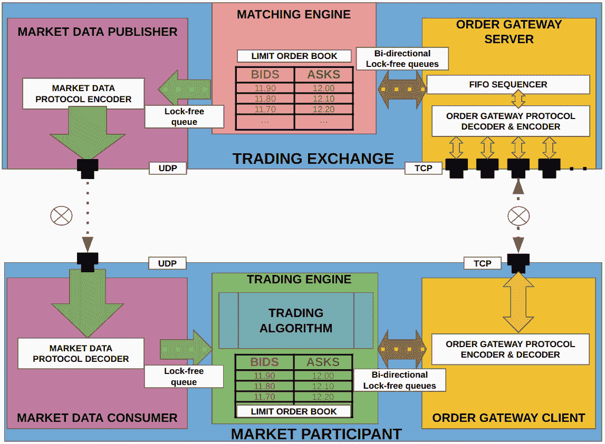
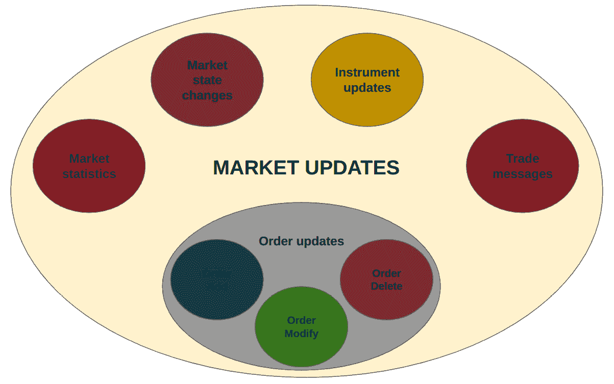
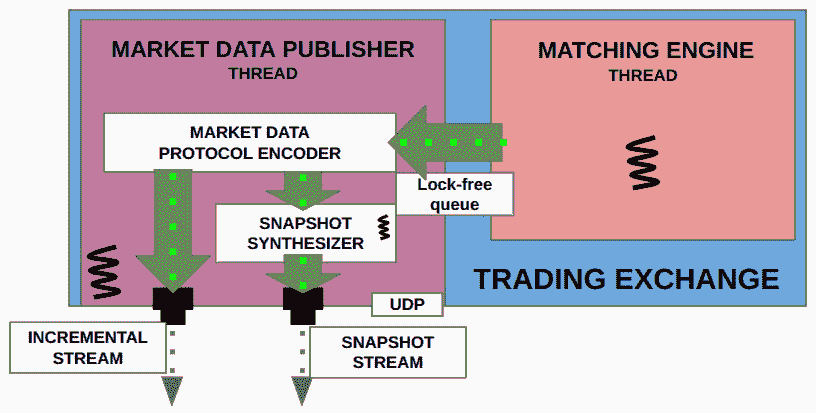
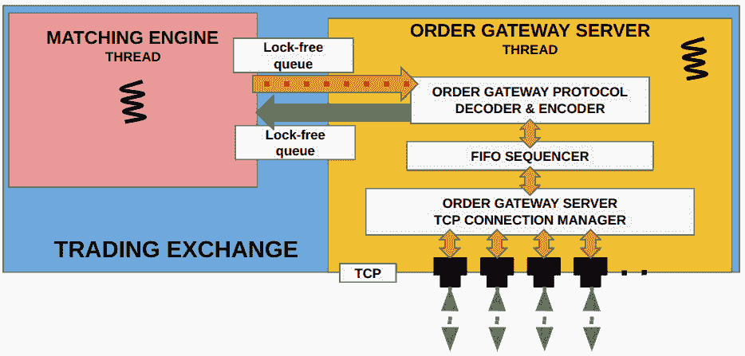
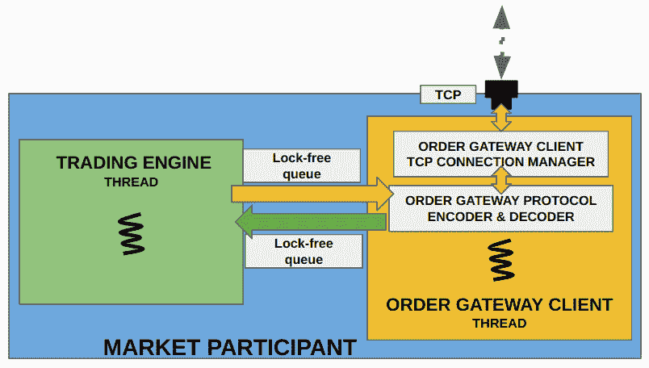
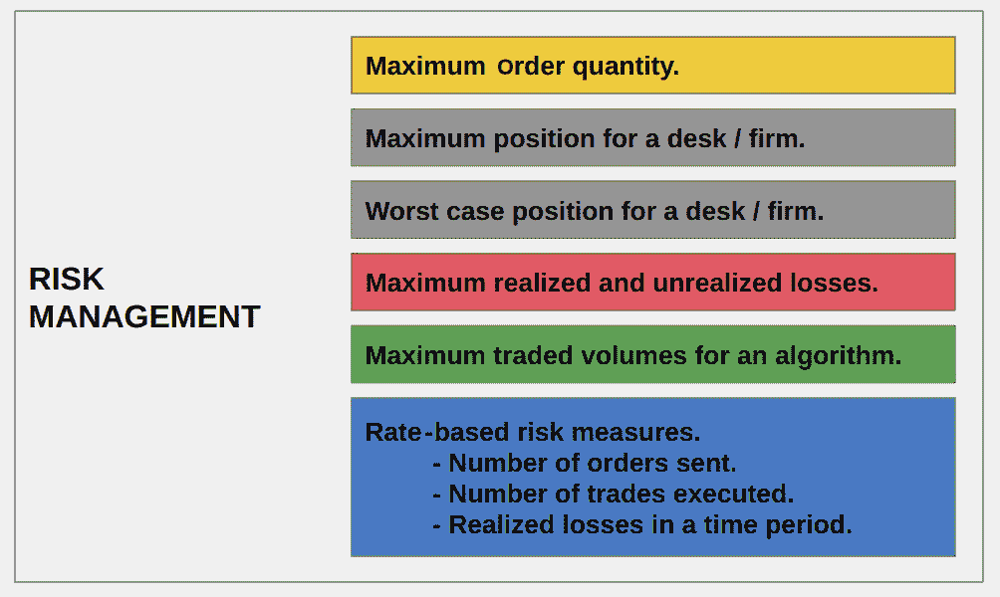
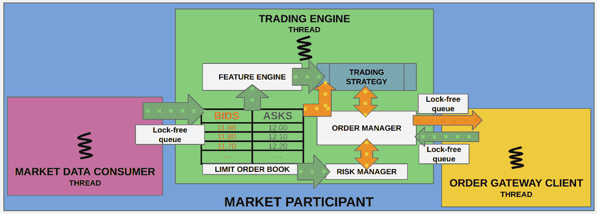

# 第五章：设计我们的交易生态系统

上一章我们直接进入了 C++的实战、低延迟开发，其中我们构建了一些将在本书剩余部分使用的基石。现在我们准备开始设计我们的电子交易生态系统，这将是本书剩余部分的主要项目，我们将学习低延迟应用开发的实际原则。首先，我们将讨论我们将为端到端电子交易生态系统构建的不同低延迟组件或应用程序的高层次设计和架构。我们还将设计它们之间的抽象、组件和交互，这些将在本书的其余部分实现。

在本章中，我们将涵盖以下主题：

+   理解电子交易生态系统的布局

+   在交易交易所设计 C++撮合引擎

+   理解交易所如何向参与者发布信息

+   构建市场参与者与交易所的接口

+   设计低延迟 C++交易算法的框架

让我们通过描述我们将在这本书的剩余部分设计和构建的电子交易生态系统的整体拓扑结构来开启这一章。我们将在下一节简要介绍不同的组件，然后在本章的其余部分进行更详细的讨论。有一点需要记住的是，我们将在本书中构建的电子交易生态系统是实践中存在的简化版本。这不仅是一个简化版本，而且它还是所有实际构建和运行完整电子交易生态系统所需组件的一个子集。我们选择在本书中构建的组件是因为它们是最对延迟敏感的组件，我们试图将我们的重点放在低延迟应用开发上。我们想提一下，在实践中，你将发现诸如在交易所和客户端端的历史数据捕获、与清算经纪人的连接、交易处理、会计和结算的后端系统、针对历史数据的回测框架（测试）以及许多其他组件。

# 理解电子交易生态系统的布局

首先，我们开始提供本书其余部分将要构建的电子交易生态系统的更高层次布局。在深入细节之前，我们首先声明这是一个简化的设计，它代表了电子交易市场实际发生的情况。简化是必要的，以便将范围限制在本书可以涵盖的内容内；然而，这仍然是对实践中发现内容的准确但简化的表示。需要注意的是，这里的目的是理解低延迟应用程序的设计和实现，因此我们要求您更多地关注我们应用 C++和计算机科学原理的应用，而不是交易生态系统本身的细节。

现在，让我们通过定义和解释电子交易生态系统及其组成部分的整体拓扑结构来开始这次介绍。

## 定义电子交易生态系统的拓扑结构

让我们先通过以下图表提供一个系统的鸟瞰图：

图 5.1 – 简单电子交易生态系统的拓扑结构

主要组成部分，如前图所示，如下所示，根据其属于交易所侧还是交易客户端/市场参与者侧进行高级别划分。

这些是交易所组件：

+   电子交易交易所的匹配引擎

+   交易交易所的订单网关服务器和协议编码器/解码器

+   交易所的市场数据编码器和发布者

这些是交易客户端组件：

+   对该市场数据感兴趣的市场参与者使用的市场数据消费者和解码器

+   市场参与者系统中的订单网关编码器和解码器客户端

+   参与者系统内的交易引擎

我们将在下一节中快速介绍这些组件中的每一个，然后在本书的其余部分详细讨论它们。

## 介绍电子交易生态系统的组成部分

在这里，我们将快速介绍构成电子交易生态系统的不同组件。需要注意的是，在竞争性生态系统中，每个组件都需要设计成能够以尽可能低的延迟处理事件和数据。另外，请注意，在市场波动加剧的时期，这些系统必须能够跟上并反应市场活动的大幅波动。

### 介绍市场数据发布者

交易交易所的市场数据发布者负责将匹配引擎维护的限价订单簿的每一项变更传达给市场参与者。与订单网关相比，这里的区别在于市场数据发布者发布的是面向所有参与者的公共数据，并且通常隐藏哪些订单属于哪个参与者的细节，以保持公平性。另一个区别是，订单网关基础设施只向受变更影响的订单所属的市场参与者传达订单更新，而不是所有市场参与者。市场数据发布者可以使用 TCP 或 UDP 来发布市场数据，但鉴于市场数据更新的量大，UDP 组播是首选的网络层协议。市场数据发布者还负责在发布更新之前将内部匹配引擎格式转换为市场数据格式。

### 介绍匹配引擎

电子交易交易所的匹配引擎是交易交易所最关键的部分。它负责处理市场参与者对其订单的请求，并更新其维护的限价订单簿。这些请求是在客户想要添加新订单、替换现有订单、取消现有订单等情况下生成的。限价订单簿是由所有参与者发送的所有订单汇总到一个中央单一簿中，包括出价（买入订单）和要价（卖出订单）。匹配引擎还负责执行跨价格匹配的订单（即，当买入价格高于或等于卖出价格时，将买入订单与卖出订单匹配）。在特殊市场状态，如**PreOpen**（市场开盘前），**Auction**/**Opening**（市场开盘的瞬间），**PreOpenNoCancel**（可以输入订单但不能取消），等等，规则略有不同，但我们不会担心这些规则或实现它们，以保持对低延迟应用开发的关注。

### 介绍交易所的订单网关服务器

交易所的订单网关服务器负责接受市场参与者的连接，以便他们可以发送订单请求并在其相应订单有更新时接收通知。订单网关服务器还负责在匹配引擎格式和订单网关消息协议之间翻译消息。用于订单网关服务器的网络协议始终是 TCP，以确保消息的有序交付和可靠性。

### 在市场参与者层面引入市场数据消费者

市场数据消费者是市场参与者侧交易所市场数据发布组件的补充。该组件负责订阅由市场数据发布者设置的上 UDP 流或 TCP 服务器，消费市场数据更新，并将市场数据协议解码成交易引擎其他部分使用的内部格式。

### 介绍订单网关编解码器客户端

订单网关客户端组件是市场参与者侧交易所订单网关服务器的补充。该组件的职责是建立并维护与交易所订单网关基础设施的 TCP 连接。它还负责将策略订单请求编码为正确的交易所订单消息协议，并将交易所响应解码成交易引擎使用的内部格式。

### 在市场参与者系统中介绍交易引擎

交易引擎是市场参与者交易系统的核心。这是智能所在之处，也是交易决策做出的地方。该组件负责从市场数据消费者组件中消费标准化市场数据更新。它通常还会构建完整的限价订单簿，以反映市场状态，或者至少是订单簿的简化版本，这取决于交易策略的要求。它通常还会在订单簿的流动性和价格基础上构建分析，并做出自动化的交易决策。该组件使用订单网关客户端组件与交易交易所进行通信。

现在我们已经介绍了电子交易生态系统中涉及的主要组件，我们将更详细地研究这些组件。首先，我们将从位于电子交易交易所系统中的匹配引擎开始。

# 在交易交易所设计 C++ 匹配引擎

在本节中，我们将讨论上一节中介绍的电子交易交易所系统内的匹配引擎组件。我们首先要做的是理解匹配引擎的作用以及为什么需要它。

## 理解匹配引擎的目的

在由单一交易交易所组成的电子交易生态系统中，通常情况下，有一个交易所负责接受和管理来自众多市场参与者的订单。在这种情况下，匹配引擎接受参与者可以为任何给定交易工具发送的不同类型的订单。**订单**是任何市场参与者向交易交易所发送的请求，以传达他们对购买或出售可交易产品的兴趣。每当匹配引擎从订单网关服务器基础设施接收到新订单时，它会检查这个新订单是否与现有订单的相反方交叉，以确定是否发生交易。对于本书的目的，我们假设市场参与者只发送**限价订单**并指定订单方向、数量和价格。限价订单是只能以市场参与者指定的价格或更好的价格执行的订单。

到现在为止，应该很明显，匹配引擎执行的是最关键的任务，即在不同市场参与者之间执行订单匹配，并且正确、公平地执行。这里的公平是指首先处理到达交易所的订单，这种**先进先出**（FIFO）的排序在订单网关基础设施中处理，我们将在稍后讨论。那些未能立即匹配的订单留在簿中，被称为**被动订单**。当新的订单以跨过被动订单的价格进入时，这些订单才有资格进行匹配。这种跨过被动订单价格的订单被称为**积极订单**。

匹配引擎将所有市场参与者发送的所有被动订单排列到一个称为**订单簿**的数据结构中。这个订单簿的细节将是我们下次讨论的主题。

## 理解交易所订单簿

限价订单簿包含了所有市场参与者针对单一交易工具的所有被动限价订单。这些订单通常按照从最高买入价到最低买入价排列被动买入订单，以及从最低卖出价到最高卖出价排列被动卖出订单。这种排序方式直观且自然，因为被动买入订单是从最高买入价到最低买入价进行匹配，而被动卖出订单是从最低卖出价到最高卖出价进行匹配。对于同一方和相同价格的订单，它们将根据发送时间按照先进先出（FIFO）的顺序排列。请注意，FIFO 只是排序标准之一；现代电子交易市场有不同的匹配算法类型，例如**按比例分配**（Pro Rata）以及一些 FIFO 和按比例分配的混合。按比例分配是一种匹配算法，其中较大的订单无论在 FIFO 队列中的位置如何，都会从积极订单中获得更大的成交量。对于我们的匹配引擎，我们只将实现 FIFO 匹配算法。

要完全理解订单簿的工作原理，我们将查看市场发生的一些场景以及它们如何影响订单簿。让我们首先确定订单簿的初始状态。假设有三个不同的市场参与者——客户 A、B 和 C 在买卖双方有订单。

| 客户 A 订单号 1 买入 20 @ 10.90 | 客户 B 订单号 5 卖出 10 @ 11.00 |
| --- | --- |
| 客户 A 订单号 2 买入 10 @ 10.80 | 客户 C 订单号 6 卖出 5 @ 11.00 |
| 客户 B 订单号 3 买入 5 @ 10.80 | 客户 B 订单号 7 卖出 5 @ 11.10 |
| 客户 C 订单号 4 买入 100 @ 10.70 |  |

表 5.1 – 包含一些订单的初始限价订单簿状态

在这里，客户 A 有 2 个被动买入订单，数量分别为 20 和 10，价格分别为 10.90 和 10.80。客户 B 有一个数量为 5 的买入订单，价格为 10.80，以及 2 个卖出订单，数量分别为 10 和 5，价格分别为 11.00 和 11.10。客户 C 有 2 个被动订单，分别是数量为 5 的买入订单和数量为 5 的卖出订单，价格分别为 10.80 和 11.00。现在，假设客户 A 发送一个新的买入订单，数量为 10，价格为 10.90，而客户 B 发送一个新的卖出订单，数量为 10，价格为 11.20。更新的订单簿如下表所示，新的订单被突出显示。由于 FIFO 排序，新的订单号*OrderId=8*在相同价格下位于订单号*OrderId=1*的买入订单之后。

| 客户 A 订单号 1 买入 20 @ 10.90 | 客户 B 订单号 5 卖出 10 @ 11.00 |
| --- | --- |
| **客户 A 订单号 8 买入 10 @** **10.90** | 客户 C 订单号 6 卖出 5 @ 11.00 |
| 客户 A 订单号 2 买入 10 @ 10.80 | 客户 B 订单号 7 卖出 5 @ 11.10 |
| 客户 B 订单号 3 买入 5 @ 10.80 | **客户 B 订单号 9 卖出 10 @** **11.20** |
| 客户 C 订单号 4 买入 100 @ 10.70 |  |

表 5.2 – 新增订单后的更新订单簿

现在，假设客户 A 将订单号*OrderId=2*的数量从 10 增加到 20。当以这种方式增加订单的数量时，该订单在 FIFO 排序中会失去优先级，并移至该价格级别的队列末尾。我们还假设客户 B 将订单号*OrderId=5*的数量从 10 减少到 1。请注意，根据市场规则，当减少订单的数量时，它不会失去队列中的优先级，并且仍然保持在原位。更新的订单簿如下所示，受影响的订单被突出显示：

| 客户 A 订单号 1 买入 20 @ 10.90 | **客户 B 订单号 5 卖出 1 @** **11.00** |
| --- | --- |
| 客户 A 订单号 8 买入 10 @ 10.90 | 客户 C 订单号 6 卖出 5 @ 11.00 |
| 客户 A 订单号 3 买入 5 @ 10.80 | 客户 B 订单号 7 卖出 5 @ 11.10 |
| **客户 B 订单号 2 买入 20 @** **10.80** | 客户 B 订单号 9 卖出 10 @ 11.20 |
| 客户 C 订单号 4 买入 100 @ 10.70 |  |

表 5.3 – 修改订单后的订单簿状态

最后，让我们假设客户端 A 将订单 ID 为 4 的买入订单从 10.70 的价格修改为 10.90 的价格，数量没有变化。此订单操作的影响相当于取消订单并以新价格发送新订单。让我们还假设客户端 B 决定他们不再需要订单 ID 为 9 的卖出订单，并发送了取消请求。由于这两个操作，下一个显示的更新订单簿中，修改后的订单被突出显示，取消的订单已从订单簿中移除：

| 客户端 A 订单 ID 1 买入 20 @ 10.90 **客户端 B 订单 ID 5 卖出 1 @** **11.00** |
| --- |
| 客户端 A 订单 ID 8 买入 10 @ 10.90 客户端 C 订单 ID 6 卖出 5 @ 11.00 |
| **客户端 C 订单 ID 4 买入 100 @** **10.90** 客户端 B 订单 ID 7 卖出 5 @ 11.10 |
| 客户端 A 订单 ID 3 买入 5 @ 10.80 |  |
| 客户端 B 订单 ID 2 买入 20 @ 10.80 |  |

表 5.4 – 修改和取消操作后的限价订单簿状态

到目前为止，在我们讨论的场景中，还没有发生交易，因为订单活动是这样的，所有买入订单的价格都低于所有卖出订单的价格。让我们在下一节中继续讨论，看看当有一个可以跨越买入或卖出订单价格的积极订单时会发生什么，以及它会产生什么影响。

关于订单修改，有两点需要注意如下：

+   当订单修改以减少数量时，订单在队列中的优先级或位置不会改变

+   当订单修改以增加数量或修改订单价格时，它具有取消订单并发送带有新价格和数量值的订单的等效效果（即，将分配一个新的优先级）

在下一节中，我们将探讨匹配引擎需要执行的下一个大任务——匹配相互交叉的参与者订单。

## 匹配参与者订单

在本节中，我们将了解当市场参与者修改现有订单或以某种方式发送新订单，使得该订单的价格将导致与另一侧的现有被动订单匹配时会发生什么。在这种情况下，匹配引擎将此积极订单与从最积极到最不积极的价位的被动订单进行匹配。这意味着被动买单从最高到最低的买入价格进行匹配，被动卖单从最低到最高的卖出价格进行匹配。在被动订单未完全匹配，因为积极订单的数量小于另一侧的被动流动性时，剩余的流动性将保留在订单簿中。在积极订单未完全匹配，因为另一侧的被动流动性少于积极订单的数量时，剩余的数量将作为被动订单保留在订单簿中。

让我们了解匹配参与订单的不同情况，并假设订单簿的状态是我们在上一个部分留下的，如下所示：

| 客户 A 订单号 1 买入 20 @ 10.90 | 客户 B 订单号 5 卖出 1 @ 11.00 |
| --- | --- |
| 客户 A 订单号 8 买入 10 @ 10.90 | 客户 C 订单号 6 卖出 5 @ 11.00 |
| 客户 C 订单号 4 买入 100 @ 10.90 | 客户 B 订单号 7 卖出 5 @ 11.10 |
| 客户 A 订单号 3 买入 5 @ 10.80 |  |
| 客户 B 订单号 2 买入 20 @ 10.80 |  |

表 5.5 – 任何订单匹配之前的订单簿初始状态

现在，让我们假设客户 C 发送了一个数量为 50，卖出价格为 10.90 的卖出订单。这将导致卖出订单与 *订单号=1* 和 *订单号=8* 的买入订单完全匹配，并且与 *订单号=4* 的买入订单部分匹配，数量为 20，剩余数量为 80。完全匹配的订单将从订单簿中移除，部分匹配的订单将修改为新剩余数量。这次匹配交易后的更新订单簿如下所示：

| **客户 C 订单号 4 买入** **80 @** **10.90** | 客户 B 订单号 5 卖出 1 @ 11.00 |
| --- | --- |
| 客户 A 订单号 3 买入 5 @ 10.80 | 客户 C 订单号 6 卖出 5 @ 11.00 |
| 客户 B 订单号 2 买入 20 @ 10.80 | 客户 B 订单号 7 卖出 5 @ 11.10 |

表 5.6 – 反映激进订单和部分执行影响的订单簿

现在，让我们假设客户 A 发送了一个数量为 10，买入价格为 11.00 的买入订单。这将完全匹配 *订单号=5* 和 *订单号=6* 的卖出订单，并且激进买入订单上的剩余未匹配数量作为被动买入订单留在簿中。这次匹配交易后的更新订单簿如下所示：

| **客户 A 订单号 9 买入** **4 @** **11.00** | 客户 B 订单号 7 卖出 5 @ 11.10 |
| --- | --- |
| 客户 C 订单号 4 买入 80 @ 10.90 |  |
| 客户 A 订单号 3 买入 5 @ 10.80 |  |
| 客户 B 订单号 2 买入 20 @ 10.80 |  |

表 5.7 – 完全执行后的订单簿和激进方剩余数量

现在我们已经了解了在匹配引擎中会遇到的大量常见交互以及它们是如何处理的，以及它们与限价订单簿的交互方式，我们可以设计本书中将要构建的匹配引擎。

## 设计我们的匹配引擎

我们将在本书的剩余部分实现本章中讨论的每个 C++ 电子商务生态系统组件。然而，在我们开始下一章之前，了解这些组件的架构对于使实现细节更容易和更清晰是很重要的。我们在这里只展示了 *图 5**.1* 中的匹配引擎组件，这样我们可以更详细地讨论我们的匹配引擎设计：

图 5.2 – 匹配引擎组件设计

与*图 5**.1*相比，我们在本图中提供了更多细节，接下来我们将讨论匹配引擎的主要设计选择。

### 线程模型

在我们的系统中，匹配引擎、市场数据发布者和订单网关服务器将是独立的线程。这是故意的，以便每个组件都可以独立运行，在市场活动高峰期间，整个系统可以达到最大吞吐量。此外，每个组件还需要执行其他任务——例如，订单网关服务器必须与所有市场参与者保持连接，即使匹配引擎正忙也是如此。同样，让我们假设市场数据发布者正忙于在网络中发送市场数据；我们不希望匹配引擎或订单网关服务器减慢速度。我们已经在上一章的“为低延迟应用构建 C++构建块”部分中的“C++多线程低延迟应用”部分中看到了如何创建线程、设置它们的亲和性以及为它们分配任务。

### 线程间的通信

在这里需要讨论的另一件重要事情是匹配引擎与订单网关服务器基础设施之间的通信。订单网关服务器将来自市场参与者的订单请求序列化，并将它们转发给匹配引擎进行处理。匹配引擎需要为订单请求生成响应并将它们发送回订单网关服务器。此外，它还需要通知订单网关服务器参与者订单上的执行情况，以便他们可以了解交易情况。因此，需要一个双向队列，或者从订单网关服务器到匹配引擎的一个队列，以及从匹配引擎到订单网关服务器的一个队列。

另一个通信渠道是当匹配引擎生成并发送市场数据更新，以反映公共市场数据发布组件的限价订单簿更新状态时。

最后，由于匹配引擎、订单网关服务器和市场数据发布者都是不同的线程，这里我们找到了一个无锁队列的完美案例。我们将使用我们在上一章的“使用无锁队列传输数据”部分中创建的无锁 FIFO 队列。

### 限价订单簿

最后，对于限价订单簿，我们将使用几种不同的数据结构来高效地实现它。在不深入具体实现细节（我们将在下一章中探讨）的情况下，我们需要在双方都保持正确的排序顺序来维护买卖报价，以便在积极订单到来时进行高效的匹配。我们需要能够高效地在价格级别中插入和删除订单，以支持基于客户请求的添加、修改和删除订单等操作。在这里，另一个特别重要的考虑因素是，我们使用的数据结构和订单对象本身必须避免动态内存分配，并尽可能少地复制数据。我们将在上一章的“设计 C++内存池以避免动态内存分配”部分中大量使用我们创建的内存池。

# 理解交易所如何向参与者发布信息

上一节专门讨论了匹配引擎的细节，在讨论中，我们假设匹配引擎从订单网关服务器基础设施接收市场参与者的订单请求。我们还隐含地假设匹配引擎会将其维护的限价订单簿的变化通知给所有监听市场数据馈送的市场参与者。在本节中，我们将讨论匹配引擎依赖以与市场参与者通信的市场数据发布者和订单网关服务器组件。

## 通过市场数据通信市场事件

让我们先讨论市场数据发布者组件。这个组件负责将匹配引擎维护的限价订单簿的更新转换为。我们之前提到，市场数据网络层协议可以是 TCP 或 UDP，但通常，实践中首选的协议是 UDP，我们将在我们的市场数据发布者中也使用这个协议。

简而言之，市场数据协议代表了市场数据发布者通过 UDP（或在某些情况下 TCP）协议发布消息的格式。**FIX Adapted for STreaming**（**FAST**）是目前许多电子交易交易所使用的最知名和最受欢迎的市场数据消息格式。还有其他协议，如**ITCH**、**PITCH**、**Enhanced Order Book Interface**（**EOBI**）、**Simple Binary Encoding**（**SBE**）等，但为了本书的目的，我们将创建一个简单的自定义二进制协议，如 EOBI 或 SBE，我们将使用它。

由于 FIX 是金融应用中最常用的协议，我们将在此处介绍一些细节。FIX 数据组织成一系列`标签`=`值`样式的字段。通过一个简单的例子更容易理解这一点，所以对于一个假设的市场数据更新，你可能收到以下一系列字段来传达该更新的所有数据。这个假设的市场数据更新对应于向苹果公司股票（股票代码 AAPL，数值安全 ID 68475）添加一个数量为 1,000 的新买盘订单，价格为 175.16。

| **标签** | **修正名称** | **值** | **描述** |
| --- | --- | --- | --- |
| 268 | NoMDEntries | 1 | 市场数据更新数量 |
| 279 | MDUpdateAction | 0 (New) | 市场数据更新类型 |
| 269 | MDEntryType | 0 (Bid) | 市场数据条目类型 |
| 48 | SecurityID | 68475 (AAPL) | 交易产品的整数标识符 |
| 270 | MDEntryPx | 175.16 | 本市场数据更新的价格 |
| 271 | MDEntrySize | 1000 | 本市场数据更新的数量 |
| ... | ... | ... | ... |

表 5.8 – 一个对应于假设市场数据更新的 FIX 消息示例

构成市场数据协议的不同类型的信息大致可以分为以下几类：

图 5.3 – 交易所发送的不同市场更新

让我们接下来讨论这些内容。

### 市场状态变化

这些消息通知市场参与者关于市场变化和/或撮合引擎状态的变化。通常，市场会经历诸如**关闭**（用于交易）、**开盘前**（常规交易会话前的市场状态）、**开盘**（当市场从开盘前状态过渡到交易状态时）和**交易**（常规交易会话）等状态。

### 仪器更新

交易所使用仪器更新消息来通知市场参与者关于可用于交易的不同仪器。一些交易所支持市场参与者可以即时创建的特殊类型的仪器，并且这些消息用于通知参与者此类仪器的变更。通常，这些消息用于通知参与者有关仪器元数据，例如最小价格增量、刻度值等。**最小价格增量**是订单价格之间的最小价格差异。在我们迄今为止看到的例子中，我们假设最小价格增量是 0.10（即有效价格是 0.10 的倍数）。**刻度值**是我们以比单个最小价格增量大的价格买卖时，所赚取或亏损的金额。非常常见的是，对于股票、**交易所交易基金**（**ETF**）等产品，刻度乘数仅为 1，这意味着盈亏仅仅是买卖价格之差。ETF 是在交易所交易的证券，是一种投资选择，由一篮子证券组成，即通过投资 ETF，你投资的是构成该 ETF 的资产组合。但对于一些杠杆产品，如期货、期权等，这个刻度乘数可能不是 1，最终的盈亏计算如下：

`((sell-price – buy-price) / min-price-increment) * trade-qty *` `tick-size`.

### 订单更新

市场数据发布者使用订单更新消息来传达对匹配引擎维护的限价订单簿中订单的变化——具体来说，是对我们在“设计交易交易所中的 C++ 匹配引擎”部分的“理解交易所订单簿”子节中讨论的类似订单簿的更新。通常，不同类型的订单更新消息如下：

+   `instrument-id`、`order-id`、`price`、`side`、`quantity` 和 `priority`。这里的 `priority` 字段用于指定订单在该价格下的 FIFO 队列中的位置。

+   **订单修改** – 交易所使用此消息让参与者知道一个被动订单在价格或数量或两者都进行了修改。此消息具有与订单添加消息类似的字段。如前所述，在大多数情况下（除非订单数量减少），将为订单修改事件分配一个新的订单优先级值。

+   `instrument-id` 和 `order-id` 用于指定从订单簿中删除的订单。

### 交易消息

交易消息由交易所用于通知市场参与者市场发生了匹配。通常，这里的属性包括`instrument-id`、积极订单的一侧、交易的执行价格和交易量。通常，当发生交易时，交易所还会发布所需数量的订单删除、订单修改和订单添加消息，以传达有关哪些订单已完全执行和/或部分执行，需要从簿中删除或修改以反映订单簿的新状态。

### 市场统计数据

这些是某些交易所发布的一些可选消息，用于传达有关交易工具的不同类型的统计数据。这些统计数据可以是有关交易工具的交易量、未平仓合约、最高价、最低价、开盘价和收盘价等信息。

我们已经讨论了关于市场数据消息类型及其试图传达的信息的许多细节。现在，我们准备设计我们将在我们的电子交易交易所中构建的市场数据发布器。

## 设计市场数据发布器

让我们讨论一下我们将在我们的电子交易所中实施的几个市场数据发布器设计细节。在这里，我们只展示了*图 5.1*中的市场数据发布器，以便我们可以更详细地讨论设计。

图 5.4 – 我们市场数据发布器基础设施的设计

市场数据发布器基础设施有两个主要组件。它们都使用我们在上一章的*使用套接字的 C++网络编程*部分中构建的套接字实用程序，将市场数据放在线上。这还包括我们构建的线程库，它将被用于创建、启动和运行市场数据发布器线程。

### 市场数据协议编码器

市场数据发布器基础设施内部的协议编码器组件负责对由匹配引擎发布的市场数据更新进行编码。市场数据编码器消耗反映订单簿变化的订单簿更新，并将它们转换为带有一些附加信息的公共市场数据消息格式。此组件还将增量市场数据更新发布到为增量流配置的 UDP 多播流。请记住，增量流仅包含可用于更新订单簿的市场更新，前提是参与者在增量更新之前对限价订单簿有准确的看法。编码后的市场数据更新还会发布到快照合成器组件，我们将在下一节中更详细地讨论。

市场数据流在网络流量方面通常非常大，并且在市场波动性高的时期会经历大量的活动爆发。由于 TCP 协议因为消息收到的确认和丢失数据的重传而增加了额外的带宽，通常情况下，UDP 是市场数据的首选网络协议。通过 UDP 的多播流进行流式传输也是首选，因为市场数据可以在多播流中一次性分发，所有感兴趣的订阅者都可以订阅该流，而不是通过 TCP 与每个市场数据消费者建立一对一的连接。这种设计并非没有缺点，即市场数据消费者可能会因为网络拥塞、硬件或软件缓慢等原因丢弃 UDP 数据包。当这种情况发生时，交易客户端维护的订单簿是不正确的，因为他们可能丢失了一个与新增订单、修改或取消订单等相对应的更新。这正是快照多播流解决的问题，我们将在后续章节中通过示例来探讨，但在下一节中，我们将简要介绍快照合成器组件。

### 快照合成器

快照合成器消费由市场数据协议编码器发布的编码市场数据更新，合成最新的限价订单簿快照，并将快照定期发布到快照多播流中。这里的重要点是快照合成不会干扰增量流发布，以便尽可能快地发布订单簿的增量更新。这是一个独立的执行线程，其唯一责任是根据增量更新生成订单簿的准确快照。此组件还在快照更新上添加正确的序列信息，以便在发布到快照 UDP 多播流之前在客户端端同步。这意味着在它发送的快照消息中，它将提供用于合成此快照消息的增量流中的最后一个序列号。这很重要，因为下游市场数据消费者客户端可以使用增量流中最后更新的这个序列号来执行成功的同步/追赶。当我们构建我们的市场数据发布器和市场数据消费者组件时，这一点将变得非常清楚，因为那时我们将通过示例涵盖所有细节。另一件需要理解的事情是，适用于我们系统中其他组件的低延迟标准不适用于这里，因为这是一个延迟和子采样的信息流。此外，客户端端预期数据包丢失将极为罕见，客户端端的快照同步过程较慢，因此尝试使此组件超低延迟是不必要的。对于我们的快照合成器组件，我们也将使用 UDP 协议以保持简单，但在实践中，这通常是 TCP 和 UDP 协议的组合。对于低延迟的市场参与者，预期 UDP 流中的数据包丢失将很少，因为通常，到交易所的网络连接以及沿途的交换机具有大带宽容量和低交换延迟。此外，参与者投入资源采购和安装超级快速的服务器，构建低延迟的市场数据消费者软件，并使用特殊的**网络接口卡**（**NICs**）来处理大量市场数据。

这本书中我们将构建的市场数据发布器基础设施的高级设计到此结束。接下来，我们需要讨论交易所用来通知市场参与者关于其订单请求响应以及订单何时被执行的其他渠道——订单网关接口。

## 通过订单网关接口通知市场参与者

我们讨论了市场数据消费者被电子交易交易所用来传播有关订单簿变化和交易所提供的不同交易工具匹配情况等公共信息。这里的要点是，这是对所有人开放的公共市场数据，只要他们能够访问并订阅市场数据流，就可以获取这些数据。本节将讨论交易所用来与市场参与者沟通其订单更新情况的另一个接口——订单网关接口。

公共市场数据馈送提供的信息与订单网关基础设施提供的信息之间有几个关键区别。

### 理解网络协议的差异

我们之前已经提到过，但在这里我们将再次强调，通常，市场数据发布者在网络层面使用 UDP 协议，而订单网关基础设施在其与市场参与者的连接中使用 TCP 协议。这是因为市场数据发布者发布的数据量非常大，需要尽可能快地发布，因此选择了 UDP 而不是 TCP。市场数据发布者通常有额外的同步机制来处理 UDP 上罕见的包丢失。订单网关基础设施依赖于 TCP，因为它需要一个可靠的方法与客户端通信，没有 TCP，这里的包丢失很难优雅地处理。直观上，如果客户端不确定他们的订单是否到达了交易所，或者不确定他们的订单更新或匹配时是否立即收到了通知，这将是一个大问题。

### 区分公共信息和私人信息

市场数据发布者与订单网关基础设施之间可能最大的区别是，市场数据发布者发布公共信息，同时隐藏一些敏感信息，例如订单属于哪个客户或哪些客户参与了匹配交易。这些信息也对所有市场参与者公开，目的是用来构建限价订单簿，以反映交易工具的状态。另一方面，订单网关服务器只向拥有正在更新的订单的客户发布订单更新通知。另一种思考方式是，为了接收和处理公共市场数据，参与者不需要在订单簿中有任何订单。但为了接收私人订单网关通知，参与者必须在订单簿中有订单，否则，交易所没有可以私下通知客户的内容。

### 为参与者发送订单请求

现在应该很明显的一个主要区别是，订单网关组件发送促进了双向通信通道。这意味着客户端可以向交易所发送订单请求，如新订单、修改订单、取消订单等。另一方面，正如我们讨论的那样，交易所使用订单网关基础设施向市场参与者发送订单的私有通知。市场数据发布者基础设施通常不处理任何客户端请求（即，通信路径仅从交易所到市场数据订阅者）。

我们需要在电子交易交换的一侧设计最后一个发送组件，即我们刚才讨论的订单网关基础设施；让我们在下一节中完成这项工作。

## 设计订单网关服务器

让我们讨论一下我们将在电子交易所中实现的订单网关服务器的一些设计细节。在这里，我们只展示了*图 5.1*的订单网关服务器基础设施，以便我们可以更详细地讨论我们的订单网关服务器的设计。

图 5.5 – 我们订单网关服务器基础设施的设计

与*图 5.1*相比，此图提供了更多细节，并分解了订单网关服务器基础设施子组件的一些细节。

### TCP 连接服务器/管理器

订单网关基础设施内部的第一组件是 TCP 连接管理器。该组件负责设置一个 TCP 服务器，该服务器监听并接受来自市场参与者订单网关客户端的传入 TCP 连接。它还负责检测断开连接的客户端并将它们从活动连接列表中移除。最后，该组件需要将来自撮合引擎的订单响应转发给正确的客户端。我们将使用在前一章“为低延迟应用构建 C++构建块”中实现的套接字工具、TCP 套接字和 TCP 服务器功能。

### FIFO 序列器

另一个这个组件需要完成的任务是在处理市场参与者的请求时保持公平性。如前所述，为了保持公平性，客户端响应必须按照它们在交易所基础设施中接收的确切顺序进行处理。因此，FIFO 序列器必须确保它按照接收顺序将客户端请求转发给匹配引擎，这些请求是通过 TCP 连接管理器维护的不同客户端连接发送的。

### 交易所消息协议解码器和编码器

编码器-解码器组件负责在交换消息协议和匹配引擎期望客户端请求的内部结构之间进行转换，并发布客户端响应。根据交换协议的复杂性，这可以简单到将正确的字段打包和提取到打包的二进制结构中。如果交换消息格式更复杂，那么将涉及额外的编码和解码步骤。对于本书的目的，我们将有一个简单的交换订单消息协议，它使用打包的二进制结构，并在交换匹配引擎使用的格式之上包含额外的信息。

这结束了我们对电子交易交易所的讨论，现在我们可以继续构建一个希望在这个交易所进行交易的参与者的客户端基础设施。

# 构建市场参与者对交易所的接口

我们现在将讨论市场参与者系统中组件的目的和设计。具体来说，我们将从讨论客户端交易系统中的市场数据消费者开始，它订阅、消费并解码交易所发布的公共市场数据。我们还将讨论客户端交易系统中的订单网关客户端基础设施，它连接到交易所订单网关服务器。订单网关客户端还负责向交易所发送订单请求并接收和解析客户端订单的响应。

## 理解市场数据消费者基础设施

市场数据消费者组件是电子交易交易所中市场数据发布组件的直接补充。它负责订阅和消费交易所发布的多播网络流量，解码和标准化从交易所协议读取的市场数据到内部格式，并实现与数据包丢失相关的同步机制。

### 订阅和消费 UDP 多播流量

第一项也是最为明显的任务是订阅交易所发布市场数据的多播流。通常，为了负载均衡，交易所将不同的交易工具分组在不同的多播流地址上。这使得客户端可以根据客户感兴趣的交易工具和产品选择交易所发布的数据的子集。通常，这涉及到客户端加入正确的多播流，这些地址是交易所公开的信息。

### 从交易所协议解码和标准化

市场数据消费者接下来需要做的是将交易所市场数据协议转换为参与者系统中其他组件使用的内部格式。根据交易所市场数据协议的不同，这个组件的部分可能在复杂性和性能延迟方面有所不同。最快的协议是那些需要最小解码的协议，如 EOBI 和 SBE，它们只是二进制打包的结构。这意味着市场数据格式是这样的，解码流仅仅涉及将字节流重新解释为我们期望在流中找到的二进制打包结构，并且速度是最快的。更复杂的协议，如 FAST，通常需要更长的时间来解码和标准化。

### 启动同步和包丢失同步

记住我们讨论过，通常交易所更倾向于使用 UDP 作为网络协议来向参与者传输市场数据。虽然这加快了数据向客户端的传输并实现了更高的吞吐量，但这同时也使我们容易受到 UDP 不可靠性导致的包丢失和乱序交付的影响。为了确保市场参与者能够以正确的顺序看到市场数据包，并在发生时检测到包丢失，通常，参与者需要检查包级和工具级序列号。

需要在交易所市场数据发布者和参与者市场数据消费者之间设计的一个机制是，从这样的包丢失中恢复。这个相同的机制也被在市场已经开放后加入市场数据流或如果参与者需要出于任何原因重新启动他们的市场数据消费者组件的参与者所使用。在所有这些情况下，客户端交易系统中的市场数据消费者需要进行一些同步，以获取当前和完整的限价订单簿状态。

本节解释了实现这种同步的常用设计。通常，交易所市场数据流被分为两大组——**快照流**和**增量流**。我们将解释为什么会有这两个流以及它们如何帮助市场参与者处理包丢失的情况。

#### 增量市场数据流

增量市场数据流假设市场参与者已经拥有由撮合引擎维护的正确视图的限价订单簿，并且这个流只发布订单簿之前状态的增量更新。这意味着这个流的带宽需求要低得多，因为它只发布对簿的增量更新。通常，在正常运营条件下，预期市场参与者只订阅增量流以维护订单簿的正确状态。

如果客户端从这个流中丢弃一个数据包，那么他们维护的订单簿状态可能与匹配引擎所拥有的状态不一致。处理这种故障的机制是清除或重置参与者维护的订单簿。然后它需要订阅快照流，该流包含整个订单簿完整状态的数据（而不是只有增量更新）以再次同步到订单簿的正确状态。这里的协议是清除订单簿，开始排队从增量流接收到的增量更新，并等待构建订单簿的完整状态，然后将增量更新应用到该完整订单簿以完成同步。现在，让我们了解一些交易所发布的快照市场数据流的一些更多细节。

#### 快照市场数据流

正如我们之前提到的，快照市场数据流包含可以从完全空状态构建完整订单簿的数据。通常，这个流只包含一个详尽的列表，对应于订单簿中存在的每个被动订单的“订单添加”消息。交易所通常会限制这个列表更新的频率和发布，这意味着它可能每几秒钟才发送一次快照消息流。这是因为，由于这个流包含关于每个交易工具订单簿中所有订单的信息，它可能会变得相当带宽密集。此外，由于数据包丢失极为罕见，并且参与者不介意在启动时等待几秒钟以获取订单簿的正确状态，因此节流通常不会产生很大的负面影响。

这就结束了市场数据协议和同步过程的讨论，因此现在我们可以设计我们将要实现的市场数据消费者。

## 设计市场数据消费者

让我们讨论一下我们将在我们的市场参与者交易系统中实现的市场数据消费者的一些设计细节。我们在这里只展示 *图 5.1* 中的市场数据消费者，以便我们可以更详细地讨论设计。

图 5.6 – 我们市场数据消费者基础设施的设计

让我们讨论市场参与者交易系统中市场数据消费者基础设施设计时的两个主要子组件。它们都使用我们在上一章的 *C++ 网络编程使用套接字* 部分中构建的套接字实用程序来订阅和消费网络上的市场数据。

### 快照和增量流同步器

市场数据消费者需要有一个子组件，除了订阅增量流外，还可以订阅快照流。记住，我们解释过，当市场参与者的系统首次启动或在白天中需要重启，或者从增量流中丢失市场数据包时，它没有正确的限价订单簿视图。在这种情况下，正确的恢复/同步程序是清除限价订单簿，订阅快照流，并等待收到完整的订单簿快照。此外，继续通过增量市场数据流传入的更新需要排队。一旦收到完整的快照，并且从快照中最后更新的序列号开始的全部增量更新都已排队并可用，我们就算完成了。此时，限价订单簿将从快照流中重建，并将所有排队的增量更新应用到这本书上以同步/赶上交易所。此时，消费者可以停止从快照流中消费数据并离开快照流，只从增量流中消费数据。负责此同步机制的市场数据消费者基础设施中的组件，我们将称之为快照和增量流同步子组件。

### 市场数据协议解码器

另一个子组件负责解码来自快照和/或增量市场数据流的传入数据流。该组件将数据从交易所数据源格式转换为交易策略框架的内部格式。这通常是交易所提供的字段的一个子集，并且通常在不同交易交易所之间进行标准化，以使交易策略框架独立于交易所特定的细节。对于我们的市场数据消费者基础设施，我们将保持此组件相当简单，因为我们将会使用打包的二进制结构，但如前所述，在实践中，这可以是一个更复杂的格式，例如 FAST。

我们讨论了市场参与者系统如何从交易所消费公共市场数据流的细节和设计。我们可以继续讨论订单网关客户端基础设施，参与者使用它来发送订单请求并接收响应和执行通知。

## 理解订单网关客户端基础设施

市场参与者交易系统中的订单网关客户端基础设施是一个连接到交易所订单网关服务器的 TCP 客户端。该组件执行的另一项任务是接收通过此 TCP 连接从交易所发送的更新，将接收到的交易所订单消息协议解码成用于整个系统的标准化内部格式。最后，订单网关客户端组件还负责接收交易框架请求的订单操作，并将它们编码成交易所理解的订单消息格式，然后将其发送到交易所。

这里需要记住的重要事情是，订单网关客户端必须始终与交易所保持可靠的 TCP 连接。这是为了确保交易所不会错过任何来自客户端的订单请求，并且客户端不会错过来自交易所的任何订单更新。除了 TCP 网络协议本身实现的可靠性机制外，通常还存在着由交易所和参与者实现的应用级可靠性机制。这种应用级可靠性机制通常包括在从交易所发送到客户端和从客户端发送到交易所的消息上严格递增序列号。此外，还可以实施心跳机制，这些机制简单地说就是从交易所发送到客户端和从客户端发送到交易所的消息，以检查在低活动期间连接是否仍然活跃。

此外，当客户端首次连接时，存在一些机制来验证和识别客户端，这通常是通过握手机制实现的，包括用户识别和密码等。还可能有额外的管理消息，例如登录认证消息，这取决于交换方式，并且可以有多种用途。对于本书的目的，我们将限制范围，不关注这些管理消息，因为它们对我们低延迟的目标无关紧要。

接下来，让我们设计我们的订单网关客户端基础设施。

## 设计订单网关客户端基础设施

让我们讨论一下我们将在市场参与者交易系统中实现的市场数据发布者的设计细节。在这里，我们只展示了*图 5.1*中的订单网关客户端，以便我们可以更详细地讨论设计。 

图 5.7 – 我们订单网关客户端基础设施的设计

市场参与者交易系统中的订单网关客户端由两个简单的组件组成。

### TCP 连接管理器

市场参与者交易系统中的订单网关客户端负责连接到交易所订单网关服务器并管理该连接。在实践中，单个参与者可能会出于负载均衡、冗余和延迟的原因与交易所建立多个连接。但在我们将要构建的电子交易生态系统中，我们将设计它，使得订单网关客户端仅与交易所订单网关服务器建立一个连接。我们将使用上一章在“使用套接字进行 C++网络编程”部分构建的 TCP 套接字客户端库。

### 订单网关协议编码器和解码器

订单消息格式编码器和解码器将交易策略使用的内部格式转换为交易所格式，并将交易所的订单响应和执行通知转换为策略框架的内部格式。这个组件的复杂性会根据交易所格式而变化，但为了我们的交易系统，我们将通过使用二进制打包结构来保持编码和解码的复杂性较低。

接下来，我们将从对订单网关基础设施的讨论转向参与者系统中最复杂（也是最有趣）的组件——交易策略框架。

# 设计低延迟 C++交易算法框架

现在我们已经讨论了市场数据消费者和订单网关客户端组件在市场参与者交易系统中的应用，接下来我们需要讨论的是做出交易决策的框架。这个组件是交易系统中最重要的组件之一，因为这里才是智能所在。所谓智能，我们指的是处理标准化市场数据更新的系统，构建市场状况视图，并计算交易分析以寻找交易机会并执行交易的系统。显然，这个组件依赖于市场数据消费者接收解码和标准化的市场数据更新，并使用订单网关客户端组件以解码和标准化的格式向交易所发送订单请求并接收订单响应。

## 构建订单簿

市场参与者需要根据交易所发布的市场数据构建限价订单簿。请注意，客户构建整个订单簿并不是严格必要的，特别是如果交易策略不需要那么细粒度的信息。为了本书的目的，我们将在我们的交易框架中构建完整的订单簿，但我们只是想指出，在所有情况下这并不是严格必要的。这样一个简单的例子就是只关心了解最积极定价订单的价格和/或数量的策略——即最高出价价格和最低要价价格（称为**订单簿顶部**（**TOB**）或**最佳出价和要价**（**BBO**））。另一个例子是只依赖交易价格做出决策且不需要查看完整订单簿的策略。

在这里需要重申的一点是，客户构建的订单簿与交易所维护的订单簿略有不同，因为客户通常不知道哪个订单属于哪个市场参与者。此外，根据交易所的不同，可能还有更多信息对市场参与者隐藏，例如哪些订单是冰山订单，哪些新订单是停止订单，自我匹配预防考虑等因素。**冰山订单**是指隐藏数量大于公开市场数据中显示数量的订单。**停止订单**是指处于休眠状态的订单，当达到特定价格时才会变为活跃状态。**自我匹配预防**（**SMP**）是一种约束，防止客户与自己交易，一些交易所选择在撮合引擎中实施此约束。在本书的范围内，我们将忽略并实现此类特殊功能。另一件需要理解的事情是，交易参与者拥有的订单簿是撮合引擎订单簿的一个略微延迟版本。这是因为撮合引擎更新其订单簿到交易客户端获取与变化相对应的市场更新之间存在一些延迟。

## 构建功能引擎

复杂的交易策略需要在仅仅订单簿的基础上构建额外的智能。这些交易策略需要在交易所发布的价格、流动性、交易交易和订单簿之上实现各种交易信号和智能。这里的想法是构建智能，这可能包括技术分析风格的指标、统计预测信号和模型，以及与市场微观结构相关的统计优势。关于各种交易信号和预测分析的详细讨论超出了本书的范围，但有许多专门讨论这个主题的文本。在实际应用中，对于这样的预测优势有许多不同的术语——交易信号、指标、特征等等。在交易系统中构建和连接这些预测信号集合的组件通常被称为特征/信号/指标引擎。在本书中，我们将为我们的交易策略构建一个最小的特征引擎，但在此我们重申，特征引擎可以根据策略的复杂性变得相当复杂和复杂。

## 开发执行逻辑

在构建订单簿并从当前市场状态中推导出一些交易信号之后，如果交易策略发现了机会，它们仍然需要在交易所执行它们的订单。这是通过发送新订单、修改现有订单以将它们移动到更激进或更保守的价格，以及/或者取消现有订单以避免被填充来实现的。负责发送、修改和取消订单的子组件，基本上是管理策略在交易所的订单，被称为执行系统。对于执行系统来说，能够快速对来自交易所的市场数据和订单响应做出反应，并尽可能快地发送订单请求，这一点非常重要。高频交易系统的盈利能力和可持续性很大一部分取决于在执行系统中实现尽可能低的延迟。

## 理解风险管理系统

风险管理系统是交易策略基础设施的重要组成部分。从技术角度讲，在实践中，现代电子交易生态系统中存在多层风险管理系统。在实践中，客户交易策略框架中存在风险管理系统，市场参与者的系统中存在订单网关客户端，以及清算经纪商端的后端系统。为了本书的目的，我们将在交易策略框架中仅实现一个最小风险管理系统。风险管理系统试图管理不同形式的风险，如下面的图所示：

图 5.8 – 自动化风险管理系统中的不同风险指标

让我们更详细地讨论这些风险指标。

### 基于订单数量的风险

许多交易系统关注的一个衡量标准是算法允许发送的单个订单的最大可能数量。这主要是为了防止系统中的错误和用户错误，导致算法意外发送比预期更大的订单。在实践中，这类错误被称为**大拇指错误**，指的是用户意外按下比预期更多的键的情况。

### 基于公司头寸的风险

风险的一个明显衡量标准是策略在某一交易工具中的头寸位置。头寸的大小直接决定了如果市场价格变动一定幅度，将损失多少资金。这就是为什么策略或公司在某一交易工具中的实际头寸非常重要，并且需要密切监控以确保其不超过约定的限制。请注意，实际头寸是指策略当前持有的头寸，并且这忽略了策略可能有的额外订单，这些订单可能会在执行时增加或减少头寸。

### 基于最坏情况头寸的风险

注意，在上一节中，我们提到实际头寸指标忽略了市场上存在的额外活跃订单数量。最坏情况头寸指标跟踪的是考虑到会增加实际头寸的活跃订单，以及实际头寸本身，头寸将会达到的位置。这意味着如果策略或公司是多头（从购买工具中获得头寸），那么它还会检查策略在市场上未执行的多头购买数量，以计算绝对最坏情况头寸。这很重要，因为一些策略可能永远不会积累到大的头寸，但可能始终在市场上有很多活跃订单。这种策略的完美例子是市场做市策略，我们将在本书的后面看到，但这里的重点是，在风险管理方面，考虑最坏情况是很重要的。

### 管理实现和未实现损失的风险

这就是人们在考虑电子交易中的风险时通常会想到的内容。这个风险指标跟踪并限制策略或公司损失的资金量。如果这个值超过某个阈值，那么根据公司在其经纪账户中的资金量、抵押品数量等因素，公司可能会面临后果。不仅需要跟踪策略在开仓和关仓时的实际损失，还需要跟踪未平仓头寸与市场价格的关系。

为了理解这一点，让我们解释以下场景：一个策略购买了一定数量的工具，然后以较低的价格卖出相同数量的数量，此时策略有实际损失且没有开放头寸。现在，让我们假设策略购买了一些交易工具，然后在购买后，策略持有长期头寸，市场中的工具价格下跌。在这里，这个策略不仅携带了之前一系列交易中的实际损失，现在它还在这最近开仓的长期头寸上有未实现损失。风险管理系统需要几乎实时地计算实现和未实现损失，以获得实际风险的准确视图。

### 基于交易量的风险

这个指标不一定是一个风险；一个策略在某个特定日子或通常情况下交易大量体积本身并不是问题。这个风险指标主要旨在防止软件或配置错误或意外市场条件下失控算法在市场中过度交易。这可以通过许多方式实现，但最简单的实现方式是在策略自动停止发送任何新订单或进一步交易之前，对策略允许交易的交易工具的量进行上限控制。通常，在这种情况下，外部人工操作员需要确保算法行为符合预期，然后继续交易策略或停止它。

### 管理订单、交易和损失的风险比率

在本小节中我们将讨论的风险指标属于**基于比率**的风险管理类别。我们所说的基于比率是指风险是根据滑动时间窗口计算的，以确保策略在每一个窗口中不会发送过多的订单，不会在每个时间窗口中进行过多的交易，不会在每个窗口中损失过多的资金，等等。再次强调，这些指标是为了防止交易策略出现意外行为或类似失控或失控算法的行为。这些是通过在时间窗口结束时重置基础指标的计数器（订单数量或交易数量或交易量或损失）或使用这些指标的滚动计数器来实现的。这些风险指标还隐含地防止交易策略在超级高度波动的时期或闪崩式场景中出现意外行为。

最后，我们将设计我们电子交易生态系统中最后一个主要组件。

## 设计我们的交易策略框架

让我们讨论一下我们将在参与者的交易系统中实施的交易策略框架的一些设计细节。在这里，我们只展示*图 5.1*中的交易策略框架，以便我们可以更详细地讨论设计。

图 5.9 – 我们交易策略框架的设计

现在我们将讨论我们将在本书中构建的交易策略框架的主要子组件的设计。请注意，我们使用“交易策略框架”和“交易引擎”这两个术语可以互换使用，在本书的上下文中它们意味着相同的东西——一个组件集合，用于容纳和运行自动化交易算法。

### 限价订单簿

交易策略框架中的限价订单簿与交易所匹配引擎构建的类似。显然，这里的目的是不是执行订单之间的匹配，而是从通过无锁队列由市场数据消费者消耗的市场数据更新中构建、维护和更新限价订单簿。支持高效地向此簿中插入、修改和删除订单的要求仍然适用。这里的另一个目标是使此订单簿可供功能引擎和交易策略组件所需的用例使用。可能有各种用例；一个例子是能够快速有效地为仅需要最佳价格和数量的组件合成 BBO 或 TOB。另一个例子是能够跟踪策略在限价订单簿中的自身订单，以找到它们在 FIFO 队列中的价格水平。另一个例子是能够从公开市场数据源检测策略订单的执行，这在私有订单源落后于公开市场数据源时可以提供很大的帮助。在我们这本书中构建的交易策略中实现这些细节超出了我们所能涵盖的范围。但在实践中，这些细节非常重要，因为从订单响应和市场数据中检测执行所获得的优势可以在延迟上达到数十、数百甚至数千微秒。在这里，我们将使用我们在“使用无锁队列传输数据”部分构建的无锁队列，以及我们在上一章“为低延迟应用构建 C++构建块”中构建的内存池。

### 功能引擎

我们之前提到，在这本书中我们将构建一个最小功能引擎。我们的功能引擎将只支持从我们的订单簿中可用的数据计算出的单个特征，并且这个单一特征将用于驱动我们的交易策略。当订单簿在价格或流动性方面发生实质性变化，以及市场发生交易时，这个特征将被更新。当特征更新时，交易策略可以使用新的特征值来重新评估其头寸、实时订单等，以做出交易决策。

### 交易策略

交易策略是最终基于众多因素做出交易决策的组件。交易决策取决于交易算法本身、特征引擎的特征值、订单簿的状态、策略订单在订单簿中的价格和 FIFO 位置、风险管理器的风险评估、订单管理器中活跃订单的状态等等。这就是交易策略框架的大部分复杂性所在，因为它需要处理许多不同的条件，并安全且有利可图地执行订单。在这本书中，我们将构建两种不同类型的基本交易算法——**做市商**，也称为**流动性提供策略**，以及**套利策略**，也称为**流动性移除策略**。做市商策略在订单簿中有被动订单，并依赖于其他市场参与者跨价差与我们交易。流动性移除策略是跨价差并发送主动订单以移除被动流动性的策略。

### 订单管理器

订单管理器组件是一个抽象层，它隐藏了发送订单请求、管理活跃订单状态、处理**在途条件**（我们稍后会解释）以及这些订单的响应、处理订单部分和全部执行的场景，以及管理头寸的底层细节。订单管理器还构建并维护了一些不同的数据结构来跟踪策略订单的状态。在某种程度上，订单管理器类似于限价订单簿，但它只管理属于策略的订单的一个小子集。

另一方面，订单管理中存在一些额外的复杂性，因为有些情况下，市场参与者向交易所发送的订单请求是在途的，同时交易所的匹配引擎发生了一些事件。一个在途条件的例子是，当客户端试图取消一个活跃订单并向交易所发送取消请求时。但是，当这个取消请求在途时，由于一个会匹配这个订单的对手方出现，交易所的匹配引擎会执行这个订单。然后，当取消请求最终到达匹配引擎时，订单已经被执行并从交易所的限价订单簿中移除，导致这个请求被拒绝。订单管理器需要能够准确且高效地处理所有这类不同场景。

在这本书中，我们将构建一个订单管理器，它可以用来管理被动和主动订单，并能够处理所有这些不同的条件。

### 风险管理器

风险经理跟踪我们在上一节“理解风险管理系统”中描述的不同风险指标。此外，风险经理还需要通知交易策略关于风险限制被突破的事件，以便交易策略可以降低风险或安全地关闭。在我们的交易基础设施中，我们将实施一些基本的风险指标，例如头寸、总损失和订单请求的消息速率。

# 摘要

这就结束了我们对电子交易生态系统主要组件的细节和设计的讨论。让我们总结一下我们讨论的概念、组件和交互，以及构建我们将要构建的电子交易生态系统的组件设计。

我们首先介绍了电子交易生态系统的拓扑结构。这包括电子交易交易所和许多想要在该交易所进行交易的市场参与者。从高层次来看，电子交易交易所基础设施本身由三个主要组件组成——匹配引擎、市场数据发布者和订单网关服务器基础设施。从市场参与者的角度来看，主要组件包括市场数据订阅者和消费者、包含所有子组件的交易策略框架以及订单网关客户端基础设施。

然后，我们深入探讨了交易所匹配引擎的细节。我们解释了该组件的职责以及它是如何构建、维护和更新限价订单簿并匹配相互交叉的参与者订单的。我们在那一节结束时设计了我们的简化匹配引擎组件及其子组件，这些将在下一章中实现。

接下来的讨论主题是交易所的市场数据发布者和订单网关服务器基础设施。我们详细描述了市场数据馈送由哪些不同消息组成，市场数据馈送协议，以及设计市场数据发布者内部的组件。我们还讨论了订单网关服务器，这是交易所作为市场参与者连接到、转发订单请求并接收订单响应和通知的端点。我们展示了包含所有子组件的订单网关服务器的设计，这些将在本书的后续章节中实现。

在那之后的部分，我们考察了市场参与者的交易系统。首先，我们讨论了市场数据消费者和订单网关客户端基础设施的细节，这些是参与者用来从交易所消费公共市场数据流并连接到以及与交易所通信的基础设施。我们还介绍了我们将要构建的市场数据消费者的设计，以及它是如何同步和解码交易所市场数据流的。最后，我们设计了订单网关客户端基础设施，这是交易系统将要用来连接到以及与交易所的订单网关服务器基础设施通信的。

本章的最后部分致力于描述和设计交易策略框架。我们描述了我们将需要构建此框架的主要组件——订单簿、功能引擎、执行逻辑框架以及风险管理子组件。最后，我们概述了我们将要构建的交易基础设施的设计，以便您在我们深入到后续章节中的底层细节之前，可以理解此组件的高级设计。

下一章将跳入我们本章设计的匹配引擎框架的实现细节。请注意，在实现我们的电子交易生态系统时，我们将重用我们在上一章中构建的大量基本构建块。随着我们开始实现系统的其余部分，构建基本构建块的动力将变得更加清晰。
