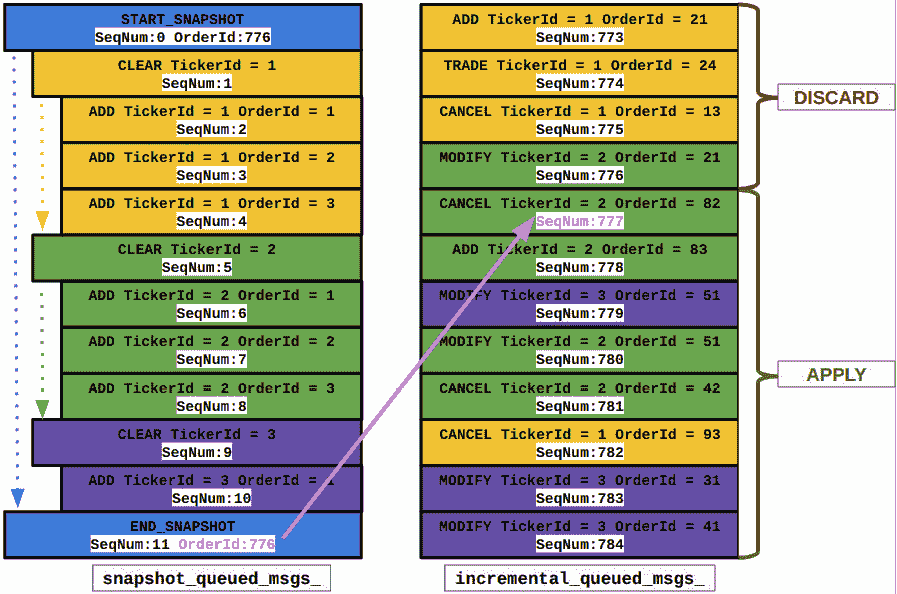
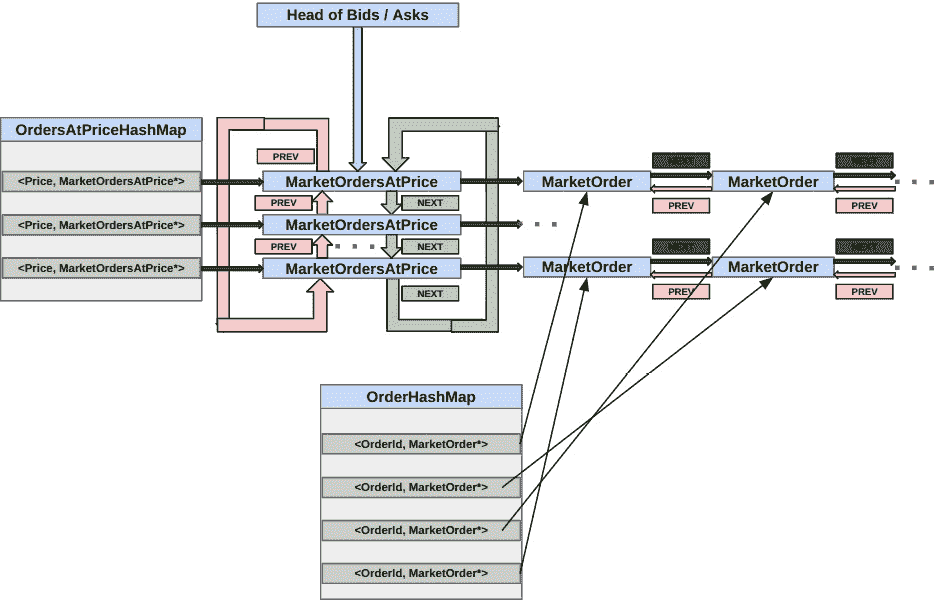
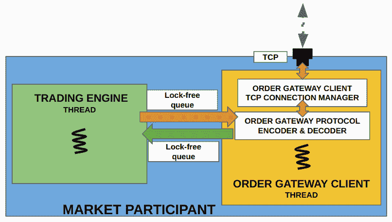

# 第八章：使用 C++ 处理市场数据并向交易所发送订单

在本章中，我们将构建客户端的 C++ 系统，该系统从交易交易所接收并处理市场数据更新。我们还将处理创建和读取 UDP 套接字、处理数据包丢失等问题。我们将讨论客户端上订单簿的设计，以跟踪交易所在维护的订单簿。我们还将实现建立和维护与交易交易所 TCP 连接所需的 C++ 组件。我们还将实现从策略向交易所发送订单以及接收和处理订单响应的功能。

在本章中，我们将涵盖以下主题：

+   订阅市场数据和解码市场数据协议

+   从市场数据构建订单簿

+   连接到交易所、发送订单请求和接收响应

# 技术要求

本书的所有代码都可以在本书的 GitHub 仓库中找到，网址为 [`github.com/PacktPublishing/Building-Low-Latency-Applications-with-CPP`](https://github.com/PacktPublishing/Building-Low-Latency-Applications-with-CPP)。本章的源代码位于仓库中的 `Chapter 8` 目录。

您必须阅读并理解章节 *设计我们的交易生态系统* 中所介绍的电子交易生态系统的设计。我们本章构建的组件将与我们在章节 *与市场参与者通信* 中构建的电子交易交易所应用程序进行交互，因此我们假设您熟悉该内容。我们将在客户端应用程序的交易引擎组件中构建的限价订单簿几乎与我们在 *构建订单簿和匹配订单* 部分中 *构建 C++ 匹配引擎* 章节内构建的订单簿相同。因此，我们假设读者非常熟悉该章节和我们在那里讨论的代码，因为我们将在此章节中引用它。与之前一样，我们将使用我们在 *构建低延迟应用程序的 C++ 构建块* 章节中构建的构建块。

本书源代码开发环境的规格如下所示。我们提供此环境的详细信息，因为本书中展示的所有 C++ 代码可能并不一定可移植，可能需要在您的环境中进行一些小的修改才能工作：

+   OS – `Linux 5.19.0-41-generic #42~22.04.1-Ubuntu SMP PREEMPT_DYNAMIC Tue Apr 18 17:40:00 UTC 2 x86_64 x86_64` `x86_64 GNU/Linux`

+   GCC – `g++ (Ubuntu ` `11.3.0-1ubuntu1~22.04.1) 11.3.0`

+   CMAKE – `cmake` `版本 3.23.2`

+   NINJA – `1.10.2`

# 订阅市场数据和解码市场数据协议

在市场参与者交易系统中，我们首先需要构建的是市场数据消费者组件。该组件负责订阅由交易交易所发布的公共市场数据更新多播流。它需要解码交易所生成并由我们之前讨论的公共`MDPMarketUpdate`格式生成的市场数据流。由于选择了**简单二进制编码**（**SBE**）协议，在我们的应用中解码步骤简单直接，不涉及任何复杂的流解码逻辑。该组件的另一个重要职责是检测增量市场数据流中的数据包丢失，并提供恢复并与市场数据流再次同步的机制。此机制对于在存在非空订单簿后订阅市场数据流（即交易所在接受客户订单后已经开放）的交易系统也是必需的。此外，如果交易应用程序需要在一天中重新启动，这也将是必需的。

我们展示了之前见过的市场数据消费者组件的详细图示。如图 8.1 所示，它消费包含市场数据更新的多播数据，这些更新来自增量流，也可以选择来自快照流。在检查市场数据更新的序列号并可能需要在快照流和增量流之间同步后，它解码市场数据更新。然后，它生成一系列解码并按顺序排列的市场数据更新流，供交易引擎消费，并通过无锁队列发布：


图 8.1 – 市场数据消费者组件及其子组件概述

在我们深入设计市场数据消费者组件的实现之前，我们想提到，该组件的源代码可以在`Chapter8/trading/market_data/market_data_consumer.h`源文件和`Chapter8/trading/market_data/market_data_consumer.cpp`源文件中找到。接下来，让我们首先定义市场数据消费者组件将需要的内部数据成员。

## 在市场数据消费者中定义数据成员

我们将要构建的`MarketDataConsumer`类将需要以下列表中所示的一些重要数据成员：

+   首先，它需要一个无锁的`incoming_md_updates_`队列实例，该实例为`Exchange::MEMarketUpdateLFQueue`类型，这是我们之前定义的。这是为了由`MarketDataConsumer`将`MEMarketUpdate`消息发布到交易引擎组件。

+   我们将维护一个`next_exp_inc_seq_num_`变量，该变量为`size_t`类型，它将用于确保我们按正确顺序处理增量市场数据流中的更新，并检测增量市场数据流中的数据包丢失。

+   我们将有两个多播订阅套接字——`incremental_mcast_socket_` 和 `snapshot_mcast_socket_`，它们都是 `Common::McastSocket` 类型。这些对应于我们将用于订阅和消费增量多播流和快照多播流的套接字。

当需要从快照市场数据流执行恢复/同步操作时，我们需要维护一些额外的数据成员，如下面的项目符号列表所示：

+   首先，我们将存储一个 `in_recovery_` 布尔标志来表示 `MarketDataConsumer` 是否检测到数据包丢失，并且目前正在尝试使用快照和增量市场数据流进行恢复。

+   由于我们将根据需要加入和离开快照多播流，我们将在 `iface_` 变量、`snapshot_ip_` 变量和 `snapshot_port_` 变量中拥有多播流和网络接口信息。这些代表要使用的网络接口、IP 地址和快照多播流的端口。

+   最后，我们定义一个类型来排队消息并按其相应的序列号进行排序。在这里我们将使用 `std::map` 类型，并对其进行参数化以使用 `size_t` 类型的键（表示更新的序列号），持有 `Exchange::MEMarketUpdate` 对象，并使用 `typedef` 将此类型命名为 `QueuedMarketUpdates`。我们选择 `std::map` 类型是因为与 `std::unordered_map` 相比，迭代排序键更容易。请注意，`std::map` 由于多种原因效率不高——其内部数据结构是 `O(log(N))` 并导致动态内存分配等。然而，我们在此例中做出例外，因为快照恢复预计会非常罕见，并且当 `MarketDataConsumer` 类从快照流恢复时，客户端的交易应用程序中的交易通常会被暂停，因为它没有订单簿状态的准确视图。此外，快照流在交易所方面是延迟和节流的，因此快照同步过程本身不需要低延迟。

+   我们将创建两个 `QueuedMarketUpdates` 类型的实例——`snapshot_queued_msgs_` 和 `incremental_queued_msgs_`，一个用于排队快照流中的 `MEMarketUpdate` 消息，另一个用于排队增量流中的 `MEMarketUpdate` 消息。

+   `MarketDataConsumer` 类也是一个不同的执行线程，因此类似于我们之前看到的类，它有一个 `run_` 布尔标志来控制线程的执行，并且它被标记为 `volatile`，因为它被不同的线程访问：

```cpp
#pragma once
#include <functional>
#include <map>
#include "common/thread_utils.h"
#include "common/lf_queue.h"
#include "common/macros.h"
#include "common/mcast_socket.h"
#include "exchange/market_data/market_update.h"
namespace Trading {
class MarketDataConsumer {
private:
    size_t next_exp_inc_seq_num_ = 1;
    Exchange::MEMarketUpdateLFQueue *incoming_md_updates_ =
      nullptr;
    volatile bool run_ = false;
    std::string time_str_;
    Logger logger_;
    Common::McastSocket incremental_mcast_socket_,
      snapshot_mcast_socket_;
    bool in_recovery_ = false;
    const std::string iface_, snapshot_ip_;
    const int snapshot_port_;
    typedef std::map<size_t, Exchange::MEMarketUpdate>
      QueuedMarketUpdates;
    QueuedMarketUpdates snapshot_queued_msgs_,
      incremental_queued_msgs_;
};
}
```

我们将在下一节中初始化 `MarketDataConsumer` 类及其数据成员。

## 初始化市场数据消费者

`MarketDataConsumer` 类的构造函数接受以下参数：

+   一个 `client_id` 参数，其类型为 `Common::ClientId`，在此情况下仅用于创建一个唯一的日志文件名，用于初始化此类中 `Logger logger_` 组件。

+   它还期望一个指向名为 `market_updates` 的 `MEMarketUpdateLFQueue` 无锁队列对象的指针，其中它将发布解码并排序的市场更新。

+   它期望在 `iface` 参数中提供网络接口名称以及快照和增量市场数据流的地址。这些将通过 `snapshot_ip` 参数、`snapshot_port` 参数、`incremental_ip` 参数和 `incremental_port` 参数传递：

```cpp
#include "market_data_consumer.h"
namespace Trading {
  MarketDataConsumer::MarketDataConsumer(Common::ClientId
    client_id, Exchange::MEMarketUpdateLFQueue
      *market_updates,
const std::string &iface,
const std::string &snapshot_ip, int snapshot_port,
const std::string &incremental_ip, int incremental_port)
      : incoming_md_updates_(market_updates), run_(false),
        logger_("trading_market_data_consumer_" + std::
          to_string(client_id) + ".log"),
        incremental_mcast_socket_(logger_),
          snapshot_mcast_socket_(logger_),
        iface_(iface), snapshot_ip_(snapshot_ip),
          snapshot_port_(snapshot_port) {
```

构造函数执行以下任务：

+   正如我们提到的，构造函数为此类创建一个 `Logger` 实例，并使用该 `logger_` 对象初始化 `incremental_mcast_socket_` 变量和 `snapshot_mcast_socket_` 变量。它还从传递给它的参数中初始化 `iface_`、`snapshot_ip_` 和 `snapshot_port_` 成员。

+   使用 `recv_callback()` lambda 方法，它在 `incremental_mcast_socket_` 变量和 `snapshot_mcast_socket_` 变量中初始化 `recv_callback_` 变量。lambda 仅将回调转发到 `MarketDataConsumer` 类中的 `recvCallback()` 成员方法，我们将在后面看到。关键点在于我们期望在增量或快照多播套接字上有数据可用时调用 `MarketDataConsumer::recvCallback()` 方法。

+   构造函数最后一件要做的事情是通过调用 `McastSocket::init()` 方法完全初始化 `incremental_mcast_socket_`，该方法在内部创建实际的套接字。它还调用 `McastSocket::join()` 方法来订阅此套接字的多播流。请注意，我们还没有对 `snapshot_mcast_socket_` 做同样的事情。这是在检测到数据包丢失或序列间隙时按需完成的：

```cpp
    auto recv_callback = this {
      recvCallback(socket);
    };
    incremental_mcast_socket_.recv_callback_ =
      recv_callback;
    ASSERT(incremental_mcast_socket_.init(incremental_ip,
      iface, incremental_port, /*is_listening*/ true) >= 0,
           "Unable to create incremental mcast socket.
             error:" + std::string(std::strerror(errno)));
    ASSERT(incremental_mcast_socket_.join(incremental_ip,
      iface, incremental_port),
           "Join failed on:" + std::to_string
              (incremental_mcast_socket_.fd_) + " error:" +
                 std::string(std::strerror(errno)));
    snapshot_mcast_socket_.recv_callback_ = recv_callback;
  }
```

我们添加了一个 `start()` 方法，类似于我们在交易交易所的其他组件旁边看到的。它将 `run_` 变量设置为 `true` 并创建并启动一个线程来执行我们将在后面构建的 `MarketDataConsumer::run()` 方法：

```cpp
    auto start() {
      run_ = true;
      ASSERT(Common::createAndStartThread(-1,
        "Trading/MarketDataConsumer", [this]() { run(); })
          != nullptr, "Failed to start MarketData
             thread.");
    }
```

此类的析构函数简单直接，调用 `stop()` 方法，该方法仅将 `run_` 标志设置为 `false` 以结束 `run()` 方法的执行：

```cpp
    ~MarketDataConsumer() {
      stop();
      using namespace std::literals::chrono_literals;
      std::this_thread::sleep_for(5s);
    }
    auto stop() -> void {
      run_ = false;
    }
```

现在我们已经初始化了 `MarketDataConsumer` 类，我们将首先查看主要的 `run()` 循环，该循环执行从交易所消费多播流的一个循环。

## 运行市场数据消费者主循环

对于我们的市场数据消费者组件，`run()` 方法很简单。它仅在 `incremental_mcast_socket_` 套接字和 `snapshot_mcast_socket_` 对象上调用 `sendAndRecv()` 方法，在我们的情况下，它消费增量或快照通道上接收到的任何附加数据，并调度回调：

```cpp
  auto MarketDataConsumer::run() noexcept -> void {
    logger_.log("%:% %() %\n", __FILE__, __LINE__,
      __FUNCTION__, Common::getCurrentTimeStr(&time_str_));
    while (run_) {
      incremental_mcast_socket_.sendAndRecv();
      snapshot_mcast_socket_.sendAndRecv();
    }
  }
```

下一节处理在`recvCallback()`方法中从先前逻辑分发的网络套接字上的可用数据。

## 处理市场数据更新和处理数据包丢失

本节实现了处理在增量流和快照流上接收到的市场数据更新的重要功能。增量流上的市场更新在整个`MarketDataConsumer`组件运行期间接收。然而，只有在检测到增量流上的序列号间隙时，才会从快照流接收和处理数据，这导致`MarketDataConsumer`初始化`snapshot_mcast_socket_`并订阅快照多播流。记住，在`MarketDataConsumer`的构造函数中，我们故意没有像对`incremental_mcast_socket_`那样完全初始化`snapshot_mcast_socket_`。这里要理解的重要一点是，只有在恢复模式下，我们才会从快照套接字接收数据，否则不会。

`recvCallback()`方法中的第一个代码块通过比较接收数据的套接字文件描述符，确定我们正在处理的数据来自增量流还是快照流。在极不可能的边缘情况下，如果我们从快照套接字接收数据但我们不在恢复中，我们简单地记录一个警告，重置套接字接收缓冲区索引，并返回：

```cpp
  auto MarketDataConsumer::recvCallback(McastSocket
    *socket) noexcept -> void {
    const auto is_snapshot = (socket->fd_ ==
      snapshot_mcast_socket_.fd_);
    if (UNLIKELY(is_snapshot && !in_recovery_)) {
      socket->next_rcv_valid_index_ = 0;
      logger_.log("%:% %() % WARN Not expecting snapshot
        messages.\n",
                  __FILE__, __LINE__, __FUNCTION__,
                    Common::getCurrentTimeStr(&time_str_));
      return;
    }
```

否则，我们继续进行，并使用之前看到的相同代码从套接字缓冲区读取`Exchange::MDPMarketUpdate`消息。我们遍历`socket->rcv_buffer_`缓冲区中的数据，并以`Exchange::MDPMarketUpdate`大小为块的大小读取它。这里的目的是尽可能多地读取完整的`MDPMarketUpdate`消息，直到我们从缓冲区中读取完所有消息。我们使用`reinterpret_cast`将缓冲区中的数据转换为`Exchange::MDPMarketUpdate`类型的对象：

```cpp
    if (socket->next_rcv_valid_index_ >= sizeof
      (Exchange::MDPMarketUpdate)) {
      size_t i = 0;
      for (; i + sizeof(Exchange::MDPMarketUpdate) <=
        socket->next_rcv_valid_index_; i +=
          sizeof(Exchange::MDPMarketUpdate)) {
        auto request = reinterpret_cast<const
          Exchange::MDPMarketUpdate *>(socket->rcv_buffer_
            + i);
        logger_.log("%:% %() % Received % socket len:%
          %\n", __FILE__, __LINE__, __FUNCTION__,
                    Common::getCurrentTimeStr(&time_str_),
                    (is_snapshot ? "snapshot" :
                       "incremental"), sizeof
                         (Exchange::MDPMarketUpdate),
                           request->toString());
```

对于每个`MDPMarketUpdate`消息，我们检查我们刚刚读取的消息中的序列号，以查看是否存在序列号间隙。如果我们检测到序列号间隙或我们已经在恢复中，我们将`in_recovery_`成员标志设置为`true`：

```cpp
        const bool already_in_recovery = in_recovery_;
        in_recovery_ = (already_in_recovery || request->
          seq_num_ != next_exp_inc_seq_num_);
```

首先，我们将看到在恢复模式下处理消息的方式。在下一个代码块中，我们首先检查`already_in_recovery_`标志，以确定我们之前是否不在恢复模式，并且是否因为这条消息而刚刚开始恢复。如果我们之前不在恢复模式，并且因为看到了序列号差距而开始恢复，我们将调用`startSnapshotSync()`方法，我们很快就会看到这个方法。简而言之，`startSnapshotSync()`方法将初始化`snapshot_mcast_socket_`对象并订阅快照多播流，但关于这一点我们稍后再说。在恢复模式下，我们调用`queueMessage()`方法来存储我们刚刚收到的`MDPMarketUpdate`消息。我们保持在恢复模式，并在快照和增量流上排队市场数据更新。我们将这样做，直到我们从快照流中获得完整的簿记快照，以及快照消息之后的所有增量消息，以赶上增量流。我们将在稍后详细介绍这一点，当我们展示`checkSnapshotSync()`方法的实际实现时：

```cpp
        if (UNLIKELY(in_recovery_)) {
          if (UNLIKELY(!already_in_recovery)) {
            logger_.log("%:% %() % Packet drops on %
              socket. SeqNum expected:% received:%\n",
                __FILE__, __LINE__, __FUNCTION__,
                        Common::getCurrentTimeStr
                          (&time_str_), (is_snapshot ?
                            "snapshot" : "incremental"),
                              next_exp_inc_seq_num_,
                                 request->seq_num_);
            startSnapshotSync();
          }
          queueMessage(is_snapshot, request);
        }
```

对于我们不在恢复模式且接收到的消息来自增量市场数据流的情况，我们只需更新`next_exp_inc_seq_num_`。这是一个提醒，`next_exp_inc_seq_num_`变量跟踪我们期望在下一个增量市场数据更新中出现的下一个序列号。然后我们将`MEMarketUpdate`消息写入`incoming_md_updates_`无锁队列，该队列将由另一端的交易引擎组件消费：

```cpp
          else if (!is_snapshot) {
          logger_.log("%:% %() % %\n", __FILE__, __LINE__,
            __FUNCTION__,
                      Common::getCurrentTimeStr
                        (&time_str_), request->toString());
          ++next_exp_inc_seq_num_;
          auto next_write = incoming_md_updates_->
            getNextToWriteTo();
          *next_write = std::move(request->
            me_market_update_);
          incoming_md_updates_->updateWriteIndex();
        }
      }
```

最后，我们将 socket 中`rcv_buffer_`缓冲区中剩余的局部数据左移，并更新下一次有效接收索引以供下一次读取：

```cpp
      memcpy(socket->rcv_buffer_, socket->rcv_buffer_ + i,
        socket->next_rcv_valid_index_ - i);
      socket->next_rcv_valid_index_ -= i;
    }
  }
```

这就完成了`recvCallback()`方法的实现，我们现在将查看处理快照订阅和同步逻辑的方法。首先，我们研究`startSnapshotSync()`方法，正如我们之前提到的，它准备`MarketDataConsumer`类在序列号差距上启动快照同步机制。为此任务，我们首先清除两个`std::map`容器——`snapshot_queued_msgs_`和`incremental_queued_msgs_`，我们使用这些容器来排队快照和增量流中的市场更新消息。然后我们使用`McastSocket::init()`方法初始化`snapshot_mcast_socket_`对象，以便在`snapshot_ip_`和`snapshot_port_`地址上创建套接字。然后我们调用`McastSocket::join()`方法来开始快照市场数据流的组播订阅。记住，对于多播套接字，我们不仅要确保有一个正在读取市场数据的套接字，而且我们还需要发出 IGMP 加入成员网络级消息，以便消息可以流向应用程序，这是通过调用`snapshot_mcast_socket_.join()`实现的：

```cpp
  auto MarketDataConsumer::startSnapshotSync() -> void {
    snapshot_queued_msgs_.clear();
    incremental_queued_msgs_.clear();
    ASSERT(snapshot_mcast_socket_.init(snapshot_ip_,
      iface_, snapshot_port_, /*is_listening*/ true) >= 0,
           "Unable to create snapshot mcast socket. error:"
              + std::string(std::strerror(errno)));
    ASSERT(snapshot_mcast_socket_.join(snapshot_ip_,
      iface_, snapshot_port_),
           "Join failed on:" + std::to_string
             (snapshot_mcast_socket_.fd_) + " error:" +
               std::string(std::strerror(errno)));
  }
```

下一节处理`MarketDataConsumer`组件的一个重要职责，即从快照和增量流中排队市场数据更新，并在需要时进行同步。

## 与快照流同步

我们需要实现的第一种方法是`MarketDataConsumer::queueMessage()`方法，这是我们之前调用的。该方法接收一个`MDPMarketUpdate`消息和一个标志，该标志捕获它是否是从快照流或增量流接收到的。

如果消息是通过增量市场数据流发送的，那么它将其添加到`incremental_queued_msgs_` `std::map`中。如果它是通过快照流接收的，那么首先，它会检查该序列号的市场更新是否已经存在于`snapshot_queued_msgs_`容器中。如果该序列号的条目已经存在于容器中，那么这意味着我们正在接收一个新的快照消息周期，并且我们没有能够从上一个快照消息周期中成功恢复。在这种情况下，它会清除`snapshot_queued_msgs_`容器，因为我们将不得不从头开始重新启动快照恢复过程。最后，将`MEMarketUpdate`消息添加到`snapshot_queued_msgs_`容器中：

```cpp
auto MarketDataConsumer::queueMessage(bool is_snapshot,
                                        const Exchange::
                                          MDPMarketUpdate
                                            *request) {
    if (is_snapshot) {
      if (snapshot_queued_msgs_.find(request->seq_num_) !=
        snapshot_queued_msgs_.end()) {
        logger_.log("%:% %() % Packet drops on snapshot
          socket. Received for a 2nd time:%\n", __FILE__,
            __LINE__, __FUNCTION__,
                    Common::getCurrentTimeStr(&time_str_),
                      request->toString());
        snapshot_queued_msgs_.clear();
      }
      snapshot_queued_msgs_[request->seq_num_] = request->
        me_market_update_;
    } else {
      incremental_queued_msgs_[request->seq_num_] =
        request->me_market_update_;
    }
```

在将新消息排队到正确的容器后，我们调用`checkSnapshotSync()`方法来查看我们是否可以从快照以及我们迄今为止排队的增量消息中成功恢复：

```cpp
    logger_.log("%:% %() % size snapshot:% incremental:% %
      => %\n", __FILE__, __LINE__, __FUNCTION__,
                Common::getCurrentTimeStr(&time_str_),
                  snapshot_queued_msgs_.size(),
                    incremental_queued_msgs_.size(),
                      request->seq_num_, request->
                        toString());
    checkSnapshotSync();
}
```

现在，我们将实现`MarketDataConsumer`类中最后也是最重要的方法 – `checkSnapshotSync()`，该方法检查快照和增量容器中排队的`MEMarketUpdate`消息，以查看我们是否可以成功恢复或与快照和增量流同步并*赶上*：

1.  逻辑是排队快照和增量市场数据流上接收到的消息。

1.  然后，当我们收到`MarketUpdateType::SNAPSHOT_END`时，我们确保在快照市场数据流中没有丢失任何消息，通过检查快照消息的序列号字段上没有间隙来确认。

1.  然后，我们检查增量数据流中排队的市场更新，查看我们是否有消息跟在用于合成这一轮快照消息的最后一个消息之后。我们通过检查增量队列中是否有从`SNAPSHOT_END`消息中`OrderId + 1`值开始的序列号的市场更新来完成此操作。

1.  最后，我们确保从那个点开始，在增量排队消息中我们没有另一个间隙。

为了更好地理解快照恢复逻辑是如何工作的，我们提供了一个具体的示例，即恢复是可能的，*图 8**.2*：



图 8.2 – 当恢复可能时快照和增量队列的示例状态

应用我们在 *图 8**.2* 中刚刚提出的逻辑，我们首先检查 `snapshot_queued_msgs_` 容器，以确保我们有一个 `SNAPSHOT_START` 消息和一个 `SNAPSHOT_END` 消息。我们还通过检查序列号来确保快照消息中没有缺失，序列号从零开始，每条消息递增一。我们找到最后一个序列号，该序列号用于从 `SNAPSHOT_END` 消息中合成这个快照，并使用该消息中的订单 ID 字段，在这种情况下，设置为 **776**。

一旦我们确定我们有一个完整的快照消息序列，我们将检查增量市场数据更新队列。所有队列中的增量消息，其序列号小于或等于 `checkSnapshotSync()` 方法。

首先，我们检查 `snapshot_queued_msgs_` 容器是否为空。显然，我们无法恢复，因为我们需要一个完整的快照消息周期以及从那时起的所有增量消息来赶上增量流：

```cpp
  auto MarketDataConsumer::checkSnapshotSync() -> void {
    if (snapshot_queued_msgs_.empty()) {
      return;
    }
```

我们接下来需要检查的是是否存在 `MEMarketUpdate` 的 `MarketUpdateType::SNAPSHOT_START` 类型的更新。否则，我们将清空队列并等待下一轮快照消息：

```cpp
    const auto &first_snapshot_msg =
      snapshot_queued_msgs_.begin()->second;
    if (first_snapshot_msg.type_ != Exchange::
      MarketUpdateType::SNAPSHOT_START) {
      logger_.log("%:% %() % Returning because have not
        seen a SNAPSHOT_START yet.\n",
                  __FILE__, __LINE__, __FUNCTION__,
                    Common::getCurrentTimeStr(&time_str_));
      snapshot_queued_msgs_.clear();
      return;
    }
```

接下来，我们将遍历队列中的快照消息，并确保我们队列中的快照消息没有缺失，通过检查序列号来实现。记住，`snapshot_queued_msgs_` 容器中的键实际上是来自 `MDPMarketUpdate` 消息的 `seq_num_` 字段。如果我们检测到快照消息中的缺失，我们将 `have_complete_snapshot` 标志设置为 `false` 并退出循环。我们将快照队列中的每条消息收集到 `final_events` 容器中，该容器是 `MEMarketUpdate` 消息的 `std::vector` 类型，这将是我们从该快照成功恢复后要处理的全部事件的容器：

```cpp
    std::vector<Exchange::MEMarketUpdate> final_events;
    auto have_complete_snapshot = true;
    size_t next_snapshot_seq = 0;
    for (auto &snapshot_itr: snapshot_queued_msgs_) {
      logger_.log("%:% %() % % => %\n", __FILE__, __LINE__,
        __FUNCTION__,
                  Common::getCurrentTimeStr(&time_str_),
                     snapshot_itr.first,
                       snapshot_itr.second.toString());
      if (snapshot_itr.first != next_snapshot_seq) {
        have_complete_snapshot = false;
        logger_.log("%:% %() % Detected gap in snapshot
          stream expected:% found:% %.\n", __FILE__,
            __LINE__, __FUNCTION__,
                    Common::getCurrentTimeStr(&time_str_),
                       next_snapshot_seq,
                          snapshot_itr.first, snapshot_itr.
                             second.toString());
        break;
      }
      if (snapshot_itr.second.type_ !=
         Exchange::MarketUpdateType::SNAPSHOT_START &&
          snapshot_itr.second.type_ !=
            Exchange::MarketUpdateType::SNAPSHOT_END)
        final_events.push_back(snapshot_itr.second);
      ++next_snapshot_seq;
    }
```

一旦我们完成循环，我们将检查 `have_complete_snapshot` 标志，以查看我们是否在快照消息中找到了缺失。如果标志设置为 `false`，这意味着我们找到了缺失，我们将清空 `snapshot_queued_msgs_` 容器并返回，因为我们无法恢复，必须等待下一轮快照消息：

```cpp
    if (!have_complete_snapshot) {
      logger_.log("%:% %() % Returning because found gaps
        in snapshot stream.\n",
                  __FILE__, __LINE__, __FUNCTION__,
                    Common::getCurrentTimeStr(&time_str_));
      snapshot_queued_msgs_.clear();
      return;
    }
```

假设我们已经走到这一步，我们将从快照消息队列中提取最后一条消息，并确保它是 `MarketUpdateType::SNAPSHOT_END` 类型，因为我们需要使用该消息中的 `order_id_` 字段来处理增量消息队列：

```cpp
    const auto &last_snapshot_msg = snapshot_queued_msgs_
      .rbegin()->second;
    if (last_snapshot_msg.type_ != Exchange::
      MarketUpdateType::SNAPSHOT_END) {
      logger_.log("%:% %() % Returning because have not
        seen a SNAPSHOT_END yet.\n",
                  __FILE__, __LINE__, __FUNCTION__,
                    Common::getCurrentTimeStr(&time_str_));
      return;
    }
```

现在，我们继续检查队列中的增量消息，看看我们是否可以成功同步。我们定义一个 `have_complete_incremental` 布尔标志，它将表示我们是否拥有增量流中的所有消息，没有任何缺失。我们还设置 `next_exp_inc_seq_num_` 成员变量为 `last_snapshot_msg.order_id_ + 1`，来自 `SNAPSHOT_END` 消息：

```cpp
    auto have_complete_incremental = true;
    size_t num_incrementals = 0;
    next_exp_inc_seq_num_ = last_snapshot_msg.order_id_ + 1;
```

现在，我们遍历`incremental_queued_msgs_`容器中的所有消息。我们丢弃序列号小于我们刚刚分配的`next_exp_inc_seq_num_`变量的消息。否则，我们确保增量消息队列中没有差距，通过确保下一个消息的序列号等于`next_exp_inc_seq_num_`，并在检测到差距时将`have_complete_incremental`标志设置为`false`：

```cpp
    for (auto inc_itr = incremental_queued_msgs_.begin();
      inc_itr != incremental_queued_msgs_.end(); ++inc_itr) {
      logger_.log("%:% %() % Checking next_exp:% vs. seq:%
        %.\n", __FILE__, __LINE__, __FUNCTION__,
                  Common::getCurrentTimeStr(&time_str_),
                    next_exp_inc_seq_num_, inc_itr->first,
                      inc_itr->second.toString());
      if (inc_itr->first < next_exp_inc_seq_num_)
        continue;
      if (inc_itr->first != next_exp_inc_seq_num_) {
        logger_.log("%:% %() % Detected gap in incremental
          stream expected:% found:% %.\n", __FILE__,
            __LINE__, __FUNCTION__,
                    Common::getCurrentTimeStr(&time_str_),
                      next_exp_inc_seq_num_, inc_itr->
                        first, inc_itr->second.toString());
        have_complete_incremental = false;
        break;
      }
```

如果我们没有在增量队列的市场更新消息中检测到差距，我们就像之前一样将其添加到`final_events`容器中。同时，我们也增加`next_exp_inc_seq_num_`变量，因为如果没有差距，这是我们期望的下一个序列号：

```cpp
      logger_.log("%:% %() % % => %\n", __FILE__, __LINE__,
        __FUNCTION__,
                  Common::getCurrentTimeStr(&time_str_),
                    inc_itr->first, inc_itr->second
                       .toString());
      if (inc_itr->second.type_ != Exchange::
        MarketUpdateType::SNAPSHOT_START &&
          inc_itr->second.type_ != Exchange::
             MarketUpdateType::SNAPSHOT_END)
        final_events.push_back(inc_itr->second);
      ++next_exp_inc_seq_num_;
      ++num_incrementals;
    }
```

在退出循环后，我们检查`have_complete_incremental`标志以确保增量更新队列中没有差距。如果我们确实发现了一个差距，我们就清除`snapshot_queued_msgs_`容器并返回，因为我们无法成功同步：

```cpp
    if (!have_complete_incremental) {
      logger_.log("%:% %() % Returning because have gaps in
        queued incrementals.\n",
                  __FILE__, __LINE__, __FUNCTION__,
                    Common::getCurrentTimeStr(&time_str_));
      snapshot_queued_msgs_.clear();
      return;
    }
```

在这一点上，我们已经成功恢复，因此我们遍历`final_events`容器中的所有`MEMarketUpdate`消息，并将它们写入`incoming_md_updates_`无锁队列，以便发送到交易引擎组件：

```cpp
    for (const auto &itr: final_events) {
      auto next_write = incoming_md_updates_->
        getNextToWriteTo();
      *next_write = itr;
      incoming_md_updates_->updateWriteIndex();
    }
```

最后，我们清除`snapshot_queued_msgs_`容器和`incremental_queued_msgs_`容器，并将`in_recovery_`标志设置为`false`，因为我们不再处于恢复模式。最后，我们在`snapshot_mcast_socket_`上调用`McastSocket::leave()`方法，因为我们不再需要订阅快照流或接收或处理快照消息：

```cpp
    logger_.log("%:% %() % Recovered % snapshot and %
      incremental orders.\n", __FILE__, __LINE__,
         __FUNCTION__,
                Common::getCurrentTimeStr(&time_str_),
                  snapshot_queued_msgs_.size() - 2,
                    num_incrementals);
    snapshot_queued_msgs_.clear();
    incremental_queued_msgs_.clear();
    in_recovery_ = false;
    snapshot_mcast_socket_.leave(snapshot_ip_,
      snapshot_port_);;
  }
```

使用这种方法，我们已经完成了我们的`MarketDataConsumer`组件的设计和实现。接下来，我们将从这些市场数据更新消息开始，讨论在交易引擎内部构建限价订单簿的话题。

# 从市场数据构建订单簿

在上一节中，我们构建了市场数据消费者组件，该组件订阅市场数据流，在快照流和增量流之间同步，并解码市场数据更新并将它们发布到交易引擎组件。交易引擎组件随后需要处理这些市场数据更新并构建一个类似于匹配引擎构建的限价订单簿，但这是一个比匹配引擎订单簿更为简化的版本。作为提醒，我们在“设计我们的交易生态系统”章节中讨论了这一点，该章节位于“设计低延迟 C++交易算法框架”部分。最后要注意的一点是，我们将重用匹配引擎中订单簿的设计和代码来创建客户端系统中的订单簿。我们将重用我们在“构建 C++匹配引擎”章节中构建的源代码，该章节位于“构建订单簿和匹配订单”部分。现在，让我们开始实现订单簿，我们将称之为`MarketOrderBook`，以便于与匹配引擎内部的订单簿区分开来，后者被称为`MEOrderBook`。

## 定义市场订单簿的结构

首先，我们将定义构成`MarketOrderBook`数据结构的结构和类型。我们在这里使用的设计与`MEOrderBook`类中使用的相同设计，该设计在*图 8.3*中展示。我们建议回顾订单簿的设计以及“构建 C++匹配引擎”章节中在“设计交易所订单簿”部分提出的不同选择的动机。

每个订单都由一个`MarketOrder`结构体表示，它是为我们为匹配引擎构建的`MEOrder`结构体的子集。我们还将有一个`OrderHashMap`类型，就像我们在匹配引擎中做的那样，它将是一个从`OrderId`到这些`MarketOrder`对象的哈希表。与匹配引擎中一样，相同价格的订单将保存在一个`MarketOrdersAtPrice`结构体中，这将是一个`MarketOrder`对象的双向链表。记住，我们需要这个结构来维护所有具有相同价格和买卖方向的订单，并按 FIFO 顺序排列。我们还将构建一个`OrdersAtPriceHashMap`映射，就像我们在匹配引擎中做的那样，它将是一个从`Price`到这些`MarketOrdersAtPrice`对象的哈希表。设计在*图 8.3*中展示，与我们在匹配引擎中展示的订单簿图类似，但在这个情况下结构不同：



图 8.3 – 市场参与者交易引擎中限价订单簿的架构

我们在下一两个子节中定义的结构体和类型的所有源代码都可以在 `Chapter8/trading/strategy/market_order.h` 源文件和 `Chapter8/trading/strategy/market_order.cpp` 源文件中找到。让我们从定义我们将需要的结构体和类型开始，来开始 `MarketOrderBook` 的实现。

### 定义 MarketOrder 结构体和 OrderHashMap 类型

首先，我们将定义 `MarketOrder` 结构体，它代表市场数据流中的一个单个订单。这个结构体包含 `OrderId`、`Side`、`Price`、`Qty` 和 `Priority` 属性。它还包含一个 `prev_order_` 和 `next_order_` 成员，类型为 `MarketOrder` 指针，因为我们将会将这些对象链成一个双链表：

```cpp
#pragma once
#include <array>
#include <sstream>
#include "common/types.h"
using namespace Common;
namespace Trading {
  struct MarketOrder {
    OrderId order_id_ = OrderId_INVALID;
    Side side_ = Side::INVALID;
    Price price_ = Price_INVALID;
    Qty qty_ = Qty_INVALID;
    Priority priority_ = Priority_INVALID;
    MarketOrder *prev_order_ = nullptr;
    MarketOrder *next_order_ = nullptr;
```

构造函数很简单；它只是初始化构造函数中提供的字段：

```cpp
    // only needed for use with MemPool.
    MarketOrder() = default;
    MarketOrder(OrderId order_id, Side side, Price price,
      Qty qty, Priority priority, MarketOrder *prev_order,
        MarketOrder *next_order) noexcept
        : order_id_(order_id), side_(side), price_(price),
           qty_(qty), priority_(priority),
             prev_order_(prev_order),
               next_order_(next_order) {}
    auto toString() const -> std::string;
  };
```

我们还定义了 `OrderHashMap` 类型，它是一个 `std::array` 数组，包含 `MarketOrder` 指针对象，大小为 `ME_MAX_ORDER_IDS`，与我们在匹配引擎订单簿中做的方式相同：

```cpp
  typedef std::array<MarketOrder *, ME_MAX_ORDER_IDS> OrderHashMap;
```

我们将用于日志记录的 `toString()` 方法是显而易见的：

```cpp
  auto MarketOrder::toString() const -> std::string {
    std::stringstream ss;
    ss << "MarketOrder" << "["
       << "oid:" << orderIdToString(order_id_) << " "
       << "side:" << sideToString(side_) << " "
       << "price:" << priceToString(price_) << " "
       << "qty:" << qtyToString(qty_) << " "
       << "prio:" << priorityToString(priority_) << " "
       << "prev:" << orderIdToString(prev_order_ ?
           prev_order_->order_id_ : OrderId_INVALID) << " "
       << "next:" << orderIdToString(next_order_ ?
         next_order_->order_id_ : OrderId_INVALID) << "]";
    return ss.str();
  }
```

接下来，我们将定义 `MarketOrdersAtPrice` 结构体，它包含一个指向 `MarketOrder` 对象链表的链接。

### 定义 MarketOrdersAtPrice 结构体和 OrdersAtPriceHashMap 类型

`MarketOrdersAtPrice` 结构体与我们为匹配 `MEOrderBook` 引擎构建的 `MEOrdersAtPrice` 结构体相同。它包含 `Side`、`Price` 以及一个指向 `MarketOrder` 的 `first_mkt_order_` 指针，以表示在此价格下 `MarketOrder` 链表的开始。它还包含两个 `MarketOrdersAtPrice` 指针，`prev_entry_` 和 `next_entry_`，因为我们将会创建一个由 `MarketOrdersAtPrice` 对象组成的双链表来表示价格层级：

```cpp
  struct MarketOrdersAtPrice {
    Side side_ = Side::INVALID;
    Price price_ = Price_INVALID;
    MarketOrder *first_mkt_order_ = nullptr;
    MarketOrdersAtPrice *prev_entry_ = nullptr;
    MarketOrdersAtPrice *next_entry_ = nullptr;
```

这个类的构造函数是显而易见的。它只是用提供的参数初始化数据成员：

```cpp
    MarketOrdersAtPrice() = default;
    MarketOrdersAtPrice(Side side, Price price, MarketOrder
      *first_mkt_order, MarketOrdersAtPrice *prev_entry,
         MarketOrdersAtPrice *next_entry)
        : side_(side), price_(price),
          first_mkt_order_(first_mkt_order),
            prev_entry_(prev_entry),
              next_entry_(next_entry) {}
```

`toString()` 方法与匹配引擎中的相同，所以我们在这里将跳过重复：

```cpp
    auto toString() const;
  };
```

最后，`OrdersAtPriceHashMap` 与我们为匹配引擎构建的相同。它表示一个从 `Price` 到 `MarketOrdersAtPrice` 指针的哈希表：

```cpp
  typedef std::array<MarketOrdersAtPrice *,
    ME_MAX_PRICE_LEVELS> OrdersAtPriceHashMap;
```

现在，我们可以在下一节中最终实现 `MarketOrderBook` 类，但在那之前，我们需要定义一个将用于各种组件以构建 **最佳买价** **卖价**（**BBO**）视图的结构体。

### 定义 BBO 结构体

最后，我们需要定义另一个结构体来表示在最佳买价和卖价下的总数量。这表示市场上可用的最佳（最激进的）买卖价格，以及那些价格下所有订单数量的总和。这个结构体称为 `bid_price_` 和 `ask_price_`（都是 `Price` 类型，以表示最佳价格），以及 `bid_qty_` 和 `ask_qty_` 以表示这些价格下所有订单的总数量。

BBO 抽象在交易引擎内部的不同组件中被广泛使用。通常，这被需要最佳市场价格和流动性的摘要而不是整个订单簿深度和每个订单详细信息的组件使用。例如，像 `RiskManager` 这样的组件，它只需要计算开放的 `FeatureEngine`、`PositionKeeper`、`LiquidityTaker` 和 `MarketMaker`，也使用 BBO 抽象，其中不需要完整的订单簿。

为了便于记录此类对象，我们还将添加一个 `toString()` 方法：

```cpp
  struct BBO {
    Price bid_price_ = Price_INVALID, ask_price_ =
      Price_INVALID;
    Qty bid_qty_ = Qty_INVALID, ask_qty_ = Qty_INVALID;
    auto toString() const {
      std::stringstream ss;
      ss << "BBO{"
         << qtyToString(bid_qty_) << "@" <<
           priceToString(bid_price_)
         << "X"
         << priceToString(ask_price_) << "@" <<
            qtyToString(ask_qty_)
         << "}";
      return ss.str();
    };
  };
```

现在，我们终于可以继续我们的 `MarketOrderBook` 类的实现。

## 定义订单簿中的数据成员

要构建 `MarketOrderBook` 类，我们首先需要定义这个类中的数据成员。这个类的所有源代码都可以在 `Chapter8/trading/strategy/market_order_book.h` 源文件和 `Chapter8/trading/strategy/market_order_book.cpp` 源文件中找到。

这个类中的重要数据成员如下：

+   一个 `trade_engine_` 变量，其类型为 `TradeEngine` 指针类型。我们尚未定义这个类，但将在本章中定义它。目前，它代表的是交易引擎框架的类。我们将通过这个变量与订单簿进行通信。

+   两个内存池，`order_pool_` 用于 `MarketOrder` 对象，`orders_at_price_pool_` 用于 `MarketOrdersAtPrice` 对象，将根据需要分配和释放这些对象。第一个池 `order_pool_` 用于分配和释放 `MarketOrder` 对象。第二个池 `orders_at_price_pool_` 用于分配和释放 `MarketOrdersAtPrice` 对象。记住，一个 `MemPool` 实例与其提供的特定对象类型（作为模板参数提供）绑定在一起。

+   一个 `bbo_` 变量，其类型为 `BBO`，将用于在更新时计算并维护订单簿的 `BBO` 视图，并将其提供给任何需要它的组件。

+   一个 `oid_to_order_` 变量，其类型为 `OrderHashMap`，将用于通过 `OrderId` 跟踪 `MarketOrder` 对象。

+   一个 `price_orders_at_price_` 变量，其类型为 `OrdersAtPriceHashMap`，用于通过 `Price` 跟踪 `OrdersAtPrice` 对象。

+   两个指向 `MarketOrdersAtPrice` 的指针——`bids_by_price_` 用于表示按价格排序的双向链表中的出价，`asks_by_price_` 用于表示按价格排序的双向链表中的要价。

+   最后，一些不太重要的变量，例如用于记录的 `ticker_id_`、`time_str_` 和 `logger_`：

```cpp
#pragma once
#include "common/types.h"
#include "common/mem_pool.h"
#include "common/logging.h"
#include "market_order.h"
#include "exchange/market_data/market_update.h"
namespace Trading {
  class TradeEngine;
  class MarketOrderBook final {
  private:
    const TickerId ticker_id_;
    TradeEngine *trade_engine_ = nullptr;
    OrderHashMap oid_to_order_;
    MemPool<MarketOrdersAtPrice> orders_at_price_pool_;
    MarketOrdersAtPrice *bids_by_price_ = nullptr;
    MarketOrdersAtPrice *asks_by_price_ = nullptr;
    OrdersAtPriceHashMap price_orders_at_price_;
    MemPool<MarketOrder> order_pool_;
    BBO bbo_;
    std::string time_str_;
    Logger *logger_ = nullptr;
  };
```

我们还将定义一个 `MarketOrderBookHashMap` 类型，它是一个从 `TickerId` 到 `MarketOrderBook` 对象的哈希表，大小为 `ME_MAX_TICKERS`。这个常量，以及我们将在下一个代码片段中遇到的其它常量，都在 *构建 C++ 匹配引擎* 章节中的 *定义匹配引擎中的操作和交互* 部分，以及 *定义一些类型和* *常量* 子部分中定义的：

```cpp
  typedef std::array<MarketOrderBook *, ME_MAX_TICKERS>
    MarketOrderBookHashMap;
}
```

接下来，我们将看到如何初始化 `MarketOrderBook` 类及其成员变量。

## 初始化订单簿

在本节中，我们将实现初始化 `MarketOrderBook` 类及其内部数据成员的代码。构造函数很简单，它接受将要用于记录的 `TickerId` 和 `Logger` 实例。它初始化 `orders_at_price_pool_` 为 `MarketOrdersAtPrice` 对象的 `ME_MAX_PRICE_LEVELS` 大小，并将 `order_pool_` 初始化为 `MarketOrder` 对象的 `ME_MAX_ORDER_IDS` 大小：

```cpp
#include "market_order_book.h"
#include "trade_engine.h"
namespace Trading {
  MarketOrderBook::MarketOrderBook(TickerId ticker_id,
    Logger *logger)
      : ticker_id_(ticker_id),
        orders_at_price_pool_(ME_MAX_PRICE_LEVELS),
          order_pool_(ME_MAX_ORDER_IDS), logger_(logger) {
  }
```

此类的析构函数只是重置内部数据成员：

```cpp
  MarketOrderBook::~MarketOrderBook() {
    logger_->log("%:% %() % OrderBook\n%\n", __FILE__,
      __LINE__, __FUNCTION__,
                 Common::getCurrentTimeStr(&time_str_),
                   toString(false, true));
    trade_engine_ = nullptr;
    bids_by_price_ = asks_by_price_ = nullptr;
    oid_to_order_.fill(nullptr);
  }
```

还有一个名为 `setTradeEngine()` 的附加实用方法，这是一个更好的方法来使用 `TradeEngine` 对象的实例设置 `trade_engine_` 变量：

```cpp
    auto setTradeEngine(TradeEngine *trade_engine) {
      trade_engine_ = trade_engine;
    }
```

既然我们已经看到了如何初始化我们的 `MarketOrderBook` 类，我们将讨论这个类最重要的功能，即从 `TradeEngine` 引擎接收到的 `MEMarketUpdate` 消息中更新订单簿。

## 处理市场更新和更新订单簿

`onMarketUpdate()` 方法会与需要处理的 `MEMarketUpdate` 消息一起被调用。此方法通过作为参数传递的市场更新来更新订单簿。我们将理解源代码以处理这些消息，但我们将逐个代码块地处理 `MarketUpdateType` 的每个情况。

在我们开始处理实际消息之前，我们首先初始化一个 `bid_updated` 布尔标志和一个 `ask_updated` 布尔标志，它们将表示由于这个市场更新，`BBO` 是否需要更新。我们通过检查我们接收到的市场更新是否对应于 `side_ == Side::BUY` 和 `market_update` 的 `price_` 等于或大于我们从 `bids_by_price_->price_` 变量获取的当前最佳出价来找出这一点。我们通过在 `market_update_->side_` 上检查 `Side::SELL` 并检查 `market_update` 的 `price_` 是否小于或等于最佳要价（`asks_by_price_->price_`）来做同样的事情：

```cpp
  auto MarketOrderBook::onMarketUpdate(const
    Exchange::MEMarketUpdate *market_update) noexcept -> void {
    const auto bid_updated = (bids_by_price_ &&
      market_update->side_ == Side::BUY && market_update->
        price_ >= bids_by_price_->price_);
    const auto ask_updated = (asks_by_price_ &&
      market_update->side_ == Side::SELL && market_update->
         price_ <= asks_by_price_->price_);
```

首先，我们看到了对 `MarketUpdateType::ADD` 的处理。我们将分配一个新的 `MarketOrder` 对象，并在其上调用 `addOrder()` 方法。这个 `addOrder()` 方法与我们为匹配引擎构建的 `addOrder()` 方法相同，但它操作 `MarketOrder` 和 `MarketOrdersAtPrice` 对象。我们将在下一小节中简要讨论这个 `addOrder()` 方法，但我们将不会完全重新实现它，因为我们已经在 *Building the C++ Matching Engine* 章节中看到了所有细节：

```cpp
    switch (market_update->type_) {
      case Exchange::MarketUpdateType::ADD: {
        auto order = order_pool_.allocate(market_update->
          order_id_, market_update->side_, market_update->
            price_,
            market_update->qty_, market_update->priority_,
             nullptr, nullptr);
        addOrder(order);
      }
        break;
```

对于 `MarketUpdateType::MODIFY` 的情况的处理，找到目标修改消息的 `MarketOrder` 结构。然后，它更新该订单的 `qty_` 属性：

```cpp
      case Exchange::MarketUpdateType::MODIFY: {
        auto order = oid_to_order_.at(market_update->
          order_id_);
        order->qty_ = market_update->qty_;
      }
        break;
```

对于`MarketUpdateType::CANCEL`的处理很简单，它会找到取消消息对应的`MarketOrder`，然后调用其上的`removeOrder()`方法。`removeOrder()`方法与我们在*构建 C++撮合引擎*章节中构建的`removeOrder()`方法相同，除了它操作的是`MarketOrder`和`MarketOrdersAtPrice`对象。同样，我们不会完全重新实现这些方法，因为它们与我们之前看到的是相同的，详细信息可以在那一章和源文件中找到：

```cpp
      case Exchange::MarketUpdateType::CANCEL: {
        auto order = oid_to_order_.at(market_update->
          order_id_);
        removeOrder(order);
      }
        break;
```

`MarketUpdateType::TRADE`消息不会改变订单簿，因此在这里，我们只需使用`onTradeUpdate()`方法将那条交易消息转发回`TradeEngine`引擎。这里需要注意的是，在`MarketUpdateType::TRADE`的情况下，我们在调用`TradeEngine::onTradeUpdate()`方法后直接返回。这是因为交易消息不会更新我们市场数据协议中的订单簿，所以在这个`switch case`之后的后续代码不需要执行：

```cpp
      case Exchange::MarketUpdateType::TRADE: {
        trade_engine_->onTradeUpdate(market_update, this);
        return;
      }
        break;
```

`MarketOrderBook`类需要处理`MarketUpdateType::CLEAR`消息。当订单簿需要被清除，因为我们丢失了一个数据包并且正在从快照流中恢复时，它会接收到这些消息。在这里，它所做的只是释放订单簿中所有有效的`MarketOrder`对象，并通过将每个条目设置为`nullptr`来清除`oid_to_order_`容器。然后，它从`bids_by_price_`指针开始迭代双链表，并将每个`MarketOrdersAtPrice`对象释放回`orders_at_price_pool_`内存池。它对`asks_by_price_`链表做同样的处理，最后将`bids_by_price_`和`asks_by_price_`都设置为`nullptr`以表示一个空的订单簿：

```cpp
      case Exchange::MarketUpdateType::CLEAR: {
        for (auto &order: oid_to_order_) {
          if (order)
            order_pool_.deallocate(order);
        }
        oid_to_order_.fill(nullptr);
        if(bids_by_price_) {
          for(auto bid = bids_by_price_->next_entry_; bid
            != bids_by_price_; bid = bid->next_entry_)
            orders_at_price_pool_.deallocate(bid);
          orders_at_price_pool_.deallocate(bids_by_price_);
        }
        if(asks_by_price_) {
          for(auto ask = asks_by_price_->next_entry_; ask
            != asks_by_price_; ask = ask->next_entry_)
            orders_at_price_pool_.deallocate(ask);
          orders_at_price_pool_.deallocate(asks_by_price_);
        }
        bids_by_price_ = asks_by_price_ = nullptr;
      }
        break;
```

`MarketOrderBook`类不需要处理`INVALID`、`SNAPSHOT_START`和`SNAPSHOT_END`的`MarketUpdateType`s，因此对于这些消息它不做任何处理：

```cpp
      case Exchange::MarketUpdateType::INVALID:
      case Exchange::MarketUpdateType::SNAPSHOT_START:
      case Exchange::MarketUpdateType::SNAPSHOT_END:
        break;
    }
```

在这一点上，我们将调用`updateBBO()`方法，并将我们计算的两个布尔标志`bid_updated`和`ask_updated`传递给它。我们很快就会看到这个方法的实现，但你现在应该理解它将使用传递给它的两个布尔标志来决定是否需要更新出价或要价`BBO`值：

```cpp
    updateBBO(bid_updated, ask_updated);
```

最后，它通过`onOrderBookUpdate()`方法通知`TradeEngine`引擎订单簿已被更新，我们将在本章后面讨论该方法，并在下一章中进一步丰富它：

```cpp
    trade_engine_->onOrderBookUpdate(market_update->
      ticker_id_, market_update->price_, market_update->
        side_);
    logger_->log("%:% %() % OrderBook\n%\n", __FILE__,
      __LINE__, __FUNCTION__,
                 Common::getCurrentTimeStr(&time_str_),
                   toString(false, true));
  }
```

在我们结束这一节之前，让我们看看之前提到的`updateBBO()`方法的实现。实现本身相对简单，所以让我们先看看对买入方的处理。一旦我们了解了如何处理买入方，由于处理方式完全相同，理解卖出方将会非常简单。我们首先检查传递给它的`update_bid`参数是否为`true`。只有在这种情况下，我们才需要更新`BBO`对象的买入方。接下来，我们检查`bids_by_price_`成员是否不是`nullptr`。如果不是有效的，那么我们将`bid_price_`变量和`bid_qty_`变量设置为无效（分别为`Price_INVALID`和`Qty_INVALID`），因为这一侧是空的。更有趣的处理是在`bids_by_price_`成员有效的情况下。

在这种情况下，我们将`bbo_`对象中的`bid_price_`成员变量设置为最佳买入价：`bids_by_price_->price_`。为了计算`bbo_`对象中的`bid_qty_`，我们首先将其分配为该价格水平上第一个订单的`qty_`值，我们通过`bids_by_price_->first_mkt_order_->qty_`值访问它。然后，我们通过跟随`next_order_`指针线性迭代该价格水平上的所有订单，直到我们绕回，即`next_order_`指向`first_mkt_order_`对象。对于我们迭代的每个订单，我们将该订单的`qty_`值累加到我们`bbo_`对象中的`bid_qty_`成员。到此，我们已经完成了对`BBO`对象买入方的更新。请注意，这里的线性迭代稍微低效，可以通过在处理`MEMarketUpdate`消息本身时跟踪和更新这些值来改进，但我们把这个（简单）练习留给感兴趣的读者：

```cpp
    auto updateBBO(bool update_bid, bool update_ask)
      noexcept {
      if(update_bid) {
        if(bids_by_price_) {
          bbo_.bid_price_ = bids_by_price_->price_;
          bbo_.bid_qty_ = bids_by_price_->first_mkt_order_-
            >qty_;
          for(auto order = bids_by_price_->
            first_mkt_order_->next_order_; order !=
              bids_by_price_->first_mkt_order_; order =
                order->next_order_)
            bbo_.bid_qty_ += order->qty_;
        }
        else {
          bbo_.bid_price_ = Price_INVALID;
          bbo_.bid_qty_ = Qty_INVALID;
        }
      }
```

对于`BBO`的卖出方处理与之前讨论的买入方处理相同。我们不会重复，但这里是处理方法：

```cpp
      if(update_ask) {
        if(asks_by_price_) {
          bbo_.ask_price_ = asks_by_price_->price_;
          bbo_.ask_qty_ = asks_by_price_->first_mkt_order_-
            >qty_;
          for(auto order = asks_by_price_->
            first_mkt_order_->next_order_; order !=
              asks_by_price_->first_mkt_order_; order =
                order->next_order_)
            bbo_.ask_qty_ += order->qty_;
        }
        else {
          bbo_.ask_price_ = Price_INVALID;
          bbo_.ask_qty_ = Qty_INVALID;
        }
      }
    }
```

这就完成了我们在`MarketOrderBook`类中需要的绝大部分功能。在下一小节中，我们将快速回顾一下我们在匹配引擎中为订单簿构建的一些实用方法，并将它们复制到交易引擎的订单簿中。

## 重新审视订单簿管理的通用实用方法

在*构建 C++匹配引擎*章节中，我们在*构建订单簿和匹配* *订单*部分构建了`MEOrderBook`。

我们在*构建内部数据结构*子节中解释并实现了`priceToIndex()`方法和`getOrdersAtPrice()`方法。在我们的`MarketOrderBook`类中，我们有相同的方法，但它们操作的是`MarketOrdersAtPrice`而不是`MEOrdersAtPrice`。我们不会再次讨论或在这里重新实现它们，但提供了这两个方法的签名：

```cpp
    auto priceToIndex(Price price) const noexcept;
    auto getOrdersAtPrice(Price price) const noexcept ->
      MarketOrdersAtPrice;
```

在该章节的*处理新被动订单*子节中，我们解释了逻辑并实现了`addOrder()`和`addOrdersAtPrice()`方法。同样，对于`MarketOrderBook`类，逻辑是相同的，只是它操作的是`MarketOrder`结构而不是`MEOrder`结构，以及`MarketOrdersAtPrice`对象而不是`MEOrdersAtPrice`对象。这里展示了`MarketOrderBook`类中这两个方法的签名，但我们将跳过重复的解释和源代码，因为它们是相同的：

```cpp
    auto addOrder(MarketOrder *order) noexcept -> void;
    auto addOrdersAtPrice(MarketOrdersAtPrice
      *new_orders_at_price) noexcept;
```

类似地，在*处理订单取消请求*子节中，我们介绍了`removeOrder()`和`removeOrdersAtPrice()`方法背后的细节。同样，对于我们的`MarketOrderBook`类，这些方法的工作方式完全相同，只是它们操作的是`MarketOrder`和`MarketOrdersAtPrice`结构：

```cpp
    Auto removeOrdersAtPrice(Side side, Price price)
      noexcept;
    auto removeOrder(MarketOrder *order) noexcept -> void;
```

这就完成了交易引擎框架内订单簿的设计和实现。接下来，我们需要讨论订单网关基础设施组件，这是`TradeEngine`组件将用于与电子交易交易所通信的。

# 连接到交易所并发送和接收订单流

市场参与者交易基础设施中的订单网关客户端组件通过无锁队列从交易引擎接收订单请求，并通过另一个无锁队列将订单响应发送回交易引擎。它还在交易所基础设施的订单网关服务器上建立了一个 TCP 连接。它将订单请求编码为交易所的订单格式，并通过 TCP 连接发送。它还消耗通过该 TCP 连接发送的订单响应，并将它们从订单数据格式解码。我们再次展示订单网关客户端图，以刷新您对该组件设计的记忆。



图 8.4 – 展示客户端交易基础设施中订单网关客户端组件的图

我们将首先定义该类内部的数据成员来开始实现这个订单网关客户端组件。订单网关客户端组件的所有源代码都在`Chapter8/trading/order_gw/order_gateway.h`源文件和`Chapter8/trading/order_gw/order_gateway.cpp`源文件中。

## 定义订单网关客户端的数据成员

`OrderGateway`类中的重要数据成员在此描述：

+   两个无锁队列指针。第一个是名为 `outgoing_requests_` 的 `ClientRequestLFQueue` 类型，这是我们之前定义的 `LFQueue` 实例的 `MEClientRequest` 结构。另一个成员称为 `incoming_responses_`，它是 `ClientResponseLFQueue` 类型，我们之前也定义了它作为 `MEClientResponse` 结构的 `LFQueue` 实例。这些将由 `OrderGateway` 用于接收订单请求并向 `TradeEngine` 发送订单响应。

+   它还包含一个 `tcp_socket_` 成员变量，类型为 `TCPSocket`，这是用于连接到交易所订单网关服务器并发送和接收消息的 TCP 套接字客户端。

+   两个 `size_t` 变量用于表示序列号。第一个，`next_outgoing_seq_num_`，跟踪下一次发送到交易所的 `OMClientRequest` 消息的序列号。第二个，`next_exp_seq_num_`，用于检查和验证从交易所接收到的 `OMClientResponse` 消息是否按顺序。

+   一个布尔 `run_` 标志，它在我们之前看到的所有其他组件中起着类似的作用。它将用于启动和停止 `OrderGateway` 线程的执行，并且因为它被不同的线程访问，所以被标记为 `volatile`。

+   它还保存网络接口在 `iface_` 变量中，以及交易所订单网关服务器的 IP 和端口在 `ip_` 和 `port_` 成员变量中。

+   最后，它存储 `ClientId` 类型的 `client_id_` 变量，以确保通过 TCP 套接字接收到的响应是针对正确客户端的：

```cpp
#pragma once
#include <functional>
#include "common/thread_utils.h"
#include "common/macros.h"
#include "common/tcp_server.h"
#include "exchange/order_server/client_request.h"
#include "exchange/order_server/client_response.h"
namespace Trading {
  class OrderGateway {
  private:
    const ClientId client_id_;
    std::string ip_;
    const std::string iface_;
    const int port_ = 0;
    Exchange::ClientRequestLFQueue *outgoing_requests_ =
      nullptr;
    Exchange::ClientResponseLFQueue *incoming_responses_ =
      nullptr;
    volatile bool run_ = false;
    std::string time_str_;
    Logger logger_;
    size_t next_outgoing_seq_num_ = 1;
    size_t next_exp_seq_num_ = 1;
    Common::TCPSocket tcp_socket_;
  };
}
```

在下一节中，我们将初始化这些数据成员以及 `OrderGateway` 类本身。

## 初始化订单网关客户端

构造函数接受交易客户端的 `client_id` ID，一个指向 `ClientRequestsLFQueue` 对象的指针（`client_requests`），一个指向 `ClientResponseLFQueue` 对象的指针（`client_responses`），以及 TCP 连接的 `ip`、`port` 和接口信息（`iface`）。它使用这些参数初始化自己的内部变量，并使用该客户端的订单网关日志文件名初始化 `Logger` 数据成员（`logger_`）。它更新 `tcp_socket_` 变量中的 `TCPSocket` 类型的 `recv_callback_` 成员，以便在数据读取上分发的回调将转到 `OrderGateway::recvCallback()` 方法。我们将简要地看到该方法的实现：

```cpp
#include "order_gateway.h"
namespace Trading {
  OrderGateway::OrderGateway(ClientId client_id,
     Exchange::ClientRequestLFQueue *client_requests,
Exchange::ClientResponseLFQueue *client_responses,
  std::string ip, const std::string &iface, int port)
      : client_id_(client_id), ip_(ip), iface_(iface),
        port_(port), outgoing_requests_(client_requests),
          incoming_responses_(client_responses),
      logger_("trading_order_gateway_" + std::
        to_string(client_id) + ".log"),
          tcp_socket_(logger_) {
    tcp_socket_.recv_callback_ = this { recvCallback(socket, rx_time); };
  }
```

像我们其他组件的设计一样，我们将添加一个 `start()` 方法，它将启用 `run_` 标志并创建和启动一个线程来执行 `run()` 方法。我们还将初始化我们的 `tcp_socket_` 成员变量，并将其连接到交易所订单网关服务器的 `ip_` 和 `port_` 接口信息：

```cpp
    auto start() {
      run_ = true;
      ASSERT(tcp_socket_.connect(ip_, iface_, port_, false)
        >= 0,
             "Unable to connect to ip:" + ip_ + " port:" +
               std::to_string(port_) + " on iface:" +
                 iface_ + " error:" +
                   std::string(std::strerror(errno)));
      ASSERT(Common::createAndStartThread(-1,
        "Trading/OrderGateway", [this]() { run(); }) !=
           nullptr, "Failed to start OrderGateway
             thread.");
    }
```

`OrderGateway` 类的析构函数调用 `stop()` 方法来停止 `run()` 方法的执行，并在返回之前等待一小段时间：

```cpp
    ~OrderGateway() {
      stop();
      using namespace std::literals::chrono_literals;
      std::this_thread::sleep_for(5s);
    }
```

`stop()`方法简单地将`run_`标志设置为`false`以停止`run()`循环的执行：

```cpp
    auto stop() -> void {
      run_ = false;
    }
```

现在，我们可以继续处理剩下的两个重要任务：向交易所发送订单请求和接收交易所的订单响应。

## 向交易所发送订单请求

在本节中，我们将实现`run()`方法，这是`OrderGateway`类的主要循环。该方法的目标是发送任何准备通过 TCP 套接字发送的客户端请求，读取套接字上可用的任何数据，并调度`recv_callback_()`方法。

首先，它调用`TCPSocket::sendAndRecv()`方法在建立的 TCP 连接上发送和接收数据：

```cpp
  auto OrderGateway::run() noexcept -> void {
    logger_.log("%:% %() %\n", __FILE__, __LINE__,
      __FUNCTION__, Common::getCurrentTimeStr(&time_str_));
    while (run_) {
      tcp_socket_.sendAndRecv();
```

它还读取`outgoing_requests_` `LFQueue`上由`TradeEngine`引擎发送的任何`MEClientRequest`消息，并使用`TCPSocket::send()`方法将它们写入`tcp_socket_`发送缓冲区。请注意，它需要写入`OMClientRequest`消息，这是通过首先写入`next_outgoing_seq_num_`字段，然后写入`TradeEngine`发送的`MEClientRequest`对象来实现的。这是因为我们设计了`OMClientRequest`对象，使其成为一个包含`size_t seq_num_`字段和随后的`MEClientRequest`对象的 struct。我们还为下一个出站套接字消息增加了`next_outgoing_seq_num_`实例：

```cpp
      for(auto client_request = outgoing_requests_->
        getNextToRead(); client_request; client_request =
          outgoing_requests_->getNextToRead()) {
        logger_.log("%:% %() % Sending cid:% seq:% %\n",
          __FILE__, __LINE__, __FUNCTION__,
                    Common::getCurrentTimeStr(&time_str_),
                      client_id_, next_outgoing_seq_num_,
                        client_request->toString());
        tcp_socket_.send(&next_outgoing_seq_num_,
          sizeof(next_outgoing_seq_num_));
        tcp_socket_.send(client_request,
          sizeof(Exchange::MEClientRequest));
        outgoing_requests_->updateReadIndex();
        next_outgoing_seq_num_++;
      }
    }
  }
```

我们将处理接收和处理交易所发送到`OrderGateway`建立的 TCP 连接的订单响应的任务。

## 处理来自交易所的订单响应

当`tcp_socket_`上有数据可用时，`recvCallback()`方法会被调用，并且在前一节的`run()`方法中调用`TCPSocket::sendAndRecv()`方法。我们遍历`TCPSocket`上的`rcv_buffer_`缓冲区，并将数据重新解释为`OMClientResponse`消息：

```cpp
  auto OrderGateway::recvCallback(TCPSocket *socket, Nanos
    rx_time) noexcept -> void {
    logger_.log("%:% %() % Received socket:% len:% %\n",
      __FILE__, __LINE__, __FUNCTION__,
        Common::getCurrentTimeStr(&time_str_), socket->fd_,
          socket->next_rcv_valid_index_, rx_time);
    if (socket->next_rcv_valid_index_ >=
      sizeof(Exchange::OMClientResponse)) {
      size_t i = 0;
      for (; i + sizeof(Exchange::OMClientResponse) <=
        socket->next_rcv_valid_index_; i +=
          sizeof(Exchange::OMClientResponse)) {
        auto response = reinterpret_cast<const
          Exchange::OMClientResponse *>(socket->rcv_buffer_
            + i);
        logger_.log("%:% %() % Received %\n", __FILE__,
          __LINE__, __FUNCTION__,
           Common::getCurrentTimeStr(&time_str_), response-
             >toString());
```

对于我们刚刚读取到响应变量的`OMClientResponse`消息，我们检查以确保响应中的客户端 ID 与`OrderGateway`的客户端 ID 匹配，如果不匹配则忽略该响应：

```cpp
        if(response->me_client_response_.client_id_ !=
          client_id_) {
          logger_.log("%:% %() % ERROR Incorrect client id.
            ClientId expected:% received:%.\n", __FILE__,
               __LINE__, __FUNCTION__,
                      Common::getCurrentTimeStr(&time_str_)
                       , client_id_, response->
                          me_client_response_.client_id_);
          continue;
        }
```

我们还检查`OMClientResponse`上的序列号是否与我们期望的一致。如果存在不匹配，我们将记录错误并忽略响应。这里有机会改进错误处理，但为了简单起见，我们只是记录错误并继续：

```cpp
        if(response->seq_num_ != next_exp_seq_num_) {
          logger_.log("%:% %() % ERROR Incorrect sequence
            number. ClientId:%. SeqNum expected:%
              received:%.\n", __FILE__, __LINE__,
                __FUNCTION__,
                      Common::getCurrentTimeStr(&time_str_)
                        , client_id_, next_exp_seq_num_,
                           response->seq_num_);
          continue;
        }
```

最后，我们在下一个`OMClientResponse`上增加预期的序列号，并将我们刚刚读取的响应写入`incoming_responses_` `LFQueue`以供`TradeEngine`读取。它还更新了`rcv_buffer_`缓冲区和我们从其中消耗了一些消息的下一个接收索引到`TCPSocket`缓冲区：

```cpp
        ++next_exp_seq_num_;
        auto next_write = incoming_responses_->
          getNextToWriteTo();
        *next_write = std::move(response->
          me_client_response_);
        incoming_responses_->updateWriteIndex();
      }
      memcpy(socket->rcv_buffer_, socket->rcv_buffer_ + i,
        socket->next_rcv_valid_index_ - i);
      socket->next_rcv_valid_index_ -= i;
    }
  }
```

通过此方法实现，我们已经完成了`OrderGateway`组件的设计和实现。这将是本章中构建的所有核心基础设施组件，我们将在下一章总结我们所做的工作。

一个重要的注意事项是，在我们能够构建和运行一个有意义的交易客户端之前，我们需要构建本章中展示的所有组件，以及《构建 C++交易算法构建块》和《构建 C++市场做市和流动性获取算法》章节中的所有组件。由于我们的生态系统由服务器（交易交易所）和客户端（交易客户端）基础设施组成，因此我们需要等待《构建 C++市场做市和流动性获取算法》章节中的《构建和运行主要交易应用》部分，然后我们才能运行完整的生态系统。

# 摘要

本章致力于构建市场参与者交易系统中的重要核心基础设施组件。首先，我们构建了市场数据消费者组件，该组件负责订阅由交易所生成的多播市场数据流。它需要检测增量市场数据流中市场数据更新的差距，并启动快照恢复和同步机制以重新与增量市场数据流同步。它将交易所发布的数据格式解码为更简单的内部市场数据格式。

交易引擎组件内部的处理订单簿子组件处理它从市场数据消费者接收到的市场数据更新。它从这些更新中构建和更新订单簿数据结构，以便交易引擎能够获得对市场的准确视图。

交易系统内部的订单网关组件与电子交易交易所建立并维护双向 TCP 连接。它从交易引擎接收订单操作请求，并以交易所的订单数据格式将它们发送到交易所。它还接收交易所发送给交易客户端的订单响应，解码它们，并将它们转发给交易引擎。

注意，我们并不在交易客户端的交易系统中拥有我们所需要的一切，也就是说，我们缺少构建和运行交易策略及其相关组件所需的组件。下一章将构建交易策略框架中所需的附加组件。随后的章节将把这些组件连接起来，完成最终的交易应用和完整的交易生态系统。
