# 第六章：NPC 和对话

到目前为止，你已经有了一个默认的玩家角色，它可以与战场上的战斗交互，但游戏迫切需要**非玩家角色**（NPC）。

在本章中，你将创建一个 NPC，它将充当信息中心和店主。由于我们尚未为角色提供可用的物品和装备，或者让角色拥有金币的理由，下一步合乎逻辑的步骤是创建一个店主，他将通过与玩家交谈并当玩家决定与 NPC 交互时提供商业交易来扮演 NPC 的角色。

在本章中，我们将涵盖以下主题：

+   创建 NPC 角色蓝图

+   与 NPC 交互

+   对话框设置

+   创建 NPC 欢迎框

+   添加 NPC 对话框

# 创建 NPC 角色蓝图

要开始，我们需要创建一个新的角色蓝图类。由于我们已经有了一个角色的位置，导航到位于**内容浏览器**下的**内容** | **蓝图** | **角色**中的`character`文件夹（如果还没有，请在`content/blueprints`中创建一个新的`character`文件夹，以保持更整洁；如果你愿意，甚至可以将你的**FieldPlayer**蓝图拖到`character`文件夹中），然后通过点击**添加新** | **蓝图类**来添加一个新的角色：

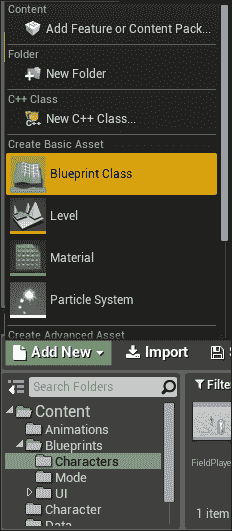

**选择父类**窗口将弹出。这将允许你为你的蓝图类选择一个通用的父类或创建你自己的类：

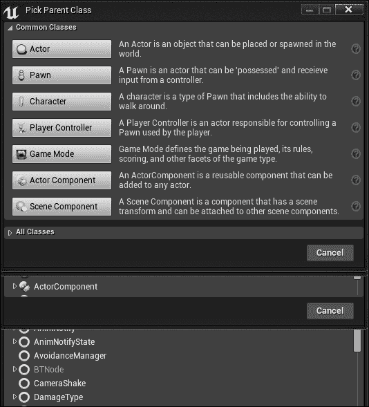

UE4 内置了许多常见的类，这些类已经为我们构建了许多不同类型类的框架。其中之一是**角色**类，它允许我们使用一个通用的角色框架来与任何类型的角色棋子一起使用。因此，从此窗口中选择**角色**。

一旦你选择了**角色**，一个新的角色蓝图现在应该在**内容** | **蓝图** | **角色**中。将角色重命名为**NPC_ShopOwner**，因为我们将会使用这个角色作为店主：

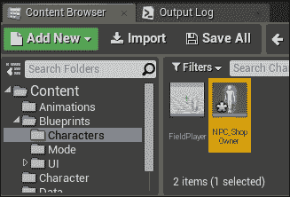

从这里，打开**NPC_ShopOwner**以进入你新角色的视口：

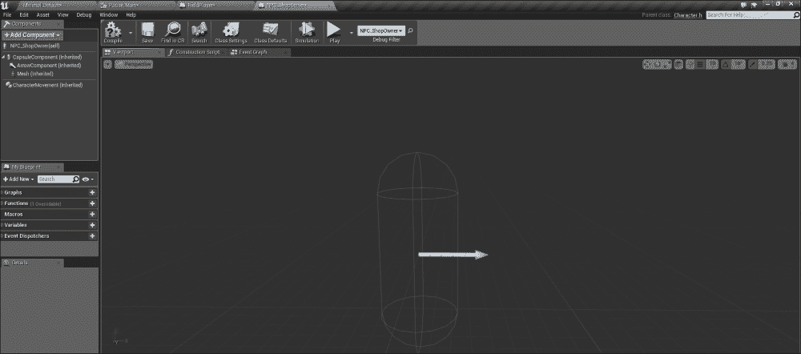

你应该看到，如前所述，这个类继承了`Character.h`，它已经为许多组件提供了一个框架。这将使我们能够轻松地制作一个可见的非玩家角色（NPC）。在**组件**面板中，你会看到**胶囊组件**，它包含继承的数据，例如**箭头组件**，它决定了对象指向的方向，以及**网格**，它包含一个骨骼网格的实例。

让我们先为我们的**网格**组件应用网格和动画。由于我们在这本书中没有创建角色模型和动画，我们可以简单地使用内置资源。首先，点击**组件** | **CapsuleComponent**中的**网格**：

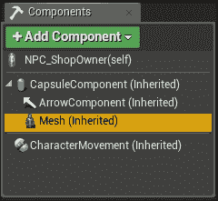

从这里，你会注意到你的**细节**面板会改变，以便显示**网格**变量及其组件。目前，我们希望在这里保留大多数默认设置，因为角色已经拥有了从 NPC 中期望得到的一切。然而，角色没有网格，所以让我们通过导航到**细节** | **网格**，并在**骨骼网格**中选择包含骨骼网格的**无**下拉菜单来给它一个网格。然后，你应该能看到我们项目中所有可用的骨骼网格。在我们的游戏中，有一个名为**SK_Mannequin**的骨骼网格，我们将选择它作为我们的骨骼网格：

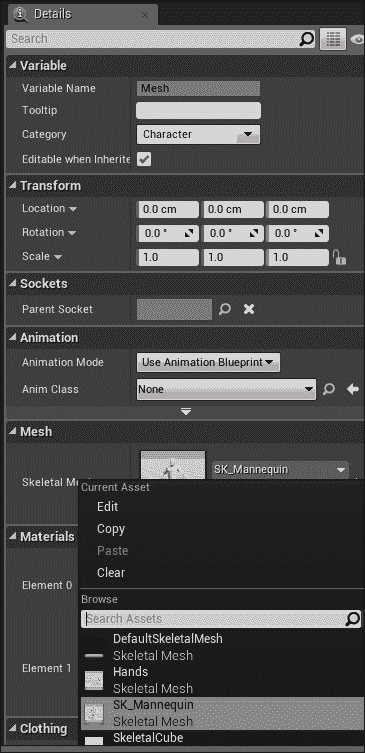

现在我们已经选择了一个骨骼网格，你应该能在视口中看到它。在这个阶段，你可能注意到你的骨骼网格比胶囊底端要高得多，因为骨骼网格的起点在其脚部，并且连接到位于胶囊中间的胶囊原点。解决这个问题有很多方法，但最快的方法是通过将角色在*Z*轴上向下移动来手动重新定位角色。在这个例子中，**Z 位置**的**-90**值似乎效果很好：

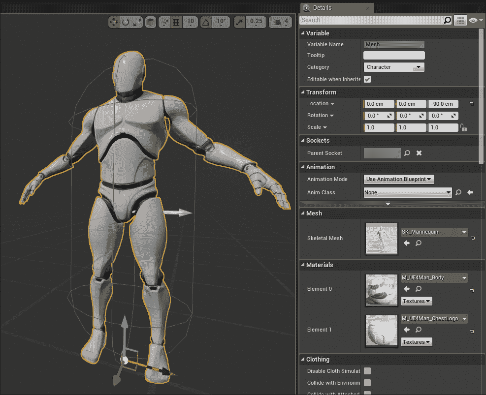

你还希望角色面向正确的方向。你可以看到角色面向错误的方向，因为箭头组件与角色面向的方向垂直。只需调整角色在*Z*轴上的旋转。**Z 旋转**的**-90**值似乎很有效：

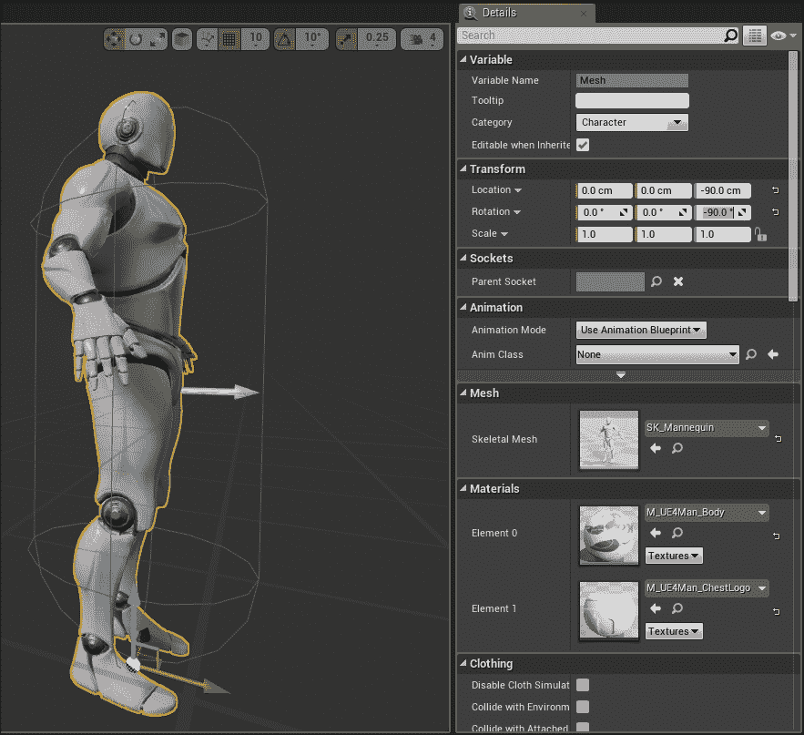

最后，我们需要将角色从放松的姿态中解脱出来。因此，导航到**细节** | **动画**并选择**Anim Class**下拉菜单。在这个下拉菜单中，选择为所选角色提供的动画类**ThirdPerson_AnimBP**。如果你使用的是具有不同动画类的另一个角色，请确保选择为你的角色构建的动画类：

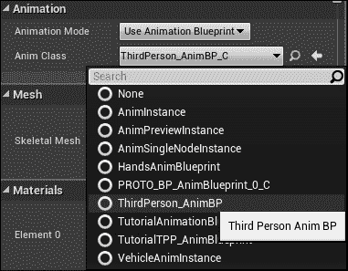

我们还需要一种与这个角色交互的方法。为此，我们将创建一个在角色前方扩展一定距离的体积；这将是在玩家能够与 NPC 交互的区域。为此，我们需要向**CapsuleComponent**添加另一个组件。导航到**组件**面板，并选择**添加组件** | **碰撞** | **箱形碰撞**：

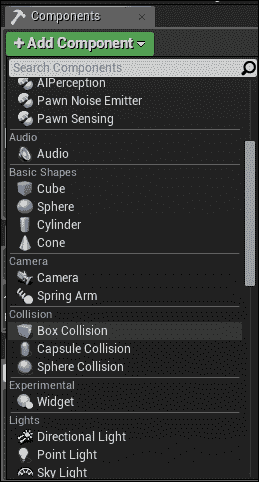

这将在角色的原点创建一个盒子碰撞：

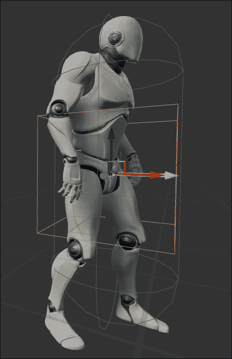

我们将通过计算玩家是否在盒子内或盒子外来使用这个碰撞。如果他们在盒子内，玩家将能够与 NPC 交互；如果玩家在盒子外，玩家将无法与 NPC 交互。由于我们希望使其尽可能真实，玩家只有在角色站在 NPC 前面时才能与 NPC 交互。因此调整盒子的位置和缩放，直到它位于角色前面，并且大小使得玩家可以轻松地走到 NPC 前面与它交互。

对于这个角色，我将编辑**位置 X**值为**60**，**缩放 X**值为**2**，**缩放 Y**值为**2**，以及**缩放 Z**值为**3**：

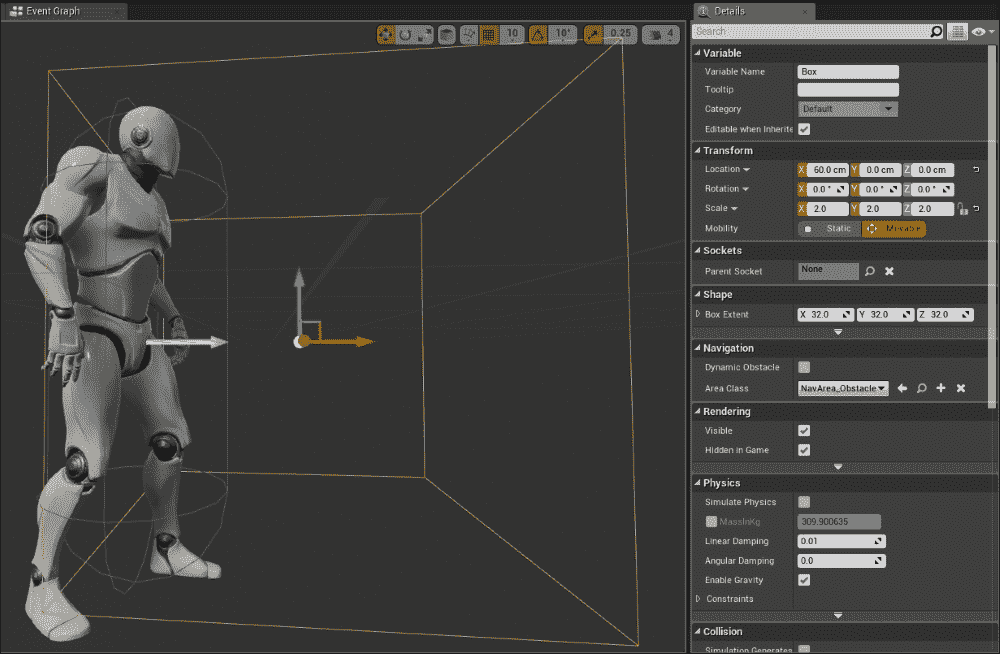

最后，我们希望给碰撞盒一个类型，它不会阻止玩家，但允许玩家进入碰撞盒。导航到**详情** | **碰撞**，在**碰撞预设**下，选择**触发**：

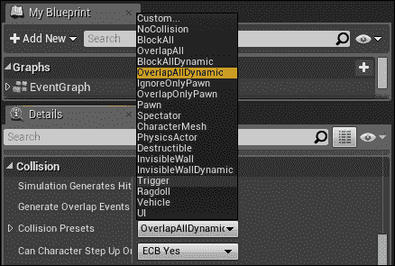

这将基本上将碰撞盒转换为可以触发如对话和商店菜单等事件的触发体积。

在这一点上，你可以将你的**NPC_ShopOwner**拖放到你的关卡中：

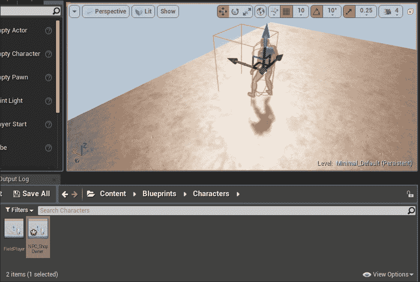

如果你进行测试，你应该注意到你会与骨骼网格发生碰撞，但你不会与触发体积发生碰撞。你现在可以准备创建蓝图来使这个 NPC 交互式。

# 与 NPC 交互

现在你已经创建了将触发与 NPC 交互的 NPC 和体积，是时候通过使用触发体积来编程 NPC 的交互了。

让我们先思考一下逻辑。我们希望做到的是，只有当玩家在 NPC 的视线范围内（在这种情况下，触发体积）时，才允许玩家与 NPC 交互。如果玩家不在触发体积内，我们不想允许玩家与 NPC 交互。在这种情况下，我们需要某种布尔值，当玩家在触发体积内时返回 *true*，当角色不在触发体积内时返回 *false*。我们还希望允许玩家按下一个键与 NPC 交互，但只有在创建的布尔值设置为 true 时才允许，因为我们创建的用于跟踪 NPC 触发体积的布尔值可能跨越多个类。就像前面的章节一样，让我们在 `RPGGameInstance.h` 中声明这个全局变量。我们将把这个变量放在与我们的其他全局变量相同的 `Game Data` 类别中，但这次，我们不仅需要允许蓝图读取变量，还需要允许蓝图写入变量，因为我们将在 true 和 false 之间切换变量。我们将添加一个名为 `TalkShop` 的布尔值作为我们的公共变量之一：

```cpp
UPROPERTY( EditDefaultsOnly, BlueprintReadWrite, Category = "Game Data" )
bool TalkShop;
```

当你完成编辑 `RPGGameInstance.h` 后，你的头文件现在应该看起来像以下这样：

```cpp
#pragma once

#include "Engine/GameInstance.h"
#include "GameCharacter.h"

#include "RPGGameInstance.generated.h"

/**
 * 
 */
UCLASS()
class RPG_API URPGGameInstance : public UGameInstance
{
  GENERATED_BODY()

  URPGGameInstance( const class FObjectInitializer& ObjectInitializer );

public:
  UPROPERTY( EditDefaultsOnly, BlueprintReadOnly, Category = "Game Data" )
  TArray<UGameCharacter*> PartyMembers;

  UPROPERTY( EditDefaultsOnly, BlueprintReadWrite, Category = "Game Data" )
  bool TalkShop;

protected:
  bool isInitialized;

public:
  void Init();
  void PrepareReset();
};
```

编译代码后，进入 **NPC_ShopOwner** 角色蓝图。在 **Components** 面板中选择 **Box** 组件，然后在 **Details** 面板中向下滚动到 **Events**。你会注意到，根据如何与盒子交互，这里可以创建许多不同类型的事件：

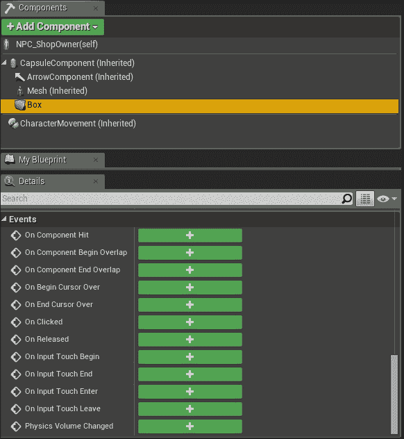

我们最感兴趣的是 **On Component Begin Overlap** 和 **On Component End Overlap**，因为这些事件将在有东西与盒子相交或不相交时触发。让我们首先处理如果玩家与盒子相交时触发事件的情况。因此，在 **Details** | **Events** | **On Component Begin Overlap** 中选择 **+**。这将自动打开 **Event Graph** 并创建一个 **OnComponentBeginOverlap** 事件：


在这里我们只需要简单地设置之前创建的 `TalkShop` 布尔值为 `true`，如果玩家与盒子相交。要做到这一点，首先使用 **Utilities** | **Casting** 下的 **Cast To FieldPlayer** 将 **FieldPlayer** 强制转换为，并通过将 **OnComponentBeginOverlap** 中的 **OtherActor** 插针链接到 **Cast To FieldPlayer** 节点中的 **Object** 插针来设置交互组件为 **FieldPlayer** 对象：

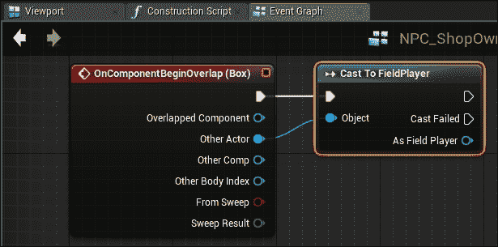

从这里，我们有 **FieldPlayer** 触发使用位于 **Utilities** | **Casting** 下的 **Cast To RPGGameInstance** 节点的 **RPGGameInstance** 强制转换，其 **Object** 插针是 **Get Game Instance**，因为 `TalkShop` 变量位于 **RPGGameInstance** 中：

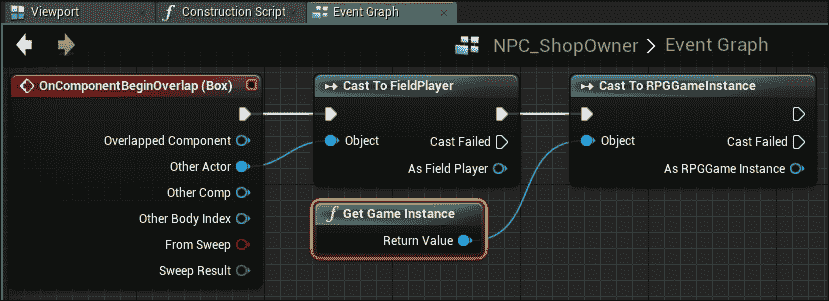

最后，通过取消选择**Context Sensitive**，导航到**Class** | **RPGGameInstance**，并选择**Set Talk Shop**来创建一个**Set Talk Shop**动作：

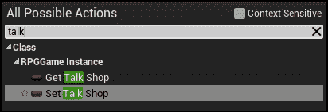

让**Cast To RPGGameInstance**触发**Set Talk Shop**动作，并确保我们通过将**Cast To RPGGameInstance**的**As RPGGameInstance**引脚链接到**Set Talk Shop**的**Target**引脚来引用位于**RPGGameInstance**中的`TalkShop`变量。此外，确保在**Set Talk Shop**节点中检查**Talk Shop**布尔值，将`TalkShop`变量设置为`true`。完成时，你的 Blueprint 应该看起来像以下截图：

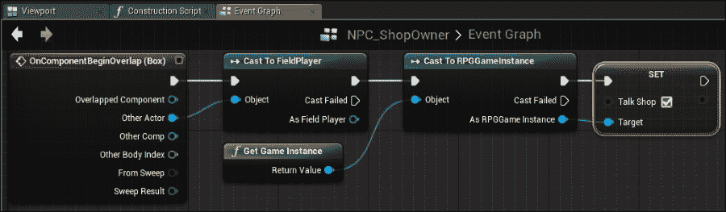

现在我们已经完成了创建**Begin Overlap**事件，让我们创建玩家/键交互并检查**Talk Shop**布尔值是否为真或假。由于玩家控制器无法直接访问**NPC_ShopOwner**，我们需要在 Field Player 类或 Level Blueprint 类中创建键交互。因为 NPC 是特定级别的特定部分，而不同的级别可能包含不同的 NPC，所以将键和布尔检查放在 Level Blueprint 中最为合理。因此，此时导航到**Blueprints** | **Open Level Blueprint**以进入 Level Blueprint。

在 Level Blueprint 中，我们将通过导航到**Input** | **Key Events** | **E**创建一个字母*E*的键事件。然后，在*E*键释放时（因为我们希望玩家对按键做出承诺），触发**Cast To RPGGameInstance**，其对象为**Get Game Instance**，因为在按键时，我们想要检查位于**RPGGameInstance**中的`TalkShop`变量的状态：

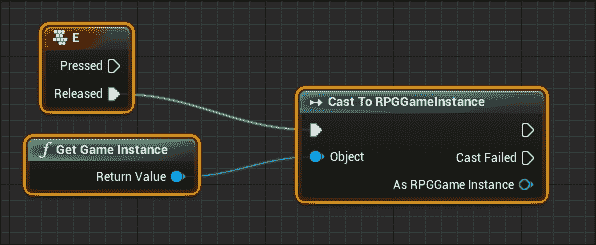

通过在**Cast To RPGGameInstance**中拖出**As RPGGameInstance**引脚来引用`TalkShop`变量，导航到**Variables** | **Game Data**然后选择**Get Talk Shop**，因为我们将会检查**Talk Shop**：

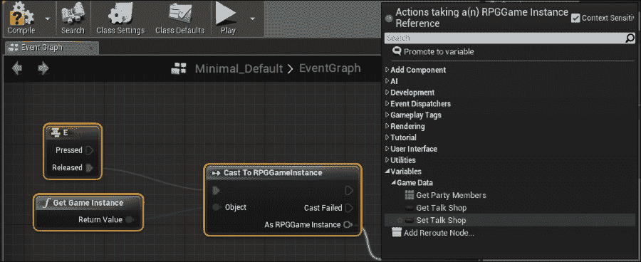

现在我们正在引用`TalkShop`变量，我们可以通过创建位于**Utilities** | **Flow Control**下的**Branch**语句来检查**Talk Shop**的条件：

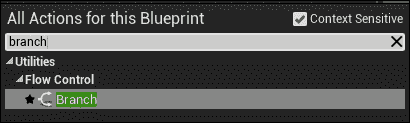

将**Talk Shop**引脚链接到**Branch**节点中的**Condition**引脚以检查`TalkShop`的条件，并让**Cast To RPGGameInstance**激活**Branch**：

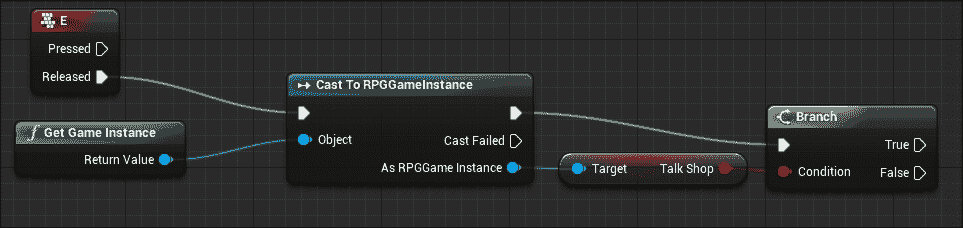

现在我们已经设置了这个框架，我们可以根据 `TalkShop` 条件为真或假来做一些事情。现在，我们将通过导航到 **实用工具** | **文本** | **打印文本** 来运行一个测试，这将创建一个 **打印文本** 函数。将 **分支** 节点的 **True** 插针链接到 **打印文本** 的 **In** 插针。完成操作后，你的关卡蓝图应该看起来像以下截图：


如果你现在测试这个功能，你应该会注意到，如果玩家在 NPC 触发体积外按下 *E* 键，将不会发生任何事情；然而，如果玩家在触发体积内按下 *E* 键，屏幕上会出现文本。但是，如果我们退出体积并继续按下 *E* 键，文本将继续出现在屏幕上。这是因为我们从未将 `TalkShop` 布尔值设置回 `false`。这样做非常简单。导航回 **NPC_ShopOwner** 并在 **详情** | **On Component End Overlap** 下的 **+** 处创建一个 **OnComponentEndOverlap** 事件：

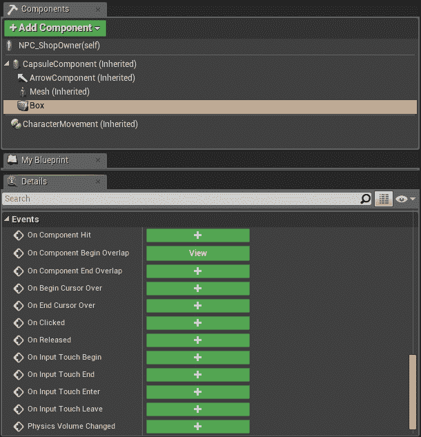

由于我们在创建 **OnComponentBeginOverlap** 事件时已经创建了一个对 **Talk Shop** 的引用，并将其设置为 true，因此我们可以简单地创建一个与 **OnComponentBeginOverlap** 完全相同功能的 **OnComponentEndOverlap** 事件；然而，不是将 `TalkShop` 设置为 `true`，而是通过确保 **Set Talk Shop** 节点内的 **Talk Shop** 插针未被勾选来将 `TalkShop` 设置为 `false`。你的 **OnComponentEndOverlap** 事件现在应该看起来像以下截图：

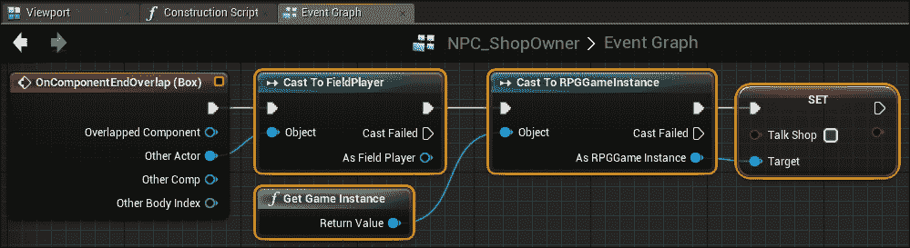

当你现在测试这个功能时，通过 *E* 键与 NPC 的交互应该只在没有玩家意图中穿过 NPC 的触发体积时才有效。

# 对话框设置

我们现在准备好创建 NPC 将对角色说的话的对话。为此，我们将首先创建一个 Widget 蓝图，该蓝图将负责存放所有 NPC 的父变量，例如游戏中的对话，这样我们就可以通过在函数中调用对话变量来随时获取对话。这个过程将比在 UMG 中硬编码文本更好，因为它将允许我们只需要一个动态放置文本的单一对话 UMG。

因此，让我们首先通过导航到 **内容浏览器** | **内容** | **蓝图** | **UI** 并选择 **添加新** | **用户界面** | **Widget 蓝图** 来创建一个新的 Widget 蓝图。然后，将其命名为 **NPC_Parent**：


一旦创建，打开新的 Widget 蓝图，然后导航到图。从这里，转到 **我的蓝图** 面板，并选择 **变量** 右侧的 **+**；这将创建一个新的变量。将此变量命名为 **NPCDialog** 并通过点击变量名右侧的眼睛将其设置为公共变量：

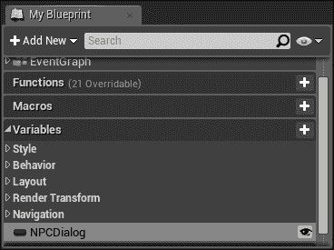

在**详细信息**面板中，将**变量类型**更改为**文本**，因为我们将会使用文本来显示对话框。同时，点击**变量类型**右侧的方形图标，使该变量成为文本数组：

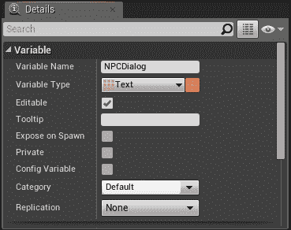

接下来，在**详细信息**面板内的**默认值**选项卡中向下滚动到包含数组元素的区域。默认情况下，它没有任何元素：

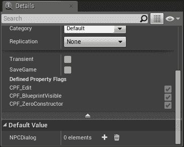

在**详细信息** | **默认值**中，点击**元素**旁边的**+**来添加一个元素，该元素将在**0**元素旁边创建一个文本框。在这个元素中输入一些文本作为值。您可以在这里写入任何形式的文本；由于我计划让 NPC 在玩家离开战斗时向玩家提供信息，我将使对话框显示*当您在战斗外按 P 键时，您可以检查您的角色状态*：

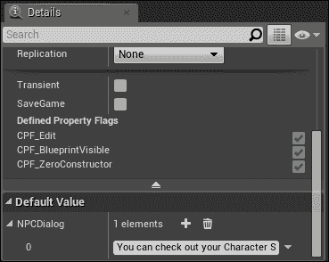

由于我们的 NPC 是店主，他们可以像这样问候我们，例如，说*问候。我是罗伊，店主，我能为您做什么？*您可以将此文本作为**NPCDialog**数组中的第二个元素添加：

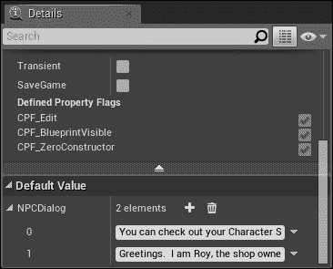

每当我们需要一个新的 NPC 变量，而我们可能不希望它被硬编码时，我们可以回到这个 Widget Blueprint，并像刚才那样添加对话框。接下来，我们可以通过导航回我们的**内容浏览器**来为我们的 NPC 创建实际的对话框。由于我们最终可能会有许多不同的角色使用相同的对话框，只是里面的文本不同，我们可能想要创建另一个 Widget Blueprint，它只包含一个基本窗口和一个退出对话框的按钮。在**内容浏览器**中，导航到**内容** | **蓝图** | **UI**，然后选择**添加新项** | **用户界面** | **Widget Blueprint**。然后，将其命名为**DialogBox**：

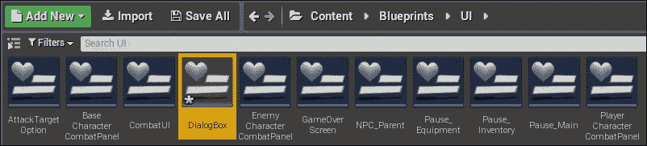

打开新的 Widget Blueprint。从这里，导航到**文件** | **重新父化蓝图**，并将其重新父化到**NPC_Parent**，它包含我们所有的变量：

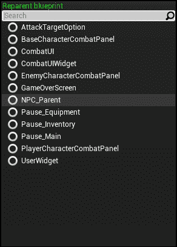

由于对话框的大小很少会覆盖整个屏幕，我们将在默认的画布面板内创建一个画布面板，通过导航到**面板** | **画布面板**并拖动新的画布面板到父画布面板内来完成：

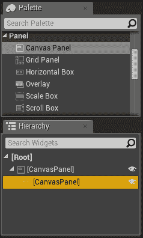

将这个新的画布面板重命名为**CanvasPanel_DialogBox**。此外，将这个画布面板锚定在屏幕中间：

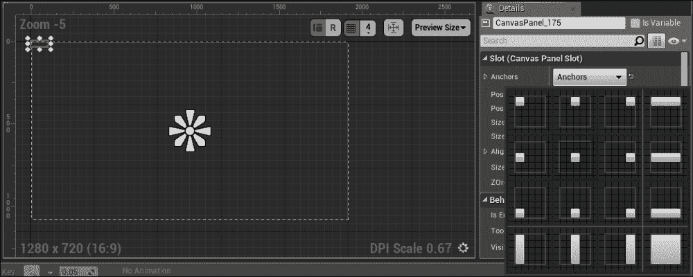

您可能还想调整文本框的大小，以便容纳适量的文本。我将调整这个文本框的**Size X**值为**1024**，**Size Y**值为**512**。您还应该通过将**Position X**设置为-1024/2，即**-512**，以及将**Position Y**设置为-512/2，即**-256**来居中文本框：

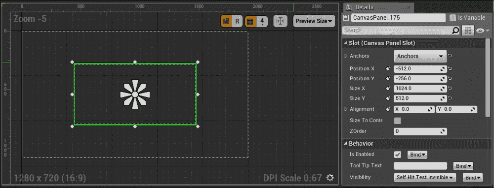

在**CanvasPanel_DialogBox**内，从**调色板** | **常用** | **图像**中添加一个图像，我们可以用它以类似我们在暂停菜单中做的方式添加背景颜色：

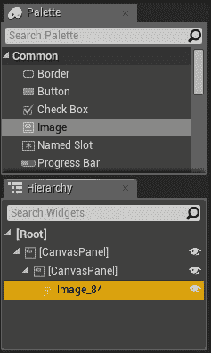

在**详情**面板中，将此图像重命名为**BGColor**，并调整其位置和大小，使其位于屏幕中央。这可以通过选择中心锚点轻松完成：

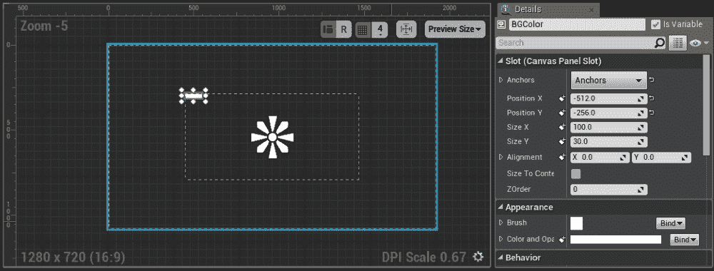

调整大小和位置，使其与画布面板相同，即**Size X**值为**1024**，**Size Y**值为**512**，**Position X**值为**-512**，**Position Y**值为**256**：

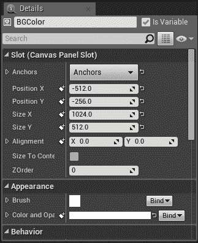

最后，在**详情** | **外观** | **颜色和透明度**下，调整颜色以与其他菜单相同。在这种情况下，我们可以选择颜色选择器并传入线性十六进制值**267FFFFF**：

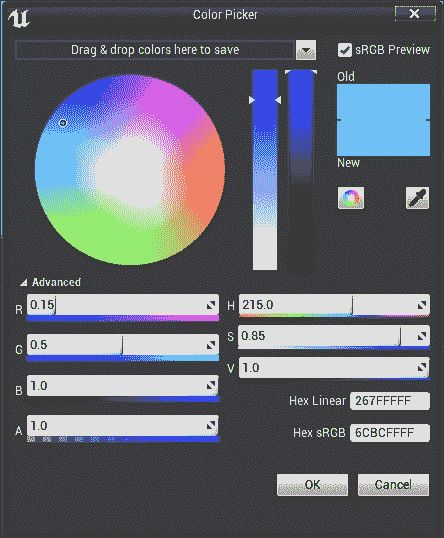

接下来，让我们插入一个退出按钮，通过从**调色板** | **常用** | **按钮**中选择并拖动一个按钮到**CanvasPanel_DialogBox**中，以离开此菜单：

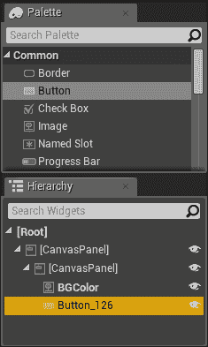

将此按钮重命名为**Button_Exit**，并通过首先将按钮的大小调整为与暂停菜单按钮的大小相匹配，将按钮定位在画布面板的右侧。这些按钮的**Size X**值为**300**，**Size Y**值为**100**。然后，通过将锚点更改为右下对齐，将按钮定位在画布面板的右下角。然后，使用简单的位置，例如提供 20 像素填充的位置，即**Position X**为**-320**，**Position Y**为**-120**。你还会注意到按钮位于**BGColor**之后；只需将**ZOrder**值更改为**1**：

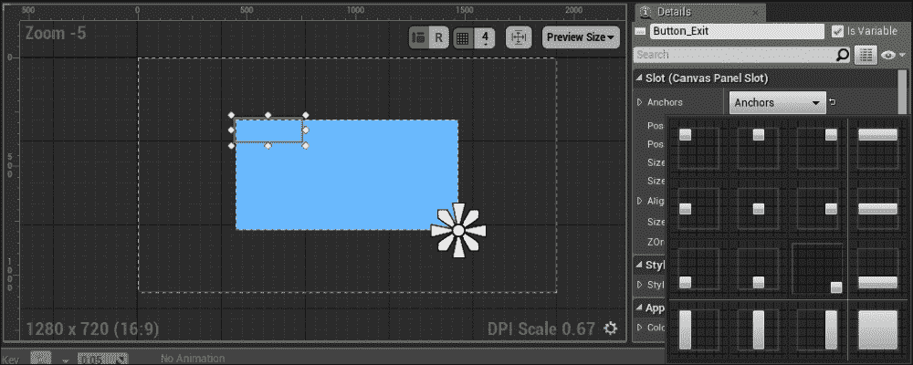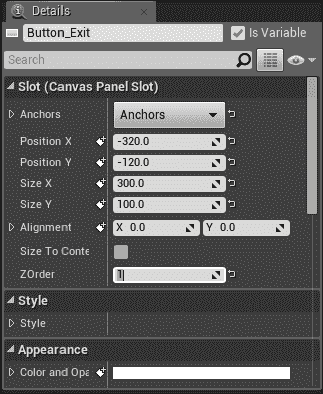

现在你已经创建并定位了一个按钮，向其中添加一个文本块。将文本重命名为**TextBlock_Exit**，然后在**详情** | **外观** | **字体**下，将字体大小更改为**48**。同时，将文本块的内容更改为**退出**：

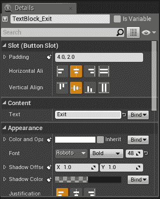

编程按钮以退出，就像你在之前的菜单创建中做的那样，通过选择按钮，在**详情** | **事件**中向下滚动到**OnClicked**，然后点击**+**按钮。这将打开**事件图**并为退出按钮填充**OnClicked**事件。从**OnClicked**事件中拖出**Out**引脚，并选择位于**小部件**下的**从父级移除**：

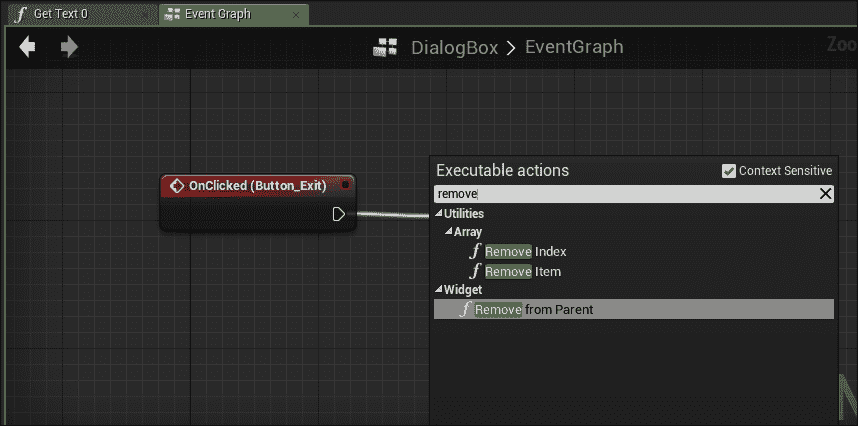

返回到**设计器**视图，向**CanvasPanel_DialogBox**添加一个文本块，命名为**TextBlock_Dialog**，并使其占据大部分画布面板。为此，我们可以通过将**Position X**设置为**20**和**Position Y**设置为**20**来定位文本块，使其具有 20 像素的填充。我们还可以设置文本块的大小，将**Size X**设置为**986**和**Size Y**设置为**300**。最后，将**ZOrder**值设置为**1**：

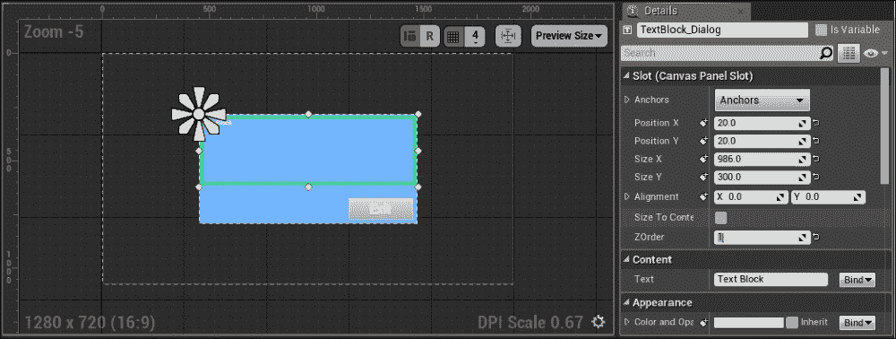

到目前为止，我们已经完成了对话框模板的创建。现在我们可以继续为我们的 NPC 创建对话框。

# 创建 NPC 欢迎框

现在我们已经有了对话框模板，让我们通过为我们的 NPC 创建基于我们刚刚创建的内容的定制对话框来使用它们。为了保持组织有序，我们应该为 NPC 创建一个单独的文件夹，因为我们很可能会拥有更多的 UMG 和机会在 NPC 创建之外使用我们的对话框。所以，在**内容浏览器**中，导航到**内容** | **蓝图** | **UI**，并在**添加新内容**下创建一个新文件夹。将此文件夹命名为`NPC`，然后进入该文件夹。创建之前章节中制作的**DialogBox** Widget 蓝图的一个副本，并将其移动到`NPC`文件夹中。将复制的控件命名为**Shop_Welcome**：

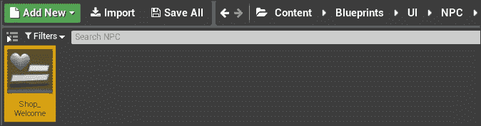

打开**Shop_Welcome**控件，并选择**TextBlock_Dialog**文本块。在**详细信息** | **内容**中创建一个新的文本绑定，这将打开图表：

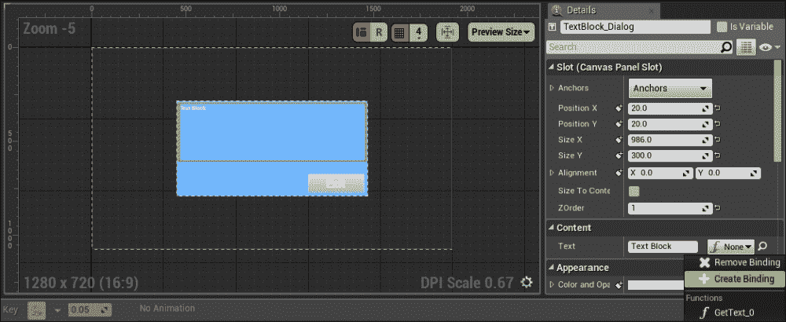

在这个阶段，您可以右键点击以找到**此蓝图的所有操作**，然后在**变量** | **默认**下，您应该找到可以使用的**Get NPCDialog**变量：

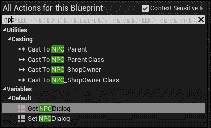

从这里，拖出**NPCDialog**数组引脚，并在**实用工具** | **数组**下选择**获取**函数：

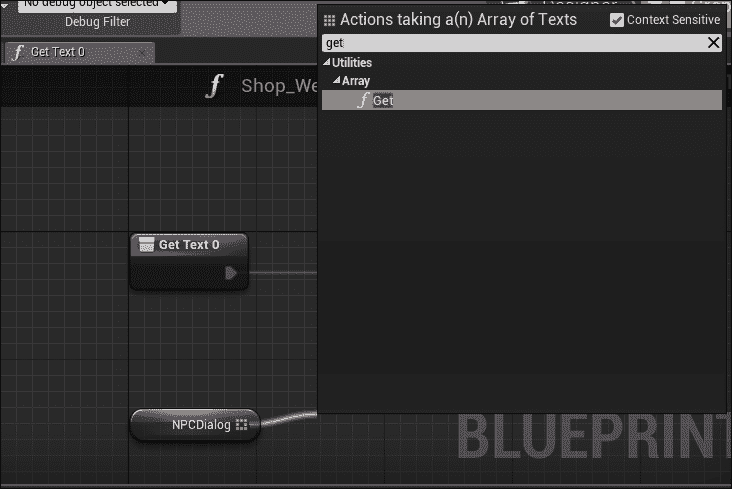

从这里，您可以通过选择正确的元素来选择**NPCDialog**中的任何文本。由于欢迎文本在元素 1 中，将**获取**函数中的**0**更改为**1**。为了使此文本返回到文本块，将**GET**链接到**ReturnNode**的**返回值**：

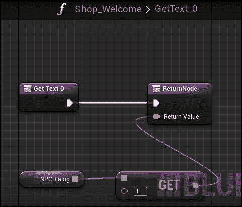

由于这是欢迎对话框，我们仍然允许玩家退出，但我们也应该允许他们从 NPC 那里获取一般信息或访问他们的商店。所以，让我们复制**退出**按钮，并为谈话和购物放置占位符。导航回**设计器**视图，在**退出**按钮的左侧再添加两个按钮，一个写着**商店**，另一个写着**谈话**。您不必现在就编程这些按钮，因为我们还没有商店或谈话 UMG：

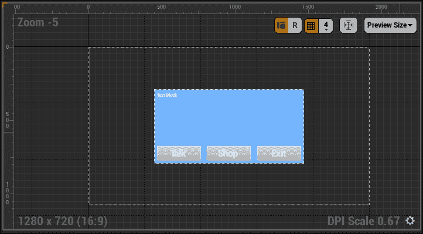

接下来，通过打开本章开头创建的关卡蓝图，使此屏幕在正确的时间出现。当**谈话商店**条件为真时，不要将文本打印到屏幕上，而是将**用户界面**下的**创建 Widget**链接到**True**：

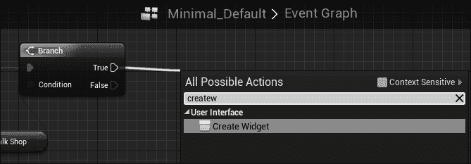

对于类，选择**Shop_Welcome**：

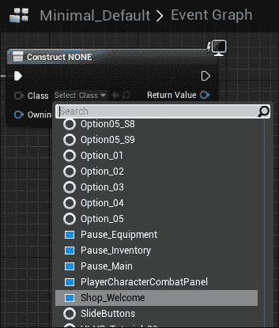

最后，通过将**Create Shop_Welcome Widget**的返回值引脚链接到位于**用户界面** | **视口**下的**添加到视口**，将此内容显示到屏幕上：

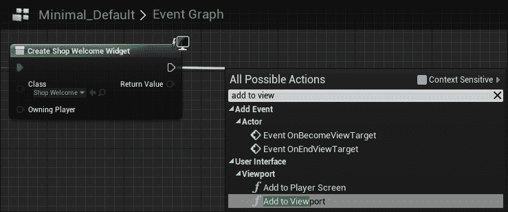

此外，通过在**游戏**下创建一个**获取玩家控制器**函数，并将它的**返回值**链接到位于**类** | **玩家控制器**下的**设置显示鼠标光标**，给玩家访问鼠标光标的权限。最后，将**添加到视口**节点链接到**设置显示鼠标光标**节点，并检查**显示鼠标光标**。完成之后，你的关卡蓝图应该看起来像以下截图：

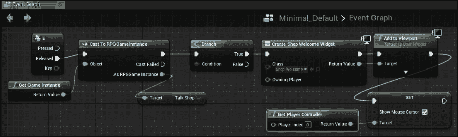

如果现在进行游戏测试，您应该仍然可以走到 NPC 那里并按*E*键与他交互，但这次会弹出一个对话框：

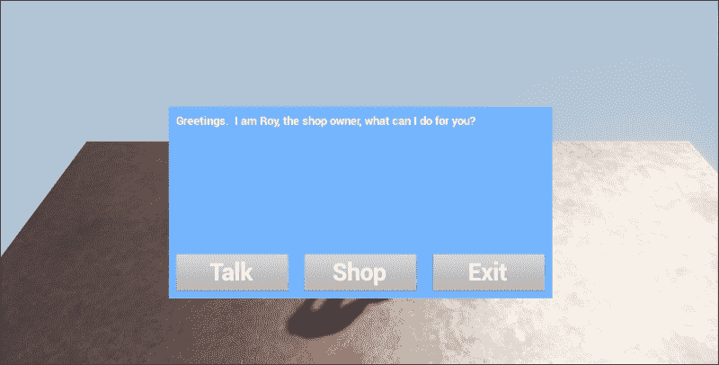

恭喜，您已经创建了您的第一个对话框。现在让我们继续制作打开其他交互式小部件的导航按钮。

# 添加 NPC 对话框

现在您已经创建了一个当玩家与 NPC 交互时弹出的对话框，您可以轻松地为玩家添加当他们在**谈话**按钮上点击时可以看到的对话。只需复制您之前创建的**DialogBox** Widget 蓝图，并将其放置在**内容浏览器**下的**NPC**文件夹中，该文件夹位于**内容** | **蓝图** | **UI**。将复制的 Widget 蓝图重命名为**Shop_Talk**。

现在，我们将通过打开**Shop_Talk** Widget 蓝图向此菜单添加一些适当的对话。然后在**设计师**视图中，选择已经放置到您的画布面板中的文本块。

一旦选择，导航到**详情** | **内容**，然后在**文本**中，选择**绑定** | **+ 创建绑定**。

如往常一样，此操作将自动将您带到图形编辑器，并将**获取文本**函数设置为从**返回**节点返回空值。接下来的步骤与您在上一节中从**NPCDialog**变量调用对话框时所做的步骤相同。您必须导航到**我的蓝图**选项卡，并使用**NPCDialog**变量的**GET**版本。

然后，拖出**NPCDialog**数组引脚并选择位于**Utilities** | **Array**下的**Get**函数。最后，让**GET**函数选择**NPCDialog**数组中的正确元素。在这种情况下，我们会保持元素 0 被选中，因为我们之前在本章中设置了元素 0 的对话。一旦选择了正确的对话，将**GET**链接到**ReturnNode**的**Return Value**。此时，你的 Graph Editor 应该看起来像以下截图：

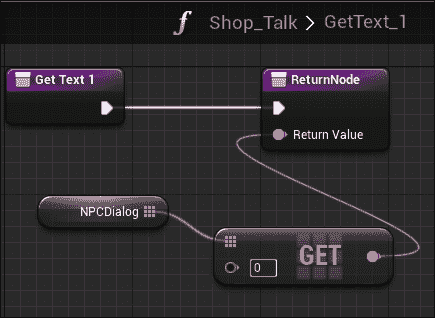

你现在已经完成了**Shop_Talk** Widget Blueprint。你需要现在将其绑定到**Shop_Welcome** Widget Blueprint 中的**Talk**按钮上，因此打开**Shop_Welcome**中的**Designer**视图并选择**Talk**按钮。在**Details**面板中，导航到**Events**并按下**OnClicked**旁边的**+**按钮：

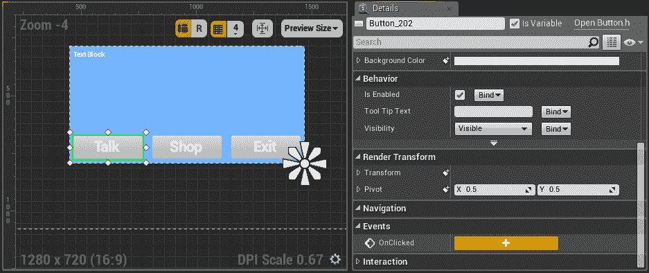

现在应该创建一个与你的**Talk**按钮绑定的**OnClicked**事件，并且事件图现在应该已经自动打开。从这里开始，我们需要做的是在按钮被点击时，我们需要关闭**Shop_Welcome** Widget Blueprint 并打开**Shop_Talk** Widget Blueprint。这些步骤应该与你之前多次在按钮点击后打开和关闭 Widget Blueprint 时所做的非常相似。将**OnClicked**事件链接到位于**Widget**下的**Remove from Parent**，这将关闭你的当前 Widget Blueprint。然后，将**Create Widget**节点链接到位于**User Interface**下的**Remove from Parent**。将**Create Widget**的类更改为**Shop_Talk**，以便生成你的**Shop_Talk** Widget Blueprint。从这里开始，将**Add to Viewport**链接到位于**User Interface** | **Viewport**下的**Create Shop_Talk Widget**节点的**Return Value**。同时，确保**Add to Viewport**链接到**Create Shop_Talk Widget**的输出引脚，这样只有在**Shop_Talk** widget 创建后，Widget Blueprint 才会在玩家的视图中显示。当你完成时，你的**Talk**按钮的**EventGraph**应该看起来像以下截图：

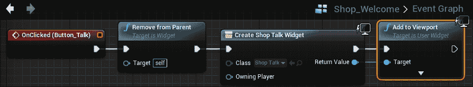

你可能已经注意到，**Talk**按钮现在工作得非常完美，但文本会被截断：

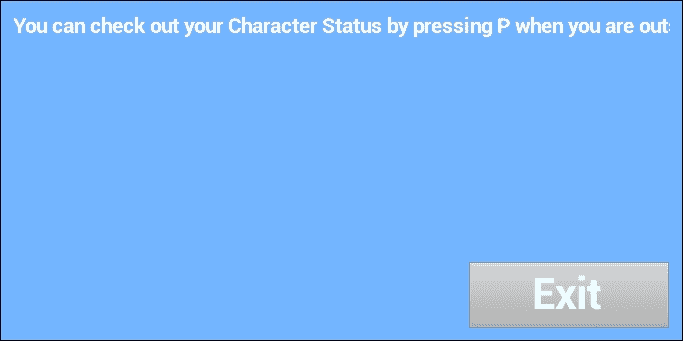

这是因为我们没有包裹文本。要包裹文本，请回到**Shop_Talk** Widget Blueprint，并在**Designer**视图中选择**Dialog**文本块。然后，在**Details**面板中，导航到**Appearance**并勾选**Auto Text Wrap**。这将确保文本始终围绕内容包裹，在这种情况下，当文本达到文本块的边界时，文本将移动到新的一行。如果你测试**Talk**按钮，单词应该现在这样包裹：

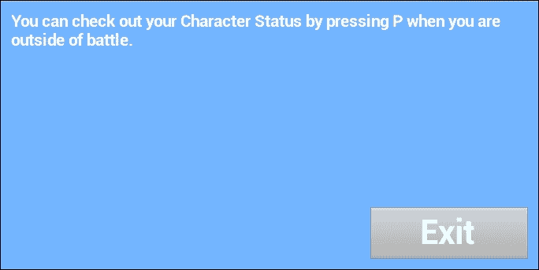

到目前为止，你应该已经实现了玩家与 NPC 之间的交互，所有按钮都工作正常，除了**商店**按钮。

# 摘要

在本章中，我们创建了一个可以通过触发体积和按键绑定与玩家进行通信的非玩家角色（NPC）。现在，我们可以在游戏的任何时刻从字符串数组中显示对话。在下一章中，我们将我们的 NPC 转换成店主，并允许玩家从商店购买装备。
