# 第七章. 金币、物品和商店

现在你已经创建了一个与玩家交谈的 NPC，是时候允许 NPC 帮助玩家了。在本章中，我们将使用 NPC 作为店主，向用户展示可以购买的物品。在我们这样做之前，用户将需要某种货币来购买物品。本章我们将涵盖以下主题：

+   设置和获取金币实例

+   物品数据

+   商店屏幕框架

+   物品按钮框架

+   链接物品数据

# 设置和获取金币实例

当我们继续制作购物界面，通过**Shop**按钮时，我们首先必须能够提取货币，以便在商店中购买物品。在之前的一章中，我们讨论并创建了金币的占位符，但实际上我们没有创建金币值。在这个游戏中，我们希望金币在战斗结束后由敌人掉落。在这种情况下，敌人需要某种金币数据，我们可以将其添加到玩家的金币数据中（最终，物品也需要这种与它们关联的金币数据）。在第四章，*暂停菜单框架*中，我们创建了一个具有金币占位符的暂停菜单，现在我们将向这个暂停菜单添加金币。

首先，让我们在`FEnemyInfo.h`中添加一个`Gold`属性。导航到**Source** | **RPG** | **Data**，打开`FEnemyInfo.h`，并在你的`EnemyInfo`表中添加一个整型数据类型的`Gold`属性，如下所示：

```cpp
UPROPERTY( BlueprintReadOnly, EditAnywhere, Category = "EnemyInfo" )
  int32 Gold;
```

我们现在需要将`Gold`属性与我们的标准`GameCharacter`属性关联起来，以便我们可以更新任何敌人的实例，使其具有正确的金币值。接下来，你将打开位于**Source**下的**RPG**文件夹中的`GameCharacter.h`文件，并在`UCharacter`类中添加一个与`FEnemyInfo.h`中类似的公共`UProperty`用于金币：

```cpp
UPROPERTY(BlueprintReadWrite,EditAnywhere, Category = CharacterInfo)
  int32 Gold;
```

然后，进入`GameCharacter.cpp`来设置金币的返回值，使其等于在`EnemyInfo`中设置的值，这样这个特定敌人的每个实例都将返回敌人数据表中设置的金币数量：

```cpp
character->Gold = enemyInfo->Gold;
```

当你完成时，`GameCharacter.cpp`中的敌人角色信息将看起来像这样：

```cpp
UGameCharacter* UGameCharacter::CreateGameCharacter(FEnemyInfo* enemyInfo, UObject* outer)
{
 UGameCharacter* character = NewObject<UGameCharacter>(outer);

 character->CharacterName = enemyInfo->EnemyName;
 character->ClassInfo = nullptr;

 character->MHP = enemyInfo->MHP;
 character->MMP = 0;
 character->HP = enemyInfo->MHP;
 character->MP = 0;

 character->ATK = enemyInfo->ATK;
 character->DEF = enemyInfo->DEF;
 character->LUCK = enemyInfo->Luck;
 character->Gold = enemyInfo->Gold;

 character->decisionMaker = new TestDecisionMaker();
 character->isPlayer = false;
 return character;
}
```

我们现在需要选择何时累积金币，在这种情况下，我们将从战斗中累积金币。因此，导航到**Source** | **RPG** | **Combat**，打开`CombatEngine.h`，创建一个公共的金币变量，我们将用它来存储在战斗中赢得的所有金币：

```cpp
int32 GoldTotal;
```

当你完成声明`GoldTotal`变量后，`CombatEngine.h`文件将看起来像这样：

```cpp
#pragma once
#include "RPG.h"
#include "GameCharacter.h"

/**
 * 
 */
enum class CombatPhase : uint8
{
 CPHASE_Decision,
 CPHASE_Action,
 CPHASE_Victory,
 CPHASE_GameOver,
};

class RPG_API CombatEngine
{
public:
 TArray<UGameCharacter*> combatantOrder;

 TArray<UGameCharacter*> playerParty;
 TArray<UGameCharacter*> enemyParty;

 CombatPhase phase;
 int32 GoldTotal;

protected:
 UGameCharacter* currentTickTarget;
 int tickTargetIndex;
 bool waitingForCharacter;

public:
 CombatEngine(TArray<UGameCharacter*> playerParty,
  TArray<UGameCharacter*> enemyParty);
 ~CombatEngine();

 bool Tick(float DeltaSeconds);

protected:
 void SetPhase(CombatPhase phase);
 void SelectNextCharacter();
};
```

我们接下来需要执行的操作是告诉引擎何时给玩家金币。如前所述，我们希望玩家能够从可以轻松集成到我们的战斗引擎中的敌人那里赢得金币。导航到**源** | **RPG** | **战斗**，打开`CombatEngine.cpp`文件。让我们首先滚动到我们在第三章中创建的`for`循环，检查胜利。在这个`for`循环上方，声明一个新的`Gold`整数，并将其设置为`0`：

```cpp
int32 Gold = 0;
```

这将确保，如果我们没有胜利并需要再次循环`for`循环，战斗中获得的金币将重置为 0。接下来，我们需要累积每个被击败的敌人的金币；因此，在`for`循环中，我们将`Gold`增加每个敌人的金币：

```cpp
Gold += this->enemyParty[i]->Gold;
```

你的`for`循环现在将看起来像这样：

```cpp
for( int i = 0; i < this->enemyParty.Num(); i++ )
{
  if( this->enemyParty[i]->HP <= 0 ) deadCount++;
  Gold += this->enemyParty[i]->Gold;
}
```

在`for`循环之后，你仍然会有一个`if`条件来检查敌人党派是否已死亡；如果敌人党派已死亡，战斗阶段将变为胜利阶段。如果条件为`true`，这意味着我们赢得了战斗；因此，我们应该从`for`循环中获得金币奖励。由于我们想要添加的`Gold`变量在`GoldTotal`变量中，我们只需将局部`Gold`变量设置为`GoldTotal`的新值：

```cpp
GoldTotal = Gold;
```

当你完成时，你的`if`条件现在将看起来像这样：

```cpp
if (deadCount == this->enemyParty.Num())
 {
  this->SetPhase(CombatPhase::CPHASE_Victory);
  GoldTotal = Gold;
  return false;
 }
```

现在我们已经设置敌人在玩家在战斗中获胜后掉落金币，接下来我们需要做的是将金币添加到我们的游戏数据中；更具体地说，最好在`RPGGameInstance.h`中添加它，因为游戏实例始终处于活动状态。将金币数据添加到党派成员中是不明智的，除非有一个特定的党派成员将始终在游戏中。因此，让我们打开位于**源**下的**RPG**目录中的`RPGGameInstance.h`文件。

作为公共属性，向`游戏数据`中添加另一个整数，我们将其称为`游戏金币`。同时，确保`游戏金币`是可读和可写的，因为我们希望能够添加和减去金币；因此，必须启用`游戏金币`的编辑：

```cpp
UPROPERTY(EditAnywhere, BlueprintReadWrite, Category = "Game Data")
    int32 GameGold;
```

现在我们可以创建`GameGold`的实例，前往你原来设置游戏结束和胜利条件的`RPGGameMode.cpp`文件；在胜利条件中，创建一个指向`URPGGameInstance`的指针，我们将其称为`gameInstance`，并将其设置为`GetGameInstance`的转换：

```cpp
URPGGameInstance* gameInstance = Cast<URPGGameInstance>(GetGameInstance());
```

我们现在可以使用`gameInstance`将我们从战斗中获得的总金币添加到`GameGold`：

```cpp
gameInstance->GameGold += this->currentCombatInstance->GoldTotal;
```

到目前为止，我们用作玩家金币的`GameGold`值现在将增加战斗中赢得的金币。`RPGGameMode.cpp`中的`tick`函数现在将看起来像这样：

```cpp
void ARPGGameMode::Tick( float DeltaTime )
{
  if( this->currentCombatInstance != nullptr )
  {
    bool combatOver = this->currentCombatInstance->Tick( DeltaTime );
    if( combatOver )
    {
      if( this->currentCombatInstance->phase == CombatPhase::CPHASE_GameOver )
      {
        UE_LOG( LogTemp, Log, TEXT( "Player loses combat, game over" ) );

        Cast<URPGGameInstance>( GetGameInstance() )->PrepareReset();

        UUserWidget* GameOverUIInstance = CreateWidget<UUserWidget>( GetGameInstance(), this->GameOverUIClass );
        GameOverUIInstance->AddToViewport();
      }
      else if( this->currentCombatInstance->phase == CombatPhase::CPHASE_Victory )
      {
        UE_LOG( LogTemp, Log, TEXT( "Player wins combat" ) );
        //add gold to total gold
        URPGGameInstance* gameInstance = Cast<URPGGameInstance>(GetGameInstance());
        gameInstance->GameGold += this->currentCombatInstance->GoldTotal;

        // enable player actor
        UGameplayStatics::GetPlayerController( GetWorld(), 0 )->SetActorTickEnabled( true );
      }

      for( int i = 0; i < this->currentCombatInstance->playerParty.Num(); i++ )
      {
        this->currentCombatInstance->playerParty[i]->decisionMaker = nullptr;
      }

      this->CombatUIInstance->RemoveFromViewport();
      this->CombatUIInstance = nullptr;

      delete( this->currentCombatInstance );
      this->currentCombatInstance = nullptr;
      this->enemyParty.Empty();
    }
  }
}
```

现在，你需要确保所有更改都已保存，并重新编译整个项目（你可能需要重新启动 UE4）。

我们现在可以调整每个敌人角色的金币值，这些值来自敌人的数据表。在**内容浏览器**中，导航到位于**内容**下的**敌人**数据表，在**数据**下。在数据表中，你现在将看到一个**金币**行。将任何你想要的值添加到**金币**行，并保存数据表：

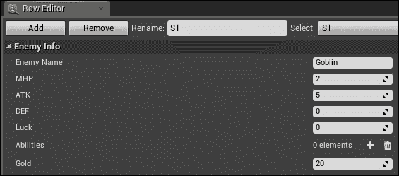

现在既然敌人有了金币值，就有了一个与`EnemyInfo`中的`Gold`变量绑定的实际值，如果玩家在战斗中获胜，这个值就会被添加到`GameGold`中。然而，我们需要显示这些金币；幸运的是，我们暂停菜单中仍然有一个金币占位符。打开**Pause_Main** Widget Blueprint，点击我们在第四章中创建的**Editable_Gold**文本块，*暂停菜单框架*。在**详细信息**面板中，转到**内容**并创建一个文本块的绑定，这将打开**获取可编辑金币文本**的图表：

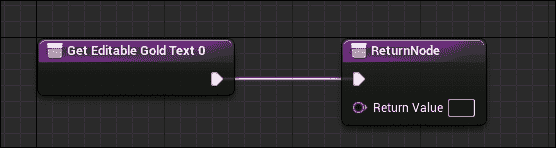

我们需要做的第一件事是通过在**游戏**下创建一个**获取游戏实例**函数来获取**RPGGameInstance**的游戏实例，并将其设置为**Cast To RPGGameInstance**的对象：

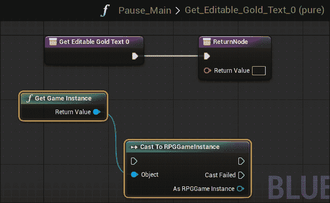

然后，我们可以从**RPGGameInstance**获取`GameGold`变量，这是存储游戏当前金币总数的变量。它位于**游戏数据**下的**变量**中。将其链接到**Cast To RPGGameInstance**中的**As RPGGameInstance**引脚：

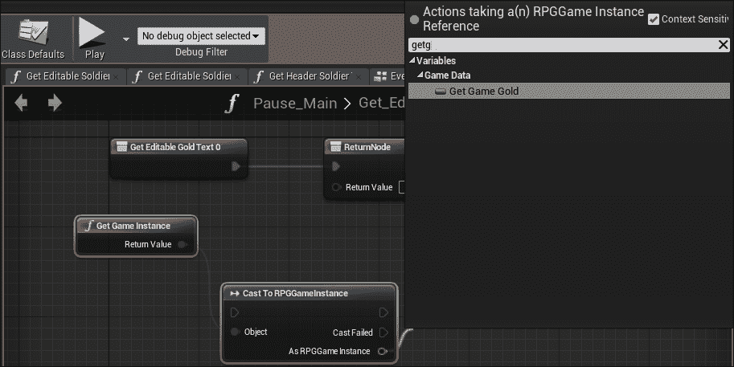

最后，将**游戏金币**链接到**ReturnNode**中的**返回值**，并允许**获取可编辑金币文本**触发**Cast To RPGGameInstance**，这将触发**ReturnNode**。你的**获取可编辑金币文本**绑定现在将看起来像这样：

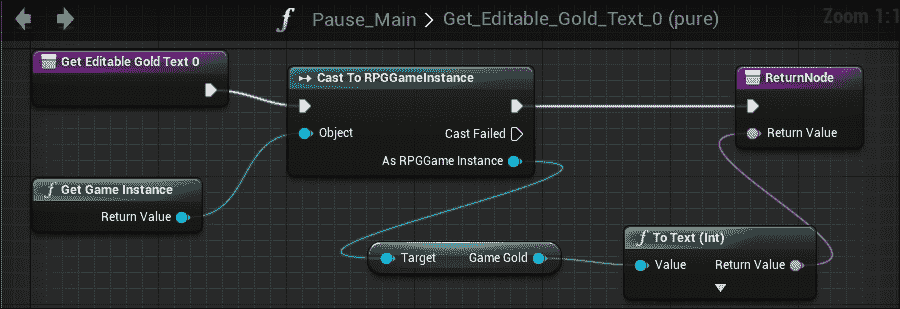

如果你现在测试，你将能够进入战斗，在胜利后从敌人那里赢得金币，现在你将能够在暂停菜单中看到你的金币积累。我们可以使用这些相同的变量来添加到任何菜单系统，包括商店。

# 物品数据

现在我们完成了金币的创建，在创建商店之前，我们还需要创建另一件事，那就是物品。制作物品有很多方法，但最好通过使用数据表来保持物品的库存和统计数据。因此，让我们首先创建一个新的 C++ `FTableRowBase`结构体，类似于你之前创建的`CharacterInfo`结构体。我们的文件将命名为`ItemsData.h`和`ItemsData.cpp`，我们将把这些文件放在我们的其他数据旁边；即通过导航到**源** | **RPG** | **数据**。`ItemsData.cpp`源文件将包含以下两个头文件：

```cpp
#include "RPG.h"
#include "ItemsData.h"
```

`ItemsData.h`头文件将包含所有所需物品数据的定义。在这种情况下，物品数据将是玩家拥有的统计数据，因为物品很可能会影响统计数据。统计数据只需要是整数类型并且可读，因为我们不会直接更改任何物品的值。你的`ItemsData.h`文件看起来可能像这样：

```cpp
#pragma once

#include "GameFramework/Actor.h"
#include "ItemsData.generated.h"

/**
 *
 */

USTRUCT( BlueprintType )
struct FItemsData : public FTableRowBase
{
  GENERATED_USTRUCT_BODY()

  UPROPERTY( BlueprintReadOnly, EditAnywhere, Category = "ItemData" )
    int32 HP;

  UPROPERTY( BlueprintReadOnly, EditAnywhere, Category = "ItemData" )
    int32 MP;

  UPROPERTY( BlueprintReadOnly, EditAnywhere, Category = "ItemData" )
    int32 ATK;

  UPROPERTY( BlueprintReadOnly, EditAnywhere, Category = "ItemData" )
    int32 DEF;

  UPROPERTY( BlueprintReadOnly, EditAnywhere, Category = "ItemData" )
    int32 Luck;

  UPROPERTY( BlueprintReadOnly, EditAnywhere, Category = "ItemData" )
    int32 Gold;
};
```

到目前为止，你可以重新编译，现在你就可以创建你自己的数据表了。由于我们正在创建商店，让我们在**内容浏览器**和`数据`文件夹中创建一个商店的数据表，方法是导航到**杂项** | **数据表**，然后使用**物品数据**作为结构。

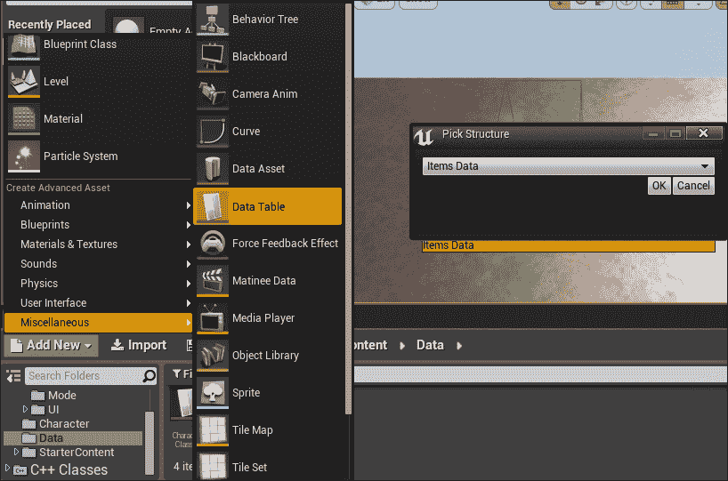

将你的新数据表命名为**Items_Shop**，然后打开数据表。在这里，你可以使用**行编辑器**选项卡添加尽可能多的物品，并使用你想要的任何类型的统计数据。要创建一个物品，首先点击**行编辑器**中的**添加**按钮以添加一个新行。然后，点击**重命名**旁边的文本框并输入**药水**。你会看到你有一个药水物品，其他统计数据都为零：


接下来，给它一些值。我将把它变成一个治疗药水；因此，我将给它一个**HP**值为**50**和一个**Gold**值为**10**。

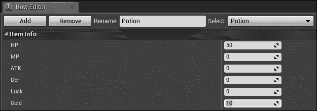

此数据表的目的也是为了存储我们的店主将携带的每一件物品。所以，请随意向此数据表添加更多物品：

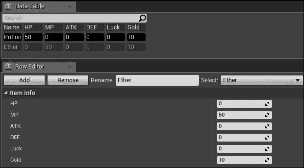

# 商店屏幕框架

现在我们已经完成了物品的创建，我们可以继续创建商店。在上一章中，我们为我们的店主创建了对话框，并在其中一个对话框中创建了一个**商店**按钮，点击该按钮将打开商店菜单。让我们通过首先创建一个新的 Widget Blueprint 来创建这个商店菜单，方法是导航到**内容** | **蓝图** | **UI** | **NPC**。我们将把这个 Widget Blueprint 命名为**商店**并打开它：

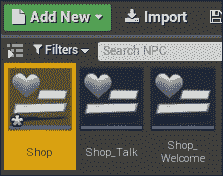

我们将使商店的格式与我们的暂停菜单类似，但我们会保持简单，因为我们现在只需要一个滚动框来存放商店的物品，以及一个存放金币的区域和一个**退出**按钮。

为了加快这个进程，你可以简单地复制并粘贴你希望重新使用的现有菜单系统中的元素到**商店**Widget Blueprint 中。我们可以通过导航到**内容** | **蓝图** | **UI**并打开我们在上一章中创建的**Pause_Main**和**Pause_Inventory**Widget Blueprints 来实现这一点。从**Pause_Main**，我们可以复制**Menu_Gold**、**Editable_Gold**、**Button_Exit**、**Menu_Exit**和**BG_Color**，并将它们粘贴到**商店**Widget Blueprint 中。

我们还可以从**Pause_Inventory**小部件蓝图复制**ScrollBox_Inventory**和**Title_Inventory**并将其粘贴到**商店**小部件蓝图中。完成时，你的**商店**小部件蓝图将如下所示：

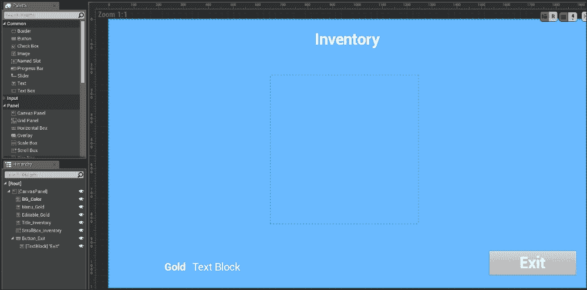

在这里，编辑**商店**小部件蓝图，使其标题显示为**商店**而不是**库存**：

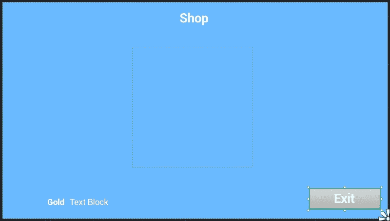

现在，你需要将**商店**小部件蓝图链接到**Shop_Welcome**小部件蓝图中的商店按钮。为此，通过导航到**内容** | **蓝图** | **UI** | **NPC**打开**Shop_Welcome**小部件蓝图，选择**Button_Shop**，然后通过导航到**细节** | **事件**点击**OnClicked**事件右侧的**+**按钮：

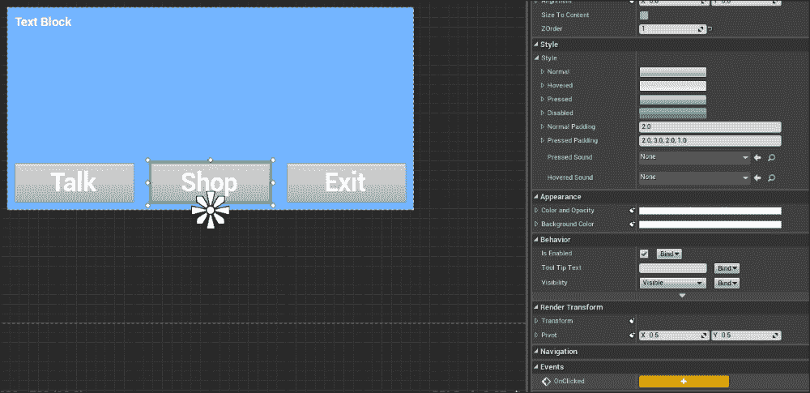

这将自动打开一个带有为**Button_Shop**创建的新**OnClicked**事件的图表：

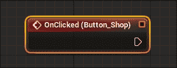

在这里，你可以简单地模仿你在玩家点击**交谈**按钮时使用的相同操作。唯一的区别是，你不需要创建一个新的**Shop_Talk**小部件，而是**商店**小部件会为你创建**创建商店小部件**。**Button_Shop**的图表将如下截图所示：

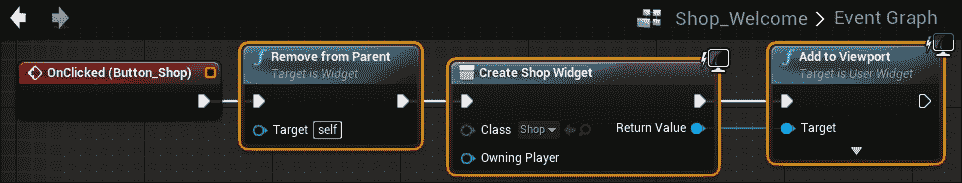

现在，你可以通过与 NPC 交谈并点击**商店**按钮来测试商店，这将打开商店：

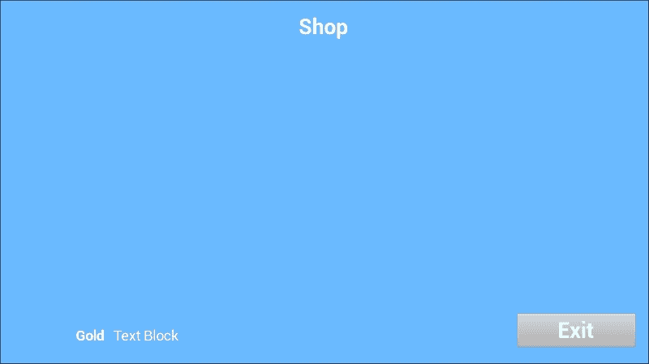

你会注意到商店中还没有任何东西可见，甚至没有金币。要在屏幕上显示金币，你需要重复本章前面在**Pause_Main**小部件蓝图显示金币时执行的步骤。但这次，打开**商店**小部件蓝图中的图表，然后通过导航到**细节** | **上下文**为**Editable_Gold**文本块创建一个绑定：

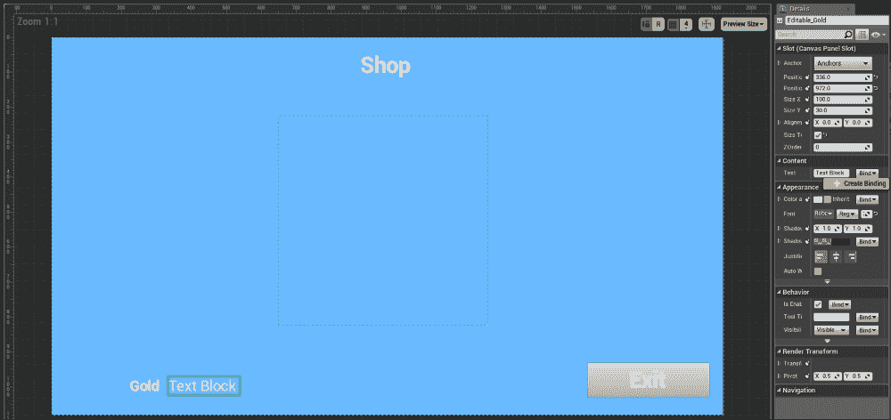

你的图表将自动打开，你会注意到一个带有**ReturnNode**的**获取可编辑金币文本**函数。由于你将从与从**Pause_Main**小部件蓝图获取金币相同的游戏实例中获取金币，你可以简单地从**获取可编辑金币文本**函数中复制并粘贴所有节点到**Pause_Main**，并将它们链接到**商店**小部件蓝图中的**获取可编辑文本**函数。完成时，**商店**小部件蓝图中的**获取可编辑金币文本**函数将如下所示：


接下来，我们将在**商店**小部件蓝图中创建**Button_Exit**功能，通过为**Button_Exit**创建一个**OnClicked**事件（通过导航到**细节** | **事件**）：

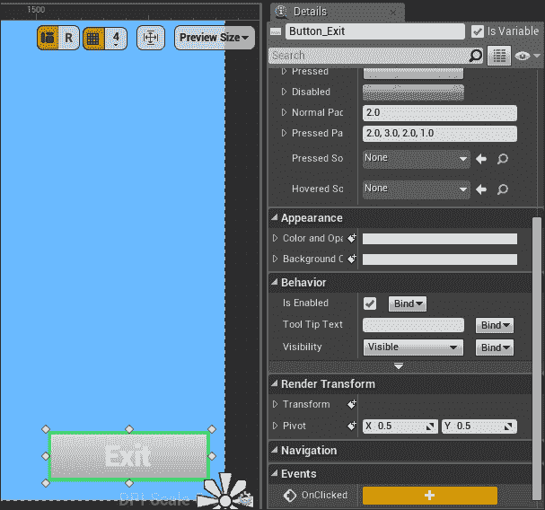

当图打开时，将**OnClicked**事件链接到**从父级移除**函数：

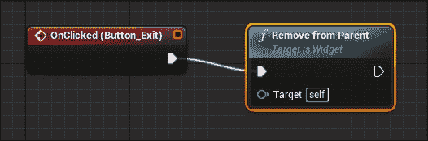

到目前为止，当你测试商店时，你会看到金币并能够退出商店屏幕。

# 项目按钮框架

在我们将项目链接到商店之前，我们首先需要创建一个框架，其中项目被放置在商店中。我们希望为商店老板出售的每个项目创建一个按钮，但为了使界面可扩展，以便 NPC 可以持有不同的可选择物品，创建一个包含单个按钮的滚动框框架，该按钮具有项目文本/描述的默认值，将是明智的。然后我们可以动态地绘制按钮，以及商店老板携带的物品数量，以及每个按钮上的文本。

要做到这一点，我们首先需要通过导航到**内容** | **蓝图** | **UI**来创建一个 Widget 蓝图，并将其命名为**Item**：

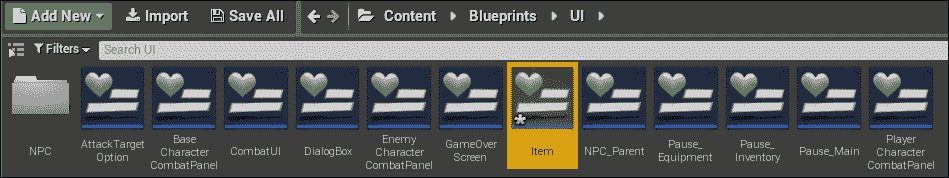

打开**Item**。由于我们将使项目可点击，我们将编写一个按钮。为了创建按钮，我们只需要按钮本身和按钮上的文本；我们不需要 Canvas 面板，因为我们最终会将此按钮添加到商店的滚动框中。因此，从**层次结构**选项卡中删除 Canvas 面板，并从**调色板**中拖动一个按钮。我们将把这个按钮命名为**Button_Item**：

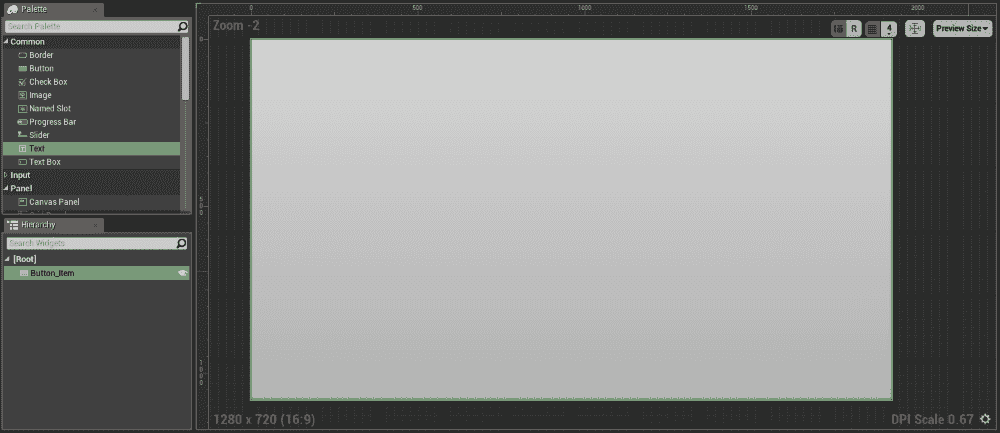

最后，我们在刚刚创建的按钮中放置一个文本块，并将其命名为**TextBlock_Item**：

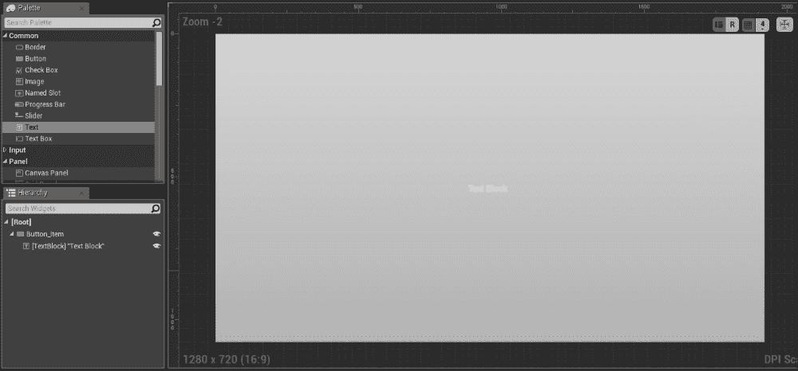

完成后，导航到**详细信息** | **内容**，并为文本块中的文本创建一个绑定。这将自动打开带有**获取文本**函数的图：

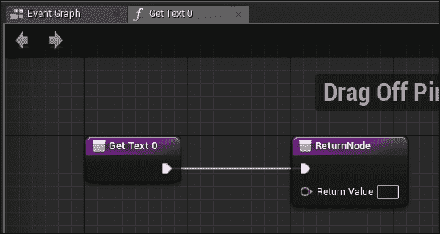

创建一个新的**Item**变量，类型为**文本**：

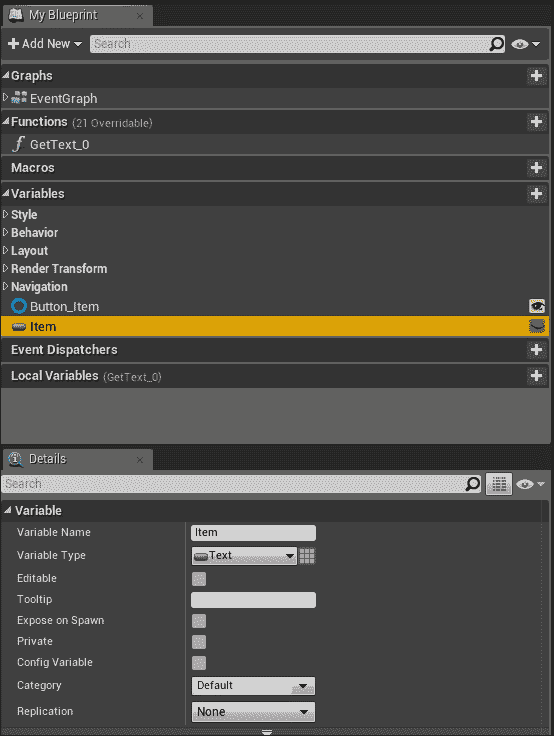

将**Item**变量拖入图中，选择**获取**以在**Item**变量中放置一个获取器，并将其链接到**ReturnNode**的**返回值**引脚：

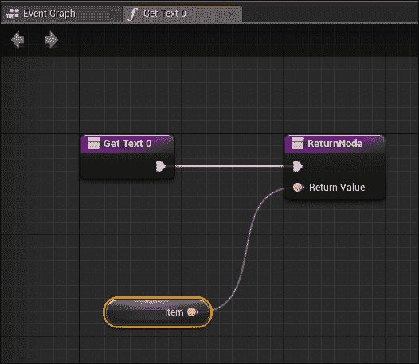

# 链接项目数据

现在是时候将我们在本章开头创建的项目数据通过我们刚刚创建的**Item**按钮框架链接到商店了。为此，我们将添加一个功能，使用我们在上一节中创建的**Item**按钮框架显示我们**Items_Shop**数据表中的每个项目。首先，在**Shop** Widget 蓝图中打开**事件图**。将位于数据表中的**获取数据表行名称**函数链接到**事件构造**：

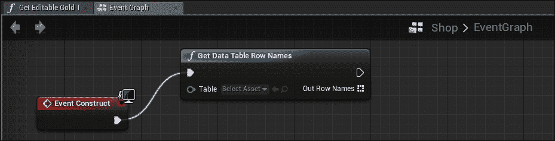

然后，从**选择资产**下拉菜单中选择**Items_Shop**：

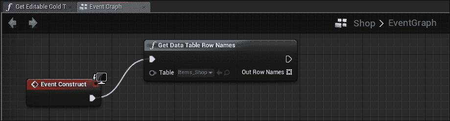

这将获取我们在本章早期创建的**Items_Shop**数据表中每个项目的名称。在这里，我们需要为每个项目行创建一个**Item**小部件蓝图实例。这将为每个项目创建一个带有正确对应项目名称的按钮。为此，创建位于**Utilities**下的**Array**中的**ForEachLoop**，并允许**获取数据表行名称**函数执行它。将**Out Row Names**引脚链接到**ForEachLoop**的**Array**引脚，以便数据表中的每一行都成为**ForEachLoop**中数组的元素：

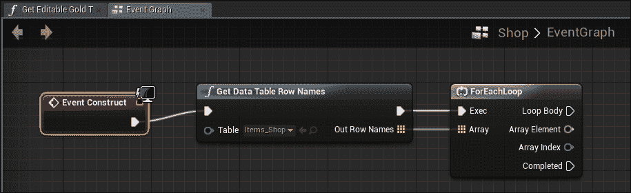

接下来，我们需要遍历行名称数组中的每个元素，并为每个行创建一个新的**Item**小部件蓝图实例。为此，将位于**用户界面**下的**Create Item Widget**操作链接到**ForEachLoop**的**Loop Body**引脚。让类实例为**Item**，可以在**Create Item Widget**操作的**类**下拉菜单中选择：

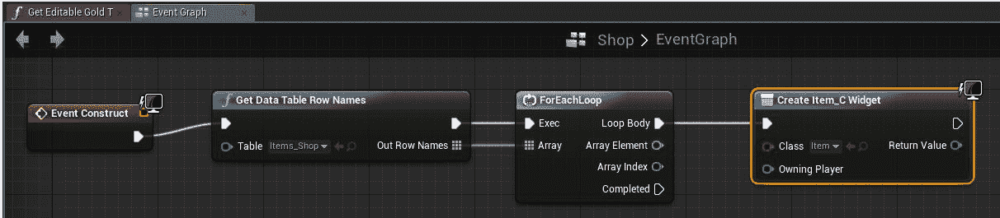

然后，对于创建的每个项目，将每个**Item**小部件实例创建的**Item**变量设置为数组中每个元素的价值。您可以通过在**事件图**的任何位置右键单击，取消选中**上下文相关**，并通过导航到**类**|**Item**来创建**设置项目**操作：

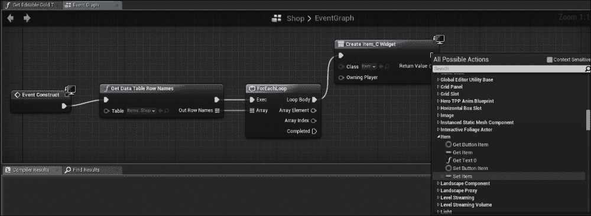

**创建项目小部件**现在可以启动**设置项目**，并将**创建项目小部件**的**返回值**引脚值设置为**项目**的**目标**引脚值：

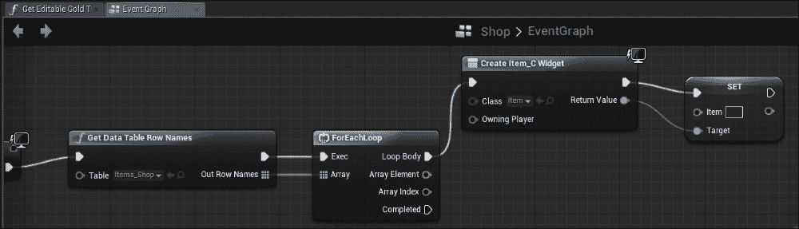

在这一点上，我们还没有将数组中的元素设置为在**Item**小部件中设置的项目；因此，为了做到这一点，我们可以简单地从**ForEachLoop**的**Array Element**引脚链接到**Set Item**操作中的**Item**引脚：

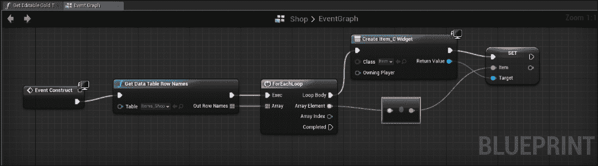

最后，我们将把我们在**商店**小部件蓝图创建的滚动框用于存放所有的项目实例。为此，在将每个项目设置为正确的名称后，我们将把项目实例作为子项添加到我们在本章早期创建的**ScrollBox_Inventory**滚动框中。这可以通过在设置项目后，在**Widget**下的**Panel**中调用**Add Child**函数来完成：

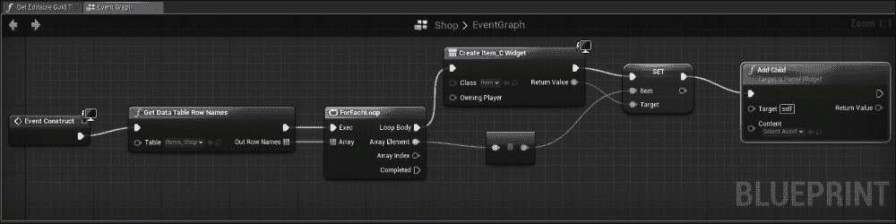

然后，我们将子项的**内容**值设置为项目的**返回值**引脚：

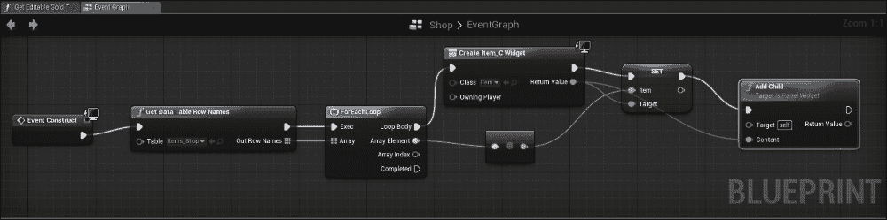

最后，子项的**目标**引脚需要链接到**ScrollBox_Inventory**，这可以从**变量**拖入您的**事件图**。如果您在变量中看不到**ScrollBox_Inventory**变量，请返回到**设计视图**，选择**ScrollBox_Inventory**，并确保**是变量**被选中：

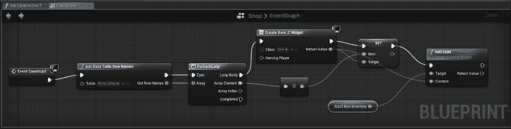

到目前为止，如果你测试你的商店，你将看到商店中填充了你数据表中列出的每一个物品：

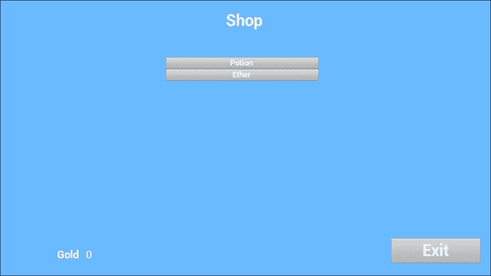

你将能够向你的数据表中添加更多物品，这些物品将自动出现在你的商店中。

# 摘要

在本章中，我们为游戏创建了一个货币系统，并使我们的敌人能够掉落金币。我们还创建了一套新的数据集，包含物品及其属性，并且现在我们已经填充了店主商店，以显示商店中目前出售的物品。

在下一章中，我们将为商店添加购买功能，以及物品的使用和消耗。
