# 第九章：装备

在上一章中，我们介绍了如何创建可用的物品，在由 NPC 控制的商店中填充它们，允许玩家从商店购买物品，并从他们的库存中使用这些物品。在本章中，我们将继续上一章的内容，向玩家提供武器和盔甲来装备自己。

我们在本章中将涵盖以下主题：

+   武器数据表

+   设置武器和装备屏幕变量

+   创建武器按钮

+   再次访问装备屏幕

+   设置装备屏幕文本块

+   配装时修正角色属性

# 武器数据表

现在我们有了相当不错的物品创建框架，创建装备将会非常容易。由于**物品**数据表读取所有党派成员的属性，以便在使用物品时可以修改属性，我们可以预期装备将修改所有相同的属性；因此，我们可以使用与**物品**数据表相同的结构来为**装备**数据表使用相同的结构。

因此，到目前为止，我们将通过点击**内容浏览器**并导航到**+添加新** | **杂项** | **数据表**来创建一个武器数据表：

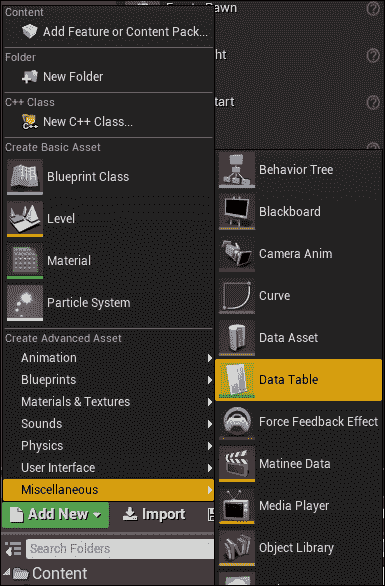

接下来，我们可以选择**物品数据**结构，因为我们将在**装备**数据表中调用与在**物品**数据表中相同的数据：

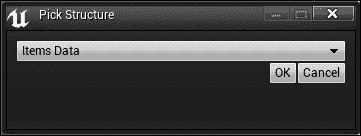

然后，将数据表命名为**武器**：

我们将使用这个**武器**数据表来填充游戏中计划装备在角色上的每一件武器。目前，我们只为一个角色的武器创建一个数据表，但您可以使用以下所有步骤为其他角色创建更多的武器数据表。

您现在可以打开**武器**数据表，就像我们的**物品**数据表一样，我们通过点击**添加**按钮并命名数据来创建数据。在这种情况下，我们将制作我们的第一件武器，一把匕首，然后给匕首一些属性。由于匕首是武器，我们只需要修改**攻击力**属性。由于我们保持示例简单，我们没有利用许多其他 RPG 中具有的*准确度*和*敏捷度*等属性，因为我们没有在我们的 RPG 框架中准确度或敏捷度。然而，如果您决定稍后向您的游戏添加这些额外的机制，您将需要修改与您的装备相关的数据表中的适当属性。您还可能希望给匕首一个金币价值，如果武器在您的游戏中具有可回收价值的话。

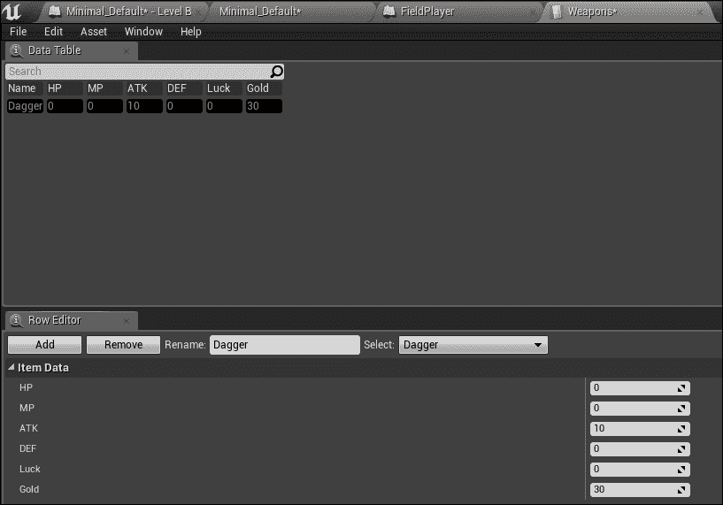

# 设置武器和装备屏幕变量

现在您已经在**武器**数据表中有了武器，我们可以设置一个框架来装备这件武器。

就像你创建的项目一样，你可以选择在商店中填充武器，你可以选择允许武器从场上的其他 NPC 自动拾取，或者你可以让它们成为敌人掉落物，就像你处理金币一样。无论你选择哪种方法，都要确保武器最终以与项目在库存屏幕中填充类似的方式填充到你的装备屏幕中。至少，我们需要角色持有武器数组。导航到**FieldPlayer**蓝图并打开事件图。然后，添加一个新的文本数组变量，类似于上一章中创建的**arrayItem**变量，并将其命名为**arrayWeapons**：

项目和装备之间的主要区别在于，我们将能够装备和卸下装备，而不仅仅是*使用*装备，因此我们需要在我们的装备屏幕上为这一功能创建一个框架。当我们处于**FieldPlayer**蓝图时，我们可以通过创建一个`equipmentScreen`布尔值来开始创建这个框架，我们最终会将这个布尔值设置为让系统知道玩家何时访问装备屏幕。当装备武器和盔甲时，这将是必需的，就像`inventoryScreen`布尔值在访问库存屏幕时允许用户使用物品时是必需的一样：

现在玩家可以持有武器数组和装备屏幕布尔值，我们需要导航到**Pause_Equipment**事件图，并在事件构建时将`equipmentScreen`布尔值设置为 true，当玩家离开屏幕时将其设置为 false。这与我们在**Pause_Inventory**事件图中设置`inventoryScreen`布尔值的方式相同：

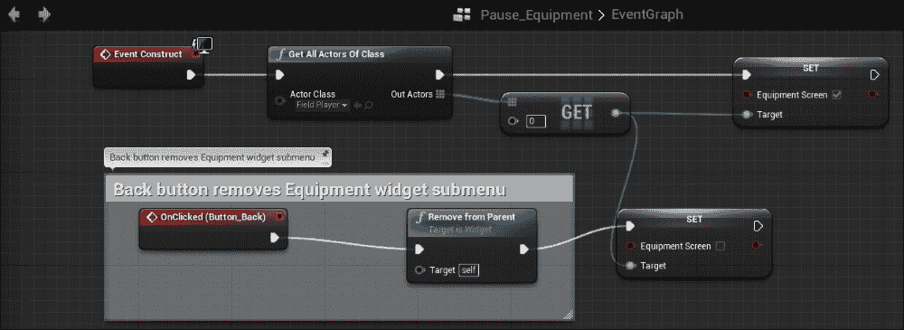

# 创建武器按钮

接下来，我们可以继续填充装备屏幕。为此，我们首先需要创建一个类似于之前创建的项目按钮的武器按钮。这个武器按钮将包含当用户按下武器按钮时将执行的所有逻辑。由于武器按钮在许多方面都类似于项目按钮，我们可以复制项目按钮并修改它以适应武器参数。因此，通过导航到**Content Browser** | **Blueprints** | **UI**，前往**Item** Widget 蓝图并复制**Item** Widget 蓝图：

然后，将其重命名为**Weapon**，如图所示：

我们现在可以打开**武器**小部件蓝图并导航到事件图。在这里，你会看到一个与**Item**小部件蓝图逻辑完全相同的副本，因为装备武器的逻辑将与使用物品相似，我们可以直接修改事件图以适应我们想要在用户按下武器按钮时发生的情况。

首先，我们需要编辑**OnClicked**事件所在的区域。我们希望**OnClicked**事件找到`equipmentScreen`布尔值并检查它是否为 true，因此我们可以移除对`inventoryScreen`布尔值的检查，并用`equipmentScreen`布尔值替换它：

如果`equipmentScreen`布尔值返回 false，则 false 分支将不执行任何操作，因此我们需要删除所有 false 分支逻辑：

如果分支返回 true，那么我们将设置**Get Data Table Row Weapons**函数以获取**武器**数据表：

然后，从**Break ItemsData**，将其设置为打破数据的**ATK**属性，并相应地设置角色的**ATK**属性：

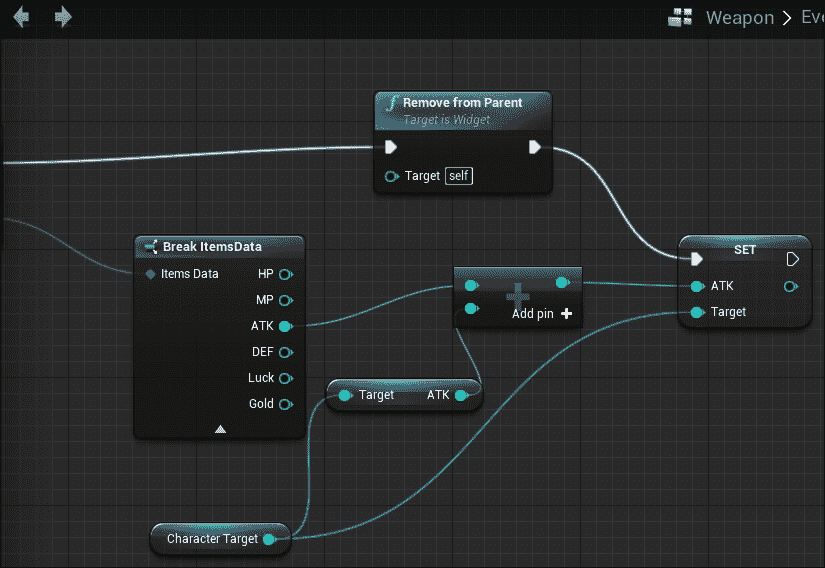

目前，你的**Weapon**事件图中的**OnClicked**事件将看起来像这样：

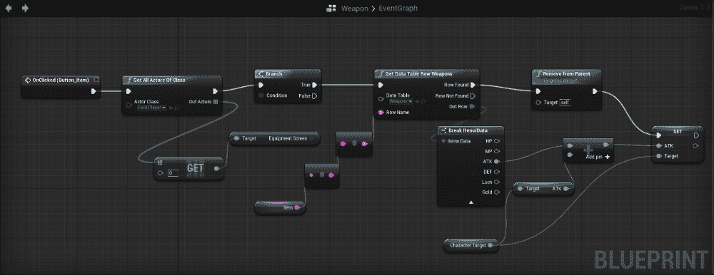

此外，确保你仍然将**Party Members**属性设置到**Character Target**变量中；否则，角色的基础属性将无法正确继承：

# 重新访问设备屏幕

你可能会注意到，如果我们坚持使用这个事件图，我们仅仅会使用每一件武器而不是装备它，因为**Remove from Parent**函数的存在。我们将在本章后面回来编辑这个事件图，以正确设置按钮为装备而不是使用。

现在，我们将填充设备屏幕。如本章前面所述，你可以选择如何填充设备屏幕。为了简化这个示例，我们将像处理商店一样填充设备屏幕。因此，我们将导航回**Pause_Equipment**小部件蓝图的事件图，并使用我们用于填充商店屏幕的相同逻辑；这次将**Get Data Table Row Names**函数设置为获取**武器**数据表。然后，将**Create Widget**函数设置为获取**武器**小部件。请注意，你需要在**设计师**视图中确保**is Variable**的 Scroll Box 被勾选；否则，你的 Scroll Box 将产生错误，因为它找不到。

当你完成时，**Pause_Equipment**的事件图将看起来像这样：

如果你现在测试设备屏幕，你会注意到武器被填充到滚动框中，如果你使用装备，角色的统计数据会上升并匹配武器的增加统计数据。然而，我们还有一些问题。武器正在被使用而不是装备，如果我们继续使用武器，统计数据最终会上升而不是被替换。让我们首先设置装备武器而不是替换它。

# 设置设备屏幕文本块

由于我们知道设备屏幕在**武器**和**护甲**标题的右侧有文本块，这些文本块是在第五章“连接角色统计数据”中创建的，因此我们希望将这些文本块绑定到一个文本变量上，该变量将保存我们装备的武器和护甲的名称。让我们首先导航到我们的**FieldPlayer**蓝图事件图，并创建一个用于保存士兵武器名称的文本变量。我们将把这个文本变量命名为`soldierWeapon`：

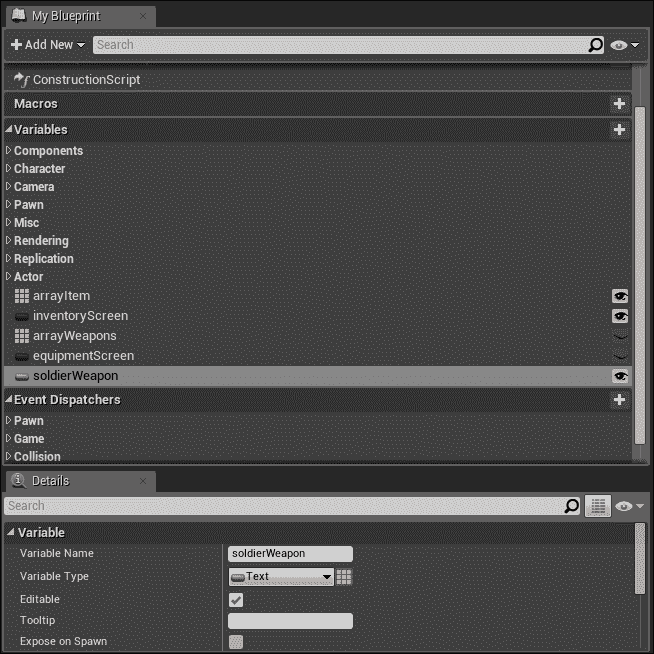

接下来，导航到**Pause_Equipment**小部件蓝图的**设计器**视图。选择**武器**标题右侧的文本块，导航到**详细信息** | **内容** | **文本**，然后点击**绑定**下拉菜单选择**+创建绑定**：

在此绑定的事件图中，使用**获取所有类别的演员**函数来获取所有**FieldPlayer**的演员，获取`soldierWeapon`变量并将其链接到**ReturnNode**的**返回值**引脚，以便文本块能够绘制保存在`soldierWeapon`变量中的文本：

我们现在可以通过回到**武器**小部件蓝图事件图，将**从父级移除**函数替换为**设置 soldierWeapon**来设置文本到`soldierWeapon`变量。`soldierWeapon`的文本值应设置为用户点击的**项目**变量：

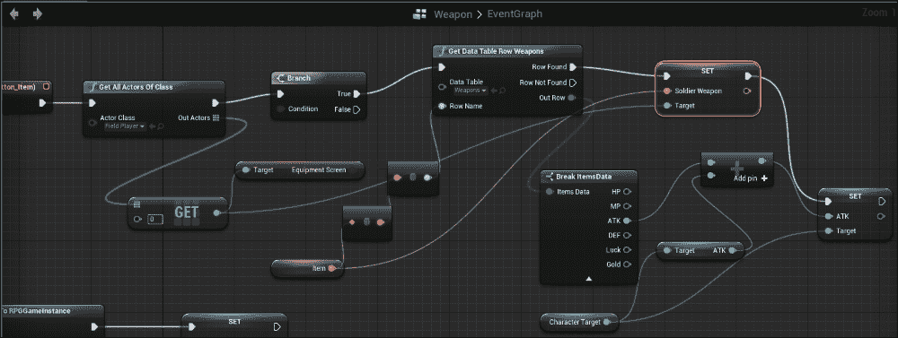

如果你现在测试设备屏幕，你会注意到当按下装备按钮时，武器的名称会更新，武器将不会从装备屏幕中移除。

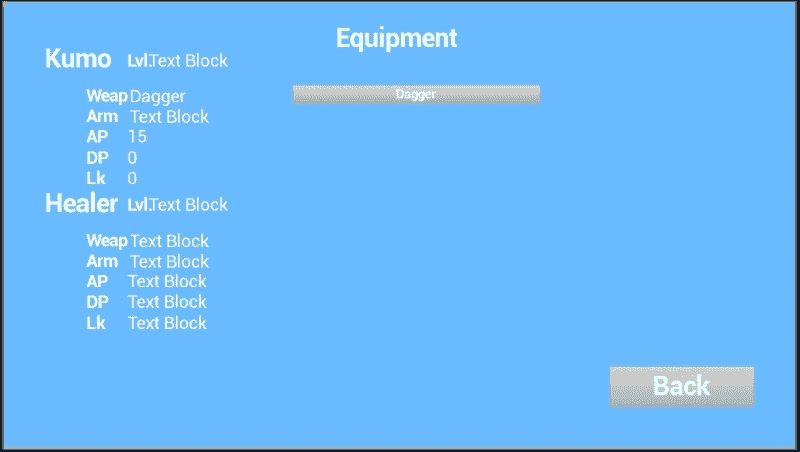

# 装备时修正角色统计数据

我们需要做的最后一件事是添加一些逻辑，以确保在装备屏幕中选择装备超过一次时，基本统计数据不会继续上升。为此，我们需要在**FieldPlayer**蓝图中创建两个变量。一个变量将是一个布尔值，用于跟踪士兵是否装备了武器。另一个将是一个整数，用于跟踪士兵的基本攻击统计数据。这些元素一起将允许我们在武器按钮中创建逻辑，防止每次点击武器时攻击统计数据上升。

因此，首先导航到**FieldPlayer**蓝图，创建一个名为**soldierWeaponEquipped**的布尔值。然后，创建一个名为**soldierbaseAtk**的整数：

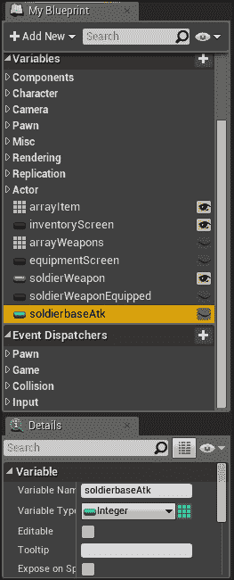

我们指定这些统计数据为特定角色和武器装备，因为如果你的游戏中有更多角色在你的队伍中，每个角色都有武器和盔甲，你需要区分所有角色的状态。此外，你可能还想为每个统计数据创建一个基本状态，因为某些装备可能会改变除了攻击以外的统计数据。

我们现在可以使用我们创建的新变量来创建逻辑。导航到**武器**小部件蓝图事件图。我们需要修改一些逻辑，以便在士兵装备了武器时通知。创建一个**设置士兵武器装备**函数，并在装备了武器（或按下了武器按钮）后将其设置为**true**：

记住，由于这个特定的按钮只有在按下时才会装备士兵的武器，如果你有额外的角色和/或不同类型的装备，你需要创建一个不同的 Widget 蓝图来适应这些角色和装备类型。

接下来，我们需要创建计算基本攻击的逻辑。由于我们已经使用布尔值来区分士兵是否在装备武器，我们可以使用这个逻辑来计算基本攻击统计数据。在我们的游戏中，默认情况下，角色没有装备武器。所以，我们可以定义基本攻击统计数据，当我们构造这个 Widget 蓝图时，但具体来说，当士兵没有装备武器时。

在这一点上，当 Widget 蓝图被构造时，使用**获取所有类别的演员**函数获取 Field Player 类的所有演员。在我们获取了这个类别的所有演员之后，获取`soldierWeaponEquipped`变量。让我们允许**获取所有类别的演员**函数触发一个分支，检查`soldierWeaponEquipped`变量是 true 还是 false：

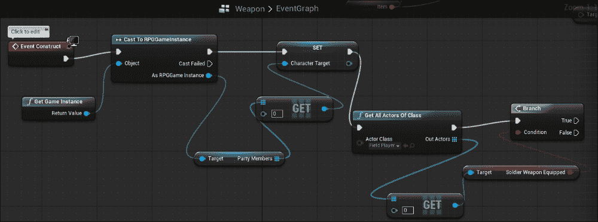

如果条件为假，将**soldierbaseAtk**设置为角色的**ATK**变量。在选择武器时，而不是将**ItemData**的**ATK**和当前角色的**ATK**统计数据相加，而是将**ItemData**的**ATK**和**soldierbaseAtk**相加，这样我们就可以在装备武器时始终使用基础**ATK**变量而不是当前统计数据。这将防止**ATK**变量上升：

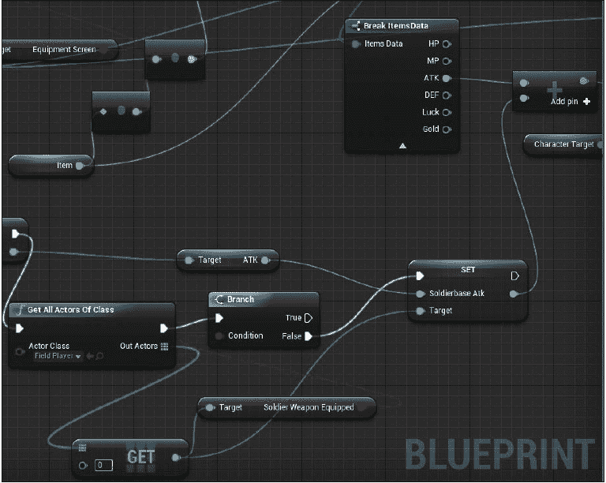

你会发现的一个主要问题是，如果我们退出装备界面然后回来装备物品，攻击统计数据将继续增长。这是因为我们没有为已经装备的武器设置逻辑。因此，当`soldierWeaponEquipped`为真时，我们需要找到当前装备的武器，并从士兵的基础统计数据中减去其统计数据以重置基础统计数据。

要做到这一点，我们将简单地使用**获取数据表行名称**函数来获取**武器**数据表中的物品名称。对于数据表中的每个名称，我们需要将名称与字段玩家类的`soldierWeapon`变量进行比较。如果名称相等，我们使用**获取数据表行**函数从**武器**数据表中获取行名称，从`soldierbaseAtk`统计数据中减去武器的**ATK**统计数据，使用**绝对值（整数）**函数找到该操作的绝对值，最后将这个数字设置为`soldierbaseAtk`统计数据：

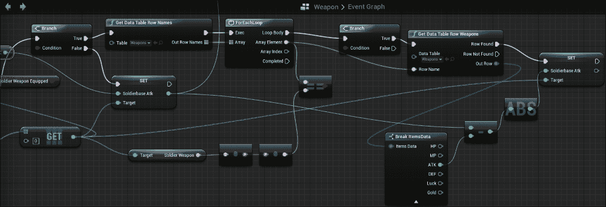

在这一点上，如果你测试武器的装备，攻击统计数据将不再上升。

由于我们还没有设置等级系统，这种方法将有效。然而，当我们设置了等级系统后，我们希望用我们为等级创建的基础**ATK**变量来替换这个**ATK**变量。

# 摘要

现在你已经知道了如何为士兵的武器配置和设置统计数据，你可以使用类似的方法来创建数据表、蓝图以及其他角色及其装备的逻辑。

在下一章中，我们将为我们的游戏创建一个等级系统。我们将学习如何在敌人被击败后允许敌人给玩家经验值，然后这些经验值将被用来提升游戏中的角色等级。
