# 第十章。等级提升、能力和保存进度

在上一章中，我们介绍了如何创建并应用装备到玩家身上，当装备后，会影响玩家的属性。在本章中，我们将允许玩家通过为每个团队成员设置经验系统来提升等级，使团队成员在战斗中获胜时从敌人那里获得经验。当每个团队成员获得足够经验时，他们将会提升等级，并且每提升一个等级，他们的属性都会增加。我们还将修复战斗伤害设置，以便战斗中的攻击将利用角色属性而不是硬编码的值。一旦我们修复了战斗逻辑，我们接下来将创建一个能力，该能力将在角色获得等级时激活。

在本章中，我们将涵盖以下主题：

+   XP 和等级提升源代码

+   数据表起始值

+   在暂停菜单中显示等级和经验

+   在战斗中应用正确的伤害

+   设置能力数组

+   能力逻辑

+   保存

+   加载

# XP 和等级提升源代码

为了使团队成员能够从战斗中获得经验值，我们需要在我们的代码中添加经验值（我们将称之为 XP）变量。此外，XP 变量需要累积到一个给定的 XP 上限（我们将称之为 MXP，即最大 XP），如果达到这个上限，玩家将获得一个等级。最好的方法是将这些变量添加到我们的源代码中，然后将其应用到游戏中我们拥有的每个团队成员和敌人身上。我们首先将做的是将 XP 和等级数据添加到我们的数据类中。导航到 **UnrealRPG** | **Source** | **Data** 并打开 `FCharacterClassInfo.h`。在 `FCharacterClassInfo : public FTableRowBase` 结构体中，为 `XP` 添加 `UPROPERTY` 以存储累积经验，为 `MXP` 添加 `UPROPERTY` 以存储达到下一个等级的经验上限，为 `Lvl` 添加 `UPROPERTY` 以存储团队成员的当前等级：

```cpp
UPROPERTY(BlueprintReadWrite, EditAnywhere, Category = "ClassInfo")
  int32 XP;

UPROPERTY(BlueprintReadWrite, EditAnywhere, Category = "ClassInfo")
  int32 MXP;

UPROPERTY(BlueprintReadWrite, EditAnywhere, Category = "ClassInfo")
  int32 Lvl;
```

接下来，打开 `FEnemyInfo.h`，它位于 `FCharacterClassInfo.h` 相同的文件夹中。我们需要为敌人的信息添加 XP，因为每个敌人都会给团队成员提供一定数量的 XP。在 `FEnemyInfo : public FTableRowBase` 结构体中，为 `XP` 添加 `UPROPERTY`：

```cpp
UPROPERTY(BlueprintReadOnly, EditAnywhere, Category = "EnemyInfo")
  int32 XP;
```

我们现在需要在游戏的 `GameCharacter` 实例中使用这些变量。导航到 **UnrealRPG** | **Source** 并打开 `GameCharacter.h`。在 `class RPG_API UGameCharacter : public UObject` 结构体中，为 `XP`、`MXP` 和 `Lvl` 添加 `UPROPERTY`：

```cpp
UPROPERTY(EditAnywhere, BlueprintReadWrite, Category = CharacterInfo)
  int32 XP;

UPROPERTY(EditAnywhere, BlueprintReadWrite, Category = CharacterInfo)
  int32 MXP;

UPROPERTY(EditAnywhere, BlueprintReadWrite, Category = CharacterInfo)
  int32 Lvl;
```

打开 `GameCharacter.cpp` 以设置游戏角色实例等于团队成员和敌人数据。首先，在 `UGameCharacter* UGameCharacter::CreateGameCharacter( FCharacterInfo* characterInfo, UObject* outer )` 中，将角色的 `XP`、`MXP` 和 `Lvl` 设置为团队成员的数据：

```cpp
UGameCharacter* UGameCharacter::CreateGameCharacter( FCharacterInfo* characterInfo, UObject* outer )
{
  UGameCharacter* character = NewObject<UGameCharacter>( outer );

  // locate character classes asset
  UDataTable* characterClasses = Cast<UDataTable>( StaticLoadObject( UDataTable::StaticClass(), NULL, TEXT( "DataTable'/Game/Data/CharacterClasses.CharacterClasses'" ) ) );

  if( characterClasses == NULL )
  {
    UE_LOG( LogTemp, Error, TEXT( "Character classes datatable not found!" ) );
  }
  else
  {
    character->CharacterName = characterInfo->Character_Name;

    FCharacterClassInfo* row = characterClasses->FindRow<FCharacterClassInfo>( *( characterInfo->Class_ID ), TEXT( "LookupCharacterClass" ) );
    character->ClassInfo = row;

    character->MHP = character->ClassInfo->StartMHP;
    character->MMP = character->ClassInfo->StartMMP;
    character->HP = character->MHP;
    character->MP = character->MMP;

    character->ATK = character->ClassInfo->StartATK;
    character->DEF = character->ClassInfo->StartDEF;
    character->LUCK = character->ClassInfo->StartLuck;

    character->XP = character->ClassInfo->XP;

    character->MXP = character->ClassInfo->MXP;
    character->Lvl = character->ClassInfo->Lvl;
    character->isPlayer = true;
  }

  return character;
}
```

接下来，将每个敌人角色的 XP 设置等于 XP 敌人数据：

```cpp
UGameCharacter* UGameCharacter::CreateGameCharacter( FEnemyInfo* enemyInfo, UObject* outer )
{
  UGameCharacter* character = NewObject<UGameCharacter>( outer );

  character->CharacterName = enemyInfo->EnemyName;

  character->ClassInfo = nullptr;

  character->MHP = enemyInfo->MHP;
  character->MMP = 0;
  character->HP = enemyInfo->MHP;
  character->MP = 0;

  character->ATK = enemyInfo->ATK;
  character->DEF = enemyInfo->DEF;
  character->LUCK = enemyInfo->Luck;
  character->Gold = enemyInfo->Gold;
  character->XP = enemyInfo->XP;

  character->decisionMaker = new TestDecisionMaker();
  character->isPlayer = false;

  return character;
}
```

我们现在可以向我们的战斗引擎添加一个 XP 框架。打开 `CombatEngine.h`。添加 `XPTotal` 作为公共变量：

```cpp
public:
  int32 XPTotal;
```

`XPTotal`将负责存储所有敌人阵亡时从战斗中获得的总经验值。

到目前为止，让我们使用我们创建的经验值变量来计算从战斗中获得的经验值数量。打开`CombatEngine.cpp`。在`bool CombatEngine::Tick(float DeltaSeconds)`中，将经验值添加到我们的胜利检查部分。为此，我们将局部`XP`变量设置为`0`，并且对于战斗中的每个敌人，我们将累积的经验值累加到`XP`变量中：

```cpp
// check for victory
  deadCount = 0;
  int32 Gold = 0;
  int32 XP = 0;
  for( int i = 0; i < this->enemyParty.Num(); i++ )
  {
    if( this->enemyParty[i]->HP <= 0 ) deadCount++;
    Gold += this->enemyParty[i]->Gold;
    XP += this->enemyParty[i]->XP;
  }
```

如果所有玩家成员都已阵亡，我们将把敌人的总经验值存储在我们的公共`XPTotal`变量中，以便在类外使用：

```cpp
// all enemies have died, switch to victory phase
  if( deadCount == this->enemyParty.Num() )
  {
    this->SetPhase( CombatPhase::CPHASE_Victory );
    GoldTotal = Gold;
    XPTotal = XP;
    return false;
  }
```

最后，我们可以在我们的游戏实例中为每个玩家成员添加获得的经验值。为此，打开`RPGGameMode.cpp`。在`void ARPGGameMode::Tick(float DeltaTime)`中，我们添加了对胜利阶段的检查，我们将创建一个`for`循环。这个`for`循环将遍历每个玩家成员，并且对于每个玩家成员，我们将他们的当前经验值设置为从战斗中获得的经验值的累积：

```cpp
for (int i = 0; i < gameInstance->PartyMembers.Num(); i++)
{
  gameInstance->PartyMembers[i]->XP += this->currentCombatInstance->XPTotal;
}
```

在这个`for`循环中，我们还可以检查玩家当前所在等级的当前经验值与当前经验值上限。如果玩家成员的当前经验值超过或等于`MXP`，玩家将升级，获得增加的基础属性，并且获得下一个等级（`MXP`）的经验值上限将增加：

```cpp
if (gameInstance->PartyMembers[i]->XP >= gameInstance->PartyMembers[i]->MXP){
  gameInstance->PartyMembers[i]->Lvl++;
  gameInstance->PartyMembers[i]->MHP++;
  gameInstance->PartyMembers[i]->MMP++;
  gameInstance->PartyMembers[i]->ATK++;
  gameInstance->PartyMembers[i]->DEF++;
  gameInstance->PartyMembers[i]->LUCK++;
  gameInstance->PartyMembers[i]->MXP += gameInstance->PartyMembers[i]->MXP;
}
```

在这个例子中，我们通过只允许玩家成员获得等级时属性增加 1，并将下一个等级的上限设置为上一个等级的两倍来简化了计算。如果你喜欢，你可以在你的游戏中提出更复杂的计算。请注意，用于区分属性数值和每个玩家成员的所有计算都可以在这里完成。

当你完成时，胜利条件将如下所示：

```cpp
else if( this->currentCombatInstance->phase == CombatPhase::CPHASE_Victory )
{
  UE_LOG( LogTemp, Log, TEXT( "Player wins combat" ) );
  URPGGameInstance* gameInstance = Cast<URPGGameInstance>(GetGameInstance());
  gameInstance->GameGold += this->currentCombatInstance->GoldTotal;

  for (int i = 0; i < gameInstance->PartyMembers.Num(); i++)
  {
    gameInstance->PartyMembers[i]->XP += this->currentCombatInstance->XPTotal;

    if (gameInstance->PartyMembers[i]->XP>= gameInstance->PartyMembers[i]->MXP){
      gameInstance->PartyMembers[i]->Lvl++;
      gameInstance->PartyMembers[i]->MHP++;
      gameInstance->PartyMembers[i]->MMP++;
      gameInstance->PartyMembers[i]->ATK++;
      gameInstance->PartyMembers[i]->DEF++;
      gameInstance->PartyMembers[i]->LUCK++;

      gameInstance->PartyMembers[i]->MXP +=gameInstance->PartyMembers[i]->MXP;
    }

  }

UGameplayStatics::GetPlayerController( GetWorld(), 0 )->SetActorTickEnabled( true );
}
```

到目前为止，你可以编译你的源代码，并在 UE4 中重新启动/打开你的项目。

我们现在已经完成了在源代码中创建经验系统框架的工作，现在我们可以继续为游戏中的每个这些值提供特定的起始值。

# 数据表起始值

在**内容浏览器**中，通过导航到**内容** | **数据**来打开**CharacterClasses**数据表。在这里，我们可以更改我们玩家成员的起始值。对于士兵，我们将起始经验值设为 0，因为玩家成员应该从 0 经验值开始。**MXP**值将是**200**，这意味着士兵必须获得 200 经验值才能达到下一个等级。**Lvl**值将是**1**，因为我们希望每个角色从等级 1 开始：

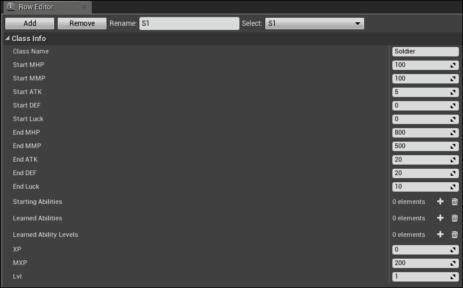

我们现在应该设置敌人给予的多少经验值。在同一个文件夹中，打开**敌人** 数据表，其中至少有一个敌人。对于每个敌人，我们需要设置一个**经验值**，这将决定当敌人被杀死时掉落多少经验。对于这个特定的敌人，我们将**经验值**设置为**50**：

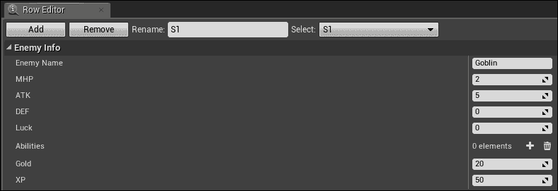

# 暂停菜单中显示等级和经验

在这个阶段，如果你测试构建，团队成员将在战斗中获得经验并相应地升级（如果你看到统计信息增长，就可以知道是否有团队成员获得了足够的经验以升级），但我们还没有显示团队成员的正确等级或经验值。我们可以通过将这些值绑定到我们的暂停菜单中轻松地做到这一点。导航到**内容** | **蓝图** | **UI**。打开**Pause_Main** Widget 蓝图。在**设计师**视图中，选择**Soldier Lvl**右侧我们创建于第四章的**Editable_Soldier_Level** 文本块，*暂停菜单框架*：

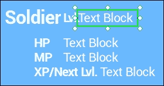

在**内容**下的**详细信息**选项卡中，通过点击**绑定**下拉菜单并选择**+创建绑定**来为此文本创建一个绑定：

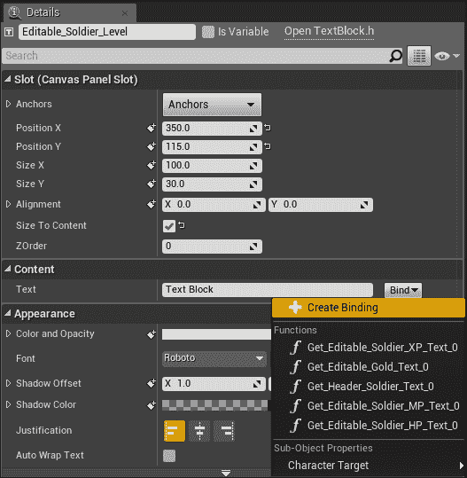

这将自动打开**Get Editable_Soldier_Level_Text**函数的图表。在图表中，我们需要简单地从**RPGGameInstance**获取变量，就像我们之前做的那样，但这次我们特别获取当前的**Lvl**变量并将其作为文本返回：

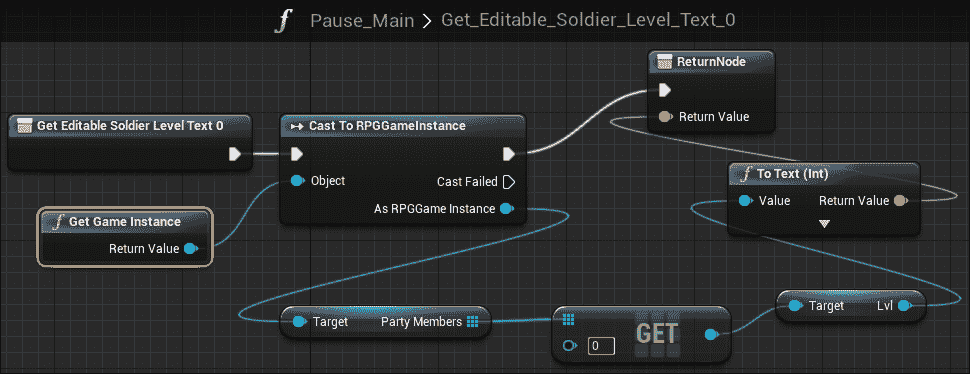

在这个例子中，我们只获取一个团队成员（我们的士兵）的等级，这在数组中的索引是 0。如果你有多个团队成员，你只需在**GET**函数中更改索引到正确的索引；例如，索引 1 将找到你的团队成员数组中的第二个成员及其统计数据，因此将返回不同的统计数据集。

我们暂停菜单中唯一未定义的文本块是位于**XP/Next Lvl**文本右侧的**Editable_Soldier_XP** 文本块。选择此文本块，导航到**详细信息**选项卡，并在**内容**下添加一个绑定，就像我们为最后一个文本块所做的那样，并且将弹出标记为**Get Editable_Soldier_XP_Text**的函数图。就像上一个文本块一样，我们将获取正确的团队成员当前数据；特别是，我们将获取经验值和 MXP，因为我们希望这个文本块显示累积的经验值和达到下一级所需的经验值：

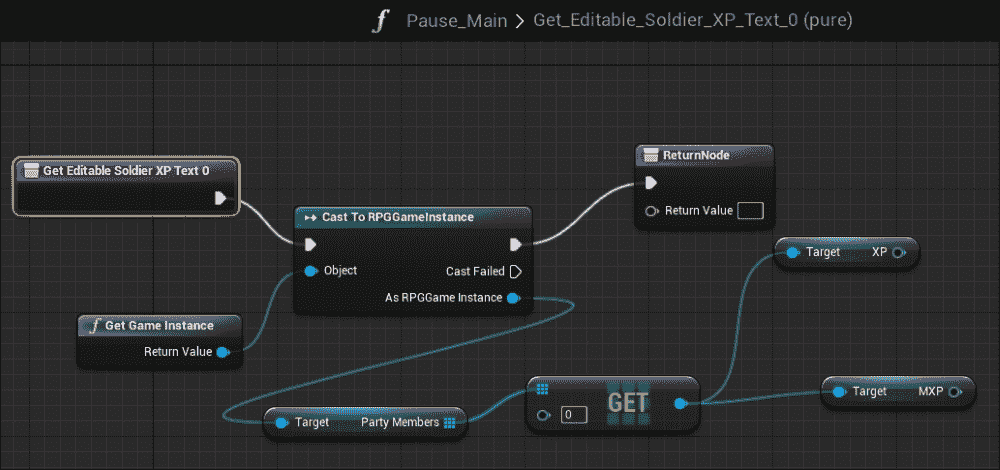

你会注意到**ReturnNode**只能接受一个**返回值**引脚，而我们有两个不同的值。我们可以通过使用**Append**函数和追加文本来轻松解决这个问题。我们将通过在蓝图上右键单击，导航到**实用工具** | **字符串**，并选择**Append**来找到**Append**函数：

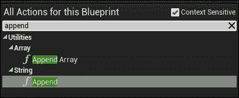

**Append**一次处理两个字符串。由于文本块应该有一个**/**来分隔当前经验值和达到下一级所需的经验值，我们需要两个**Append**函数。对于第一个**Append**，将**XP**连接到**A**引脚，并在**B**引脚中简单地追加一个**/**：

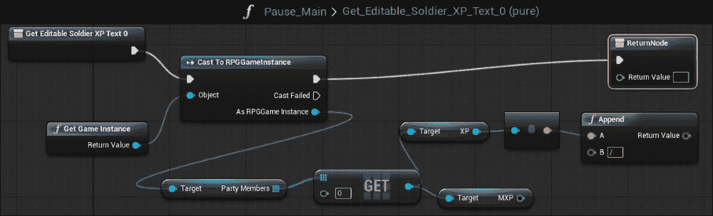

接下来，创建另一个**Append**函数，并将第一个**Append**函数的**返回值**连接到第二个**Append**函数的**A**引脚。然后，将**MXP**连接到第二个**Append**函数的**B**引脚，以便**MXP**追加最后一组字符串：

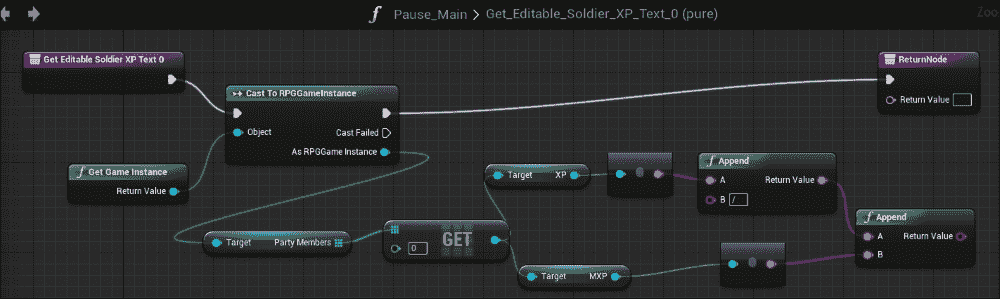

完成后，只需将第二个**Append**函数的**返回值**连接到**ReturnNode**的**返回值**：

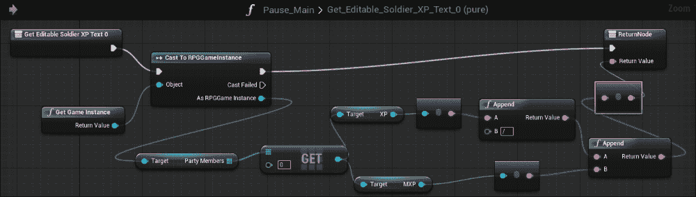

到目前为止，如果你通过进入战斗和升级来测试你的游戏，你将看到所有你的统计数据都会在暂停菜单中正确更新（以下截图是在我们测试了战斗和与敌人获得经验之后）：


# 在战斗中应用正确的伤害

在战斗中，你会注意到无论发生什么情况，敌人和玩家都会造成 10 点伤害。当前的攻击力和防御力似乎没有被计算。这是因为，在第三章中，当我们创建战斗动作时，我们硬编码了伤害为`target->HP -= 10`，这意味着无论谁攻击，他们都会对玩家造成 10 点伤害。我们可以很容易地通过导航到**源** | **RPG** | **战斗** | **动作**并打开`TestCombatAction.cpp`来修复这个问题。找到`target->HP -= 10;`并将其替换为`target->HP -= (character->ATK - target->DEF) >= 0 ? (character->ATK - target->DEF):0;`。

这是一个三元运算符。当一个目标被攻击时，无论是团队成员还是敌人，只有当攻击者的攻击力减去目标防御力的结果等于或大于 0 时，目标的 HP 才会下降。如果结果是小于 0，则 HP 默认为 0。完成操作后，`void TestCombatAction::BeginExecuteAction( UGameCharacter* character )`将看起来像这样：

```cpp
void TestCombatAction::BeginExecuteAction( UGameCharacter* character )
{
  this->character = character;

  // target is dead, select another target
  if( this->target->HP <= 0 )
  {
    this->target = this->character->SelectTarget();
  }

  // no target, just return
  if( this->target == nullptr )
  {
    return;
  }

  UE_LOG( LogTemp, Log, TEXT( "%s attacks %s" ), *character->CharacterName, *target->CharacterName );

  target->HP -= (character->ATK - target->DEF) >= 0 ? (character->ATK - target->DEF):0;

  this->delayTimer = 1.0f;
}
```

# 设置能力数组

在第三章中，我们在`FCharacterClassInfo.h`中创建了一个用于学习能力的角色类信息，这是一个用于为继承类的每个角色存放能力数组的数组。我们需要扩展这个数组，使其被任何游戏角色采用，以存放他们在游戏中学习的能力。为此，通过导航到**源** | **RPG**打开`GameCharacter.h`。在`class RPG_API UGameCharacter : public UObject`中，向学习能力添加一个公共`UPROPERTY`，并允许它在任何地方进行编辑：

```cpp
UPROPERTY(EditAnywhere, BlueprintReadWrite, Category = CharacterInfo)
  TArray<FString> LearnedAbilities;
```

接下来，打开位于同一文件夹中的`GameCharacter.cpp`，并将`LearnedAbilities`设置为等于我们在类信息中创建的变量的`LearnedAbilities`：

```cpp
character->LearnedAbilities = character->ClassInfo->LearnedAbilities;
```

这将允许每个团队成员实例都拥有自己的`LearnedAbilities`数组，我们可以现在在代码或蓝图中进行编辑。你的游戏角色现在看起来像这样：

```cpp
UGameCharacter* UGameCharacter::CreateGameCharacter( FCharacterInfo* characterInfo, UObject* outer )
{
  UGameCharacter* character = NewObject<UGameCharacter>( outer );

  // locate character classes asset
  UDataTable* characterClasses = Cast<UDataTable>( StaticLoadObject( UDataTable::StaticClass(), NULL, TEXT( "DataTable'/Game/Data/CharacterClasses.CharacterClasses'" ) ) );

  if( characterClasses == NULL )
  {
    UE_LOG( LogTemp, Error, TEXT( "Character classes datatable not found!" ) );
  }
  else
  {
    character->CharacterName = characterInfo->Character_Name;

    FCharacterClassInfo* row = characterClasses->FindRow<FCharacterClassInfo>( *( characterInfo->Class_ID ), TEXT( "LookupCharacterClass" ) );

    character->ClassInfo = row;

    character->MHP = character->ClassInfo->StartMHP;
    character->MMP = character->ClassInfo->StartMMP;
    character->HP = character->MHP;
    character->MP = character->MMP;

    character->ATK = character->ClassInfo->StartATK;
    character->DEF = character->ClassInfo->StartDEF;
    character->LUCK = character->ClassInfo->StartLuck;

    character->XP = character->ClassInfo->XP;

    character->MXP = character->ClassInfo->MXP;
    character->Lvl = character->ClassInfo->Lvl;
    character->LearnedAbilities = character->ClassInfo->LearnedAbilities;
    character->isPlayer = true;
  }

  return character;
}
```

完成后，编译并重新启动编辑器。现在我们可以在游戏中创建一个位置来存放和使用能力。在这个游戏中，我们将选择只在战斗中使用能力，但如果你想在其他地方使用能力，例如，在战斗之外，你可以通过遵循类似的步骤轻松实现这一点。由于我们将在战斗中应用能力，让我们在战斗界面中添加一个新的能力按钮。在编辑器中，导航到**内容** | **蓝图** | **UI**，并打开**CombatUI** Widget 蓝图。

在**设计器**视图中，创建一个组合框，允许我们有一个具有多个条目的下拉菜单，我们将使用它来存放和选择我们的能力，并将它们放置在**characterActions**画布面板中：

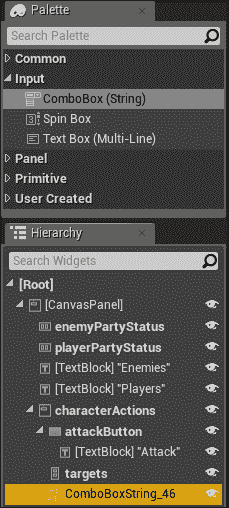

将组合框调整到与**攻击**按钮相同的大小，并将其放置在与**攻击**按钮对齐的位置：


最后，将组合框重命名为适合其中包含的元素。我们可以将其命名为**ComboBoxString_Abilities**，并检查**是否为变量**：

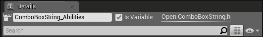

现在我们有一个可以存放能力的组合框，现在是时候用适当的能力填充组合框了。打开**CombatUI**事件图。由于我们关心在战斗期间可访问的正确能力，最好在**CombatUI**创建时立即填充组合框。为此，通过导航到**添加事件** | **用户界面**创建一个**事件构造**：

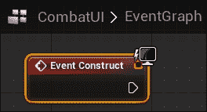

将**事件构造**连接到**Cast To RPGGameInstance**，这将获取所有团队成员，以便我们可以获取和设置适当的能力：

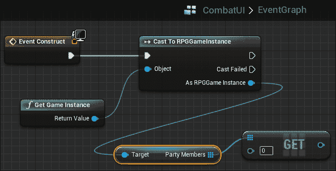

我们可以在这里为党派成员之一（在这种情况下，是士兵）设置一个能力，通过获取**Party Members**数组的索引 0。如果士兵达到等级 2，我们将给士兵一个名为**Attack x2**的能力。为此，我们将使用**Lvl**变量获取目标当前等级，并使用**CompareInt**宏将其与整数 2 进行比较：

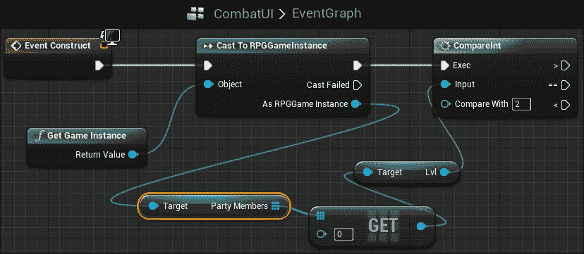

如果**Lvl**变量大于或等于 2，我们可以将**LearnedAbilities**数组的第一个元素设置为**Attack x2**：

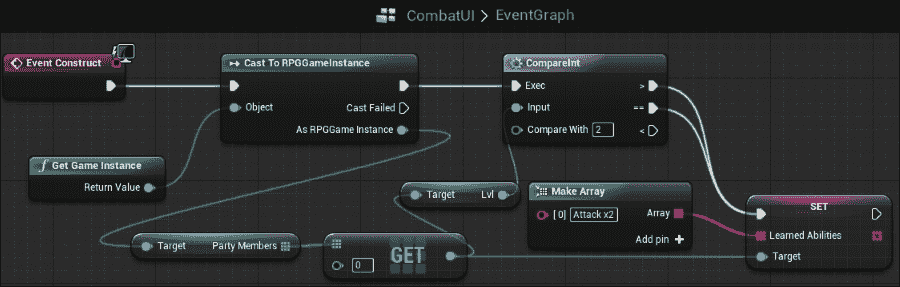

在我们将新的**Attack x2**能力填充到数组中之后，现在我们可以通过简单地执行**ForEachLoop**遍历数组的每个元素，并使用**Add Option**函数将其添加到组合框中，通过导航到**组合框** | **添加选项**来填充组合框中的每个能力：

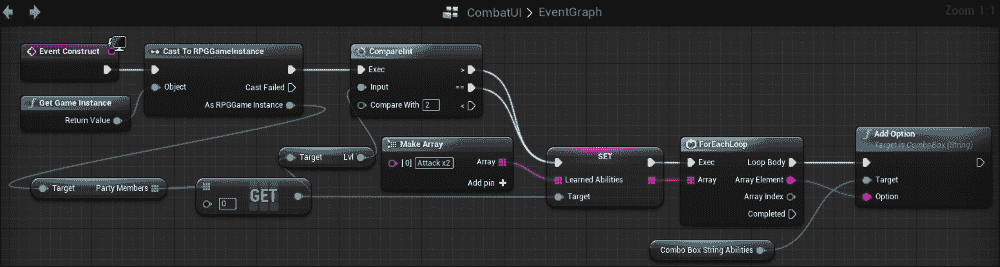

这是一种非常简单的方法，可以根据党派成员等级将战斗能力添加到能力下拉菜单中。如果你想创建更多能力，你只需要简单地使用**CompareInt**比较你的等级和另一个等级，然后你可以将更多能力添加到**LearnedAbilities**数组中。如果你最终在游戏中拥有额外的角色，最好为每个党派成员创建一个新的组合框，从他们在**Party Members**数组中的索引获取该党派成员，然后像我们对士兵所做的那样，将能力添加到他们自己的**LearnedAbilities**数组中。

你现在应该能够测试这个功能，并看到当玩家按下组合框时，如果士兵党派成员达到等级 2，**Attack x2**将会出现：

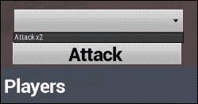

# 能力逻辑

我们现在可以为我们 的**Attack x2**能力创建一个逻辑。正如其名所示，**Attack x2**应该执行造成双倍伤害的攻击。在我们应用这种逻辑之前，我们必须首先创建一个事件，该事件在从组合框中选择能力并按下它之后发生。返回到**Designer**视图。在**Details**选项卡中，导航到**Events**，然后按**OnOpening**事件旁边的**+**：

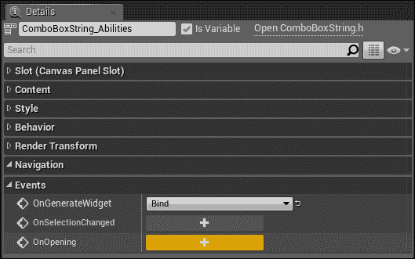

这将在你的事件图中创建一个**OnOpening**事件。通过从组合框中选择并点击能力，我们需要首先使用**Clear Children**函数清除**Panel**小部件的所有子项，类似于我们通过点击**Attack**按钮所做的那样。这将防止同一目标的多个按钮弹出：

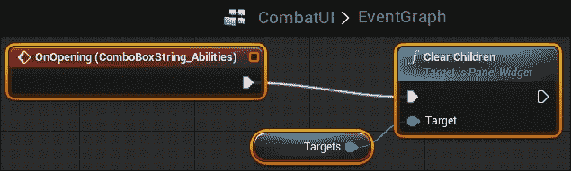

接下来，我们将检查**Attack x2**能力是否已被打开，首先调用位于组合框下的**Get Selected Option**函数（你需要关闭**Context Sensitive**才能这样做）：

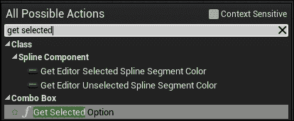

我们将**Get Selected Option**的**目标**设置为**Get Combo Box String Abilities**：

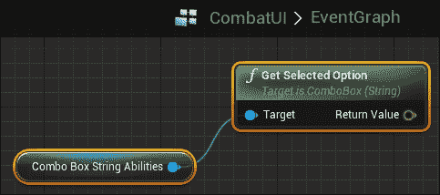

然后，检查所选选项是否等于**攻击 x2**：

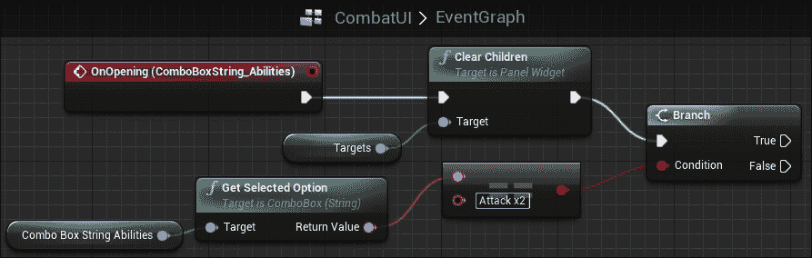

如果相等，这意味着我们选择了**攻击 x2**，然后我们将获取**RPGGameInstance**。然而，我们需要首先检查党派成员是否有足够的 MP 来使用该能力。在这种情况下，我们将设置该能力使用 10 MP，所以让我们在使用能力之前确保党派成员至少有 10 MP：

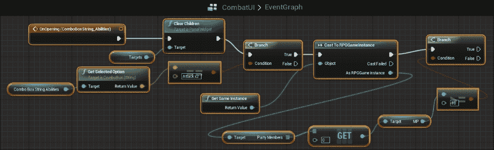

如果玩家有足够的 MP 来使用这个能力，我们将使用一种逻辑，允许玩家执行造成双倍伤害的攻击。由于玩家将造成双倍伤害，这意味着我们可以很容易地将玩家的**ATK**变量乘以二；然而，我们不想让**ATK**变量永远加倍，只在本回合加倍。为此，最好创建一个局部变量，暂时保存基础**ATK**值，这样在下个回合，我们可以将**ATK**值重置回正常值。我们可以通过创建一个名为**Temp Atk**的局部整数来轻松做到这一点，并将**Temp Atk**设置为党派成员的**ATK**值：

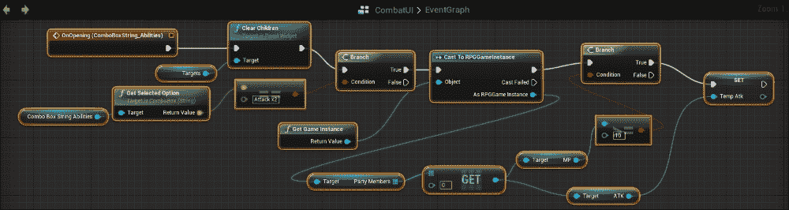

接下来，我们将将党派成员的**ATK**值设置为原来的两倍，通过将其乘以二，并将**ATK**变量设置为该操作的结果：

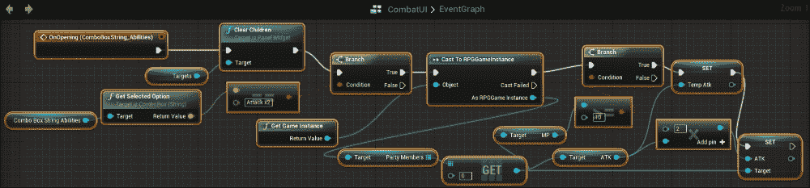

我们还需要设置一个布尔值来告诉我们何时使用了**攻击 x2**。因为如果我们使用了它，我们需要从党派成员那里减去 MP，并将我们的**ATK**变量恢复到正常状态。为此，我们需要创建一个局部布尔值，我们将称之为`attackx2`。在我们将攻击设置为双倍后，将`attackx2`设置为 true，并通过将**SET attackx2**连接到**Get Character Targets**函数来允许**CombatUI**显示所有可用的敌方目标：

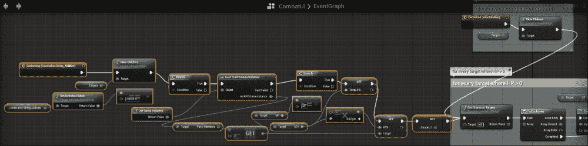

一旦完成，我们可以将`attackx2`布尔值重置为 false，将**ATK**变量恢复到正常值，并从党派成员那里减去 10 MP 以使用该能力。最好的地方是在**Event Show Actions Panel**再次发生时进行，当角色动作变得可见且目标变得不可见时。在目标变得不可见后，我们将检查`attackx2`布尔值是否为 true。如果是 true，我们将将其设置为 false，然后将**ATK**值设置为**Temp Atk**值。然后，我们从党派成员的 MP 变量中减去 10：

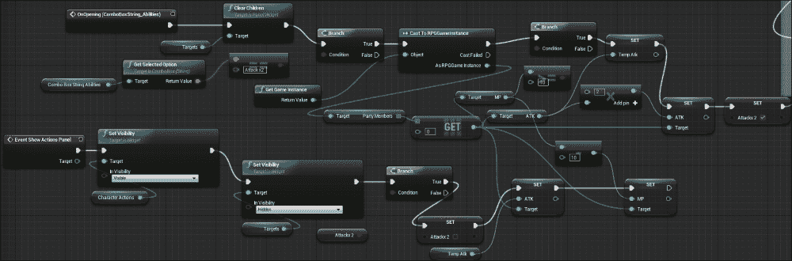

# 保存和加载游戏进度

我们最后要关注的是保存和加载游戏进度。保存和加载可以通过许多方式完成，但本质上，保存进度围绕着你想要保存的特定变量。

## 保存

大多数游戏会保存很多不同的变量，例如玩家所在的关卡或区域、玩家的统计数据、玩家的库存和金币。在我们的例子中，我们将选择保存玩家的金币，但使用我们即将执行的方法，你可以轻松地找出如何保存游戏中的所有其他进度。

首先，通过导航到**Content** | **Blueprints**在**内容浏览器**中创建一个新的 Blueprint 类。**Pick Parent Class**窗口将弹出，从**All Classes**中选择**SaveGame**：

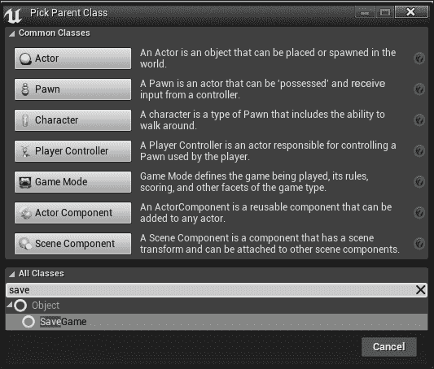

将这个类命名为**NewSaveGame**，并打开这个类。这个类的目的是保存你想要保存的每个变量的值。如前所述，对于这个例子，我们将保存金币变量，但如果你想要保存更多的变量，你刚刚创建的**NewSaveGame**类也会存储这些变量。在这个时候，从**My Blueprint**选项卡中的**Add New**变量添加一个新的变量到这个类中。将其命名为**Gold**，并使其变量类型为**Integer**：

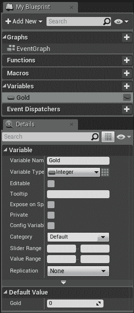

现在你已经完成了，是时候找到一个合适的地点来保存游戏以及保存金变量了。由于我们已经在之前的章节中有了暂停菜单，并且学习了如何向暂停菜单中添加按钮，因此创建一个名为**保存**的新按钮在**Pause_Main** Widget Blueprint 中并将一个**OnClicked**事件添加到它上面将会很容易：

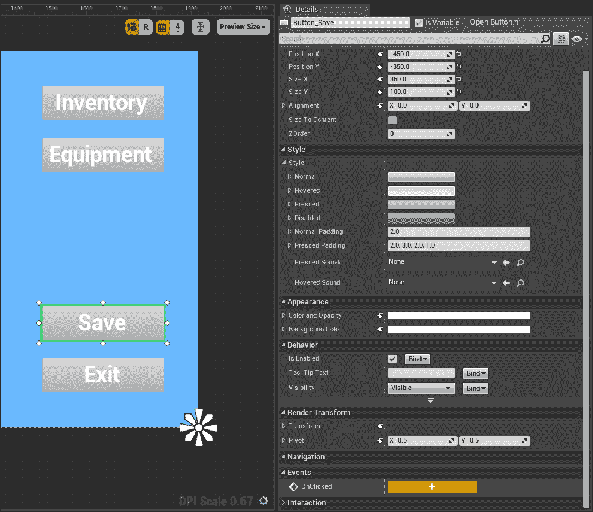

一旦你点击**OnClicked**事件旁边的**+**，事件图将打开，你将看到你的**Save**按钮的**OnClicked**事件。在这里，允许按钮在被按下时创建一个保存游戏对象。为此，创建一个**Create Save Game Object**，其**Save Game Class**设置为**New Save Game**，并允许它在点击按钮时启动：

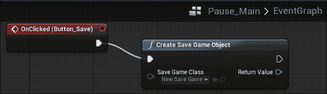

在这里，我们需要创建一个新的**Save Game**类型的变量，我们将称这个变量为**save**：

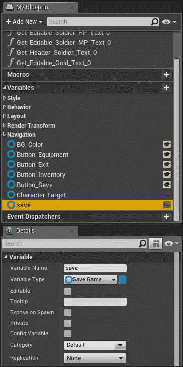

在这里，我们将在我们的 Blueprint 中创建一个**SET Save**变量，并将**Create Save Game Object**函数的**Return Value**传递给**SET Save**：

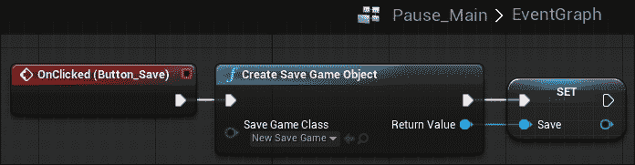

我们现在需要将**NewSaveGame**类进行转换，以便我们可以将我们创建的**Gold**变量设置到游戏的金上。为此，通过将**Save**值连接到**Cast To NewSaveGame**的**Object**来将**SET Save**转换为**NewSaveGame**：

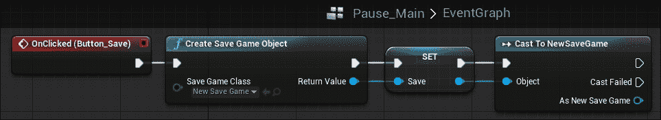

接下来，允许**Cast To NewSaveGame**触发一个**Cast To RPGInstance**，其**Object**是对**Get Game Instance**的引用。我们这样做是为了获取**GameGold**的实例，因此将**Cast To RPGGameInstance**的**As RPGGame Instance**引脚链接到 RPG 实例中的**Get GameGold**变量：

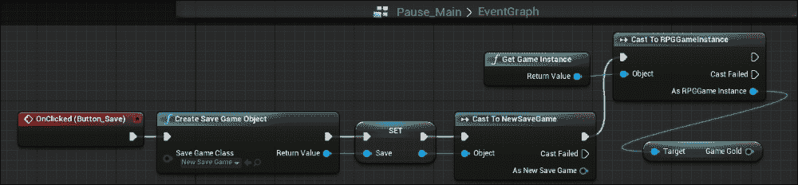

现在我们已经获取了游戏金币，我们可以通过将**SET Gold**连接到当**RPGGameInstance**被转换时触发，并将**GameGold**值引脚连接到**Gold**值引脚，以及将**SET Gold**的**目标**引脚连接到**Cast To NewSaveGame**的**As New Save Game**引脚，将游戏金币的值设置为**NewSaveGame**类中的**Gold**变量：

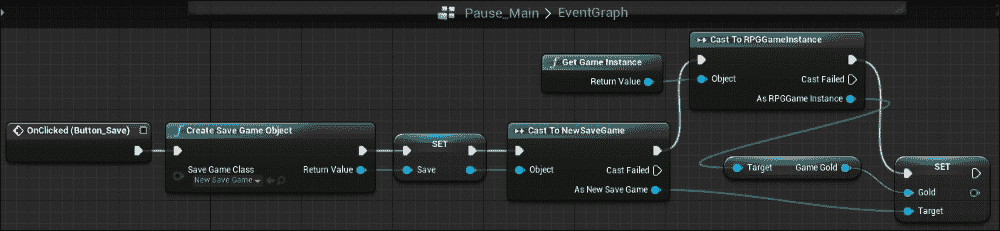

这种特定方法将允许我们将当前游戏金币的任何值保存到**NewSaveGame**类中的**Gold**变量。请注意，如果您想保存更多变量，就像设置**Gold**变量的值一样设置这些变量的值，为每个单独的变量添加一个**SET**节点。

我们最后需要做的是创建一个存档游戏槽位，它将保存我们的存档游戏对象。为此，创建一个**存档游戏到槽位**动作，你可以在你的**动作**窗口中的**游戏**下找到它：

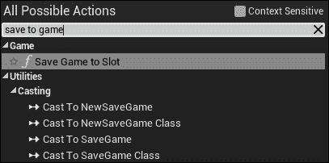

为此创建一个槽位名称；在这个例子中，我们将使用**A**作为**槽位名称**。将**Save Game to Slot**的**Save Game Object**引脚连接到**Save**值引脚，并允许当**Gold**变量被设置时**Save Game to Slot**触发：

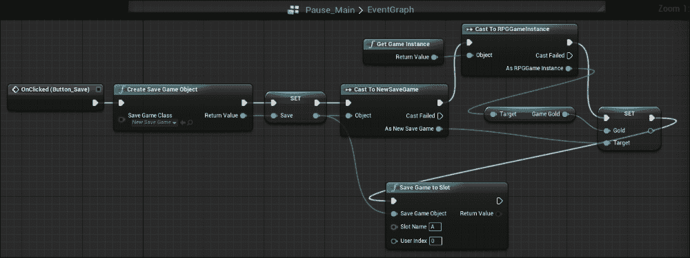

我们现在已经完成了游戏的存档部分。我们现在将转到加载游戏槽位。

## 加载

就像保存一样，加载也可以以多种方式完成。在我们的游戏中，我们将在游戏启动时简单地加载玩家的存档数据。为此，打开**FieldPlayer**蓝图，因为我们知道 FieldPlayer 将始终存在于我们的游戏中。

接下来，我们将创建一个与保存游戏时类似的**Load**变量，这样我们就可以正确地转换变量及其值从**NewSaveGame**：

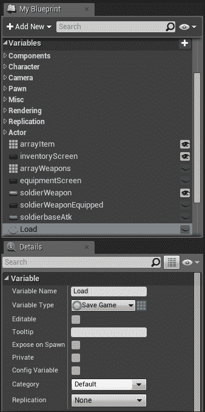

在这里，我们将创建一个**事件开始播放**，并且从**事件开始播放**，我们将调用**动作**窗口中**游戏**类别下的**Does Save Game Exist**函数，并且在**槽位名称**下，我们将寻找**A**，因为我们之前将我们的存档槽位命名为**A**：

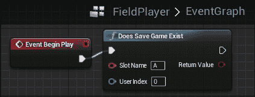

从**存档游戏是否存在**，我们将调用一个分支；如果**存档游戏是否存在**为真，我们将调用**从槽位加载游戏**，并且它的**槽位名称**也将是**A**：

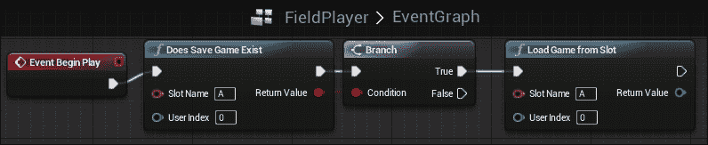

在这一点上，我们已经创建了一个逻辑，当游戏开始时，我们检查槽位 A 中的存档游戏是否存在。如果它存在，我们就从槽位 A 加载游戏；如果它不存在，我们就不做任何事情。

现在，我们可以将我们在本节开头创建的**Load**变量设置为**Save Game**类型的数据，类似于我们保存游戏时所做的，这样我们就可以正确地将变量及其值从**NewSaveGame**转换过来：

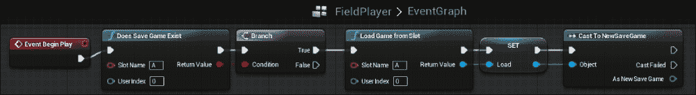

注意，由于我们现在可以访问**NewSaveGame**中的所有变量，这意味着我们可以访问我们保存的金币值。所以从这里，我们从**Cast To NewSaveGame**获取金币值，这样你就有玩家上次保存时存储的任何值，并且你需要将**RPGGameInstance**中的**GameGold**值设置为**NewSaveGame**中的**Gold**：

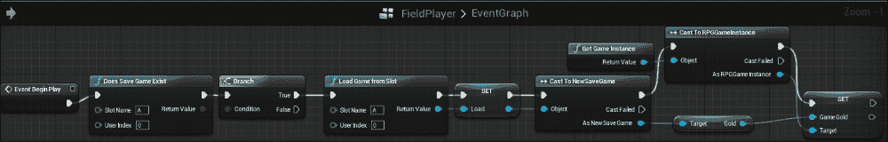

就像我们在创建保存逻辑时一样，在这个加载逻辑中，如果你需要加载其他任何变量，你可以很容易地通过从**NewSaveGame**类获取更多变量并将其设置到**RPG Game Instance**中的其他变量来实现。

你现在可以通过简单地玩游戏来测试这个功能，进行战斗以获得游戏金币，使用我们在暂停菜单中创建的**保存**按钮保存游戏，然后关闭游戏。当你重新打开游戏时，你会注意到你在保存游戏时拥有的金币会自动加载。使用这个框架，你可以自由地保存其他游戏变量，比如你的状态和库存。

# 摘要

我们现在有一个解决方案，可以让队伍成员通过获得足够的经验来获得等级，并通过达到特定等级来获得能力。我们还修复了战斗系统，以便让队伍成员和敌人根据他们的统计数据造成伤害，并允许队伍成员在战斗中使用能力。此外，你现在可以在整个游戏过程中保存和加载玩家进度。使用本章中介绍的框架，每个队伍成员都可以升级，你可以轻松地为不同的队伍成员添加更多能力，在战斗中使用它们，并且玩家可以在任何时候保存游戏，然后回来继续他们离开的地方。

到目前为止，你已经成功完成了一个回合制 RPG 的工作框架。你有一个核心游戏玩法，可以允许一个角色队伍以等距 3D 的方式探索世界。你可以使用新获得的能力和装备与敌人战斗，通过与 NPC 交谈和用击败敌人获得的金币购买物品和装备来与他们互动。就像大多数其他 RPG 一样，你可以通过获得经验来升级，以及保存游戏状态，这样玩家就可以在以后的时间回来继续他们的游戏。

尽管你的探索之旅还没有结束！现在你已经掌握了基础知识，就可以开始为你的游戏添加更多内容了，比如额外的敌人、队伍成员、NPC 和装备。通过这个过程，你可以使用本书中创建的框架和内容来创建自己的关卡。
