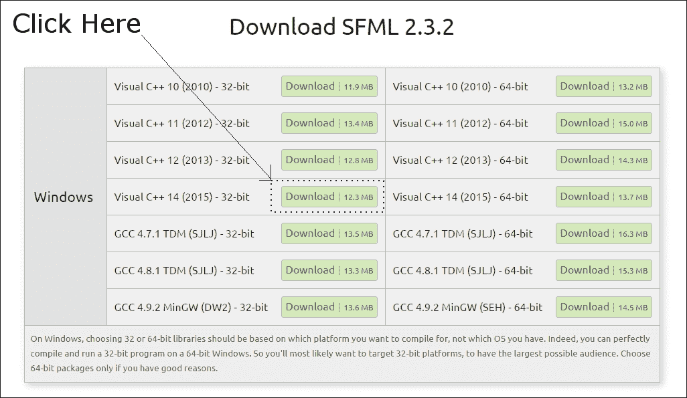
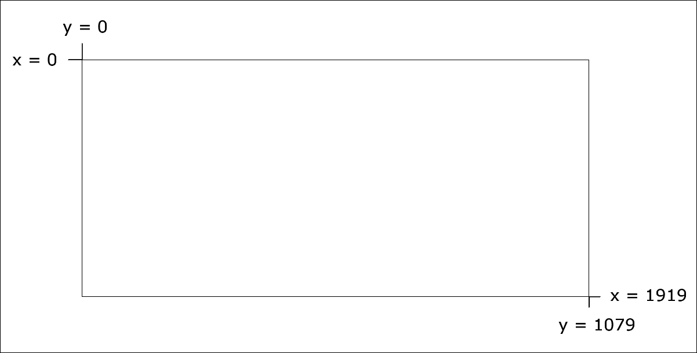

# 第一章。C++，SFML，Visual Studio 和开始第一个游戏

欢迎来到《开始 C++游戏编程》。我将立即让你开始你的写作之旅，使用 C++和**OpenGL**-**powered SFML**为 PC 编写出色的游戏。

这是一个相当庞大的第一章，但我们将学到我们需要的一切，以便让我们第一个游戏的第一部分运行起来。在本章中，我们将涵盖以下内容：

+   了解我们将构建的游戏

+   学习一些关于 C++的知识

+   探索 SFML 及其与 C++的关系

+   查看我们将在整本书中使用的 Visual Studio 软件

+   设置游戏开发环境

+   创建一个可重用的项目模板，这将节省大量时间

+   计划并准备第一个游戏项目，伐木者！！！

+   编写本书的第一个 C++代码，并制作一个可运行的游戏来绘制背景

# 游戏

我们将逐步学习超快的 C++语言的基础知识，然后将新知识应用到实践中，因此应该相当容易地为我们正在构建的三款游戏添加酷炫的功能。

### 提示

如果你在本章的任何内容上遇到困难，请查看最后的处理错误和常见问题解答部分。

这是我们书中的三个项目：

## 伐木者！！！

第一个游戏是一款令人上瘾、节奏快速的《伐木工》的克隆版本，该游戏可以在[`store.steampowered.com/app/398710/`](http://store.steampowered.com/app/398710/)找到。我们的游戏《伐木者！！！》将在构建一个真正可玩的游戏的同时，向我们介绍所有 C++的基础知识。当我们完成并添加了一些最后一刻的增强功能时，我们的游戏版本将是这个样子。


## 僵尸竞技场

接下来，我们将构建一个疯狂的僵尸生存射击游戏，类似于 Steam 的热门游戏《超过 9000 只僵尸》，该游戏可以在[`store.steampowered.com/app/273500/`](http://store.steampowered.com/app/273500/)找到。玩家将拥有一把机关枪，并必须抵御不断增长的僵尸浪潮。所有这些将发生在一个随机生成的滚动世界中。为了实现这一点，我们将学习面向对象编程以及它如何使我们能够拥有一个庞大的代码库（大量代码），易于编写和维护。期待令人兴奋的功能，如数百个敌人、快速射击武器、拾取物品以及每一波后都可以“升级”的角色。


## 托马斯迟到了

第三款游戏将是一款时尚而具有挑战性的益智平台游戏，可以作为单人和合作游玩。它基于非常受欢迎的游戏《托马斯是孤独的》，该游戏可以在[`store.steampowered.com/app/220780/`](http://store.steampowered.com/app/220780/)找到。期待学习有关粒子效果、OpenGL 着色器和分屏合作多人游戏等酷炫主题。


### 提示

如果你现在想玩任何游戏，可以在`Runnable Games`文件夹中的下载包中进行。只需双击相应的`.exe`文件。请注意，在这个文件夹中，你可以运行已完成的游戏，也可以从任何章节的部分完成状态中运行任何游戏。

让我们开始介绍 C++、Visual Studio 和 SFML！

# 了解 C++

你可能会有一个问题，为什么要使用 C++？C++很快，非常快。使其成为这种情况的原因是我们编写的代码直接转换为机器可执行指令。这些指令构成了游戏。可执行游戏包含在一个`.exe`文件中，玩家只需双击即可运行。

这个过程中有几个步骤。首先，**预处理器**查看我们的代码中是否需要包含其他代码，并在必要时添加它。接下来，编译器程序将所有代码编译成**目标文件**。最后，一个名为**链接器**的第三个程序将所有目标文件连接成可执行文件，这就是我们的游戏。

此外，C++既是一个成熟的语言，同时又非常现代化。C++是一种面向对象的编程语言，这意味着我们可以以一种经过验证的方式编写和组织我们的代码，使我们的游戏高效且易于管理。这些好处以及这种必要性将随着我们在书中的进展而显现。

我提到的大部分其他代码都是 SFML，我们将在接下来的一分钟内了解更多关于 SFML 的信息。我刚刚提到的预处理器、编译器和链接器程序都是 Visual Studio 集成开发环境（IDE）的一部分。

# Microsoft Visual Studio

Visual Studio 隐藏了预处理、编译和链接的复杂性。它将所有这些封装成一个按钮。此外，它为我们提供了一个流畅的用户界面，让我们输入我们的代码并管理将成为大量代码文件和其他项目资产的选择。

虽然有高级版本的 Visual Studio 需要花费数百美元，但我们可以在免费的**Express 2015 for Desktop**版本中构建我们的三个游戏。

# SFML

**Simple Fast Media Library（SFML）**不是唯一的 C++游戏和多媒体库。可能有人会主张使用其他库，但对我来说，SFML 似乎是最好的选择。首先，它是使用面向对象的 C++编写的。这样做的好处是多方面的。随着你在书中的进展，你将体验到大部分这些好处。

SFML 非常容易上手，因此对于初学者来说是一个很好的选择。同时，如果你是专业人士，它也有潜力构建最高质量的 2D 游戏。因此，初学者可以开始使用 SFML，而不必担心随着经验的增长需要重新开始学习新的语言/库。

也许最大的好处是大多数现代 C++编程都使用面向对象编程。我读过的每一本 C++初学者指南都使用并教授面向对象编程。事实上，面向对象编程几乎是所有语言中编码的未来（和现在）。因此，如果你从头开始学习 C++，为什么要以其他方式学习呢？

SFML 几乎为 2D 游戏中你可能想做的任何事情提供了模块（代码）。SFML 使用 OpenGL 工作，它也可以制作 3D 游戏。OpenGL 是游戏的事实上免费使用的图形库，当你希望它们在多个平台上运行时。当你使用 SFML 时，你自动使用 OpenGL。

SFML 大大简化了：

+   2D 图形和动画，包括滚动游戏世界。

+   包括高质量的定向声音在内的音效和音乐播放。

+   在线多人游戏功能

+   相同的代码可以在所有主要桌面操作系统上进行编译和链接，很快也可以在移动设备上进行。

广泛的研究并没有发现任何更适合的方式来为 PC 构建 2D 游戏，即使对于专业开发人员来说也是如此，尤其是如果你是初学者，并且想在有趣的游戏环境中学习 C++。

# 设置开发环境

现在你对我们将如何制作这些游戏有了一些了解，是时候设置开发环境，让我们开始编码了。

## 那么 Mac 和 Linux 呢？

我们制作的游戏可以在 Windows、Mac 和 Linux 上运行！我们使用的代码对于每个平台都是相同的。然而，每个版本都需要在其预期的平台上进行编译和链接，而 Visual Studio 将无法帮助我们处理 Mac 和 Linux。

说这本书完全适合 Mac 和 Linux 用户，尤其是完全的初学者，可能有些不公平。尽管，我猜，如果你是一个热衷于 Mac 或 Linux 的用户，并且对你的操作系统感到舒适，你将遇到的大部分额外挑战将在开发环境、SFML 和第一个项目的初始设置中。

为此，我强烈推荐以下教程，希望能替代接下来的大约 10 页（大约），直到*Planning Timber!!!*部分，当这本书应该再次适用于所有操作系统。

对于 Linux，阅读这篇概述：[`www.sfml-dev.org/tutorials/2.0/start-linux.php`](http://www.sfml-dev.org/tutorials/2.0/start-linux.php)。

对于 Linux，阅读这篇逐步指导：[`en.sfml-dev.org/forums/index.php?topic=9808.0`](http://en.sfml-dev.org/forums/index.php?topic=9808.0)。

在 Mac 上，阅读这篇教程以及链接的文章：[`www.edparrish.net/common/sfml-.osx.html`](http://www.edparrish.net/common/sfml-osx.html)。

## 在你的桌面上安装 Visual Studio Express 2015

安装 Visual Studio 几乎和下载一个文件并点击几下按钮一样简单。然而，如果我们仔细地按照我们的步骤来做，这将对我们有所帮助。因此，我将一步一步地走过安装过程。

微软 Visual Studio 网站表示你需要 5GB 的硬盘空间。然而，根据经验，我建议你至少需要 10GB 的可用空间。此外，这些数字有些模糊。如果你计划将其安装在辅助硬盘上，你仍然需要主硬盘上至少 5GB 的空间，因为无论你选择在哪里安装 Visual Studio，它也需要这个空间。

### 注意

总结这种模糊的情况：如果你打算将 Visual Studio 安装到主硬盘上，那么在主硬盘上必须有完整的 10GB 空间是必不可少的。另一方面，如果你打算安装到辅助硬盘上，确保你的主硬盘上有 5GB 的空间，辅助硬盘上有 10GB 的空间。是的，愚蠢，我知道！

1.  你需要的第一件事是一个微软账户和登录详情。如果你有 Hotmail 或 MSN 邮箱地址，那么你已经有了一个。如果没有，你可以在这里免费注册一个：[`login.live.com/`](https://login.live.com/)。

1.  访问这个链接：[`www.visualstudio.com/en-us/downloads/download-visual-studio-vs.aspx`](https://www.visualstudio.com/en-us/downloads/download-visual-studio-vs.aspx)。点击**Visual Studio 2015**，然后点击**Express 2015 for desktop**，然后点击**Downloads**按钮。下一个截图显示了三个点击的位置：

1.  等待短暂的下载完成，然后运行下载的文件。现在你只需要按照屏幕上的指示进行操作。但是，请记下你选择安装 Visual Studio 的文件夹。如果你想和我做的一样，就在你喜欢的硬盘上创建一个名为`Visual Studio 2015`的新文件夹，并安装到这个文件夹中。整个过程可能需要一段时间，取决于你的互联网连接速度。

1.  当你看到下一个屏幕时，点击**Launch**并输入你的微软账户登录详情。

现在我们可以转向 SFML。

## 设置 SFML

这个简短的教程将带你下载 SFML 文件，使我们能够包含库中包含的功能。此外，我们将看到如何使用 SFML DLL 文件，这将使我们编译的目标代码能够与 SFML 一起运行。

1.  访问 SFML 网站上的这个链接：[`www.sfml-dev.org/download.php`](http://www.sfml-dev.org/download.php)。点击下一个显示的**Latest stable version**按钮。

1.  当您阅读本指南时，最新版本几乎肯定已经更改。只要您正确执行下一步，这并不重要。我们要下载**Visual C++ 2014**的 32 位版本。这可能听起来有些违反直觉，因为我们刚刚安装了 Visual Studio 2015，您可能（最常见）有一台 64 位 PC。我们选择此下载的原因是因为 Visual C++ 2014 是 Visual Studio 2015 的一部分（Visual Studio 提供的不仅仅是 C++），我们将以 32 位构建游戏，以便它们在 32 位和 64 位机器上运行。为了明确起见，单击以下下载：

1.  下载完成后，在安装 Visual Studio 的相同驱动器的根目录创建一个名为`SFML`的文件夹。还在安装 Visual Studio 的相同驱动器的根目录创建另一个文件夹，并将其命名为`Visual Studio Stuff`。我们将在这里存储各种与 Visual Studio 相关的东西，因此`Visual Studio Stuff`似乎是一个不错的名字。为了明确起见，这是在完成此步骤后我的硬盘的样子：

1.  显然，您在截图中突出显示的三个文件夹之间的文件夹可能与我的完全不同。现在我们准备好了即将创建的所有项目，创建一个新文件夹在`Visual Studio Stuff`内。将新文件夹命名为`Projects`。

1.  最后，解压 SFML 下载。在桌面上进行此操作。解压完成后，可以删除`zip`文件夹。您将在桌面上留下一个单独的文件夹。其名称将反映您下载的 SFML 版本。我的称为`SFML-2.3.2-windows-vc14-32-bit`。您的文件名可能反映了一个更新的版本。双击此文件夹以查看内容，然后再次双击进入下一个文件夹（我的称为`SFML-2.3.2`）。以下截图显示了当选择了整个内容时，我的`SFML-2.3.2`文件夹的内容是什么样子的。您的应该看起来一样。

1.  复制前面截图中所见的整个文件夹的内容，并将所有内容粘贴/拖放到第 3 步中创建的`SFML`文件夹中。在本书的其余部分，我将简称此文件夹为您的 SFML 文件夹。

现在我们准备在 Visual Studio 中开始使用 C++和 SFML。

## 创建可重用的项目模板

由于设置项目是一个相当繁琐的过程，我们将创建一个项目，然后将其保存为 Visual Studio 模板。这将节省我们每次开始新游戏时相当大量的工作。因此，如果您发现下一个教程有点乏味，请放心，您将永远不需要再次这样做：

1.  启动 Visual Studio，在**新项目**窗口中，单击**Visual C++**旁边的小下拉箭头以显示更多选项，然后单击**Win32**，再单击**Win32 控制台应用程序**。您可以在下一个截图中看到所有这些选择。

1.  现在，在**新项目**窗口的底部，在**名称：**字段中键入`HelloSFML`。

1.  接下来，浏览到我们在上一篇教程中创建的`Visual Studio Stuff\Projects\`文件夹。这将是我们保存所有项目文件的位置。所有模板都是基于实际项目的。因此，我们将有一个名为`HelloSFML`的项目，但我们将做的唯一事情就是从中制作一个模板。

1.  完成上述步骤后，单击**确定**。下一个截图显示了**应用程序设置**窗口。选中**控制台应用程序**的复选框，并将其他选项保持如下所示。

1.  单击**完成**，Visual Studio 将创建新项目。

1.  接下来，我们将添加一些相当复杂和重要的项目设置。这是费力的部分，但由于我们将创建一个模板，我们只需要做一次。我们需要告诉 Visual Studio，或者更具体地说，Visual Studio 的代码编译器，从哪里找到 SFML 的特殊类型的代码文件。我所指的特殊类型的文件是头文件。头文件定义了 SFML 代码的格式。因此，当我们使用 SFML 代码时，编译器知道如何处理它。请注意，头文件与主源代码文件不同，并且它们包含在扩展名为`.hpp`的文件中。（当我们最终开始在第二个项目中添加自己的头文件时，所有这些将变得更清晰）。此外，我们需要告诉 Visual Studio 它在哪里可以找到 SFML 库文件。从 Visual Studio 的主菜单中选择**项目 | HelloSFML 属性**。

1.  在生成的**HelloSFML 属性页**窗口中，执行下一截图中标记的步骤。

1.  从**配置：**下拉菜单中选择**所有配置**。

1.  从左侧菜单中选择**C/C++**，然后选择**常规**。

1.  定位**附加包含目录**编辑框，并输入您的 SFML 文件夹所在的驱动器号，然后加上`\SFML\include`。如果您的`SFML`文件夹位于 D 驱动器上，则要输入的完整路径如截图所示：`D:\SFML\include`。如果您将 SFML 安装到其他驱动器上，则需要更改路径。

1.  点击**应用**以保存到目前为止的配置。

1.  现在，在同一窗口中，执行下一截图中标记的步骤。选择**链接器**，然后选择**常规**。

1.  找到**附加库目录**编辑框，并输入您的`SFML`文件夹所在的驱动器号，然后加上`\SFML\lib`。因此，如果您的`SFML`文件夹位于 D 驱动器上，则要输入的完整路径如截图所示：`D:\SFML\lib`。如果您将 SFML 安装到其他驱动器上，则需要更改路径。

1.  点击**应用**以保存到目前为止的配置。

1.  最后，在同一窗口中，执行下一截图中标记的步骤。将**配置：**下拉菜单（1）切换到**调试**，因为我们将在调试模式下运行和测试游戏。

1.  选择**链接器**，然后选择**输入**（2）。

1.  找到**附加依赖项**编辑框（3），并在最左侧点击进入。现在复制并粘贴/输入以下内容：`sfml-graphics-d.lib;sfml-window-d.lib;sfml-system-d.lib;sfml-network-d.lib;sfml-audio-d.lib;`。再次要非常小心地将光标放置在正确的位置，并且不要覆盖已经存在的任何文本。

1.  点击**确定**。

1.  让我们从`HelloSFML`项目中创建一个模板，这样我们就永远不必再做这个略显乏味的任务了。创建可重用的项目模板非常简单。在 Visual Studio 中选择**文件 | 导出模板...**。然后，在**导出模板向导**窗口中，确保选择了**项目模板**选项，然后选择**HelloSFML**项目作为**要创建模板的项目**选项。

1.  点击**下一步**，然后点击**完成**。

哦，就是这样！下次我们创建项目时，我会告诉您如何从这个模板中创建。现在让我们构建 Timber！！！

# 规划 Timber！！！

每当制作游戏时，最好都要先用铅笔和纸开始。如果您不确定游戏在屏幕上的工作方式，又怎么可能在代码中使其正常工作呢？

### 提示

此时，如果你还没有这样做，我建议你去观看一段 Timberman 的游戏视频，这样你就可以看到我们的目标是什么。如果你的预算允许，那就买一份来玩玩。在 Steam 上通常会以不到一美元的价格出售。[`store.steampowered.com/app/398710/`](http://store.steampowered.com/app/398710/) [.](http://store.steampowered.com/app/398710/)

游戏的特性和物体，定义了游戏玩法，被称为**机制**。游戏的基本机制是：

+   时间总是在流逝。

+   通过砍树来获得更多时间。

+   砍树会导致树枝掉落。

+   玩家必须避开掉落的树枝。

+   重复直到时间用完或玩家被压扁。

在这个阶段期望你计划 C++代码显然有点傻。当然，这是 C++初学者指南的第一章。然而，我们可以看一下我们将使用的所有资源以及我们需要让我们的 C++做我们想要的事情的概述。

看一下游戏的注释截图：


你可以看到我们有以下特性：

+   **玩家当前得分：**每次玩家砍一根木头，他就会得到一个点。他可以用左箭头或右箭头砍木头。

+   **玩家角色：**每次玩家砍的时候，他会移动/停留在树的同一侧。因此，玩家必须小心选择砍树的哪一侧。当玩家砍的时候，一个简单的斧头图形会出现在玩家角色的手中。

+   **缩小的时间条：**每次玩家砍的时候，一小段时间将被添加到不断缩小的时间条上。

+   **致命的树枝：**玩家砍得越快，他得到的时间就越多，但树枝也会更快地从树上掉下来，因此他被压扁的可能性就越大。树枝在树顶随机生成，并且每次砍树都会向下移动。

+   当玩家被压扁时，他会经常被压扁，一个墓碑图形会出现。

+   **被砍的木头：**当玩家砍的时候，一个被砍的木头图形会从玩家身边飞走。

+   有三朵漂浮的云，它们会以随机的高度和速度飘动，还有一只蜜蜂，除了四处飞来飞去什么也不做。

+   所有这些都发生在一个漂亮的背景上。

因此，简而言之，玩家必须疯狂地砍树来获得积分，并避免时间用尽。作为一个略微扭曲但有趣的结果，他砍得越快，他被压扁的可能性就越大。

现在我们知道游戏的外观，玩法以及游戏机制背后的动机。我们可以继续开始构建它。

# 从模板创建项目

现在创建一个新项目非常容易。只需在 Visual Studio 中按照这些简单的步骤操作：

1.  从主菜单中选择**文件** | **新项目**。

1.  确保在左侧菜单中选择**Visual C++**，然后从所呈现的选项列表中选择**HelloSFML**。下一个截图应该能清楚地说明这一点。

1.  在**名称：**字段中键入`Timber`，并确保选中**为解决方案创建目录**选项。现在点击**确定**。

1.  现在我们需要将 SFML 的`.dll`文件复制到主项目目录中。我的主项目目录是`D:\Visual Studio Stuff\Projects\Timber\Timber`。它是在上一步中由 Visual Studio 创建的。如果你把你的`Projects`文件夹放在其他地方，那么就在那里执行这一步。我们需要复制到项目文件夹中的文件位于你的`SFML\bin`文件夹中。打开两个位置的窗口，并按照左侧下一个截图中显示的要求文件进行突出显示。

1.  现在将突出显示的文件复制并粘贴到上一张截图右侧的项目文件夹中。

项目现在已经设置好，准备就绪。您将能够在下一个截图中看到屏幕。我已经对截图进行了注释，这样您就可以开始熟悉 Visual Studio 了。我们很快会重新访问所有这些区域以及其他区域。


您的布局可能与截图略有不同，因为 Visual Studio 的窗口，像大多数应用程序一样，是可定制的。花些时间找到右侧的**Solution Explorer**窗口，并调整它使其内容清晰明了，就像前面的截图一样。

我们很快会回到这里开始编码。

# 项目资产

资产是制作游戏所需的任何东西。在我们的情况下，资产包括：

+   屏幕上的书写字体

+   不同动作的音效，如砍伐、死亡和时间耗尽

+   角色、背景、树枝和其他游戏对象的图形

游戏所需的所有图形和声音都包含在下载包中。它们可以在相应的`Chapter 1/graphics`和`Chapter 1/sound`文件夹中找到。

所需的字体尚未提供。这是因为我想避免任何可能的许可歧义。不过这不会造成问题，因为我将向您展示确切的位置和方式来选择和下载字体。

尽管我将提供资产本身或获取它们的信息，但您可能希望自己创建和获取它们。

## 外包资产

有许多网站可以让您与艺术家、声音工程师甚至程序员签约。其中最大的之一是[www.upwork.com](http://www.upwork.com)。您可以免费加入该网站并发布您的工作。您需要清晰地解释您的要求，以及说明您愿意支付多少。然后您可能会得到许多承包商竞标做这项工作。请注意，有很多不合格的承包商，他们的工作可能令人失望，但如果您选择得当，您可能会找到一个称职、热情和物有所值的人或公司来完成工作。

## 制作自己的音效

可以从网站（如[www.freesound.org](http://www.freesound.org)）免费下载音效，但通常许可证不允许您在出售游戏时使用它们。另一个选择是使用名为 BFXR 的开源软件，该软件可以帮助您生成许多不同的音效，这些音效是您自己保留并随意使用的。

## 将资产添加到项目

一旦您决定要使用哪些资产，就该是将它们添加到项目的时候了。下面的说明将假定您正在使用书籍下载包中提供的所有资产。如果您使用自己的资产，只需用您自己的相应音效或图形文件替换，文件名完全相同即可。

1.  浏览到 Visual `D:\Visual Studio Stuff\Projects\Timber\Timber`。

1.  在此文件夹中创建三个新文件夹，并将它们命名为`graphics`、`sound`和`fonts`。

1.  从下载包中，将`Chapter 1/graphics`的整个内容复制到`D:\Visual Studio Stuff\Projects\Timber\Timber\graphics`文件夹中。

1.  从下载包中，将`Chapter 1/sound`的整个内容复制到`D:\Visual Studio Stuff\Projects\Timber\Timber\sound`文件夹中。

1.  现在访问：[`www.1001freefonts.com/komika_poster.font`](http://www.1001freefonts.com/komika_poster.font) 在您的网络浏览器中下载**Komika Poster**字体。

1.  解压缩下载的内容，并将`KOMIKAP_.ttf`文件添加到`D:\Visual Studio Stuff\Projects\Timber\Timber\fonts`文件夹中。

让我们来看看这些资产，特别是图形，这样我们在使用它们在我们的 C++代码中时可以更好地可视化发生了什么。

## 探索资产

图形资产构成了我们的《伐木者！！！》游戏屏幕的各个部分。看一看这些图形资产，就能清楚地知道它们在我们的游戏中将被使用在哪里。


声音文件都是`.wav`格式。这些文件包含了我们在游戏中特定事件播放的音效。它们都是用 BFXR 生成的。它们包括：

+   `chop.wav`：一种像斧头（复古斧头）砍树的声音

+   `death.wav`：一种有点像复古“失败”声音的声音。

+   `out_of_time.wav`：当玩家因时间耗尽而失败时播放，而不是被压扁

# 理解屏幕和内部坐标

在我们进行实际的 C++编码之前，让我们谈谈坐标。我们在监视器上看到的所有图像都是由像素组成的。像素是一小点光，它们组合在一起形成我们看到的图像。

有许多不同的监视器分辨率，但是举个例子，一个相当典型的游戏玩家的监视器可能在水平上有 1920 个像素，在垂直上有 1080 个像素。

像素从屏幕的左上角开始编号。正如你从下一个图表中看到的，我们的 1920 x 1080 的示例在水平（x）轴上从 0 到 1919，垂直（y）轴上从 0 到 1079 编号。



因此，特定而准确的屏幕位置可以通过 x 和 y 坐标来确定。我们通过在屏幕的特定位置绘制游戏对象，比如背景、角色、子弹和文本，来创建我们的游戏。这些位置由像素的坐标来确定。看一看下面这个假设性的例子，我们可能在屏幕的中心坐标，大约在 960, 540 的位置绘制。


除了屏幕坐标，我们的游戏对象也将有自己类似的坐标系统。与屏幕坐标系统一样，它们的**内部**或**本地**坐标从左上角的 0,0 开始。

在上一个屏幕截图中，我们可以看到角色的 0,0 点被绘制在屏幕的 960, 540 位置。

视觉上，2D 游戏对象，比如角色或者僵尸，被称为**精灵**。精灵通常由图像文件制作而成。所有精灵都有所谓的**原点**。

如果我们在屏幕的特定位置绘制一个精灵，原点将位于这个特定位置。精灵的 0,0 坐标就是原点。下一个屏幕截图演示了这一点。


这就是为什么在显示角色绘制到屏幕的截图中，尽管我们在中心位置（960, 540）绘制了图像，它看起来有点偏右和向下的原因。

在我们进行第一个项目时，我们只需要牢记这是如何工作的。

请注意，在现实世界中，玩家有各种各样的屏幕分辨率，我们的游戏需要尽可能适应其中的许多。在第二个项目中，我们将看到如何使我们的游戏动态适应几乎任何分辨率。在这个第一个项目中，我们需要假设屏幕分辨率是 1920 x 1080。如果你的屏幕分辨率与此不同，不要担心，因为我为 Timber!!!游戏的每一章提供了单独的代码。这些代码文件几乎是相同的，只是在开头添加和交换了一些代码行。如果你有较低分辨率的屏幕，那么只需按照假设 1920 x 1080 分辨率的书中的代码进行操作，当试玩游戏时，你可以从每一章的`低分辨率`文件夹中复制和粘贴代码文件。实际上，一旦在本章中添加了额外的代码行，无论你的屏幕分辨率如何，其余的代码都将是相同的。我为每一章提供了低分辨率的代码，只是为了方便起见。我们将在第二个项目中讨论这几行代码是如何发挥作用的（缩放屏幕）。备用代码将适用于分辨率低至 960 x 540，因此几乎可以在任何 PC 或笔记本电脑上使用。

现在我们可以编写我们的第一个 C++代码，很快我们就会看到它在运行中。

# 开始编写游戏

如果尚未打开 Visual Studio，请打开它，从主 Visual Studio 窗口的**最近**列表中左键单击打开 Timber 项目（如果尚未打开）。

我们将要做的第一件事是重命名我们的主代码文件。它目前被称为`HelloSFML.cpp`，我们将把它重命名为更合适的`Timber.cpp`。`.cpp`代表 C++。

1.  在右侧找到**解决方案资源管理器**窗口。

1.  在**源文件**文件夹下找到`HelloSFML.cpp`文件。

1.  右键单击`HelloSFML.cpp`，选择**重命名**。

1.  编辑文件名为`Timber.cpp`，然后按*Enter*。

在代码窗口中进行一些微小的编辑，以便你的代码与下面显示的完全相同。你可以像使用任何文本编辑器或文字处理软件一样进行编辑；如果你愿意，甚至可以复制粘贴。在进行了轻微的编辑之后，我们可以讨论它们：

```cpp
// Include important C++ libraries here 
#include "stdafx.h"  
int main() 
{ 
   return 0; 
} 

```

这个简单的 C++程序是一个很好的起点。让我们逐行来看一下

## 用注释使代码更清晰

正如你所看到的，唯一需要更改的代码是顶部的一点点。第一行代码是这样的：

```cpp
// Include important C++ libraries here 

```

任何以`//`开头的代码行都是注释，编译器会忽略它们。因此，这行代码什么也不做。它用于在以后回到代码时留下我们可能会发现有用的任何信息。注释在行尾结束，因此下一行的任何内容都不是注释的一部分。还有另一种类型的注释叫做**多行**或**c 风格**注释，它可以用来留下占据多于一行的注释。我们将在本章后面看到一些这样的注释。在本书中，我将留下数百条注释，以帮助添加上下文并进一步解释代码。

## #include Windows 基本组件

现在你知道注释是用来干什么的，你可能可以猜到下一行代码是做什么的。这里再次给出：

```cpp
#include "stdafx.h" 

```

`#include`指令告诉 Visual Studio 在编译之前包含或添加另一个文件的内容。这样做的效果是，当我们运行程序时，一些我们没有自己编写的其他代码将成为我们程序的一部分。将其他文件中的代码添加到我们的代码中的过程称为**预处理**，或许不足为奇的是，这是由一个叫做**预处理器**的东西执行的。文件扩展名`.h`代表头文件。

你可能想知道这段代码会做什么？`stdafx.h`文件实际上包含了更多的`#include`指令。它将我们程序所需的所有必要代码添加到我们的程序中，以便在 Windows 上运行我们的程序。我们永远不需要看到这个文件，绝对不需要关心它里面有什么。我们只需要在我们制作的每个游戏的顶部添加一行代码。

对我们来说更重要和相关的是，值得讨论`#include`指令的原因是，我们将在代码文件的顶部添加许多`#include`指令。这是为了包含我们将使用和费力理解的代码。

我们将包含的主要文件是 SFML 头文件，它为我们提供了所有酷炫的游戏编码功能。我们还将使用`#include`来访问**C++标准库**头文件。这些头文件为我们提供了访问 C++语言核心功能的权限。

这是两行解决了，让我们继续。

## 主函数

我们在代码中看到的下一行是这样的：

```cpp
int main() 

```

代码`int`被称为**类型**。C++有许多类型，它们代表不同类型的数据。`int`是**整数**或整数。记住这一点，我们一会儿会回来讨论它。

`main()`代码部分是随后的代码部分的名称。这段代码在开放的花括号`{`和下一个闭合的花括号`}`之间标出。

因此，这些花括号`{...}`之间的所有内容都是`main`的一部分。我们把这样的一段代码称为**函数**。

每个 C++程序都有一个`main`函数，它是整个程序执行（运行）的起点。随着我们在书中的进展，最终我们的游戏将有许多代码文件。然而，只会有一个`main`函数，无论我们写什么代码，我们的游戏总是从`main`函数的开放花括号内的第一行代码开始执行。

现在，不要担心跟在函数名`()`后面的奇怪括号。我们将在第四章中进一步讨论它们：*循环、数组、开关、枚举和函数-实现游戏机制*，在那里我们将以全新和更有趣的方式看到函数。

让我们仔细看看`Main`函数中的一行代码。

## 演示和语法

再次看看我们的`Main`函数的全部内容：

```cpp
int main() 
{ 
   return 0; 
} 

```

我们可以看到，在`Main`中只有一行代码，`return 0;`。在我们继续了解这行代码的作用之前，让我们看看它是如何呈现的。这很有用，因为它可以帮助我们准备编写易于阅读和区分的代码，与我们代码的其他部分。

首先注意到`return 0;`向右缩进了一个制表符。这清楚地标志着它是`main`函数内部的一部分。随着我们的代码长度增加，我们将看到缩进我们的代码和留下空白将是保持可读性的关键。

接下来，注意一下行末的标点符号。分号`;`告诉编译器这是指令的结束，其后的任何内容都是新的指令。我们称以分号终止的指令为`语句`。

请注意，编译器不在乎你在分号和下一条语句之间留下一个新行甚至一个空格。然而，不为每个语句开启新行将导致代码难以阅读，而完全忽略分号将导致语法错误，使得游戏无法编译或运行。

一起的一段代码，通常由其与部分的缩进表示，称为**块**。

现在你已经对`main`函数的概念感到舒适，缩进你的代码以保持整洁，并在每个语句的末尾加上一个分号，我们可以继续找出`return 0;`语句实际上是做什么的。

## 从函数返回值

实际上，在我们的游戏中，`return 0;`几乎没有做任何事情。然而，这个概念是重要的。当我们使用`return`关键字时，无论是单独使用还是后面跟着一个值，它都是一个指示程序执行跳转/返回到最初启动函数的代码的指令。

通常启动函数的代码将是我们代码中其他地方的另一个函数。然而，在这种情况下，是操作系统启动了`main`函数。因此，当执行`return 0;`时，`main`函数退出，整个程序结束。

由于在`return`关键字后面有一个 0，这个值也被发送到操作系统。我们可以将零的值更改为其他值，那个值将被发送回去。

我们说启动函数的代码**调用**函数，并且函数**返回**值。

你现在不需要完全掌握所有这些函数信息。这里只是介绍它是有用的。在我们继续之前，还有一个关于函数的最后一件事。还记得`int Main()`中的`int`吗？那告诉编译器`Main`返回的值的类型必须是`int`（整数/整数）。我们可以返回任何符合`int`的值。也许是 0、1、999、6358 等等。如果我们尝试返回一个不是 int 的值，比如 12.76，那么代码将无法编译，游戏也无法运行。

函数可以返回各种不同类型的值，包括我们自己发明的类型！然而，这种类型必须以我们刚刚看到的方式告知编译器。

这些关于函数的背景信息将使我们在进展中更加顺利。

## 运行游戏

你现在可以运行游戏。通过点击 Visual Studio 快速启动栏中的**本地 Windows 调试器**按钮，或者使用**F5**快捷键来运行。


你将只看到一个黑屏的闪烁。这个闪烁是 C++控制台，我们可以用它来调试我们的游戏。现在我们不需要这样做。正在发生的是我们的程序启动，从`Main`的第一行开始执行，当然是`return 0;`，然后立即退出返回到操作系统。

# 使用 SFML 打开一个窗口

现在让我们添加一些更多的代码。接下来的代码将打开一个窗口，Timber!!!最终将在其中运行。窗口将是 1920 像素宽，1080 像素高，并且将是全屏的（没有边框或标题）。

输入下面突出显示的新代码到现有代码中，然后我们将对其进行检查。在输入（或复制和粘贴）时，尝试弄清楚发生了什么：

```cpp
// Include important C++ libraries here 
#include "stdafx.h" 
#include <SFML/Graphics.hpp>
// Make code easier to type with "using namespace"
using namespace sf; 
int main() 
{ 
 // Create a video mode object   
   VideoMode vm(1920, 1080);
   // Create and open a window for the game RenderWindow
   window(vm, "Timber!!!", Style::Fullscreen); 
   return 0; 
} 

```

## 包括 SFML 功能

在我们的新代码中，我们注意到的第一件事是另一个略有不同的`#include`指令。`#include <SFML/Graphics.hpp>`告诉预处理器包含文件夹中名为`SFML`的文件夹中包含的`Graphics.hpp`文件的内容。

所以这行代码的作用是添加来自上述文件的代码，这使我们可以访问 SFML 的一些功能。当我们开始编写自己的独立代码文件并使用`#include`来使用它们时，它的实现方式将变得更加清晰。

### 注意

如果你想知道预处理器指令中包含文件名的`<filename.hpp>`和`"filename.h"`之间的区别，`<...>`是用于我们文件夹结构中包含的文件，比如 SFML 文件或我们自己编写的任何文件。`"..."`是用于包含在 Visual Studio 中的文件。此外，`.hpp`文件扩展名只是`.h`文件的更加面向 C++的版本，而`.h`文件更像是 C 风格的扩展名。这两种风格和文件扩展名最终都会做同样的事情，并且在我们的游戏中都能正常工作。

目前重要的是，我们有一大堆新的功能由 SFML 提供，可供使用。下一行是`using namespace sf;`。我们将在几段时间内回到这行代码的作用。

## 面向对象编程，类，对象

随着我们继续阅读本书，我们将更全面地讨论面向对象编程、类和对象。接下来是最简短的介绍，以便我们能够理解发生了什么。

我们已经知道 OOP 代表面向对象编程。OOP 是一种编程范式，一种编码方式。OOP 通常被全球范围内的编程界所接受，在几乎每种语言中，作为编写代码的最佳、如果不是唯一的专业方式。

面向对象编程引入了许多编码概念，但它们所有的基础都是**类**和**对象**。当我们编写代码时，我们希望尽可能地编写可重用的代码。我们这样做的方式是将我们的代码结构化为一个类。我们将在第六章中学习如何做到这一点：*面向对象编程，类和 SFML 视图*。

目前我们只需要知道关于类的一切，一旦我们编写了我们的类，我们不仅仅执行该代码作为游戏的一部分，而是创建可用的对象从类中。

例如，如果我们想要一百个僵尸**非玩家角色**（**NPCs**），我们可以仔细设计和编写一个名为`Zombie`的类，然后从这个单个类中创建任意数量的僵尸对象。每个僵尸对象都具有相同的功能和内部数据类型，但每个僵尸对象都是一个独立的实体。

进一步以假设的僵尸示例为例，但不显示任何`Zombie`类的代码，我们可以像这样创建一个基于`Zombie`类的新对象：

```cpp
Zombie z1; 

```

现在，对象`z1`是一个完全编码和功能的`Zombie`对象。然后我们可以这样做：

```cpp
Zombie z2; 
Zombie z3; 
Zombie z4; 
Zombie z5; 

```

现在我们有五个独立的僵尸，但它们都是基于一个精心编写的类。在我们回到刚刚编写的代码之前，让我们再进一步。我们的僵尸可以包含行为（由函数定义）以及可能代表僵尸健康、速度、位置或行进方向等事物的数据。例如，我们可以编写我们的`Zombie`类，使我们能够像这样使用我们的僵尸对象：

```cpp
z1.attack(player); 
z2.growl(); 
z3.headExplode(); 

```

### 注意

再次注意，所有这些僵尸代码目前都是假设的。不要将这些代码输入 Visual Studio；它只会产生一堆错误。

我们将设计我们的类，以便我们可以以最合适的方式使用数据和行为来满足我们游戏的目标。例如，我们可以设计我们的类，以便我们可以在创建每个僵尸对象时为数据分配值。

也许我们需要在创建每个僵尸时分配一个唯一的名称和以米每秒为单位的速度。`Zombie`类的仔细编码可以使我们编写这样的代码：

```cpp
// Dave was a 100 meter Olympic champion before infection  
// He moves at 10 meters per second 
Zombie z1("Dave", 10); 

// Gill had both of her legs eaten before she was infected 
// She drags along at .01 meters per second 
Zombie z2("Gill", .01); 

```

重点是类几乎是无限灵活的，一旦我们编写了类，我们就可以通过创建对象来使用它们。正是通过类和我们从中创建的对象，我们将利用 SFML 的强大功能。是的，我们还将编写我们自己的类，包括一个`Zombie`类。

让我们回到我们刚刚编写的真正代码。

## 使用 sf 命名空间

在我们继续更仔细地查看`VideoMode`和`RenderWindow`之前，您可能已经猜到，这些都是 SFML 提供的类，我们将学习`using namespace sf;`这行代码的作用。

当我们创建一个类时，我们是在一个**命名空间**中创建的。我们这样做是为了区分我们编写的类和其他人编写的类。考虑一下`VideoMode`类。在 Windows 等环境中，完全有可能有人已经编写了一个名为`VideoMode`的类。通过使用命名空间，我们和 SFML 程序员可以确保类的名称永远不会冲突。

使用`VideoMode`类的完整方式如下：

```cpp
sf::VideoMode...
```

代码`using namespace sf;`使我们可以在代码中的任何地方省略前缀`sf::`。如果没有它，在这个简单的游戏中将会有超过 100 个`sf::`的实例。它还使我们的代码更易读，同时也更短。

## SFML VideoMode 和 RenderWindow

在`Main`函数中，我们现在有两个新的注释和两行新的实际代码。第一行实际代码是这样的：

```cpp
VideoMode vm(1920, 1080); 

```

这段代码创建了一个名为`vm`的对象，从名为`VideoMode`的类中创建，并设置了内部值`1920`和`1080`。这些值代表玩家屏幕的分辨率。

下一行新的代码是这样的：

```cpp
RenderWindow window(vm, "Timber!!!", Style::Fullscreen); 

```

在前一行代码中，我们正在从 SFML 提供的名为`RenderWindow`的类中创建一个名为`window`的新对象。此外，我们正在设置窗口对象内部的一些值。

首先，`vm`对象用于初始化`window`的一部分。起初这可能看起来令人困惑。然而，请记住，类可以像其创建者想要的那样多样化和灵活。是的，有些类可以包含其他类。

### 提示

此时不必完全理解这是如何工作的，只要您能理解这个概念就可以了。我们编写一个类，然后从该类中创建可用的对象。有点像建筑师可能会绘制蓝图。您当然不能把所有家具、孩子和狗都搬进蓝图中；但您可以根据蓝图建造一座房子（或者多座房子）。在这个类比中，类就像蓝图，对象就像房子。

接下来，我们使用值 Timber!!!来给窗口命名。我们使用预定义的值`Style::FullScreen`来使我们的`window`对象全屏显示。

### 提示

`Style::FullScreen`是 SFML 中定义的一个值。这样做是为了我们不需要记住内部代码用来表示全屏的整数。这种类型的值的编码术语是`常量`。常量及其近亲 C++中的**变量**将在下一章中介绍。

让我们看看我们的窗口对象在运行中的样子。

## 运行游戏

在这一点上，您可以再次运行游戏。您会看到一个更大的黑屏一闪而过。这就是我们刚刚编写的 1920 x 1080 全屏窗口。不幸的是，我们的程序仍然是从`Main`的第一行开始执行，创建了一个很酷的新游戏窗口，然后到达`return 0;`，立即退出到操作系统。

# 主游戏循环

我们需要一种方法来保持程序运行，直到玩家想要退出。同时，随着我们在 Timber!!!中的进展，我们应该清楚地标出代码的不同部分将放在哪里。此外，如果我们要阻止游戏退出，我们最好提供一种让玩家在准备好退出时退出的方法。否则游戏将永远进行下去！

添加高亮代码，放入现有代码中，然后我们将一起讨论它们：

```cpp
int main() 
{ 
   // Create a video mode object 
   VideoMode vm(1920, 1080); 

   // Create and open a window for the game 
   RenderWindow window(vm, "Timber!!!", Style::Fullscreen); 

 while (window.isOpen())   
     {
        /*     
        ****************************************
        Handle the players input
        ****************************************
        */     
        if (Keyboard::isKeyPressed(Keyboard::Escape))
        {
            window.close();     
        }    
        /*     
        ****************************************     
        Update the scene
        ****************************************     
        */     

        /*     
        ****************************************     
        Draw the scene     
        ****************************************     
        */        
        // Clear everything from the last frame     
        window.clear();     

        // Draw our game scene here    

        // Show everything we just drew     
        window.display();   
      } 

   return 0; 
} 

```

## While 循环

在新代码中，我们看到的第一件事是：

```cpp
while (window.isOpen()) 
{ 

```

在新代码中，我们看到的最后一件事是一个闭合的`}`。我们创建了一个`while`循环。在`while`循环的开头`{`和结尾`}`之间的所有内容将会一遍又一遍地执行，可能会永远执行下去。

仔细看一下下一个代码中突出显示的`while`循环的括号`(...)`之间的部分：

```cpp
while (window.isOpen()) 

```

这段代码的完整解释将等到我们在第四章讨论循环和条件时再说：*循环、数组、开关、枚举和函数-实现游戏机制*。现在重要的是，当`window`对象被设置为关闭时，代码的执行将跳出`while`循环并进入下一个语句。窗口如何关闭将很快涵盖。

下一个声明当然是`return 0;`，这结束了我们的游戏。

现在我们知道我们的`while`循环会快速循环执行其中的代码，直到我们的窗口对象被设置为关闭。

## C 风格的代码注释

在 while 循环内部，我们看到了乍一看可能有点像 ASCII 艺术的东西：

```cpp
      /* 
      **************************************** 
      Handle the player's input 
      **************************************** 
      */ 

```

### 注意

ASCII 艺术是一种利用计算机文本创建图像的小众但有趣的方式。您可以在这里阅读更多信息：[`en.wikipedia.org/wiki/ASCII_art`](https://en.wikipedia.org/wiki/ASCII_art) [.](https://en.wikipedia.org/wiki/ASCII_art)

先前的代码只是另一种类型的注释。这种注释被称为 C 风格注释。注释以`/*`开头，以`*/`结尾。中间的任何内容只是用于信息，不会被编译。我使用了这种略微复杂的文本，以确保清楚地表明我们将在代码文件的这部分做什么。当然，您现在可以推断出接下来的任何代码都将与处理玩家的输入有关。

跳过几行代码，您会看到我们有另一个 C 风格的注释，宣布在代码的这部分，我们将更新场景。

跳到下一个 C 风格的注释，很明显我们将在那里绘制所有的图形。

## 输入、更新、绘制、重复

尽管这个第一个项目使用了最简单的**游戏循环**版本，但每个游戏都需要在代码中经历这些阶段：

1.  获取玩家的输入（如果有）。

1.  根据人工智能、物理或玩家的输入更新场景。

1.  绘制当前场景。

1.  以足够快的速度重复以上步骤，以创建一个平滑和动画的游戏世界。

现在让我们看看实际在游戏循环中执行的代码。

## 检测按键

首先，在标记为`处理玩家输入`的部分中，我们有以下代码：

```cpp
if (Keyboard::isKeyPressed(Keyboard::Escape)) 
{ 
 window.close(); 
} 

```

这段代码检查当前是否按下了**Escape**键。如果是，突出显示的代码使用`window`对象关闭自身。现在，下一次`while`循环开始时，它将看到`window`对象已关闭，并跳到`while`循环的结束大括号`}`后面的代码，游戏将退出。我们将在第二章更全面地讨论`if`语句：*变量、运算符和决策-动画精灵*。

## 清除和绘制场景

目前在`更新场景`部分没有代码，所以让我们继续到`绘制场景`部分。

我们要做的第一件事是使用以下代码擦除先前的动画帧：

```cpp
window.clear(); 

```

现在我们要做的是绘制游戏中的每一个对象。然而，目前我们没有任何游戏对象。

下一行代码是：

```cpp
window.display(); 

```

当我们绘制所有游戏对象时，我们将它们绘制到一个隐藏的表面上，准备好显示。代码`window.display()`从先前显示的表面翻转到新更新的（先前隐藏的）表面。这样，玩家永远不会看到绘图过程，因为表面上添加了所有精灵。它还保证了在翻转之前场景将会完整。这可以防止图形故障，称为**撕裂**。这个过程称为**双缓冲**。

还要注意，所有这些绘制和清除功能都是使用我们的`window`对象执行的，该对象是从 SFML 的`RenderWindow`类创建的。

## 运行游戏

运行游戏，您将得到一个空白的全屏窗口，直到您按下***Esc***键。

# 绘制游戏背景

最后，我们将在游戏中看到一些真正的图形。我们需要做的是创建一个精灵。我们将创建的第一个精灵将是游戏背景。然后我们可以在清除窗口和显示/翻转窗口之间绘制它。

## 使用纹理准备精灵

SFML 的`RenderWindow`类允许我们创建`window`对象来处理游戏窗口所需的所有功能。

现在我们将探索另外两个 SFML 类，它们将负责在屏幕上绘制精灵。其中一个类，也许不足为奇的是，被称为`Sprite`。另一个类被称为`Texture`。纹理是存储在**图形处理单元**（**GPU**）上的图形。

从`Sprite`类创建的对象需要从`Texture`类创建的对象才能将自己显示为图像。添加以下突出显示的代码。尝试弄清楚发生了什么。然后我们将逐行解释：

```cpp
int main() 
{ 
   // Create a video mode object 
   VideoMode vm(1920, 1080); 

   // Create and open a window for the game 
   RenderWindow window(vm, "Timber!!!", Style::Fullscreen); 

 // Create a texture to hold a graphic on the GPU   
   Texture textureBackground;   

   // Load a graphic into the texture
   textureBackground.loadFromFile("graphics/background.png);   

   // Create a sprite
   Sprite spriteBackground;   

   // Attach the texture to the sprite
   spriteBackground.setTexture(textureBackground);   

   // Set the spriteBackground to cover the screen
   spriteBackground.setPosition(0,0); 

   while (window.isOpen()) 
   { 

```

首先，我们从 SFML 的`Texture`类创建一个名为`textureBackground`的对象。

```cpp
Texture textureBackground; 

```

完成后，我们可以使用`textureBackground`对象从我们的`graphics`文件夹加载图形到`textureBackground`中，就像这样：

```cpp
textureBackground.loadFromFile("graphics/background.png"); 

```

### 提示

我们只需要指定`graphics/background`作为路径，因为路径是相对于我们创建文件夹并添加图像的 Visual Studio 工作目录的。

接下来，我们使用以下代码从 SFML 的`Sprite`类创建一个名为`spriteBackground`的对象：

```cpp
Sprite spriteBackground; 

```

然后，我们可以将纹理对象`textureBackground`与精灵对象`spriteBackground`关联起来，就像这样：

```cpp
spriteBackground.setTexture(textureBackground); 

```

最后，我们可以将`spriteBackground`对象定位在`window`对象的坐标`0,0`处：

```cpp
spriteBackground.setPosition(0,0); 

```

`background.png`图形在`graphics`文件夹中的尺寸为 1920 像素宽，1080 像素高，它将完全填满整个屏幕。只是请注意，这行代码并不实际显示精灵，它只是设置好位置，以便在显示时使用。

现在，`backgroundSprite`对象可以用来显示背景图形。当然，您几乎肯定想知道为什么我们不得不以这种复杂的方式做事。原因是因为显卡和 OpenGL 的工作方式。

纹理占用图形内存，而这种内存是有限的资源。此外，将图形加载到 GPU 内存中的过程非常缓慢。并不是缓慢到可以看到它发生，或者在发生时会明显减慢您的 PC，但足够缓慢，以至于您无法在游戏循环的每一帧中都这样做。因此，将实际纹理`textureBackground`与在游戏循环期间我们将操纵的任何代码分离开来是有用的。

当我们开始移动我们的图形时，您将会看到我们将使用精灵。任何从`Texture`类创建的对象都将愉快地停留在 GPU 上，只等待一个关联的`Sprite`对象告诉它们在哪里显示自己。在以后的项目中，我们还将重复使用相同的`Texture`对象与多个不同的`Sprite`对象，这样可以有效地利用 GPU 内存。

总之：

+   纹理加载到 GPU 上非常缓慢

+   一旦纹理存储在 GPU 上，访问速度非常快

+   我们将精灵对象与纹理关联起来

+   我们通常在“更新场景”部分操纵精灵对象的位置和方向。

+   我们绘制`Sprite`对象，然后显示与其关联的纹理（通常在“绘制场景”部分）。

所以现在我们需要做的就是使用我们的`window`对象提供的双缓冲系统来绘制我们的新`Sprite`对象（`spriteBackground`），然后我们实际上应该能够看到我们的游戏在运行。

## 双缓冲背景精灵

最后，我们需要在游戏循环中的适当位置绘制该精灵及其相关纹理。

### 提示

请注意，当我展示的代码都来自同一个块时，我不添加缩进，因为这会减少书中文本的换行次数。缩进是暗示的。请查看下载包中的代码文件，以查看缩进的完整用法。

添加突出显示的代码：

```cpp
/* 
**************************************** 
Draw the scene 
**************************************** 
*/ 

// Clear everything from the last run frame 
window.clear(); 

// Draw our game scene here 
window.draw(spriteBackground);           

// Show everything we just drew 
window.display(); 

```

新的代码行只是使用`window`对象来绘制`spriteBackground`对象，在清除显示并显示新绘制的场景之间。

## 运行游戏

现在运行程序，您将看到我们正在进行真正的游戏的第一个迹象。


它目前还不能在 Steam 上获得**绿光**，但至少我们已经在路上了！

让我们看看本章可能出现的一些问题，以及随着书的进行我们将继续进行的工作。

# 处理错误

每个项目都会出现问题和错误，这是肯定的！问题越棘手，解决它时就会越令人满意。经过数小时的挣扎后，一个新的游戏功能终于实现，会让人真正兴奋。如果没有挣扎，它可能会变得不那么值得。

在本书的某个时候，可能会遇到一些困难。保持冷静，相信自己能够克服它，然后开始工作。

请记住，无论您遇到什么问题，您都极不可能是世界上第一个遇到同样问题的人。想出一个简洁的句子来描述您的问题或错误，然后在 Google 中输入。您会惊讶地发现，有人很快、准确地解决了您的问题，而且经常会有人已经为您解决了问题。

话虽如此，在这里有一些提示（双关语；请参阅第八章：*指针、标准模板库和纹理管理*），以便在您努力使本章工作时帮助您入门。

## 配置错误

本章中问题最有可能的原因是配置错误。您可能已经在设置 Visual Studio、SFML、项目模板和项目本身的过程中注意到，有很多文件名、文件夹和设置需要完全正确。只要有一个错误的设置，就可能导致多种错误，其中文本并没有清楚地说明出了什么问题。

如果您无法使**从模板创建可重用模板**部分中的黑屏空项目运行起来，可能更容易重新开始该部分。确保所有的文件名和文件夹适合于您特定的设置，然后让代码的最简单部分运行起来（屏幕闪烁黑色然后关闭的部分）。如果您能够达到这个阶段，那么配置可能不是问题所在。

## 编译错误

编译错误可能是我们未来经历的最常见的错误。检查您的代码是否与我的相同，特别是行尾的分号和类和对象名称的大小写的微妙变化。如果一切都失败了，打开下载包中的代码文件并复制粘贴。虽然书中可能存在代码拼写错误，但代码文件是从实际工作的项目中制作的 - 它们绝对有效！

## 链接错误

链接错误很可能是由于缺少 SFML 的`.dll`文件造成的。您是否将它们全部复制到了从模板创建项目的项目文件夹中？

## 错误

当您的代码工作时发生错误时，这就是错误。调试实际上可以很有趣。您消灭的错误越多，您的游戏就会越好，您一天的工作就会越令人满意。解决错误的诀窍是尽早找到它们！为此，我建议每次实现新功能时都运行和玩游戏。您越早发现错误，原因就越可能新鲜在您的脑海中。在本书中，我们将在每个可能的阶段运行代码以查看结果。

# 常见问题解答

以下是一些可能会让你困惑的问题：

Q）我对目前呈现的内容感到困难。我适合编程吗？

A）设置开发环境并理解 OOP 作为一个概念可能是你在这本书中做的最艰难的事情。只要你的游戏正常运行（绘制背景），你就可以继续进行下一章。

Q）所有关于面向对象编程（OOP）、类和对象的讨论都太多了，有点破坏了整个学习体验。

A）别担心。我们会不断地回到面向对象编程、类和对象。在第六章：*面向对象编程、类和 SFML 视图*中，我们将真正开始掌握整个面向对象编程的东西。你现在需要理解的是，SFML 已经编写了大量有用的类，我们可以通过从这些类创建可用对象来使用这些代码。

Q）我真的不懂这个函数的东西。

A）没关系，我们会再次回到这个问题，并且会更彻底地学习函数。你只需要知道，当一个函数被调用时，它的代码被执行，当它完成时（达到`return`语句），程序会跳回调用它的代码。

# 总结

那是一个相当具有挑战性的章节，也许我让它变得如此苛刻了一点。配置 IDE 以使用 C++库可能有点棘手和耗时。同时，众所周知，对于编程新手来说，类和对象的概念可能有点棘手。

现在我们已经到了这个阶段，我们可以完全专注于 C++、SFML 和游戏。随着章节的进展，我们将学习更多的 C++，以及如何实现越来越有趣的游戏功能。在这个过程中，我们将进一步研究诸如函数、类和对象之类的东西，以帮助更好地揭开它们的神秘面纱。接下来，我们将学习所有绘制更多精灵并对它们进行动画处理所需的 C++知识。
