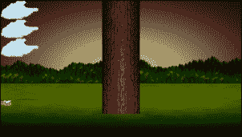
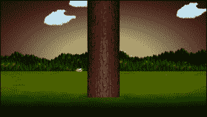

# 第二章：变量、运算符和决策 - 动画精灵

在本章中，我们将在屏幕上进行更多的绘图，为了实现这一点，我们需要学习一些 C++的基础知识。

这里有什么：

+   学习所有关于 C++变量的知识

+   了解如何操作变量中存储的值

+   添加一个静态树，准备好供玩家砍伐

+   绘制和动画一个蜜蜂和三朵云

# C++变量

**变量**是我们的 C++游戏存储和操作值的方式。如果我们想知道玩家有多少生命值，那么我们就需要一个变量。也许你想知道当前波中还剩下多少僵尸？那也是一个变量。如果您需要记住获得特定高分的玩家的名字，你猜对了，我们也需要一个变量。游戏结束了还是还在进行？是的，那也是一个变量。

变量是内存中位置的命名标识符。因此，我们可以将一个变量命名为`numberOfZombies`，该变量可以指向存储表示当前波中剩余僵尸数量的值的内存位置。

计算机系统寻址内存位置的方式是复杂的。编程语言使用变量以人性化的方式管理我们在内存中的数据。

我们对变量的简要讨论意味着必须有不同类型的变量。

## 变量类型

C++有各种各样的变量类型（请参阅有关变量的下一个提示）。很容易花一个整章的时间来讨论它们。接下来是本书中最常用的类型的表格。然后我们将看看如何实际使用每种变量类型。

| **类型** | **值的示例** | **解释** |
| --- | --- | --- |
| Int | `-42`，`0`，`1`，`9826`，等等。 | 整数整数。 |
| Float | `-1.26f`，`5.8999996f`，`10128.3f` | 浮点值，精度高达 7 位数字。 |
| Double | `925.83920655234`，`1859876.94872535` | 浮点值，精度高达 15 位数字。 |
| Char | `a`，`b`，`c`，`1`，`2`，`3`（包括`?`，`~`，`#`等共 128 个符号） | ASCII 表中的任何符号（请参阅有关变量的下一个提示）。 |
| Bool | 真或假 | Bool 代表布尔值，只能是`true`或`false`。 |
| String | 大家好！我是一个字符串。 | 从单个字母或数字到整本书的任何文本值。 |

编译器必须告诉变量是什么类型，以便为其分配正确的内存量。对于您使用的每个变量，使用最佳和最合适的类型是一个良好的实践。然而，在实践中，您通常可以提升一个变量。也许您只需要一个具有五个有效数字的浮点数？如果您将其存储为`double`，编译器不会抱怨。然而，如果您尝试将`float`或`double`存储在`int`中，它将更改/转换值以适应`int`。随着我们在书中的进展，我将澄清在每种情况下使用的最佳变量类型是什么，我们甚至会看到一些有意转换/转换变量类型的情况。

在上面的表中，还有一些额外的细节值得注意，包括所有`float`值旁边的`f`后缀。这个`f`告诉编译器该值是`float`类型而不是`double`。没有`f`前缀的浮点值被假定为`double`。有关此内容的更多信息，请参阅有关变量的下一个提示。

如前所述，还有许多其他类型。如果您想了解更多关于类型的信息，请参阅有关变量的下一个提示。

### 常量

有时我们需要确保一个值永远不会被改变。为了实现这一点，我们可以使用`const`关键字声明和初始化一个**常量**：

```cpp
const float PI = 3.141f; 
const int PLANETS_IN_SOLAR_SYSTEM = 8; 
const int NUMBER_OF_ENEMIES = 2000; 

```

习惯上，常量的声明都是大写的。前面常量的值永远不能被改变。我们将在第四章中看到一些常量的实际应用：*循环、数组、开关、枚举和函数 - 实现游戏机制*。

### 用户定义的类型

用户定义的类型比我们刚刚看到的类型要先进得多。当我们在 C++中谈论用户定义的类型时，通常是指类。我们在上一章中简要讨论了类及其相关对象。我们可以在一个单独的文件中编写代码，有时甚至是在两个单独的文件中。然后我们将能够声明、初始化和使用它们。我们将把如何定义/创建我们自己的类型留到第六章：*面向对象编程、类和 SFML 视图*。

## 声明和初始化变量

到目前为止，我们知道变量用于存储游戏中需要的数据/值。例如，一个变量可以表示玩家拥有的生命值或玩家的姓名。我们还知道这些变量可以表示各种不同类型的值，比如`int`、`float`、`bool`等。当然，我们还没有看到如何实际使用变量。

创建和准备新变量有两个阶段。这两个阶段称为**声明**和**初始化**。

### 声明变量

我们可以在 C++中这样声明变量：

```cpp
// What is the player's score? 
int playerScore; 

// What is the players first initial 
char playerInitial; 

// What is the value of pi 
float valuePi; 

// Is the player alive or dead? 
bool isAlive; 

```

### 初始化变量

现在我们已经用有意义的名称声明了变量，我们可以用适当的值初始化这些变量，就像这样：

```cpp
playerScore = 0; 
playerInitial = 'J'; 
valuePi = 3.141f; 
isAlive = true; 

```

### 一步声明和初始化

当适合我们时，我们可以将声明和初始化步骤合并为一步：

```cpp
int playerScore = 0; 
char playerInitial = 'J'; 
float valuePi = 3.141f; 
bool isAlive = true; 

```

### 提示

**变量提示**正如承诺的那样，这是关于变量的提示。如果你想看到完整的 C++类型列表，那么请查看这个网页：[`www.tutorialspoint.com/cplusplus/cpp_data_types.htm`](http://www.tutorialspoint.com/cplusplus/cpp_data_types.htm)。如果你想深入讨论浮点数、双精度和`f`后缀，那么请阅读这篇文章：[`www.cplusplus.com/forum/beginner/24483/`](http://www.cplusplus.com/forum/beginner/24483/)。如果你想了解 ASCII 字符代码的方方面面，那么这里有更多信息：[`www.cplusplus.com/doc/ascii/`](http://www.cplusplus.com/doc/ascii/)。请注意，这些链接是给好奇的读者的，我们已经讨论了足够的内容以便继续进行。

### 声明和初始化用户定义的类型

我们已经看到了如何声明和初始化一些 SFML 定义的类型的示例。由于我们可以创建/定义这些类型（类）的方式非常灵活，因此我们声明和初始化它们的方式也是多种多样的。以下是前一章中关于声明和初始化用户定义的类型的一些提醒。

创建一个类型为`VideoMode`的对象，名为`vm`，并用两个`int`值`1920`和`1080`进行初始化：

```cpp
// Create a video mode object 
VideoMode vm(1920, 1080); 

```

创建一个类型为`Texture`的对象，名为`textureBackground`，但不进行任何初始化：

```cpp
// Create a texture to hold a graphic on the GPU 
Texture textureBackground; 

```

请注意，即使我们没有建议使用哪些特定值来初始化`textureBackground`，某些变量可能已在内部设置。对象是否需要/具有在此时给出初始化值的选项完全取决于类的编码方式，几乎是无限灵活的。这进一步表明，当我们开始编写自己的类时，会有一些复杂性。幸运的是，这也意味着我们将有重大的权力来设计我们的类型/类，使它们正是我们需要的来制作我们的游戏！将这种巨大的灵活性添加到 SFML 设计的类中，我们的游戏的潜力几乎是无限的。

在本章中，我们还将看到 SFML 提供的一些用户创建的类型/类，以及本书中的更多内容。

# 操作变量

到目前为止，我们确切地知道了变量是什么，主要类型是什么，以及如何声明和初始化它们，但我们仍然不能做太多事情。我们需要操作我们的变量，加上它们，减去它们，乘以它们，除以它们，并测试它们。

首先，我们将处理如何操作它们，稍后我们将看看我们如何以及为什么测试它们。

## C++算术和赋值运算符

为了操作变量，C++有一系列**算术运算符**和**赋值运算符**。幸运的是，大多数算术和赋值运算符使用起来相当直观，而那些不直观的则很容易解释。为了让我们开始，让我们先看一张算术运算符表，然后是一张我们将在本书中经常使用的赋值运算符表：

| **算术运算符** | **解释** |
| --- | --- |
| `+` | 加法运算符可用于将两个变量或值的值相加。 |
| `-` | 减法运算符可用于从另一个变量或值中减去一个变量或值的值。 |
| `*` | 乘法运算符可以将变量和值的值相乘。 |
| `/` | 除法运算符可以除以变量和值的值。 |
| `%` | 取模运算符将一个值或变量除以另一个值或变量，以找到操作的余数。 |

现在是赋值运算符的时候了：

| **赋值运算符** | **解释** |
| --- | --- |
| `=` | 我们已经见过这个了。这是*赋值*运算符。我们用它来初始化/设置变量的值。 |
| `+=` | 将右侧的值加到左侧的变量上。 |
| **`-=`** | 从左侧的变量中减去右侧的值。 |
| `*=` | 将右侧的值乘以左侧的变量。 |
| `/=` | 将右侧的值除以左侧的变量。 |
| `++` | **递增**运算符；将变量加 1 |
| `--` | **递减**运算符；从变量中减去 1 |

### 注意

从技术上讲，除了`=, --`和`++`之外，上述所有运算符都被称为**复合赋值运算符**，因为它们包含多个运算符。

现在我们已经看到了一系列算术和赋值运算符，我们实际上可以看到如何通过组合运算符、变量和值来操作我们的变量形成**表达式**。 

## 通过表达式完成任务

**表达式**是变量、运算符和值的组合。使用表达式，我们可以得出一个结果。此外，正如我们很快将看到的那样，我们可以在测试中使用表达式。这些测试可以用来决定我们的代码接下来应该做什么。首先，让我们看一些可能在游戏代码中看到的简单表达式：

```cpp
// Player gets a new high score 
hiScore = score; 

```

或者

```cpp
// Set the score to 100 
score = 100; 

```

看一下加法运算符，与赋值运算符一起使用：

```cpp
// Add to the score when an alien is shot 
score = aliensShot + wavesCleared; 

```

或者

```cpp
// Add 100 to whatever the score currently is 
score = score + 100; 

```

请注意，在运算符的两侧使用相同的变量是完全可以接受的。

看一下减法运算符与赋值运算符的结合。下面的代码从减法运算符右侧的值中减去左侧的值。它通常与赋值运算符一起使用，例如：

```cpp
// Uh oh lost a life 
lives = lives - 1; 

```

或者

```cpp
// How many aliens left at end of game 
aliensRemaining = aliensTotal - aliensDestroyed; 

```

这是我们可能使用除法运算符的方式。下面的代码将左边的数字除以右边的数字。同样，它通常与赋值运算符一起使用，如下所示：

```cpp
// Make the remaining hit points lower based on swordLevel 
hitPoints = hitPoints / swordLevel; 

```

或者

```cpp
// Give player something back for recycling a block 
recycledValueOfBlock = originalValue / .9f; 

```

显然，在前面的例子中，变量`recycledValueOfBlock`需要是`float`类型，以准确存储这样的计算结果。

也许并不令人惊讶，我们可以像这样使用乘法运算符：

```cpp
// answer is equal to 100 - of course 
answer = 10 * 10; 

```

或者

```cpp
// biggerAnswer = 1000 - of course 
biggerAnswer = 10 * 10 * 10; 

```

### 注意

顺便说一下，你是否曾经想过 C++是怎么得到它的名字的？C++是 C 语言的扩展。它的发明者 Bjarne Stroustrup 最初称其为*C with classes*，但名称发生了变化。如果您感兴趣，请阅读 C++的故事：[`www.cplusplus.com/info/history/`](http://www.cplusplus.com/info/history/)。

现在，让我们看看增量运算符的运行情况。这是一个非常巧妙的方法，可以将`1`添加到我们游戏变量的值中。

看一下这段代码：

```cpp
// Add one to myVariable 
myVariable = myVariable + 1; 

```

它产生了与这段代码相同的结果：

```cpp
// Much neater and quicker 
myVariable ++; 

```

递减运算符`--`，你猜对了，是从某个数值中减去`1`的一个非常巧妙的方法：

```cpp
playerHealth = playerHealth -1; 

```

这与这个是一样的：

```cpp
playerHealth --; 

```

让我们看看一些操作符的运行情况，然后我们可以继续构建 Timber!!!游戏：

```cpp
someVariable = 10; 

// Multiply the variable by 10 and put the answer back in variable 
someVariable *= 10; 
// someVariable now equals 100 

// Divide someVariable by 5 put the answer back into the variable 
someVariable /= 5; 
// someVariable now equals 20 

// Add 3 to someVariable and put the answer back into the variable 
someVariable += 3; 
// someVariable now equals 23 

// Take 25 from someVariable and put the answer back into the variable 
someVariable -= 25; 
// someVariable now equals -2 

```

现在是时候向我们的游戏添加一些更多的精灵了。

# 添加云，树和嗡嗡蜜蜂

首先我们将添加一棵树。这将非常容易。之所以容易是因为树不会移动。我们将使用与我们在上一章绘制背景时完全相同的过程。

## 准备树

添加下面突出显示的代码。注意未突出显示的代码，这是我们已经编写的代码。这应该帮助您确定新代码应该在设置背景位置之后立即输入，但在主游戏循环开始之前。在您添加新代码之后，我们将回顾新代码的实际情况：

```cpp
int main() 
{ 

   // Create a video mode object 
   VideoMode vm(1920, 1080); 

   // Create and open a window for the game 
   RenderWindow window(vm, "Timber!!!", Style::Fullscreen); 

   // Create a texture to hold a graphic on the GPU 
   Texture textureBackground; 

   // Load a graphic into the texture 
   textureBackground.loadFromFile("graphics/background.png"); 

   // Create a sprite 
   Sprite spriteBackground; 

   // Attach the texture to the sprite 
   spriteBackground.setTexture(textureBackground); 

   // Set the spriteBackground to cover the screen 
   spriteBackground.setPosition(0, 0); 

 // Make a tree sprite
   Texture textureTree;
   textureTree.loadFromFile("graphics/tree.png");   
   Sprite spriteTree;   
   spriteTree.setTexture(textureTree);   
   spriteTree.setPosition(810, 0);

   while (window.isOpen()) 
   { 

```

我们刚刚添加的五行代码（不包括注释）做了以下事情：

+   首先，我们创建了一个名为`textureTree`的`Texture`类型对象。

+   接下来，我们从`tree.png`图形文件中将图形加载到纹理中。

+   接下来，我们声明了一个名为`spriteTree`的`Sprite`类型对象。

+   现在，我们将`textureTree`与`spriteTree`关联起来。每当我们绘制`spriteTree`时，它将显示`textureTree`纹理，这是一个漂亮的树形图形。

+   最后，我们使用 x 轴上的坐标`810`和 y 轴上的坐标 0 设置了树的位置。

让我们继续处理蜜蜂对象，这几乎是以相同的方式处理的。

## 准备蜜蜂

下一个代码与树代码之间的差异很小但很重要。由于蜜蜂需要移动，我们还声明了两个与蜜蜂相关的变量。在所示的位置添加突出显示的代码，并看看我们如何使用变量`beeActive`和`beeSpeed`：

```cpp
// Make a tree sprite 
Texture textureTree; 
textureTree.loadFromFile("graphics/tree.png"); 
Sprite spriteTree; 
spriteTree.setTexture(textureTree); 
spriteTree.setPosition(810, 0); 

// Prepare the bee
Texture textureBee;
textureBee.loadFromFile("graphics/bee.png");
Sprite spriteBee;
spriteBee.setTexture(textureBee);
spriteBee.setPosition(0, 800);
// Is the bee currently moving?
bool beeActive = false;

// How fast can the bee fly
float beeSpeed = 0.0f; 

while (window.isOpen()) 
{ 

```

我们创建蜜蜂的方式与我们创建背景和树的方式完全相同。我们使用`Texture`和`Sprite`，并将两者关联起来。请注意，在以前的蜜蜂代码中，有一些我们以前没有见过的新代码。有一个用于确定蜜蜂是否活动的`bool`变量。请记住，`bool`变量可以是`true`或`false`。我们暂时将`beeActive`初始化为`false`。

接下来，我们声明一个名为`beeSpeed`的新`float`变量。这将保存我们的蜜蜂在屏幕上飞行的速度，以像素为单位每秒。

很快我们将看到如何使用这两个新变量来移动蜜蜂。在我们这样做之前，让我们以几乎相同的方式设置一些云。

## 准备云

添加下面显示的突出显示的代码。研究新代码，尝试弄清楚它将做什么：

```cpp
// Prepare the bee 
Texture textureBee; 
textureBee.loadFromFile("graphics/bee.png"); 
Sprite spriteBee; 
spriteBee.setTexture(textureBee); 
spriteBee.setPosition(0, 800); 

// Is the bee currently moving? 
bool beeActive = false; 

// How fast can the bee fly 
float beeSpeed = 0.0f; 

// make 3 cloud sprites from 1 texture
Texture textureCloud;

// Load 1 new texture
textureCloud.loadFromFile("graphics/cloud.png");

// 3 New sprites with the same texture
Sprite spriteCloud1;
Sprite spriteCloud2;
Sprite spriteCloud3;
spriteCloud1.setTexture(textureCloud);
spriteCloud2.setTexture(textureCloud);
spriteCloud3.setTexture(textureCloud);

// Position the clouds off screen
spriteCloud1.setPosition(0, 0);
spriteCloud2.setPosition(0, 250);
spriteCloud3.setPosition(0, 500);

// Are the clouds currently on screen?
bool cloud1Active = false;
bool cloud2Active = false;
bool cloud3Active = false;

// How fast is each cloud?
float cloud1Speed = 0.0f;
float cloud2Speed = 0.0f;
float cloud3Speed = 0.0f; 

while (window.isOpen()) 
{ 

```

我们刚刚添加的代码中唯一有点奇怪的是，我们只有一个`Texture`类型的对象。多个`Sprite`对象共享一个纹理是完全正常的。一旦`Texture`存储在 GPU 内存中，它就可以与`Sprite`对象快速关联。只有在`loadFromFile`代码中加载图形的初始操作相对较慢。当然，如果我们想要三个不同形状的云，那么我们就需要三个纹理。

除了轻微的纹理问题，我们刚刚添加的代码与蜜蜂相比并没有什么新的。唯一的区别是有三个云精灵，三个用于确定每朵云是否活动的`bool`变量和三个用于保存每朵云速度的`float`变量。

## 绘制树、蜜蜂和云

最后，我们可以通过在绘图部分添加这个突出显示的代码将它们全部绘制到屏幕上：

```cpp
/* 
**************************************** 
Draw the scene 
**************************************** 
*/ 

// Clear everything from the last run frame 
window.clear(); 

// Draw our game scene here 
window.draw(spriteBackground); 

// Draw the clouds
window.draw(spriteCloud1);
window.draw(spriteCloud2);
window.draw(spriteCloud3);

// Draw the tree
window.draw(spriteTree);

// Draw the insect
window.draw(spriteBee); 

// Show everything we just drew 
window.display(); 

```

绘制三朵云、蜜蜂和树的方式与绘制背景的方式完全相同。然而，请注意我们绘制不同对象到屏幕的顺序。我们必须在背景之后绘制所有图形，否则它们将被覆盖，而且我们必须在树之前绘制云，否则它们在树前飘来飘去会看起来有点奇怪。蜜蜂无论在树前还是树后看起来都可以。我选择在树前画蜜蜂，这样它就可以试图分散我们的伐木工的注意力，有点像真正的蜜蜂可能会做的。

运行 Timber!!!并对树、三朵云和一只蜜蜂感到敬畏，它们什么都不做！它们看起来像是在为比赛排队，蜜蜂倒着飞。



利用我们对运算符的了解，我们可以尝试移动我们刚刚添加的图形，但有一些问题。首先，真实的云和蜜蜂以不均匀的方式移动。它们没有固定的速度或位置。尽管它们的位置和速度是由风速或蜜蜂可能的匆忙程度等因素决定的，但对于一般观察者来说，它们所采取的路径和速度似乎是随机的。

# 随机数

**随机数**在游戏中有很多用途。也许你可以用它们来确定玩家得到的是什么牌，或者从敌人的健康中减去多少范围内的伤害。正如暗示的那样，我们将使用随机数来确定蜜蜂和云的起始位置和速度。

## 在 C++中生成随机数

为了生成随机数，我们需要使用更多的 C++函数，确切地说是两个。现在不要向游戏中添加任何代码。让我们只看一下语法和一些假设代码所需的步骤。

计算机实际上不能选择随机数。它们只能使用算法/计算来选择一个*看起来*是随机的数字。为了使这个算法不断返回相同的值，我们必须**种子**随机数生成器。种子可以是任何整数，尽管每次需要一个唯一的随机数时，它必须是一个不同的种子。看一下这段代码，它种子了随机数生成器：

```cpp
// Seed the random number generator with the time 
srand((int)time(0)); 

```

上面的代码使用`time`函数从 PC 获取时间，就像这样`time(0)`。对`time`函数的调用被封装为要发送到`srand`函数的值。其结果是当前时间被用作种子。

由于略显不寻常的`(int)`语法，前面的代码看起来有点复杂。这样做的目的是将从`time`返回的值转换/转型为`int`。在这种情况下，这是`srand`函数所必需的。

### 注意

从一种类型转换为另一种类型称为**转换**。

因此，总结一下，前一行代码发生了什么：

+   它使用`time`获取时间

+   它将其转换为类型`int`

+   它将这个结果值发送给`srand`，用于生成随机数

当然，时间是不断变化的。这使得`time`函数成为种子随机数生成器的好方法。然而，想想如果我们多次并且在很短的时间内种子随机数生成器，以至于`time`返回相同的值会发生什么？当我们给云动画时，我们将看到并解决这个问题。

在这个阶段，我们可以创建一个在范围内的随机数，并将其保存到一个变量中以备后用：

```cpp
// Get the random number & save it to a variable called number 
int number = (rand() % 100); 

```

注意我们分配一个值给`number`的奇怪方式。通过使用取模运算符`%`和值`100`，我们要求在将`rand`返回的数字除以`100`后得到余数。当你除以`100`时，你可能得到的最大数字是 99。最小的可能数字是 0。因此，前面的代码将生成一个在 0 到 99 之间的数字。这个知识对于为我们的蜜蜂和云生成随机速度和起始位置将非常有用。

我们很快就会做到这一点，但我们首先需要学习如何在 C++中做出决定。

# 使用 if 和 else 做决定

C++的`if`和`else`关键字是让我们做决定的关键。实际上，在上一章中，当我们在每一帧中检测到玩家是否按下了***Esc***键时，我们已经看到了`if`的作用：

```cpp
if (Keyboard::isKeyPressed(Keyboard::Escape)) 
{ 
   window.close(); 
} 

```

到目前为止，我们已经看到了如何使用算术和赋值运算符来创建表达式。现在我们可以看到一些新的运算符。

## 逻辑运算符

**逻辑运算符**将通过构建可以测试为真或假的表达式来帮助我们做出决定。起初，这可能看起来像是一个非常狭窄的选择，不足以满足高级 PC 游戏中可能需要的选择。一旦我们深入挖掘，我们将看到我们实际上可以只用几个逻辑运算符就能做出所有需要的决定。

下面是一个最有用的逻辑运算符的表格。看一下它们及其相关的例子，然后我们将看看如何使用它们。 

| **逻辑运算符** | **名称和例子** |
| --- | --- |
| `==` | **比较运算符**测试相等性，要么为真，要么为假。例如，表达式`(10 == 9)`是假的。10 显然不等于 9。 |
| `!` | 这是逻辑**非**运算符。表达式`(! (2 + 2 == 5))`。这是真的，因为`2 + 2`不等于`5`。 |
| `!=` | 这是另一个比较运算符，但与`=`比较运算符不同。这测试是否**不相等**。例如，表达式`(10 != 9)`是真的。`10`不等于`9`。 |
| `>` | 另一个比较运算符 - 实际上还有几个。这测试某物是否大于其他某物。表达式`(10 > 9)`是真的。 |
| `<` | 你猜对了。这测试小于的值。表达式`(10 < 9)`是假的。 |
| `>=` | 这个运算符测试一个值是否大于或等于另一个值，如果其中一个为真，结果就为真。例如，表达式`(10 >= 9)`是真的。表达式`(10 >= 10)`也是真的。 |
| `<=` | 像前一个运算符一样，这个运算符测试两个条件，但这次是小于或等于。表达式`(10 <= 9)`是假的。表达式`(10 <= 10)`是真的。 |
| `&&` | 这个运算符称为逻辑**与**。它测试表达式的两个或多个单独部分，两个部分都必须为真，结果才为真。逻辑 AND 通常与其他运算符一起用于构建更复杂的测试。表达式`((10 > 9) && (10 < 11))`是真的，因为两个部分都为真，所以表达式为真。表达式`((10 > 9) && (10 < 9))`是假的，因为表达式的一部分为真，另一部分为假。 |
| `&#124;&#124;` | 这个运算符称为逻辑**或**，它与逻辑 AND 类似，只是表达式的两个或多个部分中至少有一个为真，表达式才为真。让我们看看我们上面使用的最后一个例子，但用`&#124;&#124;`替换`&&`。表达式`((10 > 9) &#124;&#124; (10 < 9))`现在为真，因为表达式的一部分为真。 |

让我们来认识一下 C++的`if`和`else`关键字，它们将使我们能够充分利用所有这些逻辑运算符。

## C++的 if 和 else

让我们把之前的例子变得不那么抽象。见识一下 C++的`if`关键字。我们将使用`if`和一些运算符以及一个小故事来演示它们的用法。接下来是一个虚构的军事情况，希望它比之前的例子更具体。

## 如果他们过桥了，就射击他们！

队长垂危，知道他剩下的部下经验不足，决定编写一个 C++程序，在他死后传达他的最后命令。部队必须在等待增援时守住桥的一侧。

队长想要确保他的部队理解的第一个命令是：

> “如果他们过桥了，就射击他们！”

那么，我们如何在 C++中模拟这种情况呢？我们需要一个`bool`变量：`isComingOverBridge`。下一段代码假设`isComingOverBridge`变量已经被声明并初始化为`true`或`false`。

然后我们可以这样使用`if`：

```cpp
if(isComingOverBridge) 
{ 
   // Shoot them 
} 

```

如果`isComingOverBridge`变量等于`true`，则大括号`{...}`内的代码将运行。如果不是，则程序在`if`块之后继续运行，而不运行其中的代码。

## 或者做这个

队长还想告诉他的部队，如果敌人没有过桥就待在原地。

现在我们可以介绍另一个 C++关键字，`else`。当`if`的评估结果不为`true`时，我们可以使用`else`来明确执行某些操作。

例如，要告诉部队如果敌人没有过桥就待在原地，我们可以写下这段代码：

```cpp
if(isComingOverBridge) 
{ 
   // Shoot them 
} 

else 
{ 
   // Hold position 
} 

```

然后队长意识到问题并不像他最初想的那么简单。如果敌人过桥，但是人数太多怎么办？他的小队将被压垮和屠杀。所以，他想出了这段代码（这次我们也会使用一些变量。）：

```cpp
bool isComingOverBridge; 
int enemyTroops; 
int friendlyTroops; 

// Initialize the previous variables, one way or another 

// Now the if 
if(isComingOverBridge && friendlyTroops > enemyTroops) 
{ 
   // shoot them 
} 

else if(isComingOverBridge && friendlyTroops < enemyTroops)  
{ 
   // blow the bridge 
} 

else 
{ 
   // Hold position 
} 

```

上面的代码有三种可能的执行路径。第一种是如果敌人从桥上过来，友军人数更多：

```cpp
if(isComingOverBridge && friendlyTroops > enemyTroops) 

```

第二种是如果敌军正在过桥，但人数超过友军：

```cpp
else if(isComingOveBridge && friendlyTroops < enemyTroops) 

```

然后第三种可能的结果，如果其他两种都不为`true`，则由最终的`else`捕获，没有`if`条件。

## 读者挑战

你能发现上述代码的一个缺陷吗？这可能会让一群经验不足的部队陷入完全混乱的状态吗？敌军和友军人数完全相等的可能性没有被明确处理，因此将由最终的`else`处理。最终的`else`是用于没有敌军的情况。我想任何有自尊心的队长都会期望他的部队在这种情况下战斗。他可以改变第一个`if`语句以适应这种可能性：

```cpp
if(isComingOverBridge && friendlyTroops >=  enemyTroops) 

```

最后，队长最后关心的是，如果敌人拿着白旗过桥投降，然后被立即屠杀，那么他的士兵最终会成为战争罪犯。显而易见的是需要 C++代码。使用`wavingWhiteFlag`布尔变量，他写下了这个测试：

```cpp
if (wavingWhiteFlag) 
{ 
   // Take prisoners 
} 

```

但是放置这段代码的问题并不太清楚。最后，队长选择了以下嵌套解决方案，并将`wavingWhiteFlag`的测试更改为逻辑非，就像这样：

```cpp
if (!wavingWhiteFlag) 
{ 
   // not surrendering so check everything else  
   if(isComingOverTheBridge && friendlyTroops >= enemyTroops) 
   { 
      // shoot them 
   } 

   else if(isComingOverTheBridge && friendlyTroops < enemyTroops)  
   { 
      // blow the bridge 
   } 

} 

else 
{   
   // this is the else for our first if 
   // Take prisoners 
{ 

// Holding position 

```

这表明我们可以嵌套`if`和`else`语句以创建相当深入和详细的决策。

我们可以继续使用`if`和`else`做出更复杂的决定，但我们已经看到的足够作为介绍。值得指出的是，通常解决问题的方法不止一种。通常正确的方法是以最清晰和最简单的方式解决问题。

我们正在接近拥有所有我们需要的 C++知识，以便能够为我们的云和蜜蜂制作动画。我们还有一个最后的动画问题要讨论，然后我们可以回到游戏中。

# 时间

在我们移动蜜蜂和云之前，我们需要考虑时间。正如我们已经知道的，主游戏循环一遍又一遍地执行，直到玩家按下***Esc***键。

我们还学到了 C++和 SFML 非常快。事实上，我的老旧笔记本电脑每秒执行一个简单的游戏循环（比如当前的循环）大约有五千次。

## 帧率问题

让我们考虑一下蜜蜂的速度。为了讨论的目的，我们可以假装我们要以每秒 200 像素的速度移动它。在一个宽度为 1920 像素的屏幕上，它大约需要 10 秒才能横穿整个宽度，因为 10 乘以 200 等于 2000（接近 1920）。

此外，我们知道我们可以用`setPosition(...,...)`来定位我们的精灵中的任何一个。我们只需要把 x 和 y 坐标放在括号里。

除了设置精灵的位置，我们还可以**获取**精灵的位置。例如，要获取蜜蜂的水平 x 坐标，我们将使用这段代码：

```cpp
int currentPosition = spriteBee.getPosition().x; 

```

蜜蜂的当前 x 坐标现在存储在`currentPosition`中。要将蜜蜂向右移动，我们可以将 200（我们预期的速度）除以 5000（我笔记本电脑上的近似帧率）的适当分数添加到`currentPosition`中，就像这样：

```cpp
currentPosition += 200/5000; 

```

现在我们可以使用`setPosition`来移动我们的蜜蜂。它将每帧平滑地从左到右移动 200 除以 5000 像素。但是这种方法有两个大问题。

**帧率**是我们的游戏循环每秒处理的次数。也就是说，我们处理玩家的输入、更新游戏对象并将它们绘制到屏幕上的次数。我们将在本书的其余部分扩展并讨论帧率的影响。

我的笔记本电脑上的帧率可能并不总是恒定的。蜜蜂可能看起来像是断断续续地在屏幕上**加速**。

当然，我们希望我们的游戏能够吸引更广泛的受众，而不仅仅是我的笔记本电脑！每台 PC 的帧率都会有所不同，至少会略有不同。如果你有一台非常老旧的 PC，蜜蜂看起来会像被铅压住，如果你有最新的游戏设备，它可能会是一个模糊的涡轮蜜蜂。

幸运的是，这个问题对每个游戏来说都是一样的，SFML 提供了一个解决方案。理解解决方案的最简单方法是实施它。

## SFML 帧率解决方案

现在我们将测量并使用帧率来控制我们的游戏。要开始实施这个，只需在主游戏循环之前添加这段代码：

```cpp
// How fast is each cloud? 
float cloud1Speed = 0; 
float cloud2Speed = 0; 
float cloud3Speed = 0; 

// Variables to control time itself
Clock clock; 

while (window.isOpen()) 
{ 

```

在前面的代码中，我们声明了一个`Clock`类型的对象，并将其命名为`clock`。类名以大写字母开头，对象名（我们实际使用的）以小写字母开头。对象名是任意的，但`clock`似乎是一个合适的名字，嗯，一个时钟的名字。我们很快也会在这里添加一些与时间相关的变量。

现在，在我们的游戏代码的更新部分添加这个突出显示的代码：

```cpp
/* 
**************************************** 
Update the scene 
**************************************** 
*/ 

// Measure time
Time dt = clock.restart(); 

/* 
**************************************** 
Draw the scene 
**************************************** 
*/ 

```

`clock.restart()`函数，正如你所期望的那样，重新启动时钟。我们希望每一帧都重新启动时钟，以便我们可以计算每一帧花费的时间。此外，它返回自上次我们重新启动时钟以来经过的时间。

因此，在前面的代码中，我们声明了一个`Time`类型的对象，称为`dt`，并使用它来存储`clock.restart()`函数返回的值。

现在，我们有一个名为`dt`的`Time`对象，它保存了自上次更新场景并重新启动时经过的时间。也许你能看出这是怎么回事。

让我们向游戏添加一些更多的代码，然后我们将看看我们可以用`dt`做些什么。

### 注意

`dt`代表**增量时间**，即两次更新之间的时间。

# 移动云和蜜蜂

让我们利用自上一帧以来经过的时间，为蜜蜂和云注入生命。这将解决在不同 PC 上拥有一致的帧速率的问题。

## 给蜜蜂注入生命

我们想要做的第一件事是在特定高度和特定速度下设置蜜蜂。我们只想在蜜蜂不活动时才这样做。因此，我们将下一个代码放在一个`if`块中。检查并添加下面突出显示的代码，然后我们将讨论它：

```cpp
/* 
**************************************** 
Update the scene 
**************************************** 
*/ 

// Measure time 
Time dt = clock.restart(); 

// Setup the bee
if (!beeActive)
{   
  // How fast is the bee
  srand((int)time(0));   
  beeSpeed = (rand() % 200) + 200;   

  // How high is the bee   
  srand((int)time(0) * 10);   
  float height = (rand() % 500) + 500;   
  spriteBee.setPosition(2000, height);   
  beeActive = true;
} 

/* 
**************************************** 
Draw the scene 
**************************************** 
*/ 

```

现在，如果蜜蜂不活动，就像游戏刚开始时一样，`if(!beeActive)`将为`true`，上面的代码将按照以下顺序执行以下操作：

+   给随机数生成器设定种子

+   获取一个在 199 和 399 之间的随机数，并将结果赋给`beeSpeed`

+   再次给随机数生成器设定种子

+   在 499 和 999 之间获取一个随机数，并将结果赋给一个名为`height`的新的`float`变量

+   将蜜蜂的位置设置为 x 轴上的`2000`（刚好在屏幕右侧）和 y 轴上等于`height`的值

+   将`beeActive`设置为 true

### 注意

请注意，`height`变量是我们在游戏循环内声明的第一个变量。此外，因为它是在`if`块内声明的，所以在`if`块外部实际上是“不可见”的。对于我们的用途来说，这是可以接受的，因为一旦我们设置了蜜蜂的高度，我们就不再需要它了。这种影响变量的现象称为**作用域**。我们将在第四章中更全面地探讨这一点：*循环、数组、开关、枚举和函数 - 实现游戏机制*。

如果我们运行游戏，蜜蜂实际上还不会发生任何事情，但现在蜜蜂是活跃的，我们可以编写一些代码，当`beeActive`为`true`时运行。

添加下面突出显示的代码，可以看到，这段代码在`beeActive`为`true`时执行。这是因为在`if(!beeActive)`块之后有一个`else`：

```cpp
// Set up the bee 
if (!beeActive) 
{ 

   // How fast is the bee 
   srand((int)time(0) ); 
   beeSpeed = (rand() % 200) + 200; 

   // How high is the bee 
   srand((int)time(0) * 10); 
   float height = (rand() % 1350) + 500; 
   spriteBee.setPosition(2000, height); 
   beeActive = true; 

} 
else
// Move the bee
{   
  spriteBee.setPosition(     
    spriteBee.getPosition().x -      
    (beeSpeed * dt.asSeconds()),     
    spriteBee.getPosition().y);  

  // Has the bee reached the right hand edge of the screen?   
  if (spriteBee.getPosition().x < -100)   
  {    
    // Set it up ready to be a whole new cloud next frame     
    beeActive = false;   
  }
} 

/* 
**************************************** 
Draw the scene 
**************************************** 
*/ 

```

在`else`块中发生以下事情。

使用以下标准更改蜜蜂的位置。`setPosition`函数使用`getPosition`函数获取蜜蜂当前的 x 坐标。然后将`beeSpeed * dt.asSeconds()`添加到该坐标。

`beeSpeed`变量的值是每秒多个像素，并且是在先前的`if`块中随机分配的。`dt.asSeconds()`的值将是一个小于 1 的分数，表示动画上一帧的持续时间。

假设蜜蜂当前的 x 坐标是 1000。现在假设一个相当基本的 PC 以每秒 5000 帧的速度循环。这意味着`dt.asSeconds`将是 0.0002。再假设`beeSpeed`被设置为最大的 399 像素每秒。那么决定`setPosition`用于 x 坐标的值的代码可以解释如下：

```cpp
1000 - 0.0002 x 399
```

因此，蜜蜂在 x 轴上的新位置将是 999.9202。我们可以看到，蜜蜂非常平稳地向左飘移，每帧不到一个像素。如果帧速率波动，那么公式将产生一个新的值来适应。如果我们在每秒只能达到 100 帧或者每秒能达到一百万帧的 PC 上运行相同的代码，蜜蜂将以相同的速度移动。

`setPosition`函数使用`getPosition().y`来确保蜜蜂在整个活动周期内保持完全相同的 y 坐标。

我们刚刚添加的`else`块中的最终代码是这样的：

```cpp
// Has the bee reached the right hand edge of the screen? 
if (spriteBee.getPosition().x < -100) 
{ 
   // Set it up ready to be a whole new cloud next frame 
   beeActive = false; 
} 

```

这段代码在每一帧（当`beeActive`为`true`时）测试，蜜蜂是否已经从屏幕的左侧消失。如果`getPosition`函数返回小于-100，那么它肯定已经超出了玩家的视野。当发生这种情况时，`beeActive`被设置为`false`，在下一帧，一个新的蜜蜂将以新的随机高度和新的随机速度飞行。

尝试运行游戏，看着我们的蜜蜂忠实地从右到左飞行，然后再次回到右侧，高度和速度都不同。几乎就像每次都是一只新的蜜蜂。

### 提示

当然，真正的蜜蜂会在你专心砍树时黏在你身边，让你烦恼很久。在下一个项目中，我们将制作一些更聪明的游戏角色。

现在我们将以非常相似的方式让云移动。

## 吹云

我们想要做的第一件事是在特定高度和特定速度设置第一朵云。只有在云处于非活动状态时才想要这样做。因此，我们将下一个代码包装在`if`块中。在我们为蜜蜂添加代码之后，检查并添加突出显示的代码，然后我们将讨论它。它几乎与我们用于蜜蜂的代码完全相同：

```cpp
else 
// Move the bee 
{ 

   spriteBee.setPosition( 
      spriteBee.getPosition().x -  
      (beeSpeed * dt.asSeconds()), 
      spriteBee.getPosition().y); 

   // Has the bee reached the right hand edge of the screen? 
   if (spriteBee.getPosition().x < -100) 
   { 
      // Set it up ready to be a whole new bee next frame 
      beeActive = false; 
   } 
} 

// Manage the clouds
// Cloud 1
if (!cloud1Active)
{   
  // How fast is the cloud   
  srand((int)time(0) * 10);   
  cloud1Speed = (rand() % 200);  

  // How high is the cloud   
  srand((int)time(0) * 10);   
  float height = (rand() % 150);   
  spriteCloud1.setPosition(-200, height);   
  cloud1Active = true;
} 

/* 
**************************************** 
Draw the scene 
**************************************** 
*/ 

```

我们刚刚添加的代码与蜜蜂代码之间唯一的区别是我们使用不同的精灵并为我们的随机数使用不同的范围。此外，我们使用`*10`来对 time(0)返回的结果进行操作，以便确保每个云都得到不同的种子。当我们下一步编写其他云移动代码时，您将看到我们分别使用`*20`和`*30`。

现在我们可以在云处于活动状态时采取行动。我们将在`else`块中这样做。与`if`块一样，代码与蜜蜂的代码完全相同，只是所有代码都作用于云而不是蜜蜂：

```cpp
// Manage the clouds 
if (!cloud1Active) 
{ 

   // How fast is the cloud 
   srand((int)time(0) * 10); 
   cloud1Speed = (rand() % 200); 

   // How high is the cloud 
   srand((int)time(0) * 10); 
   float height = (rand() % 150); 
   spriteCloud1.setPosition(-200, height); 
   cloud1Active = true; 

} 
else
{   
  spriteCloud1.setPosition(     
    spriteCloud1.getPosition().x +      
    (cloud1Speed * dt.asSeconds()),     
    spriteCloud1.getPosition().y);   

  // Has the cloud reached the right hand edge of the screen?   
  if (spriteCloud1.getPosition().x > 1920)   
  {     
    // Set it up ready to be a whole new cloud next frame     
    cloud1Active = false;   
  }
} 

/* 
**************************************** 
Draw the scene 
**************************************** 
*/ 

```

现在我们知道该怎么做了，我们可以复制相同的代码用于第二和第三朵云。在第一朵云的代码之后立即添加处理第二和第三朵云的突出代码：

```cpp
... 

// Cloud 2
if (!cloud2Active)
{   
  // How fast is the cloud   
  srand((int)time(0) * 20);   
  cloud2Speed = (rand() % 200);   
  // How high is the cloud   
  srand((int)time(0) * 20);   
  float height = (rand() % 300) - 150;   
  spriteCloud2.setPosition(-200, height);   
  cloud2Active = true;
}
else
{   
  spriteCloud2.setPosition(     
    spriteCloud2.getPosition().x +      
    (cloud2Speed * dt.asSeconds()),     
    spriteCloud2.getPosition().y);   
  // Has the cloud reached the right hand edge of the screen?   
  if (spriteCloud2.getPosition().x > 1920)   
  {     
    // Set it up ready to be a whole new cloud next frame     
    cloud2Active = false;   
  }
}
if (!cloud3Active)
{   
  // How fast is the cloud   
  srand((int)time(0) * 30);   
  cloud3Speed = (rand() % 200);   
  // How high is the cloud   
  srand((int)time(0) * 30);   
  float height = (rand() % 450) - 150;   
  spriteCloud3.setPosition(-200, height);   
  cloud3Active = true;
}
else
{   
  spriteCloud3.setPosition(     
    spriteCloud3.getPosition().x +      
    (cloud3Speed * dt.asSeconds()),     
    spriteCloud3.getPosition().y); 

  // Has the cloud reached the right hand edge of the screen?   
  if (spriteCloud3.getPosition().x > 1920)   
  {     
    // Set it up ready to be a whole new cloud next frame     
    cloud3Active = false;   
  }
} 

/* 
**************************************** 
Draw the scene 
**************************************** 
*/ 

```

现在你可以运行游戏，云将随机连续地在屏幕上漂移，蜜蜂将在从右到左飞行后重新出现在右侧。



### 提示

所有这些云和蜜蜂处理似乎有点重复？我们将看看如何节省大量输入并使我们的代码更易读。在 C++中，有处理相同类型的变量或对象的多个实例的方法。这些被称为**数组**，我们将在第四章中学习：*循环、数组、开关、枚举和函数-实现游戏机制*。在项目结束时，一旦我们学习了数组，我们将讨论如何改进我们的云代码。

看一看与本章主题相关的一些常见问题解答。

# 常见问题解答

问：为什么我们在蜜蜂到达-100 时将其设置为非活动状态？为什么不是零，因为零是窗口的左侧？

答：蜜蜂的图形宽 60 像素，其原点位于左上像素。因此，当蜜蜂以 x 等于零的原点绘制时，整个蜜蜂图形仍然在屏幕上供玩家看到。等到它到达-100 时，我们可以确信它肯定已经超出了玩家的视野。

问：我怎么知道我的游戏循环有多快？

答：为了衡量这一点，我们需要学习更多的东西。我们将在第五章中添加测量和显示当前帧速率的功能：*碰撞、声音和结束条件-使游戏可玩*。

# 总结

在本章中，我们了解到变量是内存中的命名存储位置，我们可以在其中保存特定类型的值。类型包括`int`、`float`、`double`、`bool`、`String`和`char`。

我们可以声明和初始化我们需要的所有变量，以存储我们游戏的数据。一旦我们有了变量，我们就可以使用算术和赋值运算符来操作它们，并使用逻辑运算符在测试中使用它们。与`if`和`else`关键字一起使用，我们可以根据游戏中的当前情况分支我们的代码。

利用所有这些新知识，我们制作了一些云和一只蜜蜂的动画。在下一章中，我们将继续使用这些技能，为玩家添加**HUD**（**抬头显示**）并增加更多的输入选项，同时通过时间条来直观地表示时间。
