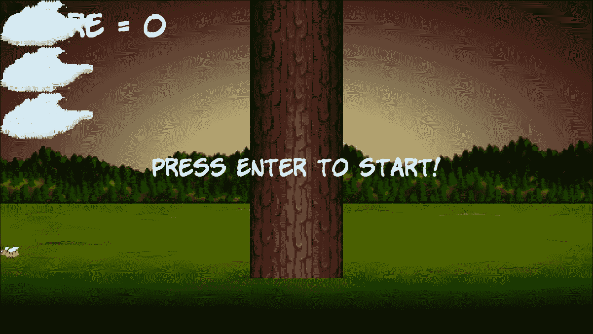
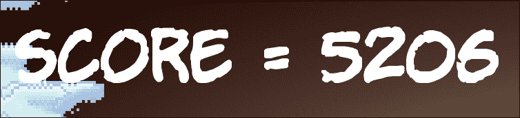
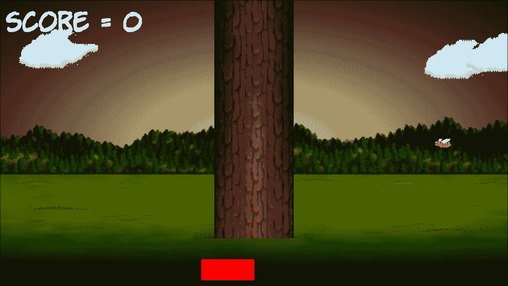
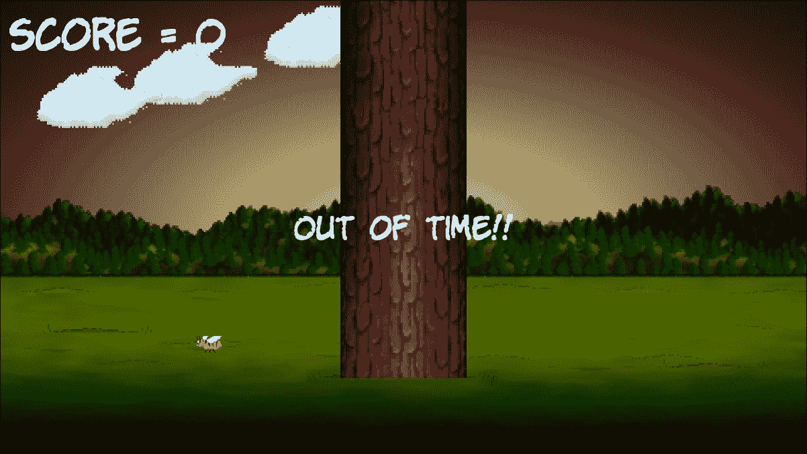

# 第三章。C++字符串，SFML 时间，玩家输入和 HUD

在本章中，我们将花大约一半的时间学习如何操作文本并在屏幕上显示它，另一半时间将用于研究时间和视觉时间条如何在游戏中制造紧迫感。

我们将涵盖以下主题：

+   暂停和重新开始游戏

+   C++字符串

+   SFML 文本和 SFML 字体类

+   为 Timber!!!添加 HUD

+   为 Timber!!!添加时间条

# 暂停和重新开始游戏

随着接下来三章的游戏进展，代码显然会变得越来越长。因此，现在似乎是一个很好的时机，考虑未来并在我们的代码中添加更多结构。我们将添加这种结构以使我们能够暂停和重新开始游戏。

我们将添加代码，以便在游戏首次运行时暂停。玩家将能够按下***Enter***键来启动游戏。然后游戏将运行，直到玩家被压扁或时间用尽。此时游戏将暂停并等待玩家按下***Enter***键，以重新开始。

让我们一步一步地设置这个。首先，在主游戏循环之外声明一个新的名为`paused`的`bool`变量，并将其初始化为`true`：

```cpp
// Variables to control time itself 
Clock clock; 

// Track whether the game is running
bool paused = true; 

while (window.isOpen()) 
{ 

   /* 
   **************************************** 
   Handle the players input 
   **************************************** 
   */ 

```

现在，每当游戏运行时，我们都有一个名为`paused`的变量，它将是`true`。

接下来，我们将添加另一个`if`语句，其中表达式将检查***Enter***键当前是否被按下。如果被按下，它将将`paused`设置为`false`。在我们其他处理键盘的代码之后添加突出显示的代码：

```cpp
/* 
**************************************** 
Handle the players input 
**************************************** 
*/ 

if (Keyboard::isKeyPressed(Keyboard::Escape)) 
{ 
   window.close(); 
} 

// Start the game
if (Keyboard::isKeyPressed(Keyboard::Return))
{   
  paused = false; 
} 

/* 
**************************************** 
Update the scene 
**************************************** 
*/ 

```

现在我们有一个名为`paused`的`bool`，它起初是`true`，但当玩家按下***Enter***键时会变为`false`。此时，我们必须使我们的游戏循环根据`paused`的当前值做出适当的响应。

这就是我们将要进行的步骤。我们将使用`if`语句包装整个更新部分的代码，包括我们在上一章中编写的用于移动蜜蜂和云的代码。

请注意，在下一段代码中，只有当`paused`不等于`true`时，`if`块才会执行。换句话说，游戏在暂停时不会移动/更新。

这正是我们想要的。仔细看看添加新的`if`语句以及相应的左花括号和右花括号`{...}`的确切位置。如果它们放错地方，事情将不会按预期工作。

添加突出显示的代码以包装代码的更新部分，密切关注下面显示的上下文。我在一些行上添加了`...`来表示隐藏的代码。显然，`...`不是真正的代码，不应该添加到游戏中。您可以通过周围未突出显示的代码来确定要放置新代码（突出显示）的位置，即开头和结尾：

```cpp
/* 
**************************************** 
Update the scene 
**************************************** 
*/ 

if (!paused)
{ 

   // Measure time 

      ... 
      ... 
      ... 

      // Has the cloud reached the right hand edge of the screen? 
      if (spriteCloud3.getPosition().x > 1920) 
      { 
         // Set it up ready to be a whole new cloud next frame 
         cloud3Active = false; 
      } 
   } 

} // End if(!paused) 

/* 
**************************************** 
Draw the scene 
**************************************** 
*/ 

```

请注意，当您放置新的`if`块的右花括号时，Visual Studio 会自动调整所有缩进，以保持代码整洁。

现在您可以运行游戏，直到按下***Enter***键之前一切都是静态的。现在可以开始为我们的游戏添加功能，只需记住当玩家死亡或时间用尽时，我们需要将`paused`设置为`true`。

在上一章中，我们初步了解了 C++字符串。我们需要更多地了解它们，以便实现玩家的 HUD。

# C++字符串

在上一章中，我们简要提到了字符串，并且了解到字符串可以包含从单个字符到整本书的字母数字数据。我们没有研究声明、初始化或操作字符串。所以现在让我们来做。

## 声明字符串

声明字符串变量很简单。我们声明类型，然后是名称：

```cpp
String levelName; 
String playerName; 

```

一旦我们声明了一个字符串，我们就可以为它赋值。

## 为字符串赋值

与常规变量一样，要为字符串赋值，我们只需放置名称，然后是赋值运算符，然后是值：

```cpp
levelName = "Dastardly Cave"; 
playerName = "John Carmack"; 

```

注意，值需要用引号括起来。与常规变量一样，我们也可以在一行中声明和赋值：

```cpp
String score = "Score = 0"; 
String message = "GAME OVER!!"; 

```

这就是我们如何改变我们的字符串变量。

## 操作字符串

我们可以使用`#include <sstream>`指令为我们的字符串提供一些额外的功能。`sstream`类使我们能够将一些字符串连接在一起。当我们这样做时，它被称为**连接**：

```cpp
String part1 = "Hello "; 
String part2 = "World"; 

sstream ss; 
ss << part1 << part2; 

// ss now holds "Hello World" 

```

除了使用`sstream`对象外，字符串变量甚至可以与不同类型的变量连接在一起。下面的代码开始揭示了字符串对我们可能非常有用：

```cpp
String scoreText = "Score = "; 
int score = 0; 

// Later in the code 
score ++; 

sstream ss; 
ss << scoreText << score; 
// ss now holds "Score = 1" 

```

### 提示

`<<`运算符是一个位运算符。然而，C++允许您编写自己的类，并在类的上下文中重写特定运算符的功能。`sstream`类已经这样做了，使`<<`运算符按照它的方式工作。复杂性被隐藏在类中。我们可以使用它的功能而不必担心它是如何工作的。如果你感到有冒险精神，你可以阅读关于运算符重载的内容：[`www.tutorialspoint.com/cplusplus/cpp_overloading.htm`](http://www.tutorialspoint.com/cplusplus/cpp_overloading.htm)。为了继续项目，你不需要更多的信息。

现在我们知道了 C++字符串的基础知识，以及我们如何使用`sstream`，我们可以看到如何使用一些 SFML 类来在屏幕上显示它们。

# SFML Text 和 Font

在我们实际添加代码到我们的游戏之前，让我们简要讨论一下`Text`和`Font`类以及一些假设的代码。

在屏幕上绘制文本的第一步是拥有一个字体。在第一章中，我们将一个字体文件添加到了项目文件夹中。现在我们可以将字体加载到 SFML `Font`对象中，准备使用。

要这样做的代码看起来像这样：

```cpp
Font font; 
font.loadFromFile("myfont.ttf"); 

```

在前面的代码中，我们首先声明了`Font`对象，然后加载了一个实际的字体文件。请注意，`myfont.ttf`是一个假设的字体，我们可以使用项目文件夹中的任何字体。

一旦我们加载了一个字体，我们就需要一个 SFML `Text`对象：

```cpp
Text myText; 

```

现在我们可以配置我们的`Text`对象。这包括大小、颜色、屏幕上的位置、包含消息的字符串，当然，将其与我们的`font`对象关联起来：

```cpp
// Assign the actual message 
myText.setString("Press Enter to start!"); 

// assign a size 
myText.setCharacterSize(75); 

// Choose a color 
myText.setFillColor(Color::White); 

// Set the font to our Text object 
myText.setFont(font); 

```

让我们给 Timber 添加一个 HUD！！！

# 添加分数和消息

现在我们已经了解了足够关于字符串、SFML `Text`和 SFML `Font`，可以开始实现 HUD 了。

我们需要做的下一件事是在代码文件的顶部添加另一个`#include`指令。正如我们所学到的，`sstream`类为将字符串和其他变量类型组合成一个字符串提供了一些非常有用的功能。

添加下面高亮代码的一行：

```cpp
#include "stdafx.h" 
#include <sstream> 
#include <SFML/Graphics.hpp> 

using namespace sf; 

int main() 
{ 

```

接下来我们将设置我们的 SFML `Text`对象。一个将包含一条消息，我们将根据游戏状态进行变化，另一个将包含分数，并且需要定期更新。

声明`Text`和`Font`对象的下一个代码加载字体，将字体分配给`Text`对象，然后添加字符串消息、颜色和大小。这应该从我们在上一节讨论中看起来很熟悉。此外，我们添加了一个名为`score`的新`int`变量，我们可以操纵它来保存玩家的分数。

### 提示

请记住，如果你在第一章中选择了不同的字体，你需要更改代码的部分以匹配你在`Visual Studio Stuff/Projects/Timber/Timber/fonts`文件夹中拥有的`.ttf`文件。

添加高亮代码，我们就可以准备好继续更新 HUD 了：

```cpp
// Track whether the game is running 
bool paused = true; 

// Draw some text
int score = 0;

sf::Text messageText;
sf::Text scoreText;

// We need to choose a font
Font font;
font.loadFromFile("fonts/KOMIKAP_.ttf");

// Set the font to our message
messageText.setFont(font);
scoreText.setFont(font);

// Assign the actual message
messageText.setString("Press Enter to start!");
scoreText.setString("Score = 0");

// Make it really big
messageText.setCharacterSize(75);
scoreText.setCharacterSize(100);

// Choose a color
messageText.setFillColor(Color::White);
scoreText.setFillColor(Color::White); 

while (window.isOpen()) 
{ 

   /* 
   **************************************** 
   Handle the players input 
   **************************************** 
   */ 

```

下面的代码可能看起来有点复杂，甚至复杂。然而，当你稍微分解一下时，它实际上非常简单。检查并添加新代码，然后我们将一起讨论：

```cpp
// Choose a color 
messageText.setFillColor(Color::White); 
scoreText.setFillColor(Color::White); 

// Position the text
FloatRect textRect = messageText.getLocalBounds();

messageText.setOrigin(textRect.left +
  textRect.width / 2.0f,
  textRect.top +
  textRect.height / 2.0f);

messageText.setPosition(1920 / 2.0f, 1080 / 2.0f);

scoreText.setPosition(20, 20); 

while (window.isOpen()) 
{ 

   /* 
   **************************************** 
   Handle the players input 
   **************************************** 
   */ 

```

我们有两个`Text`类型的对象将显示在屏幕上。我们希望将`scoreText`定位在左上角并留有一点填充。这并不困难；我们只需使用`scoreText.setPosition(20, 20)`，它就会在左上角定位，并留有 20 像素的水平和垂直填充。

然而，定位`messageText`并不那么容易。我们希望将其定位在屏幕的正中间。最初这可能看起来不是问题，但我们记得我们绘制的一切的原点都是左上角。因此，如果我们简单地将屏幕的宽度和高度除以二，并在`mesageText.setPosition...`中使用结果，那么文本的左上角将位于屏幕的中心，并且会不整齐地向右边展开。

我们需要一种方法来将`messageText`的中心设置为屏幕的中心。您刚刚添加的看起来相当恶劣的代码重新定位了`messageText`的原点到其自身的中心。为了方便起见，这里是当前讨论的代码：

```cpp
// Position the text 
FloatRect textRect = messageText.getLocalBounds(); 

messageText.setOrigin(textRect.left + 
   textRect.width / 2.0f, 
   textRect.top + 
   textRect.height / 2.0f); 

```

首先，在这段代码中，我们声明了一个名为`textRect`的新的`FloatRect`类型的对象。正如其名称所示，`FloatRect`对象保存了一个带有浮点坐标的矩形。

然后，代码使用`messageText.getLocalBounds`函数来使用`messageText`包装的矩形的坐标来初始化`textRect`。

接下来的代码行，由于它相当长，分成了四行，使用`messageText.setOrigin`函数将原点（我们绘制的点）更改为`textRect`的中心。当然，`textRect`保存了一个矩形，它完全匹配包装`messageText`的坐标。然后，执行下一行代码：

```cpp
messageText.setPosition(1920 / 2.0f,   1080 / 2.0f); 

```

现在，`messageText`将被整齐地定位在屏幕的正中间。每次更改`messageText`的文本时，我们将使用完全相同的代码，因为更改消息会改变`messageText`的大小，因此其原点需要重新计算。

接下来，我们声明了一个名为`ss`的`stringstream`类型的对象。请注意，我们使用了完整的名称，包括命名空间`std::stringstream`。我们可以通过在代码文件顶部添加`using namespace std`来避免这种语法。然而，我们没有这样做，因为我们很少使用它。看一下代码，将其添加到游戏中，然后我们可以更详细地讨论一下。由于我们只希望在游戏暂停时执行此代码，请确保将其与其他代码一起添加到`if(!paused)`块中，如下所示：

```cpp
else 
   { 

      spriteCloud3.setPosition( 
         spriteCloud3.getPosition().x + 
         (cloud3Speed * dt.asSeconds()), 
         spriteCloud3.getPosition().y); 

      // Has the cloud reached the right hand edge of the screen? 
      if (spriteCloud3.getPosition().x > 1920) 
      { 
         // Set it up ready to be a whole new cloud next frame 
         cloud3Active = false; 
      } 
   } 

 // Update the score text   
   std::stringstream ss;   
   ss << "Score = " << score;   
   scoreText.setString(ss.str()); 

}// End if(!paused) 

/* 
**************************************** 
Draw the scene 
**************************************** 
*/ 

```

我们使用`ss`和`<<`运算符提供的特殊功能，它将变量连接到`stringstream`中。因此，代码`ss << "Score = " << score`的效果是创建一个包含`"Score = "`和`score`值的字符串，它们被连接在一起。例如，当游戏刚开始时，`score`等于零，所以`ss`将保存值`"Score = 0"`。如果`score`发生变化，`ss`将在每一帧适应。

接下来的代码简单地显示/设置了`ss`中包含的字符串到`scoreText`。

```cpp
scoreText.setString(ss.str());
```

现在可以绘制到屏幕上了。

接下来的代码绘制了两个`Text`对象（`scoreText`和`messageText`），但请注意，绘制`messageText`的代码包含在一个`if`语句中。这个`if`语句导致只有在游戏暂停时才绘制`messageText`。

添加下面显示的突出代码：

```cpp
// Now draw the insect 
window.draw(spriteBee); 

// Draw the score
window.draw(scoreText);
if (paused)
{   
  // Draw our message   
  window.draw(messageText);
} 

// Show everything we just drew 
window.display(); 

```

现在我们可以运行游戏，看到我们的 HUD 绘制在屏幕上。您将看到**SCORE = 0**和 PRESS ENTER TO START!消息。当您按下***Enter***时，后者将消失。



如果您想要看到分数更新，请在`while(window.isOpen)`循环中的任何位置添加临时代码`score ++;`。如果您添加了这行临时代码，您将看到分数迅速上升，非常快！



如果您添加了临时代码`score ++;`，请务必在继续之前将其删除。

# 添加时间条

由于时间是游戏中的一个关键机制，必须让玩家意识到它。他需要知道自己被分配的六秒即将用完。这将在游戏接近结束时给他一种紧迫感，并且如果他表现得足够好以保持或增加剩余时间，他会有一种成就感。

在屏幕上绘制剩余秒数并不容易阅读（当专注于分支时），也不是实现目标的特别有趣的方式。

我们需要的是一个时间条。我们的时间条将是一个简单的红色矩形，在屏幕上显眼地展示。它将从宽度开始，但随着时间的流逝迅速缩小。当玩家剩余时间达到零时，时间条将完全消失。

同时添加时间条的同时，我们将添加必要的代码来跟踪玩家剩余的时间，并在他用完时间时做出响应。让我们一步一步地进行。

从前面的`Clock clock;`声明中添加突出显示的代码：

```cpp
// Variables to control time itself 
Clock clock; 

// Time bar
RectangleShape timeBar;
float timeBarStartWidth = 400;
float timeBarHeight = 80;
timeBar.setSize(Vector2f(timeBarStartWidth, timeBarHeight));
timeBar.setFillColor(Color::Red);
timeBar.setPosition((1920 / 2) - timeBarStartWidth / 2, 980);

Time gameTimeTotal;
float timeRemaining = 6.0f;
float timeBarWidthPerSecond = timeBarStartWidth / timeRemaining; 

// Track whether the game is running 
bool paused = true; 

```

首先，我们声明了一个`RectangleShape`类型的对象，并将其命名为`timeBar`。`RectangleShape`是一个适合绘制简单矩形的 SFML 类。

接下来，我们添加了一些`float`变量，`timeBarStartWidth`和`timeBarHeight`。我们分别将它们初始化为`400`和`80`。这些变量将帮助我们跟踪每一帧需要绘制`timeBar`的大小。

接下来，我们使用`timeBar.setSize`函数设置`timeBar`的大小。我们不只是传入我们的两个新的`float`变量。首先，我们创建一个`Vector2f`类型的新对象。然而，这里的不同之处在于，我们没有给新对象命名。我们只是用我们的两个浮点变量初始化它，并直接传递给`setSize`函数。

### 提示

`Vector2f`是一个持有两个`float`变量的类。它还有一些其他功能，将在整本书中介绍。

之后，我们使用`setFillColor`函数将`timeBar`颜色设置为红色。

我们在前面的代码中对`timeBar`做的最后一件事是设置它的位置。y 坐标非常直接，但我们设置 x 坐标的方式略微复杂。这里是计算：

```cpp
(1920 / 2) - timeBarStartWidth / 2
```

代码首先将`1920`除以`2`。然后将`timeBarStartWidth`除以`2`。最后从前者中减去后者。

结果使`timeBar`在屏幕上漂亮地水平居中。

我们要讨论的代码的最后三行声明了一个名为`gameTimeTotal`的新`Time`对象，一个名为`timeRemaining`的新`float`，它初始化为`6`，以及一个听起来奇怪的名为`timeBarWidthPerSecond`的`float`，我们将进一步讨论。

`timeBarWidthPerSecond`变量是用`timeBarStartWidth`除以`timeRemaining`初始化的。结果恰好是`timeBar`每秒需要缩小的像素数量。这在我们每一帧调整`timeBar`的大小时会很有用。

显然，我们需要在玩家开始新游戏时重置剩余时间。这样做的逻辑位置是***Enter***键按下。我们也可以同时将`score`重置为零。现在让我们通过添加这些突出显示的代码来做到这一点：

```cpp
// Start the game 
if (Keyboard::isKeyPressed(Keyboard::Return)) 
{ 
   paused = false; 

 // Reset the time and the score   
   score = 0;   
   timeRemaining = 5; 
 } 

```

现在，每一帧我们都必须减少剩余时间的数量，并相应地调整`timeBar`的大小。在更新部分添加以下突出显示的代码，如下所示：

```cpp
/* 
**************************************** 
Update the scene 
**************************************** 
*/ 
if (!paused) 
{ 
   // Measure time 
   Time dt = clock.restart(); 

 // Subtract from the amount of time remaining   
   timeRemaining -= dt.asSeconds();
   // size up the time bar
   timeBar.setSize(Vector2f(timeBarWidthPerSecond *
     timeRemaining, timeBarHeight)); 

   // Set up the bee 
   if (!beeActive) 
   { 

      // How fast is the bee 
      srand((int)time(0) * 10); 
      beeSpeed = (rand() % 200) + 200; 

      // How high is the bee 
      srand((int)time(0) * 10); 
      float height = (rand() % 1350) + 500; 
      spriteBee.setPosition(2000, height); 
      beeActive = true; 

   } 
   else 
      // Move the bee 

```

首先，我们用这段代码减去了玩家剩余的时间与上一帧执行所花费的时间：

```cpp
timeRemaining -= dt.asSeconds(); 

```

然后，我们用以下代码调整了`timeBar`的大小：

```cpp
timeBar.setSize(Vector2f(timeBarWidthPerSecond * 
      timeRemaining, timeBarHeight)); 

```

`Vector2F`的 x 值是用`timebarWidthPerSecond`乘以`timeRemaining`初始化的。这产生了与玩家剩余时间相关的正确宽度。高度保持不变，`timeBarHeight`在没有任何操作的情况下使用。

当然，我们必须检测时间是否已经用完。现在，我们将简单地检测时间是否已经用完，暂停游戏，并更改`messageText`的文本。稍后我们会在这里做更多的工作。在我们添加的先前代码之后添加突出显示的代码，我们将更详细地查看它：

```cpp
// Measure time 
Time dt = clock.restart(); 

// Subtract from the amount of time remaining 
timeRemaining -= dt.asSeconds(); 

// resize up the time bar 
timeBar.setSize(Vector2f(timeBarWidthPerSecond * 
   timeRemaining, timeBarHeight)); 

if (timeRemaining <= 0.0f) 
{   
  // Pause the game   
  paused = true;   

  // Change the message shown to the player   
  messageText.setString("Out of time!!");   

  //Reposition the text based on its new size   
  FloatRect textRect = messageText.getLocalBounds();
  messageText.setOrigin(textRect.left +     
    textRect.width / 2.0f,     
    textRect.top +     
    textRect.height / 2.0f);   

  messageText.setPosition(1920 / 2.0f, 1080 / 2.0f);
} 

// Set up the bee 
if (!beeActive) 
{ 

   // How fast is the bee 
   srand((int)time(0) * 10); 
   beeSpeed = (rand() % 200) + 200; 

   // How high is the bee 
   srand((int)time(0) * 10); 
   float height = (rand() % 1350) + 500; 
   spriteBee.setPosition(2000, height); 
   beeActive = true; 

} 
else 
   // Move the bee 

```

逐步执行先前的代码：

+   首先，我们用`if(timeRemaining <= 0.0f)`测试时间是否已经用完

+   然后我们将`paused`设置为`true`，这样我们的代码的更新部分将被执行的最后一次（直到玩家再次按***Enter***）。

+   然后我们更改`messageText`的消息，计算其新的中心以设置为其原点，并将其定位在屏幕中心。

最后，在代码的这一部分，我们需要绘制`timeBar`。在这段代码中，没有任何新的东西，我们以前见过很多次。只需注意我们在树之后绘制`timeBar`，这样它就可见。添加突出显示的代码来绘制时间条：

```cpp
// Draw the score 
window.draw(scoreText); 

// Draw the timebar
window.draw(timeBar); 

if (paused) 
{ 
   // Draw our message 
   window.draw(messageText); 
} 

// Show everything we just drew 
window.display(); 

```

现在您可以运行游戏。按***Enter***开始，并观察时间条平稳地消失到无。



游戏暂停，**时间用完了！！**消息将出现。



当然，您可以再次按***Enter***从头开始运行整个游戏。

# 常见问题解答

Q) 我可以预见，通过精灵的左上角定位有时可能会不方便。

A) 幸运的是，您可以选择使用精灵的哪个点作为定位/原点像素，就像我们使用`setOrigin`函数设置`messageText`一样。

Q) 代码变得相当长，我很难跟踪一切的位置。

A) 是的，我同意。在下一章中，我们将看到我们可以组织我们的代码的第一种方式，使其更易读。当我们学习编写 C++函数时，我们将看到这一点。此外，当我们学习关于 C++数组时，我们将学习一种处理相同类型的多个对象/变量（如云）的新方法。

# 总结

在本章中，我们学习了关于字符串、SFML `Text`和 SFML `Font`。它们使我们能够在屏幕上绘制文本，为玩家提供了 HUD。我们还使用了`sstream`，它允许我们连接字符串和其他变量来显示分数。

我们探索了 SFML `RectangleShape`类，它正是其名称所暗示的。我们使用了`RectangleShape`类型的对象和一些精心计划的变量来绘制一个时间条，直观地显示玩家剩余的时间。一旦我们实现了砍树和移动的树枝可以压扁玩家，时间条将产生紧张感和紧迫感。

接下来，我们将学习一系列新的 C++特性，包括循环、数组、切换、枚举和函数。这将使我们能够移动树枝，跟踪它们的位置，并压扁玩家。
