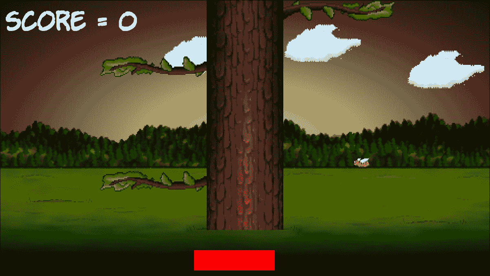

# 第四章：循环，数组，开关，枚举和函数-实现游戏机制

本章可能包含的 C++信息比书中的任何其他章节都要多。它充满了将极大地推动我们的理解的基本概念。它还将开始阐明我们一直略微忽略的一些模糊领域，例如函数和游戏循环。

一旦我们探索了整个 C++语言必需品清单，然后我们将利用我们所知道的一切来使主要游戏机制-树枝移动。在本章结束时，我们将准备进入最后阶段并完成《伐木者》。

我们将研究以下主题：

+   循环

+   数组

+   使用开关进行决策

+   枚举

+   开始使用函数

+   创建和移动树枝

# 循环

在编程中，我们经常需要做同样的事情超过一次。到目前为止，我们看到的明显例子是我们的游戏循环。在剥离所有代码的情况下，我们的游戏循环看起来像这样：

```cpp
while (window.isOpen()) 
{      

} 

```

有几种不同类型的循环，我们将看看最常用的。这种类型的循环的正确术语是`while`循环。

## while 循环

`while`循环非常简单。回想一下`if`语句及其表达式，这些表达式评估为`true`或`false`。我们可以在`while`循环的条件表达式中使用相同的运算符和变量的组合。

与`if`语句一样，如果表达式为`true`，则代码执行。然而，与`while`循环相比，C++代码将继续执行，直到条件为`false`。看看这段代码：

```cpp
int numberOfZombies = 100; 

while(numberOfZombies > 0) 
{ 
   // Player kills a zombie 
   numberOfZombies--; 

   // numberOfZombies decreases each pass through the loop 
} 

// numberOfZOmbies is no longer greater than 0 

```

这是以前的代码中发生的事情。在`while`循环之外，声明并初始化`int numberOfZombies`为`100`。然后`while`循环开始。它的条件表达式是`numberOfZombies > 0`。因此，`while`循环将继续循环执行其主体中的代码，直到条件评估为`false`。这意味着上面的代码将执行 100 次。

在循环的第一次通过中，`numberOfZombies`等于 100，然后等于 99，然后等于 98，依此类推。但一旦`numberOfZOmbies`等于零，当然不再大于零。然后代码将跳出`while`循环并继续运行，在闭合大括号之后。

就像`if`语句一样，`while`循环可能不会执行一次。看看这个：

```cpp
int availableCoins = 10; 

while(availableCoins > 10) 
{ 
   // more code here. 
   // Won't run unless availableCoins is greater than 10 
} 

```

此外，表达式的复杂性或可以放入循环主体的代码量没有限制。考虑游戏循环的这种假设变体：

```cpp
int playerLives = 3; 
int alienShips = 10; 

while(playerLives !=0 && alienShips !=0 ) 
{ 
   // Handle input 
   // Update the scene 
   // Draw the scene 
} 

// continue here when either playerLives or alienShips equals 0 

```

以前的`while`循环将继续执行，直到`playerLives`或`alienShips`之一等于零。一旦发生其中一个条件，表达式将评估为`false`，程序将从`while`循环之后的第一行代码继续执行。

值得注意的是，一旦进入循环的主体，即使表达式在中途评估为`false`，它也将至少完成一次，因为在代码尝试开始另一个传递之前不会再次测试。例如：

```cpp
int x = 1; 

while(x > 0) 
{ 
   x--; 
   // x is now 0 so the condition is false 
   // But this line still runs 
   // and this one 
   // and me! 
} 

// Now I'm done! 

```

以前的循环体将执行一次。我们还可以设置一个永远运行的`while`循环，毫不奇怪地称为**无限循环**。这是一个例子：

```cpp
int y = 0; 

while(true) 
{ 
   y++; // Bigger... Bigger... 
} 

```

如果您觉得上面的循环令人困惑，只需字面理解。当条件为`true`时，循环执行。嗯，`true`总是`true`，因此将继续执行。

### 跳出 while 循环

我们可能会使用无限循环，以便我们可以决定何时从循环中退出，而不是在表达式中。当我们准备离开循环主体时，我们将使用`break`关键字来做到这一点。也许会像这样：

```cpp
int z = 0; 

while(true) 
{ 
   z++; // Bigger... Bigger... 
 break; // No you're not 

   // Code doesn't reach here 
} 

```

你可能也能猜到，我们可以在 `while` 循环和其他循环类型中结合使用任何 C++ 决策工具，比如 `if`、`else`，以及我们即将学习的 `switch`。考虑这个例子：

```cpp
int x = 0; 
int max = 10; 

while(true) 
{ 
   x++; // Bigger... Bigger... 

 if(x == max)
   {     
     break;   
   } // No you're not 

   // code reaches here only until x = 10 
} 

```

我们可以花很长时间来研究 C++ `while` 循环的各种排列，但在某个时候我们想要回到制作游戏。所以让我们继续前进，看看另一种类型的循环。

## for 循环

`for` 循环的语法比 `while` 循环稍微复杂一些，因为它需要三个部分来设置。先看看代码，然后我们将把它分解开来：

```cpp
for(int x = 0; x < 100; x ++) 
{ 
   // Something that needs to happen 100 times goes here 
} 

```

这是 `for` 循环条件的所有部分的作用。

`for(`声明和初始化`;` 条件`;` 每次迭代前更改`)`

为了进一步澄清，这里有一个表格来解释前面 `for` 循环例子中的所有三个关键部分。

| **部分** | **描述** |
| --- | --- |
| 声明和初始化 | 我们创建一个新的 `int` 变量 `i`，并将其初始化为 0 |
| 条件 | 就像其他循环一样，它指的是必须为循环执行的条件 |
| 循环通过每次迭代后更改 | 在这个例子中，`x ++` 表示每次迭代时 `x` 增加/递增 1 |

我们可以改变 `for` 循环来做更多的事情。下面是另一个简单的例子，从 10 开始倒数：

```cpp
for(int i = 10; i > 0; i--) 
{ 
   // countdown 
} 

// blast off 

```

`for` 循环控制初始化、条件评估和控制变量。我们将在本章后面在我们的游戏中使用 `for` 循环。

# 数组

如果一个变量是一个可以存储特定类型值的盒子，比如 `int`、`float` 或 `char`，那么我们可以把数组看作是一整行盒子。盒子的行可以是几乎任何大小和类型，包括类的对象。然而，所有的盒子必须是相同的类型。

### 提示

在最终项目中，一旦我们学习了更高级的 C++，就可以规避在每个盒子中使用相同类型的限制。

这个数组听起来可能对我们在第二章中的云有用：*变量、运算符和决策 - 动画精灵*。那么我们如何创建和使用数组呢？

## 声明一个数组

我们可以这样声明一个 `int` 类型变量的数组：

```cpp
int someInts[10]; 

```

现在我们有一个名为 `someInts` 的数组，可以存储十个 `int` 值。然而，目前它是空的。

## 初始化数组的元素

为了向数组的元素添加值，我们可以使用我们已经熟悉的类型的语法，结合一些新的语法，称为**数组表示法**。在下面的代码中，我们将值 `99` 存储到数组的第一个元素中：

```cpp
someInts[0] = 99; 

```

要在第二个元素中存储值 `999`，我们写下这段代码：

```cpp
someInts[1] = 999; 

```

我们可以将值 `3` 存储在最后一个元素中，如下所示：

```cpp
someInts[9] = 3; 

```

请注意，数组的元素始终从零开始，直到数组大小减 1。与普通变量类似，我们可以操作数组中存储的值。唯一的区别是我们会使用数组表示法来做到这一点，因为虽然我们的数组有一个名字 `someInts`，但是单独的元素没有名字。

在下面的代码中，我们将第一个和第二个元素相加，并将答案存储在第三个元素中：

```cpp
someInts[2] = someInts[0] + someInts[1]; 

```

数组也可以与常规变量无缝交互，比如下面的例子：

```cpp
int a = 9999; 
someInts[4] = a; 

```

### 快速初始化数组的元素

我们可以快速地向元素添加值，比如这个使用 `float` 数组的例子：

```cpp
float myFloatingPointArray[3] {3.14f, 1.63f, 99.0f}; 

```

现在值 `3.14`，`1.63` 和 `99.0` 分别存储在第一、第二和第三位置。请记住，使用数组表示法访问这些值时，我们将使用 [0]、[1] 和 [2]。

还有其他方法来初始化数组的元素。这个稍微抽象的例子展示了使用 `for` 循环将值 0 到 9 放入 `uselessArray` 数组中：

```cpp
for(int i = 0; i < 10; i++) 
{ 
   uselessArray[i] = i; 
} 

```

该代码假设 `uslessArray` 之前已经被初始化为至少包含 `10` 个 `int` 变量。

## 那么这些数组对我们的游戏到底有什么作用呢？

我们可以在任何常规变量可以使用的地方使用数组。例如，它们可以在表达式中使用，如下所示：

```cpp
// someArray[] is declared and initialized with 9999 values

for(int i = 0; i < 9999; i++) 
{ 
   // Do something with each entry in the array 
} 

```

数组在游戏代码中的最大好处可能是在本节开始时暗示的。数组可以保存对象（类的实例）。假设我们有一个`Zombie`类，并且我们想要存储大量的`Zombie`。我们可以像在这个假设的例子中那样做：

```cpp
Zombie horde [5] {zombie1, zombie2, zombie3}; // etc... 

```

`horde`数组现在保存了大量`Zombie`类的实例。每个实例都是一个独立的、活着的（有点），呼吸着的、自主决定的`Zombie`对象。然后我们可以循环遍历`horde`数组，在游戏循环的每一次通过中，移动僵尸，检查它们的头是否被斧头砍中，或者它们是否设法抓住了玩家。

如果当时我们知道数组，它们将非常适合处理我们的云。我们可以拥有任意数量的云，并且编写的代码比我们为我们的三朵微不足道的云所做的要少。

### 提示

要查看完整的改进的云代码，并且看它实际运行，可以查看下载包中《伐木工》（代码和可玩游戏）的增强版本。或者您可以在查看代码之前尝试使用数组实现云。

了解所有这些数组内容的最佳方法是看它们的实际应用。当我们实现我们的树枝时，我们将会看到它们的应用。

现在我们将保留我们的云代码，以便尽快回到游戏中添加功能。但首先让我们再看一下使用`switch`进行更多 C++决策的内容。

# 使用`switch`做决策

我们已经看到了`if`，它允许我们根据表达式的结果来决定是否执行一段代码块。有时，在 C++中做决定可能有其他更好的方法。

当我们必须基于一系列可能的结果做出决定时，其中不涉及复杂的组合或广泛的数值范围，通常情况下会使用`switch`。我们可以在以下代码中看到`switch`决策的开始：

```cpp
switch(expression) 
{ 

   // More code here 
} 

```

在前面的例子中，`expression`可以是一个实际的表达式或一个变量。然后，在花括号内，我们可以根据表达式的结果或变量的值做出决定。我们可以使用`case`和`break`关键字来实现这一点：

```cpp
case x: 
    //code to for x 
    break; 

case y: 
    //code for y 
    break; 

```

在前面的抽象例子中，您可以看到，每个`case`表示一个可能的结果，每个`break`表示该`case`的结束以及执行离开`switch`块的地方。

我们还可以选择使用`default`关键字而不带值，以便在没有任何`case`语句评估为`true`时运行一些代码。以下是一个例子：

```cpp
default: // Look no value 
    // Do something here if no other case statements are true 
    break; 

```

作为`switch`的最后一个不太抽象的例子，考虑一个复古的文本冒险游戏，玩家输入一个字母，比如`'n'`、`'e'`、`'s'`或`'w'`来向北、东、南或西移动。`switch`块可以用来处理玩家的每个可能的输入，就像我们在这个例子中看到的那样：

```cpp
// get input from user in a char called command 

switch(command){ 

   case 'n': 
      // Handle move here 
      break; 

   case 'e': 
      // Handle move here 
      break; 

   case 's': 
      // Handle move here 
      break; 

   case 'w': 
      // Handle move here 
      break;    

   // more possible cases 

   default: 
      // Ask the player to try again 
      break; 

} 

```

了解我们学到的关于`switch`的一切最好的方法是将它与我们正在学习的所有其他新概念一起应用。

# 类枚举

枚举是逻辑集合中所有可能值的列表。C++枚举是列举事物的好方法。例如，如果我们的游戏使用的变量只能在特定范围的值中，而且这些值在逻辑上可以形成一个集合或一组，那么枚举可能是合适的。它们将使您的代码更清晰，更不容易出错。

在 C++中声明类枚举，我们使用两个关键字`enum`和`class`，然后是枚举的名称，然后是枚举可以包含的值，用一对花括号`{...}`括起来。

例如，检查这个枚举声明。请注意，按照惯例，将枚举的可能值全部大写声明是常见的。

```cpp
enum class zombieTypes {REGULAR, RUNNER, CRAWLER, SPITTER, BLOATER }; 

```

注意，此时我们还没有声明任何`zombieType`的实例，只是类型本身。如果这听起来有点奇怪，可以这样想：SFML 创建了`Sprite`、`RectangleShape`和`RenderWindow`类，但要使用这些类中的任何一个，我们必须声明一个对象/实例。

此时我们已经创建了一个名为`zombieTypes`的新类型，但我们还没有它的实例。所以现在让我们创建它们：

```cpp
zombieType dave = zombieTypes::CRAWLER; 
zombieType angela = zombieTypes::SPITTER 
zombieType jose = zombieTypes::BLOATER 

/* 
   Zombies are fictional creatures and any resemblance 
   to real people is entirely coincidental 
*/ 

```

接下来是对我们即将添加到 Timber!!!中的代码类型的 sneak preview。我们将想要跟踪树的哪一侧有分支或玩家，因此我们将声明一个名为`side`的枚举，如以下示例所示：

```cpp
enum class side { LEFT, RIGHT, NONE }; 

```

我们可以将玩家定位在左侧，如下所示：

```cpp
// The player starts on the left 
side playerSide = side::LEFT; 

```

我们可以使分支位置数组的第四级（数组从零开始）根本没有分支，如下所示：

```cpp
branchPositions[3] = side::NONE; 

```

我们也可以在表达式中使用枚举：

```cpp
if(branchPositions[5] == playerSide) 
{ 
   // The lowest branch is the same side as the player 
   // SQUISHED!! 
} 

```

我们将再看一个重要的 C++主题，然后我们将回到编写游戏的代码。

# 开始使用函数

那么 C++函数到底是什么？函数是一组变量、表达式和**控制流语句**（循环和分支）。事实上，我们迄今为止在书中学到的任何代码都可以在函数中使用。我们编写的函数的第一部分称为**签名**。以下是一个示例函数签名：

```cpp
public void bombPlayer(int power, int direction) 

```

如果我们添加一对大括号`{...}`，里面包含一些函数实际执行的代码，那么我们就有了一个完整的函数，一个定义：

```cpp
void shootLazers(int power, int direction) 
{ 
    // ZAPP! 
} 

```

然后我们可以在代码的其他部分使用我们的新函数，如下所示：

```cpp
// Attack the player 
bombPlayer(50, 180) // Run the code in the function 
//  I'm back again - code continues here after the function ends 

```

当我们使用一个函数时，我们说我们**调用**它。在我们调用`bombPlayer`的地方，我们的程序的执行分支到该函数中包含的代码。函数将运行直到达到结尾或被告知`return`。然后代码将从函数调用后的第一行继续运行。我们已经在使用 SFML 提供的函数。这里不同的是，我们将学习编写和调用我们自己的函数。

这是另一个函数的例子，包括使函数返回到调用它的代码的代码：

```cpp
int addAToB(int a, int b) 
{ 
   int answer = a + b; 
   return answer; 
} 

```

调用上述函数的方式可能如下所示：

```cpp
int myAnswer = addAToB(2, 4); 

```

显然，我们不需要编写函数来将两个变量相加，但这个例子帮助我们更深入地了解函数的工作原理。首先我们传入值`2`和`4`。在函数签名中，值`2`被赋给`int a`，值`4`被赋给`int b`。

在函数体内，变量`a`和`b`相加并用于初始化新变量`int answer`。行`return answer;`就是这样。它将存储在`answer`中的值返回给调用代码，导致`myAnswer`被初始化为值`6`。

请注意，上面示例中的每个函数签名都有所不同。之所以如此，是因为 C++函数签名非常灵活，允许我们构建我们需要的函数。

函数签名的确切方式定义了函数必须如何被调用以及函数必须如何返回值，这值得进一步讨论。让我们给该签名的每个部分命名，这样我们就可以将其分解成部分并学习它们。

以下是一个函数签名，其各部分由其正式的技术术语描述：

```cpp
return type | name of function | (parameters)
```

以下是我们可以用于每个部分的一些示例：

+   **返回类型**：`bool`、`float`、`int` 等，或任何 C++类型或表达式

+   **函数名称**：`bombPlayer`, `shootLazers`, `setCoordinates`, `addAToB` 等等

+   **参数**：`(int number, bool hitDetected)`, `(int x, int y)` `(float a, float b)`

现在让我们依次看看每个部分。

## 函数返回类型

返回类型，顾名思义，是从函数返回到调用代码的值的类型：

```cpp
int addAToB(int a, int b)
{
    int answer = a + b; 
    return answer; 
} 

```

在我们稍微沉闷但有用的`addAtoB`示例中，签名中的返回类型是`int`。函数`addAToB`将一个值返回给调用它的代码，这个值将适合在一个`int`变量中。返回类型可以是我们到目前为止看到的任何 C++类型，或者是我们还没有看到的类型之一。

然而，函数不一定要返回一个值。在这种情况下，签名必须使用`void`关键字作为返回类型。当使用`void`关键字时，函数体不得尝试返回一个值，否则将导致错误。但是，它可以使用没有值的`return`关键字。以下是一些返回类型和`return`关键字的组合：

```cpp
void doWhatever()
{ 

    // our code 
    // I'm done going back to calling code here 
    // no return is necessary 

} 

```

另一个可能性如下：

```cpp
void doSomethigCool()
{ 

   // our code 

   // I can do this as long as I don't try and add a value 
   return; 
} 

```

以下代码给出了更多可能的函数示例。一定要阅读注释以及代码：

```cpp
void doYetAnotherThing()
{ 
   // some code 

   if(someCondition)
   { 

      // if someCondition is true returning to calling code 
      // before the end of the function body 
      return; 
   } 

   // More code that might or might not get executed 

   return; 

   // As I'm at the bottom of the function body 
   // and the return type is void, I'm 
   // really not necessary but I suppose I make it 
   // clear that the function is over. 
 } 

bool detectCollision(Ship a, Ship b)
{ 

   // Detect if collision has occurred 
   if(collision) 
   { 
      // Bam!!! 
      return true; 
   } 
   else 
   { 
      // Missed 
      return false; 
   } 

} 

```

上面的最后一个函数示例`detectCollision`是我们 C++代码即将到来的一个预览，并且演示了我们也可以将用户定义的类型，称为**对象**，传递到函数中对它们进行计算。

我们可以像这样依次调用上面的每个函数：

```cpp
// OK time to call some functions 
doWhatever(); 
doSomethingCool(); 
doYetAnotherThing(); 

if (detectCollision(milleniumFalcon, lukesXWing)) 
{ 
   // The jedi are doomed! 
   // But there is always Leia. 
   // Unless she was on the Falcon? 
} 
else 
{ 
   // Live to fight another day 
} 

//continue with code from here 

```

不要担心关于`detectCollision`函数的奇怪语法，我们很快就会看到像这样的真实代码。简单地说，我们将使用返回值（`true`或`false`）作为表达式，直接在`if`语句中。

## 函数名称

函数名称，当我们设计自己的函数时，可以是几乎任何东西。但最好使用单词，通常是动词，来清楚地解释函数将要做什么。例如，看看这个函数：

```cpp
void functionaroonieboonie(int blibbityblob, float floppyfloatything) 
{ 
   //code here 
} 

```

上面的示例是完全合法的，并且可以工作，但是下面的函数名称更加清晰：

```cpp
void doSomeVerySpecificTask() 
{ 
   //code here 
} 

void getMySpaceShipHealth() 
{ 
   //code here 
} 

void startNewGame() 
{ 
   //code here 
} 

```

接下来，让我们更仔细地看一下如何与函数共享一些值。

## 函数参数

我们知道函数可以将结果返回给调用代码。如果我们需要与函数共享一些来自调用代码的数据值呢？**参数**允许我们与函数共享值。实际上，我们在查看返回类型时已经看到了参数的示例。我们将更仔细地看一下相同的示例：

```cpp
int addAToB(int a, int b) 
{ 

   int answer = a + b; 
   return answer; 

} 

```

在上面的示例中，参数是`int a`和`int b`。请注意，在函数主体的第一行中，我们使用`a + b`，就好像它们已经声明和初始化了变量一样。那是因为它们确实是。函数签名中的参数是它们的声明，调用函数的代码初始化它们。

### 提示

**重要的行话说明**

请注意，我们在函数签名括号`(int a, int b)`中引用的变量被称为参数。当我们从调用代码中将值传递到函数中时，这些值被称为参数。当参数到达时，它们被称为参数，并用于初始化真正可用的变量：`int returnedAnswer = addAToB(10,5);`

此外，正如我们在先前的示例中部分看到的，我们不必只在参数中使用`int`。我们可以使用任何 C++类型。我们还可以使用尽可能少的参数列表来解决我们的问题，但是将参数列表保持短并且易于管理是一个很好的做法。

正如我们将在未来的章节中看到的，我们已经在这个入门教程中留下了一些更酷的函数用法，这样我们就可以在进一步学习函数主题之前学习相关的 C++概念。

## 函数主体

主体部分是我们一直在避免的部分，比如：

```cpp
// code here 
// some code 

```

但实际上，我们已经完全知道在这里该做什么！到目前为止，我们学到的任何 C++代码都可以在函数体中工作。

## 函数原型

我们已经看到了如何编写函数，也看到了如何调用函数。然而，我们还需要做一件事才能使它们工作。所有函数都必须有一个**原型**。原型是使编译器意识到我们的函数的东西；没有原型，整个游戏将无法编译。幸运的是，原型很简单。

我们可以简单地重复函数的签名，后面跟一个分号。但是要注意的是，原型必须出现在任何尝试调用或定义函数之前。因此，一个完全可用的函数的最简单示例如下。仔细看看注释以及函数的不同部分在代码中的位置：

```cpp
// The prototype 
// Notice the semicolon 
int addAToB(int a, int b); 

int main() 
{ 

   // Call the function 
   // Store the result in answer 
   int answer = addAToB(2,2); 

   // Called before the definition 
   // but that's OK because of the prototype 

   // Exit main 
   return 0; 

}// End of main 

// The function definition 
int addAToB(int a, int b) 
{ 
    return a + b; 
} 

```

前面的代码演示了以下内容：

+   原型在`main`函数之前

+   使用函数的调用，正如我们可能期望的那样，位于`main`函数内部

+   定义在`main`函数之后/外部

### 注意

请注意，当定义出现在函数使用之前时，我们可以省略函数原型直接进入定义。然而，随着我们的代码变得越来越长并且跨越多个文件，这几乎永远不会发生。我们将一直使用单独的原型和定义。

让我们看看如何保持我们的函数有组织性。

## 组织函数

值得指出的是，如果我们有多个函数，特别是如果它们相当长，我们的`.cpp`文件很快就会变得难以控制。这违背了函数的意图。我们将在下一个项目中看到的解决方案是，我们可以将所有函数原型添加到我们自己的头文件（`.hpp`或`.h`）中。然后我们可以在另一个`.cpp`文件中编写所有函数的代码，然后在我们的主`.cpp`文件中简单地添加另一个`#include...`指令。通过这种方式，我们可以使用任意数量的函数，而不需要将它们的任何代码（原型或定义）添加到我们的主代码文件中。

## 函数陷阱！

我们应该讨论的另一点是**作用域**。如果我们在函数中声明一个变量，无论是直接声明还是作为参数之一，那么该变量在函数外部是不可用/可见的。此外，函数外部声明的任何变量在函数内部也是看不到/使用不了的。

我们应该通过参数/参数和返回值在函数代码和调用代码之间共享值。

当一个变量不可用，因为它来自另一个函数，就说它是不在作用域内。当它可用和可用时，就说它在作用域内。

### 注意

实际上，在 C++中，只有在块内声明的变量才在该块内有效！这包括循环和`if`块。在`main`的顶部声明的变量在`main`中的任何地方都是有效的。在游戏循环中声明的变量只在游戏循环内有效，依此类推。在函数或其他块中声明的变量称为**局部**变量。我们写的代码越多，这一点就越有意义。每当我们在代码中遇到作用域问题时，我都会讨论一下，以澄清事情。在下一节中将会出现这样的问题。还有一些 C++的基本知识，会让这个问题变得更加明显。它们被称为**引用**和**指针**，我们将在第七章中学习：C++ *引用、精灵表和顶点数组*和第八章中学习：*指针、标准模板库和纹理管理*。

## 函数的最终话-暂时

关于函数，我们还有很多东西可以学习，但我们已经了解足够的知识来实现游戏的下一部分。如果所有技术术语，如参数、签名和定义等等，还没有完全理解，不要担心。当我们开始使用它们时，概念会变得更清晰。

## 函数的终极最后一句话-暂时

你可能已经注意到，我们一直在调用函数，特别是 SFML 函数，通过在函数名之前附加对象的名称和一个句号，如下例所示：

```cpp
spriteBee.setPosition... 
window.draw... 
// etc 

```

然而，我们对函数的整个讨论都是在没有任何对象的情况下调用函数。我们可以将函数编写为类的一部分，也可以将其编写为独立的函数。当我们将函数编写为类的一部分时，我们需要该类的对象来调用函数，而当我们有一个独立的函数时，我们不需要。

我们将在一分钟内编写一个独立的函数，并且我们将在第六章中编写以函数开头的类：*面向对象编程、类和 SFML 视图*。到目前为止，我们对函数的所有了解在这两种情况下都是相关的。

# 生长树枝

接下来，正如我在过去大约十七页中一直承诺的那样，我们将使用所有新的 C++技术来绘制和移动树上的一些树枝。

将此代码添加到`main`函数之外。为了绝对清楚，我的意思是在代码`int main()`之前：

```cpp
#include "stdafx.h" 
#include <sstream> 
#include <SFML/Graphics.hpp> 

using namespace sf; 

// Function declaration
void updateBranches(int seed);

const int NUM_BRANCHES = 6;
Sprite branches[NUM_BRANCHES];

// Where is the player/branch?
// Left or Right
enum class side { LEFT, RIGHT, NONE };
side branchPositions[NUM_BRANCHES]; 

int main() 
{ 

```

我们刚刚用新代码实现了很多事情：

+   首先，我们为一个名为`updateBranches`的函数声明了一个函数原型。我们可以看到它不返回值（`void`），并且它接受一个名为`seed`的`int`参数。我们将很快编写函数定义，然后我们将看到它确切地做了什么。

+   接下来，我们声明了一个名为`NUM_BRANCHES`的常量`int`，并将其初始化为`6`。树上将有六个移动的树枝，很快我们将看到`NUM_BRANCHES`对我们有多有用。

+   接下来，我们声明了一个名为`branches`的`Sprite`对象数组，可以容纳六个精灵。

+   之后，我们声明了一个名为`side`的新枚举，有三个可能的值，`LEFT`、`RIGHT`和`NONE`。这将用于描述个别树枝的位置，以及在我们的代码中的一些地方描述玩家的位置。

+   最后，在之前的新代码中，我们初始化了一个`side`类型的数组，大小为`NUM_BRANCHES`（6）。为了清楚地说明这实现了什么；我们将有一个名为`branchPositions`的数组，其中包含六个值。这些值中的每一个都是`side`类型，可以是`LEFT`、`RIGHT`或`NONE`。

### 注意

当然，你真正想知道的是为什么常量、两个数组和枚举被声明在`main`函数之外。通过在`main`之上声明它们，它们现在具有**全局范围**。或者，换句话说，常量、两个数组和枚举在整个游戏中都有范围。这意味着我们可以在`main`函数和`updateBranches`函数中的任何地方访问和使用它们。请注意，将所有变量尽可能地局部化到实际使用它们的地方是一个好的做法。将所有东西都变成全局变量可能看起来很有用，但这会导致难以阅读和容易出错的代码。

## 准备树枝

现在我们将准备好我们的六个`Sprite`对象，并将它们加载到`branches`数组中。在我们的游戏循环之前添加以下突出显示的代码：

```cpp
// Position the text 
FloatRect textRect = messageText.getLocalBounds(); 
messageText.setOrigin(textRect.left + 
   textRect.width / 2.0f, 
   textRect.top + 
   textRect.height / 2.0f); 

messageText.setPosition(1920 / 2.0f, 1080 / 2.0f); 

scoreText.setPosition(20, 20); 

// Prepare 6 branches
Texture textureBranch;
textureBranch.loadFromFile("graphics/branch.png");

// Set the texture for each branch sprite
for (int i = 0; i < NUM_BRANCHES; i++) 
{   
  branches[i].setTexture(textureBranch);   
  branches[i].setPosition(-2000, -2000);   
  // Set the sprite's origin to dead center   
  // We can then spin it round without changing its position 
  branches[i].setOrigin(220, 20);
} 

while (window.isOpen()) 
{ 

```

之前的代码没有使用任何新概念。首先，我们声明了一个 SFML `Texture`对象，并将`branch.png`图形加载到其中。

接下来，我们创建一个`for`循环，将`i`设置为零，并在每次循环通过时递增`i`，直到`i`不再小于`NUM_BRANCHES`。这是完全正确的，因为`NUM_BRANCHES`是 6，而`branches`数组的位置是 0 到 5。

在`for`循环中，我们使用`setTexture`为`branches`数组中的每个`Sprite`设置`Texture`，然后用`setPosition`将其隐藏在屏幕外。

最后，我们使用`setOrigin`将原点（绘制时所在的点）设置为精灵的中心。很快，我们将旋转这些精灵，并且将原点设置在中心意味着它们将很好地围绕旋转，而不会使精灵移出位置。

## 每帧更新树枝精灵

在下面的代码中，我们根据`branchPositions`数组中的位置和相应的`branchPositions`数组中的`side`的值，设置`branches`数组中所有精灵的位置。添加高亮代码并尝试理解它，然后我们可以详细讨论一下：

```cpp
   // Update the score text 
   std::stringstream ss; 
   ss << "Score: " << score; 
   scoreText.setString(ss.str()); 

 // update the branch sprites   
   for (int i = 0; i < NUM_BRANCHES; i++)   
   {     
     float height = i * 150;     
     if (branchPositions[i] == side::LEFT)     
     {        
       // Move the sprite to the left side        
       branches[i].setPosition(610, height);

       // Flip the sprite round the other way        
       branches[i].setRotation(180);     
     }

     else if (branchPositions[i] == side::RIGHT)     
     {        
       // Move the sprite to the right side        
       branches[i].setPosition(1330, height);    

       // Set the sprite rotation to normal        
       branches[i].setRotation(0);     
     }     
     else     
     {        
       // Hide the branch        
       branches[i].setPosition(3000, height);     
     }   
   } 
} // End if(!paused) 

/* 
**************************************** 
Draw the scene 
**************************************** 

```

我们刚刚添加的代码是一个大的`for`循环，将`i`设置为零，每次通过循环递增`i`，并持续进行，直到`i`不再小于 6。

在`for`循环内，设置了一个名为`height`的新的`float`变量，其值为`i * 150`。这意味着第一个树枝的高度为 0，第二个为 150，第六个为 750。

接下来是一系列`if`和`else`块的结构。看一下剥离了代码的结构：

```cpp
if() 
{ 
} 
else if() 
{ 
} 
else 
{ 
} 

```

第一个`if`使用`branchPositions`数组来查看当前树枝是否应该在左边。如果是的话，它会将`branches`数组中的相应`Sprite`设置为屏幕上适合左边（610 像素）和当前`height`的位置。然后它将精灵翻转`180`度，因为`branch.png`图形默认向右悬挂。

`else if`只有在树枝不在左边时才执行。它使用相同的方法来查看它是否在右边。如果是的话，树枝就会被绘制在右边（1330 像素）。然后将精灵旋转为 0 度，以防它之前是 180 度。如果 x 坐标看起来有点奇怪，只需记住我们将树枝精灵的原点设置为它们的中心。

最后的`else`假设，正确地，当前的`branchPosition`必须是`NONE`，并将树枝隐藏在屏幕外的`3000`像素处。

此时，我们的树枝已经就位，准备绘制。

## 绘制树枝

在这里，我们使用另一个`for`循环，从 0 到 5 遍历整个`branches`数组，并绘制每个树枝精灵。添加以下高亮代码：

```cpp
// Draw the clouds 
window.draw(spriteCloud1); 
window.draw(spriteCloud2); 
window.draw(spriteCloud3); 

// Draw the branches
for (int i = 0; i < NUM_BRANCHES; i++) 
{   
  window.draw(branches[i]);
} 

// Draw the tree 
window.draw(spriteTree); 

```

当然，我们还没有编写实际移动所有树枝的函数。一旦我们编写了该函数，我们还需要解决何时以及如何调用它的问题。让我们解决第一个问题并编写该函数。

## 移动树枝

我们已经在`main`函数上面添加了函数原型。现在我们编写实际的函数定义，该函数将在每次调用时将所有树枝向下移动一个位置。我们将这个函数分为两部分编写，以便更容易地检查发生了什么。

在`main`函数的右花括号后添加`updateBranches`函数的第一部分：

```cpp
// Function definition 
void updateBranches(int seed) 
{ 
   // Move all the branches down one place 
   for (int j = NUM_BRANCHES-1; j > 0; j--) 
   {    
      branchPositions[j] = branchPositions[j - 1]; 
   } 
} 

```

在函数的第一部分中，我们只是将所有的树枝向下移动一个位置，一次一个，从第六个树枝开始。这是通过使`for`循环从 5 计数到 0 来实现的。代码`branchPositions[j] = branchPositions[j - 1];`实现了实际的移动。

在前面的代码中，另一件需要注意的事情是，当我们将位置 4 的树枝移动到位置 5，然后将位置 3 的树枝移动到位置 4，依此类推，我们需要在位置 0 添加一个新的树枝，这是树的顶部。

现在我们可以在树的顶部生成一个新的树枝。添加高亮代码，然后我们将讨论它：

```cpp
// Function definition 
void updateBranches(int seed) 
{ 
   // Move all the branches down one place 
   for (int j = NUM_BRANCHES-1; j > 0; j--) 
   {    
      branchPositions[j] = branchPositions[j - 1]; 
   } 

 // Spawn a new branch at position 0   
   // LEFT, RIGHT or NONE   
   srand((int)time(0)+seed);   
   int r = (rand() % 5);   
   switch (r) 
   {   
   case 0:     
     branchPositions[0] = side::LEFT;     
     break;   

   case 1:     
     branchPositions[0] = side::RIGHT;     
     break;   

   default:     
     branchPositions[0] = side::NONE;     
     break;  
    } 
} 

```

在`updateBranches`函数的最后部分，我们使用传入函数调用的整数`seed`变量。我们这样做是为了确保随机数`seed`始终不同，并且我们将在下一章中看到这个值是如何得到的。

接下来，我们生成一个介于零和四之间的随机数，并将结果存储在`int`变量`r`中。现在我们使用`r`作为表达式进行`switch`。

`case`语句意味着，如果`r`等于零，那么我们在树的顶部左侧添加一个新的分支。如果`r`等于 1，那么分支就在右侧。如果`r`是其他任何值（2、3 或 4），那么`default`确保在顶部不会添加任何分支。左、右和无的平衡使得树看起来很真实，游戏运行得相当不错。你可以很容易地改变代码，使分支更频繁或更少。

即使为我们的分支编写了所有这些代码，我们仍然无法在游戏中看到任何一个分支。这是因为在我们实际调用`updateBranches`之前，我们还有更多的工作要做。

如果你现在真的想看到一个分支，你可以添加一些临时代码，并在游戏循环之前调用该函数五次，每次使用一个独特的种子：

```cpp
updateBranches(1);
updateBranches(2);
updateBranches(3);
updateBranches(4);
updateBranches(5); 

while (window.isOpen()) 
{ 

```

现在你可以看到分支在它们的位置上。但是如果分支实际上要移动，我们需要定期调用`updateBranches`。



### 提示

在继续之前不要忘记删除临时代码。

现在我们可以把注意力转向玩家，并真正调用`updateBranches`函数。

# FAQ

Q) 你提到了几种类型的 C++循环。

A) 是的，看一下这个`do...while`循环的教程和解释：

[`www.tutorialspoint.com/cplusplus/cpp_do_while_loop.htm`](http://www.tutorialspoint.com/cplusplus/cpp_do_while_loop.htm)

Q) 我可以假设我是数组的专家吗？

A) 就像本书中的许多主题一样，总是有更多的东西可以学习。你已经了解足够的关于数组的知识来继续，但如果你还想了解更多，请查看这个更详细的数组教程：[`www.cplusplus.com/doc/tutorial/arrays/`](http://www.cplusplus.com/doc/tutorial/arrays/)。

Q) 我可以假设我是函数的专家吗？

A) 就像本书中的许多主题一样，总是有更多的东西可以学习。你已经了解足够的关于函数的知识来继续，但如果想了解更多，请查看这个教程：[`www.cplusplus.com/doc/tutorial/functions/`](http://www.cplusplus.com/doc/tutorial/functions/)。

# 总结

虽然这不是最长的一章，但可能是我们涵盖最多 C++知识的一章。我们研究了不同类型的循环，比如`for`和`while`循环。我们学习了处理大量变量和对象的数组，而不费吹灰之力。我们还学习了枚举和`switch`。也许这一章最重要的概念是允许我们组织和抽象游戏代码的函数。随着书的继续，我们将在更多地方深入研究函数。

现在我们有一个完全可用的树，我们可以在这个项目的最后一章中完成游戏。
