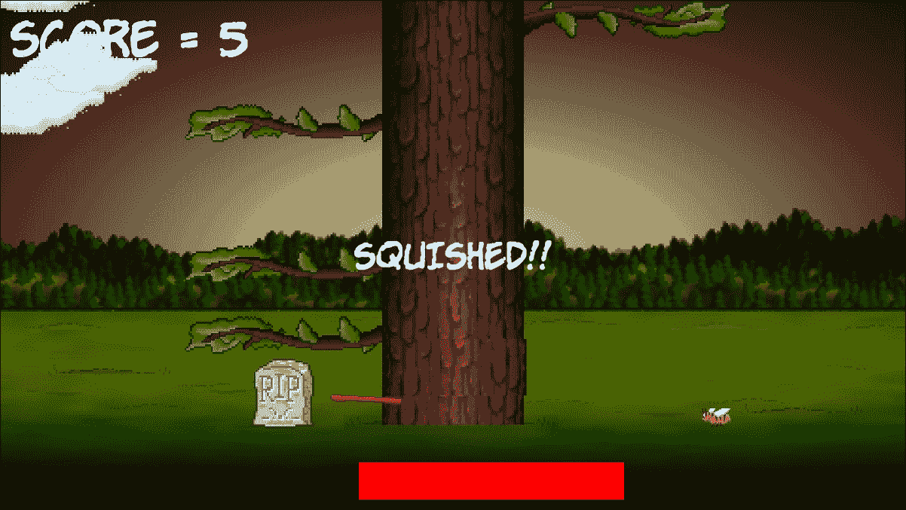

# 第五章。碰撞、声音和结束条件-使游戏可玩

这是第一个项目的最后阶段。在本章结束时，您将拥有您的第一个完成的游戏。一旦您运行了 Timber！！！，一定要阅读本章的最后一节，因为它将提出改进游戏的建议。我们将讨论以下主题：

+   添加其余的精灵

+   处理玩家输入

+   动画飞行原木

+   处理死亡

+   添加音效

+   添加功能并改进 Timber！！！

# 准备玩家（和其他精灵）

让我们同时为玩家的精灵添加代码，以及一些更多的精灵和纹理。这下面的相当大的代码块还为玩家被压扁时添加了一个墓碑精灵，一个用来砍伐的斧头精灵，以及一个可以在玩家砍伐时飞走的原木精灵。

请注意，在`spritePlayer`对象之后，我们还声明了一个`side`变量`playerSide`，以跟踪玩家当前站立的位置。此外，我们为`spriteLog`对象添加了一些额外的变量，包括`logSpeedX`、`logSpeedY`和`logActive`，用于存储原木的移动速度以及它当前是否在移动。`spriteAxe`还有两个相关的`float`常量变量，用于记住左右两侧的理想像素位置。

像以前那样，在`while(window.isOpen())`代码之前添加下一个代码块。请注意，下一个清单中的所有代码都是新的，而不仅仅是突出显示的代码。我没有为下一个代码块提供任何额外的上下文，因为`while(window.isOpen())`应该很容易识别。突出显示的代码是我们刚刚讨论过的代码。

在`while(window.isOpen())`行之前添加整个代码，并在脑海中记住我们简要讨论过的突出显示的行。这将使本章其余的代码更容易理解：

```cpp
// Prepare the player 
Texture texturePlayer; 
texturePlayer.loadFromFile("graphics/player.png"); 
Sprite spritePlayer; 
spritePlayer.setTexture(texturePlayer); 
spritePlayer.setPosition(580, 720); 

// The player starts on the left 
side playerSide = side::LEFT; 

// Prepare the gravestone 
Texture textureRIP; 
textureRIP.loadFromFile("graphics/rip.png"); 
Sprite spriteRIP; 
spriteRIP.setTexture(textureRIP); 
spriteRIP.setPosition(600, 860); 

// Prepare the axe 
Texture textureAxe; 
textureAxe.loadFromFile("graphics/axe.png"); 
Sprite spriteAxe; 
spriteAxe.setTexture(textureAxe); 
spriteAxe.setPosition(700, 830); 

// Line the axe up with the tree 
const float AXE_POSITION_LEFT = 700; 
const float AXE_POSITION_RIGHT = 1075; 

// Prepare the flying log 
Texture textureLog; 
textureLog.loadFromFile("graphics/log.png"); 
Sprite spriteLog; 
spriteLog.setTexture(textureLog); 
spriteLog.setPosition(810, 720); 

// Some other useful log related variables 
bool logActive = false; 
float logSpeedX = 1000; 
float logSpeedY = -1500; 

```

现在我们可以绘制所有新的精灵。

# 绘制玩家和其他精灵

在我们添加移动玩家和使用所有新精灵的代码之前，让我们先绘制它们。这样，当我们添加代码来更新/改变/移动精灵时，我们将能够看到发生了什么。

添加突出显示的代码以绘制四个新的精灵：

```cpp
// Draw the tree 
window.draw(spriteTree); 

// Draw the player 
window.draw(spritePlayer); 

// Draw the axe 
window.draw(spriteAxe); 

// Draraw the flying log 
window.draw(spriteLog); 

// Draw the gravestone 
window.draw(spriteRIP); 

// Draw the bee 
window.draw(spriteBee); 

```

运行游戏，你会看到我们在场景中的新精灵。


我们现在离一个可运行的游戏非常接近了。

# 处理玩家的输入

许多不同的事情取决于玩家的移动，比如何时显示斧头，何时开始动画原木，以及何时将所有的树枝移动到一个地方。因此，为玩家砍伐设置键盘处理是有意义的。一旦完成这一点，我们就可以将刚才提到的所有功能放入代码的同一部分。

让我们思考一下我们如何检测键盘按键。在每一帧中，我们测试特定的键盘键当前是否被按下。如果是，我们就采取行动。如果按下***Esc***键，我们退出游戏，或者如果按下***Enter***键，我们重新开始游戏。到目前为止，这对我们的需求已经足够了。

然而，当我们尝试处理砍树时，这种方法存在问题。这个问题一直存在，只是直到现在才变得重要。根据您的 PC 有多强大，游戏循环可能每秒执行数千次。在游戏循环中每次按下键时，都会检测到并执行相关代码。

实际上，每次按下***Enter***重新开始游戏时，您很可能会重新开始游戏超过一百次。这是因为即使是最短暂的按键按下也会持续相当长的时间。您可以通过运行游戏并按住***Enter***键来验证这一点。请注意，时间条不会移动。这是因为游戏一遍又一遍地重新启动，每秒甚至数千次。

如果我们不对玩家的砍伐采取不同的方法，那么只需一次尝试的砍伐就会在短短的时间内将整棵树砍倒。我们需要更加复杂一些。我们将允许玩家进行砍伐，然后在他这样做时禁用检测按键的代码。然后我们将检测玩家何时从按键上移开手指，然后重新启用按键检测。以下是清晰列出的步骤：

1.  等待玩家使用左右箭头键砍伐木头。

1.  当玩家砍伐时，禁用按键检测。

1.  等待玩家从按键上移开手指。

1.  重新启用砍伐检测。

1.  从步骤 1 重复。

这可能听起来很复杂，但借助 SFML 的帮助，这将非常简单。让我们现在一步一步地实现这个。

添加代码中的突出显示行，声明一个`bool`变量和`acceptInput`，用于确定何时监听砍伐动作和何时忽略它们：

```cpp
float logSpeedX = 1000; 
float logSpeedY = -1500; 

// Control the player input 
bool acceptInput = false; 

while (window.isOpen()) 
{ 

```

现在我们已经设置好了布尔值，可以继续下一步了。

## 处理设置新游戏

现在我们准备处理砍伐，将突出显示的代码添加到开始新游戏的`if`块中：

```cpp
/* 
**************************************** 
Handle the players input 
**************************************** 
*/ 

if (Keyboard::isKeyPressed(Keyboard::Escape)) 
{ 
  window.close(); 
} 

// Start the game 
if (Keyboard::isKeyPressed(Keyboard::Return)) 
{ 
  paused = false; 

  // Reset the time and the score 
  score = 0; 
  timeRemaining = 6; 

  // Make all the branches disappear 
  for (int i = 1; i < NUM_BRANCHES; i++) 
  { 
    branchPositions[i] = side::NONE; 
  } 

  // Make sure the gravestone is hidden 
  spriteRIP.setPosition(675, 2000); 

  // Move the player into position 
  spritePlayer.setPosition(580, 720); 

  acceptInput = true;  
} 

/* 
**************************************** 
Update the scene 
**************************************** 
*/ 

```

在之前的代码中，我们使用`for`循环将树设置为没有分支。这对玩家是公平的，因为如果游戏从他的头顶上方开始，那将被认为是不公平的。然后我们简单地将墓碑移出屏幕，玩家移动到左侧的起始位置。这个新代码的最后一件事是将`acceptInput`设置为`true`。我们现在准备好接收砍伐按键了。

## 检测玩家的砍伐

现在我们可以准备处理左右方向键的按下。添加这个简单的`if`块，只有当`acceptInput`为`true`时才执行：

```cpp
// Start the game 
if (Keyboard::isKeyPressed(Keyboard::Return)) 
{ 
  paused = false; 

  // Reset the time and the score 
  score = 0; 
  timeRemaining = 5; 

  // Make all the branches disappear 
  for (int i = 1; i < NUM_BRANCHES; i++) 
  { 
    branchPositions[i] = side::NONE; 
  } 

  // Make sure the gravestone is hidden 
  spriteRIP.setPosition(675, 2000); 

  // Move the player into position 
  spritePlayer.setPosition(675, 660); 

  acceptInput = true; 

} 

// Wrap the player controls to 
// Make sure we are accepting input 
if (acceptInput) 
{ 
  // More code here next... 
} 

/* 
**************************************** 
Update the scene 
**************************************** 
*/ 

```

现在，在我们刚刚编写的`if`块中，添加突出显示的代码来处理玩家在键盘上按下右箭头键（**→**）时发生的情况：

```cpp
// Wrap the player controls to 
// Make sure we are accepting input 
if (acceptInput) 
{ 
  // More code here next... 

  // First handle pressing the right cursor key 
  if (Keyboard::isKeyPressed(Keyboard::Right)) 
  { 
    // Make sure the player is on the right 
    playerSide = side::RIGHT; 

    score ++; 

    // Add to the amount of time remaining 
    timeRemaining += (2 / score) + .15; 

    spriteAxe.setPosition(AXE_POSITION_RIGHT, 
      spriteAxe.getPosition().y); 

    spritePlayer.setPosition(1200, 720); 

    // update the branches 
    updateBranches(score); 

    // set the log flying to the left 
    spriteLog.setPosition(810, 720); 
    logSpeedX = -5000; 
    logActive = true; 

    acceptInput = false; 
  } 

  // Handle the left cursor key 
} 

```

在上面的代码中发生了很多事情，让我们逐步进行。首先，我们检测玩家是否在树的右侧砍伐。如果是，我们将`playerSide`设置为`side::RIGHT`。我们将在代码的后面对`playerSide`的值做出响应。

然后我们用`score ++`将分数加 1。下一行代码有点神秘，但实际上我们只是增加了剩余时间的数量。我们正在奖励玩家采取行动。然而，对于玩家来说，问题在于分数越高，增加的时间就越少。您可以通过调整这个公式来使游戏变得更容易或更难。

然后，斧头移动到右侧位置，使用`spriteAxe.setPosition`，玩家精灵也移动到右侧位置。

接下来，我们调用`updateBranches`将所有的分支向下移动一个位置，并在树的顶部生成一个新的随机分支（或空格）。

然后，`spriteLog`移动到起始位置，伪装成树，它的`speedX`变量设置为负数，这样它就会向左飞去。此外，`logActive`设置为`true`，这样我们即将编写的移动木头的代码就会在每一帧中使木头动起来。

最后，`acceptInput`被设置为`false`。此时，玩家无法再进行砍伐。我们已经解决了按键被频繁检测的问题，很快我们将看到如何重新启用砍伐。

现在，在我们刚刚编写的`if(acceptInput)`块内，添加突出显示的代码来处理玩家在键盘上按下左箭头键（**←**）时发生的情况：

```cpp
  // Handle the left cursor key 

  if (Keyboard::isKeyPressed(Keyboard::Left)) 
  { 
    // Make sure the player is on the left 
    playerSide = side::LEFT; 

    score++; 

    // Add to the amount of time remaining 
    timeRemaining += (2 / score) + .15; 

    spriteAxe.setPosition(AXE_POSITION_LEFT, 
      spriteAxe.getPosition().y); 

    spritePlayer.setPosition(580, 720); 

    // update the branches 
    updateBranches(score); 

    // set the log flying 
    spriteLog.setPosition(810, 720); 
    logSpeedX = 5000; 
    logActive = true; 

    acceptInput = false; 
  } 

} 

```

前面的代码与处理右侧砍伐的代码完全相同，只是精灵的位置不同，并且`logSpeedX`变量设置为正值，使得木头向右飞去。

## 检测按键释放

为了使上述代码在第一次砍伐之后继续工作，我们需要检测玩家何时释放键，并将`acceptInput`设置回`true`。

这与我们迄今为止看到的按键处理略有不同。SFML 有两种不同的方式来检测玩家的键盘输入。我们已经看到了第一种方式。它是动态和瞬时的，正是我们需要立即对按键做出响应的。

下面的代码使用了另一种方法。*输入*下一个突出显示的代码到`处理玩家输入`部分的顶部，然后我们将逐步讲解它：

```cpp
/* 
**************************************** 
Handle the players input 
**************************************** 
*/ 

Event event; 

while (window.pollEvent(event)) 
{ 
  if (event.type == Event::KeyReleased && !paused) 
  { 
    // Listen for key presses again 
    acceptInput = true; 

    // hide the axe 
    spriteAxe.setPosition(2000, 
      spriteAxe.getPosition().y); 
  } 
} 

if (Keyboard::isKeyPressed(Keyboard::Escape)) 
{ 
  window.close(); 
} 

```

首先，我们声明了一个名为`event`的`Event`类型的对象。然后我们调用`window.pollEvent`函数，传入我们的新对象`event`。`pollEvent`函数将数据放入`event`对象中，描述了操作系统事件。这可能是按键、释放键、鼠标移动、鼠标点击、游戏控制器动作或发生在窗口本身的事件（例如调整大小等）。

我们将代码包装在`while`循环中的原因是因为队列中可能存储了许多事件。`window.pollEvent`函数将这些事件一个接一个地加载到`event`中。我们将在循环中的每次通过中看到当前事件，如果我们感兴趣，就会做出响应。当`window.pollEvent`返回`false`时，这意味着队列中没有更多事件，`while`循环将退出。

当释放一个键并且游戏没有暂停时，这个`if`条件（`event.type == Event::KeyReleased && !paused`）为`true`。

在`if`块中，我们将`acceptInput`设置回`true`，并将斧头精灵隐藏在屏幕外。

现在您可以运行游戏，惊叹于移动的树木、摆动的斧头和动画的玩家。然而，它不会压扁玩家，砍伐时木头也需要移动。

## 动画砍伐的木头和斧头

当玩家砍木头时，`logActive`被设置为`true`，因此我们可以将一些代码包装在一个块中，只有当`logActive`为`true`时才执行。此外，每次砍木头都会将`logSpeedX`设置为正数或负数，因此木头准备好朝着正确的方向飞离树。

在我们更新分支精灵之后，添加下面突出显示的代码：

```cpp
  // update the branch sprites 
  for (int i = 0; i < NUM_BRANCHES; i++) 
  { 

    float height = i * 150; 

    if (branchPositions[i] == side::LEFT) 
    { 
      // Move the sprite to the left side 
      branches[i].setPosition(610, height); 

      // Flip the sprite round the other way 
      branches[i].setRotation(180); 
    } 
    else if (branchPositions[i] == side::RIGHT) 
    { 
      // Move the sprite to the right side 
      branches[i].setPosition(1330, height); 

      // Flip the sprite round the other way 
      branches[i].setRotation(0); 

    } 
    else 
    { 
      // Hide the branch 
      branches[i].setPosition(3000, height); 
    } 
  } 

  // Handle a flying log         
  if (logActive) 
  { 

    spriteLog.setPosition( 
      spriteLog.getPosition().x +  
      (logSpeedX * dt.asSeconds()), 

    spriteLog.getPosition().y +  
      (logSpeedY * dt.asSeconds())); 

    // Has the log reached the right hand edge? 
    if (spriteLog.getPosition().x < -100 || 
      spriteLog.getPosition().x > 2000) 
    { 
      // Set it up ready to be a whole new log next frame 
      logActive = false; 
      spriteLog.setPosition(810, 720); 
    } 
  } 

} // End if(!paused) 

/* 
**************************************** 
Draw the scene 
**************************************** 
*/ 

```

代码通过使用`getPosition`获取精灵的当前 x 和 y 位置，然后分别使用`logSpeedX`和`logSpeedY`乘以`dt.asSeconds`加到其上，来设置精灵的位置。

在每一帧中移动木头精灵后，代码使用`if`块来查看精灵是否已经从左侧或右侧消失在视野中。如果是，木头就会移回到起点，准备下一次砍伐。

如果您运行游戏，您将能够看到木头飞向屏幕的适当一侧。


现在是一个更敏感的话题。

# 处理死亡

每个游戏都必须以不好的方式结束，要么是玩家时间用完（这已经处理过了），要么是被分支压扁。

检测玩家被压扁非常简单。我们只想知道`branchPositions`数组中的最后一个分支是否等于`playerSide`。如果是，玩家就死了。

添加检测这一点的突出代码，然后我们将讨论玩家被压扁时的所有操作：

```cpp
  // Handle a flying log         
  if (logActive) 
  { 

    spriteLog.setPosition( 
      spriteLog.getPosition().x + (logSpeedX * dt.asSeconds()),
        spriteLog.getPosition().y + (logSpeedY * dt.asSeconds())); 

    // Has the log reached the right hand edge? 
    if (spriteLog.getPosition().x < -100 || 
      spriteLog.getPosition().x > 2000) 
    { 
      // Set it up ready to be a whole new cloud next frame 
      logActive = false; 
      spriteLog.setPosition(800, 600); 
    } 
  } 

  // Has the player been squished by a branch? 
  if (branchPositions[5] == playerSide) 
  { 
    // death 
    paused = true; 
    acceptInput = false; 

    // Draw the gravestone 
    spriteRIP.setPosition(525, 760); 

    // hide the player 
    spritePlayer.setPosition(2000, 660); 

    // Change the text of the message 
    messageText.setString("SQUISHED!!"); 

    // Center it on the screen 
    FloatRect textRect = messageText.getLocalBounds(); 

    messageText.setOrigin(textRect.left + 
      textRect.width / 2.0f, 
      textRect.top + textRect.height / 2.0f); 

    messageText.setPosition(1920 / 2.0f, 
      1080 / 2.0f); 

  } 

} // End if(!paused) 

/* 
**************************************** 
Draw the scene 
**************************************** 
*/ 

```

在玩家死亡后，代码的第一件事是将`paused`设置为`true`。现在循环将完成这一帧，并且在玩家开始新游戏之前不会再次运行循环的更新部分。

然后我们将墓碑移动到靠近玩家站立的位置，并将玩家精灵隐藏在屏幕外。

我们将`messageText`的字符串设置为`"SQUISHED !!"`，然后使用通常的技术将其居中显示在屏幕上。

现在您可以运行游戏并真正玩它。这张图片显示了玩家的最终得分和他的墓碑，以及**SQUISHED**消息。



还有一个问题。只是我吗，还是有点安静？

# 简单的声音效果

我们将添加三种声音。每种声音都将在特定的游戏事件上播放。每当玩家砍伐时播放简单的重击声音，当玩家时间用尽时播放沮丧的失败声音，当玩家被压扁致死时播放复古的压碎声音。

## SFML 声音是如何工作的？

SFML 使用两种不同的类来播放声音效果。第一个类是`SoundBuffer`类。这个类保存了来自声音文件的实际音频数据。它是`SoundBuffer`负责将`.wav`文件加载到 PC 的 RAM 中，以一种无需进一步解码工作即可播放的格式。

一会儿，当我们为声音效果编写代码时，我们将看到，一旦我们有了一个包含我们声音的`SoundBuffer`对象，我们将创建另一个类型为`Sound`的对象。然后，我们可以将这个`Sound`对象与`SoundBuffer`对象关联起来。然后，在我们的代码中适当的时刻，我们将能够调用适当`Sound`对象的`play`函数。

## 何时播放声音

很快我们将看到，加载和播放声音的 C++代码真的很简单。然而，我们需要考虑的是何时调用`play`函数。我们的代码中何处将调用`play`函数？以下是我们想要实现的一些功能：

+   砍伐声音可以从按下左右光标键时调用

+   死亡声音可以从检测到树木将玩家搅碎的`if`块中播放

+   时间用尽的声音可以从检测到`timeRemaining`小于零的`if`块中播放

现在我们可以编写我们的声音代码。

## 添加声音代码

首先，我们添加另一个`#include`指令，以使 SFML 与声音相关的类可用。添加下面突出显示的代码：

```cpp
#include "stdafx.h" 
#include <sstream> 
#include <SFML/Graphics.hpp> 
#include <SFML/Audio.hpp>

using namespace sf; 

```

现在我们声明三个不同的`SoundBuffer`对象，将三个不同的声音文件加载到它们中，并将三个不同的`Sound`对象与相关的`SoundBuffer`对象关联起来。添加下面突出显示的代码：

```cpp
// Control the player input 
bool acceptInput = false; 

// Prepare the sound 
SoundBuffer chopBuffer; 
chopBuffer.loadFromFile("sound/chop.wav"); 
Sound chop; 
chop.setBuffer(chopBuffer); 

SoundBuffer deathBuffer; 
deathBuffer.loadFromFile("sound/death.wav"); 
Sound death; 
death.setBuffer(deathBuffer); 

// Out of time 
SoundBuffer ootBuffer; 
ootBuffer.loadFromFile("sound/out_of_time.wav"); 
Sound outOfTime; 
outOfTime.setBuffer(ootBuffer); 

while (window.isOpen()) 
{ 

```

现在我们可以播放我们的第一个声音效果。在检测到玩家按下左光标键的`if`块旁边添加如下一行代码：

```cpp
// Wrap the player controls to 
// Make sure we are accepting input 
if (acceptInput) 
{ 
  // More code here next... 

  // First handle pressing the right cursor key 
  if (Keyboard::isKeyPressed(Keyboard::Right)) 
  { 
    // Make sure the player is on the right 
    playerSide = side::RIGHT; 

    score++; 

    timeRemaining += (2 / score) + .15; 

    spriteAxe.setPosition(AXE_POSITION_RIGHT, 
      spriteAxe.getPosition().y); 

    spritePlayer.setPosition(1120, 660); 

    // update the branches 
    updateBranches(score); 

    // set the log flying to the left 
    spriteLog.setPosition(800, 600); 
    logSpeedX = -5000; 
    logActive = true; 

    acceptInput = false; 

    // Play a chop sound 
    chop.play(); 
  } 

```

### 提示

在下一个以`if (Keyboard::isKeyPressed(Keyboard::Left))`开头的代码块的末尾添加完全相同的代码，以使玩家在树的左侧砍伐时发出砍伐声音。

找到处理玩家时间用尽的代码，并添加下一个突出显示的代码，以播放与时间相关的音效：

```cpp
if (timeRemaining <= 0.f) { 
  // Pause the game 
  paused = true; 

  // Change the message shown to the player 
  messageText.setString("Out of time!!"); 

  //Reposition the text based on its new size 
  FloatRect textRect = messageText.getLocalBounds(); 
  messageText.setOrigin(textRect.left + 
    textRect.width / 2.0f, 
    textRect.top + 
    textRect.height / 2.0f); 

  messageText.setPosition(1920 / 2.0f, 1080 / 2.0f); 

  // Play the out of time sound 
  outOfTime.play(); 

} 

```

最后，当玩家被压扁时播放死亡声音，将下面突出显示的代码添加到执行当底部树枝与玩家同侧时的`if`块中：

```cpp
// has the player been squished by a branch? 
if (branchPositions[5] == playerSide) 
{ 
  // death 
  paused = true; 
  acceptInput = false; 

  // Draw the gravestone 
  spriteRIP.setPosition(675, 660); 

  // hide the player 
  spritePlayer.setPosition(2000, 660); 

  messageText.setString("SQUISHED!!"); 
  FloatRect textRect = messageText.getLocalBounds(); 

  messageText.setOrigin(textRect.left + 
    textRect.width / 2.0f, 
    textRect.top + textRect.height / 2.0f); 

  messageText.setPosition(1920 / 2.0f, 1080 / 2.0f); 

  // Play the death sound 
  death.play();
} 

```

就是这样！我们已经完成了第一个游戏。在我们继续进行第二个项目之前，让我们讨论一些可能的增强功能。

# 改进游戏和代码

看看 Timber!!!项目的这些建议的增强功能。您可以在下载包的`Runnable`文件夹中看到增强功能的效果：

1.  **加快代码速度**：我们的代码中有一部分正在减慢我们的游戏。对于这个简单的游戏来说无所谓，但我们可以通过将`sstream`代码放在仅偶尔执行的块中来加快速度。毕竟，我们不需要每秒更新得分数百次！

1.  **调试控制台**：让我们添加一些文本，以便我们可以看到当前的帧速率。与得分一样，我们不需要经常更新这个。每一百帧更新一次就足够了。

1.  **在背景中添加更多的树**：只需添加一些更多的树精灵并将它们绘制在看起来不错的位置（你可以在相机附近放一些，远一些）。

1.  **改善 HUD 文本的可见性**：我们可以在分数和 FPS 计数器后面绘制简单的`RectangleShape`对象；黑色并带有一些透明度看起来会很好。

1.  **使云代码更有效率**：正如我们已经提到过几次的，我们可以利用我们对数组的知识使云代码变得更短。

看看游戏中额外的树、云和文本的透明背景。


要查看这些增强的代码，请查看下载包中的“伐木工增强版”文件夹。

# 常见问题

Q）我承认，对于云的数组解决方案更有效率。但是我们真的需要三个单独的数组吗，一个用于活动，一个用于速度，一个用于精灵本身吗？

A）如果我们查看各种对象的属性/变量，例如`Sprite`对象，我们会发现它们很多。精灵有位置、颜色、大小、旋转等等。但如果它们有`active`、`speed`，甚至更多的话就更完美了。问题在于 SFML 的程序员不可能预测我们将如何使用他们的`Sprite`类。幸运的是，我们可以制作自己的类。我们可以制作一个名为`Cloud`的类，其中有一个布尔值用于`active`和一个整数用于速度。我们甚至可以给我们的`Cloud`类一个 SFML 的`Sprite`对象。然后我们甚至可以进一步简化我们的云代码。我们将在下一章中设计我们自己的类。

# 总结

在本章中，我们为《伐木工》游戏添加了最后的修饰和图形。如果在读这本书之前，你从未编写过一行 C++代码，那么你可以为自己鼓掌。在短短的五章中，你已经从零基础到一个可运行的游戏。

然而，我们不会为自己的成就而沾沾自喜太久，因为在下一章中，我们将直接转向一些稍微更复杂和更全面的 C++，这可以用来构建更复杂和更全面的游戏。
