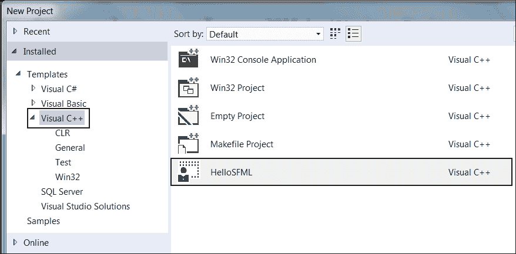

# 第六章。面向对象编程，类和 SFML 视图

这是本书最长的章节。有相当多的理论，但这些理论将使我们有能力开始有效地使用面向对象编程（OOP）。此外，我们不会浪费时间来将理论付诸实践。在探索 C++ OOP 之前，我们将了解并计划我们的下一个游戏项目。

以下是我们将在接下来的章节中要做的事情：

+   规划“僵尸竞技场”游戏

+   学习面向对象编程和类

+   编写`Player`类

+   了解 SFML 的`View`类

+   构建僵尸竞技场游戏引擎

+   让`Player`类开始工作

# 规划和开始僵尸竞技场游戏

此时，如果你还没有的话，我建议你去观看《超过 9000 只僵尸》（[`store.steampowered.com/app/273500/`](http://store.steampowered.com/app/273500/)）和《血色之地》（[`store.steampowered.com/app/262830/`](http://store.steampowered.com/app/262830/)）的视频。

我们的游戏显然不会像这两个示例那样深入或先进，但我们将拥有相同的基本功能和游戏机制：

+   显示一些细节的“HUD”，比如得分、最高分、弹夹中的子弹、剩余子弹、玩家生命和剩余待杀僵尸数

+   玩家将在疯狂逃离僵尸的同时射击它们

+   在使用鼠标瞄准枪支的同时，使用 W、A、S 和 D 键在滚动世界中移动

+   在每个级别之间，选择一个会影响游戏成功方式的“升级”。

+   收集“拾取物”以恢复生命和弹药

+   每一波都会带来更多的僵尸和更大的竞技场

将有三种类型的僵尸需要消灭。它们将具有不同的属性，如外观、生命和速度。我们将称它们为追逐者、膨胀者和爬行者。看一下游戏的注释截图，看看一些功能的运作以及组成游戏的组件和资源：


以下是关于每个编号点的更多信息：

1.  得分和最高分。这些与 HUD 的其他部分一起将在一个称为“视图”的单独图层中绘制。最高分将被保存并加载到文件中。

1.  这是一个将在竞技场周围建造墙壁的纹理。这个纹理包含在一个称为“精灵表”的单个图形中，还有其他背景纹理（3、5 和 6）。

1.  精灵表中的两个泥浆纹理之一。

1.  这是一个“弹药拾取物”。玩家获得这个拾取物后将获得更多弹药。还有一个“生命拾取物”。玩家可以选择在僵尸波之间升级这些拾取物。

1.  精灵表中的草纹理。

1.  精灵表中的第二个泥浆纹理。

1.  曾经有僵尸的地方现在是一滩血迹。

1.  HUD 的底部部分。从左到右依次是代表弹药的图标、弹夹中的子弹数量、备用子弹数量、生命条、当前僵尸波数以及本波剩余僵尸数量。

1.  玩家角色。

1.  玩家用鼠标瞄准的准星。

1.  一个移动缓慢但力量强大的膨胀僵尸

1.  一个移动速度稍快但较弱的爬行僵尸。还有一个追逐者僵尸，速度非常快但很弱。不幸的是，在它们被全部杀死之前，我没能在截图中找到一个。

我们有很多事情要做，还有新的 C++技能要学习。让我们从创建一个新项目开始。

## 从模板创建项目

现在创建一个新项目非常容易。只需在 Visual Studio 中按照这些简单的步骤进行：

1.  从主菜单中选择“文件”|“新建项目”。

1.  确保在左侧菜单中选择了“Visual C++”，然后从所呈现的选项列表中选择“HelloSFML”。下一张图片应该能清楚地说明这一点：

1.  在**名称：**字段中，键入`ZombieArena`，并确保**为解决方案创建目录**选项已被选中。现在点击**确定**。

1.  现在我们需要将 SFML 的`.dll`文件复制到主项目目录中。我的主项目目录是`D:\Visual Studio Stuff\Projects\ZombieArena\ZombieArena`。这个文件夹是由 Visual Studio 在上一步中创建的。如果您将`Projects`文件夹放在其他地方，请在那里执行此步骤。我们需要复制到`Projects`文件夹中的文件位于您的`SFML\bin`文件夹中。为每个位置打开一个窗口，并突出显示所需的`.dll`文件。

现在将突出显示的文件复制并粘贴到项目中。项目现在已经设置好，准备好了。

## 项目资产

该项目中的资产比以前的游戏更多样化和丰富。资产包括：

+   屏幕上的字体

+   不同动作的音效，如射击、装弹或被僵尸击中。

游戏所需的角色、僵尸、背景和声音的所有图形都包含在下载包中。它们分别可以在`第六章/图形`和`第六章/声音`文件夹中找到。

所需的字体尚未提供。这是因为我想避免任何关于许可证的可能歧义。不过这不会造成问题，因为我将向您展示确切的位置和方式来选择和下载字体。

虽然我将提供资产本身或获取它们的信息，但您可能希望自己创建和获取它们。

## 探索资产

图形资产构成了我们的僵尸竞技场游戏场景的一部分。看一下图形资产，应该清楚我们的游戏中它们将被用在哪里：


然而，可能不太明显的是`background_sheet.png`，其中包含四个不同的图像。这是我之前提到的精灵表，我们将看到如何使用它来节省内存并提高游戏速度，详见第七章，*C++参考、精灵表和顶点数组*。

声音文件都是`.wav`格式。这些文件包含了我们在游戏中的某些事件中播放的音效。它们是：

+   `hit.wav`：僵尸与玩家接触时播放的声音

+   `pickup.wav`：玩家触摸（收集）健康提升（拾取）时播放的声音

+   `powerup.wav`：玩家在每波僵尸之间选择增加属性（power-up）时播放的声音

+   `reload.wav`：令玩家知道他们已装入新弹药的满意点击声

+   `reload_failed.wav`：指示未能装入新子弹的不太令人满意的声音

+   `shoot.wav`：射击声音

+   `splat.wav`：像僵尸被子弹击中的声音

## 将资产添加到项目中

一旦您决定使用哪些资产，就该是将它们添加到项目中的时候了。下面的说明将假定您正在使用本书下载包中提供的所有资产。如果您使用自己的资产，只需用您自己的适当的声音或图形文件替换本书中使用的完全相同的文件名即可：

1.  浏览到`D:\Visual Studio Stuff\Projects\ZombieArena\ZombieArena`。

1.  在此文件夹中创建三个新文件夹，分别命名为`图形`、`声音`和`字体`。

1.  从下载包中，将`第六章/图形`文件夹的全部内容复制到`D:\Visual Studio Stuff\Projects\ZombieArena\ZombieArena\图形`文件夹中。

1.  从下载包中，将`第六章/声音`文件夹的全部内容复制到`D:\Visual Studio Stuff\Projects\ZombieArena\ZombieArena\声音`文件夹中。

1.  现在在您的网络浏览器中访问[`www.1001freefonts.com/zombie_control.font`](http://www.1001freefonts.com/zombie_control.font)，并下载**Zombie Control**字体。

提取压缩下载的内容，并将`zombiecontrol.ttf`文件添加到`D:\Visual Studio Stuff\Projects\ZombieArena\ZombieArena\fonts`文件夹。现在是时候学习更多的 C++了，这样我们就可以开始为 Zombie Arena 编写代码了。

# OOP

OOP 是一种编程范式，我们可以认为它几乎是编码的标准方式。的确，有非 OOP 的编码方式，甚至有一些非 OOP 的游戏编码语言和库。然而，从零开始，就像这本书所做的那样，没有理由以其他方式做事。当 OOP 的好处变得明显时，你将永远不会回头看。

OOP 将会：

+   使我们的代码更易管理，更改或更新

+   使我们的代码更快，更可靠地编写

+   使其可以轻松使用其他人的代码（如 SFML）

我们已经看到了第三个好处的实际效果。让我们通过引入一个需要解决的问题来看一下前两个好处。我们面临的问题是当前项目的复杂性。让我们考虑一个单一的僵尸以及我们需要让它在游戏中运行的内容：

+   水平和垂直位置

+   大小

+   它所面对的方向

+   每种僵尸类型的不同纹理

+   精灵

+   每种僵尸类型的不同速度

+   每种僵尸类型的不同生命值

+   跟踪每个僵尸的类型

+   碰撞检测数据

+   智能（追逐玩家）

+   僵尸是活着的还是死了？

这个列表可能为一个僵尸提供了大约十几个变量！我们可能需要整个数组来管理僵尸群。那么机枪的所有子弹、拾取物品和不同的升级呢？简单的 Timber!!!游戏到最后开始变得有点难以管理，可以推测这个更复杂的射击游戏可能会更糟！

幸运的是，处理复杂性并不是一个新问题，C++从一开始就被设计为解决这种复杂性。

## 什么是 OOP？

OOP 是一种编程方式，它涉及将我们的需求分解成比整体更易管理的块。

每个块是自包含的，但可能被其他程序重复使用，同时作为一个整体一起工作。

这些块就是我们所说的对象。当我们计划和编写一个对象时，我们使用一个**类**。

### 提示

类可以被认为是对象的蓝图。

我们实现一个类的对象。这被称为类的**实例**。想象一下一个房子的蓝图。你不能住在里面，但你可以建造一座房子。你建造了它的一个实例。通常，当我们为我们的游戏设计类时，我们会写一些代表现实世界事物的类。在这个项目中，我们将为玩家、僵尸、子弹等编写类。然而，OOP 不仅仅是这样。

### 提示

OOP 是一种做事的方式，一种定义最佳实践的方法。

OOP 的三个核心原则是**封装**，**多态**和**继承**。这可能听起来很复杂，但实际上，一步一步地进行，它是相当简单的。

## 封装

封装意味着保护代码的内部工作，使其不受使用它的代码的干扰。你可以通过只允许你选择的变量和函数来访问来实现这一点。这意味着只要暴露的部分仍然以相同的方式被访问，你的代码就可以随时更新、扩展或改进，而不会影响使用它的程序。

举个例子，通过适当的封装，如果 SFML 团队需要更新他们的`Sprite`类的工作方式，这并不重要。只要函数签名保持不变，我们就不必担心内部发生了什么。更新之前编写的代码仍然可以在更新后继续工作。

## 多态

多态性使我们能够编写不太依赖于我们试图操作的类型的代码。这将使我们的代码更清晰、更高效。多态性意味着不同的形式。如果我们编码的对象可以是多种类型的东西，那么我们就可以利用这一点。多态性在第十二章中的最终项目中将会得到应用，*抽象和代码管理-更好地利用 OOP*。一切都会变得更清晰。

## 继承

就像听起来的那样，继承意味着我们可以利用其他人类的所有功能和好处，包括封装和多态性，同时进一步调整他们的代码以适应我们的情况。我们将在第十二章中的最终项目中使用继承，*抽象和代码管理* - *更好地利用 OOP*。

## 为什么要这样做？

当正确编写时，所有这些 OOP 都允许您添加新功能，而无需过多担心它们与现有功能的交互。当您必须更改类时，其自包含（封装）的特性意味着对程序的其他部分的影响较少，甚至可能为零。

您可以使用其他人的代码（例如 SFML 类），而无需知道甚至关心其内部工作原理。

OOP，以及扩展的 SFML，使您能够编写使用复杂概念的游戏，例如多个摄像机、多人游戏、OpenGL、定向声音等等。所有这些都可以轻松实现。

使用继承，您可以创建多个相似但不同版本的类，而无需从头开始编写类。

由于多态性，您仍然可以使用原始对象类型的函数来处理新对象。

所有这些都是有道理的。而且，正如我们所知，C++从一开始就考虑了所有这些 OOP。

### 提示

OOP 和制作游戏（或任何其他类型的应用程序）的最终成功关键，除了决心成功外，还包括规划和设计。重要的不仅仅是了解所有 C++、SFML 和 OOP 主题，而是将所有这些知识应用到编写结构良好、设计良好的代码中。本书中的代码按照适合在游戏环境中学习各种 C++主题的顺序和方式呈现。结构化代码的艺术和科学称为**设计模式**。随着代码变得越来越长和复杂，有效使用设计模式将变得更加重要。好消息是，我们不需要自己发明这些设计模式。随着我们的项目变得更加复杂，我们需要了解它们。最终章节将更多地介绍设计模式。

在这个项目中，我们将学习和使用基本类和封装，而在最终项目中，我们将更加大胆地使用继承、多态性和其他与 C++相关的 OOP 特性。

## 什么是类？

类是一堆代码，可以包含函数、变量、循环和我们已经学过的所有其他 C++语法。每个新类将在其自己的`.h`代码文件中声明，文件名与类名相同，其函数将在其自己的`.cpp`文件中定义。当我们实际编写一些类时，这将变得更清晰。

一旦我们编写了一个类，我们可以使用它来创建任意数量的对象。记住，类是蓝图，我们根据蓝图制作对象。房子不是蓝图，就像对象不是类。它是从类制作的对象。

### 提示

您可以将对象视为变量，将类视为类型。

当然，谈论 OOP 和类时，我们实际上还没有看到任何代码。所以现在让我们来解决这个问题。

## 类变量和函数声明

让我们用一个不同的游戏例子来看看，比如僵尸竞技场。考虑一下最基本的游戏，乒乓球。一个弹球的球拍。球拍将是一个很好的类候选。

### 提示

如果你不知道乒乓球是什么，那就看看这个链接：[`en.wikipedia.org/wiki/Pong`](https://en.wikipedia.org/wiki/Pong)

看一下一个假设的`Paddle.h`文件：

```cpp
class Paddle 
{ 
   private: 

      // Length of the pong paddle 
      int m_Length = 100;  

      // Height of the pong paddle 
      int m_Height = 10; 

      // Location on x axis 
      int m_XPosition;       

      // Location on y axis 
      int m_YPosition;       

   public: 

      void moveRight(); 
      void moveLeft(); 
}; 

```

乍一看，代码可能看起来有点复杂，但当解释时，我们会发现其中几乎没有新概念。

首先要注意的是使用`class`关键字声明了一个新类，后面跟着类的名称，整个声明被大括号括起来，后面跟着一个分号：

```cpp
class Paddle 
{ 

}; 

```

现在看看变量的声明和它们的名称：

```cpp
// Length of the pong paddle 
int m_Length = 100;  

// Length of the pong paddle 
int m_Height = 10; 

// Location on x axis 
int m_XPosition;       

// Location on x axis 
int m_YPosition;       

```

所有的名称都以`m_`为前缀。这不是必需的，但这是一个很好的约定。作为类的一部分声明的变量称为**成员变量**。以`m_`为前缀使得当我们处理成员变量时变得非常明显。当我们为我们的类编写函数时，我们将开始看到局部变量和参数。`m_`约定将证明自己是有用的。

还要注意的是，所有的变量都在以`private:`关键字开头的代码部分中。扫一眼之前的示例代码，注意类代码的主体分为两个部分：

```cpp
private: 
   // more code here 

public: 
   // More code here 

```

`public`和`private`关键字控制了我们的类的封装。任何私有的东西都不能被类的实例或对象的用户直接访问。如果你正在为其他人设计一个类来使用，你不希望他们能够随意改变任何东西。

这意味着我们的四个成员变量不能被`main`中的游戏引擎直接访问。它们可以通过类的代码间接访问。对于`m_Length`和`m_Height`变量，这是相当容易接受的，只要我们不需要改变球拍的大小。然而，`m_XPosition`和`m_YPosition`成员变量需要被访问，否则我们怎么移动球拍呢？

这个问题在代码的`public:`部分得到了解决：

```cpp
void moveRight(); 
void moveLeft(); 

```

该类提供了两个公共函数，可以与`Paddle`类型的对象一起使用。当我们看到这些函数的定义时，我们将看到这些函数如何操纵私有变量。

总之，我们有一堆无法访问的（私有）变量，不能从`main`函数中使用。这是很好的，因为封装使我们的代码更少出错，更易维护。然后，我们通过提供两个公共函数来解决移动球拍的问题，间接访问`m_XPosition`和`m_YPosition`变量。

`main`中的代码可以调用这些函数，但函数内部的代码控制着变量的具体修改方式。

让我们来看看函数的定义。

## 类函数定义

我们将在本书中编写的函数定义都将放在一个单独的文件中，与类和函数声明分开。我们将使用与类相同名称的文件和`.cpp`文件扩展名。因此，在我们的假设示例中，下一个代码将放在一个名为`Paddle.cpp`的文件中。看一下这个非常简单的代码，其中只有一个新概念：

```cpp
#include "stdafx.h" 
#include "Paddle.h" 

void Paddle::moveRight() 
{ 
   // Move the paddle a pixel to the right 
   m_XPosition ++; 
} 

void Paddle::moveLeft() 
{ 
   // Move the paddle a pixel to the left 
   m_XPosition --; 
} 

```

首先要注意的是，我们必须使用包含指令来包含`Paddle.h`类中的类和函数声明。

我们在这里看到的新概念是**作用域解析**运算符`::`的使用。由于函数属于一个类，我们必须通过在函数名前加上类名和`::`来编写签名部分。`void Paddle::moveLeft()`和`void Paddle::moveRight`。

### 注意

实际上，我们之前已经简要看到了作用域解析运算符。每当我们声明一个类的对象并且之前没有使用`using namespace..`。

还要注意，我们可以把函数的定义和声明放在一个文件中，就像这样：

```cpp
class Paddle 
{ 
   private: 

      // Length of the pong paddle 
      int m_Length = 100;  

      // Height of the pong paddle 
      int m_Height = 10; 

      // Location on x axis 
      int m_XPosition;       

      // Location on x axis 
      int m_YPosition;       

   public: 

      void Paddle::moveRight() 
      { 
         // Move the paddle a pixel to the right 
         m_XPosition ++; 
      } 

      void Paddle::moveLeft() 
      { 
         // Move the paddle a pixel to the left 
         m_XPosition --; 
      } 

}; 

```

然而，当我们的类变得更长（就像我们的第一个 Zombie Arena 类一样），将函数定义分离到它们自己的文件中会更有组织性。此外，头文件被认为是公共的，并且通常用于文档目的，如果其他人将使用我们编写的代码。

## 使用类的实例

尽管我们已经看到了与类相关的所有代码，但我们实际上还没有使用这个类。我们已经知道如何做到这一点，因为我们已经多次使用了 SFML 类。

首先，我们会像这样创建一个`Paddle`的实例：

```cpp
Paddle paddle; 

```

`paddle`对象拥有我们在`Paddle.h`中声明的所有变量。我们只是不能直接访问它们。然而，我们可以使用它的公共函数来移动我们的挡板，就像这样：

```cpp
paddle.moveLeft(); 

```

或者像这样：

```cpp
paddle.moveRight(); 

```

请记住，`paddle`是一个`Paddle`，因此它拥有所有的成员变量和所有的可用函数。

我们可以决定在以后的某个日期将我们的**Pong**游戏改为多人游戏。在`main`函数中，我们可以改变代码以拥有两个挡板。可能像这样：

```cpp
Paddle paddle; 
Paddle paddle2;

```

非常重要的是要意识到，每个`Paddle`实例都是具有自己独特变量集的单独对象。

## 构造函数和 getter 函数

简单的 Pong 挡板示例是介绍类基础知识的好方法。类可以像`Paddle`一样简单和简短，但它们也可以更长，更复杂，并且本身包含其他对象。

在制作游戏时，假设的`Paddle`类中缺少一个重要的东西。对于所有这些私有成员变量和公共函数来说可能还好，但我们如何绘制任何东西呢？我们的 Pong 挡板也需要一个精灵和一个纹理。

我们可以以与在`main`中包含它们相同的方式在我们的类中包含其他对象。

### 提示

这是`Paddle.h`代码中`private:`部分的更新版本，其中包括一个成员`Sprite`和一个成员`Texture`。请注意，该文件还需要相关的 SFML 包含指令，以便该代码能够编译。

```cpp
private: 

   // Length of a pong paddle 
   int m_Length = 100;  

   // Height of a pong paddle 
   int m_Height = 10; 

   // Location on x axis 
   int m_XPosition;       

   // Location on x axis 
   int m_YPosition;      

 // Of course we will need a sprite   
   Sprite m_Sprite;  

   // And a texture   
   Texture m_Texture;

```

新问题立即出现。如果`m_Sprite`和`m_Texture`是私有的，那么我们怎么在`main`函数中绘制它们呢？

我们需要提供一个函数，允许访问`m_Sprite`以便绘制。仔细看看`Paddle.h`公共部分的新函数声明。

```cpp
public: 

   void moveRight(); 
   void moveLeft(); 

 // Send a copy of the sprite to main   
   Sprite getSprite();

```

先前的代码声明了一个名为`getSprite`的函数。要注意的重要事情是`getSprite`返回一个`Sprite`对象。我们很快就会看到`getSprite`的定义。

如果你很敏锐，你也会注意到在任何时候我们都没有加载纹理或调用`m_Sprite.setTexture(m_Texture)`来将纹理与精灵关联起来。

当一个类被编码时，编译器会创建一个特殊的函数。我们在代码中看不到这个函数，但它确实存在。它被称为构造函数。当我们需要编写一些代码来准备一个对象供使用时，通常一个很好的地方就是构造函数。当我们希望构造函数做的事情不仅仅是创建一个实例时，我们必须替换编译器提供的默认（看不见的）构造函数。

### 注意

首先，我们提供一个构造函数声明。请注意，构造函数没有返回类型，甚至没有`void`。还要注意，我们可以立即看到它是构造函数，因为函数名与类名`Paddle`相同。

```cpp
public: 

 // The constructor   
   Paddle(); 

   void moveRight(); 
   void moveLeft(); 

   // Send a copy of the sprite to main 
   Sprite getSprite(); 

```

下面的代码显示了`Paddle.cpp`中的新函数定义（`getSprite`和构造函数`Paddle`）：

```cpp
// The constructor 
Paddle::Paddle() 
{ 
   // Code assumes paddle.png is a real image 
   m_Texture.loadFromFile("graphics/paddle.png"); 

   // Associate a texture with the sprite 
   m_Sprite.setTexture(m_Texture); 
} 

// Return a copy of the sprite to main 
Sprite Paddle::getSprite() 
{ 
   return m_Sprite; 
} 

```

在先前的代码中，我们使用构造函数`Paddle`来加载纹理并将其与精灵关联起来。请记住，这个函数是在声明`Paddle`类型的对象时调用的。更具体地说，当执行代码`Paddle paddle`时，构造函数被调用。

在`getSprite`函数中，只有一行代码将`m_Sprite`的副本返回给调用代码。

我们还可以在构造函数中为我们的对象进行其他设置工作，并且在构建我们的第一个真正的类时会这样做。

如果您想看看`getSprite`函数如何被使用，`main`中的代码将如下所示：

```cpp
window.draw(paddle.getSprite()); 

```

上一行代码假设我们有一个名为`window`的 SFML `RenderWindow`对象。由于`getSprite`返回一个`Sprite`类型的对象，上一行代码的工作方式与在`main`中声明 sprite 的方式完全相同。现在我们有了一个通过其公共函数提供受控访问的封装良好的类。

## 在代码中跳来跳去

我发现当我阅读跳来跳去的代码文件的书时，我经常发现很难准确地理解发生了什么。接下来是假设的`Paddle.h`和`Paddle.cpp`的完整清单，以便在继续之前仔细研究它们：

`Paddle.h`

```cpp
#pragma once 
#include <SFML/Graphics.hpp> 

using namespace sf; 

class Paddle 
{ 
   private: 

      // Length of a pong paddle 
      int m_Length = 100;  
      // Height of a pong paddle 
      int m_Height = 10; 
      // Location on x axis 
      int m_XPosition;       
      // Location on y axis 
      int m_YPosition;       

      // Of course we will need a sprite 
      Sprite m_Sprite; 

      // And a texture 
      Texture m_Texture; 

   public:   

      // The constructor 
      Paddle(); 

      void moveRight(); 
      void moveLeft(); 

      // Send a copy of the sprite to main 
      Sprite getSprite(); 
}; 

```

`Paddle.cpp`

```cpp
#include "stdafx.h" 
#include "Paddle.h" 

// The constructor 
Paddle::Paddle() 
{ 
   // Code assumes paddle.png is a real image 
   m_Texture.loadFromFile("graphics/paddle.png"); 

   // Associate a texture with the sprite 
   m_Sprite.setTexture(m_Texture); 
} 

// Return a copy of the sprite to main 
Sprite Paddle::getSprite() 
{ 
   return m_Sprite; 
} 

void Paddle::moveRight() 
{ 
   // Move the paddle a pixel to the right 
   m_XPosition ++; 
} 

void Paddle::moveLeft() 
{ 
   // Move the paddle a pixel to the left 
   m_XPosition --; 
} 

```

在本书的其余部分，我们将不断回顾类和面向对象编程。然而，现在我们已经知道足够的知识来开始我们的第一个真正的 Zombie Arena 游戏类。

# 构建 Player-第一个类

让我们考虑一下我们的`Player`类需要做什么。该类需要知道自己可以移动多快，当前在游戏世界中的位置以及拥有多少生命值。由于`Player`类在玩家眼中被表示为一个 2D 图形角色，该类将需要一个`Sprite`和一个`Texture`对象。

此外，尽管此时可能不明显，我们的`Player`类还将受益于了解游戏运行的整体环境的一些细节。这些细节包括屏幕分辨率、构成竞技场的瓦片大小以及当前竞技场的整体大小。

由于`Player`类将全权负责每帧更新自身，它需要知道玩家在任何给定时刻的意图。例如，玩家当前是否按住特定的键盘方向键？或者玩家当前是否按住多个键盘方向键？布尔变量来确定***W*、*A*、*S*和*D***键的状态将是必不可少的。

很明显，我们将需要在我们的新类中使用相当多的变量。通过学习了关于面向对象编程的所有知识，我们当然会将所有这些变量设置为私有的。这意味着我们必须在适当的时候从`main`函数中提供访问。

我们将使用一大堆`getter`函数，以及一些其他函数来设置我们的对象。这些函数相当多；实际上，在这个类中有 21 个函数。起初这可能看起来有点令人生畏，但我们将逐个查看它们，并看到其中大多数只是设置或获取其中一个私有变量。

有一些相当深入的函数，比如`update`，它将从`main`函数中每帧调用一次，以及`spawn`，它将处理一些私有变量的初始化。然而，正如我们将看到的，它们都不复杂，并且将被详细描述。

继续进行的最佳方式是编写头文件。这将使我们有机会查看所有私有变量并检查所有函数签名。请特别注意返回值和参数类型，因为这将使理解函数定义中的代码变得更容易。

## 编写 Player 类头文件

在“解决方案资源管理器”中**右键单击**“头文件”，然后选择**添加** | **新建项目...**。在“添加新项目”窗口中，通过左键单击**头文件（`.h`）**，然后在“名称”字段中输入`Player.h`。最后，单击**添加**按钮。现在我们准备为我们的第一个类编写头文件。

通过添加声明来开始编写`Player`类，包括开放和关闭的大括号，然后是一个分号：

```cpp
#pragma once 
#include <SFML/Graphics.hpp> 

using namespace sf; 

class Player 
{ 

}; 

```

现在让我们添加所有私有成员变量。根据我们已经讨论的内容，看看你能否弄清楚它们每一个将要做什么。我们将逐个讨论它们：

```cpp
class Player 
{ 
private:   
  const float START_SPEED = 200;   
  const float START_HEALTH = 100; 

  // Where is the player   
  Vector2f m_Position;   

  // Of course we will need a sprite   
  Sprite m_Sprite;   

  // And a texture   
  // !!Watch this space!!   
  Texture m_Texture;   

  // What is the screen resolution   
  Vector2f m_Resolution;   

  // What size is the current arena   
  IntRect m_Arena;   

  // How big is each tile of the arena   
  int m_TileSize;   

  // Which directions is the player currently moving in   
  bool m_UpPressed;   
  bool m_DownPressed;   
  bool m_LeftPressed;   
  bool m_RightPressed;   

  // How much health has the player got?   
  int m_Health;   

  // What is the maximum health the player can have   
  int m_MaxHealth;   

  // When was the player last hit   
  Time m_LastHit;   

  // Speed in pixels per second   
  float m_Speed;

  // All our public functions will come next 
}; 

```

之前的代码声明了我们所有的成员变量。有些是常规变量，有些是对象本身。请注意，它们都在类的`private:`部分下，并且因此不能直接从类外部访问。

还要注意，我们使用了将`m_`前缀添加到所有非常量变量的命名约定。`m_`前缀将在编写函数定义时提醒我们，它们是成员变量，并且与我们将在一些函数中创建的一些局部变量以及与函数参数不同。

所有变量的用途都是明显的，比如`m_Position`、`m_Texture`和`m_Sprite`，它们分别用于玩家的当前位置、纹理和精灵。此外，每个变量（或变量组）都有注释，以便明确它们的用途。

然而，它们为什么需要以及它们将在什么上下文中使用可能并不那么明显。例如，`m_LastHit`是一个`Time`类型的对象，用于记录玩家上次受到僵尸攻击的时间。我们将`m_LastHit`用于的用途很明显，但同时，为什么我们可能需要这些信息并不明显。

随着我们将游戏的其余部分拼凑在一起，每个变量的上下文将变得更加清晰。现在重要的是要熟悉变量的名称和类型，以便在项目的其余部分中跟随进行时无忧。

### 提示

您不需要记住变量名称和类型，因为我们在使用它们时会讨论所有代码。您需要花时间仔细查看它们，并对它们有一点熟悉。此外，随着我们的进行，如果有任何地方看起来不清楚，回头参考这个头文件可能是值得的。

现在我们可以添加一整长串的函数。添加以下所有突出显示的代码，看看你能否弄清楚它们的作用。密切关注每个函数的返回类型、参数和名称。这对于理解我们将在项目的其余部分中编写的代码至关重要。它们告诉我们关于每个函数的什么信息？添加以下突出显示的代码，然后我们将对其进行检查：

```cpp
// All our public functions will come next 
public:   
  Player();
  void spawn(IntRect arena, Vector2f resolution, int tileSize);   

  // Call this at the end of every game   
  void resetPlayerStats();   

  // Handle the player getting hit by a zombie   
  bool hit(Time timeHit);   

  // How long ago was the player last hit   
  Time getLastHitTime();   

  // Where is the player   
  FloatRect getPosition();   

  // Where is the center of the player   
  Vector2f getCenter();   

  // Which angle is the player facing   
  float getRotation();   

  // Send a copy of the sprite to main   
  Sprite getSprite();   

  // The next four functions move the player   
  void moveLeft();   

  void moveRight();   

  void moveUp();   

  void moveDown();   

  // Stop the player moving in a specific direction   
  void stopLeft();   

  void stopRight();   

  void stopUp();   

  void stopDown();   

  // We will call this function once every frame   
  void update(float elapsedTime, Vector2i mousePosition);   

  // Give player a speed boost   
  void upgradeSpeed();   

  // Give the player some health   
  void upgradeHealth();   

  // Increase the maximum amount of health the player can have   
  void increaseHealthLevel(int amount);   

  // How much health has the player currently got?   
  int getHealth(); 
}; 

```

首先注意，所有函数都是公共的。这意味着我们可以使用类的实例从`main`函数中调用所有这些函数，代码如下：`player.getSprite();`。

假设`player`是`Player`类的一个完全设置好的实例，之前的代码将返回`m_Sprite`的副本。将这段代码放入真实的上下文中，我们可以在`main`函数中编写如下代码：

```cpp
window.draw(player.getSprite()); 

```

之前的代码会在正确的位置绘制玩家图形，就好像精灵是在`main`函数中声明的一样。这就像我们之前对假设的`Paddle`类所做的一样。

在我们继续在相应的`.cpp`文件中实现（编写定义）这些函数之前，让我们依次仔细看看每一个：

+   `void spawn(IntRect arena, Vector2f resolution, int tileSize):` 此函数如其名称所示。它将准备好对象供使用，包括将其放在起始位置（生成）。请注意，它不返回任何数据，但它有三个参数。它接收一个名为`arena`的`IntRect`，它将是当前级别的大小和位置，一个将包含屏幕分辨率的`Vector2f`，以及一个将保存背景瓦片大小的`int`。

+   `void resetPlayerStats`: 一旦我们让玩家能够在波之间升级，当他们死亡时，我们需要能够夺走并重置这些能力。

+   `Time getLastHitTime()`: 此函数只做一件事，即返回玩家上次被僵尸击中的时间。在检测碰撞时，我们将使用此函数，它将确保玩家不会因与僵尸接触而受到过多惩罚。

+   `FloatRect getPosition()`: 此函数返回描述包含玩家图形的矩形的水平和垂直浮点坐标的`FloatRect`。这对于碰撞检测再次非常有用。

+   `Vector2f getCenter()`: 这与`getPosition`略有不同，因为它是一个`Vector2f`，只包含玩家图形中心的 X 和 Y 位置。

+   `float getRotation()`: `main`中的代码有时需要知道玩家当前面向的方向（以度为单位）。三点钟为零度，顺时针增加。

+   `Sprite getSprite()`: 如前所述，此函数返回代表玩家的精灵的副本。

+   `void moveLeft()`, `...Right()`, `...Up()`, `...Down()`: 这四个函数没有返回类型或参数。它们将从`main`函数中调用，然后`Player`类将能够在按下***W*、*A*、*S*和*D***键时采取行动。

+   `void stopLeft()`, `...Right()`, `...Up()`, `...Down()`: 这四个函数没有返回类型或参数。它们将从`main`函数中调用，然后`Player`类将能够在释放***W*、*A*、*S*和*D***键时采取行动。

+   `void update(float elapsedTime, Vector2i mousePosition)`: 这将是整个类中唯一相对较长的函数。它将从`main`每帧调用一次。它将做一切必要的工作，以确保玩家对象的数据已更新，以便进行碰撞检测和绘制。请注意它不返回数据，但接收自上一帧以来经过的时间量，以及一个`Vector2i`，其中包含鼠标指针或准星的水平和垂直屏幕位置。

### 提示

请注意，这些是整数屏幕坐标，与浮点世界坐标不同。

+   `void upgradeSpeed()`: 当玩家选择使玩家更快时，可以从升级屏幕调用的函数。

+   `void upgradeHealth()`: 当玩家选择使玩家更强壮（拥有更多健康）时，可以从升级屏幕调用的另一个函数。

+   `void increaseHealthLevel(int amount)`: 与前一个函数相比，这个函数的一个微妙但重要的区别在于它将增加玩家的健康值，直到当前设置的最大值。当玩家拾取健康道具时，将使用此函数。

+   `int getHealth()`: 由于健康水平如此动态，我们需要能够确定玩家在任何给定时刻有多少健康。此函数返回一个包含该值的`int`。与变量一样，现在应该清楚每个函数的用途。此外，与变量一样，随着项目的进展，使用其中一些函数的原因和确切上下文只有在我们进行项目时才会显现。

### 提示

您不需要记住函数名称、返回类型或参数，因为我们将在使用它们时讨论所有代码。您需要花时间仔细查看它们，以及之前的解释，并对它们更加熟悉一些。此外，随着我们的进行，如果有任何地方看起来不清楚，回头参考这个头文件可能是值得的。

现在我们可以继续进行我们函数的核心部分，即定义。

## 编写`Player`类函数定义

最后，我们可以开始编写实际执行我们类工作的代码。

**右键单击**在**解决方案资源管理器**中的**源文件**，然后选择**添加 | 新建项...**。在**添加新项**窗口中，通过**左键单击**选择**C++文件（**`.cpp`**）**，然后在**名称**字段中键入`Player.cpp`。最后，单击**添加**按钮。现在我们准备好为我们的第一个类编写`.cpp`文件了。

以下是必要的包含指令，后面是构造函数的定义。记住，当我们首次实例化`Player`类型的对象时，构造函数将被调用。将此代码添加到`Player.cpp`文件中，然后我们可以更仔细地查看：

```cpp
#include "stdafx.h" 
#include "player.h" 

Player::Player() 
{ 
   m_Speed = START_SPEED; 
   m_Health = START_HEALTH; 
   m_MaxHealth = START_HEALTH; 

   // Associate a texture with the sprite 
   m_Texture.loadFromFile("graphics/player.png"); 
   m_Sprite.setTexture(m_Texture); 

   // Set the origin of the sprite to the centre,  
   // for smooth rotation 
   m_Sprite.setOrigin(25, 25); 
} 

```

在构造函数中，当然，它与类名相同且没有返回类型，我们编写了一些代码，开始设置`Player`对象以便随时使用。

要非常清楚：当我们从`main`函数中编写这段代码时，这段代码将运行。

```cpp
Player player;
```

暂时不要添加上述代码。

我们只需从相关的常量中初始化`m_Speed`、`m_Health`和`m_MaxHealth`。然后将玩家图形加载到`m_Texture`中，将`m_Texture`与`m_Sprite`关联，并将`m_Sprite`的原点设置为中心`(25, 25)`。

### 提示

请注意神秘的注释`// !!Watch this space!!`，表明我们将返回到纹理的加载以及一些重要的相关问题。一旦我们发现了问题并学到了更多的 C++知识，我们将改变处理这个纹理的方式。我们将在第八章中进行这样的操作，*指针、标准模板库和纹理管理*。

接下来，我们将编写`spawn`函数。我们只会创建`Player`类的一个实例。然而，我们需要在当前关卡中生成它，每一波都需要。这就是`spawn`函数将为我们处理的内容。将以下代码添加到`Player.cpp`文件中。确保仔细检查细节并阅读注释：

```cpp
void Player::spawn(IntRect arena, Vector2f resolution, int tileSize) 
{ 
   // Place the player in the middle of the arena 
   m_Position.x = arena.width / 2; 
   m_Position.y = arena.height / 2; 

   // Copy the details of the arena to the player's m_Arena 
   m_Arena.left = arena.left; 
   m_Arena.width = arena.width; 
   m_Arena.top = arena.top; 
   m_Arena.height = arena.height; 

   // Remember how big the tiles are in this arena 
   m_TileSize = tileSize; 

   // Store the resolution for future use 
   m_Resolution.x = resolution.x; 
   m_Resolution.y = resolution.y; 

} 

```

前面的代码首先将`m_Position.x`和`m_Position.y`的值初始化为传入`arena`的高度和宽度的一半。这样做的效果是将玩家移动到关卡的中心，而不管其大小如何。

接下来，我们将传入`arena`的所有坐标和尺寸复制到相同类型的成员对象`m_Arena`中。当前竞技场的大小和坐标的细节使用如此频繁，这样做是有道理的。现在我们可以使用`m_Arena`来执行任务，比如确保玩家不能穿过墙壁。此外，我们将传入的`tileSize`复制到成员变量`m_TileSize`中，以达到相同的目的。我们将在`update`函数中看到`m_Arena`和`m_TileSize`的作用。

最后两行代码将`spawn`的参数`Vector2f`中的屏幕分辨率复制到`Player`的成员变量`m_Resolution`中。

现在添加`resetPlayerStats`函数的非常简单的代码。当玩家死亡时，我们将使用它来重置他们可能使用的任何升级：

```cpp
void Player::resetPlayerStats() 
{ 
   m_Speed = START_SPEED; 
   m_Health = START_HEALTH; 
   m_MaxHealth = START_HEALTH; 
} 

```

直到我们几乎完成项目时，我们才会编写实际调用`resetPlayerStats`函数的代码，但是当我们需要时，它已经准备好了。

在下一段代码中，我们将添加另外两个函数。它们将处理玩家被僵尸击中时发生的情况。我们将能够调用`player.hit()`并传入当前游戏时间。我们还将能够查询玩家上次被击中的时间，通过调用`player.getLastHitTime()`。当我们有了一些僵尸时，这些函数将如何有用将变得明显！

将这两个新函数添加到`Player.cpp`文件中，然后我们将更仔细地检查 C++：

```cpp
Time Player::getLastHitTime() 
{ 
   return m_LastHit; 
} 

bool Player::hit(Time timeHit) 
{ 
   if (timeHit.asMilliseconds() - m_LastHit.asMilliseconds() > 200) 
   { 
      m_LastHit = timeHit; 
      m_Health -= 10; 
      return true; 
   } 
   else 
   { 
      return false; 
   } 

} 

```

`getLastHitTime`函数的代码非常简单。返回`m_LastHit`中存储的任何值。

`hit`函数有点更深入和微妙。首先，`if`语句检查传入的时间是否比`m_LastHit`中存储的时间晚 200 毫秒。如果是，就用传入的时间更新`m_LastHit`，并且从当前值中减去`10`。这个`if`语句中的最后一行代码是`return true`。请注意，`else`子句只是向调用代码返回`false`。

这个函数的整体效果是，每秒只能从玩家身上扣除最多五次健康点。请记住，我们的游戏循环可能每秒运行数千次。在这种情况下，如果没有限制，僵尸只需要与玩家接触一秒钟，就会扣除成千上万的健康点。 `hit`函数控制和限制了这种情况。它还通过返回`true`或`false`让调用代码知道是否已经注册了新的命中。

这段代码意味着我们将在`main`函数中检测僵尸和玩家之间的碰撞。然后我们将调用“player.hit（）”来确定是否扣除任何健康点。

接下来，对于`Player`类，我们将实现一堆 getter 函数。它们使我们能够将数据整洁地封装在`Player`类中，同时使它们的值可用于`main`函数。

在上一个代码块之后添加以下代码，然后我们将讨论每个函数的确切作用：

```cpp
FloatRect Player::getPosition() 
{ 
   return m_Sprite.getGlobalBounds(); 
} 

Vector2f Player::getCenter() 
{ 
   return m_Position; 
} 

float Player::getRotation() 
{ 
   return m_Sprite.getRotation(); 
} 

Sprite Player::getSprite() 
{ 
   return m_Sprite; 
} 

int Player::getHealth() 
{ 
   return m_Health; 
} 

```

前面的代码非常直接。前面的五个函数中的每一个都返回我们的成员变量的值。仔细看看每个，并熟悉哪个函数返回哪个值。

接下来的八个简短的函数使键盘控件（我们将从`main`中使用）能够改变我们的`Player`对象中包含的数据。将代码添加到`Player.cpp`文件中，然后我将总结它的工作原理：

```cpp
void Player::moveLeft() 
{ 
   m_LeftPressed = true; 
} 

void Player::moveRight() 
{ 
   m_RightPressed = true; 
} 

void Player::moveUp() 
{ 
   m_UpPressed = true; 
} 

void Player::moveDown() 
{ 
   m_DownPressed = true; 
} 

void Player::stopLeft() 
{ 
   m_LeftPressed = false; 
} 

void Player::stopRight() 
{ 
   m_RightPressed = false; 
} 

void Player::stopUp() 
{ 
   m_UpPressed = false; 
} 

void Player::stopDown() 
{ 
   m_DownPressed = false; 
} 

```

前面的代码有四个函数（`moveLeft`，`moveRight`，`moveUp`，`moveDown`），它们将相关的布尔变量（`m_LeftPressed`，`m_RightPressed`，`m_UpPressed`，`m_DownPressed`）设置为`true`。另外四个函数（`stopLeft`，`stopRight`，`stopUp`，`stopDown`）则相反，将相同的“布尔”变量设置为`false`。现在，`Player`类的实例可以清楚地知道哪些键被按下，哪些没有。

下一个函数是做所有繁重工作的函数。 `update`函数将在我们游戏循环的每一帧上调用一次。添加接下来的代码，然后我们将详细讨论它。如果你跟着前面的八个函数，并且记得我们如何为“Timber!!!”项目中的云动画，你可能会发现以下大部分代码都很容易理解：

```cpp
void Player::update(float elapsedTime, Vector2i mousePosition) 
{ 
   if (m_UpPressed) 
   { 
      m_Position.y -= m_Speed * elapsedTime; 
   } 

   if (m_DownPressed) 
   { 
      m_Position.y += m_Speed * elapsedTime; 
   } 

   if (m_RightPressed) 
   { 
      m_Position.x += m_Speed * elapsedTime; 
   } 

   if (m_LeftPressed) 
   { 
      m_Position.x -= m_Speed * elapsedTime; 
   } 

   m_Sprite.setPosition(m_Position); 

   // Keep the player in the arena 
   if (m_Position.x > m_Arena.width - m_TileSize) 
   { 
      m_Position.x = m_Arena.width - m_TileSize; 
   } 

   if (m_Position.x < m_Arena.left + m_TileSize) 
   { 
      m_Position.x = m_Arena.left + m_TileSize; 
   } 

   if (m_Position.y > m_Arena.height - m_TileSize) 
   { 
      m_Position.y = m_Arena.height - m_TileSize; 
   } 

   if (m_Position.y < m_Arena.top + m_TileSize) 
   { 
      m_Position.y = m_Arena.top + m_TileSize; 
   } 

   // Calculate the angle the player is facing 
   float angle = (atan2(mousePosition.y - m_Resolution.y / 2, 
      mousePosition.x - m_Resolution.x / 2) 
      * 180) / 3.141; 

   m_Sprite.setRotation(angle); 
} 

```

前面代码的第一部分移动了玩家精灵。四个`if`语句检查与移动相关的“布尔”变量（`m_LeftPressed`，`m_RightPressed`，`m_UpPressed`，`m_DownPressed`）中哪些是 true，并相应地更改`m_Position.x`和`m_Position.y`。与“Timber!!!”项目相同的计算移动量的公式被使用。

“位置（+或-）速度*经过的时间。”

在这四个`if`语句之后，调用`m_Sprite.setPosition`并传入`m_Position`。精灵现在已经根据该帧的正确量进行了调整。

接下来的四个`if`语句检查`m_Position.x`或`m_Position.y`是否超出了当前竞技场的任何边缘。请记住，当前竞技场的范围是在`spawn`函数中存储在`m_Arena`中的。让我们看看这四个`if`语句中的第一个，以便理解它们所有的含义：

```cpp
if (m_Position.x > m_Arena.width - m_TileSize) 
{ 
   m_Position.x = m_Arena.width - m_TileSize; 
} 

```

前面的代码测试了 `m_position.x` 是否大于 `m_Arena.width` 减去一个瓷砖的大小（`m_TileSize`）。当我们创建背景图形时，这个计算将检测玩家是否偏离墙壁。

当 `if` 语句为真时，计算 `m_Arena.width - m_TileSize` 用于初始化 `m_Position.x`。这使得玩家图形的中心无法偏离右侧墙壁的左侧边缘。

我们刚刚讨论过的 `if` 语句后面的下三个 `if` 语句对其他三面墙做了同样的事情。

代码的最后两行计算并设置玩家精灵的旋转角度（面向）。这行代码可能看起来有点复杂，但它只是使用了十分成熟的三角函数，即使用了准星的位置（`mousePosition.x` 和 `mousePosition.y`）和屏幕中心（`m_Resolution.x` 和 `m_Resolution.y`）。

`atan` 如何使用这些坐标以及 Pi（3.141）是非常复杂的，这就是为什么它被包装在一个方便的函数中供我们使用。如果您想更详细地探索三角函数，可以在[`www.cplusplus.com/reference/cmath/`](http://www.cplusplus.com/reference/cmath/)上这样做。`Player` 类的最后三个函数使玩家速度提高 20%，生命值增加 20%，并分别增加传入的玩家生命值。

将此代码添加到 `Player.cpp` 文件的末尾，然后我们将仔细查看：

```cpp
void Player::upgradeSpeed() 
{ 
   // 20% speed upgrade 
   m_Speed += (START_SPEED * .2); 
} 

void Player::upgradeHealth() 
{ 
   // 20% max health upgrade 
   m_MaxHealth += (START_HEALTH * .2); 

} 

void Player::increaseHealthLevel(int amount) 
{ 
   m_Health += amount; 

   // But not beyond the maximum 
   if (m_Health > m_MaxHealth) 
   { 
      m_Health = m_MaxHealth; 
   } 

```

}

在前面的代码中，`upgradeSpeed` 和 `upgradeHealth` 函数分别增加了存储在 `m_Speed` 和 `m_MaxHealth` 中的值。这些值通过将起始值乘以 0.2 并加上当前值来增加 20%。这些函数将在玩家在关卡之间选择要改进的角色属性时，从 `main` 函数中调用。

`increaseHealthLevel` 从 `main` 中的 `amount` 参数中获取一个 `int` 值。这个 `int` 值将由一个名为 `Pickup` 的类提供，我们将在第九章中编写，*碰撞检测、拾取物品和子弹*。`m_Health` 成员变量增加了传入的值。然而，对于玩家来说有一个陷阱。`if` 语句检查 `m_Health` 是否超过了 `m_MaxHealth`，如果超过了，则将其设置为 `m_MaxHealth`。这意味着玩家不能简单地从拾取物品中获得无限的生命值。他们必须在关卡之间谨慎平衡他们选择的升级。

当然，我们的 `Player` 类实际上无法做任何事情，直到我们实例化它并在游戏循环中让它工作。在这之前，让我们先了解一下游戏摄像机的概念。

# 使用 SFML View 控制游戏摄像机

在我看来，SFML `View` 类是最整洁的类之一。如果在完成本书后，您制作游戏而不使用媒体或游戏库，您将真正注意到缺少 `View`。

`View` 类允许我们将游戏视为发生在自己的世界中，具有自己的属性。我是什么意思？当我们创建游戏时，通常是在尝试创建一个虚拟世界。那个虚拟世界很少，如果有的话，是以像素为单位的，很少，如果有的话，会与玩家的显示器像素数完全相同。我们需要一种方式来抽象我们正在构建的虚拟世界，以便它可以是我们喜欢的任何大小或形状。

另一种看待 SFML `View` 的方式是作为玩家查看我们虚拟世界的一部分的摄像机。大多数游戏都会有多个摄像机或对世界的视图。

例如，考虑一个分屏游戏，两个玩家可以在同一个世界的不同部分，不同时间。

或者考虑一个游戏，屏幕上有一个小区域代表整个游戏世界，但是在非常高的层次上，或者缩小，就像一个迷你地图。

即使我们的游戏比前两个示例简单得多，不需要分屏或迷你地图，我们可能还是想要创建一个比正在播放的屏幕更大的世界。当然，这就是僵尸竞技场的情况。

如果我们不断地移动游戏摄像机以显示虚拟世界的不同部分（通常是跟踪玩家），HUD 会发生什么？如果我们绘制分数和其他屏幕 HUD 信息，然后滚动世界以跟随玩家，那么分数将相对于该摄像机移动。

SFML `View`类很容易实现所有这些功能，并且通过非常简单的代码解决了这个问题。关键是为每个摄像机创建一个`View`实例。也许为迷你地图创建一个`View`，为滚动游戏世界创建一个`View`，然后为 HUD 创建一个`View`。

`View`的实例可以根据需要移动、调整大小和定位。因此，主`View`可以跟踪玩家，迷你地图视图可以保持在屏幕的固定缩小角落，而 HUD 可以覆盖整个屏幕并且永远不会移动，尽管主`View`可以随着玩家的移动而移动。

让我们看一些使用几个`View`实例的代码。

### 提示

这段代码是为了介绍`View`类。不要将此代码添加到僵尸竞技场项目中。

创建并初始化几个`View`实例：

```cpp
// Create a view to fill a 1920 x 1080 monitor 
View mainView(sf::FloatRect(0, 0, 1920, 1080)); 

// Create a view for the HUD 
View hudView(sf::FloatRect(0, 0, 1920, 1080)); 

```

前面的代码创建了两个填充 1920 x 1080 监视器的`View`对象。现在我们可以在保持`hudView`完全不变的情况下对`mainView`进行一些魔术操作：

```cpp
// In the update part of the game 
// There are lots of things you can do with a View 

// Make the view centre around the player           
mainView.setCenter(player.getCenter()); 

// Rotate the view 45 degrees 
mainView.rotate(45) 

// Note that hudView is totally unaffected by the previous code 

```

当我们操纵视图的属性时，我们就像之前展示的那样。当我们向视图绘制精灵、文本或其他对象时，我们必须明确将视图设置为窗口的当前视图：

```cpp
// Set the current view 
window.setView(mainView); 

```

现在我们可以在该视图中绘制我们想要的一切：

```cpp
// Do all the drawing for this view 
window.draw(playerSprite); 
window.draw(otherGameObject); 
// etc 

```

玩家可能在任何坐标。这并不重要，因为`mainView`是围绕图形中心的。

现在我们可以将 HUD 绘制到`hudView`中。请注意，就像我们按照从后到前的顺序绘制单个元素（背景、游戏对象、文本等）一样，我们也按照从后到前的顺序绘制视图。因此，HUD 在主游戏之后绘制：

```cpp
// Switch to the hudView 
window.setView(hudView); 

// Do all the drawing for the HUD 
window.draw(scoreText); 
window.draw(healthBar); 
// etc 

```

最后，我们可以以通常的方式绘制或显示窗口和当前帧的所有视图：

```cpp
window.display(); 

```

### 提示

如果您想要深入了解 SFML View，超出了这个项目所需的范围，包括如何实现分屏和迷你地图，那么 Web 上最好的指南是在官方 SFML 网站上[`www.sfml-dev.org/tutorials/2.0/graphics-view.php`](http://www.sfml-dev.org/tutorials/2.0/graphics-view.php)上。 

现在我们已经了解了`View`，我们可以开始编写僵尸竞技场`main`函数，并真正使用我们的第一个`View`。在第十章中，*分层视图和实现 HUD*，我们将为 HUD 介绍第二个`View`实例，修复它，并将其层叠在主`View`的顶部。

# 启动僵尸竞技场游戏引擎

在这个游戏中，我们将需要一个稍微升级的游戏引擎在`main`中。特别是，我们将有一个名为`state`的枚举，它将跟踪游戏的当前状态。然后，在整个`main`中，我们可以包装我们的代码的部分，以便在不同的状态下发生不同的事情。

在**解决方案资源管理器**中右键单击`HelloSFML`文件，然后选择**重命名**。将名称更改为`ZombieArena.cpp`。这将是包含我们的`main`函数和实例化和控制所有类的代码的文件。

我们从现在熟悉的`main`函数和一些包含指令开始。请注意，增加了一个`Player`类的包含指令。

将以下代码添加到`ZombieArena.cpp`文件中：

```cpp
#include "stdafx.h" 
#include <SFML/Graphics.hpp> 
#include "Player.h" 

using namespace sf; 

int main() 
{ 

   return 0; 
} 

```

前面的代码除了`#include "Player.h"`行之外没有任何新内容，这意味着我们现在可以在我们的代码中使用`Player`类。

让我们充实一下我们的游戏引擎。接下来的代码做了很多事情。在添加代码时，请务必阅读注释，以了解发生了什么。然后我们将详细讨论它。

在`main`函数的开头添加突出显示的代码：

```cpp
int main() 
{ 
 // The game will always be in one of four states   
   enum class State 
   { 
     PAUSED, LEVELING_UP, GAME_OVER, PLAYING 
   };

   // Start with the GAME_OVER state
   State state = State::GAME_OVER;

   // Get the screen resolution and create an SFML window
   Vector2f resolution;
   resolution.x = VideoMode::getDesktopMode().width;
   resolution.y = VideoMode::getDesktopMode().height;

   RenderWindow window(VideoMode(resolution.x, resolution.y),
     "Zombie Arena", Style::Fullscreen);

   // Create a an SFML View for the main action
   View mainView(sf::FloatRect(0, 0, resolution.x, resolution.y));
   // Here is our clock for timing everything
   Clock clock;

   // How long has the PLAYING state been active
   Time gameTimeTotal;

   // Where is the mouse in relation to world coordinates
   Vector2f mouseWorldPosition;   

   // Where is the mouse in relation to screen coordinates
   Vector2i mouseScreenPosition;

   // Create an instance of the Player class
   Player player;

   // The boundaries of the arena
   IntRect arena;

   // The main game loop
   while (window.isOpen())
   {

   } 

   return 0; 
} 

```

让我们快速浏览一下我们刚刚输入的代码的每个部分。在`main`函数的内部，我们有这段代码：

```cpp
// The game will always be in one of four states 
enum class State { PAUSED, LEVELING_UP, GAME_OVER, PLAYING }; 
// Start with the GAME_OVER state 
State state = State::GAME_OVER; 

```

前面的代码创建了一个名为`State`的新枚举类。然后代码创建了一个名为`state`的`State`实例。`state`枚举现在可以是声明中定义的四个值之一。这些值是`PAUSED`、`LEVELING_UP`、`GAME_OVER`和`PLAYING`。这四个值将正是我们需要的，用于跟踪和响应游戏在任何给定时间可能处于的不同状态。请注意，`state`不可能同时保存多个值。

紧接着，我们添加以下代码：

```cpp
// Get the screen resolution and create an SFML window 
Vector2f resolution; 
resolution.x = VideoMode::getDesktopMode().width; 
resolution.y = VideoMode::getDesktopMode().height; 
RenderWindow window(VideoMode(resolution.x, resolution.y),  
   "Zombie Arena", Style::Fullscreen); 

```

前面的代码声明了一个名为`resolution`的`Vector2f`。我们通过调用`VideoMode::getDesktopMode`函数来初始化`resolution`的两个变量（`x`和`y`）分别为`width`和`height`。`resolution`对象现在保存了游戏运行的显示器的分辨率。最后一行代码使用适当的分辨率创建了一个名为`window`的新`RenderWindow`。

接下来的代码创建了一个 SFML `View`对象。视图的位置（最初）位于显示器像素的确切坐标处。如果我们要在当前位置使用这个`View`进行一些绘图，它将完全没有任何效果。然而，我们最终将开始移动这个视图，以便关注玩家需要看到的游戏世界的部分。然后，当我们开始使用一个保持固定的第二个`View`（用于 HUD）时，我们将看到这个`View`如何跟踪动作，而另一个保持静态以显示 HUD：

```cpp
// Create a an SFML View for the main action 
View mainView(sf::FloatRect(0, 0, resolution.x, resolution.y)); 

```

接下来，我们创建一个`Clock`来处理计时和一个名为`gameTimeTotal`的`Time`对象，它将保持游戏经过的总时间。随着项目的进展，我们将引入更多的变量和对象来处理计时：

```cpp
// Here is our clock for timing everything 
Clock clock; 
// How long has the PLAYING state been active 
Time gameTimeTotal; 

```

接下来的代码声明了两个向量。一个包含两个浮点数，名为`mouseWorldPosition`，另一个包含两个整数，名为`mouseScreenPosition`。鼠标指针有点反常，因为它存在于两个不同的坐标空间。如果你愿意，你可以把它们想象成平行宇宙。首先，当玩家在世界中移动时，我们需要跟踪十字准星在世界中的位置。这些将是浮点坐标，并将存储在`mouseWorldCoordinates`中。当然，显示器本身的实际像素坐标永远不会改变。它们将始终是 0,0 到水平分辨率-1，垂直分辨率-1。我们将使用存储在`mouseScreenPosition`中的整数来跟踪鼠标指针相对于这个坐标空间的位置：

```cpp
// Where is the mouse in relation to world coordinates 
Vector2f mouseWorldPosition; 
// Where is the mouse in relation to screen coordinates 
Vector2i mouseScreenPosition; 

```

最后，我们要使用我们的`Player`类。这行代码将导致构造函数（`Player::Player`）执行。如果您想要刷新对这个函数的记忆，请参考`Player.cpp`：

```cpp
// Create an instance of the Player class 
Player player; 

```

这个`IntRect`对象将保存起始的水平和垂直坐标以及宽度和高度。一旦初始化，我们将能够通过诸如`arena.left`、`arena.top`、`arena.width`和`arena.height`的代码访问当前竞技场的大小和位置详情：

```cpp
// The boundaries of the arena 
IntRect arena; 

```

我们之前添加的代码的最后部分当然是我们的主游戏循环：

```cpp
// The main game loop 
while (window.isOpen()) 
{ 

} 

```

您可能已经注意到，代码变得相当长了。让我们谈谈这种不便之处。

# 管理代码文件

使用类和函数进行抽象的一个优点是，我们的代码文件的长度（行数）可以减少。尽管我们将在这个项目中使用超过十几个代码文件，但`ZombieArena.cpp`中的代码长度在最后仍然会变得有点难以控制。在最终项目中，我们将探讨更多抽象和管理代码的方法。

现在，使用这个提示来保持事情的可管理性。请注意，在 Visual Studio 的代码编辑器的左侧，有许多**+**和-符号，其中一个显示在下一个图像中：


每个代码块（`if`、`while`、`for`等）都会有一个符号。您可以通过单击+和-符号来展开和折叠这些块。我建议将当前不在讨论中的所有代码都折叠起来。这将使事情变得更清晰。

此外，我们可以创建自己的可折叠块。我建议将主游戏循环开始之前的所有代码制作成一个可折叠块。为此，选择代码，**右键单击**，然后选择**Outlining** | **Hide Selection**，如下图所示：


现在您可以单击+和-符号来展开和收缩块。每次我们在主游戏循环之前添加代码（这将经常发生），您可以展开代码，添加新行，然后再次折叠。当折叠时，代码看起来像下面这张图片：


这比以前更容易管理。

# 开始编写主游戏循环

正如您所看到的，前面代码的最后部分是游戏循环，`while (window.isOpen()){}`。现在我们将把注意力转向这一部分。具体来说，我们将编写游戏循环的输入处理部分。

我们将添加的下一个代码非常长。这并不复杂，我们将在一分钟内仔细研究它。

只需添加下面代码中显示的突出显示的代码到主游戏循环中：

```cpp
// The main game loop 
while (window.isOpen()) 
{ 
 /*
   ************
   Handle input
   ************
   */   

   // Handle events by polling   
   Event event;
   while (window.pollEvent(event))
   {
     if (event.type == Event::KeyPressed)
     {
        // Pause a game while playing
        if (event.key.code == Keyboard::Return &&
           state == State::PLAYING)
        {
           state = State::PAUSED;
        }
        // Restart while paused
        else if (event.key.code == Keyboard::Return &&
           state == State::PAUSED)
        {
           state = State::PLAYING;
           // Reset the clock so there isn't a frame jump
           clock.restart();
        }
        // Start a new game while in GAME_OVER state
        else if (event.key.code == Keyboard::Return &&
           state == State::GAME_OVER)
        {
           state = State::LEVELING_UP;
        }
        if (state == State::PLAYING)
        {
        }
     }
   }// End event polling 

}// End game loop 

```

在前面的代码中，我们实例化了一个`Event`类型的对象。我们将使用`event`，就像在 Timber!!!项目中一样，来轮询系统事件。为此，我们将前一个块的其余代码放入一个带有条件`window.pollEvent(event)`的`while`循环中。这将在每一帧中保持循环，直到没有更多事件需要处理为止。

在这个`while`循环内，我们处理我们感兴趣的事件。首先，我们测试`Event::KeyPressed`事件。如果在游戏处于`PLAYING`状态时按下***Enter***键，那么我们将`state`切换到`PAUSED`。

如果在游戏处于`PAUSED`状态时按下***Enter***键，那么我们将`state`切换到`PLAYING`并重新启动`clock`。在从`PAUSED`切换到`PLAYING`后重新启动`clock`的原因是，当游戏暂停时，经过的时间仍然会累积。如果我们不重新启动时钟，那么所有对象会更新它们的位置，就好像帧花了很长时间。随着我们在这个文件中完善其余代码，这一点将变得更加明显。

然后我们有一个`else if`测试，看看在`GAME_OVER`状态下是否按下了*Enter*键。如果是的话，那么`state`将被改变为`LEVELING_UP`。

### 注意

请注意，`GAME_OVER`状态是显示主屏幕的状态。因此，`GAME_OVER`状态是玩家刚刚死亡后以及玩家第一次运行应用程序时的状态。每个游戏中玩家首先要做的事情是选择一个属性来提升（升级）。

在前面的代码中，有一个最终的`if`条件来测试状态是否为`PLAYING`。这个`if`块是空的，我们将在整个项目中添加代码到其中。

### 提示

由于我们将在整个项目中的许多不同部分添加代码到这个文件，因此值得花时间了解游戏可能处于的不同状态以及我们在哪里处理它们。根据需要，折叠和展开不同的`if`、`else`和`while`块也会非常有益。

花些时间彻底熟悉我们刚刚编写的`while`、`if`和`else if`块。我们将经常参考它们。

接下来，在前面的代码之后，仍然在游戏循环内，仍然在处理输入，添加这段突出显示的代码。注意现有的代码（未突出显示）显示了新代码的确切位置：

```cpp
   }// End event polling 

 // Handle the player quitting
   if (Keyboard::isKeyPressed(Keyboard::Escape))
   {
     window.close();
   }

   // Handle WASD while playing
   if (state == State::PLAYING)
   {
     // Handle the pressing and releasing of the WASD keys
     if (Keyboard::isKeyPressed(Keyboard::W))
     {
        player.moveUp();
     }
     else
     {
        player.stopUp();
     }
     if (Keyboard::isKeyPressed(Keyboard::S))
     {
        player.moveDown();
     }
     else
     {
        player.stopDown();
     }
     if (Keyboard::isKeyPressed(Keyboard::A))
     {
        player.moveLeft();
     }
     else
     {
        player.stopLeft();
     }
     if (Keyboard::isKeyPressed(Keyboard::D))
     {
        player.moveRight();
     }
     else
     {
        player.stopRight();
     }
   }// End WASD while playing 

}// End game loop 

```

在前面的代码中，我们首先测试玩家是否按下了***Esc***键。如果按下，游戏窗口将被关闭。

接下来，在一个大的`if(state == State::PLAYING)`块内，我们依次检查***W*、*A*、*S*和*D***键。如果按下某个键，我们调用相应的`player.move...`函数。如果没有按下，则调用相关的`player.stop...`函数。

这段代码确保在每一帧中，玩家对象将准确更新哪些***W*、A**、*S*、*D*键被按下，哪些没有被按下。`player.move...`和`player.stop...`函数将信息存储在成员布尔变量（`m_LeftPressed`、`m_RightPressed`、`m_UpPressed`、`m_DownPressed`）中。然后`Player`类会根据这些布尔值在每帧中响应`player.update`函数，我们将在游戏循环的更新部分调用它。

现在我们可以处理键盘输入，以便玩家在每局游戏开始和每波之间升级。添加并学习下面突出显示的代码，然后我们将讨论它。

```cpp
   }// End WASD while playing 

 // Handle the LEVELING up state
   if (state == State::LEVELING_UP)
   {
     // Handle the player LEVELING up
     if (event.key.code == Keyboard::Num1)
     {
        state = State::PLAYING;
     }

     if (event.key.code == Keyboard::Num2)
     {
        state = State::PLAYING;
     }

     if (event.key.code == Keyboard::Num3)
     {
        state = State::PLAYING;
     }

     if (event.key.code == Keyboard::Num4)
     {
        state = State::PLAYING;
     }

     if (event.key.code == Keyboard::Num5)
     {
        state = State::PLAYING;
     }

     if (event.key.code == Keyboard::Num6)
     {
        state = State::PLAYING;
     }

     if (state == State::PLAYING)
     {
        // Prepare the level
        // We will modify the next two lines later
        arena.width = 500;
        arena.height = 500;
        arena.left = 0;
        arena.top = 0;

        // We will modify this line of code later
        int tileSize = 50;

        // Spawn the player in the middle of the arena
        player.spawn(arena, resolution, tileSize);

        // Reset the clock so there isn't a frame jump
        clock.restart();
     }
   }// End LEVELING up 

}// End game loop 

```

在前面的代码中，所有代码都包含在一个测试中，以查看`state`的当前值是否为`LEVELING_UP`，我们处理键盘键*1、2、3、4、5*和*6*。在每个`if`块中，我们只需将`state`设置为`State::PLAYING`。我们将在第十一章*音效、文件 I/O 和完成游戏*中稍后添加处理每个升级选项的代码。

这段代码的作用是：

1.  如果`state`是`LEVELING_UP`，等待按下*1、2、3、4、5*或*6*键。

1.  当按下时，将`state`更改为`PLAYING`。

1.  当状态改变时，在`if (state == State::LEVELING_UP)`块内，嵌套的`if(state == State::PLAYING)`块将运行。

1.  在此块中，我们设置`arena`的位置和大小，`tileSize`为`50`，将所有信息传递给`player.spawn`，并重新启动`clock`。

现在我们有了一个真正的生成的玩家对象，它知道自己的环境并可以响应按键。我们现在可以在每次循环中更新场景。

确保将游戏循环的输入处理部分的代码整理好，因为我们现在已经完成了。接下来的代码在游戏循环的更新部分。添加并学习下面突出显示的代码，然后我们可以讨论它：

```cpp
   }// End LEVELING up 

 /*
   ****************
   UPDATE THE FRAME
   ****************
   */
   if (state == State::PLAYING)
   {
     // Update the delta time
     Time dt = clock.restart();

     // Update the total game time
     gameTimeTotal += dt;

     // Make a decimal fraction of 1 from the delta time
     float dtAsSeconds = dt.asSeconds();

     // Where is the mouse pointer
     mouseScreenPosition = Mouse::getPosition();

     // Convert mouse position to world coordinates of mainView
     mouseWorldPosition = window.mapPixelToCoords(
        Mouse::getPosition(), mainView);

     // Update the player
     player.update(dtAsSeconds, Mouse::getPosition());

     // Make a note of the players new position
     Vector2f playerPosition(player.getCenter());

     // Make the view centre around the player
     mainView.setCenter(player.getCenter());
   }// End updating the scene 

}// End game loop 

```

首先注意，所有先前的代码都包含在一个测试中，以确保游戏处于`PLAYING`状态。如果游戏暂停、结束或玩家正在选择升级，我们不希望这段代码运行。

首先，我们重新启动时钟，并将上一帧所用的时间存储在`dt`变量中：

```cpp
// Update the delta time 
Time dt = clock.restart(); 

```

接下来，我们将上一帧所用的时间添加到游戏已运行的累积时间`gameTimeTotal`中：

```cpp
// Update the total game time 
gameTimeTotal += dt; 

```

现在，我们使用`dt.AsSeconds`函数返回的值初始化一个名为`dtAsSeconds`的`float`。对于大多数帧，这将是一个小数。这非常适合传递给`player.update`函数，用于计算玩家精灵的移动量。

现在我们可以使用`MOUSE::getPosition`函数初始化`mouseScreenPosition`。

### 注意

你可能会对获取鼠标位置的略微不寻常的语法感到好奇？这被称为**静态函数**。如果我们在一个类中用`static`关键字定义一个函数，我们可以使用类名调用该函数，而无需类的实例。C++面向对象编程有很多这样的怪癖和规则。随着我们的学习，我们会看到更多。

然后，我们使用 SFML 的`mapPixelToCoords`函数在`window`上初始化`mouseWorldPosition`。我们在本章前面讨论了这个函数时，正在讨论`View`类。

此时，我们现在可以调用`player.update`并传入`dtAsSeconds`和鼠标的位置，这是必需的。

我们将玩家的新中心存储在名为`playerPosition`的`Vector2f`中。目前，这是未使用的，但在项目的后期我们会用到它。

然后，我们可以用代码`mainView.setCenter(player.getCenter())`将视图居中于玩家最新位置的中心。

现在我们可以将玩家绘制到屏幕上。添加这个突出显示的代码，将主游戏循环的绘制部分分成不同的状态：

```cpp
      }// End updating the scene 

 /*
     **************
     Draw the scene
     **************
     */
     if (state == State::PLAYING)
     {
        window.clear();

        // set the mainView to be displayed in the window
        // And draw everything related to it
        window.setView(mainView);

        // Draw the player
        window.draw(player.getSprite());
     }

     if (state == State::LEVELING_UP)
     {
     }
     if (state == State::PAUSED)
     {
     }
     if (state == State::GAME_OVER)
     {
     }
     window.display(); 

   }// End game loop 

   return 0; 
} 

```

在前面的代码中，`if(state == State::PLAYING)`部分，我们清除屏幕，将窗口视图设置为`mainView`，然后用`window.draw(player.getSprite())`绘制玩家精灵。

在处理完所有不同的状态之后，代码以通常的方式显示场景，使用`window.display();`。

您可以运行游戏，看到我们的玩家角色在响应鼠标移动时旋转。

### 提示

当您运行游戏时，您需要按*Enter*来开始游戏，然后输入*1*到*6*之间的数字来模拟选择升级选项。然后游戏将开始。

您还可以在（空的）500 x 500 像素的竞技场内移动玩家。您可以在屏幕中央看到我们孤独的玩家，如下所示：


但是，您无法感受到任何移动，因为我们还没有实现背景。我们将在下一章中实现。

# 常见问题解答

问题）我注意到我们已经编写了许多`Player`类的函数，但我们并没有使用。

答案）我们不再需要不断返回`Player`类，我们已经添加了整个代码，这是我们在整个项目中需要的。到第十一章结束时，*音效，文件 I/O 和完成游戏*，我们将充分利用所有这些功能。

问题）我学过其他语言，C++中的 OOP 看起来简单得多。

答案）这是面向对象编程及其基本原理的介绍。它不仅仅是这样。我们将在整本书中学习更多面向对象编程的概念和细节。

# 总结

呼！这是一个漫长的过程。在本章中，我们学到了很多。我们发现了面向对象编程的基础知识，包括如何使用封装来控制类外部代码如何访问成员变量。我们建立了我们的第一个真正的类`Player`，并在即将成为我们新游戏 Zombie Arena 的开始中使用了它。

如果围绕 OOP 和类的一些细节不是很清楚，不要太担心。我这么说的原因是因为我们将在本书的剩余部分中制作类，我们使用它们越多，它们就会变得越清晰。

在下一章中，我们将通过探索精灵表来构建我们的竞技场背景。我们还将学习 C++引用，它允许我们操纵变量，即使它们超出了范围（在另一个函数中）。
