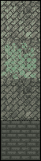
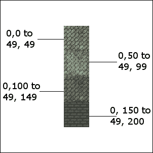
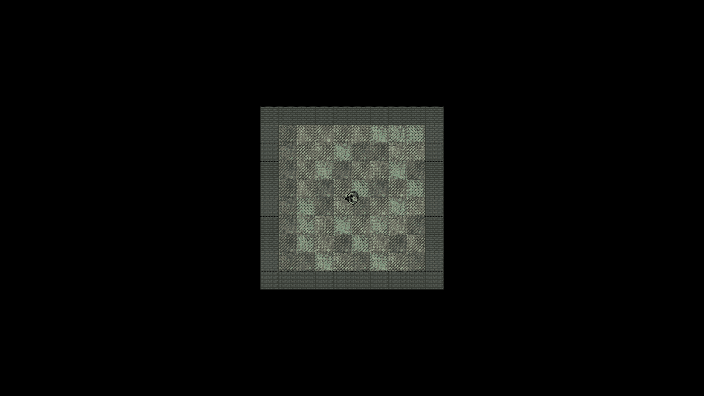

# 第七章：C++引用、精灵表和顶点数组

在第四章中，我们谈到了作用域。在函数或内部代码块中声明的变量只在该函数或块中具有作用域（可以被看到或使用）。仅使用我们目前拥有的 C++知识，这可能会导致问题。如果我们需要处理一些复杂对象，这些对象在`main`中是必需的，我们该怎么办？这可能意味着所有的代码都必须在`main`中。

在本章中，我们将探讨**C++引用**，它允许我们处理变量和对象，否则它们将超出作用域。此外，引用将帮助我们避免在函数之间传递大型对象，这是一个缓慢的过程。这是一个缓慢的过程，因为每次这样做时，都必须制作变量或对象的副本。

掌握了关于引用的这些新知识后，我们将看一下 SFML `VertexArray`类，它允许我们构建一个大图像，可以使用来自单个图像文件的多个图像快速有效地绘制到屏幕上。在本章结束时，我们将拥有一个可扩展的、随机的、滚动的背景，使用引用和一个`VertexArray`对象。

我们现在将讨论以下主题：

+   C++引用

+   SFML 顶点数组

+   编写随机和滚动的背景

# C++引用

当我们向函数传递值或从函数返回值时，这正是我们所做的。通过**值**传递/返回。发生的情况是变量持有的值的副本被制作，并发送到函数中使用。

这具有双重意义：

+   如果我们希望函数对变量进行永久性更改，那么这个系统对我们来说就不好了。

+   当制作副本以作为参数传递或从函数返回时，会消耗处理能力和内存。对于一个简单的`int`，甚至可能是一个精灵，这是相当微不足道的。然而，对于一个复杂的对象，也许是整个游戏世界（或背景），复制过程将严重影响我们游戏的性能。

引用是这两个问题的解决方案。引用是一种特殊类型的变量。引用指的是另一个变量。一个例子将是有用的：

```cpp
int numZombies = 100; 
int& rNumZombies = numZombies; 

```

在上面的代码中，我们声明并初始化了一个常规的`int`，名为`numZombies`。然后我们声明并初始化了一个`int`引用，名为`rNumZombies`。跟随类型的引用运算符`&`确定正在声明一个引用。

### 注意

引用名称前面的`r`前缀是可选的，但对于记住我们正在处理引用是有用的。

现在我们有一个名为`numZombies`的`int`，它存储值`100`，以及一个引用`int`，名为`rNumZombies`，它指的是`numZombies`。

我们对`numZombies`所做的任何事情都可以通过`rNumZombies`看到，我们对`rNumZombies`所做的任何事情实际上都是在做`numZombies`。看一下以下代码：

```cpp
int score = 10; 
int& rScore = score; 
score++; 
rScore++; 

```

在前面的代码中，我们声明了一个名为`score`的`int`。接下来，我们声明了一个引用`int`，名为`rScore`，它指的是`score`。请记住，我们对`score`所做的任何事情都可以被`rScore`看到，我们对`rScore`所做的任何事情实际上都是在做`score`。

因此，当我们像这样增加分数时：

```cpp
score++; 

```

分数变量现在存储值 11。此外，如果我们输出`rScore`，它也将输出 11。以下代码行如下：

```cpp
rScore++; 

```

现在`score`实际上持有值 12，因为我们对`rScore`所做的任何事情实际上都是对`score`做的。

### 提示

如果您想知道这是如何工作的，那么在下一章中讨论**指针**时将会有更多揭示。但简单来说，您可以将引用视为存储计算机内存中的位置/地址。内存中的位置与其引用的变量存储其值的位置相同。因此，对引用或变量的操作具有完全相同的效果。

现在，更重要的是更多地讨论引用的*原因*。使用引用有两个原因，我们已经提到过。这里再次总结一下：

+   更改/读取另一个函数中变量/对象的值，否则超出范围

+   传递/返回而不制作副本（因此更有效）

研究这段代码，然后我们可以讨论它：

```cpp
void add(int n1, int n2, int a); 
void referenceAdd(int n1, int n2, int& a); 

int main() 
{ 
   int number1 = 2; 
   int number2 = 2; 
   int answer = 0; 

   add(number1, number2, answer); 
   // answer still equals zero because it is passed as a copy 
   // Nothing happens to answer in the scope of main 

   referenceAdd(number1, number2, answer); 
   // Now answer equals 4 because it was passed by reference 
   // When the referenceAdd funtion did this: 
   // answer = num1 + num 2; 
   // It is actually changing the value stored by a 
   return 0; 
} 

// Here are the two function definitions 
// They are exactly the same except that 
// the second passes a reference to a 
add(int n1, int n2, int a) 
{ 
   a = n1 + n2; 
   // a now equals 4 
   // But when the function returns a is lost forever 
} 

referenceAdd(int n1, int n2, int& a) 
{ 
   a = n1 + n2; 
   // a now equals 4 
   // But a is a reference! 
   // So it is actually answer, back in main, that equals 4 
} 

```

先前的代码以`add`和`referenceAdd`两个函数的原型开始。`add`函数接受三个`int`变量，而`referenceAdd`函数接受两个`int`变量和一个`int`引用。

当调用`add`函数并传入变量`number1`，`number2`和`answer`时，将复制这些值并操作新的本地变量以添加（`n1`，`n2`和`a`）。因此，`main`中的`answer`仍然为零。

当调用`referenceAdd`函数时，`number1`和`number2`再次按值传递。但是，`answer`是按引用传递的。当将`n1`加到`n2`的值分配给引用`a`时，实际上发生的是该值被分配回`main`函数中的`answer`。

很明显，我们永远不需要实际使用引用来处理如此简单的事情。但是，它确实演示了按引用传递的机制。

## 参考摘要

先前的代码演示了如何使用引用来使用另一个作用域中的代码来更改变量的值。除了非常方便之外，按引用传递也非常高效，因为不会进行复制。使用引用传递`int`的示例有点模糊，因为`int`太小，没有真正的效率提升。在本章后期，我们将使用引用传递整个级别布局，效率提升将是显著的。

### 提示

引用有一个需要注意的地方！您必须在创建引用时将其分配给一个变量。这意味着它并不完全灵活。现在不要担心这个问题。我们将在下一章中进一步探讨引用以及它们更灵活（稍微更复杂）的关系，指针。

这对于`int`来说并不重要，但对于类的大对象来说可能很重要。当我们实现僵尸竞技场游戏的滚动背景时，我们将使用这种确切的技术。

# SFML 顶点数组和精灵表

我们几乎准备好实现滚动背景了。我们只需要学习关于 SFML 顶点数组和精灵表。 

## 什么是精灵表？

**精灵表**是一组图像，可以是动画帧或完全独立的图形，包含在一个图像文件中。仔细观察包含四个单独图像的精灵表，这些图像将用于绘制僵尸竞技场的背景：



SFML 允许我们以与本书中迄今为止的每个纹理完全相同的方式加载精灵表作为常规纹理。当我们将多个图像加载为单个纹理时，GPU 可以更有效地处理它。

### 提示

实际上，现代 PC 可以处理这四个纹理而不使用精灵表。由于我们的游戏将逐渐对硬件要求更高，因此值得使用这些技术。

当我们从精灵表中绘制图像时，我们需要确保引用我们需要的精灵表部分的精确像素坐标：



上一张图标记了每个部分/瓦片在精灵表中位置的坐标。这些坐标称为**纹理坐标**。我们将在我们的代码中使用这些纹理坐标来绘制我们需要的部分。

## 什么是顶点数组？

首先，我们需要问：什么是顶点？**顶点**是单个图形点，一个坐标。这个点由水平和垂直位置定义。顶点的复数是顶点。然后，顶点数组是整个顶点的集合。

在 SFML 中，顶点数组中的每个顶点还具有颜色和相关的额外顶点（一对坐标）称为纹理坐标。纹理坐标是我们想要使用的图像在精灵表中的位置。我们很快将看到如何使用单个顶点数组定位图形并选择要在每个位置显示的精灵表的一部分。

SFML `VertexArray`类可以保存不同类型的顶点集。但是每个`VertexArray`只能保存一种类型的集。我们使用适合场合的集类型。

视频游戏中常见的场景包括但不限于以下**基元**类型：

+   **点**：每个点一个单独的顶点。

+   **线**：每组两个顶点定义线的起点和终点。

+   **三角形**：每个点三个顶点。在使用的成千上万个中，这可能是复杂的 3D 模型或成对创建简单矩形（如精灵）中最常见的。

+   **四边形**：每组四个顶点，一种方便的方式来从精灵表中映射矩形区域。

在这个项目中，我们将使用四边形。

## 从瓦片构建背景

僵尸竞技场背景将由随机排列的方形图像组成。您可以将此排列视为地板上的瓦片。

在这个项目中，我们将使用带有**四边形**集的顶点数组。每个顶点将是四个（一个四边形）的集的一部分。每个顶点将定义背景瓦片的一个角落。每个纹理坐标将根据精灵表中特定图像的适当值进行保持。

让我们看一些代码来开始。这不是我们在项目中将使用的确切代码，但它非常接近，并使我们能够在转向我们将使用的实际实现之前研究顶点数组。

## 构建顶点数组

就像我们创建类的实例时一样，我们声明我们的新对象。以下代码声明了一个名为背景的`VertexArray`类型的新对象：

```cpp
// Create a vertex array 
VertexArray background; 

```

我们希望让我们的`VertexArray`实例知道我们将使用哪种类型的基元。请记住，点、线、三角形和四边形都有不同数量的顶点。通过设置`VertexArray`来保存特定类型，将可以知道每个基元的起始位置。在我们的情况下，我们想要四边形。以下是将执行此操作的代码：

```cpp
// What primitive type are we using 
background.setPrimitiveType(Quads); 

```

与常规的 C++数组一样，`VertexArray`需要设置大小。但是，`VertexArray`更加灵活。它允许我们在游戏运行时更改其大小。大小可以在声明的同时配置，但是我们的背景需要随着每一波扩展。`VertexArray`类通过`resize`函数提供了这种功能。以下是将设置我们的竞技场大小为 10x10 个瓦片大小的代码：

```cpp
// Set the size of the vertex array 
background.resize(10 * 10 * 4); 

```

在上一行代码中，第一个`10`是宽度，第二个`10`是高度，`4`是四边形中的顶点数。我们可以直接传入 400，但是像这样显示计算清楚我们正在做什么。当我们真正编写项目时，我们将进一步声明每个计算部分的变量。

现在我们有一个`VertexArray`准备好配置其数百个顶点。以下是我们如何设置前四个顶点（第一个四边形）的位置坐标：

```cpp
// Position each vertex in the current quad 
background[0].position = Vector2f(0, 0); 
background[1].position = Vector2f(49, 0); 
background[2].position = Vector2f(49,49); 
background[3].position = Vector2f(0, 49); 

```

这是我们如何将这些相同顶点的纹理坐标设置为精灵表中的第一个图像。图像文件中的这些坐标是`0,0`（在左上角）到`49,49`（在右下角）：

```cpp
// Set the texture coordinates of each vertex 
background[0].texCoords = Vector2f(0, 0); 
background[1].texCoords = Vector2f(49, 0); 
background[2].texCoords = Vector2f(49, 49); 
background[3].texCoords = Vector2f(0, 49); 

```

如果我们想将纹理坐标设置为精灵表中的第二个图像，我们将编写如下代码：

```cpp
// Set the texture coordinates of each vertex 
background[0].texCoords = Vector2f(0, 50); 
background[1].texCoords = Vector2f(49, 50); 
background[2].texCoords = Vector2f(49, 99); 
background[3].texCoords = Vector2f(0, 99); 

```

当然，如果我们像这样逐个定义每个顶点，那么即使是一个简单的`10`乘`10`的竞技场也需要很长时间来配置。

当我们真正实现背景时，我们将设计一组嵌套的`for`循环，循环遍历每个四边形，选择一个随机的背景图像，并分配适当的纹理坐标。

代码需要非常智能。它需要知道何时是边缘瓷砖，以便可以使用精灵表中的墙图像。它还需要使用适当的变量，知道精灵表中每个背景瓷砖的位置以及所需竞技场的总体大小。

我们将通过将所有代码放在单独的函数和单独的文件中，使这种复杂性变得可管理。我们将通过使用 C++引用，使`VertexArray`在`main`中可用。

我们很快就会谈到这些细节。您可能已经注意到，在任何时候我们都没有关联纹理（使用顶点数组的精灵表）。

## 使用顶点数组进行绘制

我们可以以与加载任何其他纹理相同的方式加载精灵表作为纹理，如下面的代码所示：

```cpp
// Load the texture for our background vertex array 
Texture textureBackground; 
textureBackground.loadFromFile("graphics/background_sheet.png"); 

```

然后我们可以通过一次调用`draw`来绘制整个`VertexArray`：

```cpp
// Draw the background 
window.draw(background, &textureBackground); 

```

前面的代码比将每个瓷砖作为单独精灵绘制要高效得多。

### 注意

在继续之前，请注意`textureBackground`之前看起来有点奇怪的`&`。您可能会立刻想到这与引用有关。这里发生的是，我们传递纹理的地址而不是实际的纹理。我们将在下一章中了解更多关于这个的知识。

现在我们可以利用我们对引用和顶点数组的知识来实现 Zombie Arena 项目的下一个阶段。

# 创建随机生成的滚动背景

我们将创建一个在单独文件中创建背景的函数。我们将确保通过使用顶点数组引用，背景将可用（在范围内）到`main`函数。

由于我们将编写其他与`main`函数共享数据的函数，我们将在一个新的头文件中提供这些函数的原型，并在`ZombieArena.cpp`中包含它们（使用包含指令）。

为了实现这一点，让我们首先制作新的头文件。在**解决方案资源管理器**中右键单击**头文件**，然后选择**添加** | **新建项...**。在**添加新项**窗口中，突出显示（通过左键单击）**头文件**（`.h`），然后在**名称**字段中键入`ZombieArena.h`。最后点击**添加**按钮。现在我们准备好为我们的新函数编写头文件。

在这个新的`ZombieArena.h`头文件中，添加以下突出显示的代码，包括函数原型：

```cpp
#pragma once 
using namespace sf;
int createBackground(VertexArray& rVA, IntRect arena);

```

前面的代码使我们能够编写名为`createBackground`的函数的定义。为了匹配原型，函数必须返回一个`int`值，并接收`VertexArray`引用和`IntRect`对象作为参数。

现在我们可以创建一个新的`.cpp`文件，在其中我们将编写函数定义。在**解决方案资源管理器**中右键单击**源文件**，然后选择**添加** | **新建项...**。在**添加新项**窗口中，突出显示（通过左键单击）**C++文件**（**`.cpp`**），然后在**名称**字段中键入`CreateBackground.cpp`。最后点击**添加**按钮。现在我们准备好编写将创建我们的背景的函数定义。

将以下代码添加到`CreateBackground.cpp`文件中，然后我们将对其进行审查：

```cpp
#include "stdafx.h" 
#include "ZombieArena.h" 

int createBackground(VertexArray& rVA, IntRect arena) 
{ 
   // Anything we do to rVA we are actually doing 
   // to background (in the main function) 

   // How big is each tile/texture 
   const int TILE_SIZE = 50; 
   const int TILE_TYPES = 3; 
   const int VERTS_IN_QUAD = 4; 

   int worldWidth = arena.width / TILE_SIZE; 
   int worldHeight = arena.height / TILE_SIZE; 

   // What type of primitive are we using? 
   rVA.setPrimitiveType(Quads); 

   // Set the size of the vertex array 
   rVA.resize(worldWidth * worldHeight * VERTS_IN_QUAD); 

   // Start at the beginning of the vertex array 
   int currentVertex = 0; 

   return TILE_SIZE; 
} 

```

在前面的代码中，我们编写了函数签名以及标记函数主体的大括号。

在函数主体中，我们声明并初始化了三个新的`int`常量，用于保存我们在函数其余部分需要引用的值。它们是`TILE_SIZE`、`TILE_TYPES`和`VERTS_IN_QUAD`。`TILE_SIZE`常量指的是精灵表中每个图块的像素大小。`TILE_TYPES`指的是精灵表中不同图块的数量。我们可以向精灵表中添加更多图块，将`TILE_TYPES`更改为匹配，即将仍然有效。`VERTS_IN_QUAD`指的是每个四边形中有四个顶点。与反复输入数字`4`相比，使用这个常量更不容易出错，这点更清晰。

然后，我们声明并初始化了两个`int`变量，`worldWidth`和`worldHeight`。这些变量可能看起来显而易见，因为它们的用途。它们的名称已经透露了它们的用途，但值得指出的是，它们指的是世界在图块数量上的宽度和高度，而不是像素。`worldWidth`和`worldHeight`变量通过将传入的竞技场的高度和宽度除以常量`TILE_SIZE`来初始化。

接下来，我们将首次使用我们的引用。请记住，我们对`rVA`所做的任何事情实际上都是对传入的变量所做的，该变量在`main`函数中是可见的（或者当我们编写它时将可见）。

首先，我们准备使用`rVA.setType`将顶点数组设置为四边形，然后通过调用`rVA.resize`将其调整为合适的大小。我们向`resize`函数传递`worldWidth * worldHeight * VERTS_IN_QUAD`的结果，这恰好等于我们在准备完成后顶点数组的数量。

代码的最后一行声明并初始化`currentVertex`为零。我们将使用`currentVertex`循环遍历顶点数组，初始化所有顶点。

我们现在可以编写嵌套的`for`循环的第一部分，以准备顶点数组。添加以下突出显示的代码，并根据我们对顶点数组的了解，尝试弄清楚它的作用：

```cpp
   // Start at the beginning of the vertex array 
   int currentVertex = 0; 

 for (int w = 0; w < worldWidth; w++)
   {
     for (int h = 0; h < worldHeight; h++)
     {
        // Position each vertex in the current quad
        rVA[currentVertex + 0].position =
            Vector2f(w * TILE_SIZE, h * TILE_SIZE);

        rVA[currentVertex + 1].position =
           Vector2f((w * TILE_SIZE) + TILE_SIZE, h * TILE_SIZE);

        rVA[currentVertex + 2].position =
           Vector2f((w * TILE_SIZE) + TILE_SIZE, (h * TILE_SIZE)
            + TILE_SIZE);

        rVA[currentVertex + 3].position =
           Vector2f((w * TILE_SIZE), (h * TILE_SIZE)
            + TILE_SIZE);

        // Position ready for the next for vertices
        currentVertex = currentVertex + VERTS_IN_QUAD;
     }
   } 

   return TILE_SIZE; 
} 

```

我们刚刚添加的代码通过使用嵌套的`for`循环来遍历顶点数组，首先遍历前四个顶点。`currentVertex + 1`，`currentVertex + 2`等等。

我们使用数组表示法访问数组中的每个顶点。`rvA[currentVertex + 0]..`等等。使用数组表示法，我们调用`position`函数`rvA[currentVertex + 0].position...`。

在`position`函数中，我们传递每个顶点的水平和垂直坐标。我们可以通过使用`w`、`h`和`TILE_SIZE`的组合来以编程方式计算这些坐标。

在前面的代码结束时，我们通过使用代码`currentVertex = currentVertex + VERTS_IN_QUAD`将`currentVertex`定位到下一个嵌套`for`循环的位置，使其向前移动四个位置（加四）。

当然，所有这些只是设置了我们顶点的坐标；它并没有从精灵表中分配纹理坐标。这是我们接下来要做的事情。

为了清楚地表明新代码放在哪里，我已经在我们刚刚编写的所有代码的上下文中显示了它。添加并学习突出显示的代码：

```cpp
for (int w = 0; w < worldWidth; w++) 
   { 
      for (int h = 0; h < worldHeight; h++) 
      { 
         // Position each vertex in the current quad 
         rVA[currentVertex + 0].position =  
            Vector2f(w * TILE_SIZE, h * TILE_SIZE); 

         rVA[currentVertex + 1].position = 
            Vector2f((w * TILE_SIZE) + TILE_SIZE, h * TILE_SIZE); 

         rVA[currentVertex + 2].position = 
            Vector2f((w * TILE_SIZE) + TILE_SIZE, (h * TILE_SIZE)  
            + TILE_SIZE); 

         rVA[currentVertex + 3].position = 
            Vector2f((w * TILE_SIZE), (h * TILE_SIZE)  
            + TILE_SIZE); 

 // Define the position in the Texture for current quad
        // Either grass, stone, bush or wall
        if (h == 0 || h == worldHeight-1 ||
            w == 0 || w == worldWidth-1)
        {
           // Use the wall texture
           rVA[currentVertex + 0].texCoords =
              Vector2f(0, 0 + TILE_TYPES * TILE_SIZE);
           rVA[currentVertex + 1].texCoords =
              Vector2f(TILE_SIZE, 0 +
              TILE_TYPES * TILE_SIZE);
           rVA[currentVertex + 2].texCoords =
              Vector2f(TILE_SIZE, TILE_SIZE +
              TILE_TYPES * TILE_SIZE);
           rVA[currentVertex + 3].texCoords =
              Vector2f(0, TILE_SIZE +
              TILE_TYPES * TILE_SIZE);
        } 

         // Position ready for the next for vertices 
         currentVertex = currentVertex + VERTS_IN_QUAD; 
      } 
   } 

   return TILE_SIZE; 
} 

```

前面的代码设置了每个顶点在精灵表中的坐标。请注意有点长的 if 条件。该条件检查当前四边形是否是竞技场中的第一个或最后一个四边形。如果是，则意味着它是边界的一部分。然后我们可以使用一个简单的公式，使用`TILE_SIZE`和`TILE_TYPES`来从精灵表中选择墙壁纹理。

逐个初始化数组表示法和`texCoords`成员，以为每个顶点分配墙纹理在精灵表中的适当角落。

以下代码包含在`else`块中。这意味着每次通过嵌套的 for 循环时，当四边形不代表边界/墙砖时，它将运行。在现有代码中添加突出显示的代码，然后我们可以检查它：

```cpp
         // Define position in Texture for current quad 
         // Either grass, stone, bush or wall 
         if (h == 0 || h == worldHeight-1 || 
            w == 0 || w == worldWidth-1) 
         { 
            // Use the wall texture 
            rVA[currentVertex + 0].texCoords =  
               Vector2f(0, 0 + TILE_TYPES * TILE_SIZE); 

            rVA[currentVertex + 1].texCoords =  
               Vector2f(TILE_SIZE, 0 +  
               TILE_TYPES * TILE_SIZE); 

            rVA[currentVertex + 2].texCoords =  
               Vector2f(TILE_SIZE, TILE_SIZE +  
               TILE_TYPES * TILE_SIZE); 

            rVA[currentVertex + 3].texCoords =  
               Vector2f(0, TILE_SIZE +  
               TILE_TYPES * TILE_SIZE); 
         } 
 else
        {
           // Use a random floor texture
           srand((int)time(0) + h * w - h);
           int mOrG = (rand() % TILE_TYPES);
           int verticalOffset = mOrG * TILE_SIZE;

           rVA[currentVertex + 0].texCoords =
              Vector2f(0, 0 + verticalOffset);

           rVA[currentVertex + 1].texCoords =
              Vector2f(TILE_SIZE, 0 + verticalOffset);

           rVA[currentVertex + 2].texCoords =
              Vector2f(TILE_SIZE, TILE_SIZE + verticalOffset);

           rVA[currentVertex + 3].texCoords =
              Vector2f(0, TILE_SIZE + verticalOffset);
        } 

         // Position ready for the next for vertices 
         currentVertex = currentVertex + VERTS_IN_QUAD; 
      } 
   } 

   return TILE_SIZE; 
} 

```

前面的新代码首先使用一个公式来为随机数生成器提供种子，每次通过循环时都会有不同的公式。然后，`mOrG`变量用一个介于 0 和`TILE_TYPES`之间的数字进行初始化。这正是我们随机选择瓦片类型所需要的。

### 注意

`mOrG`代表泥土或草。名称是任意的。

现在，通过将`mOrG`乘以`TileSize`来声明和初始化一个名为`verticalOffset`的变量。现在我们在精灵表中有一个垂直参考点，指向当前四边形随机选择的纹理的起始高度。

现在，我们使用一个简单的公式，涉及`TILE_SIZE`和`verticalOffset`，来为纹理的每个角分配精确的坐标到适当的顶点。

现在我们可以让我们的新函数在游戏引擎中发挥作用了。

# 使用背景

我们已经完成了棘手的事情，这将很简单。有三个步骤：

1.  创建一个`VertexArray`。

1.  在每个波次升级后初始化它。

1.  在每一帧中绘制它。

添加以下突出显示的代码来声明一个名为`background`的`VertexArray`，并加载`background_sheet.png`作为纹理：

```cpp
// Create an instance of the Player class 
Player player; 

// The boundaries of the arena 
IntRect arena; 

// Create the backgroundVertexArray background;
// Load the texture for our background vertex array
Texture textureBackground;
textureBackground.loadFromFile("graphics/background_sheet.png"); 

// The main game loop 
while (window.isOpen()) 

```

添加以下代码来调用`createBackground`函数，传入`background`作为引用和`arena`作为值。请注意在突出显示的代码中，我们还修改了初始化`tileSize`变量的方式。按照突出显示的代码精确添加：

```cpp
if (state == State::PLAYING) 
{ 
   // Prepare thelevel 
   // We will modify the next two lines later 
   arena.width = 500; 
   arena.height = 500; 
   arena.left = 0; 
   arena.top = 0; 

 // Pass the vertex array by reference
   // to the createBackground function
   int tileSize = createBackground(background, arena); 

   // We will modify this line of code later 
 // int tileSize = 50; 

   // Spawn the player in the middle of the arena 
   player.spawn(arena, resolution, tileSize); 

   // Reset the clock so there isn't a frame jump 
   clock.restart(); 
} 

```

请注意，我们已经替换了`int tileSize = 50`这行代码，因为我们直接从`createBackground`函数的返回值中获取了该值。

### 提示

为了以后的代码清晰起见，你应该删除`int tileSize = 50`这行代码及其相关的注释。我只是将它注释掉，以便为新代码提供更清晰的上下文。

最后，是时候开始绘制了。这很简单。我们只需要调用`window.draw`并传递`VertexArray`以及`textureBackground`纹理：

```cpp
/* 
 ************** 
 Draw the scene 
 ************** 
 */ 

if (state == State::PLAYING) 
{ 
   window.clear(); 

   // Set the mainView to be displayed in the window 
   // And draw everything related to it 
   window.setView(mainView); 

 // Draw the background
   window.draw(background, &textureBackground); 

   // Draw the player 
   window.draw(player.getSprite()); 
} 

```

### 提示

如果你想知道`textureBackground`前面那个奇怪的`&`符号是什么意思，那么一切将在下一章中变得清晰起来。

你现在可以按照下图运行游戏：



请注意，玩家精灵在竞技场范围内平稳滑动和旋转。尽管主要代码中绘制了一个小竞技场，但`CreateBackground`函数可以创建我们告诉它的任何大小的竞技场。我们将在第十一章中看到比屏幕更大的竞技场：*声音效果，文件 I/O 和完成游戏*。

# FAQ

以下是一些可能在你脑海中的问题：

Q）你能再总结一下这些参考资料吗？

A）你必须立即初始化引用，并且不能将其更改为引用另一个变量。使用引用与函数一起，这样你就不会在副本上工作。这对效率很有好处，因为它避免了制作副本，并帮助我们更容易地将代码抽象成函数。

Q）有没有一种简单的方法来记住使用引用的主要好处？

A）为了帮助你记住引用的用途，考虑一下这首简短的韵文：

> *移动大对象可能会使我们的游戏变得卡顿，通过引用传递比复制更快。*

# 总结

在本章中，我们发现了 C++引用，它们是特殊的变量，充当另一个变量的别名。当我们通过引用而不是值传递变量时，我们对引用所做的任何工作都会发生在调用函数中的变量上。

我们还学习了关于顶点数组，并创建了一个充满四边形的顶点数组，以从精灵表中绘制瓦片作为背景。

当然，房间里的大象是，我们的僵尸游戏没有任何僵尸。现在让我们通过学习 C++指针和标准模板库来解决这个问题。
