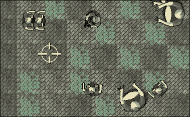
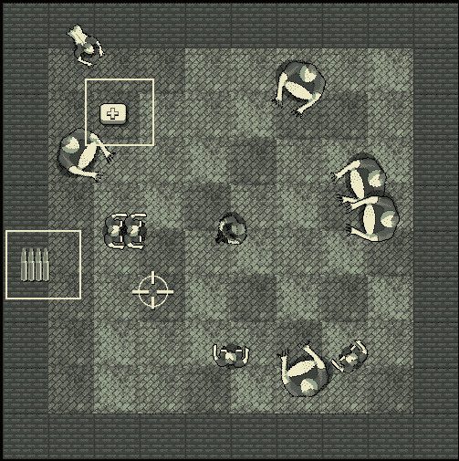
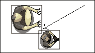

# 第九章。碰撞检测、拾取物品和子弹

到目前为止，我们已经实现了游戏的主要视觉方面。我们有一个可控的角色在一个充满追逐他的僵尸的竞技场中奔跑。问题是它们彼此之间没有互动。僵尸可以毫无阻碍地穿过玩家。我们需要检测僵尸和玩家之间的碰撞。

如果僵尸能够伤害并最终杀死玩家，那么给玩家一些子弹是公平的。然后我们需要确保子弹能够击中并杀死僵尸。

同时，如果我们正在为子弹、僵尸和玩家编写碰撞检测代码，那么现在是添加用于健康和弹药拾取的类的好时机。

以下是我们将要做的事情以及我们将涵盖的主题顺序：

+   射击子弹

+   添加准星并隐藏鼠标指针

+   生成拾取物品

+   检测碰撞

# 编写子弹类

我们将使用 SFML 的`RectangleShape`类来直观表示子弹。我们将编写一个`Bullet`类，其中包含一个`RectangleShape`成员以及其他成员数据和函数。我们将分几步向游戏中添加子弹：

1.  首先，我们将编写`Bullet.h`文件。这将显示成员数据的所有细节和函数的原型。

1.  接下来，我们将编写`Bullet.cpp`文件，其中当然将包含`Bullet`类所有函数的定义。当我们逐步进行时，我将解释`Bullet`类型的对象将如何工作和被控制。

1.  最后，在`main`函数中，我们将声明一个完整的子弹数组。我们还将实现射击的控制方案，管理玩家剩余的弹药，并进行重新加载。

让我们从第一步开始。

## 编写子弹头文件

要创建新的头文件，**右键单击** **解决方案资源管理器**中的**头文件**，然后选择**添加 | 新项目...**。在**添加新项目**窗口中，通过左键单击**头文件（**`.h`**）**，然后在**名称**字段中键入`Bullet.h`。

在`Bullet.h`文件中，添加以下私有成员变量以及`Bullet`类声明。然后我们可以运行并解释它们的用途：

```cpp
#pragma once 
#include <SFML/Graphics.hpp> 

using namespace sf; 

class Bullet 
{ 
private: 
   // Where is the bullet? 
   Vector2f m_Position; 

   // What each bullet looks like 
   RectangleShape m_BulletShape; 

   // Is this bullet currently whizzing through the air 
   bool m_InFlight = false; 

   // How fast does a bullet travel? 
   float m_BulletSpeed = 1000; 

   // What fraction of 1 pixel does the bullet travel,  
   // Horizontally and vertically each frame? 
   // These values will be derived from m_BulletSpeed 
   float m_BulletDistanceX; 
   float m_BulletDistanceY; 

   // Some boundaries so the bullet doesn't fly forever 
   float m_MaxX; 
   float m_MinX; 
   float m_MaxY; 
   float m_MinY; 

// Public function prototypes go here 

```

在前面的代码中，第一个成员是一个名为`m_Position`的`Vector2f`，它将保存子弹在游戏世界中的位置。

接下来，我们声明了一个名为`m_BulletShape`的`RectangleShape`，因为我们为每颗子弹使用了一个简单的非纹理图形，有点像我们在 Timber!!!中为时间条所做的那样。

代码然后声明了一个`Boolean m_InFlight`，它将跟踪子弹当前是否在空中飞行。这将使我们能够决定是否需要在每帧调用其`update`函数，以及我们是否需要运行碰撞检测检查。

`float`变量`m_BulletSpeed`将（你可能猜到了）保存子弹的像素速度。它被初始化为`1000`的值，这有点随意，但效果很好。

接下来我们有另外两个`float`变量，`m_BulletDistanceX`和`m_BulletDistanceY`。由于移动子弹的计算比移动僵尸或玩家的计算稍微复杂一些，我们将受益于这两个变量，我们将对它们进行计算。它们将用于决定每帧子弹位置的水平和垂直变化。

最后，对于前面的代码，我们有另外四个`float`变量（`m_MaxX`、`m_MinX`、`m_MaxY`和`m_MinY`），它们将稍后初始化以保存子弹的水平和垂直位置的最大和最小值。

很可能有些变量的需求并不立即显而易见，但当我们在`Bullet.cpp`文件中看到它们各自发挥作用时，它们将变得更清晰。

现在将所有公共函数原型添加到`Bullet.h`文件中：

```cpp
// Public function prototypes go here 
public:
   // The constructor
   Bullet();

   // Stop the bullet
   void stop();

   // Returns the value of m_InFlight
   bool isInFlight();

   // Launch a new bullet
   void shoot(float startX, float startY,
     float xTarget, float yTarget);

   // Tell the calling code where the bullet is in the world
   FloatRect getPosition();

   // Return the actual shape (for drawing)
   RectangleShape getShape();

   // Update the bullet each frame
   void update(float elapsedTime);

```

让我们依次审查每个函数，然后我们可以继续编写它们的定义。

首先是`Bullet`函数，当然是构造函数。在这个函数中，我们将为每个`Bullet`实例设置好准备行动。

`stop`函数将在子弹已经在行动但需要停止时被调用。

`isInFlight`函数返回一个布尔值，用于测试子弹当前是否在飞行中。

`shoot`函数的用途可以从其名称中得知，但它的工作方式值得讨论。现在，只需注意它有四个`float`参数将被传入。这四个值代表子弹的起始（玩家所在位置）水平和垂直位置，以及垂直和水平目标位置（准星所在位置）。

`getPosition`函数返回一个`FloatRect`，表示子弹的位置。这个函数将用于检测与僵尸的碰撞。您可能还记得来自第八章：*指针、标准模板库和纹理管理*中，僵尸也有一个`getPosition`函数。

接下来我们有`getShape`函数，它返回一个`RectangleShape`类型的对象。正如我们讨论过的，每个子弹在视觉上都由一个`RectangleShape`对象表示。因此，`getShape`函数将被用来获取`RectangleShape`当前状态的副本，以便绘制它。

最后，也希望如预期的那样，有`update`函数，它有一个`float`参数，表示自上次调用`update`以来经过的一秒钟的时间。`update`方法将在每一帧改变子弹的位置。

让我们来看看并编写函数定义。

## 编写子弹源文件

现在我们可以创建一个新的`.cpp`文件，其中包含函数定义。在**解决方案资源管理器**中右键单击**源文件**，然后选择**添加 | 新项目...**。在**添加新项目**窗口中，通过左键单击**C++文件**（`.cpp`）来突出显示，然后在**名称**字段中键入`Bullet.cpp`。最后，单击**添加**按钮。我们现在准备好编写类了。

添加以下代码，这是包含指令和构造函数。我们知道这是构造函数，因为函数的名称与类名相同：

```cpp
#include "stdafx.h" 
#include "bullet.h" 

// The constructor 
Bullet::Bullet() 
{ 
   m_BulletShape.setSize(sf::Vector2f(2, 2)); 
}
```

`Bullet`构造函数唯一需要做的事情就是设置`m_BulletShape`的大小，这是`RectangleShape`对象。代码将大小设置为两像素乘以两像素。

接下来是更实质性的`shoot`函数。将以下代码添加到`Bullet.cpp`文件中，研究它，然后我们可以讨论它：

```cpp
void Bullet::shoot(float startX, float startY, 
   float targetX, float targetY) 
{ 
   // Keep track of the bullet 
   m_InFlight = true; 
   m_Position.x = startX; 
   m_Position.y = startY; 

   // Calculate the gradient of the flight path 
   float gradient = (startX - targetX) / (startY - targetY); 

   // Any gradient less than 1 needs to be negative 
   if (gradient < 0) 
   { 
      gradient *= -1; 
   } 

   // Calculate the ratio between x and y 
   float ratioXY = m_BulletSpeed / (1 + gradient); 

   // Set the "speed" horizontally and vertically 
   m_BulletDistanceY = ratioXY; 
   m_BulletDistanceX = ratioXY * gradient; 

   // Point the bullet in the right direction 
   if (targetX < startX) 
   { 
      m_BulletDistanceX *= -1; 
   } 

   if (targetY < startY) 
   { 
      m_BulletDistanceY *= -1; 
   } 

   // Set a max range of 1000 pixels 
   float range = 1000; 
   m_MinX = startX - range; 
   m_MaxX = startX + range; 
   m_MinY = startY - range; 
   m_MaxY = startY + range; 

   // Position the bullet ready to be drawn 
   m_BulletShape.setPosition(m_Position); 

```

为了揭开`shoot`函数的神秘面纱，我们将把它分解并讨论我们刚刚添加的代码块。

首先让我们回顾一下签名。`shoot`函数接收子弹的起始和目标水平和垂直位置。调用代码将根据玩家精灵的位置和准星的位置提供这些值。这里是它的签名：

```cpp
void Bullet::shoot(float startX, float startY, float targetX, float targetY)
```

在`shoot`函数内部，我们将`m_InFlight`设置为`true`，并使用参数`startX`和`startY`定位子弹。这里是那段代码：

```cpp
// Keep track of the bullet 
m_InFlight = true; 
m_Position.x = startX; 
m_Position.y = startY;
```

现在我们使用一些简单的三角学来确定子弹的行进斜率。子弹的水平和垂直进展必须根据在子弹起始和目标之间绘制的线的斜率而变化。变化的速率不能相同，否则非常陡峭的射击将在水平位置到达之前到达垂直位置，对于较浅的射击则相反。

以下代码首先根据一条直线的方程推导出斜率。然后它检查斜率是否小于零，如果是，则乘以`-1`。这是因为传入的起始和目标坐标可以是负数或正数，我们总是希望每帧的进度量是正数。乘以`-1`只是将负数变成它的正数等价物，因为负数乘以负数得正数。实际的行进方向将在`update`函数中处理，通过在这个函数中得到的正值进行加减。

接下来，我们通过将我们的子弹速度（`m_BulletSpeed`）除以斜率加一来计算水平到垂直距离的比率。这将允许我们根据子弹所指向的目标，每帧正确地改变子弹的水平和垂直位置。

最后，在代码的这一部分，我们为`m_BulletDistanceY`和`m_BulletDistanceX`赋值：

```cpp
// Calculate the gradient of the flight path 
float gradient = (startX - targetX) / (startY - targetY); 

// Any gradient less than zero needs to be negative 
if (gradient < 0) 
{ 
   gradient *= -1; 
} 

// Calculate the ratio between x and y 
float ratioXY = m_BulletSpeed / (1 + gradient); 

// Set the "speed" horizontally and vertically 
m_BulletDistanceY = ratioXY; 
m_BulletDistanceX = ratioXY * gradient;
```

以下代码要简单得多。我们只是设置了子弹可以到达的最大水平和垂直位置。我们不希望子弹一直飞下去。我们将在`update`函数中看到这一点，我们会测试子弹是否已经超过了它的最大或最小位置：

```cpp
// Set a max range of 1000 pixels in any direction 
float range = 1000; 
m_MinX = startX - range; 
m_MaxX = startX + range; 
m_MinY = startY - range; 
m_MaxY = startY + range;
```

以下代码将代表子弹的**RectangleShape**移动到其起始位置。我们像以前经常做的那样使用`setPosition`函数：

```cpp
// Position the bullet ready to be drawn 
m_BulletShape.setPosition(m_Position);
```

接下来我们有四个简单直接的函数。添加`stop`，`isInFlight`，`getPosition`和`getShape`函数：

```cpp
void Bullet::stop() 
{ 
   m_InFlight = false; 
} 

bool Bullet::isInFlight() 
{ 
   return m_InFlight; 
} 

FloatRect Bullet::getPosition() 
{ 
   return m_BulletShape.getGlobalBounds(); 
} 

RectangleShape Bullet::getShape() 
{ 
   return m_BulletShape; 

```

`stop`函数只是将`m_InFlight`变量设置为`false`。`isInFlight`函数返回当前这个变量的值。所以我们可以看到`shoot`让子弹飞出去，`stop`让它停下来，`isInFlight`让我们知道当前的状态是什么。

`getPosition`函数返回一个`FloatRect`，我们将看到如何使用每个游戏对象的`FloatRect`来检测碰撞，很快就会看到。

最后，对于之前的代码，`getShape`返回一个`RectangleShape`，所以我们可以在每一帧中绘制子弹。

在我们开始使用`Bullet`对象之前，我们需要实现的最后一个函数是`update`。添加以下代码，研究一下，然后我们可以讨论一下：

```cpp
void Bullet::update(float elapsedTime) 
{ 
   // Update the bullet position variables 
   m_Position.x += m_BulletDistanceX * elapsedTime; 
   m_Position.y += m_BulletDistanceY * elapsedTime; 

   // Move the bullet 
   m_BulletShape.setPosition(m_Position); 

   // Has the bullet gone out of range? 
   if (m_Position.x < m_MinX || m_Position.x > m_MaxX || 
      m_Position.y < m_MinY || m_Position.y > m_MaxY) 
   { 
      m_InFlight = false; 
   } 
}
```

在`update`函数中，我们使用`m_BulletDistanceX`和`m_BulletDistanceY`乘以自上一帧以来的时间来移动子弹。记住，这两个变量的值是在`shoot`函数中计算的，并且表示移动子弹所需的斜率（彼此的比率）。然后我们使用`setPosition`函数来实际移动`RectangleShape`。

在`update`中我们做的最后一件事是测试子弹是否已经超过了它的最大射程。稍微复杂的`if`语句检查`m_Position.x`和`m_Position.y`与在`shoot`函数中计算的最大和最小值。这些最大和最小值存储在`m_MinX`，`m_MaxX`，`m_MinY`和`m_MaxY`中。如果测试为真，则`m_InFlight`设置为`false`。

`Bullet`类已经完成。现在我们可以看看如何在`main`函数中射击一些子弹。

# 让子弹飞

我们将通过以下六个步骤使子弹可用：

1.  为`Bullet`类添加必要的包含指令。

1.  添加一些控制变量和一个数组来保存一些`Bullet`实例。

1.  处理玩家按下*R*键重新装填。

1.  处理玩家按下鼠标左键发射子弹。

1.  在每一帧中更新所有正在飞行的子弹。

1.  在每一帧中绘制正在飞行中的子弹。

## 包含 Bullet 类

添加包含指令以使 Bullet 类可用：

```cpp
#include "stdafx.h" 
#include <SFML/Graphics.hpp> 
#include "ZombieArena.h" 
#include "Player.h" 
#include "TextureHolder.h" 
#include "Bullet.h" using namespace sf;
```

让我们继续下一步。

## 控制变量和子弹数组

这里有一些变量来跟踪子弹、弹夹大小、备用/剩余子弹、弹夹中的子弹、当前射速（每秒开始为一颗），以及上一颗子弹被射击的时间。

添加突出显示的代码，我们可以继续看到本节中所有这些变量的实际运行情况：

```cpp
// Prepare for a horde of zombies 
int numZombies; 
int numZombiesAlive; 
Zombie* zombies = NULL; 

// 100 bullets should do
Bullet bullets[100];
int currentBullet = 0;
int bulletsSpare = 24;
int bulletsInClip = 6;
int clipSize = 6;
float fireRate = 1;
// When was the fire button last pressed?
Time lastPressed; 

// The main game loop 
while (window.isOpen())
```

接下来，让我们处理玩家按下***R***键时会发生什么，这个键用于重新装弹。

## 重新装弹

现在我们处理与射击子弹相关的玩家输入。首先，我们将处理按下***R***键重新装弹。我们使用 SFML 事件来实现。

添加下面突出显示的代码块。为了确保代码放在正确的位置，提供了大量上下文来展示。研究代码，然后我们可以讨论它：

```cpp
// Handle events 
Event event; 
while (window.pollEvent(event)) 
{ 
   if (event.type == Event::KeyPressed) 
   { 
      // Pause a game while playing 
      if (event.key.code == Keyboard::Return && 
         state == State::PLAYING) 
      { 
         state = State::PAUSED; 
      } 

      // Restart while paused 
      else if (event.key.code == Keyboard::Return && 
         state == State::PAUSED) 
      { 
         state = State::PLAYING; 
         // Reset the clock so there isn't a frame jump 
         clock.restart(); 
      } 

      // Start a new game while in GAME_OVER state 
      else if (event.key.code == Keyboard::Return && 
         state == State::GAME_OVER) 
      { 
         state = State::LEVELING_UP; 
      } 

      if (state == State::PLAYING) 
      { 
 // Reloading
        if (event.key.code == Keyboard::R)
        {
           if (bulletsSpare >= clipSize)
           {
             // Plenty of bullets. Reload.
             bulletsInClip = clipSize;
             bulletsSpare -= clipSize;
           }
           else if (bulletsSpare > 0)
           {
             // Only few bullets left
             bulletsInClip = bulletsSpare;
             bulletsSpare = 0;
           }
           else
           {
             // More here soon?!
           }
       } 
      } 

   } 
}// End event polling
```

先前的代码嵌套在游戏循环的事件处理部分（`while(window.pollEvent)`）中，只有在游戏实际进行时执行的代码块内（`if(state == State::Playing)`）。很明显，我们不希望在游戏结束或暂停时玩家重新装弹，通过描述的新代码实现了这一点。

在新代码本身中，我们首先测试是否按下了**R**键，使用`if (event.key.code == Keyboard::R)`。一旦检测到按下**R**键，剩下的代码就会执行。以下是`if`、`else if`和`else`块的结构：

```cpp
if(bulletsSpare >= clipSize) 
   ... 
else if(bulletsSpare > 0) 
   ... 
else 
   ...
```

先前的结构允许我们处理三种可能的情况。

+   玩家按下了`R`，并且他们有比弹夹能装下的更多的备用子弹。在这种情况下，弹夹被重新填充，备用子弹的数量减少。

+   玩家有一些备用子弹，但不足以完全填满弹夹。在这种情况下，弹夹将填满玩家拥有的尽可能多的备用子弹，并且备用子弹的数量被设置为零。

+   玩家按下了 R，但他们没有备用子弹。对于这种情况，我们实际上不需要改变变量。但是当我们在第十一章中实现声音时，我们会在这里播放声音效果，所以我们留下了空的`else`块。

最后，让我们实际射击一颗子弹。

## 射击子弹

接下来，我们可以处理按下鼠标左键来实际射击子弹。添加下面突出显示的代码并仔细研究它：

```cpp
   if (Keyboard::isKeyPressed(Keyboard::D)) 
   { 
      player.moveRight(); 
   } 
   else 
   { 
      player.stopRight(); 
   } 

 // Fire a bullet
   if (Mouse::isButtonPressed(sf::Mouse::Left))
   {
     if (gameTimeTotal.asMilliseconds()
        - lastPressed.asMilliseconds()
        > 1000 / fireRate && bulletsInClip > 0)
     {

        // Pass the center of the player
        // and the center of the crosshair
        // to the shoot function
        bullets[currentBullet].shoot(
           player.getCenter().x, player.getCenter().y,
           mouseWorldPosition.x, mouseWorldPosition.y);

        currentBullet++;
        if (currentBullet > 99)
        {
           currentBullet = 0;
        }
        lastPressed = gameTimeTotal;
        bulletsInClip--;
     }
   }// End fire a bullet
}// End WASD while playing

```

所有先前的代码都包裹在一个`if`语句中，只有当按下鼠标左键时执行，`if (Mouse::isButtonPressed(sf::Mouse::Left))`。请注意，即使玩家只是按住按钮，代码也会重复执行。我们现在要讨论的代码控制射速。

在先前的代码中，我们检查游戏中经过的总时间（`gameTimeTotal`）减去玩家上次射击子弹的时间（`lastPressed`）是否大于`1000`除以当前射速，以及玩家弹夹中至少有一颗子弹。我们使用`1000`是因为这是一秒钟内的毫秒数。

如果这个测试成功，那么实际射击子弹的代码就会执行。射击子弹很容易，因为我们在`Bullet`类中已经做了所有的工作。我们只需在`bullets`数组中的当前子弹上调用`shoot`。我们传入玩家和准星的当前水平和垂直位置。子弹将由`Bullet`类的`shoot`函数中的代码进行配置和发射。

我们所要做的就是跟踪子弹数组。首先我们增加`currentBullet`变量。然后我们检查是否用语句`if (currentBullet > 99)`发射了最后一颗子弹（`99`）。如果是最后一颗子弹，我们将`currentBullet`设置为零。如果不是最后一颗子弹，那么下一颗子弹就准备好了，只要射速允许并且玩家按下鼠标左键。

最后，对于之前的代码，我们将子弹发射的时间存储在`lastPressed`中，并减少`bulletsInClip`。

现在我们可以每帧更新每一颗子弹。

## 每帧更新子弹

添加高亮代码来循环遍历子弹数组，检查子弹是否在飞行，如果是，调用它的更新函数：

```cpp
   // Loop through each Zombie and update them 
   for (int i = 0; i < numZombies; i++) 
   { 
      if (zombies[i].isAlive()) 
      { 
         zombies[i].update(dt.asSeconds(), playerPosition); 
      } 
   } 

 // Update any bullets that are in-flight
   for (int i = 0; i < 100; i++)
   {
     if (bullets[i].isInFlight())
     {
        bullets[i].update(dtAsSeconds);
     }
   } }// End updating the scene
```

最后，我们可以绘制所有的子弹。

## 每帧绘制子弹

添加高亮代码来循环遍历`bullets`数组，检查子弹是否在飞行中，如果是，就绘制它：

```cpp
/* 
 ************** 
 Draw the scene 
 ************** 
 */ 

if (state == State::PLAYING) 
{ 
   window.clear(); 

   // set the mainView to be displayed in the window 
   // And draw everything related to it 
   window.setView(mainView); 

   // Draw the background 
   window.draw(background, &textureBackground); 

   // Draw the zombies 
   for (int i = 0; i < numZombies; i++) 
   { 
      window.draw(zombies[i].getSprite()); 
   } 

 for (int i = 0; i < 100; i++)
   {
     if (bullets[i].isInFlight())
     {
        window.draw(bullets[i].getShape());
     }
   } 

   // Draw the player 
   window.draw(player.getSprite()); 
}
```

运行游戏来尝试子弹。注意你可以连续射击六次，然后需要按***R***重新装填。明显缺少的是弹夹中子弹数量和备用子弹数量的一些视觉指示。另一个问题是玩家很快就会用尽子弹，特别是因为子弹根本没有停止力。它们直接穿过僵尸。再加上玩家期望以鼠标指针而不是精确的准星瞄准，我们明显还有工作要做。

在下一章中，我们将通过 HUD 给出视觉反馈。接下来我们将用一个准星替换鼠标光标，然后在此之后生成一些拾取物品来补充子弹和生命值。最后，在本章中，我们将处理碰撞检测，使子弹和僵尸造成伤害，并使玩家能够真正获得拾取物品。

# 给玩家一个准星

添加一个准星很容易，只需要一个新的概念。添加高亮代码，然后我们可以运行它：

```cpp
// 100 bullets should do 
Bullet bullets[100]; 
int currentBullet = 0; 
int bulletsSpare = 24; 
int bulletsInClip = 6; 
int clipSize = 6; 
float fireRate = 1; 
// When was the fire button last pressed? 
Time lastPressed; 

// Hide the mouse pointer and replace it with crosshair
window.setMouseCursorVisible(true);
Sprite spriteCrosshair;
Texture textureCrosshair =
    TextureHolder::GetTexture("graphics/crosshair.png");

spriteCrosshair.setTexture(textureCrosshair);
spriteCrosshair.setOrigin(25, 25); 
// The main game loop 
while (window.isOpen())
```

首先我们在`window`对象上调用`setMouseCursorVisible`函数。然后我们加载一个`Texture`，声明一个`Sprite`，并以通常的方式初始化它。此外，我们将精灵的原点设置为它的中心，以使子弹飞向中心更加方便和简单，正如你所期望的那样。

现在我们需要每帧更新准星的世界坐标。添加高亮代码行，它使用`mouseWorldPosition`向量来设置每帧的准星位置：

```cpp
/* 
 **************** 
 UPDATE THE FRAME 
 **************** 
 */ 
if (state == State::PLAYING) 
{ 
   // Update the delta time 
   Time dt = clock.restart(); 
   // Update the total game time 
   gameTimeTotal += dt; 
   // Make a decimal fraction of 1 from the delta time 
   float dtAsSeconds = dt.asSeconds(); 

   // Where is the mouse pointer 
   mouseScreenPosition = Mouse::getPosition(); 

   // Convert mouse position to world coordinates of mainView 
   mouseWorldPosition = window.mapPixelToCoords( 
      Mouse::getPosition(), mainView); 

 // Set the crosshair to the mouse world location
   spriteCrosshair.setPosition(mouseWorldPosition); 

   // Update the player 
   player.update(dtAsSeconds, Mouse::getPosition());
```

接下来，正如你可能期望的那样，我们可以为每一帧绘制准星。在指定位置添加高亮代码行。这行代码不需要解释，但它在所有其他游戏对象之后的位置很重要，这样它就会被绘制在最上面：

```cpp
/* 
 ************** 
 Draw the scene 
 ************** 
 */ 

if (state == State::PLAYING) 
{ 
   window.clear(); 

   // set the mainView to be displayed in the window 
   // And draw everything related to it 
   window.setView(mainView); 

   // Draw the background 
   window.draw(background, &textureBackground); 

   // Draw the zombies 
   for (int i = 0; i < numZombies; i++) 
   { 
      window.draw(zombies[i].getSprite()); 
   } 

   for (int i = 0; i < 100; i++) 
   { 
      if (bullets[i].isInFlight()) 
      { 
         window.draw(bullets[i].getShape()); 
      } 
   } 

   // Draw the player 
   window.draw(player.getSprite()); 

 //Draw the crosshair
   window.draw(spriteCrosshair);
}

```

现在你可以运行游戏，看到酷炫的准星，而不是鼠标光标：



注意子弹是如何整齐地穿过准星中心的。射击机制的工作方式类似于允许玩家选择从腰部射击或瞄准射击。如果玩家保持准星靠近中心，他可以快速射击和转身，但必须仔细判断远处僵尸的位置。

或者，玩家可以直接将准星悬停在远处僵尸的头部，进行精确射击；然而，如果僵尸从另一个方向袭击，那么他就需要更远地移动准星。

对游戏的一个有趣改进是为每一枪增加一点小的随机不准确性。这种不准确性可能会在波之间的升级中得到缓解。

# 编写一个用于拾取的类

我们将编写一个`Pickup`类，其中有一个`Sprite`成员以及其他成员数据和函数。我们将在几个步骤中向我们的游戏中添加拾取物品：

1.  首先，我们将编写`Pickup.h`文件。这将揭示所有成员数据的细节和函数的原型。

1.  接下来，我们将编写`Pickup.cpp`文件，其中当然将包含`Pickup`类的所有函数的定义。当我们逐步进行时，我将解释`Pickup`类型的对象将如何工作和被控制。

1.  最后，我们将在`main`函数中使用`Pickup`类来生成、更新和绘制它们。

让我们从第 1 步开始。

## 编写拾取物头文件

要创建新的头文件，**在** **解决方案资源管理器** 中**右键单击** **头文件**，然后选择**添加 | 新建项...**。在**添加新项**窗口中，通过左键单击**头文件（** `.h` **）**，然后在**名称**字段中键入`Pickup.h`。

在`Pickup.h`文件中添加并学习以下代码，然后我们可以逐步进行：

```cpp
#pragma once 
#include <SFML/Graphics.hpp> 

using namespace sf; 

class Pickup 
{ 
private: 
   //Start value for health pickups 
   const int HEALTH_START_VALUE = 50; 
   const int AMMO_START_VALUE = 12; 
   const int START_WAIT_TIME = 10; 
   const int START_SECONDS_TO_LIVE = 5; 

   // The sprite that represents this pickup 
   Sprite m_Sprite; 

   // The arena it exists in 
   IntRect m_Arena; 

   // How much is this pickup worth? 
   int m_Value; 

   // What type of pickup is this?  
   // 1 = health, 2 = ammo 
   int m_Type; 

   // Handle spawning and disappearing 
   bool m_Spawned; 
   float m_SecondsSinceSpawn; 
   float m_SecondsSinceDeSpawn; 
   float m_SecondsToLive; 
   float m_SecondsToWait;   

   // Public prototypes go here 
};
```

之前的代码声明了`Pickup`类的所有私有变量。虽然这些变量的名称应该很直观，但为什么需要这么多变量可能并不明显。让我们从顶部开始逐个讲解：

+   `const int HEALTH_START_VALUE = 50`：这个常量变量用于设置所有生命值拾取物的起始值。这个值将用于初始化`m_Value`变量，在游戏过程中需要对其进行操作。

+   `const int AMMO_START_VALUE = 12`：这个常量变量用于设置所有弹药拾取物的起始值。这个值将用于初始化`m_Value`变量，在游戏过程中需要对其进行操作。

+   `const int START_WAIT_TIME = 10`：这个变量是拾取物在消失后重新生成前要等多久。它将用于初始化`m_SecondsToWait`变量，在游戏过程中可以对其进行操作。

+   `const int START_SECONDS_TO_LIVE = 5`：这个变量确定拾取物在生成和消失之间持续多长时间。和前面三个常量一样，它有一个与之关联的非常量，可以在游戏过程中进行操作。它用于初始化`m_SecondsToLive`。

+   `Sprite m_Sprite`：这是用来直观表示对象的精灵。

+   `IntRect m_Arena`：这将保存当前竞技场的大小，以帮助拾取物在合理的位置生成。

+   `int m_Value`：这个拾取物值多少生命值或弹药？当玩家升级生命值或弹药拾取物的值时会使用这个值。

+   `int m_Type`：这将是生命值或弹药的零或一。我们本可以使用一个枚举类，但对于只有两个选项来说，这似乎有点杀鸡用牛刀。

+   `bool m_Spawned`：拾取物当前是否生成？

+   `float m_SecondsSinceSpawn`：拾取物生成后多长时间了？

+   `float m_SecondsSinceDeSpawn`：拾取物消失后多长时间了？

+   `float m_SecondsToLive`：这个拾取物在生成后应该存活多久？

+   `float m_SecondsToWait`：这个拾取物在消失后应该等多久才重新出现？

### 提示

请注意，这个类的大部分复杂性是由于变量生成时间及其可升级的特性。如果拾取物在收集后只是重新生成并具有固定值，那么这将是一个非常简单的类。我们需要我们的拾取物可以升级，所以玩家被迫制定策略来通过僵尸的波次。

然后，在`Pickup.h`文件中添加以下公共函数原型。确保熟悉新代码，以便我们可以逐步进行：

```cpp
// Public prototypes go here 
public:
   Pickup::Pickup(int type);

   // Prepare a new pickup
   void setArena(IntRect arena);
   void spawn();

   // Check the position of a pickup
   FloatRect getPosition();

   // Get the sprite for drawing
   Sprite getSprite();

   // Let the pickup update itself each frame
   void update(float elapsedTime);

   // Is this pickup currently spawned?
   bool isSpawned();

   // Get the goodness from the pickup
   int gotIt();

   // Upgrade the value of each pickup
   void upgrade();
};

```

让我们简要讨论每个函数定义：

+   第一个函数是构造函数，以类的名称命名。注意它只接受一个`int`参数。这将用于初始化它将是什么类型的拾取物（生命值还是弹药）。

+   `setArena`函数接收一个`IntRect`。这个函数将在每个波次开始时为每个`Pickup`实例调用。然后`Pickup`对象将知道它们可以生成的区域。

+   `spawn`函数当然会处理生成拾取物。

+   `getPosition`函数，就像在`Player`、`Zombie`和`Bullet`类中一样，将返回一个代表游戏世界中对象当前位置的`FloatRect`。

+   `getSprite`函数返回一个`Sprite`对象，使得拾取物可以在每一帧中被绘制。

+   `update`函数接收上一帧所用的时间。它使用这个值来更新它的私有变量，并决定何时生成和取消生成。

+   `isSpawned`函数返回一个布尔值，让调用代码知道拾取物当前是否已生成。

+   `gotIt`函数在检测到与玩家的碰撞时将被调用。然后`Pickup`类代码可以准备在适当的时间重新生成。请注意，它返回一个`int`，以便调用代码知道拾取物的价值是健康还是弹药。

+   `upgrade`函数将在玩家选择在游戏的升级阶段升级拾取物的属性时被调用。

现在我们已经浏览了成员变量和函数原型，应该很容易跟着我们编写函数定义。

## 编写 Pickup 类函数定义

现在我们可以创建一个新的`.cpp`文件，其中包含函数定义。在**解决方案资源管理器**中右键单击**源文件**，然后选择**添加 | 新项目...**。在**添加新项目**窗口中，通过左键单击**C++文件（**`.cpp` **）**突出显示，然后在**名称**字段中键入`Pickup.cpp`。最后，单击**添加**按钮。我们现在准备好编写类的代码了。

将此处显示的代码添加到`Pickup.cpp`文件中。确保审查代码，以便我们可以讨论它：

```cpp
#include "stdafx.h" 
#include "Pickup.h" 
#include "TextureHolder.h" 

Pickup::Pickup(int type) 
{ 
   // Store the type of this pickup 
   m_Type = type; 

   // Associate the texture with the sprite 
   if (m_Type == 1) 
   { 
      m_Sprite = Sprite(TextureHolder::GetTexture( 
         "graphics/health_pickup.png")); 

      // How much is pickup worth 
      m_Value = HEALTH_START_VALUE; 

   } 
   else 
   { 
      m_Sprite = Sprite(TextureHolder::GetTexture( 
         "graphics/ammo_pickup.png")); 

      // How much is pickup worth 
      m_Value = AMMO_START_VALUE; 
   } 

   m_Sprite.setOrigin(25, 25); 

   m_SecondsToLive = START_SECONDS_TO_LIVE; 
   m_SecondsToWait = START_WAIT_TIME; 
}
```

在之前的代码中，我们添加了熟悉的包含指令。然后我们添加了`Pickup`构造函数。我们知道这是构造函数，因为它与类名相同。

构造函数接收一个名为`type`的`int`，代码的第一件事就是将从`type`接收到的值赋给`m_Type`。之后，有一个`if…else`块，检查`m_Type`是否等于`1`。如果是，`m_Sprite`将与健康拾取纹理相关联，`m_Value`将设置为`HEALTH_START_VALUE`。

如果`m_Type`不等于`1`，`else`块将把弹药拾取纹理与`m_Sprite`相关联，并将`AMMO_START_VALUE`的值赋给`m_Value`。

在`if…else`块之后，代码使用`setOrigin`函数将`m_Sprite`的原点设置为中心，并将`START_SECONDS_TO_LIVE`和`START_WAIT_TIME`分别赋给`m_SecondsToLive`和`m_SecondsToWait`。

构造函数已成功准备了一个可以使用的`Pickup`对象。

接下来我们将添加`setArena`函数。在添加时检查代码：

```cpp
void Pickup::setArena(IntRect arena) 
{ 

   // Copy the details of the arena to the pickup's m_Arena 
   m_Arena.left = arena.left + 50; 
   m_Arena.width = arena.width - 50; 
   m_Arena.top = arena.top + 50; 
   m_Arena.height = arena.height - 50; 

   spawn(); 
}
```

我们刚刚编写的`setArena`函数只是简单地复制了传入的`arena`对象的值，但在左侧和顶部增加了五十，右侧和底部减少了五十。现在 Pickup 对象已经知道它可以生成的区域。`setArena`函数然后调用自己的`spawn`函数，为每一帧的绘制和更新做最后的准备。

接下来是`spawn`函数。在`setArena`函数之后添加以下代码：

```cpp
void Pickup::spawn() 
{ 
   // Spawn at a random location 
   srand((int)time(0) / m_Type); 
   int x = (rand() % m_Arena.width); 
   srand((int)time(0) * m_Type); 
   int y = (rand() % m_Arena.height); 

   m_SecondsSinceSpawn = 0; 
   m_Spawned = true; 

   m_Sprite.setPosition(x, y); 
}
```

`spawn`函数执行准备拾取物所需的一切。首先它为随机数生成器设置种子，并获取对象的水平和垂直位置的随机数。请注意，它使用`m_Arena.width`和`m_Arena.height`作为可能水平和垂直位置的范围。

`m_SecondsSinceSpawn`设置为零，因此在取消生成之前允许的时间长度被重置。`m_Spawned`变量设置为`true`，因此当我们从`main`中调用`isSpawned`时，我们将得到一个积极的响应。最后，`m_Sprite`通过`setPosition`移动到位置，准备绘制到屏幕上。

在以下代码块中，我们有三个简单的 getter 函数。`getPosition`函数返回`m_Sprite`当前位置的`FloatRect`，`getSprite`返回`m_Sprite`本身的副本，`isSpawned`根据对象当前是否生成返回`true`或`false`。

添加并检查我们刚刚讨论的代码：

```cpp
FloatRect Pickup::getPosition() 
{ 
   return m_Sprite.getGlobalBounds(); 
} 

Sprite Pickup::getSprite() 
{ 
   return m_Sprite; 
} 

bool Pickup::isSpawned() 
{ 
   return m_Spawned; 
} 

```

接下来我们将编写`gotIt`函数。当玩家触摸/碰撞（获得）拾取物时，将从`main`中调用此函数。在`isSpawned`函数之后添加`gotIt`函数：

```cpp

int Pickup::gotIt() 
{ 
   m_Spawned = false; 
   m_SecondsSinceDeSpawn = 0; 
   return m_Value; 
}
```

`gotIt`函数将`m_Spawned`设置为`false`，所以我们知道此刻不要绘制和检查碰撞。`m_SecondsSinceDespawn`设置为零，因此再次开始生成的倒计时从头开始，`m_Value`返回给调用代码，以便调用代码可以处理添加额外的弹药或生命值。

接下来是`update`函数，它将我们迄今为止看到的许多变量和函数联系在一起。添加并熟悉`update`函数，然后我们可以讨论它：

```cpp
void Pickup::update(float elapsedTime) 
{ 
   if (m_Spawned) 
   { 
      m_SecondsSinceSpawn += elapsedTime; 
   } 
   else 
   { 
      m_SecondsSinceDeSpawn += elapsedTime; 
   } 

   // Do we need to hide a pickup? 
   if (m_SecondsSinceSpawn > m_SecondsToLive && m_Spawned) 
   { 
      // Remove the pickup and put it somewhere else 
      m_Spawned = false; 
      m_SecondsSinceDeSpawn = 0; 
   } 

   // Do we need to spawn a pickup 
   if (m_SecondsSinceDeSpawn > m_SecondsToWait && !m_Spawned) 
   { 
      // spawn the pickup and reset the timer 
      spawn(); 
   } 

}
```

`update`函数分为四个块，每帧考虑执行一次：

+   如果`m_Spawned`为 true，则执行`if`块——`if (m_Spawned)`。这段代码将本帧的时间添加到`m_SecondsSinceSpawned`，以跟踪拾取物已经生成的时间。

+   相应的`else`块，如果`m_Spawned`为`false`，则执行。此块将本帧所花费的时间添加到`m_SecondsSinceDeSpawn`，以跟踪拾取物自上次取消生成（隐藏）以来等待的时间。

+   另一个`if`块，当生成的拾取物已经存在的时间超过应该存在的时间时执行——`if (m_SecondsSinceSpawn > m_SecondsToLive && m_Spawned)`。这个块将`m_Spawned`设置为`false`，并将`m_SecondsSinceDeSpawn`重置为零。现在块 2 将执行，直到再次生成的时间到来。

+   最后一个`if`块，当自上次取消生成以来等待的时间超过必要的等待时间，并且拾取物当前未生成时执行——`if (m_SecondsSinceDeSpawn > m_SecondsToWait && !m_Spawned)`。当执行此块时，是时候再次生成了，并调用生成函数。

这四个测试和代码控制着拾取物的隐藏和显示。

最后，添加`upgrade`函数的定义：

```cpp
void Pickup::upgrade() 
{ 
   if (m_Type == 1) 
   { 
      m_Value += (HEALTH_START_VALUE * .5); 
   } 
   else 
   { 
      m_Value += (AMMO_START_VALUE * .5); 
   } 

   // Make them more frequent and last longer 
   m_SecondsToLive += (START_SECONDS_TO_LIVE / 10); 
   m_SecondsToWait -= (START_WAIT_TIME / 10); 
}
```

`upgrade`函数测试拾取物的类型，无论是生命值还是弹药，然后将`m_Value`的初始值的 50%添加到其中。在`if…else`块之后的两行增加了拾取物生成的时间和玩家等待生成之间的时间。

当玩家在`LEVELING_UP`状态下选择升级拾取物时，将调用此函数。我们的`Pickup`类已经准备就绪。

# 使用 Pickup 类

经过所有那些辛苦工作实现`Pickup`类之后，我们现在可以继续在游戏引擎中编写代码，真正将一些拾取物放入游戏中。

我们首先在`ZombieArena.cpp`文件中添加一个包含指令：

```cpp
#include "stdafx.h" 
#include <SFML/Graphics.hpp> 
#include "ZombieArena.h" 
#include "Player.h" 
#include "TextureHolder.h" 
#include "Bullet.h" 
#include "Pickup.h" using namespace sf;
```

在以下代码中，我们添加了两个`Pickup`实例，一个称为`healthPickup`，另一个称为`ammoPickup`。我们分别将值`1`和`2`传递给构造函数，以便它们被初始化为正确类型的拾取物。添加我们刚刚讨论过的突出显示的代码：

```cpp
// Hide the mouse pointer and replace it with crosshair 
window.setMouseCursorVisible(true); 
Sprite spriteCrosshair; 
Texture textureCrosshair = TextureHolder::GetTexture("graphics/crosshair.png"); 
spriteCrosshair.setTexture(textureCrosshair); 
spriteCrosshair.setOrigin(25, 25); 

// Create a couple of pickups
Pickup healthPickup(1);
Pickup ammoPickup(2); 

// The main game loop 
while (window.isOpen())
```

在键盘处理的`LEVELING_UP`状态中，添加在嵌套的`PLAYING`代码块中显示的突出行：

```cpp
if (state == State::PLAYING) 
{ 
   // Prepare thelevel 
   // We will modify the next two lines later 
   arena.width = 500; 
   arena.height = 500; 
   arena.left = 0; 
   arena.top = 0; 

   // Pass the vertex array by reference  
   // to the createBackground function 
   int tileSize = createBackground(background, arena); 

   // Spawn the player in the middle of the arena 
   player.spawn(arena, resolution, tileSize); 

 // Configure the pickups
   healthPickup.setArena(arena);
   ammoPickup.setArena(arena); 

   // Create a horde of zombies 
   numZombies = 10; 

   // Delete the previously allocated memory (if it exists) 
   delete[] zombies; 
   zombies = createHorde(numZombies, arena); 
   numZombiesAlive = numZombies; 

   // Reset the clock so there isn't a frame jump 
   clock.restart(); 
}
```

先前的代码简单地将`arena`传递给每个拾取物的`setArena`函数。拾取物现在知道它们可以生成的位置。这段代码对于每个新波次都会执行，因此随着竞技场的大小增长，`Pickup`对象将得到更新。

以下代码简单地为每个`Pickup`对象在每一帧调用`update`函数：

```cpp
// Loop through each Zombie and update them 
   for (int i = 0; i < numZombies; i++) 
   { 
      if (zombies[i].isAlive()) 
      { 
         zombies[i].update(dt.asSeconds(), playerPosition); 
      } 
   } 

   // Update any bullets that are in-flight 
   for (int i = 0; i < 100; i++) 
   { 
      if (bullets[i].isInFlight()) 
      { 
         bullets[i].update(dtAsSeconds); 
      } 
   } 

 // Update the pickups
   healthPickup.update(dtAsSeconds);
   ammoPickup.update(dtAsSeconds); }// End updating the scene
```

游戏循环的绘制部分中的以下代码检查拾取物当前是否生成，如果是，则绘制它。添加我们刚讨论过的突出显示的代码：

```cpp
   // Draw the player 
   window.draw(player.getSprite()); 

 // Draw the pickups, if currently spawned
   if (ammoPickup.isSpawned())
   {
     window.draw(ammoPickup.getSprite());
   }
   if (healthPickup.isSpawned())
   {
     window.draw(healthPickup.getSprite());
   } 

   //Draw the crosshair 
   window.draw(spriteCrosshair); 
}
```

现在您可以运行游戏并看到拾取物的生成和消失。但是，您目前无法实际拾取它们。



现在我们已经在游戏中有了所有的对象，是时候让它们相互作用（碰撞）了。

# 检测碰撞

我们只需要知道游戏中的某些对象何时接触到其他对象。然后我们可以以适当的方式对该事件做出响应。在我们的类中，我们已经添加了在对象碰撞时调用的函数。它们如下：

+   `Player`类有一个`hit`函数。当僵尸与玩家发生碰撞时，我们将调用它。

+   `Zombie`类有一个`hit`函数。当子弹与僵尸发生碰撞时，我们将调用它。

+   `Pickup`类有一个`gotIt`函数。当玩家与拾取物发生碰撞时，我们将调用它。

如果需要，回顾一下每个函数的工作原理。现在我们只需要检测碰撞并调用适当的函数。我们将使用**矩形相交**来检测碰撞。这种类型的碰撞检测非常简单（特别是使用 SFML）。我们可以想象绘制一个虚拟的矩形——我们可以称之为**碰撞框**或**边界矩形**——围绕我们想要测试碰撞的对象，然后测试它们是否相交。如果它们相交，我们就有了碰撞：



从前面的图像中可以看出，这还远非完美。但在这种情况下已经足够了。要实现这种方法，我们只需要使用两个对象碰撞框的 x 和 y 坐标进行相交测试。

检测两个矩形相交的代码看起来可能是这样的。不要使用以下代码。这仅用于演示目的：

```cpp
if(objectA.getPosition().right > objectB.getPosition().left 
   && objectA.getPosition().left < objectB.getPosition().right ) 
{     
   // objectA is intersecting enemy on x axis     
   // But they could be at different heights     

   if(objectA.getPosition().top < objectB.getPosition().bottom          
      && objectA.getPosition().bottom > objectB.getPosition().top ) 
      {        
         // objectA is intersecting objectB on y axis as well  
         // Collision detected   
      }  
}
```

然而，我们不需要编写这段代码。我们将使用 SFML 的`intersects`函数，它适用于`FloatRect`对象。回想一下`Zombie`、`Player`、`Bullet`和`Pickup`类，它们都有一个`getPosition`函数，返回对象当前位置的`FloatRect`。我们将看到如何使用`getPosition`和`intersects`来进行所有的碰撞检测。

我们将分三个代码部分处理这个问题，它们将依次跟在游戏引擎更新部分的末尾。

我们需要每帧知道以下三个问题的答案：

+   是否有僵尸被击中？

+   玩家是否被僵尸触碰？

+   玩家是否触碰到了拾取物？

首先让我们添加几个变量`score`和`hiscore`。然后当杀死僵尸时我们可以改变它们。添加以下代码：

```cpp
// Create a couple of pickups 
Pickup healthPickup(1); 
Pickup ammoPickup(2); 

// About the game
int score = 0;
int hiScore = 0; 

// The main game loop 
while (window.isOpen())
```

现在让我们开始检测僵尸是否与子弹发生碰撞。

## 是否有僵尸被击中？

以下代码可能看起来很复杂，但当我们逐步进行时，我们会发现这实际上并不是我们以前没有见过的东西。在每帧更新拾取物后，添加以下代码。然后我们可以逐步进行：

```cpp
// Update the pickups 
healthPickup.update(dtAsSeconds); 
ammoPickup.update(dtAsSeconds); 

// Collision detection
// Have any zombies been shot?
for (int i = 0; i < 100; i++)
{
   for (int j = 0; j < numZombies; j++)
   {
     if (bullets[i].isInFlight() &&
         zombies[j].isAlive())
     {
        if (bullets[i].getPosition().intersects
           (zombies[j].getPosition()))
        {
           // Stop the bullet
           bullets[i].stop();
           // Register the hit and see if it was a kill
           if (zombies[j].hit())
           {
             // Not just a hit but a kill too
             score += 10;
             if (score >= hiScore)
             {
                hiScore = score;
             }
             numZombiesAlive--;
             // When all the zombies are dead (again)
             if (numZombiesAlive == 0)
             {
                state = State::LEVELING_UP;
             }
           }
        }
     }
   }
}// End zombie being shot

```

在接下来的部分中，我们将再次看到所有的僵尸和子弹碰撞检测代码。我们将一点一点地进行讨论。首先注意嵌套的`for`循环的结构（去掉代码后）如下：

```cpp
// Collision detection 
// Have any zombies been shot? 
for (int i = 0; i < 100; i++) 
{ 
   for (int j = 0; j < numZombies; j++) 
   { 
      ... 
      ... 
      ... 
   } 
}
```

该代码循环遍历每一颗子弹（从 0 到 99），对于每一个僵尸（从 0 到`numZombies`的前一个）。

在嵌套的`for`循环中，我们执行以下操作：

1.  使用以下代码检查当前子弹是否在飞行中，当前僵尸是否仍然活着：

```cpp
    if (bullets[i].isInFlight() && zombies[j].isAlive())
```

1.  假设僵尸还活着，子弹正在飞行，我们使用以下代码测试矩形相交：

```cpp
    if (bullets[i].getPosition().intersects (zombies[j].getPosition()))
```

如果当前子弹和僵尸发生了碰撞，那么我们会采取一些步骤。

1.  使用以下代码停止子弹：

```cpp
    // Stop the bullet
    bullets[i].stop();
```

1.  通过调用其`hit`函数向当前僵尸注册一次命中。请注意，`hit`函数返回一个`Boolean`，让调用代码知道僵尸是否已经死亡。这显示在以下代码行中：

```cpp
    // Register the hit and see if it was a kill 
    if (zombies[j].hit()) {
```

在此`if`块内，检测僵尸是否死亡而不仅仅是受伤时，我们执行以下操作：

+   将`score`增加十

+   如果分数超过（击败）`score`，则更改`hiScore`

+   将`numZombiesAlive`减少一个

+   检查是否所有僵尸都死了，`(numZombiesAlive == 0)`，如果是，则更改`state`为`LEVELING_UP`

这是我们刚讨论的`if(zombies[j].hit())`内的代码块：

```cpp
// Not just a hit but a kill too 
score += 10; 
if (score >= hiScore) 
{ 
   hiScore = score; 
} 

numZombiesAlive--; 

// When all the zombies are dead (again) 
if (numZombiesAlive == 0)  
{ 
   state = State::LEVELING_UP; 
}
```

这样就处理了僵尸和子弹。您可以运行游戏并看到血液。当然，在我们在下一章中实现 HUD 之前，您不会看到分数。

## 玩家是否被僵尸触碰？

这段代码比僵尸和子弹碰撞检测要简短和简单得多。在我们编写的先前代码之后添加以下突出显示的代码：

```cpp
}// End zombie being shot 

// Have any zombies touched the player
for (int i = 0; i < numZombies; i++)
{
  if (player.getPosition().intersects
    (zombies[i].getPosition()) && zombies[i].isAlive())
  {
    if (player.hit(gameTimeTotal))
    {
      // More here later
    }
    if (player.getHealth() <= 0)
    {
      state = State::GAME_OVER;
    }
  } }// End player touched
```

我们通过使用`for`循环遍历所有僵尸来检测僵尸是否与玩家发生碰撞。对于每个活着的僵尸，代码使用`intersects`函数来测试与玩家的碰撞。发生碰撞时，我们调用`player.hit`。然后我们通过调用`player.getHealth`来检查玩家是否死亡。如果玩家的健康值等于或小于零，则我们将`state`更改为`GAME_OVER`。

您可以运行游戏并检测碰撞。但是，由于尚未添加 HUD 或音效，因此不清楚是否发生了碰撞。此外，我们需要在玩家死亡并开始新游戏时做更多工作。因此，尽管游戏运行，但目前的结果并不特别令人满意。我们将在接下来的两章中改进这一点。

## 玩家是否触碰了物品？

玩家与两个物品之间的碰撞检测代码如下。在我们添加的先前代码之后添加以下突出显示的代码：

```cpp
   }// End player touched 

 // Has the player touched health pickup
   if (player.getPosition().intersects
     (healthPickup.getPosition()) && healthPickup.isSpawned())
   {
     player.increaseHealthLevel(healthPickup.gotIt());
   }

   // Has the player touched ammo pickup
   if (player.getPosition().intersects
     (ammoPickup.getPosition()) && ammoPickup.isSpawned())
   {
     bulletsSpare += ammoPickup.gotIt();
   }
}// End updating the scene

```

先前的代码使用两个简单的`if`语句来查看`healthPickup`或`ammoPickup`是否被玩家触碰。

如果已收集了健康物品，则`player.increaseHealthLevel`函数使用从`healthPickup.gotIt`函数返回的值来增加玩家的健康水平。

如果弹药捡起已被收集，那么`bulletsSpare`将增加`ammoPickup.gotIt`返回的值。

您可以运行游戏，杀死僵尸并收集物品！请注意，当您的健康值等于零时，游戏将进入`GAME_OVER`状态并暂停。要重新开始，您需要按*Enter*，然后输入*1*到*6*之间的数字。当我们实现 HUD、主屏幕和升级屏幕时，这些步骤对玩家来说将是直观和简单的。我们将在下一章中这样做。

# 常见问题

以下是您可能会问的一些问题：

Q）是否有更好的碰撞检测方法？

A）是的。有许多更多的碰撞检测方法，包括但不限于以下方法：

+   可以将对象分成多个更适合精灵形状的矩形。对于 C++来说，每帧检查成千上万个矩形是完全可管理的。特别是当您使用邻居检查等技术来减少每帧所需的测试数量时。

+   对于圆形对象，可以使用半径重叠方法。

+   对于不规则多边形，可以使用交叉数算法。

所有这些技术都可以在以下网站上进行调查：

+   **邻居检查**：[`gamecodeschool.com/essentials/collision-detection-neighbor-checking/`](http://gamecodeschool.com/essentials/collision-detection-neighbor-checking/)

+   **半径重叠方法**：[`gamecodeschool.com/essentials/collision-detection-radius-overlap/`](http://gamecodeschool.com/essentials/collision-detection-radius-overlap/)

+   **穿越数算法**：[`gamecodeschool.com/essentials/collision-detection-crossing-number/`](http://gamecodeschool.com/essentials/collision-detection-crossing-number/)

# 摘要

这是一个忙碌的章节，但我们取得了很多成就。我们不仅通过两个新的类为游戏添加了子弹和拾取物，而且还使所有的物体按照应有的方式进行交互，当它们相互碰撞时进行检测。

尽管取得了这些成就，我们仍需要做更多的工作来设置每个新游戏，并通过 HUD 向玩家提供反馈。在下一章中，我们将构建 HUD。
