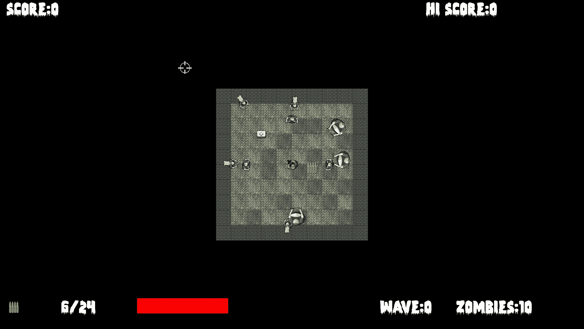
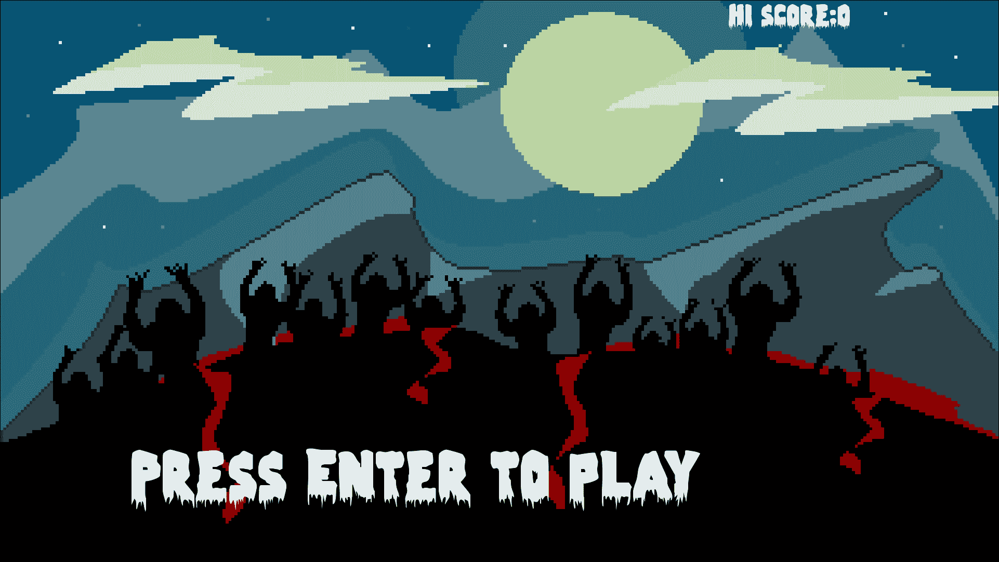
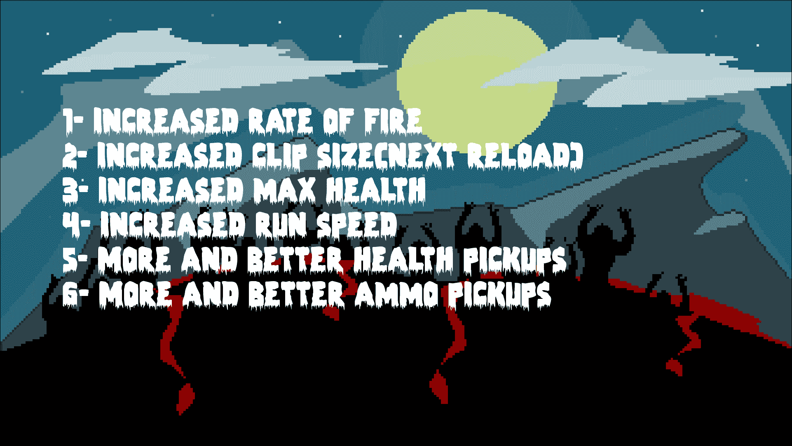
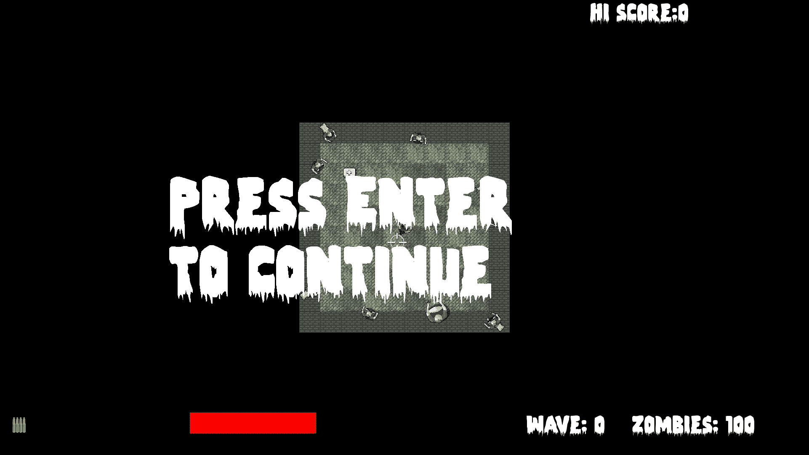
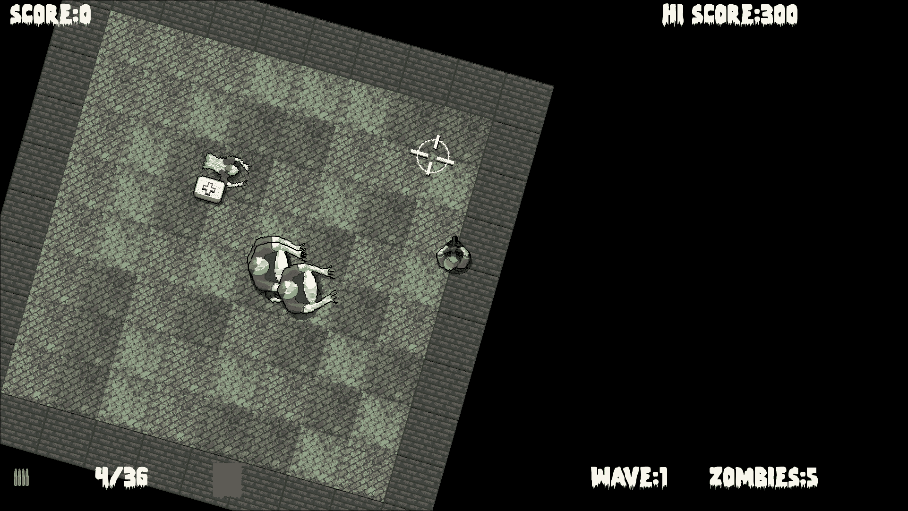

# 第十章。分层视图和实现 HUD

在本章中，我们将看到 SFML **Views**的真正价值。我们将添加大量的 SFML `Text`对象，并像在**Timber!!!**项目中一样操纵它们。新的是，我们将使用第二个视图实例来绘制 HUD。这样，HUD 将始终整齐地定位在主游戏动作的顶部，而不管背景、玩家、僵尸和其他游戏对象在做什么。

这是我们将要做的事情：

+   在主页/游戏结束屏幕上添加文本和背景

+   在升级屏幕上添加文本

+   创建第二个视图

+   添加 HUD

# 添加所有文本和 HUD 对象

在本章中，我们将操纵一些字符串。这样我们就可以格式化 HUD 和升级屏幕。

添加下一个高亮显示的`include`指令，以便我们可以创建一些`sstream`对象来实现这一点：

```cpp
#include "stdafx.h" 
#include <sstream> 
#include <SFML/Graphics.hpp> 
#include "ZombieArena.h" 
#include "Player.h" 
#include "TextureHolder.h" 
#include "Bullet.h" 
#include "Pickup.h" 

using namespace sf; 

```

接下来添加这段相当冗长但易于解释的代码。为了帮助确定应该添加代码的位置，新代码已经高亮显示，而现有代码没有。您可能需要调整一些文本/元素的位置/大小以适应您的屏幕：

```cpp
int score = 0; 
int hiScore = 0; 

// For the home/game over screen
Sprite spriteGameOver;
Texture textureGameOver = 
TextureHolder::GetTexture("graphics/background.png");
spriteGameOver.setTexture(textureGameOver);
spriteGameOver.setPosition(0, 0);

// Create a view for the HUD
View hudView(sf::FloatRect(0, 0, resolution.x, resolution.y));

// Create a sprite for the ammo icon
Sprite spriteAmmoIcon;
Texture textureAmmoIcon = 
TextureHolder::GetTexture("graphics/ammo_icon.png");
spriteAmmoIcon.setTexture(textureAmmoIcon);
spriteAmmoIcon.setPosition(20, 980);

// Load the font
Font font;
font.loadFromFile("fonts/zombiecontrol.ttf");

// Paused
Text pausedText;
pausedText.setFont(font);
pausedText.setCharacterSize(155);
pausedText.setFillColor(Color::White);
pausedText.setPosition(400, 400);
pausedText.setString("Press Enter \n to continue");

// Game Over
Text gameOverText;
gameOverText.setFont(font);
gameOverText.setCharacterSize(125);
gameOverText.setFillColor(Color::White);
gameOverText.setPosition(250, 850);
gameOverText.setString("Press Enter to play");

// LEVELING up
Text levelUpText;
levelUpText.setFont(font);
levelUpText.setCharacterSize(80);
levelUpText.setFillColor(Color::White);
levelUpText.setPosition(150, 250);
std::stringstream levelUpStream;
levelUpStream <<
   "1- Increased rate of fire" <<
   "\n2- Increased clip size(next reload)" <<
   "\n3- Increased max health" <<
   "\n4- Increased run speed" <<
   "\n5- More and better health pickups" <<
   "\n6- More and better ammo pickups";
levelUpText.setString(levelUpStream.str());

// Ammo
Text ammoText;
ammoText.setFont(font);
ammoText.setCharacterSize(55);
ammoText.setColor(Color::White);
ammoText.setPosition(200, 980);

// Score
Text scoreText;
scoreText.setFont(font);
scoreText.setCharacterSize(55);
scoreText.setFillColor(Color::White);
scoreText.setPosition(20, 0);

// Hi Score
Text hiScoreText;
hiScoreText.setFont(font);
hiScoreText.setCharacterSize(55);
hiScoreText.setFillColor(Color::White);
hiScoreText.setPosition(1400, 0);
std::stringstream s;
s << "Hi Score:" << hiScore;
hiScoreText.setString(s.str());

// Zombies remaining
Text zombiesRemainingText;
zombiesRemainingText.setFont(font);
zombiesRemainingText.setCharacterSize(55);
zombiesRemainingText.setFillColor(Color::White);
zombiesRemainingText.setPosition(1500, 980);
zombiesRemainingText.setString("Zombies: 100");

// Wave number
int wave = 0;
Text waveNumberText;
waveNumberText.setFont(font);
waveNumberText.setCharacterSize(55);
waveNumberText.setFillColor(Color::White);
waveNumberText.setPosition(1250, 980);
waveNumberText.setString("Wave: 0");

// Health bar
RectangleShape healthBar;
healthBar.setFillColor(Color::Red);
healthBar.setPosition(450, 980); 
// The main game loop 
while (window.isOpen()) 

```

先前的代码非常简单，没有什么新东西。它基本上创建了一堆 SFML `Text`对象。它分配它们的颜色和大小，然后格式化它们的位置，使用我们之前见过的函数。

最重要的是，我们创建了另一个名为`hudView`的`View`对象，并将其初始化为适应屏幕的分辨率。

正如我们所看到的，主视图对象随着玩家的移动而滚动。相比之下，我们永远不会移动`hudView`。这样做的结果是，只要在绘制 HUD 元素之前切换到这个视图，我们就会产生这样的效果：游戏世界在下方滚动，而玩家的 HUD 保持静止。

### 提示

类比一下，您可以想象在电视屏幕上放置一张带有一些文字的透明塑料片。电视将继续正常播放移动图片，而塑料片上的文字将保持在同一位置，不管下面发生了什么。

然而，下一件要注意的事情是，高分并没有以任何有意义的方式设置。我们需要等到下一章，当我们调查文件 I/O 以保存和检索高分时。

值得注意的另一点是，我们声明并初始化了一个名为`healthBar`的`RectangleShape`，它将是玩家剩余生命的视觉表示。这将几乎与上一个项目中的时间条工作方式完全相同，当然，它代表的是生命而不是时间。

在先前的代码中，有一个名为`ammoIcon`的新精灵，它为我们将在屏幕左下角旁边绘制的子弹和弹夹统计数据提供了上下文。

虽然我们刚刚添加的大量代码没有什么新的或技术性的，但一定要熟悉细节，特别是变量名，以便更容易跟随本章的其余部分。

# 每帧更新 HUD

正如您所期望的，我们将在代码的更新部分更新 HUD 变量。然而，我们不会在每一帧都这样做。原因是这是不必要的，而且还会减慢我们的游戏循环速度。

举个例子，考虑这样一种情况：玩家杀死了一个僵尸并获得了一些额外的分数。无论`Text`对象中的分数是在千分之一秒、百分之一秒，甚至十分之一秒内更新，玩家都不会察觉到任何区别。这意味着没有必要在每一帧重新构建我们设置给`Text`对象的字符串。

因此，我们可以确定何时以及多久更新 HUD，添加以下变量：

```cpp
// When did we last update the HUD?
int framesSinceLastHUDUpdate = 0;

// How often (in frames) should we update the HUD
int fpsMeasurementFrameInterval = 1000; 

// The main game loop 
while (window.isOpen()) 

```

在先前的代码中，我们有变量来跟踪自上次更新 HUD 以来经过了多少帧，以及我们希望在 HUD 更新之间等待的帧数间隔。

现在我们可以使用这些新变量并实际上每帧更新 HUD。然而，直到我们开始操纵最终变量（例如`wave`）在下一章中，我们才会真正看到所有 HUD 元素的变化。

按照以下所示，在游戏循环的更新部分中添加突出显示的代码：

```cpp
   // Has the player touched ammo pickup 
   if (player.getPosition().intersects 
      (ammoPickup.getPosition()) && ammoPickup.isSpawned()) 
   { 
      bulletsSpare += ammoPickup.gotIt(); 

   } 

 // size up the health bar
   healthBar.setSize(Vector2f(player.getHealth() * 3, 50));
   // Increment the number of frames since the previous update
   framesSinceLastHUDUpdate++;

   // re-calculate every fpsMeasurementFrameInterval frames
   if (framesSinceLastHUDUpdate > fpsMeasurementFrameInterval)
   {
     // Update game HUD text
     std::stringstream ssAmmo;
     std::stringstream ssScore;
     std::stringstream ssHiScore;
     std::stringstream ssWave;
     std::stringstream ssZombiesAlive;

     // Update the ammo text
     ssAmmo << bulletsInClip << "/" << bulletsSpare;
     ammoText.setString(ssAmmo.str());

     // Update the score text
     ssScore << "Score:" << score;
     scoreText.setString(ssScore.str());

     // Update the high score text
     ssHiScore << "Hi Score:" << hiScore;
     hiScoreText.setString(ssHiScore.str());

     // Update the wave
     ssWave << "Wave:" << wave;
     waveNumberText.setString(ssWave.str());

     // Update the high score text
     ssZombiesAlive << "Zombies:" << numZombiesAlive;
     zombiesRemainingText.setString(ssZombiesAlive.str());

     framesSinceLastHUDUpdate = 0;

   }// End HUD update 

}// End updating the scene 

```

在新代码中，我们更新了`healthBar`精灵的大小，增加了`timeSinceLastUpdate`对象，然后增加了`framesSinceLastUpdate`变量。

接下来，我们开始一个`if`块，测试`framesSinceLastHUDUpdate`是否大于我们存储在`fpsMeasurementFrameInterval`中的首选间隔。

在这个`if`块中是所有操作发生的地方。首先，我们为需要设置为`Text`对象的每个字符串声明一个字符串流对象。

然后我们依次使用这些字符串流对象，并使用`setString`函数将结果设置为适当的`Text`对象。

最后，在退出`if`块之前，将`framesSinceLastHUDUpdate`设置回零，以便计数可以重新开始。

现在，当我们重新绘制场景时，新值将出现在玩家的 HUD 中。

# 绘制 HUD，主页和升级屏幕

接下来三个代码块中的所有代码都在游戏循环的绘制阶段中。我们只需要在主游戏循环的绘制部分的适当状态下绘制适当的`Text`对象。

在`PLAYING`状态下，添加以下突出显示的代码：

```cpp
   //Draw the crosshair 
   window.draw(spriteCrosshair); 

 // Switch to the HUD view
   window.setView(hudView);

   // Draw all the HUD elements
   window.draw(spriteAmmoIcon);
   window.draw(ammoText);
   window.draw(scoreText);
   window.draw(hiScoreText);
   window.draw(healthBar);
   window.draw(waveNumberText);
   window.draw(zombiesRemainingText); 
} 

if (state == State::LEVELING_UP) 
{ 
} 

```

在上一个代码块中需要注意的重要事情是，我们切换到了 HUD 视图。这会导致所有东西都以我们给 HUD 的每个元素的精确屏幕位置绘制。它们永远不会移动。

在`LEVELING_UP`状态下，添加以下突出显示的代码：

```cpp
if (state == State::LEVELING_UP) 
{ 
 window.draw(spriteGameOver);
   window.draw(levelUpText); 
} 

```

在`PAUSED`状态下，添加以下突出显示的代码：

```cpp
if (state == State::PAUSED) 
{ 
 window.draw(pausedText); 
} 

```

在`GAME_OVER`状态下，添加以下突出显示的代码：

```cpp
if (state == State::GAME_OVER) 
{ 
 window.draw(spriteGameOver);
   window.draw(gameOverText);
   window.draw(scoreText);
   window.draw(hiScoreText); 
} 

```

现在我们可以运行游戏，并在游戏过程中看到我们的 HUD 更新。



这显示了主页/游戏结束屏幕上的**HI SCORE**和得分：



接下来，我们看到文本显示玩家的升级选项，尽管这些选项目前还没有任何作用。



在这里，我们在暂停屏幕上看到了一条有用的消息：



### 提示

SFML Views 比这个简单的 HUD 更强大。要了解 SFML Views 的潜力以及它们的易用性，可以查看 SFML 网站关于`View`的教程[`www.sfml-dev.org/tutorials/2.0/graphics-view.php`](http://www.sfml-dev.org/tutorials/2.0/graphics-view.php)。

# FAQ

这里可能会有一个让您在意的问题：

Q）我在哪里可以看到`View`类的更多功能？

A）查看下载包中**Zombie Arena**游戏的增强版。您可以使用键盘光标键旋转和缩放操作。警告！旋转场景会使控制变得笨拙，但您可以看到`View`类可以做的一些事情。



缩放和旋转功能是在主游戏循环的输入处理部分中只用了几行代码就实现的。您可以在下载包的`Zombie Arena Enhanced Version`文件夹中查看代码，或者从`Runnable Games/Zombie Arena`文件夹中运行增强版。

# 总结

这是一个快速简单的章节。我们看到了如何使用`sstream`显示不同类型的变量持有的值，然后使用第二个 SFML`View`对象在主游戏动作的顶部绘制它们。

我们现在几乎完成了僵尸竞技场。所有的截图都显示了一个小竞技场，没有充分利用整个显示器。在这个项目的最后阶段，我们将加入一些最后的修饰，比如升级、音效和保存最高分。竞技场可以随后扩大到与显示器相同的大小甚至更大。
