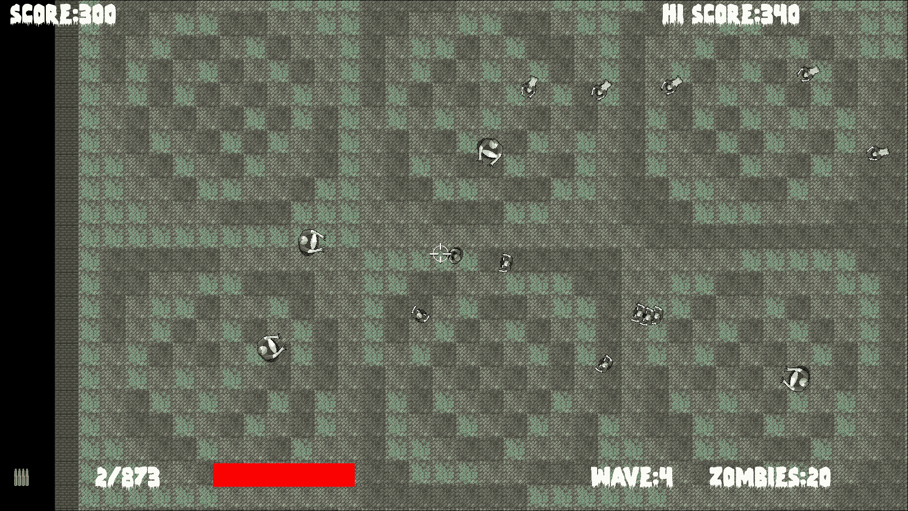

# 第十一章：音效，文件 I/O 和完成游戏

我们快要完成了。这一小节将演示如何使用 C++标准库轻松操作存储在硬盘上的文件，我们还将添加音效。当然，我们知道如何添加音效，但我们将讨论在代码中`play`的调用应该放在哪里。我们还将解决一些问题，使游戏完整。

在本章中，我们将学习以下主题：

+   保存和加载最高分

+   添加音效

+   允许玩家升级

+   创建永无止境的多波

# 保存和加载最高分

文件 I/O，或输入/输出，是一个相当技术性的主题。幸运的是，由于它在编程中是一个如此常见的需求，有一个库可以为我们处理所有的复杂性。与我们为 HUD 连接字符串一样，是**标准库**通过`fstream`提供了必要的功能。

首先，我们以与包含`sstream`相同的方式包含`fstream`：

```cpp
#include "stdafx.h" 
#include <sstream> 
#include <fstream> 
#include <SFML/Graphics.hpp> 
#include "ZombieArena.h" 
#include "Player.h" 
#include "TextureHolder.h" 
#include "Bullet.h" 
#include "Pickup.h" 

using namespace sf; 

```

现在，在`ZombieArena/ZombieArena`文件夹中添加一个名为`gamedata`的新文件夹。接下来，在此文件夹中右键单击，创建一个名为`scores.txt`的新文件。我们将保存玩家的最高分数在这个文件中。您可以打开文件并向其中添加分数。如果您这样做，请确保它是一个相当低的分数，这样我们就可以轻松测试是否击败该分数会导致新分数被添加。确保在完成后关闭文件，否则游戏将无法访问它。

在下一段代码中，我们创建了一个名为`InputFile`的`ifstream`对象，并将刚刚创建的文件夹和文件作为参数传递给它的构造函数。

`if(InputFile.is_open())`代码检查文件是否存在并准备好读取。然后我们将文件的内容放入`hiScore`中并关闭文件。添加突出显示的代码：

```cpp
// Score 
Text scoreText; 
scoreText.setFont(font); 
scoreText.setCharacterSize(55); 
scoreText.setFillColor(Color::White); 
scoreText.setPosition(20, 0); 

// Load the high-score from a text file
std::ifstream inputFile("gamedata/scores.txt");
if (inputFile.is_open())
{
   inputFile >> hiScore;
   inputFile.close();
} 

// Hi Score 
Text hiScoreText; 
hiScoreText.setFont(font); 
hiScoreText.setCharacterSize(55); 
hiScoreText.setFillColor(Color::White); 
hiScoreText.setPosition(1400, 0); 
std::stringstream s; 
s << "Hi Score:" << hiScore; 
hiScoreText.setString(s.str()); 

```

现在我们处理保存可能的新最高分。在处理玩家健康小于或等于零的块中，我们创建一个名为`outputFile`的`ofstream`对象，将`hiScore`的值写入文本文件，然后关闭文件：

```cpp
// Have any zombies touched the player        
for (int i = 0; i < numZombies; i++) 
{ 
   if (player.getPosition().intersects 
      (zombies[i].getPosition()) && zombies[i].isAlive()) 
   { 

      if (player.hit(gameTimeTotal)) 
      { 
         // More here later 
      } 

      if (player.getHealth() <= 0) 
      { 
        state = State::GAME_OVER; 

 std::ofstream outputFile("gamedata/scores.txt");
        outputFile << hiScore;
        outputFile.close(); 

      } 
   } 
}// End player touched 

```

您可以玩游戏，您的最高分将被保存。退出游戏并注意，如果您再次玩游戏，您的最高分仍然存在。

让我们制造一些噪音。

# 准备音效

在本节中，我们将创建所有我们需要为游戏添加一系列音效的`SoundBuffer`和`Sound`对象。

首先添加所需的 SFML 包含文件：

```cpp
#include "stdafx.h" 
#include <sstream> 
#include <fstream> 
#include <SFML/Graphics.hpp> 
#include <SFML/Audio.hpp> 
#include "ZombieArena.h" 
#include "Player.h" 
#include "TextureHolder.h" 
#include "Bullet.h" 
#include "Pickup.h" 

```

现在继续添加七个`SoundBuffer`和`Sound`对象，它们加载和准备了我们在第六章中准备的七个音频文件：

```cpp
// When did we last update the HUD? 
int framesSinceLastHUDUpdate = 0; 
// What time was the last update 
Time timeSinceLastUpdate; 
// How often (in frames) should we update the HUD 
int fpsMeasurementFrameInterval = 1000; 

// Prepare the hit sound
SoundBuffer hitBuffer;
hitBuffer.loadFromFile("sound/hit.wav");
Sound hit;
hit.setBuffer(hitBuffer);

// Prepare the splat sound
SoundBuffer splatBuffer;
splatBuffer.loadFromFile("sound/splat.wav");
sf::Sound splat;
splat.setBuffer(splatBuffer);

// Prepare the shoot soundSoundBuffer shootBuffer;shootBuffer.loadFromFile("sound/shoot.wav");
Sound shoot;shoot.setBuffer(shootBuffer);

// Prepare the reload sound
SoundBuffer reloadBuffer;
reloadBuffer.loadFromFile("sound/reload.wav");
Sound reload;
reload.setBuffer(reloadBuffer);

// Prepare the failed sound
SoundBuffer reloadFailedBuffer;
reloadFailedBuffer.loadFromFile("sound/reload_failed.wav");
Sound reloadFailed;
reloadFailed.setBuffer(reloadFailedBuffer);

// Prepare the powerup sound
SoundBuffer powerupBuffer;
powerupBuffer.loadFromFile("sound/powerup.wav");
Sound powerup;
powerup.setBuffer(powerupBuffer);

// Prepare the pickup sound
SoundBuffer pickupBuffer;
pickupBuffer.loadFromFile("sound/pickup.wav");
Sound pickup;
pickup.setBuffer(pickupBuffer); 

// The main game loop 
while (window.isOpen()) 

```

现在七个音效已经准备好播放。我们只需要弄清楚在我们的代码中每个`play`函数的调用应该放在哪里。

# 升级

我们将添加的下一段代码使玩家可以在波之间升级。由于我们已经完成的工作，这是很容易实现的。

在我们处理玩家输入的`LEVELING_UP`状态中添加突出显示的代码：

```cpp
// Handle the LEVELING up state 
if (state == State::LEVELING_UP) 
{ 
   // Handle the player LEVELING up 
   if (event.key.code == Keyboard::Num1) 
   { 
 // Increase fire rate
     fireRate++; 
     state = State::PLAYING; 
   } 

   if (event.key.code == Keyboard::Num2) 
   { 
 // Increase clip size
     clipSize += clipSize; 
     state = State::PLAYING; 
   } 

   if (event.key.code == Keyboard::Num3) 
   { 
 // Increase health
     player.upgradeHealth(); 
     state = State::PLAYING; 
   } 

   if (event.key.code == Keyboard::Num4) 
   { 
 // Increase speed
     player.upgradeSpeed(); 
     state = State::PLAYING; 
   } 

   if (event.key.code == Keyboard::Num5) 
   { 
 // Upgrade pickup
     healthPickup.upgrade(); 
     state = State::PLAYING; 
   } 

   if (event.key.code == Keyboard::Num6) 
   { 
 // Upgrade pickup
     ammoPickup.upgrade(); 
     state = State::PLAYING; 
   } 

   if (state == State::PLAYING) 
   { 

```

玩家现在可以在每次清除一波僵尸时升级。然而，我们目前无法增加僵尸的数量或级别的大小。

在`LEVELING_UP`状态的下一部分，在我们刚刚添加的代码之后，修改从`LEVELING_UP`到`PLAYING`状态改变时运行的代码。

以下是完整的代码。我已经突出显示了要么是新的要么已经稍作修改的行。

添加或修改突出显示的代码：

```cpp
   if (event.key.code == Keyboard::Num6) 
   { 
      ammoPickup.upgrade(); 
      state = State::PLAYING; 
   } 

   if (state == State::PLAYING) 
   { 
 // Increase the wave number
     wave++; 

     // Prepare thelevel 
     // We will modify the next two lines later 
 arena.width = 500 * wave;
     arena.height = 500 * wave; 
     arena.left = 0; 
     arena.top = 0; 

     // Pass the vertex array by reference  
     // to the createBackground function 
     int tileSize = createBackground(background, arena); 

     // Spawn the player in the middle of the arena 
     player.spawn(arena, resolution, tileSize); 

     // Configure the pickups 
     healthPickup.setArena(arena); 
     ammoPickup.setArena(arena); 

     // Create a horde of zombies 
 numZombies = 5 * wave; 

     // Delete the previously allocated memory (if it exists) 
     delete[] zombies; 
     zombies = createHorde(numZombies, arena); 
     numZombiesAlive = numZombies; 

 // Play the powerup sound
     powerup.play(); 

     // Reset the clock so there isn't a frame jump 
     clock.restart(); 
   } 
}// End LEVELING up 

```

前面的代码首先递增`wave`变量。然后修改代码，使僵尸的数量和竞技场的大小与`wave`的新值相关。最后，我们添加了`powerup.play()`的调用来播放升级音效。

# 重新启动游戏

我们已经通过`wave`变量的值确定了竞技场的大小和僵尸的数量。我们还必须在每场新游戏开始时将弹药、枪支、`wave`和`score`重置为零。在游戏循环的事件处理部分找到以下代码，并添加高亮显示的代码：

```cpp
// Start a new game while in GAME_OVER state 
else if (event.key.code == Keyboard::Return && 
   state == State::GAME_OVER) 
{ 
   state = State::LEVELING_UP; 
 wave = 0;
   score = 0;

   // Prepare the gun and ammo for next game
   currentBullet = 0;
   bulletsSpare = 24;
   bulletsInClip = 6;
   clipSize = 6;
   fireRate = 1;

   // Reset the player's stats
   player.resetPlayerStats(); 
} 

```

现在我们可以玩游戏了，玩家可以在不断增大的竞技场中变得更加强大，而僵尸的数量也会不断增加，直到他死亡，然后一切重新开始。

# 播放其余的声音

现在我们将添加对`play`函数的其余调用。我们会逐个处理它们，因为准确确定它们的位置对于在正确时刻播放它们至关重要。

## 添加玩家重新装填时的声音效果

在三个地方添加高亮显示的代码，以在玩家按下***R***键尝试重新装填枪支时播放适当的`reload`或`reloadFailed`声音：

```cpp
if (state == State::PLAYING) 
{ 
   // Reloading 
   if (event.key.code == Keyboard::R) 
   { 
      if (bulletsSpare >= clipSize) 
      { 
         // Plenty of bullets. Reload. 
         bulletsInClip = clipSize; 
         bulletsSpare -= clipSize;      
 reload.play(); 
      } 
      else if (bulletsSpare > 0) 
      { 
         // Only few bullets left 
         bulletsInClip = bulletsSpare; 
         bulletsSpare = 0;           
 reload.play(); 
      } 
      else 
      { 
         // More here soon?! 
 reloadFailed.play(); 
      } 
   } 
} 

```

## 发出射击声音

在处理玩家点击鼠标左键的代码末尾附近添加对`shoot.play()`的高亮调用：

```cpp
// Fire a bullet 
if (sf::Mouse::isButtonPressed(sf::Mouse::Left)) 
{ 

   if (gameTimeTotal.asMilliseconds() 
      - lastPressed.asMilliseconds() 
      > 1000 / fireRate && bulletsInClip > 0) 
   { 

      // Pass the centre of the player and crosshair 
      // to the shoot function 
      bullets[currentBullet].shoot( 
         player.getCenter().x, player.getCenter().y, 
         mouseWorldPosition.x, mouseWorldPosition.y); 

      currentBullet++; 
      if (currentBullet > 99) 
      { 
         currentBullet = 0; 
      } 
      lastPressed = gameTimeTotal; 

 shoot.play(); 

      bulletsInClip--; 
   } 

}// End fire a bullet 

```

## 在玩家被击中时播放声音

在下面的代码中，我们将对`hit.play`的调用包装在一个测试中，以查看`player.hit`函数是否返回`true`。请记住，`player.hit`函数用于测试前 100 毫秒内是否记录了击中。这将导致播放一个快速、重复的、沉闷的声音，但不会太快以至于声音模糊成一个噪音。

在这里添加对`hit.play`的调用：

```cpp
// Have any zombies touched the player        
for (int i = 0; i < numZombies; i++) 
{ 
   if (player.getPosition().intersects 
      (zombies[i].getPosition()) && zombies[i].isAlive()) 
   { 

      if (player.hit(gameTimeTotal)) 
      { 
         // More here later 
 hit.play(); 
      } 

      if (player.getHealth() <= 0) 
      { 
         state = State::GAME_OVER; 

         std::ofstream OutputFile("gamedata/scores.txt"); 
         OutputFile << hiScore; 
         OutputFile.close(); 

      } 
   } 
}// End player touched 

```

## 在拾取时播放声音

当玩家拾取生命值时，我们会播放常规的拾取声音，但当玩家获得弹药时，我们会播放重新装填的声音效果。

在适当的碰撞检测代码中，添加如下高亮显示的两个调用来播放声音：

```cpp
// Has the player touched health pickup 
if (player.getPosition().intersects 
   (healthPickup.getPosition()) && healthPickup.isSpawned()) 
{ 
   player.increaseHealthLevel(healthPickup.gotIt()); 
 // Play a sound
   pickup.play(); 

} 

// Has the player touched ammo pickup 
if (player.getPosition().intersects 
   (ammoPickup.getPosition()) && ammoPickup.isSpawned()) 
{ 
   bulletsSpare += ammoPickup.gotIt(); 
 // Play a sound
   reload.play(); 

} 

```

## 当射中僵尸时发出尖啸声

在检测子弹与僵尸碰撞的代码部分末尾添加对`splat.play`的调用：

```cpp
// Have any zombies been shot? 
for (int i = 0; i < 100; i++) 
{ 
   for (int j = 0; j < numZombies; j++) 
   { 
      if (bullets[i].isInFlight() &&  
         zombies[j].isAlive()) 
      { 
         if (bullets[i].getPosition().intersects 
            (zombies[j].getPosition())) 
         { 
            // Stop the bullet 
            bullets[i].stop(); 

            // Register the hit and see if it was a kill 
            if (zombies[j].hit()) { 
               // Not just a hit but a kill too 
               score += 10; 
               if (score >= hiScore) 
               { 
                  hiScore = score; 
               } 

               numZombiesAlive--; 

               // When all the zombies are dead (again) 
               if (numZombiesAlive == 0) { 
                  state = State::LEVELING_UP; 
               } 
            }   

 // Make a splat sound
           splat.play(); 

         } 
      } 

   } 
}// End zombie being shot 

```

您现在可以玩完整的游戏，并观看每一波僵尸和竞技场的增加。谨慎选择您的升级：



恭喜！

# 常见问题解答

以下是您可能会考虑的一些问题：

问：尽管使用了类，我发现代码变得非常冗长和难以管理，再次。

答：最大的问题之一是我们的代码结构。随着我们学习更多的 C++，我们也会学会使代码更易管理，通常更简洁。

问：声音效果似乎有点单调和不真实。如何改进？

答：显著改善玩家从声音中获得的感觉的一种方法是使声音具有方向性，并根据声源到玩家角色的距离改变音量。在下一个项目中，我们将使用 SFML 的高级声音功能。

# 总结

我们已经完成了僵尸竞技场游戏。这是一次相当的旅程。我们学到了很多 C++基础知识，比如引用、指针、面向对象编程和类。此外，我们还使用了 SFML 来管理摄像机、顶点数组和碰撞检测。我们学会了如何使用精灵表来减少对`window.draw`的调用次数，并提高帧率。使用 C++指针、STL 和一点面向对象编程，我们构建了一个单例类来管理我们的纹理，在下一个项目中，我们将扩展这个想法来管理我们游戏的所有资源。

在本书的结束项目中，我们将探索粒子效果、定向声音和分屏多人游戏。在 C++中，我们还将遇到继承、多态和一些新概念。
