# 第十二章：抽象和代码管理 - 更好地利用 OOP

在本章中，我们将首次查看本书的最终项目。该项目将具有高级特点，如方向性声音，根据玩家位置从扬声器发出。它还将具有分屏合作游戏。此外，该项目还将引入**着色器**的概念，这是用另一种语言编写的程序，直接在图形卡上运行。到第十六章结束时，您将拥有一个完全功能的多人平台游戏，以命中经典**托马斯独自一人**的风格构建。

本章的主要重点将是启动项目，特别是探索如何构建代码结构以更好地利用 OOP。将涵盖以下主题：

+   最终项目《托马斯迟到》，包括游戏特点和项目资产的介绍

+   详细讨论我们将如何改进代码结构，与之前的项目相比

+   编写《托马斯迟到》游戏引擎

+   实施分屏功能

# 《托马斯迟到的游戏》

此时，如果您还没有，我建议您去观看《托马斯独自一人》的视频[`store.steampowered.com/app/220780/`](http://store.steampowered.com/app/220780/)。请注意其简单但美观的图形。视频还展示了各种游戏挑战，例如使用角色的不同属性（身高，跳跃，力量等）。为了保持我们的游戏简单而不失挑战，我们将比《托马斯独自一人》少一些解谜特点，但将增加需要两名玩家合作玩游戏的挑战。为了确保游戏不会太容易，我们还将让玩家与时间赛跑，这就是我们的游戏名字叫《托马斯迟到》的原因。

## 《托马斯迟到的特点》

我们的游戏不会像我们试图模仿的杰作那样先进，但它将具有一系列令人兴奋的游戏特点：

+   一个从适合关卡挑战的时间开始倒计时的时钟。

+   发射火坑会根据玩家的位置发出咆哮声，并在玩家掉下去时重新生成玩家。水坑也有同样的效果，但没有方向性的声音效果。

+   合作游戏 - 两名玩家必须在规定的时间内将他们的角色带到目标。他们经常需要一起工作，例如，身材较矮，跳跃力较低的鲍勃需要站在他朋友（托马斯）的头上。

+   玩家将有选择在全屏和分屏之间切换，因此他可以尝试自己控制两个角色。

+   每个关卡将设计并从文本文件中加载。这将使设计各种各样的关卡变得非常容易。

看看游戏的注释截图，看看一些特点的实际操作和组件/资产，构成了游戏：

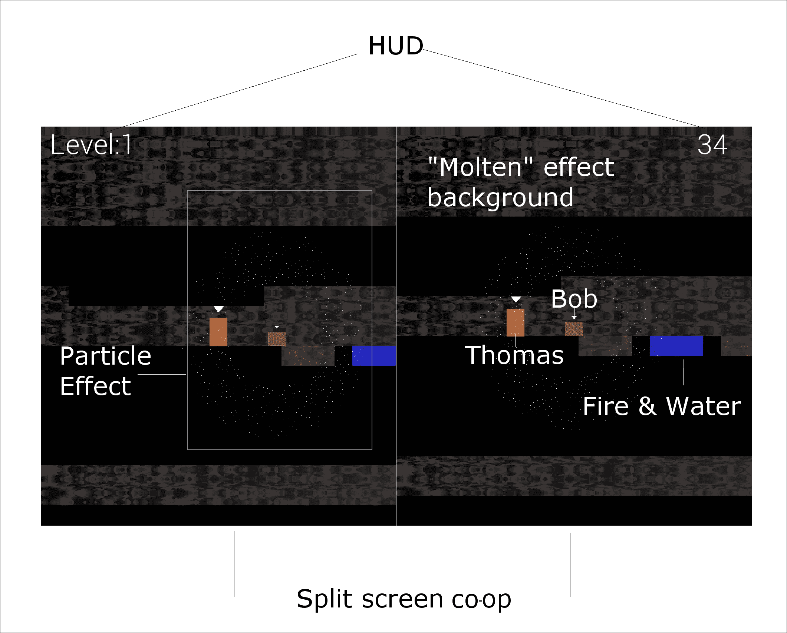

让我们看看这些特点，并描述一些更多的特点：

+   截图显示了一个简单的 HUD，详细说明了关卡编号和剩余秒数，直到玩家失败并不得不重新开始关卡。

+   您还可以清楚地看到分屏合作模式的实际操作。请记住这是可选的。单人玩家可以全屏玩游戏，同时在托马斯和鲍勃之间切换摄像头焦点。

+   在截图中并不是很清楚（尤其是在打印品中），但是当一个角色死亡时，他会爆炸成星花/烟火般的粒子效果。

+   水和火砖可以被策略性地放置，使得关卡更有趣，并迫使角色之间合作。更多内容请参见第十四章，“构建可玩关卡和碰撞检测”。

+   注意 Thomas 和 Bob——它们不仅在高度上不同，而且跳跃能力也有显著不同。这意味着 Bob 依赖于 Thomas 进行大跳跃，可以设计关卡来迫使 Thomas 选择避免碰头的路线。

+   此外，火砖会发出咆哮声。这些声音将与 Thomas 的位置有关。它们不仅是方向性的，可以从左侧或右侧扬声器发出，而且随着 Thomas 离开或接近源头，声音会变得越来越大或越来越小。

+   最后，在带注释的截图中，您可以看到背景。如果您将其与`background.png`文件（本章后面显示）进行比较，您会发现它们是完全不同的。我们将在第十六章，“扩展 SFML 类、粒子系统和着色器”中使用 OpenGL 着色器效果来实现背景中移动的——几乎是冒泡的——效果。

所有这些功能都需要更多的截图，这样我们在编写 C++代码时可以记住最终的产品。

以下截图显示了 Thomas 和 Bob 到达一个火坑，Bob 没有机会跳过去：

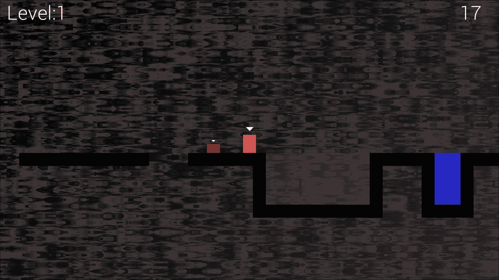

以下截图显示了 Bob 和 Thomas 合作清除一个危险的跳跃：

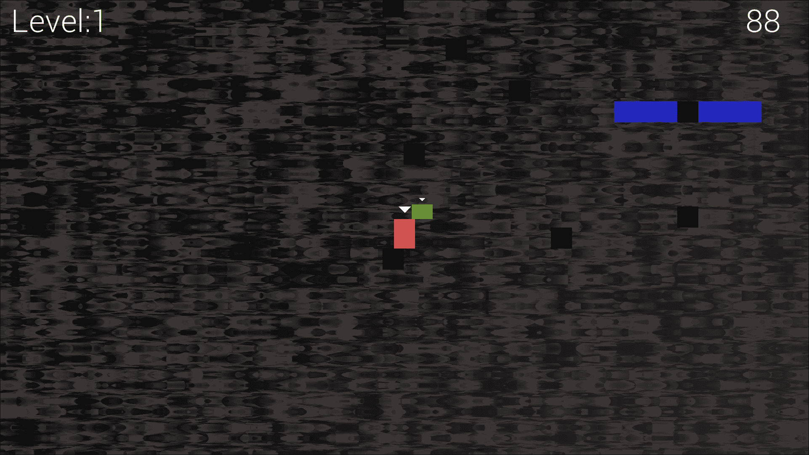

以下截图显示了我们如何设计需要“信仰之跃”才能达到目标的谜题：

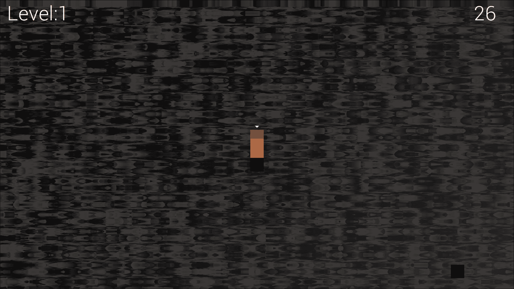

以下截图展示了我们如何设计几乎任意大小的压抑洞穴系统。我们还可以设计需要 Bob 和 Thomas 分开并走不同路线的关卡：

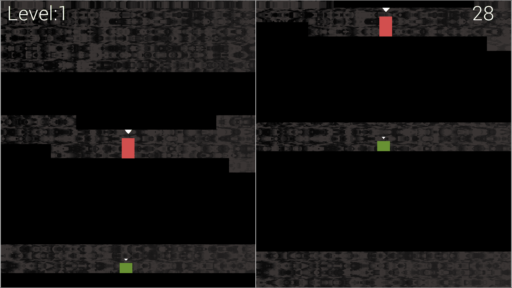

## 从模板创建项目

创建“Thomas Was Late”项目与其他两个项目相同。只需在 Visual Studio 中按照这些简单的步骤进行操作：

1.  从主菜单中选择**文件** | **新建项目**。

1.  确保在左侧菜单中选择**Visual C++**，然后从所呈现的选项列表中选择**HelloSFML**。以下截图应该可以说明这一点：

1.  在**名称：**字段中，键入`TWL`，并确保**为解决方案创建目录**选项已被选中。现在点击**确定**。

1.  现在我们需要将 SFML 的`.dll`文件复制到主项目目录中。我的主项目目录是`D:\Visual Studio Stuff\Projects\ TWL\TWL`。这个文件夹是在上一步中由 Visual Studio 创建的。如果您将`Projects`文件夹放在其他地方，请在那里执行此步骤。我们需要复制到`project`文件夹中的文件位于您的`SFML\bin`文件夹中。为每个位置打开一个窗口，并突出显示所需的`.dll`文件。

1.  现在将突出显示的文件复制并粘贴到项目中。

项目现在已经设置好，准备就绪。

## 项目资源

该项目中的资源比僵尸竞技场游戏中的资源更加丰富和多样。通常，资源包括屏幕上的字体、不同动作的声音效果（如跳跃、达到目标或远处火焰的咆哮）以及 Thomas 和 Bob 的图形以及所有背景砖块的精灵表。

游戏所需的所有资源都包含在下载包中。它们分别位于`第十二章/图形`和`第十二章/声音`文件夹中。

所需的字体没有提供。这是因为我想避免任何可能的许可歧义。不过这不会造成问题，因为我会准确地向你展示在哪里以及如何选择和下载字体。

虽然我会提供资产本身或者获取它们的信息，但你可能也想自己创建和获取它们。

除了我们期望的图形、声音和字体之外，这个游戏还有两种新的资产类型。它们是关卡设计文件和 GLSL 着色器程序。让我们接下来了解一下它们各自的情况。

### 游戏关卡设计

所有的关卡都是在一个文本文件中创建的。通过使用 0 到 3 的数字，我们可以构建挑战玩家的关卡设计。所有的关卡设计都在与其他资产相同目录下的 levels 文件夹中。现在可以随意偷看一下，但我们将在第十四章中详细讨论，*构建可玩关卡和碰撞检测*。

除了这些关卡设计资产，我们还有一种特殊类型的图形资产，叫做着色器。

### GLSL 着色器

着色器是用**GLSL**（图形库着色语言）编写的程序。不用担心要学习另一种语言，因为我们不需要深入学习就能利用着色器。着色器很特殊，因为它们是完整的程序，与我们的 C++代码分开，由 GPU 每一帧执行。事实上，一些着色器程序每一帧都会运行，对每一个像素！我们将在第十六章中了解更多细节，*扩展 SFML 类、粒子系统和着色器*。如果你等不及了，可以看一下下载包的`Chapter 12/shaders`文件夹中的文件。

### 图形资产特写

图形资产构成了我们游戏场景的部分。看一下图形资产，就能清楚地知道它们在我们的游戏中将被使用在哪里：

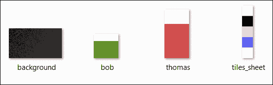

如果`tiles_sheet`图形上的图块看起来与游戏截图有些不同，那是因为它们部分是透明的，背景透过显示会使它们有些变化。如果背景图与游戏截图中的实际背景完全不同，那是因为我们将编写的着色器程序会每一帧操纵每一个像素，创造一种"熔化"效果。

### 声音资产特写

声音文件都是`.wav`格式。这些文件包含了我们在游戏中的某些事件中播放的音效。它们如下：

+   `fallinfire.wav`：当玩家的头进入火焰并且没有逃脱的机会时会播放这个音效。

+   `fallinwater.wav`：水和火一样会导致死亡。这个音效会通知玩家他们需要从关卡的开始重新开始。

+   `fire1.wav`：这个音效是以单声道录制的。它将根据玩家距离火焰图块的距离以不同的音量播放，并根据玩家相对于火焰图块的左右位置从不同的扬声器播放。显然，我们需要学习一些更多的技巧来实现这个功能。

+   `jump.wav`：当玩家跳跃时会播放一个令人愉悦（稍微可预测）的欢呼声。

+   `reachgoal.wav`：当玩家（或玩家）将 Thomas 和 Bob 两个角色都带到目标方块时，会播放令人愉悦的胜利音效。

这些音效非常简单直接，你可以很容易地创建自己的音效。如果你打算替换`fire1.wav`文件，确保将你的声音保存为单声道（而不是立体声）格式。这其中的原因将在第十五章中解释，*声音空间化和 HUD*。

### 将资产添加到项目中

一旦您决定要使用哪些资产，就是将它们添加到项目的时候了。以下说明将假定您使用了书籍下载包中提供的所有资产。

如果您使用自己的资产，只需用您选择的文件替换相应的声音或图形文件，文件名完全相同：

1.  浏览到 Visual `D:\Visual Studio Stuff\Projects\TWL\TWL`目录。

1.  在此文件夹中创建五个新文件夹，并将它们命名为`graphics`，`sound`，`fonts`，`shaders`和`levels`。

1.  从下载包中，将`Chapter 12/graphics`的全部内容复制到`D:\Visual Studio Stuff\Projects\TWL\TWL\graphics`文件夹中。

1.  从下载包中，将`Chapter 12/sound`的全部内容复制到`D:\Visual Studio Stuff\Projects\TWL\TWL\sound`文件夹中。

1.  现在在您的网络浏览器中访问[`www.dafont.com/roboto.font`](http://www.dafont.com/roboto.font)，并下载**Roboto Light**字体。

1.  提取压缩下载的内容，并将`Roboto-Light.ttf`文件添加到`D:\Visual Studio Stuff\Projects\TWL\TWL\fonts`文件夹中。

1.  从下载包中，将`Chapter 12/levels`的全部内容复制到`D:\Visual Studio Stuff\Projects\TWL\TWL\levels`文件夹中。

1.  从下载包中，将`Chapter 12/shaders`的全部内容复制到`D:\Visual Studio Stuff\Projects\TWL\TWL\shaders`文件夹中。

现在我们有了一个新项目，以及整个项目所需的所有资产，我们可以讨论如何构建游戏引擎代码。

# 构建 Thomas Was Late 代码的结构

到目前为止，在两个项目中都很明显的一个问题是代码变得非常冗长和难以控制。OOP 允许我们将项目分解为称为类的逻辑和可管理的块。

通过引入**Engine 类**，我们将大大改善此项目中代码的可管理性。Engine 类将具有三个私有函数，分别是`input`，`update`和`draw`。这应该听起来非常熟悉。这些函数中的每一个将保存以前全部在`main`函数中的代码的一部分。这些函数将分别在自己的代码文件中，`Input.cpp`，`Update.cpp`和`Draw.cpp`中。

`Engine`类中还将有一个公共函数，可以使用`Engine`的实例调用。这个函数是`run`，将负责调用`input`，`update`和`draw`，每帧游戏调用一次：

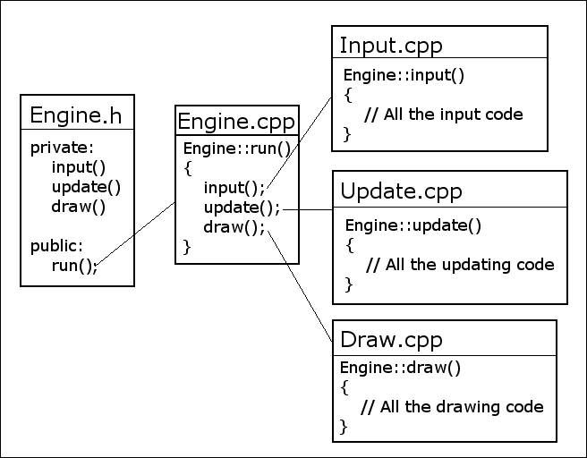

此外，由于我们已经将游戏引擎的主要部分抽象为`Engine`类，我们还可以将许多变量从`main`中移动并将它们作为`Engine`的成员。要启动我们的游戏引擎，我们只需要创建一个`Engine`的实例并调用它的`run`函数。这里是一个超级简单的主函数的预览：

```cpp
int main() 
{ 
   // Declare an instance of Engine 
   Engine engine; 

   // Start the engine 
   engine.run(); 

   // Quit in the usual way when the engine is stopped 
   return 0; 
} 

```

### 提示

暂时不要添加上述代码。

为了使我们的代码更加可管理和可读，我们还将抽象出加载关卡和碰撞检测等重要任务的责任，放到单独的函数中（在单独的代码文件中）。这两个函数分别是`loadLevel`和`detectCollisions`。我们还将编写其他函数来处理 Thomas Was Late 项目的一些新功能。随着它们的出现，我们将详细介绍它们。

为了更好地利用 OOP，我们将完全将游戏特定领域的责任委托给新的类。您可能还记得以前项目中的声音和 HUD 代码非常冗长。我们将构建一个`SoundManager`和`HUD`类来以更清晰的方式处理这些方面。当我们实现它们时，它们的工作方式将被深入探讨。

游戏关卡本身比以前的游戏更加深入，因此我们还将编写一个`LevelManager`类。

正如您所期望的，可玩角色也将使用类制作。但是，对于这个项目，我们将学习更多的 C++，并实现一个`PlayableCharacter`类，其中包含 Thomas 和 Bob 的所有常见功能，然后`Thomas`和`Bob`类，它们将继承这些常见功能，并实现自己的独特功能和能力。这，也许并不奇怪，被称为**继承**。我将在接下来的第十三章，“高级面向对象编程，继承和多态”中更详细地介绍继承。

我们还将实现许多其他类来执行特定的职责。例如，我们将使用粒子系统制作一些漂亮的爆炸效果。您可能能够猜到，为了做到这一点，我们将编写一个`Particle`类和一个`ParticleSystem`类。所有这些类都将作为`Engine`类的成员具有实例。以这种方式做事将使游戏的所有功能都可以从游戏引擎中访问，但将细节封装到适当的类中。

在我们继续查看将创建 Engine 类的实际代码之前，要提到的最后一件事是，我们将重用我们为“Zombie Arena”游戏讨论和编写的`TextureHolder`类，而不做任何更改。

# 构建游戏引擎

如前面的讨论所建议的，我们将编写一个名为`Engine`的类，它将控制并绑定 Thomas Was Late 游戏的不同部分。

我们将首先使上一个项目中的`TextureHolder`类在这个项目中可用。

## 重用 TextureHolder 类

我们讨论并编写的`TextureHolder`类对于这个项目也会很有用。虽然可以直接从上一个项目添加文件（`TextureHolder.h`和`TextureHolder.cpp`），而无需重新编码或重新创建文件，但我不想假设您没有直接跳转到这个项目。接下来是非常简要的说明，以及创建`TextureHolder`类的完整代码清单。如果您想要解释该类或代码，请参阅第八章，“指针、标准模板库和纹理管理”。

### 提示

如果您完成了上一个项目，并且*确实*想要从“Zombie Arena”项目中添加该类，只需执行以下操作：在“解决方案资源管理器”窗口中，右键单击“头文件”，然后选择“添加”|“现有项...”。浏览到上一个项目的`TextureHolder.h`并选择它。在“解决方案资源管理器”窗口中，右键单击“源文件”，然后选择“添加”|“现有项...”。浏览到上一个项目的`TextureHolder.cpp`并选择它。现在您可以在这个项目中使用`TextureHolder`类。请注意，文件在项目之间共享，任何更改都将在两个项目中生效。

要从头开始创建`TextureHolder`类，请在“解决方案资源管理器”中右键单击“头文件”，然后选择“添加”|“新项...”。在“添加新项”窗口中，通过左键单击突出显示（高亮）“头文件（.h）”，然后在“名称”字段中输入`TextureHolder.h`。最后，单击“添加”按钮。

将以下代码添加到`TextureHolder.h`中：

```cpp
#pragma once 
#ifndef TEXTURE_HOLDER_H 
#define TEXTURE_HOLDER_H 

#include <SFML/Graphics.hpp> 
#include <map> 

class TextureHolder 
{ 
private: 
   // A map container from the STL, 
   // that holds related pairs of String and Texture 
   std::map<std::string, sf::Texture> m_Textures; 

   // A pointer of the same type as the class itself 
   // the one and only instance 
   static TextureHolder* m_s_Instance; 

public: 
   TextureHolder(); 
   static sf::Texture& GetTexture(std::string const& filename); 

}; 

#endif 

```

在“解决方案资源管理器”中右键单击“源文件”，然后选择“添加”|“新项...”。在“添加新项”窗口中，通过左键单击突出显示（高亮）“C++文件（**.cpp**）”，然后在“名称”字段中输入`TextureHolder.cpp`。最后，单击“添加”按钮。

将以下代码添加到`TextureHolder.cpp`中：

```cpp
#include "stdafx.h" 
#include "TextureHolder.h" 
#include <assert.h> 

using namespace sf; 
using namespace std; 

TextureHolder* TextureHolder::m_s_Instance = nullptr; 

TextureHolder::TextureHolder() 
{ 
   assert(m_s_Instance == nullptr); 
   m_s_Instance = this; 
} 

sf::Texture& TextureHolder::GetTexture(std::string const& filename) 
{ 
   // Get a reference to m_Textures using m_S_Instance 
   auto& m = m_s_Instance->m_Textures; 
   // auto is the equivalent of map<string, Texture> 

   // Create an iterator to hold a key-value-pair (kvp) 
   // and search for the required kvp 
   // using the passed in file name 
   auto keyValuePair = m.find(filename); 
   // auto is equivalent of map<string, Texture>::iterator 

   // Did we find a match? 
   if (keyValuePair != m.end()) 
   { 
      // Yes 
      // Return the texture, 
      // the second part of the kvp, the texture 
      return keyValuePair->second; 
   } 
   else 
   { 
      // File name not found 
      // Create a new key value pair using the filename 
      auto& texture = m[filename]; 
      // Load the texture from file in the usual way 
      texture.loadFromFile(filename); 

      // Return the texture to the calling code 
      return texture; 
   } 
} 

```

我们现在可以开始创建我们的新`Engine`类了。

## 编写 Engine.h

和往常一样，我们将从头文件开始，其中包含函数声明和成员变量。请注意，我们将在整个项目中重新访问此文件，以添加更多函数和成员变量。目前，我们将只添加在这个阶段必要的代码。

在 **解决方案资源管理器** 中右键单击 **头文件**，然后选择 **添加** | **新建项...**。在 **添加新项** 窗口中，通过左键单击突出显示（高亮） **头文件（** `.h` **）**，然后在 **名称** 字段中键入 `Engine.h`。最后，单击 **添加** 按钮。现在我们准备好为 `Engine` 类编写头文件了。

添加以下成员变量以及函数声明。其中许多我们在其他项目中已经见过，有些我们在 *Structuring the Thomas Was Late* 代码部分讨论过。注意函数和变量的名称，以及它们是私有的还是公共的。添加以下代码到 `Engine.h` 文件中，然后我们将讨论它：

```cpp
#pragma once 
#include <SFML/Graphics.hpp> 
#include "TextureHolder.h" 

using namespace sf; 

class Engine 
{ 
private: 
   // The texture holder 
   TextureHolder th; 

   const int TILE_SIZE = 50; 
   const int VERTS_IN_QUAD = 4; 

   // The force pushing the characters down 
   const int GRAVITY = 300; 

   // A regular RenderWindow 
   RenderWindow m_Window; 

   // The main Views 
   View m_MainView; 
   View m_LeftView; 
   View m_RightView; 

   // Three views for the background 
   View m_BGMainView; 
   View m_BGLeftView; 
   View m_BGRightView; 

   View m_HudView; 

   // Declare a sprite and a Texture  
   // for the background 
   Sprite m_BackgroundSprite; 
   Texture m_BackgroundTexture; 

   // Is the game currently playing? 
   bool m_Playing = false; 

   // Is character 1 or 2 the current focus? 
   bool m_Character1 = true; 

   // Start in fullscreen mode 
   bool m_SplitScreen = false; 

   // How much time is left in the current level 
   float m_TimeRemaining = 10; 
   Time m_GameTimeTotal; 

   // Is it time for a new/first level? 
   bool m_NewLevelRequired = true; 

   // Private functions for internal use only 
   void input(); 
   void update(float dtAsSeconds); 
   void draw(); 

public: 
   // The Engine constructor 
   Engine(); 

   // Run will call all the private functions 
   void run(); 

}; 

```

这是所有私有变量和函数的完整概述。在适当的情况下，我会在解释上花费更多时间：

+   `TextureHolder th`：`TextureHolder` 类的唯一实例。

+   `TILE_SIZE`：一个有用的常量，提醒我们精灵表中的每个瓦片都是五十像素宽和五十像素高。

+   `VERTS_IN_QUAD`：一个有用的常量，使我们对 `VertexArray` 的操作更不容易出错。事实上，一个四边形中有四个顶点。现在我们不会忘记它了。

+   `GRAVITY`：一个表示游戏角色每秒向下推动的像素数的常量 `int` 值。一旦游戏完成，这是一个非常有趣的值。我们将其初始化为 `300`，因为这对我们最初的级别设计效果很好。

+   `m_Window`：像我们在所有项目中看到的那样，通常的 `RenderWindow` 对象。

+   SFML `View` 对象，`m_MainView`，`m_LeftView`，`m_RightView`，`m_BGMainView`，`m_BGLeftView`，`m_BGRightView` 和 `m_HudView`：前三个 `View` 对象用于全屏视图，游戏的左右分屏视图。我们还为这三个分别有一个单独的 SFML `View` 对象，用于绘制背景。最后一个 `View` 对象 `m_HudView`，将在其他六个视图的适当组合上方显示得分、剩余时间和任何玩家的消息。有七个不同的 `View` 对象可能会暗示复杂性，但当你看到本章的进展如何处理它们时，你会发现它们非常简单。我们将在本章结束时解决整个分屏/全屏问题。

+   `Sprite m_BackgroundSprite` 和 `Texture m_BackgroundTexture`：可以预料到，这组 SFML `Sprite` 和 `Texture` 将用于显示和保存来自图形资源文件夹的背景图形。

+   `m_Playing`：这个布尔值将让游戏引擎知道当前级别是否已经开始（通过按下 ***Enter*** 键）。一旦玩家开始游戏，他们就没有暂停游戏的选项。

+   `m_Character1`：当屏幕是全屏时，它应该以 Thomas（m_Character1 = true）还是 Bob（m_Character1 = false）为中心？最初，它被初始化为 true，以便以 Thomas 为中心。

+   `m_SplitScreen`：游戏当前是否以分屏模式进行？我们将使用这个变量来决定如何使用我们之前声明的所有 `View` 对象。

+   `m_TimeRemaining` 变量：这个 `float` 变量保存了当前级别剩余的时间。在之前的代码中，它被设置为 `10` 用于测试目的，直到我们真正为每个级别设置一个特定的时间。

+   `m_GameTimeTotal` 变量：这个变量是一个 SFML 时间对象。它跟踪游戏已经进行了多长时间。

+   `m_NewLevelRequired`布尔变量：这个变量用于检查玩家是否刚刚完成或失败了一个关卡。然后我们可以使用它来触发加载下一个关卡或重新开始当前关卡。

+   `input`函数：这个函数将处理玩家的所有输入，这个游戏中全部来自键盘。乍一看，它似乎直接处理所有的键盘输入。然而，在这个游戏中，我们将直接处理影响 Thomas 或 Bob 的键盘输入，这将直接在`Thomas`和`Bob`类中进行。我们将调用`input`函数，这个函数将直接处理键盘输入，比如退出、切换到分屏等其他键盘输入。

+   `update`函数：这个函数将完成我们之前在`main`函数的更新部分中做的所有工作。我们还将从`update`函数中调用一些其他函数，以保持代码的组织性。如果你回顾代码，你会看到它接收一个`float`参数，这个参数将保存自上一帧以来经过的秒数的分数。当然，这正是我们需要更新所有游戏对象的内容。

+   `draw`函数：这个函数将包含以前项目中主函数绘图部分的所有代码。然而，当我们学习使用 SFML 进行其他绘图方式时，会有一些绘图代码不在这个函数中。当我们学习第十六章中的粒子系统时，我们将看到这些新代码，*扩展 SFML 类、粒子系统和着色器*。

现在让我们来看一下所有的公共函数：

+   `Engine`构造函数：正如我们所期望的那样，当我们首次声明`Engine`的实例时，将调用这个函数。它将进行所有的设置和类的初始化。我们很快将在编写`Engine.cpp`文件时看到具体内容。

+   `run`函数：这是我们需要调用的唯一公共函数。它将触发输入、更新和绘制的执行，完成所有工作。

接下来，我们将看到所有这些函数的定义以及一些变量的作用。

## 编写 Engine.cpp

在我们之前的所有类中，我们将所有的函数定义放在`.cpp`文件中，并以类名为前缀。由于我们这个项目的目标是使代码更易管理，我们正在以稍微不同的方式做事情。

在`Engine.cpp`文件中，我们将放置构造函数（`Engine`）和公共`run`函数。所有其他函数将放在它们自己的`.cpp`文件中，文件名清楚地说明了哪个函数放在哪里。只要我们在包含`Engine`类的所有文件的顶部添加适当的包含指令（`#include "Engine.h"`），这对编译器来说不会是问题。 

让我们开始编写`Engine`并在`Engine.cpp`中运行它。在**解决方案资源管理器**中右键单击**源文件**，然后选择**添加** | **新建项...**。在**添加新项**窗口中，选择（单击左键）**C++文件（.cpp）**，然后在**名称**字段中输入`Engine.cpp`。最后，单击**添加**按钮。现在我们已经准备好为`Engine`类编写`.cpp`文件。

### 编写 Engine 类构造函数定义

这个函数的代码将放在我们最近创建的`Engine.cpp`文件中。

添加以下代码，然后我们可以讨论它：

```cpp
#include "stdafx.h" 
#include "Engine.h" 

Engine::Engine() 
{ 
   // Get the screen resolution  
   // and create an SFML window and View 
   Vector2f resolution; 
   resolution.x = VideoMode::getDesktopMode().width; 
   resolution.y = VideoMode::getDesktopMode().height; 

   m_Window.create(VideoMode(resolution.x, resolution.y), 
      "Thomas was late", 
      Style::Fullscreen); 

   // Initialize the fullscreen view 
   m_MainView.setSize(resolution); 
   m_HudView.reset( 
      FloatRect(0, 0, resolution.x, resolution.y)); 

   // Inititialize the split screen Views 
   m_LeftView.setViewport( 
      FloatRect(0.001f, 0.001f, 0.498f, 0.998f)); 

   m_RightView.setViewport( 
      FloatRect(0.5f, 0.001f, 0.499f, 0.998f)); 

   m_BGLeftView.setViewport( 
      FloatRect(0.001f, 0.001f, 0.498f, 0.998f)); 

   m_BGRightView.setViewport( 
      FloatRect(0.5f, 0.001f, 0.499f, 0.998f)); 

   m_BackgroundTexture = TextureHolder::GetTexture( 
      "graphics/background.png"); 

   // Associate the sprite with the texture 
   m_BackgroundSprite.setTexture(m_BackgroundTexture); 

} 

```

我们之前看到的大部分代码都很熟悉。例如，有通常的代码行来获取屏幕分辨率以及创建一个`RenderWindow`。在前面的代码结束时，我们使用了现在熟悉的代码来加载纹理并将其分配给一个 Sprite。在这种情况下，我们正在加载`background.png`纹理并将其分配给`m_BackgroundSprite`。

需要一些解释的是`setViewport`函数的四次调用之间的代码。`setViewport`函数将屏幕的一部分分配给 SFML 的`View`对象。但它不使用像素坐标。它使用比例。其中“1”是整个屏幕（宽度或高度），每次调用`setViewport`的前两个值是起始位置（水平，然后垂直），最后两个值是结束位置。

注意，`m_LeftView`和`m_BGLeftView`的位置完全相同，从屏幕的几乎最左侧（0.001）开始，结束于距离中心的两千分之一（0.498）。

`m_RightView`和`m_BGRightView`也位于完全相同的位置，从前两个`View`对象的左侧开始（0.5），延伸到屏幕的几乎最右侧（0.998）。

此外，所有视图在屏幕的顶部和底部留下了一小部分空隙。当我们在白色背景上绘制这些`View`对象时，它将产生在屏幕的两侧之间有一条细白线以及屏幕边缘周围有一条细白色边框的效果。

我已经尝试在以下图表中表示这种效果：

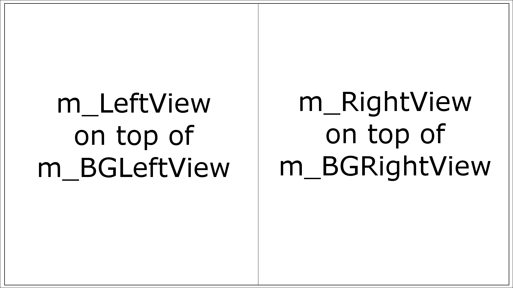

最好的理解方法是完成本章，运行代码，看到它的实际效果。

### 编写 run 函数定义

这个函数的代码将放在我们最近创建的`Engine.cpp`文件中。

在上一个构造函数代码之后立即添加以下代码：

```cpp
void Engine::run() 
{ 
   // Timing    
   Clock clock; 

   while (m_Window.isOpen()) 
   { 
      Time dt = clock.restart(); 
      // Update the total game time 
      m_GameTimeTotal += dt; 
      // Make a decimal fraction from the delta time 
      float dtAsSeconds = dt.asSeconds(); 

      // Call each part of the game loop in turn 
      input(); 
      update(dtAsSeconds); 
      draw(); 
   } 
} 

```

run 函数是我们引擎的中心-它启动所有其他部分。首先，我们声明一个 Clock 对象。接下来，我们有熟悉的`while(window.isOpen())`循环，它创建游戏循环。在这个 while 循环内，我们做以下事情：

1.  重新启动`clock`并将上一个循环所花费的时间保存在`dt`中。

1.  跟踪`m_GameTimeTotal`中经过的总时间。

1.  声明并初始化一个`float`来表示上一帧中经过的秒数的一部分。

1.  调用`input`。

1.  调用`update`并传入经过的时间（`dtAsSeconds`）。

1.  调用`draw`。

所有这些都应该看起来非常熟悉。新的是它包含在`run`函数中。

### 编写 input 函数定义

如前所述，这个函数的代码将放在自己的文件中，因为它比构造函数或`run`函数更复杂。我们将使用`#include "Engine.h"`并在函数签名前加上`Engine::`以确保编译器了解我们的意图。

在**解决方案资源管理器**中右键单击**源文件**，然后选择**添加** | **新项目...**。在**添加新项目**窗口中，突出显示（通过左键单击）**C++文件（**`.cpp`**）**，然后在**名称**字段中输入`Input.cpp`。最后，单击**添加**按钮。我们现在准备编写`input`函数的代码。

添加以下代码：

```cpp
void Engine::input() 
{ 
   Event event; 
   while (m_Window.pollEvent(event)) 
   { 
      if (event.type == Event::KeyPressed) 
      {         
         // Handle the player quitting 
         if (Keyboard::isKeyPressed(Keyboard::Escape)) 
         { 
            m_Window.close(); 
         } 

         // Handle the player starting the game 
         if (Keyboard::isKeyPressed(Keyboard::Return)) 
         { 
            m_Playing = true; 
         } 

         // Switch between Thomas and Bob 
         if (Keyboard::isKeyPressed(Keyboard::Q)) 
         { 
            m_Character1 = !m_Character1; 
         } 

         // Switch between full and split screen 
         if (Keyboard::isKeyPressed(Keyboard::E)) 
         { 
            m_SplitScreen = !m_SplitScreen; 
         } 
      } 
   }   
} 

```

与之前的两个项目一样，我们每帧都会检查`RenderWindow`事件队列。同样，我们像以前一样使用`if (Keyboard::isKeyPressed(Keyboard::E))`来检测特定的键盘键。我们刚刚添加的代码中最重要的是这些键实际上做了什么：

+   像往常一样，***Esc***键关闭窗口，游戏将退出。

+   ***Enter***键将`m_Playing`设置为 true，最终，这将导致关卡开始。

+   ***Q***键在全屏模式下在`true`和`false`之间切换`m_Character1`的值。它将在主`View`的中心之间切换 Thomas 和 Bob。

+   ***E***键在`true`和`false`之间切换`m_SplitScreen`。这将导致在全屏和分屏视图之间切换。

大部分键盘功能将在本章结束时完全可用。我们即将能够运行我们的游戏引擎。接下来，让我们编写`update`函数。

### 编写 update 函数定义

如前所述，这个函数的代码将放在自己的文件中，因为它比构造函数或`run`函数更加广泛。我们将使用`#include "Engine.h"`并在函数签名前加上`Engine::`以确保编译器知道我们的意图。

在**解决方案资源管理器**中右键单击**源文件**，然后选择**添加** | **新建项...**。在**添加新项**窗口中，通过左键单击**C++文件（**`.cpp`**）**，然后在**名称**字段中输入`Update.cpp`。最后，单击**添加**按钮。现在我们准备为`update`函数编写一些代码。

将以下代码添加到`Update.cpp`文件中以实现`update`函数：

```cpp
#include "stdafx.h" 
#include "Engine.h" 
#include <SFML/Graphics.hpp> 
#include <sstream> 

using namespace sf; 

void Engine::update(float dtAsSeconds) 
{ 

   if (m_Playing) 
   { 
      // Count down the time the player has left 
      m_TimeRemaining -= dtAsSeconds; 

      // Have Thomas and Bob run out of time? 
      if (m_TimeRemaining <= 0) 
      { 
         m_NewLevelRequired = true; 
      } 

   }// End if playing 

} 

```

首先注意，`update`函数接收上一帧所用时间作为参数。当然，这对于`update`函数履行其职责至关重要。

在这个阶段，前面的代码并没有实现任何可见的效果。它确立了我们将来需要的结构。它从`m_TimeRemaining`中减去了上一帧所用的时间。它检查时间是否已经用完，如果是，就将`m_NewLevelRequired`设置为`true`。所有这些代码都包裹在一个`if`语句中，只有当`m_Playing`为`true`时才执行。原因是，与以前的项目一样，我们不希望在游戏尚未开始时时间推移和对象更新。

随着项目的继续，我们将在这段代码的基础上构建。

### 编写绘制函数定义

如前所述，这个函数的代码将放在自己的文件中，因为它比构造函数或`run`函数更加广泛。我们将使用`#include "Engine.h"`并在函数签名前加上`Engine::`以确保编译器知道我们的意图。

在**解决方案资源管理器**中右键单击**源文件**，然后选择**添加** | **新建项...**。在**添加新项**窗口中，通过左键单击**C++文件（**`.cpp`**）**，然后在**名称**字段中输入`Draw.cpp`。最后，单击**添加**按钮。现在我们准备为`draw`函数添加一些代码。

将以下代码添加到`Draw.cpp`文件中以实现`draw`函数：

```cpp
#include "stdafx.h" 
#include "Engine.h" 

void Engine::draw() 
{ 
   // Rub out the last frame 
   m_Window.clear(Color::White); 

   if (!m_SplitScreen) 
   { 
      // Switch to background view 
      m_Window.setView(m_BGMainView); 
      // Draw the background 
      m_Window.draw(m_BackgroundSprite); 
      // Switch to m_MainView 
      m_Window.setView(m_MainView);     
   } 
   else 
   { 
      // Split screen view is active 

      // First draw Thomas' side of the screen 

      // Switch to background view 
      m_Window.setView(m_BGLeftView); 
      // Draw the background 
      m_Window.draw(m_BackgroundSprite); 
      // Switch to m_LeftView 
      m_Window.setView(m_LeftView); 

      // Now draw Bob's side of the screen 

      // Switch to background view 
      m_Window.setView(m_BGRightView); 
      // Draw the background 
      m_Window.draw(m_BackgroundSprite); 
      // Switch to m_RightView 
      m_Window.setView(m_RightView); 

   } 

   // Draw the HUD 
   // Switch to m_HudView 
   m_Window.setView(m_HudView); 

   // Show everything we have just drawn 
   m_Window.display(); 
} 

```

在前面的代码中，我们没有看到任何新东西。代码通常从清除屏幕开始。在这个项目中，我们用白色清除屏幕。新的是不同的绘制选项是如何通过条件分隔的，检查屏幕当前是分割还是全屏。

```cpp
if (!m_SplitScreen) 
{ 
} 
else 
{ 
} 

```

如果屏幕没有分割，我们在背景`View`（`m_BGView`）中绘制背景精灵，然后切换到主全屏`View`（`m_MainView`）。请注意，目前我们实际上并没有在`m_MainView`中进行任何绘制。

另一方面，如果屏幕被分割，`else`块中的代码将被执行，我们将用屏幕左侧的背景精灵绘制`m_BGLeftView`，然后切换到`m_LeftView`。

然后，在`else`块中，我们用屏幕右侧的背景精灵绘制`m_BGRightView`，然后切换到`m_RightView`。

在刚才描述的`if...else`结构之外，我们切换到`m_HUDView`。在这个阶段，我们实际上并没有在`m_HUDView`中绘制任何东西。

与另外两个（`input`、`update`）最重要的函数一样，我们将经常回到`draw`函数。我们将添加需要绘制的游戏新元素。您会注意到，每次我们这样做时，我们都会在主、左和右部分中添加代码。

让我们快速回顾一下`Engine`类，然后我们可以启动它。

## 到目前为止的 Engine 类

我们已经将以前在`main`函数中的所有代码抽象成了`input`、`update`和`draw`函数。这些函数的连续循环以及时间控制都由`run`函数处理。

考虑在 Visual Studio 中保持**Input.cpp**、**Update.cpp**和**Draw.cpp**标签打开，可能按顺序组织，如下面的截图所示：

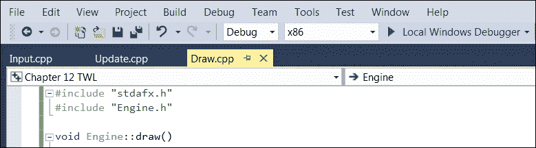

在项目的过程中，我们将重新审视每一个这些函数，以添加更多的代码。现在我们有了`Engine`类的基本结构和功能，我们可以在`main`函数中创建一个实例，并看到它的运行。

# 编写主函数

让我们将`HelloSFML.cpp`文件重命名为`Main.cpp`。右键单击**解决方案资源管理器**中的`HelloSFML`文件，然后选择**重命名**。将名称更改为`Main.cpp`。这将是包含我们的`main`函数和实例化`Engine`类的代码的文件。

将以下代码添加到`Main.cpp`中：

```cpp
#include "stdafx.h" 
#include "Engine.h" 

int main() 
{ 
   // Declare an instance of Engine 
   Engine engine; 

   // Start the engine VRRrrrrmmm 
   engine.run(); 

   // Quit in the usual way when the engine is stopped 
   return 0; 
} 

```

我们所做的就是为`Engine`类添加一个包含指令，声明一个`Engine`的实例，然后调用它的`run`函数。直到玩家退出并且执行返回到`main`和`return 0`语句，一切都将由`Engine`类处理。

这很容易。现在我们可以运行游戏，看到空的背景，无论是全屏还是分屏，最终都将包含所有的动作。

到目前为止，游戏在全屏模式下，只显示了背景：

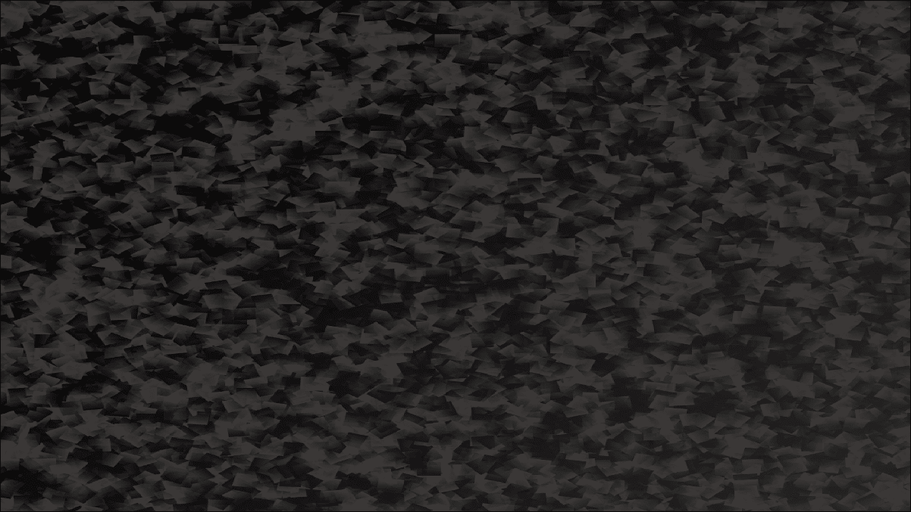

现在按下***E***键，你将能够看到屏幕被整齐地分成两半，准备好进行分屏合作游戏：

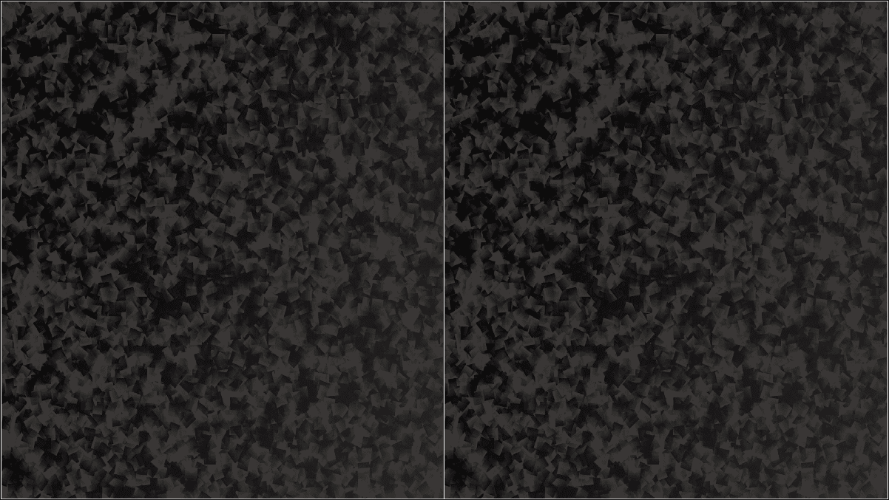

以下是一些可能会让你困惑的问题。

# 常见问题

Q）我不完全理解代码文件的结构。

A）抽象确实可以使我们的代码结构变得不太清晰，但实际的代码本身变得更容易。我们将代码分割成`Input.cpp`、`Update.cpp`和`Draw.cpp`，而不是像以前的项目那样把所有东西塞进主函数中。此外，随着我们的进行，我们将使用更多的类来将相关的代码分组在一起。再次学习《构建 Thomas Was Late 代码》部分，特别是图表。

# 总结

在本章中，我们介绍了 Thomas Was Late 游戏，并为项目的其余部分奠定了理解和代码结构的基础。在解决方案资源管理器中确实有很多文件，但只要我们理解每个文件的目的，我们会发现项目的实现变得更加容易。

在接下来的章节中，我们将学习另外两个基本的 C++主题，继承和多态。我们还将开始利用它们，构建三个类来代表两个可玩角色。
