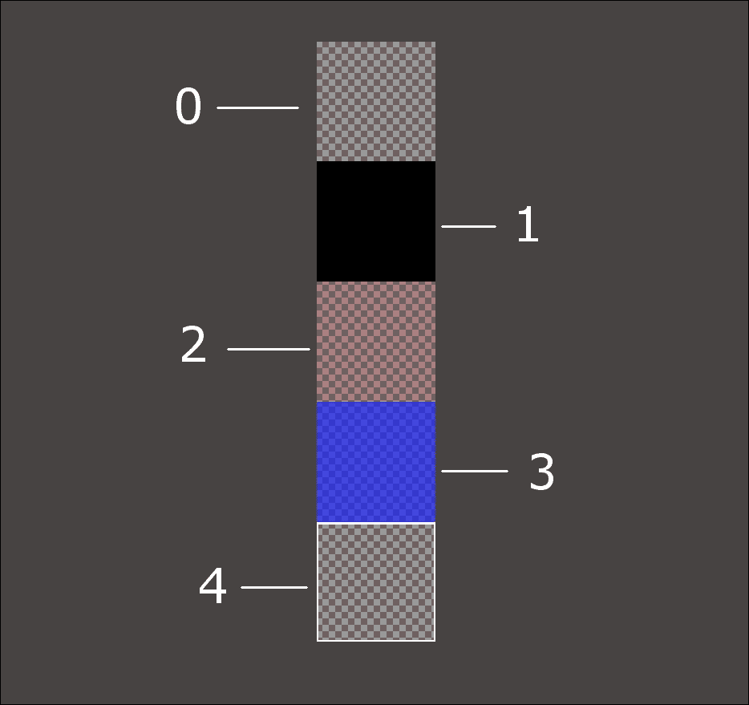
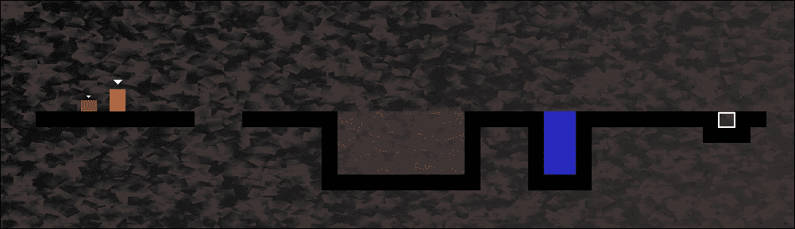
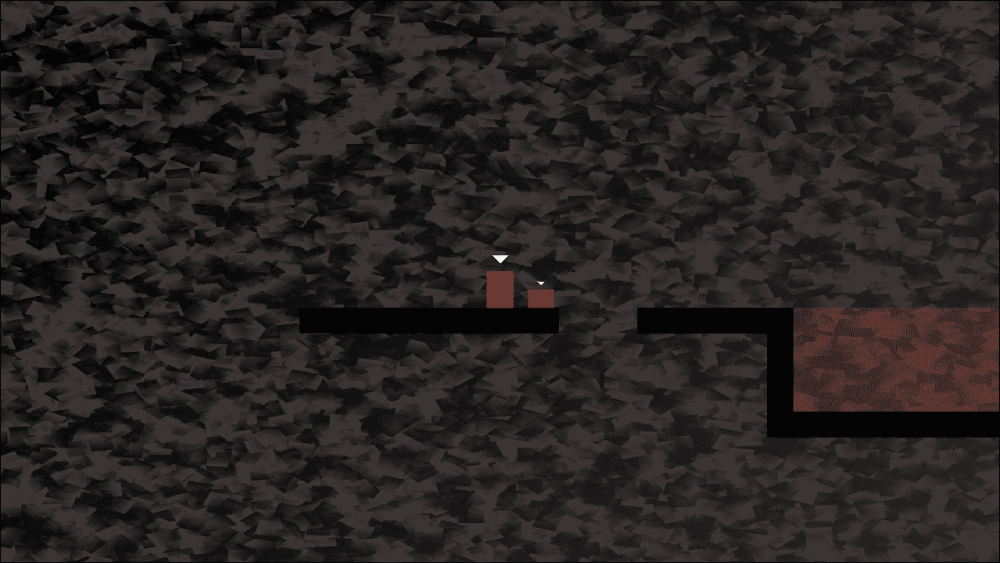
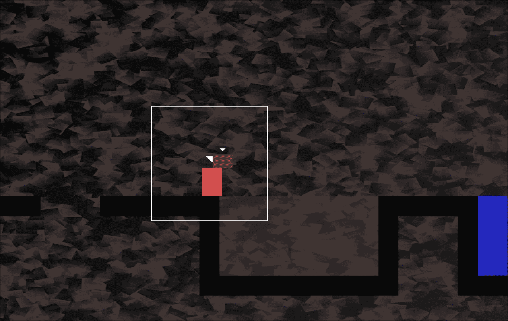
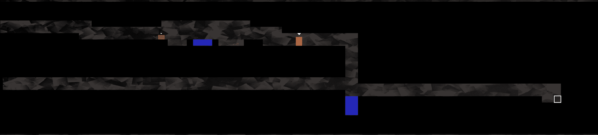
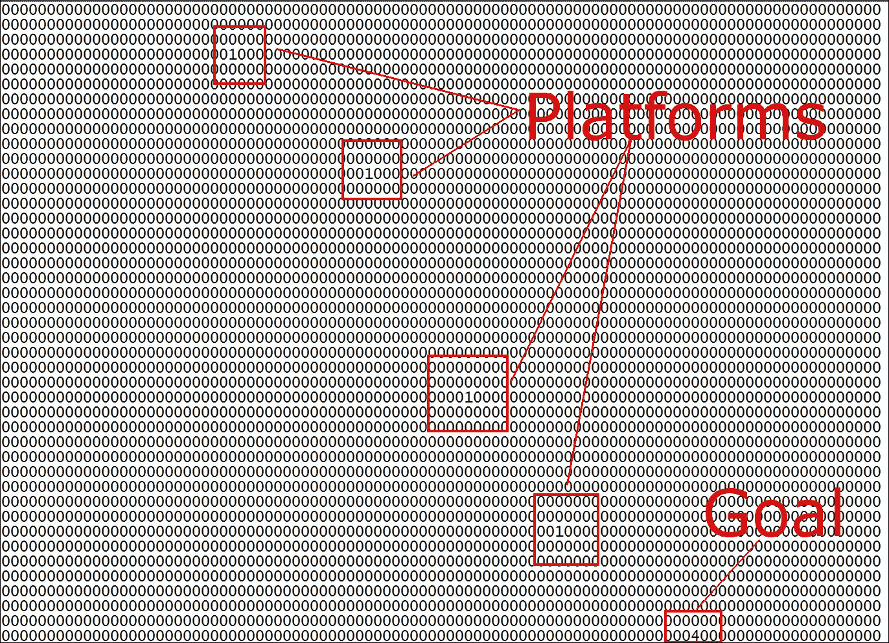
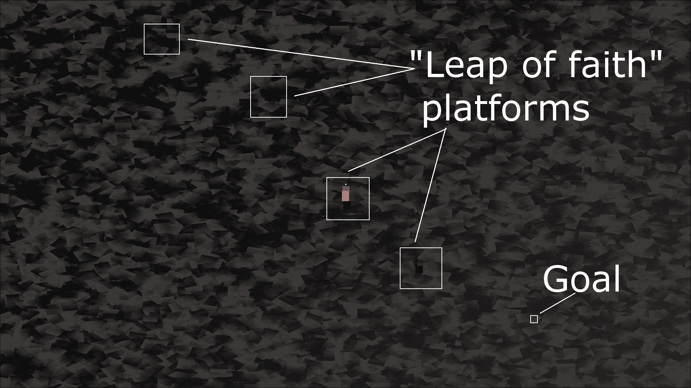
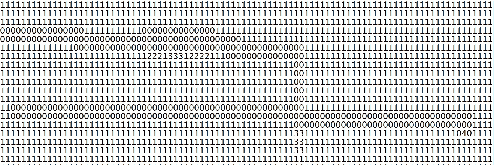
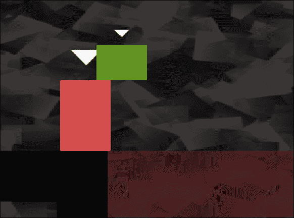

# 第十四章。构建可玩级别和碰撞检测

这一章可能是这个项目中最令人满意的。原因是到最后，我们将有一个可玩的游戏。虽然还有一些功能要实现（声音，粒子效果，HUD 和着色器效果），但鲍勃和托马斯将能够奔跑，跳跃和探索世界。此外，你将能够通过简单地在文本文件中制作平台和障碍物来创建几乎任何大小或复杂度的级别设计。

本章将通过以下主题来实现所有这些内容：

+   探索如何在文本文件中设计级别

+   构建一个`LevelManager`类，它将从文本文件加载级别，将它们转换为我们的游戏可以使用的数据，并跟踪级别细节，如生成位置，当前级别和允许的时间限制

+   更新游戏引擎以使用`LevelManager`

+   编写一个多态函数来处理 Bob 和 Thomas 的碰撞检测

# 设计一些级别

记得我们在第十二章中介绍的精灵表吗，*抽象和代码管理-更好地利用 OOP*。这里再次显示，用数字注释表示我们将构建级别的每个瓦片：



我将屏幕截图放在灰色背景上，这样你可以清楚地看到精灵表的不同细节。方格背景表示透明度级别。因此，除了数字 1 之外的所有瓦片都会至少显示一点背后的背景：

+   瓦片 0 是完全透明的，将用于填补没有其他瓦片的空隙

+   瓷砖 1 是为了托马斯和鲍勃将走的平台

+   瓷砖 2 是用于火瓦片，瓦片 3 是用于水瓦片

+   你可能需要仔细查看瓦片 4。它有一个白色的方形轮廓。这是托马斯和鲍勃必须一起到达的级别目标。

在讨论设计级别时，请记住这个屏幕截图。

我们将把这些瓦片号码的组合输入到文本文件中来设计布局。举个例子：

```cpp
0000000000000000000000000000000000000000000000 
0000000000000000000000000000000000000000000000 
0000000000000000000000000000000000000000000000 
0000000000000000000000000000000000000000000000 
0000000000000000000000000000000000000000000000 
0000000000000000000000000000000000000000000000 
1111111111000111111222222221111133111111111411 
0000000000000000001222222221000133100000001110 
0000000000000000001222222221000133100000000000 
0000000000000000001222222221000133100000000000 
0000000000000000001111111111000111100000000000 

```

前面的代码转换为以下级别布局：



请注意，为了获得前面屏幕截图中显示的视图，我必须缩小`View`。此外，屏幕截图被裁剪了。级别的实际开始看起来像下面的屏幕截图：



向你展示这些屏幕截图的目的有两个。首先，你可以看到如何使用简单和免费的文本编辑器快速构建级别设计。

### 提示

只需确保使用等宽字体，这样所有数字都是相同大小。这样设计级别就会更容易。

其次，这些屏幕截图展示了设计的游戏方面。在级别的左侧，托马斯和鲍勃首先需要跳过一个小洞，否则他们将掉入死亡（重生）。然后他们需要穿过大片火焰。鲍勃不可能跳过那么多瓦片。玩家需要共同解决问题。鲍勃清除火瓦片的唯一方法是站在托马斯的头上，然后从那里跳，如下面的屏幕截图所示：



然后很容易到达目标并进入下一个级别。

### 提示

我强烈鼓励你完成本章，然后花一些时间设计你自己的级别。

我已经包含了一些级别设计，让你开始。它们在我们在第十二章中添加到项目中的`levels`文件夹中，*抽象和代码管理-更好地利用 OOP*。

接下来是游戏的一些缩小视图，以及关卡设计代码的截图。代码的截图可能比重现实际的文本内容更有用。如果您确实想看到代码，只需打开`levels`文件夹中的文件。

代码如下所示：

代码声明`Vector2i` `m_LevelSize`来保存当前地图包含的水平和垂直瓦片数的两个整数值。`Vector2f` `m_StartPosition`包含 Bob 和 Thomas 应该生成的世界坐标。请注意，这不是与`m_LevelSize`单位相关的瓦片位置，而是关卡中水平和垂直像素位置。

这是前面的代码将产生的关卡布局：



这个关卡是我在第十二章中提到的“信任之跃”关卡，*抽象和代码管理-更好地利用 OOP*：



我已经突出显示了平台，因为它们在缩小的截图中不太清晰：



提供的设计很简单。游戏引擎将能够处理非常大的设计。您可以自由发挥想象力，构建一些非常大且难以完成的关卡。

当然，这些设计在我们学会如何加载它们并将文本转换为可玩的关卡之前实际上不会做任何事情。此外，在实现碰撞检测之前，将无法站在任何平台上。

首先，让我们处理加载关卡设计。

# 构建 LevelManager 类

我们将需要经过多个阶段的编码才能使我们的关卡设计生效。我们将首先编写`LevelManager`头文件。这将使我们能够查看和讨论`LevelManger`类中的成员变量和函数。

接下来，我们将编写`LevelManager.cpp`文件，其中将包含所有的函数定义。由于这是一个很长的文件，我们将把它分成几个部分，以便编写和讨论它们。

一旦`LevelManager`类完成，我们将在游戏引擎（`Engine`类）中添加一个实例。我们还将在`Engine`类中添加一个新函数`loadLevel`，我们可以在需要新关卡时从`update`函数中调用。`loadLevel`函数不仅将使用`LevelManager`实例来加载适当的关卡，还将处理诸如生成玩家角色和准备时钟等方面。

如前所述，让我们通过编写`LevelManager.h`文件来概述`LevelManager`。

## 编写 LevelManager.h

在**解决方案资源管理器**中右键单击**头文件**，然后选择**添加** | **新建项...**。在**添加新项**窗口中，通过左键单击**头文件（** `.h` **）**，然后在**名称**字段中键入`LevelManager.h`。最后，单击**添加**按钮。现在我们准备好为`LevelManager`类编写头文件了。

添加以下包含指令和私有变量，然后我们将讨论它们：

```cpp
#pragma once 

#include <SFML/Graphics.hpp> 
using namespace sf; 
using namespace std; 

class LevelManager 
{ 
private: 
   Vector2i m_LevelSize; 
   Vector2f m_StartPosition; 
   float m_TimeModifier = 1; 
   float m_BaseTimeLimit = 0; 
   int m_CurrentLevel = 0; 
   const int NUM_LEVELS = 4; 

// public declarations go here 

```



`m_TimeModifier`成员变量是一个浮点数，将用于乘以当前关卡中可用的时间。我们之所以要这样做，是因为通过改变（减少）这个值，我们将在玩家尝试同一关卡时缩短可用时间。例如，如果玩家第一次尝试第一关卡时获得 60 秒，那么 60 乘以 1 当然是 60。当玩家完成所有关卡并再次回到第一关卡时，`m_TimeModifier`将减少 10％。然后，当可用时间乘以 0.9 时，玩家可用的时间将是 54 秒。这比 60 少 10％。游戏将逐渐变得更加困难。

浮点变量`m_BaseTimeLimit`保存了我们刚刚讨论的原始未修改的时间限制。

您可能已经猜到`m_CurrentLevel`将保存当前正在播放的关卡编号。

`int` `NUM_LEVELS`常量将用于标记何时适合再次返回到第一关，并减少`m_TimeModifier`的值。

现在添加以下公共变量和函数声明：

```cpp
public: 

   const int TILE_SIZE = 50; 
   const int VERTS_IN_QUAD = 4; 

   float getTimeLimit(); 

   Vector2f getStartPosition(); 

   int** nextLevel(VertexArray& rVaLevel); 

   Vector2i getLevelSize(); 

   int getCurrentLevel(); 

}; 

```

在前面的代码中，有两个常量`int`成员。`TILE_SIZE`是一个有用的常量，提醒我们精灵表中的每个瓦片都是五十像素宽和五十像素高。`VERTS_IN_QUAD`是一个有用的常量，使我们对`VertexArray`的操作不那么容易出错。实际上，一个四边形中有四个顶点。现在我们不能忘记它。

`getTimeLimit`、`getStartPosition`、`getLevelSize`和`getCurrentLevel`函数是简单的 getter 函数，返回我们在前面的代码块中声明的私有成员变量的当前值。

值得仔细研究的一个函数是`nextLevel`。这个函数接收一个`VertexArray`的引用，就像我们在 Zombie Arena 游戏中使用的那样。该函数可以在`VertexArray`上工作，所有的更改都将出现在调用代码中的`VertexArray`中。`nextLevel`函数返回一个指向指针的指针，这意味着我们可以返回一个地址，该地址是`int`值的二维数组的第一个元素。我们将构建一个`int`值的二维数组，该数组将表示每个关卡的布局。当然，这些 int 值将从关卡设计文本文件中读取。

## 编写 LevelManager.cpp 文件

在**解决方案资源管理器**中右键单击**源文件**，然后选择**添加** | **新建项...**。在**添加新项**窗口中，通过左键单击**C++文件（** `.cpp` **）**，然后在**名称**字段中键入`LevelManager.cpp`。最后，单击**添加**按钮。我们现在准备为`LevelManager`类编写`.cpp`文件。

由于这是一个相当长的类，我们将把它分成六个部分来讨论。前五个将涵盖`nextLevel`函数，第六个将涵盖所有其他内容。

添加以下包含指令和`nextLevel`函数的第一部分（共五部分）：

```cpp
#include "stdafx.h" 
#include <SFML/Graphics.hpp> 
#include <SFML/Audio.hpp> 
#include "TextureHolder.h" 
#include <sstream> 
#include <fstream> 
#include "LevelManager.h" 

using namespace sf; 
using namespace std; 

int** LevelManager::nextLevel(VertexArray& rVaLevel) 
{ 
   m_LevelSize.x = 0; 
   m_LevelSize.y = 0; 

   // Get the next level 
   m_CurrentLevel++; 
   if (m_CurrentLevel > NUM_LEVELS) 
   { 
      m_CurrentLevel = 1; 
      m_TimeModifier -= .1f; 
   } 

   // Load the appropriate level from a text file 
   string levelToLoad; 
   switch (m_CurrentLevel) 
   { 

   case 1: 
      levelToLoad = "levels/level1.txt"; 
      m_StartPosition.x = 100; 
      m_StartPosition.y = 100; 
      m_BaseTimeLimit = 30.0f; 
      break; 

   case 2: 
      levelToLoad = "levels/level2.txt"; 
      m_StartPosition.x = 100; 
      m_StartPosition.y = 3600; 
      m_BaseTimeLimit = 100.0f; 
      break; 

   case 3: 
      levelToLoad = "levels/level3.txt"; 
      m_StartPosition.x = 1250; 
      m_StartPosition.y = 0; 
      m_BaseTimeLimit = 30.0f; 
      break; 

   case 4: 
      levelToLoad = "levels/level4.txt"; 
      m_StartPosition.x = 50; 
      m_StartPosition.y = 200; 
      m_BaseTimeLimit = 50.0f; 
      break; 

   }// End switch 

```

在包含指令之后，代码将`m_LevelSize.x`和`m_LevelSize.y`初始化为零。

接下来，`m_CurrentLevel`增加。随后的`if`语句检查`m_CurrentLevel`是否大于`NUM_LEVELS`。如果是，`m_CurrentLevel`被设置回`1`，并且`m_TimeModifier`减少了`.1f`，以缩短所有关卡允许的时间。

代码然后根据`m_CurrentLevel`的值进行切换。每个`case`语句都初始化文本文件的名称，该文件包含了关卡设计和 Thomas 和 Bob 的起始位置，以及`m_BaseTimeLimit`，这是问题关卡的未修改时间限制。

### 提示

如果您设计自己的关卡，请在此处添加`case`语句和相应的值。还要编辑`LevelManager.h`文件中的`NUM_LEVELS`常量。

现在添加`nextLevel`函数的第二部分，如所示。在上一段代码之后立即添加代码。在添加代码时，仔细研究代码，以便我们可以讨论它：

```cpp
   ifstream inputFile(levelToLoad); 
   string s; 

   // Count the number of rows in the file 
   while (getline(inputFile, s)) 
   { 
      ++m_LevelSize.y; 
   } 

   // Store the length of the rows 
   m_LevelSize.x = s.length(); 

```

在前面（第二部分）我们刚刚编写的代码中，我们声明了一个名为`inputFile`的`ifstream`对象，它打开了一个流到`levelToLoad`中包含的文件名。

代码使用`getline`循环遍历文件的每一行，但不记录任何内容。它只是通过递增`m_LevelSize.y`来计算行数。在`for`循环之后，使用`s.length`将关卡的宽度保存在`m_LevelSize.x`中。这意味着所有行的长度必须相同，否则我们会遇到麻烦。

此时，我们知道并已保存了`m_LevelSize`中当前关卡的长度和宽度。

现在添加`nextLevel`函数的第三部分，如所示。在上一段代码之后立即添加代码。在添加代码时，请仔细研究代码，以便我们讨论它：

```cpp
   // Go back to the start of the file 
   inputFile.clear(); 
   inputFile.seekg(0, ios::beg); 

   // Prepare the 2d array to hold the int values from the file 
   int** arrayLevel = new int*[m_LevelSize.y]; 
   for (int i = 0; i < m_LevelSize.y; ++i) 
   { 
      // Add a new array into each array element 
      arrayLevel[i] = new int[m_LevelSize.x]; 
   } 

```

首先，使用其`clear`函数清除`inputFile`。使用`0, ios::beg`参数调用的`seekg`函数将流重置到第一个字符之前。

接下来，我们声明一个指向指针的`arrayLevel`。请注意，这是使用`new`关键字在自由存储/堆上完成的。一旦我们初始化了这个二维数组，我们就能够将其地址返回给调用代码，并且它将持续存在，直到我们删除它或游戏关闭。

`for`循环从 0 到`m_LevelSize.y -1`。在每次循环中，它向堆中添加一个新的`int`值数组，以匹配`m_LevelSize.x`的值。现在，我们有一个完全配置好的（对于当前关卡）二维数组。唯一的问题是里面什么都没有。

现在添加`nextLevel`函数的第四部分，如所示。在上一段代码之后立即添加代码。在添加代码时，请仔细研究代码，以便我们讨论它：

```cpp
    // Loop through the file and store all the values in the 2d array 
   string row; 
   int y = 0; 
   while (inputFile >> row) 
   { 
      for (int x = 0; x < row.length(); x++) { 

         const char val = row[x]; 
         arrayLevel[y][x] = atoi(&val); 
      } 

      y++; 
   } 

   // close the file 
   inputFile.close(); 

```

首先，代码初始化一个名为`row`的`string`，它将一次保存一个关卡设计的行。我们还声明并初始化一个名为`y`的`int`，它将帮助我们计算行数。

`while`循环重复执行，直到`inputFile`超过最后一行。在`while`循环内部有一个`for`循环，它遍历当前行的每个字符，并将其存储在二维数组`arrayLevel`中。请注意，我们使用`arrayLevel[y][x] =`准确访问二维数组的正确元素。`atoi`函数将`char val`转换为`int`。这是必需的，因为我们有一个用于`int`而不是`char`的二维数组。

现在添加`nextLevel`函数的第五部分，如所示。在上一段代码之后立即添加代码。在添加代码时，请仔细研究代码，以便我们讨论它：

```cpp
   // What type of primitive are we using? 
   rVaLevel.setPrimitiveType(Quads); 

   // Set the size of the vertex array 
   rVaLevel.resize(m_LevelSize.x * m_LevelSize.y * VERTS_IN_QUAD); 

   // Start at the beginning of the vertex array 
   int currentVertex = 0; 

   for (int x = 0; x < m_LevelSize.x; x++) 
   { 
      for (int y = 0; y < m_LevelSize.y; y++) 
      { 
         // Position each vertex in the current quad 
         rVaLevel[currentVertex + 0].position =  
            Vector2f(x * TILE_SIZE,  
            y * TILE_SIZE); 

         rVaLevel[currentVertex + 1].position =  
            Vector2f((x * TILE_SIZE) + TILE_SIZE,  
            y * TILE_SIZE); 

         rVaLevel[currentVertex + 2].position =  
            Vector2f((x * TILE_SIZE) + TILE_SIZE,  
            (y * TILE_SIZE) + TILE_SIZE); 

         rVaLevel[currentVertex + 3].position =  
            Vector2f((x * TILE_SIZE),  
            (y * TILE_SIZE) + TILE_SIZE); 

         // Which tile from the sprite sheet should we use 
         int verticalOffset = arrayLevel[y][x] * TILE_SIZE; 

         rVaLevel[currentVertex + 0].texCoords =  
            Vector2f(0, 0 + verticalOffset); 

         rVaLevel[currentVertex + 1].texCoords =  
            Vector2f(TILE_SIZE, 0 + verticalOffset); 

         rVaLevel[currentVertex + 2].texCoords =  
            Vector2f(TILE_SIZE, TILE_SIZE + verticalOffset); 

         rVaLevel[currentVertex + 3].texCoords =  
            Vector2f(0, TILE_SIZE + verticalOffset); 

         // Position ready for the next four vertices 
         currentVertex = currentVertex + VERTS_IN_QUAD; 
      } 
   } 

   return arrayLevel; 
} // End of nextLevel function 

```

尽管这是我们将`nextLevel`分成五个部分中最长的代码部分，但它也是最直接的。这是因为我们在 Zombie Arena 项目中看到了非常相似的代码。

嵌套的`for`循环循环从零到关卡的宽度和高度。对于数组中的每个位置，将四个顶点放入`VertexArray`，并从精灵表中分配四个纹理坐标。顶点和纹理坐标的位置是使用`currentVertex`变量、`TILE SIZE`和`VERTS_IN_QUAD`常量计算的。在内部`for`循环的每次循环结束时，`currentVertex`增加`VERTS_IN_QUAD`，很好地移动到下一个瓷砖上。

关于这个`VertexArray`的重要事情是，它是通过引用传递给`nextLevel`的。因此，`VertexArray`将在调用代码中可用。我们将从`Engine`类中的代码中调用`nextLevel`。

一旦调用了这个函数，`Engine`类将拥有一个`VertexArray`来图形化表示关卡，并且拥有一个`int`值的二维数组，作为关卡中所有平台和障碍物的数值表示。

`LevelManager`的其余函数都是简单的 getter 函数，但请花时间熟悉每个函数返回的私有值。添加`LevelManager`类的其余函数：

```cpp
Vector2i LevelManager::getLevelSize() 
{ 
   return m_LevelSize; 
} 

int LevelManager::getCurrentLevel() 
{ 
   return m_CurrentLevel; 
} 

float LevelManager::getTimeLimit() 
{ 
   return m_BaseTimeLimit * m_TimeModifier; 

} 
Vector2f LevelManager::getStartPosition() 
{ 
   return m_StartPosition; 
} 

```

现在`LevelManager`类已经完成，我们可以继续使用它。我们将在`Engine`类中编写另一个函数来实现。

# 编写 loadLevel 函数

要清楚，这个函数是`Engine`类的一部分，尽管它将把大部分工作委托给其他函数，包括我们刚刚构建的`LevelManager`类的函数。

首先，让我们在`Engine.h`文件中添加新函数的声明，以及一些其他新代码。打开`Engine.h`文件，并添加以下`Engine.h`文件的摘要快照中显示的突出显示的代码行：

```cpp
#pragma once 
#include <SFML/Graphics.hpp> 
#include "TextureHolder.h" 
#include "Thomas.h" 
#include "Bob.h" 
#include "LevelManager.h" 

using namespace sf; 

class Engine 
{ 
private: 
   // The texture holder 
   TextureHolder th; 

   // Thomas and his friend, Bob 
   Thomas m_Thomas; 
   Bob m_Bob; 

 // A class to manage all the levels
   LevelManager m_LM; 

   const int TILE_SIZE = 50; 
   const int VERTS_IN_QUAD = 4; 

   // The force pushing the characters down 
   const int GRAVITY = 300; 

   // A regular RenderWindow 
   RenderWindow m_Window; 

   // The main Views 
   View m_MainView; 
   View m_LeftView; 
   View m_RightView; 

   // Three views for the background 
   View m_BGMainView; 
   View m_BGLeftView; 
   View m_BGRightView; 

   View m_HudView; 

   // Declare a sprite and a Texture for the background 
   Sprite m_BackgroundSprite; 
   Texture m_BackgroundTexture; 

   // Is the game currently playing? 
   bool m_Playing = false; 

   // Is character 1 or 2 the current focus? 
   bool m_Character1 = true; 

   // Start in full screen mode 
   bool m_SplitScreen = false; 

   // How much time is left in the current level 
   float m_TimeRemaining = 10; 
   Time m_GameTimeTotal; 

   // Is it time for a new/first level? 
   bool m_NewLevelRequired = true; 

 // The vertex array for the level tiles
   VertexArray m_VALevel;
   // The 2d array with the map for the level
   // A pointer to a pointer
   int** m_ArrayLevel =  NULL;
   // Texture for the level tiles
   Texture m_TextureTiles; 
   // Private functions for internal use only 
   void input(); 
   void update(float dtAsSeconds); 
   void draw();    

 // Load a new level
   void loadLevel(); 

public: 
   // The Engine constructor 
   Engine(); 

   ... 
   ...       
   ... 

```

你可以在先前的代码中看到以下内容：

+   我们包括了`LevelManager.h`文件

+   我们添加了一个名为`m_LM`的`LevelManager`实例

+   我们添加了一个名为`m_VALevel`的`VertexArray`

+   我们添加了一个指向`int`的指针，该指针将保存从`nextLevel`返回的二维数组

+   我们为精灵表添加了一个新的`Texture`对象

+   我们添加了`loadLevel`函数的声明，现在我们将编写该函数

在**Solution Explorer**中右键单击**Source Files**，然后选择**Add** | **New Item...**。在**Add New Item**窗口中，通过左键单击突出显示（` .cpp`）**C++ File**，然后在**Name**字段中键入`LoadLevel.cpp`。最后，单击**Add**按钮。现在我们准备编写`loadLevel`函数。

将`loadLevel`函数的代码添加到`LoadLevel.cpp`文件中，然后我们可以讨论它：

```cpp
#include "stdafx.h" 
#include "Engine.h" 

void Engine::loadLevel() 
{ 
   m_Playing = false; 

   // Delete the previously allocated memory 
   for (int i = 0; i < m_LM.getLevelSize().y; ++i) 
   { 
      delete[] m_ArrayLevel[i]; 

   } 
   delete[] m_ArrayLevel; 

   // Load the next 2d array with the map for the level 
   // And repopulate the vertex array as well 
   m_ArrayLevel = m_LM.nextLevel(m_VALevel); 

   // How long is this new time limit 
   m_TimeRemaining = m_LM.getTimeLimit(); 

   // Spawn Thomas and Bob 
   m_Thomas.spawn(m_LM.getStartPosition(), GRAVITY); 
   m_Bob.spawn(m_LM.getStartPosition(), GRAVITY); 

   // Make sure this code isn't run again 
   m_NewLevelRequired = false; 
} 

```

首先，我们将`m_Playing`设置为 false，以阻止更新函数的部分执行。接下来，我们循环遍历`m_ArrayLevel`中的所有水平数组，并将它们删除。在`for`循环之后，我们删除`m_ArrayLevel`。

代码`m_ArrayLevel = m_LM.nextLevel(m_VALevel)`，调用了`nextLevel`并准备了`VertexArray`和`m_VALevel`，以及二维`m_ArrayLevel`数组。关卡已经设置好，准备就绪。

通过调用`getTimeLimit`初始化了`m_TimeRemaining`，并使用`spawn`函数生成了 Thomas 和 Bob，以及从`getStartPosition`返回的值。

最后，`m_NewLevelRequired`被设置为`false`。正如我们将在几页后看到的那样，`m_NewLevelRequired`被设置为`true`会导致调用`loadLevel`。我们只想运行这个函数一次。

# 更新引擎

打开`Engine.cpp`文件，并在`Engine`构造函数的末尾添加突出显示的代码，以加载精灵表纹理：

```cpp
Engine::Engine() 
{ 
   // Get the screen resolution and create an SFML window and View 
   Vector2f resolution; 
   resolution.x = VideoMode::getDesktopMode().width; 
   resolution.y = VideoMode::getDesktopMode().height; 

   m_Window.create(VideoMode(resolution.x, resolution.y), 
      "Thomas was late", 
      Style::Fullscreen); 

   // Initialize the full screen view 
   m_MainView.setSize(resolution); 
   m_HudView.reset( 
      FloatRect(0, 0, resolution.x, resolution.y)); 

   // Inititialize the split-screen Views 
   m_LeftView.setViewport( 
      FloatRect(0.001f, 0.001f, 0.498f, 0.998f)); 

   m_RightView.setViewport( 
      FloatRect(0.5f, 0.001f, 0.499f, 0.998f)); 

   m_BGLeftView.setViewport( 
      FloatRect(0.001f, 0.001f, 0.498f, 0.998f)); 

   m_BGRightView.setViewport( 
      FloatRect(0.5f, 0.001f, 0.499f, 0.998f)); 

   // Can this graphics card use shaders? 
   if (!sf::Shader::isAvailable()) 
   { 
      // Time to get a new PC 
      m_Window.close(); 
   } 

   m_BackgroundTexture = TextureHolder::GetTexture( 
      "graphics/background.png"); 

   // Associate the sprite with the texture 
   m_BackgroundSprite.setTexture(m_BackgroundTexture); 

 // Load the texture for the background vertex array
   m_TextureTiles = TextureHolder::GetTexture("graphics/tiles_sheet.png"); 
} 

```

在先前的代码中，我们只是将精灵表加载到`m_TextureTiles`中。

打开`Update.cpp`文件，并进行以下突出显示的更改和添加：

```cpp
void Engine::update(float dtAsSeconds) 
{ 
   if (m_NewLevelRequired) 
   { 
      // These calls to spawn will be moved to a new 
      // LoadLevel function soon 
      // Spawn Thomas and Bob 
 //m_Thomas.spawn(Vector2f(0,0), GRAVITY);
      //m_Bob.spawn(Vector2f(100, 0), GRAVITY); 

      // Make sure spawn is called only once 
 //m_TimeRemaining = 10;
      //m_NewLevelRequired = false;

      // Load a level
      loadLevel();        
   } 

```

实际上，你应该删除而不是注释掉我们不再使用的行。我只是以这种方式向你展示，以便更清楚地看到更改。在先前的`if`语句中，应该只有对`loadLevel`的调用。

最后，在我们能够看到本章工作成果之前，打开`Draw.cpp`文件，并进行以下突出显示的添加，以绘制表示关卡的顶点数组：

```cpp
void Engine::draw() 
{ 
   // Rub out the last frame 
   m_Window.clear(Color::White); 

   if (!m_SplitScreen) 
   { 
      // Switch to background view 
      m_Window.setView(m_BGMainView); 
      // Draw the background 
      m_Window.draw(m_BackgroundSprite); 
      // Switch to m_MainView 
      m_Window.setView(m_MainView);     

 // Draw the Level
      m_Window.draw(m_VALevel, &m_TextureTiles); 

      // Draw thomas 
      m_Window.draw(m_Thomas.getSprite()); 

      // Draw thomas 
      m_Window.draw(m_Bob.getSprite()); 
   } 
   else 
   { 
      // Split-screen view is active 

      // First draw Thomas' side of the screen 

      // Switch to background view 
      m_Window.setView(m_BGLeftView); 
      // Draw the background 
      m_Window.draw(m_BackgroundSprite); 
      // Switch to m_LeftView 
      m_Window.setView(m_LeftView); 

 // Draw the Level
      m_Window.draw(m_VALevel, &m_TextureTiles); 

      // Draw thomas 
      m_Window.draw(m_Bob.getSprite()); 

      // Draw thomas 
      m_Window.draw(m_Thomas.getSprite()); 

      // Now draw Bob's side of the screen 

      // Switch to background view 
      m_Window.setView(m_BGRightView); 
      // Draw the background 
      m_Window.draw(m_BackgroundSprite); 
      // Switch to m_RightView 
      m_Window.setView(m_RightView); 

 // Draw the Level
     m_Window.draw(m_VALevel, &m_TextureTiles); 

      // Draw thomas 
      m_Window.draw(m_Thomas.getSprite()); 

      // Draw bob 
      m_Window.draw(m_Bob.getSprite()); 

   } 

   // Draw the HUD 
   // Switch to m_HudView 
   m_Window.setView(m_HudView); 

   // Show everything we have just drawn 
   m_Window.display(); 
} 

```

请注意，我们需要为所有屏幕选项（全屏、左侧和右侧）绘制`VertexArray`。

现在你可以运行游戏了。不幸的是，Thomas 和 Bob 直接穿过了我们精心设计的所有平台。因此，我们无法尝试通过关卡并打败时间。

# 碰撞检测

我们将使用矩形相交和 SFML 相交函数来处理碰撞检测。在这个项目中的不同之处在于，我们将把碰撞检测代码抽象成自己的函数，并且正如我们已经看到的，Thomas 和 Bob 有多个矩形（`m_Head`、`m_Feet`、`m_Left`、`m_Right`），我们需要检查碰撞。

## 编写`detectCollisions`函数

要明确，这个函数是 Engine 类的一部分。打开`Engine.h`文件，并添加一个名为`detectCollisions`的函数声明。在下面的代码片段中突出显示了这一点：

```cpp
   // Private functions for internal use only 
   void input(); 
   void update(float dtAsSeconds); 
   void draw(); 

   // Load a new level 
   void loadLevel(); 

 // Run will call all the private functions
   bool detectCollisions(PlayableCharacter& character); 

public: 
   // The Engine constructor 
   Engine(); 

```

从签名中可以看出，`detectCollision`函数接受一个多态参数，即`PlayerCharacter`对象。正如我们所知，`PlayerCharacter`是抽象的，永远不能被实例化。然而，我们可以用`Thomas`和`Bob`类继承它。我们将能够将`m_Thomas`或`m_Bob`传递给`detectCollisions`。

在**解决方案资源管理器**中右键单击**源文件**，然后选择**添加** | **新建项...**。在**添加新项**窗口中，通过左键单击**C++文件（** `.cpp` **）**，然后在**名称**字段中键入`DetectCollisions.cpp`。最后，单击**添加**按钮。现在我们准备编写`detectCollisions`函数。

将以下代码添加到`DetectCollisions.cpp`。请注意，这只是该函数的第一部分：

```cpp
#include "stdafx.h" 
#include "Engine.h" 

bool Engine::detectCollisions(PlayableCharacter& character) 
{ 
   bool reachedGoal = false; 
   // Make a rect for all his parts 
   FloatRect detectionZone = character.getPosition(); 

   // Make a FloatRect to test each block 
   FloatRect block; 

   block.width = TILE_SIZE; 
   block.height = TILE_SIZE; 

   // Build a zone around thomas to detect collisions 
   int startX = (int)(detectionZone.left / TILE_SIZE) - 1; 
   int startY = (int)(detectionZone.top / TILE_SIZE) - 1; 
   int endX = (int)(detectionZone.left / TILE_SIZE) + 2; 

   // Thomas is quite tall so check a few tiles vertically 
   int endY = (int)(detectionZone.top / TILE_SIZE) + 3; 

   // Make sure we don't test positions lower than zero 
   // Or higher than the end of the array 
   if (startX < 0)startX = 0; 
   if (startY < 0)startY = 0; 
   if (endX >= m_LM.getLevelSize().x) 
      endX = m_LM.getLevelSize().x; 
   if (endY >= m_LM.getLevelSize().y) 
      endY = m_LM.getLevelSize().y; 

```

首先我们声明一个名为`reachedGoal`的布尔值。这是`detectCollisions`函数返回给调用代码的值。它被初始化为`false`。

接下来我们声明一个名为`detectionZone`的`FloatRect`，并用表示角色精灵整个矩形的相同矩形进行初始化。请注意，我们实际上不会使用这个矩形进行交集测试。之后，我们声明另一个名为`block`的`FloatRect`。我们将`block`初始化为一个 50x50 的矩形。我们很快就会看到`block`的使用。

接下来我们看看如何使用`detectionZone`。我们通过扩展`detectionZone`周围的区域几个块来初始化四个`int`变量`startX`、`startY`、`endX`和`endY`。在接下来的四个`if`语句中，我们检查不可能尝试在不存在的瓦片上进行碰撞检测。我们通过确保永远不检查小于零或大于`getLevelSize().x`或`.y`返回的值来实现这一点。

前面的所有代码所做的是创建一个用于碰撞检测的区域。在角色数百或数千像素远的方块上进行碰撞检测是没有意义的。此外，如果我们尝试在数组位置不存在的地方进行碰撞检测（小于零或大于`getLevelSize()...`），游戏将崩溃。

接下来，添加以下处理玩家掉出地图的代码：

```cpp
   // Has the character fallen out of the map? 
   FloatRect level(0, 0,  
      m_LM.getLevelSize().x * TILE_SIZE,  
      m_LM.getLevelSize().y * TILE_SIZE); 

   if (!character.getPosition().intersects(level)) 
   { 
      // respawn the character 
      character.spawn(m_LM.getStartPosition(), GRAVITY); 
   } 

```

角色要停止下落，必须与平台发生碰撞。因此，如果玩家移出地图（没有平台的地方），它将不断下落。前面的代码检查角色是否*不*与`FloatRect`、`level`相交。如果不相交，那么它已经掉出地图，`spawn`函数会将其发送回起点。

添加以下相当大的代码，然后我们将逐步讲解它的功能：

```cpp
   // Loop through all the local blocks 
   for (int x = startX; x < endX; x++) 
   { 
      for (int y = startY; y < endY; y++) 
      { 
         // Initialize the starting position of the current block 
         block.left = x * TILE_SIZE; 
         block.top = y * TILE_SIZE; 

         // Has character been burnt or drowned? 
         // Use head as this allows him to sink a bit 
         if (m_ArrayLevel[y][x] == 2 || m_ArrayLevel[y][x] == 3) 
         { 
            if (character.getHead().intersects(block)) 
            { 
               character.spawn(m_LM.getStartPosition(), GRAVITY); 
               // Which sound should be played? 
               if (m_ArrayLevel[y][x] == 2)// Fire, ouch! 
               { 
                  // Play a sound 

               } 
               else // Water 
               { 
                  // Play a sound 
               } 
            } 
         } 

         // Is character colliding with a regular block 
         if (m_ArrayLevel[y][x] == 1) 
         { 

            if (character.getRight().intersects(block)) 
            { 
               character.stopRight(block.left); 
            } 
            else if (character.getLeft().intersects(block)) 
            { 
               character.stopLeft(block.left); 
            } 

            if (character.getFeet().intersects(block)) 
            { 
               character.stopFalling(block.top); 
            } 
            else if (character.getHead().intersects(block)) 
            { 
               character.stopJump(); 
            } 
         } 

         // More collision detection here once we have  
         // learned about particle effects 

         // Has the character reached the goal? 
         if (m_ArrayLevel[y][x] == 4) 
         { 
            // Character has reached the goal 
            reachedGoal = true; 
         } 

      } 

   } 

```

前面的代码使用相同的技术做了三件事。它循环遍历了 startX、endX 和 startY、endY 之间包含的所有值。对于每次循环，它都会检查并执行以下操作：

+   角色是否被烧伤或淹死？代码`if (m_ArrayLevel[y][x] == 2 || m_ArrayLevel[y][x] == 3)`确定当前被检查的位置是否是火瓦或水瓦。如果角色的头与这些瓦片之一相交，玩家将重新生成。我们还编写了一个空的`if…else`块，为下一章添加声音做准备。

+   角色是否触碰了普通瓦片？代码`if (m_ArrayLevel[y][x] == 1)`确定当前被检查的位置是否持有普通瓦片。如果它与表示角色各个身体部位的矩形之一相交，相关的函数就会被调用（`stopRight`、`stopLeft`、`stopFalling`和`stopJump`）。传递给这些函数的值以及函数如何使用这些值重新定位角色是相当微妙的。虽然不必仔细检查这些值来理解代码，但您可能会喜欢查看传递的值，然后参考上一章`PlayableCharacter`类的适当函数。这将帮助您准确理解发生了什么。

+   角色是否触碰到了目标瓦片？这是通过代码`if (m_ArrayLevel[y][x] == 4)`来确定的。我们只需要将`reachedGoal`设置为`true`。`Engine`类的`update`函数将跟踪托马斯和鲍勃是否同时到达了目标。我们将在`update`中编写这段代码，马上就会。

在`detectCollisions`函数中添加最后一行代码：

```cpp
   // All done, return, whether or not a new level might be required 
   return reachedGoal; 
} 

```

前面的代码返回`reachedGoal`，以便调用代码可以跟踪并适当地响应如果两个角色同时到达目标。

现在我们只需要每帧调用一次`detectCollision`函数。在`Update.cpp`文件的`if(m_Playing)`代码块中添加以下突出显示的代码：

```cpp
if (m_Playing) 
{ 
   // Update Thomas 
   m_Thomas.update(dtAsSeconds); 

   // Update Bob 
   m_Bob.update(dtAsSeconds); 

 // Detect collisions and see if characters
   // have reached the goal tile
   // The second part of the if condition is only executed
   // when thomas is touching the home tile
   if (detectCollisions(m_Thomas) && detectCollisions(m_Bob))
   {
     // New level required
     m_NewLevelRequired = true;
     // Play the reach goal sound
   }
   else
   {
     // Run bobs collision detection
     detectCollisions(m_Bob);
   } 

   // Count down the time the player has left 
   m_TimeRemaining -= dtAsSeconds; 

   // Have Thomas and Bob run out of time? 
   if (m_TimeRemaining <= 0) 
   { 
      m_NewLevelRequired = true; 
   } 

}// End if playing 

```

先前的代码调用了`detectCollision`函数，并检查鲍勃和托马斯是否同时到达了目标。如果是，下一个关卡将通过将`m_NewLevelRequired`设置为`true`来准备好。

您可以运行游戏并走在平台上。您可以到达目标并开始新的关卡。此外，首次，跳跃按钮（*W*或箭头上）将起作用。

如果您达到目标，下一个关卡将加载。如果您达到最后一关的目标，则第一关将以减少 10%的时间限制加载。当然，由于我们还没有构建 HUD，所以时间或当前关卡没有视觉反馈。我们将在下一章中完成。

然而，许多关卡需要托马斯和鲍勃一起合作。更具体地说，托马斯和鲍勃需要能够爬到彼此的头上。

## 更多碰撞检测

在`Update.cpp`文件中添加前面添加的代码后面，即在`if (m_Playing)`部分内：

```cpp
if (m_Playing) 
{ 
   // Update Thomas 
   m_Thomas.update(dtAsSeconds); 

   // Update Bob 
   m_Bob.update(dtAsSeconds); 

   // Detect collisions and see if characters
   // have reached the goal tile 
   // The second part of the if condition is only executed 
   // when thomas is touching the home tile 
   if (detectCollisions(m_Thomas) && detectCollisions(m_Bob)) 
   { 
      // New level required 
      m_NewLevelRequired = true; 

      // Play the reach goal sound 

   } 
   else 
   { 
      // Run bobs collision detection 
      detectCollisions(m_Bob); 
   } 

 // Let bob and thomas jump on each others heads
   if (m_Bob.getFeet().intersects(m_Thomas.getHead()))
   {
     m_Bob.stopFalling(m_Thomas.getHead().top);
   }
   else if (m_Thomas.getFeet().intersects(m_Bob.getHead()))
   {
     m_Thomas.stopFalling(m_Bob.getHead().top);
   } 

   // Count down the time the player has left 
   m_TimeRemaining -= dtAsSeconds; 

   // Have Thomas and Bob run out of time? 
   if (m_TimeRemaining <= 0) 
   { 
      m_NewLevelRequired = true; 
   } 

}// End if playing 

```

您可以再次运行游戏，并站在托马斯和鲍勃的头上，以到达以前无法到达的难以到达的地方：



# 总结

本章中有相当多的代码。我们学会了如何从文件中读取并将文本字符串转换为 char，然后转换为`int`。一旦我们有了一个二维数组的`int`，我们就能够填充一个`VertexArray`来在屏幕上显示关卡。然后，我们使用完全相同的二维数组 int 来实现碰撞检测。我们使用了矩形相交，就像我们在僵尸竞技场项目中所做的那样，尽管这次，为了更精确，我们给了每个角色四个碰撞区域，分别代表他们的头部、脚部和左右两侧。

现在游戏完全可玩，我们需要在屏幕上表示游戏的状态（得分和时间）。在下一章中，我们将实现 HUD，以及比目前使用的更高级的音效。
