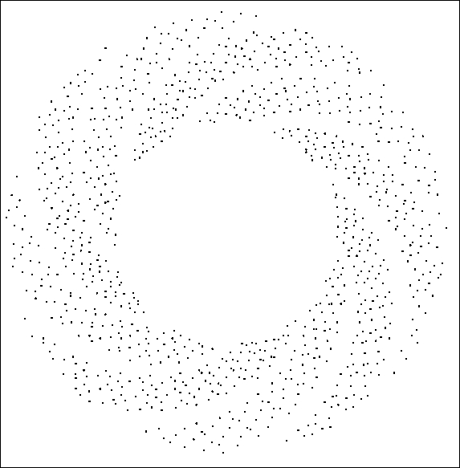
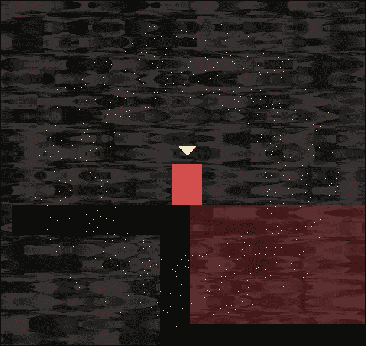

# 第十六章。扩展 SFML 类，粒子系统和着色器

在本章的最后，我们将探讨 C++概念，即扩展其他人的类。更具体地说，我们将研究 SFML `Drawable`类以及将其用作我们自己类的基类的好处。我们还将浅尝 OpenGL 着色器的主题，并看看如何使用另一种语言**OpenGL 着色语言**（**GLSL**）编写代码，可以直接在图形卡上运行，可以产生平滑的图形效果，否则可能是不可能的。像往常一样，我们还将利用我们的新技能和知识来增强当前项目。

以下是我们将按顺序涵盖的主题列表：

+   SFML Drawable 类

+   构建一个粒子系统

+   OpenGl 着色器和 GLSL

+   在 Thomas Was Late 游戏中使用着色器

# SFML Drawable 类

`Drawable`类只有一个函数。它也没有变量。此外，它唯一的功能是纯虚拟的。这意味着如果我们从`Drawable`继承，我们必须实现它唯一的功能。这个目的，你可能还记得第十二章，*抽象和代码管理-更好地利用 OOP*，就是我们可以使用从`drawable`继承的类作为多态类型。更简单地说，SFML 允许我们对`Drawable`对象做的任何事情，我们都可以用从它继承的类来做。唯一的要求是我们必须为纯虚拟函数`draw`提供定义。

一些从`Drawable`继承的类已经包括`Sprite`和`VertexArray`（以及其他类）。每当我们使用`Sprite`或`VertexArray`时，我们都将它们传递给`RenderWindow`类的`draw`函数。

我们之所以能够在本书中绘制的每个对象都继承自`Drawable`。我们可以利用这一知识来使我们受益。

我们可以用任何我们喜欢的对象从`Drawable`继承，只要我们实现纯虚拟的`draw`函数。这也是一个简单的过程。假设从`Drawable`继承的`SpaceShip`类的头文件（`SpaceShip.h`）将如下所示：

```cpp
class SpaceShip : public Drawable 
{ 
private: 
   Sprite m_Sprite; 
   // More private members 
public: 

   virtual void draw(RenderTarget& target,  
      RenderStates states) const; 

   // More public members 

}; 

```

在前面的代码中，我们可以看到纯虚拟的`draw`函数和一个 Sprite。请注意，没有办法在类的外部访问私有的`Sprite`，甚至没有`getSprite`函数！

`SpaceShip.cpp`文件看起来可能是这样的：

```cpp
void SpaceShip::SpaceShip 
{ 
   // Set up the spaceship 
} 

void SpaceShip::draw(RenderTarget& target, RenderStates states) const 
{ 
   target.draw(m_Sprite, states); 
} 

// Any other functions 

```

在前面的代码中，请注意`draw`函数的简单实现。参数超出了本书的范围。只需注意`target`参数用于调用`draw`并传递`m_Sprite`以及`states`，另一个参数。

### 提示

虽然不需要理解参数就能充分利用`Drawable`，但在本书的背景下，你可能会感兴趣。您可以在 SFML 网站上阅读有关 SFML `Drawable`类的更多信息：[`www.sfml-dev.org/tutorials/2.3/graphics-vertex-array.php#creating-an-sfml-like-entity`](http://www.sfml-dev.org/tutorials/2.3/graphics-vertex-array.php#creating-an-sfml-like-entity)

在主游戏循环中，我们现在可以将`SpaceShip`实例视为`Sprite`，或者从`Drawable`继承的任何其他类：

```cpp
SpaceShip m_SpaceShip; 
// create other objects here 
// ... 

// In the draw function 
// Rub out the last frame 
m_Window.clear(Color::Black); 

// Draw the spaceship 
m_Window.draw(m_SpaceShip); 
// More drawing here 
// ... 

// Show everything we have just drawn 
m_Window.display(); 

```

正因为`SpaceShip`是`Drawable`，我们才能将其视为`Sprite`或`VertexArray`，并且因为我们覆盖了纯虚拟的`draw`函数，一切都按我们想要的方式工作。让我们看看另一种将绘图代码封装到游戏对象中的方法。

## 从 Drawable 继承的另一种选择

还可以通过在我们的类中实现自己的函数来保留所有绘图功能，也许像以下代码一样：

```cpp
void drawThisObject(RenderWindow window) 
{ 
   window.draw(m_Sprite) 
} 

```

先前的代码假定`m_Sprite`代表我们正在绘制的当前类的视觉外观，就像在本项目和上一个项目中一样。假设包含`drawThisObject`函数的类的实例称为`playerHero`，并且进一步假设我们有一个名为`m_Window`的`RenderWindow`的实例，然后我们可以使用以下代码从主游戏循环中绘制对象：

```cpp
 playerHero.draw(m_Window); 

```

在这个解决方案中，我们将`RenderWindow``m_Window`作为参数传递给`drawThisObject`函数。然后，`drawThisObject`函数使用`RenderWindow`来绘制`Sprite``m_Sprite`。

这种解决方案似乎比扩展`Drawable`更简单。我们之所以按照建议的方式进行操作（扩展 Drawable）并不是因为这个项目本身有很大的好处。我们很快将用这种方法绘制一个漂亮的爆炸，原因是这是一个很好的学习技巧。

## 为什么最好继承自 Drawable？

通过本书完成的每个项目，我们都学到了更多关于游戏、C++和 SFML。从一个游戏到下一个游戏，我们所做的最大的改进可能是我们的代码结构——我们使用的编程模式。

如果这本书有第四个项目，我们可能会更进一步。不幸的是，没有，但是想一想如何改进我们的代码。

想象一下，我们游戏中的每个对象都是从一个简单的抽象基类派生出来的。让我们称之为`GameObject`。游戏对象可能会有具体的函数用于`getPosition`和其他函数。它可能会有一个纯虚拟的`update`函数（因为每个对象的更新方式都不同）。此外，考虑`GameObject`继承自`Drawable`。

现在看看这个假设的代码：

```cpp
vector<GameObject> m_GameObjects; 
// Code to initialise all game objects 
// Including tiles, characters, enemies, bullets and anything else 

// In the update function 
for (i = m_GameObjects.begin(); i != m_GameObjects.end(); i++) 
{ 
   (*i).update(elapsedTime); 
} 
// That's it! 

// In the draw function 
// Rub out the last frame 
m_Window.clear(Color::Black); 

for (i = m_GameObjects.begin(); i != m_GameObjects.end(); i++) 
{ 
   m_Window.draw(*i); 
} 

// Show everything we have just drawn 
m_Window.display(); 
// That's it! 

```

与最终项目相比，上述代码在封装、代码可管理性和优雅性方面有了很大的进步。如果你看一下以前的代码，你会发现有一些未解答的问题，比如碰撞检测的位置在哪里。然而，希望你能看到，进一步的学习（通过构建很多游戏）将是掌握 C++所必需的。

虽然我们不会以这种方式实现整个游戏，但我们将看到如何设计一个类（`ParticleSystem`）并将其直接传递给`m_Window.draw(m_MyParticleSystemInstance)`。

# 构建粒子系统

在我们开始编码之前，看一看我们要实现的确切内容将会很有帮助。看一下以下的屏幕截图：



这是一个纯色背景上的粒子效果的屏幕截图。我们将在游戏中使用这个效果。

我们实现效果的方式如下：

1.  生成 1,000 个点（粒子），一个在另一个顶部，在选择的像素位置。

1.  在游戏的每一帧中，以预定但随机的速度和角度将 1,000 个粒子向外移动。

1.  重复第二步两秒钟，然后使粒子消失。

我们将使用`VertexArray`来绘制所有的点，使用`Point`作为原始类型来直观表示每个粒子。此外，我们将继承自`Drawable`，以便我们的粒子系统可以自行处理绘制。

## 编写 Particle 类

`Particle`类将是一个简单的类，表示 1,000 个粒子中的一个。让我们开始编码。

### 编码 Particle.h

在“解决方案资源管理器”中右键单击“头文件”，然后选择“添加”|“新项目...”。在“添加新项目”窗口中，突出显示（通过左键单击）“头文件”（.h），然后在“名称”字段中键入`Particle.h`。最后，单击“添加”按钮。我们现在准备为`Particle`类编写头文件。

将以下代码添加到`Particle.h`文件中：

```cpp
#pragma once 
#include <SFML/Graphics.hpp> 

using namespace sf; 

class Particle 
{ 
private: 
   Vector2f m_Position; 
   Vector2f m_Velocity; 

public: 
   Particle(Vector2f direction); 

   void update(float dt); 

   void setPosition(Vector2f position); 

   Vector2f getPosition(); 
}; 

```

在上述代码中，我们有两个`Vector2f`对象。一个表示粒子的水平和垂直坐标，另一个表示水平和垂直速度。

### 注意

当速度在多个方向上发生变化时，合并的值也定义了一个方向。这就是所谓的**速度**；因此，Vector2f 被称为`m_Velocity`。

我们还有一些公共函数。首先是构造函数。它接受一个`Vector2f`，将用于让它知道这个粒子将具有什么方向/速度。这意味着系统而不是粒子本身将选择速度。

接下来是`update`函数，它接受前一帧所花费的时间。我们将使用这个时间来精确地移动粒子。

最后两个函数`setPosition`和`getPosition`用于将粒子移动到位置并找出其位置。

当我们编写它们时，所有这些功能都会变得非常清晰。

### 编写 Particle.cpp 文件

在**解决方案资源管理器**中右键单击**源文件**，然后选择**添加** | **新项目...**。在**添加新项目**窗口中，通过左键单击**C++文件**（`.cpp`）然后在**名称**字段中输入`Particle.cpp`，最后，单击**添加**按钮。我们现在准备为`Particle`类编写`.cpp`文件。

将以下代码添加到`Particle.cpp`中：

```cpp
#include "stdafx.h" 
#include "Particle.h" 

Particle::Particle(Vector2f direction) 
{ 

   // Determine the direction 
   //m_Velocity = direction; 
   m_Velocity.x = direction.x; 
   m_Velocity.y = direction.y; 
} 

void Particle::update(float dtAsSeconds) 
{ 
   // Move the particle 
   m_Position += m_Velocity * dtAsSeconds; 
} 

void Particle::setPosition(Vector2f position) 
{ 
   m_Position = position; 

} 

Vector2f Particle::getPosition() 
{ 
   return m_Position; 
} 

```

所有这些函数都使用了我们之前见过的概念。构造函数使用传入的`Vector2f`对象设置了`m_Velocity.x`和`m_Velocity.y`的值。

`update`函数通过将`m_Velocity`乘以经过的时间（`dtAsSeconds`）来移动粒子的水平和垂直位置。请注意，为了实现这一点，我们只需将两个`Vector2f`对象相加即可。无需分别为*x*和*y*成员执行计算。

如前所述，`setPosition`函数将使用传入的值初始化`m_Position`对象。`getPosition`函数将`m_Position`返回给调用代码。

我们现在有一个完全功能的`Particle`类。接下来，我们将编写一个`ParticleSystem`类来生成和控制粒子。

## 编写 ParticleSystem 类

`ParticleSystem`类为我们的粒子效果大部分工作。我们将在`Engine`类中创建此类的实例。

### 编写 ParticleSystem.h

在**解决方案资源管理器**中右键单击**头文件**，然后选择**添加** | **新项目...**。在**添加新项目**窗口中，通过左键单击**头文件**（`.h`）然后在**名称**字段中输入`ParticleSystem.h`，最后，单击**添加**按钮。我们现在准备为`ParticleSystem`类编写头文件。

将`ParticleSystem`类的代码添加到`ParticleSystem.h`中：

```cpp
#pragma once 
#include <SFML/Graphics.hpp> 
#include "Particle.h" 

using namespace sf; 
using namespace std; 

class ParticleSystem : public Drawable 
{ 
private: 

   vector<Particle> m_Particles; 
   VertexArray m_Vertices; 
   float m_Duration; 
   bool m_IsRunning = false; 

public: 

   virtual void draw(RenderTarget& target, RenderStates states) const; 

   void init(int count); 

   void emitParticles(Vector2f position); 

   void update(float elapsed); 

   bool running(); 

}; 

```

让我们一点一点地来。首先，注意我们是从`Drawable`继承的。这将使我们能够将我们的`ParticleSystem`实例传递给`m_Window.draw`，因为`ParticleSystem`是`Drawable`。

有一个名为`m_Particles`的`vector`，类型为`Particle`。这个`vector`将保存每个`Particle`实例。接下来是一个名为`m_Vertices`的`VertexArray`。这将用于以一堆`Point`原语的形式绘制所有粒子。

`m_Duration`，`float`变量是每个效果将持续的时间。我们将在构造函数中初始化它。

布尔`m_IsRunning`变量将用于指示粒子系统当前是否正在使用。

接下来，在公共部分，我们有纯虚函数`draw`，我们将很快实现它来处理当我们将`ParticleSystem`实例传递给`m_Window.draw`时发生的情况。

`init`函数将准备`VertexArray`和`vector`。它还将使用它们的速度和初始位置初始化所有`Particle`对象（由`vector`持有）。

`update`函数将循环遍历`vector`中的每个`Particle`实例，并调用它们各自的`update`函数。

`running`函数提供对`m_IsRunning`变量的访问，以便游戏引擎可以查询`ParticleSystem`当前是否正在使用。

让我们编写函数定义来看看`ParticleSystem`内部发生了什么。

### 编写 ParticleSystem.cpp 文件

在**解决方案资源管理器**中右键单击**源文件**，然后选择**添加** | **新建项...**。在**添加新项**窗口中，通过左键单击**C++文件（** `.cpp` **）**，然后在**名称**字段中输入`ParticleSystem.cpp`。最后，单击**添加**按钮。现在我们准备为`ParticleSystem`类编写`.cpp`文件。

我们将把这个文件分成五个部分来编码和讨论它。按照这里所示的方式添加代码的第一部分：

```cpp
#include "stdafx.h" 
#include <SFML/Graphics.hpp> 
#include "ParticleSystem.h" 

using namespace sf; 
using namespace std; 

void ParticleSystem::init(int numParticles) 
{ 
   m_Vertices.setPrimitiveType(Points); 
   m_Vertices.resize(numParticles); 

   // Create the particles 

   for (int i = 0; i < numParticles; i++) 
   { 
      srand(time(0) + i); 
      float angle = (rand() % 360) * 3.14f / 180.f; 
      float speed = (rand() % 600) + 600.f; 

      Vector2f direction; 

      direction = Vector2f(cos(angle) * speed, 
         sin(angle) * speed); 

      m_Particles.push_back(Particle(direction)); 

   } 

} 

```

在必要的`includes`之后，我们有`init`函数的定义。我们使用`Points`作为参数调用`setPrimitiveType`，以便`m_VertexArray`知道它将处理什么类型的基元。我们使用传入`init`函数的`numParticles`来调整`m_Vertices`的大小。

`for`循环为速度和角度创建随机值。然后使用三角函数将这些值转换为一个存储在`Vector2f`中的向量，即`direction`。

### 提示

如果您想了解三角函数（`cos`、`sin`和`tan`）如何将角度和速度转换为向量，您可以查看这个系列文章：[`gamecodeschool.com/essentials/calculating-heading-in-2d-games-using-trigonometric-functions-part-1/`](http://gamecodeschool.com/essentials/calculating-heading-in-2d-games-using-trigonometric-functions-part-1/)

`for`循环（以及`init`函数）中发生的最后一件事是将向量传递给`Particle`构造函数。新的`Particle`实例使用`push_back`函数存储在`m_Particles`中。因此，使用值为`1000`的`init`调用意味着我们有一千个`Particle`实例，具有随机速度，存储在`m_Particles`中等待爆炸！

接下来，在`ParticleSysytem.cpp`中添加`update`函数：

```cpp
void ParticleSystem::update(float dt) 
{ 
   m_Duration -= dt; 
   vector<Particle>::iterator i; 
   int currentVertex = 0; 

   for (i = m_Particles.begin(); i != m_Particles.end(); i++) 
   { 
      // Move the particle 
      (*i).update(dt); 

      // Update the vertex array 
      m_Vertices[currentVertex].position = (*i).getPosition(); 

      // Move to the next vertex 
      currentVertex++; 
   } 

   if (m_Duration < 0) 
   { 
      m_IsRunning = false; 
   } 

} 

```

`update`函数比起一开始看起来要简单得多。首先，`m_Duration`减去传入的时间`dt`。这样我们就知道两秒已经过去了。声明了一个向量迭代器`i`，用于`m_Particles`。

`for`循环遍历`m_Particles`中的每个`Particle`实例。对于每一个粒子，它调用其`update`函数并传入`dt`。每个粒子都会更新其位置。粒子更新完毕后，使用粒子的`getPosition`函数更新`m_Vertices`中的适当顶点。在每次循环结束时，`for`循环中的`currentVertex`会递增，准备下一个顶点。

在`for`循环完成后，`if(m_Duration < 0)`检查是否是时候关闭效果了。如果两秒已经过去，`m_IsRunning`被设置为`false`。

接下来，添加`emitParticles`函数：

```cpp
void ParticleSystem::emitParticles(Vector2f startPosition) 
{ 
   m_IsRunning = true; 
   m_Duration = 2; 

   vector<Particle>::iterator i; 
   int currentVertex = 0; 

   for (i = m_Particles.begin(); i != m_Particles.end(); i++) 
   { 
      m_Vertices[currentVertex].color = Color::Yellow; 
      (*i).setPosition(startPosition); 

      currentVertex++; 
   } 

} 

```

这是我们将调用以启动粒子系统运行的函数。因此，可以预料到，我们将`m_IsRunning`设置为`true`，`m_Duration`设置为`2`。我们声明一个`iterator` `i`，用于迭代`m_Particles`中的所有`Particle`对象，然后在`for`循环中这样做。

在`for`循环中，我们将顶点数组中的每个粒子设置为黄色，并将每个位置设置为传入的`startPosition`。请记住，每个粒子的生命都是从完全相同的位置开始的，但它们每个都被分配了不同的速度。

接下来，添加纯虚拟的 draw 函数定义：

```cpp
void ParticleSystem::draw(RenderTarget& target, RenderStates states) const 
{ 
   target.draw(m_Vertices, states); 
} 

```

在上面的代码中，我们简单地使用`target`调用`draw`，传入`m_Vertices`和`states`。这正如我们在本章早些时候讨论`Drawable`时所讨论的一样，只是我们传入了我们的`VertexArray`，它包含了 1000 个点的基元，而不是假设的飞船 Sprite。

最后，添加`running`函数：

```cpp
bool ParticleSystem::running() 
{ 
   return m_IsRunning; 
} 

```

`running`函数是一个简单的 getter 函数，返回`m_IsRunning`的值。我们将看到这在确定粒子系统的当前状态时是有用的。

## 使用 ParticleSystem

让我们的粒子系统工作非常简单，特别是因为我们继承自`Drawable`。

### 将 ParticleSystem 对象添加到 Engine 类

打开`Engine.h`并添加一个`ParticleSystem`对象，如下所示的高亮代码：

```cpp
#pragma once 
#include <SFML/Graphics.hpp> 
#include "TextureHolder.h" 
#include "Thomas.h" 
#include "Bob.h" 
#include "LevelManager.h" 
#include "SoundManager.h" 
#include "HUD.h" 
#include "ParticleSystem.h" 

using namespace sf; 

class Engine 
{ 
private: 
   // The texture holder 
   TextureHolder th; 

 // create a particle system
   ParticleSystem m_PS; 

   // Thomas and his friend, Bob 
   Thomas m_Thomas; 
   Bob m_Bob; 

```

接下来，初始化系统。

### 初始化 ParticleSystem

打开`Engine.cpp`文件，并在`Engine`构造函数的末尾添加短暂的高亮代码：

```cpp
Engine::Engine() 
{ 
   // Get the screen resolution and create an SFML window and View 
   Vector2f resolution; 
   resolution.x = VideoMode::getDesktopMode().width; 
   resolution.y = VideoMode::getDesktopMode().height; 

   m_Window.create(VideoMode(resolution.x, resolution.y), 
      "Thomas was late", 
      Style::Fullscreen); 

   // Initialize the full screen view 
   m_MainView.setSize(resolution); 
   m_HudView.reset( 
      FloatRect(0, 0, resolution.x, resolution.y)); 

   // Inititialize the split-screen Views 
   m_LeftView.setViewport( 
      FloatRect(0.001f, 0.001f, 0.498f, 0.998f)); 

   m_RightView.setViewport( 
      FloatRect(0.5f, 0.001f, 0.499f, 0.998f)); 

   m_BGLeftView.setViewport( 
      FloatRect(0.001f, 0.001f, 0.498f, 0.998f)); 

   m_BGRightView.setViewport( 
      FloatRect(0.5f, 0.001f, 0.499f, 0.998f)); 

   // Can this graphics card use shaders? 
   if (!sf::Shader::isAvailable()) 
   { 
      // Time to get a new PC 
      m_Window.close(); 
   } 

   m_BackgroundTexture = TextureHolder::GetTexture( 
      "graphics/background.png"); 

   // Associate the sprite with the texture 
   m_BackgroundSprite.setTexture(m_BackgroundTexture); 

   // Load the texture for the background vertex array 
   m_TextureTiles = TextureHolder::GetTexture( 
      "graphics/tiles_sheet.png"); 

 // Initialize the particle system
   m_PS.init(1000); 

}// End Engine constructor 

```

`VertexArray`和`Particle`实例的`vector`已经准备就绪。

### 在每一帧更新粒子系统

打开`Update.cpp`文件，并添加以下高亮代码。它可以直接放在`update`函数的末尾：

```cpp
   // Update the HUD every m_TargetFramesPerHUDUpdate frames 
   if (m_FramesSinceLastHUDUpdate > m_TargetFramesPerHUDUpdate) 
   { 
      // Update game HUD text 
      stringstream ssTime; 
      stringstream ssLevel; 

      // Update the time text 
      ssTime << (int)m_TimeRemaining; 
      m_Hud.setTime(ssTime.str()); 

      // Update the level text 
      ssLevel << "Level:" << m_LM.getCurrentLevel(); 
      m_Hud.setLevel(ssLevel.str()); 

      m_FramesSinceLastHUDUpdate = 0; 
   } 

 // Update the particles
   if (m_PS.running())
   {
     m_PS.update(dtAsSeconds);
   } 

}// End of update function 

```

在先前的代码中，只需要调用`update`。请注意，它被包裹在一个检查中，以确保系统当前正在运行。如果它没有运行，更新它就没有意义。

### 启动粒子系统

打开`DetectCollisions.cpp`文件，其中包含`detectCollisions`函数。我们在第十五章中编写它时留下了一个注释，*构建可玩级别和碰撞检测*。

从上下文中确定正确的位置，并添加高亮代码，如下所示：

```cpp
// Is character colliding with a regular block 
if (m_ArrayLevel[y][x] == 1) 
{ 

   if (character.getRight().intersects(block)) 
   { 
      character.stopRight(block.left); 
   } 
   else if (character.getLeft().intersects(block)) 
   { 
      character.stopLeft(block.left); 
   } 

   if (character.getFeet().intersects(block)) 
   { 
      character.stopFalling(block.top); 
   } 
   else if (character.getHead().intersects(block)) 
   { 
      character.stopJump(); 
   } 
} 

// More collision detection here once  
// we have learned about particle effects 

// Has the character's feet touched fire or water?
// If so, start a particle effect
// Make sure this is the first time we have detected this
// by seeing if an effect is already running
if (!m_PS.running())
{
   if (m_ArrayLevel[y][x] == 2 || m_ArrayLevel[y][x] == 3)
   {
     if (character.getFeet().intersects(block))
     {
        // position and start the particle system
        m_PS.emitParticles(character.getCenter());
     }
   }
} 

// Has the character reached the goal? 
if (m_ArrayLevel[y][x] == 4) 
{ 
   // Character has reached the goal 
   reachedGoal = true; 
}  

```

首先，代码检查粒子系统是否已经运行。如果没有，它会检查当前正在检查的瓷砖是否是水砖或火砖。如果是其中之一，它会检查角色的脚是否接触。当这些`if`语句中的每一个为`true`时，通过调用`emitParticles`函数并传入角色中心的位置作为启动效果的坐标来启动粒子系统。

### 绘制粒子系统

这是最棒的部分。看看绘制`ParticleSystem`有多简单。在检查粒子系统实际运行后，我们直接将实例传递给`m_Window.draw`函数。

打开`Draw.cpp`文件，并在以下代码中显示的所有位置添加高亮代码：

```cpp
void Engine::draw() 
{ 
   // Rub out the last frame 
   m_Window.clear(Color::White); 

   if (!m_SplitScreen) 
   { 
      // Switch to background view 
      m_Window.setView(m_BGMainView); 
      // Draw the background 
      m_Window.draw(m_BackgroundSprite); 
      // Switch to m_MainView 
      m_Window.setView(m_MainView);     

      // Draw the Level 
      m_Window.draw(m_VALevel, &m_TextureTiles); 

      // Draw thomas 
      m_Window.draw(m_Thomas.getSprite()); 

      // Draw thomas 
      m_Window.draw(m_Bob.getSprite()); 

 // Draw the particle system
      if (m_PS.running())
      {
         m_Window.draw(m_PS);
      } 
   } 
   else 
   { 
      // Split-screen view is active 

      // First draw Thomas' side of the screen 

      // Switch to background view 
      m_Window.setView(m_BGLeftView); 
      // Draw the background 
      m_Window.draw(m_BackgroundSprite); 
      // Switch to m_LeftView 
      m_Window.setView(m_LeftView); 

      // Draw the Level 
      m_Window.draw(m_VALevel, &m_TextureTiles); 

      // Draw thomas 
      m_Window.draw(m_Bob.getSprite()); 

      // Draw thomas 
      m_Window.draw(m_Thomas.getSprite()); 

 // Draw the particle system
      if (m_PS.running())
      {
         m_Window.draw(m_PS);
      } 

      // Now draw Bob's side of the screen 

      // Switch to background view 
      m_Window.setView(m_BGRightView); 
      // Draw the background 
      m_Window.draw(m_BackgroundSprite); 
      // Switch to m_RightView 
      m_Window.setView(m_RightView); 

      // Draw the Level 
      m_Window.draw(m_VALevel, &m_TextureTiles); 

      // Draw thomas 
      m_Window.draw(m_Thomas.getSprite()); 

      // Draw bob 
      m_Window.draw(m_Bob.getSprite()); 

 // Draw the particle system
      if (m_PS.running())
      {
         m_Window.draw(m_PS);
      }           
   } 

   // Draw the HUD 
   // Switch to m_HudView 
   m_Window.setView(m_HudView); 
   m_Window.draw(m_Hud.getLevel()); 
   m_Window.draw(m_Hud.getTime()); 
   if (!m_Playing) 
   { 
      m_Window.draw(m_Hud.getMessage()); 
   } 

   // Show everything we have just drawn 
   m_Window.display(); 
} 

```

请注意在先前的代码中，我们必须在所有的左、右和全屏代码块中绘制粒子系统。

运行游戏，将角色的一只脚移动到火砖的边缘。注意粒子系统突然活跃起来：



现在是新的东西。

# OpenGL、着色器和 GLSL

**OpenGL**（**Open Graphics Library**）是一个处理 2D 和 3D 图形的编程库。OpenGL 适用于所有主要的桌面操作系统，也有一个在移动设备上运行的版本 OpenGL ES。

OpenGL 最初发布于 1992 年。它在二十多年的时间里得到了改进和完善。此外，图形卡制造商设计他们的硬件以使其与 OpenGL 良好地配合工作。告诉你这一点的目的不是为了历史课，而是要解释如果你想让游戏在不仅仅是 Windows 上运行，特别是在桌面上的 2D（和 3D）游戏中使用 OpenGL 是一个明显的选择。我们已经在使用 OpenGL，因为 SFML 使用 OpenGL。着色器是在 GPU 上运行的程序，所以让我们接下来了解更多关于它们。

## 可编程管线和着色器

通过 OpenGL，我们可以访问所谓的**可编程管线**。我们可以将我们的图形发送到`RenderWindow`的`draw`函数中进行绘制，每一帧。我们还可以编写在 GPU 上运行的代码，能够在调用`draw`之后独立地操作每个像素。这是一个非常强大的功能。

在 GPU 上运行的这些额外代码称为**着色器程序**。我们可以编写代码来操作我们图形的几何（位置），这称为**顶点着色器**。我们还可以编写代码，以独立地操作每个像素的外观，这称为**片段着色器**。

尽管我们不会深入探讨着色器，但我们将使用 GLSL 编写一些着色器代码，并了解一些可能性。

在 OpenGL 中，一切都是点、线或三角形。此外，我们可以将颜色和纹理附加到这些基本几何图形，并且还可以组合这些元素以制作我们今天现代游戏中看到的复杂图形。这些统称为**基元**。我们可以通过 SFML 基元和`VertexArray`，以及我们看到的`Sprite`和`Shape`类来访问 OpenGL 基元。

除了基元，OpenGL 还使用矩阵。矩阵是一种执行算术的方法和结构。这种算术可以从非常简单的高中水平计算移动（平移）坐标，或者可以非常复杂，执行更高级的数学；例如，将我们的游戏世界坐标转换为 OpenGL 屏幕坐标，GPU 可以使用。幸运的是，正是这种复杂性在幕后由 SFML 处理。

SFML 还允许我们直接处理 OpenGL。如果您想了解更多关于 OpenGL 的信息，可以从这里开始：[`learnopengl.com/#!Introduction`](http://learnopengl.com/#!Introduction)。如果您想直接在 SFML 中使用 OpenGL，可以阅读以下文章：[`www.sfml-dev.org/tutorials/2.3/window-opengl.php`](http://www.sfml-dev.org/tutorials/2.3/window-opengl.php)。

一个应用程序可以有许多着色器。然后我们可以*附加*不同的着色器到不同的游戏对象上，以创建所需的效果。在这个游戏中，我们只有一个顶点着色器和一个片段着色器。我们将它应用到每一帧的背景上。

然而，当您看到如何将着色器附加到`draw`调用时，您会发现添加更多着色器是微不足道的。

我们将按照以下步骤进行：

1.  首先，我们需要在 GPU 上执行的着色器代码。

1.  然后我们需要编译该代码。

1.  最后，我们需要将着色器附加到游戏引擎的绘制函数中的适当绘制调用。

GLSL 是一种独立的语言，它也有自己的类型，可以声明和使用这些类型的变量。此外，我们可以从我们的 C++代码与着色器程序的变量进行交互。

### 提示

如果对可编程图形管线和着色器的强大功能有更多了解的话，我强烈推荐 Jacobo Rodríguez 的《GLSL Essentials》：[`www.packtpub.com/hardware-and-creative/glsl-essentials`](https://www.packtpub.com/hardware-and-creative/glsl-essentials)。该书探讨了桌面上的 OpenGL 着色器，并且对于具有良好的 C++编程知识并愿意学习不同语言的任何读者来说都非常易懂。

正如我们将看到的，GLSL 与 C++有一些语法相似之处。

## 编写片段着色器

这是`shaders`文件夹中`rippleShader.frag`文件中的代码。您不需要编写此代码，因为它是我们在第十二章中添加的资产中的代码，*抽象和代码管理-更好地利用 OOP*：

```cpp
// attributes from vertShader.vert 
varying vec4 vColor; 
varying vec2 vTexCoord; 

// uniforms 
uniform sampler2D uTexture; 
uniform float uTime; 

void main() { 
   float coef = sin(gl_FragCoord.y * 0.1 + 1 * uTime); 
   vTexCoord.y +=  coef * 0.03; 
   gl_FragColor = vColor * texture2D(uTexture, vTexCoord); 
} 

```

前四行（不包括注释）是片段着色器将使用的变量。但它们不是普通的变量。我们首先看到的类型是`varying`。这些变量在两个`shaders`之间的范围内。接下来是`uniform`变量。这些变量可以直接从我们的 C++代码中操作。我们很快将看到如何做到这一点。

除了`varying`和`uniform`类型之外，每个变量还有一个更常规的类型，用于定义实际数据：

+   `vec4`是一个具有四个值的向量

+   `vec2`是一个具有两个值的向量

+   `sampler2d`将保存一个纹理

+   `float`就像 C++中的`float`

`main`函数中的代码是实际执行的内容。如果仔细观察`main`中的代码，你会看到每个变量的使用情况。然而，这段代码的具体作用超出了本书的范围。总之，纹理坐标（`vTexCoord`）和像素/片段的颜色（`glFragColor`）会受到许多数学函数和操作的影响。请记住，这将在游戏的每一帧中的每个绘制调用中执行，对每个像素都会执行。此外，请注意，`uTime`会在每一帧中传入不同的值。很快我们就会看到结果，会产生一种波纹效果。

## 编写顶点着色器

这是`vertShader.vert`文件中的代码。你不需要编写这个代码，因为它是我们在第十二章中添加的资产中的一部分，*抽象和代码管理-更好地使用 OOP*：

```cpp
//varying "out" variables to be used in the fragment shader 
varying vec4 vColor; 
varying vec2 vTexCoord; 

void main() { 
    vColor = gl_Color; 
    vTexCoord = (gl_TextureMatrix[0] * gl_MultiTexCoord0).xy; 
    gl_Position = gl_ModelViewProjectionMatrix * gl_Vertex; 
} 

```

首先，注意两个`varying`变量。这些变量与我们在片段着色器中操作的变量是一样的。在`main`函数中，代码会操作每个顶点的位置。代码的工作原理超出了本书的范围，但在幕后进行了一些相当深入的数学运算，如果你感兴趣，那么探索 GLSL 将会很有趣（参见前面的提示）。

现在我们有两个着色器（一个片段着色器和一个顶点着色器）。我们可以在游戏中使用它们。

## 将着色器添加到 Engine 类

打开`Engine.h`文件。添加突出显示的代码行，将一个名为`m_RippleShader`的 SFML `Shader`实例添加到`Engine`类中：

```cpp
// Three views for the background 
View m_BGMainView; 
View m_BGLeftView; 
View m_BGRightView; 

View m_HudView; 

// Declare a sprite and a Texture for the background 
Sprite m_BackgroundSprite; 
Texture m_BackgroundTexture; 

// Declare a shader for the background
Shader m_RippleShader; 

// Is the game currently playing? 
bool m_Playing = false; 

// Is character 1 or 2 the current focus? 
bool m_Character1 = true; 

```

现在，引擎对象及其所有函数都可以访问`m_RippleShadder`。请注意，一个 SFML `Shader`对象将由两个着色器代码文件组成。

## 加载着色器

添加以下代码，检查玩家的 GPU 是否能处理着色器。如果不能，游戏将退出。

### 提示

你的电脑必须非常老旧才无法运行。如果你的 GPU 无法处理着色器，请接受我的道歉。

接下来，我们将添加一个 else 子句，如果系统能够处理着色器，则实际加载着色器。打开`Engine.cpp`文件，并将以下代码添加到构造函数中：

```cpp
// Can this graphics card use shaders?
if (!sf::Shader::isAvailable())
{
   // Time to get a new PC
   m_Window.close();
}
else
{
   // Load two shaders (1 vertex, 1 fragment)
   m_RippleShader.loadFromFile("shaders/vertShader.vert",
     "shaders/rippleShader.frag");} 

m_BackgroundTexture = TextureHolder::GetTexture( 
   "graphics/background.png"); 

```

现在我们几乎准备好看到我们的波纹效果了。

## 在每一帧更新和绘制着色器

打开`Draw.cpp`文件。正如我们在编写着色器时讨论的那样，我们将直接从 C++代码中每帧更新`uTime`变量。我们使用`Uniform`函数来实现。

添加突出显示的代码以更新着色器的`uTime`变量，并更改每种可能的绘制场景中`m_BackgroundSprite`的`draw`调用：

```cpp
void Engine::draw() 
{ 
   // Rub out the last frame 
   m_Window.clear(Color::White); 

 // Update the shader parameters
   m_RippleShader.setUniform("uTime", m_GameTimeTotal.asSeconds()); 

   if (!m_SplitScreen) 
   { 
      // Switch to background view 
      m_Window.setView(m_BGMainView); 
      // Draw the background 
 //m_Window.draw(m_BackgroundSprite);

     // Draw the background, complete with shader effect
     m_Window.draw(m_BackgroundSprite, &m_RippleShader); 

      // Switch to m_MainView 
      m_Window.setView(m_MainView);     

      // Draw the Level 
      m_Window.draw(m_VALevel, &m_TextureTiles); 

      // Draw thomas 
      m_Window.draw(m_Thomas.getSprite()); 

      // Draw thomas 
      m_Window.draw(m_Bob.getSprite()); 

      // Draw the particle system 
      if (m_PS.running()) 
      { 
         m_Window.draw(m_PS); 
      } 
   } 
   else 
   { 
      // Split-screen view is active 

      // First draw Thomas' side of the screen 

      // Switch to background view 
      m_Window.setView(m_BGLeftView); 
      // Draw the background 
 //m_Window.draw(m_BackgroundSprite);

      // Draw the background, complete with shader effect
      m_Window.draw(m_BackgroundSprite, &m_RippleShader); 

      // Switch to m_LeftView 
      m_Window.setView(m_LeftView); 

      // Draw the Level 
      m_Window.draw(m_VALevel, &m_TextureTiles); 

      // Draw thomas 
      m_Window.draw(m_Bob.getSprite()); 

      // Draw thomas 
      m_Window.draw(m_Thomas.getSprite()); 

      // Draw the particle system 
      if (m_PS.running()) 
      { 
         m_Window.draw(m_PS); 
      } 

      // Now draw Bob's side of the screen 

      // Switch to background view 
      m_Window.setView(m_BGRightView); 
      // Draw the background 
 //m_Window.draw(m_BackgroundSprite);
      // Draw the background, complete with shader effect
      m_Window.draw(m_BackgroundSprite, &m_RippleShader); 

      // Switch to m_RightView 
      m_Window.setView(m_RightView); 

      // Draw the Level 
      m_Window.draw(m_VALevel, &m_TextureTiles); 

      // Draw thomas 
      m_Window.draw(m_Thomas.getSprite()); 

      // Draw bob 
      m_Window.draw(m_Bob.getSprite()); 

      // Draw the particle system 
      if (m_PS.running()) 
      { 
         m_Window.draw(m_PS); 
      } 

   } 

   // Draw the HUD 
   // Switch to m_HudView 
   m_Window.setView(m_HudView); 
   m_Window.draw(m_Hud.getLevel()); 
   m_Window.draw(m_Hud.getTime()); 
   if (!m_Playing) 
   { 
      m_Window.draw(m_Hud.getMessage()); 
   } 

   // Show everything we have just drawn 
   m_Window.display(); 
} 

```

最好是实际删除我展示的注释掉的代码行。我只是这样做是为了清楚地表明哪些代码行正在被替换。

运行游戏，你会得到一种怪异的熔岩效果。如果想玩得开心，可以尝试更改背景图像：

！在每一帧更新和绘制着色器

就是这样！我们的第三个也是最后一个游戏完成了。

# 总结

在大结局中，我们探讨了粒子系统和着色器的概念。虽然我们可能只是看了最简单的情况，但我们还是成功地创建了一个简单的爆炸和一种怪异的熔岩效果。

请查看最终的简短章节，讨论接下来该做什么。
