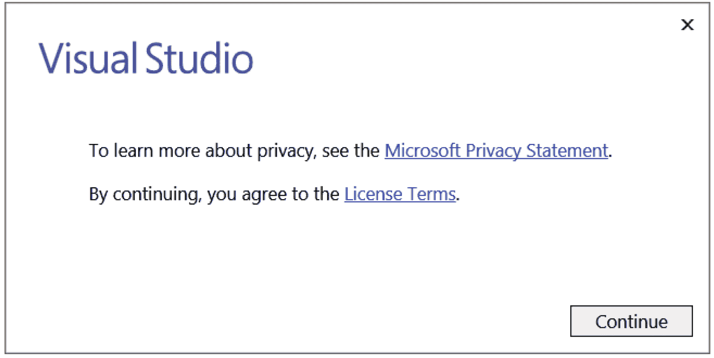
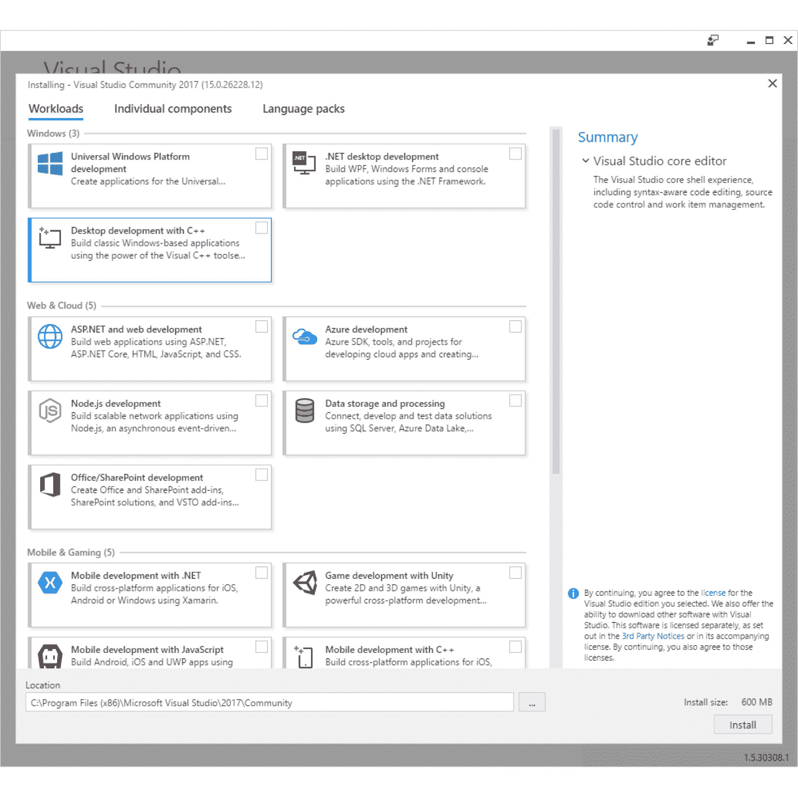
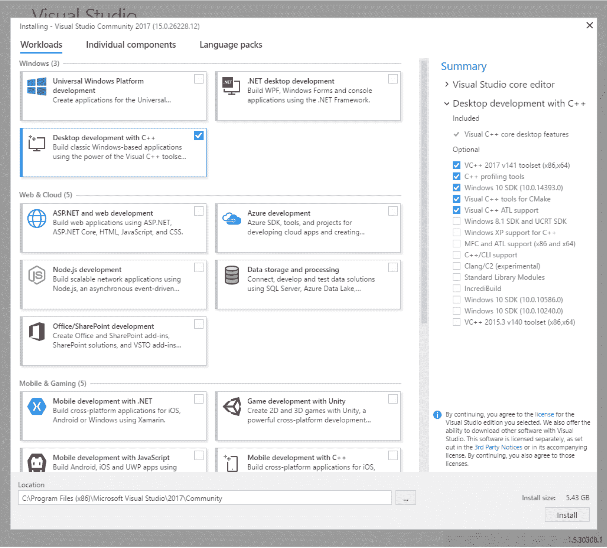
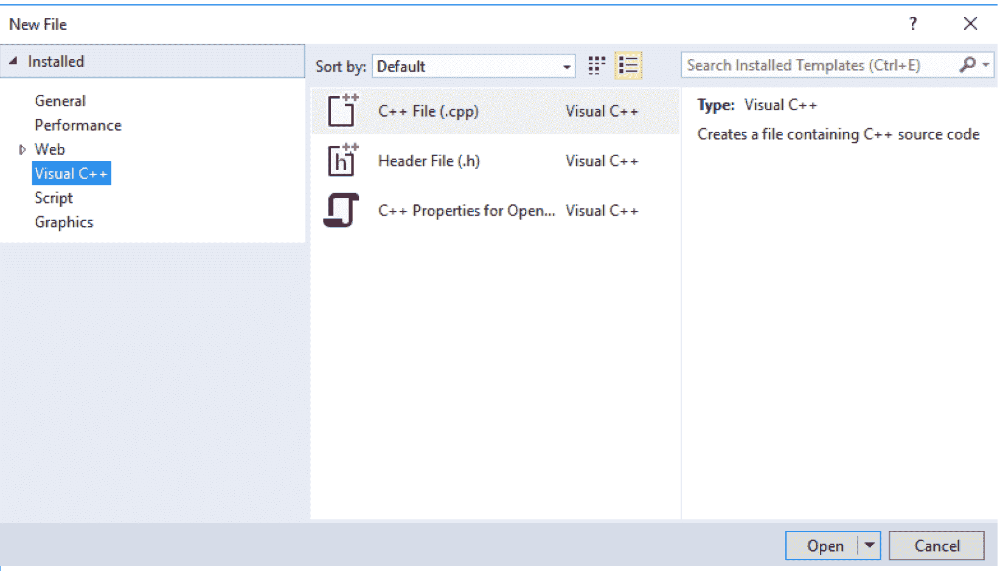
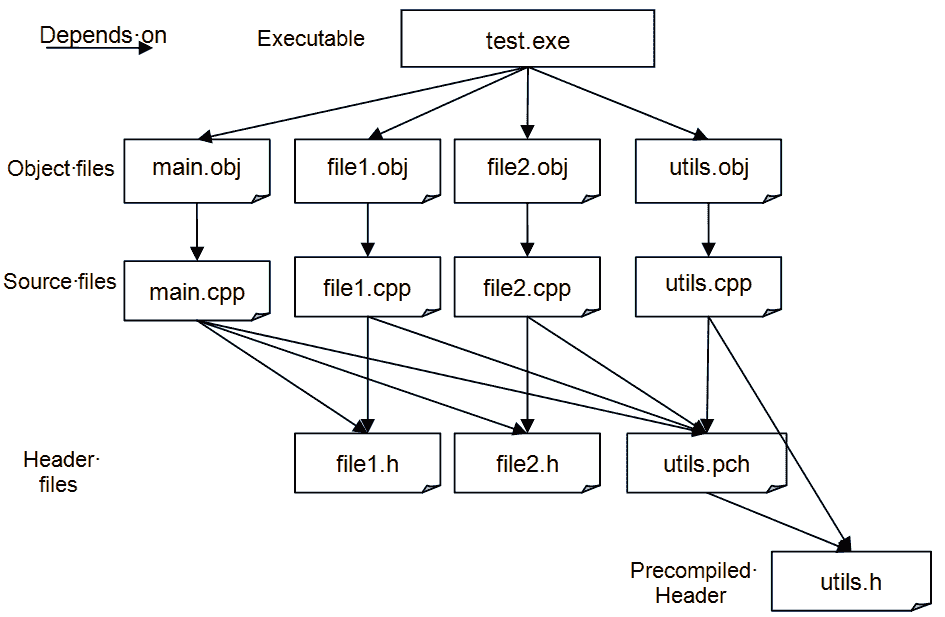

# 第一章：从 C++开始

为什么选择 C++？使用 C++的原因将会有很多，就像本书的读者一样多。

您可能选择 C++是因为您需要支持一个 C++项目。在其 30 年的生命周期中，已经有数百万行的 C++代码编写，大多数流行的应用程序和操作系统都将主要由 C++编写，或者将使用组件和库。几乎不可能找到一台不包含一些 C++编写的代码的计算机。

或者，您可能选择 C++来编写新代码。这可能是因为您的代码将使用 C++编写的库，而现有的库有成千上万种：开源、共享软件和商业软件。

或者您选择 C++是因为您被 C++所提供的强大和灵活性所吸引。现代高级语言被设计成让程序员轻松执行操作；而 C++虽然也有这样的功能，但它也允许您尽可能接近机器，给您直接内存访问的（有时是危险的）能力。通过类和重载等语言特性，C++是一种灵活的语言，允许您扩展语言的工作方式并编写可重用的代码。

无论您选择 C++的原因是什么，您都做出了正确的选择，而这本书是开始的正确地方。

# 本章中会有什么？

由于本书是一本实践性的书，它包含了您可以输入、编译和运行的代码。要编译代码，您需要一个 C++编译器和链接器，在本书中意味着 Visual Studio 2017 Community Edition，它提供了 Visual C++。选择这个编译器是因为它是免费下载的，它符合 C++标准，并且具有非常广泛的工具范围，使编写代码更容易。Visual C++提供了符合 C++11 标准的语言特性，几乎所有 C++14 和 C++17 的语言特性。Visual C++还提供了 C99 运行时库、C++11 标准库和 C++14 标准库。所有这些**标准**的提及意味着您在本书中学习到的代码将与所有其他标准的 C++编译器编译。

本章将从如何获取和安装 Visual Studio 2017 Community Edition 的细节开始。如果您已经有了 C++编译器，可以跳过本节。本书大部分内容对编译器和链接器工具都是中立的，但第十章《诊断和调试》将涵盖一些微软特定的功能，包括调试和诊断。Visual Studio 拥有功能齐全的代码编辑器，因此即使您不使用它来管理项目，您也会发现它在编辑代码时非常有用。

在我们描述了安装之后，您将学习 C++的基础知识：源文件和项目的结构，以及如何管理可能包含数千个文件的项目。

最后，本章将以一个逐步结构化的示例结束。在这里，您将学习如何编写使用标准 C++库和一个机制来管理项目中的文件的简单函数。

# 什么是 C++？

C++的前身是 C，由贝尔实验室的 Dennis Richie 设计，并于 1973 年首次发布。C 是一种广泛使用的语言，被用来编写 Unix 和 Windows 的早期版本。事实上，许多操作系统的库和软件开发库仍然是以 C 接口编写的。C 之所以强大，是因为它可以用来编写编译成紧凑形式的代码，它使用静态类型系统（因此编译器进行类型检查），语言的类型和结构允许直接访问计算机体系结构的内存。

然而，C 是基于函数的过程式语言，虽然它有记录类型（`struct`）来封装数据，但它没有对象行为来操作封装的状态。显然，需要的是 C 的强大功能，但又需要面向对象类的灵活性和可扩展性：一种具有类似 C 的语言。1983 年，Bjarne Stroustrup 发布了 C++。++ 来自于 C 的增量运算符 `++`。

严格地说，当后缀添加到变量时，`++` 运算符表示*增加变量的值，但返回增加之前的值*。因此，C 语句 `int c = 1; int d = c++;` 将导致变量 `d` 的值为 1，变量 `c` 的值为 2。这并不完全表达了 C++ 是 C 的增量的概念。

# 安装 Visual C++

Microsoft 的 Visual Studio Community 2017 包含了 Visual C++ 编译器、C++ 标准库以及一系列标准工具，您可以使用这些工具来编写和维护 C++ 项目。本书不是关于如何编写 Windows 代码的，而是关于如何编写标准的 C++ 以及如何使用 C++ 标准库。本书中的所有示例都将在命令行上运行。选择 Visual Studio 是因为它是免费下载的（尽管您必须向 Microsoft 注册一个电子邮件地址），而且它符合标准。如果您已经安装了 C++ 编译器，那么您可以跳过本节。

# 设置中

在开始安装之前，您应该知道，作为安装 Visual Studio 的一部分，您应该具有 Microsoft 帐户，这是 Microsoft 社区计划的一部分。第一次运行 Visual Studio 时，您将有选项创建 Microsoft 帐户，如果您跳过此阶段，您将获得一个 30 天的评估期。在这一个月内，Visual Studio 将具有完整功能，但如果您想在此期限之后继续使用 Visual Studio，您将需要提供 Microsoft 帐户。Microsoft 帐户不会对您施加任何义务，当您使用 Visual C++ 登录后，您的代码仍将保留在您的计算机上，无需将其传递给 Microsoft。

当然，如果您在一个月内阅读本书，您将能够使用 Visual Studio 而无需使用 Microsoft 帐户登录；您可以将此视为完成本书的动力！

# 下载安装文件

要下载 Visual Studio Community 2017 安装程序，请访问 [`www.visualstudio.com/vs/ community/`](https://www.visualstudio.com/vs/%20community/)。

单击“下载 Community 2017”按钮后，您的浏览器将下载一个名为 `vs_community__1698485341.1480883588.exe` 的 1 MB 文件。运行此应用程序后，它将允许您指定要安装的语言和库，然后下载并安装所有必要的组件。

# 安装 Visual Studio

Visual Studio 2017 将 Visual C++ 视为可选组件，因此您必须明确指示要通过自定义选项安装它。当您首次执行安装程序时，将会看到以下对话框：



单击“继续”按钮后，应用程序将设置安装程序，如下所示：



顶部有三个标签，分别标记为工作负载、单独组件和语言包。确保您已选择了“工作负载”标签（如截图所示），并选中了名为“使用 C++ 进行桌面开发”的复选框。

安装程序将检查您是否有足够的磁盘空间来安装所选的选项。Visual Studio 最大需要的空间为 8 GB，尽管对于 Visual C++，您将使用的空间要少得多。当您选择“使用 C++ 进行桌面开发”项目时，对话框的右侧将显示所选的选项和所需的磁盘空间，如下所示：



对于本书，保留安装程序选择的选项，然后单击右下角的“安装”按钮。安装程序将下载所有所需的代码，并将通过以下对话框框保持您更新进度：


安装完成后，Visual Studio Community 2017 项目将更改为具有两个按钮“修改”和“启动”，如下所示：


修改按钮允许您添加更多组件。单击“启动”以首次运行 Visual Studio。

# 与 Microsoft 注册

第一次运行 Visual Studio 时，它会要求您通过以下对话框登录到 Microsoft 服务：


您不必注册 Visual Studio，但如果选择不注册，Visual Studio 将只能使用 30 天。与 Microsoft 注册不会对您产生任何义务。如果您愿意注册，那么现在可以注册。单击“登录”按钮提供您的 Microsoft 凭据，或者如果您没有帐户，则单击“注册”以创建一个帐户。

当您单击“启动”按钮时，将打开一个新窗口，但安装程序窗口将保持打开状态。您可能会发现安装程序窗口隐藏了欢迎窗口，因此请检查 Windows 任务栏，看看是否有其他窗口打开。一旦 Visual Studio 启动，您可以关闭安装程序窗口。

现在您可以使用 Visual Studio 来编辑代码，并且在您的计算机上安装了 Visual C++编译器和库，因此您可以在 Visual Studio 或命令行中编译 C++代码。

# 检查 C++项目

C++项目可能包含数千个文件，管理这些文件可能是一项任务。构建项目时，应该编译文件，如果是的话，使用哪个工具？文件应该以什么顺序进行编译？这些编译器将产生什么输出？如何将编译后的文件组合以生成可执行文件？

编译器工具还将具有大量选项，如调试信息、优化类型、对不同语言功能和处理器功能的支持。在不同情况下将使用不同的编译器选项组合（例如，发布构建和调试构建）。如果您从命令行进行编译，您必须确保选择正确的选项并在所有编译的源代码中一致应用它们。

管理文件和编译器选项可能会变得非常复杂。这就是为什么在生产代码中，您应该使用一个 make 工具。Visual Studio 安装了两个：**MSBuild**和**nmake**。在 Visual Studio 环境中构建 Visual C++项目时，将使用 MSBuild，并且编译规则将存储在一个 XML 文件中。您还可以在命令行上调用 MSBuild，传递 XML 项目文件。nmake 工具是微软版本的通用程序维护实用程序，适用于许多编译器。在本章中，您将学习如何编写一个简单的**makefile**以与 nmake 实用程序一起使用。

在进行项目管理基础知识之前，我们首先要检查您在 C++项目中通常会找到的文件，以及编译器对这些文件的处理。

# 编译器

C++是一种高级语言，旨在为您和其他开发人员提供丰富的语言功能，并且易于阅读。计算机的处理器执行低级代码，编译器的目的是将 C++翻译为处理器的机器代码。单个编译器可能能够针对多种类型的处理器进行编译，如果代码是标准 C++，则可以使用支持其他处理器的其他编译器进行编译。

然而，编译器做的远不止这些。正如第四章中所解释的，*内存、数组和指针的使用*，C++允许你将代码分割成函数，这些函数接受参数并返回一个值，因此编译器设置了用于传递这些数据的内存。此外，函数可以声明只在该函数内部使用的变量（第五章中将提供更多细节），并且只在函数执行时存在。编译器设置了这个内存，称为**栈帧**。你可以选择编译器选项来确定如何创建栈帧；例如，微软编译器选项`/Gd`、`/Gr`和`/Gz`确定了将函数参数推送到栈上的顺序，以及在调用结束时是调用函数还是被调用函数从栈上移除参数。当你编写将被共享的代码时，这些选项很重要（但是对于本书的目的，应该使用默认的栈构造）。这只是一个方面，但它应该让你明白编译器设置给了你很多的权力和灵活性。

编译器编译 C++代码，如果在你的代码中遇到错误，它将发出编译器错误。这是对你的代码进行语法检查。重要的是要指出，你编写的代码可以从语法角度来看是完美的 C++代码，但它仍然可能是无意义的。编译器的语法检查是对你的代码的重要检查，但你应该始终使用其他检查。例如，以下代码声明一个整数变量并为其赋值：

```cpp
    int i = 1 / 0;
```

编译器将会发出错误`C2124：除以零或取模`。然而，以下代码将使用一个额外的变量执行相同的操作，逻辑上是相同的，但编译器不会发出错误：

```cpp
    int j = 0; 
    int i = 1 / j;
```

当编译器发出错误时，它将停止编译。这意味着两件事。首先，你将得不到编译输出，因此错误不会出现在可执行文件中。其次，这意味着，如果源代码中还有其他错误，你只有在修复当前错误并重新编译后才能发现。如果你想进行语法检查并将编译留到以后，可以使用`/Zs`开关。

编译器还会生成警告消息。警告意味着代码将会编译，但代码中可能存在问题，这将影响可执行文件的运行。微软编译器定义了四个警告级别：级别 1 是最严重的（应该解决），级别 4 是信息性的。

警告通常用于指示正在编译的语言特性是可用的，但它需要开发人员未使用的特定编译器选项。在代码开发过程中，你通常会忽略警告，因为你可能正在测试语言特性。然而，当你接近生产代码时，你应该更加关注警告。默认情况下，微软编译器将显示级别 1 的警告，你可以使用`/W`选项加上一个数字来指示你希望看到的级别（例如，`/W2`表示你希望看到级别 2 的警告以及级别 1 的警告）。在生产代码中，你可以使用`/Wx`选项，它告诉编译器将警告视为错误，因此你必须修复问题才能编译代码。你还可以使用`pragmas`编译器（`pragmas`将在后面解释）和编译器选项来抑制特定的警告。

# 链接代码

编译器会产生一个输出。对于 C++代码，这将是目标代码，但你可能会有其他编译器输出，比如编译后的资源文件。这些文件本身不能被执行；至少因为操作系统需要设置某些结构。一个 C++项目总是两阶段的：将代码编译成一个或多个目标文件，然后将目标文件链接成一个可执行文件。这意味着你的 C++编译器将提供另一个工具，称为链接器。

链接器还有选项来确定它的工作方式并指定其输出和输入，它也会发出错误和警告。与编译器一样，微软的链接器有一个选项`/WX`，在发布版本中将警告视为错误。

# 源文件

在最基本的层面上，一个 C++项目只包含一个文件：C++源文件，通常扩展名为`cpp`或`cxx`。

# 一个简单的例子

这里展示了最简单的 C++程序：

```cpp
    #include <iostream> 

    // The entry point of the program 
    int main() 
    { 
        std::cout << "Hello, world!n"; 
    }
```

第一点要说明的是，以`//`开头的行是注释。编译器会忽略直到行末的所有文本。如果要有多行注释，每一行都必须以`//`开头。你也可以使用 C 注释。C 注释以`/*`开头，以`*/`结尾，两个符号之间的所有内容都是注释，包括换行符。

C 注释是注释掉代码的一种快速方式。

大括号`{}`表示一个代码块；在这种情况下，C++代码是为函数`main`而写的。我们知道这是一个函数，因为基本格式是：首先是返回值的类型，然后是函数的名称，后面跟着一对括号，用于声明传递给函数的参数（及其类型）。在这个例子中，函数名为`main`，括号是空的，表示该函数没有参数。函数名前的标识符（int）表示该函数将返回一个整数。

C++的约定是，一个名为`main`的函数是可执行文件的**入口点**，也就是说，当你从命令行调用可执行文件时，这将是你代码中将被调用的第一个函数。

这个简单的例子函数立即让你了解了 C++的一个方面，即激怒其他语言的程序员：语言可能有规则，但规则并不总是被遵循。在这种情况下，`main`函数声明返回一个整数，但代码没有返回任何值。C++的规则是，如果函数声明返回一个值，那么它必须返回一个值。然而，这个规则有一个例外：如果`main`函数不返回值，那么将假定返回值为`0`。C++包含许多这样的怪癖，但你很快就会学会它们并习惯它们。

`main`函数只有一行代码；这是一个以`std`开头并以分号(`;`)结尾的单个语句。C++对于空白符（空格、制表符和换行符）的使用是灵活的，这将在下一章中解释。然而，重要的是要注意，你必须小心处理文字字符串（如此处所用），并且每个语句都要用分号分隔。忘记必需的分号是编译器错误的常见来源。额外的分号只是一个空语句，所以对于新手来说，有太多分号可能对你的代码的影响要比太少分号要小。

单个语句将字符串`Hello, world!`（和一个换行符）打印到控制台。您知道这是一个字符串，因为它用双引号（`″″`）括起来。字符串使用运算符`<<` *放入*流对象`std::cout`。名称中的`std`是一个**命名空间**，实际上是具有类似目的或来自单个供应商的代码集合。在这种情况下，`std`表示`cout`流对象是标准 C++库的一部分。双冒号`::`是**作用域解析**运算符，表示您要访问在`std`命名空间中声明的`cout`对象。您可以定义自己的命名空间，在大型项目中应该定义自己的命名空间，因为这样可以使用可能已在其他命名空间中声明的名称，并且此语法允许您消除符号的歧义。

`cout`对象是`ostream`类的一个实例，并且在调用`main`函数之前已经为您创建。`<<`表示调用名为`operator <<`的函数，并传递字符串（这是一个`char`字符数组）。此函数将字符串中的每个字符打印到控制台，直到达到`NUL`字符。

这是 C++灵活性的一个例子，一个称为**运算符重载**的特性。`<<`运算符通常与整数一起使用，并且也用于将整数中的位向左移动指定数量的位置；`x << y`将返回一个值，该值将`x`中的每个位向左移动`y`个位置，实际上返回一个乘以 2^y 的值。然而，在前面的代码中，`x`的位置是流对象`std::cout`，左移索引的位置是一个字符串。显然，这在 C++对`<<`运算符的定义中是没有意义的。当左侧是`ostream`对象时，C++标准重新定义了`<<`运算符的含义。此外，此代码中的`<<`运算符将字符串打印到控制台，因此它在右侧需要一个字符串。C++标准库定义了其他`<<`运算符，允许其他数据类型打印到控制台。它们都以相同的方式调用；编译器根据使用的参数类型确定编译哪个函数。

之前我们说过，`std::cout`对象已经作为`ostream`类的一个实例被创建，但没有说明这是如何发生的。这导致我们来到了尚未解释的简单源文件的最后一部分：以`#include`开头的第一行。这里的`#`有效地表示将向编译器发送某种消息。您可以发送各种类型的消息（其中一些是`#define`、`#ifdef`、`#pragma`，我们将在本书的其他地方返回）。在这种情况下，`#include`告诉编译器将指定文件的内容复制到此处的源文件中，这基本上意味着该文件的内容也将被编译。指定的文件称为**头文件**，在文件管理和通过库重用代码中很重要。

文件`<iostream>`（注意，没有扩展名）是标准库的一部分，可以在 C++编译器提供的**include 目录**中找到。尖括号（`<>`）表示编译器应查找用于存储头文件的标准目录，但您可以使用双引号（`″″`）提供头文件的绝对位置（或相对于当前文件的位置）。C++标准库使用不使用文件扩展名的约定。在命名自己的头文件时，应使用扩展名`h`（或`hpp`，很少使用`hxx`）。C 运行时库（也可用于 C++代码）还使用扩展名`h`来命名其头文件。

# 创建源文件

首先找到开始菜单中的 Visual Studio 2017 文件夹，然后点击 Developer Command Prompt for VS2017 的条目。这将启动一个 Windows 命令提示符，并设置环境变量以使用 Visual C++ 2017。然而，令人不满意的是，它也会将命令行留在 Program Files 文件夹下的 Visual Studio 文件夹中。如果你打算进行任何开发，你会想要离开这个文件夹，去一个创建和删除文件不会造成任何损害的地方。在你这样做之前，移动到 Visual C++文件夹并列出文件：

```cpp
C:\Program Files\Microsoft Visual Studio\2017\Community>cd %VCToolsInstallDir%
C:\Program Files\Microsoft Visual Studio\2017\Community\VC\Tools\MSVC\14.0.10.2517>dir
```

由于安装程序将 C++文件放在一个包含当前编译器版本的文件夹中，因此最好使用环境变量`VCToolsInstallDir`，而不是指定特定版本，以便使用最新版本（在本例中为 14.0.10.2517）。

有几件事情需要注意。首先，文件夹`bin`、`include`和`lib`：

| **文件夹** | **描述** |
| --- | --- |
| `bin` | 这个文件夹间接包含了 Visual C++的可执行文件。`bin`文件夹将包含用于你正在使用的 CPU 类型的单独文件夹，因此你需要在其中导航以找到包含可执行文件的实际文件夹。两个主要的可执行文件是`cl.exe`，它是 C++编译器，和`link.exe`，它是链接器。 |
| `include` | 这个文件夹包含了 C 运行库和 C++标准库的头文件。 |
| `lib` | 这个文件夹包含了 C 运行库和 C++标准库的静态链接库文件。同样，对于 CPU 类型会有单独的文件夹。 |

我们将在本章后面提到这些文件夹。

另一件要指出的事情是`vcvarsall.bat`文件，它位于`VC\Auxillary\Build`文件夹下。当你在开始菜单上点击 Developer Command Prompt for VS2017 时，这个批处理文件将被运行。如果你希望使用现有的命令提示符来编译 C++代码，你可以通过运行这个批处理文件来设置。这个批处理文件的三个最重要的操作是设置`PATH`环境变量以包含一个指向 bin 文件夹的路径，并设置`INCLUDE`和`LIB`环境变量分别指向 include 和 lib 文件夹。

现在导航到根目录并创建一个新文件夹`Beginning_C++`，然后进入该目录。接下来，创建一个名为`Chapter_01`的文件夹。现在你可以切换到 Visual Studio；如果它还没有运行，可以从开始菜单启动它。

在 Visual Studio 中，点击文件菜单，然后选择新建，再选择文件...菜单项，以打开新文件对话框，在左侧树视图中，点击 Visual C++选项。在中间面板中，你会看到两个选项：C++文件（.cpp）和头文件（.h），以及`Open`文件夹的 C++属性，如下截图所示：



前两种文件类型用于 C++项目，第三种类型创建一个 JSON 文件，以帮助 Visual Studio IntelliSence（在输入时提供帮助），并且在本书中不会使用。

点击第一个，然后点击打开按钮。这将创建一个名为 Source1.cpp 的新空文件，所以将其保存到章节项目文件夹中，命名为 simple.cpp，方法是点击文件菜单，然后选择另存为 Source1.cpp，然后导航到项目文件夹，在文件名框中更改名称为 simple.cpp，最后点击保存按钮。

现在你可以输入简单程序的代码，如下所示：

```cpp
    #include <iostream> 

    int main() 
    { 
        std::cout << "Hello, world!n"; 
    }
```

当你输入完这段代码后，通过点击文件菜单然后选择菜单中的保存 simple.cpp 选项来保存文件。现在你已经准备好编译代码了。

# 编译代码

转到命令提示符，输入`**cl /?**`命令。由于`PATH`环境设置为包括`bin`文件夹的路径，您将看到编译器的帮助页面。您可以通过按回车键滚动这些页面，直到返回到命令提示符。这些选项中的大多数超出了本书的范围，但以下表格显示了我们将讨论的一些选项：

| **编译器开关** | **描述** |
| --- | --- |
| `/c` | 仅编译，不链接。 |
| `/D<symbol>` | 定义常量或宏<symbol>。 |
| `/EHsc` | 启用 C++异常处理，但指示不处理`extern ″C″`函数（通常是操作系统函数）的异常。 |
| `/Fe:<file>` | 提供要链接的可执行文件的名称。 |
| `/Fo:<file>` | 提供要编译的对象文件的名称。 |
| `/I <folder>` | 提供要用于搜索包含文件的文件夹的名称。 |
| `/link<linker options>` | 将<linker options>传递给链接器。这必须在源文件名和任何用于编译器的开关之后。 |
| `/Tp <file>` | 将<file>编译为 C++文件，即使它的文件扩展名不是`.cpp`或`.cxx`。 |
| `/U<symbol>` | 删除先前定义的<symbol>宏或常量。 |
| `/Zi` | 启用调试信息。 |
| `/Zs` | 仅语法，不编译或链接。 |

请注意，某些选项需要开关和选项之间有空格，某些选项不能有空格，对于其他选项，空格是可选的。一般来说，如果您有一个包含空格的文件或文件夹的名称，您应该用双引号括起来。在使用开关之前，最好查阅帮助文件，了解它如何使用空格。

在命令行中，输入`**cl simple.cpp**`命令。您会发现编译器会发出警告`**C4530**`和`**C4577**`。原因是 C++标准库使用了异常，而您没有指定编译器应提供异常所需的支持代码。使用`/EHsc`开关很容易解决这些警告。在命令行中，输入`cl /EHsc simple.cpp`命令。如果您正确输入了代码，它应该可以编译：

```cpp
C:\Beginning_C++\Chapter_01>cl /EHsc simple.cpp
Microsoft (R) C/C++ Optimizing Compiler Version 19.00.25017 for x86
Copyright (C) Microsoft Corporation.  All rights reserved

simple.cpp

Microsoft (R) Incremental Linker Version 14.10.25017.0
Copyright (C) Microsoft Corporation.  All rights reserved.
/out:simple.exe

simple.obj
```

默认情况下，编译器将文件编译为对象文件，然后将该文件作为命令行可执行文件传递给链接器，其名称与 C++文件相同，但扩展名为`.exe`。`/out:simple.exe`一行是链接器生成的，`/out`是一个链接器选项。

列出文件夹的内容。您会发现三个文件：`simple.cpp`，源文件；simple.obj，编译器的输出对象文件；和`simple.exe`，链接器链接了对象文件和适当的运行时库后的输出。现在，您可以通过在命令行上输入`simple`来运行可执行文件：

```cpp
C:\Beginning_C++\Chapter_01>simple
Hello, World!
```

# 在命令行和可执行文件之间传递参数

之前，您发现`main`函数返回一个值，默认情况下这个值是零。当应用程序完成时，您可以将错误代码返回到命令行；这样您可以在批处理文件和脚本中使用可执行文件，并使用该值来控制脚本内的流程。同样，当您运行一个可执行文件时，您可以从命令行传递参数，这将影响可执行文件的行为。

通过在命令行上输入`**simple**`命令来运行简单的应用程序。在 Windows 中，通过伪环境变量`ERRORLEVEL`获取错误代码，因此通过`**ECHO**`命令获取此值：

```cpp
C:\Beginning_C++\Chapter_01>simple
Hello, World!

C:\Beginning_C++\Chapter_01>ECHO %ERRORLEVEL%
0
```

为了显示应用程序返回的值，将`main`函数更改为返回非零值（在本例中为 99，如下所示）：

```cpp
    int main() 
    { 
        std::cout << "Hello, world!n"; 
 return 99; 
    }
```

编译此代码并运行它，然后按照之前显示的方式打印出错误代码。您会发现错误代码现在是 99。 

这是一种非常基本的通信机制：它只允许你传递整数值，调用你的代码的脚本必须知道每个值的含义。你更有可能向应用程序传递参数，并且这些参数将通过`main`函数的参数传递到你的代码中。用以下内容替换`main`函数：

```cpp
        int main(int argc, char *argv[]) 
        { 
            std::cout << "there are " << argc << " parameters" <<  
            std::endl; 
            for (int i = 0; i < argc; ++i) 
            { 
                std::cout << argv[i] << std::endl; 
            } 
        }
```

当你编写`main`函数从命令行接受参数时，约定是它有这两个参数。

第一个参数通常被称为`argc`。它是一个整数，表示传递给应用程序的参数数量。*这个参数非常重要*。原因是你将要通过数组访问内存，这个参数给出了你的访问限制。如果你超出这个限制访问内存，你会遇到问题：最好的情况是访问未初始化的内存，但最坏的情况是可能导致访问违规。

每当访问内存时，重要的是要了解你正在访问的内存量，并保持在其限制内。

第二个参数通常被称为`argv`，是一个指向内存中 C 字符串的指针数组。你将在第四章 *使用内存、数组和指针*中学到更多关于数组和指针的知识，以及在第九章 *使用字符串*中学到更多关于字符串的知识，所以我们在这里不会进行详细讨论。方括号(`[]`)表示参数是一个数组，数组的每个成员的类型由`char *`给出。`*`表示每个项目是指向内存的指针。通常，这会被解释为指向给定类型的单个项目的指针，但字符串是不同的：`char *`表示在指针指向的内存中将会有零个或多个字符，后跟`NUL`字符()。字符串的长度是直到`NUL`字符的字符数。

这里显示的第三行向控制台打印了传递给应用程序的字符串数量。在这个例子中，我们使用流`std::endl`而不是使用换行转义字符(`n`)来添加换行。有几个操纵符可以使用，这将在第六章*类*中讨论。`std::endl`操纵符会将换行字符放入输出流，然后刷新流。这行显示了 C++允许你将`<<`放操作符链接到流中。这行还向你展示了`<<`放操作符被重载，也就是说，对于不同的参数类型有不同版本的操作符（在这种情况下有三个：一个接受整数的，用于`argv`，一个接受字符串参数的，另一个接受操纵符作为参数），但调用这些操作符的语法是完全相同的。

最后，有一个代码块来打印`argv`数组中的每个字符串，如下所示：

```cpp
    for (int i = 0; i < argc; ++i) 
    { 
        std::cout << argv[i] << std::endl; 
    }
```

`for`语句意味着代码块将被调用，直到变量`i`小于`argc`的值，并且在每次成功迭代循环后，变量`i`会被递增（使用前缀递增操作符`++`）。通过方括号语法(`[]`)访问数组中的项目。传递的值是数组的*索引*。

注意，变量`i`的起始值为`0`，所以访问的第一个项目是`argv[0]`，并且由于`for`循环在变量`i`的值为`argc`时结束，这意味着数组中访问的最后一个项目是`argv[argc-1]`。这是数组的典型用法：第一个索引是零，如果数组中有`n`个项目，最后一个项目的索引是`n-1`。

像之前一样编译和运行这段代码，不带参数：

```cpp
C:\Beginning_C++\Chapter_01>simple
there are 1 parameters
simple
```

请注意，尽管你没有给出参数，程序认为有一个参数：程序可执行文件的名称。实际上，这不仅仅是名称，它是用于调用可执行文件的命令。在这种情况下，你输入了`**simple**`命令（没有扩展名），并在控制台上打印了文件`simple`的值作为参数。再试一次，但这次使用完整名称`simple.exe`调用程序。现在你会发现第一个参数是`simple.exe`。

尝试使用一些实际参数调用代码。在命令行中输入`**simple test parameters**`命令：

```cpp
C:\Beginning_C++\Chapter_01>simple test parameters
there are 3 parameters
simple
test parameters
```

这次程序说有三个参数，并且它已经使用空格字符进行了分隔。如果你想在单个参数中使用空格，你应该将整个字符串放在双引号中：

```cpp
C:\Beginning_C++\Chapter_01>simple ″test parameters″
there are 2 parameters
simple
test parameters
```

请记住，`argv`是一个字符串指针数组，所以如果你想从命令行传递一个数字类型，并且想在程序中使用它作为一个数字，你将不得不从通过`argv`访问的字符串表示中进行转换。

# 预处理器和符号

C++编译器在编译源文件时会经历几个步骤。顾名思义，编译器预处理器处于这个过程的开始。预处理器定位头文件并将它们插入到源文件中。它还替换宏和定义的常量。

# 定义常量

定义常量的两种主要方法是通过预处理器：通过编译器开关和代码。要查看这是如何工作的，让我们将`main`函数更改为打印常量的值；两个重要的行已经突出显示：

```cpp
    #include <iostream>  
 #define NUMBER 4 

    int main() 
    { 
 std::cout << NUMBER << std::endl; 
    }
```

以`#define`开头的行是对预处理器的指令，它说，无论在文本中哪里有确切的符号`NUMBER`，它都应该被替换为 4。这是一个文本搜索和替换，但它只会替换整个符号（因此如果文件中有一个叫做`NUMBER99`的符号，`NUMBER`部分将不会被替换）。预处理器完成工作后，编译器将看到以下内容：

```cpp
    int main() 
    { 
 std::cout << 4 << std::endl; 
    }
```

编译原始代码并运行它，并确认程序只是将 4 打印到控制台。

预处理器的文本搜索和替换方面可能会导致一些奇怪的结果，例如，将你的`main`函数更改为声明一个名为`NUMBER`的变量：

```cpp
    int main() 
    { 
 int NUMBER = 99; 
        std::cout << NUMBER << std::endl; 
    }
```

现在编译代码。你将会收到来自编译器的错误：

```cpp
C:\Beginning_C++\Chapter_01>cl /EHhc simple.cpp
Microsoft (R) C/C++ Optimizing Compiler Version 19.00.25017 for x86
Copyright (C) Microsoft Corporation.  All rights reserved.

simple.cpp
simple.cpp(7): error C2143: syntax error: missing ';' before 'constant'
simple.cpp(7): error C2106: '=': left operand must be l-value
```

这表明第 7 行有一个错误，这是声明变量的新行。然而，由于预处理器进行的搜索和替换，编译器看到的是以下内容：

```cpp
    int 4 = 99;
```

这不是正确的 C++！

在你输入的代码中，很明显是什么导致了问题，因为你在同一个文件中为该符号使用了`#define`指令。实际上，你将包括几个头文件，这些头文件本身可能包括文件，因此错误的`#define`指令可能在许多文件中的一个中。同样，你的常量符号可能与在`#define`指令之后包含的头文件中的变量具有相同的名称，并且可能被预处理器替换。

使用`#define`作为定义全局常量的方法通常不是一个好主意，在 C++中有更好的方法，正如你将在第三章中看到的，*探索 C++类型*。

如果你认为问题是由预处理器替换符号引起的，你可以通过查看预处理器完成工作后传递给编译器的源文件来进行调查。为此，使用`/EP`开关进行编译。这将抑制实际编译并将预处理器的输出发送到`stdout`（命令行）。请注意，这可能会产生大量文本，因此通常最好将此输出定向到文件，并使用 Visual Studio 编辑器检查该文件。

提供给预处理器使用的值的另一种方法是通过编译器开关传递它们。编辑代码并删除以`#define`开头的行。像往常一样编译此代码（`**cl /EHsc simple.cpp**`），运行它，并确认在控制台上打印的数字是 99，即分配给变量的值。现在再次使用以下行编译代码：

```cpp
cl /EHsc simple.cpp /DNUMBER=4
```

请注意，/D 开关和符号名称之间没有空格。这告诉预处理器将每个`NUMBER`符号替换为文本`4`，这将导致与上述相同的错误，表明预处理器试图用提供的值替换符号。

诸如 Visual C++和 nmake 项目之类的工具将通过 C++编译器定义符号的机制。/D 开关用于定义一个符号，如果要定义其他符号，它们将有自己的/D 开关。

您现在想知道为什么 C++有这样一个看似只会导致混乱错误的奇怪功能。一旦您了解了预处理器的工作原理，定义符号就可以变得非常强大。

# 使用宏

预处理器符号的一个有用特性是**宏**。宏具有参数，预处理器将确保搜索和替换将使用宏中的符号替换为宏的参数。

编辑`main`函数以如下所示：

```cpp
    #include <iostream> 

    #define MESSAGE(c, v)  
    for(int i = 1; i < c; ++i) std::cout << v[i] << std::endl; 

    int main(int argc, char *argv[]) 
    { 
        MESSAGE(argc, argv); 
        std::cout << "invoked with " << argv[0] << std::endl; 
    }
```

`main`函数调用一个名为`MESSAGE`的宏，并将命令行参数传递给它。然后该函数将第一个命令行参数（调用命令）打印到控制台上。`MESSAGE`不是一个函数，它是一个宏，这意味着预处理器将用之前定义的文本替换每个带有两个参数的`MESSAGE`的出现，将`c`参数替换为宏的第一个参数，将`v`替换为宏的第二个参数。预处理器处理完文件后，`main`将如下所示：

```cpp
    int main(int argc, char *argv[]) 
    { 
        for(int i = 1; i < argc; ++i)  
            std::cout << argv[i] << std::endl; 
        std::cout << "invoked with " << argv[0] << std::endl; 
    }
```

请注意，在宏定义中，反斜杠（\）用作换行字符，因此您可以有多行宏。使用一个或多个参数编译和运行此代码，并确认`MESSAGE`打印出命令行参数。

# 使用符号

您可以定义一个没有值的符号，并且可以告诉预处理器测试符号是否已定义。最明显的情况是为调试构建和发布构建编译不同的代码。

编辑代码以添加此处突出显示的行：

```cpp
 #ifdef DEBUG 
    #define MESSAGE(c, v)  
    for(int i = 1; i < c; ++i) std::cout << v[i] << std::endl; 
 #else #define MESSAGE #endif
```

第一行告诉预处理器查找`DEBUG`符号。如果定义了此符号（无论其值如何），则将使用`MESSAGE`宏的第一个定义。如果未定义该符号（发布构建），则`MESSAGE`符号被定义，但不执行任何操作：基本上，带有两个参数的`MESSAGE`的出现将从代码中删除。

编译此代码并使用一个或多个参数运行程序。例如：

```cpp
C:\Beginning_C++\Chapter_01>simple test parameters
invoked with simple
```

这表明代码已经编译而没有定义`DEBUG`，因此`MESSAGE`被定义为不执行任何操作。现在再次编译此代码，但这次使用/DDEBUG 开关来定义`DEBUG`符号。再次运行程序，您将看到命令行参数被打印到控制台上：

```cpp
C:\Beginning_C++\Chapter_01>simple test parameters
test parameters 
invoked with simple
```

此代码使用了一个宏，但您可以在 C++代码的任何地方使用符号进行条件编译。以这种方式使用的符号允许您编写灵活的代码，并通过编译器命令行上定义的符号选择要编译的代码。此外，编译器本身将定义一些符号，例如，`__DATE__`将具有当前日期，`__TIME__`将具有当前时间，`__FILE__`将具有当前文件名。

Microsoft 和其他编译器生产商定义了一长串可以访问的符号，建议您在手册中查找这些符号。您可能会发现一些有用的符号如下：`__cplusplus`将为 C++源文件定义（但不会为 C 文件定义），因此您可以识别需要 C++编译器的代码；`_DEBUG`用于调试构建（请注意前面的下划线），`_MSC_VER`具有 Visual C++编译器的当前版本，因此您可以在各个版本的编译器中使用相同的源代码。

# 使用编译器指令

与符号和条件编译相关的是编译器指令`#pragma once`。编译器特定的指令是编译器特定的指令，不同的编译器将支持不同的指令。Visual C++定义了`#pragma once`来解决当您有多个头文件每个包含类似的头文件时出现的问题。问题是可能导致相同的项目被定义多次，编译器将将其标记为错误。有两种方法可以解决这个问题，您下一个包含的`<iostream>`头文件将使用这两种技术。您可以在 Visual C++的`include`文件夹中找到此文件。在文件顶部，您将找到以下内容：

```cpp
    // ostream standard header 
    #pragma once 
    #ifndef _IOSTREAM_ 
    #define _IOSTREAM_
```

在底部，您将找到以下行：

```cpp
    #endif /* _IOSTREAM_ */
```

首先是条件编译：第一次包含此头文件时，符号`_IOSTREAM_`将未定义，因此该符号被定义，然后其余文件将被包含直到`#endif`行。

这说明了在使用条件编译时的良好实践。对于每个`#ifndef`，必须有一个`#endif`，并且它们之间可能会有数百行。当您使用`#ifdef`或`#ifundef`时，最好提供一个注释，说明它所指的符号以及相应的`#else`和`#endif`。

如果文件再次被包含，则符号`_IOSTREAM_`将被定义，因此在`#ifndef`和`#endif`之间的代码将被忽略。但是，重要的是要指出，即使定义了该符号，头文件仍将被加载和处理，因为关于如何处理的指令包含在文件中。

`#pragma once`执行与条件编译相同的操作，但它解决了使用可能重复的符号的问题。如果将这一行添加到头文件的顶部，您就是在指示预处理器加载和处理此文件一次。预处理器维护了它已处理的文件列表，如果随后的头文件尝试加载已经处理过的文件，那么该文件将不会被加载也不会被处理。这减少了项目预处理所需的时间。

在关闭`<iostream>`文件之前，查看文件中的行数。对于`<iostream>`版本 v6.50:0009，有 55 行。这是一个小文件，但它包括`<istream>`（1,157 行），其中包括`<ostream>`（1,036 行），其中包括`<ios>`（374 行），其中包括`<xlocnum>`（1,630 行），依此类推。预处理的结果可能意味着即使对于只有一行代码的程序，也会包含成千上万行的源文件！

# 依赖关系

C++项目将生成可执行文件或库，这将由链接器从目标文件构建。可执行文件或库依赖于这些目标文件。目标文件将从 C++源文件（可能还有一个或多个头文件）编译而成。目标文件依赖于这些 C++源文件和头文件。理解依赖关系很重要，因为它可以帮助您理解项目中编译文件的顺序，并且可以通过仅编译已更改的文件来加快项目构建速度。

# 库

当您在源文件中包含一个文件时，该头文件中的代码将对您的代码可访问。您的包含文件可能包含整个函数或类的定义（这将在后面的章节中介绍），但这将导致前面提到的问题：函数或类的多重定义。相反，您可以声明一个类或**函数原型**，它指示调用代码将如何调用函数，而不实际*定义*它。显然，代码必须在其他地方定义，这可以是源文件或库，但编译器会很高兴，因为它只看到一个定义。

库是已经定义好的代码；它已经完全调试和测试过，因此用户不应该需要访问源代码。C++标准库主要通过头文件共享，这有助于您调试代码，但您必须抵制任何编辑这些文件的诱惑。其他库将以编译后的库的形式提供。

基本上有两种类型的编译库：静态库和动态链接库。如果您使用静态库，那么编译器将从静态库中复制您使用的编译代码，并将其放入可执行文件中。如果您使用动态链接（或共享）库，那么链接器将在运行时添加信息（可能是在加载可执行文件时，或者甚至延迟到调用函数时）来将共享库加载到内存中并访问函数。

Windows 使用扩展名`lib`表示静态库，`dll`表示动态链接库。GNU **gcc**使用扩展名`a`表示静态库，`so`表示共享库。

如果您在静态或动态链接库中使用库代码，编译器将需要知道您是否正确地调用函数-以确保您的代码调用具有正确数量的参数和正确类型的函数。这就是函数原型的目的：它为编译器提供了有关调用函数的信息，而不提供函数的实际主体，即函数定义。

本书不会详细介绍如何编写库，因为这取决于编译器；也不会详细介绍调用库代码的细节，因为不同的操作系统有不同的共享代码方式。一般来说，C++标准库将通过标准头文件包含在您的代码中。C 运行时库（为 C++标准库提供一些代码）将被静态链接，但如果编译器提供动态链接版本，您将有一个编译器选项来使用它。

# 预编译头文件

当您将一个文件包含到您的源文件中时，预处理器将包含该文件的内容（在考虑任何条件编译指令后），以及递归地包含该文件包含的任何文件。正如前面所示，这可能导致成千上万行的代码。在开发代码时，您经常会编译项目以便测试代码。每次编译代码时，头文件中定义的代码也将被编译，即使库头文件中的代码没有改变。对于大型项目，这可能会导致编译花费很长时间。

为了解决这个问题，编译器通常提供一个选项来预编译那些不会改变的头文件。创建和使用预编译头文件是与编译器相关的。例如，使用 GNU C++编译器 gcc，您可以将头文件编译为 C++源文件（使用`/x`开关），编译器将创建一个扩展名为`gch`的文件。当 gcc 编译使用该头文件的源文件时，它将搜索`gch`文件，如果找到预编译头文件，它将使用该文件；否则，它将使用头文件。

在 Visual C++中，这个过程稍微复杂一些，因为你必须明确告诉编译器在编译源文件时查找预编译头文件。在 Visual C++项目中的约定是创建一个名为`stdafx.cpp`的源文件，其中包含一行代码，包括文件`stdafx.h`。你将所有稳定的头文件包含在`stdafx.h`中。接下来，通过使用`/Yc`编译器选项编译`stdafx.cpp`来创建一个预编译头文件，指定`stdafx.h`包含了要编译的稳定头文件。这将创建一个`pch`文件（通常，Visual C++会根据你的项目命名），其中包含了到包含`stdafx.h`头文件的代码编译的内容。你的其他源文件必须将`stdafx.h`头文件包含为第一个头文件，但它们也可以包含其他文件。在编译源文件时，你使用`/Yu`开关来指定稳定的头文件（`stdafx.h`），编译器将使用预编译头文件`pch`而不是头文件。

当你检查大型项目时，你经常会发现使用了预编译头文件；正如你所看到的，它改变了项目的文件结构。本章后面的示例将展示如何创建和使用预编译头文件。

# 项目结构

将代码组织成模块对于有效地进行维护非常重要。第七章，*面向对象编程简介*，解释了面向对象编程，这是一种组织和重用代码的方式。然而，即使你在编写类似 C 的过程式代码（即，你的代码涉及线性调用函数），你也会受益于将其组织成模块。例如，你可能有处理字符串的函数和访问文件的其他函数，因此你可能决定将字符串函数的定义放在一个源文件`string.cpp`中，将文件函数的定义放在另一个文件`file.cpp`中。为了让项目中的其他模块可以使用这些文件，你必须在一个头文件中声明这些函数的原型，并在使用这些函数的模块中包含该头文件。

语言中没有绝对的规则来规定头文件和包含函数定义的源文件之间的关系。你可以为`string.cpp`中的函数创建一个名为`string.h`的头文件；为`file.cpp`中的函数创建一个名为`file.h`的头文件。或者你可以只创建一个名为`utilities.h`的文件，其中包含了这两个文件中所有函数的声明。唯一的规则是，在编译时，编译器必须能够访问当前源文件中函数的声明，无论是通过头文件还是函数定义本身。

编译器不会在源文件中*向前查找*，因此如果函数`A`在同一源文件中调用另一个函数`B`，那么函数`B`必须在函数`A`调用它之前已经被定义，或者必须有一个原型声明。这导致了一个典型的约定，即为每个包含源文件中函数原型的源文件创建一个关联的头文件，并且源文件包含这个头文件。当你编写类时，这个约定变得更加重要。

# 管理依赖关系

当使用构建工具构建项目时，会执行检查以查看构建的输出是否存在，如果不存在，则执行构建所需的适当操作。常见的术语是构建步骤的输出称为**目标**，构建步骤的输入（例如，源文件）是该目标的**依赖项**。每个目标的依赖项是用于生成它们的文件。这些依赖项本身可能是构建操作的目标，并且具有它们自己的依赖项。

例如，下面的图表显示了一个项目中的依赖关系：



在这个项目中，有三个源文件（`main.cpp`，`file1.cpp`和`file2.cpp`）。每个文件都包含相同的头文件`utils.h`，这是预编译的（因此有第四个源文件`utils.cpp`，只包含`utils.h`）。所有源文件都依赖于`utils.pch`，而`utils.pch`又依赖于`utils.h`。源文件`main.cpp`有`main`函数，并调用其他两个源文件（`file1.cpp`和`file2.cpp`）中的函数，并通过相关的头文件`file1.h`和`file2.h`访问这些函数。

在第一次编译时，构建工具将看到可执行文件依赖于四个对象文件，因此它将寻找构建每个对象文件的规则。对于三个 C++源文件，这意味着编译`cpp`文件，但由于`utils.obj`用于支持预编译头，构建规则将与其他文件不同。当构建工具制作了这些对象文件后，它将把它们与任何库代码一起链接在一起（这里没有显示）。

随后，如果你改变`file2.cpp`并构建项目，构建工具将看到只有`file2.cpp`已经改变，而只有`file2.obj`依赖于`file2.cpp`，那么 make 工具需要做的就是编译`file2.cpp`，然后将新的`file2.obj`与现有的对象文件链接在一起创建可执行文件。如果你改变头文件`file2.h`，构建工具将看到两个文件依赖于这个头文件，`file2.cpp`和`main.cpp`，因此构建工具将编译这两个源文件，并将新的两个对象文件`file2.obj`和`main.obj`与现有的对象文件链接在一起形成可执行文件。然而，如果预编译头源文件`util.h`改变了，这意味着*所有*源文件都必须被编译。

对于一个小项目，依赖关系很容易管理，正如你所看到的，对于一个单个源文件项目，你甚至不必担心调用链接器，因为编译器会自动完成这一步。随着 C++项目变得更大，管理依赖关系变得更加复杂，这就是开发环境如 Visual C++变得至关重要的地方。

# Makefiles

如果你正在支持一个 C++项目，你可能会遇到一个 makefile。这是一个文本文件，包含项目中目标、依赖关系和构建目标的规则。makefile 通过 make 工具调用，Windows 上是 nmake，Unix 类平台上是 make。

makefile 是一系列规则，看起来如下：

```cpp
 targets : dependents 
        commands 
```

目标是一个或多个文件，依赖于依赖项（可能是多个文件），因此如果一个或多个依赖项比一个或多个目标更新（因此自上次构建目标以来已更改），则需要重新构建目标，这是通过运行命令来完成的。可能有多个命令，每个命令都在一个单独的行上，以制表符字符为前缀。一个目标可能没有依赖项，这种情况下命令总是会被调用。

例如，使用上面的例子，可执行文件`test.exe`的规则将如下：

```cpp
    test.exe : main.obj file1.obj file2.obj utils.obj 
        link /out:test.exe main.obj file1.obj file2.obj utils.obj
```

由于`main.obj`对象文件依赖于源文件`main.cpp`，头文件`File1.h`和`File2.h`，以及预编译头`utils.pch`，因此该文件的规则如下：

```cpp
    main.obj : main.cpp file1.h file2.h utils.pch 
        cl /c /Ehsc main.cpp /Yuutils.h
```

编译器使用`/c`开关调用，表示代码被编译为对象文件，但编译器不应调用链接器。编译器被告知使用预编译头文件`utils.pch`通过头文件`utils.h`使用`/Yu`开关。其他两个源文件的规则将类似。

创建预编译头文件的规则如下：

```cpp
    utils.pch : utils.cpp utils.h 
        cl /c /EHsc utils.cpp /Ycutils.h
```

`/Yc`开关告诉编译器使用头文件`utils.h`创建预编译头。

Makefile 通常比这复杂得多。它们将包含宏，用于组合目标、依赖项或命令开关。它们将包含目标类型的通用规则，而不是这里显示的具体规则，并且它们将包含条件测试。如果您需要支持或编写 makefile，则应查阅工具的手册中的所有选项。

# 编写一个简单的项目

该项目将演示您在本章中学到的 C++和项目的特性。该项目将使用多个源文件，以便您可以看到依赖关系的影响以及构建工具如何管理对源文件的更改。该项目很简单：它将要求您输入您的名字，然后将您的名字、时间和日期打印到命令行。

# 项目结构

该项目使用三个函数：`main`函数调用两个函数`print_name`和`print_time`。这些函数在三个单独的源文件中，由于`main`函数将调用其他两个源文件中的函数，这意味着`main`源文件将需要这些函数的原型。在这个例子中，这意味着每个文件都需要一个头文件。该项目还将使用预编译头文件，这意味着一个源文件和一个头文件。总共，这意味着将使用三个头文件和四个源文件。

# 创建预编译头文件

该代码将使用 C++标准库通过流进行输入和输出，因此将使用`<iostream>`头文件。该代码将使用 C++的`string`类型来处理输入，因此将使用`<string>`头文件。最后，它访问 C 运行时的时间和日期函数，因此代码将使用`<ctime>`头文件。这些都是标准头文件，在开发项目时不会更改，因此它们是预编译的良好候选。

在 Visual Studio 中创建一个 C++头文件，并添加以下行：

```cpp
    #include <iostream> 
    #include <string> 
    #include <ctime>
```

将文件保存为`utils.h`。

现在创建一个 C++源文件，并添加一行以包含您刚刚创建的头文件：

```cpp
    #include ″utils.h″
```

将其保存为`utils.cpp`。您需要为项目创建一个 makefile，因此在新文件对话框中，选择文本文件作为文件类型。添加以下用于构建预编译头文件的规则：

```cpp
    utils.pch utils.obj :: utils.cpp utils.h 
        cl /EHsc /c utils.cpp /Ycutils.h
```

将此文件保存为`makefile.`并附加句点。由于您将此文件保存为文本文件，Visual Studio 通常会自动将其扩展名更改为`txt`，但由于我们不需要扩展名，因此您需要添加句点以指示没有扩展名。第一行表示两个文件`utils.pch`和`utils.obj`依赖于指定的源文件和头文件。第二行（以制表符为前缀）告诉编译器编译 C++文件，而不是调用链接器，并告诉编译器将预编译代码保存到`utils.h`中。该命令将创建`utils.pch`和`utils.obj`，这两个指定的目标。

当 make 实用程序看到有两个目标时，默认操作（当目标和依赖项之间使用单冒号时）是为每个目标调用一次命令（您可以使用宏来确定正在构建哪个目标）。这意味着同一个编译器命令将被调用两次。我们不希望出现这种行为，因为两个目标是通过一次调用命令创建的。双冒号`::`是一个解决方法：它告诉 nmake 不要使用为每个目标调用命令的行为。结果是，当 make 实用程序调用一次命令创建`utils.pch`后，它会尝试创建`utils.obj`，但看到它已经创建，因此意识到不需要再次调用命令。

现在测试一下。在包含您的项目的文件夹中，输入`nmake`命令。

如果您没有给出 makefile 的名称，程序维护工具将自动使用名为`makefile`的文件（如果要使用其他名称的 makefile，请使用`/f`开关提供名称）：

```cpp
C:\Beginning_C++\Chapter_01\Code>nmake
Microsoft (R) Program Maintenance Utility Version 14.00.24210.0
Copyright (C) Microsoft Corporation.  All rights reserved.

cl /EHsc /c utils.cpp /Ycutils.h
Microsoft (R) C/C++ Optimizing Compiler Version 19.00.24210 for x86
Copyright (C) Microsoft Corporation.  All rights reserved.

utils.cpp
```

进行目录列表以确认`utils.pch`和`utils.obj`已经生成。

# 创建主文件

现在创建一个 C++源文件，并添加以下代码：

```cpp
    #include "utils.h" 
    #include "name.h" 
    #include "time.h" 

    void main() 
    { 
        print_name(); 
        print_time(); 
    }
```

将此文件保存为`main.cpp`。

第一个包含文件是标准库头文件的预编译头文件。另外两个文件提供了两个在`main`函数中调用的函数原型声明。

现在您需要为 makefile 添加一个`main`文件的规则。在文件顶部添加以下突出显示的行：

```cpp
 main.obj : main.cpp name.h time.h utils.pch cl /EHsc /c main.cpp /Yuutils.h 

    utils.pch utils.obj :: utils.cpp utils.h 
        cl /EHsc /c utils.cpp /Ycutils.h
```

这一新行表示`main.obj`目标依赖于两个头文件：一个源文件和预编译头文件`utils.pch`。此时，`main.cpp`文件将无法编译，因为头文件尚不存在。为了测试 makefile，创建两个 C++头文件；在第一个头文件中，添加函数原型：

```cpp
    void print_name();
```

将此文件保存为`name.h`。在第二个头文件中，添加函数原型：

```cpp
    void print_time();
```

将此文件保存为`time.h`。

现在可以运行 make 工具，它将只编译`main.cpp`文件。测试一下：通过在命令行上键入`del main.obj utils.obj utils.pch`来删除所有目标文件，然后再次运行 make 工具。这一次，您会看到 make 工具首先编译`utils.cpp`，然后编译`main.cpp`。之所以按照这个顺序是因为第一个目标是`main.obj`，但由于这取决于`utils.pch`，make 工具会转移到下一个规则，并使用它来创建预编译头文件，然后返回到创建`main.obj`的规则。

请注意，您尚未定义`print_name`和`print_time`，但编译器并未抱怨。原因是编译器只创建对象文件，解析函数链接的责任属于链接器。头文件中的函数原型满足编译器，函数将在另一个对象文件中定义。

# 使用输入和输出流

到目前为止，我们已经看到如何通过`cout`对象将数据输出到控制台。标准库还提供了一个`cin`流对象，允许您从命令行输入值。

创建一个 C++源文件，并添加以下代码：

```cpp
    #include "utils.h" 
    #include "name.h" 

    void print_name() 
    { 
        std::cout << "Your first name? "; 
        std::string name; 
        std::cin >> name; 
        std::cout << name; 
    }
```

将此文件保存为`name.cpp`。

第一个包含文件是预编译头文件，它将包括两个标准库头文件`<iostream>`和`<string>`，因此您可以使用这些文件中声明的类型。函数的第一行在控制台上打印字符串“Your first name?”。请注意，查询后有一个空格，因此光标将保持在同一行上，准备输入。

下一行声明了一个 C++ `string` 对象变量。字符串是零个或多个字符，每个字符将占用内存。`string` 类负责分配和释放字符串将使用的内存。这个类将在第八章中更详细地描述，*使用标准库容器*。`cin`重载了`>>`运算符，从控制台获取输入。当您按下 Enter 键时，`>>`运算符将返回您键入到`name`变量中的字符（将空格字符视为分隔符）。然后函数将在不换行的情况下将`name`变量的内容打印到控制台上。

现在为此源文件添加一个规则到 makefile；在文件顶部添加以下行：

```cpp
    name.obj : name.cpp name.h utils.pch 
        cl /EHsc /c name.cpp /Yuutils.h
```

保存此文件并运行 make 工具，确认它将创建`name.obj`目标。

# 使用时间函数

最终的源文件将获取时间并将其打印在控制台上。创建一个 C++源文件，并添加以下行：

```cpp
    #include "utils.h" 
    #include "time.h" 

    void print_time() 
    { 
        std::time_t now = std::time(nullptr); 
        std::cout << ", the time and date are " 
                  << std::ctime(&now) << std::endl; 
    }
```

两个函数`std::time`和`std::gmtime`是 C 函数，`std::time_t`是 C 类型；所有这些都可以通过 C++标准库获得。`std::time`函数获取自 1970 年 1 月 1 日午夜以来的秒数作为时间。该函数返回`std::time_t`类型的值，这是一个 64 位整数。如果您传递一个指向变量存储位置的指针，该函数可以选择将此值复制到另一个变量中。在这个例子中，我们不需要这个功能，所以我们将 C++的`nullptr`传递给函数，表示不应执行复制。

接下来，我们需要将秒数转换为您可以理解的时间和日期格式的字符串。这就是`std::ctime`函数的目的，它以指向保存秒数的变量的指针作为参数。`now`变量包含秒数，`&`运算符用于获取该变量在内存中的地址。内存和指针在第四章，*内存、数组和指针的使用*中有更详细的介绍。该函数返回一个字符串，但您没有为该字符串分配任何内存，也不应尝试释放该字符串使用的内存。`std::ctime`函数创建一个**静态分配**的内存缓冲区，该缓冲区将被当前执行线程上运行的所有代码使用。每次在同一执行线程上调用`std::ctime`函数时，使用的内存位置将是相同的，尽管内存的内容可能会改变。

这个函数说明了查看手册以查看谁负责分配和释放内存是多么重要。第四章，*内存、数组和指针的使用*，更详细地介绍了内存分配。

从`std::ctime`返回的字符串使用多次调用`<<`运算符打印到控制台以格式化输出。

现在在 makefile 中添加一个构建规则。在文件顶部添加以下内容：

```cpp
    time.obj : time.cpp time.h utils.pch 
        cl /EHsc /c time.cpp /Yuutils.h
```

保存此文件并运行 make 工具，并确认它构建了`time.obj`目标。

# 构建可执行文件

现在您已经拥有项目所需的所有对象文件，下一个任务是将它们链接在一起。为此，在 makefile 的顶部添加以下行：

```cpp
    time_test.exe : main.obj name.obj time.obj utils.obj 
        link /out:$@ $**
```

这里的目标是可执行文件，依赖项是四个对象文件。构建可执行文件的命令调用链接工具并使用特殊的语法。`$@`符号被 make 工具解释为使用目标，因此`/out`开关实际上将是`/out:time_test.out`。`$**`符号被 make 工具解释为*使用所有依赖项*，因此所有依赖项都会被链接。

保存此文件并运行 make 工具。您会发现只有链接工具会被调用，并且它将链接对象文件以创建可执行文件。

最后，添加一个清理项目的规则。提供一种机制来删除编译过程创建的所有文件，并保持项目干净，只留下源文件是一个很好的做法。在链接对象文件的行之后，添加以下行：

```cpp
    time_test.exe : main.obj name.obj time.obj utils.obj 
        link /out:$@ $** 
 clean : @echo Cleaning the project...    
        del main.obj name.obj time.obj utils.obj utils.pch del time_test.exe
```

`clean`目标是一个伪目标：实际上没有文件被创建，因此也没有依赖项。这说明了 make 工具的一个特性：如果您使用目标的名称调用 nmake，该工具将只制作该目标。如果您不指定目标，则该工具将制作 makefile 中提到的第一个目标，在本例中是`time_test.exe`。

`clean`伪目标有三个命令。第一个命令将`Cleaning the project...`打印到控制台。这里的`@`符号告诉 make 实用程序运行命令而不将命令打印到控制台。第二和第三个命令调用命令行工具`del`来删除文件。现在通过在命令行上输入`nmake clean`来清理项目，并确认目录中只有头文件、源文件和 makefile。

# 测试代码

再次运行 make 实用程序，以便构建可执行文件。在命令行上，通过输入`**time_test**`命令来运行示例。系统会要求您输入您的名字；请这样做，并按 Enter 键。您会发现您的名字、时间和日期被打印在控制台上：

```cpp
C:\Beginning_C++\Chapter_01>time_test
Your first name? Richard
Richard, the time and date are Tue Sep  6 19:32:23 2016
```

# 更改项目

现在您已经有了基本的项目结构，有了一个 makefile，您可以对文件进行更改，并放心，当项目重新构建时，只有更改的文件才会被编译。为了说明这一点，将`name.cpp`中的`print_name`函数更改为以更礼貌的方式要求您的名字。更改函数体中的第一行如下所示：

```cpp
    void print_name() 
    {
 std::cout << "Please type your first name and press [Enter] "; 
        std::string name;
```

保存文件，然后运行 make 实用程序。这次，只有`name.cpp`源文件被编译，生成的文件`name.obj`与现有的对象文件链接。

现在更改`name.h`头文件并在文件中添加注释：

```cpp
 // More polite version 
    void print_name();
```

制作项目。您发现了什么？这次，*两个*源文件被编译，`name.cpp`和`main.cpp`，它们与现有的对象文件链接以创建可执行文件。要了解为什么这两个文件被编译，请查看 makefile 中的依赖规则。唯一更改的文件是`name.h`，并且该文件在`name.obj`和`main.obj`的依赖列表中，因此，这两个文件将被重新构建。由于这两个文件在`time_test.exe`的依赖列表中，因此可执行文件也将被重新构建。

# 总结

本章是对 C++的温和但彻底的介绍。您了解了使用这种语言的原因以及如何从一个供应商那里安装编译器。您了解了 C++项目的结构，源文件和头文件，以及代码如何通过库共享。您还学会了如何使用 makefile 来维护项目，并通过一个简单的示例，您已经亲身体验了编辑和编译代码。

您已经有了编译器、编辑器和项目管理工具，现在您可以准备学习更多关于 C++的细节，从下一章开始学习 C++语句和控制应用程序的执行流程。
