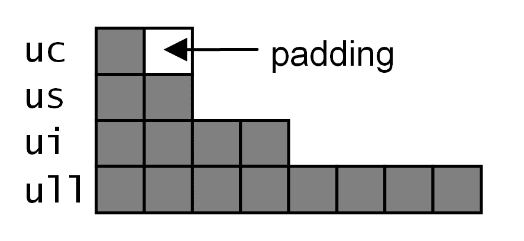
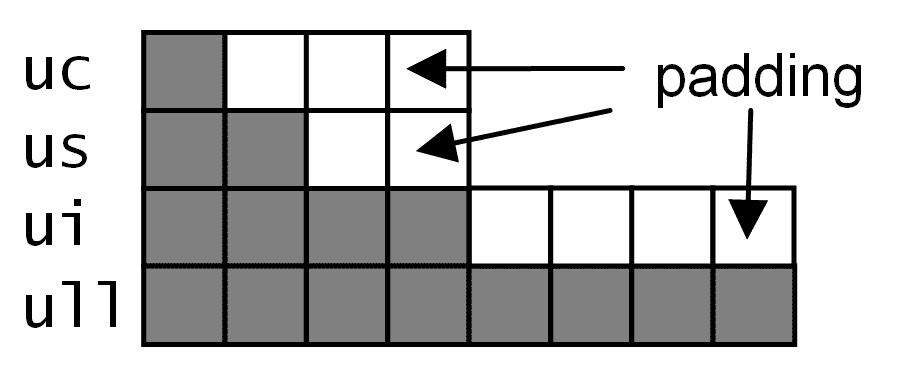
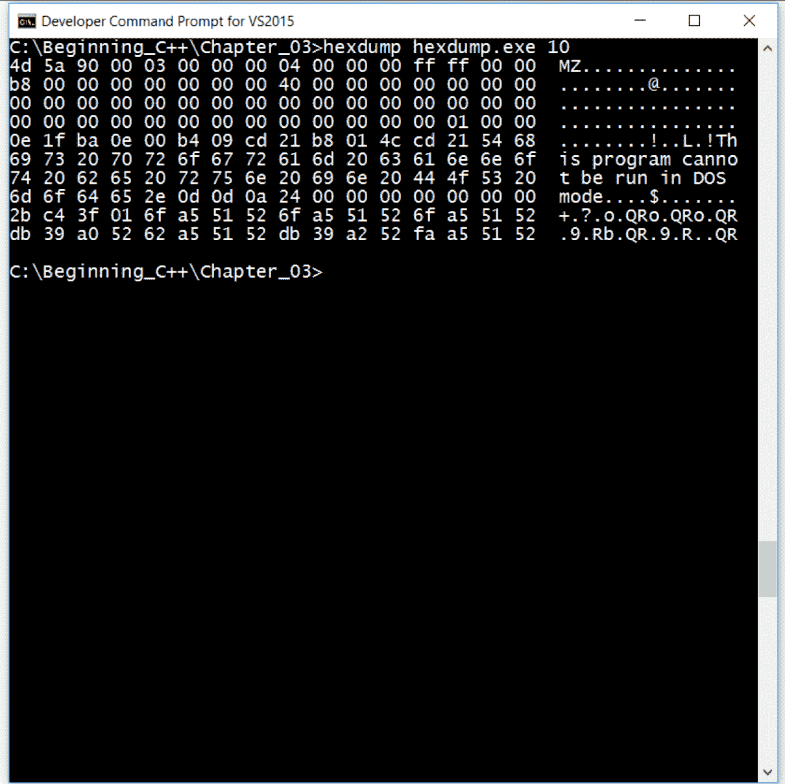

# 第三章：探索 C++类型

在过去的两章中，您已经学会了如何组合 C++程序，了解了您使用的文件以及控制执行流程的方法。本章是关于您将在程序中使用的数据：数据类型和将保存该数据的变量。

变量可以处理特定格式和特定行为的数据，这由变量的类型确定。变量的类型确定您可以对数据执行的操作以及用户输入或查看数据的格式。

基本上，您可以查看三种一般类型：内置类型、自定义类型和指针。指针通常将在下一章中介绍，自定义类型或类以及指向它们的指针将在第六章《类》中介绍。本章将介绍作为 C++语言一部分提供的类型。

# 探索内置类型

C++提供整数、浮点和布尔类型。`char`类型是整数，但它可以用于保存单个字符，因此其数据可以被视为数字或字符。C++标准库提供了`string`类，允许您使用和操作字符串。字符串将在第九章《使用字符串》中深入介绍。

顾名思义，整数类型包含没有小数部分的整数值。如果使用整数进行计算，您应该期望任何小数部分都将被丢弃，除非您采取措施保留它们（例如，通过取余运算符`%`）。浮点类型保存可能具有小数部分的数字；因为浮点类型可以以尾数指数格式保存数字，所以它们可以保存异常大或异常小的数字。

变量是类型的实例；它是分配的内存，用于保存类型可以保存的数据。整数和浮点变量声明可以修改以告诉编译器分配多少内存，从而限制变量可以保存的数据和对变量执行的计算的精度。此外，您还可以指示变量是否将保存重要的符号数字。如果数字用于保存位图（其中位不组成数字，而具有自己的独立含义），则通常没有意义使用有符号类型。

在某些情况下，您将使用 C++从文件或网络流中解压数据，以便对其进行操作。在这种情况下，您需要知道数据是浮点还是整数，有符号还是无符号，使用了多少字节以及这些字节的顺序。字节的顺序（多字节数字中的第一个字节是数字的低位还是高位）由您正在编译的处理器确定，在大多数情况下，您不需要担心它。

同样，有时您可能需要了解变量的大小以及它在内存中的对齐方式；特别是当您使用 C++中称为`structs`的数据记录时。C++提供了`sizeof`运算符来给出用于保存变量的字节数，以及`alignof`运算符来确定内存中类型的对齐方式。对于基本类型，`sizeof`和`alignof`运算符返回相同的值；只有在自定义类型上调用`alignof`运算符时，它才会返回类型中最大数据成员的对齐方式。

# 整数

顾名思义，整数保存整数数据，即没有小数部分的数字。因此，在需要重视小数部分的情况下，使用整数进行任何算术运算几乎没有意义；在这种情况下，应该使用浮点数。上一章中展示了一个例子：

```cpp
    int height = 480;  
    int width = 640; 
    int aspect_ratio = width / height;
```

这给出了一个明显不正确且毫无意义的宽高比。即使将结果分配给浮点数，您也会得到相同的结果：

```cpp
    float aspect_ratio = width / height;
```

原因是表达式`width / height`中的算术是在整数上执行的，这将使用整数的除法运算符丢弃结果的任何小数部分。要使用浮点除法运算符，您将需要将操作数之一强制转换为浮点数，以便使用浮点运算符：

```cpp
    float aspect_ratio = width / (float)height;
```

这将为`aspect_ratio`变量分配一个值为 1.3333（或 4：3）。这里使用的强制转换运算符是 C 强制转换运算符，它强制将一个类型的数据用作另一个类型的数据。（这是因为我们还没有介绍 C++强制转换运算符，并且 C 强制转换运算符的语法是清晰的。）这种转换没有类型安全性。C++提供了强制转换运算符，下文将讨论其中一些将以类型安全的方式进行转换，当您使用自定义类型的对象指针时，这将变得很重要。

C++提供了各种大小的整数类型，如下表所总结。这些是五种标准整数类型。标准规定`int`是处理器的自然大小，并且其值在（包括）`INT_MIN`和`INT_MAX`之间（在`<climits>`头文件中定义）。整数类型的大小至少与列表中前面的整数类型一样大，因此`int`至少与`short int`和`long long int`类型一样大，至少与`long int`类型一样大。短语“至少与”如果这些类型都是相同大小，那么就没有多大用处，因此`<climits>`头文件还为其他基本整数类型定义了范围。存储这些整数范围需要多少字节是依赖于实现的。这个表给出了基本类型的范围和 x86，32 位处理器上的大小：

| **类型** | **范围** | **字节大小** |
| --- | --- | --- |
| `signed char` | -128 到 127 | 1 |
| `short int` | -32768 到 32767 | 2 |
| `int` | -2147483648 到 2147483647 | 4 |
| `long int` | -2147483648 到 2147483647 | 4 |
| `long long int` | -9223372036854775808 到 9223372036854775807 | 8 |

在实践中，您将使用`short`而不是`short int`类型；对于`long int`，您将使用`long`；对于`long long int`，通常会使用`long long`。从这个表中可以看出，`int`和`long int`类型的大小相同，但它们仍然是两种不同的类型。

除了`char`类型，缺省情况下整数类型都是有符号的，也就是说，它们可以保存负数和正数（例如，`short`类型的变量的值可以在-32,768 和 32,767 之间）。您可以使用`signed`关键字显式指示类型为有符号。您还可以使用`unsigned`关键字来获得无符号的等价类型，这将给您一个额外的位，但也意味着按位运算符和移位运算符将按您的预期工作。您可能会发现`unsigned`在没有类型的情况下使用，这种情况下它指的是`unsigned int`。类似地，没有类型的`signed`指的是`signed int`。

`char`类型是`unsigned char`和`signed char`的独立类型。标准规定`char`中的每一位都用于保存字符信息，因此根据实现的不同，`char`是否可以被视为能够保存负数是依赖于实现的。如果您希望`char`保存有符号数，您应该明确使用`signed char`。

标准对于标准整数类型的大小并不精确，如果您正在编写代码（例如，访问文件中的数据或网络流），这可能是一个问题。`<cstdlib>`头文件定义了将保存特定数据范围的命名类型。这些类型具有包含在范围内使用的位数的名称（尽管实际类型可能需要更多位）。因此，有诸如`int16_t`和`uint16_t`之类的类型，其中第一个类型是将保存 16 位值范围的有符号整数，第二个类型是无符号整数。还声明了 8 位、32 位和 64 位值的类型。

以下显示了在 x86 机器上使用`sizeof`运算符确定的这些类型的实际大小：

```cpp
    // #include <cstdint> 
    using namespace std;               // Values for x86 
    cout << sizeof(int8_t)  << endl;   // 1 
    cout << sizeof(int16_t) << endl;   // 2 
    cout << sizeof(int32_t) << endl;   // 4 
    cout << sizeof(int64_t) << endl;   // 8
```

此外，`<cstdlib>`头文件还定义了诸如`int_least16_t`和`uint_least16_t`之类的类型，使用与之前相同的命名方案，并且有 8 位、16 位、32 位和 64 位的版本。名称中的`least`部分表示该类型将保存至少指定数量的位的值，但可能会更多。还有诸如`int_fast16_t`和`uint_fast16_t`之类的类型，具有 8 位、16 位、32 位和 64 位的版本，被视为可以保存该位数的最快类型。

# 指定整数文字

要为整数变量赋值，您提供一个没有小数部分的数字。编译器将确定数字表示的最接近精度的类型，并尝试分配整数，必要时执行转换。

要明确指定文字是`long`值，您可以使用`l`或`L`后缀。同样，对于`unsigned long`，您可以使用后缀`ul`或`UL`。对于`long long`值，您使用`ll`或`LL`后缀，并对于`unsigned long long`使用`ull`或`ULL`。`u`（或`U`）后缀用于`unsigned`（即`unsigned int`），对于`int`不需要后缀。以下是使用大写后缀的示例：

```cpp
    int i = 3; 
    signed s = 3; 
    unsigned int ui = 3U; 
    long l = 3L; 
    unsigned long ul = 3UL; 
    long long ll = 3LL; 
    unsigned long long ull = 3ULL;
```

使用 10 进制数字系统来指定位图的数字是令人困惑和繁琐的。位图中的位是 2 的幂，因此更合理的是使用 2 的幂的数字系统。C++允许您以八进制（基数 8）或十六进制（基数 16）提供数字。要在八进制中提供文字，您需要使用零字符（`0`）作为前缀。要在十六进制中提供文字，您需要使用`0x`字符序列作为前缀。八进制数字使用数字 0 到 7，但十六进制数字需要 16 个数字，即 0 到 9 和 a 到 f（或 A 到 F），其中 A 在十进制中是 10，F 在十进制中是 15：

```cpp
    unsigned long long every_other = 0xAAAAAAAAAAAAAAAA; 
    unsigned long long each_other  = 0x5555555555555555; 
    cout << hex << showbase << uppercase; 
    cout << every_other << endl; 
    cout << each_other  << endl;
```

在此代码中，两个 64 位（在 Visual C++中）整数被分配了位图值，其中每隔一位设置为 1。第一个变量从底位设置，第二个变量从底位取消设置，并设置次低位。在插入数字之前，流被修改了三个操纵器。第一个`hex`表示整数应以十六进制形式打印在控制台上，`showbase`表示将打印前导的`0x`。默认情况下，字母数字（A 到 F）将以小写形式给出，要指定必须使用大写形式，您可以使用`uppercase`。一旦流被修改，设置将保持直到被更改。要随后更改流以使用小写字母十六进制数字，您可以在流中插入`nouppercase`，要打印没有基数的数字，插入`noshowbase`操纵器。要使用八进制数字，您可以插入`oct`操纵器，要使用十进制，插入`dec`操纵器。

当您指定这样的大数字时，很难看出您是否已经指定了正确数量的数字。您可以使用单引号（`'`）将数字分组在一起：

```cpp
    unsigned long long every_other = 0xAAAA'AAAA'AAAA'AAAA; 
    int billion = 1'000'000'000;
```

编译器忽略引号；它只是用作视觉辅助。在第一个示例中，引号将数字分组为两个字节组；在第二种情况下，引号将小数分组为千位和百万位。

# 使用位集来显示位模式

没有操纵器告诉`cout`对象将整数打印为位图，但是可以使用`bitset`对象模拟该行为：

```cpp
    // #include <bitset> 
    unsigned long long every_other = 0xAAAAAAAAAAAAAAAA; 
    unsigned long long each_other  = 0x5555555555555555; 
    bitset<64> bs_every(every_other); 
    bitset<64> bs_each(each_other); 
    cout << bs_every << endl; 
    cout << bs_each << endl;
```

结果是：

```cpp
    1010101010101010101010101010101010101010101010101010101010101010    
    0101010101010101010101010101010101010101010101010101010101010101
```

在这里，`bitset`类是**参数化**的，这意味着您通过尖括号（`<>`）提供一个参数，在这种情况下使用 64，表示`bitset`对象将容纳 64 位。在这两种情况下，`bitset`对象的初始化使用看起来像函数调用的语法（实际上，它确实调用了一个称为**构造函数**的函数），这是初始化对象的首选方式。将`bitset`对象插入流中，打印出从最高位开始的每个位。（原因是定义了一个`operator <<`函数，它接受一个`bitset`对象，这是大多数标准库类的情况）。

`bitset`类对于访问和设置单个位而不使用位运算符是有用的：

```cpp
    bs_every.set(0); 
    every_other = bs_every.to_ullong(); 
    cout << bs_every << endl; 
    cout << every_other << endl;
```

`set`函数将在指定位置设置位为 1。`to_ullong`函数将返回`bitset`表示的`long long`数字。

对`set`函数的调用和赋值具有与以下相同的结果：

```cpp
    every_other |= 0x0000000000000001;
```

# 确定整数字节顺序

整数中字节的顺序取决于实现；它取决于处理器如何处理整数。在大多数情况下，您不需要知道。但是，如果您以二进制模式从文件中读取字节，或者从网络流中读取字节，并且需要将两个或更多字节解释为整数的一部分，则需要知道它们的顺序，并且必要时将它们转换为处理器识别的顺序。

C 网络库（在 Windows 上称为**Winsock**库）包含一组函数，用于将`unsigned short`和`unsigned long`类型从网络顺序转换为主机顺序（即当前机器上处理器使用的顺序），反之亦然。网络顺序是大端序。**大端序**意味着第一个字节将是整数中的最高字节，而**小端序**意味着第一个字节是最小字节。当您将整数传输到另一台机器时，您首先将其从源机器的处理器使用的顺序（主机顺序）转换为网络顺序，接收机在使用数据之前将整数从网络顺序转换为接收机的主机顺序。

更改字节顺序的函数是`ntohs`和`ntohl`；用于将`unsigned short`和`unsigned long`从网络顺序转换为主机顺序的函数，以及`htons`和`htonl`，用于将主机顺序转换为网络顺序。在调试代码时，了解字节顺序将是重要的（例如，如第十章中所述，*诊断和调试*）。

编写代码以反转字节顺序很容易：

```cpp
    unsigned short reverse(unsigned short us)  
    { 
        return ((us & 0xff) << 8) | ((us & 0xff00) >> 8); 
    }
```

这使用位运算符将假定组成`unsigned short`的两个字节分开为较低字节，将其左移八位，并将右移八位的上字节，然后使用按位或运算符`|`将这两个数字重新组合为`unsigned short`。编写此函数的 4 字节和 8 字节整数版本很简单。

# 浮点类型

有三种基本的浮点类型：

+   `float`（单精度）

+   `double`（双精度）

+   `long double`（扩展精度）

所有这些都是有符号的。内存中数字的实际格式和使用的字节数是特定于 C++实现的，但`<cfloat>`头文件给出了范围。以下表格给出了 x86、32 位处理器上使用的正数范围和字节数：

| **类型** | **范围** | **字节大小** |
| --- | --- | --- |
| 浮点 | 1.175494351e-38 到 3.402823466e+38 | 4 |
| 双精度 | 2.2250738585072014e-308 到 1.7976931348623158e+308 | 8 |
| 长双精度 | 2.2250738585072014e-308 到 1.7976931348623158e+308 | 8 |

正如您所看到的，在 Visual C++中，`double`和`long double`具有相同的范围，但它们仍然是两种不同的类型。

# 指定浮点文字

用于初始化`double`的文字是通过使用科学格式或简单地提供小数点来指定的浮点数：

```cpp
    double one = 1.0; 
    double two = 2.; 
    double one_million = 1e6;
```

第一个例子表明变量`one`被赋予了浮点值 1.0。结尾的零并不重要，如第二个变量`two`所示；然而，结尾的零确实使代码更易读，因为很容易忽略句号。第三个例子使用了科学计数法。第一部分是尾数，可以是有符号的，`e`后面的部分是指数。指数是数字的 10 的幂大小（可以是负数）。变量被赋予尾数乘以 10 并提升到指数的值。虽然不建议这样做，但您可以写以下内容：

```cpp
    double one = 0.0001e4; 
    double one_billion = 1000e6;
```

编译器将适当地解释这些数字。第一个例子是反常的，但第二个有些意义；它在您的代码中显示了十亿是一千万的意思。

这些示例将双精度浮点值分配给`double`变量。要为单精度变量指定值，以便可以分配`float`变量，使用`f`（或`F`）后缀。类似地，对于`long double`文字，使用`l`（或`L`）后缀：

```cpp
    float one = 1.f; 
    float two = 2f; // error 
    long double one_million = 1e6L;
```

如果您使用这些后缀，仍然必须以正确的格式提供数字。`2f`的文字是不正确的；您必须提供一个小数点，`2.f`。当您指定具有大量数字的浮点数时，可以使用单引号（`'`）来分组数字。如前所述，这只是对程序员的一种视觉辅助：

```cpp
    double one_billion = 1'000'000'000.;
```

# 字符和字符串

`string`类和 C 字符串函数将在第九章中介绍，*使用字符串*；本节介绍了代码中字符变量的基本用法。

# 字符类型

`char`类型是一个整数，所以也存在`signed char`和`unsigned char`。这是三种不同的类型；`signed char`和`unsigned char`类型应该被视为数值类型。`char`类型用于在实现的字符集中保存单个字符。在 Visual C++中，这是一个可以容纳 ISO-8859 或 UTF-8 字符集中的字符的 8 位整数。这些字符集能够表示英语和大多数欧洲语言中使用的字符。其他语言的字符占用多个字节，C++提供了`char16_t`类型来保存 16 位字符和`char32_t`来保存 32 位字符。

还有一种称为`wchar_t`（宽字符）的类型，它将能够容纳来自最大扩展字符集的字符。通常，当您看到带有`w`前缀的 C 运行时库或 C++标准库函数时，它将使用宽字符字符串而不是`char`字符串。因此，`cout`对象将允许您插入`char`字符串，而`wcout`对象将允许您插入宽字符字符串。

C++标准规定`char`中的每个位都用于保存字符信息，因此根据实现，`char`是否可以被视为能够保存负数是依赖于实现的。以下是说明：

```cpp
    char c = '~'; 
    cout << c << " " << (signed short)c << endl; 
    c += 2; 
    cout << c << " " << (signed short)c << endl;
```

`signed char`的范围是-128 到 127，但此代码使用了单独的类型`char`并尝试以相同的方式使用它。变量`c`首先被赋值为 ASCII 字符`~`（126）。当您将字符插入输出流时，它将尝试打印一个字符而不是一个数字，因此下一行将此字符打印到控制台，为了获得数值，代码将变量转换为`signed short`整数。（再次，为了清晰起见，使用了 C 转换。）接下来，变量增加了两个，也就是说，字符在字符集中向后移动了两个字符，这意味着扩展 ASCII 字符集中的第一个字符；结果是这样的：

```cpp
    ~ 126
    C -128
```

扩展字符集中的第一个字符是 C-锐音。

值为 126 增加两个的结果是-128，这相当反直觉，并且这是由于带符号类型的溢出计算导致的。即使这是有意的，最好还是避免这样做。

在 Visual C++中，C-锐音字符被视为-128，因此您可以编写以下内容以达到相同的效果：

```cpp
    char c = -128;
```

这是特定于实现的，因此对于可移植代码，您不应该依赖它。

# 使用字符宏

`<cctype>`头文件包含了各种宏，您可以使用这些宏来检查`char`包含的字符类型。这些是在`<ctype.h>`中声明的 C 运行时宏。以下表格中解释了一些更有用的测试字符值的宏。请记住，由于这些是 C 例程，它们不会返回`bool`值；而是返回一个具有非零值的`int`表示`true`，零表示`false`。

| **宏** | **测试字符是否为：** |
| --- | --- |
| `isalnum` | 字母数字字符，A 到 Z，a 到 z，0 到 9 |
| `isalpha` | 一个字母字符，A 到 Z，a 到 z |
| `isascii` | 一个 ASCII 字符，0x00 到 0x7f |
| `isblank` | 一个空格或水平制表符 |
| `iscntrl` | 一个控制字符，0x00 到 0x1f 或 0x7f |
| `isdigit` | 十进制数字 0 到 9 |
| `isgraph` | 可打印字符，不包括空格，0x21 到 0x7e |
| `islower` | 一个小写字符，a 到 z |
| `isprint` | 可打印字符，0x20 到 0x7e |
| `ispunct` | 一个标点字符，`! " # $ % & ' ( ) * + , - . / : ; < = > ? @ [ ] ^ _ ` { &#124; } ~ \` |
| `isspace` | 一个空格 |
| `isupper` | 一个大写字符，A 到 Z |
| `isxdigit` | 一个十六进制数字，0 到 9，a 到 f，A 到 F |

例如，以下代码循环读取输入流中的单个字符（在每个字符后，您需要按*Enter*键）。当提供非数字值时，循环结束：

```cpp
    char c; 
    do 
    { 
       cin >> c 
    } while(isdigit(c));
```

还有用于更改字符的宏。同样，这些将返回一个`int`值，您应该将其转换为`char`。

| **宏** | **返回** |
| --- | --- |
| `toupper` | 字符的大写版本 |
| `tolower` | 字符的小写版本 |

在以下代码中，从控制台键入的字符被回显，直到用户键入`q`或`Q`为止。如果键入的字符是小写字符，则回显的字符会转换为大写：

```cpp
    char c; 
    do 
    { 
        cin >> c; 
        if (islower(c)) c = toupper(c); 
        cout << c << endl; 
    } while (c != 'Q');
```

# 指定字符文字

您可以使用文字字符初始化`char`变量。这将是受支持的字符集中的一个字符。ASCII 字符集包括一些不可打印的字符，因此您可以使用这些，C++提供了两个使用反斜杠字符（`\`）的字符序列。

| **名称** | **ASCII 名称** | **C++序列** |
| --- | --- | --- |
| 换行符 | LF | `\n` |
| 水平制表符 | HT | `\t` |
| 垂直制表符 | VT | `\v` |
| 退格 | BS | `\b` |
| 回车 | CR | `\r` |
| 换页符 | FF | `\f` |
| 警报 | BEL | `\a` |
| 反斜杠 | \ | `\\` |
| 问号 | ? | `\?` |
| 单引号 | ' | `\'` |
| 双引号 | " | `\"` |

此外，您还可以将该字符的数值作为八进制或十六进制数给出。要提供八进制数，您需要使用三个字符（必要时前缀为一个或两个`0`字符）前缀为反斜杠。对于十六进制数，您需要使用`\x`前缀。字符`M`在十进制中是字符编号 77，在八进制中是 115，在十六进制中是 4d，因此您可以用三种方式初始化一个字符变量为`M`字符。

```cpp
    char m1 = 'M'; 
    char m2 = '\115'; 
    char m3 = '\x4d';
```

为了完整起见，值得指出您可以将 char 初始化为整数，因此以下内容也将初始化每个变量为`M`字符：

```cpp
    char m4 = 0115; // octal 
    char m5 = 0x4d; // hexadecimal
```

所有这些方法都是有效的。

# 指定字符串文字

字符串由一个或多个字符组成，您也可以在字符串文字中使用转义字符。

```cpp
    cout << "This is \x43\x2b\05\3n";
```

这个相当难读的字符串将被打印在控制台上，后面跟着一个换行符，显示为`This is C++`。大写字母 C 的十六进制是 43，加号的十六进制是 2b，八进制是 53。`\n`字符是一个换行符。转义字符对于打印不在 C++编译器使用的字符集中的字符以及一些不可打印的字符（例如，`\t`插入水平制表符）非常有用。`cout`对象在将字符写入输出流之前会对其进行缓冲。如果您使用`\n`作为换行符，它将被视为缓冲区中的任何其他字符。`endl`操作符将`\n`插入缓冲区，然后刷新缓冲区，使字符立即写入控制台。

*空*或`NULL`字符是`\0`。这是一个重要的字符，因为它是不可打印的，并且除了标记字符串中字符序列的结束之外没有其他用途。空字符串是`""`，但由于字符串由`NULL`字符界定，因此使用空字符串初始化的字符串变量占用的内存将有一个字符，即`\0`。

换行符允许您在字符串中插入换行符。如果您只对段落进行格式化，并且要打印短段落，这将非常有用。

```cpp
    cout << "Mary had a little lamb,n its fleece was white as snow."  
         << endl;
```

这在控制台上打印了两行：

```cpp
 Mary had a little lamb,
 its fleece was white as snow.
```

但是，您可能希望使用长序列的字符初始化字符串，而您使用的编辑器的限制可能意味着您希望将字符串分割成几行。您可以通过将字符串的每个片段放在双引号内来实现这一点。

```cpp
    cout << "And everywhere that Mary went, " 
            "the lamb was sure to go."  
         << endl;
```

您将在控制台上看到以下内容：

```cpp
 And everywhere that Mary went, the lamb was sure to go.
```

除了在最后使用`endl`明确请求的换行符外，不会打印其他换行符。这种语法允许您在代码中使长字符串更易读；当然，您也可以在这样的字符串中使用换行字符`\n`。

# Unicode 文字

`wchar_t`变量也可以用字符初始化，编译器将通过使用字符的字节并将剩余（更高的）字节分配为零来将字符提升为宽字符。但是，将这样的变量分配为宽字符更有意义，您可以使用`L`前缀来实现这一点。

```cpp
    wchar_t dollar = L'$'; 
    wchar_t euro = L'\u20a0'; 
    wcout << dollar;
```

请注意，这段代码使用的是`wcout`，而不是`cout`对象，使用引号内的`\u`前缀的语法表示后面的字符是 Unicode 字符。

请注意，要显示 Unicode 字符，您需要使用一个可以显示 Unicode 字符的控制台，默认情况下，Windows 控制台设置为**Code Page 850**，不会显示 Unicode 字符。您可以通过在标准输出流`stdout`上调用`_setmode`（在`<io.h>`中定义）来更改输出控制台的模式，指定 UTF-16 文件模式（使用`<fcntl.h>`中定义的`_O_U16TEXT`）：

```cpp
    _setmode(_fileno(stdout), _O_U16TEXT);
```

您可以在[`unicode.org/charts/`](http://unicode.org/charts/)找到 Unicode 支持的所有字符的列表。

UTF-16 字符也可以分配给`char16_t`变量，UTF-32 字符也可以分配给`char32_t`变量。

# 原始字符串

当您使用原始字符串文字时，实质上是关闭了转义字符的含义。无论您输入什么内容到原始字符串中，甚至包括换行符在内，原始字符串都会将其作为内容。原始字符串用`R"(`和`)"`来界定。也就是说，字符串位于内部括号之间。

```cpp
    cout << R"(newline is \n in C++ and "quoted text" use quotes)";
```

请注意，`()`是语法的一部分，不是字符串的一部分。前面的代码将以下内容打印到控制台：

```cpp
 newline is \n in C++ and "quoted text" use quotes
```

通常在字符串中，`\n`是一个转义字符，将被翻译为换行符，但在原始字符串中，它不会被翻译，而是打印为两个字符。

在普通的 C++字符串中，您将不得不转义一些字符；例如，双引号必须转义为`\"`，反斜杠必须转义为`\\`。不使用原始字符串，以下将给出相同的结果：

```cpp
    cout << "newline is \\n in C++ and \"quoted text\" use quotes";
```

您还可以在原始字符串中使用换行符：

```cpp
    cout << R"(Mary had a little lamb,  
                             its fleece was white as snow)" 
    cout << endl;
```

在这段代码中，逗号后面的换行符将被打印到控制台。不幸的是，所有空白字符都将被打印到控制台上，因此假设在前面的代码中缩进为三个空格，`cout`缩进一次，您将在控制台上看到以下内容：

```cpp
 Mary had a little lamb,
 its fleece was white as snow
```

在`its`前面有 14 个空格，因为在源代码中`its`前面有 14 个空格。因此，您应该谨慎使用原始字符串。

也许，原始字符串的最佳用途是在 Windows 上初始化文件路径的变量。在 Windows 中，文件夹分隔符是反斜杠，这意味着对于表示文件路径的文字字符串，您将不得不转义每个这些分隔符；因此，字符串将有很多双反斜杠，有可能漏掉一个。使用原始字符串，这种转义是不必要的。以下的两个字符串变量代表相同的字符串：

```cpp
    string path1 = "C:\\Beginning_C++\\Chapter_03\\readme.txt"; 
    string path2 = R"(C:\Beginning_C++\Chapter_03\readme.txt)";
```

这两个字符串具有相同的内容，但第二个更易读，因为 C++文字字符串没有转义反斜杠。

转义反斜杠的要求仅适用于在代码中声明的文字字符串；这是对编译器如何解释字符的指示。如果您从函数（或通过`argv[0]`）获取文件路径，分隔符将是反斜杠。

# 字符串字节顺序

扩展字符集使用每个字符超过一个字节。如果这些字符存储在文件中，字节的顺序就变得重要起来。在这种情况下，字符的编写者必须使用与潜在读者将要使用的相同顺序。

一种方法是使用**字节顺序标记**（**BOM**）。这是已知字节数和已知模式的一组字节，通常作为流的第一项放置，以便流的读取者可以使用它来确定流中剩余字符的字节顺序。Unicode 定义了 16 位字符`\uFEFF`和非字符`\uFFFE`作为字节顺序标记。对于`\uFEFF`，除了第 8 位（如果最低位标记为第 0 位）之外，所有位都被设置。这个 BOM 可以作为前缀添加到在机器之间传递的数据中。目标机器可以将 BOM 读入一个 16 位变量并测试位。如果第 8 位为零，这意味着两台机器具有相同的字节顺序，因此字符可以按照流中的顺序读取为两个字节值。如果第 0 位为零，则意味着目标机器以与源机器相反的顺序读取 16 位变量，因此必须采取措施确保以正确的顺序读取字节。

Unicode 字节顺序标记（BOM）序列化如下（十六进制）：

| **字符集** | **字节顺序标记** |
| --- | --- |
| UTF-8 | EF BB BF |
| UTF-16 大尾 | FE FF |
| UTF-16 小尾 | FF FE |
| UTF-32 大尾 | 00 00 FE FF |
| UTF-32 小尾 | FF FE 00 00 |

请记住，当您从文件中读取数据时。字符序列 FE FF 在非 Unicode 文件中非常罕见，因此如果您将它们读取为文件中的前两个字节，这意味着该文件是 Unicode。由于`\uFEFF`和`\uFFFE`不是可打印的 Unicode 字符，这意味着以这两者之一开头的文件具有字节顺序标记，然后您可以使用 BOM 来确定如何解释文件中剩余的字节。

# 布尔

`bool`类型保存布尔值，即两个值中的一个：`true`或`false`。C++允许您将 0（零）视为`false`，将任何非零值视为`true`，但这可能会导致错误，因此最好养成明确检查值的习惯：

```cpp
    int use_pointer(int *p) 
    { 
        if (p)            { /* not a null pointer */ } 
        if (p != nullptr) { /* not a null pointer */ }   
        return 0; 
    }
```

这两种方式中的第二种更可取，因为您正在比较的内容更清晰。

请注意，即使指针不是`nullptr`，它仍然可能不是有效的指针，但通常的做法是将指针分配给`nullptr`以传达其他含义，也许是说指针操作不合适。

可以将布尔值插入输出流。但是，默认行为是将布尔值视为整数。如果要使`cout`输出带有字符串名称的`bool`值，则在流中插入操作符`boolalpha`；这将使流打印`true`或`false`到控制台。可以使用`noboolalpha`操作符来实现默认行为。

# void

在某些情况下，您需要指示函数没有参数或不会返回值；在这两种情况下，您可以使用关键字`void`：

```cpp
    void print_message(void) 
    { 
        cout << "no inputs, no return value" << endl; 
    }
```

在参数列表中使用`void`是可选的；接受空括号对并且更可取。这是唯一的一种方式来指示函数返回除返回`void`之外的值。

请注意，`void`实际上不是一种类型，因为您无法创建`void`变量；它是没有类型。正如您将在下一章中了解到的那样，您可以创建`void`类型的指针，但是您将无法使用这些指针指向的内存而不进行类型转换：要使用内存，您必须决定内存保存的数据的类型。

# 初始化器

初始化器在上一章中已经提到过，但我们将在这里更深入地讨论。对于内置类型，您必须在使用变量之前初始化变量。对于自定义类型，类型可能定义默认值，但在这样做时会出现一些问题，这将在第六章中进行介绍，*类*。

在 C++的所有版本中，有三种初始化内置类型的方式：赋值、函数语法或调用构造函数。在 C++11 中引入了另一种初始化变量的方式：通过列表初始化进行构造。这四种方式如下所示：

```cpp
    int i = 1; 
    int j = int(2); 
    int k(3); 
    int m{4};
```

这三种方式中的第一种是最清晰的；它使用易于理解的语法显示变量正在初始化为一个值。第二个示例通过调用类型来初始化变量，就好像它是一个函数一样。第三个示例调用`int`类型的构造函数。这是初始化自定义类型的典型方式，因此最好将此语法保留给自定义类型。

第四种语法是 C++11 中的新语法，并使用花括号（`{}`）之间的初始化列表初始化变量。稍微令人困惑的是，您还可以使用与分配给单个项目列表相同的语法来初始化内置类型：

```cpp
    int n = { 5 };
```

这真的让事情变得混乱，类型`n`是一个整数，而不是数组。回想一下，在上一章中，我们创建了一个包含 The Beatles 的出生日期的数组：

```cpp
    int birth_years[] = { 1940, 1942, 1943, 1940 };
```

这将创建一个包含四个整数的数组；每个项目的类型为`int`，但数组变量的类型为`int*`。该变量指向保存四个整数的内存。同样，您还可以将变量初始化为一个项目的数组：

```cpp
    int john[] = { 1940 };
```

这正是 C++11 允许初始化单个整数的初始化代码。此外，相同的语法用于初始化记录类型（`structs`）的实例，增加了关于语法意义的另一层潜在混淆。

最好避免使用花括号语法进行变量初始化，而将其专门用于初始化列表。然而，这种语法在类型转换方面有一些优势，稍后会解释。

花括号语法可以用于为 C++标准库中的任何集合类提供初始值，以及用于 C++数组。即使用于初始化集合对象，也存在混淆的可能。例如，考虑`vector`集合类。它可以保存通过一对尖括号(`<>`)提供的类型的集合。这个类的对象的容量可以随着向对象添加更多项目而增长，但你可以通过指定初始容量来优化其使用：

```cpp
    vector<int> a1 (42); 
    cout << " size " << a1.size() << endl; 
    for (int i : a1) cout << i << endl;
```

这段代码的第一行表示：创建一个可以保存整数的`vector`对象，并开始为 42 个整数保留空间，每个整数初始化为零值。第二行将向控制台打印出向量的大小（42），第三行将向控制台打印出数组中的所有项目，它将打印出 42 个零值。

现在考虑以下情况：

```cpp
    vector<int> a2 {42}; 
    cout << " size " << a2.size() << endl; 
    for (int i : a2) cout << i << endl;
```

这里只有一个变化：括号已经改为花括号，但这意味着初始化已经完全改变。第一行现在表示：创建一个可以保存整数的`vector`，并用单个整数 42 进行初始化。`a2`的大小为 1，最后一行将只打印一个值，42。

C++的强大之处在于应该很容易编写正确的代码，并且说服编译器帮助你避免错误。使用花括号进行单个项目初始化会增加难以发现错误的可能性。

# 默认值

内置类型的变量在首次使用前应该被初始化，但有一些情况下编译器会提供一个默认值。

如果你在文件范围或项目中全局声明一个变量，并且没有给它一个初始值，编译器会给它一个默认值。例如：

```cpp
    int outside; 

    int main() 
    { 
        outside++; 
        cout << outside << endl; 
    }
```

这段代码将编译并运行，打印出一个值为 1；编译器已经将`outside`初始化为 0，然后递增为 1。以下代码将无法编译：

```cpp
    int main() 
    { 
        int inside; 
        inside++; 
        cout << inside << endl; 
    }
```

编译器会抱怨增量运算符被用在一个未初始化的变量上。

在上一章中，我们看到编译器提供了默认值的另一个例子：`static`。

```cpp
    int counter() 
    { 
        static int count; 
        return ++count; 
    }
```

这是一个简单的函数，用于维护一个计数。变量`count`被标记为`static`存储类修饰符，意味着该变量与应用程序具有相同的生命周期（在代码启动时分配，在程序结束时释放）；然而，它具有内部链接，意味着该变量只能在声明它的范围内使用，即`counter`函数。编译器将使用默认值 0 初始化`count`变量，因此第一次调用`counter`函数时将返回值 1。

C++11 的新初始化列表语法提供了一种声明变量并指定你希望它由编译器初始化为该类型的默认值的方法：

```cpp
    int a {};
```

当阅读这段代码时，你必须知道`int`的默认值是什么（是零）。再次强调，将变量简单地初始化为一个值要容易得多，也更明确：

```cpp
    int a = 0;
```

默认值的规则很简单：零值。整数和浮点数的默认值为 0，字符的默认值为`\0`，`bool`的默认值为`false`，指针的默认值为常量`nullptr`。

# 没有类型的声明

C++11 引入了一种机制，声明变量的类型应该根据初始化的数据来确定，即`auto`。

这里有一个小混淆，因为在 C++11 之前，`auto`关键字用于声明**自动**变量，即在函数中自动分配在堆栈上的变量。除了在文件范围内声明的变量或`static`变量之外，到目前为止本书中的所有其他变量都是自动变量，自动变量是最广泛使用的**存储类**（稍后解释）。由于它是可选的并且适用于大多数变量，`auto`关键字在 C++中很少被使用，因此 C++11 利用了这一点，删除了旧的含义，并赋予了`auto`新的含义。

如果你正在使用 C++11 编译器编译旧的 C++代码，并且那个旧代码使用了`auto`，你会得到错误，因为新的编译器会假定`auto`将用于没有指定类型的变量。如果发生这种情况，只需搜索并删除每个`auto`实例；在 C++11 之前的 C++中，它是多余的，开发人员几乎没有理由使用它。

`auto`关键字意味着编译器应该创建一个与分配给它的数据类型相同的变量。变量只能有一个类型，编译器决定的类型是它需要的数据分配的类型，你不能在其他地方使用变量来保存不同类型的数据。因为编译器需要从初始化程序确定类型，这意味着所有`auto`变量必须被初始化：

```cpp
    auto i  = 42;    // int 
    auto l  = 42l;   // long 
    auto ll = 42ll;  // long long 
    auto f  = 1.0f;  // float 
    auto d  = 1.0;   // double 
    auto c  = 'q';   // char 
    auto b  = true;  // bool
```

请注意，没有语法来指定整数值是单字节还是双字节，因此你不能以这种方式创建`unsigned char`变量或`short`变量。

这是`auto`关键字的一个微不足道的用法，你不应该这样使用。`auto`的威力在于你使用可能导致一些看起来相当复杂的类型的容器时：

```cpp
    // #include <string> 
    // #include <vector> 
    // #include <tuple> 

    vector<tuple<string, int> > beatles; 
    beatles.push_back(make_tuple("John", 1940)); 
    beatles.push_back(make_tuple("Paul", 1942)); 
    beatles.push_back(make_tuple("George", 1943)); 
    beatles.push_back(make_tuple("Ringo", 1940)); 

    for (tuple<string, int> musician : beatles) 
    { 
        cout << get<0>(musician) << " " << get<1>(musician) << endl; 
    }
```

这段代码使用了我们之前使用过的`vector`容器，但是使用`tuple`存储了两个值。`tuple`类很简单；在尖括号之间的声明中声明了`tuple`对象中项目类型的列表。因此，`tuple<string, int>`声明表示对象将按顺序保存一个字符串和一个整数。`make_tuple`函数由 C++标准库提供，将创建一个包含两个值的`tuple`对象。`push_back`函数将项目放入向量容器中。在四次调用`push_back`函数之后，`beatles`变量将包含四个项目，每个项目都是一个带有姓名和出生年份的`tuple`。

范围`for`循环遍历容器，并在每次循环中将`musician`变量分配给容器中的下一个项目。`tuple`中的值在`for`循环中的语句中打印到控制台。使用`get`参数化函数（来自`<tuple>`）访问`tuple`中的项目，尖括号中的参数指示从作为参数传递的`tuple`对象中获取的项目的索引（从零开始索引）。在这个例子中，对`get<0>`的调用获取了名字，然后是一个空格，然后`get<1>`获取了`tuple`中的年份项目。这段代码的结果是：

```cpp
    John 1940 
    Paul 1942 
    George 1943 
    Ringo 1940
```

这段文字格式不佳，因为它没有考虑名称的长度。这可以通过第九章中解释的操作符来解决，*使用字符串*。

再看一下`for`循环：

```cpp
    for (tuple<string, int> musician : beatles) 
    { 
        cout << get<0>(musician) << " " << get<1>(musician) << endl; 
    }
```

音乐家的类型是`tuple<string, int>;`，这是一个相当简单的类型，随着你使用标准模板更多，你可能会得到一些复杂的类型（特别是当你使用**迭代器**时）。这就是`auto`变得有用的地方。下面的代码是相同的，但更容易阅读：

```cpp
    for (auto musician : beatles) 
    { 
        cout << get<0>(musician) << " " << get<1>(musician) << endl; 
    }
```

音乐家变量仍然是有类型的，它是一个`tuple<string, int>`，但`auto`意味着你不必明确编写这个。

# 存储类

在声明变量时，你可以指定它的存储类，这表示变量的生存期、链接（其他代码可以访问它的内容）和内存位置。

您已经看到了一个存储类`static`，当应用于函数中的变量时，意味着该变量只能在该函数内访问，但其生存期与程序相同。然而，`static`可以用于在文件范围内声明的变量，这种情况下表明该变量只能在当前文件中使用，这被称为**内部链接**。如果在文件范围内声明的变量上省略`static`关键字，则具有**外部链接**，这意味着变量的名称对其他文件中的代码可见。`static`关键字可以用于类的数据成员和类中定义的方法，这两者都有有趣的影响，将在第六章 *类*中进行描述。

`static`关键字表示该变量只能在当前文件中使用。`extern`关键字表示相反；变量（或函数）具有外部链接，并且可以在项目的其他文件中访问。在大多数情况下，您将在一个源文件中定义一个变量，然后在头文件中声明它为`extern`，以便在其他源文件中使用相同的变量。

最后一个存储类说明符是`thread_local`。这是 C++11 中的新功能，它只适用于多线程代码。本书不涉及线程，因此这里只会给出一个简要描述。

线程是执行和并发的单位。程序中可以有多个线程运行，可能有两个或更多个线程同时运行相同的代码。这意味着两个不同的执行线程可以访问和更改同一个变量。由于并发访问可能会产生不良影响，多线程代码通常涉及采取措施确保只有一个线程可以在任何时候访问数据。如果这样的代码没有小心编写，就有死锁的危险，其中线程的执行被暂停（在最坏的情况下，是无限期地）以独占访问变量，从而抵消了使用线程的好处。

`thread_local`存储类表示每个线程将有自己的变量副本。因此，如果两个线程访问同一个函数，并且该函数中的变量标记为`thread_local`，这意味着每个线程只看到它所做的更改。

您有时会在旧的 C++代码中看到存储类`register`的使用。这现在已经不推荐使用了。它被用作向编译器提示变量对程序性能有重要影响，并建议编译器尽可能使用 CPU 寄存器来保存变量。编译器可以忽略这个建议。事实上，在 C++11 中，编译器确实忽略了这个关键字；带有`register`变量的代码将编译而不会出现错误或警告，并且编译器将根据需要优化代码。

虽然它不是存储类说明符，但`volatile`关键字对编译器代码优化有影响。`volatile`关键字表示变量（可能通过**直接内存访问**（**DMA**）到某些硬件）可以被外部操作改变，因此对编译器来说很重要*不要*应用任何优化。

还有一个存储类修饰符叫做`mutable`。这只能用于类成员，因此将在第六章 *类*中进行介绍。

# 使用类型别名

有时类型的名称可能变得相当繁琐。如果您使用嵌套命名空间，类型的名称包括所有使用的命名空间。如果您定义参数化类型（本章迄今为止使用的示例是`vector`和`tuple`），参数会增加类型的名称。例如，我们之前看到了一个用于音乐家姓名和出生年份的容器：

```cpp
    // #include <string> 
    // #include <vector> 
    // #include <tuple> 

    vector<tuple<string, int> > beatles;
```

在这里，容器是`vector`，它包含`tuple`项，每个项将包含一个字符串和一个整数。为了使类型更易于使用，您可以定义一个预处理器符号：

```cpp
    #define name_year tuple<string, int>
```

现在您可以在代码中使用`name_year`而不是`tuple`，预处理器将在编译代码之前用该类型替换符号：

```cpp
    vector<name_year> beatles;
```

但是，由于`#define`是一个简单的搜索和替换，正如本书前面解释的那样，可能会出现问题。C++提供了`typedef`语句来为类型创建别名：

```cpp
    typedef tuple<string, int> name_year_t; 
    vector<name_year_t> beatles;
```

在这里，为`tuple<string, int>`创建了一个名为`name_year_t`的别名。

使用`typedef`时，别名通常位于行末，前面是它的别名。这与`#define`相反，其中您要定义的符号在`#define`之后，后面是其定义。还要注意，`typedef`以分号结束。对于函数指针，情况变得更加复杂，您将在第五章 *使用函数*中看到。

现在，无论何时您想使用`tuple`，都可以使用别名：

```cpp
    for (name_year_t musician : beatles) 
    { 
        cout << get<0>(musician) << " " << get<1>(musician) << endl; 
    }
```

您可以`typedef`别名：

```cpp
    typedef tuple<string, int> name_year_t; 
    typedef vector<name_year_t> musician_collection_t; 
    musician_collection_t beatles2;
```

`beatles2`变量的类型是`vector<tuple<string, int>>`。重要的是要注意，`typedef`创建一个别名；它不会创建新类型，因此您可以在原始类型和其别名之间切换。

`typedef`关键字是在 C++中创建别名的一种成熟方式。

C++11 引入了另一种创建类型别名的方法，即`using`语句：

```cpp
    using name_year = tuple<string, int>;
```

同样，这不会创建新类型，而是为相同类型创建新名称，从语义上讲，这与`typedef`相同。`using`语法可能比使用`typedef`更易读，它还允许您使用模板。

使用`using`方法创建别名比`typedef`更易读，因为赋值的使用遵循用于变量的约定，也就是说，左边的新名称用于`=`右边的类型。

# 在记录类型中聚合数据

通常，您将具有相关联且必须一起使用的数据：聚合类型。这样的记录类型允许您将数据封装到单个变量中。C++继承自 C`struct`和`union`，作为提供记录的方式。

# 结构

在大多数应用程序中，您将希望将多个数据项关联在一起。例如，您可能希望定义一个时间记录，其中每个时间都有一个整数：指定时间的小时、分钟和秒。您可以这样声明它们：

```cpp
    // start work 
    int start_sec = 0; 
    int start_min = 30; 
    int start_hour = 8; 

    // end work 
    int end_sec = 0 
    int end_min = 0; 
    int end_hour = 17;
```

这种方法变得相当繁琐且容易出错。没有封装，也就是说，`_min`变量可以独立于其他变量使用。当没有它所指的小时时，“小时过去的分钟”是否有意义？您可以定义一个结构，将这些项关联起来：

```cpp
    struct time_of_day 
    { 
        int sec; 
        int min; 
        int hour; 
    };
```

现在，您已经将三个值作为一个记录的一部分，这意味着您可以声明此类型的变量；尽管您可以访问单个项目，但很明显数据与其他成员相关联：

```cpp
    time_of_day start_work; 
    start_work.sec = 0; 
    start_work.min = 30; 
    start_work.hour = 8; 

    time_of_day end_work; 
    end_work.sec = 0; 
    end_work.min = 0; 
    end_work.hour = 17; 

    print_time(start_work); 
    print_time(end_work);
```

现在我们有两个变量：一个表示开始时间，另一个表示结束时间。`struct`的成员封装在`struct`内部，也就是说，您通过`struct`的实例访问成员。为此，您使用点运算符。在此代码中，`start_work.sec`表示您正在访问名为`start_work`的`time_of_day`结构的实例的`sec`成员。结构的成员默认为`public`，也就是说，`struct`外部的代码可以访问成员。

类和结构可以指示成员访问级别，第六章 *类*将展示如何做到这一点。例如，可以将`struct`的某些成员标记为`private`，这意味着只有类型的成员才能访问成员。

调用名为`print_time`的辅助函数以将数据打印到控制台：

```cpp
    void print_time(time_of_day time) 
    { 
        cout << setw(2) << setfill('0') << time.hour << ":"; 
        cout << setw(2) << setfill('0') << time.min << ":"; 
        cout << setw(2) << setfill('0') << time.sec << endl; 
    }
```

在这种情况下，使用`setw`和`setfill`操作器将下一个插入的项目的宽度设置为两个字符，并用零填充任何未填充的位置（更多细节将在第九章，“使用字符串”中给出；实际上，`setw`给出了下一个插入数据所占列的大小，`setfill`指定了所使用的填充字符）。

第五章，“使用函数”，将更详细地介绍将结构传递给函数的机制以及最有效的方法，但是为了本节的目的，我们将在这里使用最简单的语法。重要的是，调用者使用`struct`关联了三个数据项，并且所有数据项可以作为一个单元传递给函数。

# 初始化

有几种初始化结构实例的方法。前面的代码显示了一种方法：使用点运算符访问成员，并为其赋值。您还可以通过一个特别提供的名为构造函数的函数为`struct`的实例分配值。由于有关如何命名构造函数以及您可以在其中执行的特殊规则，这将留到第六章，“类”。

您还可以使用列表初始化程序语法使用大括号（`{}`）初始化结构。大括号中的项目应与`struct`的成员按照声明的成员顺序匹配。如果提供的值少于成员数量，则其余成员将初始化为零。实际上，如果在大括号之间不提供任何项目，则所有成员都将设置为零。如果提供的初始化程序多于成员数量，则会出错。因此，使用先前定义的`time_of_day`记录类型：

```cpp
    time_of_day lunch {0, 0, 13}; 
    time_of_day midnight {}; 
    time_of_day midnight_30 {0, 30};
```

在第一个示例中，`lunch`变量被初始化为下午 1 点。请注意，因为`hour`成员被声明为类型中的第三个成员，所以它是使用初始化列表中的第三个项目进行初始化的。在第二个示例中，所有成员都设置为零，当然，零小时是午夜。第三个示例提供了两个值，因此这些值用于初始化`sec`和`min`。

您可以有一个`struct`的成员本身是一个`struct`，并且可以使用嵌套的大括号进行初始化：

```cpp
    struct working_hours 
    { 
        time_of_day start_work; 
        time_of_day end_work; 
    }; 

    working_hours weekday{ {0, 30, 8}, {0, 0, 17} }; 
    cout << "weekday:" << endl; 
    print_time(weekday.start_work); 
    print_time(weekday.end_work);
```

# 结构字段

结构可以有最小为单个位的成员，称为**位字段**。在这种情况下，您声明一个整数成员，该成员将占用成员的位数。您可以声明未命名的成员。例如，您可能有一个结构，其中包含有关项目长度以及项目是否已更改（脏）的信息。此引用的项目的最大大小为 1,023，因此您需要一个宽度至少为 10 位的整数来保存这个信息。您可以使用`unsigned short`来保存长度和脏信息：

```cpp
    void print_item_data(unsigned short item) 
    { 
        unsigned short size = (item & 0x3ff); 
        char *dirty = (item > 0x7fff) ? "yes" : "no"; 

        cout << "length " << size << ", "; 
        cout << "is dirty: " << dirty << endl; 
    }
```

此代码将信息分开，然后将其打印出来。这样的位图对代码来说非常不友好。您可以使用`struct`来保存这些信息，使用`unsigned short`来保存 10 位长度信息，使用`bool`来保存脏信息。使用位字段，您可以定义结构如下：

```cpp
    struct item_length 
    { 
        unsigned short len : 10; 
        unsigned short : 5; 
        bool dirty : 1; 
    };
```

`len`成员标记为`unsigned short`，但只需要 10 位，因此使用冒号语法进行了说明。同样，一个布尔值可以仅用一个位来保存。结构指示两个值之间有五位未使用，因此没有名称。

字段只是一种便利。尽管看起来`item_length`结构应该只占用 16 位（`unsigned short`），但不能保证编译器会这样做。如果您从文件或网络流接收到`unsigned short`，则必须自己提取位：

```cpp
    unsigned short us = get_length(); 
    item_length slen; 
    slen.len = us & 0x3ff; 
    slen.dirty = us > 0x7fff;
```

# 使用结构名

在某些情况下，你可能需要在实际定义之前使用类型。只要你不使用成员，你可以在定义之前声明类型：

```cpp
    struct time_of_day; 
    void print_day(time_of_day time);
```

这可以在头文件中声明，在那里它说有一个在其他地方定义的函数，它接受一个`time_of_day`记录并将其打印出来。要能够声明`print_day`函数，你必须已经声明了`time_of_day`名称。`time_of_day`结构必须在代码的其他地方定义，然后才能定义函数，否则你将会得到一个*未定义类型*的错误。

然而，有一个例外：在类型完全声明之前，类型可以保存指向相同类型实例的指针。这是因为编译器知道指针的大小，所以它可以为成员分配足够的内存。只有在整个类型定义之后，你才能创建类型的实例。这个经典的例子是链表，但由于这需要使用指针和动态分配，这将留到下一章节。

# 确定对齐

结构的一个用途是，如果你知道数据在内存中的存储方式，你可以将结构作为内存块处理。如果你有一个映射到内存中的硬件设备，不同的内存位置指向控制或返回设备值的值。访问设备的一种方式是定义一个与设备的直接内存访问到 C++类型的内存布局匹配的结构。此外，结构对于文件或需要通过网络传输的数据包也是有用的：你操作结构，然后将结构占用的内存复制到文件或网络流中。

结构的成员在内存中按照它们在类型中声明的顺序排列。项将占用*至少*每个类型所需的内存。成员可能占用的内存比类型所需的内存更多，这是一种叫做**对齐**的机制。

编译器将以最有效的方式将变量放置在内存中，无论是在内存使用还是访问速度方面。各种类型将对齐到对齐边界。例如，32 位整数将对齐到四字节边界，如果下一个可用的内存位置不在这个边界上，编译器将跳过几个字节，并将整数放在下一个对齐边界上。你可以使用`alignof`运算符传递类型名称来测试特定类型的对齐方式：

```cpp
    cout << "alignment boundary for int is "  0
        << alignof(int) << endl;                     // 4 
    cout << "alignment boundary for double is "  
        << alignof(double) << endl;                  // 8
```

`int`的对齐方式是 4，这意味着`int`变量将被放置在内存中的下一个四字节边界上。`double`的对齐方式是 8，这是有道理的，因为在 Visual C++中，`double`占用八个字节。到目前为止，`alignof`的结果看起来与`sizeof`是一样的；然而，事实并非如此。

```cpp
    cout << "alignment boundary for time_of_day is "  
        << alignof(time_of_day) << endl;             // 4
```

这个例子打印了`time_of_day`结构的对齐方式，我们之前定义为三个整数。这个`struct`的对齐方式是 4，也就是说，`struct`中最大项的对齐方式。这意味着`time_of_day`的实例将被放置在 4 字节边界上；它并没有说明`time_of_day`变量内的项将如何对齐。

例如，考虑以下`struct`，它有四个成员，分别占用一、二、四和八个字节：

```cpp
    struct test 
    { 
        uint8_t  uc; 
        uint16_t us; 
        uint32_t ui; 
        uint64_t ull; 
    }
```

编译器会告诉你对齐是 8（最大项`ull`的对齐），但大小是 16，这可能看起来有点奇怪。如果每个项都对齐在 8 字节边界上，那么大小将是 32（四倍八）。如果项被存储在内存中并尽可能有效地打包，那么大小将是 15。相反，实际发生的是第二个项在两字节边界上对齐，这意味着在`uc`和`us`之间有一个字节的未使用空间。



如果要将内部项对齐到与`uint32_t`变量使用的相同边界上，可以使用`alignas`标记一个项，并给出所需的对齐方式。请注意，因为 8 大于 4，因此在 8 字节边界上对齐的任何项也将在 4 字节边界上对齐：

```cpp
    struct test 
    { 
        uint8_t  uc; 
        alignas(uint32_t) uint16_t us; 
        uint32_t ui; 
        uint64_t ull; 
    }
```

`uc`项已经对齐在 4 字节边界上（`alignof(test)`将为 8），它将占用一个字节。`us`成员是一个`uint16_t`，但标有`alignas(uint32_t)`，表示它应该与`uint32_t`以相同的方式对齐，即在 4 字节边界上。这意味着`uc`和`us`都将在提供填充的 4 字节边界上。当然，`ui`成员也将对齐在 4 字节边界上，因为它是一个`uint32_t`。

如果`struct`只有这三个成员，那么大小将是 12。然而，`struct`还有另一个成员，即 8 字节的`ull`成员。这必须对齐在 8 字节边界上，这意味着从`struct`的开始到 16 字节，因此在`ui`和`ull`之间需要有 4 字节的填充。因此，`test`的大小现在报告为 24：`uc`和`us`各占 4 字节（因为接下来的项`ui`必须对齐在下一个 4 字节边界上），`ull`占 8 字节（因为它是一个 8 字节整数），`ui`占 8 字节，因为接下来的项（`ull`）必须在下一个 8 字节边界上。

以下图表显示了`test`类型的各个成员在内存中的位置：



您不能使用`alignas`来放宽对齐要求，因此您不能将`uint64_t`变量标记为在不是 8 字节边界的情况下对齐在两字节边界上。

在大多数情况下，您不需要担心对齐；但是，如果您正在访问内存映射设备或来自文件的二进制数据，如果您可以直接将这些数据映射到一个`struct`，那将非常方便，在这种情况下，您将发现必须非常注意对齐。这被称为**纯旧数据**，您经常会看到`struct`被称为**POD 类型**。

POD 是一个非正式的描述，有时用来描述具有简单构造并且没有虚拟成员的类型（参见第六章，*类*和第七章，*面向对象编程简介*）。标准库提供了`<type_traits>`中的一个名为`is_pod`的函数，用于测试这些成员的类型。

# 在同一内存中存储数据的联合

联合是一个结构，其中所有成员占用相同的内存。这种类型的大小是最大成员的大小。由于联合只能容纳一个数据项，它是一种以多种方式解释数据的机制。

联合的一个示例是用于在 Microsoft 的**组件对象模型**（**COM**）中的**对象链接和嵌入**（**OLE**）对象之间传递数据的`VARIANT`类型。`VARIANT`类型可以容纳 COM 能够在 OLE 对象之间传输的任何数据类型的数据。有时，OLE 对象将在同一个进程中，但它们也可能在同一台机器上的不同进程中，或者在不同的机器上。COM 保证可以在不需要开发人员提供任何额外的网络代码的情况下传输`VARIANT`。结构很复杂，但这里显示了一个编辑过的版本：

```cpp
    // edited version 
    struct VARIANT 
    { 
        unsigned short vt; 
        union 
        { 
            unsigned char bVal; 
            short iVal; 
            long lVal; 
            long long llVal; 
            float fltVal; 
            double dblVal; 
       }; 
    };
```

注意，您可以使用没有名称的联合：这是一个匿名的`union`，从成员访问的角度来看，您访问联合的成员就像访问包含它的`VARIANT`的成员一样。`union`包含可以在 OLE 对象之间传输的每种类型的成员，并且`vt`成员指示使用哪种类型。当您创建`VARIANT`实例时，必须将`vt`设置为适当的值，然后初始化相关的成员：

```cpp
    enum VARENUM 
    { 
        VT_EMPTY = 0,  
        VT_NULL = 1,  
        VT_UI1 = 17,  
        VT_I2 = 2,  
        VT_I4 = 3,  
        VT_I8 = 20, 
        VT_R4 = 4,  
        VT_R8 = 5  
    };
```

这条记录确保只使用所需的内存，并且从一个进程传输数据到另一个进程的代码将能够读取`vt`成员，以确定数据需要如何被处理以便传输：

```cpp
    // pseudo code, real VARIANT should not be handled like this 
    VARIANT var {}; // clear all items 
    var.vt = VT_I4; // specify the type 
    var.lVal = 42;  // set the appropriate member 
    pass_to_object(var);
```

请注意，你必须自律，只初始化适当的成员。当你的代码接收到一个`VARIANT`时，你必须读取`vt`来查看应该使用哪个成员来访问数据。

一般来说，当使用联合时，你应该只访问你初始化的项目：

```cpp
    union d_or_i {double d; long long i}; 
    d_or_i test; 
    test.i = 42; 
    cout << test.i << endl; // correct use 
    cout << test.d << endl; // nonsense printed
```

# 访问运行时类型信息

C++提供了一个名为`typeid`的运算符，它将在运行时返回关于变量（或类型）的类型信息。**运行时类型信息**（**RTTI**）在你使用可以以**多态**方式使用的自定义类型时很重要；具体细节将留到后面的章节。RTTI 允许你在运行时检查变量的类型并相应地处理变量。RTTI 通过一个`type_info`对象返回（在`<typeinfo>`头文件中）：

```cpp
    cout << "int type name: " << typeid(int).name() << endl; 
    int i = 42; 
    cout << "i type name: " << typeid(i).name() << endl;
```

在这两种情况下，你会看到`int`作为类型被打印出来。`type_info`类定义了比较运算符(`==`和`!=`)，所以你可以比较类型：

```cpp
    auto a = i; 
    if (typeid(a) == typeid(int)) 
    { 
        cout << "we can treat a as an int" << endl; 
    }
```

# 确定类型限制

`<limits>`头文件包含一个名为`numeric_limits`的模板类，通过为每种内置类型提供的特化来使用。使用这些类的方法是在尖括号中提供你想要获取信息的类型，然后使用作用域解析运算符(`::`)在类上调用`static`成员。（有关类上的`static`函数的完整详情将在第六章中给出，*类*）。以下将`int`类型的限制打印到控制台：

```cpp
    cout << "The int type can have values between "; 
    cout << numeric_limits<int>::min() << " and  "; 
    cout << numeric_limits<int>::max() << endl;
```

# 在类型之间进行转换

即使你非常努力地在你的代码中使用正确的类型，最终你会发现你必须在不同类型之间进行转换。例如，你可能正在使用返回特定类型值的库函数，或者你可能正在从外部来源读取与你的例程不同类型的数据。

对于内置类型，有关不同类型之间的转换有标准规则，其中一些将是自动的。例如，如果你有一个表达式`a + b`，并且`a`和`b`是不同的类型，那么，如果可能的话，编译器将自动将一个变量的值转换为另一个变量的类型，并调用该类型的`+`运算符。

在其他情况下，你可能需要强制一种类型转换为另一种类型，以便调用正确的运算符，这将需要某种类型的转换。C++允许你使用类似 C 的转换，但这些转换没有运行时测试，因此最好使用 C++转换，它具有各种级别的运行时检查和类型安全性。

# 类型转换

内置转换可能有两种结果：提升或缩小。提升是指将较小的类型提升为较大的类型，不会丢失数据。缩小转换发生在将较大类型的值转换为较小类型的值时，可能会丢失数据。

# 提升转换

在混合类型表达式中，编译器将尝试将较小的类型提升为较大的类型。因此，`char`或`short`可以在需要`int`的表达式中使用，因为它可以被提升为较大的类型而不会丢失数据。

考虑一个声明为接受`int`参数的函数：

```cpp
    void f(int i);
```

我们可以写：

```cpp
    short s = 42; 
    f(s); // s is promoted to int
```

这里变量`s`被悄悄地转换为`int`。有些情况可能看起来很奇怪：

```cpp
    bool b = true; 
    f(b); // b is promoted to int
```

再次强调，转换是悄悄进行的。编译器假设你知道自己在做什么，你的意图是希望`false`被视为 0，`true`被视为 1。

# 缩小转换

在某些情况下，*缩小*会发生。一定要非常小心，因为这会丢失数据。在下面的示例中，尝试将`double`转换为`int`。

```cpp
    int i = 0.0;
```

这是允许的，但编译器会发出警告：

```cpp
C4244: 'initializing': conversion from 'double' to 'int', possible loss of data
```

这段代码显然是错误的，但这个错误并不是一个错误，因为它可能是有意的。例如，在下面的代码中，我们有一个函数，它有一个浮点参数，并且在例程中，参数用来初始化一个`int`：

```cpp
    void calculation(double d) 
    { 
        // code 
        int i = d; 

        // use i 
        // other code 
    }
```

这可能是有意的，但因为会丢失精度，你应该记录为什么这样做。至少使用一个转换操作符，这样很明显你理解了这个行为的后果。

# 缩小到 bool

如前所述，指针、整数和浮点值可以在非零值转换为`true`，零值转换为`false`的地方隐式转换为`bool`。这可能导致一个难以注意到的严重错误：

```cpp
    int x = 0; 
    if (x = 1) cout << "not zero" << endl; 
    else       cout << "is zero" << endl;
```

在这里，编译器看到赋值表达式`x = 1`，这是一个 bug；它应该是比较`x == 1`。然而，这是有效的 C++，因为表达式的值是 1，编译器会将其转换为`true`的`bool`值。这段代码将编译而不会有警告，不仅会产生一个与你期望相反的结果（你会在控制台上看到`not zero`打印出来），而且赋值会改变变量的值，从而在整个程序中传播错误。

通过养成一个习惯，总是构造一个比较，使得潜在赋值的 rvalue 在左边，很容易避免这个 bug。在比较中，将没有 rvalue 或 lvalue 的概念，因此这使用编译器来捕捉一个意外的赋值：

```cpp
    if (1 = x) // error 
    cout << "not zero" << endl;
```

# 转换有符号类型

有符号到无符号的转换可能会发生，导致意外的结果。例如：

```cpp
    int s = -3; 
    unsigned int u = s;
```

`unsigned short`变量将被赋值为`0xfffffffd`，即 3 的二进制补码。这可能是你想要的结果，但这是一个奇怪的方式来得到它。

有趣的是，如果你尝试比较这两个变量，编译器会发出一个警告：

```cpp
    if (u < s) // C4018 
    cout << "u is smaller than s" << endl;
```

这里给出的 Visual C++警告 C4018 是`'<': signed/unsigned mismatch`，它表示你不能比较有符号和无符号类型，这样做需要一个转换。

# 转换

在某些情况下，你需要在不同类型之间进行转换。例如，这可能是因为数据以不同的类型提供给你用来处理它的例程。你可能有一个库，它将浮点数作为`float`处理，但你的数据是以`double`输入的。你知道转换会丢失精度，但知道这对最终结果几乎没有影响，所以你不希望编译器警告你。你想告诉编译器，将一种类型强制转换为另一种类型是可以接受的。

下表总结了 C++11 中可以使用的各种转换操作：

| **名称** | **语法** |
| --- | --- |
| 构造 | `{}` |
| 移除`const`要求 | `const_cast` |
| 没有运行时检查的转换 | `static_cast` |
| 类型的位转换 | `reinterpret_cast` |
| 在类指针之间进行转换，带有运行时检查 | `dynamic_cast` |
| C 风格 | `()` |
| 函数风格 | `()` |

# 放弃 const-ness

如上一章所述，`const`修饰符用于指示编译器一个项目不会改变，并且你的代码尝试改变项目是一个错误。还有另一种使用这个修饰符的方法，将在下一章中探讨。当`const`应用于指针时，它表示指针指向的内存不能被改变：

```cpp
    char *ptr = "0123456"; 
    // possibly lots of code 
    ptr[3] = '\0'; // RUNTIME ERROR!
```

这段糟糕的代码告诉编译器创建一个值为`0123456`的字符串常量，然后将这个内存的地址放入字符串指针`ptr`。最后一行尝试写入字符串。这将编译，但会在运行时导致访问冲突。将`const`应用于指针声明将确保编译器检查这种情况：

```cpp
    const char *ptr = "0123456";
```

更典型的情况是将`const`应用于函数参数的指针，意图是相同的：它向编译器指示指针指向的数据应该是只读的。然而，可能存在你想要删除这样一个指针的`const`属性的情况，这可以使用`const_cast`操作符来实现：

```cpp
    char * pWriteable = const_cast<char *>(ptr); 
    pWriteable[3] = '\0';
```

语法很简单。要转换为的类型在尖括号(`<>`)中给出，变量（一个`const`指针）在括号中提供。

您还可以将指针*转换为*`const`指针。这意味着您可以有一个指针用于访问内存，以便您可以对其进行写入，然后在进行更改后，您可以创建一个指向内存的`const`指针，从而通过指针使内存只读。

显然，一旦你取消指针的 const 属性，你就要对写入内存造成的损害负责，所以你的代码中的`const_cast`操作符是你在代码审查期间检查代码的一个良好标记。

# 不带运行时检查的转换

大多数转换都是使用`static_cast`操作符执行的，它可以用于将指针转换为相关的指针类型，以及在不同数值类型之间进行转换。不执行运行时检查，因此您应该确信转换是可接受的：

```cpp
    double pi = 3.1415; 
    int pi_whole = static_cast<int>(pi);
```

在这里，`double` 被转换为 `int`，这意味着小数部分被丢弃。通常编译器会发出警告，表示数据丢失，但`static_cast`操作符表明这是你的意图，因此不会发出警告。

该操作符通常用于将`void*`指针转换为类型化指针。在下面的代码中，`unsafe_d`函数假设参数是指向内存中 double 值的指针，因此它可以将`void*`指针转换为`double*`指针。与`pd`指针一起使用的`*`操作符*解引用*指针以提供它指向的数据。因此，`*pd`表达式将返回一个`double`。

```cpp
    void unsafe_d(void* pData) 
    { 
       double* pd = static_cast<double*>(pData); 
       cout << *pd << endl; 
    }
```

这是不安全的，因为您依赖调用者确保指针实际上指向`double`。可以这样调用它：

```cpp
    void main() 
    { 
       double pi = 3.1415; 
       unsafe_d(&pi);       // works as expected 

       int pi_whole = static_cast<int>(pi); 
       unsafe_d(&pi_whole); // oops! 
    }
```

`&`操作符将操作数的内存地址作为类型化指针返回。在第一种情况下，获得一个`double*`指针并传递给`unsafe_d`函数。编译器将自动将此指针转换为`void*`参数。编译器会自动执行此操作，而不检查指针在函数中是否被正确使用。这可以通过对`unsafe_d`的第二次调用来说明，在这次调用中，`int*`指针被转换为`void*`参数，然后在`unsafe_d`函数中，它被`static_cast`转换为`double*`，即使指针指向`int`。因此，解引用将返回不可预测的数据，`cout`将打印无意义的内容。

# 不带运行时检查的转换

`reinterpret_cast`操作符允许将一个类型的指针转换为另一个类型的指针，并且可以从指针转换为整数，从整数转换为指针：

```cpp
    double pi = 3.1415; 
    int i = reinterpret_cast<int>(&pi); 
    cout << hex << i << endl;
```

与`static_cast`不同，此操作符始终涉及指针：在指针之间进行转换，从指针转换为整数类型，或者从整数类型转换为指针。在这个例子中，将指向`double`变量的指针转换为`int`，并将值打印到控制台。实际上，这打印出了变量的内存地址。

# 带有运行时检查的转换

`dynamic_cast`操作符用于在相关类之间转换指针，因此将在第六章 *类*中进行解释。此操作符涉及运行时检查，因此只有在操作数可以转换为指定类型时才执行转换。如果转换不可能，则操作符返回`nullptr`，使您有机会仅使用指向该类型的实际对象的转换指针。

# 使用列表初始化符进行转换

C++编译器将允许一些隐式转换；在某些情况下，它们可能是有意的，在某些情况下可能不是。例如，以下代码类似于之前显示的代码：变量初始化为`double`值，然后稍后在代码中用于初始化`int`。编译器将执行转换，并发出警告：

```cpp
    double pi = 3.1415; 
    // possibly loss of code 
    int i = pi;
```

如果忽略警告，则可能不会注意到这种精度损失，这可能会导致问题。解决此问题的一种方法是使用花括号进行初始化：

```cpp
    int i = {pi};
```

在这种情况下，如果`pi`可以在不损失的情况下转换为`int`（例如，如果`pi`是`short`），则代码将甚至不会发出警告而编译。但是，如果`pi`是不兼容的类型（在这种情况下是`double`），编译器将发出错误：

```cpp
C2397: conversion from 'double' to 'int' requires a narrowing conversion
```

这是一个有趣的例子。`char`类型是一个整数，但来自`osteam`类的`char`的`<<`运算符将`char`变量解释为字符，而不是数字，如下所示：

```cpp
    char c = 35; 
    cout << c << endl;
```

这将在控制台上打印`#`，而不是 35，因为 35 是`#`的 ASCII 码。要使变量被视为数字，可以使用以下之一：

```cpp
    cout << static_cast<short>(c) << endl; 
    cout << short{ c } << endl;
```

正如您所看到的，第二个版本（构造）与第一个版本一样可读，但比第一个版本更短。

# 使用 C 转换

最后，您可以使用 C 样式转换，但这些仅提供以便您可以编译旧代码。您应该改用 C++转换之一。为了完整起见，这里显示了 C 样式转换：

```cpp
    double pi = 3.1415; 
    float f1 = (float)pi; 
    float f2 = float(pi);
```

有两个版本：第一个转换运算符将括号放在要转换的类型周围，而在第二个版本中，转换看起来像函数调用。在这两种情况下，最好使用`static_cast`，以便进行编译时检查。

# 使用 C++类型

在本章的最后部分，我们将开发一个命令行应用程序，允许您以混合字母数字和十六进制格式打印文件的内容。

应用程序必须以文件名运行，但是您可以选择指定要打印多少行。该应用程序将在控制台上打印文件的内容，每行 16 个字节。左侧显示十六进制表示，右侧显示可打印表示（如果字符不在可打印的非扩展 ASCII 范围内，则显示一个点）。



在`C:\Beginning_C++`下创建一个名为`Chapter_03`的新文件夹。启动 Visual C++并创建一个 C++源文件，并将其保存到刚创建的文件夹中，命名为`hexdump.cpp`。添加一个简单的`main`函数，允许应用程序接受参数，并使用 C++流提供输入和输出支持：

```cpp
    #include <iostream> 

    using namespace std; 

    int main(int argc, char* argv[]) 
    { 
    }
```

该应用程序最多有两个参数：第一个是文件名，第二个是要在命令行上打印的 16 字节块的数量。这意味着您需要检查参数是否有效。首先添加一个`usage`函数，以提供应用程序参数，并且如果使用非空参数调用，则打印出错误消息：

```cpp
    void usage(const char* msg) 
    { 
        cout << "filedump filename blocks" << endl; 
        cout << "filename (mandatory) is the name of the file to dump"  
            << endl; 
        cout << "blocks (option) is the number of 16 byte blocks " 
            << endl; 
        if (nullptr == msg) return; 
        cout << endl << "Error! "; 
        cout << msg << endl; 
    }
```

在`main`函数之前添加此函数，以便您可以从那里调用它。该函数可以使用指向 C 字符串的指针或`nullptr`来调用。参数是`const`，指示编译器在函数中不会更改字符串，因此如果有任何尝试更改字符串，编译器将生成错误。

将以下行添加到`main`函数中：

```cpp
    int main(int argc, char* argv[]) 
    { 
 if (argc < 2) { usage("not enough parameters"); return 1; } if (argc > 3) { usage("too many parameters"); return 1; } // the second parameter is file name string filename = argv[1]; 
    }
```

编译文件并确认没有拼写错误。由于此应用程序使用 C++标准库，因此必须使用`/EHsc`开关提供对 C++异常的支持：

```cpp
cl /EHsc hexdump.cpp
```

您可以通过从命令行调用该应用程序并使用零、一个、两个，然后三个参数来测试它。确认该应用程序只允许在命令行上使用一个或两个参数进行调用（实际上意味着使用两个或三个参数，因为`argc`和`argv`包括应用程序名称）。

下一个任务是确定用户是否提供了一个数字来指示要将多少个 16 字节块转储到控制台，如果是的话，将命令行提供的字符串转换为整数。这段代码将使用`istringstream`类将字符串转换为数字，所以你需要包含定义这个类的头文件。在文件的顶部添加以下内容：

```cpp
    #include <iostream>
 #include <sstream>
```

在`filename`变量声明之后添加以下突出显示的代码：

```cpp
    string filename = argv[1]; 
 int blocks = 1;  // default value if (3 == argc) { // we have been passed the number of blocks istringstream ss(argv[2]); ss >> blocks; if (ss.fail() || 0 >= blocks) { // cannot convert to a number usage("second parameter: must be a number," "and greater than zero"); return 1; } }
```

默认情况下，应用程序将从文件中转储一行数据（最多 16 字节）。如果用户提供了不同数量的行，字符串格式的数字将通过`istringstream`对象转换为整数。这个对象被初始化为参数，然后从流对象中提取数字。如果用户输入了零值，或者输入的值无法解释为字符串，代码将打印错误消息。错误字符串被分成两行，但仍然是一个字符串。

注意，`if`语句使用了短路运算；也就是说，如果表达式的第一部分（`ss.fail()`，表示转换失败）为`true`，那么第二个表达式（`0 >= blocks`，也就是`blocks`必须大于零）将不会被评估。

编译这段代码并尝试几次。例如：

```cpp
 hexdump readme.txt
 hexdump readme.txt 10
 hexdump readme.txt 0
 hexdump readme.txt -1
```

前两个应该可以正常运行；后两个应该会生成错误。

不用担心`readme.txt`不存在，因为它只是作为一个测试参数存在。

接下来，你将添加打开文件并处理它的代码。由于你将使用`ifstream`类从文件中输入数据，所以在文件的顶部添加以下头文件：

```cpp
    #include <iostream> 
    #include <sstream> 
 #include <fstream>
```

然后在`main`函数的底部添加打开文件的代码：

```cpp
    ifstream file(filename, ios::binary); 
    if (!file.good()) 
    { 
        usage("first parameter: file does not exist"); 
        return; 
    } 

    while (blocks-- && read16(file) != -1);  
    file.close();
```

第一行创建了一个名为`file`的流对象，并将其附加到`filename`中给定路径的文件。如果找不到文件，`good`函数将返回`false`。这段代码使用`!`运算符否定值，所以如果文件*不存在*，则执行`if`后面大括号中的语句。如果文件存在并且`ifstream`对象可以打开它，数据将以 16 字节的方式一次读取一次在`while`循环中。请注意，在这段代码的末尾，`file`对象上调用了`close`函数。当你完成资源的使用时，显式关闭资源是一个好的做法。

`read16`函数将按字节访问文件，包括不可打印的字节，因此像`\r`或`\n`这样的控制字符没有特殊含义，并且仍然会被读取。然而，流类以特殊方式处理`\r`字符：这被视为一行的结束，通常流会默默地消耗这个字符。为了防止这种情况，我们使用`ios::binary`以二进制模式打开文件。

再次审查`while`语句：

```cpp
    while (blocks-- && read16(file) != -1);
```

这里有两个表达式。第一个表达式递减`blocks`变量，该变量保存将要打印的 16 字节块的数量。后缀递减意味着表达式的值是递减之前的变量值，所以如果在`blocks`为零时调用表达式，整个表达式会被短路，`while`循环结束。如果第一个表达式非零，则调用`read16`函数，如果返回值为-1（到达文件结尾），则循环结束。循环的实际工作发生在`read16`函数内部，所以`while`循环语句是空语句。

现在你必须在`main`函数的上面实现`read16`函数。这个函数将使用一个常量来定义每个块的长度，所以在文件的顶部附近添加以下声明：

```cpp
    using namespace std; 
 const int block_length = 16;
```

在`main`函数之前，添加以下代码：

```cpp
    int read16(ifstream& stm) 
    { 
        if (stm.eof()) return -1; 
        int flags = cout.flags(); 
        cout << hex; 

        string line; 

        // print bytes 

        cout.setf(flags); 
        return line.length(); 
    }
```

这只是函数的框架代码。你将在一会儿添加更多的代码。

这个函数每次最多读取 16 个字节，并将这些字节的内容打印到控制台。返回值是读取的字节数，如果到达文件末尾则返回-1。注意用于将流对象传递给函数的语法。这是一个**引用**，一种指向实际对象的指针类型。之所以使用引用是因为如果不这样做，函数将得到流的*副本*。引用将在下一章中介绍，使用对象引用作为函数参数将在第五章中介绍，*使用函数*。

这个函数测试的第一行是验证是否已经到达文件末尾，如果是，就不能再进行处理，返回-1 的值。代码将操作`cout`对象（例如插入`hex`操纵器）；所以你总是知道函数外部的`cout`对象的状态，函数确保在返回时`cout`对象的状态与调用函数时相同。通过调用`flags`函数获取`cout`对象的初始格式状态，并在函数返回之前通过调用`setf`函数重置`cout`对象。

这个函数什么也不做，所以可以安全地编译文件并确认没有拼写错误。

`read16`函数有三个作用：

1.  它按字节读取，最多 16 个字节。

1.  它打印出每个字节的十六进制值。

1.  它打印出字节的可打印值。

这意味着每行有两部分：左边是十六进制部分，右边是可打印部分。用突出显示的代码替换函数中的注释：

```cpp
    string line; 
 for (int i = 0; i < block_length; ++i) { // read a single character from the stream unsigned char c = stm.get(); if (stm.eof()) 
            break; // need to make sure that all hex are printed   
        // two character padded with zeros cout << setw(2) << setfill('0'); cout << static_cast<short>(c) << " "; if (isprint(c) == 0) line += '.'; else                 line += c; }
```

`for`循环将最多循环`block_length`次。第一条语句从流中读取一个字符。这个字节被作为原始数据读取。如果`get`发现流中没有更多的字符，它将在流对象中设置一个标志，并通过调用`eof`函数进行测试。如果`eof`函数返回`true`，意味着已经到达文件末尾，所以`for`循环结束，但函数不会立即返回。原因是*可能*已经读取了一些字节，所以必须进行更多的处理。

循环中的其余语句有两个作用：

+   有语句在控制台打印字符的十六进制值

+   有一条语句将字符以可打印形式存储在`line`变量中。

我们已经将`cout`对象设置为输出十六进制值，但如果字节小于 0x10，则值不会以零为前缀打印。为了获得这种格式，我们插入`setw`操纵器，表示插入的数据将占用两个字符位置，并且`setfill`表示使用`0`字符填充字符串。这两个操纵器在`<iomanip>`头文件中可用，所以将它们添加到文件的顶部：

```cpp
    #include <fstream> 
 #include <iomanip>
```

通常，当你将一个`char`插入流中时，字符值会显示出来，所以`char`变量被转换为`short`，以便流打印十六进制数值。最后，每个项目之间打印一个空格。

`for`循环中的最后几行在这里显示：

```cpp
    if (isprint(c) == 0) line += '.'; 
    else                 line += c;
```

这段代码检查字节是否是可打印字符（" "到"~"）使用`isprint`宏，如果字符是可打印的，它就被追加到`line`变量的末尾。如果字节不可打印，则在`line`变量的末尾追加一个点作为占位符。

到目前为止的代码将按顺序将字节的十六进制表示打印到控制台，唯一的格式是字节之间的空格。如果要测试代码，可以编译并在源文件上运行它：

```cpp
hexdump hexdump.cpp 5
```

你会看到一些难以理解的东西，比如下面的内容：

```cpp
    C:\Beginning_C++\Chapter_03>hexdump hexdump.cpp 5 
23 69 6e 63 6c 75 64 65 20 3c 69 6f 73 74 72 65 61 6d 3e 0d 0a 
23 69 6e 63 6c 75 64 65 20 3c 73 73 74 72 65 61 6d 3e 0d 0a 23 
69 6e 63 6c 75 64 65 20 3c 66 73 74 72 65 61 6d 3e 0d 0a 23 69 
6e 63 6c 75 64 65 20 3c 69 6f 6d 61 6e 69 70 3e 0d
```

`23`的值是#，`20`是空格，`0d`和`0a`是回车和换行。

现在我们需要打印`line`变量中的字符表示，并进行一些格式化，并添加换行符。在`for`循环之后，添加以下内容：

```cpp
    string padding = " "; 
    if (line.length() < block_length) 
    { 
        padding += string( 
            3 * (block_length - line.length()), ' '); 
    } 

    cout << padding; 
    cout << line << endl;
```

十六进制显示和字符显示之间至少会有*两个*空格。一个空格来自`for`循环中打印的最后一个字符，第二个空格在`padding`变量的初始化中提供。

每行的最大字节数应为 16 字节（`block_length`），因此控制台上打印 16 个十六进制值。如果读取的字节数少于 16 个，则需要额外的填充，以便在连续的行上字符表示对齐。实际读取的字节数将是通过调用`length`函数获得的`line`变量的长度，因此缺少的字节数是表达式`block_length - line.length()`。由于每个十六进制表示占用三个字符（两个用于数字，一个用于空格），所需的填充是缺少字节数的三倍。为了创建适当数量的空格，将使用字符串构造函数调用两个参数：复制的数量和要复制的字符。

最后，这个填充字符串被打印到控制台，后面是字节的字符表示。

此时，您应该能够编译代码而不会出现错误或警告。当您在源文件上运行代码时，您应该会看到类似以下的内容：

```cpp
    C:\Beginning_C++\Chapter_03>hexdump hexdump.cpp 5 
23 69 6e 63 6c 75 64 65 20 3c 69 6f 73 74 72 65  #include <iostre
61 6d 3e 0d 0a 23 69 6e 63 6c 75 64 65 20 3c 73  am>..#include <s
73 74 72 65 61 6d 3e 0d 0a 23 69 6e 63 6c 75 64  stream>..#includ
65 20 3c 66 73 74 72 65 61 6d 3e 0d 0a 23 69 6e  e <fstream>..#in
63 6c 75 64 65 20 3c 69 6f 6d 61 6e 69 70 3e 0d  clude <iomanip>.
```

现在这些字节更有意义了。由于应用程序不会更改转储的文件，因此可以放心地在二进制文件上使用此工具，包括本身：

```cpp
    C:\Beginning_C++\Chapter_03>hexdump hexdump.exe 17 
4d 5a 90 00 03 00 00 00 04 00 00 00 ff ff 00 00  MZ..............
b8 00 00 00 00 00 00 00 40 00 00 00 00 00 00 00  ........@.......
00 00 00 00 00 00 00 00 00 00 00 00 00 00 00 00  ................
00 00 00 00 00 00 00 00 00 00 00 00 00 01 00 00  ................
0e 1f ba 0e 00 b4 09 cd 21 b8 01 4c cd 21 54 68  ........!..L.!Th
69 73 20 70 72 6f 67 72 61 6d 20 63 61 6e 6e 6f  is program canno
74 20 62 65 20 72 75 6e 20 69 6e 20 44 4f 53 20  t be run in DOS
6d 6f 64 65 2e 0d 0d 0a 24 00 00 00 00 00 00 00  mode....$.......
2b c4 3f 01 6f a5 51 52 6f a5 51 52 6f a5 51 52  +.?.o.QRo.QRo.QR
db 39 a0 52 62 a5 51 52 db 39 a2 52 fa a5 51 52  .9.Rb.QR.9.R..QR
db 39 a3 52 73 a5 51 52 b2 5a 9a 52 6a a5 51 52  .9.Rs.QR.Z.Rj.QR
6f a5 50 52 30 a5 51 52 8a fc 52 53 79 a5 51 52  o.PR0.QR..RSy.QR
8a fc 54 53 54 a5 51 52 8a fc 55 53 2f a5 51 52  ..TST.QR..US/.QR
9d fc 54 53 6e a5 51 52 9d fc 53 53 6e a5 51 52  ..TSn.QR..SSn.QR
52 69 63 68 6f a5 51 52 00 00 00 00 00 00 00 00  Richo.QR........
00 00 00 00 00 00 00 00 00 00 00 00 00 00 00 00  ................
50 45 00 00 4c 01 05 00 6b e7 07 58 00 00 00 00  PE..L...k..X....
```

MZ 表示这是 Microsoft 的**可移植可执行文件**（**PE**）文件格式的 DOS 头部部分。实际的 PE 头部从底部一行的字符 PE 开始。

# 总结

在本章中，您已经了解了 C++中各种内置类型的初始化和使用方法。您还学会了如何使用转换运算符将变量转换为不同的类型。本章还向您介绍了记录类型，这是一个将在第六章 *类*中进一步扩展的主题。最后，您已经看到了各种指针的示例，这是下一章将更详细地探讨的主题。
