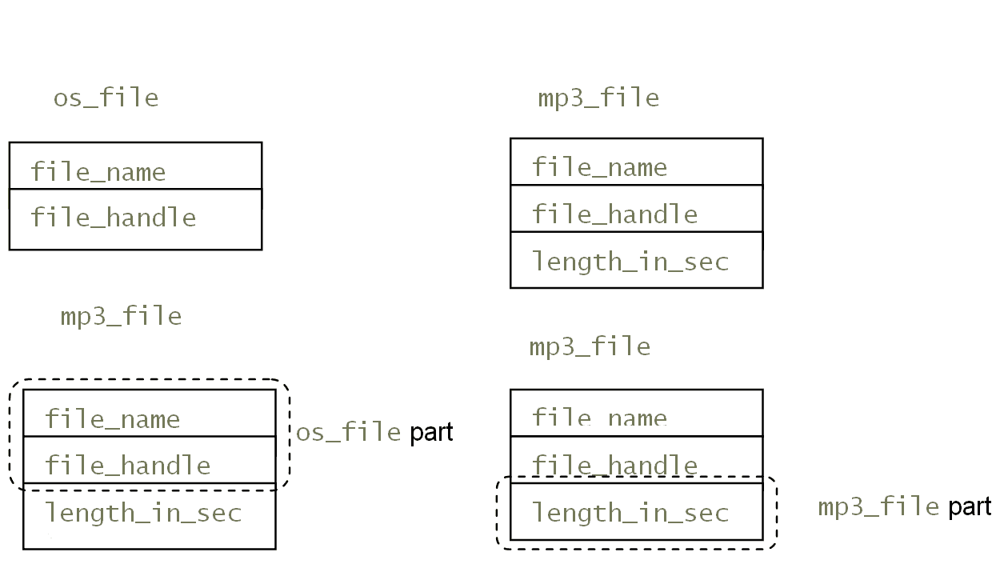
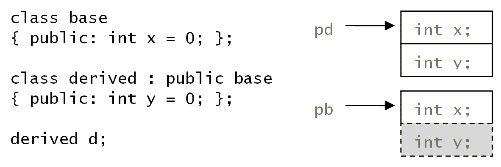
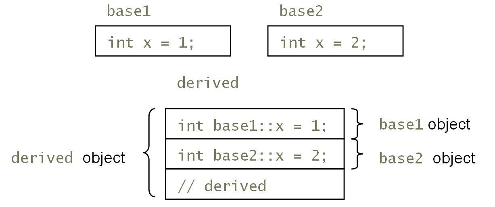
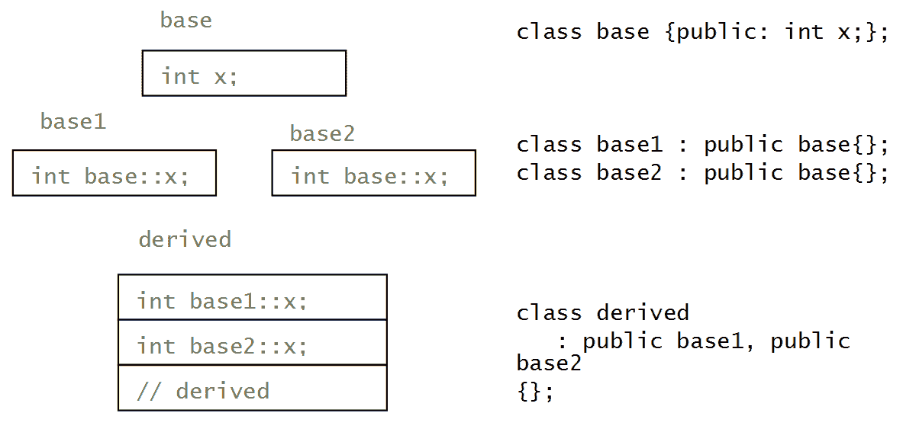
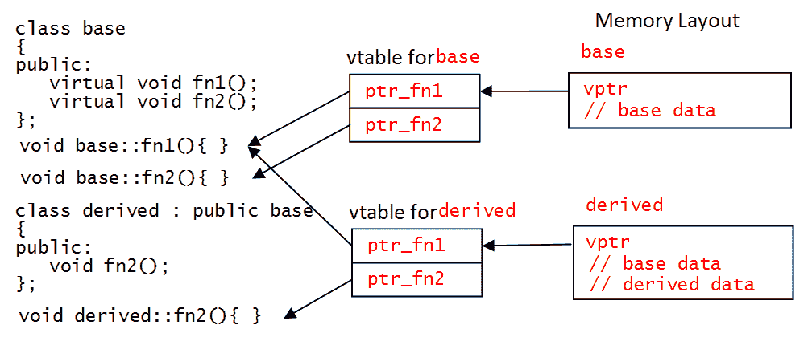
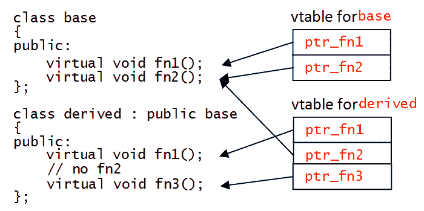
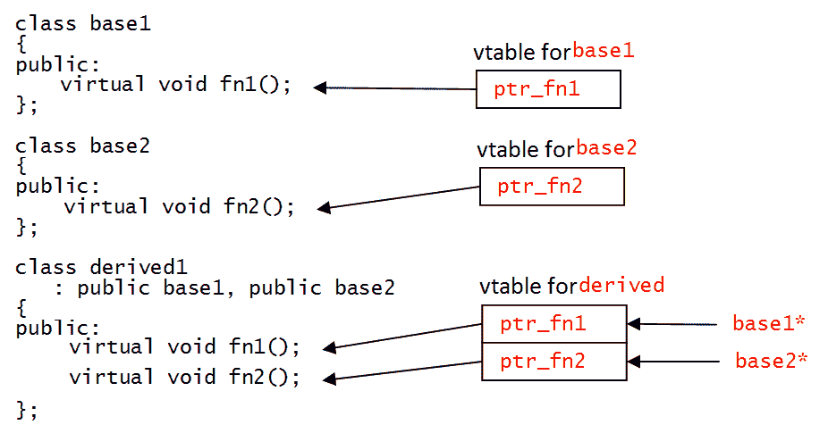

# 第七章：面向对象编程简介

到目前为止，您已经看到了如何在函数中将代码模块化，并在类中用代码封装数据。您还看到了如何使用模板编写通用代码。类和封装允许您将代码和数据组合在一起作为一个对象。在本章中，您将学习如何通过继承和组合来*重用*代码，以及如何使用类继承来编写面向对象的代码。

# 继承和组合

到目前为止，您所看到的类都是完整的类：您可以在自由存储区或堆栈上创建类的实例。这是因为类的数据成员已经定义，因此可以计算出对象所需的内存量，并且已经提供了类的全部功能。这些被称为**具体类**。

如果您在一个类中有一个证明有用的例程，并且希望在新类中重用，您有几种选择。第一种称为**组合**。通过组合，您可以将实用程序类的实例作为将使用该例程的类的数据成员添加进去。一个简单的例子是`string`类--它提供了您从字符串中想要的所有功能。它将根据需要存储的字符数分配内存，并在字符串对象被销毁时释放它使用的内存。您的类使用字符串的功能，但它本身不是一个字符串，因此它将字符串作为数据成员。

第二个选项是使用**继承**。有许多使用继承的方式，本章将提到其中一些。基本上，继承是指一个类*扩展*另一个类，被扩展的类称为**基类**、**父类**或**超类**，而进行扩展的类称为**派生类**、**子类**或**子类**。然而，有一个重要的概念需要理解：派生类与基类的关系。通常以**是一个**的方式给出。如果派生类是基类的一种类型，那么这种关系就是继承。mp3 文件是操作系统文件，因此如果您有一个`os_file`类，那么您可以合理地从中派生出一个`mp3_file`类。

派生类具有基类的功能和状态（尽管可能无法完全访问它们，稍后将进行解释），因此它可以使用基类的功能。在这种情况下，它类似于组合。然而，存在重大差异。通常情况下，在组合中，组合对象由类使用，而不直接暴露给类的客户端。通过继承，派生类的对象是基类的对象，因此通常客户端代码将看到基类的功能。然而，派生类可以隐藏基类的功能，因此客户端代码将看不到隐藏的基类成员，并且派生类可以覆盖基类的方法并提供自己的版本。

在 C++社区中，关于是否应该使用继承或组合来重用代码存在很多争议，每种方法都有其优缺点。两者都不完美，通常需要妥协。

# 从类继承

考虑一个包装操作系统的类。这将提供许多方法，以便通过调用操作系统函数来获取文件的创建日期、修改日期和大小。它还可以提供打开文件、关闭文件、将文件映射到内存以及其他有用的方法。以下是一些这样的成员：

```cpp
    class os_file 
    { 
        const string file_name; 
        int file_handle; 
        // other data members 
    public: 
        long get_size_in_bytes(); 
        // other methods 
    };
```

mp3 文件是操作系统文件，但有其他操作系统函数可以访问其数据。我们可以决定创建一个`mp3_file`类，它从`os_file`派生，以便具有操作系统文件的功能，并通过 mp3 文件的功能进行扩展：

```cpp
    class mp3_file : public os_file 
    { 
        long length_in_secs; 
        // other data members 
    public: 
        long get_length_in_seconds(); 
        // other methods 
    };
```

`mp3_file`类的第一行表示它使用*public* *inheritance*（我们稍后会解释什么是 public inheritance，但值得指出的是，这是从一个类派生的最常见方式）。派生类继承了数据成员和方法，派生类的用户可以通过派生类使用基类的成员，取决于访问说明符。在这个例子中，如果某些代码有一个`mp3_file`对象，它可以从`mp3_file`类调用`get_length_in_seconds`方法，也可以从基类调用`get_size_in_bytes`方法，因为这个方法是`public`的。

基类方法很可能访问基类数据成员，这说明了一个重要的观点：派生对象包含基类数据成员。在内存中，你可以把派生对象看作是基类对象数据成员加上派生对象中定义的额外数据成员。也就是说，派生对象是基类对象的扩展版本。这在下面的图表中有所说明：



在内存中，`os_file`对象有两个数据成员，`file_name`和`file_handle`，而`mp3_file`对象有这两个数据成员和一个额外的数据成员`length_in_secs`。

封装原则在 C++中很重要。虽然`mp3_file`对象包含`file_name`和`file_handle`数据成员，但它们应该只能由基类方法来改变。在这段代码中，通过将它们设为`private`来强制执行这一点。

当创建一个派生对象时，必须首先创建基对象（使用适当的构造函数），同样，当销毁一个派生对象时，首先销毁对象的派生部分（通过派生类的析构函数），然后才调用基类析构函数。考虑以下代码片段，使用前面文本中讨论的成员：

```cpp
    class os_file 
    { 
    public: 
        os_file(const string& name)  
            : file_name(name), file_handle(open_file(name)) 
        {} 
        ~os_file() { close_file(file_handle); } 
    }; 

    class mp3_file : public os_file 
    { 
    public: 
        mp3_file(const string& name) : os_file(name) {} 
        ~mp3_file() { /* clean up mp3 stuff*/ } 
    };
```

`open_file`和`close_file`函数将是一些操作系统函数，用于打开和关闭操作系统文件。

派生类不再需要执行关闭文件的操作，因为在派生类析构函数被调用后，基类析构函数`~os_file`会自动被调用。`mp3_file`构造函数通过其构造函数成员列表调用基类构造函数。如果你没有显式调用基类构造函数，那么编译器会在派生类构造函数的第一个动作中调用基类的默认构造函数。如果成员列表初始化了数据成员，那么这些数据成员会在任何基类构造函数被调用后初始化。

# 覆盖方法和隐藏名称

派生类继承了基类的功能（取决于方法的访问级别），因此可以通过派生类的对象调用基类方法。派生类可以实现一个与基类方法具有相同原型的方法，这种情况下，基类方法被派生类方法*覆盖*，派生类提供功能。派生类通常会覆盖基类方法，以提供特定于派生类的功能；然而，它可以通过使用名称解析运算符调用基类方法：

```cpp
    struct base 
    { 
        void f(){ /* do something */ } 
        void g(){ /* do something */ } 
    }; 

    struct derived : base 
    { 
        void f() 
        { 
            base::f(); 
            // do more stuff 
        } 
    };
```

记住，结构体是一个默认成员为`public`的`class`类型，继承默认为`public`。

在这里，`base::f`和`base::g`方法将执行一些可供此类实例的用户使用的操作。`derived`类继承了这两种方法，由于它没有实现`g`方法，当`derived`类的实例调用`g`方法时，它们实际上会调用`base::g`方法。`derived`类实现了自己版本的`f`方法，因此当`derived`类的实例调用`f`方法时，它们将调用`derived::f`而不是基类版本。在这个实现中，我们决定我们需要一些基类版本的功能，所以`derived::f`明确调用`base::f`方法：

```cpp
    derived d; 
    d.f(); // calls derived::f 
    d.g(); // calls base::g
```

在前面的例子中，该方法首先调用基类版本，然后提供自己的实现。这里没有具体的约定。类库有时是专门为您实现的，以便您从基类派生并使用类库代码。类库的文档将说明您是否应该替换基类实现，或者您是否应该添加到基类实现，如果是这样，您是否会在您的代码之前或之后调用基类方法。

在这个例子中，派生类提供了一个与基类方法完全相同原型的方法来覆盖它。事实上，添加任何与基类中方法同名的方法会隐藏客户端代码中使用派生实例的基类方法。因此，可以将`derived`类实现如下：

```cpp
    struct derived : base 
    { 
        void f(int i) 
        { 
            base::f(); 
            // do more stuff with i 
        } 
    };
```

在这种情况下，`base::f`方法被隐藏，即使该方法具有不同的原型：

```cpp
    derived d; 
    d.f(42); // OK 
    d.f();   // won't compile, derived::f(int) hides base::f
```

相同名称的基类方法被隐藏，因此最后一行将无法编译。但是，您可以通过提供基类名称来显式调用该函数：

```cpp
    derived d; 
    d.derived::f(42); // same call as above 
    d.base::f();      // call base class method 
    derived *p = &d;  // get an object pointer 
    p->base::f();     // call base class method 
    delete p;
```

乍一看，这个语法看起来有点奇怪，但一旦你知道`.`和`->`运算符可以访问成员，并且运算符后面的符号是成员的名称，这种情况下，使用类名和作用域解析运算符明确指定。

到目前为止，所展示的代码通常被称为**实现继承**，其中一个类从基类继承实现。

# 使用指针和引用

在 C++中，您可以使用`&`运算符获取对象（内置类型或自定义类型）在内存中的位置的指针。指针是有类型的，因此使用指针的代码假定指针指向该类型的对象的内存布局。同样，您可以获得对象的引用，引用是对象的*别名*，也就是说，对引用的操作会在对象上进行。派生类的实例的指针（或引用）可以隐式转换为基类对象的指针（或引用）。这意味着您可以编写一个作用于基类对象的函数，使用基类对象的行为，并且只要参数是指向基类的指针或引用，就可以将任何派生类对象传递给该函数。该函数不知道，也不关心派生类的功能。

您应该将派生对象视为基类对象，并接受它可以被用作基类对象。显然，基类指针只能访问基类的成员：



如果派生类隐藏了基类的成员，这意味着派生类的指针将通过成员名称调用派生版本，但基类指针只能看到基类成员，而看不到派生版本。

如果您有一个基类指针，可以使用`static_cast`将其转换为派生类指针：

```cpp
    // bad code 
    void print_y(base *pb) 
    { 
       // be wary of this 
       derived *pd = static_cast<derived*>(pb); 
       cout << "y = " << pd->y << endl; 
    } 

    void f() 
    { 
       derived d; 
       print_y(&d); // implicit cast to base* 
    }
```

问题在于`print_y`函数如何保证将基类指针传递给特定派生对象？如果没有开发人员使用该函数的纪律保证他们永远不会传递不同类型的派生类指针，那么它是无法保证的。即使内存中不包含该对象，`static_cast`操作符也会返回指向`derived`对象的指针。有一种机制可以对进行强制转换的指针进行类型检查，我们将在本章后面介绍。

# 访问级别

到目前为止，我们已经看到了类成员的两种访问限定符：`public`和`private`。在`public`部分声明的成员可以被类内部和类外部的代码访问，无论是在对象上还是（如果成员是`static`的话）使用类名。在`private`部分声明的成员只能被同一类中的其他成员访问。派生类可以访问基类的`private`成员，但不能访问`private`成员。还有第三种成员访问方式：`protected`。在`protected`部分声明的成员可以被同一类中的方法或任何派生类的方法和友元访问，但不能被外部代码访问：

```cpp
    class base 
    { 
    protected: 
        void test(); 
    }; 

    class derived : public base 
    { 
    public: 
        void f() { test(); } 
    };
```

在此代码中，`test`方法可以被`derived`类中的成员调用，但不能被类外的代码调用：

```cpp
    base b; 
    b.test();  // won't compile 
    derived d; 
    d.f();     // OK 
    d.test();  // won't compile
```

如果您正在编写一个基类，您只打算将其用作基类（客户端代码不应创建其实例），那么将析构函数设置为`protected`是有意义的：

```cpp
    class base 
    { 
    public: 
        // methods available through the derived object 
        protected: 
        ~base(){} 
    };
```

编译器不允许您在自由存储器上创建此类的对象，然后使用`delete`销毁它，因为此操作符将调用析构函数。同样，编译器也不会允许您在堆栈上创建对象，因为当对象超出范围时，编译器将调用不可访问的析构函数。此析构函数将通过派生类的析构函数调用，因此您可以确保基类的正确清理将发生。这种模式意味着您总是打算使用指向派生类的指针，以便通过调用`delete`操作符销毁对象。

# 通过继承改变访问级别

当您在派生类中重写方法时，对该方法的访问由派生类定义。因此，如果基类方法是`protected`或`public`，则派生类可以更改访问权限：

```cpp
    class base 
    { 
        protected: 
        void f(); 
    public: 
        void g(); 
    }; 

    class derived : public base 
    { 
    public: 
        void f(); 
        protected: 
        void g(); 
    };
```

在前面的示例中，`base::f`方法是`protected`，因此只有`derived`类可以访问它。`derived`类重写了此方法（并且可以调用基类方法，如果使用了完全限定名称），并将其设置为`public`。类似地，`base::g`方法是`public`，但`derived`类重写了此方法并将其设置为`protected`（如果需要，它也可以将该方法设置为`private`）。

您还可以使用`using`语句将派生类中的`protected`基类公开为`public`成员：

```cpp
    class base 
    { 
    protected: 
        void f(){ /* code */}; 
    }; 

    class derived: public base 
    { 
    public: 
        using base::f; 
    };
```

现在，`derived::f`方法是`public`，而不是派生类创建一个新方法。更好地使用此功能的方法是将方法设置为`private`，以便派生类（或者如果它是`public`，则通过实例）无法访问它，或者将其设置为`protected`，以便外部代码无法访问该成员：

```cpp
    class base 
    { 
    public: 
        void f(); 
    }; 

    class derived: public base 
    { 
    protected: 
        using base::f; 
    };
```

前面的代码可以这样使用：

```cpp
    base b; 
    b.f(); // OK 
    derived d; 
    d.f(); // won't compile
```

最后一行不会编译，因为`f`方法是`protected`。如果意图是仅在派生类中使该方法可用，并且不在可能从中派生的任何类中使其可用，您可以在派生类的`private`部分使用`using`语句；这类似于删除基类方法：

```cpp
    class derived: public base 
    { 
    public: 
        void f() = delete; 

        void g() 
        { 
            base::f(); // call the base class method 
        } 
    };
```

`f`方法无法通过`derived`类使用，但该类可以调用`base`类方法。

# 继承访问级别

之前，您看到了要从一个类派生，您需要提供基类名称并给出继承访问限定符；到目前为止的示例都使用了`public`继承，但您也可以使用`protected`或`private`继承。

这是类和结构之间的另一个区别。对于类，如果您省略了继承访问说明符，编译器将假定它是私有的；对于结构，如果您省略了继承访问说明符，编译器将假定它是公共的。

继承说明符应用更多的访问限制，而不是放宽它们。访问说明符不确定它对基类成员的访问权限，而是通过派生类（即通过类的实例，或者如果另一个类从它派生）改变这些成员的可访问性。如果一个基类有`private`成员，并且一个类使用`public`继承进行继承，那么派生类仍然无法访问`private`成员；它只能访问`public`和`protected`成员，派生类的对象只能访问`public`成员，而从这个类派生的类只能访问`public`和`protected`成员。

如果派生类通过*protected 继承*派生，它仍然具有与`public`和`protected`成员相同的对基类的访问权限，但是基类的`public`和`protected`成员现在将通过派生类视为`protected`，因此它们可以被进一步派生的类访问，但不能通过实例访问。如果一个类通过私有继承派生，那么所有基类成员在派生类中都变为`private`；因此，尽管派生类可以访问`public`和`protected`成员，但从它派生的类不能访问任何基类成员。

保护继承的一种看法是，如果派生类在类的`protected`部分对基类的每个`public`成员都有一个`using`语句。类似地，私有继承就好像您已删除了基类的每个`public`和`protected`方法。

一般来说，大多数继承都将通过*public 继承*。但是，当您想要从基类访问一些功能但不希望其功能对从您的类派生的类可用时，*private 继承*是有用的。这有点像组合，您在使用功能但不希望该功能直接暴露。

# 多重继承

C++允许您从多个基类继承。当与接口一起使用时，这是一个强大的功能，我们将在本章后面发现。它对于实现继承可能很有用，但可能会引起一些问题。语法很简单：您提供一个要继承的类的列表：

```cpp
    class base1 { public: void a(); }; 
    class base2 { public: void b(); }; 
    class derived : public base1, public base2  
    { 
    public: 
        // gets a and b 
    };
```

使用多重继承的一种方法是构建提供某些功能或服务的类库。要在您的类中获得这些服务，您可以将库中的类添加到基类列表中。通过实现继承来创建类的*构建块*方法存在问题，我们稍后会看到，通常更好的方法是使用组合。

在考虑多重继承时，重要的是仔细审查您是需要通过继承获取服务还是组合更合适。如果一个类提供了一个您不希望实例使用的成员，并且您决定需要删除它，这是一个很好的迹象，表明您应该考虑组合。

如果两个类具有相同名称的成员，则可能会出现问题。最明显的情况是如果基类具有相同名称的数据成员：

```cpp
    class base1 { public: int x = 1; }; 
    class base2 { public: int x = 2; }; 
    class derived : public base1, public base2 {};
```

在前面的例子中，两个基类都有一个名为`x`的数据成员。`derived`类继承自这两个类，这意味着它只会得到一个名为`x`的数据成员吗？不是的。如果是这样的话，那么`base1`类将能够修改`base2`类中的数据成员，而不知道这会影响到另一个类，同样地，`base2`类将发现它的数据成员被`base1`类修改，即使那个类不是`friend`。因此，当你从两个具有相同名称的数据成员的类派生时，派生类会得到这两个数据成员。

这再次说明了保持封装的重要性。这样的数据成员应该是`private`的，并且只能由基类进行更改。

派生类（以及使用实例的代码，如果数据成员是可访问的）可以通过它们的全名来区分它们：

```cpp
    derived d; 
    cout << d.base1::x << endl; // the base1 version 
    cout << d.base2::x << endl; // the base2 version
```

这个类可以用下面的图表来总结，说明了三个类`base1`，`base2`和`derived`所占用的内存：



如果你保持封装并将数据成员设为`private`，并且只通过访问器方法访问，那么派生类将不能直接访问数据成员，也不会看到这个问题。然而，方法也会出现相同的问题，但即使方法有不同的原型，问题也会出现： 

```cpp
    class base1 { public: void a(int); }; 
    class base2 { public: void a(); }; 
    class derived : public base1, public base2 {};
```

在这种情况下，两个基类都有一个名为`a`的方法，但原型不同。当使用`derived`类时，这会导致问题，即使通过参数可能很明显应该调用哪个方法。

```cpp
    derived d; 
    d.a();          // should be a from base2, compiler still complains
```

这段代码将无法编译，编译器会抱怨方法调用是模棱两可的。再次，这个问题的解决方法很简单，你只需要指定使用哪个基类方法：

```cpp
    derived d; 
    d.base1::a(42); // the base1 version 
    d.base2::a();   // the base2 version
```

多重继承可能会变得更加复杂。问题出现在如果你有两个类都从同一个基类派生，然后你创建另一个类从这两个类派生。新类会得到最顶层基类成员的两个副本吗？一个通过每个直接基类？



在继承的第一级，每个类（`base1`和`base2`）都从最终基类继承了数据成员（这里，数据成员都被称为`base::x`，以说明它们是从最终基类`base`继承的）。最派生类`derived`继承了*两个*数据成员，那么`base::x`是哪个？答案是只有一个，`base1::x`是`base::x`，因为它是继承列表中的第一个。当`base`方法改变它时，改变将在`base1`中通过`base1::x`看到。`base2::x`成员是一个独立的数据成员，当`base`改变`base::x`时不受影响。这可能是一个意想不到的结果：最派生类从它的父类中都继承了`x`。

这可能不是你想要的行为。这个问题通常被称为*菱形继承问题*，并且从前面的图表中应该很明显，这个名字是从哪里来的。解决方法很简单，稍后在本章中会介绍。

# 对象切片

在本章的前面，你看到如果你使用一个基类指针指向一个派生对象，只有基类成员可以被安全访问。其他成员仍然存在，但只能通过适当的派生类指针访问。

然而，如果你将一个派生类对象转换为一个基类对象，会发生另外的事情：你创建了一个新对象，那个对象就是基类对象，只是基类对象。你转换的变量只有基类对象的内存，所以结果只有派生对象的基类对象部分：

```cpp
    struct base { /*members*/ }; 
    struct derived : base { /*members*/ }; 

    derived d; 
    base b1 = d; // slicing through the copy constructor   
    base b2; 
    b2 = d;      // slicing through assignment
```

在这里，对象`b1`和`b2`是通过对`derived`类对象`d`进行*切片*来创建的。这段代码看起来有点反常，你不太可能写出来，但如果你通过值传递一个对象给一个函数，情况很可能会发生：

```cpp
    void f(base b) 
    { 
        // can only access the base members 
    }
```

如果你将一个`derived`对象传递给这个函数，将调用`base`的复制构造函数来创建一个新对象，切掉`derived`类的数据成员。在大多数情况下，你不希望出现这种行为。如果你的基类有虚方法，并且期望虚方法提供的多态功能（虚方法稍后在本章中介绍），这个问题也会有意想不到的行为。最好总是通过引用传递对象。

# 引入多态

多态来自希腊语，意为*多种形态*。到目前为止，你已经有了多态的基本形式。如果你使用一个指向对象的基类指针，那么你可以访问基类的行为，如果你有一个派生类指针，你就会得到派生类的行为。这并不像看起来那么简单，因为派生类可以实现自己版本的基类方法，所以你可以有不同的行为实现。

你可以从一个基类派生出多个类：

```cpp
    class base { /*members*/ }; 
    class derived1 : public base { /*members*/ }; 
    class derived2 : public base { /*members*/ }; 
    class derived3 : public base { /*members*/ };
```

由于 C++是强类型的，这意味着一个派生类的指针不能用来指向另一个派生类。所以你不能使用`derived1*`指针来访问`derived2`的实例，它只能指向`derived1`类型的对象。即使这些类有相同的成员，它们仍然是不同的类型，它们的指针也是不同的。然而，所有的派生类都有一个共同点，那就是基类。派生类指针可以被隐式转换为基类指针，所以`base*`指针可以指向`base`、`derived1`、`derived2`或`derived3`的实例。这意味着一个接受`base*`指针作为参数的通用函数可以传递给这些类的任何一个指针。这是接口的基础，我们稍后会看到。

多态的方面是，通过指针（或引用），一个类的实例可以被视为其继承层次结构中任何一个类的实例。

# 虚方法

一个基类指针或引用只能访问基类的功能，这是有意义的，但它是有限制的。如果你有一个`car`类，它提供了汽车的接口，油门和刹车来改变速度，方向盘和倒挡来改变方向-你可以从这个类派生出各种其他类型的汽车：跑车、SUV 或家庭轿车。当你踩油门时，你期望汽车有 SUV 的扭矩，如果你的车是 SUV，或者如果它是跑车，你期望它有跑车的速度。同样，如果你在`car`指针上调用`accelerate`方法，而该指针指向`suv`，那么你期望得到反映 SUV 扭矩的方法，如果`car`指针指向`sportscar`对象，你期望得到性能加速。之前我们说过，如果你通过基类指针访问派生类实例，那么你将得到基类方法的实现。这意味着，当你在指向`suv`或`sportscar`对象的`car`指针上调用`accelerate`方法时，你仍然会得到`car::accelerate`的实现，而不是`suv::accelerate`或`sportscar::accelerate`，这是你想要的。

这种通过基类指针调用派生方法的行为被称为**方法分派**。通过基类指针调用方法的代码并不知道指针指向的对象的类型，但它仍然获得了该对象的功能，因为调用了该对象上的方法。这种方法分派不是默认应用的，因为它在内存和性能上都需要一些额外的成本。

可以参与方法分派的方法在基类中用关键字`virtual`标记，因此通常被称为**虚方法**。当你通过基类指针调用这样的方法时，编译器会确保调用实际对象类的方法。由于每个方法都有一个`this`指针作为隐藏参数，方法分派机制必须确保在调用方法时`this`指针是适当的。考虑以下例子：

```cpp
    struct base  
    {  
        void who() { cout << "base "; }  
    }; 
    struct derived1 : base  
    {  
        void who() { cout << "derived1 "; }  
    }; 
    struct derived2 : base 
    { 
        void who() { cout << "derived2 "; } 
    }; 
    struct derived3 : derived2 
    { 
        void who() { cout << "derived3 "; } 
    }; 

    void who_is_it(base& r) 
    { 
        p.who(); 
    } 

    int main() 
    { 
        derived1 d1; 
        who_is_it(d1); 
        derived2 d2; 
        who_is_it(d2); 
        derived3 d3; 
        who_is_it(d3); 
        cout << endl; 
        return 0; 
    }
```

有一个基类和两个子类，`derived1`和`derived2`。通过`derived2`进一步继承到一个名为`derived3`的类。基类实现了一个名为`who`的方法，打印类名。这个方法在每个派生类上都被适当地实现，所以当在`derived3`对象上调用这个方法时，控制台将打印`derived3`。`main`函数创建了每个派生类的一个实例，并将每个实例通过引用传递给一个名为`who_is_it`的函数，该函数调用`who`方法。这个函数有一个参数，是对`base`的引用，因为这是所有类的基类（对于`derived3`，它的直接基类是`derived2`）。当你运行这段代码时，结果将如下所示：

```cpp
    base base base
```

这个输出来自对`who_is_it`函数的三次调用，传递的对象是`derived1`、`derived2`和`derived3`类的实例。由于参数是对`base`的引用，这意味着调用`base::who`方法。

做一个简单的改变将完全改变这种行为：

```cpp
    struct base 
    { 
 virtual void who() { cout << "base "; } 
    };
```

所有改变的是在基类的`who`方法中添加了`virtual`关键字，但结果是显著的。当你运行这段代码时，结果将如下所示：

```cpp
     derived1 derived2 derived3
```

你没有改变`who_is_it`函数，也没有改变派生类的方法，但是`who_is_it`的输出与之前相比非常不同。`who_is_it`函数通过引用调用`who`方法，但是现在，与其调用`base::who`方法不同，实际对象的`who`方法被调用。`who_is_it`函数没有做任何额外的工作来确保派生类方法被调用--它和之前*完全*一样。

`derived3`类不是直接从`base`派生的，而是从`derived2`派生的，后者本身是`base`的子类。即便如此，方法分派也适用于`derived3`类的实例。这说明了无论`virtual`应用到继承链的多高，方法分派仍然适用于派生类的继承方法。

重要的是要指出，方法分派*仅*应用于在基类中应用了`virtual`的方法。基类中没有标记为`virtual`的任何其他方法都将在没有方法分派的情况下被调用。派生类将继承一个`virtual`方法并自动获得方法分派，它不必在任何覆盖的方法上使用`virtual`关键字，但这是一个有用的视觉指示，说明方法如何被调用。

通过派生类实现`virtual`方法，你可以使用一个容器来保存所有这些类的实例的指针，并调用它们的`virtual`方法，而不需要调用代码知道对象的类型：

```cpp
    derived1 d1; 
    derived2 d2; 
    derived3 d3; 

    base *arr[] = { &d1, &d2, &d3 }; 
    for (auto p : arr) p->who(); 
    cout << endl;
```

这里，`arr`内置数组保存了三种类型的对象的指针，范围`for`循环遍历数组并调用方法。这给出了预期的结果：

```cpp
     derived1 derived2 derived3
```

关于前面的代码有三个重要的点：

+   这里使用内置数组是很重要的；像`vector`这样的标准库容器存在问题。

+   重要的是数组保存的是指针，而不是对象。如果你有一个`base`对象数组，它们将通过切片初始化派生对象。

+   还重要的是使用堆栈对象的地址。这是因为析构函数存在问题。

这三个问题将在后面的章节中讨论。

要使用方法分派调用`virtual`方法，派生类方法必须与基类的`virtual`方法在名称、参数和返回类型方面具有相同的签名。如果其中任何一个不同（例如，参数不同），那么编译器将认为派生方法是一个新函数，因此当您通过基指针调用`virtual`方法时，将得到基方法。这是一个相当隐匿的错误，因为代码将编译，但您将得到错误的行为。

最后一段的一个例外是，如果两个方法的返回类型是**协变**的，即一个类型可以转换为另一个类型。

# 虚方法表

通过虚方法进行方法分派的行为是您需要了解的全部，但了解 C++编译器如何实现方法分派是有帮助的，因为它突出了`virtual`方法的开销。

当编译器在类上看到一个`virtual`方法时，它将创建一个方法指针表，称为**vtable**，并将类中每个`virtual`方法的指针放入表中。该类将有一个`vtable`的单个副本。编译器还将在类的每个实例中添加一个指向该表的指针，称为**vptr**。因此，当您将方法标记为`virtual`时，将在运行时为该类创建一个`vtable`的单个内存开销，并为从该类创建的每个对象添加一个额外的数据成员，即`vptr`的内存开销。通常，当客户端代码调用（非内联）方法时，编译器将在客户端代码中将跳转到该方法的函数。当客户端代码调用`virtual`方法时，编译器必须解引用`vptr`以获取`vtable`，然后使用存储在其中的适当地址。显然，这涉及额外的间接级别。

在基类中的每个`virtual`方法都有一个单独的`vtable`条目，按照它们声明的顺序排列。当您从具有`virtual`方法的基类派生时，派生类也将有一个`vptr`，但编译器将使其指向派生类的`vtable`，也就是说，编译器将使用派生类中`virtual`方法实现的地址填充`vtable`。如果派生类没有实现继承的`virtual`方法，则`vtable`中的指针将指向基类方法。这在下图中有所说明：



在左侧，有两个类；基类有两个虚函数，派生类只实现其中一个。在右侧，有一个内存布局的示例。显示了两个对象，一个是`base`对象，一个是`derived`对象。每个对象都有一个单独的`vptr`，后面是类的数据成员，数据成员的排列方式是基类数据成员首先排列，然后是派生类数据成员。`vtable`指针包含指向`virtual`方法的方法指针。对于基类，方法指针指向`base`类上实现的方法。对于派生类，只有第二个方法在`derived`类中实现，因此该类的`vtable`中有一个指向`base`类中的虚方法和另一个指向`derived`类中的虚方法。

这引发了一个问题：如果派生类引入了一个新方法，在基类中不可用，并将其设为`virtual`，会发生什么？这并非不可想象，因为最终的基类可能只提供所需行为的一部分，从它派生的类提供更多的行为，通过子类上的虚方法分派来调用。实现非常简单：编译器为类上的所有`virtual`方法创建一个`vtable`，因此，如果派生类有额外的`virtual`方法，这些指针将出现在`vtable`中，位于从基类继承的`virtual`方法指针之后。当通过基类指针调用对象时，无论该类在继承层次结构中的位置如何，它只会看到与其相关的`vtable`条目：



# 多重继承和虚方法表

如果一个类从多个类派生，并且父类有`virtual`方法，那么派生类的`vtable`将是其父类的`vtable`的组合，按照派生列表中列出的父类的顺序排列：



如果通过基类指针访问对象，则`vptr`将访问与该基类相关的`vtable`部分。

# 虚方法、构造和析构

对象的派生类部分直到构造函数完成后才会被构造，因此，如果调用一个`virtual`方法，`vtable`条目将无法设置为调用正确的方法。同样，在析构函数中，对象的派生类部分已经被销毁，包括它们的数据成员，因此无法调用派生类上的`virtual`方法，因为它们可能会尝试访问不再存在的数据成员。如果在这些情况下允许`virtual`方法分派，结果将是不可预测的。你不应该在构造函数或析构函数中调用`virtual`方法，如果这样做，调用将解析为基类版本的方法。

如果一个类预期通过基类指针调用`virtual`方法分派，那么你应该使析构函数`virtual`。我们这样做是因为用户可能会删除一个基类指针，在这种情况下，你会希望调用派生析构函数。如果析构函数不是`virtual`，并且删除了基类指针，那么只会调用基类析构函数，可能导致内存泄漏。

一般来说，基类的析构函数应该是`protected`且非虚拟的，或者是`public`且`virtual`的。如果意图是通过基类指针使用类，那么析构函数应该是`public`且`virtual`，以便调用派生类的析构函数，但如果基类旨在提供仅通过派生类对象可用的服务，那么你不应该直接访问基类对象，因此析构函数应该是`protected`且非虚拟的。

# 容器和虚方法

`virtual`方法的一个优势是将由基类相关的对象放入容器；之前，我们看到了使用内置基类指针数组的特定情况，但标准库容器呢？举个例子，假设你有一个类层次结构，其中有一个基类`base`，三个派生类`derived1`、`derived2`和`derived3`，每个类都实现了一个`virtual`方法`who`，就像之前使用的那样。尝试将对象放入容器可能如下所示：

```cpp
    derived1 d1; 
    derived2 d2; 
    derived3 d3; 
    vector<base> vec = { d1, d2, d3 }; 
    for (auto b : vec) b.who(); 
    cout << endl;
```

问题在于向量保存了`base`对象，因此在初始化列表中的项目放入容器时，它们实际上被用来初始化新的`base`对象。由于`vec`的类型是`vector<base>`，`push_back`方法将切片对象。因此，调用每个对象上的`who`方法的语句将打印一个字符串`base`。

为了进行`virtual`方法分派，我们需要将整个对象放入容器中。我们可以使用指针或引用来实现这一点。使用指针，你可以使用堆栈对象的地址，只要`vector`的生存期不长于容器中的对象。如果你使用在堆上创建的对象，那么你需要确保对象被适当地删除，你可以使用智能指针来实现这一点。

你可能会想创建一个引用容器：

```cpp
    vector<base&> vec;
```

这将导致一系列错误；不幸的是，它们都没有完全指示问题。`vector`必须包含可复制构造和可赋值的类型。这对引用来说并不成立，因为它们是实际对象的别名。有一个解决方案。`<functional>`头文件包含一个名为`reference_wrapper`的适配器类，它有一个复制构造函数和赋值运算符。该类将对象的引用转换为指向该对象的指针。现在你可以写如下代码：

```cpp
    vector<reference_wrapper<base> > vec = { d1, d2, d3 }; 
    for (auto b : vec) b.get().who(); 
    cout << endl;
```

使用`reference_wrapper`的缺点是，要调用包装对象（及其虚拟方法），你需要调用`get`方法，它将返回对包装对象的*引用*。

# 友元和继承

在 C++中，友元关系不会被继承。如果一个类使另一个类（或函数）成为友元，这意味着友元可以访问它的`private`和`protected`成员，就好像友元是类的成员一样。如果你从`friend`类派生，新类不是第一个类的友元，并且它无法访问第一个类的成员。

在上一章中，我们看到了如何通过编写全局插入运算符并将其作为类的`friend`来将对象插入`ostream`对象中进行打印。在下面的例子中，`friend`函数是内联实现的，但实际上它是一个独立的全局函数，可以在没有对象或使用类名解析的情况下调用。

```cpp
    class base 
    {
        int x = 0; 
    public: 
        friend ostream& operator<<(ostream& stm, const base& b) 
        { 
            // thru b we can access the base private/protected members 
            stm << "base: " << b.x << " "; 
            return stm; 
        } 
    };
```

如果我们从`base`类派生，我们将需要实现一个`friend`函数，将派生对象插入流中。由于这个函数是一个*friend*，它将能够访问派生类的`private`和`protected`成员，但它不能访问基类的`private`成员。这种情况意味着作为派生类*friend*的插入运算符只能打印对象的一部分。

如果一个`derived`类对象被转换为`base`类，比如通过引用或指针传递，然后打印对象，将调用`base`版本的插入运算符。插入运算符是一个`friend`函数，因此它可以访问类的非公共数据成员，但作为*friend*并不足以使它成为一个`virtual`方法，因此没有`virtual`方法分派。

虽然`friend`函数不能被调用为`virtual`方法，但它可以调用`virtual`方法并进行方法分派：

```cpp
    class base 
    { 
        int x = 0;  
        protected: 
        virtual void output(ostream& stm) const { stm << x << " "; } 
    public: 
        friend ostream& operator<<(ostream& stm, const base& b) 
        { 
            b.output(stm); 
            return stm; 
        } 
    }; 

    class derived : public base 
    { 
        int y = 0; 
    protected: 
        virtual void output(ostream& stm) const 
        { 
            base::output(stm); 
            stm << y << " "; 
        } 
    };
```

在这个版本中，只有一个插入运算符，它是为`base`类定义的。这意味着任何可以转换为`base`类的对象都可以使用这个运算符进行打印。打印对象的实际工作被委托给了一个叫做`output`的`virtual`函数。这个函数是受保护的，因为它只打算被类或派生类使用。`base`类版本打印出了基类的数据成员。`derived`类版本有两个任务：打印出基类的数据成员，然后打印出特定于`derived`类的数据成员。第一个任务是通过用基类名称限定名称来调用方法的基类版本来完成的。第二个任务很简单，因为它可以访问自己的数据成员。如果你从`derived`派生另一个类，那么它的`output`函数版本将是类似的，但它将调用`derived::output`。

现在，当一个对象被插入到`ostream`对象中，比如`cout`，插入运算符将被调用，并且对`output`方法的调用将被分派到适当的派生类。

# 覆盖和 final

如前所述，如果你错误地输入了派生`virtual`方法的原型，例如，使用了错误的参数类型，编译器将把该方法视为新方法并进行编译。派生类不覆盖基类的方法是完全合法的；这是一个你经常会想要使用的特性。然而，如果你在输入派生`virtual`方法的原型时出现错误，当你打算调用你的新版本时，基本方法将被调用。`override`修饰符旨在防止这种错误。当编译器看到这个修饰符时，它知道你打算覆盖从基类继承的`virtual`方法，并且它将搜索继承链以找到合适的方法。如果找不到这样的方法，那么编译器将发出错误：

```cpp
    struct base  
    {  
        virtual int f(int i);  
    }; 

    struct derived: base  
    {  
        virtual int f(short i) override; 
    };
```

在这里，`derived::f`不会编译，因为在继承链中没有具有相同签名的方法。`override`修饰符让编译器执行一些有用的检查，因此在所有派生的重写方法上使用它是一个好习惯。

C++11 还提供了一个称为`final`的修饰符，你可以将其应用于方法以指示派生类不能覆盖它，或者将其应用于类以指示你不能从它派生：

```cpp
    class complete final { /* code */ }; 
    class extend: public complete{}; // won't compile
```

很少会想要使用这个。

# 虚拟继承

之前，我们谈到了多重继承中所谓的*菱形*问题，其中一个类通过两个基类从单个祖先类继承。当一个类从另一个类继承时，它将获得父类的数据成员，以便派生类的实例被视为由基类数据成员和派生类数据成员组成。如果父类都是从同一个祖先类派生的，它们将分别获得祖先类的数据成员，导致最终派生类从每个父类获得祖先类的数据成员的副本：

```cpp
    struct base { int x = 0; }; 
    struct derived1 : base { /*members*/ }; 
    struct derived2 :  base { /*members*/ }; 
    struct most_derived : derived1, derived2 { /*members*/ };
```

创建`most_derived`类的实例时，对象中会有两个`base`的副本：一个来自`derived1`，一个来自`derived2`。这意味着`most_derived`对象将有两个数据成员`x`的副本。显然，派生类的意图是只获取祖先类的数据成员的一个副本，那么如何实现呢？这个问题的解决方案是**虚拟继承**：

```cpp
    struct derived1 : virtual base { /*members*/ }; 
    struct derived2 : virtual base { /*members*/ };
```

没有虚拟继承时，派生类只调用其直接父类的构造函数。当你使用`virtual`继承时，`most_derived`类有责任调用最顶层父类的构造函数，如果你没有显式调用基类构造函数，编译器将自动调用默认构造函数：

```cpp
    derived1::derived1() : base(){} 
    derived2::derived2() : base(){} 
    most_derived::most_derived() : derived1(), derived2(), base(){}
```

在前面的代码中，`most_derived`构造函数调用`base`构造函数，因为这是其父类通过虚拟继承继承的基类。`虚拟`基类总是在非虚拟基类之前创建。尽管在`most_derived`构造函数中调用了`base`构造函数，我们仍然必须在派生类中调用`base`构造函数。如果我们进一步从`most_derived`派生，那么该类也必须调用`base`的构造函数，因为那是`base`对象将被创建的地方。虚拟继承比单一或多重继承更昂贵。

# 抽象类

具有`virtual`方法的类仍然是一个**具体类**--你可以创建类的实例。你可能决定只提供部分功能，希望用户*必须*从类中派生并添加缺失的功能。

一种方法是提供一个没有代码的`virtual`方法。这意味着您可以在类中调用`virtual`方法，并且在运行时，将调用派生类中的方法版本。但是，尽管这为您在代码中调用派生方法提供了一种机制，但它并不*强制*实现这些`virtual`方法。相反，派生类将继承空的`virtual`方法，如果它不覆盖它们，客户端代码将能够调用空方法。您需要一种机制来*强制*派生类提供这些`virtual`方法的实现。

C++提供了一种称为**纯虚方法**的机制，表示该方法应该被派生类重写。语法很简单，您可以使用`= 0`标记该方法：

```cpp
    struct abstract_base 
    { 
 virtual void f() = 0; 
        void g() 
        { 
            cout << "do something" << endl; 
            f(); 
        } 
    };
```

这是完整的类；这是该类为方法`f`的定义提供的全部内容。即使方法`g`调用了没有实现的方法，这个类也会编译。但是，以下内容将无法编译：

```cpp
    abstract_base b;
```

通过声明纯虚函数，使类成为抽象类，这意味着您无法创建实例。但是，您可以创建指向该类的指针或引用，并对其调用代码。这个函数将编译：

```cpp
    void call_it(abstract_base& r) 
    { 
        r.g(); 
    }
```

此函数只知道类的公共接口，不关心其实现方式。我们已经实现了方法`g`来调用方法`f`，以表明您可以在同一类中调用纯虚方法。实际上，您也可以在类外调用纯虚函数；这段代码同样有效：

```cpp
    void call_it2(abstract_base& r) 
    { 
        r.f(); 
    }
```

使用抽象类的唯一方法是从中派生并实现纯虚函数：

```cpp
    struct derived1 : abstract_base 
    { 
        virtual void f() override { cout << "derived1::f" << endl; } 
    }; 

    struct derived2 : abstract_base 
    { 
        virtual void f() override { cout << "derived2::f" << endl; } 
    };
```

以下是从抽象类派生的两个类，它们都实现了纯虚函数。这些是具体类，您可以创建它们的实例：

```cpp
    derived1 d1; 
    call_it(d1); 
    derived2 d2; 
    call_it(d2);
```

抽象类用于指示特定功能必须由派生类提供，并且`= 0`语法表示抽象类未提供方法体。实际上，情况比这更微妙；类必须是派生的，必须在派生类上定义调用的方法，但抽象基类也可以为该方法提供方法体：

```cpp
    struct abstract_base 
    { 
        virtual int h() = 0 { return 42; } 
    };
```

同样，这个类不能被实例化，您*必须*从中派生，并且*必须*实现该方法才能实例化对象：

```cpp
    struct derived : abstract_base 
    { 
        virtual int h() override { return abstract_base::h() * 10; } 
    };
```

派生类可以调用抽象类中定义的纯虚函数，但是当外部代码调用这样的方法时，它将始终导致（通过方法分派）调用派生类上虚方法的实现。

# 获取类型信息

C++提供了类型信息，也就是说，您可以获取该类型特有的信息，并对其进行标识。C++是一种强类型语言，因此编译器将在编译时确定类型信息，并在变量类型之间进行转换时强制执行类型规则。编译器进行的任何类型检查，您作为开发人员也可以进行。一般的经验法则是，如果需要使用`static_cast`、`const_cast`、`reinterpret_cast`或类 C 风格的转换，那么您正在让类型执行其不应执行的操作，因此应重新考虑重写代码。编译器非常擅长告诉您类型不匹配的地方，因此您应该将其视为重新评估代码的提示。

*不进行转换*的规则可能过于严格，通常使用转换的代码更容易编写和阅读，但这样的规则确实让您始终质疑是否需要进行转换。

当您使用多态时，通常会得到一个指向与对象类型不同的类型的指针或引用，当您转向接口编程时，情况变得尤为真实，因为实际对象并不重要，重要的是行为。可能会有需要在编译时无法帮助您的情况。C++提供了一种获取类型信息的机制，称为**运行时类型信息**（**RTTI**），因为您可以在运行时获取此信息。使用对象上的`typeid`运算符获取此信息：

```cpp
    string str = "hello"; 
    const type_info& ti = typeid(str); 
    cout << ti.name() << endl;
```

在命令行打印以下结果：

```cpp
    class std::basic_string<char,struct std::char_traits<char>,
 class std::allocator<char> >
```

这反映了`string`类实际上是模板类`basic_string`的`typedef`，字符类型为`char`，字符特性由`char_traits`类的特化描述，以及分配器对象（用于维护字符串使用的缓冲区），这是`allocator`类的特化。

`typeid`运算符返回一个`type_info`对象的`const`引用，在这种情况下，我们使用`name`方法返回对象类型的`const char`指针的名称。这是类型名称的可读版本。类型名称实际上存储在一个紧凑的装饰名称中，可以通过`raw_name`方法获得，但如果您想根据它们的类型（例如在字典对象中）存储对象，那么比较有效的机制是使用`hash_code`方法返回的 32 位整数，而不是装饰名称。在所有情况下，对于相同类型的所有对象，返回的值将是相同的，但对于另一种类型的对象则不同。

`type_info`类没有复制构造函数或复制赋值运算符，因此无法将此类的对象放入容器中。如果要将`type_info`对象放入像`map`这样的关联容器中，则有两种选择。首先，可以将`type_info`对象的指针放入容器中（可以从引用中获取指针）；在这种情况下，如果容器是有序的，则需要定义比较运算符。`type_info`类有一个`before`方法，可用于比较两个`type_info`对象。

第二个选项（在 C++11 中）是使用`type_index`类的对象作为关联容器的键，该类用于包装`type_info`对象。

`type_info`类旨在是只读的，创建实例的唯一方法是通过`typeid`运算符。但是，您可以在`type_info`对象上调用比较运算符`==`和`!=`，这意味着您可以在运行时比较对象的类型。

由于`typeid`运算符可以应用于变量和类型，这意味着您可以使用该运算符执行安全的转换，避免切片或转换为完全不相关的类型：

```cpp
    struct base {}; 
    struct derived { void f(); }; 

    void call_me(base *bp) 
    { 
        derived *dp = (typeid(*bp) == typeid(derived))  
            ? static_cast<derived*>(bp) : nullptr; 
        if (dp != nullptr) dp->f(); 
    } 

    int main() 
    { 
        derived d; 
        call_me(&d); 
        return 0; 
    }
```

此函数可以为从`base`类派生的任何类的指针。第一行使用条件运算符，其中比较是函数参数指向的对象的类型信息与类`derived`的类型之间的比较。如果指针指向`derived`对象，则转换将起作用。如果指针指向另一个派生类型的对象，但不是`derived`类，则比较将失败，并且表达式将求值为`nullptr`。只有当指针指向`derived`类的实例时，`call_me`函数才会调用`f`方法。

C++提供了一个执行运行时的转换操作符，这种类型检查在运行时称为`dynamic_cast`。如果对象可以转换为请求的类型，则操作将成功并返回有效指针。如果对象无法通过请求的指针访问，则转换失败，操作符返回`nullptr`。这意味着每当您使用`dynamic_cast`时，都应该在使用之前检查返回的指针。`call_me`函数可以重写如下：

```cpp
    void call_me(base *bp) 
    { 
        derived *dp = dynamic_cast<derived*>(bp); 
        if (dp != nullptr) dp->f(); 
    }
```

这本质上是与之前相同的代码；`dynamic_cast`运算符执行运行时类型检查并返回适当的指针。

请注意，您不能进行向下转换，无论是到`virtual`基类指针还是到通过`protected`或`private`继承派生的类。`dynamic_cast`运算符可用于除向下转换之外的转换；显然，它将适用于向上转换（到基类，尽管不是必要的），它可用于侧向转换：

```cpp
    struct base1 { void f(); }; 
    struct base2 { void g(); }; 
    struct derived : base1, base2 {};
```

这里有两个基类，因此如果您通过其中一个基类指针访问派生对象，您可以使用`dynamic_cast`运算符将其转换为另一个基类的指针：

```cpp
    void call_me(base1 *b1)  
    { 
        base2 *b2 = dynamic_cast<base2*>(b1); 
        if (b2 != nullptr) b2->g(); 
    }
```

# 智能指针和虚方法

如果您想使用动态创建的对象，您将希望使用智能指针来管理它们的生命周期。好消息是，`virtual`方法分派通过智能指针（它们只是对象指针的包装器）工作，坏消息是，当您使用智能指针时，类关系会丢失。让我们来看看为什么。

例如，以下两个类是通过继承相关的：

```cpp
    struct base  
    {  
        Virtual ~base() {} 
        virtual void who() = 0;  
    }; 

    struct derived : base  
    {  
        virtual void who() { cout << "derivedn"; }  
    };
```

这很简单：实现一个`virtual`方法，指示对象的类型。有一个`virtual`析构函数，因为我们将把生命周期管理交给智能指针对象，并且我们希望确保适当地调用`derived`类析构函数。您可以使用`make_shared`或`shared_ptr`类的构造函数在堆上创建对象：

```cpp
    // both of these are acceptable 
    shared_ptr<base> b_ptr1(new derived);  
    shared_ptr<base> b_ptr2 = make_shared<derived>();
```

派生类指针可以转换为基类指针，这在第一条语句中是明确的：`new`返回一个`derived*`指针，传递给期望一个`base*`指针的`shared_ptr<base>`构造函数。第二条语句中的情况稍微复杂一些。`make_shared`函数返回一个临时的`shared_ptr<derived>`对象，它被转换为一个`shared_ptr<base>`对象。这是通过`shared_ptr`类上的一个转换构造函数执行的，该构造函数调用了一个名为`__is_convertible_to`的**编译器内在**，它确定一个指针类型是否可以转换为另一个。在这种情况下，有一个向上转换，因此允许转换。

编译器内在本质上是编译器提供的函数。在这个例子中，`__is_convertible_to(derived*, base*)`将返回`true`，而`__is_convertible_to(base*, derived*)`将返回`false`。除非您正在编写库，否则您很少需要了解内在本质。

由于在使用`make_shared`函数的语句中创建了一个临时对象，因此使用第一条语句更有效。

`shared_ptr`对象上的`operator->`将直接访问包装的指针，因此这意味着以下代码将执行`virtual`方法分派，如预期的那样：

```cpp
    shared_ptr<base> b_ptr(new derived); 
    b_ptr->who(); // prints "derived"
```

当`b_ptr`超出范围时，智能指针将确保通过基类指针销毁派生对象，并且由于我们有一个`virtual`析构函数，适当的销毁将发生。

如果您有多重继承，您可以使用`dynamic_cast`（和 RTTI）在基类指针之间进行转换，以便只选择您需要的行为。考虑以下代码：

```cpp
    struct base1  
    {  
        Virtual ~base1() {} 
        virtual void who() = 0;  
    }; 

    struct base2  
    {  
        Virtual ~base2() {} 
        virtual void what() = 0;  
    }; 

    struct derived : base1, base2  
    {  
        virtual void who()  { cout << "derivedn"; }  
        virtual void what() { cout << "derivedn"; }  
    };
```

如果您有指向这些基类的指针，您可以将一个转换为另一个：

```cpp
    shared_ptr<derived> d_ptr(new derived); 
    d_ptr->who(); 
    d_ptr->what(); 

    base1 *b1_ptr = d_ptr.get(); 
    b1_ptr->who(); 
    base2 *b2_ptr = dynamic_cast<base2*>(b1_ptr); 
    b2_ptr->what();
```

`who`和`what`方法可以在`derived*`指针上调用，因此它们也可以在智能指针上调用。以下行获取基类指针，以便访问*特定*行为。在这段代码中，我们调用`get`方法从智能指针获取原始指针。这种方法的问题在于现在有一个指向对象的指针，它没有受到智能指针生命周期管理的保护，因此代码可能调用`delete`来删除`b1_ptr`或`b2_ptr`指针，从而在智能指针尝试删除对象时造成问题。

这段代码可以运行，而且在这段代码中动态创建的对象有正确的生命周期管理，但是像这样访问原始指针本质上是不安全的，因为无法保证原始指针不会被删除。诱惑是使用智能指针：

```cpp
    shared_ptr<base1> b1_ptr(d_ptr.get());
```

问题在于，尽管类`base1`和`derived`是相关的，但类`shared_ptr<derived>`和`shared_ptr<base1>`*不*相关，因此每种智能指针类型将使用不同的控制块，即使它们指向*同一个对象*。`shared_ptr`类将使用控制块引用计数，并在引用计数降至零时删除对象。拥有两个不相关的`shared_ptr`对象和两个控制块指向同一个对象意味着它们将独立地尝试管理`derived`对象的生命周期，这最终意味着一个智能指针在另一个智能指针完成之前删除对象。

这里有三条信息：智能指针是指针的轻量级包装器，所以你可以使用方法分派调用`virtual`方法；然而，要谨慎使用从智能指针获取的原始指针，并且要记住，虽然你可以有许多指向同一对象的`shared_ptr`对象，但它们必须是相同类型的，以便只使用一个控制块。

# 接口

纯虚函数和虚方法分派导致了一种非常强大的编写面向对象代码的方式，这被称为**接口**。接口是一个没有功能的类；它只有纯虚函数。接口的目的是定义一种行为。从接口派生的具体类*必须*提供接口上所有方法的实现，因此这使得接口成为一种契约。实现接口的对象的用户保证对象将实现接口的*所有*方法。接口编程将行为与实现解耦。客户端代码只对行为感兴趣，他们对提供接口的实际类不感兴趣。

例如，一个`IPrint`接口可以访问打印文档的行为（设置页面大小、方向、副本数量，并告诉打印机打印文档）。`IScan`接口可以访问扫描纸张的行为（分辨率、灰度或彩色，以及旋转和裁剪等调整）。这两个接口是两种不同的行为。客户端代码将使用`IPrint`，如果要打印文档，或者使用`IScan`接口指针，如果要扫描文档。这样的客户端代码不在乎是实现了`IPrint`接口的`printer`对象，还是实现了`IPrint`和`IScan`接口的`printer_scanner`对象。传递给`IPrint*`接口指针的客户端代码保证可以调用每个方法。

在下面的代码中，我们定义了`IPrint`接口（`define`使得我们更清楚地定义抽象类作为接口）：

```cpp
    #define interface struct 

    interface IPrint 
    { 
        virtual void set_page(/*size, orientation etc*/) = 0; 
        virtual void print_page(const string &str) = 0; 
    };
```

一个类可以实现这个接口：

```cpp
    class inkjet_printer : public IPrint 
    { 
    public: 
        virtual void set_page(/*size, orientation etc*/) override 
        { 
            // set page properties 
        } 
        virtual void print_page(const string &str) override 
        { 
            cout << str << endl; 
        } 
    }; 

    void print_doc(IPrint *printer, vector<string> doc);
```

然后可以创建`printer`对象并调用该函数：

```cpp
    inkjet_printer inkjet; 
    IPrint *printer = &inkjet; 
    printer->set_page(/*properties*/); 
    vector<string> doc {"page 1", "page 2", "page 3"}; 
    print_doc(printer, doc);
```

我们的喷墨打印机也是扫描仪，所以我们可以让它实现`IScan`接口：

```cpp
    interface IScan 
    { 
        virtual void set_page(/*resolution etc*/) = 0; 
        virtual string scan_page() = 0; 
    };
```

`inkject_printer`类的下一个版本可以使用多重继承来实现这个接口，但请注意存在一个问题。该类已经实现了一个名为`set_page`的方法，由于打印机的页面属性将与扫描仪的页面属性不同，我们希望为`IScan`接口使用不同的方法。我们可以通过两种不同的方法来解决这个问题，并对它们的名称进行限定：

```cpp
    class inkjet_printer : public IPrint, public IScan 
    { 
    public: 
        virtual void IPrint::set_page(/*etc*/) override { /*etc*/ } 
        virtual void print_page(const string &str) override 
        { 
            cout << str << endl; 
        } 
        virtual void IScan::set_page(/*etc*/) override { /*etc*/ } 
        virtual string scan_page() override 
        { 
            static int page_no; 
            string str("page "); 
            str += to_string(++page_no); 
            return str; 
        } 
    }; 

    void scan_doc(IScan *scanner, int num_pages);
```

现在，我们可以获取`inkjet`对象上的`IScan`接口，并将其作为扫描仪调用：

```cpp
    inkjet_printer inkjet; 
    IScan *scanner = &inkjet; 
    scanner->set_page(/*properties*/); 
    scan_doc(scanner, 5);
```

由于`inkject_printer`类从`IPrinter`和`IScan`接口派生，您可以通过`dynamic_cast`运算符获得一个接口指针，并通过它转换为另一个接口，因为这将使用 RTTI 来确保转换是可能的。因此，假设您有一个`IScanner`接口指针，您可以测试是否可以将其转换为`IPrint`接口指针：

```cpp
    IPrint *printer = dynamic_cast<IPrint*>(scanner); 
    if (printer != nullptr) 
    { 
        printer->set_page(/*properties*/); 
        vector<string> doc {"page 1", "page 2", "page 3"}; 
        print_doc(printer, doc); 
    }
```

实际上，`dynamic_cast`运算符被用于在指向的对象上请求一个接口指针，如果另一个接口表示的行为在该对象上不可用。

接口是一种契约；一旦您定义了它，就不应该再更改。这并不限制您更改类。事实上，这就是使用接口的优势，因为类的实现可以完全改变，但只要它继续实现客户端代码使用的接口，类的用户就可以继续使用类（尽管需要重新编译）。有时您会发现您定义的接口是不足够的。也许有一个参数被错误地类型化，您需要修复，或者您需要添加额外的功能。

例如，假设您想要告诉打印机对象一次打印整个文档而不是一页一页地打印。要做到这一点，需要从需要更改的接口派生，并创建一个新的接口；接口继承：

```cpp
    interface IPrint2 : IPrint 
    { 
        virtual void print_doc(const vector<string> &doc) = 0; 
    };
```

接口继承意味着`IPrint2`有三个方法，`set_page`，`print_page`和`print_doc`。由于`IPrint2`接口是`IPrint`接口，这意味着当您实现`IPrint2`接口时，您也实现了`IPrint`接口，因此需要更改类以从`IPrint2`接口派生以添加新功能：

```cpp
 class inkjet_printer : public IPrint2, public IScan 
    { 
    public: 
 virtual void print_doc(const vector<string> &doc) override { 
            /* code*/
        } 
        // other methods 
    };
```

`IPrint2`接口上的另外两个方法已经存在于该类中，因为实现了`IPrint`接口。现在，客户端可以从该类的实例中获取`IPrint`指针和`IPrint2`指针。您已经扩展了类，但旧的客户端代码仍将编译通过。

微软的**组件对象模型**（**COM**）将这个概念推进了一步。COM 基于接口编程，因此只能通过接口指针访问 COM 对象。额外的一步是，这段代码可以加载到您的进程中，使用动态加载库，或者加载到您的机器上的另一个进程中，或者加载到另一台机器上，由于使用接口编程，无论位置如何，都可以以*完全*相同的方式访问对象。

# 类关系

继承似乎是重用代码的理想方式：您可以以尽可能通用的方式编写代码，然后从基类派生一个类，并重用代码，必要时进行特化。然而，您会发现很多人反对这种做法。有些人会告诉您，继承是重用代码的最糟糕方式，您应该使用组合代替。实际上，情况介于两者之间：继承提供了一些好处，但不应将其视为最佳或唯一的解决方案。

设计类库时可能会走火入魔，有一个一般原则需要牢记：您写的代码越多，您（或其他人）就必须做的维护工作就越多。如果更改一个类，所有依赖它的其他类都将发生变化。

在最高级别，您应该注意避免的三个主要问题：

+   **僵化性**：更改类太困难，因为任何更改都会影响太多其他类。

+   **脆弱性**：更改类可能会导致其他类出现意外更改。

+   **不可移动性**：很难重用类，因为它过于依赖其他类。

当类之间存在紧密耦合时就会出现这种情况。通常，您应该设计您的类以避免这种情况，接口编程是一个很好的方法，因为接口只是一种行为，而不是特定类的实例。

当您存在*依赖反转*时，就会出现这样的问题，即更高级别的代码使用组件时会依赖于较低级别组件的实现细节。如果您编写执行某些操作然后记录结果的代码，并且将记录到特定设备（比如`cout`对象）中，那么代码就会严格耦合并依赖于该记录设备，未来无法更改为其他设备。如果您通过接口指针来抽象功能，那么就会打破这种依赖，使代码能够在未来与其他组件一起使用。

另一个原则是，通常应该设计可扩展的类。继承是一种相当蛮力的扩展类的机制，因为您正在创建一个全新的类型。如果功能只需要进行细化，那么继承可能会过度。一种更轻量级的细化算法的方法是传递一个方法指针（或者一个函数对象），或者一个接口指针给类的方法，以便在适当的时候调用该方法来细化其工作方式。

例如，大多数排序算法要求您传递一个方法指针来执行对其正在排序的两个对象进行比较。排序机制是通用的，以最有效的方式对对象进行排序，但这是基于您告诉它如何对这两个对象进行排序。为每种类型编写一个新类是多余的，因为大多数算法保持不变。

# 使用混合类

**混合**技术允许您为类提供可扩展性，而不会出现组合的生命周期问题或原始继承的重量级方面。这里的想法是，您有一个具有特定功能的库，可以将其添加到对象中。一种方法是将其应用为具有`public`方法的基类，因此如果派生类公开从该类派生，它也将具有这些方法作为`public`方法。这很好地工作，除非功能要求派生类在这些方法中也执行某些功能，此时库的文档将要求派生类覆盖该方法，调用基类实现，并添加自己的代码以完成实现（基类方法可以在额外的派生类代码之前或之后调用，文档必须指定这一点）。迄今为止，在本章中我们已经看到这种方法被多次使用，这是一些旧的类库使用的技术，例如微软的**基础类库**（**MFC**）。Visual C++使这变得更容易，因为它使用向导工具生成 MFC 代码，并且有关开发人员应该在何处添加其代码的注释。

这种方法的问题在于，它要求从基类派生的开发人员实现特定的代码并遵循规则。

开发人员可能会编写可以编译和运行的代码，但由于未按照期望的规则编写，因此在运行时会出现错误的行为。

混合类将这个概念颠倒过来。开发人员不再从库提供的基类派生并扩展提供的功能，而是库提供的混合类*从开发人员提供的类派生*。这解决了几个问题。首先，开发人员必须按照文档要求提供特定的方法，否则混合类（将使用这些方法）将无法编译。编译器强制执行类库作者的规则，要求使用库的开发人员提供特定的代码。其次，混合类上的方法可以在需要的地方调用基类方法（由开发人员提供）。使用类库的开发人员不再提供关于他们的代码如何开发的详细说明，除了他们必须实现某些方法。

那么，如何实现这一点呢？类库作者不知道客户端开发人员将编写的代码，也不知道客户端开发人员将编写的类的名称，因此他们无法从这样的类派生。C++允许您通过模板参数提供类型，以便在编译时使用该类型实例化类。对于混合类，通过模板参数传递的类型是将用作基类的类型的名称。开发人员只需提供一个具有特定方法的类，然后使用他们的类作为模板参数创建混合类的特化：

```cpp
    // Library code 
    template <typename BASE> 
    class mixin : public BASE 
    { 
    public: 
        void something() 
        { 
            cout << "mixin do something" << endl; 
            BASE::something(); 
            cout << "mixin something else" << endl; 
        } 
    }; 

    // Client code to adapt the mixin class 
    class impl  
    { 
    public: 
        void something() 
        { 
            cout << "impl do something" << endl; 
        } 
    };
```

这个类是这样使用的：

```cpp
    mixin<impl> obj; 
    obj.something();
```

正如你所看到的，`mixin`类实现了一个名为`something`的方法，并调用了一个名为`something`的基类方法。这意味着使用混合类功能的客户端开发人员必须实现一个具有相同名称和原型的方法，否则无法使用混合类。编写`impl`类的客户端开发人员不知道他们的代码将如何被使用，只知道他们必须提供具有特定名称和原型的方法。在这种情况下，`mixin::something`方法在提供的功能之间调用基类方法，`impl`类的编写者不需要知道这一点。这段代码的输出如下：

```cpp
    mixin do something
impl do something
mixin something else
```

这表明`mixin`类可以在它认为合适的地方调用`impl`类。`impl`类只需提供功能；`mixin`类确定如何使用它。实际上，只要实现了具有正确名称和原型的方法的任何类都可以作为`mixin`类的模板的参数提供-甚至另一个混合类！

```cpp
    template <typename BASE> 
    class mixin2 : public BASE 
    { 
    public: 
        void something() 
        { 
            cout << "mixin2 do something" << endl; 
            BASE::something(); 
            cout << "mixin2 something else" << endl; 
        } 
    };
```

这可以这样使用：

```cpp
    mixin2< mixin<impl> > obj; 
    obj.something();
```

结果将如下所示：

```cpp
    mixin2 do something
mixin do something
impl do something
mixin something else 
mixin2 something else
```

请注意，`mixin`和`mixin2`类除了实现适当的方法之外，对彼此一无所知。

由于没有提供模板参数的类型，混合类有时被称为抽象子类。

如果基类只有一个默认构造函数，那么这将起作用。如果实现需要另一个构造函数，那么混合类必须知道调用哪个构造函数，并且必须具有适当的参数。另外，如果链接混合类，那么它们将通过构造函数耦合在一起。解决这个问题的一种方法是使用两阶段构造，也就是说，提供一个命名方法（比如`init`）用于在构造后初始化对象的数据成员。混合类仍将使用它们的默认构造函数创建，因此类之间不会有耦合，也就是说，`mixin2`类将不知道`mixin`或`impl`的数据成员：

```cpp
    mixin2< mixin<impl> > obj; 
    obj.impl::init(/* parameters */);  // call impl::init 
    obj.mixin::init(/* parameters */); // call mixin::init 
    obj.init(/* parameters */);        // call mixin2::init 
    obj.something();
```

这是因为只要限定方法的名称，就可以调用公共基类方法。这三个`init`方法中的参数列表可以不同。然而，这确实带来了一个问题，即客户端现在必须初始化链中的所有基类。

这是微软的**ActiveX 模板库**（**ATL**）（现在是 MFC 的一部分）用来提供标准 COM 接口的实现的方法。

# 使用多态

在以下示例中，我们将创建模拟 C++开发团队的代码。该代码将使用接口来解耦类，以便可以更改类使用的服务而不更改该类。在这个模拟中，我们有一个经理管理一个团队，因此经理的一个属性是他们的团队。此外，每个工人，无论是经理还是团队成员，都有一些共同的属性和行为--他们都有一个名称和工作职位，他们都做某种工作。

为该章节创建一个文件夹，在该文件夹中创建一个名为`team_builder.cpp`的文件，并且由于此应用程序将使用`vector`、智能指针和文件，因此在文件顶部添加以下行：

```cpp
    #include <iostream> 
    #include <string> 
    #include <vector> 
    #include <fstream> 
    #include <memory> 
    using namespace std;
```

应用程序将具有命令行参数，但目前只需提供一个空的`main`函数副本：

```cpp
    int main(int argc, const char *argv[]) 
    { 
        return 0;  
    }
```

我们将定义接口，因此在`main`函数之前添加以下内容：

```cpp
    #define interface struct
```

这只是一种语法糖，但它使代码更易读，以显示抽象类的目的。在此之下，添加以下接口：

```cpp
    interface IWork 
    { 
        virtual const char* get_name() = 0; 
        virtual const char* get_position() = 0; 
        virtual void do_work() = 0; 
    }; 

    interface IManage 
    { 
        virtual const vector<unique_ptr<IWork>>& get_team() = 0; 
        virtual void manage_team() = 0; 
    }; 

    interface IDevelop  
    { 
        virtual void write_code() = 0; 
    };
```

所有工人都将实现第一个接口，该接口允许访问他们的名称和工作职位以及告诉他们做一些工作的方法。我们将定义两种类型的工人，一个通过安排时间来管理团队的经理和编写代码的开发人员。经理有一个`IWork*`指针的`vector`，由于这些指针将指向在自由存储上创建的对象，因此`vector`成员是包装这些指针的智能指针。这意味着经理维护这些对象的生命周期：只要经理对象存在，他们的团队也会存在。

首先要做的是创建一个助手类，该类执行工人的基本工作。稍后在示例中将会看到这一点。该类将实现`IWork`接口：

```cpp
    class worker : public IWork 
    { 
        string name; 
        string position; 
    public: 
        worker() = delete; 
        worker(const char *n, const char *p) : name(n), position(p) {} 
        virtual ~worker() {} 
        virtual const char* get_name() override  
        { return this->name.c_str(); } 
        virtual const char* get_position() override  
        { return this->position.c_str(); } 
        virtual void do_work() override { cout << "works" << endl; } 
    };
```

必须使用名称和工作职位创建一个`worker`对象。我们还将为经理创建一个助手类：

```cpp
    class manager : public worker, public IManage 
    { 
        vector<unique_ptr<IWork>> team; 
    public: 
        manager() = delete; 
        manager(const char *n, const char* p) : worker(n, p) {} 
        const vector<unique_ptr<IWork>>& get_team() { return team; } 
        virtual void manage_team() override  
        { cout << "manages a team" << endl; } 
        void add_team_member(IWork* worker) 
        { team.push_back(unique_ptr<IWork>(worker)); } 
        virtual void do_work() override { this->manage_team(); } 
    };
```

请注意，`do_work`方法是根据虚函数`manage_team`实现的，这意味着派生类只需要实现`manage_team`方法，因为它将从其父类继承`do_work`方法，并且方法分派将意味着调用正确的方法。类的其余部分很简单，但请注意构造函数调用基类构造函数以初始化名称和工作职位（毕竟，经理也是工人），并且`manager`类有一个函数来使用智能指针将项目添加到团队中。

为了测试这一点，我们需要创建一个管理开发人员的`manager`类：

```cpp
    class project_manager : public manager 
    { 
    public: 
        project_manager() = delete; 
        project_manager(const char *n) : manager(n, "Project Manager") 
        {} 
        virtual void manage_team() override  
        { cout << "manages team of developers" << endl; } 
    };
```

这覆盖了对基类构造函数的调用，传递了项目经理的名称和描述工作的文字。该类还覆盖了`manage_team`以说明经理实际上做了什么。在这一点上，您应该能够创建一个`project_manager`并向他们的团队添加一些成员（使用`worker`对象，您将在一会儿创建开发人员）。将以下内容添加到`main`函数中：

```cpp
    project_manager pm("Agnes"); 
    pm.add_team_member(new worker("Bill", "Developer")); 
    pm.add_team_member(new worker("Chris", "Developer")); 
    pm.add_team_member(new worker("Dave", "Developer")); 
    pm.add_team_member(new worker("Edith", "DBA"));
```

这段代码将编译，但运行时不会有输出，因此创建一个方法来打印经理的团队：

```cpp
    void print_team(IWork *mgr) 
    { 
        cout << mgr->get_name() << " is "  
             << mgr->get_position() << " and "; 
        IManage *manager = dynamic_cast<IManage*>(mgr); 
        if (manager != nullptr) 
        { 
            cout << "manages a team of: " << endl; 
            for (auto team_member : manager->get_team()) 
            { 
                cout << team_member->get_name() << " " 
                     << team_member->get_position() << endl; 
            } 
        } 
        else { cout << "is not a manager" << endl; } 
    }
```

此函数显示了接口有多么有用。您可以将任何工人传递给该函数，并且它将打印出与所有工人相关的信息（名称和工作职位）。然后，它通过请求`IManage`接口询问对象是否是经理。如果对象实现了此接口，函数只能获取经理的行为（在这种情况下，拥有一个团队）。在`main`函数的最后，在对`program_manager`对象的最后一次调用之后，调用此函数：

```cpp
    print_team(&pm)
```

编译此代码（记得使用`/EHsc`开关）并运行代码。您将获得以下输出：

```cpp
 Agnes is Project Manager and manages a team of:
 Bill Developer
 Chris Developer
 Dave Developer
 Edith DBA
```

现在我们将添加多态性，所以在`print_team`函数之前添加以下类：

```cpp
    class cpp_developer : public worker, public IDevelop 
    { 
    public: 
        cpp_developer() = delete; 
        cpp_developer(const char *n) : worker(n, "C++ Dev") {} 
        void write_code() { cout << "Writing C++ ..." << endl; } 
        virtual void do_work() override { this->write_code(); } 
    }; 

    class database_admin : public worker, public IDevelop 
    { 
    public: 
        database_admin() = delete; 
        database_admin(const char *n) : worker(n, "DBA") {} 
        void write_code() { cout << "Writing SQL ..." << endl; } 
        virtual void do_work() override { this->write_code(); } 
    };
```

您可以更改`main`函数，以便使用`cpp_developer`代替`worker`对象，用于 Bill、Chris 和 Dave，以及使用`database_admin`代替 Edith：

```cpp
    project_manager pm("Agnes"); 
    pm.add_team_member(new cpp_developer("Bill")); 
    pm.add_team_member(new cpp_developer("Chris")); 
    pm.add_team_member(new cpp_developer("Dave")); 
    pm.add_team_member(new database_admin("Edith")); 
    print_team(&pm);
```

现在，您可以编译和运行代码，看到不仅可以将不同类型的对象添加到经理的团队中，而且还可以通过`IWork`接口打印出相应的信息。

下一个任务是添加代码来序列化和反序列化这些对象。序列化意味着将对象的状态（和类型信息）写入流，反序列化将获取该信息并创建具有指定状态的适当类型的新对象。为此，每个对象必须具有一个构造函数，该构造函数接受一个指向反序列化器对象的接口指针，并且构造函数应调用此接口以提取正在创建的对象的状态。此外，这样的类应实现一种方法，将对象的状态序列化并写入序列化器对象。让我们首先看一下序列化。在文件顶部添加以下接口：

```cpp
    #define interface struct 

 interface IWork; 
    // forward declaration interface ISerializer { virtual void write_string(const string& line) = 0; virtual void write_worker(IWork *worker) = 0; virtual void write_workers ( const vector<unique_ptr<IWork>>& workers) = 0; }; interface ISerializable { virtual void serialize(ISerializer *stm) = 0; };
```

需要前向声明，因为`ISerializer`接口使用`IWork`接口。第一个接口`ISerializer`由提供序列化服务的对象实现。这可以基于文件、网络套接字、数据库或任何您想要用于存储对象的东西。底层存储机制对于此接口的用户来说并不重要；重要的是接口可以存储字符串，并且可以使用`IWork`接口指针或此类对象的集合存储整个对象。

可以序列化的对象必须实现`ISerializable`接口，该接口具有一个方法，该方法接受提供序列化服务的对象的接口指针。在接口的定义之后，添加以下类：

```cpp
    class file_writer : public ISerializer 
    { 
        ofstream stm; 
    public: 
        file_writer() = delete; 
        file_writer(const char *file) { stm.open(file, ios::out); } 
        ~file_writer() { close(); } 
        void close() { stm.close(); } 
        virtual void write_worker(IWork *worker) override 
        { 
            ISerializable *object = dynamic_cast<ISerializable*>(worker); 
            if (object != nullptr) 
            { 
                ISerializer *serializer = dynamic_cast<ISerializer*>(this); 
                serializer->write_string(typeid(*worker).raw_name()); 
         object->serialize(serializer); 
            } 
        } 
        virtual void write_workers( 
        const vector<unique_ptr<IWork>>& workers) override 
        { 
            write_string("[["); 
            for (const unique_ptr<IWork>& member : workers) 
            { 
                write_worker(member.get()); 
            } 
            write_string("]]"); // end marker of team 
        } 
        virtual void write_string(const string& line) override 
        { 
            stm << line << endl; 
        } 
    };
```

该类为文件提供了`ISerializer`接口，因此`write_string`方法使用`ifstream`插入运算符将字符串写入文件的单行。`write_worker`方法将 worker 对象写入文件。为此，它首先询问 worker 对象是否可以通过将`IWork`接口转换为`ISerializable`接口来对自身进行序列化。如果 worker 对象实现了此接口，序列化器可以通过将`ISerializer`接口指针传递给 worker 对象的`serialize`方法来要求 worker 对象对自身进行序列化。工作对象决定必须序列化的信息。工作对象除了`ISerializer`接口之外对`file_writer`类一无所知，而`file_writer`类除了知道它实现了`IWork`和`ISerializable`接口之外对 worker 对象一无所知。

如果 worker 对象是可序列化的，`write_worker`方法的第一件事是获取有关对象的类型信息。`IWork`接口将位于一个类（`project_manager`、`cpp_developer`或`database_admin`）上，因此解引用指针将使`typeid`运算符访问类类型信息。我们将原始类型名称存储在序列化器中，因为它很紧凑。一旦类型信息被序列化，我们通过调用其`ISerializable`接口上的`serialize`方法要求对象对自身进行序列化。worker 对象将存储任何它想要的信息。

manager 对象需要序列化他们的团队，他们通过将 worker 对象的集合传递给`write_workers`方法来实现这一点。这表明被序列化的对象是一个数组，通过在两个标记`[[`和`]]`之间写入它们来表示。请注意，因为容器有`unique_ptr`对象，所以没有复制构造函数，因为那将意味着共享所有权。所以我们通过索引操作符访问项目，这将给我们一个对容器中`unique_ptr`对象的引用。

现在，对于每个可以被序列化的类，你必须从`ISerializable`派生出类，并实现`serialize`方法。类继承树意味着每个 worker 类型的类都从`worker`类派生，所以我们只需要这个类从`ISerializable`接口派生：

```cpp
    class worker : public IWork, public ISerializable
```

约定是一个类只序列化自己的状态，并委托给它的基类来序列化基类对象。在继承树的顶部是`worker`类，所以在这个类的底部添加以下接口方法：

```cpp
    virtual void serialize(ISerializer *stm) override 
    { 
        stm->write_string(name); 
        stm->write_string(position); 
    }
```

这只是将名字和工作职位序列化到序列化器中。请注意，worker 对象不知道序列化器将如何处理这些信息，也不知道哪个类提供了`ISerializer`接口。

在`cpp_developer`类的底部，添加这个方法：

```cpp
    virtual void serialize(ISerializer* stm) override 
    { worker::serialize(stm); }
```

`cpp_developer`类没有任何额外的状态，所以它将序列化委托给它的父类。如果开发者类有一个状态，那么它将在序列化基对象之后序列化这个状态。在`database_admin`类的底部添加完全相同的代码。

`project_manager`类也调用了它的基类，但这是`manager`，所以在`project_manager`类的底部添加以下内容：

```cpp
    virtual void serialize(ISerializer* stm) override 
    { manager::serialize(stm); }
```

`manager::serialize`更复杂，因为这个类有应该被序列化的状态：

```cpp
    virtual void serialize(ISerializer* stm) override 
    { 
        worker::serialize(stm); 
        stm->write_workers(this->team); 
    }
```

第一步是序列化基类：一个`worker`对象。然后代码序列化`manager`对象的状态，这意味着通过将这个集合传递给序列化器来序列化`team`数据成员。

为了能够测试序列化，创建一个方法在`main`方法之上，并将`project_manager`的代码移到新方法中，并添加代码来序列化对象：

```cpp
    void serialize(const char* file) 
    { 
        project_manager pm("Agnes"); 
        pm.add_team_member(new cpp_developer("Bill")); 
        pm.add_team_member(new cpp_developer("Chris")); 
        pm.add_team_member(new cpp_developer("Dave")); 
        pm.add_team_member(new database_admin("Edith")); 
        print_team(&pm); 

        cout << endl << "writing to " << file << endl; 

        file_writer writer(file); 
        ISerializer* ser = dynamic_cast<ISerializer*>(&writer); 
        ser->write_worker(&pm); 
        writer.close(); 
    }
```

上述代码创建了一个`file_writer`对象用于指定的文件，获取了该对象上的`ISerializer`接口，然后序列化了项目经理对象。如果你有其他团队，你可以在关闭`writer`对象之前将它们序列化到文件中。

`main`函数将接受两个参数。第一个是文件的名字，第二个是一个字符，`r`或`w`（读或写文件）。添加以下代码来替换`main`函数：

```cpp
    void usage() 
    { 
        cout << "usage: team_builder file [r|w]" << endl; 
        cout << "file is the name of the file to read or write" << endl; 
        cout << "provide w to file the file (the default)" << endl; 
        cout << "        r to read the file" << endl; 
    } 

    int main(int argc, char* argv[]) 
    { 
        if (argc < 2) 
        { 
            usage(); 
            return 0; 
        } 

        bool write = true; 
        const char *file = argv[1]; 
        if (argc > 2) write = (argv[2][0] == 'w'); 

        cout << (write ? "Write " : "Read ") << file << endl << endl; 

        if (write) serialize(file); 
        return 0; 
    }
```

现在你可以编译这段代码并运行它，给出一个文件的名字：

```cpp
    team_builder cpp_team.txt w
```

这将创建一个名为`cpp_team.txt`的文件，其中包含关于团队的信息；在命令行中输入`**type cpp_team.txt**`：

```cpp
    .?AVproject_manager@@ 
    Agnes 
    Project Manager 
    [[ 
    .?AVcpp_developer@@ 
    Bill 
    C++ Dev 
    .?AVcpp_developer@@ 
    Chris 
    C++ Dev 
    .?AVcpp_developer@@ 
    Dave 
    C++ Dev 
    .?AVdatabase_admin@@ 
    Edith 
    DBA 
    ]]
```

这个文件不是为人类阅读而设计的，但是你可以看到，每一行都有一条信息，每个序列化对象都在类的类型之前。

现在你将编写代码来反序列化一个对象。代码需要一个类来读取序列化数据并返回 worker 对象。这个类与序列化器类紧密耦合，但应该通过接口访问，以便不与 worker 对象耦合。在`ISerializable`接口的声明之后，添加以下内容：

```cpp
    interface IDeserializer 
    { 
        virtual string read_string() = 0; 
        virtual unique_ptr<IWork> read_worker() = 0; 
        virtual void read_workers(vector<unique_ptr<IWork>>& team) = 0; 
    };
```

第一个方法获取序列化字符串，另外两个方法获取单个对象和对象集合。由于这些 worker 对象将在自由存储上创建，这些方法使用智能指针。每个类都可以对自身进行序列化，因此现在您将使每个可序列化的类能够对自身进行反序列化。为实现`ISerializable`的每个类添加一个接受`IDeserializer`接口指针的构造函数。从`worker`类开始；添加以下公共构造函数：

```cpp
    worker(IDeserializer *stm) 
    { 
        name = stm->read_string(); 
        position = stm->read_string(); 
    }
```

本质上，这颠倒了`serialize`方法的操作，它按照传递给序列化器的顺序从反序列化器中读取名称和位置字符串。由于`cpp_developer`和`database_admin`类没有状态，它们在调用基类构造函数之外不需要进行任何其他反序列化工作。例如，向`cpp_developer`类添加以下公共构造函数：

```cpp
    cpp_developer(IDeserializer* stm) : worker(stm) {}
```

为`database_admin`类添加类似的构造函数。

经理们有状态，因此反序列化它们需要更多的工作。在`manager`类中添加以下内容：

```cpp
    manager(IDeserializer* stm) : worker(stm) 
    { stm->read_workers(this->team); }
```

初始化列表构造了基类，在此之后，构造函数通过在`IDeserializer`接口上调用`read_workers`来将`team`集合初始化为零个或多个 worker 对象。最后，`project_manager`类派生自`manager`类，但不添加额外的状态，因此添加以下构造函数：

```cpp
    project_manager(IDeserializer* stm) : manager(stm) {}
```

现在，每个可序列化的类都可以对自身进行反序列化，下一步是编写读取文件的反序列化器类。在`file_writer`类之后，添加以下内容（注意有两个方法没有内联实现）：

```cpp
    class file_reader : public IDeserializer 
    { 
        ifstream stm; 
    public: 
        file_reader() = delete; 
        file_reader(const char *file) { stm.open(file, ios::in); } 
        ~file_reader() { close(); } 
        void close() { stm.close(); } 
        virtual unique_ptr<IWork> read_worker() override; 
        virtual void read_workers( 
            vector<unique_ptr<IWork>>& team) override; 
        virtual string read_string() override 
        { 
            string line; 
            getline(stm, line); 
            return line; 
        } 
    };
```

构造函数打开指定的文件，析构函数关闭文件。`read_string`接口方法从文件中读取一行并将其作为字符串返回。主要工作在这里未实现的两个接口方法中进行。`read_workers`方法将读取一组`IWork`对象并将它们放入传递的集合中。此方法将为文件中的每个对象调用`read_worker`方法并将它们放入集合中，因此读取文件的主要工作在此方法中进行。`read_worker`方法是该类唯一与可序列化类有耦合的部分，因此必须在 worker 类的定义下定义。在`serialize`全局函数上方添加以下内容：

```cpp
    unique_ptr<IWork> file_reader::read_worker() 
    { 
    } 
    void file_reader::read_workers(vector<unique_ptr<IWork>>& team) 
    { 
        while (true) 
        { 
            unique_ptr<IWork> worker = read_worker(); 
            if (!worker) break; 
            team.push_back(std::move(worker)); 
        } 
    }
```

`read_workers`方法将使用`read_worker`方法从文件中读取每个对象，该方法将每个对象以`unique_ptr`对象的形式返回。我们希望将此对象放入容器中，但由于指针应该具有独占所有权，因此我们需要将所有权移动到容器中的对象中。有两种方法可以做到这一点。第一种方法是简单地将`read_worker`的调用作为`push_back`的参数。`read_worker`方法返回一个临时对象，即右值，因此编译器在创建容器中的对象时将使用移动语义。我们不这样做是因为`read_worker`方法可能返回`nullptr`（我们希望进行测试），因此我们创建一个新的`unique_ptr`对象（移动语义将所有权传递给此对象），一旦我们测试了这个对象不是`nullptr`，我们调用标准库函数`move`将对象复制到容器中。

如果`read_worker`方法读取数组的结束标记，则返回`nullptr`，因此`read_workers`方法循环读取每个 worker 并将它们放入集合，直到返回`nullptr`。

像这样实现`read_worker`方法：

```cpp
    unique_ptr<IWork> file_reader::read_worker() 
    { 
        string type = read_string(); 
        if (type == "[[") type = read_string(); 
        if (type == "]]") return nullptr; 
        if (type == typeid(worker).raw_name()) 
        { 
            return unique_ptr<IWork>( 
            dynamic_cast<IWork*>(new worker(this))); 
        }    
        return nullptr; 
    }
```

第一行从文件中读取工作对象的类型信息，以便知道要创建什么对象。由于文件将有标记来指示团队成员的数组，代码必须检测这些标记。如果检测到数组的开始，标记字符串将被忽略，并且将读取下一行以获取团队中第一个对象的类型。如果读取到结束标记，那么这就是数组的结束，所以返回`nullptr`。

这里显示了一个`worker`对象的代码。`if`语句用于检查类型字符串是否与`worker`类的原始名称相同。如果是，则我们必须创建一个`worker`对象，并请求它通过调用接受`IDeserializer`指针的构造函数来反序列化自己。`worker`对象在自由存储上创建，并调用`dynamic_cast`运算符来获取`IWork`接口指针，然后用它来初始化智能指针对象。`unique_ptr`的构造函数是`explicit`的，所以您必须调用它。现在为所有其他可序列化的类添加类似的代码：

```cpp
    if (type == typeid(project_manager).raw_name()) 
    { 
        return unique_ptr<IWork>( 
        dynamic_cast<IWork*>(new project_manager(this))); 
    } 
    if (type == typeid(cpp_developer).raw_name()) 
    { 
        return unique_ptr<IWork>( 
        dynamic_cast<IWork*>(new cpp_developer(this))); 
    } 
    if (type == typeid(database_admin).raw_name()) 
    { 
        return unique_ptr<IWork>( 
        dynamic_cast<IWork*>(new database_admin(this))); 
    }
```

最后，您需要创建一个`file_reader`并反序列化一个文件。在`serialize`函数之后，添加以下内容：

```cpp
    void deserialize(const char* file) 
    { 
        file_reader reader(file); 
        while (true) 
        { 
            unique_ptr<IWork> worker = reader.read_worker(); 
            if (worker) print_team(worker.get()); 
            else break; 
        } 
        reader.close(); 
    }
```

这段代码简单地创建了一个基于文件名的`file_reader`对象，然后从文件中读取每个工作对象并打印出对象，如果是`project_manager`，则打印出他们的团队。最后，在`main`函数中添加一行来调用这个函数：

```cpp
    cout << (write ? "Write " : "Read ") << file << endl << endl; 
    if (write) serialize(file); 
 else deserialize(file);
```

现在您可以编译代码并使用它来读取序列化文件，如下所示：

```cpp
    team_builder cpp_team.txt r
```

（注意 `r` 参数。）代码应该打印出你序列化到文件中的对象。

前面的例子表明，您可以编写可序列化的对象，而这些对象并不知道用于序列化它们的机制。如果您想使用不同的机制（例如 XML 文件或数据库），您无需更改任何工作类。相反，您可以编写一个适当的类来实现`ISerializer`接口和`IDeserailizer`接口。如果您需要创建另一个工作类，您只需要修改`read_worker`方法以反序列化该类型的对象。

# 总结

在本章中，您看到了如何使用 C++继承来重用代码，并在对象之间提供 is-a 关系。您还看到了如何使用这个特性来实现多态性，相关的对象可以被视为具有相同的行为，同时仍然保持调用每个对象的方法的能力，以及将行为组合在一起的接口。在下一章中，您将看到 C++标准库的特性以及它提供的各种实用类。
