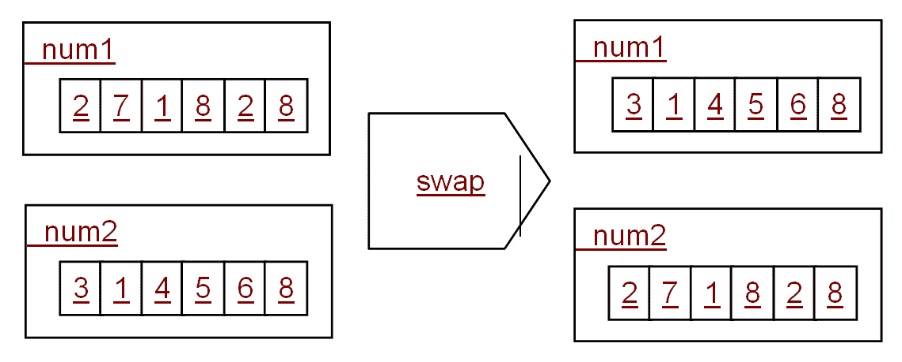

# 使用标准库容器

标准库提供了几种类型的容器；每个都是通过模板类提供的，以便容器的行为可以用于任何类型的项目。有顺序容器的类，其中容器中项目的顺序取决于插入容器中的项目的顺序。还有排序和未排序的关联容器，它们将值与键关联起来，随后使用键访问该值。

虽然它们本身不是容器，在本章中我们还将介绍两个相关的类：`pair`将两个值链接在一个对象中，`tuple`可以在一个对象中保存一个或多个值。

# 使用对和元组

在许多情况下，您会希望将两个项目关联在一起；例如，关联容器允许您创建一种数组类型，其中除了数字以外的项目被用作索引。`<utility>`头文件包含一个名为`pair`的模板类，它有两个名为`first`和`second`的数据成员。

```cpp
    template <typename T1, typename T2> 
    struct pair 
    { 
        T1 first; 
        T2 second; 
        // other members 
    };
```

由于该类是模板化的，这意味着您可以关联任何项目，包括指针或引用。访问成员很简单，因为它们是公共的。您还可以使用`get`模板化函数，因此对于`pair`对象`p`，您可以调用`get<0>(p)`而不是`p.first`。该类还具有复制构造函数，因此您可以从另一个对象创建对象，并且移动构造函数。还有一个名为`make_pair`的函数，它将从参数中推断出成员的类型：

```cpp
    auto name_age = make_pair("Richard", 52);
```

要小心，因为编译器将使用它认为最合适的类型；在这种情况下，创建的`pair`对象将是`pair<const char*，int>`，但如果您希望`first`项目是一个`string`，使用构造函数会更简单。您可以比较`pair`对象；比较是在第一个成员上执行的，只有在它们相等时才会比较第二个：

```cpp
    pair <int, int> a(1, 1); 
    pair <int, int> a(1, 2); 
    cout << boolalpha; 
    cout << a << " < " << b << " " << (a < b) << endl;
```

参数可以是引用：

```cpp
    int i1 = 0, i2 = 0; 
    pair<int&, int&> p(i1, i2); 
    ++p.first; // changes i1
```

`make_pair`函数将从参数中推断出类型。编译器无法区分变量和对变量的引用。在 C++11 中，您可以使用`ref`函数（在`<functional>`中）指定`pair`将用于引用：

```cpp
    auto p2 = make_pair(ref(i1), ref(i2)); 
    ++p2.first; // changes i1
```

如果要从函数返回两个值，可以通过引用传递的参数来实现，但代码的可读性较差，因为您期望通过函数的返回而不是通过其参数来获得返回值。`pair`类允许您在一个对象中返回两个值。一个例子是`<algorithm>`中的`minmax`函数。这返回一个包含参数的`pair`对象，按最小值的顺序排列，并且有一个重载，您可以提供一个谓词对象，如果不应使用默认操作符`<`。以下将打印`{10,20}`：

```cpp
    auto p = minmax(20,10);  
    cout << "{" << p.first << "," << p.second << "}" << endl;
```

`pair`类关联两个项目。标准库提供了`tuple`类，它具有类似的功能，但由于模板是可变的，这意味着您可以具有任意数量的任何类型的参数。但是，数据成员不像`pair`中那样命名，而是通过模板化的`get`函数访问它们：

```cpp
    tuple<int, int, int> t3 { 1,2,3 }; 
    cout << "{" 
        << get<0>(t3) << "," << get<1>(t3) << "," << get<2>(t3)  
        << "}" << endl; // {1,2,3}
```

第一行创建一个包含三个`int`项目的`tuple`，并使用初始化列表进行初始化（您可以使用构造函数语法）。然后通过访问对象中的每个数据成员来将`tuple`打印到控制台，使用`get`函数的一个版本，其中模板参数指示项目的索引。请注意，索引是模板参数，因此您无法使用变量在运行时提供它。如果这是您想要做的事情，那么这清楚地表明您需要使用诸如`vector`之类的容器。

`get`函数返回一个引用，因此可以用于更改项目的值。对于一个`tuple t3`，这段代码将第一个项目更改为`42`，第二个项目更改为`99`：

```cpp
    int& tmp = get<0>(t3); 
    tmp = 42; 
    get<1>(t3) = 99;
```

您还可以使用`tie`函数一次提取所有项目：

```cpp
    int i1, i2, i3; 
    tie(i1, i2, i3) = t3; 
    cout << i1 << "," << i2 << "," << i3 << endl;
```

`tie`函数返回一个`tuple`，其中每个参数都是引用，并初始化为您传递的参数的变量。如果您这样写，以前的代码更容易理解：

```cpp
    tuple<int&, int&, int&> tr3 = tie(i1, i2, i3); 
    tr3 = t3;
```

可以从`pair`对象创建`tuple`对象，因此也可以使用`tie`函数从`pair`对象中提取值。

有一个名为`make_tuple`的辅助函数，它将推断参数的类型。与`make_pair`函数一样，您必须谨慎推断，因此浮点数将被推断为`double`，整数将是`int`。如果要使参数成为特定变量的引用，可以使用`ref`函数或`cref`函数来获得`const`引用。

只要项目数量相等且类型等效，就可以比较`tuple`对象。如果`tuple`对象具有不同数量的项目，或者一个`tuple`对象的项目类型无法转换为另一个`tuple`对象的项目类型，则编译器将拒绝编译`tuple`对象的比较。

# 容器

标准库容器允许您将相同类型的零个或多个项目组合在一起，并通过迭代器顺序访问它们。每个这样的对象都有一个`begin`方法，该方法返回一个迭代器对象到第一个项目，并且一个`end`函数，该函数返回容器中最后一个项目之后的迭代器对象。迭代器对象支持类似指针的算术运算，因此`end() - begin()`将给出容器中的项目数。所有容器类型都将实现`empty`方法来指示容器中是否没有项目，并且（除了`forward_list`）`size`方法是容器中的项目数。您可能会尝试通过容器进行迭代，就像它是一个数组一样：

```cpp
    vector<int> primes{1, 3, 5, 7, 11, 13}; 
    for (size_t idx = 0; idx < primes.size(); ++idx)  
    { 
        cout << primes[idx] << " "; 
    } 
    cout << endl;
```

问题在于并非所有容器都允许随机访问，如果决定使用另一个容器更有效，则必须更改容器的访问方式。如果要使用模板编写通用代码，这段代码也不起作用。最好使用迭代器编写以前的代码：

```cpp
    template<typename container> void print(container& items) 
    { 
        for (container::iterator it = items.begin();  
        it != items.end(); ++it) 
        { 
            cout << *it << " "; 
        } 
        cout << endl; 
    }
```

所有容器都有一个名为`iterator`的`typedef`成员，该成员给出从`begin`方法返回的迭代器的类型。迭代器对象的行为类似于指针，因此可以使用解引用运算符获取迭代器引用的项目，并使用增量运算符移动到下一个项目。

除了`vector`之外的所有容器都保证即使删除其他元素，迭代器仍然有效。如果插入项目，则只有`lists`，`forward_lists`和相关容器保证迭代器保持有效。迭代器将在以后更深入地讨论。

所有容器都必须具有一个名为`swap`的异常安全（无异常）方法，并且（有两个例外）它们必须具有*事务*语义；也就是说，操作必须成功或失败。如果操作失败，则容器的状态与调用操作之前相同。对于每个容器，在进行多元素插入时，此规则会放宽。例如，如果使用迭代器范围一次插入多个项目，并且插入失败了范围中的一个项目，则该方法将无法撤消先前的插入。

重要的是要指出，对象被复制到容器中，因此放入容器中的对象的类型必须具有复制和复制赋值运算符。此外，请注意，如果将派生类对象放入需要基类对象的容器中，则复制将切割对象，这意味着与派生类有关的任何内容都将被删除（数据成员和虚方法指针）。

# 序列容器

序列容器存储一系列项目以及它们存储的顺序，并且当您使用迭代器访问它们时，项目将按照放入容器的顺序检索。创建容器后，可以使用库函数更改排序顺序。

# 列表

顾名思义，`list`对象是由双向链表实现的，其中每个项目都有一个链接到下一个项目和上一个项目。这意味着可以快速插入项目（就像第四章中的示例所示的那样，使用单链表），但是由于在链表中，项目只能访问其前面和后面的项目，因此无法使用`[]`索引运算符进行随机访问。

该类允许您通过构造函数提供值，或者可以使用成员方法。例如，`assign`方法允许您使用初始化列表一次填充容器，或者使用迭代器将范围填充到另一个容器中。您还可以使用`push_back`或`push_front`方法插入单个项目：

```cpp
    list<int> primes{ 3,5,7 }; 
    primes.push_back(11); 
    primes.push_back(13); 
    primes.push_front(2); 
    primes.push_front(1);
```

第一行创建一个包含`3`、`5`和`7`的`list`对象，然后将`11`和`13`依次推到末尾，使得`list`包含`{3,5,7,11,13}`。然后代码将数字`2`和`1`推到前面，使得最终的`list`为`{1,2,3,5,7,11,13}`。尽管名称如此，`pop_front`和`pop_back`方法只是删除列表前面或后面的项目，但不会返回该项目。如果要获取已删除的项目，必须*首先*通过`front`或`back`方法访问该项目：

```cpp
    int last = primes.back(); // get the last item 
    primes.pop_back();        // remove it
```

`clear`方法将删除`list`中的所有项目，而`erase`方法将删除项目。有两个版本：一个带有标识单个项目的迭代器，另一个带有指示范围的两个迭代器。通过提供范围的第一个项目和范围之后的项目来指示范围。

```cpp
    auto start = primes.begin(); // 1 
    start++;                     // 2 
    auto last = start;           // 2 
    last++;                      // 3 
    last++;                      // 5 
    primes.erase(start, last);   // remove 2 and 3
```

这是迭代器和标准库容器的一般原则；迭代器通过第一个项目和最后一个项目之后的项目来指示范围。`remove`方法将删除具有指定值的所有项目：

```cpp
    list<int> planck{ 6,6,2,6,0,7,0,0,4,0 }; 
    planck.remove(6);            // {2,0,7,0,0,4,0}
```

还有一个`remove_if`方法，它接受一个谓词，只有在谓词返回`true`时才会删除项目。同样，您可以使用迭代器将项目插入到列表中，并且该项目将在指定项目之前插入：

```cpp
    list<int> planck{ 6,6,2,6,0,7,0,0,4,0 }; 
    auto it = planck.begin(); 
    ++it; 
    ++it; 
    planck.insert(it, -1); // {6,6,-1,2,6,0,7,0,0,4,0}
```

您还可以指示该项目应在该位置插入多次（如果是这样，还可以提供多少个副本），并且可以提供要在一个位置插入的多个项目。当然，如果您传递的迭代器是通过调用`begin`方法获得的，则该项目将插入到`list`的开头。通过调用`push_front`方法也可以实现相同的效果。同样，如果迭代器是通过调用`end`方法获得的，则该项目将插入到`list`的末尾，这与调用`push_back`相同。

当您调用`insert`方法时，您提供一个对象，该对象将被复制到`list`中或移动到`list`中（通过右值语义）。该类还提供了几种**emplace**方法（`emplace`，`emplace_front`和`emplace_back`），它们将根据您提供的数据构造一个新对象，并将该对象插入`list`中。例如，如果您有一个可以从两个`double`值创建的`point`类，您可以将构造的`point`对象或通过提供两个`double`值`emplace`一个`point`对象：

```cpp
    struct point 
    { 
        double x = 0, y = 0; 
        point(double _x, double _y) : x(_x), y(_y) {} 
    }; 

    list<point> points; 
    point p(1.0, 1.0); 
    points.push_back(p); 
    points.emplace_back(2.0, 2.0);
```

创建`list`后，可以使用成员函数对其进行操作。`swap`方法接受一个合适的`list`对象作为参数，它将参数中的项目移动到当前对象中，并将当前`list`中的项目移动到参数中。由于`list`对象是使用链表实现的，因此此操作很快。

```cpp
    list<int> num1 { 2,7,1,8,2,8 }; // digits of Euler's number 
    list<int> num2 { 3,1,4,5,6,8 }; // digits of pi 
    num1.swap(num2);
```

在此之后，代码`num1`将包含`{3,1,4,5,6,8}`，而`num2`将包含`{2,7,1,8,2,8}`，如下所示：



`list`将按照插入到容器中的顺序保存项目；但是，您可以通过调用`sort`方法对它们进行排序，默认情况下，将使用`list`容器中项目的`<`运算符按升序排序项目。您还可以传递一个函数对象进行比较操作。排序后，您可以通过调用`reverse`方法反转项目的顺序。两个排序的列表可以合并，这涉及从参数列表中获取项目并将它们插入到调用列表中，以此顺序：

```cpp
    list<int> num1 { 2,7,1,8,2,8 }; // digits of Euler's number 
    list<int> num2 { 3,1,4,5,6,8 }; // digits of pi 
    num1.sort();                    // {1,2,2,7,8,8} 
    num2.sort();                    // {1,3,4,5,6,8} 
    num1.merge(num2);               // {1,1,2,2,3,4,5,6,7,8,8,8}
```

合并两个列表可能会导致重复项，可以通过调用`unique`方法来删除这些重复项：

```cpp
    num1.unique(); // {1,2,3,4,5,6,7,8}
```

# Forward list

正如其名称所示，`forward_list`类类似于`list`类，但它只允许从列表的前面插入和删除项目。这也意味着与该类一起使用的迭代器只能递增；编译器将拒绝允许您递减这样的迭代器。该类具有`list`方法的子集，因此它具有`push_front`，`pop_front`和`emplace_front`方法，但没有相应的`_back`方法。它还实现了一些其他方法，因为列表项只能以前向方式访问，这意味着插入将发生在现有项目之后，因此该类实现了`insert_after`和`emplace_after`。

同样，您可以从列表的开头删除项目（`pop_front`）或在指定项目之后删除项目（`erase_after`），或者告诉类在列表中以前向方式迭代并删除具有特定值的项目（`remove`和`remove_if`）：

```cpp
    forward_list<int> euler { 2,7,1,8,2,8 }; 
    euler.push_front(-1);       // { -1,2,7,1,8,2,8 } 
    auto it = euler.begin();    // iterator points to -1 
    euler.insert_after(it, -2); // { -1,-2,2,7,1,8,2,8 } 
    euler.pop_front();          // { -2,2,7,1,8,2,8 } 
    euler.remove_if([](int i){return i < 0;}); 
                                // { 2,7,1,8,2,8 }
```

在前面的代码中，`euler`用欧拉数的数字初始化，并将值`-1`推到前面。接下来，获得一个指向容器中第一个值的迭代器；也就是说，指向值`-1`的位置。在迭代器的位置之后插入值`-2`；也就是说，在值`-1`之后插入值`-2`。最后两行显示了如何删除项目；`pop_front`删除容器前面的项目，`remove_if`将删除满足谓词的项目（在本例中，当项目小于零时）。

# Vector

`vector`类具有动态数组的行为；也就是说，可以对项目进行索引随机访问，并且随着插入更多项目，容器将增长。您可以使用初始化列表创建`vector`对象，并使用指定数量的项目的副本。您还可以通过传递指示容器中项目范围的迭代器来基于另一个容器中的值创建`vector`。您可以通过提供容量作为构造函数参数来创建具有预定大小的向量，并且将在容器中创建指定数量的默认项目。如果在以后的阶段，您需要指定容器大小，可以调用`reserve`方法指定最小大小或`resize`方法，这可能意味着删除多余的项目或根据现有`vector`对象是大于还是小于请求的大小来创建新项目。

当您向`vector`容器插入项目并且没有分配足够的内存时，容器将分配足够的内存。这将涉及分配新内存，将现有项目复制到新内存中，创建新项目，最后销毁旧副本的项目并释放旧内存。显然，如果您知道项目的数量，并且知道`vector`容器没有足够的空间来容纳它们而需要新的分配，您应该通过调用`reserve`方法指示需要多少空间。

除了构造函数之外，插入项目是很简单的。你可以使用`push_back`在末尾插入一个项目（假设不需要分配，这是一个快速操作），还有`pop_back`来移除最后一个项目。你还可以使用`assign`方法来清空整个容器并插入指定的项目（多个相同项目，项目的初始化列表，或者使用迭代器指定的另一个容器中的项目）。与`list`对象一样，你可以清空整个`vector`，在指定位置擦除项目，或者在指定位置插入项目。然而，没有等效的`remove`方法来移除具有特定值的项目。

使用`vector`类的主要原因是使用`at`方法或`[]`索引运算符进行随机访问：

```cpp
   vector<int> distrib(10); // ten intervals 
   for (int count = 0; count < 1000; ++count) 
   { 
      int val = rand() % 10; 
      ++distrib[val]; 
   } 
   for (int i : distrib) cout << i << endl;
```

第一行创建了一个具有十个项目的`vector`，然后在循环中每次调用 C 运行时函数`rand`一千次，以获得 0 到 32767 之间的伪随机数。使用模运算来获得大约在 0 到 9 之间的随机数。然后将这个随机数用作`distrib`对象的索引，以选择指定的项目，然后递增。最后，分布被打印出来，正如你所期望的那样，这给出了每个项目大约 100 的值。

这段代码依赖于`[]`运算符返回对项目的引用，这就是为什么可以以这种方式递增项目。可以使用`[]`运算符读取和写入容器中的项目。容器通过`begin`和`end`方法提供迭代器访问，以及（因为它们被容器适配器所需）`front`和`back`方法。

`vector`对象可以容纳具有复制构造函数和赋值运算符的任何类型，这意味着所有内置类型。就目前而言，`bool`项目的`vector`将是一种浪费内存，因为布尔值可以存储为单个位，并且编译器将把`bool`视为整数（32 位）。标准库为`bool`专门化了`vector`类，以更有效地存储项目。然而，尽管这个类乍一看像是一个好主意，问题在于，由于容器将布尔值存储为位，这意味着`[]`运算符不会返回对`bool`的引用（而是返回一个像`bool`一样行为的对象）。

如果你想保存布尔值并对其进行操作，那么只要在编译时知道有多少项目，`bitset`类可能是一个更好的选择。

# Deque

名称`deque`意味着*双端队列*，这意味着它可以从两端增长，尽管你可以在中间插入项目，但这样做的代价更高。作为队列，这意味着项目是有序的，但是，因为项目可以从两端放入队列，所以顺序不一定是你将项目放入容器的顺序。

`deque`的接口类似于`vector`，因此你可以使用`at`函数和`[]`运算符进行迭代器访问和随机访问。与`vector`一样，你可以使用`push_back`、`pop_back`和`back`方法从`deque`容器的末尾访问项目，但与`vector`不同的是，你还可以使用`push_front`、`pop_front`和`front`方法访问`deque`容器的前端。虽然`deque`类有方法允许你在容器内插入和擦除项目，并且`resize`，但这些都是昂贵的操作，如果你需要使用它们，那么你应该重新考虑使用这种容器类型。此外，`deque`类没有方法来预先分配内存，因此，当你向这个容器添加项目时，可能会导致内存分配。

# 关联容器

对于类似 C 的`array`或`vector`，每个项目都与其数字索引相关联。在`vector`部分的一个示例中，索引提供了分布的十分位数，并且方便地，分布被分割成了十个数据的十分位数。

关联容器允许您提供非数字索引；这些是键，您可以将值与它们关联起来。当您将键值对插入容器时，它们将被排序，以便容器随后可以通过其键有效地访问值。通常，这个顺序对您来说不重要，因为您不会使用容器按顺序访问项目，而是会通过它们的键访问值。典型的实现将使用二叉树或哈希表，这意味着根据其键查找项目是一个快速操作。

对于有序容器，比如`map`，将在键和容器中现有键之间使用`<`（小于谓词）进行比较。默认谓词意味着比较键，如果是智能指针，那么将比较并用于排序的是智能指针对象，而不是它们包装的对象。在这种情况下，您将需要编写自己的谓词来执行适当的比较，并将其作为模板参数传递。

这意味着插入或删除项目通常是昂贵的，并且键被视为不可变，因此您不能为项目更改它。对于所有关联容器，没有删除方法，但有擦除方法。但是，对于那些保持项目排序的容器，擦除项目可能会影响性能。

有几种类型的关联容器，主要区别在于它们如何处理重复键以及发生的排序级别。`map`类具有按唯一键排序的键值对，因此不允许重复键。如果要允许重复键，则可以使用`multimap`类。`set`类本质上是一个键与值相同的映射，再次，不允许重复。`multiset`类允许重复。

在关联类中，键与值相同似乎有些奇怪，但将类包含在本节的原因是因为，与`map`类似，`set`类具有类似的接口来查找值。与`map`类似，`set`类在查找项目时速度很快。

# 地图和多地图

`map`容器存储两个不同的项目，一个键和一个值，并根据键维护项目的排序顺序。排序的`map`意味着快速定位项目。该类具有与其他容器相同的接口来添加项目：您可以通过构造函数将它们放入容器中，或者可以使用成员方法`insert`和`emplace`。您还可以通过迭代器访问项目。当然，迭代器提供对单个值的访问，因此对于`map`来说，这将是一个具有键和值的`pair`对象。

```cpp
    map<string, int> people; 
    people.emplace("Washington", 1789); 
    people.emplace("Adams", 1797); 
    people.emplace("Jefferson", 1801); 
    people.emplace("Madison", 1809); 
    people.emplace("Monroe", 1817); 

    auto it = people.begin(); 
    pair<string, int> first_item = *it; 
    cout << first_item.first << " " << first_item.second << endl;
```

对`map`调用`emplace`将项目放入`map`中，其中键是`string`（总统的姓名），值是`int`（总统开始任期的年份）。然后，代码获取容器中第一个项目的迭代器，并通过解引用迭代器访问项目以给出`pair`对象。由于项目按排序顺序存储在`map`中，第一个项目将设置为`"Adams"`。您还可以将项目作为`pair`对象插入，无论是作为对象还是通过对另一个容器中的`pair`对象的迭代器使用`insert`方法。

大多数`emplace`和`insert`方法将返回以下形式的`pair`对象，其中`iterator`类型与`map`相关：

```cpp
    pair<iterator, bool>
```

您可以使用此对象来测试两件事。首先，`bool`指示插入是否成功（如果具有相同键的项目已经在容器中，则插入将失败）。其次，`pair`的`iterator`部分要么指示新项目的位置，要么指示不会被替换的现有项目的位置（并且将导致插入失败）。

*失败*取决于*等价*而不是*相等*。如果存在一个具有等价于您要插入的项目的键的项目，则插入将失败。等价的定义取决于与`map`对象一起使用的比较器谓词。因此，如果`map`使用谓词`comp`，则两个项目`a`和`b`之间的等价性是通过测试`!comp(a,b) && !comp(b,a)`来确定的。这与测试`(a==b)`不同。

假设先前的`map`对象，您可以这样做：

```cpp
    auto result = people.emplace("Adams", 1825); 
    if (!result.second) 
       cout << (*result.first).first << " already in map" << endl;
```

`result`变量中的第二个项目用于测试插入是否成功，如果不成功，则第一个项目是指向`pair<string,int>`的迭代器，这是现有项目，代码对迭代器进行解引用以获取`pair`对象，然后打印出第一个项目，即键（在本例中是人的姓名）。

如果您知道项目应该放在`map`中的位置，则可以调用`emplace_hint`：

```cpp
    auto result = people.emplace("Monroe", 1817); 
    people.emplace_hint(result.first, "Polk", 1845);
```

在这里，我们知道`Polk`在`Monroe`之后，所以我们可以将迭代器传递给`Monroe`作为提示。该类通过迭代器提供对项目的访问，因此您可以使用基于迭代器访问的范围`for`：

```cpp
    for (pair<string, int> p : people) 
    { 
        cout << p.first << " " << p.second << endl; 
    }
```

此外，还可以使用`at`方法和`[]`运算符访问单个项目。在两种情况下，如果找到具有提供的键的项目，则返回对项目值的引用。`at`方法和`[]`运算符在指定键没有项目的情况下的行为不同。如果键不存在，则`at`方法将抛出异常；如果`[]`运算符找不到指定的键，则将使用该键创建一个新项目，并调用值类型的默认构造函数。如果键存在，`[]`运算符将返回对该值的引用，因此您可以编写如下代码：

```cpp
    people["Adams"] = 1825; 
    people["Jackson"] = 1829;
```

第二行的行为与您期望的一样：不会有一个键为`Jackson`的项目，所以`map`将创建一个具有该键的项目，通过调用值类型（`int`）的默认构造函数进行初始化（因此值被初始化为零），然后返回对该值的引用，该引用被赋予`1829`的值。然而，第一行将查找`Adams`，看到有一个项目，并返回对其值的引用，然后将其赋予`1825`的值。没有迹象表明项目的值已更改，而不是插入了一个新项目。在某些情况下，您可能希望出现这种行为，但这并不是这段代码的意图，显然，需要允许重复键（例如`multimap`）的关联容器。此外，在这两种情况下，都会搜索键，返回引用，然后执行赋值。请注意，虽然以这种方式插入项目是有效的，但在容器中放置一个新的键值对更有效，因为您不需要进行额外的赋值。

填充`map`后，可以使用以下方法搜索值：

+   `at`方法，传递一个键并返回该键的值的引用

+   `[]`运算符，当传递一个键时，返回该键的值的引用

+   `find`函数将使用模板中指定的谓词（与稍后提到的全局`find`函数不同），并将为您提供对整个项目的迭代器作为`pair`对象

+   `begin`方法将为您提供对第一个项目的迭代器，`end`方法将为您提供对最后一个项目之后的迭代器

+   `lower_bound`方法返回一个迭代器，指向具有*等于或大于*您传递的键的键的项目。

+   `upper_bound`方法返回一个迭代器，指向地图中第一个具有*大于*提供的键的键的项目

+   `equal_range`方法返回`pair`对象中的下限和上限值

# 集合和多重集

集合的行为就像是地图，但键与值相同；例如，以下内容：

```cpp
    set<string> people{ 
       "Washington","Adams", "Jefferson","Madison","Monroe",  
       "Adams", "Van Buren","Harrison","Tyler","Polk"}; 
    for (string s : people) cout << s << endl;
```

这将按字母顺序打印出*九*个人，因为有两个名为`Adams`的项目，而`set`类将拒绝重复。当项目插入到集合中时，它将被排序，而在这种情况下，顺序是由比较两个`string`对象的词典顺序决定的。如果要允许重复，以便将十个人放入容器中，那么应该使用`multiset`。

与`map`一样，您不能更改容器中项目的键，因为键用于确定排序。对于`set`，键与值相同，因此这意味着您根本不能更改项目。如果意图是执行查找，那么最好使用排序的`vector`。`set`的内存分配开销比`vector`更大。潜在地，对`set`容器的查找将比对`vector`容器更快，如果搜索是顺序的，但如果使用`binary_search`调用（稍后在*排序项目*部分中解释），它可能比关联容器更快。

`set`类的接口是`map`类的受限版本，因此您可以在容器中`insert`和`emplace`项目，将其分配给另一个容器中的值，并具有迭代器访问（`begin`和`end`方法）。

由于没有明确的键，这意味着`find`方法寻找的是值，而不是键（类似的还有边界方法；例如`equal_range`）。没有`at`方法，也没有`[]`运算符。

# 无序容器

`map`和`set`类允许您快速查找对象，这是由这些类按排序顺序保存项目所实现的。如果您遍历项目（从`begin`到`end`），那么您将按排序顺序获取这些项目。如果您想要在键值范围内选择对象，可以调用`lower_bound`和`upper_bound`方法，以获取适当键范围的迭代器。这是这些关联容器的两个重要特性：查找和排序。在某些情况下，值的实际顺序并不重要，您想要的是高效的查找行为。在这种情况下，您可以使用`map`和`set`类的`unordered_`版本。由于顺序不重要，这些是使用哈希表实现的。

# 特定目的的容器

到目前为止描述的容器是灵活的，可以用于各种目的。标准库提供了具有特定目的的类，但由于它们是通过包装其他类实现的，因此它们被称为**容器适配器**。例如，`deque`对象可以通过将对象推入`deque`的后端（使用`push_back`）并使用`front`方法从队列的前端访问对象（并使用`pop_front`将其移除）来用作**先进先出**（**FIFO**）队列。标准库实现了一个名为`queue`的容器适配器，它具有这种 FIFO 行为，并且基于`deque`类。

```cpp
    queue<int> primes; 
    primes.push(1); 
    primes.push(2); 
    primes.push(3); 
    primes.push(5); 
    primes.push(7); 
    primes.push(11); 
    while (primes.size() > 0) 
    { 
        cout << primes.front() << ","; 
        primes.pop(); 
    } 
    cout << endl; // prints 1,2,3,5,7,11
```

您可以使用`push`方法将项目推入队列，并使用`pop`方法将其移除，并使用`front`方法访问下一个项目。可以通过此适配器包装的标准库容器必须实现`push_back`、`pop_front`和`front`方法。也就是说，项目被放入容器的一端，并从另一端访问（和移除）。

**后进先出**（**LIFO**）容器将项目放入并从同一端访问（和移除）项目。同样，可以使用`deque`对象来实现这种行为，通过使用`push_back`推入项目，使用`front`访问项目，并使用`pop_back`方法删除它们。标准库提供了一个适配器类叫做`stack`来提供这种行为。它有一个名为`push`的方法将项目推入容器，一个名为`pop`的方法来移除项目，但是，奇怪的是，您使用`top`方法来访问下一个项目，尽管它是使用包装容器的`back`方法实现的。

适配器类`priority_queue`，尽管名字是这样的，但是它的使用方式类似于`stack`容器；也就是说，使用`top`方法来访问项目。容器确保当一个项目被推入时，队列的顶部始终是具有最高优先级的项目。谓词（默认为`<`）用于对队列中的项目进行排序。例如，我们可以有一个聚合类型，它具有任务的名称和您必须完成任务的优先级与其他任务相比：

```cpp
    struct task 
    { 
    string name; 
    int priority; 
    task(const string& n, int p) : name(n), priority(p) {} 
    bool operator <(const task& rhs) const { 
        return this->priority < rhs.priority; 
        } 
    };
```

聚合类型很简单；它有两个数据成员，由构造函数初始化。为了能够对任务进行排序，我们需要能够比较两个任务对象。一个选项（前面提到过）是定义一个单独的谓词类。在这个例子中，我们使用默认的谓词，文档中说的是`less<task>`，它根据`<`运算符比较项目。为了能够使用默认的谓词，我们为`task`类定义了`<`运算符。现在我们可以将任务添加到`priority_queue`容器中：

```cpp
    priority_queue<task> to_do; 
    to_do.push(task("tidy desk", 1)); 
    to_do.push(task("check in code", 10)); 
    to_do.push(task("write spec", 8)); 
    to_do.push(task("strategy meeting", 8)); 

    while (to_do.size() > 0) 
    { 
        cout << to_do.top().name << " " << to_do.top().priority << endl; 
        to_do.pop(); 
    }
```

这段代码的结果是：

```cpp
    check in code 10
write spec 8
strategy meeting 8
tidy desk 1
```

队列根据`priority`数据项对任务进行了排序，`top`和`pop`方法的组合调用按优先级顺序读取项目并将其从队列中移除。具有相同优先级的项目按照它们被推入的顺序放入队列。

# 使用迭代器

到目前为止，在本章中，我们已经指出容器通过迭代器访问项目。这意味着迭代器只是指针，这是有意为之的，因为迭代器的行为类似于指针。但是，它们通常是迭代器类的对象（请参阅`<iterator>`头文件）。所有迭代器都具有以下行为：

| **运算符** | **行为** |
| --- | --- |
| * | 访问当前位置的元素 |
| ++ | 向前移动到下一个元素（通常您将使用前缀运算符）（只有在迭代器允许向前移动时才会出现） |
| -- | 向后移动到上一个元素（通常您将使用前缀运算符）（只有在迭代器允许向后移动时才会出现） |
| `==` 和 `!=` | 比较两个迭代器是否处于相同位置 |
| = | 分配一个迭代器 |

与 C++指针不同，它假设数据在内存中是连续的，迭代器可以用于更复杂的数据结构，例如链表，其中项目可能不是连续的。无论底层存储机制如何，操作符`++`和`--`都能正常工作。

`<iterator>`头文件声明了`next`全局函数，它将增加一个迭代器，以及`advance`函数，它将按指定数量的位置更改迭代器（向前或向后，取决于参数是否为负数以及迭代器允许的方向）。还有一个`prev`函数，用于将迭代器减少一个或多个位置。`distance`函数可用于确定两个迭代器之间有多少项。

所有容器都有一个`begin`方法，它返回第一个项目的迭代器，以及一个`end`方法，它返回最后一个项目*之后*的迭代器。这意味着您可以通过调用`begin`并递增迭代器直到它具有从`end`返回的值来遍历容器中的所有项目。迭代器上的`*`运算符可以访问容器中的元素，如果迭代器是可读写的（如果从 begin 方法返回的话），则意味着该项目可以被更改。容器还有`cbegin`和`cend`方法，它们将返回一个只读访问元素的常量迭代器：

```cpp
    vector<int> primes { 1,2,3,5,7,11,13 }; 
    const auto it = primes.begin(); // const has no effect 
    *it = 42; 
    auto cit = primes.cbegin(); 
    *cit = 1;                       // will not compile
```

这里`const`没有影响，因为变量是`auto`，类型是从用于初始化变量的项目推断出来的。`cbegin`方法被定义为返回一个`const`迭代器，因此您不能更改它所引用的项目。

`begin`和`cbegin`方法返回**正向迭代器**，因此`++`运算符将迭代器向前移动。容器还可以支持**反向迭代器**，其中`rbegin`是容器中的最后一个项目（即`end`返回的位置之前的项目），`rend`是第一个项目之前的位置。（还有`crbegin`和`crend`，它们返回`const`迭代器。）重要的是要意识到，反向迭代器的`++`运算符向*后*移动，如下例所示：

```cpp
    vector<int> primes { 1,2,3,5,7,11,13 }; 
    auto it = primes.rbegin(); 
    while (it != primes.rend()) 
    { 
        cout << *it++ << " "; 
    } 
    cout << endl; // prints 13,11,7,5,4,3,2,1
```

`++`运算符根据应用于的迭代器类型来递增迭代器。重要的是要注意，`!=`运算符在这里用于确定循环是否应该结束，因为`!=`运算符将在所有迭代器上定义。

在这里，使用`auto`关键字忽略了迭代器类型。实际上，所有容器都将为它们使用的所有迭代器类型定义`typedef`，因此在前面的情况下，我们可以使用以下内容：

```cpp
    vector<int> primes { 1,2,3,5,7,11,13 }; 
    vector<int>::iterator it = primes.begin();
```

允许正向迭代的容器将具有`iterator`和`const_iterator`的`typedef`，而允许反向迭代的容器将具有`reverse_iterator`和`const_reverse_iterator`的`typedef`。为了完整起见，容器还将为返回指向元素的指针的方法定义`pointer`和`const_pointer`的`typedef`，以及为返回元素引用的方法定义`reference`和`const_reference`的`typedef`。这些类型定义使您能够编写通用代码，其中您不知道容器中的类型，但代码仍然能够声明正确类型的变量。

尽管它们看起来像指针，但迭代器通常由类实现。这些类型可能只允许单向迭代：正向迭代器只有`++`运算符，反向迭代器有`-`运算符，或者类型可以允许双向迭代（双向迭代器），因此它们实现了`++`和`--`运算符。例如，`list`、`set`、`multiset`、`map`和`multimap`类上的迭代器是双向的。`vector`、`deque`、`array`和`string`类具有允许随机访问的迭代器，因此这些迭代器类型具有与双向迭代器相同的行为，但也具有指针的算术，因此它们可以一次更改多个项目位置。

# 输入和输出迭代器

顾名思义，输入迭代器只能向前移动并且具有读取访问权限，输出迭代器只能向前移动但具有写入访问权限。这些迭代器没有随机访问权限，也不允许向后移动。例如，输出流可以与输出迭代器一起使用：你将解引用的迭代器分配给数据项，以便将该数据项写入流中。同样，输入流可以有一个输入迭代器，你解引用迭代器以访问流中的下一个项。这种行为意味着对于输出迭代器，解引用运算符（`*`）的唯一有效用法是在赋值的左侧。检查迭代器的值是否等于`!=`是没有意义的，你也不能检查通过输出迭代器分配值是否成功。

例如，`transform`函数接受三个迭代器和一个函数。前两个迭代器是输入迭代器，并指示要通过函数转换的项的范围。结果将放在一系列项中（与输入迭代器的范围大小相同），第一个由第三个迭代器指示，这是一个输出迭代器。一种方法是这样的：

```cpp
    vector<int> data { 1,2,3,4,5 }; 
    vector<int> results; 
    results.resize(data.size()); 
    transform( 
       data.begin(), data.end(),  
       results.begin(), 
       [](int x){ return x*x; } );
```

这里的`begin`和`end`方法返回`data`容器上的迭代器，这些迭代器可以安全地用作输入迭代器。`results`容器上的`begin`方法只能用作输出迭代器，只要容器有足够的分配项，这在这段代码中是成立的，因为它们已经被`resize`分配了。然后函数将通过将输入项传递给最后一个参数中给定的 lambda 函数（它只是返回值的平方）来转换每个输入项。重要的是要重新评估这里发生了什么；`transform`函数的第三个参数是一个输出迭代器，这意味着你应该期望函数通过这个迭代器写入值。

这段代码可以工作，但它需要额外的步骤来分配空间，并且你需要额外分配默认对象到容器中，只是为了覆盖它们。还要注意输出迭代器不一定要指向另一个容器。只要它指向可以写入的范围，它可以指向同一个容器：

```cpp
    vector<int> vec{ 1,2,3,4,5 }; 
    vec.resize(vec.size() * 2); 
    transform(vec.begin(), vec.begin() + 5, 
       vec.begin() + 5, [](int i) { return i*i; });
```

`vec`容器被调整大小，以便为结果腾出空间。要转换的值的范围是从第一个项到第五个项（`vec.begin() + 5`是下一个项），写入转换值的位置是第六到第十个项。如果你打印出向量，你会得到`{1,2,3,4,5,1,4,9,16,25}`。

另一种输出迭代器是插入器。`back_inserter`用于具有`push_back`的容器，`front_inserter`用于具有`push_front`的容器。顾名思义，插入器在容器上调用`insert`方法。例如，你可以这样使用`back_inserter`：

```cpp
    vector<int> data { 1,2,3,4,5 }; 
    vector<int> results; 
    transform( 
       data.begin(), data.end(),  
       back_inserter(results), 
       [](int x){ return x*x; } ); // 1,4,9,16,25
```

转换的结果被插入到`results`容器中，使用从`back_inserter`类创建的临时对象。使用`back_inserter`对象可以确保当`transform`函数通过迭代器写入时，该项被*插入*到包装容器中，使用`push_back`。请注意，结果容器应该与源容器不同。

如果你想要逆序的值，那么如果容器支持`push_front`（例如`deque`），那么你可以使用`front_inserter`。`vector`类没有`push_front`方法，但它有反向迭代器，所以你可以使用它们代替：

```cpp
    vector<int> data { 1,2,3,4,5 }; 
    vector<int> results; 
    transform( 
 data.rbegin(), data.rend(), 
       back_inserter(results), 
       [](int x){ return x*x; } ); // 25,16,9,4,1
```

要颠倒结果的顺序，你只需要将`begin`改为`rbegin`，将`end`改为`rend`。

# 流迭代器

这些是`<iterators>`中的适配器类，可以用来从输入流中读取项或将项写入输出流。例如，到目前为止，我们已经通过范围`for`循环使用迭代器来打印容器的内容：

```cpp
    vector<int> data { 1,2,3,4,5 }; 
    for (int i : data) cout << i << " "; 
    cout << endl;
```

相反，你可以创建一个基于`cout`的输出流迭代器，这样`int`值将通过这个迭代器使用流运算符`<<`写入`cout`流。要打印出一个`int`值的容器，你只需将容器复制到输出迭代器：

```cpp
    vector<int> data { 1,2,3,4,5 }; 
    ostream_iterator<int> my_out(cout, " "); 
    copy(data.cbegin(), data.cend(), my_out); 
    cout << endl;
```

`ostream_iterator`类的第一个参数是它将适配的输出流，可选的第二个参数是在每个项目之间使用的分隔符字符串。`copy`函数（在`<algorithm>`中）将复制由输入迭代器指示的范围中的项目，作为前两个参数传递，到作为最后一个参数传递的输出迭代器中。

类似地，还有一个`istream_iterator`类，它将包装一个输入流对象并提供一个输入迭代器。这个类将使用流的`>>`运算符来提取指定类型的对象，这些对象可以通过流迭代器读取。然而，从流中读取数据比写入更复杂，因为必须检测迭代器读取输入流时是否没有更多的数据（文件结束的情况）。

`istream_iterator`类有两个构造函数。一个构造函数有一个参数，即要读取的输入流，另一个构造函数，即默认构造函数，没有参数，用于创建一个**流结束迭代器**。流结束迭代器用于指示流中没有更多数据：

```cpp
    vector<int> data; 
    copy( 
       istream_iterator<int>(cin), istream_iterator<int>(), 
       back_inserter(data)); 

    ostream_iterator<int> my_out(cout, " "); 
    copy(data.cbegin(), data.cend(), my_out); 
    cout << endl;
```

第一次调用`copy`提供了两个输入迭代器作为前两个参数，以及一个输出迭代器。该函数将数据从第一个迭代器复制到最后一个参数中的输出迭代器。由于最后一个参数是由`back_inserter`创建的，这意味着项目将插入到`vector`对象中。输入迭代器基于输入流（`cin`），因此`copy`函数将从控制台读取`int`值（每个值之间用空格分隔），直到没有更多可用的值（例如，如果按下*CTRL* + *Z*结束流，或者输入一个非数字项目）。由于可以使用迭代器给定的值范围初始化容器，因此可以使用`istream_iterator`作为构造函数参数：

```cpp
    vector<int> data {  
       istream_iterator<int>(cin), istream_iterator<int>() };
```

这里使用初始化列表语法调用构造函数；如果使用括号，编译器将解释为函数的声明！

正如前面所指出的，`istream_iterator`将使用流的`>>`运算符从流中读取指定类型的对象，而这个运算符使用空格来分隔项目（因此它只会忽略所有空格）。如果你读取一个`string`对象的容器，那么你在控制台上输入的每个单词都将成为容器中的一个项目。`string`是一个字符的容器，也可以使用迭代器进行初始化，因此你可以尝试使用`istream_iterator`从控制台输入数据到一个`string`中：

```cpp
    string data { 
            istream_iterator<char>(cin), istream_iterator<char>() };
```

在这种情况下，流是`cin`，但它也可以很容易地是一个指向文件的`ifstream`对象。问题在于`cin`对象将剥离掉空格，因此`string`对象将包含你输入的除了空格之外的所有内容，因此不会有空格和换行符。

这个问题是由`istream_iterator`使用流的`>>`运算符引起的，只能通过使用另一个类`istreambuf_iterator`来避免：

```cpp
    string data { 
        istreambuf_iterator<char>(cin), istreambuf_iterator<char>() };
```

这个类从流中读取每个字符，并将每个字符复制到容器中，而不进行`>>`的处理。

# 使用 C 标准库的迭代器

C 标准库通常需要指向数据的指针。例如，当 C 函数需要一个字符串时，它将需要一个指向包含字符串的字符数组的`const char*`指针。C++标准库已经被设计成允许你使用它的类与 C 标准库一起使用；事实上，C 标准库是 C++标准库的一部分。对于`string`对象，解决方法很简单：当你需要一个`const char*`指针时，你只需在`string`对象上调用`c_str`方法。

存储数据在连续内存中的容器（`array`，`string`或`data`）具有一个名为`data`的方法，该方法允许以 C 数组的形式访问容器的数据。此外，这些容器具有`[]`操作符访问其数据，因此您也可以将第一项的地址视为`&container[0]`（其中`container`是容器对象），就像您对 C 数组一样。但是，如果容器为空，这个地址将是无效的，因此在使用之前，您应该调用`empty`方法。这些容器中的项目数量是从`size`方法返回的，因此对于任何需要指向 C 数组开头和大小的指针的 C 函数，您可以使用`&container[0]`和`size`方法的值来调用它。

您可能会尝试通过调用其`begin`函数来获取具有连续内存的容器的开头，但这将返回一个迭代器（通常是一个对象）。因此，要获得指向第一个项目的 C 指针，您应该调用`&*begin`；也就是说，解引用从`begin`函数返回的迭代器以获取第一个项目，然后使用地址运算符获取其地址。坦率地说，`&container[0]`更简单，更易读。

如果容器不将其数据存储在连续内存中（例如`deque`和`list`），那么您可以通过将数据复制到临时向量中来获得 C 指针。

```cpp
    list<int> data; 
    // do some calculations and fill the list 
    vector<int> temp(data.begin(), data.end()); 
    size_t size = temp.size(); // can pass size to a C function 
    int *p = &temp[0];         // can pass p to a C function
```

在这种情况下，我们选择使用`list`，并且该例程将操作`data`对象。稍后在例程中，这些值将被传递给 C 函数，因此`list`用于初始化`vector`对象，并且这些值是从`vector`中获取的。

# 算法

标准库在`<algorithm>`头文件中具有大量的通用函数集。通用意味着它们通过迭代器访问数据，而不知道迭代器指的是什么，这意味着您可以编写通用代码以适用于任何适当的容器。但是，如果您知道容器类型，并且该容器具有执行相同操作的成员方法，那么应该使用该成员。

# 项目的迭代

`<algorithm>`中的许多例程将接受范围并迭代执行某些操作。正如名称所示，`fill`函数将使用值填充容器。该函数需要两个迭代器来指定范围和一个将放置在容器每个位置的值：

```cpp
    vector<int> vec; 
    vec.resize(5); 
    fill(vec.begin(), vec.end(), 42);
```

由于`fill`函数将用于范围，这意味着您必须传递迭代器到已经具有值的容器，这就是为什么此代码调用`resize`方法的原因。此代码将将值`42`放入容器的每个项目中，因此当它完成时，`vector`包含`{42,42,42,42,42}`。此函数的另一个版本称为`fill_n`，它通过单个迭代器到范围的开始和范围中的项目数来指定范围。

`generate`函数类似，但是，它不是单个值，而是一个函数，可以是函数、函数对象或 lambda 表达式。调用该函数以提供容器中的每个项目，因此它没有参数，并返回由迭代器访问的类型的对象：

```cpp
    vector<int> vec(5); 
    generate(vec.begin(), vec.end(),  
        []() {static int i; return ++i; });
```

再次，您必须确保`generate`函数传递的是已经存在的范围，此代码通过将初始大小作为构造函数参数来实现这一点。在这个例子中，lambda 表达式具有一个`static`变量，每次调用时都会递增，因此这意味着在`generate`函数完成后，`vector`包含`{1,2,3,4,5}`。此函数的另一个版本称为`generate_n`，它通过单个迭代器到范围的开始和范围中的项目数来指定范围。

`for_each`函数将迭代由两个迭代器提供的范围，并对范围中的每个项目调用指定的函数。此函数必须具有与容器中项目相同类型的单个参数：

```cpp
    vector<int> vec { 1,4,9,16,25 }; 
    for_each(vec.begin(), vec.end(),  
         [](int i) { cout << i << " "; }); 
    cout << endl;
```

`for_each`函数遍历迭代器指定的所有项目（在本例中是整个范围），解引用迭代器，并将项目传递给函数。此代码的效果是打印容器的内容。函数可以按值（在本例中）或按引用传递项目。如果通过引用传递项目，则函数可以更改项目：

```cpp
    vector<int> vec { 1,2,3,4,5 }; 
    for_each(vec.begin(), vec.end(),  
         [](int& i) { i *= i; });
```

调用此代码后，`vector`中的项目将被替换为这些项目的平方。如果使用函数对象或 lambda 表达式，可以传递一个容器来捕获函数的结果；例如：

```cpp
    vector<int> vec { 1,2,3,4,5 }; 
    vector<int> results; 
    for_each(vec.begin(), vec.end(),  
         &results { results.push_back(i*i); });
```

在这里，声明了一个容器来接受对 lambda 表达式的每次调用的结果，并通过捕获将变量通过引用传递给表达式。

回想一下第五章中的*使用函数*，方括号中包含在表达式外声明的捕获变量的名称。一旦捕获，这意味着表达式能够访问该对象。

在这个例子中，每次迭代的结果（`i*i`）都被推送到捕获的集合中，以便稍后存储结果。

`transform`函数有两种形式；它们都提供一个函数（指针、函数对象或 lambda 表达式），它们都通过迭代器传递容器中的项目的输入范围。在这方面，它们类似于`for_each`。`transform`函数还允许您传递一个用于存储函数结果的容器的迭代器。该函数必须有一个与输入迭代器引用的类型相同的参数，并且必须返回由输出迭代器访问的类型。

`transform`的另一个版本使用一个函数来组合两个范围中的值，这意味着该函数必须有两个参数（将是两个迭代器中对应的项），并返回输出迭代器的类型。您只需要提供其中一个输入范围的所有项目的完整范围，因为假定另一个范围至少与之一样大，因此您只需要提供第二个范围的开始迭代器：

```cpp
    vector<int> vec1 { 1,2,3,4,5 }; 
    vector<int> vec2 { 5,4,3,2,1 }; 
    vector<int> results; 
    transform(vec1.begin(), vec1.end(), vec2.begin(), 
       back_inserter(results), [](int i, int j) { return i*j; });
```

# 获取信息

一旦容器中有值，就可以调用函数来获取有关这些项的信息。`count`函数用于计算范围内具有指定值的项目数：

```cpp
    vector<int> planck{ 6,6,2,6,0,7,0,0,4,0 }; 
    auto number = count(planck.begin(), planck.end(), 6);
```

这段代码将返回值`3`，因为容器中有三个`6`的副本。函数的返回类型是容器的`difference_type`的`typedef`指定的类型，在这种情况下将是`int`。`count_if`函数的工作方式类似，但您传递一个谓词，该谓词接受一个参数（容器中的当前项目）并返回一个`bool`，指定是否正在计数的是该值。

`count`函数计算特定值的出现次数。如果要聚合所有值，可以使用`<numeric>`中的`accumulate`函数。这将遍历范围，访问每个项目，并保持所有项目的累积总和。总和将使用类型的`+`运算符进行，但也有一个版本，它接受一个二元函数（容器类型的两个参数并返回相同类型），指定当您将两个这样的类型相加时会发生什么。

`all_of`、`any_of`和`none_of`函数传递一个具有与容器相同类型的单个参数的谓词；它们还给出了指示它们迭代的范围的迭代器，用谓词测试每个项目。`all_of`函数仅在所有项目的谓词为`true`时返回`true`，`any_of`函数在至少一个项目的谓词为`true`时返回`true`，`none_of`函数仅在所有项目的谓词为`false`时返回`true`。

# 比较容器

如果您有两个数据容器，有各种方法可以比较它们。对于每种容器类型，都定义了 `<`、`<=`、`==`、`!=`、`>` 和 `>=` 运算符。`==` 和 `!=` 运算符比较容器，既根据它们具有的项目数量，也根据这些项目的值。因此，如果项目具有不同数量的项目、不同的值或两者都有，则它们不相等。其他比较更喜欢值而不是项目数量：

```cpp
    vector<int> v1 { 1,2,3,4 }; 
    vector<int> v2 { 1,2 }; 
    vector<int> v3 { 5,6,7 }; 
    cout << boolalpha; 
    cout << (v1 > v2) << endl; // true 
    cout << (v1 > v3) << endl; // false
```

在第一个比较中，两个向量具有相似的项目，但 `v2` 的项目较少，因此 `v1` "大于" `v2`。在第二种情况下，`v3` 的值大于 `v1`，但数量较少，因此 `v3` *大于* `v1`。

您还可以使用 `equal` 函数比较范围。它传递了两个范围（假定它们的大小相同，因此只需要第二个范围的起始迭代器），并使用 `==` 运算符或用户提供的谓词比较两个范围中的对应项。只有当所有这样的比较都为 `true` 时，函数才会返回 `true`。类似地，`mismatch` 函数比较两个范围中的对应项。但是，此函数返回一个 `pair` 对象，其中包含两个范围中的迭代器，指向第一个不同的项。您还可以提供一个比较函数。`is_permutation` 类似于它比较两个范围中的值，但是如果两个范围具有相同的值但不一定是相同顺序，则返回 `true`。

# 更改项目

`reverse` 函数作用于容器中的范围，并颠倒项目的顺序；这意味着迭代器必须是可写的。`copy` 和 `copy_n` 函数以向前方向将一个范围中的每个项目复制到另一个范围中；对于 `copy`，输入范围由两个输入迭代器给出，对于 `copy_n`，范围是一个输入迭代器和项目计数。`copy_backward` 函数将从范围的末尾开始复制项目，以便输出范围中的项目顺序与原始项目相同。这意味着输出迭代器将指示要复制到的范围的 *end*。您还可以仅在它们满足谓词指定的某些条件时才复制项目。

+   `reverse_copy` 函数将以与输入范围相反的顺序创建副本；实际上，该函数向后迭代原始范围，并将项目向前复制到输出范围。

+   尽管名称不同，`move` 和 `move_backward` 函数在语义上等同于 `copy` 和 `copy_backward` 函数。因此，在接下来的操作中，原始容器在操作后将具有相同的值：

```cpp
        vector<int> planck{ 6,6,2,6,0,7,0,0,4,0 }; 
        vector<int> result(4);          // we want 4 items 
        auto it1 = planck.begin();      // get the first position 
        it1 += 2;                       // move forward 2 places 
        auto it2 = it1 + 4;             // move 4 items 
        move(it1, it2, result.begin()); // {2,6,0,7}
```

+   此代码将从第一个容器中复制四个项目到第二个容器，从第三个位置的项目开始。

+   `remove_copy` 和 `remove_copy_if` 函数遍历源范围，并复制除具有指定值的项目之外的项目。

```cpp
        vector<int> planck{ 6,6,2,6,0,7,0,0,4,0 }; 
        vector<int> result; 
        remove_copy(planck.begin(), planck.end(),  
            back_inserter(result), 6);
```

+   在这里，`planck` 对象与以前一样，`result` 对象将包含 `{2,0,7,0,0,4,0}`。`remove_copy_if` 函数的行为类似，但是给定的是谓词而不是实际值。

+   `remove` 和 `remove_if` 函数并不完全按照它们的名称所暗示的那样。这些函数作用于单个范围，并寻找特定值（`remove`），或将每个项目传递给将指示是否应删除该项目的谓词（`remove_if`）。当删除项目时，容器中后面的项目将向前移动，但容器的大小保持不变，这意味着末尾的项目保持不变。`remove` 函数的行为如此是因为它们只知道通过迭代器读取和写入项目（这对所有容器都是通用的）。要擦除项目，函数将需要访问容器的 `erase` 方法，而 `remove` 函数只能访问迭代器。

+   如果您想要删除末尾的项目，那么您必须相应地调整容器的大小。通常，这意味着在容器上调用适当的`erase`方法，这是因为`remove`方法返回一个指向新末尾位置的迭代器：

```cpp
        vector<int> planck { 6,6,2,6,0,7,0,0,4,0 }; 
        auto new_end = remove(planck.begin(), planck.end(), 6); 
                                             // {2,0,7,0,0,4,0,0,4,0} 
        planck.erase(new_end, planck.end()); // {2,0,7,0,0,4,0}
```

+   `replace`和`replace_if`函数遍历单个范围，如果值是指定的值（`replace`）或从谓词返回`true`（`replace_if`），则用指定的新值替换该项目。还有两个函数，`replace_copy`和`replace_copy_if`，它们不会影响原始容器，而是将更改复制到另一个范围（类似于`remove_copy`和`remove_copy_if`函数）。

+   `rotate`函数将范围视为末尾连接到开头，因此您可以将项目向前移动，以便当项目从末尾掉下时，它会被放在第一个位置。如果您想将每个项目向前移动四个位置，可以这样做：

```cpp
        vector<int> planck{ 6,6,2,6,0,7,0,0,4,0 }; 
        auto it = planck.begin(); 
        it += 4; 
        rotate(planck.begin(), it, planck.end());
```

+   这种旋转的结果是`{0,7,0,0,4,0,6,6,2,6}`。`rotate_copy`函数也是做同样的事情，但是，它不会影响原始容器，而是将项目复制到另一个容器中。

+   `unique`函数作用于范围，并且“删除”（以前解释的方式）与相邻项目重复的项目，并且您可以为函数提供一个谓词来测试两个项目是否相同。此函数仅检查相邻项目，因此容器中稍后的重复项将保留。如果要删除所有重复项，则应首先对容器进行排序，以便相似的项目相邻。

+   `unique_copy`函数将项目从一个范围复制到另一个范围，仅当它们是唯一的时才这样做，因此删除重复项的一种方法是在临时容器上使用此函数，然后将原始容器分配给临时容器：

```cpp
        vector<int> planck{ 6,6,2,6,0,7,0,0,4,0 }; 
        vector<int> temp; 
        unique_copy(planck.begin(), planck.end(), back_inserter(temp)); 
        planck.assign(temp.begin(), temp.end());
```

+   在这段代码之后，`planck`容器将为`{6,2,6,0,7,0,4,0}`。

+   最后，`iter_swap`将交换两个迭代器指示的项目，而`swap_ranges`函数将一个范围中的项目交换到另一个范围中（第二个范围由一个迭代器指示，并且假定它指的是与第一个范围大小相同的范围）。

# 查找项目

标准库有各种函数来搜索项目：

+   `min_element`函数将返回范围中最小项目的迭代器，而`max_element`函数将返回最大项目的迭代器。这些函数接受要检查的项目范围的迭代器和一个从比较两个项目返回`bool`的谓词。如果您不提供谓词，将使用该类型的`<`运算符。

```cpp
        vector<int> planck{ 6,6,2,6,0,7,0,0,4,0 }; 
        auto imin = min_element(planck.begin(), planck.end()); 
        auto imax = max_element(planck.begin(), planck.end()); 
        cout << "values between " << *imin << " and "<< *imax << endl;
```

+   `imin`和`imax`值是迭代器，这就是为什么它们被解引用以获取值。如果您想一次获取最小元素和最大元素，可以调用`minmax_element`，它将返回一个`pair`对象，其中包含指向这些项目的迭代器。顾名思义，`adjacent_find`函数将返回具有相同值的前两个项目的位置（您可以提供谓词来确定*相同值*的含义）。这使您可以搜索重复项并获取这些重复项的位置。

```cpp
        vector<int> vec{0,1,2,3,4,4,5,6,7,7,7,8,9}; 
        vector<int>::iterator it = vec.begin(); 

        do 
        { 
            it = adjacent_find(it, vec.end()); 
            if (it != vec.end()) 
            {  
                cout << "duplicate " << *it << endl; 
                ++it; 
            } 
        } while (it != vec.end());
```

+   这段代码中有一系列数字，其中有一些相邻重复的数字。在这种情况下，有*三个*相邻的重复：`4`后面跟着`4`，以及序列`7,7,7`是`7`后面跟着`7`，以及`7`后面跟着`7`。`do`循环重复调用`adjacent_find`，直到它返回`end`迭代器，表示已经搜索了所有项目。当找到重复对时，代码会打印出该值，然后增加下一次搜索的起始位置。

+   `find`函数在容器中搜索单个值，并返回指向该项的迭代器，如果找不到该值，则返回`end`迭代器。`find_if`函数传递一个谓词，并返回找到满足谓词的第一项的迭代器；类似地，`find_if_not`函数找到不满足谓词的第一项。

+   有几个函数给定两个范围，一个是要搜索的范围，另一个是要查找的值。不同的函数将查找搜索条件中的一个项目，或者将查找所有这些项目。这些函数使用容器持有的类型的`==`运算符或谓词。

+   `find_first_of`函数返回在搜索列表中找到的第一个项目的位置。`search`函数查找特定序列，并返回整个序列的*第一个*位置，而`find_end`函数返回整个搜索序列的*最后*位置。最后，`search_n`函数在指定容器范围内查找重复多次的值（给定值和重复次数的值）的序列。

# 排序项目

序列容器可以排序，一旦完成排序，您可以使用方法搜索项目，合并容器或获取容器之间的差异。`sort`函数将根据提供的`<`运算符或谓词对范围内的项目进行排序。如果范围内有相等的项目，则这些项目在排序后的顺序不能保证；如果这个顺序很重要，您应该调用`stable_sort`函数。如果要保留输入范围并将排序后的项目复制到另一个范围中，可以使用令人困惑的`partial_sort_copy`函数。这不是部分排序。此函数传递输入范围的迭代器和输出范围的迭代器，因此您必须确保输出范围具有合适的容量。

您可以通过调用`is_sorted`函数来检查范围是否已排序，如果找到不按排序顺序排列的项目，则会遍历所有项目并返回`false`，在这种情况下，您可以通过调用`is_sorted_until`函数找到第一个不按顺序排列的项目。

正如其名称所示，`partial_sort`函数不会将每个项目放置在与其他每个项目的确切顺序中。相反，它将创建两个组或分区，第一个分区将包含最小的项目（不一定按任何顺序），而另一个分区将包含最大的项目。您可以确保最小的项目在第一个分区中。要调用此函数，您需要传递三个迭代器，其中两个是要排序的范围，第三个是介于其他两个之间的位置，指示最小值之前的边界。

```cpp
    vector<int> vec{45,23,67,6,29,44,90,3,64,18}; 
    auto middle = vec.begin() + 5; 
    partial_sort(vec.begin(), middle, vec.end()); 
    cout << "smallest items" << endl; 
    for_each(vec.begin(), middle, [](int i) {cout << i << " "; }); 
    cout << endl; // 3 6 18 23 29 
    cout << "biggest items" << endl; 
    for_each(middle, vec.end(), [](int i) {cout << i << " "; }); 
    cout << endl; // 67 90 45 64 44
```

在这个例子中有一个包含十个项目的向量，所以我们将`middle`迭代器定义为距离开头五个项目（这只是一个选择，根据您想要获得多少项目，它可能是其他值）。在这个例子中，您可以看到五个最小的项目已经排序到了前半部分，而后半部分有最大的项目。

奇怪命名的`nth_element`函数的作用类似于`partial_sort`。您提供一个迭代器给第*n*个元素，函数确保范围内的前*n*个项目是最小的。`nth_element`函数比`partial_sort`更快，尽管您可以确保第*n*个元素之前的项目小于或等于第*n*个元素，但在分区内部的排序顺序没有其他保证。

`partial_sort`和`nth_element`函数是分区排序函数的版本。`partition`函数是更通用的版本。您可以将此函数传递给一个范围和一个确定项目将被放置在两个分区中的谓词。满足谓词的项目将放在范围的第一个分区中，其他项目将放在第一个分区后面的范围中。第二个分区的第一个项目称为分区点，并且从`partition`函数返回，但是稍后可以通过将分区范围和谓词传递给`partition_point`函数来计算它。`partition_copy`函数也将分区值，但它将保持原始范围不变，并将值放入已经分配的范围中。这些分区函数不保证等效项目的顺序，如果这个顺序很重要，那么应该调用`stable_partitian`函数。最后，可以通过调用`is_partitioned`函数来确定容器是否已分区。

`shuffle`函数将容器中的项目重新排列成随机顺序。此函数需要来自`<random>`库的均匀随机数生成器。例如，以下将使用十个整数填充容器，然后以随机顺序放置它们：

```cpp
    vector<int> vec; 
    for (int i = 0; i < 10; ++i) vec.push_back(i); 
    random_device rd; 
    shuffle(vec.begin(), vec.end(), rd);
```

堆是一个部分排序的序列，其中第一个项目始终是最大的，项目在堆中的添加和删除都是以对数时间进行的。堆是基于序列容器的，但奇怪的是，标准库没有提供适配器类，而是需要在现有容器上使用函数调用。要从现有容器创建堆，您需要将范围迭代器传递给`make_heap`函数，该函数将对容器进行堆排序。然后可以使用容器的`push_back`方法向容器添加新项目，但每次这样做时，都必须调用`push_heap`来重新排序堆。类似地，要从堆中获取项目，可以在容器上调用`front`方法，然后通过调用`pop_heap`函数来删除项目，该函数确保堆保持有序。可以通过调用`is_heap`来测试容器是否排列为堆，如果容器没有完全排列为堆，则可以通过调用`is_heap_until`来获取不满足堆条件的第一个项目的迭代器。最后，可以使用`sort_heap`将堆排序为排序序列。

一旦对容器进行了排序，就可以调用函数来获取有关序列的信息。`lower_bound`和`upper_bound`方法已经在容器中进行了描述，并且这些函数的行为方式相同：`lower_bound`返回第一个具有大于或等于提供的值的位置，`upper_bound`返回下一个大于提供的值的位置。`includes`函数测试一个排序范围是否包含第二个排序范围中的项目。

以`set_`开头的函数将两个排序序列合并为第三个容器。`set_difference`函数将复制第一个序列中不在第二个序列中的项目。这不是对称的操作，因为它不包括在第二个序列中但不在第一个序列中的项目。如果需要对称差异，则应调用`set_symmetric_difference`函数。`set_intersection`将复制两个序列中都存在的项目。`set_union`函数将合并两个序列。还有另一个函数可以合并两个序列，即`merge`函数。这两个函数之间的区别在于，对于`set_union`函数，如果一个项目在两个序列中都存在，结果容器中只会放入一个副本，而对于`merge`函数，结果容器中会放入两个副本。

如果一个范围是排序的，那么你可以调用`equal_range`函数来获取与传递给函数或谓词等价的元素的范围。这个函数返回一对迭代器，表示容器中值的范围。

需要排序容器的最后一个方法是`binary_search`。这个函数用于测试值是否在容器中。函数传递表示要测试的范围和一个值的迭代器，并且如果范围中有一个等于该值的项目，则返回`true`（你可以提供一个谓词来执行这个相等测试）。

# 使用数值库

标准库有几个类库来执行数值操作。在本节中，我们将涵盖两个：编译时算术，使用`<ratio>`，和复数，使用`<complex>`。

# 编译时算术

分数是一个问题，因为有些分数没有足够的有效数字来准确表示它们，这会导致在进一步进行算术运算时失去精度。此外，计算机是二进制的，仅仅将十进制小数部分转换为二进制就会失去精度。`<ratio>`库提供了允许你将分数表示为整数比率的对象，并将分数计算作为比率进行的类。只有在进行了所有分数算术之后，你才会将数字转换为十进制，这意味着最小化了精度损失的可能性。`<ratio>`库中的类执行的计算是在*编译时*进行的，因此编译器会捕捉到诸如除以零和溢出等错误。

使用这个库很简单；你使用`ratio`类，并将分子和分母作为模板参数提供。分子和分母将被因式分解，并且你可以通过对象的`num`和`den`成员访问这些值：

```cpp
    ratio<15, 20> ratio; 
    cout << ratio.num << "/" << ratio.den << endl;
```

这将打印出`3/4`。

分数算术是使用模板进行的（实际上，这些是`ratio`模板的特化）。乍一看可能有点奇怪，但你很快就会习惯的！

```cpp
    ratio_add<ratio<27, 11>, ratio<5, 17>> ratio; 
    cout << ratio.num << "/" << ratio.den << endl;
```

这将打印出`514/187`（你可能需要拿些纸来进行分数计算以确认这一点）。数据成员实际上是`static`成员，因此创建变量没有太大意义。此外，因为算术是使用*类型*而不是*变量*进行的，最好通过这些类型访问成员：

```cpp
    typedef ratio_add<ratio<27, 11>, ratio<5, 17>> sum; 
    cout << sum::num << "/" << sum::den << endl;
```

现在你可以将和类型作为任何你可以执行的其他操作的参数。四个二进制算术运算是通过`ratio_add`、`ratio_subtract`、`ratio_multiply`和`ratio_divide`进行的。比较是通过`ratio_equal`、`ratio_not_equal`、`ratio_greater`、`ratio_greater_equal`、`ratio_less`和`ratio_less_equal`进行的。

```cpp
    bool result = ratio_greater<sum, ratio<25, 19> >::value; 
    cout << boolalpha << result << endl;
```

这个操作测试之前进行的计算（`514/187`）是否大于分数`25/19`（是的）。编译器会捕捉到除以零和溢出的错误，因此以下内容将不会编译：

```cpp
    typedef ratio<1, 0> invalid; 
    cout << invalid::num << "/" << invalid::den << endl;
```

然而，重要的是要指出，当访问分母时，编译器会在第二行发出错误。还有 SI 前缀的比率的 typedef。这意味着你可以在纳米中进行计算，当你需要以米为单位呈现数据时，可以使用`nano`类型来获取比率：

```cpp
    double radius_nm = 10.0; 
    double volume_nm = pow(radius_nm, 3) * 3.1415 * 4.0 / 3.0; 
    cout << "for " << radius_nm << "nm " 
        "the volume is " << volume_nm << "nm3" << endl; 
    double factor = ((double)nano::num / nano::den); 
    double vol_factor = pow(factor, 3); 
    cout << "for " << radius_nm * factor << "m " 
        "the volume is " << volume_nm * vol_factor << "m3" << endl;
```

在这里，我们正在以**纳米**（**nm**）为单位对球体进行计算。球体的半径为 10 纳米，所以第一次计算得到体积为 4188.67 立方纳米。第二次计算将纳米转换为米；因子是从`nano`比率中确定的（注意对于体积，因子是立方的）。你可以定义一个类来进行这样的转换：

```cpp
    template<typename units> 
    class dist_units 
    { 
        double data; 
        public: 
            dist_units(double d) : data(d) {} 

        template <class other> 
        dist_units(const dist_units<other>& len) : data(len.value() *  
         ratio_divide<units, other>::type::den / 
         ratio_divide<units, other>::type::num) {} 

        double value() const { return data; } 
    };
```

该类是为特定类型的单位定义的，将通过`ratio`模板的实例化来表示。该类有一个构造函数用于初始化该单位的值，还有一个用于从其他单位转换的构造函数，它只是将当前单位除以其他类型的单位。这个类可以像这样使用：

```cpp
    dist_units<kilo> earth_diameter_km(12742); 
    cout << earth_diameter_km.value() << "km" << endl; 
    dist_units<ratio<1>> in_meters(earth_diameter_km); 
    cout << in_meters.value()<< "m" << endl; 
    dist_units<ratio<1609344, 1000>> in_miles(earth_diameter_km); 
    cout << in_miles.value()<< "miles" << endl;
```

第一个变量基于`kilo`，因此单位是千米。为了将其转换为米，第二个变量类型基于`ratio<1>`，与`ratio<1,1>`相同。结果是`earth_diameter_km`中的值在放入`in_meters`时乘以 1000。将其转换为英里则更为复杂。一英里等于 1609.344 米。用于`in_miles`变量的比率是 1609344/1000 或 1609.344。我们正在用`earth_diameter_km`初始化变量，那么这个值不是乘以 1000 太大了吗？不，原因是`earth_diameter_km`的类型是`dist_units<kilo>`，因此千米和英里之间的转换将包括 1000 这个因素。

# 复数

复数不仅在数学上有兴趣，它们在工程和科学中也至关重要，因此`complex`类型是任何类型库的重要组成部分。复数由两部分组成--实部和虚部。顾名思义，虚数不是实数，也不能被视为实数。

在数学中，复数通常被表示为二维空间中的坐标。如果一个实数可以被认为是 x 轴上无限多个点中的一个，那么一个虚数可以被认为是 y 轴上无限多个点中的一个。这两者之间唯一的交点是原点，由于零就是零，它既可以是零实数也可以是零虚数。复数既有实部又有虚部，因此可以将其视为笛卡尔坐标系中的一个点。事实上，另一种可视化复数的方式是将其视为极坐标，其中该点被表示为指定长度的矢量，以指定的角度与 x 轴上的位置（正实数轴）相对应。

`complex`类是基于浮点类型的，并且有`float`、`double`和`long double`的特化版本。该类很简单；它有一个构造函数，带有两个参数，用于表示数字的实部和虚部，并且定义了赋值、比较、`+`、`-`、`/`和`*`的运算符（成员方法和全局函数），作用于实部和虚部。

对于复数来说，像`+`这样的操作很简单：只需将实部相加，虚部相加，这两个和就是结果的实部和虚部。然而，乘法和除法则稍微复杂。在乘法中，你得到一个二次方程：两个实部相乘，两个虚部相乘，第一个的实部值与第二个的虚部值相乘，以及第一个的虚部值与第二个的实部值相乘。复杂之处在于，两个虚数相乘相当于两个等效实数相乘再乘以-1。此外，实数和虚数相乘会得到一个大小等于两个等效实数相乘的虚数。

复数还有一些函数可以对复数执行三角函数运算：`sin`、`cos`、`tan`、`sinh`、`cosh`和`tanh`；以及`log`、`exp`、`log10`、`pow`和`sqrt`等基本数学运算。您还可以调用函数来创建复数并获取有关它们的信息。因此，`polar`函数将使用两个浮点数表示矢量长度和角度的极坐标。如果您有一个`complex`数对象，可以通过调用`abs`（获取长度）和`arg`（获取角度）来获取极坐标。

```cpp
    complex<double> a(1.0, 1.0); 
    complex<double> b(-0.5, 0.5); 
    complex<double> c = a + b; 
    cout << a << " + " << b << " = " << c << endl; 
    complex<double> d = polar(1.41421, -3.14152 / 4); 
    cout << d << endl;
```

首先要指出的是，对于`complex`数，已经定义了`ostream`插入运算符，因此可以将它们插入到`cout`流对象中。此代码的输出如下：

```cpp
    (1,1) + (-0.5,0.5) = (0.5,1.5)
(1.00002,-0.999979)
```

第二行显示了仅使用五位小数来表示 2 的平方根和-1/4π的限制，实际上这个数字是复数`(1，-1)`。

# 使用标准库

在这个例子中，我们将开发一个简单的**逗号分隔值**（**CSV**）文件的解析器。我们将遵循的规则如下：

+   每条记录将占据一行，换行符表示一个新记录

+   记录中的字段由逗号分隔，除非它们在引用的字符串内部

+   字符串可以使用单引号（`'`）或双引号（`"`）进行引用，此时它们可以包含逗号作为字符串的一部分

+   立即重复的引号（`''`或`""`）是一个字面值，是字符串的一部分，而不是字符串的分隔符

+   如果一个字符串被引用，那么字符串外部的空格将被忽略

这是一个非常基本的实现，省略了引用字符串可以包含换行符的通常要求。

在这个例子中，大部分的操作将使用`string`对象作为单个字符的容器。

首先在本书的文件夹中创建一个名为`Chapter_08`的章节文件夹。在该文件夹中，创建一个名为`csv_parser.cpp`的文件。由于应用程序将使用控制台输出和文件输入，因此在文件顶部添加以下行：

```cpp
    #include <iostream> 
    #include <fstream> 

    using namespace std;
```

应用程序还将接受一个命令行参数，即要解析的 CSV 文件，因此在文件底部添加以下代码：

```cpp
    void usage() 
    { 
        cout << "usage: csv_parser file" << endl; 
        cout << "where file is the path to a csv file" << endl; 
    } 

    int main(int argc, const char* argv[]) 
    { 
        if (argc <= 1) 
        { 
            usage(); 
            return 1; 
        } 
        return 0; 
    }
```

应用程序将逐行读取文件到`vector`的`string`对象中，因此将`<vector>`添加到包含文件列表中。为了使编码更容易，定义如下内容在`usage`函数之上：

```cpp
    using namespace std; 
    using vec_str = vector<string>;
```

`main`函数将逐行读取文件，最简单的方法是使用`getline`函数，因此将`<string>`头文件添加到包含文件列表中。在`main`函数的末尾添加以下行：

```cpp
    ifstream stm; 
    stm.open(argv[1], ios_base::in); 
    if (!stm.is_open()) 
    { 
        usage(); 
        cout << "cannot open " << argv[1] << endl; 
        return 1; 
    } 

    vec_str lines; 
    for (string line; getline(stm, line); ) 
    { 
        if (line.empty()) continue; 
        lines.push_back(move(line)); 
    } 
    stm.close();
```

前几行使用`ifstream`类打开文件。如果找不到文件，则打开文件的操作失败，并通过调用`is_open`进行测试。接下来声明了一个`vector`的`string`对象，并用从文件中读取的行填充。`getline`函数有两个参数：第一个是打开的文件流对象，第二个是包含字符数据的字符串。此函数返回流对象，该流对象具有`bool`转换运算符，因此`for`语句将循环，直到此流对象指示它无法再读取更多数据为止。当流到达文件末尾时，将设置内部的文件结束标志，这将导致`bool`转换运算符返回`false`值。

如果`getline`函数读取到空行，则无法解析`string`，因此对此进行了测试，并且这样的空行不会被存储。每个合法的行都被推入`vector`中，但由于这个`string`变量在此操作后将不再使用，因此我们可以使用移动语义，因此通过调用`move`函数来明确表示这一点。

现在这段代码将编译并运行（尽管不会产生任何输出）。您可以将其用于任何符合先前给定标准的 CSV 文件，但作为测试文件，我们使用了以下文件：

```cpp
    George Washington,1789,1797 
    "John Adams, Federalist",1797,1801 
    "Thomas Jefferson, Democratic Republican",1801,1809 
    "James Madison, Democratic Republican",1809,1817 
    "James Monroe, Democratic Republican",1817,1825 
    "John Quincy Adams, Democratic Republican",1825,1829 
    "Andrew Jackson, Democratic",1829,1837 
    "Martin Van Buren, Democratic",1837,1841 
    "William Henry Harrison, Whig",1841,1841 
    "John Tyler, Whig",1841,1841 
    John Tyler,1841,1845
```

这些是 1845 年之前的美国总统；第一个字符串是总统的姓名和他们的从属关系，但是当总统没有从属关系时，它会被省略（华盛顿和泰勒）。然后是他们的任期开始和结束年份。

接下来，我们想解析向量中的数据，并根据先前给定的规则（用逗号分隔的字段，但尊重引号）将项目拆分为单独的字段。为此，我们将每一行表示为字段的`list`，每个字段都是`string`。在文件顶部添加`<list>`的包含。在文件顶部进行`using`声明时，添加以下内容：

```cpp
    using namespace std; 
    using vec_str = vector<string>; 
    using list_str = list<string>;using vec_list = vector<list_str>;
```

现在，在`main`函数的底部，添加：

```cpp
    vec_list parsed; 
    for (string& line : lines) 
    { 
        parsed.push_back(parse_line(line)); 
    }
```

第一行创建`list`对象的`vector`，`for`循环遍历每一行，调用名为`parse_line`的函数，解析字符串并返回`string`对象的`list`。函数的返回值将是一个临时对象，因此是一个右值，这意味着将调用具有移动语义的`push_back`版本。

在使用函数之前，添加`parse_line`函数的开始：

```cpp
    list_str parse_line(const string& line) 
    { 
        list_str data; 
        string::const_iterator it = line.begin(); 

        return data; 
    }
```

该函数将把字符串视为字符的容器，因此将通过`const_iterator`迭代`line`参数。解析将在`do`循环中进行，因此添加以下内容：

```cpp
    list_str data; 
    string::const_iterator it = line.begin(); 
    string item; bool bQuote = false; bool bDQuote = false; do{++it; } while (it != line.end()); data.push_back(move(item)); 
    return data;
```

布尔变量将在下一刻被解释。`do`循环递增迭代器，当达到`end`值时，循环结束。`item`变量将保存解析的数据（此时为空），最后一行将值放入`list`；这样，在函数结束之前，任何未保存的数据都将存储在`list`中。由于`item`变量即将被销毁，对`move`的调用确保其内容被移入`list`而不是被复制。如果没有这个调用，将在将`item`放入`list`时调用字符串复制构造函数。

接下来，您需要对数据进行解析。为此，添加一个开关来测试三种情况：逗号（表示字段的结束），引号或双引号表示引号字符串。想法是逐个字符读取每个字段并构建其值，使用`item`变量。

```cpp
    do 
    { 
        switch (*it) { case ''': break; case '"': break; case ',': break; default: item.push_back(*it); }; 
        ++it; 
    } while (it != line.end());
```

默认操作很简单：它将字符复制到临时字符串中。如果字符是单引号，我们有两个选择。要么引号在双引号引用的字符串中，在这种情况下，我们希望将引号存储在`item`中，要么引号是分隔符，在这种情况下，我们通过设置`bQuote`值来存储它是开放引号还是关闭引号。对于单引号的情况，添加以下内容：

```cpp
    case ''': 
    if (bDQuote) item.push_back(*it); else { bQuote = !bQuote; if (bQuote) item.clear(); } 
    break;
```

这很简单。如果这是在双引号字符串中（`bDQuote`已设置），那么我们存储引号。如果不是，那么我们翻转`bQuote bool`，以便如果这是第一个引号，我们注册字符串被引用，否则我们注册它是字符串的结尾。如果我们处于引号字符串的开头，我们清除`item`变量以忽略前一个逗号（如果有的话）和引号之间的任何空格。但是，此代码没有考虑连续使用两个引号的情况，这意味着引号是字符串的一部分。更改代码以检查此情况：

```cpp
    if (bDQuote) item.push_back(*it); 
    else 
    { 
        if ((it + 1) != line.end() && *(it + 1) == ''') { item.push_back(*it); ++it; } else 
        { 
            bQuote = !bQuote; 
            if (bQuote) item.clear(); 
        } 
    }
```

`if`语句检查我们是否递增迭代器，以确保我们没有到达行的末尾（在这种情况下，短路将在此处启动，并且不会评估表达式的其余部分）。我们可以测试下一个项目，然后窥视下一个项目，看看它是否是单引号；如果是，那么我们将其添加到`item`变量中，并递增迭代器，以便在循环中消耗两个引号。

双引号的代码类似，但切换布尔变量并测试双引号：

```cpp
    case '"': 
    if (bQuote) item.push_back(*it); else { if ((it + 1) != line.end() && *(it + 1) == '"') { item.push_back(*it); ++it; } else { bDQuote = !bDQuote; if (bDQuote) item.clear(); } } 
    break;
```

最后，我们需要代码来测试逗号。再次，我们有两种情况：要么这是引号字符串中的逗号，在这种情况下，我们需要存储字符，要么这是字段的结尾，在这种情况下，我们需要完成此字段的解析。代码非常简单：

```cpp
    case ',': 
    if (bQuote || bDQuote)  item.push_back(*it); else                    data.push_back(move(item)); 
    break;
```

`if`语句用于检查我们是否在引号字符串中（在这种情况下，`bQuote`或`bDQuote`将为 true），如果是，则存储字符。如果这是字段的结尾，我们将`string`推入`list`，但我们使用`move`，这样变量数据就会被移动，而`string`对象则处于未初始化状态。

这段代码将编译并运行。然而，仍然没有输出，所以在解决这个问题之前，回顾一下你写的代码。在`main`函数的末尾，你将会有一个`vector`，其中每个项目都有一个代表 CSV 文件中每一行的`list`对象，而`list`中的每个项目都是一个字段。你现在已经解析了文件，并可以相应地使用这些数据。为了能够看到数据已经被解析，将以下行添加到`main`函数的底部：

```cpp
    int count = 0; 
    for (list_str row : parsed) 
    { 
        cout << ++count << "> "; 
        for (string field : row) 
        { 
            cout << field << " "; 
        } 
        cout << endl; 
    }
```

现在你可以编译这段代码（使用`/EHsc`开关）并运行应用程序，传递一个 CSV 文件的名称。

# 摘要

在本章中，你已经看到了 C++标准库中的一些主要类，并深入研究了容器和迭代器类。其中一个这样的容器是`string`类；这是一个如此重要的类，以至于它将在下一章中更深入地介绍。
