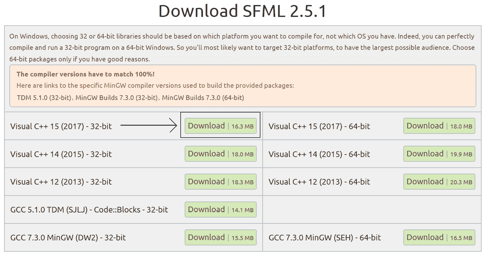

# 第二章：*第一章*：C++、SFML、Visual Studio 和开始第一个游戏

欢迎来到*开始 C++游戏编程*。我不会浪费时间，将你引入使用 C++和 OpenGL 驱动的 SFML 编写 PC 游戏之旅。

这第一章内容相当丰富，但我们将学习我们需要的所有内容，以便我们的第一个游戏的第一部分能够运行起来。以下是本章我们将要做什么：

+   了解我们将要构建的游戏

+   了解 C++

+   了解 Microsoft Visual C++

+   探索 SFML 及其与 C++的关系

+   设置开发环境

+   为第一个游戏项目 Timber!!!制定计划和准备

+   编写本书的第一段 C++代码，并制作一个可以绘制背景的可运行游戏

# 我们将要构建的游戏

这段旅程将会很顺利，因为我们将会一步一步地学习超级快速 C++语言的基础知识，然后通过为我们将要构建的五个游戏添加酷炫功能来应用这些新知识。

以下是本书的五个项目。

## Timber!!!

第一个游戏是一个令人上瘾、节奏快速的 Timberman 克隆版，你可以在[`store.steampowered.com/app/398710/`](http://store.steampowered.com/app/398710/)找到它。我们的游戏，Timber!!!，将在构建一个真正可玩的游戏的同时，让我们了解 C++的所有基础知识。以下是完成版本的游戏以及我们添加的一些最后时刻的增强功能将看起来像什么：


## Pong

Pong 是首批制作出的视频游戏之一，你可以在[`en.wikipedia.org/wiki/Pong`](https://en.wikipedia.org/wiki/Pong)了解其历史。它是游戏对象动画和动态碰撞检测基础的一个极好例子。我们将构建这个简单的复古游戏来探索类和面向对象编程的概念。玩家将使用屏幕底部的球拍，将球击回屏幕顶部：


## Zombie Arena

接下来，我们将构建一个疯狂、僵尸生存射击游戏，与 Steam 热门游戏*Over 9,000 Zombies!*非常相似，你可以在[`store.steampowered.com/app/273500/`](http://store.steampowered.com/app/273500/)了解更多信息。玩家将拥有机关枪，必须击退不断增多的僵尸浪潮。所有这一切都将发生在一个随机生成的滚动世界中。为了实现这一点，我们将学习面向对象编程如何使我们拥有一个大型**代码库**（大量代码），易于编写和维护。期待以下令人兴奋的功能：数百个敌人、快速射击武器、拾取物品以及每个波次后可以“升级”的角色：  

.jpg)

## 托马斯迟到了

第四款游戏将是一款时尚且具有挑战性的单人及合作解谜平台游戏。它基于非常受欢迎的游戏 *托马斯一个人* ([`store.steampowered.com/app/220780/`](http://store.steampowered.com/app/220780/))。你将有机会了解一些酷炫的话题，例如粒子效果、OpenGL 着色器以及分屏合作多人游戏：


小贴士

如果你现在想玩任何游戏，你可以从“可运行游戏”文件夹中的下载包中进行。只需双击相应的`.exe`文件即可。请注意，在这个文件夹中，你可以运行任何章节中完成的游戏或任何处于部分完成状态的游戏。

## 空间入侵者++

最终的游戏将是一个空间入侵者克隆版。在某种程度上，游戏本身并不是这个项目最重要的部分。这个项目将用于学习游戏编程模式。随着本书的进展，这一点将变得非常明显，我们的代码变得越来越长、越来越复杂。每个项目都将介绍一种或多种应对这种复杂性的技术，但我们的代码的复杂性和长度将持续挑战我们，尽管有这些技术。

空间入侵者项目（称为空间入侵者++）将向我们展示如何彻底重新组织我们的游戏代码，以及我们如何最终控制并妥善管理我们的代码。这将让你拥有计划构建深度、复杂和创新游戏所需的所有知识，而不会陷入代码的混乱之中。

游戏还将引入屏幕、输入处理器和实体-组件系统等概念。它还将让我们学习如何让玩家使用游戏手柄而不是键盘，并介绍 C++的智能指针、类型转换、断言、断点调试等概念，并教给我们整本书最重要的教训：如何构建你自己的独特游戏：


让我们从介绍 C++、Visual Studio 和 SFML 开始吧！

# 认识 C++

既然我们已经知道了我们将要构建的游戏，让我们通过介绍 C++、Visual Studio 和 SFML 来开始吧。你可能会有一个问题，*为什么要使用 C++语言呢？* C++运行速度快——非常快。这背后的原因是，我们编写的代码被直接转换成机器可执行的指令。这些指令就是游戏。可执行的游戏包含在一个`.exe`文件中，玩家只需双击即可运行。

将我们的代码转换为可执行文件的过程中有几个步骤。首先，**预处理器**会检查是否需要将任何**其他代码**包含在我们的代码中，并将其添加进去。接下来，所有代码都被**编译器**程序编译成**目标文件**。最后，一个名为**链接器**的第三方程序将所有目标文件连接成我们的游戏的可执行文件。

此外，C++在同时被广泛采用的同时，也极为更新。C++是一种**面向对象编程**（**OOP**）语言，这意味着我们可以使用经过良好测试的约定来编写和组织我们的代码，使我们的游戏高效且易于管理。随着我们阅读本书的进展，这种好处以及必要性将显现出来。

我所提到的这*其他代码*，正如你可能猜到的，大部分是 SFML，我们将在下一分钟内了解更多关于 SFML 的信息。我刚才提到的预处理器、编译器和链接器程序都是 Visual Studio **集成开发环境**（**IDE**）的一部分。

# Microsoft Visual Studio

Visual Studio 隐藏了预处理器、编译和链接的复杂性。它将所有这些封装在一个按钮的按下中。此外，它还提供了一个流畅的用户界面，让我们可以输入代码，并管理将成为大量代码文件和其他项目资产的项目。

虽然有高级版本的 Visual Studio，价格高达数百美元，但我们将能够在免费的“**Express 2019 for Community**”版本中构建我们所有的五个游戏。这是 Visual Studio 的最新免费版本。

# SFML

**SFML**是**简单快速媒体库**。它不是唯一的游戏和多媒体 C++库。可以争论使用其他库，但 SFML 似乎每次都能满足我的需求。首先，它使用面向对象的 C++编写。面向对象 C++的好处很多，你将在阅读本书的过程中体验到它们。

SFML 也易于入门，因此如果你是初学者，这是一个不错的选择；同时，如果你是专业人士，它也有潜力构建最高质量的 2D 游戏。所以，初学者可以使用 SFML 开始，不必担心随着经验的增长需要重新开始使用新的语言/库。

最大的好处可能就是，大多数现代 C++编程都使用面向对象编程（OOP）。我读过的每一本 C++初学者指南都使用并教授 OOP。实际上，在几乎所有语言中，OOP 都是编程的未来（以及现在）。那么，如果你是从头开始学习 C++，你为什么要用其他方式呢？

SFML 有一个模块（代码），几乎可以完成你在 2D 游戏中想要做的任何事情。SFML 使用 OpenGL，也可以制作 3D 游戏。当你想在多个平台上运行时，OpenGL 是事实上的免费图形库。当你使用 SFML 时，你自动使用了 OpenGL。

SFML 允许你创建以下内容：

+   2D 图形和动画，包括滚动游戏世界。

+   声音效果和音乐播放，包括高质量的方向性声音。

+   使用键盘、鼠标和游戏手柄进行输入处理。

+   在线多人游戏功能。

+   同一段代码可以在所有主要的桌面操作系统上编译和链接，包括移动设备！。

广泛的研究没有发现更多适合为 PC 构建 2D 游戏的方法，即使是对于经验丰富的开发者，尤其是如果你是一个想在一个有趣的游戏环境中学习 C++ 的初学者。

在接下来的章节中，我们将设置开发环境，首先讨论如果你使用的是 Mac 或 Linux 操作系统时应该做什么。

# 设置开发环境

现在你对我们如何制作游戏有了更多了解，是时候设置一个开发环境，以便我们可以开始编码了。

## 那么 Mac 和 Linux 呢？

我们将要制作的游戏可以被构建为在 Windows、Mac 和 Linux 上运行！我们使用的代码在每个平台上都是相同的。然而，每个版本确实需要针对它打算运行的平台进行编译和链接，而 Visual Studio 将无法帮助我们处理 Mac 和 Linux。

对于初学者来说，说这本书完全适合 Mac 和 Linux 用户是不公平的。尽管如此，我想，如果你是一个热情的 Mac 或 Linux 用户，并且你对你的操作系统感到舒适，你很可能会成功。你将遇到的绝大多数额外挑战都将出现在开发环境、SFML 和第一个项目的初始设置中。

为了达到这个目的，我强烈推荐以下教程，希望它们能替代接下来的 10 页（大约），直到 *规划木材!!!* 这一部分，届时这本书将适用于所有操作系统。

对于 Linux，阅读以下内容以替换接下来的几节：[`www.sfml-dev.org/tutorials/2.5/start-linux.php`](https://www.sfml-dev.org/tutorials/2.5/start-linux.php)。

在 Mac 上，阅读这篇教程以开始：[`www.sfml-dev.org/tutorials/2.5/start-osx.php`](https://www.sfml-dev.org/tutorials/2.5/start-osx.php)。

## 安装 Visual Studio 2019 社区版

要开始创建游戏，我们需要安装 Visual Studio 2019。安装 Visual Studio 可以几乎像下载一个文件并点击几个按钮一样简单。我将一步一步地引导你完成安装过程。

重要提示

注意，多年来，微软可能会更改 Visual Studio 的名称、外观和下载页面，用于获取 Visual Studio 的页面。他们可能会更改用户界面的布局，并使接下来的说明过时。然而，我们为每个项目配置的设置对于 C++ 和 SFML 是基本的，因此，即使微软对 Visual Studio 进行了激进的改变，仔细解读本章接下来的说明也应该是可能的。无论如何，在写作的时候，Visual Studio 2019 已经发布了仅仅两周，所以希望这一章会保持更新一段时间。如果发生了重大事件，那么一旦我发现，我就会在 [`gamecodeschool.com`](http://gamecodeschool.com) 上添加一个最新的教程。

让我们开始安装 Visual Studio：

1.  你首先需要一个 Microsoft 账户和登录详情。如果你有 Hotmail 或 MSN 电子邮件地址，那么你已经有一个了。如果没有，你可以在这里免费注册一个：[`login.live.com/`](https://login.live.com/)。

1.  下一步是访问 [`visualstudio.microsoft.com/vs/`](https://visualstudio.microsoft.com/vs/) 并找到 **Community 2019** 的下载链接。这是我写作时的样子！

1.  将文件保存到你的电脑上。

1.  下载完成后，通过双击它来运行下载文件。在我写作的时候，我的文件被命名为 `vs_community__33910147.1551368984.exe`。你的文件名将根据当前版本的 Visual Studio 而有所不同。

1.  在授予 Visual Studio 允许更改你的电脑的权限后，你将看到一个如下所示的窗口。点击 **继续**：

1.  等待安装程序下载一些文件并设置安装的下一阶段。不久，你将看到一个如下所示的窗口：

1.  如果你想要选择一个新的位置来安装 Visual Studio，找到 **更改** 选项并配置安装位置。最简单的事情就是将文件留在 Visual Studio 默认选择的位置。准备好后，找到 **使用 C++ 进行桌面开发** 选项并选择它。

1.  接下来，点击 **安装** 按钮。准备一些小吃，因为这个步骤可能需要一段时间。

1.  当过程完成后，你可以关闭所有打开的窗口，包括任何提示你开始新项目的窗口，因为我们还没有准备好开始编码，直到我们安装了 SFML。

现在，我们将把注意力转向 SFML。

## 设置 SFML

这个简短的教程将指导你下载 SFML 文件，这些文件允许我们将库中的功能包含到我们的项目中。此外，我们还将了解如何使用 SFML **DLL** 文件，这将使我们的编译对象代码能够与 SFML 一起运行。要设置 SFML，请按照以下步骤操作：

1.  访问 SFML 网站的此链接：[`www.sfml-dev.org/download.php`](http://www.sfml-dev.org/download.php)。点击此处所示的 **最新稳定版本** 按钮

1.  到你阅读这本书的时候，最新版本几乎肯定已经改变了。只要你的下一步操作正确，这并不重要。我们想要下载 **32 位版本** 的 **Visual C++ 2017**。这可能听起来有些不合逻辑，因为我们刚刚安装了 Visual Studio 2019，你很可能（最常见的情况）有一个 64 位 PC。我们选择下载 32 位版本的原因是 Visual C++ 2017 是 Visual Studio 2019 的一部分（Visual Studio 做的不仅仅是 C++），我们将以 32 位构建游戏，这样它们就可以在 **32 位** 和 **64 位** 机器上运行。点击以下截图所示的 **下载** 按钮

1.  当下载完成时，在您安装 Visual Studio 的同一驱动器的根目录下创建一个文件夹，并将其命名为`SFML`。同样，在您安装 Visual Studio 的驱动器的根目录下创建另一个文件夹，并将其命名为`VS Projects`。

1.  最后，解压 SFML 下载文件。请在您的桌面上进行此操作。解压完成后，您可以删除.zip 文件夹。您将剩下桌面上的一个单独文件夹。其名称将反映您下载的 SFML 版本。我的文件夹名为`SFML-2.5.1-windows-vc15-32-bit`。您的文件名可能反映一个更新的版本。双击此文件夹以查看其内容，然后再次双击进入下一个文件夹（我的文件夹名为`SFML-2.5.1`）。以下截图显示了`SFML-2.5.1`文件夹的内容。您的文件夹内容应该相同：

1.  复制此文件夹的全部内容，并将所有文件和文件夹粘贴到您在**步骤 3**中创建的`SFML`文件夹中。在此书余下的部分，我将简单地称这个文件夹为“您的`SFML`文件夹”。

现在，我们已准备好开始在 Visual Studio 中使用 C++ 和 SFML。

## 创建新项目

由于设置项目是一个繁琐的过程，我们将一步一步地进行，以便我们可以开始习惯这个过程：

1.  以您启动任何应用程序的方式启动 Visual Studio：通过点击其图标。默认安装选项将在 Windows 开始菜单中放置一个**Visual Studio 2019**图标。您将看到以下窗口：

1.  点击前一张截图中所突出的**创建新项目**按钮。您将看到**创建新项目**窗口，如下所示：

1.  在**创建新项目**窗口中，我们需要选择我们将要创建的项目类型。我们将创建一个控制台应用程序，因此选择**控制台应用程序**，如前一张截图所示，然后点击**下一步**按钮。接下来，您将看到**配置新项目**窗口。以下截图显示了完成接下来的三个步骤后的**配置新项目**窗口：

1.  在**项目名称**字段中输入`Timber`。请注意，这会导致 Visual Studio 自动将**解决方案名称**字段配置为相同的名称。

1.  在我们之前教程中创建的`VS Projects`文件夹中。这将是我们所有项目文件存放的位置。

1.  选择**将解决方案和项目放在同一目录下**的选项。

1.  注意，前一张截图显示了完成前三个步骤后窗口的外观。当您完成这些步骤后，点击**创建**。项目将被生成，包括一些 C++ 代码。以下截图显示了本书余下的工作区域：

1.  我们现在将配置项目以使用我们放在`SFML`文件夹中的 SFML 文件。从主菜单中选择**项目** | **Timber 属性…**。你会看到以下窗口：


小贴士

在前面的截图中，**确定**、**取消**和**应用**按钮没有完全显示。这可能是 Visual Studio 没有正确处理我的屏幕分辨率导致的错误。希望你的按钮能够完全显示。无论你的按钮是否像我的一样，继续教程的步骤将是相同的。

接下来，我们将开始配置项目属性。由于这些步骤相当复杂，我将用新的步骤列表来介绍。

## 配置项目属性

在此阶段，你应该已经打开了**Timber 属性页**窗口，如前一个部分末尾的截图所示。现在，我们将开始配置一些属性，同时使用以下带注释的截图作为指导：


在本节中，我们将添加一些相当复杂且重要的项目设置。这是比较繁琐的部分，但每个项目我们只需要做一次。我们需要做的是告诉 Visual Studio 在哪里可以找到 SFML 的特殊类型代码文件。我指的是具有`.hpp`扩展名的特殊文件。当我们最终开始添加自己的头文件时，这一切都会变得清晰起来。此外，我们还需要告诉 Visual Studio 在哪里可以找到 SFML 的库文件。在**Timber 属性页**窗口中，执行以下三个步骤，这些步骤在先前的截图中有编号：

1.  首先（**1**），从**配置：**下拉菜单中选择**所有配置**。

1.  第二步（**2**），从左侧菜单中选择**C/C++**然后选择**常规**。

1.  第三步（`\SFML\include`。如果你将`SFML`文件夹放在 D 盘上，需要输入的完整路径，如前面的截图所示；即`D:\SFML\include`。如果你的 SFML 安装在不同的驱动器上，请相应地更改路径）。

1.  点击**应用**以保存到目前为止的配置。

1.  现在，仍然在这个窗口中，执行以下步骤，这些步骤参考以下带注释的截图。首先（**1**），选择**链接器**然后选择**常规**。

1.  现在，找到`SFML`文件夹的位置，然后是`\SFML\lib`。所以，如果你将`SFML`文件夹放在 D 盘上，需要输入的完整路径，如以下截图所示，是`D:\SFML\lib`。如果你的 SFML 安装在不同的驱动器上，请相应地更改路径！

1.  点击**应用**以保存到目前为止的配置。

1.  最后，在这个阶段，仍然在这个窗口中，执行以下步骤，这些步骤参考以下带注释的截图。将**配置：**下拉菜单（**1**）切换到**调试**，因为我们将在调试模式下运行和测试我们的游戏。

1.  选择**链接器**然后选择**输入**（**2**）。

1.  在指定位置找到 `sfml-graphics-d.lib;sfml-window-d.lib;sfml-system-d.lib;sfml-network-d.lib;sfml-audio-d.lib;`。务必将光标放在正确的位置，并且不要覆盖任何已经存在的文本。

1.  点击 **OK**:

1.  点击 **Apply** 然后点击 **OK**。

呼；这就结束了！我们已经成功配置了 Visual Studio，可以继续规划 Timber!!! 项目。

# 规划木材！！！

每次你制作游戏时，最好从铅笔和纸开始。如果你不知道你的游戏如何在屏幕上工作，你怎么可能用代码让它工作呢？

小贴士

到目前为止，如果你还没有的话，我建议你去看一下 Timberman 的视频，这样你就可以看到我们想要达到的目标。如果你觉得你的预算可以扩展到这个程度，那么就抓起一份来试玩一下。它通常在 Steam 上以低于 1 美元的价格出售：[`store.steampowered.com/app/398710/`](http://store.steampowered.com/app/398710/)。

定义游戏玩法的游戏功能和对象被称为 **机制**。游戏的基本机制如下：

+   时间总是不够用。

+   你可以通过砍伐树木来获得更多时间。

+   砍伐树木会导致树枝掉落。

+   玩家必须避开掉落的树枝。

+   重复进行，直到时间用完或玩家被压扁。

在这个阶段期望你规划 C++ 代码显然有点愚蠢。这当然是 C++ 初学者指南的第一章。然而，我们可以查看我们将要使用的所有资产以及我们将需要让我们的 C++ 代码执行的大致概述。

看看这个游戏的标注截图：


你可以看到我们具有以下功能：

+   **玩家的得分：** 每次玩家砍倒一根木头，他们将得到一分。他们可以用左箭头或右箭头（光标）键砍倒木头。

+   **玩家角色：** 每次玩家砍伐，他们都会移动到/停留在与鼠标键相对的同一侧的树木上。因此，玩家必须小心他们选择砍伐的侧面。

+   当玩家砍伐时，一个简单的斧头图形会出现在玩家角色的手中。

+   **缩小的计时条：** 每次玩家砍伐，计时条上都会增加一小段时间。

+   **致命的树枝：** 玩家砍伐得越快，他们得到的时间越多，但树枝也会更快地沿着树木向下移动，因此他们被压扁的可能性也越大。树枝在树的顶部随机生成，并且每次砍伐时向下移动。

+   当玩家被压扁——而且他们会被经常压扁——会出现一个墓碑图形。

+   **砍伐的木头：** 当玩家砍伐时，一个砍伐的木头图形会飞离玩家。

+   **仅作装饰：** 有三朵漂浮的云彩将在随机的高度和速度下移动，还有一只除了飞来飞去什么都不做的蜜蜂。

+   **背景**：所有这些都在一个相当漂亮的背景上发生。

因此，简而言之，玩家必须疯狂地砍伐以获得分数并避免耗尽时间。作为稍微有些古怪但有趣的结果，他们砍伐得越快，他们柔软的死亡可能性就越大。

现在，我们已经知道了游戏的外观、玩法以及游戏机制背后的动机。现在，我们可以开始构建它了。按照以下步骤进行：

1.  现在，我们需要将 SFML `.dll`文件复制到主项目目录中。我的主项目目录是`D:\VS Projects\Timber`。这是在前一个教程中由 Visual Studio 创建的。如果你将`VS Projects`文件夹放在其他地方，那么请在这里执行此步骤。我们需要复制到项目文件夹中的文件位于你的`SFML\bin`文件夹中。为这两个位置打开一个窗口，并突出显示`SFML\bin`文件夹中的所有文件，如下面的截图所示！[](img/B14278_01_19.jpg)

1.  现在，将突出显示的文件复制并粘贴到项目文件夹中，即`D:\VS Projects\Timber`。

项目现在已经设置好并准备就绪。你将能够看到以下屏幕。我已经注释了这个截图，以便你可以开始熟悉 Visual Studio。我们很快会重新访问所有这些区域以及其他区域：


你的布局可能看起来与前面的截图略有不同，因为 Visual Studio 的窗口，像大多数应用程序一样，是可以定制的。花点时间找到右侧的**解决方案资源管理器**窗口，并调整它，使其内容清晰易懂，就像前面的截图一样。

我们很快就会回来开始编码。但首先，我们将探索我们将要使用的项目资产。

# 项目资产

资产是你制作游戏所需的一切。在我们的例子中，这些资产包括以下内容：

+   屏幕上文字的字体

+   不同动作的声音效果，例如砍伐、死亡和耗尽时间

+   角色图形、背景、分支和其他游戏对象的图形

游戏所需的全部图形和声音都包含在这本书的下载包中。它们可以在相应的`第一章/graphics`和`第一章/sound`文件夹中找到。

所需的字体尚未提供。这是因为我想避免任何可能的版权模糊。尽管如此，这不会造成问题，因为我会向你展示如何精确地选择和下载字体。

虽然我会提供资产本身或获取它们的信息，但你可能喜欢自己创建或获取它们。

## 外包资产

有许多网站允许你雇佣艺术家、声音工程师，甚至程序员。其中最大的一个是 Upwork([www.upwork.com](http://www.upwork.com))。你可以免费加入这个网站并发布你的工作。你需要清楚地说明你的要求，以及你愿意支付多少。然后，你可能会得到很多承包商竞标来完成这项工作。然而，要注意的是，有很多不合格的承包商，他们的工作可能会令人失望，但如果你仔细选择，你很可能会找到一个有能力的、热情的、物有所值的人或公司来完成这项工作。

## 制作自己的声音效果

声音效果可以从 Freesound([www.freesound.org](http://www.freesound.org))等网站免费下载，但通常许可协议不允许你在销售游戏时使用它们。另一个选择是使用来自[www.bfxr.net](http://www.bfxr.net)的开源软件 BFXR，它可以帮你生成大量不同的声音效果，这些效果你可以保留并随意使用。

## 将资源添加到项目中

一旦你决定使用哪些资源，就是时候将它们添加到项目中了。以下说明将假设你正在使用本书下载包中提供的所有资源。如果你使用的是自己的资源，只需用你的声音或图形文件替换相应的文件，使用完全相同的文件名：

1.  浏览到项目文件夹，即`D:\VS Projects\Timber`。

1.  在这个文件夹内创建三个新的文件夹，并分别命名为`graphics`、`sound`和`fonts`。

1.  从下载包中，将`Chapter 1/graphics`文件夹的全部内容复制到`D:\VS Projects\Timber\graphics`文件夹。

1.  从下载包中，将`Chapter 1/sound`文件夹的全部内容复制到`D:\VS Projects\Timber\sound`文件夹。

1.  现在，在你的网络浏览器中访问[`www.1001freefonts.com/komika_poster.font`](http://www.1001freefonts.com/komika_poster.font)并下载**Komika Poster**字体。

1.  解压下载的内容，并将`KOMIKAP_.ttf`文件添加到`D:\VS Projects\Timber\fonts`文件夹。

让我们来看看这些资源——特别是图形资源——这样我们就可以在我们使用它们在 C++代码中时可视化它们。

## 探索资源

图形资源构成了场景的各个部分，也就是我们的 Timber!!!游戏。如果你查看图形资源，应该很清楚它们将在我们的游戏中用于何处：


声音文件都是`.wav`格式。这些文件包含我们在游戏中的某些事件中要播放的声音效果。它们都是使用 BFXR 生成的，如下所示：

+   `chop.wav`: 一种类似斧头（复古斧头）砍树的声音

+   `death.wav`: 一种类似复古“失败”的声音

+   `out_of_time.wav`: 当玩家因时间耗尽而失败时播放的声音，而不是被压扁

我们已经看到了所有资产，包括图形，因此现在我们将简要讨论屏幕的分辨率以及我们如何在上面定位图形。

# 理解屏幕和内部坐标

在我们继续实际的 C++编码之前，让我们先简单谈谈坐标。我们显示器上看到的所有图像都是由像素组成的。像素是组成我们看到的图像的小小光点。

监视器有许多不同的分辨率，但以一个例子来说，一个相当典型的游戏显示器可能水平有 1,920 个像素，垂直有 1,080 个像素。

像素是从屏幕左上角开始编号的。正如您可以从以下图表中看到的那样，我们的 1,920 x 1,080 示例在水平（x）轴上从 0 编号到 1,919，在垂直（y）轴上从 0 编号到 1,079：


因此，可以通过 x 和 y 坐标来识别一个特定的屏幕位置。我们通过将游戏对象如背景、角色、子弹和文本绘制到屏幕上的特定位置来创建我们的游戏。这些位置由像素坐标来识别。请看以下假设的例子，说明我们如何绘制到屏幕的大约中心坐标。在一个 1,920 x 1080 的屏幕上，这将是在 960, 540 位置：


除了屏幕坐标外，我们的游戏对象各自还将拥有自己的类似坐标系统。就像屏幕坐标系统一样，它们的**内部**或**局部**坐标从左上角的 0,0 开始。

在上一张图像中，我们可以看到角色的 0,0 坐标被绘制在屏幕的 960, 540 位置。

一个二维的可视游戏对象，如角色或僵尸，被称为**精灵**。精灵通常由图像文件组成。所有精灵都有一个所谓的**原点**。

如果我们在屏幕上的特定位置绘制一个精灵，那么原点将位于这个特定位置。精灵的 0,0 坐标是其原点。以下图像演示了这一点：


因此，在显示绘制到屏幕上的角色的图像中，尽管我们在中心位置（960, 540）绘制了图像，但它看起来稍微偏右和向下一点。

了解这一点很重要，因为它将帮助我们理解我们用来绘制所有图形的坐标。

重要提示

注意，在现实世界中，游戏玩家有各种各样的屏幕分辨率，我们的游戏需要尽可能多地与它们兼容。在第三个项目中，我们将看到如何使我们的游戏动态适应几乎任何分辨率。在这个第一个项目中，我们需要假设屏幕分辨率为 1,920 x 1,080。如果你的屏幕分辨率更高，这将是可以的。如果你的屏幕分辨率低于这个值，请不要担心，因为我为 Timber!!! 游戏的每个章节都提供了一套单独的代码。代码文件几乎完全相同，除了在开头添加和交换几行代码。如果你有低分辨率的屏幕，只需遵循本书中的代码即可，它假设你有一个 1,920 x 1,080 的分辨率。当尝试运行游戏时，你可以从前五章的 `low res` 文件夹中复制并粘贴相应的代码文件。实际上，一旦从本章添加了额外的行，所有其余的代码都将完全相同，无论你的屏幕分辨率如何。我提供了每个章节的低分辨率代码，仅作为便利。这些几行代码如何施展魔法（调整屏幕分辨率）将在第三个项目中讨论。替代代码将适用于低至 960 x 540 的分辨率，因此应该几乎在任何 PC 或笔记本电脑上都能正常工作。

现在，我们可以编写我们的第一段 C++ 代码并看到它的实际效果。

# 开始编写游戏代码

如果 Visual Studio 还未打开，请打开它。通过在主 Visual Studio 窗口的**最近**列表中左键单击它来打开 Timber!!! 项目。

在**源文件**文件夹下找到 `Timber.cpp` 文件。

重要提示

.cpp 代表 C++。

删除代码窗口中的全部内容，并添加以下代码，以便你有相同的代码。你可以像使用任何文本编辑器或文字处理器一样这样做；如果你更喜欢，甚至可以复制并粘贴。在你完成编辑后，我们可以讨论它：

```cpp
// This is where our game starts from
int main()
{
    return 0;
}
```

这个简单的 C++ 程序是一个很好的起点。让我们逐行分析它。

## 使用注释使代码更清晰

代码的第一行如下：

```cpp
// This is where our game starts from
```

任何以两个正斜杠（`//`）开头的代码行都是注释，并且会被编译器忽略。因此，这一行代码没有任何作用。它用于留下任何我们可能在稍后回到代码时可能觉得有用的信息。注释在行尾结束，所以下一行上的内容不属于注释。还有一种注释类型称为**多行**或**C 风格**注释，可以用来留下超过单行的注释。我们将在本章后面看到一些例子。在整个书中，我将留下数百条注释，以帮助添加上下文并进一步解释代码。

## 主函数

我们在代码中看到的下一行如下：

```cpp
int main()
```

`int`是一个**整数**或整个数。记住这个想法，我们将在一分钟内回到它。

`main()`部分是后续代码部分的名称。代码部分由开括号（`{`）和下一个闭括号（`}`）之间的内容标记。

因此，这些花括号`{...}`之间的所有内容都是`main`的一部分。我们称这样的代码部分为**函数**。

每个 C++程序都有一个`main`函数，它是`main`函数所在的地方。无论我们编写什么代码，我们的游戏都将从`main`函数开括号内的第一行代码开始执行。

现在，不要担心函数名后面的奇怪括号。我们将在*第四章**，循环、数组、开关、枚举和函数 – 实现游戏机制*中进一步讨论它们，当我们从全新的、更有趣的角度看待函数时。

让我们仔细看看`main`函数中的一行代码。

## 呈现和语法

再次查看我们的`main`函数的全部内容：

```cpp
int main()
{
    return 0;
}
```

我们可以看到，在`Main`内部，只有一行代码，`return 0;`。在我们继续了解这一行代码的作用之前，让我们看看它是如何呈现的。这很有用，因为它可以帮助我们准备编写易于阅读且与其他代码部分区分开的代码。

首先，注意`return 0;`缩进了一个制表符到右边。这清楚地表明它是在`main`函数内部的。随着我们的代码长度增加，我们会看到缩进代码和留出空白将对于保持可读性至关重要。

接下来，注意行尾的标点符号。分号（`;`）告诉编译器这是指令的结束，并且其后的任何内容都是一个新的指令。我们称由分号终止的指令为`statement`。

注意，编译器并不关心你在分号和下一个语句之间是否留出新行，甚至是否留有空格。然而，每个语句不开始新行会导致代码难以阅读，而完全遗漏分号则会导致**语法错误**，游戏将无法编译或运行。

代码部分一起，通常通过其缩进与其他部分区分，被称为**块**。

现在你已经熟悉了`main`函数的概念，学会了通过缩进保持代码整洁，并在每个语句的末尾放置分号，我们可以继续了解`return 0;`语句实际上做什么。

## 从函数返回值

实际上，`return 0;`在我们的游戏中几乎没有任何作用。然而，这个概念是非常重要的。当我们使用`return`关键字时，无论是单独使用还是后面跟着一个值，它都是程序执行跳转/移动回最初启动函数的代码的指令。

通常，启动函数的代码将是我们代码中其他地方的另一个函数。然而，在这种情况下，是操作系统启动了`main`函数。因此，当执行`return 0;`时，`main`函数退出，整个程序结束。

由于我们在`return`关键字后面有一个`0`，这个值也会被发送到操作系统。我们可以将 0 的值更改为其他值，然后这个值将被发送回去。

我们说，启动函数的代码**调用**函数，而函数**返回**值。

你现在不需要完全掌握所有这些函数信息。这里只是介绍它。在继续之前，我还会提到关于函数的最后一件事。还记得`int main()`中的`int`吗？这告诉编译器从`main`返回的值的类型必须是`int`（整数/整个数字）。我们可以返回任何符合`int`的值；也许 0，1，999，6，358 等等。如果我们尝试返回不是`int`的值，比如 12.76，那么代码将无法编译，游戏将无法运行。

函数可以返回一大类不同的类型，包括我们为自己发明的类型！然而，这种类型必须以我们刚才看到的方式让编译器知道。

这一点关于函数的背景信息将使我们在前进的过程中更加顺利。

## 运行游戏

你甚至可以在这一点上运行游戏。通过点击 Visual Studio 快速启动栏中的**本地 Windows 调试器**按钮来这样做。或者，你可以使用*F5*快捷键：


你将只看到一个黑色屏幕。如果黑色屏幕没有自动关闭，你可以按任意键来关闭它。这个窗口是 C++控制台，我们可以用它来调试我们的游戏。我们现在不需要这样做。正在发生的事情是，我们的程序正在启动，从`main`函数的第一行开始执行，即`return 0;`，然后立即返回到操作系统。

我们现在已经有了可能的最简单的程序，已经编码并运行。接下来，我们将添加一些代码来打开一个游戏最终会出现在其中的窗口。

# 使用 SFML 打开窗口

现在，让我们添加一些更多的代码。接下来的代码将使用 SFML 打开一个窗口，Timber!!!最终将在其中运行。窗口将宽 1,920 像素，高 1,080 像素，并将全屏（没有边框或标题）。

将这里突出显示的新代码输入到现有代码中，然后我们将检查它。当你输入（或复制粘贴）时，尽量弄清楚正在发生的事情：

```cpp
// Include important libraries here
#include <SFML/Graphics.hpp>
// Make code easier to type with “using namespace”
using namespace sf;
// This is where our game starts from
int main()
{
    // Create a video mode object
    VideoMode vm(1920, 1080);
    // Create and open a window for the game
    RenderWindow window(vm, “Timber!!!”, Style::Fullscreen);
return 0;
}
```

## #包括 SFML 功能

我们在新代码中首先注意到的是`#include`指令。

`#include` `.hpp`文件扩展名意味着它是一个**头文件**。

因此，`#include <SFML/Graphics.hpp>`告诉预处理器包含名为`SFML`的文件夹中`Graphics.hpp`文件的內容。这正是我们在设置项目时创建的文件夹。

这一行添加了上述文件中的代码，它为我们提供了访问 SFML 一些功能的方法。它究竟是如何实现这一点的，将在我们开始编写自己的独立代码文件并使用`#include`来使用它们时变得更加清晰。

在本书中，我们将包含的主要文件是提供我们访问所有酷炫游戏编程功能的 SFML 头文件。我们还将使用`#include`来访问**C++标准库**头文件。这些头文件为我们提供了访问 C++语言本身核心功能的方法。

目前重要的是，我们有一系列由 SFML 提供的新功能可供使用，如果我们添加这一行代码。

下一个新行是`using namespace sf;`。我们很快就会回到这一行的作用。

## 面向对象编程（OOP）、类和对象

我们将在本书的后续内容中全面讨论面向对象编程、类和对象。以下是一个简要介绍，以便我们理解正在发生的事情。

我们已经知道 OOP 代表面向对象编程。OOP 是一种编程范式，即一种编码方式。OOP 在编程界被普遍接受，几乎在所有语言中，都被认为是最好的，如果不是唯一的专业编写代码的方式。

面向对象编程引入了许多编程概念，但它们的基础是**类**和**对象**。当我们编写代码时，尽可能希望编写可重用、可维护和安全的代码。我们通过将代码结构化为类来实现这一点。我们将在*第六章**，面向对象编程 – 开始 Pong 游戏*中学习如何做到这一点。

目前我们只需要了解关于类的基本知识，那就是一旦我们编写了我们的类，我们不仅仅是将这段代码作为游戏的一部分来执行；相反，我们是从类中创建可用的对象。

例如，如果我们想要 100 个僵尸`Zombie`，然后从单个类中创建尽可能多的僵尸对象。每一个僵尸对象都会有相同的功能和内部数据类型，但每一个僵尸对象都是一个独立且独特的实体。

为了进一步阐述假设的僵尸例子，但不展示`Zombie`类的任何代码，我们可以基于`Zombie`类创建一个新的对象，如下所示：

```cpp
Zombie z1;
```

`z1`对象现在是一个完全编码并可以运行的`Zombie`对象。然后我们可以这样做：

```cpp
Zombie z2;
Zombie z3;
Zombie z4;
Zombie z5;
```

现在我们有五个独立的`Zombie`类，使我们能够使用我们的`Zombie`对象，可能如下所示：

```cpp
z1.attack(player);
z2.growl();
z3.headExplode();
```

重要提示

再次注意，所有这些僵尸代码目前都是假设性的。不要将此代码输入 Visual Studio，它只会产生一堆错误。

我们将设计我们的类，以便以最合适的方式使用数据和行为来满足游戏目标。例如，我们可以设计我们的类，以便在创建每个僵尸对象时为其数据分配值。

假设我们需要在创建每个僵尸时分配一个独特的名称和每秒米数。仔细编写 `Zombie` 类可以让我们写出如下代码：

```cpp
// Dave was a 100 metre Olympic champion before infection 
// He moves at 10 metres per second
Zombie z1(“Dave”, 10);
// Gill had both of her legs eaten before she was infected
// She drags along at .01 metres per second
Zombie z2(“Gill”, .01);
```

重点是，类几乎是无限灵活的，一旦我们编写了类，我们就可以通过创建它们的对象/实例来使用它们。我们将通过类和我们从中创建的对象来利用 SFML 的力量。是的，我们还将编写自己的类，包括一个 `Zombie` 类。

让我们回到我们刚刚编写的真实代码。

## 使用命名空间 sf

在我们继续深入了解 `VideoMode` 和 `RenderWindow` 之前，你可能已经猜到了，它们是 SFML 提供的类，我们将学习 `using namespace sf;` 这行代码的作用。

当我们创建一个类时，我们是在 `VideoMode` 类中创建的。在像 Windows 这样的环境中，有人可能已经编写了一个名为 `VideoMode` 的类。通过使用命名空间，我们和 SFML 程序员可以确保类的名称永远不会冲突。

使用 `VideoMode` 类的完整方式如下：

```cpp
sf::VideoMode...
```

`using namespace sf;` 允许我们在代码的任何地方省略 `sf::` 前缀。如果没有它，仅在这个简单的游戏中就会有超过 100 个 `sf::` 实例。它还使我们的代码更易于阅读，更简洁。

## SFML VideoMode 和 RenderWindow

在 `main` 函数内部，我们现在有了两个新的注释和两行实际的代码。第一行实际代码如下：

```cpp
VideoMode vm(1920, 1080);
```

这段代码创建了一个名为 `vm` 的对象，它来自名为 `VideoMode` 的类，并设置了两个内部值 `1920` 和 `1080`。这些值代表了玩家的屏幕分辨率。

下一个新行代码如下：

```cpp
RenderWindow window(vm, “Timber!!!”, Style::Fullscreen);
```

在上一行代码中，我们创建了一个名为 `window` 的新对象，它是由 SFML 提供的名为 `RenderWindow` 的类。此外，我们在窗口对象内部设置了一些值。

首先，`vm` 对象用于初始化 `window` 的一部分。起初，这可能会让人感到困惑。然而，请记住，一个类可以像其创建者想要的那样多样化、灵活。是的，一些类可以包含其他类的其他实例。

小贴士

在这个阶段，你不需要完全理解它是如何工作的，只要你能理解这个概念即可。我们编写一个类，然后从该类中创建可用的对象——有点像建筑师可能会绘制蓝图。你当然不能把所有的家具、孩子和狗都搬到蓝图里，但你可以从蓝图建造房子（或许多房子）。在这个类比中，类就像蓝图，对象就像房子。

接下来，我们使用 `“Timber!!!”` 值给窗口命名。然后，我们使用预定义的 `Style::FullScreen` 值使我们的 `window` 对象全屏。

小贴士

`Style::FullScreen` 是在 SFML 中定义的一个值。它很有用，因为我们不需要记住内部代码用来表示全屏的整数。这种值的编码术语是 `常量`。常量和它们的 C++ 亲戚 **变量** 将在下一章中介绍。

让我们看看我们的窗口对象在实际操作中的表现。

## 运行游戏

你现在可以再次运行游戏。你会看到一个更大的黑色屏幕闪烁然后消失。这是我们刚刚编写的 1,920 x 1,080 全屏窗口。不幸的是，目前仍在发生的事情是，我们的程序从 `main` 的第一行开始执行，创建了一个酷炫的新游戏窗口，然后到达 `return 0;` 并立即退回到操作系统。

接下来，我们将添加一些代码，这些代码将构成本书中每个游戏的基本结构。这被称为游戏循环。

# 主游戏循环

我们需要一种方法，让程序保持运行，直到玩家想要退出。同时，我们应该在继续使用 Timber!!! 的过程中，清楚地标记出代码的不同部分。此外，如果我们想阻止游戏退出，我们最好提供一个让玩家在准备好时退出的方法；否则，游戏将永远继续下去！

将以下高亮显示的代码添加到现有代码中，然后我们将对其进行审查并讨论：

```cpp
int main()
{
// Create a video mode object
VideoMode vm(1920, 1080);
// Create and open a window for the game
RenderWindow window(vm,	“Timber!!!”, Style::Fullscreen);
    while (window.isOpen())
    {
        /*
        ****************************************
        Handle the players input
        ****************************************
        */
        if (Keyboard::isKeyPressed(Keyboard::Escape))
        {
            window.close();
        }
        /*
        ****************************************
        Update the scene
        ****************************************
        */
        /*
        ****************************************
        Draw the scene
        ****************************************
        */
        // Clear everything from the last frame
        window.clear();
        // Draw our game scene here
        // Show everything we just drew
        window.display();
    }
    return 0;
}
```

## 当循环

在新代码中，我们首先看到的是以下内容：

```cpp
while (window.isOpen())
{
```

在新代码中，我们最后看到的是一个闭合的 `}`。我们创建的 `{` 和闭合的 `}` 括号将不断执行，可能永远如此。

仔细观察 `while` 循环的括号 `(...)` 之间，如下所示：

```cpp
while (window.isOpen())
```

这段代码的完整解释将留待我们在 *第四章* 中讨论循环和条件时再进行，即“循环、数组、开关、枚举和函数 – 实现游戏机制”。目前重要的是，当 `window` 对象设置为关闭状态时，代码的执行将跳出 `while` 循环并继续执行下一个语句。具体如何关闭窗口将在稍后介绍。

下一个语句当然是 `return 0;`，这标志着我们游戏的结束。

我们现在知道我们的`while`循环将快速地循环执行其中的代码，直到我们的窗口对象被设置为关闭。

## C 风格代码注释

在`while`循环内部，我们可以看到乍一看可能有点像 ASCII 艺术的代码：

```cpp
/*
****************************************
Handle the player’s input
****************************************
*/
```

重要提示

ASCII 艺术是一种小众但有趣的方式，可以用计算机文本创建图像。您可以在这里了解更多信息：[`en.wikipedia.org/wiki/ASCII_art`](https://en.wikipedia.org/wiki/ASCII_art)。

之前的代码只是另一种类型的注释。这种类型的注释被称为 C 风格注释。注释从(`/*`)开始，以(`*/`)结束。其中间的内容只是信息，不会被编译。我使用了这种稍微详细一点的文本，以确保我们清楚地知道代码文件中的每一部分将要做什么。当然，你现在可以推断出接下来的任何代码都将与处理玩家的输入相关。

跳过几行代码，你会看到我们还有另一个 C 风格注释，宣布在那个代码部分，我们将更新场景。

如果你跳转到下一个 C 风格注释，就会清楚我们将在哪里绘制所有图形。

## 输入、更新、绘制、重复

虽然这个第一个项目使用了最简单的游戏循环版本，但每个游戏都需要代码中的这些阶段。让我们回顾一下步骤：

1.  获取玩家的输入（如果有）。

1.  根据人工智能、物理或玩家的输入等更新场景。

1.  绘制当前场景。

1.  以足够快的速度重复这些步骤，以创建一个平滑的动画游戏世界。

现在，让我们看看在游戏循环中实际执行某些操作的代码。

## 检测按键

首先，在可以通过带有`Handle the player’s input`文本的注释识别的部分，我们有以下代码：

```cpp
if (Keyboard::isKeyPressed(Keyboard::Escape))
{
        window.close();
}
```

这段代码检查是否正在按下*Esc*键。如果是的话，高亮显示的代码使用`window`对象来关闭自身。现在，下一次`while`循环开始时，它会看到`window`对象已经关闭，并跳转到`while`循环结束花括号之后的代码，游戏将退出。我们将在*第二章**中更全面地讨论`if`语句，变量、运算符和决策 – 动画精灵*。

## 清除和绘制场景

目前，在`更新场景`部分没有代码，所以让我们继续到`绘制场景`部分。

我们将首先使用以下代码擦除上一帧的动画：

```cpp
window.clear();
```

我们现在要做的是绘制游戏中的每一个对象。然而，我们没有任何游戏对象。

下一行代码如下：

```cpp
window.display();
```

当我们绘制所有游戏对象时，我们实际上是在一个隐藏的表面上绘制，这个表面准备被显示。`window.display()` 代码会将之前显示的表面翻转到新更新的（之前隐藏的）一个。这样，玩家将永远不会看到绘制过程，因为表面已经添加了所有精灵。这也保证了场景在翻转之前是完整的。这防止了名为 **撕裂** 的图形错误。这个过程被称为 **双缓冲**。

还要注意，所有这些绘制和清除功能都是使用我们的 `window` 对象执行的，该对象是从 SFML 的 `RenderWindow` 类创建的。

## 运行游戏

运行游戏，你将得到一个空白的全屏窗口，直到你按下 *Esc* 键。

这是个不错的进展。在这个阶段，我们有一个正在执行的程序，它打开一个窗口并循环等待玩家按下 *Esc* 键以退出。现在，我们能够继续绘制游戏的背景图像。

# 绘制游戏背景

现在，我们将看到我们游戏中的图形。我们需要做的是创建一个精灵。我们将首先创建游戏背景。然后我们可以在清除窗口和显示/翻转它之间绘制它。

## 使用纹理准备精灵

SFML 的 `RenderWindow` 类允许我们创建我们的 `window` 对象，它基本上负责了游戏窗口所需的所有功能。

我们现在将查看另外两个负责将精灵绘制到屏幕上的 SFML 类。其中一个类，可能不出所料，被称为 `Sprite`。另一个类被称为 `Texture`。纹理是存储在内存中的图形，在 **图形处理单元**（**GPU**）上。

由 `Sprite` 类创建的对象需要一个由 `Texture` 类创建的对象来显示自身作为图像。添加以下突出显示的代码。试着弄清楚发生了什么。然后，我们将逐行分析它：

```cpp
int main()
{
    // Create a video mode object
    VideoMode vm(1920, 1080);
    // Create and open a window for the game
    RenderWindow window(vm,	“Timber!!!”, Style::Fullscreen);
    // Create a texture to hold a graphic on the GPU
    Texture textureBackground;
    // Load a graphic into the texture
    textureBackground.loadFromFile(“graphics/background.png”);
    // Create a sprite
    Sprite spriteBackground;
    // Attach the texture to the sprite
    spriteBackground.setTexture(textureBackground);
    // Set the spriteBackground to cover the screen
    spriteBackground.setPosition(0,0);
    while (window.isOpen())
    {
```

首先，我们创建一个名为 `textureBackground` 的对象，该对象来自 SFML 的 `Texture` 类：

```cpp
Texture textureBackground;
```

一旦完成，我们可以使用 `textureBackground` 对象将我们的 `graphics` 文件夹中的图形加载到 `textureBackground` 中，如下所示：

```cpp
textureBackground.loadFromFile(“graphics/background.png”);
```

小贴士

我们只需要指定 `graphics/background` 作为路径，因为它是相对于我们创建文件夹并添加图像的 Visual Studio **工作目录** 的相对路径。

接下来，我们使用以下代码创建一个名为 `spriteBackground` 的对象，该对象来自 SFML 的 `Sprite` 类：

```cpp
Sprite spriteBackground;
```

然后，我们可以将 `Texture` 对象（`backgroundTexture`）与 `Sprite` 对象（`backgroundSprite`）关联起来，如下所示：

```cpp
spriteBackground.setTexture(textureBackground);
```

最后，我们可以在 `window` 对象中将 `spriteBackground` 对象定位在 `0,0` 坐标上：

```cpp
spriteBackground.setPosition(0,0);
```

由于 `graphics` 文件夹中的 `background.png` 图形宽度为 1,920 像素，高度为 1,080 像素，它将整齐地填充整个屏幕。请注意，此前的代码行实际上并没有显示精灵。它只是设置了其位置，以便在显示时使用。

`backgroundSprite`对象现在可以用来显示背景图形。当然，你几乎肯定想知道为什么我们不得不以这种方式做事。原因是由于显卡和 OpenGL 的工作方式。

纹理占用图形内存，这种内存是有限的资源。此外，将图形加载到 GPU 内存中的过程非常缓慢——并不那么慢以至于你可以看到它发生，或者你会在它发生时明显感觉到你的电脑变慢，但足够慢以至于你不能在游戏循环的每一帧都这样做。因此，将实际的纹理（`textureBackground`）与我们在游戏循环中将要操作的任何代码解耦是有用的。

当我们开始移动我们的图形时，我们将使用精灵来这样做。任何由`Texture`类创建的对象都将愉快地坐在 GPU 上，等待相关的`Sprite`对象告诉它在哪里显示自己。在未来的项目中，我们还将使用相同的`Texture`对象与多个不同的`Sprite`对象一起使用，这使 GPU 内存的使用更加高效。

总结来说，我们可以陈述以下内容：

+   纹理加载到 GPU 上非常慢。

+   纹理一旦在 GPU 上，访问速度非常快。

+   我们将一个`Sprite`对象与一个纹理关联起来。

+   我们操作`Sprite`对象的位置和方向（通常在`更新场景`部分）。

我们绘制`Sprite`对象，它反过来显示与之关联的`Texture`对象（通常在`绘制场景`部分）。因此，我们现在需要做的就是使用我们的双缓冲系统，这是由我们的`window`对象提供的，来绘制我们的新`Sprite`对象（`spriteBackground`），然后我们应该能看到我们的游戏正在运行。

## 背景精灵的双缓冲

最后，我们需要在游戏循环的适当位置绘制那个精灵及其关联的纹理。

小贴士

注意，当我展示来自同一块的代码时，我不会添加缩进，因为这会减少书中文本的换行实例。缩进是隐含的。请查看下载包中的代码文件以查看缩进的完整使用。

添加以下突出显示的代码：

```cpp
/*
****************************************
Draw the scene
****************************************
*/
// Clear everything from the last run frame
window.clear();
// Draw our game scene here
window.draw(spriteBackground);
// Show everything we just drew
window.display();
```

新的代码行只是使用`window`对象在清除显示和显示新绘制的场景之间绘制`spriteBackground`对象。

我们现在知道什么是精灵，我们可以将它与纹理关联起来，然后在屏幕上定位它，最后绘制它。游戏现在可以再次运行，以便我们可以看到这段代码的结果。

## 运行游戏

如果我们现在运行程序，我们将看到我们有一个真正的游戏正在进行的第一迹象：


它目前不可能在 Steam 上获得年度独立游戏奖，但至少我们正在这条路上！

让我们看看在这一章中以及我们继续阅读这本书的过程中可能会出现的一些问题。

# 处理错误

在你制作的每个项目中，都可能会遇到问题和错误。这是肯定的！问题越困难，当你解决它时就越令人满意。经过数小时的挣扎后，一个新游戏功能终于焕发生机，这可能会引起真正的兴奋。如果没有这种挣扎，它似乎就变得不那么值得了。

在这本书的某个阶段，你可能会遇到一些挑战。保持冷静，对自己有信心，你将能够克服它，然后开始工作。

记住，无论你的问题是什么，你很可能不是世界上第一个遇到这种相同问题的人。想一个简洁的句子来描述你的问题或错误，然后将其输入到谷歌搜索中。你会惊讶地发现，其他人解决你的问题的速度有多快、有多精确，以及有多频繁。

话虽如此，这里有一些提示（有意为之；参见*第十章**，指针、标准模板库和纹理管理*)，以防你在使第一章工作时有困难。

## 配置错误

本章中问题最可能的原因是**配置错误**。正如你可能在设置 Visual Studio、SFML 和项目本身的过程中注意到的那样，有很多文件名、文件夹和设置需要恰到好处。仅仅一个错误的设置就可能导致一系列错误，其文本并没有清楚地说明具体出了什么问题。

如果你无法让空项目在黑色屏幕上运行，重新开始可能更容易。确保所有文件名和文件夹名都适合你的特定设置，然后运行代码的最简单部分。这是屏幕闪烁黑色然后关闭的部分。如果你能到达这个阶段，那么配置可能不是问题。

## 编译错误

编译错误可能是我们接下来最常遇到的错误。检查你的代码是否与我的一致，特别是行尾的分号和类名、对象名的大小写微妙变化。如果所有其他方法都失败了，请打开下载包中的代码文件，并复制粘贴进去。虽然总是有可能代码中的打字错误被收录到这本书中，但代码文件是从实际的工作项目中制作的——它们肯定能工作！

## 链接错误

链接错误最可能是由于缺少 SFML `.dll`文件造成的。你是否已经将它们全部复制到了项目文件夹中？

## 错误

错误发生在你的代码按预期工作，但并非如你所愿时。调试实际上可以很有趣。你解决的错误越多，你的游戏越好，你一天的工作就越令人满意。解决错误的技巧是尽早找到它们！为此，我建议每次实现新功能时都运行并玩你的游戏。你发现错误越早，越有可能在脑海中清晰地记住原因。在这本书中，我们将运行代码以查看每个可能阶段的输出结果。

# 摘要

这章内容相当具有挑战性，也许作为第一章来说有点苛刻。确实，配置 IDE 以使用 C++库可能有点棘手且耗时。此外，类和对象的概念对于编程新手来说通常被认为有点棘手。

然而，现在我们已经到了这个阶段，我们可以完全专注于 C++、SFML 和游戏。随着我们继续阅读这本书，我们将学习越来越多的 C++，并实现越来越有趣的游戏特性。在这个过程中，我们将进一步探讨函数、类和对象等概念，以帮助大家更好地理解它们。

我们在本章中取得了许多成果，包括概述了一个带有主函数的基本 C++程序，构建了一个简单的游戏循环，该循环监听玩家输入并在屏幕上绘制精灵（及其关联的纹理）。

在下一章，我们将学习所有我们需要用来绘制更多精灵并使它们动画化的 C++知识。

# 常见问题解答

这里有一些可能出现在你脑海中的问题：

Q) 我发现到目前为止的内容有点难以理解。我是不是适合编程？

A) 设置开发环境并理解面向对象编程这个概念可能是你在本书中要做的最困难的事情。只要你的游戏正在运行（绘制背景），你就可以继续进行下一章的学习。

Q) 所有关于面向对象编程、类和对象的讨论太多了，有点破坏了整个学习体验。

A) 别担心。我们会不断地回到面向对象编程（OOP）、类和对象。在*第六章*，“面向对象编程 – 开始打乒乓球游戏”，我们将真正开始深入理解整个面向对象编程的概念。你现在需要理解的是，SFML 已经编写了许多有用的类，我们可以通过从这些类中创建可用的对象来使用这段代码。

Q) 我真的不太懂这个函数的东西。

A) 没关系；我们将会不断地回到这个话题，并且会更深入地学习函数。你只需要知道，当一个函数被调用时，它的代码会被执行，当它完成（到达`return`语句）时，程序会跳回到调用它的代码处。
